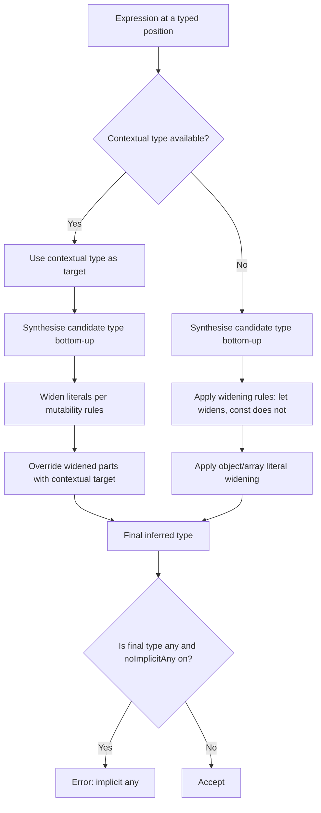

# 2.04 Type Inference and Contextual Typing

> The TypeScript inferencer is the silent co-author of every file you write. It decides, with no annotation in sight, that `let x = "hello"` should be `string`, that `const y = "hello"` should be the literal type `"hello"`, that `[1, 2, 3]` should be `number[]`, and that the parameter of a callback handed to `document.addEventListener("click", e => ...)` should be `MouseEvent`. Two mechanisms make all of this work: **type widening** (the inferencer generalises literal types when it cannot prove immutability) and **contextual typing** (the inferencer narrows an expression by importing the type expected at its position). Mastering both is the difference between writing TypeScript and writing TypeScript that survives contact with the compiler.

## 1. Purpose

A type system has to answer two questions for every binding in the program: *what type does this binding have?* and *what type does this expression need to be?* Static, manifest type systems like Java's answer the first by requiring the programmer to declare the type at every binding (`String x = "hello"`). Pure dynamic systems like JavaScript answer it at runtime, with no static answer at all. TypeScript sits between: it will infer a type whenever it can, only demanding an annotation when inference is genuinely ambiguous or when the annotation carries information the inferencer cannot reconstruct (a function parameter that flows in from a public API, a generic constraint the caller wants to enforce, a union the caller wants to widen).

Inference exists for one practical reason: **less typing, more convenience**. If every local variable needed an annotation, TypeScript would feel like Java, and nobody migrating a JavaScript codebase would tolerate the friction. The inferencer was designed to make the common cases invisible — locals, return types, generic parameters — so that annotations are reserved for places where they actually carry information the reader cannot reconstruct from the surrounding context.

Inference does this well:

- **Local variables.** `const user = { name: "Ada", age: 36 }` infers `{ name: string; age: number }` with no annotation. The inferencer walks the literal, picks the widened type of each property, and assembles an object type.
- **Return types.** `function add(a: number, b: number) { return a + b }` infers `number` as the return type. The inferencer follows each `return` statement, unions the types of the returned expressions, and picks the result.
- **Generic parameters.** `function first<T>(arr: T[]): T { return arr[0] }` called as `first([1, 2, 3])` infers `T = number`. The inferencer matches the call site against the signature, solves for the type variables, and substitutes.
- **Destructuring.** `const { name } = user` infers `name: string` from the type of `user`.
- **Array literals.** `[1, 2, 3]` infers `number[]` (not `[1, 2, 3]` and not `[number, number, number]`).

Inference does *not* do these things well:

- **Object literal property types widen.** `const obj = { count: 0 }` infers `{ count: number }`, not `{ count: 0 }`. The literal `0` is widened to `number` because the property is mutable — you can write `obj.count = 5` later, and the inferencer must respect that. This is the single most common source of "why did TypeScript infer the wrong type" bugs.
- **Tuple types widen to arrays.** `const pair = [1, "two"]` infers `(number | string)[]`, not `[number, string]`. The inferencer cannot tell, from the literal alone, that you intend a fixed-length tuple.
- **Function parameter types are not inferred.** `function double(x) { return x * 2 }` is an error under `noImplicitAny` — the inferencer refuses to guess `number` because the parameter has no information to draw on. (Under contextual typing, *call-site* parameters can be inferred, but *declaration-site* parameters cannot.)
- **Public API signatures drift.** If you write `function parseConfig(cfg) { ... }` and rely on inference for the parameter type, every caller is at the mercy of the implementation. Public API signatures should be explicit so that internal changes do not silently reshape the contract.

Two escape hatches exist precisely because inference gets these things wrong:

- **`as const`** (the const assertion) tells the inferencer: *do not widen anything inside this expression; make every property `readonly` and every primitive a literal type.* `const obj = { count: 0 } as const` produces `{ readonly count: 0 }`. The escape hatch exists because only the programmer knows whether `count` is a value that will mutate or a constant that will not.
- **Contextual typing** tells the inferencer: *before you guess the type of this expression, look at the type expected at its position, and use that as a hint.* When you write `document.addEventListener("click", e => ...)`, the second parameter is contextually typed by `addEventListener`'s signature, the inferencer substitutes `K = "click"`, and concludes `e: MouseEvent`. A function literal in isolation is ambiguous; a function literal at a typed position is not.

The deep purpose of inference, then, is **ergonomics without loss of safety**. The inferencer picks the most permissive type that the surrounding code can prove, widens when mutability makes a literal type a lie, narrows when the expected type makes a wider type a lie, and refuses to guess (under `noImplicitAny`) when neither path produces a defensible answer. Everything else in this note — widening rules, const assertions, contextual typing, the `satisfies` operator — is a refinement of those four behaviours.

By the end of this note you should be able to look at any TypeScript expression and predict its inferred type, explain *why* the inferencer chose that type, choose between `as const`, `satisfies`, and an explicit annotation when the inferencer's default is wrong, and diagnose widening bugs in existing code. You should also be able to explain why `noImplicitAny` and `strict` exist, and why contextual typing is the difference between a callback that compiles and one that does not.

## 2. Theory and Deep Dive

### 2.1 The two directions of inference

TypeScript's inferencer works in two directions, and every widening bug in the wild comes from confusing them.

- **Bottom-up inference** (also called *synthesis*): the inferencer walks the expression, looks at the literal values, and builds a type out of them. `42` synthesises `number` (widened) or `42` (literal, if `const`). `[1, 2, 3]` synthesises `number[]`. `{ name: "Ada" }` synthesises `{ name: string }`. The type flows *up* from the leaves of the expression to its root.
- **Top-down inference** (also called *contextual typing*): the inferencer looks at the *position* the expression sits in, finds the type expected there, and propagates that type *down* into the expression. `["click", "submit"]` assigned to a parameter of type `Array<"click" | "submit">` infers each element as the union, not as `string`. `(e) => e.clientX` passed to a parameter of type `(e: MouseEvent) => void` infers `e: MouseEvent`.

When both directions are available, **contextual typing wins**. The inferencer first computes the synthesised type bottom-up, then overlays the contextual type top-down, and the contextual type overrides anything the synthesised type had widened. This is why the same literal `["click", "submit"]` can be `string[]` in one position and `Array<"click" | "submit">` in another.



The diagram is the entire inferencer in one picture: synthesize, widen, overlay context, refuse implicit `any`. Everything else in this section is a refinement of one of those four boxes.

### 2.2 Type widening: the rules

Widening is the process by which the inferencer replaces a literal type with a broader type at the moment it stores the literal in a mutable location. The rule has a precise formulation:

- A `const` declaration with a literal initializer gets the **literal type**. `const x = "hello"` is `"hello"`, because `const` cannot be reassigned and the literal type is therefore a true description of every value `x` will ever hold.
- A `let` (or `var`) declaration with a literal initializer gets the **widened type**. `let x = "hello"` is `string`, because `let` permits reassignment and the literal type `"hello"` would be a lie the moment you write `x = "world"`.
- A `const` declaration with a *non-primitive* initializer (object, array, function) does *not* freeze the type — it freezes the binding. `const obj = { count: 0 }` is `{ count: number }`, not `{ count: 0 }`, because `const` only prevents reassigning `obj` itself; it does not prevent mutating `obj.count`. The inferencer widens the property type because the property is mutable.

The widening targets are:

| Literal type | Widened type |
|---|---|
| `"hello"` (string literal) | `string` |
| `42` (numeric literal) | `number` |
| `true` / `false` (boolean literal) | `boolean` |
| `null` | `null` (widened to `any` in non-strict mode, kept as `null` in strict mode) |
| `undefined` | `undefined` (widened to `any` in non-strict mode) |
| `1n` (bigint literal) | `bigint` |
| unique `symbol()` | `symbol` |

Notice that widening never reaches `any` for primitives under strict mode. Widening is a one-step generalisation — `"hello"` becomes `string`, not `any` — and the result is always the *most specific* type that can still describe every value the binding could hold after mutation. Widening is also *idempotent*: once widened to `string`, it cannot widen further. This is why `let s = "hello"; s = "world"` compiles.

### 2.3 Object literal widening

Object literals are the most common widening surprise. The rule is:

> Each property of an object literal is widened independently, according to the rules for the value at that property. The object type itself is **not** frozen by `const`.

Concretely:

```typescript
const obj = {
  name: "Ada",
  age: 36,
  active: true,
  roles: ["admin", "user"],
  meta: { created: null },
};

// Inferred type:
// {
//   name: string;
//   age: number;
//   active: boolean;
//   roles: string[];
//   meta: { created: null };
// }
```

Even though `obj` is declared `const`, every property is widened: `"Ada"` becomes `string`, `36` becomes `number`, `true` becomes `boolean`, `["admin", "user"]` becomes `string[]`. The `null` at `meta.created` stays `null` in strict mode (because `null` is its own type under `strictNullChecks`).

The reason this is *correct* behaviour is that the following is legal JavaScript:

```typescript
obj.name = "Grace";
obj.roles.push("superuser");
```

If the inferencer had inferred `name: "Ada"`, the first line would be a type error — and that would be wrong, because there is nothing in the code that prevents the reassignment. The inferencer respects mutability. If you want immutability, you have to ask for it explicitly with `as const` or `readonly`.

### 2.4 Array literal widening and the tuple trap

Array literals infer to `T[]` (or `Array<T>`) where `T` is the union of the element types, widened.

```typescript
const nums = [1, 2, 3];        // number[]
const mixed = [1, "two", true]; // (number | string | boolean)[]
const empty = [];               // any[] (under noImplicitAny: never[] in some contexts)
```

Two traps here.

**Trap one: tuples do not fall out of array literals.** `const pair = [1, "two"]` infers `(number | string)[]`, *not* `[number, string]`. The inferencer cannot tell from the literal alone whether you intend a fixed-length tuple or a growable array. If you want a tuple, you must say so:

```typescript
const pair: [number, string] = [1, "two"];        // explicit annotation
const pair2 = [1, "two"] as const;                // readonly tuple [1, "two"]
const pair3 = [1, "two"] as [number, string];     // mutable tuple via assertion
```

**Trap two: empty arrays infer to `any[]` (or `never[]`).** `const arr = []` is `any[]` by default, and `arr.push(1)` makes it `number[]` *on subsequent lines through control-flow analysis* — but only within the same scope and only in a straight-line pattern. Pass `arr` to a function before pushing anything and it will be `any[]`, defeating the type system. The fix is either to declare the type explicitly (`const arr: number[] = []`) or to use a non-empty literal (`const arr = [initialValue]`).

### 2.5 The const assertion: `as const`

`as const` is the user's override switch for widening. Applied to an expression, it tells the inferencer:

1. **Do not widen any literal.** `"hello"` stays `"hello"`, `0` stays `0`, `true` stays `true`.
2. **Make every property `readonly`.** Object properties become `readonly`; array literals become `readonly` tuples (not `readonly` arrays).
3. **Make every type parameter concrete.** A function `() => T` becomes `() => T` with `T` fixed; an empty array `[]` becomes `readonly []`.

Concretely:

```typescript
const obj = { count: 0, label: "counter" } as const;
// Inferred type:
// { readonly count: 0; readonly label: "counter" }

const arr = [1, 2, 3] as const;
// Inferred type: readonly [1, 2, 3]

const pair = [1, "two"] as const;
// Inferred type: readonly [1, "two"]
```

The `as const` assertion is *not* a runtime operation. It compiles away. It is purely a hint to the inferencer. The emitted JavaScript is identical to the version without `as const`. (Compare with `Object.freeze`, which *does* affect runtime behaviour but only shallowly.)

`as const` can be applied to a single literal too, which is occasionally useful:

```typescript
const x = "hello" as const;     // "hello"  (same as const x = "hello")
const y = 42 as const;          // 42
let z = "hello" as const;       // "hello" — and now z cannot be reassigned to "world"
```

The last case is interesting: `let z = "hello" as const` makes `z` have type `"hello"`, and then `z = "world"` is a type error even though `z` is `let`. The assertion overrides the widening that `let` would normally apply. This is occasionally useful and occasionally a bug.

### 2.6 Contextual typing: when the expected type flows in

Contextual typing is the second great mechanism of the inferencer, and it is the answer to the question "how does TypeScript know what type `e` is in `(e) => e.clientX`?"

The rule is:

> If an expression appears at a position where a type is expected (a function parameter that has a declared type, a variable being assigned to a typed binding, a return value of a function with a declared return type, an argument to a function with a typed parameter), the inferencer uses that expected type to narrow the types of unannotated subexpressions.

Concretely, contextual typing kicks in for:

- **Function parameters in callbacks.** `[1, 2, 3].map(x => x * 2)` — `x` is contextually typed as `number` by `Array.prototype.map`'s signature.
- **Function expressions assigned to typed variables.** `const fn: (e: MouseEvent) => void = e => { ... }` — `e` is contextually typed as `MouseEvent`.
- **Object literals assigned to typed bindings.** `const cfg: Config = { mode: "production" }` — `"production"` is contextually typed as the literal union `"production" | "development"` if that is what `Config.mode` is.
- **Array literals assigned to typed bindings.** `const events: ("click" | "submit")[] = ["click", "submit"]` — each element is contextually typed as the union.
- **Discriminated union narrowing.** `const action: { type: "add"; payload: number } | { type: "clear" } = { type: "add", payload: 5 }` — the literal `"add"` selects the union arm and the object shape is checked against it.
- **`switch` cases.** `switch (action.type) { case "add": ... }` — the case label is contextually typed by `action.type`.

Contextual typing has limits. It does *not* flow through `any`, through untyped function parameters, through `as` assertions to a wider type, or through `unknown`. Once the inferencer hits `any`, it loses all contextual information and the rest of the expression is on its own.

A canonical example:

```typescript
// Documented signature:
// addEventListener<K extends keyof DocumentEventMap>(
//   type: K,
//   listener: (this: Document, ev: DocumentEventMap[K]) => any,
// ): void;

document.addEventListener("click", e => {
  // e: MouseEvent — contextually typed from DocumentEventMap["click"]
  console.log(e.clientX, e.clientY);
});

document.addEventListener("submit", e => {
  // e: SubmitEvent
  e.preventDefault();
});
```

The same listener lambda, written in isolation with no call site, would have `e: any` (or, under `noImplicitAny`, an error). The call site provides the context, and the inferencer uses it.

### 2.7 The `noImplicitAny` flag

`noImplicitAny` is the single most important TypeScript configuration flag for inference. Without it, the inferencer will silently infer `any` whenever it cannot determine a type — untyped function parameters, untyped `catch` clause variables (pre-TS 4.4), untyped destructured properties of `any`-typed objects, and so on. The result is a TypeScript codebase that *looks* typed but is, in the holes, JavaScript.

With `noImplicitAny` enabled, every position that would have inferred `any` becomes an error:

```typescript
// noImplicitAny: false — compiles, x is any
function double(x) { return x * 2; }

// noImplicitAny: true — error: Parameter 'x' implicitly has an 'any' type.
function double(x) { return x * 2; }
```

The fix is either to annotate (`function double(x: number) { ... }`) or to explicitly opt in (`function double(x: any) { ... }`). The latter is now a deliberate choice, visible in code review, rather than an accidental gap.

`noImplicitAny` is included in `strict`. There is no good reason to disable it on a new project; the only projects that do are mid-migration legacy codebases where the volume of `any` inference errors is too large to fix at once.

### 2.8 The `strict` flag

`strict` is a meta-flag that enables a bundle of strictness options. As of TypeScript 5.x it enables:

- `noImplicitAny` (covered above)
- `noImplicitThis` — errors when `this` is implicitly `any` (in non-strict, a function called with no receiver has `this: any`).
- `strictNullChecks` — `null` and `undefined` are no longer assignable to every other type. Without this, `string` includes `null` and `undefined`, defeating the point of the type system.
- `strictFunctionTypes` — function parameter types are checked *contravariantly* (correctly) instead of *bivariantly* (permissively). Without this, a function that accepts `Animal` can be assigned where a function that accepts `Dog` is expected, which is unsound.
- `strictBindCallApply` — `bind`, `call`, and `apply` are checked against the function's actual parameter types.
- `strictPropertyInitialization` — class properties must be initialised in the constructor or marked with a definite assignment assertion (`!`).
- `alwaysStrict` — emits `"use strict"` and compiles in strict mode.
- `useUnknownInCatchVariables` — `catch` clause variables are `unknown` instead of `any`.

Every one of these affects inference. `strictNullChecks` widens `null` and `undefined` to their own types instead of `any`. `strictFunctionTypes` changes how the inferencer picks the type of a callback parameter. `useUnknownInCatchVariables` changes the type of `e` in `catch (e)`.

The recommendation is unambiguous: **enable `strict: true` in every new project**. The TSConfig Deep Dive note covers each flag in detail; for this note, the takeaway is that `strict` is the inferencer's contract with you — *I will not silently let `any` through, I will not silently let `null` through, and I will check function types the way the type theory says they should be checked.*

### 2.9 The inferencing algorithm, end to end

Putting it all together, the algorithm the inferencer follows for `const x = expr` or `let x = expr`:

1. **Synthesize the candidate type** of `expr` bottom-up. For a literal, the candidate is the literal type. For an object literal, an object type with one property per key, each typed by the synthesised candidate of its value. For an array literal, `T[]` where `T` is the union of the element candidates.
2. **Widen the candidate** if the binding is `let`/`var`, or if the candidate is a non-primitive literal in a `const` binding. Literal primitives in `const` bindings are *not* widened.
3. **Overlay the contextual type** if there is one. The contextual type overrides widened parts but does not loosen narrowed parts. `const x: "hello" = "hello"` keeps `x` as `"hello"`; `const x: string = "hello"` widens to `string`.
4. **Check for `as const`**. If present, skip widening — every literal stays literal, every property is `readonly`, every array becomes a readonly tuple.
5. **Check for `as T`**. If present, replace the inferred type with `T` (after checking plausibility — `as` allows narrowing and widening but not unrelated types without going through `unknown`).
6. **Check for `satisfies T`**. If present, keep the inferred type (do not widen to `T`) but verify it is assignable to `T`.
7. **Apply `noImplicitAny`**. If the final type is `any` and `noImplicitAny` is on, error — unless the `any` is explicitly written.
8. **Apply `strictNullChecks`**. If the final type contains `null` or `undefined` and they are not in the declared contextual type, error.

Steps 4, 5, and 6 are the three escape hatches. `as const` widens *less* than the default. `as T` *replaces* the inferred type. `satisfies T` *keeps* the inferred type but *checks* it against `T`. The three are not interchangeable.

### 2.10 The widening of `null` and `undefined`

A frequently missed detail: `null` and `undefined` widen differently under `strictNullChecks`.

Under `strictNullChecks` (the strict-mode behaviour):

- `const n = null` infers `null` (literal type, because `const`).
- `let n = null` infers `null` (still `null`, because there is no wider type to widen to — `null` is its own type under strict null checks).
- `const u = undefined` infers `undefined`.
- `let u = undefined` infers `undefined`.

Without `strictNullChecks`:

- `const n = null` infers `any` (because `null` is treated as a sub-type of every type, and the inferencer widens to `any` as the "common supertype" — which is wrong, but historically what TS did).
- `let n = null` infers `any`.
- `const u = undefined` infers `any`.
- `let u = undefined` infers `any`.

This is one of the reasons `strictNullChecks` is so important: it changes `null` and `undefined` from being silent `any`-holes into being their own types. Without it, `let x = null` is just `any` with a default value, and the entire type system downstream is broken.

### 2.11 Literal numeric and string unions, and `as const` for string-union constants

A common pattern is to define a set of string constants and use them as a union type:

```typescript
const statusDraft = "draft";
const statusPublished = "published";
const statusArchived = "archived";

type Status = typeof statusDraft | typeof statusPublished | typeof statusArchived;
// Without `as const` on each constant: Status is `string`.
// With `as const` (or with `const`): Status is "draft" | "published" | "archived".
```

Because each constant is declared `const`, the literal type is preserved (no widening for `const` primitives). So `typeof statusDraft` is `"draft"`, not `string`. The union `Status` is therefore the literal union.

But: if you put the constants in an *object*, the object's properties widen:

```typescript
const STATUSES = {
  draft: "draft",
  published: "published",
  archived: "archived",
};
// typeof STATUSES.draft is `string`, not `"draft"` — object property widening.

type Status = typeof STATUSES[keyof typeof STATUSES];
// Without `as const`: `string`.
// With `as const`: "draft" | "published" | "archived".
```

This is the canonical reason `as const` exists for string-union constants: object properties always widen, and `as const` is the only way to keep them literal.

### 2.12 `satisfies` (TypeScript 4.9+)

`satisfies` is the most recent of the three escape hatches, and it answers a question that `as const` and `as T` could not: *how do I check that an expression conforms to a type without widening the expression to that type?*

Before `satisfies`, you had two bad choices:

```typescript
type RouteConfig = Record<string, { path: string; auth: boolean }>;

// Bad choice 1: annotate — widens each route's `path` to `string`, losing literal types.
const routes: RouteConfig = {
  home: { path: "/", auth: false },
  dashboard: { path: "/dashboard", auth: true },
};
// typeof routes.home.path is `string`, not `"/"`.

// Bad choice 2: `as const` then assert — keeps literal types but does not check the shape.
const routes = {
  home: { path: "/", auth: false },
  dashboard: { path: "/dashboard", auth: true },
} as const;
// No error if you forget `auth` on a route. Shape is unchecked.
```

With `satisfies`:

```typescript
const routes = {
  home: { path: "/", auth: false },
  dashboard: { path: "/dashboard", auth: true },
} satisfies RouteConfig;
// typeof routes.home.path is `"/"`, not `string`. Shape is checked.
// If you forget `auth` on a route, error.
```

`satisfies` keeps the *narrower* of the inferred type and the constraint. It is the right tool when you want both *checking* and *precision*. Section 7 covers the rule of thumb: **use `as const` to freeze, use `satisfies` to check, use `as T` to override**.

### 2.13 Generic inference

When a generic function is called, the inferencer solves for the type parameters from the arguments. The algorithm is a unification:

1. Look at the function's signature, find the type parameters (`<T>`, `<T, U>`, etc.).
2. For each call-site argument, match its type against the corresponding parameter type, collecting substitutions for each type parameter.
3. If a type parameter appears in multiple positions, the substitutions must agree (or be unioned, depending on the variance).
4. If a type parameter cannot be solved (no argument gives it a type), it falls back to its constraint, or to `unknown`, or to `noImplicitAny`'s error.

Example:

```typescript
function map<T, U>(arr: T[], fn: (x: T) => U): U[] {
  return arr.map(fn);
}

map([1, 2, 3], x => x.toString());
// T is inferred from [1, 2, 3] : number[]  ->  T = number
// U is inferred from the return type of x => x.toString()
//   - x is contextually typed as number (from T)
//   - x.toString() returns string
//   - U = string
// Result type: string[]
```

Notice that *contextual typing* makes generic inference work: `x` is contextually typed as `T`, which has been solved from the first argument, and then `U` is solved from the *return type* of the callback. The two type parameters are not inferred independently; they are inferred in a specific order, with the second depending on the first.

This is also why inference sometimes picks the wrong type:

```typescript
function first<T>(arr: T[]): T { return arr[0]; }

const x = first([1, 2, 3]);   // x: number — correct
const y = first([]);          // y: never — T cannot be solved, defaults to never
const z = first([1, "two"]);  // z: number | string — T is unioned
```

Empty arrays infer `never[]` for `T[]` because there are no elements to union. Mixed-type arrays infer the union. Both can be wrong; both require explicit type arguments (`first<number>([])`) or annotations to fix.

### 2.14 Control-flow based type analysis

A final piece of the inferencer: it tracks types through control flow. After a type guard (`typeof x === "string"`), a narrowing assertion (`x as string`), an `instanceof` check, a falsiness check (`if (x)`), or a discriminant check (`if (obj.kind === "circle")`), the inferencer narrows the type of the variable *within that branch*.

This is not strictly inference — it is *narrowing* — but it shares the same inferencer machinery. The narrowed type is the inferred type *at this point in the code*, and it can be different from the declared type. The Type Assertions and Guards note covers this in depth; here, the relevant point is that **the inferred type of a variable is a function of its position in the code**, not just its declaration.

## 3. Mental Models

Five mental models cover the inferencer. Memorise them and most inference questions answer themselves.

### 3.1 Widening = "the compiler generalises literal types when storing in a mutable location"

The inferencer's first instinct is to widen. A literal `0` is *technically* a `number`; `"hello"` is technically a `string`. The inferencer widens unless it can prove the binding cannot change. `const` is the only proof it accepts for primitives; for objects and arrays, no proof short of `as const` or `readonly` is enough.

### 3.2 `as const` = "freeze everything: make it readonly and literal"

`as const` is a one-shot flag you can put on any expression. It says: from this point down, treat every literal as its literal type, every property as `readonly`, every array as a tuple. It is a *deep* operation — it applies to the whole expression tree, not just the top level. There is no shallow version.

### 3.3 Contextual typing = "the expected type flows into the expression"

When you write an expression at a position where a type is expected, the inferencer uses that type to fill in the blanks. A lambda's untyped parameter, an object literal's properties, an array literal's elements — all can be filled in by the contextual type. The direction of flow is *downward*: from the position into the expression.

### 3.4 Inference = "the compiler guesses; annotations override"

The inferencer is *guessing* when it widens, when it picks `T[]` over a tuple, when it picks `number` over `42`. The guesses are conservative and correct for the common case, but they are guesses. When you know better — when you want a tuple, when you want a literal, when you want a narrower type — you override with an annotation, an `as const`, an `as T`, or a `satisfies T`.

### 3.5 Bottom-up synthesis + top-down context = the final type

Every inferred type is the result of two passes: a bottom-up pass that builds a candidate from the literal values, and a top-down pass that overlays the contextual type. The two passes meet in the middle. Where they disagree, the contextual type wins (for narrowing) and the synthesised type wins (for widening — the contextual type cannot make a `let`-typed variable into a literal type unless it is also `as const`).

## 4. Real-World Use Cases

### 4.1 Typed configuration objects with `as const`

The most common real-world use of `as const` is configuration objects. A typical app has a top-level config — feature flags, environment endpoints, route tables — that is conceptually a constant but written as an object literal. Without `as const`, every property widens and you lose the ability to use the literal values in type positions.

```typescript
const config = {
  env: "production",
  port: 8080,
  features: ["auth", "billing"] as const,
  endpoints: {
    api: "https://api.example.com",
    cdn: "https://cdn.example.com",
  },
} as const;

type Env = typeof config.env;               // "production"
type Feature = typeof config.features[number]; // "auth" | "billing"
type Endpoint = keyof typeof config.endpoints; // "api" | "cdN"
```

Without `as const`, `Env` would be `string`, `Feature` would be `string`, and the type-level information would be lost.

### 4.2 Array element type inference

The single most-used piece of inference in everyday TypeScript is the inference of `T[]` from an array literal. It is what makes `const users = [{ name: "Ada" }, { name: "Grace" }]` useful — `users` is `{ name: string }[]`, and `users[0].name` is `string`, all with zero annotations.

The flip side is the empty-array trap. `const users = []` is `any[]` (or `never[]` under strict). The fix is either to annotate (`const users: User[] = []`) or to use a non-empty literal where possible.

### 4.3 Reducer state inference from initial state

In a Redux or `useReducer` setup, the state type is often inferred from the initial state:

```typescript
const initialState = {
  count: 0,
  items: [] as string[],
  status: "idle" as "idle" | "loading" | "success" | "error",
};

type State = typeof initialState;
// { count: number; items: string[]; status: "idle" | "loading" | "success" | "error" }
```

Notice the `as` on `status` — without it, `status` would widen to `string`. The `as const`-free alternative is to declare a `type Status = ...` first and annotate, but the inline `as` is a common pattern for one-off unions.

### 4.4 Contextual typing of event handlers

DOM and Node event handlers are the canonical contextual typing example. `document.addEventListener`, `process.on`, `EventTarget.addEventListener`, React's `onClick`, and similar all contextually type their callback's event parameter.

```typescript
document.addEventListener("click", e => {
  // e: MouseEvent
  e.currentTarget;  // Element
});

process.on("exit", code => {
  // code: number
});

// React
<button onClick={e => {
  // e: React.MouseEvent<HTMLButtonElement>
  e.preventDefault();
}}>Click</button>
```

Without contextual typing, every callback would need an explicit parameter annotation — `function(e: MouseEvent) { ... }` — and the resulting noise would dwarf the body of the handler.

### 4.5 Generic function inference

The entire ecosystem of `map`, `filter`, `reduce`, `Promise.then`, `Array.from`, `useSelector`, `useMemo`, and similar is built on generic inference. Each is a generic function whose type parameters are solved from the call-site arguments. Without inference, every call would need explicit type arguments: `users.map<User>(u => u.name)` instead of `users.map(u => u.name)`.

### 4.6 Discriminated union narrowing via contextual typing

When a function's return type is a discriminated union, contextual typing narrows the union inside the body:

```typescript
type Result<T, E> =
  | { ok: true; value: T }
  | { ok: false; error: E };

function wrap<T, E>(fn: () => T, error: E): Result<T, E> {
  try {
    const value = fn();
    return { ok: true, value };  // contextual type narrows to the ok-arm
  } catch (e) {
    return { ok: false, error }; // contextual type narrows to the error-arm
  }
}
```

The `return` statement's expression is contextually typed by `Result<T, E>`. The inferencer matches the object literal against the union, picks the arm whose discriminant matches (`ok: true`), and checks the literal against *that* arm. This is why the `value` field is required in the first return and the `error` field in the second.

### 4.7 Tuple inference for fixed-arity APIs

Some APIs need tuples. The inferencer will not infer a tuple from a literal; you must ask for it. The cleanest way is `as const`:

```typescript
const pairs = Object.entries({ a: 1, b: 2 });
// pairs: [string, number][]  — entries() is declared to return tuples

const manual = [["a", 1], ["b", 2]] as const;
// manual: readonly [readonly ["a", 1], readonly ["b", 2]]
```

The first case works because `Object.entries` is declared to return `[string, T][]` and the contextual type flows in. The second uses `as const`.

### 4.8 Inferring from `satisfies` for type-safe registries

A registry pattern — a map from string keys to typed values — benefits enormously from `satisfies`:

```typescript
type Handler = (req: Request) => Response;

const handlers = {
  health: (req) => new Response("ok"),
  echo: (req) => new Response(req.body),
  fallback: (req) => new Response("not found", { status: 404 }),
} satisfies Record<string, Handler>;

// typeof handlers.health is (req: Request) => Response — kept precise.
// Shape is checked: every value must be a Handler.
```

Without `satisfies`, either you annotate (widening every function to `Handler`, losing the per-handler inference) or you skip the check (allowing any value in the map). `satisfies` gives you both.

## 5. Code Examples

### 5.1 Example A — Minimal and Conceptual

Three side-by-side comparisons cover the three core mechanisms: widening, `as const`, and contextual typing.

**JavaScript (no types, runtime only):**

```javascript
// Widening is invisible in JavaScript — there is no static type to widen.
let s = "hello";
s = "world";  // fine, s is just a string

const obj = { count: 0 };
obj.count = 5;  // fine, obj is mutable

const arr = [1, 2, 3];
arr.push(4);  // fine, arr grows

document.addEventListener("click", e => {
  console.log(e.clientX);  // e is whatever addEventListener passes
});
```

**TypeScript (inference visible in the hover):**

```typescript
// Widening: let widens, const does not (for primitives).
let s = "hello";       // let s: string
s = "world";           // OK — s is string

const c = "hello";     // const c: "hello"
// c = "world";        // Error: Type '"world"' is not assignable to type '"hello"'.

// Object literal widening: const does not freeze property types.
const obj = { count: 0 };   // const obj: { count: number }
obj.count = 5;              // OK — count is number

// as const: freeze everything.
const objFrozen = { count: 0 } as const;  // { readonly count: 0 }
// objFrozen.count = 5;                   // Error: cannot assign to readonly.
// objFrozen = { count: 6 };              // Error: cannot reassign const.

// Array literal widening: tuples do not fall out.
const arr = [1, 2, 3];           // number[]
const tuple = [1, 2, 3] as const; // readonly [1, 2, 3]

// Contextual typing: the call site determines e's type.
document.addEventListener("click", e => {
  // e: MouseEvent — contextually typed.
  console.log(e.clientX);   // OK
  // console.log(e.foo);    // Error: foo is not on MouseEvent.
});
```

A second minimal example showing literal union preservation:

**JavaScript:**

```javascript
const STATUS = { draft: "draft", published: "published" };
function handle(status) {
  if (status === STATUS.draft) { /* ... */ }
  if (status === "archived") { /* ... */ } // typo, no error in JS
}
```

**TypeScript:**

```typescript
const STATUS = {
  draft: "draft",
  published: "published",
} as const;

type Status = typeof STATUS[keyof typeof STATUS]; // "draft" | "published"

function handle(status: Status) {
  if (status === STATUS.draft) { /* ... */ }   // OK
  // if (status === "archived") { /* ... */ }  // Error: "archived" is not in Status
}
```

A third minimal example, on `noImplicitAny`:

**JavaScript:**

```javascript
function double(x) { return x * 2; }  // x is whatever; runtime decides.
double("hello");  // NaN, no static error.
```

**TypeScript with `noImplicitAny: false`:**

```typescript
function double(x) { return x * 2; }  // x: any (implicit). Compiles.
double("hello");  // NaN at runtime, no static error.
```

**TypeScript with `noImplicitAny: true`:**

```typescript
function double(x) { return x * 2; }  // Error: Parameter 'x' implicitly has an 'any' type.
function doubleFixed(x: number) { return x * 2; }  // OK
// doubleFixed("hello");  // Error: "hello" is not assignable to number.
```

The same JavaScript source compiles silently under `noImplicitAny: false` and fails under `true` — and the failure is what forces the parameter type to be made explicit.

### 5.2 Example B — Production-Grade

A production-grade configuration system demonstrating `as const`, `satisfies`, contextual typing, and generic inference.

**JavaScript:**

```javascript
// Feature flag configuration with defaults and runtime validation.
const FEATURES = {
  newDashboard: { enabled: true, rollout: 1.0 },
  legacyAuth: { enabled: false, rollout: 0 },
  experiments: { enabled: true, rollout: 0.1 },
};

function isEnabled(name) {
  const feature = FEATURES[name];
  if (!feature) throw new Error("Unknown feature: " + name);
  return feature.enabled && Math.random() < feature.rollout;
}

// A map of event handlers, registered by name.
const handlers = {
  click: (e) => console.log("clicked", e.clientX),
  submit: (e) => console.log("submitted", e.target),
};

Object.entries(handlers).forEach(([name, handler]) => {
  document.addEventListener(name, handler);
});

// A generic map/filter/reduce pipeline.
function pipeline(items, fns) {
  return fns.reduce((acc, fn) => fn(acc), items);
}

const result = pipeline(
  [1, 2, 3, 4, 5],
  [
    (xs) => xs.map((x) => x * 2),
    (xs) => xs.filter((x) => x > 4),
    (xs) => xs.reduce((a, b) => a + b, 0),
  ]
);
console.log(result); // 24
```

**TypeScript:**

```typescript
// Feature flag configuration with literal types preserved.
const FEATURES = {
  newDashboard: { enabled: true, rollout: 1.0 },
  legacyAuth: { enabled: false, rollout: 0 },
  experiments: { enabled: true, rollout: 0.1 },
} as const;

type FeatureName = keyof typeof FEATURES; // "newDashboard" | "legacyAuth" | "experiments"
type FeatureConfig = typeof FEATURES[FeatureName];

function isEnabled(name: FeatureName): boolean {
  const feature: FeatureConfig = FEATURES[name];
  return feature.enabled && Math.random() < feature.rollout;
}

// isEnabled("unknown");    // Error: "unknown" is not a FeatureName.
isEnabled("newDashboard");  // OK

// Handlers map validated against a type, with per-handler inference kept.
type HandlerMap = Record<string, (e: Event) => void>;

const handlers = {
  click: (e) => console.log("clicked", e.clientX),       // e: MouseEvent
  submit: (e) => console.log("submitted", e.target),     // e: SubmitEvent
  keydown: (e) => console.log("key", e.key),             // e: KeyboardEvent
} satisfies HandlerMap;

// Why `satisfies` and not an annotation? With annotation, each handler's
// `e` would be widened to `Event`, losing the discriminant. With `satisfies`,
// each handler keeps its precise parameter type — proven by the body compiles
// against `MouseEvent`, `SubmitEvent`, `KeyboardEvent` respectively.

Object.entries(handlers).forEach(([name, handler]) => {
  // name: string, handler: (e: Event) => void
  document.addEventListener(name, handler);
});

// Generic pipeline with multi-step type inference.
function pipeline<T>(items: T, fns: Array<(input: T) => T>): T {
  return fns.reduce((acc, fn) => fn(acc), items);
}

const result = pipeline(
  [1, 2, 3, 4, 5] as readonly number[],
  [
    (xs) => xs.map((x) => x * 2),    // (xs: readonly number[]) => number[]
    (xs) => xs.filter((x) => x > 4), // (xs: number[]) => number[]
    (xs) => xs.reduce((a, b) => a + b, 0), // (xs: number[]) => number
  ]
);
// T is inferred as `number` (from the reduce's return type). The intermediate
// types are checked at each step. If you swap two functions, the type system
// catches the mismatch — the inference is not just decorative.

console.log(result); // 24

// A `satisfies`-driven route table.
type Route =
  | { method: "GET"; path: string; handler: (req: Request) => Response }
  | { method: "POST"; path: string; handler: (req: Request) => Response };

const routes = [
  { method: "GET", path: "/health", handler: () => new Response("ok") },
  { method: "POST", path: "/echo", handler: (req) => new Response(req.body) },
  // { method: "DELETE", path: "/x", handler: () => new Response("ok") }, // Error: "DELETE" is not in the union.
] satisfies Route[];

// typeof routes is the narrow inferred type — each method is its literal, not `string`.
// The shape is checked against `Route[]`.
```

The two examples together cover the full surface: widening, `as const`, `satisfies`, contextual typing of callbacks, generic inference of pipelines, and the union of all three escape hatches in the route table.

## 6. Common Mistakes and Anti-Patterns

### 6.1 `let x = "hello"` widens to `string`

```typescript
let status = "draft";
// Later:
if (status === "draft") { /* ... */ }
if (status === "pubished") { /* ... */ } // typo, no error — status is string
```

The fix is `const`, or an explicit annotation, or `as const`:

```typescript
const status = "draft";        // "draft" — typo would be caught
let status2: "draft" | "published" = "draft";
```

### 6.2 Object literal property widening

```typescript
const obj = { count: 0 };
// typeof obj.count is `number`, not `0`.

function takesZero(n: 0) { /* ... */ }
takesZero(obj.count);  // Error: number is not assignable to 0.
```

The fix is `as const` or an explicit type:

```typescript
const obj = { count: 0 } as const;  // { readonly count: 0 }
takesZero(obj.count);               // OK
```

### 6.3 Tuple widening: `[1, 2]` is `number[]`, not `[number, number]`

```typescript
const pair = [1, 2];
function takesTuple(t: [number, number]) { /* ... */ }
takesTuple(pair);  // Error: number[] is not assignable to [number, number].
```

The fix is an explicit annotation, `as const` (for readonly tuples), or `as [number, number]`:

```typescript
const pair: [number, number] = [1, 2];
const pair2 = [1, 2] as const;            // readonly [1, 2]
const pair3 = [1, 2] as [number, number];
```

### 6.4 Forgetting `as const` on string-union constants

```typescript
const STATUSES = {
  draft: "draft",
  published: "published",
};
type Status = typeof STATUSES[keyof typeof STATUSES]; // string — wrong!
```

Without `as const`, each property widens to `string`, and the union is `string`. The fix is `as const`:

```typescript
const STATUSES = { draft: "draft", published: "published" } as const;
type Status = typeof STATUSES[keyof typeof STATUSES]; // "draft" | "published"
```

### 6.5 Contextual typing not flowing through `any`

```typescript
declare function onEvent(name: string, cb: (e: any) => void): void;

onEvent("click", e => {
  // e: any — contextual typing gives `any` because that is what the signature says.
  e.foo.bar.baz;  // no error, even though it is nonsense.
});
```

The signature is the problem. The fix is to type the callback correctly:

```typescript
declare function onEvent(name: "click", cb: (e: MouseEvent) => void): void;
onEvent("click", e => { e.clientX; });  // OK
```

### 6.6 Inferring `any[]` from empty array

```typescript
const arr = [];
arr.push(1);
arr.push("two");
// arr is `(number | string)[]` in subsequent lines, but at the point of declaration it was `any[]`.
function takesNumbers(xs: number[]) { /* ... */ }
takesNumbers(arr);  // OK at compile time, but arr contains "two" at runtime.
```

The fix is to annotate the empty array:

```typescript
const arr: number[] = [];
arr.push(1);
// arr.push("two");  // Error
```

### 6.7 Using `as T` where `satisfies T` is correct

```typescript
type Config = { port: number; host: string };

const config = {
  port: 8080,
  host: "localhost",
  debug: true,  // extra property
} as Config;    //widens to Config — `debug` is now invisible at the type level.

// console.log(config.debug);  // Error — `debug` is not on Config.
```

The fix is `satisfies`:

```typescript
const config = {
  port: 8080,
  host: "localhost",
  debug: true,
} satisfies Config;
// config.debug is still `boolean` — the narrow type is preserved.
// config.port is `number` — wider than the literal 8080, but assignable to Config.
```

### 6.8 Forgetting that `as const` is deep

```typescript
const arr = [{ x: 1 }, { x: 2 }] as const;
// arr is `readonly [{ readonly x: 1 }, { readonly x: 2 }]`.
// arr[0].x = 5;  // Error — readonly.
// arr.push({ x: 3 });  // Error — readonly tuple, no push method.
```

`as const` is *deep*. If you only want the outer layer frozen, you need a different approach — explicit `readonly` modifiers, or a typed annotation that leaves the inner objects mutable.

### 6.9 Assuming `Object.freeze` and `as const` are the same

```typescript
const obj = Object.freeze({ count: 0 });
// Runtime: Object.isFrozen(obj) is true; obj.count = 5 fails silently in strict mode.
// Type: `{ count: number }` — NOT `{ readonly count: 0 }`.

const obj2 = { count: 0 } as const;
// Runtime: Object.isFrozen(obj2) is false — `as const` is compile-time only.
// Type: `{ readonly count: 0 }`.
```

`Object.freeze` is a runtime operation; `as const` is a compile-time hint. They are independent. If you want both — frozen at runtime *and* narrow types — use both.

### 6.10 Expecting inference on public API signatures

```typescript
function parseConfig(cfg) {  // noImplicitAny error
  return { ...cfg, parsed: true };
}
```

Function parameters at the declaration site are *not* inferred. The inferencer refuses to guess because the call site is unknown. The fix is to annotate:

```typescript
interface Config { /* ... */ }
function parseConfig(cfg: Config): Config & { parsed: true } {
  return { ...cfg, parsed: true };
}
```

### 6.11 Confusing `as` with type checking

```typescript
const x = "hello" as number;  // Error in strict mode — `as` requires plausibility.
const y = "hello" as unknown as number;  // Compiles — double assertion bypasses the check.
```

`as` is an assertion, not a check. The inferencer catches obvious lies but not deliberate ones (`as unknown as T`). Use `as` only when you can prove the assertion is correct at runtime; otherwise use a type guard.

## 7. Best Practices and Design Patterns

### 7.1 Use `as const` for literal-type configs

Any time you want the literal values of a literal to be visible at the type level — string-union constants, route tables, event name registries, enum-like objects — reach for `as const`. The default (widening) is wrong for these cases.

### 7.2 Annotate function signatures explicitly; do not rely on inference for public APIs

Public API signatures are contracts. They should be explicit, named, and stable across internal changes. The rule of thumb: *inference for locals, annotations for exports*. Anything declared `export` should have an explicit signature.

### 7.3 Use `satisfies` to check a type without widening

When you want both the narrow inferred type *and* a check that the type conforms to a constraint, use `satisfies`. It is the right tool whenever you find yourself writing `as T` and immediately regretting the widening.

### 7.4 Enable `strict: true` in every new project

There is no good reason to disable `strict` on a new project. Every flag it enables (`noImplicitAny`, `strictNullChecks`, `strictFunctionTypes`, etc.) fixes a class of bugs that is painful to retrofit later. The TSConfig Deep Dive note covers each in detail.

### 7.5 Use explicit generics when inference picks the wrong type

When the inferencer picks `never` (empty array), `any` (untyped parameter), or the wrong union (mixed-type array), supply the type argument explicitly:

```typescript
first<number>([])              // T = number, not never
Array.from<number>([], () => 0) // explicit element type
useState<string | null>(null)  // React hook with explicit union
```

### 7.6 Prefer `const` over `let` to keep literal types

If you do not need to reassign, use `const`. The literal type is preserved for primitives.

### 7.7 Prefer `readonly` arrays and tuples for constants

```typescript
const nums: readonly number[] = [1, 2, 3];
const pair: readonly [number, string] = [1, "two"];
```

`readonly` arrays are subtype-correct (a `number[]` is a `readonly number[]`, but not vice versa) and they communicate intent. Use them for any collection that should not be mutated.

### 7.8 Use `as const` on switch case labels when they must match a literal union

```typescript
type Action = { type: "add"; payload: number } | { type: "clear" };

function reducer(state: number[], action: Action): number[] {
  switch (action.type) {
    case "add" as const:    // explicit, though usually inferred from the union
      return [...state, action.payload];
    case "clear":
      return [];
  }
}
```

In practice the `as const` is redundant here, but it is occasionally useful in complex switches where the inferencer would otherwise widen.

### 7.9 Avoid `as any`; use `as unknown as T` if you must bypass

`as any` is a sledgehammer — it disables all type checking downstream. `as unknown as T` is more honest: it acknowledges that you are forcing the type, and the resulting value still has type `T`, not `any`. Use it sparingly.

### 7.10 Use `satisfies` with `Record<K, V>` for type-safe maps

```typescript
const handlers = { /* ... */ } satisfies Record<string, Handler>;
```

This pattern checks that every value is a `Handler` while preserving the specific keys and value types. It is the right replacement for the older `Record<K, V>` annotation pattern.

### 7.11 Annotate return types of recursive functions

The inferencer struggles with recursive functions whose return type depends on the recursive call. Annotate the return type explicitly:

```typescript
function flatten<T>(xs: Array<T | T[]>): T[] {
  return xs.flatMap(x => Array.isArray(x) ? flatten(x) : [x]);
}
```

Without the `T[]` annotation, the inferencer may give up or pick an overly wide type.

### 7.12 Use `const` assertions on `catch` variables

Under `useUnknownInCatchVariables`, `catch (e)` makes `e: unknown`. Use type guards to narrow:

```typescript
try { /* ... */ } catch (e) {
  if (e instanceof Error) {
    console.log(e.message);
  } else {
    console.log(String(e));
  }
}
```

### 7.13 Use `infer` in conditional types for type-level inference

The `infer` keyword extends the inferencer into type-level programming, covered in detail in the Generics and Constraints note. It is the type-level counterpart of the value-level inference this note covers.

```typescript
type ReturnTypeOf<T> = T extends (...args: any[]) => infer R ? R : never;
```

## 8. Technical Interview Knowledge

### 8.1 What is type widening?

Type widening is the process by which the TypeScript inferencer replaces a literal type with a broader type when storing the literal in a mutable location. `let x = "hello"` infers `string` (widened from `"hello"`) because `let` permits reassignment. `const x = "hello"` infers `"hello"` (not widened) because `const` does not. Object literal properties widen even under `const`, because the property is mutable even if the binding is not. The widened type is always the *most specific* type that can describe every value the binding could hold — `"hello"` widens to `string`, never to `any` (under strict mode).

### 8.2 What does `as const` do?

`as const` is a compile-time assertion that tells the inferencer to (1) not widen any literal type, (2) make every property `readonly`, and (3) make every array literal a readonly tuple. It is *deep* — it applies to the entire expression tree. It compiles away to nothing at runtime; the emitted JavaScript is identical. It is the user's override switch for widening, used when the inferencer's default (widening) would lose information the programmer needs at the type level.

### 8.3 What is contextual typing?

Contextual typing is the mechanism by which the inferencer uses the type expected at an expression's position to fill in the types of unannotated subexpressions. The classic example is a callback's parameter: `document.addEventListener("click", e => ...)` contextually types `e` as `MouseEvent` because `addEventListener`'s signature says so. Contextual typing flows *downward* from the position into the expression, and it *overrides* widening — a contextual type of `"hello"` will keep `let x = "hello"` typed as `"hello"`, not `string`. It does not flow through `any` — once the inferencer hits an `any`, all contextual information is lost.

### 8.4 What is the difference between `let x = "a"` and `const x = "a"`?

At runtime: `let` permits reassignment, `const` does not. At the type level: `let x = "a"` infers `string` (widened, because the binding could be reassigned to any other string), `const x = "a"` infers `"a"` (literal, because the binding cannot change). This is the simplest case of widening. The rule generalises: `const` preserves literal types for primitives; `let` widens them. Neither preserves literal types for object properties — for that, you need `as const` or `readonly`.

### 8.5 How does `noImplicitAny` help?

`noImplicitAny` makes the inferencer error whenever it would otherwise infer `any` for an unannotated position — function parameters, `catch` variables (pre-TS 4.4), destructured properties of `any`-typed objects, and so on. The result is that every `any` in the codebase is *explicit* (`: any`), visible in code review, and a deliberate choice. Without `noImplicitAny`, TypeScript codebases accumulate silent `any` holes that defeat the type system. It is one of the flags enabled by `strict`, and it should never be disabled on a new project.

### 8.6 What is `satisfies`?

`satisfies` is a TypeScript 4.9+ operator that checks an expression against a type without widening the expression to that type. The expression's inferred type is kept; the type is merely checked for assignability. It is the right tool when you want both *checking* (does this conform to a constraint?) and *precision* (keep the narrow inferred type). The classic use case is a registry: `const handlers = { ... } satisfies Record<string, Handler>` checks that every value is a `Handler` while preserving the per-handler types.

### 8.7 How does generic inference work?

When a generic function is called, the inferencer solves for the type parameters by matching the argument types against the parameter types, collecting substitutions for each type parameter. If a type parameter appears in multiple positions, the substitutions must agree or be unioned. Type parameters that cannot be solved from the arguments fall back to their constraint, or to `unknown`, or trigger a `noImplicitAny` error. The order of inference matters: type parameters solved from input arguments are solved first, then type parameters that depend on those (e.g., a callback's return type) are solved using the results of the first pass via contextual typing.

### 8.8 Why does `[1, 2]` infer to `number[]`?

Because the inferencer cannot tell, from the literal alone, whether you intend a fixed-length tuple (`[number, number]`) or a growable array (`number[]`). It picks the more permissive option (`number[]`) because that is the common case and because widening is the default. If you want a tuple, you must say so — either with an explicit annotation (`const pair: [number, number] = [1, 2]`), an `as const` assertion (`const pair = [1, 2] as const` — but note this gives a readonly tuple), or an `as` assertion (`const pair = [1, 2] as [number, number]`). The same logic explains why `[1, "two"]` infers to `(number | string)[]` and not `[number, string]`.

## 9. Practical Exercises

### 9.1 Predict the inferred type of ten expressions

For each of the following, write down the inferred type before checking. Then check by hovering in your editor or by writing `const x: <your guess> = <expression>`.

```typescript
const a = 42;
let b = 42;
const c = "hello";
let d = "hello";
const e = { count: 0 };
const f = { count: 0 } as const;
const g = [1, 2, 3];
const h = [1, 2, 3] as const;
const i = [1, "two"];
const j = [1, "two"] as const;
```

**Worked solution:**

```typescript
const a = 42;             // 42 — const primitive, literal preserved.
let b = 42;               // number — let, widened.
const c = "hello";        // "hello" — const primitive, literal preserved.
let d = "hello";          // string — let, widened.
const e = { count: 0 };   // { count: number } — const binding, but object property widened.
const f = { count: 0 } as const;  // { readonly count: 0 } — as const freezes.
const g = [1, 2, 3];      // number[] — array literal widens.
const h = [1, 2, 3] as const;     // readonly [1, 2, 3] — as const makes a tuple.
const i = [1, "two"];     // (number | string)[] — mixed array widens to union.
const j = [1, "two"] as const;    // readonly [1, "two"] — as const makes a tuple with literal element types.
```

The pattern: `const` preserves primitive literals; `as const` preserves everything and freezes mutability; everything else widens.

### 9.2 Refactor widening code with `as const`

The following code has widening bugs. Identify each, then fix them with `as const` and (where appropriate) `satisfies`.

```typescript
const ROUTES = {
  home: "/",
  dashboard: "/dashboard",
  settings: "/settings",
};

type Route = typeof ROUTES[keyof typeof ROUTES]; // should be "/" | "/dashboard" | "/settings"

function navigate(route: Route) {
  window.location.href = route;
}

// navigate("/dashboard");  // Should work.
// navigate("/unknown");    // Should error.

const EVENTS = ["click", "submit", "change"];

type EventName = typeof EVENTS[number]; // should be "click" | "submit" | "change"

function onEvent(name: EventName, handler: () => void) { /* ... */ }

// onEvent("click", () => {});  // Should work.
// onEvent("focus", () => {});  // Should error.
```

**Worked solution:**

```typescript
// Problem: ROUTES is an object literal, properties widen to string.
// Fix: as const.

const ROUTES = {
  home: "/",
  dashboard: "/dashboard",
  settings: "/settings",
} as const;

type Route = typeof ROUTES[keyof typeof ROUTES];
// "/" | "/dashboard" | "/settings"

function navigate(route: Route) {
  window.location.href = route;
}

navigate("/dashboard");  // OK
// navigate("/unknown"); // Error: "/unknown" is not assignable to Route.

// Problem: EVENTS is an array literal, widens to string[].
// Fix: as const — gives a readonly tuple of literals.

const EVENTS = ["click", "submit", "change"] as const;

type EventName = typeof EVENTS[number];
// "click" | "submit" | "change"

function onEvent(name: EventName, handler: () => void) { /* ... */ }

onEvent("click", () => {});  // OK
// onEvent("focus", () => {}); // Error: "focus" is not in EventName.

// Alternative for EVENTS: if you want a growable array (not a tuple),
// annotate explicitly with a union type:
const eventsGrowable: ("click" | "submit" | "change")[] = ["click", "submit", "change"];
// But this loses the literal-typed `number` index trick. `as const` is usually better.
```

The general rule: object and array literals always widen; `as const` is the override.

### 9.3 Use `satisfies` to validate a config without widening

You have a configuration object that must conform to a schema. Each config entry has a `value` field and an optional `default` field. The schema is:

```typescript
interface ConfigEntry<T> {
  value: T;
  default?: T;
}

type Config = Record<string, ConfigEntry<unknown>>;
```

Without `satisfies`, the inferred type widens each entry's `value` to `unknown`. With `satisfies`, the inferred type keeps the narrow literal type, while still checking that each entry conforms to `ConfigEntry`.

**Worked solution:**

```typescript
interface ConfigEntry<T> {
  value: T;
  default?: T;
}

type Config = Record<string, ConfigEntry<unknown>>;

const config = {
  port: { value: 8080, default: 3000 },
  host: { value: "localhost" },
  debug: { value: true, default: false },
} satisfies Config;

// typeof config:
// {
//   port: { value: number; default: number };
//   host: { value: string };
//   debug: { value: boolean; default: boolean };
// }

// The narrow types are preserved:
const p: number = config.port.value;        // OK
const h: string = config.host.value;        // OK
const d: boolean = config.debug.value;      // OK

// Shape is checked:
// const bad = { x: { value: 1, default: "wrong" } } satisfies Config;
// Error: Types of property 'default' are incompatible.

// Without `satisfies` (annotation instead):
const configAnnotated: Config = {
  port: { value: 8080, default: 3000 },
  host: { value: "localhost" },
  debug: { value: true, default: false },
};
// typeof configAnnotated is Config — every value is widened to ConfigEntry<unknown>.
// const p2: number = configAnnotated.port.value;  // Error: unknown is not assignable to number.
```

`satisfies` is the right tool here because the literal values carry useful information (the actual port number, the actual host string) and we want to keep that information at the type level while still checking conformance to the schema.

### 9.4 Implement a generic `map` that infers both type parameters

Implement a function `map` that takes an array and a transform function, and returns a new array of the transformed values. The function must infer both the input element type `T` (from the array) and the output element type `U` (from the return type of the transform). Test it on three cases:

```typescript
map([1, 2, 3], x => x * 2);        // number[] -> number[]
map(["a", "b"], x => x.length);    // string[] -> number[]
map([1, 2, 3], x => x.toString()); // number[] -> string[]
```

**Worked solution:**

```typescript
function map<T, U>(arr: readonly T[], fn: (x: T, i: number) => U): U[] {
  const result: U[] = [];
  for (let i = 0; i < arr.length; i++) {
    result.push(fn(arr[i], i));
  }
  return result;
}

// Test cases:
const r1 = map([1, 2, 3], x => x * 2);
// T is inferred as number (from [1, 2, 3] : number[]).
// U is inferred as number (from x => x * 2, where x is contextually typed as number
//   and x * 2 has type number).
// r1: number[]

const r2 = map(["a", "b"], x => x.length);
// T is inferred as string.
// U is inferred as number (x.length is number).
// r2: number[]

const r3 = map([1, 2, 3], x => x.toString());
// T is inferred as number.
// U is inferred as string (x.toString() returns string).
// r3: string[]

// Edge case: empty array — T cannot be inferred, must be supplied explicitly.
const r4 = map<number, string>([], x => x.toString());
// r4: string[]

// Without the explicit type argument:
// const r5 = map([], x => x.toString());
// Error: Type inference fails for T.

// Edge case: mixed-type array — T is inferred as the union.
const r6 = map([1, "two", true], x => typeof x);
// T is inferred as number | string | boolean.
// U is inferred as "number" | "string" | "boolean" (return type of typeof).
// r6: ("number" | "string" | "boolean")[]
```

The key insight: `T` is solved first from the array argument, then `U` is solved from the callback's return type, with the callback's parameter `x` contextually typed as `T` (the just-solved value). This is contextual typing making generic inference work — without it, `x` would be `any` (under `noImplicitAny`, an error) and `U` would be unsolvable.

## 10. Mini-Project Blueprint

### Project: A Typed Event Emitter

Build a small event emitter library that uses contextual typing for handler parameters, `as const` for event names, and generic inference for payload types. The emitter should:

- Allow registering handlers for a fixed set of named events.
- Type-check that each handler's parameter matches the event's declared payload type.
- Infer the handler's parameter type from the event name (no annotation needed at the call site).
- Provide a typed `emit` method that accepts only valid event names and matching payloads.

**Mermaid architecture:**

```mermaid
flowchart TD
  A[EventMap type: name to payload] --> B[Emitter class]
  B --> C[on method: K extends keyof EventMap]
  B --> D[off method: K extends keyof EventMap]
  B --> E[emit method: K extends keyof EventMap]
  C --> F[Handler: (payload: EventMap[K]) => void]
  D --> F
  E --> G[Payload: EventMap[K]]
  F --> H[Stored in Map K to Set of handlers]
  G --> I[Iterate handlers, call with payload]
  H --> I
```

**JavaScript skeleton:**

```javascript
// A minimal typed event emitter.
function createEmitter() {
  const handlers = new Map();

  function on(name, handler) {
    if (!handlers.has(name)) handlers.set(name, new Set());
    handlers.get(name).add(handler);
    return () => off(name, handler);
  }

  function off(name, handler) {
    const set = handlers.get(name);
    if (set) set.delete(handler);
  }

  function emit(name, payload) {
    const set = handlers.get(name);
    if (set) for (const handler of set) handler(payload);
  }

  return { on, off, emit };
}

// Usage.
const emitter = createEmitter();
const unsubscribe = emitter.on("user:login", (user) => {
  console.log("User logged in:", user.id);
});
emitter.emit("user:login", { id: 42, name: "Ada" });
unsubscribe();
```

**TypeScript skeleton:**

```typescript
// Define the event map: event name to payload type.
const eventMap = {
  "user:login": { id: 0, name: "" },
  "user:logout": { id: 0 },
  "cart:add": { sku: "", quantity: 0 },
} as const;

// Derive the payload type for each event.
type EventMap = typeof eventMap;
type EventName = keyof EventMap;
type Payload<K extends EventName> = {
  [P in keyof EventMap[K]]: EventMap[K][P];
};

// But the literal `0` and `""` in `eventMap` are wrong — they would force
// every payload to have `id: 0`. We need a type-only declaration instead.

interface RealEventMap {
  "user:login": { id: number; name: string };
  "user:logout": { id: number };
  "cart:add": { sku: string; quantity: number };
}

class TypedEmitter<M extends Record<string, any>> {
  private handlers = new Map<keyof M, Set<(payload: any) => void>>();

  on<K extends keyof M>(name: K, handler: (payload: M[K]) => void): () => void {
    if (!this.handlers.has(name)) this.handlers.set(name, new Set());
    this.handlers.get(name)!.add(handler);
    return () => this.off(name, handler);
  }

  off<K extends keyof M>(name: K, handler: (payload: M[K]) => void): void {
    const set = this.handlers.get(name);
    if (set) set.delete(handler as (payload: any) => void);
  }

  emit<K extends keyof M>(name: K, payload: M[K]): void {
    const set = this.handlers.get(name);
    if (set) for (const handler of set) (handler as (payload: M[K]) => void)(payload);
  }
}

// Usage with the RealEventMap. Contextual typing: `user` is inferred as { id: number; name: string }.
const emitter = new TypedEmitter<RealEventMap>();
const unsubscribe = emitter.on("user:login", (user) => {
  console.log("User logged in:", user.id, user.name);
});

emitter.emit("user:login", { id: 42, name: "Ada" });
// emitter.emit("user:login", { id: 42 });  // Error: missing `name`.
// emitter.emit("unknown", {});              // Error: "unknown" is not a valid event name.
// emitter.on("user:logout", (p) => p.name);  // Error: `name` is not on the logout payload.

unsubscribe();
```

**Requirements:**

1. The emitter must accept a type parameter `M` extending `Record<string, any>` that maps event names to payload types.
2. The `on` method must accept an event name `K extends keyof M` and a handler `(payload: M[K]) => void`. The handler's parameter must be contextually typed — no annotation at the call site.
3. The `off` method must accept the same `K` and handler signature.
4. The `emit` method must accept `K` and a payload of type `M[K]`.
5. The `on` method must return an unsubscribe function.
6. Event names not in `M` must be rejected at compile time.
7. Payloads that do not match `M[K]` must be rejected at compile time.
8. Handler parameters must be inferred from the event name, not annotated.
9. The internal `handlers` map must use a private type that does not leak `any` to the public API.
10. The class must work with `readonly` arrays of handlers (use `Set`).
11. The class must be tree-shakeable (no side effects at module scope).

**Acceptance criteria:**

1. `emitter.on("user:login", (user) => user.id)` compiles with `user` inferred as `{ id: number; name: string }`.
2. `emitter.emit("user:login", { id: 1, name: "x" })` compiles.
3. `emitter.emit("user:login", { id: 1 })` is a compile error (missing `name`).
4. `emitter.emit("unknown", {})` is a compile error.
5. `emitter.on("user:logout", (p) => p.name)` is a compile error (no `name` on logout payload).
6. The unsubscribe function returned by `on` removes the handler when called.
7. `emitter.on` accepts the same handler signature as `emitter.off`.
8. No `any` leaks into the public API (the internal cast to `(payload: any) => void` is private).
9. The class compiles under `strict: true`.
10. The class works when instantiated with `new TypedEmitter<RealEventMap>()`.
11. Multiple handlers for the same event are all called on `emit`.

**Stretch goals:**

- Add `once` (handler called once then removed).
- Add wildcard handlers (`on("*", handler)` called for every event).
- Add async handlers (`emit` returns `Promise<void>`).
- Add `onAny(handler: (name: K, payload: M[K]) => void)`.
- Support event name patterns (`on("user:*", handler)`).
- Add typed `removeAllListeners(name?: K)`.
- Add `listenerCount(name?: K): number`.

**Testing strategy:**

- Compile-time tests: each acceptance criterion is a TypeScript file that should compile or fail. Use `tsd` or `expect-type`.
- Runtime tests: each method's behaviour is a unit test with Jest or Vitest.
- Integration: a small program that wires the emitter to a fake DOM event source and verifies types and runtime together.

## 11. Core Connections

- **[[2.01 Design Goals and Limitations]]** — Inference is one of TypeScript's design goals: *ergonomics without loss of safety*. The widening defaults are a deliberate trade-off — permissiveness for the common case over precision. The limitations note covers the philosophy; this note covers the mechanism.
- **[[2.02 Basic Type Space]]** — The widened types (`string`, `number`, `boolean`, `bigint`, `symbol`) and the literal types (`"hello"`, `42`, `true`) live in the basic type space. Widening is the inferencer moving up that sub-type chain.
- **[[2.03 Type Assertions and Guards]]** — `as const`, `as T`, and `satisfies T` are assertions; type guards (`typeof`, `instanceof`, `in`, discriminant checks) are runtime narrowing. Assertions change the static type, guards change the narrowed type within a branch.
- **[[2.05 Unions and Intersections]]** — Literal unions (`"draft" | "published" | "archived"`) are the type-level payoff of `as const`. Without it, the union collapses to `string`.
- **[[2.07 Generics and Constraints]]** — Generic inference is the inferencer solving for type parameters from call-site arguments. The `infer` keyword extends the same machinery into type-level programming.
- **[[2.16 TSConfig Deep Dive]]** — `strict`, `noImplicitAny`, `strictNullChecks`, `strictFunctionTypes`, `useUnknownInCatchVariables`, and friends are the configuration knobs that change the inferencer's behaviour.

The throughline: **TypeScript's inferencer is the silent co-author of every file**, and the two mechanisms it uses — widening and contextual typing — are the two directions of inference. Widening generalises bottom-up; contextual typing narrows top-down; the escape hatches (`as const`, `as T`, `satisfies T`, explicit annotations, explicit generic arguments) are the user's overrides. Master the inferencer and most TypeScript bugs become self-evident; fail to master it and every widening surprise looks like a compiler bug. The inferencer is the load-bearing wall; everything else in this submodule is built on it.
