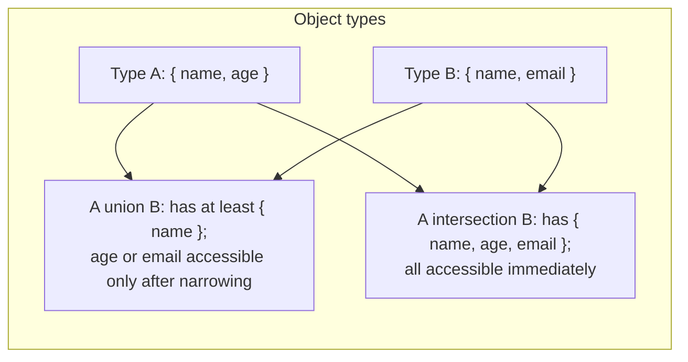
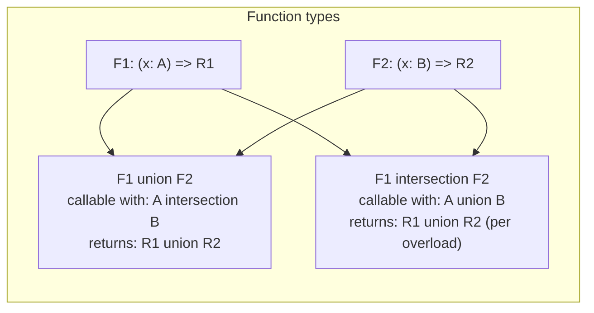
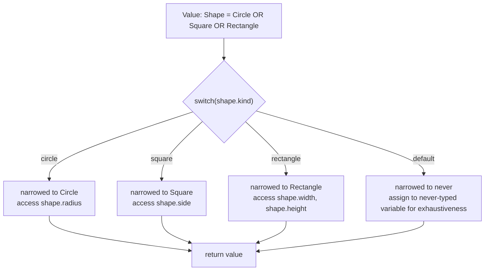
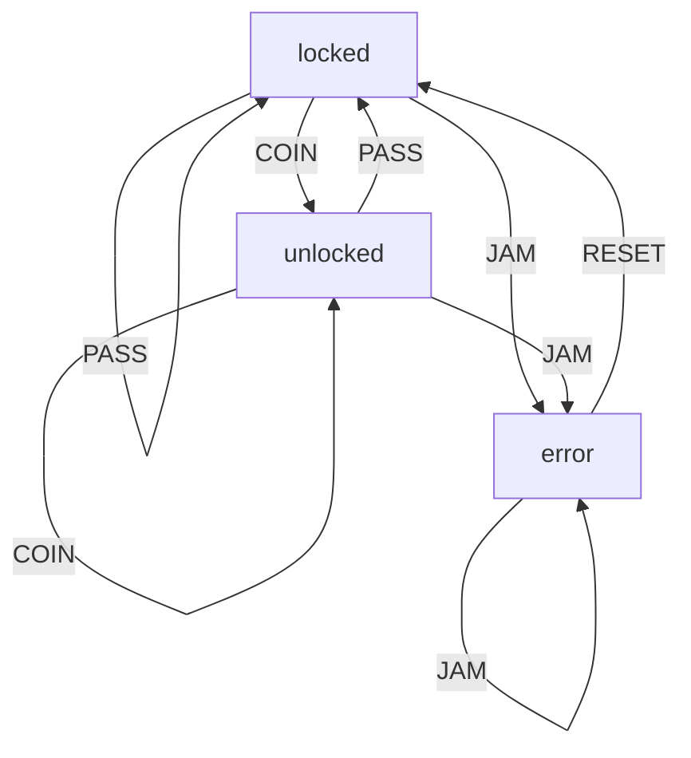

# 2.05 Unions and Intersections

## 1. Purpose

TypeScript has two fundamental type combinators: the **union** `A | B` and the **intersection** `A & B`. Almost every non-trivial TypeScript type you will ever write is a combination of these two operators with primitives, objects, and generics. Mastering them is the single biggest leap from "I can write TypeScript" to "I can model domains in TypeScript." This note is the deep dive.

A union exists because **a value can be one of several types**. A function that parses user input might return a `string` or a `number` or `null`. A network response might be a success payload or an error payload. A DOM event might be a `MouseEvent` or a `KeyboardEvent` or a `TouchEvent`. Without unions, you would model each of these with `any`, with `unknown` plus casts, or with bloated objects that have every possible field optional. Unions let you say "this value is exactly one of these shapes, and the compiler will track which one."

An intersection exists because **a single value must satisfy multiple type contracts simultaneously**. A logger object that also needs to be serializable, comparable, and disposable is the intersection of four interfaces. A React component prop that combines base props with variant-specific props is an intersection. A class instance produced by a mixin chain is, at the type level, an intersection of every mixed-in capability. Intersections let you say "this value has all of these shapes at once."

The duality is the headline: **union is OR, intersection is AND**. That is true and easy to remember for the surface case, but it hides a counterintuitive twist that catches almost every intermediate TypeScript developer. The twist is this: **for object types, union means "has properties of one member" and intersection means "has properties of all members," but for function types, the rule inverts.** A union of functions `((x: A) => B) | ((x: C) => D)` is callable only with arguments that satisfy both function signatures — i.e., arguments of type `A & C`. A function type that can be called by *either* caller of `A` or caller of `C` is the *intersection* `((x: A) => B) & ((x: C) => D)`. This is parametric contravariance in action, and we will spend a full subsection on it in Section 2.

Why do we need both? Because modeling the real world requires both "this OR that" and "this AND that." A shape is a circle OR a square OR a triangle (union). A user is a `Person & Serializable & Auditable` (intersection). A Redux action is `IncrementAction | DecrementAction | ResetAction` (union), but each action is `Action & Payload` (intersection). You cannot express either category cleanly with the other, and you cannot express realistic domains without both.

The bug class unions prevent is **untagged polymorphism**: code that receives a value of unknown shape and silently does the wrong thing. Without unions, you would write functions that accept `any` and crash at runtime on the wrong shape; or you would write functions that accept `object` and then manually inspect every field. With unions, the compiler forces you to narrow before accessing shape-specific members, and it forces you to handle every member if you want exhaustive switching. That single compile-time guarantee removes entire categories of "I forgot to handle the loading state" bugs.

The bug class intersections prevent is **capability duplication**. Without intersections, you either redeclare every capability on every interface (leading to massive duplicated type definitions), or you cast (losing type safety), or you use inheritance (which is single-base in TypeScript and rigid). Intersections compose capabilities linearly: `A & B & C & D` is a value with every property of A, B, C, and D, with no boilerplate.

Both operators are **type-level only**. They do not exist at runtime. The compiler uses them to type-check your code and then erases them. There is no runtime representation of `string | number`; there is just a variable that holds a string or a number at a given moment. This is why narrowing — runtime code that the compiler can use to refine a static type — is the operational heart of unions. Without narrowing, a union is barely usable.

The goal of this note is to make the following second nature:

1. Choose between union and intersection for any modeling problem without hesitation.
2. Build a discriminated union with exhaustive narrowing that fails to compile when a new member is added.
3. Explain, with a concrete example, why a union of functions is callable only with the intersection of the parameter types.
4. Diagnose an intersection that silently produced `never` and fix it.

Read on. The theory section is the longest because the concepts are dense; everything after it builds on that foundation.

## 2. Theory and Deep Dive

### 2.1 Union types: `A | B`

A union type `A | B` denotes a value that is **of type A or of type B**. The vertical bar is the same operator TypeScript borrows from set theory. At the type level, `A | B` is the union of the set of values of type A and the set of values of type B.

```typescript
// TS
type StringOrNumber = string | number;

const a: StringOrNumber = "hello";  // ok
const b: StringOrNumber = 42;       // ok
const c: StringOrNumber = true;     // error: Type 'boolean' is not assignable to type 'string | number'.
```

```javascript
// JS
// At runtime there is no StringOrNumber; the value is just a string or a number.
const a = "hello";
const b = 42;
```

Unions can be arbitrarily wide. `string | number | boolean | null | undefined` is fine. Union members can themselves be unions: `(string | number) | (boolean | null)` collapses to `string | number | boolean | null` because union is associative and idempotent.

### 2.2 Property access on a union

The most important operational rule of unions is this: **when you have a value of type `A | B`, you may only access properties that exist on both A and B.** Anything else is a compile error. The compiler cannot know which member your value is at any given moment, so it only allows operations that are safe regardless.

```typescript
// TS
interface Cat { name: string; meow(): void; }
interface Dog { name: string; bark(): void; }

type Pet = Cat | Dog;

function greet(pet: Pet) {
  console.log(pet.name);     // ok: name is on both
  pet.meow();                // error: Property 'meow' does not exist on type 'Cat | Dog'.
  pet.bark();                // error: Property 'bark' does not exist on type 'Cat | Dog'.
}
```

```javascript
// JS
// At runtime this works fine if pet happens to be a Cat, and throws at runtime if it is a Dog.
// TypeScript refuses to let you write code that depends on luck.
function greet(pet) {
  console.log(pet.name);
  pet.meow(); // works only for cats; throws for dogs
}
```

This rule is what makes unions safe. To access a member-specific property, you must **narrow** the union — convince the compiler that, in this branch, the value is of a specific member type.

### 2.3 Narrowing a union

TypeScript narrows unions through several mechanisms. Each is a runtime check that the compiler can use to refine the static type inside a branch.

**`typeof` narrowing** works for primitive types:

```typescript
// TS
function format(value: string | number) {
  if (typeof value === "string") {
    return value.toUpperCase();  // value is string here
  }
  return value.toFixed(2);        // value is number here
}
```

```javascript
// JS
function format(value) {
  if (typeof value === "string") {
    return value.toUpperCase();
  }
  return value.toFixed(2);
}
```

`typeof` only distinguishes between `string`, `number`, `boolean`, `symbol`, `bigint`, `undefined`, `function`, and `object`. It cannot distinguish between two different object types — both `Cat` and `Dog` are `typeof === "object"`.

**`instanceof` narrowing** works for class instances:

```typescript
// TS
class ValidationError extends Error { constructor(message: string) { super(message); } }

function logError(err: Error | ValidationError) {
  if (err instanceof ValidationError) {
    console.log("Validation failed:", err.message);  // err is ValidationError here
  } else {
    console.log("Generic error:", err.message);       // err is Error here
  }
}
```

```javascript
// JS
class ValidationError extends Error {
  constructor(message) { super(message); }
}

function logError(err) {
  if (err instanceof ValidationError) {
    console.log("Validation failed:", err.message);
  } else {
    console.log("Generic error:", err.message);
  }
}
```

**`in` narrowing** works for objects that have a distinguishing property:

```typescript
// TS
interface Cat { meow: () => void; name: string; }
interface Dog { bark: () => void; name: string; }

function speak(pet: Cat | Dog) {
  if ("meow" in pet) {
    pet.meow();    // pet is Cat here
  } else {
    pet.bark();    // pet is Dog here
  }
}
```

```javascript
// JS
function speak(pet) {
  if ("meow" in pet) {
    pet.meow();
  } else {
    pet.bark();
  }
}
```

**User-defined type guards** let you write a function whose return type is a type predicate `x is T`. The compiler trusts the predicate and narrows accordingly:

```typescript
// TS
function isString(x: unknown): x is string {
  return typeof x === "string";
}

function echo(x: string | number) {
  if (isString(x)) {
    return x.repeat(3);  // x is string here
  }
  return x * 3;          // x is number here
}
```

```javascript
// JS
function isString(x) {
  return typeof x === "string";
}

function echo(x) {
  if (isString(x)) {
    return x.repeat(3);
  }
  return x * 3;
}
```

**Truthiness narrowing** eliminates `null`, `undefined`, `""`, `0`, `false`, and `NaN`:

```typescript
// TS
function len(s: string | null) {
  if (s) {
    return s.length;  // s is string here
  }
  return 0;           // s is null here
}
```

```javascript
// JS
function len(s) {
  if (s) {
    return s.length;
  }
  return 0;
}
```

**`switch` narrowing** works on literal types and is the workhorse of discriminated unions (see Section 2.6).

### 2.4 Intersection types: `A & B`

An intersection type `A & B` denotes a value that is **both A and B**. The ampersand is borrowed from set theory. At the type level, `A & B` is the intersection of the set of values of type A and the set of values of type B.

```typescript
// TS
interface Named { name: string; }
interface Aged { age: number; }

type Person = Named & Aged;

const p: Person = { name: "Ada", age: 36 };   // ok
const q: Person = { name: "Ada" };            // error: Property 'age' is missing.
```

```javascript
// JS
// At runtime there is no Person type; the object just has both name and age fields.
const p = { name: "Ada", age: 36 };
```

Property access on an intersection is the mirror of unions: **you may access any property that exists on any member.** The intersection has all the properties of all its members.

```typescript
// TS
interface Loggable { log(): void; }
interface Serializable { serialize(): string; }

type Asset = Loggable & Serializable;

function process(asset: Asset) {
  asset.log();              // ok
  asset.serialize();        // ok
  console.log(asset.serialize().length);  // ok
}
```

```javascript
// JS
function process(asset) {
  asset.log();
  asset.serialize();
  console.log(asset.serialize().length);
}
```

### 2.5 The `never` trap: conflicting property types

Here is the most subtle and dangerous aspect of intersections. If two members of an intersection declare the same property with **incompatible types**, the property type collapses to `never`. A `never` value is one that cannot exist. You can never assign anything to a `never`-typed slot.

```typescript
// TS
interface A { kind: "a"; payload: string; }
interface B { kind: "b"; payload: number; }

type AB = A & B;

// The inferred type of AB is:
// { kind: never; payload: never; }

const ab: AB = { kind: "a", payload: "x" };  // error: Type '"a"' is not assignable to type 'never'.
const ab2: AB = { kind: "b", payload: 1 };   // error: Type '"b"' is not assignable to type 'never'.
```

```javascript
// JS
// At runtime nothing stops you from creating such an object.
const ab = { kind: "a", payload: "x" };  // works fine
// But TypeScript refuses to type-check it as AB because the type is mathematically unsatisfiable.
```

The compiler does **not** warn you "you wrote an intersection that collapses to never." It silently computes the intersection of `"a"` and `"b"` (which is `never`, because no string literal is both `"a"` and `"b"` simultaneously), and the only symptom is that no value can ever be assigned. This is one of the most common TypeScript footguns. Section 6 has a full diagnosis playbook.

Note that the rule for intersections is **per-property**: if A and B share a property name but with compatible types, the intersection narrows. `{ kind: string } & { kind: "a" }` produces `{ kind: "a" }` because `"a"` is a subtype of `string`. The intersection of `string` and `"a"` is `"a"`.

### 2.6 Discriminated unions

A discriminated union (also called a tagged union or sum type) is a union where every member has a property with a **literal type** that uniquely identifies the member. That property is called the **tag** or **discriminant**.

```typescript
// TS
type Shape =
  | { kind: "circle"; radius: number }
  | { kind: "square"; side: number }
  | { kind: "rectangle"; width: number; height: number };

function area(shape: Shape): number {
  switch (shape.kind) {
    case "circle":    return Math.PI * shape.radius * shape.radius;
    case "square":    return shape.side * shape.side;
    case "rectangle": return shape.width * shape.height;
  }
}
```

```javascript
// JS
function area(shape) {
  switch (shape.kind) {
    case "circle":    return Math.PI * shape.radius * shape.radius;
    case "square":    return shape.side * shape.side;
    case "rectangle": return shape.width * shape.height;
  }
}
```

Inside each `case` branch, the compiler narrows `shape` to the matching member based on the literal value of `shape.kind`. That is why `shape.radius` is accessible only inside the `"circle"` case.

The tag must be a **literal type** (`"circle"`, `1`, `true`), not a generic `string`. If you write `kind: string` instead of `kind: "circle"`, the compiler cannot narrow on it because `string` is not a discriminant. This is the second most common discriminated union mistake (Section 6 covers it).

### 2.7 Exhaustiveness checking with `never`

Exhaustiveness checking is the technique that makes discriminated unions future-proof. The idea: in a `switch` over the tag, the `default` case assigns the value to a `never`-typed variable. If a new member is added to the union later, the compiler widens the value's type in the default branch, and the assignment fails to compile.

```typescript
// TS
type Shape =
  | { kind: "circle"; radius: number }
  | { kind: "square"; side: number };

function describe(shape: Shape): string {
  switch (shape.kind) {
    case "circle": return `circle, radius ${shape.radius}`;
    case "square": return `square, side ${shape.side}`;
    default:
      // After the two cases above, shape is narrowed to never.
      const exhaustive: never = shape;
      return exhaustive;
  }
}

// Later: add a triangle member.
// type Shape = ... | { kind: "triangle"; base: number; height: number };
// Now the default branch's shape is no longer never (it is the triangle),
// and the assignment `const exhaustive: never = shape;` fails with:
//   Type 'Shape' is not assignable to type 'never'.
//   Property '"triangle"' is missing in type ...
```

```javascript
// JS
function describe(shape) {
  switch (shape.kind) {
    case "circle": return `circle, radius ${shape.radius}`;
    case "square": return `square, side ${shape.side}`;
    default: throw new Error(`Unknown shape: ${shape.kind}`);
  }
}
// At runtime, the default branch throws if a new shape is added.
// At compile time, TypeScript catches it before runtime if you use the never trick.
```

The `never`-assignment pattern is the canonical exhaustiveness check. A common refinement is to extract it into an `assertNever` function:

```typescript
// TS
function assertNever(x: never): never {
  throw new Error(`Unexpected value: ${JSON.stringify(x)}`);
}

function describe(shape: Shape): string {
  switch (shape.kind) {
    case "circle": return `circle, radius ${shape.radius}`;
    case "square": return `square, side ${shape.side}`;
    default: return assertNever(shape);
  }
}
```

```javascript
// JS
function assertNever(x) {
  throw new Error(`Unexpected value: ${JSON.stringify(x)}`);
}

function describe(shape) {
  switch (shape.kind) {
    case "circle": return `circle, radius ${shape.radius}`;
    case "square": return `square, side ${shape.side}`;
    default: return assertNever(shape);
  }
}
```

When you add a new variant to `Shape` and forget to update `describe`, the call `assertNever(shape)` will not type-check, because `shape` is no longer `never`. This is exactly the safety net you want.

### 2.8 Union vs intersection for objects vs functions

Now the heart of the counterintuitive part. The same operator behaves differently depending on whether you apply it to object types or function types.

For **object types**:

- **Union** `A | B` means "this value is one of A or B." Only common properties are accessible. The set of values is the union of the two sets, which is *larger* than either. You need narrowing to access member-specific fields.
- **Intersection** `A & B` means "this value is both A and B." All properties of both are accessible. The set of values is the intersection of the two sets, which is *smaller* than either (fewer values satisfy both contracts).

For **function types**, the rules invert because of how parameters behave under subtyping:

- **Union of functions** `((x: A) => B) | ((x: C) => D)` is a value that is *one of* these two functions. You do not know which. So you can only call it with arguments that are *safe for both* — i.e., arguments of type `A & C`. The return type is `B | D`. In other words, **a union of functions is callable with the intersection of the parameter types.**
- **Intersection of functions** `((x: A) => B) & ((x: C) => D)` is a value that is *both* of these functions. You can call it with arguments that satisfy *either* signature — i.e., arguments of type `A | C`. The return type depends on which overload matches. In other words, **an intersection of functions is callable with the union of the parameter types.**

This is the source of the famous "contravariance of parameters" surprise. A function that accepts `Animal` can be used wherever a function that accepts `Cat` is expected (it can also accept the Cat), so `(x: Animal) => void` is a subtype of `(x: Cat) => void`. Parameters are contravariant. When you union two function types, the parameter type narrows to the intersection; when you intersect them, the parameter widens to the union.

A concrete demonstration:

```typescript
// TS
type F1 = (x: { a: string }) => void;
type F2 = (x: { b: number }) => void;

type Union = F1 | F2;
type Inter = F1 & F2;

const u: Union = (x) => { /* x is { a: string } & { b: number }, i.e. { a: string; b: number } */ };
const i: Inter = (x) => { /* x is { a: string } | { b: number } */ };

declare const u2: Union;
u2({ a: "hi", b: 3 });  // ok: argument satisfies both { a: string } and { b: number }

declare const i2: Inter;
i2({ a: "hi" });  // ok: argument satisfies the first overload
i2({ b: 3 });     // ok: argument satisfies the second overload
```

```javascript
// JS
// At runtime, a function is just a function. The above is pure type-level discipline.
const u = (x) => { /* x must logically have both a and b */ };
const i = (x) => { /* x might have only a, only b, or both */ };
```

If this still feels backwards, work through it from the safety principle: the compiler allows only operations that cannot fail. For a union of functions, calling with the intersection is safe because either function will accept it. For an intersection of functions, calling with the union is safe because one of the overloads will accept it.

### 2.9 Mermaid: union vs intersection for objects



### 2.10 Mermaid: union vs intersection for functions



### 2.11 Mermaid: discriminated union narrowing flow



### 2.12 Composition: union and intersection together

Real types are usually combinations. `type Action = (BaseAction & Payload) | Notification | Reset` is a union where one member is itself an intersection. The operators have equal precedence and are left-associative; use parentheses for clarity.

```typescript
// TS
interface BaseAction { type: string; timestamp: number; }
interface Payload { payload: unknown; }

type AppAction =
  | (BaseAction & Payload & { type: "DATA" })
  | (BaseAction & { type: "RESET" })
  | (BaseAction & { type: "NOTIFY"; message: string });

function handle(action: AppAction) {
  switch (action.type) {
    case "DATA":    return action.payload;     // narrowed to BaseAction & Payload & { type: "DATA" }
    case "RESET":   return null;
    case "NOTIFY":  return action.message;
    default:        return assertNever(action);
  }
}
```

```javascript
// JS
function handle(action) {
  switch (action.type) {
    case "DATA":    return action.payload;
    case "RESET":   return null;
    case "NOTIFY":  return action.message;
    default: throw new Error(`Unknown action: ${action.type}`);
  }
}
```

The discriminated tag (`type`) flows through the intersection: `BaseAction & { type: "DATA" }` narrows the `type` property to the literal `"DATA"`, which is what allows the switch to discriminate. This pattern is universal in Redux and similar architectures (see Section 4).

### 2.13 Distributive property of unions

A subtle but important property: conditional types distribute over naked union type parameters. If `T` is a union and you write `type Foo<T> = T extends X ? Y : Z`, the conditional is applied to each member of `T` and the results are unioned back together. This is how utility types like `Exclude`, `Extract`, and `NonNullable` are implemented. We will not dive deeply here — that is the territory of [[2.11 Conditional Types]] — but you should know the property exists, because it explains why `Exclude<A | B | C, B>` produces `A | C` and not a strange collapsed type.

### 2.14 What unions and intersections do NOT do

Both operators are erased at runtime. They are pure compile-time constructs. You cannot `instanceof` a union, you cannot `typeof` a union, and you cannot introspect an intersection with `in` at the type level. The runtime behavior is exactly the same as if you had written the equivalent JavaScript: the compiler just checks your code more strictly before erasing the types.

This also means unions and intersections cannot enforce invariants by themselves. A `Result<T, E>` type does not prevent you from constructing a `Success` that wraps an error value; it just labels the result so the next consumer must narrow. The invariant is enforced by the *narrowing requirement*, not by the union itself.

## 3. Mental Models

These four mental models cover the bulk of union and intersection intuition. Each one has a sharp edge where it breaks; I flag them.

### 3.1 Union as OR

> A union is an OR. The value is one of these. You do not know which. Only do things that are safe regardless of which.

This is the headline intuition and it is correct for the common case. It breaks down only when you reach function types, where the OR inverts to AND on the parameters. When you find yourself confused about a function union, switch to model 3.4.

### 3.2 Intersection as AND

> An intersection is an AND. The value is all of these. Every property of every member is present.

This is correct for object types and is the cleanest way to think about mixin-style composition. It breaks down for conflicting property types, where the AND collapses to `never`. When a property of an intersection stops accepting values, suspect this collapse.

### 3.3 Discriminated union as a tagged value

> A discriminated union is a union with a tag that lets you narrow safely. The tag is a literal property. Read the tag in a switch, and the compiler narrows the value in each branch.

This model is the operational core of working with unions in real codebases. The sharp edge: the tag must be a literal type, not `string`. If you write `type: string` instead of `type: "DATA"`, the switch will not narrow, and you will be back to manual guards.

### 3.4 Function union as contravariant intersection

> A union of functions is a value that could be either function. To call it safely, you must pass an argument that satisfies both — i.e., the intersection of the parameter types. The function intersection inverts this: you can pass either type of argument.

This is the model to invoke whenever a function union surprises you. The way to remember it: the compiler only allows operations that cannot fail. For a union of functions, the safe-against-both argument is the intersection. For an intersection of functions (an overloaded function), either argument works.

### 3.5 Intersection as merge for objects

> An intersection of object types is the merge of their properties. `{ a: A } & { b: B }` is, for practical purposes, `{ a: A; b: B }`.

This is how you should think about intersections for object composition. The compiler does not actually display intersections as merges in error messages (it shows `A & B`), but operationally the property set is the union of the members' properties. The merge is unsatisfiable only when two members declare the same property with incompatible types — then the merge produces `never` for that property.

### 3.6 `never` as the empty set

> `never` is the empty set of values. It is the type that no value can have. An unreachable code branch has type `never`. An exhaustive switch's default branch has type `never` after all members are handled. A conflicting intersection's property has type `never`.

Treating `never` as the empty set makes the rest of the theory click. `string & number` is `never` because no value is both a string and a number. `(x: never) => void` accepts anything (because no argument will ever be `never`, the function is never actually called). `T | never` is `T` because adding the empty set to a set changes nothing. `T & never` is `never` because intersecting any set with the empty set is empty.

## 4. Real-World Use Cases

### 4.1 Redux action types as discriminated unions

Every Redux reducer receives an action. Without TypeScript, the action is just a shapeless object, and your reducer must trust that the `type` field exists and has the right value. With discriminated unions, the action type is a tagged union, and the reducer's switch on `action.type` narrows automatically.

```typescript
// TS
type Action =
  | { type: "INCREMENT"; payload: number }
  | { type: "DECREMENT"; payload: number }
  | { type: "RESET" };

function counter(state: number, action: Action): number {
  switch (action.type) {
    case "INCREMENT": return state + action.payload;
    case "DECREMENT": return state - action.payload;
    case "RESET":     return 0;
    default:          return assertNever(action);
  }
}
```

```javascript
// JS
function counter(state, action) {
  switch (action.type) {
    case "INCREMENT": return state + action.payload;
    case "DECREMENT": return state - action.payload;
    case "RESET":     return 0;
    default: throw new Error(`Unknown action: ${action.type}`);
  }
}
```

The benefit: when you add a new action type, every reducer that does not handle it fails to compile. You discover missing handlers at compile time, not in production.

### 4.2 React component prop variants

A button component might have a "primary" variant with one set of props and a "secondary" variant with another. A discriminated union on a `variant` field (or on the presence of specific props) is the idiomatic TypeScript pattern.

```typescript
// TS
type ButtonProps =
  | { variant: "primary"; color: string; onClick: () => void; label: string }
  | { variant: "link"; href: string; label: string }
  | { variant: "icon"; icon: string; ariaLabel: string; onClick: () => void };

function Button(props: ButtonProps) {
  switch (props.variant) {
    case "primary": return `<button style="color:${props.color}" onclick="(${props.onClick})()">${props.label}</button>`;
    case "link":    return `<a href="${props.href}">${props.label}</a>`;
    case "icon":    return `<button onclick="(${props.onClick})()" aria-label="${props.ariaLabel}">${props.icon}</button>`;
  }
}
```

```javascript
// JS
function Button(props) {
  switch (props.variant) {
    case "primary": return `<button style="color:${props.color}" onclick="(${props.onClick})()">${props.label}</button>`;
    case "link":    return `<a href="${props.href}">${props.label}</a>`;
    case "icon":    return `<button onclick="(${props.onClick})()" aria-label="${props.ariaLabel}">${props.icon}</button>`;
  }
}
```

The benefit: callers cannot pass `color` on a `link` variant by mistake. The compiler rejects it.

### 4.3 API response types

A fetch call usually returns either a success payload or an error. Modeling that as a union (rather than a single object with optional error and optional data fields) forces every consumer to handle both cases.

```typescript
// TS
type ApiResponse<T> =
  | { status: "success"; data: T }
  | { status: "error"; code: number; message: string };

function handle<T>(res: ApiResponse<T>) {
  if (res.status === "success") {
    return res.data;
  }
  throw new Error(`${res.code}: ${res.message}`);
}
```

```javascript
// JS
function handle(res) {
  if (res.status === "success") {
    return res.data;
  }
  throw new Error(`${res.code}: ${res.message}`);
}
```

### 4.4 The Result type

The `Result<T, E>` pattern is a discriminated union that replaces exceptions for fallible operations. It comes from Rust, ML, and Haskell (where it is usually called `Either`).

```typescript
// TS
type Result<T, E> =
  | { ok: true; value: T }
  | { ok: false; error: E };

function divide(a: number, b: number): Result<number, string> {
  if (b === 0) return { ok: false, error: "division by zero" };
  return { ok: true, value: a / b };
}

function use(r: Result<number, string>) {
  if (r.ok) {
    return r.value + 1;
  }
  return `error: ${r.error}`;
}
```

```javascript
// JS
function divide(a, b) {
  if (b === 0) return { ok: false, error: "division by zero" };
  return { ok: true, value: a / b };
}

function use(r) {
  if (r.ok) {
    return r.value + 1;
  }
  return `error: ${r.error}`;
}
```

Section 5.2 builds a fuller version with `map`, `flatMap`, and chaining.

### 4.5 Intersections for mixin composition

A class produced by applying a series of mixins is, at the type level, the intersection of the base class and every mixed-in capability.

```typescript
// TS
type Constructor<T = {}> = new (...args: any[]) => T;

function Loggable<T extends Constructor>(Base: T) {
  return class extends Base {
    log(msg: string) { console.log(msg); }
  };
}

function Serializable<T extends Constructor>(Base: T) {
  return class extends Base {
    serialize() { return JSON.stringify(this); }
  };
}

class Thing { constructor(public name: string) {} }

const LoggedThing = Loggable(Thing);
const FullThing = Serializable(LoggedThing);

const t = new FullThing("widget");
t.log("created");      // from Loggable
t.serialize();          // from Serializable
console.log(t.name);    // from Thing
```

```javascript
// JS
function Loggable(Base) {
  return class extends Base {
    log(msg) { console.log(msg); }
  };
}

function Serializable(Base) {
  return class extends Base {
    serialize() { return JSON.stringify(this); }
  };
}

class Thing { constructor(name) { this.name = name; } }

const LoggedThing = Loggable(Thing);
const FullThing = Serializable(LoggedThing);

const t = new FullThing("widget");
t.log("created");
t.serialize();
console.log(t.name);
```

The TypeScript type of `FullThing` is, conceptually, `typeof Thing & typeof LoggedThing & typeof Serializable`. This is an intersection of constructors, and the instance type is the intersection of the instance types.

### 4.6 Configurable builders

Configuration objects that combine multiple optional capabilities are natural intersections:

```typescript
// TS
interface Cache { get(k: string): unknown; set(k: string, v: unknown): void; }
interface Logger { log(msg: string): void; }
interface Metrics { increment(name: string): void; }

type Service = Cache & Logger & Metrics;

declare const svc: Service;
svc.get("k");
svc.log("hello");
svc.increment("requests");
```

```javascript
// JS
const svc = {
  get(k) { /* ... */ },
  set(k, v) { /* ... */ },
  log(msg) { /* ... */ },
  increment(name) { /* ... */ },
};
```

### 4.7 Event systems

DOM and Node event emitters dispatch events of many shapes. A union over an `Event` type with a `type` discriminant lets you write type-safe handlers:

```typescript
// TS
type AppEvent =
  | { type: "CLICK"; x: number; y: number }
  | { type: "KEY"; key: string }
  | { type: "SCROLL"; deltaY: number };

function onEvent(e: AppEvent) {
  switch (e.type) {
    case "CLICK":  return console.log(`clicked at ${e.x},${e.y}`);
    case "KEY":    return console.log(`pressed ${e.key}`);
    case "SCROLL": return console.log(`scrolled ${e.deltaY}`);
  }
}
```

```javascript
// JS
function onEvent(e) {
  switch (e.type) {
    case "CLICK":  return console.log(`clicked at ${e.x},${e.y}`);
    case "KEY":    return console.log(`pressed ${e.key}`);
    case "SCROLL": return console.log(`scrolled ${e.deltaY}`);
  }
}
```

### 4.8 State machines

A state machine's states are naturally a discriminated union, and transitions are functions from one state to another. This is the topic of Section 10's mini-project.

## 5. Code Examples

### 5.1 Example A — Minimal and Conceptual

This example walks through the five core concepts in the smallest possible surface: a basic union, a basic intersection, a discriminated union, and exhaustive checking with `never`.

```typescript
// TS
// (1) A simple union
type ID = string | number;

function printID(id: ID) {
  if (typeof id === "string") {
    console.log(id.toUpperCase());   // narrowed to string
  } else {
    console.log(id.toFixed(2));      // narrowed to number
  }
}

// (2) A simple intersection
interface Named { name: string; }
interface Aged  { age: number; }

type Person = Named & Aged;

const ada: Person = { name: "Ada", age: 36 };
console.log(ada.name, ada.age);

// (3) A discriminated union
type Shape =
  | { kind: "circle"; radius: number }
  | { kind: "square"; side: number }
  | { kind: "triangle"; base: number; height: number };

function area(s: Shape): number {
  switch (s.kind) {
    case "circle":    return Math.PI * s.radius ** 2;
    case "square":    return s.side ** 2;
    case "triangle":  return 0.5 * s.base * s.height;
  }
}

// (4) Exhaustive checking with never
function assertNever(x: never): never {
  throw new Error(`Unhandled: ${JSON.stringify(x)}`);
}

function describe(s: Shape): string {
  switch (s.kind) {
    case "circle":   return `circle of radius ${s.radius}`;
    case "square":   return `square of side ${s.side}`;
    case "triangle": return `triangle of base ${s.base}`;
    default:         return assertNever(s);   // compile-time exhaustiveness check
  }
}

// (5) Function union vs intersection (param inversion)
type F1 = (x: { a: string }) => void;
type F2 = (x: { b: number }) => void;

type FnUnion = F1 | F2;       // callable with { a: string } & { b: number }
type FnInter = F1 & F2;       // callable with { a: string } | { b: number }

declare const fU: FnUnion;
declare const fI: FnInter;

fU({ a: "hi", b: 3 });  // ok: argument is intersection
fI({ a: "hi" });        // ok: argument matches first overload
fI({ b: 3 });           // ok: argument matches second overload
```

```javascript
// JS
// (1) Union — at runtime there is no ID type, just a value that can be a string or number.
function printID(id) {
  if (typeof id === "string") {
    console.log(id.toUpperCase());
  } else {
    console.log(id.toFixed(2));
  }
}

// (2) Intersection — at runtime the object just has both fields.
const ada = { name: "Ada", age: 36 };
console.log(ada.name, ada.age);

// (3) Discriminated union — at runtime the switch reads the kind field.
function area(s) {
  switch (s.kind) {
    case "circle":   return Math.PI * s.radius ** 2;
    case "square":   return s.side ** 2;
    case "triangle": return 0.5 * s.base * s.height;
  }
}

// (4) Exhaustive checking — at runtime the default throws.
function assertNever(x) {
  throw new Error(`Unhandled: ${JSON.stringify(x)}`);
}

function describe(s) {
  switch (s.kind) {
    case "circle":   return `circle of radius ${s.radius}`;
    case "square":   return `square of side ${s.side}`;
    case "triangle": return `triangle of base ${s.base}`;
    default:         return assertNever(s);
  }
}

// (5) Function union vs intersection — pure type-level, no runtime equivalent.
const fU = (x) => { /* x must have a and b */ };
const fI = (x) => { /* x might have a, b, or both */ };
fU({ a: "hi", b: 3 });
fI({ a: "hi" });
fI({ b: 3 });
```

### 5.2 Example B — Production-Grade

This example builds a typed `Result<T, E>` monad with `map`, `flatMap`, and `match`, plus a Redux-style action discriminated union with an exhaustive reducer. Together these cover the two patterns you will use unions for in production: variant types (Result) and tagged message buses (Redux actions).

```typescript
// TS
// === Result<T, E> monad ===

export type Result<T, E> =
  | { ok: true; value: T }
  | { ok: false; error: E };

export const Result = {
  ok<T>(value: T): Result<T, never> {
    return { ok: true, value };
  },

  fail<E>(error: E): Result<never, E> {
    return { ok: false, error };
  },

  map<T, U, E>(r: Result<T, E>, f: (x: T) => U): Result<U, E> {
    return r.ok ? { ok: true, value: f(r.value) } : r;
  },

  flatMap<T, U, E>(r: Result<T, E>, f: (x: T) => Result<U, E>): Result<U, E> {
    return r.ok ? f(r.value) : r;
  },

  match<T, U, E>(r: Result<T, E>, onOk: (x: T) => U, onErr: (e: E) => U): U {
    return r.ok ? onOk(r.value) : onErr(r.error);
  },

  tryCatch<T, E>(fn: () => T, toError: (e: unknown) => E): Result<T, E> {
    try { return Result.ok(fn()); }
    catch (e) { return Result.fail(toError(e)); }
  },
};

// Usage
function parseUser(raw: string): Result<{ name: string }, string> {
  return Result.tryCatch(
    () => JSON.parse(raw),
    (e) => `parse error: ${String(e)}`,
  ).flatMap((obj) => {
    if (typeof obj?.name === "string") return Result.ok({ name: obj.name });
    return Result.fail("missing name");
  });
}

const r1 = parseUser('{"name":"Ada"}');
console.log(Result.match(r1,
  (u) => `hello ${u.name}`,
  (e) => `error: ${e}`,
));

// === Redux-style action discriminated union with exhaustive reducer ===

type Action =
  | { type: "SET"; value: number }
  | { type: "INC" }
  | { type: "DEC" }
  | { type: "RESET" };

function assertNever(x: never): never {
  throw new Error(`Unhandled action: ${JSON.stringify(x)}`);
}

function reducer(state: number, action: Action): number {
  switch (action.type) {
    case "SET":   return action.value;
    case "INC":   return state + 1;
    case "DEC":   return state - 1;
    case "RESET": return 0;
    default:      return assertNever(action);   // exhaustive
  }
}

// Dispatch
console.log(reducer(0, { type: "INC" }));            // 1
console.log(reducer(1, { type: "SET", value: 99 })); // 99
console.log(reducer(99, { type: "RESET" }));         // 0
```

```javascript
// JS
// === Result monad ===

export const Result = {
  ok(value) {
    return { ok: true, value };
  },

  fail(error) {
    return { ok: false, error };
  },

  map(r, f) {
    return r.ok ? { ok: true, value: f(r.value) } : r;
  },

  flatMap(r, f) {
    return r.ok ? f(r.value) : r;
  },

  match(r, onOk, onErr) {
    return r.ok ? onOk(r.value) : onErr(r.error);
  },

  tryCatch(fn, toError) {
    try { return Result.ok(fn()); }
    catch (e) { return Result.fail(toError(e)); }
  },
};

function parseUser(raw) {
  return Result.tryCatch(
    () => JSON.parse(raw),
    (e) => `parse error: ${String(e)}`,
  ).flatMap((obj) => {
    if (typeof obj?.name === "string") return Result.ok({ name: obj.name });
    return Result.fail("missing name");
  });
}

const r1 = parseUser('{"name":"Ada"}');
console.log(Result.match(r1,
  (u) => `hello ${u.name}`,
  (e) => `error: ${e}`,
));

// === Redux-style reducer ===

function assertNever(x) {
  throw new Error(`Unhandled action: ${JSON.stringify(x)}`);
}

function reducer(state, action) {
  switch (action.type) {
    case "SET":   return action.value;
    case "INC":   return state + 1;
    case "DEC":   return state - 1;
    case "RESET": return 0;
    default:      return assertNever(action);
  }
}

console.log(reducer(0, { type: "INC" }));            // 1
console.log(reducer(1, { type: "SET", value: 99 })); // 99
console.log(reducer(99, { type: "RESET" }));         // 0
```

## 6. Common Mistakes and Anti-Patterns

### 6.1 Accessing a union-specific property without narrowing

```typescript
// TS — MISTAKE
interface Cat { name: string; meow(): void; }
interface Dog { name: string; bark(): void; }

function speak(pet: Cat | Dog) {
  pet.meow();   // error: Property 'meow' does not exist on type 'Cat | Dog'.
}
```

```javascript
// JS — works at runtime only if pet is a Cat, throws on Dog
function speak(pet) { pet.meow(); }
```

**Fix:** Narrow first with `in`, `instanceof`, or a discriminant field.

### 6.2 Intersecting conflicting property types (silently produces `never`)

```typescript
// TS — MISTAKE
interface A { kind: "a"; data: string; }
interface B { kind: "b"; data: number; }

type AB = A & B;
// AB.kind is never; AB.data is never.

const x: AB = { kind: "a", data: "x" };  // error: Type '"a"' is not assignable to type 'never'.
```

```javascript
// JS — runtime accepts it, but the type is mathematically unsatisfiable
const x = { kind: "a", data: "x" };
```

**Fix:** Use a union, not an intersection, when you mean "one of these shapes." Intersections are for combining compatible contracts.

### 6.3 Forgetting the default case in an exhaustive switch

```typescript
// TS — MISTAKE
type Shape =
  | { kind: "circle"; radius: number }
  | { kind: "square"; side: number };

function area(s: Shape): number {
  switch (s.kind) {
    case "circle": return Math.PI * s.radius ** 2;
    case "square": return s.side ** 2;
    // no default — if you add a triangle later, this compiles fine
    // and silently returns undefined at runtime.
  }
}
```

```javascript
// JS — silently returns undefined for unhandled shapes
function area(s) {
  switch (s.kind) {
    case "circle": return Math.PI * s.radius ** 2;
    case "square": return s.side ** 2;
  }
}
```

**Fix:** Add a default that calls `assertNever(s)`. Then adding a new variant forces you to update every switch.

### 6.4 Using `string` instead of a literal as the discriminant

```typescript
// TS — MISTAKE
type Shape =
  | { kind: string; radius: number }
  | { kind: string; side: number };

function area(s: Shape) {
  switch (s.kind) {
    case "circle": return Math.PI * s.radius ** 2;   // error: Property 'radius' does not exist on type '{ kind: string; side: number; }'.
    case "square": return s.side ** 2;
  }
}
```

```javascript
// JS — works at runtime by luck
function area(s) {
  switch (s.kind) {
    case "circle": return Math.PI * s.radius ** 2;
    case "square": return s.side ** 2;
  }
}
```

**Fix:** The tag must be a literal type, e.g. `kind: "circle"`, not `kind: string`.

### 6.5 Treating a union of functions as either/or for arguments

```typescript
// TS — MISTAKE
type Handler = ((x: string) => void) | ((x: number) => void);

function call(h: Handler) {
  h("hello");   // error: Argument of type 'string' is not assignable to parameter of type 'never'.
  // (string & number === never)
}
```

```javascript
// JS — works at runtime because the function is one of the two
function call(h) { h("hello"); }
```

**Fix:** A union of functions is callable only with the intersection of the parameter types. If you want either/or, use an intersection (an overloaded function) or model the functions as a discriminated union of objects with a `tag` field and a `run` method.

### 6.6 Arithmetic on `string | number`

```typescript
// TS — MISTAKE
function double(x: string | number) {
  return x + x;   // ok for strings (concatenation) and numbers (addition), but result type is string | number
}

function square(x: string | number) {
  return x * x;   // error: The left-hand side of an arithmetic operation must be of type 'any', 'number', 'bigint' or an enum type.
}
```

```javascript
// JS — works at runtime if x is a number, returns NaN if x is a string
function square(x) { return x * x; }
square("3"); // 9 — lucky coercion
square("ab"); // NaN
```

**Fix:** Narrow before arithmetic. `if (typeof x === "number") return x * x;`

### 6.7 Intersecting structural types that look compatible but are not

```typescript
// TS — MISTAKE
interface A { data: string | null; }
interface B { data: number; }

type AB = A & B;
// AB.data is (string | null) & number === never

const x: AB = { data: 1 };   // error: Type 'number' is not assignable to type 'never'.
```

```javascript
// JS — runtime accepts it, the type is unsatisfiable
const x = { data: 1 };
```

**Fix:** Inspect every shared property. If the types are not subtypes of each other, the property collapses to `never`. Either widen one of the types or use a union.

### 6.8 Using `any` to bypass narrowing

```typescript
// TS — MISTAKE
function speak(pet: Cat | Dog) {
  (pet as any).meow();   // compiles, throws at runtime if pet is a Dog
}
```

```javascript
// JS — equivalent
function speak(pet) { pet.meow(); }
```

**Fix:** Narrow properly. If you genuinely cannot narrow, use `unknown` and a runtime check rather than `any`.

### 6.9 Exhaustive switch returning a non-`never` default

```typescript
// TS — MISTAKE
function describe(s: Shape): string {
  switch (s.kind) {
    case "circle":   return "circle";
    case "square":   return "square";
    default:         return "unknown";  // compiles fine — no exhaustiveness protection
  }
}
```

```javascript
// JS — same
function describe(s) {
  switch (s.kind) {
    case "circle":   return "circle";
    case "square":   return "square";
    default:         return "unknown";
  }
}
```

**Fix:** The default must either assign to `never` or call `assertNever(s)`. Otherwise adding a new variant does not produce a compile error.

### 6.10 Confusing runtime tags with literal types

```typescript
// TS — MISTAKE
const kind = "circle";   // inferred type: string (with default compiler settings)
type Shape = { kind: typeof kind; radius: number };
// typeof kind is string, not "circle"

// Fix: use a literal annotation
const kind2: "circle" = "circle";
// Or use `as const`:
const kind3 = "circle" as const;   // type: "circle"
```

```javascript
// JS — runtime is fine, type-level narrowing is lost
const kind = "circle";
```

**Fix:** Use `as const`, explicit literal annotations, or enable `const` assertions in your type definitions. This is the same root cause as 6.4.

## 7. Best Practices and Design Patterns

### 7.1 Use discriminated unions for any value with multiple shapes

If a value can be one of several shapes, do not reach for optional fields on a single interface. Optional fields let callers construct invalid combinations (e.g., `radius` and `side` both present, or both absent). A discriminated union forces every value to be exactly one shape.

```typescript
// TS — GOOD
type Shape =
  | { kind: "circle"; radius: number }
  | { kind: "square"; side: number };

// TS — BAD
interface Shape {
  kind: string;
  radius?: number;
  side?: number;
}
```

```javascript
// JS — runtime is the same; the TS union just adds compile-time safety
const c = { kind: "circle", radius: 5 };
```

### 7.2 Use `never` in default cases for exhaustive switching

This is the cheapest safety net in TypeScript. The pattern is one line:

```typescript
// TS
function assertNever(x: never): never {
  throw new Error(`Unhandled: ${JSON.stringify(x)}`);
}
```

```javascript
// JS
function assertNever(x) {
  throw new Error(`Unhandled: ${JSON.stringify(x)}`);
}
```

Drop it into every `switch` over a union's discriminant. New variants then fail to compile in every switch that does not handle them.

### 7.3 Use intersections for mixin-like composition

When you want to combine capabilities without inheritance, intersect:

```typescript
// TS
type Constructor<T = {}> = new (...args: any[]) => T;
type Loggable = { log: (msg: string) => void };
type Serializable = { serialize: () => string };

class Base { id = Math.random().toString(36).slice(2); }

function withLog<T extends Constructor>(B: T): T & Constructor<Loggable> {
  return class extends B {
    log(msg: string) { console.log(`[${(this as any).id}] ${msg}`); }
  };
}

function withSerialize<T extends Constructor>(B: T): T & Constructor<Serializable> {
  return class extends B {
    serialize() { return JSON.stringify(this); }
  };
}

const Full = withSerialize(withLog(Base));
const f = new Full();
f.log("hi");
console.log(f.serialize());
```

```javascript
// JS
class Base { id = Math.random().toString(36).slice(2); }

function withLog(B) {
  return class extends B {
    log(msg) { console.log(`[${this.id}] ${msg}`); }
  };
}

function withSerialize(B) {
  return class extends B {
    serialize() { return JSON.stringify(this); }
  };
}

const Full = withSerialize(withLog(Base));
const f = new Full();
f.log("hi");
console.log(f.serialize());
```

### 7.4 Avoid intersections of conflicting types

If two members of an intersection declare the same property with incompatible types, the property silently becomes `never`. Inspect every shared property before intersecting. When in doubt, use a union.

### 7.5 Use `satisfies` to validate union membership without widening

The `satisfies` operator (TypeScript 4.9+) checks that a value matches a type without changing the value's inferred type. This is useful when you want a literal type to be preserved while still being validated against a union.

```typescript
// TS
type Color = "red" | "green" | "blue";

const c = "red" satisfies Color;        // type of c is "red", not Color
const palette = {
  primary: "red" satisfies Color,
  secondary: "blue" satisfies Color,
  // accent: "purple" satisfies Color,   // error: "purple" is not assignable to Color
};

function accept(c: Color) {}
accept(palette.primary);   // ok
```

```javascript
// JS
const palette = { primary: "red", secondary: "blue" };
```

### 7.6 Document union members with examples

A discriminated union with three or more variants is hard to read at a glance. Add JSDoc with an example for each member:

```typescript
// TS
type ApiResult<T> =
  /** A successful response carrying the payload. */
  | { status: "success"; data: T }
  /** A failed response with a structured error. */
  | { status: "error"; code: number; message: string }
  /** The server is still processing; retry later. */
  | { status: "pending"; retryAfter: number };
```

```javascript
// JS — no equivalent; comments only
```

### 7.7 Prefer narrow tags over `in` checks for public APIs

`in` narrowing is fragile: if two union members happen to share a property name (but with different types), the `in` check does not narrow correctly. A literal discriminant is unambiguous. Use `in` for ad-hoc narrowing of types you do not control; use discriminants for types you do control.

### 7.8 Keep unions small and meaningful

A union of 30 members is a sign that you should split the type into categories. The compiler handles large unions fine, but humans do not. Group related variants into sub-unions:

```typescript
// TS
type NetworkAction = { type: "GET" } | { type: "POST"; body: unknown };
type UIAction = { type: "CLICK"; x: number; y: number } | { type: "SCROLL"; dy: number };
type Action = NetworkAction | UIAction;
```

```javascript
// JS — runtime is the same
```

### 7.9 Use exhaustive `switch` for state machines

A state machine's transition table is naturally an exhaustive switch over the current state and the event. The default branch's `never` guarantee ensures every state-event combination is handled (or explicitly ignored). This is the foundation of the mini-project in Section 10.

### 7.10 Test the `never` exhaustiveness in CI

Add a unit test that constructs an object of every union member and feeds it to every reducer/handler. If a future developer adds a member without updating the handler, the type system catches it at compile time, but a unit test catches it again at runtime as a belt-and-suspenders measure.

## 8. Technical Interview Knowledge

### Q1. What is the difference between a union and an intersection?

**A.** A union `A | B` denotes a value that is of type A **or** of type B. Property access on a union is restricted to properties common to all members; member-specific properties require narrowing. An intersection `A & B` denotes a value that is **both** A and B. Property access on an intersection exposes every property of every member. For object types the rule is intuitive (union = OR, intersection = AND); for function types the rule inverts because parameters are contravariant (Section 2.8).

### Q2. What is a discriminated union?

**A.** A discriminated union (or tagged union, or sum type) is a union in which every member has a property with a literal type that uniquely identifies the member. The literal property is called the tag or discriminant. TypeScript narrows the union inside `switch` and `if` branches based on the tag's literal value, which lets you access member-specific properties safely.

```typescript
// TS
type Shape =
  | { kind: "circle"; radius: number }
  | { kind: "square"; side: number };
```

```javascript
// JS — runtime equivalent is a plain object with a kind field
const c = { kind: "circle", radius: 5 };
```

### Q3. How do you do exhaustiveness checking in TypeScript?

**A.** In a `switch` over the discriminant, the `default` branch assigns the (already-narrowed) value to a `never`-typed variable. After all valid cases are handled, the value's type in the default branch is `never`. If a new variant is added to the union later, the value's type in the default branch is no longer `never` (it is the new variant), so the assignment fails to compile. The idiomatic form is a helper `assertNever(x: never): never` that throws at runtime.

```typescript
// TS
function assertNever(x: never): never {
  throw new Error(`Unhandled: ${JSON.stringify(x)}`);
}

function handle(s: Shape): string {
  switch (s.kind) {
    case "circle": return "circle";
    case "square": return "square";
    default:       return assertNever(s);
  }
}
```

```javascript
// JS
function assertNever(x) {
  throw new Error(`Unhandled: ${JSON.stringify(x)}`);
}
function handle(s) {
  switch (s.kind) {
    case "circle": return "circle";
    case "square": return "square";
    default:       return assertNever(s);
  }
}
```

### Q4. What happens when you intersect two types that have conflicting property types?

**A.** The conflicting property collapses to `never`. For example, `{ kind: "a" } & { kind: "b" }` has `kind: never`, because no string literal is both `"a"` and `"b"` simultaneously. The intersection itself does not produce a compile error; the only symptom is that no value can be assigned to a variable of that type. This is a common source of confusion because the error message ("Type 'X' is not assignable to type 'never'") does not point at the root cause.

```typescript
// TS
type T = { kind: "a" } & { kind: "b" };
// type T = { kind: never }
const x: T = { kind: "a" };   // error: Type '"a"' is not assignable to type 'never'.
```

```javascript
// JS — runtime accepts it
const x = { kind: "a" };
```

### Q5. Why is a union of functions counterintuitive?

**A.** Because of contravariance of function parameters. A union of functions `((x: A) => B) | ((x: C) => D)` is a value that could be either function. To call it safely, you must pass an argument that satisfies both — i.e., `A & C`. The return type is `B | D`. This is the opposite of the intuition "union = either/or": for the parameters, the union of functions becomes the intersection of parameter types. Conversely, an intersection of functions `((x: A) => B) & ((x: C) => D)` is callable with `A | C` (it behaves like an overloaded function).

```typescript
// TS
type F = ((x: { a: string }) => void) | ((x: { b: number }) => void);
declare const f: F;
f({ a: "hi", b: 3 });   // ok: argument is { a: string } & { b: number }
f({ a: "hi" });         // error: missing b
```

```javascript
// JS
const f = (x) => {};
f({ a: "hi", b: 3 });
f({ a: "hi" });
```

### Q6. How do you narrow a union?

**A.** Several mechanisms: `typeof` for primitives, `instanceof` for class instances, the `in` operator for objects with distinguishing properties, user-defined type guards (`x is T`), truthiness checks (eliminates `null`, `undefined`, `""`, `0`, `false`, `NaN`), equality checks against literal values (`x === "circle"`), and `switch` on a discriminant for discriminated unions. The compiler narrows the type inside each branch.

### Q7. What is `never` for?

**A.** `never` is the type of values that never occur. It is the return type of functions that never return (infinite loops, functions that always throw). It is the type of an unreachable code branch. It is the result of intersecting incompatible types. It is the type of the value in a `switch`'s default branch after all union members are handled. It is the empty set in the set-theoretic model of types: `T | never` is `T`, `T & never` is `never`. The two practical uses are (1) exhaustiveness checking and (2) signaling unreachable code.

### Q8. How would you model a `Result<T, E>` type?

**A.** As a discriminated union with two members: a success variant carrying the value and a failure variant carrying the error. Provide `ok`, `fail`, `map`, `flatMap`, and `match` helpers. The `ok` discriminant should be a boolean literal (`true` / `false`) so that `if (r.ok)` narrows correctly.

```typescript
// TS
type Result<T, E> =
  | { ok: true; value: T }
  | { ok: false; error: E };

const ok = <T>(value: T): Result<T, never> => ({ ok: true, value });
const fail = <E>(error: E): Result<never, E> => ({ ok: false, error });

function divide(a: number, b: number): Result<number, string> {
  return b === 0 ? fail("division by zero") : ok(a / b);
}

divide(10, 2);   // { ok: true, value: 5 }
divide(10, 0);   // { ok: false, error: "division by zero" }
```

```javascript
// JS
const ok = (value) => ({ ok: true, value });
const fail = (error) => ({ ok: false, error });

function divide(a, b) {
  return b === 0 ? fail("division by zero") : ok(a / b);
}

divide(10, 2);
divide(10, 0);
```

## 9. Practical Exercises

### 9.1 Exercise 1 — Build a discriminated union for shapes with area calculation

**Task.** Define a `Shape` type that can be a circle (with `radius`), a square (with `side`), a rectangle (with `width` and `height`), or a triangle (with `base` and `height`). Write an `area` function that computes the area for each shape. Use exhaustive checking.

**Worked solution.**

```typescript
// TS
type Shape =
  | { kind: "circle"; radius: number }
  | { kind: "square"; side: number }
  | { kind: "rectangle"; width: number; height: number }
  | { kind: "triangle"; base: number; height: number };

function assertNever(x: never): never {
  throw new Error(`Unhandled: ${JSON.stringify(x)}`);
}

function area(s: Shape): number {
  switch (s.kind) {
    case "circle":    return Math.PI * s.radius ** 2;
    case "square":    return s.side ** 2;
    case "rectangle": return s.width * s.height;
    case "triangle":  return 0.5 * s.base * s.height;
    default:          return assertNever(s);
  }
}

console.log(area({ kind: "circle", radius: 2 }));         // ~12.566
console.log(area({ kind: "square", side: 3 }));           // 9
console.log(area({ kind: "rectangle", width: 2, height: 4 })); // 8
console.log(area({ kind: "triangle", base: 4, height: 3 }));   // 6
```

```javascript
// JS
function assertNever(x) {
  throw new Error(`Unhandled: ${JSON.stringify(x)}`);
}

function area(s) {
  switch (s.kind) {
    case "circle":    return Math.PI * s.radius ** 2;
    case "square":    return s.side ** 2;
    case "rectangle": return s.width * s.height;
    case "triangle":  return 0.5 * s.base * s.height;
    default:          return assertNever(s);
  }
}

console.log(area({ kind: "circle", radius: 2 }));
console.log(area({ kind: "square", side: 3 }));
console.log(area({ kind: "rectangle", width: 2, height: 4 }));
console.log(area({ kind: "triangle", base: 4, height: 3 }));
```

Try adding a fifth shape (e.g., `kind: "ellipse"; a: number; b: number`) without updating `area`. The compiler should refuse to compile the default branch.

### 9.2 Exercise 2 — Implement exhaustive switch with `never`

**Task.** Define a `TrafficLight` type with `"red"`, `"yellow"`, and `"green"` states. Write an `action` function that returns the action a driver should take (`"stop"`, `"slow down"`, `"go"`). Make it exhaustive. Then add a `"flashing"` state and verify the compiler catches the missing handler.

**Worked solution.**

```typescript
// TS
type TrafficLight = "red" | "yellow" | "green";

function assertNever(x: never): never {
  throw new Error(`Unhandled: ${JSON.stringify(x)}`);
}

function action(light: TrafficLight): string {
  switch (light) {
    case "red":    return "stop";
    case "yellow": return "slow down";
    case "green":  return "go";
    default:       return assertNever(light);
  }
}

// Now add the flashing state.
type TrafficLight2 = "red" | "yellow" | "green" | "flashing";

function action2(light: TrafficLight2): string {
  switch (light) {
    case "red":    return "stop";
    case "yellow": return "slow down";
    case "green":  return "go";
    default:       return assertNever(light);
    // error TS2345: Argument of type '"flashing"' is not assignable to parameter of type 'never'.
  }
}

// Fix:
function action3(light: TrafficLight2): string {
  switch (light) {
    case "red":      return "stop";
    case "yellow":   return "slow down";
    case "green":    return "go";
    case "flashing": return "proceed with caution";
    default:         return assertNever(light);
  }
}
```

```javascript
// JS
function assertNever(x) {
  throw new Error(`Unhandled: ${JSON.stringify(x)}`);
}

function action(light) {
  switch (light) {
    case "red":    return "stop";
    case "yellow": return "slow down";
    case "green":  return "go";
    default:       return assertNever(light);
  }
}

function action3(light) {
  switch (light) {
    case "red":      return "stop";
    case "yellow":   return "slow down";
    case "green":    return "go";
    case "flashing": return "proceed with caution";
    default:         return assertNever(light);
  }
}
```

### 9.3 Exercise 3 — Build a `Result<T, E>` type

**Task.** Implement a `Result<T, E>` discriminated union with `ok`, `fail`, `map`, `flatMap`, and `match`. Use it to write a `parseInt` function that returns a `Result<number, string>`.

**Worked solution.**

```typescript
// TS
export type Result<T, E> =
  | { ok: true; value: T }
  | { ok: false; error: E };

export const Result = {
  ok<T>(value: T): Result<T, never> {
    return { ok: true, value };
  },
  fail<E>(error: E): Result<never, E> {
    return { ok: false, error };
  },
  map<T, U, E>(r: Result<T, E>, f: (x: T) => U): Result<U, E> {
    return r.ok ? { ok: true, value: f(r.value) } : r;
  },
  flatMap<T, U, E>(r: Result<T, E>, f: (x: T) => Result<U, E>): Result<U, E> {
    return r.ok ? f(r.value) : r;
  },
  match<T, U, E>(r: Result<T, E>, onOk: (x: T) => U, onErr: (e: E) => U): U {
    return r.ok ? onOk(r.value) : onErr(r.error);
  },
};

function parseIntSafe(s: string): Result<number, string> {
  const n = Number.parseInt(s, 10);
  if (Number.isNaN(n)) return Result.fail(`not a number: ${s}`);
  return Result.ok(n);
}

const r1 = parseIntSafe("42");
const r2 = parseIntSafe("hello");
const doubled = Result.map(r1, (n) => n * 2);
const chained = Result.flatMap(r1, (n) => n > 100 ? Result.fail("too big") : Result.ok(n));

console.log(Result.match(r1, (n) => `got ${n}`, (e) => `err: ${e}`));   // got 42
console.log(Result.match(r2, (n) => `got ${n}`, (e) => `err: ${e}`));   // err: not a number: hello
console.log(doubled);   // { ok: true, value: 84 }
console.log(chained);   // { ok: true, value: 42 }
```

```javascript
// JS
export const Result = {
  ok(value) { return { ok: true, value }; },
  fail(error) { return { ok: false, error }; },
  map(r, f) { return r.ok ? { ok: true, value: f(r.value) } : r; },
  flatMap(r, f) { return r.ok ? f(r.value) : r; },
  match(r, onOk, onErr) { return r.ok ? onOk(r.value) : onErr(r.error); },
};

function parseIntSafe(s) {
  const n = Number.parseInt(s, 10);
  if (Number.isNaN(n)) return Result.fail(`not a number: ${s}`);
  return Result.ok(n);
}

const r1 = parseIntSafe("42");
const r2 = parseIntSafe("hello");
const doubled = Result.map(r1, (n) => n * 2);
const chained = Result.flatMap(r1, (n) => n > 100 ? Result.fail("too big") : Result.ok(n));

console.log(Result.match(r1, (n) => `got ${n}`, (e) => `err: ${e}`));
console.log(Result.match(r2, (n) => `got ${n}`, (e) => `err: ${e}`));
console.log(doubled);
console.log(chained);
```

### 9.4 Exercise 4 — Diagnose a `never`-producing intersection

**Task.** You are given the following code, which fails to compile with a confusing error. Diagnose the root cause and propose a fix.

```typescript
// TS — BROKEN
interface UserResponse {
  status: string;
  data: { name: string };
}

interface ErrorResponse {
  status: string;
  error: string;
}

type ApiResponse = UserResponse & ErrorResponse;

const r: ApiResponse = {
  status: "success",
  data: { name: "Ada" },
};
// error TS2322: Type '{ name: string; }' is not assignable to type 'never'.
```

**Diagnosis.** The intersection combines two types that both declare a `data`-shaped property... actually, look again. The intersection declares both `data: { name: string }` and `error: string` — those are different property names, so they merge cleanly. The actual problem is that the intersection requires the value to have **both** `data` and `error`, but the constructed object only has `data`. So the error message above is slightly contrived; let us look at a more typical case:

```typescript
// TS — typical never-producing intersection
interface A { kind: "success"; payload: string; }
interface B { kind: "error"; payload: Error; }

type R = A & B;
// R.kind is "success" & "error" === never
// R.payload is string & Error === never

const r: R = { kind: "success", payload: "hi" };
// error: Type '"success"' is not assignable to type 'never'.
// error: Type 'string' is not assignable to type 'never' (well, Error).
```

**Root cause.** The intersection requires the value to be **both** A and B simultaneously. But `kind` cannot be both `"success"` and `"error"`, and `payload` cannot be both `string` and `Error`. Each shared property collapses to `never`, and no value can be assigned.

**Fix.** The intent was "the value is one of these two shapes," which is a **union**, not an intersection.

```typescript
// TS — FIXED
type R = A | B;

const r1: R = { kind: "success", payload: "hi" };        // ok: A
const r2: R = { kind: "error", payload: new Error("x") }; // ok: B

function handle(res: R) {
  switch (res.kind) {
    case "success": return res.payload.toUpperCase();
    case "error":   return res.payload.message;
    default:        return assertNever(res);
  }
}

function assertNever(x: never): never {
  throw new Error(`Unhandled: ${JSON.stringify(x)}`);
}
```

```javascript
// JS — the runtime is the same; the fix is purely at the type level
const r1 = { kind: "success", payload: "hi" };
const r2 = { kind: "error", payload: new Error("x") };

function handle(res) {
  switch (res.kind) {
    case "success": return res.payload.toUpperCase();
    case "error":   return res.payload.message;
  }
}
```

**Lesson.** When an intersection's property refuses every value, suspect a `never` collapse from conflicting types. Inspect every shared property. If the intent was "one of these shapes," switch to a union.

## 10. Mini-Project Blueprint — Build a Typed State Machine

**Goal.** Model a turnstile (a subway gate) as a finite state machine with full type safety. States are a discriminated union. Events are another discriminated union. Transitions are an exhaustive function from `(state, event)` to `state`. Adding a new state or event without updating the transition table is a compile error.

### 10.1 States

```typescript
// TS
type TurnstileState =
  | { state: "locked" }
  | { state: "unlocked" }
  | { state: "error"; message: string };
```

```javascript
// JS — runtime is plain objects with a state field
const locked   = { state: "locked" };
const unlocked = { state: "unlocked" };
const error    = { state: "error", message: "jam" };
```

### 10.2 Events

```typescript
// TS
type TurnstileEvent =
  | { type: "COIN" }
  | { type: "PASS" }
  | { type: "RESET" }
  | { type: "JAM" };
```

```javascript
// JS
const coin   = { type: "COIN" };
const pass   = { type: "PASS" };
const reset  = { type: "RESET" };
const jam    = { type: "JAM" };
```

### 10.3 Transition table

```typescript
// TS
function assertNever(x: never): never {
  throw new Error(`Unhandled: ${JSON.stringify(x)}`);
}

function transition(s: TurnstileState, e: TurnstileEvent): TurnstileState {
  switch (s.state) {
    case "locked":
      switch (e.type) {
        case "COIN":  return { state: "unlocked" };
        case "PASS":  return s;                          // stay locked
        case "RESET": return s;
        case "JAM":   return { state: "error", message: "jam while locked" };
        default:      return assertNever(e);
      }
    case "unlocked":
      switch (e.type) {
        case "COIN":  return s;                          // already unlocked
        case "PASS":  return { state: "locked" };
        case "RESET": return s;
        case "JAM":   return { state: "error", message: "jam while unlocked" };
        default:      return assertNever(e);
      }
    case "error":
      switch (e.type) {
        case "COIN":  return s;                          // stuck until reset
        case "PASS":  return s;
        case "RESET": return { state: "locked" };
        case "JAM":   return s;
        default:      return assertNever(e);
      }
    default:
      return assertNever(s);
  }
}
```

```javascript
// JS
function transition(s, e) {
  switch (s.state) {
    case "locked":
      switch (e.type) {
        case "COIN":  return { state: "unlocked" };
        case "PASS":  return s;
        case "RESET": return s;
        case "JAM":   return { state: "error", message: "jam while locked" };
      }
      break;
    case "unlocked":
      switch (e.type) {
        case "COIN":  return s;
        case "PASS":  return { state: "locked" };
        case "RESET": return s;
        case "JAM":   return { state: "error", message: "jam while unlocked" };
      }
      break;
    case "error":
      switch (e.type) {
        case "COIN":  return s;
        case "PASS":  return s;
        case "RESET": return { state: "locked" };
        case "JAM":   return s;
      }
      break;
  }
}
```

### 10.4 Runner

```typescript
// TS
function run(events: TurnstileEvent[]): TurnstileState {
  return events.reduce(transition, { state: "locked" } as TurnstileState);
}

console.log(run([
  { type: "COIN" },
  { type: "PASS" },
  { type: "JAM" },
  { type: "COIN" },     // stuck in error
  { type: "RESET" },
  { type: "COIN" },
  { type: "PASS" },
]));
// { state: "locked" }
```

```javascript
// JS
function run(events) {
  return events.reduce(transition, { state: "locked" });
}

console.log(run([
  { type: "COIN" },
  { type: "PASS" },
  { type: "JAM" },
  { type: "COIN" },
  { type: "RESET" },
  { type: "COIN" },
  { type: "PASS" },
]));
```

### 10.5 Type-safe extension

Add a new state `maintenance` and a new event `SERVICE`. The compiler now refuses to compile `transition` until you handle every (state, event) combination involving them. Add the cases; the code is exhaustive again. This is the payoff: every transition is documented in the type system, and missing handlers are caught at compile time.

### 10.6 Mermaid: turnstile state machine



### 10.7 Extensions

- Add a `coinsInserted` counter to `unlocked` using an intersection: `{ state: "unlocked" } & { coins: number }`.
- Add a `history` of past events by combining the state with an intersection: `TurnstileState & { history: TurnstileEvent[] }`.
- Use a generic reducer pattern: `type Machine<S extends string, E extends string> = (s: State<S>, e: Event<E>) => State<S>;` to make the state machine reusable. This requires generics — see [[2.07 Generics and Constraints]].

## 11. Core Connections

- [[1.13 Functional Programming Concepts]] — `Result<T, E>` and `Maybe<T>` are monads, and discriminated unions are how TypeScript approximates algebraic data types. The `flatMap`/`map`/`match` patterns come straight from FP.
- [[2.02 Basic Type Space]] — the type-level operators `|` and `&` are introduced here; this note is the deep dive on how they behave.
- [[2.03 Type Assertions and Guards]] — narrowing is the operational heart of unions. Type guards (`x is T`), `typeof`, `instanceof`, and `in` all live here.
- [[2.04 Type Inference and Contextual]] — the compiler's narrowing flow analysis (control-flow-based type analysis) is what makes unions usable.
- [[2.06 Interfaces vs Type Aliases]] — intersections compose both interfaces and type aliases; the choice between `interface` and `type` affects how intersections are displayed in error messages.
- [[2.11 Conditional Types]] — conditional types distribute over naked union type parameters; this is how `Exclude`, `Extract`, and `NonNullable` work. The interaction between unions and conditionals is the foundation of advanced type-level programming.

This note is the keystone of the Foundations Inference module. Without unions and intersections, conditional types, mapped types, and template literal types are all unusable. With them, you can model any domain.
