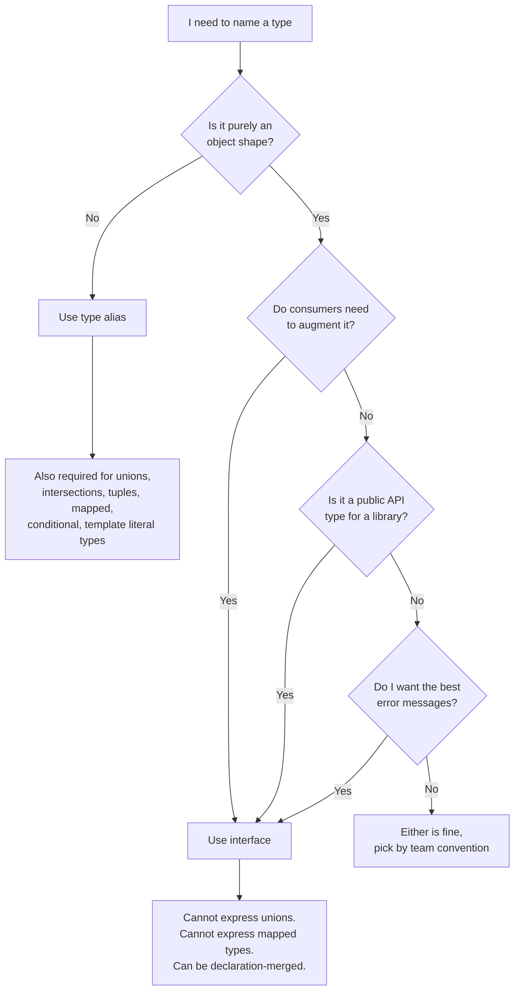
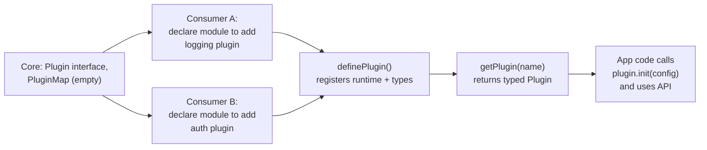

# 2.06 Interfaces vs Type Aliases

> The single most frequently asked TypeScript question on Earth: "Should I use `interface` or `type`?" The honest answer is "it depends," but a more useful answer is "interfaces for object shapes that consumers may extend; type aliases for everything else." This note exists to make that decision mechanical rather than vibes-based, by walking through every concrete capability, every compiler-level difference, and every footgun that has ever bitten a TypeScript engineer.

## 1. Purpose

TypeScript shipped with **interfaces** on day one. The original language design, going back to the October 2012 release, modeled itself heavily on the structural type systems of C# and Java, where the interface keyword declares a named contract for an object shape. In that first release there was no `type` keyword at all; the only way to give a name to a non-primitive shape was to write an `interface`. The early years of the language were dominated by thinking about types as "things objects implement," and the surface area of the type system was modest enough that this was sufficient.

Type aliases were added in TypeScript 1.4 (released November 2014) because the type system was growing more expressive. Engineers needed to give names to things that were not just object shapes: unions (`string | number`), intersections (`A & B`), tuple types (`[string, number]`), function signatures, and (eventually) conditional types, mapped types, and template literal types. An interface cannot name a union or a tuple, so a more general mechanism was required. The `type` keyword was introduced as a fully general alias: it can name any type the compiler can express, including types that interfaces literally cannot represent.

The reason both still exist, rather than one being deprecated in favour of the other, is that they are not redundant. Each has capabilities the other lacks. Interfaces can merge across multiple declarations with the same name, which is the entire mechanism by which library consumers augment third-party types (the canonical example being Express's `Request` interface, which you extend by declaring another `interface Request` block in your own code). Type aliases cannot merge. Type aliases can express unions, intersections, mapped types, conditional types, and recursion through `infer` and self-references; interfaces can do almost none of that. The two constructs carve up the type-expression space between them and the language is healthier for keeping both.

There is also a real, if small, performance difference in the compiler. Interfaces are represented internally as a "declaration" with a stable identity that the compiler caches. When you write the same interface name in many places, the compiler keeps a single canonical object and reuses it. Type aliases are transparent: every place you write the alias is, conceptually, expanded to the underlying type. For simple aliases this does not matter, but for large union/intersection types or for deeply recursive type aliases, the compiler's resolution work can balloon. The TypeScript team has stated, in the official handbook and in multiple issue threads, that interfaces are slightly preferred for object shapes for this reason, although in practice the difference is rarely measurable.

The practical purpose of this note, then, is to give you a decision procedure: given a type I want to express, which construct do I reach for? The short version is below, and the rest of the note is the long version.

- Use `interface` for object shapes that may need to be extended, that you want to expose as a public API, or where consumers may want to augment them.
- Use `type` for unions, intersections, tuples, mapped types, conditional types, function signatures, recursive types, template literal types, and any computed type.
- Use `interface` when you want the friendliest error messages for object shape mismatches (interfaces produce named errors).
- Use `type` for internal utility types and for any situation where the alias name is the only way to refer to the type at all (because an interface cannot express it).

If you read only this section, you have the decision procedure. The remaining ten sections explain why each of those rules is correct, what the compiler does under the hood to enforce the differences, and how to use the rare superpowers (declaration merging, recursive aliases) that each construct gives you.

## 2. Theory and Deep Dive

### 2.1 What an interface actually is

An `interface` declares a named object shape. It can only describe the shape of something with properties: an object literal, a class instance, or a function (functions in TypeScript are objects with a call signature). The interface keyword introduces a name into the type namespace and binds that name to a structural contract. Two objects are mutually assignable to an interface if and only if they have all the required properties with assignable types; extra properties are allowed by structural subtyping unless you assign an object literal directly (the "excess property check" rule).

```typescript
interface User {
  id: number;
  name: string;
  email?: string;
}

const u: User = { id: 1, name: "Ann" };
```

The interface body is constrained. You cannot write `interface Foo = string | number` because that is not an object shape. You cannot write `interface Foo<T> = T extends string ? T : never` because interfaces do not admit conditional types. You cannot write a mapped type inside an interface body. The interface keyword is a deliberately narrow tool: it names object shapes, full stop.

### 2.2 What a type alias actually is

A `type` alias is a binding of a name to an arbitrary type expression. The right-hand side can be anything the type grammar permits: a primitive, an object literal type, a union, an intersection, a tuple, a function signature, a conditional type, a mapped type, a template literal type, an `infer`-bearing type, or a recursive self-reference.

```typescript
type ID = number | string;
type Pair = [string, number];
type Callback<T> = (value: T) => void;
type Maybe<T> = T | null | undefined;
type NonEmpty<T> = [T, ...T[]];
type Json = string | number | boolean | null | Json[] | { [k: string]: Json };
```

Every one of those is a thing an interface cannot express. The type alias is the general-purpose naming construct; the interface is the object-shape-specialised naming construct.

### 2.3 Declaration merging (interfaces only)

When you declare two interfaces with the same name in the same scope, TypeScript merges them into a single interface that has all the properties of both. This is "declaration merging," and it is the single biggest behavioural difference between interfaces and type aliases.

```typescript
interface Window {
  customProperty: string;
}
interface Window {
  anotherProperty: number;
}
// Equivalent to a single interface Window { customProperty: string; anotherProperty: number; }
```

If the two interfaces declare a property with the same name, the types must be identical (or one must extend the other) or the compiler errors with "subsequent property declarations must have the same type." This is the mechanism behind the entire ecosystem of "module augmentation" patterns: Express's `Request.user`, Jest's `expect.Matchers`, Fastify's `FastifyRequest` decorators, Vue's `ComponentCustomProperties`, and dozens of other libraries expose an interface specifically so that consuming code can merge new fields into it.

Type aliases cannot merge. If you write `type Foo = { a: string };` and then later `type Foo = { b: number };`, the compiler errors with "Duplicate identifier 'Foo'." There is no escape hatch. This is the only situation in which an interface can do something a type alias provably cannot do.

### 2.4 Extending interfaces vs intersecting types

Both constructs can compose object shapes, but they use different syntax and have subtly different semantics.

```typescript
interface Animal { name: string; }
interface Dog extends Animal { bark(): void; }

type Animal2 = { name: string };
type Dog2 = Animal2 & { bark(): void };
```

The interface version uses `extends`, which is a single keyword that can list multiple parents: `interface Dog extends Animal, Mammal, Pet {}`. The parents must themselves be interfaces (or interface-like object types). The intersection form `&` can intersect any object types, including ones expressed as type aliases.

The differences that matter:

1. **Conflict handling.** When two interfaces are extended and they declare a property with the same name, TypeScript checks that the types are compatible (one extends the other). When two types are intersected and they declare a property with the same name, TypeScript computes the intersection of those property types. If the intersection is `never` (e.g., `string & number`), the property becomes `never`, which is usually a bug, not a useful result.

2. **Display in error messages.** An interface shows up in errors as its name. An intersection shows up as `A & B & C`, which can get unwieldy for deeply intersected types. Tools like the TypeScript playground will sometimes collapse intersections, but the raw compiler output is name-based for interfaces and structure-based for intersections.

3. **Generics.** Both support generics, but interfaces handle them slightly more cleanly because each `extends` clause can supply type arguments independently, while intersections compose the parameterised types as-is and require you to be careful about variance.

### 2.5 Recursive type capabilities

Both interfaces and type aliases can be recursive, but the recursion mechanisms differ and the practical limits differ too.

Interfaces are recursive through the type system's ordinary object graph. You can write:

```typescript
interface LinkedList<T> {
  value: T;
  next: LinkedList<T> | null;
}
```

That works because the interface's self-reference is through a property, and the compiler never needs to expand the whole tree eagerly. Each `next` access produces a `LinkedList<T> | null` and the compiler stops there.

Type aliases can also be self-referential:

```typescript
type LinkedList<T> = { value: T; next: LinkedList<T> | null };
```

This works for the same reason: the recursion is lazy. But type aliases can also recurse in ways interfaces cannot: through conditional types with `infer`, and through mapped types. The classic example is the `DeepReadonly` utility:

```typescript
type DeepReadonly<T> = {
  readonly [K in keyof T]: T[K] extends object ? DeepReadonly<T[K]> : T[K];
};
```

This is a recursive mapped conditional type. It is, straightforwardly, something an interface cannot express, because interfaces admit neither mapped types nor conditional types in their bodies. Every TypeScript utility type (`Partial`, `Pick`, `Omit`, `Record`, `ReturnType`, `Parameters`, `Awaited`, etc.) is implemented as a type alias because it has to be.

There is a hard limit on type alias recursion depth. The compiler enforces a recursion limit (currently 50 levels for most operations, with a separate 1000-instantiation check) and will error with "Type instantiation is excessively deep and possibly infinite" when you blow past it. Deeply recursive utility types over deeply nested structures can hit this. Interfaces are immune to the recursion limit when the recursion is through properties (because the compiler walks the object graph lazily), but they are immune largely because they cannot express the kinds of recursion that would hit the limit.

### 2.6 Performance profiles in the compiler

Internally, the TypeScript compiler represents an interface declaration as a "type reference" that resolves to a stable object type with a symbol identity. Two references to the same interface name in two different files resolve to the same internal type object, and the compiler can cache structural comparisons against it. Type aliases are represented as "type aliases" too, but the alias is conceptually transparent: each use site expands to the underlying type, and the compiler's structural comparison machinery then has to walk the full underlying structure.

For simple aliases (`type ID = string | number`) this is indistinguishable from an interface in cost. For complex aliases with large unions or recursive expansions, the difference is real. The TypeScript team has said in the official handbook: "Because an interface can be a better choice for a type alias that describes an object shape, in general, when you have the choice, prefer an interface." The performance reason is the most-cited justification; the named-errors reason is the second.

There are several concrete ways type aliases can become slow:

- **Large unions.** A union of 30 string literals compared against another large union produces a quadratic-feeling comparison cost, because the compiler checks pairwise assignability of union members.
- **Deep intersections.** `A & B & C & D & E` is computed by intersecting the property sets, and each property's type may itself be an intersection that has to be resolved. Heavily intersected types produce deeply nested internal structures.
- **Recursive conditional types.** A conditional type that recurses through `infer` over a deeply nested structure (like a `DeepReadonly` over a 20-level object) expands fully. The compiler memoises intermediate results but only up to the recursion limit.
- **Mapped types over `keyof T` where `T` is large.** The compiler produces a fresh object type with one synthetic property per key in `T`. For very large `T` (a few hundred keys) this dominates compile time.

Interfaces, by contrast, are largely immune to these because they cannot express these forms at all. The performance ceiling for interfaces is much lower than the ceiling for type aliases, simply because the expressiveness is lower. So the rule "prefer interfaces for object shapes" is partly a recommendation about performance and partly a recommendation about restricting yourself to a less footgun-prone subset of the type language.

### 2.7 Error message differences

This is a smaller but real point. When you have a mismatch against an interface, the compiler names the interface in the error:

```text
Type 'X' is not assignable to type 'User'.
  Types of property 'id' are incompatible.
    Type 'string' is not assignable to type 'number'.
```

When you have a mismatch against a type alias for an object shape, the compiler names the alias the same way (since TS 4.x the alias name is preserved in errors). But when the alias is a union or intersection, the compiler expands the structure:

```text
Type 'X' is not assignable to type '{ name: string; } & { age: number; }'.
```

This is less readable. For public-facing APIs, the named-interface error is friendlier.

### 2.8 When to use which



The flowchart above is the decision tree in one image. The rest of this note is the long form.

### 2.9 Module augmentation and global augmentation

A specific kind of declaration merging deserves its own mention. Module augmentation is the mechanism by which you add fields to an interface declared in another module. The canonical pattern:

```typescript
// my-app.d.ts
import express from "express";

declare module "express" {
  interface Request {
    user?: { id: string; role: string };
  }
}
```

This declares a module augmentation. The compiler merges your `Request` block into the existing `Request` interface exported by `@types/express`. Every consumer of `Request` in your codebase now sees the optional `user` property. This pattern only works because `Request` is an interface; if `@types/express` had declared `type Request = {...}` instead, this augmentation would be impossible.

Global augmentation follows the same pattern but with `declare global { interface Window {...} }`. The Vue ecosystem, the Cypress ecosystem, the Stitches ecosystem, and the React Navigation ecosystem all rely on global augmentation of a `ComponentCustomProperties` or similar interface.

### 2.10 The `extends` clause on type aliases

There is no `extends` keyword on a type alias. To compose types you use `&` (intersection) for object shapes, or you compose them directly through conditional types. Some engineers coming from OOP backgrounds write `type Foo extends Bar = {...}` by reflex and are surprised by the syntax error. The mental model: `extends` is a relationship between interfaces; intersection is a combinator between types.

```typescript
// legal
interface Foo extends Bar { extra: string; }

// syntax error
type Foo extends Bar = { extra: string };

// legal equivalent
type Foo = Bar & { extra: string };
```

### 2.11 Index signatures and mapped types

Both interfaces and type aliases admit index signatures:

```typescript
interface StringMap { [k: string]: string; }
type StringMapAlt = { [k: string]: string };
```

But mapped types are exclusively a type-alias feature. The general form `{ [K in keyof T]: ... }` is a mapped type, and the body of an interface cannot contain one. So `Partial<T>`, `Pick<T, K>`, `Omit<T, K>`, `Record<K, V>`, and every custom mapped type your codebase defines must be type aliases. This is not a stylistic choice; it is a syntactic constraint of the language.

## 3. Mental Models

The two constructs invite different mental models. Holding both models in your head at once is the key to making the choice correctly under time pressure.

**Model A: Interface as a named object shape.** An interface is a name for "what an object looks like." It is the structural analogue of a Java or C# interface, with the difference that TypeScript checks structurally rather than nominally. You can extend it, you can implement it on a class, you can declare-merge it, and you can be sure the compiler will treat its name as a stable identity for caching and for error messages.

**Model B: Type alias as a name for any type.** A type alias is a macro: it binds a name to a type expression, and at use sites the compiler (conceptually) substitutes the expression back in. Some aliases (for object shapes) behave exactly like interfaces. Others (for unions, mapped types, conditional types) have no interface analogue at all. The type alias is the more general tool, and the price of that generality is that the compiler does not always keep the name around in errors, and that complex aliases can be slower.

**Model C: Declaration merging as "two interface blocks combine."** If you write two `interface Foo {}` blocks in the same scope, they merge. This is the load-bearing mechanism for library extensibility. There is no type-alias analogue. If you find yourself wanting to "add a field to a type from a library," the library's type has to be an interface for this to work; if it is a type alias you are out of luck and must wrap instead.

**Model D: `extends` as inheritance, `&` as combination.** `interface A extends B` reads as "A is a kind of B, plus more." `type A = B & C` reads as "A is the combination of B and C." The first is a hierarchical, single-direction relationship. The second is a symmetric combinator (though `&` is not strictly commutative when conflicts exist). Choose `extends` when you are describing a subtyping relationship, choose `&` when you are combining orthogonal concerns.

**Model E: Interfaces cache, type aliases expand.** The compiler keeps a stable internal representation for each interface. Type aliases are expanded inline at every use site. For most code this difference is invisible, but for a codebase with hundreds of files referencing a single complex union, the alias form produces more compiler work than an equivalent interface would. (Where "equivalent" applies, i.e., the alias names an object shape.)

**Model F: Object shape vs type expression.** This is the unifying mental model. An interface is a specialised construct for naming one specific kind of type (the object shape). A type alias is a general construct for naming any type. Use the specialised construct when it can express what you want, because you get better errors, better performance, and (when needed) declaration merging. Use the general construct when the specialised one cannot express what you want.

## 4. Real-World Use Cases

### 4.1 Library public APIs

A library that ships types for its public surface area should generally use interfaces for object shapes. The reason is downstream extensibility: if a consumer wants to add a field to one of your types (for their own internal use, without forking your library), they can do so via declaration merging only if your type is an interface.

The Express ecosystem is the textbook example. `@types/express` declares `Request`, `Response`, and `Application` as interfaces, specifically so that consumers and middleware authors can add fields to them. Without that, the entire middleware economy (Passport, Multer, Helmet, Cookie-Parser, etc., each of which decorates `Request` with its own fields) would not be expressible in TypeScript.

### 4.2 Declaration merging for third-party type augmentation

Beyond Express, many libraries expose interfaces for the express purpose of being augmented. Vue exposes `ComponentCustomProperties` for global properties added through `app.config.globalProperties`. Fastify exposes `FastifyInstance` and `FastifyRequest` decorators via declaration merging. Jest exposes `Matchers<R>` so custom matchers appear in the `expect(...).` chain. Cypress exposes `Chainable` so custom commands are typed. The pattern is uniform: declare an interface, ship it in the public types, and document the augmentation mechanism for consumers.

### 4.3 Utility types and mapped types

Every utility type in the TypeScript standard library is implemented as a type alias: `Partial<T>`, `Required<T>`, `Readonly<T>`, `Pick<T, K>`, `Omit<T, K>`, `Record<K, V>`, `ReturnType<T>`, `Parameters<T>`, `InstanceType<T>`, `Awaited<T>`, `ConstructorParameters<T>`, `NonNullable<T>`, `Exclude<T, U>`, `Extract<T, U>`, `Uppercase<S>`, `Lowercase<S>`, `Capitalize<S>`, `Uncapitalize<S>`. None of these can be expressed as interfaces because they all rely on mapped types, conditional types, or `infer`. If you write any custom utility type, it is a type alias.

### 4.4 Discriminated unions

Discriminated unions are a type-alias-only pattern. They require a union of object types, and unions are not expressible as interfaces. Every Redux action type, every React `Reducer` action, every state machine in TS code, every `Result<T, E>` type, every GraphQL response variant, every configuration union: all type aliases.

```typescript
type Action =
  | { type: "increment" }
  | { type: "decrement" }
  | { type: "set"; value: number };
```

You cannot express this with interfaces. You could express each member as an interface and then write `type Action = Increment | Decrement | Set`, but the union itself is a type alias.

### 4.5 Function signatures

Function signatures can be named either way, but the type alias form is more common in modern TS:

```typescript
type Handler<T> = (event: T) => void;
interface HandlerAlt<T> { (event: T): void; }
```

These are functionally equivalent for most uses, but the type alias form is more readable and more flexible (it can be intersected, unioned, conditionally-typed). The interface form is occasionally used when the function is also an object with extra properties ("callable objects" or "hybrid objects"):

```typescript
interface jQuery {
  (selector: string): HTMLElement;
  ajax(url: string, opts?: object): Promise<unknown>;
  version: string;
}
```

### 4.6 Tuples

Tuple types are exclusively type aliases:

```typescript
type Pair = [string, number];
type RestTuple = [string, ...number[]];
type LabeledTuple = [start: number, end: number];
```

There is no `interface Pair extends [string, number]` syntax. Anywhere you need a tuple, you need a type alias.

### 4.7 Conditional types and `infer`

The `T extends U ? X : Y` form and the `infer T` keyword are exclusively type-alias features. Library types like `ReturnType<T>` are built on `infer`. Custom conditional types (e.g., "extract the resolved element type of a Promise, or `never` if it is not a Promise") are always type aliases.

### 4.8 Recursive utility types

`DeepReadonly`, `DeepPartial`, `DeepMutable`, `Json`, `Optional<T, K>`, `Merge<A, B>`, and many other recursive utility types are all type aliases. They cannot be interfaces because they need to recurse through mapped or conditional type machinery.

### 4.9 Internal config and shared shapes

For internal types in a single codebase where no consumer will ever augment them, the choice is largely stylistic. Pick a team convention and stick to it. Many teams default to `type` everywhere because it is more flexible and the cognitive overhead of "which one do I use" goes away. Other teams default to `interface` for object shapes and `type` for everything else, because they want the named errors and the marginal performance benefit. Either convention works as long as it is consistent.

### 4.10 Branded and opaque types

The branded type pattern (a type with a phantom field that distinguishes it from its underlying representation) uses type aliases:

```typescript
type UserId = string & { readonly brand: unique symbol };
```

This requires intersection with an object type carrying a symbol-brand. An interface could in principle describe the same shape, but the intersection form is idiomatic and works smoothly with the `Brand<T, B>` helper pattern.

## 5. Code Examples

### 5.1 Example A — Minimal and Conceptual

This section demonstrates every interface-vs-type difference in five lines each. Each subsection has the JavaScript analogue (if there is one) on the left and the TypeScript on the right.

#### 5.1.1 Basic object shape

JavaScript:

```javascript
// JSDoc analogue
/**
 * @typedef {Object} User
 * @property {number} id
 * @property {string} name
 * @property {string=} email
 */
const u = { id: 1, name: "Ann" };
```

TypeScript:

```typescript
interface User {
  id: number;
  name: string;
  email?: string;
}

// OR, equivalently:
type UserAlt = {
  id: number;
  name: string;
  email?: string;
};

const u: User = { id: 1, name: "Ann" };
```

Both forms are valid and behave identically for this minimal case.

#### 5.1.2 Declaration merging

JavaScript has no analogue; the closest thing is monkey-patching at runtime.

```javascript
// Runtime augmentation only
class Request {}
const r = new Request();
r.user = { id: "u1" }; // untyped
```

TypeScript with interface:

```typescript
interface Request {
  // defined in @types/express
}

// In your code:
declare module "express-serve-static-core" {
  interface Request {
    user?: { id: string };
  }
}

// Now every Request has .user typed
```

TypeScript with type alias (NOT POSSIBLE):

```typescript
type Request = { url: string };
type Request = { user?: { id: string } }; // ERROR: Duplicate identifier 'Request'
```

#### 5.1.3 Extending vs intersecting

JavaScript (no analogue, just a runtime spread):

```javascript
const animal = { name: "Rex" };
const dog = { ...animal, bark() { return "woof"; } };
```

TypeScript:

```typescript
interface Animal { name: string; }
interface Dog extends Animal { bark(): void; }

type AnimalT = { name: string };
type DogT = AnimalT & { bark(): void };

const d1: Dog = { name: "Rex", bark: () => undefined };
const d2: DogT = { name: "Rex", bark: () => undefined };
```

#### 5.1.4 Unions (type only)

JavaScript (no real analogue):

```javascript
// Use JSDoc union
/**
 * @typedef {(string|number)} ID
 */
```

TypeScript:

```typescript
type ID = string | number;
// interface ID = string | number; // SYNTAX ERROR
```

#### 5.1.5 Mapped types (type only)

JavaScript: no analogue.

TypeScript:

```typescript
type PartialUser = Partial<User>;
// interface PartialUser = Partial<User>; // SYNTAX ERROR, no mapped types in interfaces
```

#### 5.1.6 Conditional types and infer (type only)

JavaScript: no analogue.

TypeScript:

```typescript
type Unwrap<T> = T extends Promise<infer U> ? U : T;
type ElementType<T> = T extends (infer U)[] ? U : never;
```

#### 5.1.7 Recursive types

JavaScript: no analogue.

TypeScript with interface:

```typescript
interface Tree {
  value: number;
  children: Tree[];
}
```

TypeScript with type alias:

```typescript
type TreeAlt = {
  value: number;
  children: TreeAlt[];
};

// Recursion type aliases cannot do:
type Json =
  | string
  | number
  | boolean
  | null
  | Json[]
  | { [key: string]: Json };

type DeepReadonly<T> = {
  readonly [K in keyof T]: T[K] extends object
    ? DeepReadonly<T[K]>
    : T[K];
};
```

#### 5.1.8 Function signatures

JavaScript:

```javascript
/**
 * @typedef {(value: number) => void} NumberHandler
 */
const h = (v) => { console.log(v); };
```

TypeScript:

```typescript
type NumberHandler = (value: number) => void;
interface NumberHandlerAlt {
  (value: number): void;
}

const h: NumberHandler = (v) => { console.log(v); };
```

#### 5.1.9 Tuples (type only)

JavaScript: no real analogue (arrays are open-ended at runtime).

TypeScript:

```typescript
type Pair = [string, number];
const p: Pair = ["age", 42];
// interface Pair extends [string, number]; // SYNTAX ERROR
```

#### 5.1.10 Error message differences

JavaScript: not applicable.

TypeScript with interface:

```typescript
interface UserI { id: number; name: string; }
const badI: UserI = { id: "oops", name: "Ann" };
// Error: Type 'string' is not assignable to type 'number'.
// (and the parent message names 'UserI')
```

TypeScript with intersection:

```typescript
type IdPart = { id: number };
type NamePart = { name: string };
type UserX = IdPart & NamePart;
const badX: UserX = { id: "oops", name: "Ann" };
// Error: Type 'string' is not assignable to type 'number'.
// (parent message names '{ id: number; } & { name: string; }')
```

The error text for the interface case is more readable because the name is preserved.

### 5.2 Example B — Production-Grade

This section builds a typed plugin system that uses interface declaration merging for extensibility, alongside type aliases for the parts that interfaces cannot express. This is the most important real-world pattern that distinguishes the two constructs.

JavaScript skeleton:

```javascript
// plugins.js — runtime plugin system, untyped

const registry = {};

export function definePlugin(name, plugin) {
  if (registry[name]) {
    throw new Error(`Plugin ${name} already registered`);
  }
  registry[name] = plugin;
  return plugin;
}

export function getPlugin(name) {
  if (!registry[name]) {
    throw new Error(`Plugin ${name} not found`);
  }
  return registry[name];
}

// app.js
import { definePlugin, getPlugin } from "./plugins.js";

// A base plugin has a name, a version, and an init hook.
const loggingPlugin = definePlugin("logging", {
  name: "logging",
  version: "1.0.0",
  init(config) {
    console.log("[logging] initialised with", config);
    return { log: (msg) => console.log("[logging]", msg) };
  },
});

// Users augment the config:
// (In JS this is informal; the config is just an object.)
const logger = loggingPlugin.init({ level: "info" });
logger.log("hello");
```

TypeScript skeleton:

```typescript
// plugins.ts — fully typed plugin system with declaration merging

// --- Core types that consumers will augment ---

// Public API: the BasePlugin interface. Consumers can declare-merge
// additional known plugin names into the PluginMap interface so that
// getPlugin("logging") returns the right plugin type without casts.
export interface PluginMap {
  // intentionally empty in core; augmented by consumers
}

// Public API: every plugin conforms to this interface.
export interface Plugin<TConfig = unknown, TApi = unknown> {
  readonly name: string;
  readonly version: string;
  init(config: TConfig): TApi;
}

// Type alias: cannot be an interface because it is a generic helper.
export type PluginName = keyof PluginMap;

export type PluginConfig<TName extends PluginName> =
  PluginMap[TName] extends Plugin<infer TConfig, infer UnusedApi>
    ? TConfig
    : unknown;

export type PluginApi<TName extends PluginName> =
  PluginMap[TName] extends Plugin<infer UnusedConfig, infer TApi>
    ? TApi
    : unknown;

// --- Registry implementation ---

const registry = new Map<string, Plugin>();

export function definePlugin<TName extends PluginName>(
  name: TName,
  plugin: Plugin<PluginConfig<TName>, PluginApi<TName>> & { name: TName }
): typeof plugin {
  if (registry.has(name)) {
    throw new Error(`Plugin ${String(name)} already registered`);
  }
  registry.set(name, plugin);
  return plugin;
}

export function getPlugin<TName extends PluginName>(name: TName): PluginMap[TName] {
  const p = registry.get(name);
  if (!p) {
    throw new Error(`Plugin ${String(name)} not found`);
  }
  return p as PluginMap[TName];
}

// app.ts
import { definePlugin, getPlugin } from "./plugins.js";

// --- Augment the PluginMap to register our plugins ---

declare module "./plugins.js" {
  interface PluginMap {
    logging: Plugin<LoggingConfig, LoggingApi>;
  }
}

interface LoggingConfig {
  level: "info" | "warn" | "error";
}
interface LoggingApi {
  log(message: string): void;
}

// Define the plugin. The init signature is fully typed.
const loggingPlugin = definePlugin("logging", {
  name: "logging",
  version: "1.0.0",
  init(config) {
    // config is LoggingConfig here, typed by the augmentation
    console.log(`[logging:${config.level}] initialised`);
    return {
      log(message) {
        console.log(`[logging:${config.level}]`, message);
      },
    };
  },
});

// Look it up by name: TName is "logging", so we get back the
// augmented PluginMap["logging"] type, which is the Plugin interface.
const p = getPlugin("logging");
const api = p.init({ level: "info" });
api.log("hello");

// Compile-time errors:
// getPlugin("nonexistent"); // ERROR: Argument of type '"nonexistent"' is not
                              // assignable to parameter of type 'PluginName'.
// p.init({ level: "trace" }); // ERROR: '"trace"' is not assignable to
                                // '"info" | "warn" | "error"'.
```

This example demonstrates every key concept:

- The `Plugin` shape is an interface, so consumers can implement it with their own typed config and API.
- The `PluginMap` interface is intentionally empty in core and is declaration-merged by consumers via `declare module`. Each consumer adds a key for each plugin they register.
- The `PluginName`, `PluginConfig<TName>`, and `PluginApi<TName>` types are type aliases because they use `keyof` and `infer`, which interfaces cannot express.
- The `definePlugin` function is generic over `TName extends PluginName`, so a typo in the plugin name produces a compile-time error rather than a runtime error.
- The `getPlugin` function returns `PluginMap[TName]`, which means the compiler knows the specific plugin type for each name.
- The consumer's `LoggingConfig` and `LoggingApi` are interfaces (they are pure object shapes); they could equally be type aliases.

This is the pattern that large TypeScript applications use for plugin systems, dependency injection containers, and event bus registries. It only works because interfaces can be declaration-merged; an equivalent system built purely on type aliases would require manual registry types and would be much less ergonomic.

## 6. Common Mistakes and Anti-Patterns

### 6.1 Trying to declare-merge a type alias

```typescript
type Foo = { a: string };
type Foo = { b: number }; // ERROR: Duplicate identifier 'Foo'
```

If you need declaration merging, you need an interface. There is no workaround. If you encounter this error and you cannot change the original declaration from `type` to `interface`, you cannot merge; you must wrap or redeclare in a new name.

### 6.2 Using `extends` on a type alias

```typescript
type Bar = { a: string };
type Foo extends Bar = { b: number }; // SYNTAX ERROR
```

Type aliases do not support `extends`. Use intersection instead:

```typescript
type Foo = Bar & { b: number };
```

### 6.3 Expecting an interface to support unions

```typescript
interface ID = string | number; // SYNTAX ERROR
```

An interface can only describe object shapes. If you need a union, use a type alias. If you need "either an object of shape A or an object of shape B" (a discriminated union), use a type alias whose right-hand side is a union of object types; the individual members can be interfaces, but the union itself is an alias.

### 6.4 Naming collisions between interface and type alias

```typescript
type Foo = { a: string };
interface Foo { b: number; } // ERROR: Duplicate identifier 'Foo'
```

Interfaces and type aliases share the same namespace. You cannot have an interface and a type alias with the same name in the same scope. This bites engineers who try to "convert" a type alias to an interface by adding the interface and forgetting to delete the alias.

### 6.5 Expecting error messages to be identical

A type alias for an object shape produces a named error message ("Type X is not assignable to type Foo") in modern TS (4.x+), but a type alias for a union or intersection produces an expanded error message ("Type X is not assignable to type A | B | C"). If you are designing a public API and want friendly errors for downstream users, prefer interfaces for the shapes you expose.

### 6.6 Performance issues with deeply nested type aliases

A type alias like `type Deep = { a: { b: { c: { d: { e: { f: string } } } } } }` is fine. But a recursive utility applied to a deeply nested type can blow up:

```typescript
type Flatten<T> = T extends object
  ? { [K in keyof T]: Flatten<T[K]> }[keyof T]
  : T;

type Flat = Flatten<HugeNestedType>; // Can blow recursion limit
```

The compiler will emit "Type instantiation is excessively deep and possibly infinite" if you exceed its depth limit (currently 50 levels of conditional-type recursion in most paths). If you hit this, you need to either restructure the type (manual unrolling, less-deep recursion) or restructure the data (flatter shapes).

### 6.7 Intersection conflicts producing `never`

```typescript
type A = { count: number };
type B = { count: string };
type AB = A & B; // AB.count is number & string, which is never
```

The intersection is computed property-by-property. `number & string` is `never`. The compiler does not error; you get a type with a `never` property, and the bug only surfaces when you try to assign a value to `count`. With interface extension, the same scenario would produce a clear "Interfaces incorrectly extend each other" error. If you are combining multiple sources, prefer interfaces; if you must use intersections, validate them with `satisfies` against an expected shape.

### 6.8 Forgetting that interfaces cannot express `keyof`, `infer`, conditional types

Engineers sometimes attempt to write a generic utility as an interface:

```typescript
interface GetReturnType<T> = T extends (...args: any[]) => infer R ? R : never;
// SYNTAX ERROR
```

The right-hand side of an interface body cannot be a conditional type. Use a type alias.

### 6.9 Module augmentation that does not match the original

When you augment a module's interface, the augmentation must be structurally compatible. If you redeclare an existing property with an incompatible type, the compiler errors:

```typescript
declare module "express-serve-static-core" {
  interface Request {
    url: number; // ERROR: 'url' is declared as number in augmentation but
                 //        as string in the original interface.
  }
}
```

Always read the original interface before augmenting. Add new properties or compatible overrides only.

### 6.10 Augmenting the wrong module path

Express's `Request` interface is declared in `express-serve-static-core`, not in `express`. Augmenting `declare module "express"` does nothing. This is the most common reason an "obvious" augmentation does not take effect. Read the package's type definitions to find the correct module specifier.

### 6.11 Treating type aliases as nominal

Type aliases are aliases, not distinct types. Two aliases for the same underlying type are mutually assignable. If you want nominal behaviour, use branded types:

```typescript
type UserId = string & { readonly brand: unique symbol };
type OrderId = string & { readonly brand: unique symbol };
// UserId and OrderId are NOT assignable to each other.
```

### 6.12 Over-using interfaces for tuple-shaped data

Some engineers use interfaces to describe fixed-length arrays:

```typescript
interface Pair {
  0: string;
  1: number;
  length: 2;
}
```

This works but is unidiomatic. Use a tuple type alias instead: `type Pair = [string, number]`. The tuple form participates in destructuring, spread, and array methods correctly; the interface form does not.

## 7. Best Practices and Design Patterns

### 7.1 Prefer `interface` for object shapes that consumers may extend

If you are publishing a library and exposing an object type, default to `interface`. The marginal cost is zero, the marginal benefit is that consumers can augment. If you are sure no consumer will ever want to augment, you can use `type`, but the surety is rarely real.

### 7.2 Prefer `type` for unions, intersections, mapped types, conditional types, tuples

This is not a preference; it is a requirement. Interfaces cannot express these. The only question is whether to use a type alias for an object shape (where interfaces are also valid) — that is the case where the rule in 7.1 applies.

### 7.3 Use `interface` for public API types, `type` for internal utility types

A reasonable convention: the types you export from your package's `index.ts` are interfaces; the types you use inside your implementation are type aliases. This gives you named errors for downstream users and flexibility for internal helpers.

### 7.4 Document when you choose one over the other

If your team has a convention, write it down. If a particular file deviates (e.g., "this is a type alias because we need to intersect it later"), say so in a comment. Cognitive load is the enemy of large codebases.

### 7.5 Use `declare module` for third-party augmentation, not `declare global`

`declare global` is for true global augmentations (rare; mostly legacy or library-defined globals like `Window`). For augmenting a module you import, use `declare module "name"`. The two are not interchangeable.

### 7.6 Keep declaration merging minimal and additive

When you augment a third-party interface, only add fields. Do not change existing field types. If you must change a type, fork the type or wrap it in a new type alias; do not mutate the original interface.

### 7.7 Use `&` for combining orthogonal concerns, `extends` for subtyping

If `Dog` is-a `Animal` plus more, use `interface Dog extends Animal`. If you are combining `Serializable` and `Loggable` mixins onto an unrelated type, use `type Foo = Serializable & Loggable & { ... }`.

### 7.8 Avoid recursive type aliases that blow the depth limit

If you have a recursive utility type that you apply to data of unknown depth, add a depth counter parameter to force termination:

```typescript
type DeepReadonly<T, Depth extends number = 7> = [Depth] extends [0]
  ? T
  : T extends object
  ? { readonly [K in keyof T]: DeepReadonly<T[K], Decrement<Depth]> }
  : T;
```

Where `Decrement` is a tuple-based counter. This caps recursion at a known depth and avoids the "excessively deep" error.

### 7.9 Use `satisfies` to validate type aliases without widening

When you declare a const with a complex type alias and want to check it without widening, use `satisfies`:

```typescript
type RouteConfig = { path: string; method: "GET" | "POST"; handler: (req: unknown) => unknown };

const routes = {
  home: { path: "/", method: "GET", handler: () => "ok" },
  submit: { path: "/submit", method: "POST", handler: () => "ok" },
} satisfies Record<string, RouteConfig>;
```

This validates the shape and preserves the literal types in `routes` for downstream narrowing.

### 7.10 Prefer interfaces for class hierarchies

If you have a class hierarchy, use `interface` for the abstract shape and `implements` on the class. This gives you multiple inheritance (`class Foo implements A, B, C`) and named errors.

### 7.11 Use type aliases for branded types and nominal patterns

```typescript
declare const brand: unique symbol;
type Brand<T, B> = T & { readonly [brand]: B };
type UserId = Brand<string, "UserId">;
type Email = Brand<string, "Email">;
```

Interfaces cannot cleanly express this pattern because they cannot intersect with a symbol-keyed phantom object.

### 7.12 Do not mix conventions within a single file

If a file uses `interface` for some shapes and `type` for others, the reader has to context-switch. Pick one default per file (or per module) and deviate only with a comment explaining why.

### 7.13 Test your public types with `expectType` or `tsd`

For library authors, write type-level tests that assert your exported types behave as expected. Tools like `tsd` or `vitest`'s `expectTypeOf` let you write assertions like "this function returns `string`, not `string | undefined`." This catches regressions when you change from interface to type alias or vice versa.

## 8. Technical Interview Knowledge

### 8.1 What is the difference between `interface` and `type`?

The headline differences: interfaces can declare-merge (two blocks with the same name combine into one), type aliases cannot. Interfaces can only describe object shapes, type aliases can name any type (unions, intersections, tuples, mapped types, conditional types, primitives, etc.). Interfaces are slightly faster in the compiler and produce named errors. Both can be generic, both can be recursive, and both can describe the same object shapes. The practical rule: use `interface` for object shapes that consumers may extend, use `type` for everything else.

### 8.2 What is declaration merging?

When you declare two interfaces with the same name in the same scope, TypeScript merges them into a single interface with the combined properties. This is the mechanism behind module augmentation: you can declare `interface Request` in your own file, add fields to it, and the merged interface is used everywhere. Type aliases cannot merge; declaring `type Foo` twice produces a "Duplicate identifier" error. Declaration merging is the entire reason the Express/Jest/Fastify/Vue augmentation ecosystems work.

### 8.3 Can a type alias extend an interface?

Not with `extends`; type aliases do not support `extends`. But you can intersect a type alias with an interface:

```typescript
interface Animal { name: string; }
type Dog = Animal & { bark(): void; };
```

This is the equivalent of `interface Dog extends Animal`. The intersection produces the same combined shape; the differences are in conflict handling (intersections compute `never` on conflicts; interface extension produces a clear error) and in error messages.

### 8.4 When would you use `type` over `interface`?

Use `type` when you need to express something an interface cannot: a union (`A | B`), a tuple (`[string, number]`), a mapped type (`{ [K in keyof T]: ... }`), a conditional type (`T extends U ? X : Y`), a template literal type (`` `prefix-${T}` ``), or a recursive utility type. Use `type` for internal utility types and for branded types. Use `interface` when you want declaration merging, when you want named errors for an object shape, or when you are publishing a public API.

### 8.5 Why are interface error messages better?

When the compiler compares a value against an interface, the error names the interface: "Type X is not assignable to type User." When the compiler compares against a type alias for a union or intersection, the error expands the underlying type: "Type X is not assignable to type A | B | C." The named form is more readable and more actionable, especially for engineers who are not deeply familiar with the codebase. For object-shape type aliases, modern TS preserves the name in errors, but for unions and intersections it does not.

### 8.6 Can interfaces represent unions?

No. An interface body can only contain property, method, index signature, call signature, and construct signature declarations. It cannot contain a union. If you need "this OR that," you need a type alias. You can express a discriminated union as a type alias whose right-hand side is a union of interface-typed object shapes:

```typescript
interface Increment { type: "increment"; }
interface Decrement { type: "decrement"; }
type Action = Increment | Decrement;
```

The union itself is the alias; the members are interfaces.

### 8.7 What is the performance difference?

Interfaces are cached as stable type objects with a symbol identity; type aliases are expanded inline at each use site. For simple object-shape aliases the difference is invisible. For large unions, deep intersections, or recursive conditional types, the alias form produces more compiler work because the underlying structure has to be walked. The TypeScript team recommends preferring interfaces for object shapes in performance-sensitive codebases, but in practice the difference is rarely measurable outside of very large codebases (hundreds of thousands of lines) with many shared utility types.

### 8.8 How would you augment an Express `Request`?

Express's `Request` interface is declared in the `express-serve-static-core` package (re-exported by `express`). To add a field, declare a module augmentation in a `.d.ts` file (or any TS file that is included in your compilation):

```typescript
// types/express.d.ts
import "express";

declare module "express-serve-static-core" {
  interface Request {
    user?: { id: string; role: "admin" | "user" };
  }
}
```

After this, every `Request` in your codebase has the optional `user` property, typed as specified. Common augmentations: Passport's `user`, Multer's `file` and `files`, Cookie-Parser's `cookies`, session middleware's `session`. Each of these ships its own augmentation that you import once and the merged interface takes effect globally.

## 9. Practical Exercises

### 9.1 Demonstrate declaration merging

**Exercise.** Declare an interface `Config` with a `port` property. Then, in a separate `interface Config` block in the same file, add a `host` property. Then, in a third block, add a `logLevel` property. Verify that a value of type `Config` must have all three.

**JavaScript reference** (no real analogue; we just spread):

```javascript
const base = { port: 3000 };
const withHost = { ...base, host: "localhost" };
const withLog = { ...withHost, logLevel: "info" };
console.log(withLog);
```

**TypeScript solution.**

```typescript
interface Config {
  port: number;
}

interface Config {
  host: string;
}

interface Config {
  logLevel: "debug" | "info" | "warn" | "error";
}

const config: Config = {
  port: 3000,
  host: "localhost",
  logLevel: "info",
};

// Errors:
// const bad: Config = { port: 3000, host: "localhost" }; // missing logLevel
// const bad2: Config = { port: "3000", host: "localhost", logLevel: "info" }; // port wrong type
```

**Key point.** Three separate `interface Config` blocks merge into a single interface with three properties. The same is not possible with `type Config = ...`; each block would error as a duplicate identifier.

### 9.2 Build a typed plugin system using interface augmentation

**Exercise.** Build a `defineCommand` function that registers commands by name. Each command has a `run(args: string[]): void` method. Use interface augmentation so that registered commands are typed by name when looked up.

**JavaScript reference.**

```javascript
const commands = new Map();

export function defineCommand(name, command) {
  commands.set(name, command);
  return command;
}

export function runCommand(name, args) {
  const c = commands.get(name);
  if (!c) throw new Error(`Unknown command: ${name}`);
  c.run(args);
}

// usage
defineCommand("greet", { run: (args) => console.log("Hello", args[0]) });
runCommand("greet", ["Ann"]);
```

**TypeScript solution.**

```typescript
// commands.ts
export interface Command {
  run(args: string[]): void;
}

export interface CommandMap {
  // augmented by consumers
}

export type CommandName = keyof CommandMap;

export function defineCommand<TName extends string>(
  name: TName,
  command: Command
): void {
  // Register the command. We use a Map<string, Command> at runtime.
  registry.set(name, command);

  // At the type level, augment CommandMap. (This requires the consumer
  // to write the `declare module` block; the function itself cannot
  // augment at runtime. So the consumer does both steps.)
}

const registry = new Map<string, Command>();

export function runCommand<TName extends CommandName>(
  name: TName,
  args: string[]
): void {
  const c = registry.get(name);
  if (!c) throw new Error(`Unknown command: ${String(name)}`);
  c.run(args);
}

// app.ts
import { Command, defineCommand, runCommand } from "./commands.js";

declare module "./commands.js" {
  interface CommandMap {
    greet: Command;
    farewell: Command;
  }
}

defineCommand("greet", {
  run(args) {
    console.log("Hello", args[0]);
  },
});

defineCommand("farewell", {
  run(args) {
    console.log("Goodbye", args[0]);
  },
});

runCommand("greet", ["Ann"]);
runCommand("farewell", ["Bob"]);

// Compile error:
// runCommand("missing", []); // Argument of type '"missing"' is not
                              // assignable to parameter of type 'CommandName'.
```

**Key point.** The `CommandMap` interface is empty in core and is declaration-merged by consumers. After augmentation, `runCommand` accepts only known names and produces a compile error for unknown ones. This is the same pattern Express, Fastify, Vue, and Jest use.

### 9.3 Convert an interface-heavy codebase to use type aliases where appropriate

**Exercise.** Given the following interface-heavy code, identify which interfaces should remain interfaces and which should be converted to type aliases. Explain each decision.

```typescript
interface Status { code: number; message: string; }
interface Result { ok: boolean; status: Status; data: unknown; }
interface ID = string | number; // SYNTAX ERROR
interface Pair { 0: string; 1: number; length: 2; } // unidiomatic tuple
interface Handler { (event: unknown): void; }
interface EventHandlerMap { [k: string]: Handler; }
interface DeepReadonly<T> { readonly [K in keyof T]: DeepReadonly<T[K]>; } // SYNTAX ERROR, mapped type
interface Routes = "home" | "about" | "contact"; // SYNTAX ERROR, union
```

**TypeScript solution.**

```typescript
// Status is a pure object shape with no need for declaration merging.
// Either interface or type works. Keep as interface for named errors.
interface Status {
  code: number;
  message: string;
}

// Result composes Status. Could be interface extending Status, or
// type alias intersecting with the data field. Use interface extends
// because it is a subtyping relationship.
interface Result extends Status {
  ok: boolean;
  data: unknown;
}

// ID is a union. Must be a type alias.
type ID = string | number;

// Pair is a tuple. Must be a type alias.
type Pair = [string, number];

// Handler is a function signature. Either works; type alias is
// more idiomatic.
type Handler = (event: unknown) => void;

// EventHandlerMap is an index signature. Either works; type alias
// is more idiomatic.
type EventHandlerMap = { [k: string]: Handler };

// DeepReadonly is a recursive mapped type. Must be a type alias.
type DeepReadonly<T> = {
  readonly [K in keyof T]: T[K] extends object
    ? DeepReadonly<T[K]>
    : T[K];
};

// Routes is a union of string literals. Must be a type alias.
type Routes = "home" | "about" | "contact";
```

**Key point.** Three of the original declarations are syntax errors because they try to express things interfaces cannot (unions, mapped types). The tuple-shaped interface is technically valid but unidiomatic. The remaining shapes (Status, Result, Handler, EventHandlerMap) can be either; the choice is stylistic and should follow team convention.

### 9.4 Implement a mapped type that an interface could not express

**Exercise.** Implement a `Optional<T, K>` utility type that makes the specified keys of `T` optional, leaving the rest required. Show that this cannot be expressed as an interface.

**JavaScript reference** (no real analogue; just an object-spread helper):

```javascript
function makeOptional(obj, keys) {
  const next = { ...obj };
  for (const k of keys) {
    // mark as optional by convention; runtime has no concept
  }
  return next;
}
```

**TypeScript solution.**

```typescript
type Optional<T, K extends keyof T> = Omit<T, K> & Partial<Pick<T, K>>;

// Usage
interface User {
  id: number;
  name: string;
  email: string;
  age: number;
}

type UserPatch = Optional<User, "email" | "age">;
// UserPatch has id and name required, email and age optional.

const patch: UserPatch = { id: 1, name: "Ann" }; // valid
const bad: UserPatch = { name: "Ann" }; // ERROR: id is required

// This cannot be an interface because:
// - It uses Omit, Pick, and Partial, all of which are mapped types
//   implemented as type aliases.
// - The body of an interface cannot contain a mapped type.
// - The generic parameter K cannot be constrained by `extends keyof T`
//   inside an interface declaration in this way.
```

**Alternative implementation using a direct mapped type:**

```typescript
type OptionalDirect<T, K extends keyof T> = {
  [P in keyof T as P extends K ? P : never]?: T[P];
} & {
  [P in Exclude<keyof T, K>]: T[P];
};

// Equivalent to Optional<T, K> above.
```

**Key point.** Any time the type depends on `keyof T`, `Pick`, `Omit`, `Partial`, mapped types, or conditional types, it must be a type alias. There is no interface equivalent.

## 10. Mini-Project Blueprint

### Build an extensible typed plugin system

**Goal.** Build a plugin registry that allows consumers to register plugins with strongly-typed configurations and APIs, and to look them up by name with full type inference. The system uses interface declaration merging for the registry and type aliases for the helper types.



### Requirements

1. A `Plugin<TConfig, TApi>` interface in core with `name`, `version`, and `init(config: TConfig): TApi` members.
2. A `PluginMap` interface in core, intentionally empty, intended for consumer augmentation.
3. A `PluginName` type alias defined as `keyof PluginMap`.
4. A `PluginConfig<TName>` type alias using conditional `infer` to extract the config type from `PluginMap[TName]`.
5. A `PluginApi<TName>` type alias using conditional `infer` to extract the API type.
6. A `definePlugin<TName extends PluginName>(name, plugin)` function that registers the plugin at runtime.
7. A `getPlugin<TName extends PluginName>(name)` function that returns the typed plugin.
8. A `requirePlugin<TName extends PluginName>(name)` function that throws if not registered.
9. A `hasPlugin(name: PluginName): boolean` predicate.
10. A `listPlugins(): PluginName[]` listing function.
11. Documentation that explains the `declare module "./plugins.js"` pattern for consumers.

### Acceptance Criteria

- Registering a plugin with a wrong config type produces a compile-time error.
- Looking up a plugin by a name that was not augmented produces a compile-time error.
- Looking up a plugin by a name that was augmented but not registered at runtime throws a runtime error from `requirePlugin`.
- The `init` return type is correctly inferred as the augmented `TApi`, so calling `plugin.init(config).apiMethod()` is fully typed.
- Two consumers can independently augment `PluginMap` and both augmentations take effect.
- A typo in a plugin name (`getPlugin("loggign")` instead of `getPlugin("logging")`) is a compile-time error, not a runtime error.
- The system compiles under `strict: true` with `noImplicitAny: true`.

### Stretch Goals

- Add a `PluginLifecycle` interface with `onRegister`, `onInit`, `onDestroy` hooks.
- Add dependency declaration: `Plugin.dependencies: PluginName[]` and a topological-sort initialiser.
- Add versioning: each plugin declares `version` and a `requires: string` semver range.
- Add scoped plugins: `definePlugin(scope, name, plugin)` with `PluginMap[scope][name]` typed access.
- Add async plugins: `init` returns `Promise<TApi>` and `getPlugin` returns `Promise<Plugin>` if the plugin is async.
- Generate JSON Schema for each plugin's config for runtime validation.
- Emit a markdown table of registered plugins and their config types as part of the build.

### Testing Strategy

- **Unit tests** for the registry functions: register, lookup, missing-plugin error.
- **Type tests** using `tsd` or `expectTypeOf` to assert that augmented plugins have the right types.
- **Integration tests** that load two consumer files (each augmenting `PluginMap`) and verify both are visible.
- **Compiler tests** that assert certain typos produce compile-time errors (use `// @ts-expect-error` annotations).
- **Property-based tests** that register random plugins with random configs and verify runtime behaviour matches the type-level contracts.

### Full TypeScript skeleton

```typescript
// plugins.ts

export interface Plugin<TConfig = unknown, TApi = unknown> {
  readonly name: string;
  readonly version: string;
  init(config: TConfig): TApi;
}

export interface PluginMap {
  // augmented by consumers via `declare module "./plugins.js"`
}

export type PluginName = keyof PluginMap;

export type PluginConfig<TName extends PluginName> =
  PluginMap[TName] extends Plugin<infer TConfig, infer UnusedApi>
    ? TConfig
    : unknown;

export type PluginApi<TName extends PluginName> =
  PluginMap[TName] extends Plugin<infer UnusedConfig, infer TApi>
    ? TApi
    : unknown;

const registry = new Map<string, Plugin>();

export function definePlugin<TName extends PluginName>(
  name: TName,
  plugin: Plugin<PluginConfig<TName>, PluginApi<TName>> & { name: TName }
): void {
  if (registry.has(name)) {
    throw new Error(`Plugin ${String(name)} already registered`);
  }
  registry.set(name, plugin as Plugin);
}

export function getPlugin<TName extends PluginName>(name: TName): PluginMap[TName] {
  const p = registry.get(name);
  if (!p) {
    throw new Error(`Plugin ${String(name)} not found`);
  }
  return p as PluginMap[TName];
}

export function hasPlugin(name: PluginName): boolean {
  return registry.has(name);
}

export function listPlugins(): PluginName[] {
  return Array.from(registry.keys()) as PluginName[];
}

// consumer.ts
import { definePlugin, getPlugin, Plugin } from "./plugins.js";

declare module "./plugins.js" {
  interface PluginMap {
    logging: Plugin<LoggingConfig, LoggingApi>;
    auth: Plugin<AuthConfig, AuthApi>;
  }
}

interface LoggingConfig {
  level: "info" | "debug" | "error";
}
interface LoggingApi {
  log(message: string): void;
}

interface AuthConfig {
  secret: string;
}
interface AuthApi {
  validate(token: string): boolean;
}

definePlugin("logging", {
  name: "logging",
  version: "1.0.0",
  init(config) {
    return {
      log(message) {
        console.log(`[${config.level}]`, message);
      },
    };
  },
});

definePlugin("auth", {
  name: "auth",
  version: "1.0.0",
  init(config) {
    return {
      validate(token) {
        return token === config.secret;
      },
    };
  },
});

const logger = getPlugin("logging").init({ level: "info" });
logger.log("hello");

const auth = getPlugin("auth").init({ secret: "abc" });
auth.validate("abc");

// Compile-time errors:
// getPlugin("missing"); // ERROR: not in PluginMap
// getPlugin("logging").init({ level: "trace" }); // ERROR: invalid level
// getPlugin("auth").init({}); // ERROR: missing secret
```

### Full JavaScript skeleton (for comparison)

```javascript
// plugins.js
const registry = new Map();

export function definePlugin(name, plugin) {
  if (registry.has(name)) {
    throw new Error(`Plugin ${name} already registered`);
  }
  registry.set(name, plugin);
}

export function getPlugin(name) {
  const p = registry.get(name);
  if (!p) {
    throw new Error(`Plugin ${name} not found`);
  }
  return p;
}

export function hasPlugin(name) {
  return registry.has(name);
}

export function listPlugins() {
  return Array.from(registry.keys());
}

// consumer.js
import { definePlugin, getPlugin } from "./plugins.js";

definePlugin("logging", {
  name: "logging",
  version: "1.0.0",
  init(config) {
    return {
      log(message) {
        console.log(`[${config.level}]`, message);
      },
    };
  },
});

definePlugin("auth", {
  name: "auth",
  version: "1.0.0",
  init(config) {
    return {
      validate(token) {
        return token === config.secret;
      },
    };
  },
});

const logger = getPlugin("logging").init({ level: "info" });
logger.log("hello");

const auth = getPlugin("auth").init({ secret: "abc" });
auth.validate("abc");

// No compile-time errors in JS; typos and wrong configs fail at runtime.
// getPlugin("missing"); // runtime error
// getPlugin("logging").init({ level: "trace" }); // logs "[trace] ..." silently
// getPlugin("auth").init({}); // runtime TypeError when reading config.secret
```

The JavaScript version works at runtime but loses every compile-time guarantee. The TypeScript version, by combining interfaces (for `Plugin`, `PluginMap`, `LoggingConfig`, `LoggingApi`, `AuthConfig`, `AuthApi`) and type aliases (for `PluginName`, `PluginConfig<TName>`, `PluginApi<TName>`), gives you a system in which typos are impossible and config mismatches are caught at compile time.

## 11. Core Connections

This note ties into the broader TypeScript Mastery module along the following axes:

- [[2.01 Design Goals and Limitations]] — The TypeScript team's design goal of "a typed superset of JavaScript" is why both interfaces and type aliases exist: interfaces serve the structural-typing-of-objects use case, type aliases serve the type-expression use case. Neither could be removed without breaking large portions of the ecosystem.
- [[2.02 Basic Type Space]] — The basic type space (primitives, arrays, tuples, object types) is what both interfaces and type aliases name. Interfaces name a subset (object types); type aliases name the whole space.
- [[2.05 Unions and Intersections]] — Unions and intersections are exclusively type-alias territory. Intersections (`&`) are the type-alias equivalent of interface `extends`. This note assumes familiarity with unions and intersections as the foundation for the comparison.
- [[2.07 Generics and Constraints]] — Both interfaces and type aliases support generics. The `extends` keyword in `<T extends U>` is the constraint syntax for both, distinct from the `extends` clause on interface declarations. This is a common source of confusion worth distinguishing explicitly.
- [[2.09 Mapped Types]] — Mapped types are exclusively type-alias features; this note's Section 2.11 explains why. The full power of mapped types is covered in the dedicated note.
- [[2.10 Utility Types Deep Dive]] — Every utility type in the standard library is a type alias. This note's Section 4.3 enumerates them and explains why none can be interfaces.

The unifying throughline is this: TypeScript's type system has two naming constructs because it has two kinds of types to name. Interfaces name object shapes; type aliases name everything. The two overlap for object shapes, where either works, but they diverge sharply for unions, intersections, mapped types, conditional types, and recursive utility types, where only type aliases apply, and for declaration merging, where only interfaces apply. Mastering the choice between them is mastering one of the most-asked questions in TypeScript engineering, and the decision procedure in Section 2.8 is the one image to keep in your head when you have to choose fast. The rest of the TypeScript Mastery module builds on this distinction: generics (2.07), mapped types (2.09), utility types (2.10), and conditional types (later notes) all rely on type aliases; library design, module augmentation, and plugin systems all rely on interfaces. Knowing both is non-optional.

#typescript #interface #type-alias #declaration-merging #module-augmentation #type-system #advanced-types
