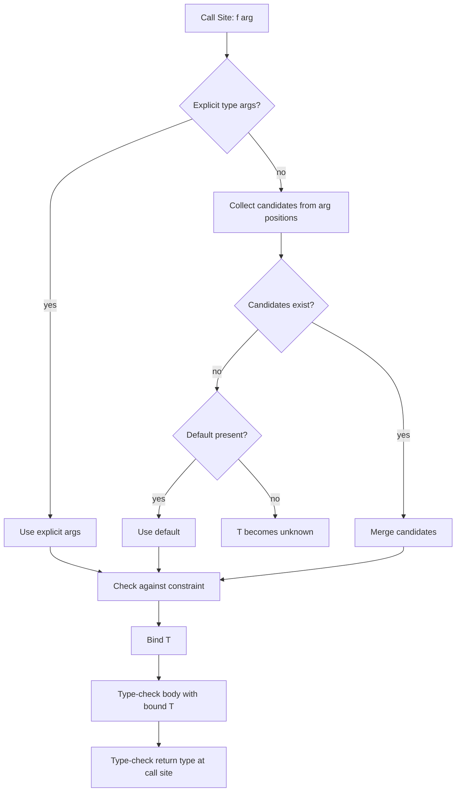

# 2.07 Generics and Constraints

## 1. Purpose

Generics are the most important feature in TypeScript for writing code that is simultaneously **reusable** and **type-safe**. Without them you are stuck with a binary choice: write a function that works for one specific type and lose reusability, or write a function that accepts `any` and lose every guarantee the compiler could give you. Generics dissolve that choice. A generic function is parametrized by one or more type variables, and the compiler fills those variables in at each call site based on the actual arguments. The result is one body of code that the type checker instantiates into a different concrete signature at every use, with no runtime cost.

The mechanical idea is borrowed from ML and Haskell and Java and C#, but TypeScript's implementation has its own shape. TypeScript generics are ** erased at runtime**. The compiler uses them while checking your program and then deletes them. There is no `T` at runtime. There is no reified generic type information. There is no reflection that can tell you whether an `Array<string>` is really an array of strings. This is a design constraint inherited from JavaScript itself (and from the requirement that TS compiles to plain JS), and it shapes everything about how you use generics: every constraint you express must be checkable statically, and every operation you perform on a generic value must be sound without runtime type information.

Generics exist because four extremely common programming patterns cannot be typed without them:

1. **Collections** that hold values of an unknown element type (`Array<T>`, `Set<T>`, `Map<K, V>`, `Promise<T>`).
2. **Factories** that construct instances of a type chosen by the caller (`new Container<T>(initial: T)`, `createReducer<S, A>`).
3. **Helpers** that operate uniformly over many types (`identity`, `pipe`, `compose`, `memoize`, `deepClone`).
4. **Public APIs** that expose caller-chosen shapes (a fetcher that returns whatever the caller says the endpoint returns; a form library that knows the field names of your specific form).

Without generics these would either be typed as `any` (so every downstream use loses type information) or duplicated for each concrete type (so a `StringArray` and a `NumberArray` and a `UserArray` would each be a separate class). Both outcomes are unacceptable in a codebase of any size.

Constraints exist because **an unconstrained generic is almost useless**. A function `<T>(x: T): T` can only return `x` and do nothing else meaningful with it — it cannot call any method on `x`, cannot read any property of `x`, cannot compare `x` to anything, cannot serialize `x`. To do any of those things the function needs to know that `T` has at least some shape. Constraints are how you say "T is not just any type; T must be assignable to this shape." The `extends` keyword in a type-parameter position is the constraint operator. `<T extends { id: string }>` means "T can be any type, as long as that type has an `id: string` property." Inside the function body the compiler treats `T` as if it were the constraint type, so you can access `.id`. At the call site the compiler checks that the actual argument satisfies the constraint.

The trade-off generics introduce is **complexity versus reuse**. Every type parameter you add to a function multiplies the cognitive load on its readers, the inference burden on the compiler, and the surface area for subtle bugs (variance surprises, defaults that mask inference failures, constraints that accidentally exclude valid types). A well-designed generic API pays for itself the second time it is used; a poorly designed generic API costs more than the duplication it replaced. Section 7 of this note is dedicated to navigating that trade-off.

The goal of this note is to make the following second nature:

1. Read a generic signature like `<T, K extends keyof T>(obj: T, key: K): T[K]` and immediately know what it does, what it allows, and what it forbids.
2. Choose the right constraint for a given problem: no constraint when you truly operate uniformly, `extends SomeShape` for structural requirements, `extends keyof T` for property access, conditional types for "if T is X then Y else Z."
3. Diagnose variance bugs that arise from assigning a `Handler<Cat>` to a `Handler<Animal>` slot.
4. Design a generic API where the type parameters are obvious, the constraints are minimal, the defaults are sensible, and the inference works at every realistic call site.

By the end you should be able to implement a typed repository pattern, a typed query builder, and a typed event emitter, and to explain to a colleague why each generic parameter is necessary and what its constraint buys you.

## 2. Theory and Deep Dive

### 2.1 The generic function

The simplest generic is the identity function. It takes a value of any type and returns it unchanged.

```typescript
// TS
function identity<T>(value: T): T {
  return value;
}

const a = identity(42);          // const a: 42  (literal type inferred)
const b = identity("hello");     // const b: "hello"
const c = identity<boolean>(true); // explicit type argument: const c: boolean
```

```javascript
// JS
function identity(value) {
  return value;
}

const a = identity(42);
const b = identity("hello");
const c = identity(true);
```

Notice two things. First, the `T` in angle brackets is a **type parameter declaration**; the `T` in the parameter list and return type is a **use** of that parameter. Second, TypeScript performs **bidirectional inference**: when you call `identity(42)`, it infers `T` from the argument, and because `42` is a literal it infers the literal type `42` (in `const` contexts). When you pass `<boolean>` explicitly, you override inference.

The same syntax works for arrow functions and methods:

```typescript
// TS
const identity = <T>(value: T): T => value;

class Box {
  wrap<T>(value: T): T[] {
    return [value];
  }
}
```

In a `.tsx` file the `<T>` arrow generic is ambiguous with JSX, so the convention is to write `<T,>` (with a trailing comma) or `<T extends unknown>`. The trailing comma is the idiomatic fix.

### 2.2 Multiple type parameters

A function can take any number of type parameters. The `pair` function takes two unrelated types and returns a tuple:

```typescript
// TS
function pair<A, B>(first: A, second: B): [A, B] {
  return [first, second];
}

const p = pair("answer", 42);  // const p: [string, number]
```

```javascript
// JS
function pair(first, second) {
  return [first, second];
}

const p = pair("answer", 42);
```

The order of type parameters matters. By convention, type parameters that can be inferred from arguments come before those that cannot, and the ones that the caller is most likely to specify explicitly come last. The reason is that TypeScript lets you supply only a prefix of the type arguments explicitly: `pair<string, number>("a", 1)` works, but you cannot write `pair<?, number>("a", 1)`. So if you have a parameter that is rarely specified and one that is frequently specified, put the rare one first.

### 2.3 The generic class

A class can be generic over a type parameter declared after the class name:

```typescript
// TS
class Stack<T> {
  private items: T[] = [];

  push(item: T): void {
    this.items.push(item);
  }

  pop(): T | undefined {
    return this.items.pop();
  }

  peek(): T | undefined {
    return this.items[this.items.length - 1];
  }
}

const numbers = new Stack<number>();
numbers.push(1);
numbers.push(2);
const top = numbers.pop();  // const top: number | undefined
```

```javascript
// JS
class Stack {
  constructor() {
    this.items = [];
  }

  push(item) {
    this.items.push(item);
  }

  pop() {
    return this.items.pop();
  }

  peek() {
    return this.items[this.items.length - 1];
  }
}

const numbers = new Stack();
numbers.push(1);
numbers.push(2);
const top = numbers.pop();
```

The type parameter `T` is in scope for the entire class declaration, including instance fields, methods, the constructor signature, and accessors. Static members cannot use the instance type parameter — that would be unsound because statics are shared across all instantiations of the class.

A subtle point: a generic class is **not** a single class at runtime. There is one runtime class, `Stack`, shared by `Stack<number>` and `Stack<string>`. The type parameter exists only at compile time. So `numbers instanceof Stack` is true, and `Stack === Stack` regardless of the type argument used.

### 2.4 The generic interface and type alias

Interfaces and type aliases can also be generic:

```typescript
// TS
interface Box<T> {
  value: T;
  unwrap(): T;
}

type Pair<A, B> = { first: A; second: B };

const numberBox: Box<number> = {
  value: 42,
  unwrap() { return this.value; },
};

const stringIntPair: Pair<string, number> = { first: "answer", second: 42 };
```

```javascript
// JS
const numberBox = { value: 42, unwrap() { return this.value; } };
const stringIntPair = { first: "answer", second: 42 };
```

Interfaces and type aliases are largely interchangeable when both are generic over the same parameters; see [[2.06 Interfaces vs Type Aliases]] for the full comparison. The relevant distinction for generics is that interfaces can be **declared** to merge across multiple declarations (declaration merging), while type aliases cannot. If you write two `interface Box<T>` blocks in the same scope they merge; two `type Box<T> = ...` blocks is an error.

### 2.5 Default type parameters

A type parameter can have a default, used when the caller does not supply it explicitly and inference cannot determine it:

```typescript
// TS
interface Response<T = unknown, E = Error> {
  data: T;
  error: E | null;
}

const r1: Response = { data: "hello", error: null };            // Response<unknown, Error>
const r2: Response<string> = { data: "hello", error: null };    // Response<string, Error>
const r3: Response<string, SyntaxError> = { data: "hello", error: null };
```

```javascript
// JS
// No runtime equivalent — defaults are erased along with the type parameters themselves.
const r1 = { data: "hello", error: null };
const r2 = { data: "hello", error: null };
const r3 = { data: "hello", error: null };
```

Defaults have two main uses. The first is **backward compatibility**: if you ship a library with `interface Config<T> { options: T }` and later decide to add a second type parameter, you can write `interface Config<T, U = T>` so existing call sites that supply only one argument continue to work. The second is **convenience defaults**: a `fetchJson<T = unknown>(url): Promise<T>` lets callers who do not care about the response type omit the argument and get `unknown` back, forcing them to narrow.

A type parameter with a default must come **after** all type parameters without defaults. This is the same rule as for function arguments with defaults. You cannot write `<T = string, U>` because the compiler cannot tell whether `Foo<number>` means `T = number, U = default` or something else.

### 2.6 Constraints with `extends`

The `extends` keyword in a type-parameter position is the constraint operator. It says: "this type parameter must be assignable to the type after `extends`."

```typescript
// TS
function lengthOf<T extends { length: number }>(value: T): number {
  return value.length;
}

lengthOf("hello");        // ok: string has length
lengthOf([1, 2, 3]);      // ok: array has length
lengthOf({ length: 10 }); // ok: object has length: number
lengthOf(42);             // error: number has no length property
```

```javascript
// JS
function lengthOf(value) {
  return value.length;
}

lengthOf("hello");
lengthOf([1, 2, 3]);
lengthOf({ length: 10 });
lengthOf(42); // runtime TypeError: undefined is not a function — well, undefined.length
```

The constraint serves two roles. **Inside the function body**, the compiler treats `T` as if it were the constraint type, so you can access every member the constraint guarantees. **At the call site**, the compiler checks that the actual argument satisfies the constraint, so the call only type-checks when it is sound.

The constraint is an **upper bound** in the subtype lattice. `T extends U` means "T is a subtype of U" or equivalently "T is assignable to U." So `T extends Animal` accepts `Animal`, `Cat`, `Dog`, and any subtype. It rejects `Vehicle` and `string`.

The constraint does **not** change the inferred type of `T`. If you call `lengthOf("hello")`, TypeScript infers `T = "hello"` (the literal string type), not `T = { length: number }`. The constraint just narrows the space of legal values for `T`; the actual inferred type can be more specific. This is the key fact that makes `T extends Lengthwise` more useful than just accepting `Lengthwise` directly: the return type and any other uses of `T` retain the specific type.

### 2.7 The `keyof` constraint

The single most useful constraint pattern in TypeScript is `<T, K extends keyof T>`. It says: "K must be one of the keys of T." This is how you write a type-safe property accessor:

```typescript
// TS
function getProperty<T, K extends keyof T>(obj: T, key: K): T[K] {
  return obj[key];
}

const user = { name: "Alice", age: 30, role: "admin" };

const name = getProperty(user, "name");  // const name: string
const age = getProperty(user, "age");    // const age: number
const role = getProperty(user, "role");  // const role: string
const missing = getProperty(user, "email"); // error: "email" is not assignable to "name" | "age" | "role"
```

```javascript
// JS
function getProperty(obj, key) {
  return obj[key];
}

const user = { name: "Alice", age: 30, role: "admin" };
const name = getProperty(user, "name");
const age = getProperty(user, "age");
const role = getProperty(user, "role");
const missing = getProperty(user, "email"); // returns undefined at runtime, no warning
```

There are three things to notice. First, `keyof T` is itself a type — the union of all known keys of `T`. For the `user` object that is `"name" | "age" | "role"`. Second, the constraint `K extends keyof T` makes the second argument constrained to that union: you cannot pass `"email"` because it is not in the union. Third, the **indexed access type** `T[K]` looks up the type of the property at key `K`, so the return type is exactly the type of `user.age` (which is `number`), not `string | number | string`.

The same pattern drives `setProperty`, `pick`, `omit`, and a long list of utility functions. We cover `keyof` and indexed access in more depth in [[2.08 Typeof Keyof Lookup]].

### 2.8 Conditional type constraints

A constraint can be a **conditional type**, which lets you express "T must satisfy this structural requirement" in more elaborate ways. The simplest case is just a structural constraint, which is what we have already seen:

```typescript
// TS
function withId<T extends { id: string }>(value: T): T {
  return value;
}

withId({ id: "abc", name: "Alice" });  // ok
withId({ id: 42 });                    // error: id must be string
withId({ name: "Alice" });             // error: missing id
```

```javascript
// JS
function withId(value) {
  return value;
}

withId({ id: "abc", name: "Alice" });
withId({ id: 42 });
withId({ name: "Alice" });
```

But conditional types also let you write constraints that **branch on T**. For example, "T must be an array, and the element type must extend number":

```typescript
// TS
type NumericArray<T extends unknown[]> =
  number extends T[number] ? T : never;

function sum<T extends unknown[]>(arr: T & NumericArray<T>): number {
  return arr.reduce((acc, x) => acc + (x as number), 0);
}
```

This is a contrived example but it shows the pattern: you can write a constraint that depends on the value of `T` in ways that `extends` alone cannot express. A more realistic example is the standard library's `Awaited<T>` type, which unwraps nested promises until it finds a non-promise type, and is used in the constraint position to require that something be "thenable."

A simpler and very common pattern is to use a conditional type inside the body of a generic function, rather than in the constraint:

```typescript
// TS
type Unpacked<T> =
  T extends (infer U)[] ? U :
  T extends Promise<infer U> ? U :
  T;

function firstElement<T>(value: T): Unpacked<T> {
  // This body is illustrative; in practice you would need runtime narrowing.
  return value as Unpacked<T>;
}
```

The `infer` keyword extracts a type from a pattern. We will not go deep on `infer` here — that belongs in the conditional types note — but you should know it exists and that it composes with constraints.

### 2.9 Variance

Variance is the rule that says, given a subtype relation `Cat extends Animal`, what is the relation between `F<Cat>` and `F<Animal>` for some type constructor `F`? TypeScript does not have explicit variance annotations (no `in`/`out` keywords like Scala or Kotlin, except in the experimental `--moduleResolution`-independent proposals). Instead, variance is **structural and emergent** from how `T` is used inside the generic.

The two kinds that matter:

- **Covariance**: `F<Cat>` is assignable to `F<Animal>` if `Cat extends Animal`. Return types are covariant.
- **Contravariance**: `F<Animal>` is assignable to `F<Cat>` if `Cat extends Animal`. Function parameter types are contravariant **when `strictFunctionTypes` is on**.

The classical example:

```typescript
// TS
class Animal { name: string; }
class Dog extends Animal { breed: string; }

let animalHandler: (a: Animal) => void;
const dogHandler: (d: Dog) => void = (d) => console.log(d.breed);

// With strictFunctionTypes on, this is an error:
animalHandler = dogHandler;
// Error: Type '(d: Dog) => void' is not assignable to type '(a: Animal) => void'.
//   Types of parameters 'd' and 'a' are incompatible.
```

```javascript
// JS
// At runtime there is no checking; this will throw when animalHandler is called with a non-Dog Animal.
class Animal { constructor() { this.name = ""; } }
class Dog extends Animal { constructor() { super(); this.breed = ""; } }

let animalHandler;
const dogHandler = (d) => console.log(d.breed);
animalHandler = dogHandler;
animalHandler(new Animal()); // runtime TypeError: undefined.breed
```

Why is this an error? Because `animalHandler` could be called with any `Animal` — say, a `Cat`. But `dogHandler` accesses `d.breed`, which only exists on `Dog`. So allowing the assignment would be unsound. The contravariance rule forbids it.

For a long time TypeScript was unsound here: function parameter types were bivariant. The `strictFunctionTypes` flag in `tsconfig.json` flips them to contravariant, which is sound. The flag is on by default in any project created after 2019 and you should never turn it off.

The variance of a more complex generic type — like `interface Box<T> { get(): T; set(v: T): void }` — is determined by the positions `T` appears in. `get()` returns `T`, so it is covariant. `set(v: T)` consumes `T`, so it is contravariant. A type that does both is **invariant**: `Box<Cat>` is not assignable to `Box<Animal>` nor the other way around. TypeScript models this correctly when `strictFunctionTypes` is on.

### 2.10 Inference at the call site

The most important practical skill is reading what TypeScript will infer at a given call site. The rules are:

1. If type arguments are supplied explicitly, use them.
2. Otherwise, infer from the types of the arguments.
3. If multiple inference candidates exist, infer the **best common supertype** for covariant positions and the **best common subtype** for contravariant positions. In practice this means unions for covariant and intersection for contravariant, but TypeScript has a series of heuristics that prefers unions over intersections in many cases.
4. If no candidates exist (no argument depends on `T`), use the default if there is one, otherwise `T` is `unknown` (or, for older TS versions, `any` with a noImplicitAny error).

The flow looks like this:



The key insight is that inference is **positional**. If you have `<T>(a: T, b: T) => T` and you call `f(1, "x")`, TypeScript infers `T = string | number` because it has two candidates (`1` widening to `number`, and `"x"`) and merges them into a union. If you wanted exact matching you would need to write the function differently or supply explicit arguments.

### 2.11 Generic defaults versus overloads

Defaults and overloads solve overlapping problems but are not interchangeable. Defaults are for when the type parameter can be derived without an argument (for example, when the default is `unknown` or a sensible fallback). Overloads are for when the function's behavior — including its return type — depends on the shape of the arguments in ways that a single signature cannot express. A common pattern is to combine them:

```typescript
// TS
function parse<T = unknown>(input: string, reviver?: (key: string, value: unknown) => T): T {
  return JSON.parse(input, reviver as any) as T;
}
```

```javascript
// JS
function parse(input, reviver) {
  return JSON.parse(input, reviver);
}
```

Here the default `T = unknown` means callers who do not specify get `unknown`, which forces narrowing on use. Callers who know the shape can write `parse<User>(json)`.

## 3. Mental Models

The right mental models make generics feel obvious rather than arcane. Here are five.

**Model 1: Generics are placeholders for types.** A type parameter `T` is a hole in the type signature that gets filled in at the call site. Until then the compiler cannot say anything specific about `T` except what the constraint allows. Once the call site provides an argument, the hole is filled with the inferred type and the function's signature is specialized to that type.

**Model 2: Constraints are upper bounds.** `T extends U` reads as "T is a U" or "T is at most as general as U." Inside the function body, the compiler treats `T` as if it were `U` for the purposes of property access. At the call site, the actual argument must be assignable to `U`. The inferred `T` itself can be more specific than `U`.

**Model 3: `keyof T` is the union of T's keys.** When you see `<K extends keyof T>`, read it as "K is one of the keys of T." When you see `T[K]`, read it as "the type of the property of T at key K." Together they are the building block of every type-safe property-access helper.

**Model 4: Variance is about direction.** Out positions (return types, readable properties) are covariant: a `Producer<Cat>` can be used where a `Producer<Animal>` is expected. In positions (function parameters, setter arguments) are contravariant: a `Consumer<Animal>` can be used where a `Consumer<Cat>` is expected. Both positions together are invariant: a `Box<T>` that both reads and writes `T` cannot be substituted in either direction.

**Model 5: Inference is positional merging.** Each argument that depends on `T` contributes a candidate. The candidates are merged: unions for covariant positions, intersections for contravariant positions, with heuristics that prefer unions when ambiguous. If no candidate exists, the default is used; otherwise `unknown`.

These five models cover 95 percent of generic code you will ever read or write. When you encounter a generic that does not fit one of them — usually because it uses `infer` in a conditional type or recursive type aliases — slow down and trace through it explicitly.

## 4. Real-World Use Cases

Generics are not a feature you reach for occasionally; they are everywhere in mature TypeScript code. Here are the load-bearing examples.

**`Array<T>`.** Every array in TypeScript is parametrized by its element type. `Array<number>` is a list of numbers. The methods `map<U>(fn: (x: T, i: number) => U): Array<U>`, `filter(pred: (x: T, i: number) => boolean): Array<T>`, and `reduce<U>(fn: (acc: U, x: T) => U, init: U): U` are all generic themselves, and `reduce` even takes a second type parameter so that the accumulator type can differ from the element type.

```typescript
// TS
const nums: Array<number> = [1, 2, 3];
const doubled: Array<number> = nums.map((n) => n * 2);
const sum: number = nums.reduce((acc, n) => acc + n, 0);
const names: Array<string> = nums.map((n) => `item-${n}`);
```

```javascript
// JS
const nums = [1, 2, 3];
const doubled = nums.map((n) => n * 2);
const sum = nums.reduce((acc, n) => acc + n, 0);
const names = nums.map((n) => `item-${n}`);
```

**`Map<K, V>` and `Set<T>`.** The ES2015 collections are generic over their key and value types. TypeScript's lib typings declare them as `interface Map<K, V> { get(key: K): V | undefined; set(key: K, value: V): this; ... }`.

**`Promise<T>`.** Every async value is parametrized by its resolution type. `Promise<T>` declares `then<U>(onfulfilled: (value: T) => U | PromiseLike<U>): Promise<U>`. The `async/await` desugaring preserves these types so an `async function` returning `Promise<User>` produces a `Promise<User>` at the call site. See [[1.20 Promises Specification]] and [[1.22 Async Await Runtime]].

**React function components.** A function component is parametrized by its props:

```typescript
// TS
interface ButtonProps {
  label: string;
  onClick: () => void;
  disabled?: boolean;
}

function Button(props: ButtonProps) {
  return null as any; // rendering elided
}

// Or generically:
function withLogging<P>(Component: React.FC<P>): React.FC<P> {
  return (props) => {
    console.log("render", props);
    return <Component {...props} />;
  };
}
```

```javascript
// JS
function Button(props) {
  return null;
}

function withLogging(Component) {
  return (props) => {
    console.log("render", props);
    return Component(props);
  };
}
```

The higher-order component `withLogging` is generic over `P` so it can wrap any component without losing the props type of the wrapped component.

**Express `RequestHandler`.** Express's typings parametrize the request handler by route params, response body, and request query:

```typescript
// TS
import type { RequestHandler } from "express";

interface UserParams { id: string; }
interface UserQuery { includePosts?: string; }
interface UserResponse { id: string; name: string; }

const getUser: RequestHandler<UserParams, UserResponse, {}, UserQuery> = (req, res) => {
  const id = req.params.id;          // string
  const include = req.query.includePosts; // string | undefined
  res.json({ id, name: "Alice" });
};
```

```javascript
// JS
const getUser = (req, res) => {
  const id = req.params.id;
  const include = req.query.includePosts;
  res.json({ id, name: "Alice" });
};
```

**Redux `Reducer<S, A>`.** A reducer is generic over state and action:

```typescript
// TS
type Action =
  | { type: "increment" }
  | { type: "decrement" }
  | { type: "set"; value: number };

function reducer(state: number, action: Action): number {
  switch (action.type) {
    case "increment": return state + 1;
    case "decrement": return state - 1;
    case "set": return action.value;
  }
}
```

```javascript
// JS
function reducer(state, action) {
  switch (action.type) {
    case "increment": return state + 1;
    case "decrement": return state - 1;
    case "set": return action.value;
  }
}
```

**Zod schemas.** Zod is a runtime validator whose generic types mirror the schema shape:

```typescript
// TS
import { z } from "zod";

const UserSchema = z.object({
  id: z.string(),
  age: z.number().int().nonnegative(),
});

type User = z.infer<typeof UserSchema>;
// User is { id: string; age: number; }

function fetchUser(): Promise<User> {
  return fetch("/api/me").then((r) => r.json()).then((j) => UserSchema.parse(j));
}
```

```javascript
// JS
const { z } = require("zod");
const UserSchema = z.object({
  id: z.string(),
  age: z.number().int().nonnegative(),
});

function fetchUser() {
  return fetch("/api/me").then((r) => r.json()).then((j) => UserSchema.parse(j));
}
```

`z.infer<typeof UserSchema>` is the canonical example of using `infer` inside a conditional type to derive a TypeScript type from a runtime value's type. See [[2.09 Mapped Types]] for the underlying mechanics.

**Generic data fetcher.** A common API is a typed `fetchJson<T>(url): Promise<T>` that lets the caller specify the response shape:

```typescript
// TS
async function fetchJson<T = unknown>(url: string, init?: RequestInit): Promise<T> {
  const response = await fetch(url, init);
  if (!response.ok) {
    throw new Error(`HTTP ${response.status}`);
  }
  return (await response.json()) as T;
}

interface User { id: string; name: string; }

const user = await fetchJson<User>("/api/users/me");
console.log(user.name.toUpperCase());
```

```javascript
// JS
async function fetchJson(url, init) {
  const response = await fetch(url, init);
  if (!response.ok) {
    throw new Error(`HTTP ${response.status}`);
  }
  return await response.json();
}

const user = await fetchJson("/api/users/me");
console.log(user.name.toUpperCase());
```

The default `T = unknown` forces callers who do not specify to narrow before using the result. The cast `as T` is the only escape hatch, and it is honest about the fact that the runtime JSON is not actually validated against `T` — see Section 6 for why this is a footgun.

## 5. Code Examples

### 5.1 Example A — Minimal and Conceptual

Three foundational generics every TypeScript developer should be able to write from memory: `identity`, `pair`, and `Box`.

```typescript
// TS — identity
function identity<T>(value: T): T {
  return value;
}

const id1 = identity(42);         // 42
const id2 = identity<string>("x"); // string
```

```javascript
// JS — identity
function identity(value) {
  return value;
}

const id1 = identity(42);
const id2 = identity("x");
```

```typescript
// TS — pair
function pair<A, B>(first: A, second: B): [A, B] {
  return [first, second];
}

const p1 = pair("answer", 42);     // [string, number]
const p2 = pair<number, boolean>(0, true); // [number, boolean]
```

```javascript
// JS — pair
function pair(first, second) {
  return [first, second];
}

const p1 = pair("answer", 42);
const p2 = pair(0, true);
```

```typescript
// TS — Box
class Box<T> {
  constructor(private value: T) {}

  get(): T {
    return this.value;
  }

  set(value: T): void {
    this.value = value;
  }

  map<U>(fn: (value: T) => U): Box<U> {
    return new Box(fn(this.value));
  }
}

const numberBox = new Box(42);
const stringBox = numberBox.map((n) => `value is ${n}`);
console.log(stringBox.get());  // "value is 42"
```

```javascript
// JS — Box
class Box {
  constructor(value) {
    this.value = value;
  }

  get() {
    return this.value;
  }

  set(value) {
    this.value = value;
  }

  map(fn) {
    return new Box(fn(this.value));
  }
}

const numberBox = new Box(42);
const stringBox = numberBox.map((n) => `value is ${n}`);
console.log(stringBox.get());
```

The `Box.map` method demonstrates generic methods on a generic class: the class is generic over `T`, the method is generic over `U`, and `U` is inferred from the mapping function's return type.

### 5.2 Example B — Production-Grade

A typed repository pattern. The repository provides CRUD over an entity type, with a `keyof` constraint on the ID field, generic DTOs for create and update operations, and an in-memory backing store. This is the kind of code you would write in a real backend service.

```typescript
// TS
interface Entity {
  id: string;
  createdAt: string;
  updatedAt: string;
}

type NewEntity<T> = Omit<T, "id" | "createdAt" | "updatedAt">;
type UpdateEntity<T> = Partial<NewEntity<T>>;

class Repository<T extends Entity> {
  private store = new Map<string, T>();

  constructor(private generateId: () => string = () => crypto.randomUUID()) {}

  create(input: NewEntity<T>): T {
    const now = new Date().toISOString();
    const entity = {
      ...input,
      id: this.generateId(),
      createdAt: now,
      updatedAt: now,
    } as T;
    this.store.set(entity.id, entity);
    return entity;
  }

  findById(id: string): T | undefined {
    return this.store.get(id);
  }

  findMany(predicate: (entity: T) => boolean): T[] {
    const result: T[] = [];
    for (const entity of this.store.values()) {
      if (predicate(entity)) result.push(entity);
    }
    return result;
  }

  update(id: string, patch: UpdateEntity<T>): T | undefined {
    const existing = this.store.get(id);
    if (!existing) return undefined;
    const updated = {
      ...existing,
      ...patch,
      id: existing.id,
      createdAt: existing.createdAt,
      updatedAt: new Date().toISOString(),
    } as T;
    this.store.set(id, updated);
    return updated;
  }

  delete(id: string): boolean {
    return this.store.delete(id);
  }

  findByField<K extends keyof T>(field: K, value: T[K]): T[] {
    return this.findMany((entity) => entity[field] === value);
  }
}

interface User extends Entity {
  email: string;
  name: string;
  role: "admin" | "user";
}

const users = new Repository<User>();

const alice = users.create({ email: "alice@example.com", name: "Alice", role: "admin" });
const bob = users.create({ email: "bob@example.com", name: "Bob", role: "user" });

const found = users.findByField("role", "admin");
console.log(found.map((u) => u.name));  // ["Alice"]

const updated = users.update(alice.id, { name: "Alice Smith" });
console.log(updated?.name);  // "Alice Smith"

// Type-safe: cannot update a field that does not exist
// users.update(alice.id, { nope: 1 }); // error
```

```javascript
// JS
class Repository {
  constructor(generateId = () => crypto.randomUUID()) {
    this.store = new Map();
    this.generateId = generateId;
  }

  create(input) {
    const now = new Date().toISOString();
    const entity = {
      ...input,
      id: this.generateId(),
      createdAt: now,
      updatedAt: now,
    };
    this.store.set(entity.id, entity);
    return entity;
  }

  findById(id) {
    return this.store.get(id);
  }

  findMany(predicate) {
    const result = [];
    for (const entity of this.store.values()) {
      if (predicate(entity)) result.push(entity);
    }
    return result;
  }

  update(id, patch) {
    const existing = this.store.get(id);
    if (!existing) return undefined;
    const updated = {
      ...existing,
      ...patch,
      id: existing.id,
      createdAt: existing.createdAt,
      updatedAt: new Date().toISOString(),
    };
    this.store.set(id, updated);
    return updated;
  }

  delete(id) {
    return this.store.delete(id);
  }

  findByField(field, value) {
    return this.findMany((entity) => entity[field] === value);
  }
}

const users = new Repository();

const alice = users.create({ email: "alice@example.com", name: "Alice", role: "admin" });
const bob = users.create({ email: "bob@example.com", name: "Bob", role: "user" });

const found = users.findByField("role", "admin");
console.log(found.map((u) => u.name));

const updated = users.update(alice.id, { name: "Alice Smith" });
console.log(updated?.name);

// No type checking at all in JS — passing { nope: 1 } silently works and adds a nope field.
users.update(alice.id, { nope: 1 });
```

Several design choices are visible in this code:

1. **The constraint `T extends Entity`** ensures every entity managed by the repository has `id`, `createdAt`, and `updatedAt`. Without it the `create` method could not reference `entity.id`.
2. **The mapped types `NewEntity<T>` and `UpdateEntity<T>`** derive the input shapes from `T`, so callers never have to specify an ID or timestamps when creating, and can supply any subset of fields when updating. See [[2.10 Utility Types Deep Dive]] for `Omit` and `Partial`.
3. **The `findByField<K extends keyof T>` method** uses the `keyof` constraint to make field-based lookups type-safe: `findByField("role", "admin")` compiles because `"role"` is a key of `User` and `"admin"` is a valid `User["role"]`. `findByField("role", 99)` fails because `99` is not assignable to `User["role"]`.
4. **The `as T` cast** in `create` and `update` is honest about a limitation: TypeScript cannot prove that spreading `input` plus a few fields produces exactly `T`. The cast is sound because the constraint guarantees the missing fields are exactly the ones we add, but the compiler cannot verify it. Documenting why a cast is sound is a best practice.

## 6. Common Mistakes and Anti-Patterns

This section catalogs the mistakes that come up most often in code review.

**Mistake 1: Using `any` instead of generics.** When you write `function fetchJson(url: string): Promise<any>` you lose every downstream guarantee. Callers can do anything with the result, including calling methods that do not exist. The fix is a generic with a default of `unknown`:

```typescript
// TS — bad
async function fetchJsonBad(url: string): Promise<any> {
  return (await fetch(url)).json();
}

// TS — good
async function fetchJsonGood<T = unknown>(url: string): Promise<T> {
  return (await fetch(url)).json() as Promise<T>;
}
```

```javascript
// JS — no distinction possible at runtime
async function fetchJson(url) {
  return (await fetch(url)).json();
}
```

**Mistake 2: Forgetting the constraint, leaving `T` too loose.** A function `<T>(value: T) => value.length` does not compile because `T` could be `number` or `boolean` and those have no `.length`. The fix is `<T extends { length: number }>`. Without the constraint the compiler forces you to write code that works for every possible `T`, which is usually just `return value`.

```typescript
// TS — bad
function lengthBad<T>(value: T): number {
  return value.length; // error: Property 'length' does not exist on type 'T'.
}

// TS — good
function lengthGood<T extends { length: number }>(value: T): number {
  return value.length;
}
```

```javascript
// JS
function length(value) {
  return value.length;
}
```

**Mistake 3: Making the constraint too tight.** A function `<T extends MyClass>` rejects plain object literals, third-party subclasses that do not extend `MyClass`, and mixed-in classes that satisfy the same shape but are not declared as subclasses. Prefer structural constraints (`<T extends { id: string }>` or `<T extends Entity>`) over nominal ones (`<T extends MyClass>`) unless you genuinely need nominal matching. TypeScript is structurally typed; fight it and you lose reuse.

```typescript
// TS — bad: rejects perfectly good shapes
class MyEntity { id: string = ""; }
function save<T extends MyEntity>(e: T): void {}

save({ id: "x" }); // error: object literal is not a MyEntity

// TS — good: structural
interface HasId { id: string; }
function saveGood<T extends HasId>(e: T): void {}

saveGood({ id: "x" }); // ok
```

```javascript
// JS — no distinction; both work
function save(e) {}
save({ id: "x" });
```

**Mistake 4: Not using `keyof` for property access.** A function `function get(obj: any, key: string): any` accepts any string and returns `any`, so `get(user, "emial")` (note the typo) compiles and silently returns `undefined`. The fix is `<T, K extends keyof T>(obj: T, key: K): T[K]`. Typos become compile errors.

```typescript
// TS — bad
function getBad(obj: any, key: string): any {
  return obj[key];
}

// TS — good
function getGood<T, K extends keyof T>(obj: T, key: K): T[K] {
  return obj[key];
}

const user = { name: "Alice", age: 30 };
getBad(user, "emial");  // ok, returns undefined
// getGood(user, "emial"); // error: "emial" is not assignable to "name" | "age"
```

```javascript
// JS
function get(obj, key) {
  return obj[key];
}

const user = { name: "Alice", age: 30 };
get(user, "emial"); // undefined, silently
```

**Mistake 5: Wrong default type parameter.** A default of `any` defeats the purpose of generics. A default of `string` for a parameter that can legitimately be `number` is wrong. Choose defaults that are sound for callers who do not specify — usually `unknown`, the empty object type `{}`, or the most common expected type.

```typescript
// TS — bad
function parseBad<T = any>(input: string): T {
  return JSON.parse(input) as T;
}
const x = parseBad("123");  // any, no checking downstream

// TS — good
function parseGood<T = unknown>(input: string): T {
  return JSON.parse(input) as T;
}
const y = parseGood("123"); // unknown, must narrow
const z = parseGood<number>("123"); // number
```

```javascript
// JS — no distinction
function parse(input) {
  return JSON.parse(input);
}
```

**Mistake 6: Variance surprise with `strictFunctionTypes`.** Assigning `(d: Dog) => void` to `(a: Animal) => void` is forbidden when `strictFunctionTypes` is on. This is correct, but developers sometimes "fix" the error by writing `as any` or by widening the parameter type. The right fix is usually to widen the function's parameter type at declaration time (so the handler accepts `Animal`), or to use a different generic structure.

```typescript
// TS — bad
class Animal { name = ""; }
class Dog extends Animal { breed = ""; }

let h1: (a: Animal) => void;
const h2: (d: Dog) => void = (d) => console.log(d.breed);
h1 = h2; // error with strictFunctionTypes

// TS — better: declare h2 with the wider type
const h3: (a: Animal) => void = (a) => {
  if (a instanceof Dog) console.log(a.breed);
};
h1 = h3; // ok
```

```javascript
// JS — no checking
class Animal { constructor() { this.name = ""; } }
class Dog extends Animal { constructor() { super(); this.breed = ""; } }

let h1;
const h2 = (d) => console.log(d.breed);
h1 = h2; // assigns fine, throws later when called with a non-Dog
```

**Mistake 7: Trusting runtime types from a generic fetch.** `fetchJson<User>("/api/me")` returns `Promise<User>` at the type level, but the runtime JSON is not validated. If the API returns `{ id: 42 }` you get a `User` whose `id` is actually a number, and TypeScript will not warn you. Pair generic fetchers with a runtime validator (Zod, io-ts, valibot) or at least a runtime `typeof` check.

```typescript
// TS — bad: type lies
async function fetchUserBad(id: string): Promise<User> {
  return (await fetch(`/api/users/${id}`).then((r) => r.json())) as User;
}

// TS — good: validate at the boundary
import { z } from "zod";
const UserSchema = z.object({ id: z.string(), name: z.string() });
type User = z.infer<typeof UserSchema>;

async function fetchUserGood(id: string): Promise<User> {
  const raw = await fetch(`/api/users/${id}`).then((r) => r.json());
  return UserSchema.parse(raw);
}
```

```javascript
// JS
const { z } = require("zod");
const UserSchema = z.object({ id: z.string(), name: z.string() });

async function fetchUser(id) {
  const raw = await fetch(`/api/users/${id}`).then((r) => r.json());
  return UserSchema.parse(raw);
}
```

**Mistake 8: Unused type parameters.** If a function is declared `<T>` but `T` does not appear in any parameter or return type, callers cannot infer it and must always specify it explicitly — which is annoying. Worse, if the function has overloads, the unused `T` may resolve to `unknown` and cause confusing downstream errors. Either remove the type parameter or add it to a parameter (even as `value: T = undefined as unknown as T` if you really need a phantom type for branding).

```typescript
// TS — bad: T is unused
function makeBad<T>(): T {
  return {} as T; // every call needs an explicit T, no inference
}

// TS — better: T appears in a parameter
function make<T>(init: T): { value: T } {
  return { value: init };
}
```

```javascript
// JS
function make(init) {
  return { value: init };
}
```

## 7. Best Practices and Design Patterns

**Use generics when reuse justifies complexity.** A generic is worth it if you would otherwise duplicate the function for two or more types, or if the alternative is `any` or `unknown` plus casts. A generic is not worth it if a single concrete signature would do. Many helper functions do not need to be generic; `function add(a: number, b: number): number` is fine.

**Use the weakest constraint that lets the body compile.** If your function only needs `value.length`, constrain to `{ length: number }`, not to `string | Array<unknown>`. The weaker constraint admits more types at the call site, which is what generics are for. The stronger constraint makes the function less reusable without making it safer.

**Use `keyof` for property access.** Whenever a function takes an object and a key, the key should be `K extends keyof T`. This is a one-line change that turns every typo into a compile error and that makes the return type precise.

**Use `extends` for structural requirements.** Prefer `T extends { id: string }` over `T extends Identifiable` when the interface would have only one property — but introduce an interface when you reference the same shape in three or more places, so the constraint reads as a domain concept.

**Document type parameters in JSDoc.** The `{@type}` and `@typeParam` tags help IDEs and other readers understand intent. A bare `<T>` with no documentation is a small puzzle; `<T extends Entity>` with `@typeParam T — the entity type managed by this repository` is a gift to your readers.

```typescript
// TS
/**
 * Fetches JSON from a URL and parses it into type T.
 * @typeParam T - the shape of the expected response; defaults to unknown
 * @param url - the URL to fetch
 * @returns the parsed JSON, typed as T
 */
async function fetchJson<T = unknown>(url: string): Promise<T> {
  return (await fetch(url)).json() as Promise<T>;
}
```

```javascript
// JS
/**
 * Fetches JSON from a URL.
 * @param {string} url
 */
async function fetchJson(url) {
  return (await fetch(url)).json();
}
```

**Provide defaults when sensible.** A default of `unknown` makes callers who do not specify think twice; a default of the most common expected type makes the common case ergonomic. Choose based on what the caller is likely to want.

**Avoid unnecessary generics.** If the type can be inferred from a non-generic signature, do not add a generic. `function pair(first, second)` in TypeScript is `function pair<A, B>(first: A, second: B): [A, B]` because the generics are needed to express the return type. But `function add(a: number, b: number): number` does not need generics because the types are fixed. Adding `<T extends number>` to `add` would be pointless.

**Prefer inference over explicit type arguments.** Callers should rarely write `foo<MyType>(...)`. If they have to, the function's inference is probably bad. Fix the inference by reordering parameters, splitting into a curried form, or adding a hint parameter.

**Split curried functions when inference is poor.** A common pattern is `configure<T>(options: T): (input: T) => T`. If `T` cannot be inferred from `options` because `options` does not depend on `T`, split it: `configure<T>(): (input: T) => T` and let the caller specify `T` once at the outer call.

**Use branded types when nominal matching is required.** TypeScript is structural; if you need to distinguish two `string` types (say, `UserId` and `OrderId`), use a branded type `type UserId = string & { readonly brand: unique symbol }`. Generics compose with branded types cleanly.

**Be careful with `as T` casts.** A cast lies to the compiler. If you must cast — and sometimes you must — document why the cast is sound. An `as T` with no comment is a future bug.

## 8. Technical Interview Knowledge

This section is a list of questions you should be able to answer in a TypeScript interview, with concise model answers.

**Q1: What is a generic?**

A: A generic is a type parameter that lets you write a function, class, interface, or type alias whose concrete types are filled in at the call site or use site. The compiler specializes the generic for each set of type arguments, then erases them at runtime. Generics let you write code that is both reusable and type-safe, instead of either duplicated per concrete type or typed as `any`.

**Q2: What does `T extends U` mean?**

A: It is a constraint on the type parameter `T`. It says that `T` must be assignable to `U` — equivalently, `T` must be a subtype of `U`. Inside the function body, the compiler treats `T` as if it were `U` for the purposes of property access, so you can call methods and read fields that `U` guarantees. At the call site, the actual type argument must satisfy the constraint. The constraint does not change the inferred `T`; `T` can be more specific than `U`.

**Q3: What is `keyof`?**

A: `keyof T` is the **indexed type query operator**. It produces the union of all known keys of `T`. For `type User = { name: string; age: number }`, `keyof User` is `"name" | "age"`. It is most commonly used in the constraint `K extends keyof T`, which restricts `K` to be one of the keys of `T`, and combined with the indexed access type `T[K]` to look up the property type at key `K`.

**Q4: What is variance?**

A: Variance is the rule that describes how the subtype relation between composite types (like `F<Cat>` and `F<Animal>`) follows from the subtype relation between their type arguments (`Cat` and `Animal`). Covariant means the relation goes the same direction (`F<Cat>` is a subtype of `F<Animal>`). Contravariant means it goes the opposite direction (`F<Animal>` is a subtype of `F<Cat>`). Invariant means neither direction works. Bivariant means both work, which is unsound for function parameters.

**Q5: When would you use a generic default?**

A: Three situations. First, backward compatibility when adding a new type parameter to an existing generic. Second, convenience when most callers want the same type and the default makes the call site shorter. Third, safety when you want callers who do not specify to get `unknown` (forcing them to narrow) rather than `any` (which silently type-checks everything).

**Q6: How does generic inference work?**

A: TypeScript collects inference candidates from each parameter position that depends on the type parameter. If the caller supplied explicit type arguments, those override inference. Otherwise the candidates are merged: unions for covariant positions, intersections for contravariant positions, with heuristics that prefer unions in ambiguous cases. If no candidates exist, the default is used; otherwise the parameter falls back to `unknown` (or `any` with a noImplicitAny error in older versions). The bound `T` is then checked against its constraint and used to type-check the body and the return type at the call site.

**Q7: Difference between covariant and contravariant?**

A: Covariant positions are "output" positions: return types, readable properties, and the right side of `Promise<T>`. A `Producer<Cat>` can be used where a `Producer<Animal>` is expected because anyone consuming the produced value expects at most an `Animal` and gets a `Cat`, which is fine. Contravariant positions are "input" positions: function parameter types and setter argument types. A `Consumer<Animal>` can be used where a `Consumer<Cat>` is expected because anyone calling the consumer passes a `Cat`, and a consumer that accepts any `Animal` accepts a `Cat`. The asymmetry comes from the direction of data flow: outputs flow out (so a more specific output is always safe), inputs flow in (so a more general input handler is always safe). TypeScript enforces contravariance for function parameters when `strictFunctionTypes` is on; without it, parameters are bivariant and unsoundness can slip in.

**Q8: How would you type a `getProperty(obj, key)` function?**

A: With two type parameters: `T` for the object and `K extends keyof T` for the key. The return type is `T[K]`, the indexed access type that looks up the property type at key `K`.

```typescript
// TS
function getProperty<T, K extends keyof T>(obj: T, key: K): T[K] {
  return obj[key];
}

const u = { name: "Alice", age: 30 };
const n = getProperty(u, "name"); // string
const a = getProperty(u, "age");  // number
// getProperty(u, "email");      // error
```

```javascript
// JS
function getProperty(obj, key) {
  return obj[key];
}

const u = { name: "Alice", age: 30 };
const n = getProperty(u, "name");
const a = getProperty(u, "age");
```

## 9. Practical Exercises

Four exercises, each with a full worked solution.

### Exercise 1: Implement a generic `Pair<T, U>`

Implement a `Pair` class that holds two values of potentially different types, with `first`, `second`, `swap`, and `map` methods. `map` should accept a function `(a: T, b: U) => V` and return a `Pair<V, V>`.

**Solution:**

```typescript
// TS
class Pair<T, U> {
  constructor(public first: T, public second: U) {}

  swap(): Pair<U, T> {
    return new Pair(this.second, this.first);
  }

  map<V>(fn: (first: T, second: U) => V): Pair<V, V> {
    return new Pair(fn(this.first, this.second), fn(this.first, this.second));
  }

  toArray(): [T, U] {
    return [this.first, this.second];
  }
}

const p = new Pair("answer", 42);
console.log(p.first, p.second);          // "answer" 42
const swapped = p.swap();
console.log(swapped.first, swapped.second); // 42 "answer"
const mapped = p.map((a, b) => a.length + b);
console.log(mapped.first, mapped.second);   // 10 10
```

```javascript
// JS
class Pair {
  constructor(first, second) {
    this.first = first;
    this.second = second;
  }

  swap() {
    return new Pair(this.second, this.first);
  }

  map(fn) {
    return new Pair(fn(this.first, this.second), fn(this.first, this.second));
  }

  toArray() {
    return [this.first, this.second];
  }
}

const p = new Pair("answer", 42);
console.log(p.first, p.second);
const swapped = p.swap();
console.log(swapped.first, swapped.second);
const mapped = p.map((a, b) => a.length + b);
console.log(mapped.first, mapped.second);
```

The interesting typing is `map<V>`: the new value type `V` is inferred from the callback's return type, and the result is a `Pair<V, V>` because both elements are produced by the same function.

### Exercise 2: Build a typed repository with `keyof` constraints

Build a repository that supports `findBy(field, value)` and `update(id, patch)` where the field name and the value are type-checked. The repository should be generic over an entity type that has an `id: string` field.

**Solution:** See Section 5.2 — that is the worked solution. The key fragments are:

```typescript
// TS
interface Entity { id: string; }

class Repository<T extends Entity> {
  private store = new Map<string, T>();

  findByField<K extends keyof T>(field: K, value: T[K]): T[] {
    const result: T[] = [];
    for (const entity of this.store.values()) {
      if (entity[field] === value) result.push(entity);
    }
    return result;
  }

  update(id: string, patch: Partial<Omit<T, "id">>): T | undefined {
    const existing = this.store.get(id);
    if (!existing) return undefined;
    const updated = { ...existing, ...patch, id: existing.id } as T;
    this.store.set(id, updated);
    return updated;
  }
}
```

```javascript
// JS
class Repository {
  constructor() { this.store = new Map(); }

  findByField(field, value) {
    const result = [];
    for (const entity of this.store.values()) {
      if (entity[field] === value) result.push(entity);
    }
    return result;
  }

  update(id, patch) {
    const existing = this.store.get(id);
    if (!existing) return undefined;
    const updated = { ...existing, ...patch, id: existing.id };
    this.store.set(id, updated);
    return updated;
  }
}
```

### Exercise 3: Implement `getProperty<T, K extends keyof T>`

Write the function, then write a `setProperty` companion with the same constraint structure, and an `omit` function that returns a copy of the object with one key removed.

**Solution:**

```typescript
// TS
function getProperty<T, K extends keyof T>(obj: T, key: K): T[K] {
  return obj[key];
}

function setProperty<T, K extends keyof T>(obj: T, key: K, value: T[K]): T {
  return { ...obj, [key]: value };
}

function omit<T, K extends keyof T>(obj: T, key: K): Omit<T, K> {
  const { [key]: removed, ...rest } = obj;
  return rest as Omit<T, K>;
}

const user = { name: "Alice", age: 30, role: "admin" };

const name = getProperty(user, "name");            // string
const updated = setProperty(user, "age", 31);      // { name, age: 31, role }
const noRole = omit(user, "role");                 // { name, age }

// Errors:
// getProperty(user, "email");
// setProperty(user, "age", "old");
// omit(user, "email");
```

```javascript
// JS
function getProperty(obj, key) {
  return obj[key];
}

function setProperty(obj, key, value) {
  return { ...obj, [key]: value };
}

function omit(obj, key) {
  const { [key]: removed, ...rest } = obj;
  return rest;
}

const user = { name: "Alice", age: 30, role: "admin" };

const name = getProperty(user, "name");
const updated = setProperty(user, "age", 31);
const noRole = omit(user, "role");
```

The `omit` function's return type `Omit<T, K>` is a built-in utility type that uses mapped types under the hood; see [[2.10 Utility Types Deep Dive]] and [[2.09 Mapped Types]]. The destructuring assignment with a computed key is the runtime operation that mirrors the type-level `Omit`.

### Exercise 4: Diagnose a variance bug

The following code fails to compile. Identify why, and fix it without disabling `strictFunctionTypes`.

```typescript
// TS — broken
class Animal { name = ""; }
class Dog extends Animal { breed = ""; }
class Cat extends Animal { lives = 9; }

type Handler<T> = (input: T) => void;

const dogHandler: Handler<Dog> = (d) => console.log(d.breed);
const animalHandler: Handler<Animal> = dogHandler;
animalHandler(new Cat());
```

**Diagnosis:** `Handler<T>` is generic over `T`, and `T` appears in a contravariant position (the parameter of the callback). With `strictFunctionTypes` on, `Handler<Dog>` is **not** assignable to `Handler<Animal>` because a `Handler<Animal>` must be callable with any `Animal` (including `Cat`), but `dogHandler` only accepts `Dog` and reads `d.breed` which does not exist on `Cat`. The assignment would be unsound.

**Fix:** Change `dogHandler` to accept `Animal` and narrow internally:

```typescript
// TS — fixed
const dogHandler: Handler<Animal> = (a) => {
  if (a instanceof Dog) {
    console.log(a.breed);
  } else {
    console.log("not a dog");
  }
};

const animalHandler: Handler<Animal> = dogHandler;
animalHandler(new Cat()); // prints "not a dog"
```

```javascript
// JS
class Animal { constructor() { this.name = ""; } }
class Dog extends Animal { constructor() { super(); this.breed = ""; } }
class Cat extends Animal { constructor() { super(); this.lives = 9; } }

const dogHandler = (a) => {
  if (a instanceof Dog) {
    console.log(a.breed);
  } else {
    console.log("not a dog");
  }
};

const animalHandler = dogHandler;
animalHandler(new Cat());
```

The lesson: when a handler is generic over `T` and `T` is used in a parameter position, you cannot substitute a more specific handler for a more general one. Either declare the handler with the most general type it actually handles, or use a type guard inside the handler.

## 10. Mini-Project Blueprint

**Project: Build a typed query builder.**

Goal: build a small fluent query builder that is generic over an entity type, uses `keyof` to constrain column names, supports equality and ordering filters, and produces a typed result.

**Step 1: Define the entity type and the builder skeleton.**

```typescript
// TS
interface User {
  id: string;
  name: string;
  age: number;
  email: string;
  role: "admin" | "user";
}

class QueryBuilder<T extends { id: string }> {
  private filters: Array<(row: T) => boolean> = [];
  private sortKey: keyof T | null = null;
  private sortDir: "asc" | "desc" = "asc";

  constructor(private source: T[]) {}

  where<K extends keyof T>(field: K, value: T[K]): this {
    this.filters.push((row) => row[field] === value);
    return this;
  }

  whereGreaterThan<K extends keyof T>(field: K, value: T[K]): this {
    this.filters.push((row) => (row[field] as unknown as number) > (value as unknown as number));
    return this;
  }

  orderBy<K extends keyof T>(field: K, dir: "asc" | "desc" = "asc"): this {
    this.sortKey = field;
    this.sortDir = dir;
    return this;
  }

  execute(): T[] {
    let result = this.source.filter((row) => this.filters.every((f) => f(row)));
    if (this.sortKey) {
      const key = this.sortKey;
      const dir = this.sortDir === "asc" ? 1 : -1;
      result = [...result].sort((a, b) => {
        const av = a[key] as unknown as number;
        const bv = b[key] as unknown as number;
        return (av - bv) * dir;
      });
    }
    return result;
  }
}
```

```javascript
// JS
class QueryBuilder {
  constructor(source) {
    this.source = source;
    this.filters = [];
    this.sortKey = null;
    this.sortDir = "asc";
  }

  where(field, value) {
    this.filters.push((row) => row[field] === value);
    return this;
  }

  whereGreaterThan(field, value) {
    this.filters.push((row) => row[field] > value);
    return this;
  }

  orderBy(field, dir = "asc") {
    this.sortKey = field;
    this.sortDir = dir;
    return this;
  }

  execute() {
    let result = this.source.filter((row) => this.filters.every((f) => f(row)));
    if (this.sortKey) {
      const key = this.sortKey;
      const dir = this.sortDir === "asc" ? 1 : -1;
      result = [...result].sort((a, b) => (a[key] - b[key]) * dir);
    }
    return result;
  }
}
```

**Step 2: Use the builder.**

```typescript
// TS
const users: User[] = [
  { id: "1", name: "Alice", age: 30, email: "alice@example.com", role: "admin" },
  { id: "2", name: "Bob", age: 25, email: "bob@example.com", role: "user" },
  { id: "3", name: "Carol", age: 35, email: "carol@example.com", role: "user" },
];

const result = new QueryBuilder(users)
  .where("role", "user")
  .whereGreaterThan("age", 24)
  .orderBy("age", "desc")
  .execute();

console.log(result.map((u) => u.name));  // ["Carol", "Bob"]

// Errors that the type system now catches:
// new QueryBuilder(users).where("emial", "x");     // typo
// new QueryBuilder(users).where("age", "old");     // wrong value type
// new QueryBuilder(users).orderBy("emial");        // typo
```

```javascript
// JS
const users = [
  { id: "1", name: "Alice", age: 30, email: "alice@example.com", role: "admin" },
  { id: "2", name: "Bob", age: 25, email: "bob@example.com", role: "user" },
  { id: "3", name: "Carol", age: 35, email: "carol@example.com", role: "user" },
];

const result = new QueryBuilder(users)
  .where("role", "user")
  .whereGreaterThan("age", 24)
  .orderBy("age", "desc")
  .execute();

console.log(result.map((u) => u.name));

// Typos silently filter to empty results:
new QueryBuilder(users).where("emial", "x"); // returns []
```

**Step 3: Extend the builder with selects and joins.**

Add a `select<K extends keyof T>(...fields: K[]): QueryBuilder<Pick<T, K>>` that returns a new builder parametrized by a smaller type. This requires a second type parameter and a more elaborate return type. It is a real-world exercise in layered generics.

```typescript
// TS — sketch
class SelectBuilder<T extends { id: string }, P = T> {
  constructor(private source: T[], private projection: (row: T) => P) {}

  static from<T extends { id: string }>(source: T[]): SelectBuilder<T, T> {
    return new SelectBuilder(source, (row) => row);
  }

  select<K extends keyof T>(...fields: K[]): SelectBuilder<T, Pick<T, K>> {
    return new SelectBuilder(this.source, (row) => {
      const out = {} as Pick<T, K>;
      for (const f of fields) out[f] = row[f];
      return out;
    });
  }

  where<K extends keyof T>(field: K, value: T[K]): this {
    // store filter, applied before projection
    return this;
  }

  execute(): P[] {
    return this.source.map(this.projection);
  }
}
```

This sketch shows how generics compose: `SelectBuilder<T, P>` has two type parameters, `select` returns a builder over a different `P`, and the `where` constraint still operates on `T`. Real query builders like Kysely and Prisma push this pattern to its limit; their type-level inference engines are hundreds of lines and rely on every technique in this note plus mapped and conditional types.

## 11. Core Connections

Generics are the substrate that most of the rest of the advanced type system is built on. The following notes are direct continuations.

- [[1.06 Complex Types Arrays]] — the first generic most developers encounter. `Array<T>` is the canonical example of a generic interface and the home of `map`, `filter`, and `reduce` as generic methods.
- [[1.13 Functional Programming Concepts]] — generics are how functional helpers (`identity`, `compose`, `pipe`, `curry`) keep their types. A `compose<A, B, C>(f: (x: B) => C, g: (x: A) => B): (x: A) => C` is impossible without them.
- [[2.06 Interfaces vs Type Aliases]] — both can be generic; the choice between them interacts with how generic defaults and declaration merging work.
- [[2.08 Typeof Keyof Lookup]] — the deep dive on `keyof`, `typeof`, and indexed access types `T[K]`, which together with `extends` form the basis of every type-safe property access pattern in this note.
- [[2.09 Mapped Types]] — mapped types are generics over the keys of an object: `{ [K in keyof T]: ... }`. Without a solid grasp of `keyof` and `extends`, mapped types are unreadable.
- [[2.10 Utility Types Deep Dive]] — every built-in utility (`Partial`, `Required`, `Pick`, `Omit`, `Record`, `ReturnType`, `Parameters`, `Awaited`) is a generic type alias built from the primitives in this note. Reading their implementations is the single best way to internalize generics.

The practical throughline: every type-safe library you use — Zod, RxJS, Express, React, Redux Toolkit, Prisma, Kysely, tRPC — is built on the patterns in this note. Master them, and the source code of those libraries becomes readable. Skip them, and you will spend your career writing casts and wondering why the compiler cannot help you.

---

Generics and constraints are not a feature you "know" or "do not know." They are a skill you refine over years, by reading more generic code, writing more of it, and watching the compiler's inference decisions at every call site. The goal is not to memorize the rules in Section 2; it is to internalize the mental models in Section 3 so that the right signature appears in your editor before you have to think about it. The exercises in Section 9 and the mini-project in Section 10 are calibrated to push you in that direction. Work through them with the compiler open, read the error messages carefully, and you will find that generics go from being a foreign syntax to being the most natural way to express a type-safe idea.
