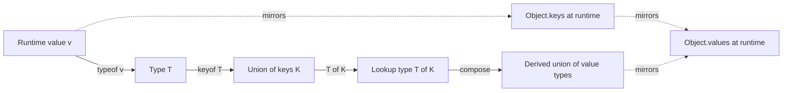
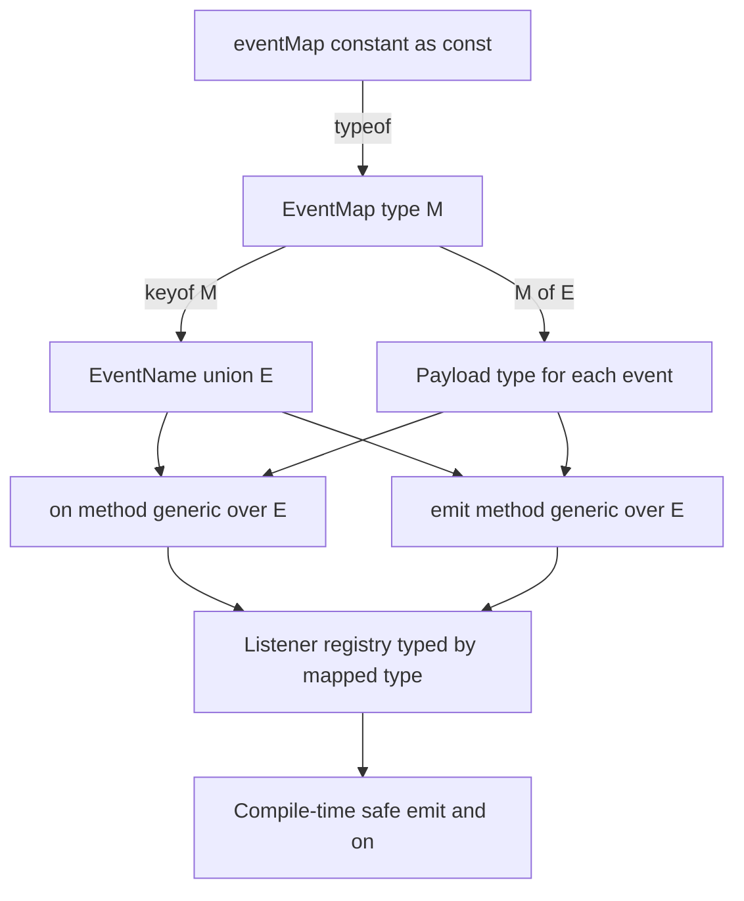

# 2.08 Typeof Keyof Lookup

## 1. Purpose

Three operators do more to make TypeScript feel like a real modeling language than every other feature combined: `typeof`, `keyof`, and the indexed access type `T[K]`. Together they form a tiny query language over the type space, and they unlock a programming style in which you declare one runtime value (a config object, a route table, an event map, a schema) and let the compiler derive every related type from it. Without these three, every type in your project is hand written, drifts from the runtime values it claims to describe, and breaks silently when you rename a property. With them, you can write a single source of truth and let TypeScript ripple the consequences through every consumer.

The three operators solve three different problems, and they were added to the language at different points in its history, but they share a single philosophical commitment: **types should be derivable from values, and the compiler should be the one doing the derivation.**

`typeof v` exists to **bridge the runtime and the type system.** JavaScript has only runtime values; TypeScript has both values and types, and they live in two separate namespaces (the value space and the type space). The `typeof` keyword is the only built-in operator that takes a value-space expression and yields a type-space type. You declare `const config = { port: 8080, host: "localhost" }` and TypeScript can answer the question "what is the type of `config`?" with `typeof config`. That single bridge is what lets you write a runtime config once and derive its type without duplicating the shape in an interface.

`keyof T` exists to **enumerate the keys of a type as a union.** Given an object type `T`, `keyof T` produces the union of every property name in `T`. This is the type-level analogue of `Object.keys(obj)` at runtime. It exists because, in type-safe code, you constantly need to say "this argument must be a key of that object" — a getter, a setter, a property picker, a reducer action, an event name. Without `keyof`, you would type those arguments as `string` and lose all safety; with it, you get a compile-time guarantee that the argument matches a real property.

`T[K]` (the **indexed access type**, also called a lookup type) exists to **look up the type of a single property.** Given an object type `T` and a key type `K` that is assignable to `keyof T`, the expression `T[K]` yields the type of that property. This is the type-level analogue of `obj[key]` at runtime. It exists because once you can enumerate keys (`keyof T`) and bridge runtime to types (`typeof v`), the natural next step is "given a key, what type does this property hold?" Indexed access answers that. It is also the building block of mapped types, conditional type inference, and most utility types in the standard library.

The composition of the three is where the magic happens. Consider this single line:

```typescript
type ConfigValue = (typeof config)[keyof typeof config];
```

Reading right to left: `typeof config` derives the type of the runtime `config` value; `keyof typeof config` enumerates every key of that type as a union; `(typeof config)[keyof typeof config]` indexes back into the config type with the union of keys, producing the union of every value type stored in the config. One runtime value, three operators, one derived union of value types. No duplication, no drift, full safety. This is the pattern at the heart of every typed event emitter, every typed reducer, every typed router, every schema-to-type inference library.

The bug class these operators prevent is **type drift between runtime values and their declared types.** Without them, you write `const config = { port: 8080 }` and separately `interface Config { port: number }`, and one day someone changes `port` to `string` in the value but forgets to update the interface — the compiler happily accepts both, the runtime value disagrees with the type, and a downstream consumer crashes. With `typeof config`, the type is derived from the value; there is no second declaration to forget. With `keyof typeof config`, every consumer is constrained to the actual keys present. With `(typeof config)[K]`, every consumer is constrained to the actual value types present.

The second bug class they prevent is **unsafe stringly typed APIs.** A function `function getProperty(obj, key)` typed naively as `(obj: any, key: string) => any` accepts every string and returns `any`, throwing at runtime if the key does not exist. With `keyof` and indexed access, the same function `function getProperty<T, K extends keyof T>(obj: T, key: K): T[K]` accepts only real keys and returns exactly the property's type. The compiler now catches every misspelled key, every wrong-typed return usage, every refactor that renamed a property. This is the difference between "JavaScript with type hints bolted on" and "TypeScript."

By the end of this note, you should be able to look at any runtime object and immediately see the derived type expression that captures its keys, its value types, or any individual property. You should be able to design a typed event emitter, a typed reducer, and a typed route table by writing one runtime constant and deriving every type from it. And you should be able to diagnose the four common surprises — `typeof` on a type is a syntax error, `keyof` on a non-object is `never`, `T[K]` requires `K extends keyof T`, and `keyof any` is the full union `string | number | symbol` — without a second thought.

## 2. Theory and Deep Dive

### 2.1 The two namespaces: value space and type space

TypeScript has two parallel namespaces. The **value space** contains everything that exists at runtime: variables, functions, classes, enums (their members), and object literals. The **type space** contains everything that exists only at compile time: interfaces, type aliases, the `string` and `number` keywords, generics, conditional types, mapped types, and so on. Some names live in both spaces (a class declares a value — the constructor — and a type — the instance shape), but most names live in only one.

The `typeof` keyword is the only built-in operator that **crosses from value space to type space.** You write `typeof v` in a type position, and TypeScript looks up `v` in the value space, infers its type, and yields that type in the type position. This is why `typeof` is the keystone: without it, you could not derive a type from a value at all.

```typescript
// TS
const port = 8080;
type Port = typeof port; // number
```

```javascript
// JS
const port = 8080;
// typeof port at runtime is the string "number", but TypeScript's typeof is a type operator.
```

Notice the difference from the JavaScript `typeof` operator: at runtime, `typeof port` returns the string `"number"`. At the type level, `typeof port` returns the *type* `number`. They share a keyword for historical reasons but operate in completely different spaces. The runtime one is a value-space operator that returns a string; the type-level one is a type-space operator that returns a type.

### 2.2 What `typeof v` actually extracts

`typeof v` extracts the **declared or inferred type of the value `v`.** The exact result depends on how `v` was declared:

- A `let` variable widens: `let x = "hello"` produces `typeof x = string` (not the literal `"hello"`).
- A `const` variable does not widen for primitives: `const x = "hello"` produces `typeof x = "hello"` (the literal type).
- An object literal widens each property: `const config = { port: 8080 }` produces `typeof config = { port: number }` (the literal `8080` is widened).
- An `as const` object does not widen: `const config = { port: 8080 } as const` produces `typeof config = { readonly port: 8080 }`.
- A function: `function add(a, b) { return a + b }` produces `typeof add = (a: any, b: any) => any` (or the inferred parameter and return types if annotated).
- A class: `class Foo {}` produces `typeof Foo = typeof Foo` (the constructor type), not `Foo` (the instance type). To get the instance type, write `Foo` directly or `InstanceType<typeof Foo>`.
- A module import: `import * as fs from "fs"` produces `typeof fs = typeof fs`, the module's namespace type.
- An enum: `enum Color { Red }` produces `typeof Color = typeof Color`, the enum's constructor and namespace type.

The widening rules of `typeof` are exactly the widening rules of type inference, because `typeof` is just "what would inference produce here?" See [[2.04 Type Inference and Contextual]] for the full widening deep dive.

### 2.3 `typeof` with `as const` for literal types

The combination of `typeof` and `as const` is the standard pattern for deriving **literal-preserving types from runtime constants.** Without `as const`, `typeof` widens; with `as const`, it does not.

```typescript
// TS
const events = ["click", "submit", "change"] as const;
type EventName = typeof events[number]; // "click" | "submit" | "change"
```

```javascript
// JS
const events = ["click", "submit", "change"];
// No type-level equivalent; the runtime array is just three strings.
```

Here `as const` makes `events` a readonly tuple of literal types `readonly ["click", "submit", "change"]`, and `typeof events[number]` indexes into that tuple with the union of all numeric keys, producing the union of all element types. This pattern, called "array-to-union," is one of the most common uses of `typeof` plus indexed access.

### 2.4 `keyof T`: the union of keys

`keyof T` takes an object type `T` and produces a **union of every property name in `T`.** The result is a union of `string`, `number`, and `symbol` literals, depending on what the keys of `T` are.

```typescript
// TS
interface User {
  id: number;
  name: string;
  email: string;
}

type UserKey = keyof User; // "id" | "name" | "email"
```

```javascript
// JS
const user = { id: 1, name: "Ada", email: "ada@example.com" };
// Object.keys(user) at runtime gives ["id", "name", "email"], the same set of names.
```

The runtime analogue is `Object.keys(obj)`, with one important caveat: `Object.keys` returns only string keys at runtime, because JavaScript object keys are always strings or symbols, and numeric keys are coerced to strings. `keyof` at the type level preserves the distinction: if your type has a numeric key, `keyof` includes a numeric literal in the union; if it has a symbol key, `keyof` includes that symbol.

`keyof` on an interface with optional properties includes those optional keys. `keyof` on an intersection includes keys from all members. `keyof` on a union of object types includes only keys that exist on **every** member of the union (the intersection of key sets). `keyof` on `any` is `string | number | symbol` (the widest possible key union). `keyof` on `never` is `string | number | symbol` (a quirk; see Section 6).

### 2.5 `keyof` of an array

`keyof` on an array type includes **every method and property on the array prototype plus the numeric index.** This is usually surprising.

```typescript
// TS
type ArrayKey = keyof string[]; // number | "length" | "toString" | "push" | "pop" | ... (all Array methods)
```

```javascript
// JS
const arr = ["a", "b"];
// Object.keys(arr) at runtime gives ["0", "1", "length"] for a plain array,
// but the type-level keyof also enumerates the inherited Array prototype methods.
```

If you want only the element type of an array, do not use `keyof` — use `T[number]` (Section 2.7). If you want only the numeric index, use `keyof T & number`, or use a tuple and index with a specific literal.

### 2.6 `T[K]`: the indexed access type (lookup type)

`T[K]` looks up the type of the property named by `K` on the type `T`. The constraint is that `K` must be assignable to `keyof T` — otherwise the lookup is meaningless and TypeScript reports an error.

```typescript
// TS
interface User {
  id: number;
  name: string;
  email: string;
}

type IdType = User["id"];       // number
type NameType = User["name"];   // string
type SeveralTypes = User["id" | "name"]; // number | string (union of the looked-up types)
```

```javascript
// JS
const user = { id: 1, name: "Ada" };
const id = user["id"];      // 1, a number
const name = user["name"];  // "Ada", a string
// The runtime indexing mirrors the type-level indexing exactly.
```

When `K` is a union, `T[K]` is the **union of the corresponding property types.** This is distributive: `T["a" | "b"]` is `T["a"] | T["b"]`. This makes `T[keyof T]` a one-liner for "the union of all value types in `T`."

The constraint `K extends keyof T` is what makes indexed access safe. Without it, `T[K]` for arbitrary `K` would have to be `any`, and the entire safety point would be lost. The generic `function getProperty<T, K extends keyof T>(obj: T, key: K): T[K]` is the canonical demonstration: the constraint forces `K` to be a real key, and the return type tracks the actual property type.

### 2.7 `T[number]` and `T[string]`: element-type lookup

Indexing an array or tuple type with `number` yields the **element type.** Indexing a string-keyed object with `string` yields the union of all property types whose keys are strings (which for normal objects is all of them).

```typescript
// TS
type NumArrayElement = number[] [number];        // number
type TupleElement = [string, number, boolean][number]; // string | number | boolean
type ObjectValues = { a: string; b: number }[string];  // string | number
```

```javascript
// JS
const arr = [1, 2, 3];
const first = arr[0]; // 1, a number — runtime analogue of number[] [number]
```

For tuples specifically, you can also index with a specific numeric literal to get the type at that exact position:

```typescript
// TS
type First = [string, number, boolean][0]; // string
type Second = [string, number, boolean][1]; // number
type Third = [string, number, boolean][2]; // boolean
```

This positional indexing of tuples is the foundation of typed pattern matching on fixed-arity structures, and it is how the `Parameters<>` and `ReturnType<>` utility types in the standard library extract the parameter tuple and return type of a function.

### 2.8 The full composition: `typeof`, `keyof`, and `T[K]` together

The headline composition is the one-liner from Section 1: derive a union of every value type stored in a runtime config.

```typescript
// TS
const config = {
  port: 8080,
  host: "localhost",
  retries: 3,
} as const;

type Config = typeof config;
// { readonly port: 8080; readonly host: "localhost"; readonly retries: 3; }

type ConfigKey = keyof Config;
// "port" | "host" | "retries"

type ConfigValue = Config[ConfigKey];
// 8080 | "localhost" | 3
```

```javascript
// JS
const config = { port: 8080, host: "localhost", retries: 3 };
// Object.keys(config) gives ["port", "host", "retries"]
// Object.values(config) gives [8080, "localhost", 3]
// The type-level pipeline mirrors these runtime calls.
```

Reading right to left: `typeof config` derives the type from the runtime value; `keyof typeof config` enumerates the keys; `(typeof config)[keyof typeof config]` indexes back into the type with the union of keys, yielding the union of value types. Each step is a single operator; the composition is a one-line pipeline that produces a fully derived type from a single runtime source of truth.

### 2.9 The typeof-to-keyof-to-indexed-access pipeline

The three operators form a directed pipeline. You start at a runtime value, derive its type, optionally enumerate its keys, and optionally index back into it. Each arrow in the diagram below is one operator.



The vertical dotted lines mark the runtime analogues. `typeof` has no runtime analogue (it is purely a type-space bridge), but `keyof` mirrors `Object.keys`, and `T[K]` mirrors bracket indexing `obj[key]`. The pipeline is the type-level equivalent of the runtime pattern "declare a config, then iterate its keys, then read each value" — except the type-level version runs at compile time and produces a type, not a value.

### 2.10 What `typeof` cannot do

`typeof` operates only on **values**, not on types. You cannot write `typeof SomeInterface` because `SomeInterface` is a type, not a value — the compiler reports a syntax error pointing at the type name. If you want the keys of a type, write `keyof SomeInterface` directly. If you want the type of a value, write `typeof someValue`. The two operators consume different namespaces and never overlap.

`typeof` also cannot escape the type erasure boundary: it sees only the static type, not the runtime constructor or prototype chain. `typeof animal` where `animal` was declared as `Animal` but actually holds a `Dog` instance gives `Animal`, not `Dog`. The runtime constructor is available through `animal.constructor`, but `typeof` does not inspect that; it looks at the static declared type. For runtime type introspection, you need type guards, the `in` operator, or `instanceof` — see [[2.03 Type Assertions and Guards]].

### 2.11 What `keyof` produces for unusual inputs

`keyof` on a primitive type produces `never` for `string`, `number`, `boolean`, `null`, `undefined`, and `void` — these have no own properties at the type level (the methods on `string` are on the prototype, not on the type's own key set in the strict sense that `keyof` enumerates). Actually, the precise answer: `keyof string` is `"toString" | "charAt" | ...` (a union of `String.prototype` method names), because TypeScript models primitive types with their wrapper prototype methods. This is one of the more surprising corners of the language. The practical takeaway: do not `keyof` a primitive unless you specifically want its prototype methods.

`keyof any` is `string | number | symbol`, because `any`'s keys could be anything. This is the widest possible key union, and it is the constraint used by the `Record<K, V>` utility type's `K` parameter: `Record<K, V>` requires `K extends string | number | symbol`, which is the same as `K extends keyof any`.

`keyof never` is `string | number | symbol` (a quirk — `never` is the bottom type and has no real keys, but TypeScript returns the widest key union rather than `never`). This is rarely encountered in practice but can surprise you when a conditional type resolves to `never` and you then `keyof` it.

### 2.12 Generic constraints with `keyof` and indexed access

The combination of `keyof` and indexed access is the foundation of **type-safe generic helpers.** The pattern is `<T, K extends keyof T>(obj: T, key: K): T[K]`. The `extends keyof T` constraint forces `K` to be a real key of `T`, and the return type `T[K]` tracks the actual property type at the call site.

```typescript
// TS
function getProperty<T, K extends keyof T>(obj: T, key: K): T[K] {
  return obj[key];
}

const user = { id: 1, name: "Ada" };
const id = getProperty(user, "id");     // number
const name = getProperty(user, "name"); // string
const bad = getProperty(user, "email"); // error: Argument of type '"email"' is not assignable to parameter of type '"id" | "name"'.
```

```javascript
// JS
function getProperty(obj, key) {
  return obj[key];
}
const user = { id: 1, name: "Ada" };
const id = getProperty(user, "id");     // 1
const name = getProperty(user, "name"); // "Ada"
const bad = getProperty(user, "email"); // undefined at runtime, no warning
```

This is the pattern used by `lodash.get`, `ramda.prop`, `fp-ts` lookups, and most typed functional libraries. It is also the pattern the standard library uses internally for `Pick<T, K>`, `Omit<T, K>`, and `Partial<T>`. See [[2.07 Generics and Constraints]] for the full generic-constraints deep dive, and [[2.09 Mapped Types]] for how this combines with mapped types to produce the utility type family.

### 2.13 Indexed access on unions of object types

When `T` is a union of object types, `T[K]` is only valid if `K` is a key of **every** member of the union. If you try to index a union with a key that exists on only some members, TypeScript reports an error.

```typescript
// TS
type Cat = { kind: "cat"; meow: () => void };
type Dog = { kind: "dog"; bark: () => void };
type Pet = Cat | Dog;

type PetKind = Pet["kind"]; // "cat" | "dog" — kind is on both members
type PetSound = Pet["meow"]; // error: Property 'meow' does not exist on type 'Dog'.
```

```javascript
// JS
function makeSound(pet) {
  // Runtime: must narrow on pet.kind before calling pet.meow or pet.bark.
  if (pet.kind === "cat") pet.meow();
  else pet.bark();
}
```

This is the type-level reflection of the union property-access rule from [[2.05 Unions and Intersections]]: you can only access properties that exist on every member. The same rule applies to indexed access — to access a member-specific property, narrow the union first.

### 2.14 Indexed access with `keyof` and the lookup-of-union distributivity

When `K` is itself a union (as produced by `keyof T`), `T[K]` distributes: `T[K1 | K2]` is `T[K1] | T[K2]`. This is the same distributive property of conditional types over unions, applied to indexed access.

```typescript
// TS
interface Config {
  port: number;
  host: string;
  retries: number;
}
type ConfigKey = keyof Config; // "port" | "host" | "retries"
type ConfigValue = Config[ConfigKey]; // number | string | number = number | string
```

```javascript
// JS
const config = { port: 8080, host: "localhost", retries: 3 };
// Object.values(config) gives [8080, "localhost", 3] — the runtime analogue of the union of value types.
```

The distributive property means `(typeof config)[keyof typeof config]` is exactly the type-level equivalent of `Object.values(config)` at runtime: it gives you the union of every value type stored in the config.

### 2.15 Indexed access with template literal types

Template literal types (see [[2.13 Template Literal Types]]) can be used as `K` in `T[K]` when the resulting string is a valid key. This is the foundation of typed path-based getters like `get(obj, "user.address.city")`. The `K` in `T[K]` does not have to be a literal union; it can be any type assignable to `keyof T`, including a computed template literal type.

### 2.16 Summary of the theory

| Operator | Input | Output | Runtime analogue |
| --- | --- | --- | --- |
| `typeof v` | A value `v` | The type of `v` | None (type-space only) |
| `keyof T` | An object type `T` | A union of `T`'s keys | `Object.keys(obj)` |
| `T[K]` | An object type `T` and a key type `K` | The type of the property named by `K` | `obj[key]` |
| `T[number]` | An array or tuple type `T` | The element type of `T` | `arr[0]` |
| `T[string]` | An object type `T` with string keys | The union of all value types of `T` | `Object.values(obj)` |

The composition `typeof v` -> `keyof` -> `T[K]` is the type-level equivalent of declaring a value and then asking "what are your keys, and what type does each one hold?" — and the compiler answers at compile time, with full safety, with no runtime cost.

## 3. Mental Models

Three mental models, one per operator, plus one for the composition.

**`typeof v` is "what type does `v` have?"** Read it as a question. You point at a value and ask the compiler to tell you its type. The compiler answers with the same type it would have inferred if you had written an annotation on the variable. `typeof` is a single-direction bridge: value to type, never the reverse. It sees only the static type, not the runtime constructor or prototype chain.

**`keyof T` is "the union of `T`'s keys."** Read it as a set enumeration. You point at a type and the compiler enumerates every key as a union of literal types. The result is exactly the set of strings (or numbers or symbols) that would be safe to use as a property access on a value of type `T`. `keyof T` is the type-level analogue of `Object.keys(obj)` — same information, computed at compile time.

**`T[K]` is "the type of `T`'s `K` property."** Read it as a lookup. You give the compiler a type `T` and a key type `K`, and it returns the type stored at that key. `T[K]` is the type-level analogue of `obj[key]` — same operation, computed at compile time. When `K` is a union, `T[K]` distributes to the union of the looked-up types, just as iterating over keys at runtime would visit every value.

**The composition is "derive a type from a value, then navigate it."** Start with a value, derive its type with `typeof`, then enumerate keys with `keyof` or look up a specific property with `T[K]`. The pipeline is one-directional (value -> type -> keys -> property types) and each step is a single operator. The whole pipeline is the type-level equivalent of declaring a config and then asking `Object.keys` and `Object.values` — but with the answers available at compile time, with full safety, with no runtime cost.

A useful unifying metaphor: think of `typeof` as a **camera** that takes a snapshot of a value's type, `keyof` as a **magnifying glass** that lists the labels on a type's surface, and `T[K]` as a **needle** that pierces the type at a specific label to extract the value type inside. The three tools compose into a small inspection kit: snapshot the type, list its labels, pierce any one of them. Every advanced type derivation in TypeScript is some combination of these three primitives.

## 4. Real-World Use Cases

### 4.1 Type-safe config objects with `as const`

The flagship use case. You declare your application's configuration as a single `as const` object, and derive every type from it. The config is the single source of truth; every consumer is type-safe against it.

```typescript
// TS
const appConfig = {
  api: { baseUrl: "https://api.example.com", timeout: 5000 },
  features: { beta: true, newDashboard: false },
} as const;

type AppConfig = typeof appConfig;
type ApiConfig = AppConfig["api"];
type FeatureFlags = AppConfig["features"];
type FeatureName = keyof AppConfig["features"]; // "beta" | "newDashboard"
```

```javascript
// JS
const appConfig = {
  api: { baseUrl: "https://api.example.com", timeout: 5000 },
  features: { beta: true, newDashboard: false },
};
// Without TypeScript, every consumer reads fields by string and gets no warning if a field is renamed.
```

### 4.2 Type-safe event emitters

A typed event emitter derives its event names and payload types from a single event map object. Callers of `emit` must pass a valid event name and a payload of the correct type; callers of `on` receive a strongly-typed handler.

```typescript
// TS
const eventMap = {
  userJoined: (userId: string) => ({ userId }),
  userLeft: (userId: string, reason: string) => ({ userId, reason }),
  messageReceived: (text: string) => ({ text }),
} as const;

type EventName = keyof typeof eventMap;
type EventHandler<E extends EventName> = (typeof eventMap)[E];
```

```javascript
// JS
const eventMap = {
  userJoined: (userId) => ({ userId }),
  userLeft: (userId, reason) => ({ userId, reason }),
  messageReceived: (text) => ({ text }),
};
// Runtime: nothing prevents calling eventMap.unknownEvent or passing the wrong payload shape.
```

The full pattern is developed in Sections 5.2, 9, and 10.

### 4.3 Type-safe reducers and action maps

A Redux-style reducer can derive its action union from an action map object, eliminating the boilerplate of writing every action type by hand.

```typescript
// TS
const actions = {
  increment: (amount: number) => ({ type: "increment" as const, amount }),
  decrement: (amount: number) => ({ type: "decrement" as const, amount }),
  reset: () => ({ type: "reset" as const }),
} as const;

type Action = ReturnType<(typeof actions)[keyof typeof actions]>;
// { type: "increment"; amount: number } | { type: "decrement"; amount: number } | { type: "reset" }
```

```javascript
// JS
const actions = {
  increment: (amount) => ({ type: "increment", amount }),
  decrement: (amount) => ({ type: "decrement", amount }),
  reset: () => ({ type: "reset" }),
};
// Runtime: callers construct actions by calling the factories; reducer switches on action.type.
```

### 4.4 Type-safe routing

A route table can be declared once, and the path-parameter types for each route derived from the route definition. This is the pattern used by `@tanstack/react-router`, `next-typesafe-url`, and similar libraries.

```typescript
// TS
const routes = {
  home: { path: "/", params: {} },
  user: { path: "/users/:userId", params: { userId: "string" } },
  post: { path: "/posts/:postId", params: { postId: "number" } },
} as const;

type RouteName = keyof typeof routes;
```

```javascript
// JS
const routes = {
  home: { path: "/", params: {} },
  user: { path: "/users/:userId", params: { userId: "string" } },
  post: { path: "/posts/:postId", params: { postId: "number" } },
};
// Runtime: a router parses window.location.pathname against each route's path pattern.
```

### 4.5 Zod-style schema-to-type inference

Libraries like `zod`, `io-ts`, `runtypes`, and `@sinclair/typebox` build a schema (a runtime value) and derive a TypeScript type from it. The derivation uses `typeof` on the schema plus a chain of conditional and mapped types to walk the schema tree. The user-facing API is `z.infer<typeof schema>` — one `typeof`, the rest is conditional type machinery.

### 4.6 Type-safe property accessors and pickers

The canonical `getProperty<T, K extends keyof T>` function is the foundation of every typed accessor library. The same pattern generalizes to `pick`, `omit`, `pluck`, and `atPath` helpers.

### 4.7 Type-safe registries

A registry of handlers, plugins, or strategies keyed by name derives its key union from the registry object. New entries are added by extending the object; consumers automatically get the updated union.

### 4.8 Type-safe i18n dictionaries

A translation dictionary can be declared once, and the lookup function `t(key)` can be typed so that `key` must be a real key of the dictionary and the return type tracks the value type. This eliminates the "missing translation key" runtime error entirely.

## 5. Code Examples

### 5.1 Example A — Minimal and Conceptual

Four side-by-side minimal examples covering each operator in isolation, then their composition.

#### 5.1.1 `typeof` derives a type from a value

```typescript
// TS
const port = 8080;
type Port = typeof port; // number

let host = "localhost";
type Host = typeof host; // string (widened because of let)

const env = "production" as const;
type Env = typeof env; // "production" (literal preserved by as const)

const config = { port: 8080, host: "localhost" } as const;
type Config = typeof config; // { readonly port: 8080; readonly host: "localhost"; }
```

```javascript
// JS
const port = 8080;
let host = "localhost";
const env = "production";
const config = { port: 8080, host: "localhost" };
// No type-level equivalent; typeof at runtime returns the string "number", "string", "object".
```

#### 5.1.2 `keyof` enumerates the keys of a type

```typescript
// TS
interface User { id: number; name: string; email: string; }
type UserKey = keyof User; // "id" | "name" | "email"

const user: User = { id: 1, name: "Ada", email: "ada@example.com" };
type UserKeyFromValue = keyof typeof user; // "id" | "name" | "email"

function logKey(key: UserKey) { console.log(key); }
logKey("id");    // ok
logKey("email"); // ok
logKey("phone"); // error: Argument of type '"phone"' is not assignable to parameter of type '"id" | "name" | "email"'.
```

```javascript
// JS
const user = { id: 1, name: "Ada", email: "ada@example.com" };
function logKey(key) { console.log(key); }
logKey("id");    // prints "id"
logKey("phone"); // prints "phone" — no warning, the typo slips through to runtime
```

#### 5.1.3 `T[K]` looks up a property type

```typescript
// TS
interface User { id: number; name: string; email: string; }
type IdType = User["id"];           // number
type SeveralTypes = User["id" | "name"]; // number | string
type AllValues = User[keyof User];  // number | string (the union of all value types)

function getProperty<T, K extends keyof T>(obj: T, key: K): T[K] {
  return obj[key];
}

const user: User = { id: 1, name: "Ada", email: "ada@example.com" };
const id = getProperty(user, "id");     // number
const name = getProperty(user, "name"); // string
const bad = getProperty(user, "phone"); // error: '"phone"' is not assignable to '"id" | "name" | "email"'.
```

```javascript
// JS
function getProperty(obj, key) { return obj[key]; }
const user = { id: 1, name: "Ada", email: "ada@example.com" };
const id = getProperty(user, "id");     // 1
const name = getProperty(user, "name"); // "Ada"
const bad = getProperty(user, "phone"); // undefined — no warning
```

#### 5.1.4 `T[number]` gets the element type of an array or tuple

```typescript
// TS
type NumArrayElement = number[] [number]; // number
type TupleElement = [string, number, boolean][number]; // string | number | boolean
type TupleFirst = [string, number, boolean][0]; // string
type TupleSecond = [string, number, boolean][1]; // number

const events = ["click", "submit", "change"] as const;
type EventName = typeof events[number]; // "click" | "submit" | "change"
```

```javascript
// JS
const events = ["click", "submit", "change"];
const first = events[0]; // "click"
// No type-level equivalent; the runtime array is just three strings.
```

#### 5.1.5 The full composition in one line

```typescript
// TS
const config = { port: 8080, host: "localhost", retries: 3 } as const;
type ConfigValue = (typeof config)[keyof typeof config]; // 8080 | "localhost" | 3
```

```javascript
// JS
const config = { port: 8080, host: "localhost", retries: 3 };
const values = Object.values(config); // [8080, "localhost", 3]
// The type-level pipeline mirrors Object.values: enumerate keys, then read each value.
```

### 5.2 Example B — Production-Grade

A complete typed event emitter deriving event names and payload types from a config object via `typeof` + `keyof` + indexed access. This is the pattern used in production by libraries like `nanoevents`, `mitt`, and `eventemitter3` typed wrappers.

```typescript
// TS
// 1. Declare the event map as a runtime constant with as const.
const eventMap = {
  userJoined: (userId: string) => ({ userId }),
  userLeft: (userId: string, reason: string) => ({ userId, reason }),
  messageReceived: (text: string, channel: string) => ({ text, channel }),
  connectionLost: () => ({}),
} as const;

// 2. Derive the event-name union from the map.
type EventName = keyof typeof eventMap; // "userJoined" | "userLeft" | "messageReceived" | "connectionLost"

// 3. Derive the payload type for each event by indexing the map with the event name.
type Payload<E extends EventName> = ReturnType<(typeof eventMap)[E]>;

// 4. Derive the handler type for each event.
type Handler<E extends EventName> = (payload: Payload<E>) => void;

// 5. Build the typed emitter class.
class TypedEmitter<M extends Record<string, (...args: any[]) => any>> {
  private listeners: { [E in keyof M]?: Array<(payload: ReturnType<M[E]>) => void> } = {};

  on<E extends keyof M>(event: E, handler: (payload: ReturnType<M[E]>) => void): void {
    (this.listeners[event] ??= []).push(handler);
  }

  off<E extends keyof M>(event: E, handler: (payload: ReturnType<M[E]>) => void): void {
    const arr = this.listeners[event];
    if (!arr) return;
    const idx = arr.indexOf(handler);
    if (idx >= 0) arr.splice(idx, 1);
  }

  emit<E extends keyof M>(event: E, ...args: Parameters<M[E]>): void {
    const payload = (eventMap as any)[event](...args);
    for (const handler of this.listeners[event] ?? []) handler(payload);
  }
}

// 6. Instantiate with the event map.
const emitter = new TypedEmitter<typeof eventMap>();

// 7. Subscribe with full type safety on event name and handler payload.
emitter.on("userJoined", (payload) => {
  console.log(payload.userId); // string
});

emitter.on("messageReceived", (payload) => {
  console.log(payload.text, payload.channel); // string, string
});

// 8. Emit with full type safety on event name and argument types.
emitter.emit("userJoined", "u-123");
emitter.emit("messageReceived", "hello", "general");
emitter.emit("connectionLost");

// 9. Compile-time errors caught:
// emitter.emit("userJoined", 123);            // error: 123 is not assignable to string.
// emitter.emit("unknownEvent");               // error: '"unknownEvent"' is not assignable to EventName.
// emitter.on("userLeft", (p) => p.userId);    // ok, p is { userId: string; reason: string }.
// emitter.on("userLeft", (p) => p.text);      // error: Property 'text' does not exist on type '{ userId: string; reason: string; }'.
```

```javascript
// JS
// The same emitter in plain JavaScript: no type safety, runtime crashes only.
const eventMap = {
  userJoined: (userId) => ({ userId }),
  userLeft: (userId, reason) => ({ userId, reason }),
  messageReceived: (text, channel) => ({ text, channel }),
  connectionLost: () => ({}),
};

class TypedEmitter {
  constructor(eventMap) {
    this.eventMap = eventMap;
    this.listeners = {};
  }
  on(event, handler) {
    (this.listeners[event] ??= []).push(handler);
  }
  off(event, handler) {
    const arr = this.listeners[event];
    if (!arr) return;
    const idx = arr.indexOf(handler);
    if (idx >= 0) arr.splice(idx, 1);
  }
  emit(event, ...args) {
    const payload = this.eventMap[event](...args);
    for (const handler of this.listeners[event] ?? []) handler(payload);
  }
}

const emitter = new TypedEmitter(eventMap);
emitter.on("userJoined", (payload) => console.log(payload.userId));
emitter.emit("userJoined", "u-123");
emitter.emit("userJoined", 123);         // no warning; payload.userId is 123 at runtime
emitter.emit("unknownEvent");            // no warning; this.eventMap.unknownEvent is undefined; crash at runtime
emitter.on("userLeft", (p) => p.text);   // no warning; p.text is undefined at runtime
```

The TypeScript version catches four distinct bug classes at compile time: misspelled event names, wrong payload argument types, wrong handler parameter shapes, and access of non-existent payload fields. The JavaScript version detects none of these until the code runs in production. That is the entire point of `typeof` plus `keyof` plus indexed access: a single runtime constant becomes a fully typed API surface.

## 6. Common Mistakes and Anti-Patterns

### 6.1 `typeof` on a type

`typeof` operates on values, not types. Writing `typeof SomeInterface` is a syntax error because `SomeInterface` is in the type space and `typeof` looks up the value space.

```typescript
// TS — wrong
interface User { id: number; name: string; }
type UserType = typeof User; // error: 'User' only refers to a type, but is being used as a value here.

// TS — right
type UserType = User;       // just use the type directly
type UserKey = keyof User;  // use keyof to enumerate keys
```

If you want the keys of a type, use `keyof`. If you want the type itself, just name it. `typeof` is only for values.

### 6.2 `keyof` on a non-object type

`keyof` on a primitive type produces the union of that primitive's prototype methods (a long union of method names you almost never want), not `never` as many developers expect.

```typescript
// TS
type StringKey = keyof string; // "toString" | "charAt" | "charCodeAt" | ... (a huge union)
type NumberKey = keyof number; // "toString" | "toFixed" | "toExponential" | "toPrecision" | "valueOf"
type BooleanKey = keyof boolean; // "valueOf"
type NullKey = keyof null; // never
type UndefinedKey = keyof undefined; // never
```

If you find yourself `keyof`-ing a primitive, you almost certainly meant to `keyof` an object type. Check your types.

### 6.3 `T[K]` with `K` not in `keyof T`

Indexed access requires `K` to be assignable to `keyof T`. If `K` is a string that is not a key of `T`, TypeScript reports an error.

```typescript
// TS — wrong
interface User { id: number; name: string; }
type PhoneType = User["phone"]; // error: Property 'phone' does not exist on type 'User'.

// TS — right
type IdType = User["id"]; // number
```

In generic code, the constraint `K extends keyof T` prevents this at the call site. Without the constraint, `K` would have to be widened to `string`, and the lookup would be `any` — losing all safety.

### 6.4 `keyof any` is `string | number | symbol`

The expression `keyof any` returns `string | number | symbol`, the widest possible key union. This is surprising because `any` has no real keys, but TypeScript models `any` as having every possible key.

```typescript
// TS
type K = keyof any; // string | number | symbol
```

This is the constraint used by `Record<K, V>` and many utility types: `K extends string | number | symbol` is the same as `K extends keyof any`. If you see `keyof any` in library code, read it as "any valid JavaScript object key."

### 6.5 `typeof` of an import gets the module's namespace type

`import * as fs from "fs"` followed by `typeof fs` yields the module's namespace type, not the type of any individual export. To get the type of a specific export, write `typeof fs.readFile`.

```typescript
// TS
import * as fs from "fs";
type FsModule = typeof fs;          // the whole module namespace type
type ReadFile = typeof fs.readFile; // the specific function type
```

Confusing the two leads to type errors when you try to call a namespace as if it were a function.

### 6.6 `as const` changes what `typeof` returns

Without `as const`, `typeof` widens literal types: `typeof { port: 8080 }` is `{ port: number }`. With `as const`, it preserves literals: `typeof { port: 8080 } as const` is `{ readonly port: 8080 }`. Forgetting `as const` when you need the literal type is one of the most common TypeScript bugs.

```typescript
// TS — without as const (widened)
const config1 = { port: 8080, env: "production" };
type Config1 = typeof config1; // { port: number; env: string; }

// TS — with as const (preserved)
const config2 = { port: 8080, env: "production" } as const;
type Config2 = typeof config2; // { readonly port: 8080; readonly env: "production"; }
```

The widened version is useless for deriving literal unions: `keyof Config1` is `"port" | "env"` (correct), but `Config1[keyof Config1]` is `number | string` (no longer the literal types). The `as const` version gives `8080 | "production"`, which is what you want for typed config validation.

### 6.7 `keyof` of a union returns only common keys

`keyof (A | B)` returns the keys that exist on **both** `A` and `B`, not the union of keys. This is the type-level reflection of the union property-access rule.

```typescript
// TS
type Cat = { kind: "cat"; meow: () => void };
type Dog = { kind: "dog"; bark: () => void };
type Pet = Cat | Dog;
type PetKey = keyof Pet; // "kind" only — meow and bark are not on both members
```

If you expected `"kind" | "meow" | "bark"`, you were thinking of union of keys; `keyof` actually gives you intersection of keys when applied to a union of object types. This is correct behavior (you can only safely access properties that exist on every member) but counterintuitive on first encounter.

### 6.8 Indexing a union of object types with a non-common key

Building on 6.7, indexing a union with a key that exists on only some members is an error.

```typescript
// TS
type Cat = { kind: "cat"; meow: () => void };
type Dog = { kind: "dog"; bark: () => void };
type Pet = Cat | Dog;
type Meow = Pet["meow"]; // error: Property 'meow' does not exist on type 'Dog'.
```

To access a member-specific property, narrow the union first (with a discriminator or `in` check), then index. See [[2.03 Type Assertions and Guards]] for the narrowing patterns.

### 6.9 `keyof` of an array returns every Array prototype method

As mentioned in Section 2.5, `keyof string[]` is a huge union including `"push"`, `"pop"`, `"map"`, `"length"`, and so on. This is almost never what you want.

```typescript
// TS — almost certainly wrong
type BadElement = keyof string[]; // number | "length" | "push" | "pop" | "map" | ... (a huge union)

// TS — correct
type GoodElement = string[] [number]; // string
```

Use `T[number]` for element types, never `keyof T` on an array.

### 6.10 Mutating a `typeof`-derived config

If you derive a type from a runtime config with `as const`, the derived type is `readonly`. Code that tries to mutate the config (or a copy of it) will hit `readonly` errors.

```typescript
// TS
const config = { port: 8080 } as const;
type Config = typeof config; // { readonly port: 8080; }
const mutableCopy: Config = { ...config };
mutableCopy.port = 9090; // error: Cannot assign to 'port' because it is a read-only property.
```

If you need mutability, omit `as const` (and accept widened types), or use a `Mutable<Config>` utility (`type Mutable<T> = { -readonly [K in keyof T]: T[K] }`) to strip the `readonly` modifier.

### 6.11 Confusing `typeof` (type-space) with `typeof` (value-space)

The same keyword has two meanings. In a type position, `typeof v` is the type-space operator that extracts the type of `v`. In a value position, `typeof v` is the JavaScript runtime operator that returns the string `"number"`, `"string"`, `"object"`, and so on.

```typescript
// TS
const x = 42;
type T = typeof x; // number (type-space)
const s = typeof x; // "number" (value-space, runtime string)
```

The two share a keyword for historical reasons but operate in completely different spaces. The type-space one is erased at compile time; the value-space one runs at runtime and returns a string.

### 6.12 Forgetting `as const` on tuple arrays

`const events = ["click", "submit"]` infers `string[]`, not a tuple. `typeof events[number]` then gives `string`, not `"click" | "submit"`.

```typescript
// TS — wrong
const events1 = ["click", "submit"];
type EventName1 = typeof events1[number]; // string

// TS — right
const events2 = ["click", "submit"] as const;
type EventName2 = typeof events2[number]; // "click" | "submit"
```

Always use `as const` on arrays that you intend to derive literal unions from. See [[2.04 Type Inference and Contextual]] for the full deep dive on widening.

### 6.13 Overusing `typeof` where a direct type would do

`typeof` is a bridge from value to type. If you already have a type, do not write `typeof v` to recover it; just use the type. Excessive `typeof` chains hurt readability.

```typescript
// TS — overcomplicated
const user: User = { id: 1, name: "Ada" };
type UserType = typeof user; // User — but you already had User

// TS — simpler
type UserType = User;
```

Use `typeof` when you do not have a type — that is, when the value is the source of truth and there is no separate type declaration. Use direct types when the type is already declared.

## 7. Best Practices and Design Patterns

### 7.1 Use `typeof` to derive types from runtime config

When a runtime constant is the source of truth (config, route table, event map, schema), declare it with `as const` and derive the type with `typeof`. This eliminates the duplication that causes drift.

```typescript
// TS
const appConfig = { port: 8080, host: "localhost" } as const;
type AppConfig = typeof appConfig;
```

### 7.2 Use `keyof` for type-safe property access

Any function that takes an object and a property name should constrain the name with `keyof`. The compiler then catches every misspelled key at the call site.

```typescript
// TS
function getProperty<T, K extends keyof T>(obj: T, key: K): T[K] {
  return obj[key];
}
```

### 7.3 Use `T[K]` for indexed access in generic helpers

The return type `T[K]` (rather than `any` or `unknown`) is what makes the helper type-safe. Without it, callers would have to cast the return value, defeating the purpose.

### 7.4 Use `as const` to preserve literal types

Whenever you need a literal union from a runtime constant (event names, route paths, status codes), apply `as const`. Without it, the literal types widen and the union is lost.

### 7.5 Combine all three for maximum type safety

The one-liner `(typeof config)[keyof typeof config]` gives you the union of all value types in a runtime config. Use it wherever you need a "value union" derived from a config.

### 7.6 Prefer `satisfies` over `as const` when you want both checking and widening

`as const` preserves literal types but makes everything `readonly`. `satisfies` checks a value against a type without changing the inferred type. For config validation, `satisfies` is often the better tool. See [[2.04 Type Inference and Contextual]] for the `satisfies` deep dive.

### 7.7 Use `keyof any` as a constraint for "any valid object key"

When writing a generic that takes a key, constrain it as `K extends string | number | symbol` (equivalently `K extends keyof any`). This is the same constraint `Record<K, V>` uses.

### 7.8 Use `T[number]` for array and tuple element types

Never `keyof` an array; always use `T[number]`. For tuples, you can also index with a specific literal like `T[0]` to get the type at a fixed position.

### 7.9 Avoid `keyof` on unions of object types unless you want common keys

`keyof (A | B)` gives the intersection of key sets, not the union. If you need the union of keys, distribute first: `A["kind"] | B["kind"]` is fine if both have `kind`; for general key unions, you need a distributed conditional type.

### 7.10 Document derived types with a type alias

`type EventName = keyof typeof eventMap;` is clearer at call sites than the inline form. Always alias derived types when they are used in more than one place.

### 7.11 Keep the runtime value as the single source of truth

If you derive a type from a value with `typeof`, do not also declare the same shape as an interface. Pick one source — preferably the runtime value, because it is what the program actually uses — and let the compiler derive the rest.

### 7.12 Test the derivation with `expect-type` or `tsd`

For library code, add type-level tests that assert the derived type is what you expect. This catches regressions when the runtime value changes shape.

### 7.13 Use `InstanceType<typeof Foo>` for the instance type of a class

`typeof Foo` gives the constructor type of a class, not the instance type. To get the instance type, use `InstanceType<typeof Foo>` (or just `Foo` if you are in a type position).

## 8. Technical Interview Knowledge

### 8.1 What does `typeof` do in TypeScript?

`typeof v` is a type-space operator that extracts the type of a runtime value `v`. It is the only built-in operator that crosses from the value space to the type space. The result is the same type the inferencer would have inferred for `v` if it had been declared with no annotation. `typeof` works on variables, properties, function expressions, class declarations, modules, and enum members. It does not work on types themselves (you cannot write `typeof SomeInterface`). The JavaScript runtime `typeof` operator shares the keyword but operates in value space and returns a string like `"number"`; the two are unrelated beyond the keyword.

### 8.2 What does `keyof` return?

`keyof T` returns a union of every property name in `T`. For an object type `{ a: string; b: number }`, it returns `"a" | "b"`. For an array type, it returns the numeric index plus every `Array.prototype` method name (a long union). For `any`, it returns `string | number | symbol`. For a primitive like `string`, it returns the union of `String.prototype` method names. For a union of object types, it returns only the keys present on every member (the intersection of key sets). The result is always a union of literal types (string literals, numeric literals, or unique symbols).

### 8.3 What is `T[K]` (the indexed access type)?

`T[K]` is the indexed access type (also called a lookup type). It looks up the type of the property named by `K` on the type `T`. The constraint is that `K` must be assignable to `keyof T`; otherwise TypeScript reports an error. When `K` is a union, `T[K]` distributes to the union of the corresponding property types: `T["a" | "b"]` is `T["a"] | T["b"]`. This makes `T[keyof T]` a one-liner for "the union of all value types in `T`." Indexed access is the type-level analogue of `obj[key]` at runtime.

### 8.4 How do you get the element type of an array or tuple?

Use `T[number]`. For `number[]`, this gives `number`. For `[string, number, boolean]`, this gives `string | number | boolean`. For a tuple, you can also index with a specific literal: `T[0]` gives the type at position 0, `T[1]` at position 1, and so on. Do not use `keyof` on an array — that gives every Array prototype method, not the element type.

### 8.5 What is `keyof any`?

`keyof any` is `string | number | symbol`, the widest possible key union. It represents "any valid JavaScript object key." It is the constraint used by `Record<K, V>` and many utility types: `K extends keyof any` is the same as `K extends string | number | symbol`. The reason it is not just `string` is that TypeScript models numeric keys (numeric literals) and symbol keys (unique symbols) as distinct from string keys, even though JavaScript coerces them to strings at runtime.

### 8.6 How would you type an event emitter?

Declare the event map as a runtime constant with `as const`, derive the event-name union with `keyof typeof eventMap`, derive the payload type for each event with `ReturnType<(typeof eventMap)[E]>`, and use generic constraints (`E extends keyof typeof eventMap`) on `on`, `off`, and `emit`. The emitter class is generic over the map type, so the same class works for any event map. The full pattern is in Section 5.2.

### 8.7 How does `as const` affect what `typeof` returns?

Without `as const`, `typeof` widens: `typeof { port: 8080 }` is `{ port: number }`, and `typeof ["click", "submit"]` is `string[]`. With `as const`, `typeof` preserves literals and makes everything `readonly`: `typeof { port: 8080 } as const` is `{ readonly port: 8080 }`, and `typeof ["click", "submit"] as const` is `readonly ["click", "submit"]`. The literal-preserving form is what you need to derive literal unions (event names, route paths, status codes) from runtime constants.

### 8.8 How would you derive types from a config object?

Declare the config with `as const`, then derive: the config type itself with `typeof config`; the union of keys with `keyof typeof config`; the union of value types with `(typeof config)[keyof typeof config]`; the type of a specific property with `(typeof config)["someKey"]`. For nested configs, chain the indexing: `(typeof config)["api"]["baseUrl"]`. The pattern is the foundation of every typed-config, typed-event-emitter, typed-reducer, and typed-router library in the TypeScript ecosystem.

## 9. Practical Exercises

### 9.1 Derive a union type from a config object

**Task:** Given the runtime config below, derive (a) the type of the config, (b) the union of all keys, (c) the union of all value types, and (d) the type of the `api` sub-config.

```typescript
// TS — starting point
const config = {
  api: { baseUrl: "https://api.example.com", timeout: 5000 },
  features: { beta: true, newDashboard: false },
  logLevel: "info",
} as const;
```

**Solution:**

```typescript
// TS
// (a) the type of the config
type Config = typeof config;
// { readonly api: { readonly baseUrl: "https://api.example.com"; readonly timeout: 5000; };
//   readonly features: { readonly beta: true; readonly newDashboard: false; };
//   readonly logLevel: "info"; }

// (b) the union of all keys
type ConfigKey = keyof Config; // "api" | "features" | "logLevel"

// (c) the union of all value types
type ConfigValue = Config[ConfigKey];
// { readonly baseUrl: "https://api.example.com"; readonly timeout: 5000; } |
// { readonly beta: true; readonly newDashboard: false; } |
// "info"

// (d) the type of the api sub-config
type ApiConfig = Config["api"];
// { readonly baseUrl: "https://api.example.com"; readonly timeout: 5000; }
```

```javascript
// JS — runtime analogue
const config = {
  api: { baseUrl: "https://api.example.com", timeout: 5000 },
  features: { beta: true, newDashboard: false },
  logLevel: "info",
};
Object.keys(config);          // ["api", "features", "logLevel"]  (mirrors ConfigKey)
Object.values(config);        // [{ baseUrl, timeout }, { beta, newDashboard }, "info"]  (mirrors ConfigValue)
config.api;                   // { baseUrl, timeout }  (mirrors ApiConfig)
```

**Key points:** (1) `as const` is essential — without it, the literal types widen to `string`, `number`, `boolean`. (2) `keyof typeof config` enumerates the top-level keys only; it does not recurse. (3) Indexing with the full key union gives the union of all top-level value types. (4) Indexing with a single key gives that sub-config's type, preserving nested literals.

### 9.2 Build a typed event emitter using `keyof` and `T[K]`

**Task:** Implement `on` and `emit` methods on a class `Emitter<M>` where `M` is a record mapping event names to payload types. The `on` method must accept only valid event names and call the handler with the correct payload type. The `emit` method must accept only valid event names and matching payloads.

**Solution:**

```typescript
// TS
type EventMap = Record<string, any>;

class Emitter<M extends EventMap> {
  private listeners = {} as { [E in keyof M]?: Array<(payload: M[E]) => void> };

  on<E extends keyof M>(event: E, handler: (payload: M[E]) => void): () => void {
    (this.listeners[event] ??= []).push(handler);
    return () => this.off(event, handler);
  }

  off<E extends keyof M>(event: E, handler: (payload: M[E]) => void): void {
    const arr = this.listeners[event];
    if (!arr) return;
    const idx = arr.indexOf(handler);
    if (idx >= 0) arr.splice(idx, 1);
  }

  emit<E extends keyof M>(event: E, payload: M[E]): void {
    for (const handler of this.listeners[event] ?? []) handler(payload);
  }
}

// Usage with a concrete event map.
interface AppEvents {
  userJoined: { userId: string };
  userLeft: { userId: string; reason: string };
  messageReceived: { text: string; channel: string };
}

const emitter = new Emitter<AppEvents>();

emitter.on("userJoined", (p) => console.log(p.userId));
emitter.on("messageReceived", (p) => console.log(p.text, p.channel));

emitter.emit("userJoined", { userId: "u-1" });
emitter.emit("messageReceived", { text: "hi", channel: "general" });

// Compile-time errors:
// emitter.emit("userJoined", { userId: 1 });                // error: 1 is not assignable to string.
// emitter.emit("unknown", {});                              // error: '"unknown"' is not assignable to keyof AppEvents.
// emitter.on("userLeft", (p) => p.text);                    // error: 'text' does not exist on the payload.
```

```javascript
// JS — runtime analogue, no type safety
class Emitter {
  constructor() { this.listeners = {}; }
  on(event, handler) {
    (this.listeners[event] ??= []).push(handler);
    return () => this.off(event, handler);
  }
  off(event, handler) {
    const arr = this.listeners[event];
    if (!arr) return;
    const idx = arr.indexOf(handler);
    if (idx >= 0) arr.splice(idx, 1);
  }
  emit(event, payload) {
    for (const handler of this.listeners[event] ?? []) handler(payload);
  }
}

const emitter = new Emitter();
emitter.on("userJoined", (p) => console.log(p.userId));
emitter.emit("userJoined", { userId: "u-1" });
emitter.emit("userJoined", { userId: 1 });   // no warning, logs 1
emitter.emit("unknown", {});                 // no warning, silently no-op
emitter.on("userLeft", (p) => p.text);       // no warning, p.text is undefined
```

**Key points:** (1) The `M extends EventMap` constraint bounds `M` to a record of event-name to payload-type. (2) `keyof M` enumerates the event names. (3) `M[E]` looks up the payload type for event `E`. (4) The `listeners` field uses a mapped type to type each listener array against its payload. (5) The `on` method returns an unsubscribe function, a common ergonomic pattern.

### 9.3 Implement `getProperty<T, K>(obj, key)`

**Task:** Implement a generic `getProperty` function that takes an object and a key, returns the value at that key, and is fully type-safe: the key must be a real key of the object, and the return type must be the type of the property.

**Solution:**

```typescript
// TS
function getProperty<T, K extends keyof T>(obj: T, key: K): T[K] {
  return obj[key];
}

// Optional: a setter, also type-safe.
function setProperty<T, K extends keyof T>(obj: T, key: K, value: T[K]): void {
  obj[key] = value;
}

// Usage
const user = { id: 1, name: "Ada", email: "ada@example.com" };

const id = getProperty(user, "id");     // number
const name = getProperty(user, "name"); // string
const email = getProperty(user, "email"); // string

setProperty(user, "id", 2);             // ok
setProperty(user, "name", "Grace");     // ok
// setProperty(user, "id", "two");      // error: "two" is not assignable to number.
// getProperty(user, "phone");          // error: '"phone"' is not assignable to '"id" | "name" | "email"'.

// Works with arrays and tuples too.
const tuple = ["a", 1, true] as const;
const first = getProperty(tuple, 0);    // "a"
const second = getProperty(tuple, 1);   // 1
```

```javascript
// JS — runtime analogue
function getProperty(obj, key) { return obj[key]; }
function setProperty(obj, key, value) { obj[key] = value; }

const user = { id: 1, name: "Ada", email: "ada@example.com" };
const id = getProperty(user, "id");      // 1
const bad = getProperty(user, "phone");  // undefined — no warning
setProperty(user, "id", "two");          // ok at runtime, breaks downstream code expecting a number
```

**Key points:** (1) The constraint `K extends keyof T` forces `K` to be a real key. (2) The return type `T[K]` tracks the property type at the call site. (3) The setter takes `value: T[K]`, ensuring the new value matches the property type. (4) The same generic works for arrays and tuples because their numeric indices are valid `keyof` members (well, with the caveat that `keyof` on an array includes prototype methods — for tuples it includes literal numeric indices).

### 9.4 Convert a config object to a typed schema

**Task:** Given a runtime config object describing a form's fields, derive (a) a union of field names, (b) a record type mapping each field name to its value type, and (c) a `getField` function that takes a field name and returns the value with the correct type.

```typescript
// TS — starting point
const formConfig = {
  username: { type: "text", required: true },
  age: { type: "number", required: true },
  agree: { type: "checkbox", required: false },
} as const;
```

**Solution:**

```typescript
// TS
// (a) union of field names
type FieldName = keyof typeof formConfig; // "username" | "age" | "agree"

// (b) record mapping each field name to its value type.
// For "text" -> string, "number" -> number, "checkbox" -> boolean.
type ValueTypeFor<T extends string> =
  T extends "text" ? string :
  T extends "number" ? number :
  T extends "checkbox" ? boolean :
  unknown;

type FieldValueMap = {
  [K in FieldName]: ValueTypeFor<(typeof formConfig)[K]["type"]>;
};
// { username: string; age: number; agree: boolean; }

// (c) getField function
class FormStore {
  private values: FieldValueMap = {} as FieldValueMap;

  getField<K extends FieldName>(field: K): FieldValueMap[K] {
    return this.values[field];
  }

  setField<K extends FieldName>(field: K, value: FieldValueMap[K]): void {
    this.values[field] = value;
  }
}

const store = new FormStore();
store.setField("username", "ada");
store.setField("age", 36);
store.setField("agree", true);
// store.setField("age", "thirty-six");  // error: "thirty-six" is not assignable to number.
// store.setField("unknown", "");        // error: '"unknown"' is not assignable to FieldName.
const username = store.getField("username"); // string
const age = store.getField("age");           // number
```

```javascript
// JS — runtime analogue, no type safety
const formConfig = {
  username: { type: "text", required: true },
  age: { type: "number", required: true },
  agree: { type: "checkbox", required: false },
};

class FormStore {
  constructor() { this.values = {}; }
  getField(field) { return this.values[field]; }
  setField(field, value) { this.values[field] = value; }
}

const store = new FormStore();
store.setField("username", "ada");
store.setField("age", 36);
store.setField("age", "thirty-six");  // no warning, breaks downstream number expectations
store.setField("unknown", "");        // no warning, pollutes the values object
const username = store.getField("username");
```

**Key points:** (1) `keyof typeof formConfig` derives the field-name union from the runtime config. (2) Indexed access `(typeof formConfig)[K]["type"]` looks up the `type` literal for each field. (3) A conditional type `ValueTypeFor<T>` maps each `type` literal to a value type. (4) A mapped type `{ [K in FieldName]: ... }` assembles the field-name-to-value-type record. (5) The `getField` and `setField` methods use the same `K extends FieldName` pattern as `getProperty`. (6) The runtime config remains the single source of truth.

## 10. Mini-Project Blueprint

### Build a typed event emitter

**Goal:** Build a production-grade typed event emitter where event names and payload types are derived from a single runtime config object via `typeof` + `keyof` + indexed access. The emitter must support `on`, `off`, `once`, `emit`, and `clear`, all fully type-safe.

**Architecture:**



**JavaScript skeleton:**

```javascript
// JS
class TypedEmitter {
  constructor(eventMap) {
    this.eventMap = eventMap;
    this.listeners = new Map();
  }
  on(event, handler) {
    if (!this.listeners.has(event)) this.listeners.set(event, new Set());
    this.listeners.get(event).add(handler);
    return () => this.off(event, handler);
  }
  off(event, handler) {
    this.listeners.get(event)?.delete(handler);
  }
  once(event, handler) {
    const wrap = (payload) => { handler(payload); this.off(event, wrap); };
    return this.on(event, wrap);
  }
  emit(event, ...args) {
    const payload = this.eventMap[event](...args);
    for (const handler of this.listeners.get(event) ?? []) handler(payload);
  }
  clear(event) {
    if (event) this.listeners.delete(event);
    else this.listeners.clear();
  }
}

const eventMap = {
  userJoined: (userId) => ({ userId }),
  userLeft: (userId, reason) => ({ userId, reason }),
  messageReceived: (text, channel) => ({ text, channel }),
  connectionLost: () => ({}),
};

const emitter = new TypedEmitter(eventMap);
emitter.on("userJoined", (p) => console.log("joined", p.userId));
emitter.emit("userJoined", "u-1");
emitter.emit("userJoined", 123);          // no warning, logs "joined 123"
emitter.emit("unknown", "x");             // no warning, throws: this.eventMap.unknown is not a function
```

**TypeScript skeleton:**

```typescript
// TS
type EventMapRecord = Record<string, (...args: any[]) => any>;

class TypedEmitter<M extends EventMapRecord> {
  private listeners = new Map<keyof M, Set<(payload: any) => void>>();

  constructor(private readonly eventMap: M) {}

  on<E extends keyof M>(event: E, handler: (payload: ReturnType<M[E]>) => void): () => void {
    if (!this.listeners.has(event)) this.listeners.set(event, new Set());
    this.listeners.get(event)!.add(handler as (payload: any) => void);
    return () => this.off(event, handler);
  }

  off<E extends keyof M>(event: E, handler: (payload: ReturnType<M[E]>) => void): void {
    this.listeners.get(event)?.delete(handler as (payload: any) => void);
  }

  once<E extends keyof M>(event: E, handler: (payload: ReturnType<M[E]>) => void): () => void {
    const wrap = (payload: ReturnType<M[E]>) => { handler(payload); this.off(event, wrap as typeof handler); };
    return this.on(event, wrap as typeof handler);
  }

  emit<E extends keyof M>(event: E, ...args: Parameters<M[E]>): void {
    const payload = this.eventMap[event](...args);
    for (const handler of this.listeners.get(event) ?? []) (handler as (payload: ReturnType<M[E]>) => void)(payload);
  }

  clear<E extends keyof M>(event?: E): void {
    if (event) this.listeners.delete(event);
    else this.listeners.clear();
  }
}

// Declare the event map once, with as const.
const eventMap = {
  userJoined: (userId: string) => ({ userId }),
  userLeft: (userId: string, reason: string) => ({ userId, reason }),
  messageReceived: (text: string, channel: string) => ({ text, channel }),
  connectionLost: () => ({}),
} as const;

// Instantiate the emitter with the derived map type.
const emitter = new TypedEmitter<typeof eventMap>(eventMap);

// Fully type-safe subscriptions.
emitter.on("userJoined", (p) => console.log("joined", p.userId));
emitter.on("messageReceived", (p) => console.log("msg", p.text, p.channel));

// Fully type-safe emits.
emitter.emit("userJoined", "u-1");
emitter.emit("messageReceived", "hello", "general");
emitter.emit("connectionLost");

// Compile-time errors caught:
// emitter.emit("userJoined", 123);             // error: 123 is not assignable to string.
// emitter.emit("unknown", "x");                // error: '"unknown"' is not assignable to keyof typeof eventMap.
// emitter.on("userLeft", (p) => p.text);       // error: 'text' does not exist on the payload.
// emitter.emit("messageReceived", "hi");       // error: Expected 3 arguments, got 2.
```

**Requirements:**

1. Declare the event map as a runtime constant with `as const`.
2. Derive the event-name union with `keyof typeof eventMap`.
3. Derive the payload type for each event with `ReturnType<(typeof eventMap)[E]>`.
4. Derive the handler parameter type with `Parameters<(typeof eventMap)[E]>`.
5. The emitter class is generic over `M extends Record<string, (...args: any[]) => any>`.
6. `on` returns an unsubscribe function.
7. `off` is a no-op if the handler is not registered.
8. `once` removes the handler after the first call.
9. `emit` calls the event-map factory with the supplied arguments and dispatches the resulting payload.
10. `clear(event?)` clears either one event's listeners or all listeners.
11. All public methods are fully type-safe: misspelled event names, wrong argument types, wrong handler shapes all fail at compile time.

**Acceptance criteria:**

1. Misspelled event name in `emit` produces a compile-time error.
2. Wrong argument type in `emit` produces a compile-time error.
3. Wrong number of arguments in `emit` produces a compile-time error.
4. Misspelled event name in `on` produces a compile-time error.
5. Handler parameter shape mismatch produces a compile-time error.
6. `on` return value (the unsubscribe function) is callable with no arguments.
7. `once` handlers fire exactly once even if `emit` is called multiple times.
8. `clear(event)` removes only that event's listeners; `clear()` removes all.
9. The same `TypedEmitter` class works for any event map (not hardcoded to the demo map).
10. No `any` in the public API surface (internal `any` casts in the listener registry are acceptable because they are erased at compile time and not visible to callers).
11. The runtime behavior is identical to the JavaScript skeleton.

**Stretch goals:**

1. Add `wildcard` handlers that fire on every event, with the event name as the first argument.
2. Support async event-map factories (handlers can be async, `emit` returns a `Promise<void>` that resolves when all handlers complete).
3. Add `maxListeners` with a warning when exceeded.
4. Implement `removeAllListeners(event?)` as an alias for `clear`.
5. Serialize and deserialize listener sets (advanced; requires serializable handler IDs).
6. Add a `listenerCount(event)` method.
7. Implement namespaced events (e.g., `"user:*"` matches `"user:joined"` and `"user:left"`) using template literal types. See [[2.13 Template Literal Types]].

**Testing strategy:**

- **Unit tests** (runtime): verify `on`, `off`, `once`, `emit`, `clear` behave correctly. Test the unsubscribe function. Test that `once` fires exactly once. Test that `clear(event)` removes only that event.
- **Type tests** (compile time): use `expect-type` or `tsd` to assert that misspelled event names, wrong argument types, and wrong handler shapes all produce compile-time errors. Assert that the return type of `emit` is `void`. Assert that the unsubscribe function is `() => void`.
- **Integration tests**: instantiate the emitter with several different event maps (a chat application, a file watcher, a network monitor) and verify the public API works identically across all of them.
- **Property tests**: for any event map and any sequence of valid `emit` calls, every registered handler is called the correct number of times with the correct payload.

## 11. Core Connections

- [[2.04 Type Inference and Contextual]] — `typeof` extracts exactly the type the inferencer would produce, so the widening rules of `let` vs `const` vs `as const` apply directly. Mastering `typeof` requires mastering inference.
- [[2.06 Interfaces vs Type Aliases]] — `typeof` produces a type-alias-compatible type; you can assign it to a type alias or use it inline. The choice between interface and type alias is orthogonal, but derived types are more naturally expressed as aliases.
- [[2.07 Generics and Constraints]] — the `K extends keyof T` constraint is the canonical example of a generic constraint, and `T[K]` is the canonical example of a constrained indexed access. The two features were designed together.
- [[2.09 Mapped Types]] — mapped types `{ [K in keyof T]: ... }` combine `keyof` (to enumerate keys) with indexed access (to look up the original property type) to produce transformed object types. `Pick`, `Omit`, `Partial`, `Required`, `Readonly`, and `Record` are all built from `keyof` plus indexed access plus mapped types.
- [[2.10 Utility Types Deep Dive]] — every standard utility type uses `keyof` and indexed access internally. `Pick<T, K>` is `{ [P in K]: T[P] }`. `Record<K, V>` requires `K extends keyof any`. `ReturnType<F>` is `F extends (...args: any[]) => infer R ? R : never`. The whole utility type family is built on the operators in this note.
- [[2.13 Template Literal Types]] — template literal types compose with `keyof` and indexed access to enable typed path-based getters (`get(obj, "user.address.city")`), typed event names with wildcards, and typed route-parameter extraction. The combination is the foundation of advanced typed-routing and typed-state-management libraries.

The throughline of this note is that `typeof`, `keyof`, and indexed access are not three independent operators but a single small query language over the type space. `typeof` enters the type space from a value; `keyof` enumerates a type's keys; indexed access looks up a type's property. Every advanced type derivation in TypeScript — every typed event emitter, every typed reducer, every typed router, every schema-to-type inference library — is some composition of these three primitives. Master them, and the rest of the advanced type system (mapped types, conditional types, utility types, template literal types) becomes a direct application of the same inspection kit. The note that follows this one, [[2.09 Mapped Types]], builds directly on `keyof` and `T[K]` to show how to transform object types wholesale; the note after that, [[2.10 Utility Types Deep Dive]], shows how the standard library uses exactly these operators to build `Pick`, `Omit`, `Partial`, and friends. The pipeline you learned here — derive a type, enumerate its keys, look up its properties — is the load-bearing wall of the entire TypeScript advanced type system.
