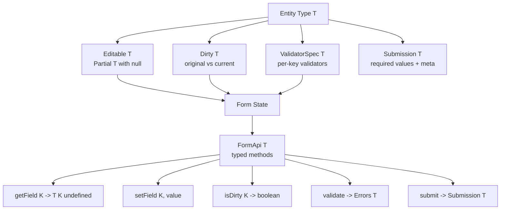

# 2.09 Mapped Types

> "A mapped type is a generic type which uses a union of `PropertyKey`s (frequently created via a `keyof`) to iterate through keys to create a type." — TypeScript Handbook

Mapped types are the single most important mechanism TypeScript gives you for **deriving new types from existing types**. Almost every built-in utility type (`Partial`, `Required`, `Readonly`, `Pick`, `Omit`, `Record`, `Mutable`) is implemented as a tiny mapped type. Mastering them unlocks an entire tier of type-driven design: form-state libraries, ORM row types, JSON-API serializers, state-machine transitions, and React prop spreaders all become natural to express.

This note is exhaustive. By the end you should be able to reimplement the entire `Partial`/`Readonly`/`Pick`/`Omit`/`Record` family from scratch, fluently apply modifier operators, rename and filter keys via `as`, recognize homomorphic mapped types, and design a fully-typed form-state library.

---

## 1. Purpose

### 1.1 The core problem mapped types solve

In a TypeScript codebase you routinely need a type that is *almost* identical to another type, but with small, systematic changes:

- Every property becomes optional (an edit-form state).
- Every property becomes readonly (a frozen config).
- Every property is wrapped in `Promise` (a loader).
- Every property is wrapped in `Dispatch<Action>` (a Redux container).
- Every property becomes a getter function `() => T[K]`.
- A subset of keys is selected or excluded.

Without mapped types, you would have to write each derived type by hand. For a 20-field entity, that means 20 duplicated lines, and any time the source entity changes you must update every derived type. The duplication is enormous, error-prone, and violates the DRY principle at the type level.

Mapped types let you write a **type-level function**:

```ts
type Nullable<T> = { [K in keyof T]: T[K] | null };
```

This reads almost like a JavaScript `for...of` loop: "for each key `K` in the keys of `T`, declare a property `K` whose value type is `T[K] | null`." One line of code produces a brand new object type derived structurally from `T`.

### 1.2 What mapped types enable

| Capability | Example |
| --- | --- |
| Make every property optional | `Partial<User>` |
| Make every property required | `Required<User>` |
| Make every property readonly | `Readonly<User>` |
| Make every property mutable | `Mutable<User>` |
| Wrap every value in another type | `Promise<User>`, `Dispatch<User>` |
| Select a subset of keys | `Pick<User, "id" \| "name">` |
| Remove a subset of keys | `Omit<User, "password">` |
| Build a dictionary | `Record<"a" \| "b", number>` |
| Rename keys | `{ [K in keyof T as Capitalize<K & string>]: T[K] }` |
| Filter keys by value type | `{ [K in keyof T as T[K] extends Function ? K : never]: T[K] }` |
| Generate getters | `{ [K in keyof T as `get${Capitalize<K & string>}`]: () => T[K] }` |

Every one of these is a **one-line mapped type** (or composition with a conditional).

### 1.3 The alternative without mapped types

Imagine you have this entity:

```ts
interface User {
  id: string;
  name: string;
  email: string;
  age: number;
  password: string;
}
```

You need a `UserUpdate` type for a PATCH endpoint (every field optional), and a `PublicUser` type for the API response (no `password`). Without mapped types you would write:

```ts
interface UserUpdate {
  id?: string;
  name?: string;
  email?: string;
  age?: number;
  password?: string;
}

interface PublicUser {
  id: string;
  name: string;
  email: string;
  age: number;
}
```

Two duplicate definitions. When `User` gains a `role: "admin" | "user"` field, you must update both. With mapped types:

```ts
type UserUpdate = Partial<User>;
type PublicUser = Omit<User, "password">;
```

These always stay in sync with `User`. **This is the entire reason mapped types exist: to express derivations as functions of the source type so they cannot drift.**

### 1.4 Where mapped types sit in the type system

Mapped types are part of the broader family of **type-level computation** primitives in TypeScript:

- [[2.07 Generics and Constraints]] — provides the parameter `T` you map over.
- [[2.08 Typeof Keyof Lookup]] — `keyof T` produces the union you iterate.
- [[2.11 Conditional Types]] — combine with mapped types for filtering.
- [[2.13 Template Literal Types]] — combine via `as` for renaming keys.

If generics are the parameters, `keyof` is the iterator source, conditional types are the `if` statements, and template literal types are the string manipulation, then **mapped types are the `for` loop** that ties them together.

---

## 2. Theory and Deep Dive

### 2.1 The canonical syntax

A mapped type has this shape:

```ts
type Mapped<T> = {
  [K in UnionOfKeys]: SomeType;
};
```

Two parts:

1. `[K in UnionOfKeys]` — the **index signature clause**. `K` is a type variable (locally bound), and `UnionOfKeys` is any union of `string | number | symbol`. Usually `UnionOfKeys` is `keyof T`.
2. `SomeType` — the value type of each property. It can reference `K` (the current key) and, if you also have access to `T`, `T[K]` (the original value at that key).

Example:

```ts
type Stringify<T> = { [K in keyof T]: string };

type User = { id: number; name: string; active: boolean };
type StringifiedUser = Stringify<User>;
// { id: string; name: string; active: string }
```

Notice that the **keys are preserved** (still `id`, `name`, `active`), but the **value types are all rewritten to `string`**.

### 2.2 The `for...in` analogy

Read `[K in keyof T]: T[K]` as if it were:

```js
function identity(T) {
  const result = {};
  for (const K of Object.keys(T)) {
    result[K] = T[K]; // value at the original key
  }
  return result;
}
```

When the right-hand side is just `T[K]`, the mapped type is the identity — it produces the same type as `T`. Every modification comes from one of three places:

1. The **right-hand side** `T[K]` becomes something else (`T[K] | null`, `Promise<T[K]>`, etc.).
2. The **modifiers** in front of the property name (`readonly`, `?`).
3. The **key** `K` is remapped or filtered via `as`.

### 2.3 The three modifier operators

TypeScript allows two modifiers — `readonly` and `?` — each of which can be **added** (`+`, the default) or **removed** (`-`). That gives four explicit operators plus two implicit defaults.

| Syntax | Meaning |
| --- | --- |
| `readonly [K in keyof T]: T[K]` | Add `readonly` to every property |
| `+readonly [K in keyof T]: T[K]` | Same as above (explicit `+`) |
| `-readonly [K in keyof T]: T[K]` | Remove `readonly` from every property |
| `[K in keyof T]?: T[K]` | Add `?` (optional) to every property |
| `+[K in keyof T]?: T[K]` | Same as above (explicit `+`) |
| `-[K in keyof T]?: T[K]` | Remove `?` (force required) from every property |

You can combine modifiers:

```ts
type ReadonlyPartial<T> = {
  +readonly [K in keyof T]+?: T[K];
};
```

The `+` is rarely written explicitly; TypeScript treats a bare `readonly` or `?` as `+readonly`/`+?`. The `-` is essential because there is no other syntax for "remove this modifier."

### 2.4 The four foundational utilities, from scratch

```ts
type MyPartial<T>  = { [K in keyof T]?: T[K] };
type MyRequired<T> = { [K in keyof T]-?: T[K] };
type MyReadonly<T> = { readonly [K in keyof T]: T[K] };
type MyMutable<T>  = { -readonly [K in keyof T]: T[K] };
```

These four primitives are the bedrock. Every other utility composes them, conditional types, or key remapping.

### 2.5 `Pick` and `Record` — also mapped types

`Pick<T, K>` selects a subset of keys. It is a mapped type over the **requested keys** `K`, not over `keyof T`:

```ts
type MyPick<T, K extends keyof T> = {
  [P in K]: T[P];
};
```

`Record<K, V>` builds an object type with keys `K` and value type `V`:

```ts
type MyRecord<K extends keyof any, V> = {
  [P in K]: V;
};
```

`keyof any` is the type `string | number | symbol`, which is the full set of possible property-key types. So `K extends keyof any` constrains `K` to a union of valid key types.

### 2.6 `Omit` — `Pick` composed with `Exclude`

`Omit` is not a brand-new mapped type; it is `Pick` composed with `Exclude`:

```ts
type MyOmit<T, K extends keyof any> = MyPick<T, Exclude<keyof T, K>>;
```

`Exclude<keyof T, K>` removes the unwanted keys from the key union, then `Pick` selects the rest. This is a beautiful example of composing mapped types with conditional types.

### 2.7 Homomorphic mapped types

A mapped type is **homomorphic** when it has the shape `{ [K in keyof T]: ... }` for some type variable `T`. The compiler recognizes this shape and **preserves the modifiers of `T` by default**.

```ts
type WithFlags<T> = { [K in keyof T]: T[K] };

interface Source {
  readonly a: string;
  b?: number;
}

type Result = WithFlags<Source>;
// { readonly a: string; b?: number }
```

Notice `a` is still `readonly` and `b` is still optional. The identity mapped type carries modifiers through.

This has profound consequences:

- If you write `{ [K in keyof T]?: T[K] }`, you **add** `?` to every property, including the ones that were already optional. Existing optionality is preserved; new optionality is added.
- If you write `{ -readonly [K in keyof T]: T[K] }`, you **strip** `readonly` from every property, but you keep `?`.
- If you write `{ [K in keyof T]: NewType }` where the right-hand side does *not* reference `T[K]`, the modifiers are still preserved, but the value type is overwritten.

Compare with a **non-homomorphic** mapped type:

```ts
type NonHomo<T> = { [K in "a" | "b" | "c"]: T };
// { a: T; b: T; c: T } -- modifiers from T are irrelevant
```

Here the iteration source is a fixed union, not `keyof T`, so there is no source type whose modifiers could be preserved. The result is always a plain object type.

### 2.8 Why homomorphism matters for modifiers

Homomorphic mapped types let you write modifiers as **deltas**. "I want to add `readonly`" means "make every property readonly, but do not touch `?`." "I want to remove `?`" means "make every property required, but do not touch `readonly`."

```ts
interface Original {
  readonly id: number;
  name: string;
  bio?: string;
}

// Add readonly to everything, keep ?
type Frozen = Readonly<Original>;
// { readonly id: number; readonly name: string; readonly bio?: string }

// Remove ? from everything, keep readonly
type Strict = Required<Original>;
// { readonly id: number; name: string; bio: string }
```

Notice `Strict` keeps `readonly id` (because `Required` is homomorphic and only touches `?`) and `Frozen` keeps `bio?` (because `Readonly` is homomorphic and only touches `readonly`).

### 2.9 Key remapping via `as` (TypeScript 4.1+)

Before TS 4.1, the keys of a mapped type were always the same as the source keys. TS 4.1 introduced the `as` clause:

```ts
type Mapped<T> = {
  [K in keyof T as NewKey]: T[K];
};
```

`NewKey` must be a `string | number | symbol`. Most often it is a **template literal type** that references `K`:

```ts
type Getters<T> = {
  [K in keyof T as `get${Capitalize<string & K>}`]: () => T[K];
};

type User = { id: number; name: string };
type UserGetters = Getters<User>;
// { getId: () => number; getName: () => string }
```

`Capitalize<string & K>` is required because `K` may be `string | number | symbol`, and `Capitalize` only accepts `string`. Intersecting with `string` narrows `K` to its string part.

### 2.10 Filtering keys via `as never`

If `NewKey` resolves to `never`, that key is **removed from the result type**. This is how you filter keys.

```ts
type RemoveKindField<T> = {
  [K in keyof T as T[K] extends Function ? never : K]: T[K];
};

type Example = {
  id: number;
  name: string;
  greet(): void;
};

type Filtered = RemoveKindField<Example>;
// { id: number; name: string } -- greet removed
```

The conditional `T[K] extends Function ? never : K` says: "if the value type is a function, drop the key; otherwise keep it as `K`." Combined with `as`, this gives you value-type-based filtering — a feature that was extremely awkward before TS 4.1.

You can filter on the key, too:

```ts
type StringKeysOnly<T> = {
  [K in keyof T as K extends string ? K : never]: T[K];
};
```

### 2.11 The full picture

A mapped type can have all four pieces in one declaration:

```ts
type FullPower<T> = {
  -readonly [K in keyof T as `wrapped-${string & K}`]+?: T[K] | null;
};
```

This:

1. Removes `readonly` from every property (`-readonly`).
2. Iterates `keyof T`.
3. Renames each key to `wrapped-<original>`.
4. Adds `?` to every property (`+?`).
5. Sets the value type to `T[K] | null`.

### 2.12 Mermaid diagram of the transformation

```mermaid
flowchart TD
  Source[Source Type T<br/>id: number<br/>name: string<br/>bio?: string] --> KeyOf[keyof T = 'id' | 'name' | 'bio']
  KeyOf --> Loop[Mapped Type Loop]
  Loop --> ForEach["For each K in keyof T"]
  ForEach --> ModCheck{Modifier?}
  ModCheck -->|+readonly| AddRO[Add readonly]
  ModCheck -->|-readonly| RemoveRO[Remove readonly]
  ModCheck -->|+?| AddOpt[Add optional]
  ModCheck -->|-?| RemoveOpt[Remove optional]
  ForEach --> Remap{as clause?}
  Remap -->|yes| NewKey[Compute new key<br/>Capitalize, template, filter]
  Remap -->|no| KeepK[Keep original K]
  ForEach --> ValueType[Compute value type<br/>T K, T K pipe null, Promise T K, ...]
  AddRO --> Assemble
  RemoveRO --> Assemble
  AddOpt --> Assemble
  RemoveOpt --> Assemble
  NewKey --> Assemble
  KeepK --> Assemble
  ValueType --> Assemble[Assemble result object]
  Assemble --> Result[Result Type<br/>readonly getId: () => number<br/>...]
```

### 2.13 Type inference positions in mapped types

When TypeScript encounters a call like `Object.keys(someUser)` and you pass it through a generic function with a mapped type, the compiler can **infer `T`** from a value shaped like the mapped type, as long as the mapped type is homomorphic. This is why `Partial<T>` and `Readonly<T>` are "transparent" — you can write:

```ts
function freeze<T>(obj: T): Readonly<T> {
  return Object.freeze(obj);
}

const user = { id: 1, name: "Alice" };
const frozen = freeze(user);
frozen.id = 99; // TS error: readonly
```

The compiler infers `T` from `user` and applies `Readonly<T>` to the return type.

### 2.14 Mapped types over unions distribute

A subtle point: when a generic `T` is a union, `keyof T` is the **intersection** of the keys (only keys present in all members). This is often surprising:

```ts
type A = { id: number; a: string };
type B = { id: number; b: string };
type AB = A | B;

type ABKeys = keyof AB; // "id" only
```

If you want to map over the union *members*, you need a conditional type to distribute:

```ts
type MapEach<T> = T extends any ? { [K in keyof T]: T[K] } : never;
```

The `T extends any` clause distributes over the union, mapping each member separately.

### 2.15 Mapped types and `any`

`{ [K in keyof any]: V }` is the same as `Record<string | number | symbol, V>`. Iterating `keyof any` is the way to say "every possible key." This is also why `Record<K, V>` requires `K extends keyof any`.

### 2.16 Mapped types and index signatures

When the source type has an index signature, the mapped type preserves it:

```ts
type Dictionary = { [k: string]: number };
type FrozenDict = Readonly<Dictionary>;
// { readonly [k: string]: number }
```

This is one of the few cases where the result is still an index signature, not a fixed-key object.

---

## 3. Mental Models

### 3.1 The for-loop mental model

A mapped type is **a `for` loop over the keys of an object type that builds a new object type**.

```ts
type Mapped<T> = { [K in keyof T]: NewType };
```

```js
const result = {};
for (const K of Object.keys(T)) {
  result[K] = NewType; // computed from K and T[K]
}
```

If you read every mapped type this way, the syntax becomes obvious.

### 3.2 The modifier dial

Think of `readonly` and `?` as two independent dials, each with three positions: **leave alone**, **force on**, **force off**.

- Leave alone: write nothing (homomorphic preservation).
- Force on: `readonly` or `?` (equivalent to `+readonly` / `+?`).
- Force off: `-readonly` or `-?`.

`Readonly<T>` turns the `readonly` dial to "on" and leaves `?` alone. `Required<T>` turns the `?` dial to "off" and leaves `readonly` alone. `Readonly<Required<T>>` turns both: `readonly` on, `?` off.

### 3.3 The key remap as `reduce`

```ts
type Remap<T> = { [K in keyof T as NewKey<K>]: T[K] };
```

```js
const result = {};
for (const K of Object.keys(T)) {
  const newKey = NewKey(K); // could be Capitalize, could be filtered to never
  if (newKey !== never) result[newKey] = T[K];
}
```

The `as` clause is the `reduce` body; if it returns `never`, the entry is skipped.

### 3.4 The homomorphic "delta" model

When you see `{ [K in keyof T]: ... }`, think **delta**. The result starts as a copy of `T` (with all its modifiers), then you apply changes:

- Right-hand side overrides value types.
- Modifier operators toggle modifiers.
- `as` renames or filters keys.

This is the opposite of "build from scratch." A homomorphic mapped type **starts from `T` and edits it**.

### 3.5 The non-homomorphic "blank canvas" model

When you see `{ [K in SomeUnion]: V }` where `SomeUnion` is not `keyof T`, think **blank canvas**. You are constructing a brand-new object type from a list of keys; there is no source type whose modifiers could be preserved.

---

## 4. Real-World Use Cases

### 4.1 Form state derivation

You have an entity type. You need:

- `Partial<T>` for the edit buffer (any field can be unset).
- `Readonly<Partial<T>>` for the "form is read-only while saving" state.
- `Required<Pick<T, "id">>` for the submission envelope (id must be present).

```ts
type User = { id: string; name: string; email: string; age: number };
type UserFormState = Partial<User>;
type UserDraft = Readonly<Partial<User>>;
type UserSubmission = { user: User; meta: Required<Pick<User, "id">> };
```

### 4.2 API response wrappers

Every field gets wrapped in `{ value: T; updatedAt: number }` for an audit-log view:

```ts
type Audited<T> = {
  [K in keyof T]: { value: T[K]; updatedAt: number };
};

type AuditedUser = Audited<User>;
/*
{
  id:   { value: string; updatedAt: number };
  name: { value: string; updatedAt: number };
  email:{ value: string; updatedAt: number };
  age:  { value: number;  updatedAt: number };
}
*/
```

### 4.3 React prop spreading

You want to forward every prop except one or two to a child component:

```ts
type ButtonProps = React.ButtonHTMLAttributes<HTMLButtonElement> & {
  isLoading?: boolean;
};

// Strip isLoading before passing to the real <button>
type ForwardedProps = Omit<ButtonProps, "isLoading">;
```

### 4.4 Type-safe getters / setters

Generate getter and setter function names from any entity:

```ts
type Getters<T> = {
  [K in keyof T as `get${Capitalize<string & K>}`]: () => T[K];
};
type Setters<T> = {
  [K in keyof T as `set${Capitalize<string & K>}`]: (v: T[K]) => void;
};

type UserGetters = Getters<User>;
type UserSetters = Setters<User>;
// { getId: () => string; setAge: (v: number) => void; ... }
```

### 4.5 State machines

Map each state to the actions available from it:

```ts
type States = "idle" | "loading" | "success" | "error";
type ActionMap = Record<States, string[]>;
// { idle: string[]; loading: string[]; success: string[]; error: string[] }
```

### 4.6 Event emitter typing

Build an event handler map keyed by event name, with the correct payload type for each event:

```ts
type Events = {
  click: { x: number; y: number };
  hover: { target: string };
  submit: { formData: unknown };
};

type Handlers<T> = {
  [K in keyof T]?: (payload: T[K]) => void;
};

type EventHandlers = Handlers<Events>;
// { click?: (p: {x,y}) => void; hover?: ...; submit?: ... }
```

### 4.7 ORM row types

Map column definitions to row types and update types:

```ts
type Column = { type: "string" | "number" | "boolean"; nullable: boolean };
type Schema = Record<string, Column>;

type Row<S extends Schema> = {
  [K in keyof S]: S[K]["type"] extends "string"
    ? string | (S[K]["nullable"] extends true ? null : never)
    : S[K]["type"] extends "number"
    ? number | (S[K]["nullable"] extends true ? null : never)
    : boolean;
};
```

### 4.8 JSON serialization

Strip functions and symbols, convert `Date` to `string`, recursively:

```ts
type Jsonifiable<T> = T extends string | number | boolean | null
  ? T
  : T extends Date
  ? string
  : T extends Function
  ? never
  : T extends object
  ? { [K in keyof T as T[K] extends Function ? never : K]: Jsonifiable<T[K]> }
  : never;
```

### 4.9 Reactive observables

Wrap each property in an `Observable`:

```ts
type Observable<T> = { [K in keyof T]: Observable<T[K]> };
```

### 4.10 Localization dictionaries

Build a type-safe dictionary keyed by locale, where every locale must provide every string:

```ts
type Locale = "en" | "fr" | "de";
type Strings = { greeting: string; farewell: string };
type Localized = Record<Locale, Strings>;
```

---

## 5. Code Examples

### 5.1 Example A — Minimal and Conceptual

This section walks through every foundational pattern with side-by-side JavaScript (runtime analog) and TypeScript (type-level) code.

#### 5.1.1 Identity mapped type

**JS analog:**

```js
function identityObject(obj) {
  const result = {};
  for (const key of Object.keys(obj)) {
    result[key] = obj[key];
  }
  return result;
}
```

**TS type-level:**

```ts
type Identity<T> = { [K in keyof T]: T[K] };

type User = { id: number; name: string };
type SameUser = Identity<User>;
// { id: number; name: string }
```

#### 5.1.2 Adding optional (`Partial`)

**JS analog:**

```js
function partialObject(obj) {
  const result = {};
  for (const key of Object.keys(obj)) {
    result[key] = obj[key]; // value is just not set when undefined
  }
  return result;
}
```

**TS type-level:**

```ts
type MyPartial<T> = { [K in keyof T]?: T[K] };

type User = { id: number; name: string };
type PartialUser = MyPartial<User>;
// { id?: number; name?: string }
```

#### 5.1.3 Removing optional (`Required`)

**JS analog:**

```js
function requireAllFields(obj, defaults) {
  const result = {};
  for (const key of Object.keys(obj)) {
    result[key] = obj[key] ?? defaults[key];
  }
  return result;
}
```

**TS type-level:**

```ts
type MyRequired<T> = { [K in keyof T]-?: T[K] };

type Form = { id?: number; name?: string };
type StrictForm = MyRequired<Form>;
// { id: number; name: string }
```

#### 5.1.4 Adding readonly (`Readonly`)

**JS analog:**

```js
function freezeObject(obj) {
  return Object.freeze({ ...obj });
}
```

**TS type-level:**

```ts
type MyReadonly<T> = { readonly [K in keyof T]: T[K] };

type User = { id: number; name: string };
type FrozenUser = MyReadonly<User>;
// { readonly id: number; readonly name: string }
```

#### 5.1.5 Removing readonly (`Mutable`)

**JS analog:**

```js
function unfreezeObject(obj) {
  return { ...obj }; // shallow copy is mutable
}
```

**TS type-level:**

```ts
type MyMutable<T> = { -readonly [K in keyof T]: T[K] };

type FrozenUser = { readonly id: number; readonly name: string };
type User = MyMutable<FrozenUser>;
// { id: number; name: string }
```

#### 5.1.6 Wrap every value (`Nullable`)

**JS analog:**

```js
function nullableObject(obj) {
  const result = {};
  for (const key of Object.keys(obj)) {
    result[key] = obj[key] ?? null;
  }
  return result;
}
```

**TS type-level:**

```ts
type Nullable<T> = { [K in keyof T]: T[K] | null };

type User = { id: number; name: string };
type NullableUser = Nullable<User>;
// { id: number | null; name: string | null }
```

#### 5.1.7 Pick a subset of keys

**JS analog:**

```js
function pick(obj, keys) {
  const result = {};
  for (const key of keys) {
    if (key in obj) result[key] = obj[key];
  }
  return result;
}
```

**TS type-level:**

```ts
type MyPick<T, K extends keyof T> = { [P in K]: T[P] };

type User = { id: number; name: string; email: string };
type UserPreview = MyPick<User, "id" | "name">;
// { id: number; name: string }
```

#### 5.1.8 Omit a subset of keys

**JS analog:**

```js
function omit(obj, keys) {
  const result = { ...obj };
  for (const key of keys) delete result[key];
  return result;
}
```

**TS type-level:**

```ts
type MyOmit<T, K extends keyof any> = MyPick<T, Exclude<keyof T, K>>;

type User = { id: number; name: string; password: string };
type PublicUser = MyOmit<User, "password">;
// { id: number; name: string }
```

#### 5.1.9 Record (dictionary)

**JS analog:**

```js
function makeRecord(keys, value) {
  const result = {};
  for (const key of keys) result[key] = value;
  return result;
}
```

**TS type-level:**

```ts
type MyRecord<K extends keyof any, V> = { [P in K]: V };

type Roles = "admin" | "user" | "guest";
type RoleCount = MyRecord<Roles, number>;
// { admin: number; user: number; guest: number }
```

#### 5.1.10 Key remapping with template literal

**JS analog:**

```js
function renameKeys(obj, renameFn) {
  const result = {};
  for (const key of Object.keys(obj)) {
    result[renameFn(key)] = obj[key];
  }
  return result;
}
renameKeys({ id: 1, name: "x" }, k => "get" + k.charAt(0).toUpperCase() + k.slice(1));
```

**TS type-level:**

```ts
type Getters<T> = {
  [K in keyof T as `get${Capitalize<string & K>}`]: () => T[K];
};

type User = { id: number; name: string };
type UserGetters = Getters<User>;
// { getId: () => number; getName: () => string }
```

#### 5.1.11 Filtering keys by value type

**JS analog:**

```js
function omitMethods(obj) {
  const result = {};
  for (const [key, value] of Object.entries(obj)) {
    if (typeof value !== "function") result[key] = value;
  }
  return result;
}
```

**TS type-level:**

```ts
type DataFields<T> = {
  [K in keyof T as T[K] extends Function ? never : K]: T[K];
};

type Mixed = { id: number; greet(): void; name: string };
type DataOnly = DataFields<Mixed>;
// { id: number; name: string }
```

#### 5.1.12 Combining modifiers

**JS analog:**

```js
function strictFreeze(obj) {
  const result = {};
  for (const key of Object.keys(obj)) {
    if (obj[key] === undefined) continue; // enforce required
    Object.defineProperty(result, key, {
      value: obj[key],
      writable: false,
      configurable: false,
      enumerable: true,
    });
  }
  return Object.freeze(result);
}
```

**TS type-level:**

```ts
type StrictReadonly<T> = { readonly [K in keyof T]-?: T[K] };

type Maybe = { id?: number; name?: string };
type Strict = StrictReadonly<Maybe>;
// { readonly id: number; readonly name: string }
```

### 5.2 Example B — Production-Grade

Let us build the skeleton of a **typed form-state library** that derives editable, dirty, and submitted types from a single entity definition. This combines every technique above.

#### 5.2.1 The entity

```ts
interface UserEntity {
  id: string;
  name: string;
  email: string;
  age: number;
  role: "admin" | "user" | "guest";
  createdAt: Date;
  bio?: string;
  password: string;
}
```

#### 5.2.2 The derived types

```ts
// Every field becomes nullable + optional (the edit buffer)
type Editable<T> = { [K in keyof T]?: T[K] | null };

// Same as Editable but the id is always present (it identifies the entity)
type EditableWithId<T, IdKey extends keyof T> = Editable<Omit<T, IdKey>>
  & Required<Pick<T, IdKey>>;

// Dirty state: original value plus current value
type Dirty<T> = {
  [K in keyof T]: { original: T[K]; current: T[K] };
};

// Field-level validation descriptor
type FieldValidator<T> = {
  [K in keyof T]?: (value: T[K] | undefined) => string | null;
};

// Submission envelope
type Submission<T> = {
  values: Required<{ [K in keyof T]: T[K] }>;
  submittedAt: number;
};
```

#### 5.2.3 The runtime implementation

**JS version (no types):**

```js
function createForm(entity) {
  const original = { ...entity };
  const buffer = { ...entity };
  const dirty = {};

  function getField(key) {
    return buffer[key];
  }

  function setField(key, value) {
    buffer[key] = value;
    dirty[key] = original[key] !== value;
  }

  function isDirty(key) {
    return Boolean(dirty[key]);
  }

  function anyDirty() {
    return Object.values(dirty).some(Boolean);
  }

  function reset() {
    Object.assign(buffer, original);
    for (const k of Object.keys(dirty)) dirty[k] = false;
  }

  function submit() {
    return { values: { ...buffer }, submittedAt: Date.now() };
  }

  return { getField, setField, isDirty, anyDirty, reset, submit };
}

const form = createForm({ id: "1", name: "Alice", email: "a@x.com", age: 30 });
form.setField("name", "Bob");
console.log(form.isDirty("name")); // true
console.log(form.anyDirty());      // true
```

**TS version (fully typed):**

```ts
type Editable<T> = { [K in keyof T]?: T[K] | null };
type Dirty<T> = { [K in keyof T]: { original: T[K]; current: T[K] } };
type FieldValidator<T> = {
  [K in keyof T]?: (value: T[K] | undefined) => string | null;
};
type Submission<T> = {
  values: { [K in keyof T]: T[K] };
  submittedAt: number;
};

interface FormApi<T> {
  getField<K extends keyof T>(key: K): T[K] | undefined;
  setField<K extends keyof T>(key: K, value: T[K] | undefined): void;
  isDirty<K extends keyof T>(key: K): boolean;
  anyDirty(): boolean;
  reset(): void;
  submit(): Submission<T>;
  validate(): { [K in keyof T]?: string };
}

function createForm<T extends object>(entity: T): FormApi<T> {
  const original = { ...entity } as T;
  const buffer: Editable<T> = { ...entity };
  const dirtyFlags: Record<string, boolean> = {};

  return {
    getField(key) {
      return buffer[key] ?? undefined;
    },
    setField(key, value) {
      (buffer as any)[key] = value;
      dirtyFlags[key as string] = original[key] !== value;
    },
    isDirty(key) {
      return Boolean(dirtyFlags[key as string]);
    },
    anyDirty() {
      return Object.values(dirtyFlags).some(Boolean);
    },
    reset() {
      Object.assign(buffer, original);
      for (const k of Object.keys(dirtyFlags)) dirtyFlags[k] = false;
    },
    submit() {
      return {
        values: { ...buffer } as { [K in keyof T]: T[K] },
        submittedAt: Date.now(),
      };
    },
    validate() {
      const errors: Record<string, string | null> = {};
      return errors as any;
    },
  };
}

interface UserEntity {
  id: string;
  name: string;
  email: string;
  age: number;
  role: "admin" | "user" | "guest";
}

const form = createForm<UserEntity>({
  id: "1",
  name: "Alice",
  email: "a@x.com",
  age: 30,
  role: "user",
});

form.setField("name", "Bob");
form.setField("age", 31);
// form.setField("name", 42); // TS error: 42 is not assignable to string
// form.setField("unknown", 1); // TS error: "unknown" is not assignable to keyof UserEntity
console.log(form.isDirty("name")); // true
console.log(form.anyDirty());      // true
const submission = form.submit();
// submission.values has type { id: string; name: string; ... }
```

The TS version catches two bugs the JS version cannot: passing the wrong value type, and passing a key that does not exist on the entity. Every method on `FormApi<T>` is derived from `T`, so when `UserEntity` gains a new field, the form API automatically supports it.

#### 5.2.4 Generating validators

```ts
type ValidatorSpec<T> = {
  [K in keyof T]?: Array<(value: T[K] | undefined) => string | null>;
};

type ValidationErrors<T> = { [K in keyof T]?: string };

function runValidators<T>(
  spec: ValidatorSpec<T>,
  values: Editable<T>,
): ValidationErrors<T> {
  const errors: Record<string, string> = {};
  for (const key of Object.keys(spec) as Array<keyof T>) {
    const validators = spec[key];
    if (!validators) continue;
    for (const validate of validators) {
      const message = validate(values[key]);
      if (message) {
        errors[key as string] = message;
        break;
      }
    }
  }
  return errors as ValidationErrors<T>;
}

const userValidators: ValidatorSpec<UserEntity> = {
  name: [
    v => (v && v.length < 2 ? "Name too short" : null),
    v => (v && v.length > 100 ? "Name too long" : null),
  ],
  age: [
    v => (v === undefined ? "Age required" : null),
    v => (v !== undefined && v < 0 ? "Age must be positive" : null),
  ],
  // role, email, id have no validators (omitted keys are optional in the spec)
};

const errs = runValidators(userValidators, { name: "A", age: -1 });
// { name: "Name too short"; age: "Age must be positive" }
```

Notice the `ValidatorSpec<T>` type: every key in `T` is allowed, each value is an array of validators, and the validators are typed against `T[K]`. This is a homomorphic mapped type combined with optional modifiers — exactly what `Partial` does internally.

#### 5.2.5 Producing a public API type

Strip the password and convert dates to ISO strings for the API response:

```ts
type Serialized<T, Blacklist extends keyof T> = {
  [K in keyof T as K extends Blacklist ? never : K]: T[K] extends Date
    ? string
    : T[K];
};

type PublicUserEntity = Serialized<UserEntity & { password: string; createdAt: Date }, "password">;
// { id: string; name: string; email: string; age: number; role: ...; createdAt: string }
```

Here `as K extends Blacklist ? never : K` filters out the password, and the value-type conditional converts `Date` to `string`. This pattern — combining key remapping for filtering with conditional value types — is the workhorse of API serializers.

---

## 6. Common Mistakes and Anti-Patterns

### 6.1 Forgetting `keyof T` and iterating the wrong thing

**Bad:**

```ts
type Bad<T> = { [K in T]: T[K] }; // Error: T is not a union of keys
```

**Good:**

```ts
type Good<T> = { [K in keyof T]: T[K] };
```

`K in T` only works when `T` is a union of `string | number | symbol`. `keyof T` produces that union from an object type.

### 6.2 Misusing modifier syntax

**Bad:**

```ts
type Bad<T> = { readonly? [K in keyof T]: T[K] }; // Syntax error
type Bad2<T> = { [K in keyof T]readonly: T[K] };  // Syntax error
```

**Good:**

```ts
type Good<T>  = { readonly [K in keyof T]: T[K] };
type Good2<T> = { [K in keyof T]?: T[K] };
type Good3<T> = { -readonly [K in keyof T]-?: T[K] };
```

The modifier goes **before** the `[K in ...]` for `readonly` and **after** the `]` for `?`. The `-` sign goes immediately before `readonly` or `?`.

### 6.3 Key remapping with a non-template, non-key type

**Bad:**

```ts
type Bad<T> = { [K in keyof T as number]: T[K] }; // Error: number is not assignable to the proper type
type Bad2<T> = { [K in keyof T as K extends string ? string : never]: T[K] };
// This collapses all keys into "string" — overwrites them
```

**Good:**

```ts
type Good<T> = {
  [K in keyof T as `get${Capitalize<string & K>}`]: () => T[K];
};
```

The `as` clause must produce a `string | number | symbol`, and most useful remaps use a template literal type that references `K`. If you produce a constant like `string`, all keys collapse into one and you lose data.

### 6.4 Losing optionality when not homomorphic

**Bad:**

```ts
type Bad<T> = { [K in "a" | "b"]: T }; // modifiers from T ignored; result is always required
```

**Good:**

```ts
type Good<T> = { [K in keyof T]?: T[K] }; // homomorphic; preserves + adds
```

If your source type has optional fields and you want to preserve them, you must iterate `keyof T` (or `keyof SomeObject`). Iterating a fixed literal union gives a non-homomorphic mapped type that does not see `T`'s modifiers.

### 6.5 `Record<K, V>` vs `{ [key: K]: V }`

**Bad (often):**

```ts
type BadDict = { [key: string]: number };
// This is an index signature, not a Record.
// It allows any string key, and `keyof BadDict` is just `string`.
```

**Good:**

```ts
type GoodDict = Record<"a" | "b" | "c", number>;
// { a: number; b: number; c: number }
// keyof GoodDict is "a" | "b" | "c"
```

An index signature `{ [key: string]: V }` is different from `Record<string, V>` in subtle ways: it is treated as "any string key" rather than "this specific set of keys," which affects type inference, `keyof`, and `Object.keys` typing. Prefer `Record` whenever the key set is known.

### 6.6 Performance with deeply nested mapped types

**Bad (slow):**

```ts
type DeepOptional<T> = {
  [K in keyof T]?: T[K] extends object ? DeepOptional<T[K]> : T[K];
};
```

For a deeply nested type with many keys, the compiler expands this recursively. Combined with other conditional types, this can push compile times into minutes.

**Better:**

```ts
type DeepOptional<T> = T extends Function
  ? T
  : T extends object
  ? { [K in keyof T]?: DeepOptional<T[K]> }
  : T;
```

The conditional outer layer prevents recursion into primitives and functions, which often dramatically reduces the work the compiler does. Also consider flattening with helper types and avoiding combining `DeepPartial` with `DeepReadonly` and `DeepMutable` in the same expression.

### 6.7 Forgetting `Capitalize<string & K>` for key remapping

**Bad:**

```ts
type Bad<T> = { [K in keyof T as `get${Capitalize<K>}`]: () => T[K] };
// Error: K is string | number | symbol; Capitalize wants string
```

**Good:**

```ts
type Good<T> = {
  [K in keyof T as `get${Capitalize<string & K>}`]: () => T[K];
};
```

The intersection `string & K` narrows `K` to its string part. If you want to handle number keys, you can extend the conditional:

```ts
type Good2<T> = {
  [K in keyof T as K extends string
    ? `get${Capitalize<K>}`
    : K extends number
    ? `get${K}`
    : never]: () => T[K];
};
```

### 6.8 Using `as never` to "remove" but forgetting it does not work for index signatures

```ts
type FilterStrings<T> = {
  [K in keyof T as T[K] extends string ? K : never]: T[K];
};

type Dict = { [k: string]: number };
type Filtered = FilterStrings<Dict>;
// Result: { [k: string]: number } -- index signature is preserved
```

Index signatures are not filtered by `as never` because they are not "keys" in the literal sense; they represent an unbounded set of keys. You cannot filter an index signature; you must first convert to a finite union of keys.

### 6.9 Assuming `Partial<Readonly<T>>` is the same as `Readonly<Partial<T>>`

The order does not matter for the *result*, but it matters for readability and for chained compositions:

```ts
type A = Partial<Readonly<T>>; // readonly first, then optional
type B = Readonly<Partial<T>>; // optional first, then readonly
// Both produce { readonly id?: number; ... }
```

These produce the same type. However, if you compose with `Required` (which strips `?`) and `Readonly`, the order matters conceptually because each operation is a delta. Read your compositions left to right: the outermost operation is applied last.

### 6.10 Treating mapped types as a runtime construct

```ts
type Nullable<T> = { [K in keyof T]: T[K] | null };

const user: Nullable<{ id: number }> = { id: 1 };
// user.id is type number | null at compile time
// but at runtime, user.id is just 1 — there is no "Nullable wrapper"
```

Mapped types are compile-time only. They do not produce runtime code. If you want runtime nullability enforcement, you need a runtime check.

---

## 7. Best Practices and Design Patterns

### 7.1 Build your own utility types

The built-in `Partial`, `Readonly`, `Pick`, `Omit`, `Record`, `Required`, and `Readonly` are useful, but every codebase has derivations the built-ins do not cover. Build them:

```ts
type Nullable<T>   = { [K in keyof T]: T[K] | null };
type Mutable<T>    = { -readonly [K in keyof T]: T[K] };
type Async<T>      = { [K in keyof T]: Promise<T[K]> };
type Getters<T>    = { [K in keyof T as `get${Capitalize<string & K>}`]: () => T[K] };
type Setters<T>    = { [K in keyof T as `set${Capitalize<string & K>}`]: (v: T[K]) => void };
type Optional<T>   = { [K in keyof T]?: T[K] };
type DeepReadonly<T> = T extends object ? { readonly [K in keyof T]: DeepReadonly<T[K]> } : T;
type DeepPartial<T>  = T extends object ? { [K in keyof T]?: DeepPartial<T[K]> } : T;
type DeepMutable<T>  = T extends object ? { -readonly [K in keyof T]: DeepMutable<T[K]> } : T;
```

### 7.2 Prefer homomorphic mapped types when preserving modifiers

If you want to preserve optionality or readonly from the source, iterate `keyof T`. If you want to start from a blank canvas, iterate a fixed union. Homomorphic is the default choice for "edit an existing type."

### 7.3 Use key remapping for filtering and renaming

The `as` clause is the cleanest way to filter keys by value type. Before TS 4.1, you had to use `Pick` with a conditional, which was verbose. Now you write:

```ts
type Methods<T> = { [K in keyof T as T[K] extends Function ? K : never]: T[K] };
type DataFields<T> = { [K in keyof T as T[K] extends Function ? never : K]: T[K] };
```

### 7.4 Compose with conditional types for power

Mapped types and conditional types are most powerful together. The `as` clause accepts a conditional, and the value side accepts a conditional:

```ts
type Serialized<T> = {
  [K in keyof T as T[K] extends Function ? never : K]: T[K] extends Date
    ? string
    : T[K] extends object
    ? Serialized<T[K]>
    : T[K];
};
```

This single type definition produces a JSON-serializable version of any object type, recursively, with functions stripped and dates converted to strings.

### 7.5 Test with simple types first

Before applying a mapped type to your 30-field entity, test it on `{ a: 1; b: "x" }` and confirm the result. The TypeScript playground and the `type X = ...; const x: X = null!` trick (hover to see the inferred type) are invaluable.

### 7.6 Document non-obvious mapped types

A mapped type like `type DeepReadonly<T> = T extends object ? { readonly [K in keyof T]: DeepReadonly<T[K]> } : T` is dense. Add a doc comment:

```ts
/**
 * Recursively applies `readonly` to every property of T,
 * including nested objects. Does not affect functions or primitives.
 */
type DeepReadonly<T> = T extends object ? { readonly [K in keyof T]: DeepReadonly<T[K]> } : T;
```

### 7.7 Avoid mapped types that expand to never

If your mapped type produces `never` for every key (e.g., a filter that excludes everything), the result is `{}` — the empty object type. This is rarely what you want, and TypeScript will silently accept it. Always verify the result with a simple test type.

### 7.8 Use `keyof any` for the most general dictionary

```ts
type Dictionary<K extends keyof any, V> = { [P in K]: V };
```

`keyof any` is `string | number | symbol`. This is the most permissive constraint that still allows indexing.

### 7.9 Be careful with `Partial<T>` and required fields

```ts
interface User { id: string; name: string; }
function updateUser(id: string, patch: Partial<User>) { /* ... */ }
updateUser("1", {}); // Valid! But maybe you want at least one field.
```

If you want "at least one field," use:

```ts
type AtLeastOne<T> = { [K in keyof T]: Pick<T, K> }[keyof T];
updateUser("1", { name: "Alice" }); // Valid
// updateUser("1", {}); // Error
```

This is the "at least one" pattern: a mapped type produces a `{ [K]: Pick<T, K> }` shape, then indexed by `keyof T` to get a union of single-field picks.

---

## 8. Technical Interview Knowledge

### 8.1 Q: What is a mapped type?

**A:** A mapped type is a generic type that builds a new object type by iterating over a union of keys (typically `keyof T`) and producing a property for each key. The syntax is `{ [K in UnionOfKeys]: ValueType }`. Mapped types are the foundation of TypeScript's utility type system; `Partial`, `Readonly`, `Pick`, `Omit`, `Record`, `Required`, and `Mutable` are all implemented as one-line mapped types.

### 8.2 Q: How do you make all properties of a type optional?

**A:** Use `Partial<T>`, which is implemented as `{ [K in keyof T]?: T[K] }`. The `?` modifier (equivalent to `+?`) is added to every property. To go the other way, `Required<T>` uses `-?` to strip optionality.

### 8.3 Q: What are the modifier operators?

**A:** Two modifiers, `readonly` and `?`, each with `+` (add, the default) and `-` (remove) variants. So there are four effective operations: add readonly, remove readonly, add optional, remove optional. They can be combined: `{ -readonly [K in keyof T]-?: T[K] }` removes both.

### 8.4 Q: What is key remapping?

**A:** Introduced in TypeScript 4.1, the `as` clause in a mapped type lets you rename or filter keys during iteration. The syntax is `{ [K in keyof T as NewKey]: T[K] }`. `NewKey` is typically a template literal type like `` `get${Capitalize<string & K>}` `` for renaming, or a conditional like `T[K] extends Function ? never : K` for filtering. If `NewKey` resolves to `never`, the key is excluded.

### 8.5 Q: How would you filter keys by value type?

**A:** Use the `as` clause with a conditional:

```ts
type DataOnly<T> = {
  [K in keyof T as T[K] extends Function ? never : K]: T[K];
};
```

This iterates every key, and for each one, checks if the value type extends `Function`. If so, it remaps the key to `never`, which removes it from the result.

### 8.6 Q: How is `Partial<T>` implemented?

**A:**

```ts
type Partial<T> = { [K in keyof T]?: T[K] };
```

A homomorphic mapped type that adds the `?` modifier to every property while preserving the value type `T[K]`. Because it iterates `keyof T`, modifiers like `readonly` are preserved — `Partial<{ readonly id: number }>` is `{ readonly id?: number }`.

### 8.7 Q: What is a homomorphic mapped type?

**A:** A mapped type of the form `{ [K in keyof T]: ... }` where the iteration source is `keyof T` for some type variable `T`. Homomorphic mapped types preserve the modifiers (`readonly`, `?`) of the source type. They also enable type inference from the source value — TypeScript can infer `T` from a value of type `Partial<T>`, for example. Non-homomorphic mapped types iterate a fixed union like `"a" | "b"` and do not preserve modifiers.

### 8.8 Q: How would you build a type-safe getter type?

**A:**

```ts
type Getters<T> = {
  [K in keyof T as `get${Capitalize<string & K>}`]: () => T[K];
};
```

For an entity `{ id: number; name: string }`, this produces `{ getId: () => number; getName: () => string }`. The `as` clause uses a template literal type to construct the getter name from the original key, and `Capitalize<string & K>` ensures the key is treated as a string for capitalization.

### 8.9 Bonus Q: How would you implement `Omit<T, K>`?

**A:** `Omit` is `Pick<T, Exclude<keyof T, K>>`. It composes `Pick` (a mapped type) with `Exclude` (a conditional type):

```ts
type Pick<T, K extends keyof T> = { [P in K]: T[P] };
type Exclude<T, U> = T extends U ? never : T;
type Omit<T, K extends keyof any> = Pick<T, Exclude<keyof T, K>>;
```

`Exclude<keyof T, K>` removes the unwanted keys from the union, and `Pick` selects the rest.

### 8.10 Bonus Q: What is the difference between `Partial<T>` and `{ [K in keyof T]: T[K] | undefined }`?

**A:** They are different. `Partial<T>` adds the `?` modifier, which means the property can be missing entirely. `{ [K in keyof T]: T[K] | undefined }` keeps the property required but allows its value to be `undefined`. The former allows `{}`; the latter requires `{ id: undefined, name: undefined, ... }`.

---

## 9. Practical Exercises

### 9.1 Exercise 1 — Implement `MyPartial`, `MyReadonly`, `MyPick`

**Task:** Without using the built-in `Partial`, `Readonly`, or `Pick`, implement them as `MyPartial`, `MyReadonly`, `MyPick`.

**Worked solution:**

```ts
type MyPartial<T> = { [K in keyof T]?: T[K] };
type MyReadonly<T> = { readonly [K in keyof T]: T[K] };
type MyPick<T, K extends keyof T> = { [P in K]: T[P] };

// Test
interface User {
  id: number;
  name: string;
  email: string;
}

type PartialUser = MyPartial<User>;
// { id?: number; name?: string; email?: string }

type ReadonlyUser = MyReadonly<User>;
// { readonly id: number; readonly name: string; readonly email: string }

type UserPreview = MyPick<User, "id" | "name">;
// { id: number; name: string }

const p: PartialUser = {}; // OK
const r: ReadonlyUser = { id: 1, name: "x", email: "y" };
// r.id = 2; // Error: readonly
const preview: UserPreview = { id: 1, name: "x" }; // OK
```

**Explanation:** Each is a one-line mapped type. `MyPartial` adds `?` (default `+?`). `MyReadonly` adds `readonly`. `MyPick` iterates the requested key union `K` (constrained to `keyof T`) and reads `T[P]` for each.

### 9.2 Exercise 2 — Make all props nullable

**Task:** Implement `Nullable<T>` so every property becomes `T[K] | null`. Then implement `DeepNullable<T>` that recurses into nested objects.

**Worked solution:**

```ts
type Nullable<T> = { [K in keyof T]: T[K] | null };

type DeepNullable<T> = T extends Function
  ? T
  : T extends object
  ? { [K in keyof T]: DeepNullable<T[K]> }
  : T | null;

// Test
interface User {
  id: number;
  name: string;
  address: {
    street: string;
    city: string;
  };
}

type NullableUser = Nullable<User>;
// { id: number | null; name: string | null; address: { street: string; city: string } | null }

type DeepNullableUser = DeepNullable<User>;
// { id: number | null; name: string | null; address: { street: string | null; city: string | null } | null }

const u: DeepNullableUser = {
  id: null,
  name: "Alice",
  address: { street: "Main", city: null },
};
```

**Explanation:** `Nullable` is a one-liner. `DeepNullable` uses a conditional to recurse into objects while leaving functions and primitives alone. The `T | null` at the end ensures primitives (and the recursive case) become nullable.

### 9.3 Exercise 3 — Rename keys via remapping

**Task:** Implement `UppercaseKeys<T>` that renames every key to its uppercase version.

**Worked solution:**

```ts
type UppercaseKeys<T> = {
  [K in keyof T as Uppercase<string & K>]: T[K];
};

// Test
interface Config {
  apiKey: string;
  timeout: number;
  retries: number;
}

type EnvConfig = UppercaseKeys<Config>;
// { APIKEY: string; TIMEOUT: number; RETRIES: number }

const env: EnvConfig = {
  APIKEY: "abc123",
  TIMEOUT: 5000,
  RETRIES: 3,
};
```

**Explanation:** The `as` clause uses the built-in `Uppercase` template literal intrinsic on `string & K`. `string & K` narrows `K` to its string part so `Uppercase` accepts it. The value type is unchanged (`T[K]`), only the key changes.

### 9.4 Exercise 4 — Filter keys by value type

**Task:** Implement `PickByValue<T, V>` that keeps only the keys whose value type is assignable to `V`.

**Worked solution:**

```ts
type PickByValue<T, V> = {
  [K in keyof T as T[K] extends V ? K : never]: T[K];
};

// Test
interface User {
  id: number;
  name: string;
  email: string;
  age: number;
  role: "admin" | "user";
}

type NumberFields = PickByValue<User, number>;
// { id: number; age: number }

type StringFields = PickByValue<User, string>;
// { name: string; email: string }

const nums: NumberFields = { id: 1, age: 30 };
const strs: StringFields = { name: "Alice", email: "a@x.com" };
```

**Explanation:** The `as` clause checks if the value type `T[K]` extends `V`. If so, the key is kept as `K`; otherwise it is remapped to `never`, which removes the key. This is the idiomatic TS 4.1+ way to filter keys by value type, and it is much cleaner than the pre-4.1 `Pick<T, { [K in keyof T]: T[K] extends V ? K : never }[keyof T]>` trick.

---

## 10. Mini-Project Blueprint

### 10.1 Project: Build a typed form-state library

**Goal:** A library that takes an entity type and produces a fully-typed form API with editable, dirty, validated, and submitted states.

**Architecture:**



**Core types (the type-level library):**

```ts
// Editable buffer: every field optional and nullable
type Editable<T> = { [K in keyof T]?: T[K] | null };

// Dirty tracking: original vs current per field
type DirtyState<T> = { [K in keyof T]: { original: T[K]; current: T[K] } };

// Per-field validators, optional
type ValidatorSpec<T> = {
  [K in keyof T]?: Array<(value: T[K] | undefined) => string | null>;
};

// Validation errors, optional per field
type ValidationErrors<T> = { [K in keyof T]?: string };

// Submission envelope
type Submission<T> = {
  values: { [K in keyof T]: T[K] };
  submittedAt: number;
  dirty: { [K in keyof T]: boolean };
};

// The full form API
interface FormApi<T> {
  getField<K extends keyof T>(key: K): T[K] | undefined;
  setField<K extends keyof T>(key: K, value: T[K] | undefined): void;
  isDirty<K extends keyof T>(key: K): boolean;
  anyDirty(): boolean;
  validate(): ValidationErrors<T>;
  reset(): void;
  submit(): Submission<T>;
  subscribe(listener: () => void): () => void;
}
```

**Runtime implementation:**

```ts
function createForm<T extends object>(entity: T): FormApi<T> {
  const original = { ...entity } as T;
  const buffer: Editable<T> = { ...entity };
  const dirtyFlags: Record<string, boolean> = {};
  const listeners = new Set<() => void>();
  let validators: ValidatorSpec<T> = {};

  function notify() {
    listeners.forEach(l => l());
  }

  return {
    getField(key) {
      return buffer[key] ?? undefined;
    },
    setField(key, value) {
      (buffer as any)[key] = value;
      dirtyFlags[key as string] = original[key] !== value;
      notify();
    },
    isDirty(key) {
      return Boolean(dirtyFlags[key as string]);
    },
    anyDirty() {
      return Object.values(dirtyFlags).some(Boolean);
    },
    validate() {
      const errors: Record<string, string> = {};
      for (const key of Object.keys(validators) as Array<keyof T>) {
        const fns = validators[key];
        if (!fns) continue;
        for (const fn of fns) {
          const msg = fn(buffer[key]);
          if (msg) {
            errors[key as string] = msg;
            break;
          }
        }
      }
      return errors as ValidationErrors<T>;
    },
    reset() {
      Object.assign(buffer, original);
      for (const k of Object.keys(dirtyFlags)) dirtyFlags[k] = false;
      notify();
    },
    submit() {
      return {
        values: { ...buffer } as { [K in keyof T]: T[K] },
        submittedAt: Date.now(),
        dirty: Object.fromEntries(
          Object.keys(dirtyFlags).map(k => [k, dirtyFlags[k]]),
        ) as { [K in keyof T]: boolean },
      };
    },
    subscribe(listener) {
      listeners.add(listener);
      return () => listeners.delete(listener);
    },
  };
}
```

**Usage:**

```ts
interface UserEntity {
  id: string;
  name: string;
  email: string;
  age: number;
  role: "admin" | "user" | "guest";
}

const form = createForm<UserEntity>({
  id: "1",
  name: "Alice",
  email: "a@x.com",
  age: 30,
  role: "user",
});

form.subscribe(() => console.log("form changed"));

form.setField("name", "Bob");
form.setField("age", 31);
// form.setField("name", 42); // TS error
// form.setField("unknown", 1); // TS error

console.log(form.isDirty("name")); // true
console.log(form.anyDirty());      // true

const submission = form.submit();
console.log(submission.values.name); // "Bob"
console.log(submission.dirty.name);  // true
console.log(submission.dirty.age);   // true

form.reset();
console.log(form.isDirty("name")); // false
```

**Extensions:**

1. **Async validators:** extend `ValidatorSpec` to allow `Promise<string | null>`.
2. **Field-level dirty events:** instead of a single subscribe, allow `subscribeToField(key, listener)`.
3. **Schema-driven validation:** derive the validator spec from a Zod or Yup schema.
4. **Optimistic updates:** wrap `submit` to track an "in flight" state.
5. **Cross-field validation:** add a `validateAll: (values: Editable<T>) => ValidationErrors<T>` callback.
6. **Audit log:** keep a list of `{ field, oldValue, newValue, timestamp }` entries.

This project demonstrates the entire mapped-type toolkit: `Editable` (modifier + value union), `DirtyState` (wrap in object), `ValidatorSpec` (homomorphic + optional + value as function), `ValidationErrors` (homomorphic + optional), and `Submission` (homomorphic identity + extra fields).

---

## 11. Core Connections

Mapped types are the connective tissue of TypeScript's advanced type system. They tie together generics, keyof, conditional types, and template literal types into a single computation model.

- [[2.06 Interfaces vs Type Aliases]] — Mapped types produce object types, which can be expressed as either interfaces (rarely, since mapped types are usually anonymous) or type aliases (almost always). Type aliases are the standard vehicle for mapped types.
- [[2.07 Generics and Constraints]] — Every mapped type is generic. The constraint `K extends keyof T` (or `K extends keyof any` for `Record`) is what makes the iteration well-typed.
- [[2.08 Typeof Keyof Lookup]] — `keyof T` produces the union you iterate over. `typeof` lets you derive a type from a runtime value, which you can then feed into a mapped type.
- [[2.10 Utility Types Deep Dive]] — Almost every utility type is a mapped type or a composition of mapped types with conditionals. This note is the foundation for that deep dive.
- [[2.11 Conditional Types]] — Conditional types are the `if` to mapped types' `for`. They combine in two places: the value side (`T[K] extends X ? A : B`) and the key side (`as T[K] extends X ? K : never`).
- [[2.13 Template Literal Types]] — Template literal types power the `as` clause for key renaming: `` `get${Capitalize<string & K>}` `` is a template literal type that produces a new key string from the old one.

Read these notes together. Mapped types are not an isolated feature; they are the integration point of the entire advanced type system.

---

> **Final thought:** Every time you reach for a hand-written duplicate of an existing type with one or two changes, ask yourself: "Can I express this as a mapped type?" Almost always, the answer is yes — and the resulting code is shorter, more maintainable, and provably in sync with its source.
