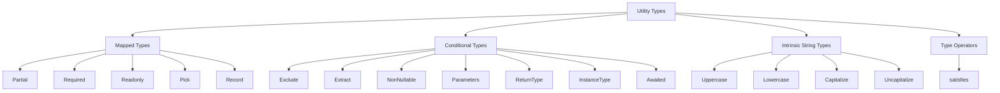

# 2.10 Utility Types Deep Dive

> The TypeScript standard library is not made of functions. It is made of types. Utility types are the curated, battle-tested set of generic transformations that ship with the compiler and let you reshape, narrow, project, and verify types without writing a single runtime line.

Utility types are the bridge between the type system and the value system. They let you say "I want a version of `User` where every field is optional," or "I want the return type of `fetch`," or "I want a record of event names to handlers," all without redeclaring shapes by hand. They are also a vocabulary: when a reviewer sees `Partial<User>`, they immediately know what you meant, whereas a hand-rolled `OptionalUser` interface demands a second look.

This note covers every built-in utility type in the TypeScript standard library, the `satisfies` operator introduced in TypeScript 4.9, the implementation behind each utility (because you should be able to rebuild them in your own codebase), the mistakes that bite teams in production, and a fully worked mini-project that combines multiple utilities into a typed API client.

## 1. Purpose

### Why utility types exist

In every TypeScript codebase, the same handful of type transformations appear over and over again:

- Take an existing object type and make all its properties optional (for update DTOs, merge functions, configuration overrides).
- Take an existing object type and make all its properties required (for filling in defaults before sending to a server).
- Take an existing object type and mark every field as readonly (for immutable state, frozen DTOs).
- Build a dictionary that maps a known set of keys to a known value type (event maps, route maps, lookup tables).
- Project a subset of an object's fields (response shaping, public views of private data).
- Drop a subset of an object's fields (stripping passwords, removing internal metadata).
- Remove members from a union (filtering event types, narrowing error codes).
- Pull members out of a union (extracting only the strings, only the success shapes).
- Strip `null` and `undefined` from a union (preparing a value that came from a JSON parse).
- Inspect a function type and ask "what does it take?" or "what does it return?".
- Inspect a constructor and ask "what does it produce?".
- Flatten a possibly-nested `Promise` into its resolved value type.
- Change the casing of string literal types (for routing keys, header normalization).
- Validate that an object literal matches a contract without widening its inferred type.

Every one of these is a one-liner when you have the right utility. Without utilities, you would either redeclare the derived shape by hand (drift risk: the original changes, the copy does not) or copy-paste a custom mapped type across every file (consistency risk: each team invents their own).

The TypeScript team ships these in `lib.es5.d.ts` so they are available in every project, regardless of target. They are pure type-level constructs: there is zero runtime cost. They compile away.

### What each one does (the one-line summary)

| Utility | One-liner |
| --- | --- |
| `Partial<T>` | All properties of `T` become optional. |
| `Required<T>` | All properties of `T` become required (strips `?`). |
| `Readonly<T>` | All properties of `T` become `readonly`. |
| `Record<K, V>` | An object type with keys `K` and values `V`. |
| `Pick<T, K>` | Keep only the keys `K` from `T`. |
| `Omit<T, K>` | Drop the keys `K` from `T`. |
| `Exclude<T, U>` | Remove members of `U` from the union `T`. |
| `Extract<T, U>` | Keep only members of `T` that are assignable to `U`. |
| `NonNullable<T>` | Remove `null` and `undefined` from `T`. |
| `Parameters<T>` | Tuple of a function's parameter types. |
| `ReturnType<T>` | A function's return type. |
| `InstanceType<T>` | The instance type produced by a constructor. |
| `Awaited<T>` | Recursively unwrap a `Promise` (or thenable) into its resolved type. |
| `Uppercase<S>` | Uppercase every character of a string literal type. |
| `Lowercase<S>` | Lowercase every character. |
| `Capitalize<S>` | Uppercase the first character. |
| `Uncapitalize<S>` | Lowercase the first character. |
| `satisfies T` (operator) | Validate an expression is assignable to `T` without widening it. |

### How they are implemented under the hood

Every utility in the table above is one of three things:

1. A **mapped type** that iterates over the keys of another type (`Partial`, `Required`, `Readonly`, `Pick`, `Record`).
2. A **conditional type** that branches on the shape of another type (`Exclude`, `Extract`, `NonNullable`, `Parameters`, `ReturnType`, `InstanceType`, `Awaited`).
3. An **intrinsic type** baked into the compiler because the type system cannot manipulate string literal characters on its own (`Uppercase`, `Lowercase`, `Capitalize`, `Uncapitalize`).

This is critical: there is no secret compiler magic for the first two groups. Every utility in groups 1 and 2 can be re-declared in your own `.d.ts` file and it will behave identically. Group 3 (`Uppercase` and friends) is genuinely compiler-internal — the type system has no operation for "uppercase the first code point of a string literal type," so the compiler provides it as a primitive.

### Why `satisfies` exists

Before TypeScript 4.9, the language had a hole. You wanted to declare a value that must conform to a contract, but you also wanted TypeScript to remember the most specific type of that value (especially its literal types). Your options were:

- `const x: MyType = { ... }` — this widens `x` to `MyType`, losing the literal types. If `MyType` says `color: string`, then `x.color` is `string` even if you wrote `'red'`.
- `const x = { ... } as MyType` — this asserts, but does not check. You can lie. If you forget a required field, no error.
- `const x: MyType = { ... }` and then read it back — `x.color` is `string` not `'red'`, defeating the purpose.

`satisfies` fills the hole: `const x = { ... } satisfies MyType` says "check that this expression is assignable to `MyType`, but keep the narrower inferred type of the expression." You get validation and precision at the same time. See [[2.03 Type Assertions and Guards]] for the comparison with `as`.

## 2. Theory and Deep Dive

This section walks through every utility, shows its definition from `lib.es5.d.ts`, and explains the mechanics. Treat it as a reference: when you forget how `Omit` works six months from now, come back here.

### 2.1 `Partial<T>`

```ts
type Partial<T> = {
  [K in keyof T]?: T[K];
};
```

A mapped type that iterates over every key `K` of `T`, keeps the value type `T[K]`, and adds the `?` modifier to make the property optional. The `?` modifier is additive: if a property was already optional, it stays optional; if it was required, it becomes optional.

The deep detail: TypeScript 4.1+ supports modifier removal (`-?`) and modifier addition (`+?`, which is the default and can be omitted). `Partial` uses the default addition form.

```ts
interface User {
  id: number;
  name: string;
  email: string;
}

type UpdateUser = Partial<User>;
// Equivalent to:
// {
//   id?: number;
//   name?: string;
//   email?: string;
// }
```

### 2.2 `Required<T>`

```ts
type Required<T> = {
  [K in keyof T]-?: T[K];
};
```

The mirror of `Partial`. It uses the `-?` modifier removal syntax to strip the optional marker from every property. Properties that were already required are unchanged; properties that were optional become required.

This is also how you can selectively un-optional a single key: build a custom mapped type that only applies `-?` to certain keys.

### 2.3 `Readonly<T>`

```ts
type Readonly<T> = {
  readonly [K in keyof T]: T[K];
};
```

Adds the `readonly` modifier to every property. Just like `?`, `readonly` has an additive form (the default) and a removal form (`-readonly`). The built-in utility only adds. If you need to strip `readonly`, you write your own:

```ts
type Mutable<T> = {
  -readonly [K in keyof T]: T[K];
};
```

`Readonly<T>` is shallow. It marks the top-level properties readonly, but if a property is itself an object, that inner object's properties are still mutable. For deep immutability you need a recursive type, covered in [[2.09 Mapped Types]].

### 2.4 `Record<K, V>`

```ts
type Record<K extends keyof any, V> = {
  [P in K]: V;
};
```

A mapped type where the key set is the union `K` (which must be `string | number | symbol`, written as `keyof any`) and the value type is `V` for every key.

`Record` is the workhorse for dictionaries. Two flavours matter:

- `Record<string, V>` — an index signature. Any string key maps to `V`. TypeScript will not catch typos in the keys because any string is valid.
- `Record<'a' | 'b' | 'c', V>` — a closed map. Only the three named keys are allowed, and TypeScript enforces that all three are present.

The second form is far safer because the compiler verifies exhaustiveness.

### 2.5 `Pick<T, K>`

```ts
type Pick<T, K extends keyof T> = {
  [P in K]: T[P];
};
```

A mapped type that iterates over `K` (which must be a subset of `keyof T`) and copies `T[P]` for each key. The result is a fresh object type that contains only the picked keys, with their original value types and modifiers preserved (optionality is preserved, readonly is preserved).

The constraint `K extends keyof T` is what makes `Pick` safe: you cannot pick a key that does not exist on `T`. This is a compile-time guarantee.

### 2.6 `Omit<T, K>`

```ts
type Omit<T, K extends keyof any> = Pick<T, Exclude<keyof T, K>>;
```

`Omit` is not a primitive. It is composed of two other utilities: first use `Exclude` to remove `K` from the key union of `T`, then `Pick` the remaining keys.

Two subtle points:

1. The constraint on `K` is `keyof any`, not `keyof T`. This means you can pass keys that do not exist on `T` and TypeScript will not warn you. This is sometimes desirable (you can call `Omit<User, 'password' | 'secretToken'>` defensively even if `secretToken` was already removed in a refactor), and sometimes a footgun (you think you dropped a key but you misspelled it and the field is still in the output).
2. `Omit` is not distributive over unions. If `T` is a union, `Omit<T, K>` does not produce `Omit<A, K> | Omit<B, K>`. Section 6 covers the fix.

### 2.7 `Exclude<T, U>`

```ts
type Exclude<T, U> = T extends U ? never : T;
```

A distributive conditional type. When `T` is a union, the conditional is applied to each member: if the member is assignable to `U`, it is replaced by `never`; otherwise it is kept. `never` is then collapsed away from the union, so the result is the original union minus the members that matched `U`.

```ts
type T = Exclude<'a' | 'b' | 'c', 'a'>;
// 'b' | 'c'

type T2 = Exclude<string | number | boolean, number>;
// string | boolean
```

The distributivity is automatic and only happens when `T` is a naked type parameter. If you wrap `T` in a tuple, distributivity is suppressed. This is the cornerstone of many advanced patterns; see [[2.11 Conditional Types]].

### 2.8 `Extract<T, U>`

```ts
type Extract<T, U> = T extends U ? T : never;
```

The complement of `Exclude`. For each member of `T`, if it is assignable to `U`, keep it; otherwise drop it.

```ts
type T = Extract<'a' | 'b' | 'c' | 1 | 2, string>;
// 'a' | 'b' | 'c'

type T2 = Extract<string | number | boolean, number>;
// number
```

`Extract` is invaluable when you have a heterogeneous union and want to keep only the members that fit a shape, e.g. extracting only the success variants of a result type.

### 2.9 `NonNullable<T>`

```ts
type NonNullable<T> = Exclude<T, null | undefined>;
```

A one-line specialization of `Exclude`. It strips `null` and `undefined` from a union. Useful when you have a value typed as `T | null | undefined` (from a JSON parse, an optional config, a `noUncheckedIndexedAccess` index) and you have already validated it at runtime.

Note: `NonNullable` only removes `null` and `undefined`. It does not remove `void`, `0`, `''`, or any other falsy type. The name is precise.

### 2.10 `Parameters<T>`

```ts
type Parameters<T extends (...args: any) => any> =
  T extends (...args: infer P) => any ? P : never;
```

A conditional type that uses `infer` to capture the parameter tuple of a function type. The constraint `T extends (...args: any) => any` ensures you only call `Parameters` on functions.

The `infer P` directive introduces a new type variable `P` that the compiler tries to fill in by matching the function shape on the left of `extends` against the actual `T`. If `T` is a function, `P` is bound to its parameter tuple and returned. If not, the conditional falls through to `never`.

```ts
declare function save(user: User, options: SaveOptions): void;
type SaveArgs = Parameters<typeof save>;
// [User, SaveOptions]
```

### 2.11 `ReturnType<T>`

```ts
type ReturnType<T extends (...args: any) => any> =
  T extends (...args: any) => infer R ? R : never;
```

Same shape as `Parameters`, but infers the return type instead of the parameter tuple.

```ts
type FetchReturn = ReturnType<typeof fetch>;
// Promise<Response>
```

The most common use is deriving the type of a value from the function that produces it, so you do not have to import and redeclare the type. Section 6 covers the overload gotcha.

### 2.12 `InstanceType<T>`

```ts
type InstanceType<T extends abstract new (...args: any) => any> =
  T extends new (...args: any) => infer R ? R : never;
```

The constructor-flavoured sibling of `ReturnType`. The constraint is "an abstract constructor" (`abstract new (...) => any`), and the inference captures the instance type that the constructor produces.

```ts
class Hero { constructor(public name: string) {} }
type H = InstanceType<typeof Hero>;
// Hero
```

This is most useful when you receive a class as a value (e.g. a dependency injection container) and want to type the instances it produces.

### 2.13 `Awaited<T>`

```ts
type Awaited<T> =
  T extends null | undefined
    ? T
    : T extends object & { then(onfulfilled: infer F, ...args: infer A): any }
      ? F extends (value: infer V, ...args: infer B) => any
        ? Awaited<V>
        : never
      : T;
```

`Awaited` is the most intricate built-in. It recursively unwraps thenables. The implementation in `lib.es5.d.ts` is more elaborate than the simplified version above, but the idea is:

1. If `T` is `null` or `undefined`, return it as-is (these are not thenables).
2. If `T` has a `then` method (i.e. it is a thenable / Promise), infer the type `V` that the `then` callback receives and recursively apply `Awaited<V>`.
3. Otherwise, `T` is not a thenable; return it as-is.

The recursion is what flattens `Promise<Promise<Promise<User>>>` down to `User`. Without recursion, you would get stuck at `Promise<User>`.

`Awaited` is what `async` function returns use under the hood. It is also the type that `Promise.resolve` and `await` produce, type-level.

### 2.14 The four intrinsic string-manipulation types

```ts
type Uppercase<S extends string> = intrinsic;
type Lowercase<S extends string> = intrinsic;
type Capitalize<S extends string> = intrinsic;
type Uncapitalize<S extends string> = intrinsic;
```

The `intrinsic` keyword is a compiler-internal marker. There is no source for these — the compiler special-cases them. They operate on string literal types and produce new string literal types with the case transformation applied.

```ts
type T1 = Uppercase<'hello'>;        // 'HELLO'
type T2 = Lowercase<'WORLD'>;        // 'world'
type T3 = Capitalize<'foo'>;         // 'Foo'
type T4 = Uncapitalize<'Bar'>;       // 'bar'
```

If the input is `string` (not a literal), the output is `string`. They only produce new literal types when given literal types.

These four utilities are the foundation of the template-literal-type patterns covered in [[2.13 Template Literal Types]] — turning `'getUsers'` into `'GET /users'`, generating route paths from method names, etc. They are also the only way to do character-level casing in the type system, because the type system has no string-slicing primitive.

### 2.15 `satisfies`

```ts
const config = {
  port: 3000,
  host: 'localhost',
} satisfies AppConfig;
```

`satisfies` is a type-level operator (not a type, an operator) introduced in TypeScript 4.9. It compiles to nothing at runtime. It does exactly two things:

1. Validates that the expression on its left is assignable to the type on its right. If not, compile error.
2. Does not widen the type of the expression. The inferred type is preserved.

Compare:

```ts
interface ColorMap { [key: string]: string }

// Widened: x is ColorMap, so x.primary is string
const x: ColorMap = { primary: 'red', secondary: 'blue' };

// Not widened: y is { primary: 'red', secondary: 'blue' }, but checked against ColorMap
const y = { primary: 'red', secondary: 'blue' } satisfies ColorMap;
```

The most common practical use of `satisfies` is with unions of object shapes, where you want each branch to be checked against the union but you also want the specific branch's literal types preserved when you later narrow on a discriminator.

### 2.16 The big picture



Every utility in the standard library falls into one of these four groups. Mapped types reshape object keys. Conditional types branch on shape, often with `infer`. Intrinsic types do string casing that the type system cannot do itself. `satisfies` is an operator, not a type, and lives in its own category because it does not produce a derived type — it produces a validation.

## 3. Mental Models

A mental model is the one-sentence story you tell yourself when you reach for a tool. Internalize these and you will rarely pick the wrong utility.

- **`Partial<T>`** — "Make every field optional." Use when callers might supply any subset.
- **`Required<T>`** — "Make every field required." Use when you have already filled defaults and need to enforce completeness.
- **`Readonly<T>`** — "Make every field readonly." Use for frozen DTOs, immutable state, configuration that must not be mutated.
- **`Pick<T, K>`** — "Keep these keys, drop the rest." Use for projections: response shaping, public views.
- **`Omit<T, K>`** — "Drop these keys, keep the rest." Use for stripping secrets, removing internal fields.
- **`Record<K, V>`** — "A dictionary with these exact keys and this value type." Use for event maps, route maps, lookup tables with a closed key set.
- **`Exclude<T, U>`** — "Take this union, remove these members." Use for filtering event types, error codes, status enums.
- **`Extract<T, U>`** — "Take this union, keep only these members." Use for pulling success variants out of a result union.
- **`NonNullable<T>`**** — "Strip null and undefined." Use after you have already runtime-checked a nullable value.
- **`Parameters<T>`** — "What does this function take?" Use when wrapping or forwarding arguments.
- **`ReturnType<T>`** — "What does this function return?" Use to derive the type of a value from its producer.
- **`InstanceType<T>`** — "What does this constructor produce?" Use in dependency injection and meta-programming.
- **`Awaited<T>`** — "Flatten a possibly-nested Promise into its resolved value." Use when you want the inner type, not the wrapper.
- **`Uppercase<S>`** — "Upper-case this string literal type."
- **`Lowercase<S>`** — "Lower-case this string literal type."
- **`Capitalize<S>`** — "Upper-case the first character."
- **`Uncapitalize<S>`** — "Lower-case the first character."
- **`satisfies T`** — "Check this expression against T, but do not widen it." Use when you want both validation and the narrowest possible type.

A useful pairing mnemonic: `Partial` / `Required` are inverses. `Pick` / `Omit` are inverses (modulo key existence checks). `Exclude` / `Extract` are inverses. `Parameters` / `ReturnType` inspect opposite ends of a function. `Awaited` is its own kind of inverse to `Promise<T>` (in the type sense).

## 4. Real-World Use Cases

This section catalogues the recurring real-world patterns where utility types earn their keep.

### 4.1 Update DTOs with `Partial<User>`

When a client sends a PATCH request, it sends only the fields that should change. The server-side handler accepts `Partial<User>`:

```ts
async function patchUser(id: number, updates: Partial<User>): Promise<User> {
  const current = await db.user.findById(id);
  return db.user.update({ ...current, ...updates });
}
```

Every field of `User` becomes optional, so callers can send `{ name: 'New Name' }` without supplying `id` or `email`.

### 4.2 Response projections with `Pick<User, 'id' | 'name'>`

When you list users in a dropdown, you only need `id` and `name`. Returning the full `User` (with email, password hash, etc.) is wasteful and often a leak. `Pick` describes the projection:

```ts
type UserSummary = Pick<User, 'id' | 'name'>;

async function listUserSummaries(): Promise<UserSummary[]> {
  const rows = await db.user.findMany({ select: { id: true, name: true } });
  return rows;
}
```

### 4.3 Safe serialization with `Omit<User, 'password'>`

Before sending a user object over the wire, strip the password. `Omit` describes the safe shape:

```ts
type SafeUser = Omit<User, 'password'>;

function toSafeUser(u: User): SafeUser {
  const { password, ...rest } = u;
  return rest;
}
```

The return type documents the contract: callers cannot accidentally access `password` on the result.

### 4.4 Event maps with `Record<EventName, Handler>`

A typed event emitter uses a `Record` to map event names to handler signatures:

```ts
type Events = {
  login: { userId: string };
  logout: { userId: string; reason: string };
  purchase: { orderId: string; total: number };
};

type Handlers = {
  [E in keyof Events]: (payload: Events[E]) => void;
};

// Equivalent to Record<keyof Events, ...> but with per-key value types.
```

For a uniform handler signature, plain `Record` is enough:

```ts
type Handler = (payload: unknown) => void;
type HandlerMap = Record<'click' | 'hover' | 'focus', Handler>;
```

### 4.5 Derived types with `ReturnType<typeof fetch>`

Instead of importing the response type, derive it from the function:

```ts
type FetchResponse = ReturnType<typeof fetch>;
type ApiResponse = Awaited<FetchResponse>;
// Response
```

This pattern shines when you wrap a library function and want your wrapper's return type to track the library's automatically. If the library upgrades and changes its return type, your wrapper follows.

### 4.6 Flattened async types with `Awaited`

When a function may return either `User` or `Promise<User>` or `Promise<Promise<User>>`, you want the eventual resolved type:

```ts
type Resolved = Awaited<ReturnType<typeof getUser>>;
// User, regardless of nesting
```

`Awaited` is also the type-level analogue of `await`. The return type of an `async` function is `Promise<Awaited<T>>` where `T` is the type of the returned expression.

### 4.7 Config validation with `satisfies`

Configuration objects are the canonical `satisfies` use case. You want:

- Each config key checked against the expected type.
- Literal types preserved (so `port: 3000` is `3000`, not `number`, when you later read it back).
- Exhaustiveness on closed key sets.

```ts
interface ServerConfig {
  port: number;
  host: string;
  env: 'development' | 'staging' | 'production';
}

const config = {
  port: 3000,
  host: 'localhost',
  env: 'development',
} satisfies ServerConfig;

// config.port is typed as 3000 (the literal), not number
// config.env is typed as 'development', not the union
```

### 4.8 Conditional configuration with `Extract` and `Exclude`

Suppose you have a union of feature flags and you want to operate only on the experimental ones:

```ts
type Flag = 'auth' | 'beta-ui' | 'new-api' | 'legacy-export';
type Experimental = Extract<Flag, `beta-${string}` | `new-${string}`>;
// 'beta-ui' | 'new-api'
```

Template literal types combine with `Extract` for powerful filtering. See [[2.13 Template Literal Types]].

### 4.9 Constructor metaprogramming with `InstanceType`

A dependency injection container stores constructors and produces instances:

```ts
class Logger { log(msg: string) { console.log(msg); } }
class Database { query(sql: string) { /* ... */ } }

const container = {
  Logger,
  Database,
} as const;

type Container = typeof container;
type LoggerInstance = InstanceType<Container['Logger']>;
// Logger
```

### 4.10 String casing for route normalization

```ts
type Route = `/api/${Lowercase<'Users' | 'Orders'>}`;
// '/api/users' | '/api/orders'
```

This is the bread and butter of [[2.13 Template Literal Types]]: combine `Lowercase` / `Uppercase` with template literals to generate route, event, and channel name unions.

## 5. Code Examples

This section has two parts: a minimal survey of every utility in a handful of lines, and a production-grade typed API client that uses several utilities together.

### 5.1 Example A — Minimal and Conceptual

Each utility demonstrated in five lines or fewer. JavaScript shows what runtime code looks like; TypeScript shows the same code with the types added.

#### `Partial`

| JavaScript | TypeScript |
| --- | --- |
| <pre lang="js">const defaults = { port: 3000, host: 'localhost' };<br>function merge(patch) {<br>  return { ...defaults, ...patch };<br>}</pre> | <pre lang="ts">const defaults = { port: 3000, host: 'localhost' };<br>function merge(patch: Partial<typeof defaults>) {<br>  return { ...defaults, ...patch };<br>}</pre> |

#### `Required`

| JavaScript | TypeScript |
| --- | --- |
| <pre lang="js">function ensureAll(cfg) {<br>  return { port: cfg.port ?? 3000, host: cfg.host ?? 'localhost' };<br>}</pre> | <pre lang="ts">function ensureAll(cfg: Partial<Config>): Required<Config> {<br>  return { port: cfg.port ?? 3000, host: cfg.host ?? 'localhost' };<br>}</pre> |

#### `Readonly`

| JavaScript | TypeScript |
| --- | --- |
| <pre lang="js">const frozen = Object.freeze({ port: 3000 });<br>// frozen.port = 4000; // silently no-op or throws in strict mode</pre> | <pre lang="ts">const frozen: Readonly&lt;Config&gt; = { port: 3000 };<br>// frozen.port = 4000; // compile error</pre> |

#### `Record`

| JavaScript | TypeScript |
| --- | --- |
| <pre lang="js">const counts = { a: 0, b: 0, c: 0 };<br>counts.a++; // ok<br>counts.d = 1; // ok at runtime</pre> | <pre lang="ts">const counts: Record&lt;'a' \| 'b' \| 'c', number&gt; = { a: 0, b: 0, c: 0 };<br>counts.a++; // ok<br>// counts.d = 1; // compile error</pre> |

#### `Pick`

| JavaScript | TypeScript |
| --- | --- |
| <pre lang="js">function summary(u) { return { id: u.id, name: u.name }; }</pre> | <pre lang="ts">function summary(u: User): Pick&lt;User, 'id' \| 'name'&gt; {<br>  return { id: u.id, name: u.name };<br>}</pre> |

#### `Omit`

| JavaScript | TypeScript |
| --- | --- |
| <pre lang="js">function sanitize(u) {<br>  const { password, ...rest } = u;<br>  return rest;<br>}</pre> | <pre lang="ts">function sanitize(u: User): Omit&lt;User, 'password'&gt; {<br>  const { password, ...rest } = u;<br>  return rest;<br>}</pre> |

#### `Exclude` and `Extract`

| JavaScript | TypeScript |
| --- | --- |
| <pre lang="js">// No JS equivalent — these are pure type filters.<br>// The runtime filtering uses sets or conditionals.<br>const all = ['a', 'b', 1, 2];<br>const strings = all.filter(x => typeof x === 'string');</pre> | <pre lang="ts">type Mixed = 'a' \| 'b' \| 1 \| 2;<br>type OnlyStrings = Extract&lt;Mixed, string&gt;; // 'a' \| 'b'<br>type NoStrings = Exclude&lt;Mixed, string&gt;;   // 1 \| 2</pre> |

#### `NonNullable`

| JavaScript | TypeScript |
| --- | --- |
| <pre lang="js">function first(xs) { return xs[0] ?? null; }<br>const x = first([1, 2, 3]);<br>if (x != null) { /* x is a number at runtime */ }</pre> | <pre lang="ts">function first(xs: number[]): number \| undefined { return xs[0]; }<br>const x = first([1, 2, 3]);<br>if (x != null) {<br>  const y: NonNullable&lt;typeof x&gt; = x; // number<br>}</pre> |

#### `Parameters` and `ReturnType`

| JavaScript | TypeScript |
| --- | --- |
| <pre lang="js">function greet(name, greeting) { return `${greeting}, ${name}!`; }<br>// Args and return type are inferred by JS at runtime, not statically.</pre> | <pre lang="ts">function greet(name: string, greeting: string) { return `${greeting}, ${name}!`; }<br>type GreetArgs = Parameters&lt;typeof greet&gt;; // [string, string]<br>type GreetReturn = ReturnType&lt;typeof greet&gt;; // string</pre> |

#### `InstanceType`

| JavaScript | TypeScript |
| --- | --- |
| <pre lang="js">class Hero { constructor(name) { this.name = name; } }<br>const h = new Hero('Athena');</pre> | <pre lang="ts">class Hero { constructor(public name: string) {} }<br>type HeroInstance = InstanceType&lt;typeof Hero&gt;; // Hero<br>const h: HeroInstance = new Hero('Athena');</pre> |

#### `Awaited`

| JavaScript | TypeScript |
| --- | --- |
| <pre lang="js">async function getUser() { return { id: 1 }; }<br>const u = await getUser(); // { id: 1 } at runtime</pre> | <pre lang="ts">async function getUser(): Promise&lt;User&gt; { return { id: 1 }; }<br>type ResolvedUser = Awaited&lt;ReturnType&lt;typeof getUser&gt;&gt;; // User</pre> |

#### `Uppercase` / `Lowercase` / `Capitalize` / `Uncapitalize`

| JavaScript | TypeScript |
| --- | --- |
| <pre lang="js">'hi'.toUpperCase();      // 'HI'<br>'HI'.toLowerCase();      // 'hi'<br>'foo'.charAt(0).toUpperCase() + 'foo'.slice(1); // 'Foo'<br>'Bar'.charAt(0).toLowerCase() + 'Bar'.slice(1); // 'bar'</pre> | <pre lang="ts">type A = Uppercase&lt;'hi'&gt;;   // 'HI'<br>type B = Lowercase&lt;'HI'&gt;;   // 'hi'<br>type C = Capitalize&lt;'foo'&gt;; // 'Foo'<br>type D = Uncapitalize&lt;'Bar'&gt;; // 'bar'</pre> |

#### `satisfies`

| JavaScript | TypeScript |
| --- | --- |
| <pre lang="js">// No JS equivalent — satisfies is compile-time only.<br>const colors = { primary: 'red', secondary: 'blue' };<br>const p = colors.primary; // 'red' at runtime</pre> | <pre lang="ts">interface ColorMap { [k: string]: string }<br>const colors = { primary: 'red', secondary: 'blue' } satisfies ColorMap;<br>const p = colors.primary; // typed as 'red' (literal preserved)</pre> |

### 5.2 Example B — Production-Grade Typed API Client

A single file that exercises `Partial`, `Pick`, `Omit`, `Record`, `ReturnType`, `Awaited`, and `satisfies` together. The JavaScript version shows what the runtime code looks like; the TypeScript version shows the same code with the types layered on top.

The domain: a small client for a `User` and `Order` REST API. Updates accept partial payloads. Responses are projections that strip sensitive fields. Endpoints are described by a `Record` so the client can dispatch by name.

#### JavaScript version (runtime only, no static guarantees)

```js
// api.js — plain JavaScript

const BASE = 'https://api.example.com';

const endpoints = {
  listUsers:    { method: 'GET',    path: '/users' },
  getUser:      { method: 'GET',    path: '/users/:id' },
  createUser:   { method: 'POST',   path: '/users' },
  updateUser:   { method: 'PATCH',  path: '/users/:id' },
  deleteUser:   { method: 'DELETE', path: '/users/:id' },
  listOrders:   { method: 'GET',    path: '/orders' },
};

function buildPath(path, params) {
  return Object.entries(params || {}).reduce(
    (acc, [k, v]) => acc.replace(`:${k}`, encodeURIComponent(v)),
    path
  );
}

async function request(endpoint, options) {
  const { method, path } = endpoint;
  const url = BASE + buildPath(path, options.params);
  const res = await fetch(url, {
    method,
    headers: { 'Content-Type': 'application/json', ...(options.headers || {}) },
    body: options.body ? JSON.stringify(options.body) : undefined,
  });
  if (!res.ok) throw new Error(`HTTP ${res.status}`);
  return res.json();
}

// Public API
const api = {
  listUsers: () => request(endpoints.listUsers, {}),
  getUser: (id) => request(endpoints.getUser, { params: { id } }),
  createUser: (payload) => request(endpoints.createUser, { body: payload }),
  updateUser: (id, patch) => request(endpoints.updateUser, { params: { id }, body: patch }),
  deleteUser: (id) => request(endpoints.deleteUser, { params: { id } }),
};

// Usage
async function demo() {
  const users = await api.listUsers();
  const created = await api.createUser({ name: 'Ada', email: 'ada@example.com', password: 'p@ss' });
  await api.updateUser(created.id, { name: 'Ada Lovelace' });
  const safe = (({ password, ...rest }) => rest)(created);
  return safe;
}
```

#### TypeScript version (the same code, with full type safety)

```ts
// api.ts — TypeScript with utility types

// Domain model
interface User {
  id: number;
  name: string;
  email: string;
  password: string;
  createdAt: string;
}

interface Order {
  id: number;
  userId: number;
  total: number;
  currency: string;
}

// Projections and DTOs derived from the domain model
type UserSummary = Pick<User, 'id' | 'name'>;
type SafeUser = Omit<User, 'password'>;
type UserUpdate = Partial<Pick<User, 'name' | 'email'>>;
type UserCreate = Omit<User, 'id' | 'createdAt'>;

// Endpoint descriptor
type Endpoint = {
  method: 'GET' | 'POST' | 'PATCH' | 'DELETE';
  path: string;
};

// Closed map of endpoint names to descriptors — Record guarantees
// every key is present and lets us dispatch by name.
const endpoints = {
  listUsers:  { method: 'GET',    path: '/users' } as const,
  getUser:    { method: 'GET',    path: '/users/:id' } as const,
  createUser: { method: 'POST',   path: '/users' } as const,
  updateUser: { method: 'PATCH',  path: '/users/:id' } as const,
  deleteUser: { method: 'DELETE', path: '/users/:id' } as const,
  listOrders: { method: 'GET',    path: '/orders' } as const,
} satisfies Record<string, Endpoint>;

type EndpointName = keyof typeof endpoints;
type EndpointDescriptor = (typeof endpoints)[EndpointName];

// Options for the request function, derived from Endpoint where possible.
type RequestOptions = {
  params?: Record<string, string | number>;
  headers?: Record<string, string>;
  body?: unknown;
};

function buildPath(path: string, params?: Record<string, string | number>): string {
  if (!params) return path;
  return Object.entries(params).reduce(
    (acc, [k, v]) => acc.replace(`:${k}`, encodeURIComponent(String(v))),
    path
  );
}

// The core request function. Its return type is derived: we Promise
// the parsed JSON, and leave the cast to the caller (or a typed wrapper).
async function request(
  endpoint: EndpointDescriptor,
  options: RequestOptions = {}
): Promise<unknown> {
  const { method, path } = endpoint;
  const url = 'https://api.example.com' + buildPath(path, options.params);
  const res = await fetch(url, {
    method,
    headers: { 'Content-Type': 'application/json', ...(options.headers ?? {}) },
    body: options.body ? JSON.stringify(options.body) : undefined,
  });
  if (!res.ok) throw new Error(`HTTP ${res.status}`);
  return res.json();
}

// A helper that narrows the unknown return to a specific shape.
// In production you would validate with zod or similar; here we trust the server.
function asType<T>(value: unknown): T {
  return value as T;
}

// Public typed API. Each method has a precise signature:
//  - listUsers returns a Promise of an array of summaries (projection).
//  - getUser returns a Promise of a SafeUser (password stripped).
//  - createUser accepts the create DTO and returns the full user (caller decides what to keep).
//  - updateUser accepts the partial update DTO and returns the updated SafeUser.
const api = {
  async listUsers(): Promise<UserSummary[]> {
    const raw = await request(endpoints.listUsers);
    return asType<UserSummary[]>(raw);
  },
  async getUser(id: number): Promise<SafeUser> {
    const raw = await request(endpoints.getUser, { params: { id } });
    const full = asType<User>(raw);
    return sanitizeUser(full);
  },
  async createUser(payload: UserCreate): Promise<User> {
    const raw = await request(endpoints.createUser, { body: payload });
    return asType<User>(raw);
  },
  async updateUser(id: number, patch: UserUpdate): Promise<SafeUser> {
    const raw = await request(endpoints.updateUser, { params: { id }, body: patch });
    const full = asType<User>(raw);
    return sanitizeUser(full);
  },
  async deleteUser(id: number): Promise<void> {
    await request(endpoints.deleteUser, { params: { id } });
  },
};

// A pure serializer. The return type is Omit<User, 'password'>, which
// documents at the type level that the result has no password field.
function sanitizeUser(user: User): SafeUser {
  const { password: omitted, ...rest } = user;
  void omitted;
  return rest;
}

// Demonstration
async function demo(): Promise<SafeUser> {
  const users = await api.listUsers();           // UserSummary[]
  const created = await api.createUser({         // typed create DTO
    name: 'Ada',
    email: 'ada@example.com',
    password: 'p@ss',
  });
  await api.updateUser(created.id, { name: 'Ada Lovelace' }); // partial update
  const safe = await api.getUser(created.id);    // SafeUser
  return safe;
}

// Derive types from the api object so consumers do not have to import the
// internal interfaces. This is the ReturnType-of-fetch pattern applied to
// the api object itself.
type ApiListUsersResult = Awaited<ReturnType<typeof api.listUsers>>;
// UserSummary[]

type ApiCreateUserPayload = Parameters<typeof api.createUser>[0];
// UserCreate
```

What each utility buys us in this example:

- `Pick<User, 'id' | 'name'>` — `UserSummary` is a precise response projection. If `User` grows new fields, `UserSummary` does not accidentally include them.
- `Omit<User, 'password'>` — `SafeUser` is a contract that the password field does not exist on the wire. `sanitizeUser` returns `SafeUser`, so callers cannot access `password` on the result.
- `Partial<Pick<User, 'name' | 'email'>>` — `UserUpdate` is the update DTO: only `name` and `email` are editable, and both are optional. `PATCH /users/:id` with `{ name: 'New' }` type-checks; `{ password: 'hacked' }` does not.
- `Omit<User, 'id' | 'createdAt'>` — `UserCreate` is the create DTO: the client cannot set the server-managed `id` and `createdAt`.
- `Record<string, Endpoint>` with `satisfies` — `endpoints` is validated to be a map of `Endpoint` objects, but the literal method values (`'GET'`, `'POST'`, etc.) are preserved as literal types because `satisfies` does not widen.
- `Awaited<ReturnType<typeof api.listUsers>>` — consumers of the api can derive the unwrapped result type without importing `UserSummary` directly.

This is the production-grade payoff of utility types: a small vocabulary, applied consistently, gives you a typed boundary between your client code and the server contract, and the types stay in sync with the runtime code because they are derived from the same source.

## 6. Common Mistakes and Anti-Patterns

### 6.1 `Omit` is not distributive over unions

If `T` is a union, `Omit<T, K>` does not apply `Omit` to each member of the union. Instead, it computes `keyof T` (which is the intersection of the keys of all union members) and picks from that intersection. The result is usually wrong.

```ts
type A = { kind: 'a'; aData: number };
type B = { kind: 'b'; bData: string };
type Union = A | B;

type OmittedKind = Omit<Union, 'kind'>;
// Expected: { aData: number } | { bData: string }
// Actual:   {} (because keyof Union is just 'kind', and we omit it)
```

The fix is a distributive version. Distributivity in conditional types only fires when the checked type is a naked type parameter, so we wrap the `Omit` in a conditional:

```ts
type DistributiveOmit<T, K extends keyof any> =
  T extends any ? Omit<T, K> : never;

type Fixed = DistributiveOmit<Union, 'kind'>;
// { aData: number } | { bData: string }
```

The same trick works for `Pick` if you need it distributive:

```ts
type DistributivePick<T, K extends keyof any> =
  T extends any ? Pick<T, K> : never;
```

This is one of the most common TypeScript bugs in codebases that use discriminated unions heavily.

### 6.2 `Partial` makes everything optional, which may not match intent

`Partial<User>` makes every field optional, but a "user update" usually has at least one constraint: at least one field must be supplied. `Partial<User>` accepts `{}`.

```ts
function updateUser(id: number, patch: Partial<User>) { /* ... */ }
updateUser(1, {}); // type-checks, but probably should not
```

There is no built-in "non-empty partial." You can build one with a conditional:

```ts
type AtLeastOne<T, K extends keyof T = keyof T> =
  Pick<T, K> & { [P in K]: Partial<Omit<T, P>> }[K];

type NonEmptyUserUpdate = AtLeastOne<User>;
// requires at least one of the User fields
```

Or use a branded type, or simply assert intent with a runtime check.

### 6.3 `Pick` / `Omit` with a non-existent key

`Omit` does not constrain `K` to `keyof T` — it accepts `keyof any`. So you can silently drop a key that does not exist:

```ts
type T = Omit<User, 'pasword'>;
// No error. 'pasword' is not on User, so nothing is dropped.
// The result still has 'password'.
```

This is a footgun that has bitten many teams. The fix is a stricter `Omit`:

```ts
type StrictOmit<T, K extends keyof T> = Pick<T, Exclude<keyof T, K>>;

type T2 = StrictOmit<User, 'pasword'>;
// Compile error: 'pasword' is not assignable to keyof User.
```

`Pick` is already strict — it requires `K extends keyof T`. The asymmetry is historical: `Omit` was added later, and the looser constraint was kept for backward compatibility.

### 6.4 `ReturnType` of an overloaded function returns only the last signature

When a function is overloaded, TypeScript has multiple call signatures. `ReturnType<typeof fn>` picks the last one:

```ts
function parse(input: string): number;
function parse(input: string, radix: number): number;
function parse(input: string, radix?: number): number {
  return radix ? parseInt(input, radix) : parseInt(input);
}

type R = ReturnType<typeof parse>;
// number — happens to be correct here because both overloads return number.
```

But:

```ts
function transform(x: string): string;
function transform(x: number): number;
function transform(x: string | number): string | number {
  return x;
}

type R = ReturnType<typeof transform>;
// number — only the last overload. The string-returning overload is lost.
```

There is no built-in way to get a union of all overload return types. The common workaround is to use a helper that picks the overload based on a sample argument type, or to restructure the function as a single generic signature.

### 6.5 `Record<string, T>` does not catch key typos

```ts
const counts: Record<string, number> = {};
counts.apple = 1;
counts.appel = 2; // typo, no error
```

`Record<string, T>` is just an index signature in disguise. Use a closed key set when you know the keys:

```ts
const counts: Record<'apple' | 'banana', number> = { apple: 0, banana: 0 };
// counts.appel = 2; // compile error
```

### 6.6 `satisfies` vs `as`

```ts
const cfg1 = { port: 'oops' } as ServerConfig;
// No error. `as` lies. 'oops' is not a number.

const cfg2 = { port: 'oops' } satisfies ServerConfig;
// Compile error: 'oops' is not assignable to number.
```

`as` is an assertion: it tells TypeScript "trust me, this is the type." `satisfies` is a check: it tells TypeScript "verify this is assignable to the type, but do not widen." Use `satisfies` for validation. Reserve `as` for genuine narrowing situations where you know more than the compiler (e.g. after a runtime check that TypeScript cannot follow).

### 6.7 Forgetting that `Readonly` is shallow

```ts
const config: Readonly<{ nested: { count: number } }> = {
  nested: { count: 0 },
};
config.nested = { count: 1 }; // error — good
config.nested.count = 1;      // no error — bad, the inner object is still mutable
```

For deep immutability, use a recursive type:

```ts
type DeepReadonly<T> = {
  readonly [K in keyof T]: T[K] extends object ? DeepReadonly<T[K]> : T[K];
};

const config: DeepReadonly<{ nested: { count: number } }> = {
  nested: { count: 0 },
};
// config.nested.count = 1; // error
```

### 6.8 Using `NonNullable` on a type that is not a union

```ts
type T = NonNullable<string>;
// string — fine, but pointless.

type U = NonNullable<{ a: number } | null>;
// { a: number }

type V = NonNullable<{ a: number }>;
// { a: number } — fine, but pointless.
```

`NonNullable` is only meaningful when `T` actually includes `null` or `undefined`. Calling it on a non-nullable type is a no-op (and a code smell — the author may have misunderstood the type).

### 6.9 Treating `Awaited` as identical to `Promise` unwrapping at runtime

`Awaited<T>` is a type-level operation. It does not change runtime behaviour. If you have `Promise<Promise<User>>` at runtime (which is unusual but possible with `Promise.resolve(Promise.resolve(...))`), the runtime already flattens it to `Promise<User>` because that is how the Promise spec works. `Awaited` mirrors this flattening at the type level. Do not confuse the two layers.

## 7. Best Practices and Design Patterns

### 7.1 Use `Partial` for update DTOs

Whenever you have a PATCH-style operation, accept `Partial<Entity>` (or a refined subset like `Partial<Pick<Entity, 'editable' | 'fields'>>`). This avoids duplicating the entity shape and stays in sync if the entity grows.

### 7.2 Use `Pick` and `Omit` for projections and serialization

Every public surface of an entity should be a projection. Internal types should never leak to the wire. `Pick<User, 'id' | 'name' | 'email'>` for list responses, `Omit<User, 'password' | 'passwordHash'>` for single-resource responses. If you ever add a new sensitive field to `User`, every projection that uses `Omit<User, 'password'>` will still leak the new field — so prefer `Pick` for whitelisting when security matters, and reserve `Omit` for convenience when there is no risk.

### 7.3 Use `Record` for closed key sets

`Record<'a' | 'b' | 'c', V>` is far safer than `{ [k: string]: V }` or `Record<string, V>` because the compiler checks that every key is present and that no extra key is added. Use the closed form whenever you know the keys at compile time.

### 7.4 Use `satisfies` for config validation

Configuration objects, route maps, event maps, handler tables — anything that is a literal object that must conform to a contract — should use `satisfies`. You get compile-time validation and you preserve the literal types for downstream narrow code.

### 7.5 Implement custom distributive `Omit` and `Pick` for unions

If your codebase uses discriminated unions (and most do), add `DistributiveOmit` and `DistributivePick` to a shared `types.ts` file. Use them everywhere you would otherwise reach for `Omit` or `Pick` on a union. The mental overhead is one extra word; the bug-prevention payoff is large.

### 7.6 Derive, do not duplicate

Whenever you find yourself writing an interface that is a copy of another interface with one field changed, stop. Use a utility. The same applies to function return types: use `ReturnType<typeof fn>` instead of importing the type. If the function's return type changes, your derived type follows automatically.

### 7.7 Prefer explicit interfaces when the derivation is unclear

Utility types are a vocabulary, not a religion. If a derivation like `Omit<Partial<Pick<User, 'a' | 'b'>>, 'a'>` makes you pause to figure out what it produces, replace it with an explicit interface and a comment. The reader (and your future self) will thank you. Utility types shine when the transformation is one step and obvious; they hurt when the transformation is a maze.

### 7.8 Combine `satisfies` with `as const`

`as const` freezes literal types and makes everything readonly. `satisfies` validates without widening. Together they are the strongest way to declare a static lookup table:

```ts
const ROLES = {
  admin: { level: 3, canDelete: true },
  editor: { level: 2, canDelete: false },
  viewer: { level: 1, canDelete: false },
} as const satisfies Record<string, { level: number; canDelete: boolean }>;

type Role = keyof typeof ROLES; // 'admin' | 'editor' | 'viewer'
```

The `as const` preserves the literal levels; `satisfies` validates that every entry matches the role shape; `keyof typeof` gives you the role union for free.

### 7.9 Use `Awaited` to flatten async types

When you have a function whose return type is `Promise<T>` (or worse, `Promise<Promise<T>>`), and you want the inner type, use `Awaited<ReturnType<typeof fn>>`. This is more robust than unwrapping by hand because it handles the arbitrary-nesting case.

### 7.10 Document custom utility types with examples

When you write a custom distributive `Omit`, a deep readonly, or a non-empty partial, add a doc comment with a usage example. Custom utilities are the leading edge of "what does this even do" confusion in code reviews. A two-line example prevents the reviewer from having to mentally evaluate the conditional type.

## 8. Technical Interview Knowledge

Eight questions you should be able to answer cold.

### Q1. Implement `Partial<T>` from scratch.

```ts
type Partial<T> = {
  [K in keyof T]?: T[K];
};
```

Walk-through: a mapped type iterates over `keyof T`. For each key `K`, declare the property optional (`?`) with value type `T[K]`. The `?` modifier is additive (it is the default; you could write `+?`).

### Q2. Implement `Omit<T, K>` from scratch.

```ts
type Omit<T, K extends keyof any> = Pick<T, Exclude<keyof T, K>>;
```

Walk-through: `Exclude<keyof T, K>` removes `K` from the set of keys of `T`, producing a key union that does not contain `K`. Then `Pick<T, that-union>` selects only those keys. The constraint on `K` is `keyof any` (i.e. `string | number | symbol`), not `keyof T`, because the standard library chose to allow keys that do not exist on `T` (a permissive choice that is sometimes a footgun).

### Q3. What is the difference between `Pick` and `Record`?

`Pick<T, K>` produces an object type whose keys are a subset of the keys of `T`, and whose value types come from `T`. The keys must already exist on `T`.

`Record<K, V>` produces an object type whose keys are the union `K` (which can be any `string | number | symbol`) and whose value type is the same `V` for every key. The keys do not need to come from any other type.

In short: `Pick` projects from an existing type. `Record` creates a fresh dictionary. They overlap when you want an object whose keys are a known set: `Pick<T, K>` is appropriate when the value types should match `T`; `Record<K, V>` is appropriate when every value should be the same `V`.

### Q4. What does `Awaited<T>` do?

`Awaited<T>` recursively unwraps thenables. If `T` is `Promise<Promise<Promise<User>>>`, the result is `User`. If `T` is `User`, the result is `User`. If `T` is `null` or `undefined`, the result is `T`. The implementation matches the runtime behaviour of `await`, which flattens nested promises according to the Promise/A+ spec. `Awaited` is what TypeScript uses internally to compute the resolved type of `async` functions.

### Q5. What is `satisfies`?

`satisfies` is a type operator introduced in TypeScript 4.9. The expression `expr satisfies T` checks that `expr` is assignable to `T` and then yields `expr` with its original inferred type unchanged (no widening). Use cases: validating config objects, validating route maps, validating lookup tables — anywhere you want both compile-time validation and the narrowest possible type. Compare with `as`, which is an unchecked assertion; and with annotation `: T`, which validates but widens.

### Q6. Why is `Omit` not distributive over unions, and how do you make it distributive?

`Omit` is defined as `Pick<T, Exclude<keyof T, K>>`. When `T` is a union `A | B`, `keyof T` is `keyof A & keyof B` (the intersection of keys, because an object of type `T` must have only the keys common to all members of the union). `Exclude` then removes `K` from this intersection, and `Pick` selects from `T` using the resulting key set — but `Pick` on a union also does not distribute. The net effect is that `Omit<A | B, 'kind'>` does not produce `Omit<A, 'kind'> | Omit<B, 'kind'>`.

Distributivity in conditional types only fires when the checked type is a naked type parameter. So we wrap the body in a conditional:

```ts
type DistributiveOmit<T, K extends keyof any> = T extends any ? Omit<T, K> : never;
```

When `T` is `A | B`, the conditional distributes: `(A extends any ? Omit<A, K> : never) | (B extends any ? Omit<B, K> : never)`, which simplifies to `Omit<A, K> | Omit<B, K>`.

### Q7. How would you get a function's parameter types?

Use `Parameters<typeof fn>`. The implementation is `T extends (...args: infer P) => any ? P : never`. The `infer P` directive captures the parameter tuple during conditional matching. The result is a tuple type, e.g. `[string, number]` for `function f(s: string, n: number)`. To get a specific parameter, index the tuple: `Parameters<typeof fn>[0]`.

### Q8. How would you type a config object so that it is both validated and preserves literal types?

Use `satisfies`:

```ts
interface ServerConfig {
  port: number;
  host: string;
  env: 'development' | 'staging' | 'production';
}

const config = {
  port: 3000,
  host: 'localhost',
  env: 'development',
} satisfies ServerConfig;

// config.port is typed as 3000 (the literal), not number.
// config.env is typed as 'development', not the union.
```

Compare with `const config: ServerConfig = { ... }`, which would widen `config.port` to `number` and `config.env` to the union. `satisfies` gives you both the validation and the literal preservation. Add `as const` if you want every nested value frozen as a literal too.

## 9. Practical Exercises

Four exercises, each with a full worked solution.

### Exercise 1. Implement `Partial`, `Pick`, `Omit`, and `Record` from scratch.

**Goal**: Rebuild the four most common object-shaping utilities without using the built-ins.

**Solution**:

```ts
// Partial: iterate over keys, add the ? modifier.
type MyPartial<T> = {
  [K in keyof T]?: T[K];
};

// Pick: iterate over the picked keys (which must be a subset of keyof T),
// copy the value types from T.
type MyPick<T, K extends keyof T> = {
  [P in K]: T[P];
};

// Record: iterate over the key union K (which must be keyof any),
// set every value to V.
type MyRecord<K extends keyof any, V> = {
  [P in K]: V;
};

// Omit: pick the keys that are not in K.
type MyOmit<T, K extends keyof any> = MyPick<T, Exclude<keyof T, K>>;

// Sanity tests:
interface User { id: number; name: string; email: string; password: string; }

type T1 = MyPartial<User>;                          // { id?: number; ... }
type T2 = MyPick<User, 'id' | 'name'>;              // { id: number; name: string }
type T3 = MyRecord<'a' | 'b', number>;              // { a: number; b: number }
type T4 = MyOmit<User, 'password'>;                 // { id; name; email }
```

The key insight: every one of these is a mapped type with a different key set and a different value type expression. `Partial` uses `keyof T` and adds `?`. `Pick` uses the supplied `K`. `Record` uses the supplied `K` and ignores `T`. `Omit` is `Pick` composed with `Exclude`.

### Exercise 2. Build a distributive `Omit`.

**Goal**: `Omit` over a union should distribute over each member.

**Solution**:

```ts
type DistributiveOmit<T, K extends keyof any> =
  T extends any ? Omit<T, K> : never;

// Test
type Shape =
  | { kind: 'circle'; radius: number }
  | { kind: 'square'; side: number }
  | { kind: 'triangle'; base: number; height: number };

type WithoutKind = DistributiveOmit<Shape, 'kind'>;
// { radius: number } | { side: number } | { base: number; height: number }

// Same trick for Pick if needed:
type DistributivePick<T, K extends keyof any> =
  T extends any ? Pick<T, K> : never;

type OnlyKind = DistributivePick<Shape, 'kind'>;
// { kind: 'circle' } | { kind: 'square' } | { kind: 'triangle' }
```

The mechanism: `T extends any ? X : never` is a distributive conditional because `T` is a naked type parameter. When `T` is a union, the conditional is evaluated once per member, and the results are unioned. `any` matches everything, so the conditional always takes the `X` branch — but distributivity still applies first, so `X` is evaluated once per member.

### Exercise 3. Use `satisfies` to validate a config.

**Goal**: A `ThemeConfig` object must conform to a contract, but each color value should be preserved as its literal type so the rest of the app can branch on exact colors.

**Solution**:

```ts
interface ThemeColor { hex: `#${string}`; readable: boolean }

interface ThemeConfig {
  primary: ThemeColor;
  secondary: ThemeColor;
  accent: ThemeColor;
  radius: number;
}

const theme = {
  primary:   { hex: '#1a73e8', readable: true },
  secondary: { hex: '#ffffff', readable: true },
  accent:    { hex: '#ff6d00', readable: false },
  radius: 8,
} satisfies ThemeConfig;

// Each color's hex is preserved as its literal type:
type PrimaryHex = typeof theme.primary.hex; // '#1a73e8'
type Radius = typeof theme.radius;          // 8

// The validation catches mistakes:
// const bad = { primary: { hex: 'red', readable: true }, ... } satisfies ThemeConfig;
// Error: 'red' is not assignable to `#${string}`.

// Exhaustiveness check: missing a required top-level key fails.
// const missing = { primary: theme.primary, secondary: theme.secondary, radius: 8 } satisfies ThemeConfig;
// Error: Property 'accent' is missing.
```

The payoff: downstream code that does `if (theme.accent.hex === '#ff6d00')` gets the literal comparison for free, because `theme.accent.hex` is `'#ff6d00'` not `string`. Without `satisfies`, an annotation `: ThemeConfig` would widen every `hex` to `` `#${string}` `` and the comparison would still type-check but the literal-narrowing benefit would be lost.

### Exercise 4. Use `ReturnType` to derive types from a function.

**Goal**: A factory function `createStore` returns an object with methods. Derive the type of the store and the type of the result of one of its methods, without declaring them by hand.

**Solution**:

```ts
interface User { id: number; name: string; }

function createStore(initial: User[]) {
  let items = [...initial];
  return {
    list: () => items,
    add: (u: User) => { items.push(u); },
    remove: (id: number) => { items = items.filter(u => u.id !== id); },
    find: (id: number) => items.find(u => u.id === id) ?? null,
  };
}

// Derive the store type from the factory function.
type Store = ReturnType<typeof createStore>;

// Derive the type of the result of `find`.
type FindResult = ReturnType<Store['find']>;
// User | null

// Derive the parameter types of `add`.
type AddParam = Parameters<Store['add']>[0];
// User

// Derive a safe (non-null) version using NonNullable.
type SafeFindResult = NonNullable<FindResult>;
// User

// Use the derived types in application code.
function useStore(store: Store) {
  const found: FindResult = store.find(1);
  if (found) {
    const safe: SafeFindResult = found;
    console.log(safe.name);
  }
}

// Instantiate and use.
const store = createStore([{ id: 1, name: 'Ada' }]);
useStore(store);
```

The payoff: if `createStore` ever changes — say, `find` returns `User | undefined` instead of `User | null`, or `add` accepts a `Partial<User>` — every derived type updates automatically. You never have to touch the type aliases.

## 10. Mini-Project Blueprint

### Build a typed API client

A small but realistic client for a REST API. Combines `Partial` for update DTOs, `Pick` for response projections, `Omit` for safe serialization, `Record` for endpoint maps, `ReturnType` and `Awaited` for derived public types, and `satisfies` for config validation.

#### Step 1. Define the domain

```ts
interface User {
  id: number;
  name: string;
  email: string;
  password: string;
  role: 'admin' | 'editor' | 'viewer';
  createdAt: string;
}

interface Post {
  id: number;
  authorId: number;
  title: string;
  body: string;
  publishedAt: string | null;
}
```

#### Step 2. Define derived DTOs

```ts
type UserSummary    = Pick<User, 'id' | 'name' | 'role'>;
type SafeUser       = Omit<User, 'password'>;
type UserCreateDTO  = Omit<User, 'id' | 'createdAt'>;
type UserUpdateDTO  = Partial<Pick<User, 'name' | 'email' | 'role'>>;

type PostSummary    = Pick<Post, 'id' | 'title' | 'publishedAt'>;
type PostCreateDTO  = Omit<Post, 'id' | 'publishedAt'>;
type PostUpdateDTO  = Partial<Pick<Post, 'title' | 'body' | 'publishedAt'>>;
```

Every DTO is derived from the domain. If a field is added to `User`, the DTOs follow automatically (and `Pick`-based DTOs pick up nothing new, which is what you want for whitelisted projections).

#### Step 3. Define the endpoint map with `satisfies`

```ts
type Endpoint = {
  method: 'GET' | 'POST' | 'PATCH' | 'DELETE';
  path: string;
  withAuth: boolean;
};

const endpoints = {
  listUsers:  { method: 'GET',    path: '/users',         withAuth: true },
  getUser:    { method: 'GET',    path: '/users/:id',     withAuth: true },
  createUser: { method: 'POST',   path: '/users',         withAuth: true },
  updateUser: { method: 'PATCH',  path: '/users/:id',     withAuth: true },
  deleteUser: { method: 'DELETE', path: '/users/:id',     withAuth: true },
  listPosts:  { method: 'GET',    path: '/posts',         withAuth: false },
  getPost:    { method: 'GET',    path: '/posts/:id',     withAuth: false },
  createPost: { method: 'POST',   path: '/posts',         withAuth: true },
} satisfies Record<string, Endpoint>;
```

`satisfies` validates that every entry conforms to `Endpoint`, but the literal `method` values are preserved as `'GET'` etc., not widened to `string`. This means downstream code that switches on `endpoints.listUsers.method` gets exhaustiveness checking.

#### Step 4. Implement the request core

```ts
type RequestOptions = {
  params?: Record<string, string | number>;
  headers?: Record<string, string>;
  body?: unknown;
  token?: string;
};

function buildPath(path: string, params?: Record<string, string | number>): string {
  if (!params) return path;
  return Object.entries(params).reduce(
    (acc, [k, v]) => acc.replace(`:${k}`, encodeURIComponent(String(v))),
    path
  );
}

async function request<E extends Endpoint>(
  endpoint: E,
  options: RequestOptions = {}
): Promise<unknown> {
  const { method, path, withAuth } = endpoint;
  const url = 'https://api.example.com' + buildPath(path, options.params);
  const headers: Record<string, string> = {
    'Content-Type': 'application/json',
    ...(options.headers ?? {}),
  };
  if (withAuth && options.token) headers.Authorization = `Bearer ${options.token}`;
  const res = await fetch(url, {
    method,
    headers,
    body: options.body ? JSON.stringify(options.body) : undefined,
  });
  if (!res.ok) throw new Error(`HTTP ${res.status}: ${await res.text()}`);
  return res.json();
}
```

#### Step 5. Build the typed public API

```ts
function asType<T>(value: unknown): T { return value as T; }

function sanitizeUser(u: User): SafeUser {
  const { password: omitted, ...rest } = u; void omitted; return rest;
}

const api = {
  async listUsers(token: string): Promise<UserSummary[]> {
    return asType<UserSummary[]>(await request(endpoints.listUsers, { token }));
  },
  async getUser(token: string, id: number): Promise<SafeUser> {
    return sanitizeUser(asType<User>(await request(endpoints.getUser, { token, params: { id } })));
  },
  async createUser(token: string, payload: UserCreateDTO): Promise<SafeUser> {
    return sanitizeUser(asType<User>(await request(endpoints.createUser, { token, body: payload })));
  },
  async updateUser(token: string, id: number, patch: UserUpdateDTO): Promise<SafeUser> {
    return sanitizeUser(asType<User>(await request(endpoints.updateUser, { token, params: { id }, body: patch })));
  },
  async deleteUser(token: string, id: number): Promise<void> {
    await request(endpoints.deleteUser, { token, params: { id } });
  },
  async listPosts(): Promise<PostSummary[]> {
    return asType<PostSummary[]>(await request(endpoints.listPosts));
  },
  async getPost(id: number): Promise<Post> {
    return asType<Post>(await request(endpoints.getPost, { params: { id } }));
  },
  async createPost(token: string, payload: PostCreateDTO): Promise<Post> {
    return asType<Post>(await request(endpoints.createPost, { token, body: payload }));
  },
};

export default api;
export type {
  User, Post,
  UserSummary, SafeUser, UserCreateDTO, UserUpdateDTO,
  PostSummary, PostCreateDTO, PostUpdateDTO,
};
```

#### Step 6. Export derived public types

```ts
// Consumers can derive everything from `api` itself — they never need to import the DTOs directly.
type Api = typeof api;
type ListUsersResult = Awaited<ReturnType<Api['listUsers']>>;
// UserSummary[]

type CreateUserPayload = Parameters<Api['createUser']>[1];
// UserCreateDTO

type UpdateUserPayload = Parameters<Api['updateUser']>[2];
// UserUpdateDTO
```

#### Step 7. Usage

```ts
import api from './api';

async function demo(token: string) {
  const users = await api.listUsers(token);
  const me = await api.createUser(token, {
    name: 'Ada',
    email: 'ada@example.com',
    password: 'p@ss',
    role: 'admin',
  });
  await api.updateUser(token, me.id, { name: 'Ada Lovelace' });
  const refreshed = await api.getUser(token, me.id);
  console.log(refreshed.name);   // 'Ada Lovelace'
  console.log(refreshed.email);  // 'ada@example.com'
  // refreshed.password; // compile error — not on SafeUser
}
```

What this project demonstrates:

- `Partial` for partial updates (`UserUpdateDTO`).
- `Pick` for response projections (`UserSummary`, `PostSummary`).
- `Omit` for safe serialization (`SafeUser`, and for stripping server-managed fields in `UserCreateDTO`).
- `Record` (validated with `satisfies`) for the endpoint map.
- `ReturnType` and `Awaited` for derived public types.
- `satisfies` for config validation with literal preservation.

Every utility type in the standard library appears in a real, justified role. This is the goal of the note: not just knowing what each utility does, but knowing when to reach for it.

## 11. Core Connections

This note is one piece of the TypeScript type-system story. The surrounding notes give the foundations and the advanced patterns that build on utility types.

- [[2.06 Interfaces vs Type Aliases]] — utility types produce type aliases. Understanding the difference between `interface` and `type` clarifies when you can use a utility and when you cannot (interfaces do not support mapped or conditional types directly).
- [[2.07 Generics and Constraints]] — every utility is generic. `Pick<T, K extends keyof T>` is incomprehensible without a solid grip on generic constraints.
- [[2.08 Typeof Keyof Lookup]] — `keyof`, `typeof`, and indexed access are the primitives that utility types are built from. You cannot implement `Partial` without `keyof`.
- [[2.09 Mapped Types]] — `Partial`, `Required`, `Readonly`, `Pick`, `Record` are all mapped types. The modifier-addition and modifier-removal syntax (`+?`, `-?`, `-readonly`) is the foundation of the entire `Partial` / `Required` family.
- [[2.11 Conditional Types]] — `Exclude`, `Extract`, `Parameters`, `ReturnType`, `InstanceType`, `Awaited`, and `NonNullable` are all conditional types. Distributivity (and how to suppress it) is the key behaviour that explains why `Omit` is not distributive.
- [[2.13 Template Literal Types]] — `Uppercase`, `Lowercase`, `Capitalize`, and `Uncapitalize` are the engine that makes template literal types useful for routing, event names, and string-keyed APIs.

Beyond TypeScript, utility types connect to:

- [[3.01 Type Level Programming]] — utility types are the standard library of type-level programming. Custom utilities (distributive `Omit`, deep `Readonly`, non-empty `Partial`) are the entry point to writing your own type-level functions.
- [[4.01 Designing Type Safe APIs]] — the typed API client mini-project is a small instance of the broader pattern of designing APIs where the type system enforces the contract.

The unifying theme: utility types are the curated vocabulary that turns the type system from a constraint into a tool. Every line of code that uses a utility is a line that did not need to be hand-rolled, hand-maintained, or hand-documented. Learn the vocabulary, reach for it instinctively, and the type system starts to feel less like a tax and more like a partner.
