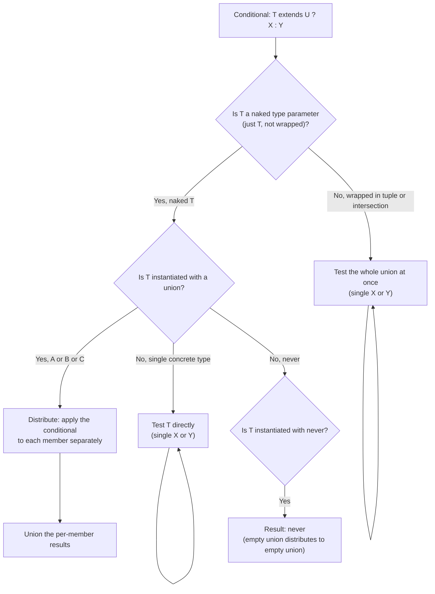
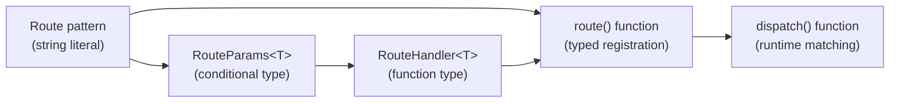

# 2.11 Conditional Types

## 1. Purpose

A conditional type is the TypeScript type-level equivalent of an `if` expression. It asks one question — does one type extend another? — and answers with one of two types depending on the result. Spelled out, it looks like `T extends U ? X : Y`. If `T` is assignable to `U`, the type system evaluates to `X`; otherwise it evaluates to `Y`. That single syntactic construct turns TypeScript from a *descriptive* type system (types describe the shape of values that already exist) into a *computational* one (types compute other types from inputs). This shift is the single biggest conceptual leap in the entire TypeScript Mastery module, and most of the type-level programming that comes after this note — recursive types, template literal inference, branded types, schema-to-type inference — would be impossible without it.

Before conditional types, TypeScript could combine types (with unions and intersections), parameterise them (with generics), and constrain them (with `extends`). What it could not do was *branch*. You could not say "if this type parameter is a function, return its return type; otherwise return `never`." You could not say "if this union contains `null`, remove it." You could not say "if this type is a `Promise`, dig out the inner value." Each of those operations requires a test and a branch, and conditional types are the only construct in the language that provides one. The introduction of conditional types in TypeScript 2.8 was, in retrospect, the moment TypeScript became a Turing-complete type system — not as a design goal, but as an emergent property of having a branching primitive plus recursion plus a structural matching primitive (`infer`).

The headline capabilities conditional types enable are: **type-level logic** (boolean AND, OR, NOT, equality), **union filtering** (Exclude, Extract, NonNullable), **type extraction** via `infer` (ReturnType, Parameters, InstanceType, ConstructorParameters, Awaited), **schema-to-type inference** (Zod, io-ts, valibot, and every other runtime-validator library that derives a static type from a runtime schema), **type-level routing** (extracting path parameters from route strings like `/users/:userId`), and **type-level arithmetic** (adding, multiplying, comparing natural numbers encoded as tuples). All of these reduce to the same primitive: ask `extends`, branch on the answer.

The conceptual shift worth naming explicitly is this. Before conditional types, a type alias was a *macro* — a short name for a longer expression. `type StringList = string[]` is just shorthand. After conditional types, a type alias is a *function* — it takes type parameters as inputs and produces a type as output, with internal control flow. `type Unwrap<T> = T extends Promise<infer U> ? U : T` is a one-line program that runs at compile time. The type-level program has no runtime existence; the compiler evaluates it during type-checking and then erases it. But the type-level program is real code with real logic, real bugs, real performance characteristics, and real tests.

This note exists because conditional types are the load-bearing primitive of type-level TypeScript, and they have three behaviours — *distribution*, *inference*, and *recursion* — that are easy to skim past on first read and impossible to debug without. Distribution in particular is the most counter-intuitive behaviour in the entire type system: it makes `(A | B) extends U ? X : Y` *not* evaluate as a single test against the whole union, but instead as two separate tests, one per member, with results unioned back together. This is sometimes exactly what you want (it is how `Exclude` and `NonNullable` work) and sometimes exactly what you do not want (it is why your `Awaited` implementation produces a union of unions instead of a single type). Mastering conditional types means learning exactly when distribution fires, when it does not, and how to flip the switch.

The goal of this note is to make the following second nature:

1. Read a conditional type and predict, given a concrete input type, what the output type will be — including distribution behaviour.
2. Write `Exclude`, `Extract`, `NonNullable`, `ReturnType`, `Parameters`, and `Awaited` from scratch with no reference material.
3. Use `infer` to extract types from function parameters, return types, arrays, tuples, promises, template literals, and object properties.
4. Diagnose and fix the four canonical conditional-type bugs: unwanted distribution, `never` results, non-terminating recursion, and `any` absorption.
5. Build a type-level router that takes a route string like `/users/:userId/posts/:postId` and produces the params object shape `{ userId: string; postId: string }`, then types a request handler that receives those params.

Read on. The theory section is the longest because the behaviour is subtle; everything after it builds on that foundation. Cross-references to [[2.05 Unions and Intersections]] and [[2.07 Generics and Constraints]] are intentional — conditional types are the third leg of the type-level programming stool.

## 2. Theory and Deep Dive

### 2.1 The conditional expression `T extends U ? X : Y`

The surface syntax is exactly what it looks like: a ternary expression lifted to the type level.

```typescript
// TS
type IsString<T> = T extends string ? true : false;

type A = IsString<"hello">;  // true
type B = IsString<42>;        // false
type C = IsString<string | number>;  // boolean  (see Section 2.3 on distribution)
```

```javascript
// JS
// There is no runtime equivalent — IsString is erased completely.
// The closest value-level analogue is:
const isString = (x) => typeof x === "string";
isString("hello");  // true
isString(42);        // false
// But the type-level version operates on *types*, not values,
// and runs in the compiler, not in your program.
```

Three things to notice immediately.

First, the `extends` keyword in a conditional type is **not** the same as the `extends` keyword in a generic constraint (`<T extends U>`) or in a class declaration (`class Foo extends Bar`). All three use the same token for historical reasons, but they mean different things. In a generic constraint, `extends` means "the type argument must satisfy this constraint at the call site." In a class declaration, `extends` means "inherit from this base class." In a conditional type, `extends` means "test whether this type is assignable to that type, here, now, inside this alias." The test is performed by the compiler when it evaluates the conditional.

Second, both branches (`X` and `Y`) are **types**, not values. You cannot write `T extends string ? "yes" : "no"` and then expect `"yes"` to appear in your program output. The string literal `"yes"` here is a *type* (the type of values that are exactly the string `"yes"`), and the conditional type evaluates to that type, which the compiler uses for further type-checking.

Third, the branches are **lazy** in the sense that only the matching branch contributes to the result. But both branches are still parsed and type-checked by the compiler, so a type error in the non-taken branch will still surface as a compile error. This matters when you write `T extends string ? T : T` — both branches are type-correct because `T` is in scope, but if you accidentally wrote `T extends string ? T : Nonexistent`, the compiler would flag `Nonexistent` even when the test always passes.

### 2.2 Assignability as the test

The `extends` test is the same assignability relation that governs the rest of TypeScript. `T extends U` is true if and only if a value of type `T` could be assigned to a variable of type `U` without an assertion. That means:

- `"hello" extends string` is `true` (literal is assignable to its primitive).
- `string extends "hello"` is `false` (primitive is not assignable to a specific literal).
- `string extends string | number` is `true` (a member is assignable to the union).
- `string | number extends string` is `false` (the union is not assignable to one member) — *unless distribution applies, see Section 2.3*.
- `never extends anything` is `true` (the bottom type is assignable to every type).
- `anything extends never` is `true` only for `never` itself.
- `anything extends unknown` is `true` (the top type accepts everything).
- `unknown extends string` is `false` (you cannot assign `unknown` to `string` without narrowing).
- `any extends anything` and `anything extends any` are both `true` — this is the `any` escape hatch, and it causes the bug we will diagnose in Section 6.

This assignability-based test is what makes conditional types composable with the rest of TypeScript. There is no separate "conditional-type matcher"; it is the same `isAssignableTo` check the compiler uses everywhere else.

### 2.3 Distributive conditional types

Here is the behaviour that catches every intermediate TypeScript developer at least once. When the type on the left of `extends` is a **naked type parameter** — that is, just `T` by itself, not `[T]` or `T & {}` or `T | never` — and that type parameter is instantiated with a **union**, the conditional type **distributes** over the union. Instead of testing the whole union at once, the compiler tests each member individually and unions the results.

```typescript
// TS
type ToArray<T> = T extends unknown ? T[] : never;

type R1 = ToArray<string>;             // string[]
type R2 = ToArray<string | number>;    // string[] | number[]
// NOT (string | number)[] — distribution applied!
```

```javascript
// JS
// The runtime analogue is map-then-union:
const toArray = (types) => types.map(t => [t]);  // each member becomes an array
toArray(["string", "number"]);
// [["string"], ["number"]]  — two separate arrays, not one mixed array
```

The mechanical rule is: `(A | B) extends U ? X : Y` becomes `(A extends U ? X : Y) | (B extends U ? X : Y)` when the left side is a naked type parameter. With three members it becomes `(A extends U ? X : Y) | (B extends U ? X : Y) | (C extends U ? X : Y)`. With `never` it becomes `never` (because `never` is the empty union, and distributing over an empty union produces an empty union).

The single most important consequence: the `T` in each branch is **the individual member**, not the whole union. Inside the `X` branch, `T` is bound to one member at a time. This is what lets `Exclude<T, U>` work:

```typescript
// TS
type Exclude<T, U> = T extends U ? never : T;

type R3 = Exclude<"a" | "b" | "c", "a">;  // "b" | "c"
// Distribution: "a" extends "a" ? never : "a"  ->  never
//               "b" extends "a" ? never : "b"  ->  "b"
//               "c" extends "a" ? never : "c"  ->  "c"
// Union: never | "b" | "c"  ->  "b" | "c"   (never disappears from unions)
```

If distribution did not happen, `Exclude` would test `"a" | "b" | "c" extends "a"` which is `false` (the whole union is not assignable to one member), and the result would be `"a" | "b" | "c"` unchanged. Distribution is what makes the per-member filter possible.



### 2.4 Preventing distribution

Distribution fires only when the left side of `extends` is a *naked* type parameter. If you wrap `T` in any way that breaks the nakedness, distribution is suppressed and the whole union is tested at once. The canonical idiom is `[T] extends [U]` — wrapping both sides in one-tuples.

```typescript
// TS
type ToArrayAll<T> = [T] extends [unknown] ? T[] : never;

type R4 = ToArrayAll<string | number>;  // (string | number)[]
// No distribution: the whole union is tested at once.
// [string | number] extends [unknown] is true, so the result is T[] = (string | number)[].
```

```javascript
// JS
// The runtime analogue is wrapping in an array before testing:
const toArrayAll = (types) =>
  Array.isArray(types) ? [types] : never;  // test the wrapped array, not each element
toArrayAll(["string", "number"]);
// [["string", "number"]]  — one array, all members together
```

The `[T] extends [U]` idiom works because tuple types do not distribute. Wrapping in a one-element tuple is the lightest possible wrapper that disables distribution while preserving the assignability test (since `[T] extends [U]` is true exactly when `T extends U` for non-distributive evaluation). Other wrappers work too: `T & {} extends U` (intersection with the empty object type) disables distribution but slightly changes the assignability semantics for `any` and primitive types, so the tuple wrapper is preferred.

When do you want distribution, and when do you not? *Want distribution* when you are filtering a union member-by-member: `Exclude`, `Extract`, `NonNullable`, `RemoveFunctions`, `KeepStrings`. *Suppress distribution* when you are testing a property of the whole union: "is this union assignable to `string`?", "does this union contain only functions?", "is this type already a tuple?". The mental rule: distribution is for **map**, non-distribution is for **test**.

### 2.5 The `infer` keyword

The `infer` keyword declares a new type variable *inside* the `extends` clause of a conditional type, and binds it to whatever type the structural match extracts. The conditional then succeeds if the match succeeds, and the `infer`red variable is in scope in the result branches.

```typescript
// TS
type ReturnType<T> = T extends (...args: never[]) => infer R ? R : never;

type R5 = ReturnType<() => string>;             // string
type R6 = ReturnType<(x: number) => boolean>;   // boolean
type R7 = ReturnType<string>;                    // never (string is not a function type)
```

```javascript
// JS
// The runtime analogue is destructuring a function's return type:
const getReturn = (fn) => {
  // There is no runtime way to read the return type of a function.
  // Closest approximation: call it once and inspect the result.
  const sample = fn();
  return typeof sample;
};
getReturn(() => "x");        // "string"
getReturn((x) => true);      // "boolean"
```

The `infer` keyword is the extraction primitive. Without it, conditional types could only test; with it, they can also *capture* a piece of the matched type and re-emit it elsewhere. Every built-in utility type that extracts a sub-type (`ReturnType`, `Parameters`, `ConstructorParameters`, `InstanceType`, `Awaited`, `ThisParameterType`, `FirstParameter`, `LastParameter`, etc.) is implemented with `infer`.

The mechanical rule is: `infer X` may appear in any **covariant** position inside the `extends` clause — return types, array element types, tuple element types, the right side of a `Promise<...>`, the value type of a `Map<K, V>`, and so on. It may not appear in contravariant positions directly in the way you might expect (function parameter types are contravariant), but TypeScript still binds `infer` in parameter positions because the structural match is bidirectional for parameter types in practice. We will see this in Section 2.6.

### 2.6 Multiple `infer` positions

A single conditional type can declare multiple `infer` variables, and they can appear in multiple positions at once. Each position binds a separate variable.

```typescript
// TS
type FunctionParts<T> =
  T extends (first: infer A, ...rest: infer B[]) => infer R
    ? { firstParam: A; restParams: B[]; returnValue: R }
    : never;

type R8 = FunctionParts<(x: number, y: string, z: boolean) => void>;
// { firstParam: number; restParams: (string | boolean)[]; returnValue: void }
```

```javascript
// JS
// The runtime analogue: read a function's arity and parameter names via reflection.
const functionParts = (fn) => {
  const src = fn.toString();
  const match = src.match(/\(([^)]*)\)\s*=>?\s*\{?/);
  const params = match ? match[1].split(",").map(s => s.trim()) : [];
  return {
    firstParam: params[0],
    restParams: params.slice(1),
  };
};
functionParts((x, y, z) => {});  // { firstParam: "x", restParams: ["y", "z"] }
```

The positions where `infer` works include:

- **Return type**: `T extends (...args: never[]) => infer R ? R : never`
- **Single parameter**: `T extends (a: infer A) => any ? A : never`
- **Rest parameter**: `T extends (first: any, ...rest: infer R) => any ? R : never` — `R` is bound to a tuple of the rest parameter types.
- **Array element**: `T extends (infer E)[] ? E : never` — `E` is the element type.
- **Tuple elements by position**: `T extends [infer H, ...infer T] ? [H, T] : never` — `H` is the first element, `T` is the rest as a tuple.
- **Promise inner**: `T extends Promise<infer U> ? U : never`
- **Constructor return**: `T extends new (...args: any[]) => infer I ? I : never` — `I` is the instance type.
- **Constructor parameters**: `T extends new (...args: infer P) => any ? P : never` — `P` is the parameter tuple.
- **Object property value**: `T extends { key: infer V } ? V : never` — `V` is the value type of the property named `key`.
- **Template literal segments**: `` T extends `${infer Head}.${infer Tail}` ? [Head, Tail] : never `` — splits a dotted string at the first dot.
- **`this` parameter**: `T extends (this: infer This, ...args: any[]) => any ? This : never`

When two `infer` variables of the *same name* appear in multiple covariant positions *within the same `extends` clause*, TypeScript collects them into a **union** of all matched types. This is the trick behind several library utilities:

```typescript
// TS
type BothFields<T> = T extends { a: infer V; b: infer V } ? V : never;

type R8a = BothFields<{ a: string; b: number }>;  // string | number
```

```javascript
// JS
// The runtime analogue is destructuring two fields and unioning their types:
const bothFields = (obj) => {
  const { a, b } = obj;
  return [typeof a, typeof b];  // collect both
};
bothFields({ a: "x", b: 1 });  // ["string", "number"]
```

For contravariant positions (function parameters), the same rule produces an **intersection** instead, because of parametric contravariance. The full `Awaited<T>` definition in lib.es5.d.ts uses this pattern at two levels — first matching against a thenable shape to extract the `onfulfilled` callback type, then matching against that callback to extract the resolved value:

```typescript
// TS
type Awaited<T> =
  T extends null | undefined
    ? T
    : T extends object & { then(onfulfilled: infer F, ...args: infer Rest): any }
      ? F extends (value: infer V, ...args: infer Rest) => any
        ? Awaited<V>
        : never
      : T;
```

This is the real lib.es5.d.ts definition (lightly simplified, with the discard-parameter renamed from a single-underscore placeholder to `Rest`). It works by: (1) checking if `T` is a thenable (has a `then` method), (2) inferring the `onfulfilled` callback type `F` from the `then` signature, (3) inferring the resolved value type `V` from the callback's first parameter, (4) recursing on `V` to handle nested promises like `Promise<Promise<number>>`. The `Rest` variable is a throwaway — it captures the remaining arguments of each function signature without using them. Nesting one conditional inside another is what lets `Awaited` walk the chain of `then` callbacks.

### 2.7 Recursive conditional types

A conditional type may reference itself in either branch, which makes it a recursive type-level function. This is how you implement `DeepReadonly`, `DeepPartial`, `Awaited` (recursively unwrapping nested promises), `Flatten<T>` (recursively flattening nested arrays), and type-level arithmetic (Church-encoded natural numbers).

```typescript
// TS
type DeepReadonly<T> = {
  readonly [K in keyof T]: T[K] extends object ? DeepReadonly<T[K]> : T[K];
};

type R9 = DeepReadonly<{ a: { b: { c: number } } }>;
// { readonly a: { readonly b: { readonly c: number } } }
```

```javascript
// JS
// The runtime analogue is Object.freeze applied recursively:
const deepFreeze = (obj) => {
  Object.freeze(obj);
  for (const key of Object.keys(obj)) {
    const value = obj[key];
    if (typeof value === "object" && value !== null) {
      deepFreeze(value);
    }
  }
  return obj;
};
```

TypeScript imposes a recursion depth limit (currently 50 levels for direct type recursion, and 1000 levels for tail-recursion-eligible conditional types). Crossing the limit produces the error `Type instantiation is excessively deep and possibly infinite`. The tail-recursion-eligible path is important: a conditional type is tail-call-eligible when each recursive call is the *last* operation the conditional performs (no wrapping the recursive call in an intersection, a union, or a mapped type after the fact). Tail-recursive conditional types get a much higher depth budget, which is what makes type-level arithmetic practical.

### 2.8 Conditional types and `never`

`never` has three special behaviours inside conditional types:

1. **Distribution to `never`**: when a conditional type is distributive and the input is `never`, the result is `never` (because `never` is the empty union, and distributing over an empty union produces nothing).
2. **`never` matches everything on the left**: `never extends U` is `true` for any `U`, because `never` is assignable to every type (it is the bottom type). So `IsNever<T> = T extends never ? true : false` looks correct but **silently returns `true` for any `T` if distribution applies** — because `never` distributes to `never`, which means the conditional never actually evaluates to `true` in the way you might expect. The correct way to test for `never` is to disable distribution:

```typescript
// TS
type IsNever<T> = [T] extends [never] ? true : false;

type R10 = IsNever<never>;     // true
type R11 = IsNever<string>;    // false
type R12 = IsNever<never | string>;  // false  (the union is not never)
```

```javascript
// JS
// The runtime analogue is Object.is(x, Nothing) — but JavaScript has no `never` value.
// The closest analogue is checking for a sentinel:
const NOTHING = Symbol("nothing");
const isNothing = (x) => x === NOTHING;
```

3. **`never` filters out of unions**: because `never` is the empty union, `never | A | B` collapses to `A | B`. This is what makes `Exclude` work: members that match the exclusion return `never`, and `never` disappears from the resulting union.

### 2.9 Conditional types and `any` / `unknown`

`any` breaks conditional types in a specific way that every TypeScript developer must learn. Because `any` is assignable to everything and everything is assignable to `any`, both `any extends U` and `U extends any` are `true` for *any* `U`. This means:

```typescript
// TS
type Foo<T> = T extends string ? "is-string" : "not-string";

type R13 = Foo<any>;     // "is-string"  (any extends string is true)
type R14 = Foo<unknown>; // "not-string" (unknown does not extend string)
```

```javascript
// JS
// The runtime analogue is loose equality: == treats undefined and null as interchangeable,
// and typeof anyValue is "undefined" or "object" depending on the underlying value.
// `any` is the type-system equivalent of "do not check".
```

The fix is to either ban `any` from the input (via a constraint like `<T extends unknown>` does not help, but a lint rule like `no-explicit-any` does), or to special-case `any` with a distribution-suppressing check. The `[T] extends [string]` form changes the behaviour for `any` slightly but not always in the way you want — the rule of thumb is to test conditional types with `any` as an explicit input and document the result.

`unknown`, by contrast, behaves predictably: `unknown extends U` is `true` only when `U` is `unknown` or `any`. `T extends unknown` is `true` for every `T`. This makes `unknown` the safe top type for conditional-type tests.

### 2.10 Conditional types as type-level functions

The unifying picture: a generic conditional type `type F<T> = T extends U ? X : Y` is a *function* from types to types. The `extends` is the test. The branches are the body. `infer` is the parameter pattern (deconstructing the input into named pieces). Recursion is iteration. Distribution is map. Distribution-suppression is the equivalent of forcing a non-vectorised evaluation. Once you internalise this view, every conditional type you read becomes a small program, and you can read it the way you read a value-level function.

This view is what enables the type-level router in Section 10, the type-level arithmetic in [[2.14 Recursive Type-Level Operations]], and the schema-to-type inference in libraries like Zod (which is, mechanically, a giant conditional type that walks the schema AST).

## 3. Mental Models

Four mental models will get you through every conditional type you encounter.

**Mental Model 1: Conditional type as if-then-else.** Read `T extends U ? X : Y` as "if `T` is a `U`, then `X`, else `Y`." This is the surface reading and it is correct for non-distributive cases. Use this model when `T` is a single concrete type and you want to predict the result. Do not use this model when `T` is a union, because distribution will give you a different answer.

**Mental Model 2: Distribution as map.** When `T` is a naked type parameter instantiated with a union, the conditional is applied to each member of the union separately, and the results are unioned back together. Read `Foo<A | B | C>` as "map `Foo` over `[A, B, C]`, then union the results." This is the model that lets you predict `Exclude<"a" | "b" | "c", "a">` = `"b" | "c"` without tracing the mechanics. The naked `T` inside the conditional is bound to *one member at a time* — never the whole union.

**Mental Model 3: `infer` as destructuring.** Read `T extends Foo<infer X> ? X : never` as "destructure `T` as `Foo<X>`, bind `X`, return `X`." Just like `const { x } = foo` destructures a value, `infer X` destructures a type. Multiple `infer` declarations in the same `extends` clause are multiple destructuring targets. Two `infer` declarations with the *same name* collect into a union, just like destructuring with a rest pattern collects the remaining elements into an array.

**Mental Model 4: Naked versus wrapped.** The single bit that controls distribution is whether the left side of `extends` is a naked type parameter. Read `T extends U` as "distribute" and `[T] extends [U]` as "do not distribute." This is the most important binary in conditional types. If you remember nothing else from this note, remember that one switch. Every distribution bug reduces to "I forgot to wrap" or "I forgot that wrapping suppresses distribution."

A fifth, subtler model: **conditional types are functions, mapped types are loops, and `infer` is pattern matching.** Together they form a small programming language at the type level. `T extends U ? X : Y` is `if`. `{ [K in keyof T]: F<T[K]> }` is `for`. `infer X` is `let X = ...`. Recursion is recursion. Once you see this correspondence, type-level TypeScript stops being a mysterious incantation and becomes ordinary programming — just with types as the values, assignability as the equality, and the compiler as the runtime.

## 4. Real-World Use Cases

Conditional types are not a curiosity. They underwrite the most heavily-used utility types in the language and several major ecosystem libraries. Here are the use cases you will encounter in production code.

**Use Case 1: `Exclude<T, U>` and `Extract<T, U>`.** Both are one-line conditional types. `Exclude<T, U> = T extends U ? never : T` removes from `T` any member assignable to `U`. `Extract<T, U> = T extends U ? T : never` keeps only the members assignable to `U`. They are the workhorses of union filtering: `Exclude<"a" | "b" | "c", "a">` is `"b" | "c"`, `Extract<string | number | (() => void), Function>` is `() => void`. Every TypeScript codebase that uses discriminated unions uses these for narrowing-by-tag and for removing deprecated variants.

**Use Case 2: `NonNullable<T>`.** `NonNullable<T> = T extends null | undefined ? never : T` is the same pattern as `Exclude`, specialised to remove `null` and `undefined`. It is the type-level equivalent of the `!= null` runtime check. Every codebase that turns on `strictNullChecks` uses `NonNullable` to express "I have already checked this value is not null or undefined, please treat it as such."

**Use Case 3: `ReturnType<T>` and `Parameters<T>`.** Both are `infer`-based. `ReturnType<T> = T extends (...args: any[]) => infer R ? R : any` extracts the return type of a function. `Parameters<T> = T extends (...args: infer P) => any ? P : never` extracts the parameter tuple. Together they let you build higher-order utilities: "given a function `f`, produce a function with the same parameters but a Promise return type" — `type Promisify<T> = T extends (...args: infer P) => infer R ? (...args: P) => Promise<R> : never`. The entire ecosystem of typed wrapper functions (memoize, debounce, throttle, retry) relies on this pattern.

**Use Case 4: `Awaited<T>` and async unwrapping.** `Awaited<T>` recursively unwraps a `Promise<Promise<Promise<T>>>` down to `T`. It is what makes `async`/`await` typing work: the `await` keyword has type `Awaited<T>` where `T` is the awaited expression's type. The full definition (lightly simplified from lib.es5.d.ts) appears in Section 2.6 — it uses `infer` twice with the same name to collect the resolved value, then recurses.

**Use Case 5: Type-level routing.** Web frameworks like Next.js, Remix, Hono, and Express all have type-safe router layers that derive path-parameter types from route strings. The derivation is a conditional type combined with template literal types. Given `"/users/:userId/posts/:postId"`, the type produces `{ userId: string; postId: string }`. The handler is then typed as `(params: { userId: string; postId: string }) => Response`. This is impossible without conditional types and template literal `infer`. We build the full thing in Section 10.

**Use Case 6: Schema-to-type inference (Zod, io-ts, valibot, ArkType).** Zod's `z.infer<typeof schema>` is, under the hood, a recursive conditional type that walks the schema's runtime AST and emits the corresponding static type. A `z.object({ name: z.string(), age: z.number() })` produces a static type `{ name: string; age: number }`. The entire value proposition of these libraries — "write your runtime validator once, get your static type for free" — depends on conditional types doing the translation. Without conditional types, you would have to maintain the validator and the type separately and keep them in sync by hand.

**Use Case 7: React `ComponentProps<T>`.** React's type system uses `ComponentProps<T>` to extract the props type from a component. The implementation is `T extends ComponentType<infer P> ? P : never` — conditional type plus `infer`. This is what lets you write `ComponentProps<typeof MyComponent>` and get back the props type without redeclaring it. The same pattern applies to `JSX.IntrinsicElements` lookup, to `forwardRef` component props, and to `React.ElementType` props extraction.

**Use Case 8: API response unwrapping.** A common pattern in API clients is `type ApiResponse<T> = T extends { data: infer D; error: null } ? D : never` — extract the `data` field on success branches, narrow to `never` on error branches. Combined with discriminated unions, this lets you write `type UserResponse = ApiResponse<GetUserResponse>` and get either the user type or `never`, without runtime unwrapping. OpenAPI code generators like `openapi-typescript` and `oazapfts` lean on this heavily.

**Use Case 9: Type-level arithmetic and constraint expression.** Type-level addition, subtraction, multiplication, and comparison of Church-encoded natural numbers are all conditional types. This is more academic than production, but it shows up in real code when you need to express "this tuple must have at least three elements" or "this object must have exactly these keys" — those constraints are conditional types under the hood. See [[2.14 Recursive Type-Level Operations]] for the full treatment.

**Use Case 10: Branded types and nominal typing.** TypeScript is structurally typed, which means `type UserId = string` and `type PostId = string` are interchangeable. Branded types fix this with a phantom field: `type UserId = string & { readonly brand: "UserId" }`. Conditional types then let you check for the brand: `type IsUserId<T> = T extends { brand: "UserId" } ? true : false`. This is how `ts-brand`, `effect-data`, and similar libraries implement nominal typing on top of TypeScript's structural foundation.

## 5. Code Examples

### 5.1 Example A — Minimal and Conceptual

Six patterns, each in five lines, side by side in TypeScript and the closest JavaScript analogue.

**Pattern 1: Basic conditional.**

```typescript
// TS
type IsString<T> = T extends string ? true : false;
type A = IsString<"hi">;   // true
type B = IsString<42>;     // false
type C = IsString<any>;    // boolean  (any distributes to true | false)
```

```javascript
// JS
const isString = (x) => typeof x === "string";
isString("hi");  // true
isString(42);    // false
isString(undefined);  // false, but TS sees any as "could be either"
```

**Pattern 2: Distribution (naked T).**

```typescript
// TS
type ToArray<T> = T extends unknown ? T[] : never;
type R = ToArray<string | number>;  // string[] | number[]
```

```javascript
// JS
const toArray = (xs) => xs.map(x => [x]);
toArray(["string", "number"]);  // [["string"], ["number"]]
```

**Pattern 3: Non-distribution (wrapped T).**

```typescript
// TS
type ToArrayAll<T> = [T] extends [unknown] ? T[] : never;
type R = ToArrayAll<string | number>;  // (string | number)[]
```

```javascript
// JS
const toArrayAll = (xs) => [xs];
toArrayAll(["string", "number"]);  // [["string", "number"]]
```

**Pattern 4: `infer` to extract return type.**

```typescript
// TS
type GetReturn<T> = T extends (...args: never[]) => infer R ? R : never;
type R = GetReturn<(x: number) => boolean>;  // boolean
```

```javascript
// JS
const getReturn = (fn) => { const r = fn(); return typeof r; };
getReturn((x) => true);  // "boolean"
```

**Pattern 5: `infer` to extract array element.**

```typescript
// TS
type ItemOf<T> = T extends (infer I)[] ? I : never;
type R = ItemOf<string[]>;       // string
type S = ItemOf<readonly number[]>;  // number
```

```javascript
// JS
const itemOf = (arr) => arr[0];
itemOf(["a", "b"]);  // "a"
itemOf([1, 2]);      // 1
```

**Pattern 6: `infer` to unwrap a Promise.**

```typescript
// TS
type Unwrap<T> = T extends Promise<infer U> ? U : T;
type R = Unwrap<Promise<number>>;  // number
type S = Unwrap<string>;           // string (not a Promise, returned as-is)
```

```javascript
// JS
const unwrap = async (p) => (p && typeof p.then === "function" ? await p : p);
await unwrap(Promise.resolve(42));  // 42
await unwrap("hello");              // "hello"
```

### 5.2 Example B — Production-Grade

A type-level router that extracts path parameters from a route string and types a request handler accordingly. The TypeScript version is fully type-safe; the JavaScript version shows the runtime equivalent that the type system is making safe.

```typescript
// TS
// Split a route string at every "/" and walk the segments, accumulating param names.
type RouteParams<T extends string> =
  T extends `${infer Head}/${infer Tail}`
    ? MergeParams<RouteParams<Head>, RouteParams<Tail>>
    : T extends `:${infer Param}`
      ? { [K in Param]: string }
      : {};

// Intersection of two record types collapses to the merged record.
type MergeParams<A, B> = A & B;

// A handler receives the params object and returns a Response (sync or async).
type RouteHandler<T extends string> =
  (params: RouteParams<T>) => Response | Promise<Response>;

// The router function takes a path and a handler, and the handler is typed
// against the path's params.
declare function route<T extends string>(path: T, handler: RouteHandler<T>): void;

// Usage: the handler's `params` is typed as { userId: string; postId: string }.
route("/users/:userId/posts/:postId", (params) => {
  params.userId;  // string
  params.postId;  // string
  // params.nonexistent;  // compile error
  return new Response(JSON.stringify({ userId: params.userId, postId: params.postId }));
});

route("/about", (params) => {
  // params is {} — no parameters
  return new Response("About page");
});

route("/users/:userId", (params) => {
  params.userId;  // string
  // The next line is a compile error because postId is not in this route:
  // params.postId;
  return new Response(`User ${params.userId}`);
});
```

```javascript
// JS
// The runtime router: extract params from the route pattern, then populate them
// from the matched URL, then call the handler.
const extractParamNames = (path) => {
  const segments = path.split("/").filter(Boolean);
  const params = [];
  for (const seg of segments) {
    if (seg.startsWith(":")) params.push(seg.slice(1));
  }
  return params;
};

const matchRoute = (pattern, url) => {
  const patternParts = pattern.split("/").filter(Boolean);
  const urlParts = url.split("/").filter(Boolean);
  if (patternParts.length !== urlParts.length) return null;
  const params = {};
  for (let i = 0; i < patternParts.length; i++) {
    const p = patternParts[i];
    const u = urlParts[i];
    if (p.startsWith(":")) {
      params[p.slice(1)] = u;
    } else if (p !== u) {
      return null;
    }
  }
  return params;
};

const routes = [];

const route = (path, handler) => {
  routes.push({ path, handler, paramNames: extractParamNames(path) });
};

const dispatch = (method, url) => {
  for (const r of routes) {
    const params = matchRoute(r.path, url);
    if (params) return r.handler(params);
  }
  return new Response("Not Found", { status: 404 });
};

route("/users/:userId/posts/:postId", (params) => {
  // params.userId and params.postId exist at runtime but are NOT statically typed.
  // The TS version above would catch a typo like params.usrId at compile time;
  // the JS version fails at runtime with undefined.
  return new Response(JSON.stringify(params));
});

route("/about", () => new Response("About page"));

// Test
dispatch("GET", "/users/42/posts/7");
dispatch("GET", "/about");
```

The TypeScript version produces zero runtime code for the conditional types — `RouteParams`, `MergeParams`, `RouteHandler`, and the inferred handler signature are all erased by the compiler. The runtime code that ships is structurally identical to the JavaScript version. The conditional types add *only* compile-time safety: they prevent typos in parameter names, they prevent accessing parameters that do not exist on the matched route, and they refactor safely when a route pattern changes.

## 6. Common Mistakes and Anti-Patterns

Eight anti-patterns, drawn from real code reviews and Stack Overflow questions.

**Anti-Pattern 6.1: Forgetting distribution produces an unexpected union.** You write `type Box<T> = T extends unknown ? { value: T } : never;` and call `Box<string | number>` expecting `{ value: string | number }`. You get `{ value: string } | { value: number }` instead. The fix is `type Box<T> = [T] extends [unknown] ? { value: T } : never;` — wrap to suppress distribution. The rule: if your conditional returns a type that *mentions* `T` and you do not want a union of per-member results, you must wrap.

**Anti-Pattern 6.2: `infer` in the wrong position.** You write `type FirstParam<T> = T extends (infer A, ...rest: any[]) => any ? A : never;` and get a syntax error. The reason: `infer` can only appear inside the `extends` clause, and it must appear in a position where the structural match can capture a single type. A bare `infer A` as the first parameter works only if you write `(a: infer A, ...rest: any[]) => any`. The fix is to add the parameter name and the rest pattern explicitly. Another common variant: trying to `infer` a key name in a mapped type — `infer` does not work on the *left* side of `in`, only inside `extends` clauses.

**Anti-Pattern 6.3: Conditional types that do not terminate.** You write `type Infinite<T> = T extends string ? Infinite<T> : T;` and the compiler errors with `Type instantiation is excessively deep and possibly infinite.` The reason: the recursive call passes `T` unchanged, so if `T` is a `string`, the conditional recurses forever. The fix is to *narrow* `T` on each recursive call — strip a layer, infer an inner type, or short-circuit. Every recursive conditional type must make progress toward a base case on each call. The lib.es5 `Awaited` recurses on `Awaited<V>` where `V` is the inner resolved type, which is strictly smaller than `T`.

**Anti-Pattern 6.4: `T extends any ? X : Y` always returns `X`.** Because `any` is assignable to and from everything, `T extends any` is `true` for *every* `T`, including `never` (when distribution is suppressed). This means `type Foo<T> = T extends any ? "yes" : "no"` always yields `"yes"`. The mistake is using `any` as the test type when you meant `unknown`. `T extends unknown` is `true` for every non-`never` type, which is usually what you want for an always-true test that does not absorb `never` weirdly.

**Anti-Pattern 6.5: `never` distributes to `never`.** You write `type IsNever<T> = T extends never ? true : false;` and call `IsNever<never>` expecting `true`. You get `never`. The reason: `T` is naked, `never` is the empty union, and distributing over the empty union produces the empty union (`never`). The result is *not* `true`, it is `never`, because the conditional never actually runs. The fix is to disable distribution with the tuple wrapper: `type IsNever<T> = [T] extends [never] ? true : false;`. This is the canonical `IsNever` pattern and you will see it in every well-written utility type library.

**Anti-Pattern 6.6: Performance death by deeply nested conditionals.** You write a `DeepReadonly<T>` that recurses through a 20-level-deep object and the compiler takes 30 seconds to type-check a single file. The reason: deeply nested conditional types have exponential evaluation cost when combined with mapped types and `keyof`. The fix is to (a) flatten the recursion where possible, (b) make the recursive call tail-recursive (eligible for the higher depth budget), (c) memoise via intermediate type aliases, and (d) consider whether you really need full depth or whether a depth-limited `DeepReadonlyN<T, Depth>` would do. The TypeScript team has documented that conditional types are the single biggest source of compile-time performance regressions in large codebases.

**Anti-Pattern 6.7: Using `any` as the constraint so `infer` matches the wrong thing.** You write `type GetReturn<T> = T extends (...args: any[]) => infer R ? R : any;` and call it on `type Fn = (x: string) => number | undefined`. You get `number | undefined` back, which is correct. But then you call it on a contravariant position and `any` swallows the parameter type information. The fix is to use `never[]` for the args rest pattern (`(...args: never[]) => infer R`) — `never` is the bottom type and is assignable to every parameter type, so the match is exact without information loss. This is the modern idiom and what lib.es5 uses internally.

**Anti-Pattern 6.8: Confusing the three meanings of `extends`.** You write `type Foo<T extends string> = T extends \`a${string}\` ? T : never;` and a junior developer asks "what does `extends` mean here?" The answer is: it means two different things in two different positions. The first `T extends string` is a *generic constraint* (the type argument must satisfy this at the call site). The second `T extends \`a${string}\`` is a *conditional test* (evaluate this here, now, inside the alias). The same keyword, two completely different semantics. Always be explicit about which one you mean when explaining conditional types to a reader.

## 7. Best Practices and Design Patterns

Thirteen practices, distilled from production TypeScript codebases and the lib.es5.d.ts source itself.

**Practice 7.1: Use `[T] extends [U]` to prevent unwanted distribution.** Whenever your conditional returns a type that mentions `T` and you do not want per-member mapping, wrap. The tuple wrapper is the lightest, most readable, and most idiomatic way to flip the distribution switch. The exception is when you *do* want distribution (filtering, mapping a union), in which case the naked `T` is correct.

**Practice 7.2: Use `infer` to extract types from complex structures, not to test them.** `infer` is for capture, not for branching. If you only need to test, you do not need `infer` — `T extends Promise<any> ? "promise" : "not-promise"` works fine. If you need to *use* the captured type in the result, then `infer` is the right tool: `T extends Promise<infer U> ? U : T`.

**Practice 7.3: Prefer `never[]` over `any[]` for the args rest pattern in function `infer`.** `(...args: any[]) => infer R` works but loses information on contravariant positions. `(...args: never[]) => infer R` is exact because `never` is assignable to every parameter type. This is what the standard library uses internally.

**Practice 7.4: Avoid deeply nested conditional types.** Each level of nesting adds compile-time cost and reading cost. If you find yourself three or more levels deep, refactor into a named intermediate type alias. `type Step1<T> = ...; type Step2<T> = ...; type Final<T> = Step2<Step1<T>>` is more readable and more cacheable than a single nested conditional.

**Practice 7.5: Test conditional types with `Expect<Equal<X, Y>>` patterns.** Treat your type aliases as functions and write type-level unit tests. The standard test helpers are:

```typescript
// TS
type Expect<T extends true> = T;
type Equal<X, Y> =
  (<T>() => T extends X ? 1 : 2) extends
  (<T>() => T extends Y ? 1 : 2) ? true : false;
type NotEqual<X, Y> = Equal<X, Y> extends true ? false : true;

// Usage:
type Test1 = Expect<Equal<IsString<"hi">, true>>;    // ok
type Test2 = Expect<Equal<IsString<42>, false>>;     // ok
type Test3 = Expect<NotEqual<IsString<any>, true>>;  // ok (any distributes to boolean)
```

The function-based `Equal` is stricter than `[X] extends [Y]` — it distinguishes `any` from `unknown` and from `string`, which the tuple form does not. Use it for test suites.

**Practice 7.6: Document complex conditional types with examples.** A conditional type with three or more branches should have a doc comment showing example inputs and outputs. Future you will thank you. The lib.es5 `Awaited` definition has a multi-paragraph comment explaining the thenable matching and the recursion; mimic that standard.

**Practice 7.7: Make recursive conditional types tail-recursive where possible.** A tail-recursive conditional type (where the recursive call is the last operation in each branch) gets a much higher depth budget (1000 levels instead of 50). To make a conditional tail-recursive, ensure that each recursive call is the *direct* result of the branch — do not wrap it in a union, intersection, or mapped type after the fact. If you need to accumulate a result, pass an accumulator type parameter: `type BuildTuple<N, Acc extends unknown[] = []> = Acc["length"] extends N ? Acc : BuildTuple<N, [...Acc, unknown]>;`.

**Practice 7.8: Prefer `unknown` over `any` as the "accept anything" test type.** `T extends unknown` is `true` for every non-`never` type, and it does not have the absorption weirdness of `any`. Use `any` only when you specifically need the "matches both directions" property, which is rare.

**Practice 7.9: Use `infer` with the same name in multiple positions to collect a union.** This is the trick behind `Awaited` and several other library types. When you write `T extends { a: infer V; b: infer V }`, the resulting `V` is the union of the two field types. Use this deliberately, and document it, because it is non-obvious to readers.

**Practice 7.10: When in doubt, write the value-level analogue first.** Before writing a complex conditional type, write the equivalent JavaScript function that operates on values. If the value-level function is hard to write, the type-level version will be harder. Sketching the value-level version clarifies the algorithm before you commit to the type-level syntax.

**Practice 7.11: Avoid conditional types that produce `never` for "wrong" inputs without explaining.** `type Foo<T> = T extends string ? T : never;` is fine, but a caller passing `number` gets `never` with no diagnostic. If the input space is restricted, add a generic constraint (`<T extends string>`) so the wrong input is rejected at the call site with a clear error. Reserve the `never` branch for cases that *should* be unreachable given a valid input.

**Practice 7.12: Combine conditional types with mapped types for the full type-level language.** Conditional types are `if`; mapped types are `for`; `infer` is destructuring; recursion is while. Real type-level programs use all four together. The `DeepReadonly` pattern (`{ readonly [K in keyof T]: T[K] extends object ? DeepReadonly<T[K]> : T[K] }`) is the canonical example.

**Practice 7.13: Profile conditional types in hot paths.** If a type alias is used in hundreds of places and is itself a non-trivial conditional, it may be a compile-time bottleneck. The TypeScript compiler caches type instantiations but the cache is not infinite. If you see slow compiles, the `--generateTrace` flag (TypeScript 4.1+) produces a flame graph of type evaluation; look for conditional types that are evaluated many times.

## 8. Technical Interview Knowledge

Eight questions and answers, calibrated to the depth a senior TypeScript candidate should hit.

**Q8.1: What is a conditional type?**

A conditional type is a type-level if-then-else expression. The syntax is `T extends U ? X : Y`: if `T` is assignable to `U`, the result is `X`; otherwise it is `Y`. It was introduced in TypeScript 2.8 and is the branching primitive that enables type-level programming. Without it, TypeScript could combine types (unions, intersections) and parameterise them (generics) but could not branch on them. With it, you can express `Exclude`, `Extract`, `ReturnType`, `Parameters`, `Awaited`, and every other extraction utility. The key behaviours to know are distribution (when `T` is naked and a union, the conditional applies per-member), `infer` (capture a sub-type inside the `extends` clause), and recursion (a conditional can reference itself).

**Q8.2: What is distribution in conditional types?**

Distribution is the behaviour where a conditional type with a *naked* type parameter on the left of `extends` is applied to each member of a union separately, with the results unioned back together. Concretely, `Foo<A | B | C>` with `type Foo<T> = T extends U ? X : Y` evaluates to `Foo<A> | Foo<B> | Foo<C>`. The `T` inside the conditional is bound to one member at a time, never the whole union. Distribution is what makes `Exclude<T, U> = T extends U ? never : T` work — it filters each member individually. Distribution fires only when the left side is a *naked* type parameter (just `T`, not `[T]` or `T & {}`). Distribution also applies to `never` as the empty union — `Foo<never>` evaluates to `never` for distributive `Foo`.

**Q8.3: How do you prevent distribution?**

Wrap the left side in a one-element tuple: `[T] extends [U] ? X : Y`. The tuple wrapper breaks the "naked type parameter" condition, so the conditional tests the whole union at once instead of distributing. This is the standard idiom and is used by `IsNever`, by `IsExact`, and by every type that needs to test a property of the whole union rather than filter it member-by-member. Other wrappers work too (like `T & {}`), but the tuple form is preferred because it preserves assignability semantics exactly without edge cases around `any` and primitives.

**Q8.4: What does the `infer` keyword do?**

`infer` declares a new type variable *inside* the `extends` clause of a conditional type and binds it to whatever type the structural match extracts. For example, `T extends Promise<infer U> ? U : T` matches `T` against the shape `Promise<U>`, captures the inner type as `U`, and returns `U`. `infer` is the extraction primitive — it lets you deconstruct a type and use the pieces in the result. It works in covariant positions (return types, array elements, Promise inner, tuple elements) and in parameter positions (with the `never[]` rest pattern). Multiple `infer` declarations with the same name in the same `extends` clause collect into a union — this is how `Awaited` captures the resolved value from a thenable.

**Q8.5: How is `Exclude<T, U>` implemented?**

In one line: `type Exclude<T, U> = T extends U ? never : T;`. The mechanism is distribution: `T` is naked, so when `T` is a union like `"a" | "b" | "c"` and `U` is `"a"`, the conditional applies to each member. For `"a"`, the test `"a" extends "a"` is `true`, so the result is `never`. For `"b"` and `"c"`, the test is `false`, so the result is the member itself. The final result is `never | "b" | "c"`, which collapses to `"b" | "c"` because `never` is the empty union and disappears from unions. `Extract<T, U>` is the dual: `type Extract<T, U> = T extends U ? T : never;` — keep members that match, drop those that do not.

**Q8.6: How would you unwrap a Promise type?**

For a single layer: `type Unwrap<T> = T extends Promise<infer U> ? U : T;`. For recursive unwrapping (handling `Promise<Promise<Promise<T>>>`), you need a recursive conditional: `type UnwrapDeep<T> = T extends Promise<infer U> ? UnwrapDeep<U> : T;`. The recursive call passes `U` (the inner type) which is strictly smaller than `T`, guaranteeing termination. The standard library's `Awaited<T>` is more sophisticated because it handles thenables in general (not just `Promise`) and special-cases `null` and `undefined`. The simplified version above is the conceptual core.

**Q8.7: What happens with `never` in a conditional type?**

Three things, depending on context. (1) If `never` is on the *left* of a distributive conditional and the left is a naked type parameter, the result is `never` — because `never` is the empty union, and distributing over the empty union produces the empty union. This is why `IsNever<T> = T extends never ? true : false` returns `never` for `T = never` instead of `true`; the fix is `type IsNever<T> = [T] extends [never] ? true : false;`. (2) `never extends U` is `true` for any `U`, because `never` is the bottom type and is assignable to everything. (3) `never` filters out of unions in the result: `never | A | B` collapses to `A | B`. This is what makes `Exclude` work — excluded members return `never` and disappear.

**Q8.8: How would you extract a function's return type?**

`type ReturnType<T> = T extends (...args: never[]) => infer R ? R : never;`. The `infer R` captures the return type from the structural match against a function signature. The `never[]` rest pattern is used (instead of `any[]`) because `never` is the bottom type and is assignable to every parameter type, so the match is exact without information loss. For non-function inputs, the conditional falls through to `never`. The standard library's `ReturnType` is exactly this. Variants: `Parameters<T> = T extends (...args: infer P) => any ? P : never;` extracts the parameter tuple; `ConstructorParameters<T> = T extends new (...args: infer P) => any ? P : never;` extracts constructor parameters; `InstanceType<T> = T extends new (...args: any[]) => infer I ? I : any;` extracts the instance type.

## 9. Practical Exercises

Four exercises with full worked solutions. Each exercise is a small but real utility type. Do them in order — each builds on the previous.

### 9.1 Exercise: Implement `Exclude` and `Extract`

**Problem.** Without looking at lib.es5, implement two type aliases: `MyExclude<T, U>` that removes from `T` any member assignable to `U`, and `MyExtract<T, U>` that keeps only the members assignable to `U`. Both should distribute over `T` when `T` is a union.

**Hint.** Use a naked type parameter on the left of `extends`. Use `never` in the discarded branch.

**Worked solution.**

```typescript
// TS
type MyExclude<T, U> = T extends U ? never : T;
type MyExtract<T, U> = T extends U ? T : never;

// Tests
type T1 = MyExclude<"a" | "b" | "c", "a">;        // "b" | "c"
type T2 = MyExclude<string | number | boolean, number>;  // string | boolean
type T3 = MyExtract<"a" | "b" | "c", "a" | "b">;  // "a" | "b"
type T4 = MyExtract<string | number | (() => void), Function>;  // () => void
type T5 = MyExclude<"a" | "b" | "c", string>;     // never  (all members extend string)
type T6 = MyExtract<"a" | "b" | "c", string>;     // "a" | "b" | "c"  (all match)
```

```javascript
// JS
// The runtime analogue is filtering an array:
const myExclude = (members, toRemove) =>
  members.filter(m => !toRemove.includes(m));
const myExtract = (members, toKeep) =>
  members.filter(m => toKeep.includes(m));
myExclude(["a", "b", "c"], ["a"]);      // ["b", "c"]
myExtract(["a", "b", "c"], ["a", "b"]); // ["a", "b"]
```

**Key points.** (a) The naked `T` on the left triggers distribution; (b) the `never` branch causes the discarded member to disappear from the result union; (c) the kept branch returns `T` itself (the individual member), not the whole union; (d) when the constraint is `string` and all members are string literals, `MyExclude` returns `never` because every member matches.

### 9.2 Exercise: Implement `ReturnType` using `infer`

**Problem.** Implement `MyReturnType<T>` that extracts the return type of a function. If `T` is not a function type, return `never`.

**Hint.** Use `infer R` in the return position of the function signature.

**Worked solution.**

```typescript
// TS
type MyReturnType<T> = T extends (...args: never[]) => infer R ? R : never;

// Tests
type R1 = MyReturnType<() => string>;                  // string
type R2 = MyReturnType<(x: number, y: string) => boolean>;  // boolean
type R3 = MyReturnType<(x: number) => void>;           // void
type R4 = MyReturnType<(x: number) => Promise<number>>; // Promise<number>
type R5 = MyReturnType<string>;                        // never
type R6 = MyReturnType<() => never>;                   // never
type R7 = MyReturnType<((x: number) => string) | ((x: string) => number)>;
// string | number  (distribution over the function union)
```

```javascript
// JS
// The runtime analogue is calling the function once and inspecting the result.
const myReturnType = (fn) => typeof fn();
myReturnType(() => "x");        // "string"
myReturnType((x) => true);      // "boolean"
myReturnType((x) => undefined); // "undefined"
```

**Key points.** (a) `infer R` in the return position captures the return type; (b) `never[]` is used for the args rest pattern to avoid `any`-related information loss; (c) when `T` is a union of function types, distribution applies and the result is the union of return types; (d) the fallthrough to `never` for non-functions is deliberate — the caller gets a clear signal that they passed a non-function type.

### 9.3 Exercise: Build a recursive `UnwrapPromise<T>`

**Problem.** Implement `UnwrapPromise<T>` that recursively unwraps nested `Promise` types. `UnwrapPromise<Promise<number>>` should be `number`; `UnwrapPromise<Promise<Promise<Promise<string>>>>` should be `string`; `UnwrapPromise<number>` should be `number` (non-Promise inputs are returned as-is).

**Hint.** Use a recursive conditional type. Pass the *inner* type to the recursive call, not `T` itself, to guarantee termination.

**Worked solution.**

```typescript
// TS
type UnwrapPromise<T> =
  T extends Promise<infer U>
    ? UnwrapPromise<U>
    : T;

// Tests
type U1 = UnwrapPromise<Promise<number>>;                  // number
type U2 = UnwrapPromise<Promise<Promise<Promise<string>>>>; // string
type U3 = UnwrapPromise<number>;                           // number
type U4 = UnwrapPromise<string>;                           // string
type U5 = UnwrapPromise<Promise<Promise<number> | Promise<string>>>;
// number | string  (distribution: each union member unwrapped separately)
type U6 = UnwrapPromise<null>;                             // null
type U7 = UnwrapPromise<Promise<null>>;                    // null
```

```javascript
// JS
// The runtime analogue is the recursive await:
const unwrapPromise = async (p) => {
  while (p && typeof p.then === "function") {
    p = await p;
  }
  return p;
};
await unwrapPromise(Promise.resolve(Promise.resolve(42)));  // 42
await unwrapPromise("hello");                               // "hello"
```

**Key points.** (a) The recursive call passes `U` (the inferred inner type), not `T` — this guarantees progress toward a non-Promise base case; (b) the fallthrough returns `T` unchanged, so non-Promise inputs pass through; (c) distribution applies, so a union of nested promises produces a union of unwrapped results; (d) this is structurally identical to the lib.es5 `Awaited<T>` minus the thenable handling — `Awaited` is more general but the recursion pattern is the same.

### 9.4 Exercise: Build a `Filter<T, U>` that keeps only matching union members

**Problem.** Implement `Filter<T, U>` that takes a union `T` and a "keep" type `U`, and returns only the members of `T` that extend `U`. This is essentially `Extract` with a different name, but the exercise is to derive it from scratch and then add a twist: implement `FilterOut<T, U>` that returns members that do *not* extend `U` (which is `Exclude`).

**Hint.** Two conditional types, one returns `T` on match and `never` on mismatch, the other is the inverse.

**Worked solution.**

```typescript
// TS
type Filter<T, U> = T extends U ? T : never;
type FilterOut<T, U> = T extends U ? never : T;

// Tests
type Events = "click" | "hover" | "submit" | "keydown" | "keyup";
type MouseEvents = Filter<Events, `click` | `hover` | `mouse${string}`>;
// "click" | "hover"  (only "click" and "hover" match the template literal)
type KeyboardEvents = Filter<Events, `key${string}`>;
// "keydown" | "keyup"
type NonMouseEvents = FilterOut<Events, `click` | `hover` | `mouse${string}`>;
// "submit" | "keydown" | "keyup"

type Mixed = string | number | boolean | null | undefined | (() => void);
type OnlyFunctions = Filter<Mixed, Function>;        // () => void
type OnlyPrimitives = FilterOut<Mixed, Function>;    // string | number | boolean | null | undefined
type OnlyNonNull = FilterOut<Mixed, null | undefined>;
// string | number | boolean | (() => void)
```

```javascript
// JS
// The runtime analogue is filtering an array by a predicate:
const filter = (members, predicate) => members.filter(predicate);
const filterOut = (members, predicate) => members.filter(m => !predicate(m));

const events = ["click", "hover", "submit", "keydown", "keyup"];
const isMouse = (e) => ["click", "hover"].includes(e);
filter(events, isMouse);     // ["click", "hover"]
filterOut(events, isMouse);  // ["submit", "keydown", "keyup"]
```

**Key points.** (a) `Filter` and `FilterOut` are duals — one returns `T` on match, the other returns `never` on match; (b) both distribute because `T` is naked; (c) the discarded members return `never` and disappear from the result union; (d) `Filter` is structurally identical to `Extract` and `FilterOut` is structurally identical to `Exclude` — the standard library aliases are these exact implementations; (e) the `as const` template-literal pattern (`\`key${string}\``) is a powerful combination with `Filter` for categorising string-union members.

## 10. Mini-Project Blueprint

**Project: A Type-Level Router.**

Build a router that takes route strings like `/users/:userId/posts/:postId`, derives the path-parameter shape `{ userId: string; postId: string }` at the type level, and types a request handler that receives those params. The handler is fully typed — typos in parameter names are compile errors, and refactoring a route pattern automatically updates the handler signature. The conditional types and template-literal inference are erased at compile time; the runtime code is a normal pattern-matching router.

### Architecture



### Implementation

```typescript
// TS
// Step 1: Split a route string into segments, accumulating params from each segment.
type RouteParams<T extends string> =
  T extends `${infer Head}/${infer Tail}`
    ? RouteParams<Head> & RouteParams<Tail>
    : T extends `:${infer Param}`
      ? { [K in Param]: string }
      : {};

// Step 2: A handler receives the params object and returns a Response.
type RouteHandler<T extends string> =
  (params: RouteParams<T>) => Response | Promise<Response>;

// Step 3: The router function takes a path and a handler.
declare function route<T extends string>(path: T, handler: RouteHandler<T>): void;

// Step 4: A RouteTable type that aggregates all registered routes.
type RouteTable = Record<string, RouteHandler<string>>;

// Usage examples:
route("/users/:userId", (params) => {
  params.userId;  // string — typed!
  // params.postId;  // compile error: Property 'postId' does not exist.
  return new Response(`User ${params.userId}`);
});

route("/users/:userId/posts/:postId", (params) => {
  params.userId;  // string
  params.postId;  // string
  return new Response(`Post ${params.postId} by user ${params.userId}`);
});

route("/about", (params) => {
  // params is {} — no path parameters.
  return new Response("About page");
});

// The inferred params type for "/users/:userId/posts/:postId":
type Demo = RouteParams<"/users/:userId/posts/:postId">;
// Evaluates to: { userId: string } & { postId: string }
// Which collapses to: { userId: string; postId: string }
```

```javascript
// JS
// The runtime router, structurally identical to what the TS version compiles to.
const routes = [];

const route = (path, handler) => {
  routes.push({ path, handler, segments: path.split("/").filter(Boolean) });
};

const matchRoute = (patternSegments, urlSegments) => {
  if (patternSegments.length !== urlSegments.length) return null;
  const params = {};
  for (let i = 0; i < patternSegments.length; i++) {
    const p = patternSegments[i];
    const u = urlSegments[i];
    if (p.startsWith(":")) {
      params[p.slice(1)] = decodeURIComponent(u);
    } else if (p !== u) {
      return null;
    }
  }
  return params;
};

const dispatch = async (method, url) => {
  const urlSegments = url.split("/").filter(Boolean);
  for (const r of routes) {
    const params = matchRoute(r.segments, urlSegments);
    if (params) return await r.handler(params);
  }
  return new Response("Not Found", { status: 404 });
};

route("/users/:userId", (params) => {
  // params.userId exists at runtime but is not statically typed.
  // If we typo `params.usrId` here, we get undefined at runtime, not a compile error.
  return new Response(`User ${params.userId}`);
});

route("/users/:userId/posts/:postId", (params) => {
  return new Response(`Post ${params.postId} by user ${params.userId}`);
});

route("/about", () => new Response("About page"));

// Test
const main = async () => {
  console.log(await (await dispatch("GET", "/users/42")).text());
  console.log(await (await dispatch("GET", "/users/42/posts/7")).text());
  console.log(await (await dispatch("GET", "/about")).text());
  console.log((await dispatch("GET", "/nonexistent")).status);
};
main();
```

### How It Works

`RouteParams<T>` splits the route string at every `/` using template-literal `infer`, recurses on each segment, and intersects the per-segment param maps. A segment that starts with `:` produces `{ [K in Param]: string }` where `Param` is the segment without the colon. A segment that does not start with `:` produces `{}` (empty record). The intersection of all per-segment records collapses into a single record with all the params. The handler is then typed as `(params: RouteParams<T>) => Response | Promise<Response>`, so the compiler knows exactly which params are available.

### Requirements

1. The router must accept any string literal as a route pattern.
2. Path parameters must be extracted as a record with one string-valued property per parameter.
3. Parameters are typed as `string` (not `string | undefined`) — the router guarantees their presence by construction.
4. A handler that references a non-existent parameter must produce a compile error.
5. A handler that omits a parameter from its body must compile (no exhaustive access requirement).
6. The handler may return `Response` or `Promise<Response>`; the router awaits the latter.
7. The router must work with arbitrarily nested paths (`/a/:b/c/:d/e/:f`).
8. The router must work with no parameters (`/about` produces an empty params record).
9. The router must work with parameters at the start (`/:lang/home`).
10. The router must work with consecutive parameters (`/:a/:b/:c`).
11. The runtime router must perform structural matching with `decodeURIComponent` on captured values.

### Acceptance Criteria

1. `RouteParams<"/users/:userId">` evaluates to `{ userId: string }`.
2. `RouteParams<"/users/:userId/posts/:postId">` evaluates to `{ userId: string; postId: string }`.
3. `RouteParams<"/about">` evaluates to `{}`.
4. `RouteParams<"/:lang/home">` evaluates to `{ lang: string }`.
5. A handler for `/users/:userId` that accesses `params.postId` produces a compile error.
6. A handler that returns a `Promise<Response>` type-checks.
7. A handler that returns a `string` produces a compile error (not assignable to `Response | Promise<Response>`).
8. The runtime `dispatch` function returns `404` for unmatched URLs.
9. The runtime `dispatch` function calls the matched handler with the captured params object.
10. `decodeURIComponent` is applied to captured values, so `/users/%20space` produces `params.userId === " space"`.
11. No conditional types appear in the compiled JavaScript output (they are erased).

### Stretch Goals

1. Add optional parameters with a `?` suffix (`/users/:userId?`) — implement `RouteParams` to make the optional parameter's type `string | undefined`.
2. Add wildcard segments (`/files/*path`) — capture the rest of the path as a single string.
3. Add HTTP method typing — `route("GET", "/users/:userId", handler)` produces a method-typed route.
4. Build a `RouteTable` type that aggregates all routes and produces a `dispatch` function with typed method+url overloads.
5. Generate an OpenAPI spec from the route table at the type level.
6. Add query parameter typing via a second generic parameter.
7. Add a `Navigate<T>` helper that produces a typed URL string from a route and a params object, with compile-time validation that all params are provided.

### Testing Strategy

Test the type-level router with `Expect<Equal<X, Y>>` assertions for each acceptance criterion. Test the runtime router with `node:test` or `vitest` for the dispatch behaviour, using a mock `Request`/`Response` (Node 18+ has these globals built in). The type tests and runtime tests are separate files — type tests are `.test-d.ts` files run with `tsd` or `vitest typecheck`; runtime tests are `.test.ts` files run with `vitest` or `node --test`. The split is important: type tests verify the compiler's evaluation of the conditional types, runtime tests verify the dispatch logic. They test different things and should not be conflated.

## 11. Core Connections

- [[2.05 Unions and Intersections]] — Distribution is the bridge between conditional types and unions. A conditional type with a naked type parameter distributes over a union input, producing a union output. Without understanding unions, you cannot predict what a distributive conditional will do. Without understanding distribution, you cannot reason about how a conditional transforms a union.
- [[2.07 Generics and Constraints]] — Conditional types are almost always generic; the type parameter `T` is the input to the type-level function. The `extends` keyword in a generic constraint (`<T extends U>`) is distinct from the `extends` in a conditional test, but they compose — the constraint restricts the input space, the conditional branches within it.
- [[2.10 Utility Types Deep Dive]] — `Exclude`, `Extract`, `NonNullable`, `ReturnType`, `Parameters`, `Awaited`, `Omit`, `Pick` — every extraction and filtering utility in the standard library is a conditional type under the hood. This note is the implementation guide; the utility types deep dive is the user guide.
- [[2.12 Type Inference in Conditionals]] — The `infer` keyword is the second half of conditional types. This note introduces `infer`; the next note covers it exhaustively, including the contravariance edge cases, the multiple-position union collection, and the build-your-own-utility-types-from-scratch exercises.
- [[2.13 Template Literal Types]] — Combining template literal types with conditional types is what makes type-level routing, schema inference, and string-template DSLs possible. The `${infer Head}/${infer Tail}` pattern is the foundation of every type-level string utility.
- [[2.14 Recursive Type-Level Operations]] — Recursive conditional types are the third leg of the type-level programming stool. Without recursion, conditional types can branch but not iterate. The combination of conditional + recursion + `infer` is what makes TypeScript Turing-complete at the type level.

The throughline: conditional types are the type-level `if`. Combined with the type-level `for` (mapped types, [[2.06 Interfaces vs Type Aliases]]) and the type-level `let` (`infer`), they form a small but complete programming language that runs in the compiler. Every advanced TypeScript pattern — from the standard library's `Awaited` to Zod's `z.infer` to React's `ComponentProps` to your router's `RouteParams` — is a program written in that language. Master the conditional, and the rest follows.
