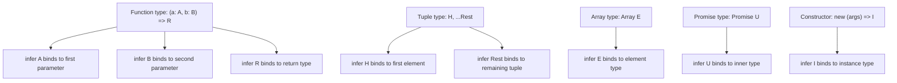

# 2.12 Type Inference in Conditionals

## 1. Purpose

TypeScript has two big jobs: check the values you write today against the types you wrote yesterday, and **derive new types from existing types without you having to write them twice**. The first job is what most beginners see — annotations, error squiggles, autocomplete. The second job is the part that turns TypeScript from "JavaScript with sprinkled types" into a real type-level programming language. The `infer` keyword is the single most important tool in that second job. It is the bridge between "I wrote the type" and "I describe the shape and let TypeScript extract the type for me."

Consider the following situation. You have a function in a third-party library that you do not control. The function is typed. You want a type that represents *what the function returns* so that callers of your wrapper can be typed correctly. Before `infer`, you had three bad options: re-declare the return type by hand (which silently drifts when the library changes), cast through `any` (which gives up safety), or refactor the library to export the type explicitly (which you often cannot do). With `infer`, you write `type ReturnOf<F> = F extends (...args: any[]) => infer R ? R : never` and you are done. TypeScript walks into the function signature, finds the return position, binds `R` to whatever type sits there, and hands `R` back to you. You did not name the return type. You did not copy it. You **extracted it from the structure of an existing type.**

That is the entire purpose of `infer`. It lets you reach inside an existing type — a function signature, an array, a tuple, a Promise, a constructor, an object property — and pull out a piece of it as a new type variable, without ever naming that piece yourself. The keyword is doing type-level destructuring. Just as `const { name } = user` reaches into a runtime object and binds `name` to a runtime variable, `T extends () => infer R ? R : never` reaches into a type-level function and binds `R` to a type-level variable. The rest of the conditional is the destructuring pattern; the `extends` clause is the position you are matching; the `infer` keyword is the binding site.

What does this enable? It enables the entire modern TypeScript utility ecosystem. The built-in `ReturnType<T>`, `Parameters<T>`, `ConstructorParameters<T>`, `InstanceType<T>`, `Awaited<T>`, and `PromiseValue<T>` are all tiny one-line conditional types that use `infer`. The third-party ecosystem leans on it harder still: **Zod's `z.infer<typeof schema>`** is built on `infer` walking into the schema's static type and extracting the inferred shape. React's `ComponentProps<typeof Component>` does the same thing for JSX components. tRPC's inferred router types, Drizzle's inferred column types, Effect's inferred effect types — all of them sit on top of `infer`. If you removed `infer` from TypeScript tomorrow, half the ecosystem's "wow, it just knows my types" demos would stop compiling.

The shift in mental model is the headline. Without `infer`, the type is something you write. With `infer`, the type is something you **describe and let TypeScript compute**. You say "this thing is shaped like a function that returns *something*; give me that something." You say "this thing is shaped like a Promise of *something*; give me the unwrapped something." You say "this thing is shaped like a tuple whose first element is *something*; give me that first element." You stop being a stenographer for your types and start being a pattern matcher. That is the purpose of `infer`.

## 2. Theory and Deep Dive

### 2.1 Where `infer` is allowed to appear

The grammar is narrow. The keyword `infer` may appear **only inside the `extends` clause of a conditional type**, and only in a position where TypeScript can bind a type variable during matching. The general shape is:

```typescript
// TS
type Extracted<T> = T extends SomePatternWithInferX ? X : Fallback;
```

If `T` is assignable to the pattern on the left of `extends`, TypeScript walks that pattern, finds every `infer X`, and binds `X` to the corresponding part of `T`. The right side of the conditional (the `? X` branch) can then use those bound variables. If `T` does *not* match the pattern, the conditional falls to the else branch, and `X` is never bound — it is an error to reference `X` in the else branch because it does not exist there.

This narrow grammar is what makes `infer` safe. You cannot accidentally extract a type from a random position in a random type. You can only extract from a position you have explicitly pattern-matched, and only when the pattern matches. If the pattern does not match, you get the fallback — usually `never` or `T` itself, depending on the use case.

### 2.2 The seven canonical positions

There are seven positions where `infer` is commonly placed. Each position corresponds to a different part of a structure you might want to extract from. We will cover each in detail. The accompanying diagram shows the positions on a generic function type.



#### 2.2.1 Function parameter inference

You can extract the type of a function parameter by placing `infer` in the parameter position of the pattern.

```typescript
// TS
type FirstParam<F> = F extends (a: infer P) => any ? P : never;

type T1 = FirstParam<(x: number) => void>;        // number
type T2 = FirstParam<(s: string, n: number) => void>; // string (only the first)
type T3 = FirstParam<() => void>;                  // never (no parameter to match)
```

```javascript
// JS
// No runtime equivalent. This is pure type-level computation.
// The "extraction" happens at compile time and the result is erased.
```

The pattern `(a: infer P) => any` says: "match any function that has at least one parameter, and bind `P` to the type of that first parameter." The name `a` is just a label — it does not have to match the actual parameter name in the source function. Only the position matters.

If the function has more parameters than your pattern, the match still succeeds — TypeScript ignores the extra parameters because a function with fewer parameters is assignable to a function type with more parameters. This is why `FirstParam<(s: string, n: number) => void>` extracts `string`, not `never`. If the function has *fewer* parameters than your pattern, the match fails and you fall through to the `never` branch.

#### 2.2.2 Function return inference

This is the most famous use case. Place `infer` in the return position.

```typescript
// TS
type ReturnOf<F> = F extends (...args: any[]) => infer R ? R : never;

type R1 = ReturnOf<() => number>;          // number
type R2 = ReturnOf<(x: string) => boolean>; // boolean
type R3 = ReturnOf<typeof JSON.parse>;     // any
type R4 = ReturnOf<typeof Array.from>;     // any[]
```

```javascript
// JS
const result = someFunction(); // runtime: the type of `result` matches the inferred R
```

The pattern `(...args: any[]) => infer R` says: "match any function regardless of its parameters, and bind `R` to whatever it returns." The `...args: any[]` is a rest parameter that matches any number of parameters of any type, so the pattern succeeds for any callable. This is almost exactly the implementation of the built-in `ReturnType<F>` utility.

#### 2.2.3 Array element inference

Place `infer` inside `Array<infer E>` (or equivalently `infer E[]`).

```typescript
// TS
type ElementOf<A> = A extends Array<infer E> ? E : never;

type E1 = ElementOf<string[]>;       // string
type E2 = ElementOf<number[]>;       // number
type E3 = ElementOf<Array<boolean>>; // boolean
type E4 = ElementOf<string | number[]>; // number (distributive — see Section 6)
```

```javascript
// JS
const arr = [1, 2, 3];
const first = arr[0]; // runtime: type of `first` is the element type
```

Note the subtlety with `E4`. Because conditional types distribute over naked type parameters, `ElementOf<string | number[]>` evaluates `ElementOf<string>` (which is `never` because `string` is not an array) and `ElementOf<number[]>` (which is `number`), then unions them: `never | number` collapses to `number`. This is occasionally what you want and occasionally surprising. We cover it in Section 6.

#### 2.2.4 Tuple element inference (head, rest, last)

Tuples are where `infer` shines because you can extract multiple pieces at once and you can recurse.

```typescript
// TS
type Head<T extends readonly any[]> = T extends readonly [infer H, ...any[]] ? H : never;
type Tail<T extends readonly any[]> = T extends readonly [any, ...infer Rest] ? Rest : never;
type Last<T extends readonly any[]> = T extends readonly [...any[], infer L] ? L : never;

type H1 = Head<[number, string, boolean]>; // number
type T1 = Tail<[number, string, boolean]>; // [string, boolean]
type L1 = Last<[number, string, boolean]>; // boolean
```

```javascript
// JS
const tuple = [1, "hello", true] as const;
const head = tuple[0]; // 1
const tail = tuple.slice(1); // ["hello", true]
const last = tuple[tuple.length - 1]; // true
```

The pattern `readonly [infer H, ...any[]]` says: "match a tuple whose first element is anything (bind it to `H`) and whose remaining elements are anything (collect into `any[]`)." The pattern `readonly [...any[], infer L]` matches a tuple whose last element is bound to `L`. The `...any[]` is a rest element that swallows any number of intermediate elements.

The `readonly` modifier on the pattern matters. If your input tuple is `readonly [1, 2, 3]` (which `as const` produces), a non-readonly pattern `[infer H, ...any[]]` will *not* match because a readonly tuple is not assignable to a mutable tuple type. Using `readonly` patterns everywhere is a safe default.

#### 2.2.5 Object property inference

You can reach into an object type and pull out the type of a property by name. The trick is to use a mapped pattern or to match against a specific key.

```typescript
// TS
type PropType<O, K extends keyof O> = O extends { [P in K]: infer V } ? V : never;

type User = { id: number; name: string; active: boolean };
type P1 = PropType<User, "name">;   // string
type P2 = PropType<User, "id">;     // number

// Alternative for a single known key
type NameOf<O> = O extends { name: infer N } ? N : never;
type N1 = NameOf<{ name: "alice" }>; // "alice" (literal preserved!)
```

```javascript
// JS
const user = { id: 1, name: "alice", active: true };
const name = user.name; // "alice"
```

The second form (`O extends { name: infer N }`) is interesting because it preserves literal types. If you pass `{ name: "alice" }`, the inferred `N` is the literal `"alice"`, not `string`. This is how you can build type-level string extractors and literal-preserving utilities.

#### 2.2.6 Promise inference

`infer` reaches inside `Promise<T>` and binds `T`.

```typescript
// TS
type Unwrap<P> = P extends Promise<infer U> ? U : P;

type U1 = Unwrap<Promise<number>>;        // number
type U2 = Unwrap<Promise<Promise<string>>>; // Promise<string> (NOT fully unwrapped!)
type U3 = Unwrap<string>;                  // string (the fallback branch)
```

```javascript
// JS
async function fetchValue() {
  const p = Promise.resolve(42);
  const v = await p; // runtime: unwrap one level
  return v;
}
```

Note `U2`. A single `Unwrap` only peels one layer of `Promise`. To peel arbitrarily deep, you need recursion. We will build that in Section 9.

The built-in `Awaited<T>` is essentially this with recursion and special handling for thenables. We will reimplement it in the exercises.

#### 2.2.7 Constructor inference

Place `infer` in the instance position of a constructor signature.

```typescript
// TS
type InstanceOf<C> = C extends new (...args: any[]) => infer I ? I : never;

class Person { constructor(public name: string) {} }
type P = InstanceOf<typeof Person>; // Person
type D = InstanceOf<typeof Date>;   // Date
type R = InstanceOf<typeof RegExp>; // RegExp
```

```javascript
// JS
const Ctor = Person;
const instance = new Ctor("alice"); // runtime: instance is a Person
```

The pattern `new (...args: any[]) => infer I` says: "match any constructor function and bind `I` to the type of object it constructs." This is almost exactly the built-in `InstanceType<C>`.

### 2.3 Multiple `infer` in one conditional

You are not limited to one `infer` per conditional. You can place several, and TypeScript will bind each one independently to its position.

```typescript
// TS
type FunctionParts<F> =
  F extends (a: infer A, b: infer B) => infer R
    ? { firstParam: A; secondParam: B; returnValue: R }
    : never;

type Parts = FunctionParts<(x: number, y: string) => boolean>;
// { firstParam: number; secondParam: string; returnValue: boolean }
```

```javascript
// JS
function inspect(fn) {
  return { firstParam: "unknown", secondParam: "unknown", returnValue: "unknown" };
  // No runtime equivalent; TS extracts this from the static signature.
}
```

You can also use the same name in multiple positions. When you do, TypeScript **infers a union** of all the types bound to that name.

```typescript
// TS
type AllParams<F> = F extends (...args: infer P) => any ? P : never;

type A1 = AllParams<(a: number, b: string) => void>; // [number, string]
// Wait, that gives a tuple. Let's see the union trick:

type ParamUnion<F> = F extends (a: infer P, b: infer P) => any ? P : never;
type U = ParamUnion<(x: number, y: string) => void>; // number | string
```

The second example uses `infer P` twice with the *same name* `P`. TypeScript collects both positions and binds `P` to the union `number | string`. This is a deliberate and useful feature — it lets you say "any of these positions" without writing a union by hand.

The tuple example `AllParams<F>` works because the rest parameter `...args: infer P` binds `P` to the *tuple* of all parameter types. The rest position is special: it always produces a tuple, even when there is only one parameter.

### 2.4 Constraint inference: `infer T extends U`

Since TypeScript 2.8, you can add a constraint to an `infer` declaration: `infer T extends U`. This says: "bind `T` to whatever sits in this position, **but only if that type is assignable to `U`**." If the inferred type does not satisfy the constraint, the conditional falls to the else branch.

```typescript
// TS
type StringReturn<F> = F extends (...args: any[]) => infer R extends string ? R : never;

type S1 = StringReturn<() => "hello">;      // "hello"
type S2 = StringReturn<() => string>;        // string
type S3 = StringReturn<() => number>;        // never (number is not a string)
type S4 = StringReturn<() => string | undefined>; // never (string | undefined is not assignable to string)
```

```javascript
// JS
function callStringReturn(fn) {
  const result = fn();
  if (typeof result !== "string") return null; // runtime guard mirrors the type constraint
  return result;
}
```

This is enormously useful for writing type-level filters. "Give me the return type of this function, but only if it is a string." "Give me the elements of this array, but only if they are objects." Without constraint inference, you would write a two-step conditional (infer first, then check), which is more verbose and sometimes loses literal types.

The constraint can also be a generic type variable, not just a concrete type:

```typescript
// TS
type FilterReturn<F, U> = F extends (...args: any[]) => infer R extends U ? R : never;

type FR1 = FilterReturn<() => "hello", string>; // "hello"
type FR2 = FilterReturn<() => number, string>;   // never
type FR3 = FilterReturn<() => Date, object>;     // Date
```

The constraint is checked at the point of inference. If `R` is not assignable to `U`, the match fails entirely and you get the else branch. This is different from inferring first and then checking with a second conditional — the latter would not surface `R` in the success branch.

### 2.5 Distributive behavior with `infer`

When the type parameter of a conditional is a naked type parameter and you pass a union, the conditional **distributes** over the union members. `infer` participates in this distribution.

```typescript
// TS
type Elem<A> = A extends Array<infer E> ? E : never;

type X1 = Elem<number[] | string[]>;          // number | string
type X2 = Elem<number[] | string>;            // number (string branch falls to never)
type X3 = Elem<number | string | boolean[]>;  // boolean (only boolean[] matches)
```

Each member of the union is run through the conditional independently, and the results are unioned. This is why `Awaited<Promise<number> | Promise<string>>` gives `number | string` rather than failing — each Promise is unwrapped independently.

You can disable distribution by wrapping the type parameter in square brackets:

```typescript
// TS
type ElemNoDistribute<A> = [A] extends [Array<infer E>] ? E : never;

type Y1 = ElemNoDistribute<number[] | string[]>; // number | string (still works, single match)
type Y2 = ElemNoDistribute<number[] | string>;    // never (the whole union fails to match)
```

The non-distributing version is stricter: the entire input must match the pattern, or you get the else branch. We cover this trade-off in Section 6.

### 2.6 The compiler's inference algorithm (briefly)

When TypeScript encounters `T extends PatternWithInfer ? Then : Else`, it runs an inference pass similar to the one used for generic function calls. It walks `PatternWithInfer` and `T` in parallel. Whenever it hits an `infer X` in the pattern, it records the corresponding position in `T` as a candidate for `X`. After the walk, it applies inference priorities (literal types beat widened types in covariant positions; candidates are unioned in contravariant positions; etc.) and binds `X` to the inferred type.

If the inferred type would make the pattern assignable to `T`, the conditional takes the `Then` branch with `X` bound. If not, it takes the `Else` branch and `X` is unbound. This is why `infer` is "safe" — it cannot accidentally bind to a type that does not actually fit the pattern.

### 2.7 Why `infer` is restricted to the `extends` clause

A common beginner question: "Why can't I write `type X = infer R;` at the top level?" The answer is that `infer` is a *binding site within a pattern match*, not a type expression. There is nothing for it to bind to at the top level — there is no input type to extract from. The `extends` clause provides the input (`T`) and the pattern (`... infer R ...`), and the conditional provides the branching. Without those three things, `infer` is meaningless. The restriction is not a parser limitation; it is a semantic necessity.

## 3. Mental Models

A handful of mental models make `infer` click. Different developers latch onto different ones; pick whichever clicks for you.

**Model 1: `infer` is type-level destructuring.** Just as `const { name, age } = user` reaches into a runtime object and binds `name` and `age` to local variables, `T extends { name: infer N, age: infer A } ? [N, A] : never` reaches into a type-level object and binds `N` and `A` to type-level variables. The conditional is the destructuring statement; the `extends` clause is the destructuring pattern; the `infer` keyword is the binding site. The else branch is the "this didn't match the shape" handler.

**Model 2: `infer` is a wildcard with a name.** When you write `T extends Array<infer E>`, you are saying "T must be an array of *something*; I don't care what right now, but I'm naming that something `E` so I can refer to it later." The `?` branch is where you use the named wildcard. The `:` branch is what happens if T isn't an array at all.

**Model 3: `infer` is the type-level version of a capturing group in regex.** A regex like `/function\(([^)]*)\)/` captures the parameters of a function string. The `infer` keyword does the same thing for types: it captures a portion of the matched type. Multiple `infer` declarations are multiple capture groups. Same-name `infer` declarations are like a backreference — the same capture, collected from multiple positions.

**Model 4: `infer` is a question, and the conditional is the answer.** "Does T look like a function that returns *something*? If yes, give me that something; if no, give me the fallback." `infer` is the placeholder for "something" in the question.

**Model 5: `infer` is a hole in a template.** You write a type template with a hole in it: `(arg: infer P) => void`. You hand TypeScript a concrete type. TypeScript plugs the hole with whatever fits. The conditional tells you what to do with the plugged result.

**Position is everything.** The single most important mental model is that *where you put `infer` in the pattern determines what it binds to*. Move `infer` from the parameter position to the return position and you change the entire meaning of the conditional. The keyword is just a placeholder; the position is the meaning. Treat the `extends` clause as a shape with marked holes, and you will rarely go wrong.

**Constraint inference is "extract but require."** `infer T extends U` reads as "extract T from this position, but only if it is a U." The constraint is a filter on what you extract. If the extracted type does not satisfy the constraint, the match fails and you fall to the else branch. This is a filter, not a coercion — TypeScript does not narrow the extracted type to `U`; it just refuses to bind if the extracted type is too wide.

## 4. Real-World Use Cases

`infer` is not an academic feature. It is the load-bearing wall under most of the modern TypeScript ecosystem. Here are the use cases you will meet in production code.

### 4.1 Deriving types from functions: `ReturnType` and `Parameters`

The most common use case. You have a function (often from a library you do not control) and you want its return type or parameter tuple as a standalone type so that callers of your wrapper can be correctly typed.

```typescript
// TS
import { parseDate } from "some-date-lib";

type ParseResult = ReturnType<typeof parseDate>; // inferred from the lib's signature

function safeParse(input: string): ParseResult | null {
  try { return parseDate(input); } catch { return null; }
}

const result = safeParse("2024-01-01"); // typed as ParseResult | null
```

```javascript
// JS
import { parseDate } from "some-date-lib";

function safeParse(input) {
  try { return parseDate(input); } catch { return null; }
}
const result = safeParse("2024-01-01");
```

Without `infer`, you would have to either redeclare `ParseResult` by hand (drift risk) or import it from the library (which may not export it). With `infer`, the type is always in sync with the library's actual signature.

### 4.2 Unwrapping Promises: `Awaited<T>`

`async` functions return `Promise<T>`, but when you `await` them you get `T`. The type system needs to model this. `Awaited<T>` (formerly `PromiseValue<T>`) uses `infer` to peel Promise layers, recursively if needed.

```typescript
// TS
type Deep<T> = T extends Promise<infer U> ? Deep<U> : T;

type A = Deep<Promise<number>>;             // number
type B = Deep<Promise<Promise<string>>>;    // string
type C = Deep<Promise<Promise<Promise<Date>>>>; // Date
type D = Deep<number>;                       // number (not a Promise, falls to fallback)
```

```javascript
// JS
async function deepAwait(p) {
  let v = p;
  while (v instanceof Promise) { v = await v; }
  return v;
}
```

This is the foundation of typed `async/await`. The built-in `Awaited<T>` generalizes this to handle thenables and unions.

### 4.3 React component prop extraction

React's `ComponentProps<typeof MyComponent>` derives the props type of a component without you having to export a separate props interface. Under the hood it uses `infer` to walk into the component's signature and pull out the props.

```typescript
// TS
import React from "react";

function UserCard(props: { name: string; age: number }) {
  return <div>{props.name}, {props.age}</div>;
}

type UserCardProps = React.ComponentProps<typeof UserCard>;
// { name: string; age: number }

const props: UserCardProps = { name: "alice", age: 30 };
```

```javascript
// JS
import React from "react";

function UserCard(props) {
  return React.createElement("div", null, `${props.name}, ${props.age}`);
}
const props = { name: "alice", age: 30 };
```

The same trick works for class components, forward refs, and higher-order components. Each variant has a slightly different `infer` pattern, but the core idea is the same: reach into the component and pull out the props.

### 4.4 Zod schema-to-type inference

Zod's headline feature is `z.infer<typeof schema>`, which derives a TypeScript type from a runtime schema object. The implementation is a recursive conditional type that walks the schema's static type and uses `infer` to pull out field types, element types, and so on.

```typescript
// TS
import { z } from "zod";

const UserSchema = z.object({
  id: z.number(),
  name: z.string(),
  roles: z.array(z.enum(["admin", "user"])),
});

type User = z.infer<typeof UserSchema>;
// { id: number; name: string; roles: ("admin" | "user")[] }

const u: User = { id: 1, name: "alice", roles: ["admin"] };
```

```javascript
// JS
import { z } from "zod";

const UserSchema = z.object({
  id: z.number(),
  name: z.string(),
  roles: z.array(z.enum(["admin", "user"])),
});

const u = UserSchema.parse({ id: 1, name: "alice", roles: ["admin"] });
// runtime: parsed and validated
```

We build a simplified version of this in Section 10. The pattern is: each schema node carries a static `kind` discriminator, and a recursive conditional type matches on the `kind` and uses `infer` to extract the relevant parts.

### 4.5 API response shape extraction

When you have a typed API client (tRPC, generated OpenAPI clients, etc.), you typically want to derive the response type of each endpoint without redeclaring it. `infer` is how that derivation works.

```typescript
// TS
type ApiResponse<E extends keyof Api> =
  ReturnType<Api[E]> extends Promise<infer Body> ? Body : never;
```

```javascript
// JS
async function callApi(endpoint) {
  const response = await fetch(endpoint);
  return response.json(); // runtime: the body is whatever the server sends
}
```

The same pattern: reach into the function, peel the Promise, hand back the body type. The result is that your calling code is typed against the *actual* return type of the API client, with zero duplication.

### 4.6 Constructor instance extraction

When you write factory functions or dependency injection containers, you often have a constructor function and want the instance type it produces.

```typescript
// TS
type ServiceMap = { user: typeof UserService; order: typeof OrderService };

type ServiceInstance<K extends keyof ServiceMap> = InstanceType<ServiceMap[K]>;

type UserSvc = ServiceInstance<"user">; // UserService
type OrderSvc = ServiceInstance<"order">; // OrderService
```

```javascript
// JS
const services = { user: UserService, order: OrderService };
function make(name) { return new services[name](); }
const userSvc = make("user");
```

`InstanceType<C>` is just `C extends new (...args: any[]) => infer I ? I : never`. The `infer` walks into the constructor signature and pulls out the instance type.

### 4.7 Tuple destructuring at the type level

When you work with parameter tuples (for currying, partial application, or RPC), you often need to split a tuple into head and rest, or pull out the last element.

```typescript
// TS
type Curry<F> = F extends (a: infer A, ...rest: infer R) => infer Ret
  ? R extends []
    ? F
    : (a: A) => Curry<(...args: R) => Ret>
  : never;
```

This implementation of `Curry` (a simplified one) uses `infer` three times in one conditional: once for the first parameter, once for the rest tuple, once for the return type. The result is a curried function type derived directly from the original function's signature.

## 5. Code Examples

### 5.1 Example A — Minimal and Conceptual

A compact demonstration of every `infer` position in five lines each. This is the cheat sheet you can come back to.

```typescript
// TS
type Param<F>  = F extends (a: infer P) => any ? P : never;
type Return<F> = F extends (...a: any[]) => infer R ? R : never;
type Elem<A>   = A extends Array<infer E> ? E : never;
type Head<T>   = T extends [infer H, ...any[]] ? H : never;
type Last<T>   = T extends [...any[], infer L] ? L : never;
type Unwrap<P> = P extends Promise<infer U> ? U : P;
type Inst<C>   = C extends new (...a: any[]) => infer I ? I : never;
type Prop<O>   = O extends { name: infer N } ? N : never;
```

```javascript
// JS
// No runtime counterpart. These are pure type-level helpers.
// They exist only at compile time and are erased from the emitted JavaScript.
```

Let's exercise each one to confirm the results:

```typescript
// TS
type A1 = Param<(x: number) => void>;            // number
type A2 = Return<() => string>;                   // string
type A3 = Elem<boolean[]>;                        // boolean
type A4 = Head<[1, 2, 3]>;                        // 1 (literal preserved)
type A5 = Last<[1, 2, 3]>;                        // 3 (literal preserved)
type A6 = Unwrap<Promise<Date>>;                  // Date
type A7 = Inst<typeof RegExp>;                    // RegExp
type A8 = Prop<{ name: "alice" }>;                // "alice" (literal preserved)
```

```javascript
// JS
// Equivalent runtime operations:
const head = ([h, ...rest]) => h;
const last = (arr) => arr[arr.length - 1];
const unwrap = async (p) => await p;
const instantiate = (Ctor) => new Ctor();
const readName = (obj) => obj.name;
```

Note how literal types are preserved in `A4`, `A5`, and `A8`. This is one of the great strengths of `infer`: when you extract a piece of a literal-typed structure, you get the literal, not the widened primitive. This is what makes type-level string manipulation (template literal types) and exhaustive union derivation possible.

### 5.2 Example B — Production-Grade

A real-world example: a typed event emitter whose `on` method derives the listener signature from a registered event map. This is the pattern used by libraries like `mitt`, `EventEmitter`, and Socket.IO's typed clients.

```typescript
// TS
type EventHandler<P> = P extends undefined ? () => void : (payload: P) => void;

type EventMap = {
  click: { x: number; y: number };
  change: string;
  ready: undefined;
};

type ListenerFor<E extends keyof EventMap> = EventHandler<EventMap[E]>;

class TypedEmitter {
  private handlers: { [K in keyof EventMap]?: ListenerFor<K>[] } = {};

  on<K extends keyof EventMap>(event: K, listener: ListenerFor<K>): void {
    (this.handlers[event] ??= []).push(listener);
  }

  emit<K extends keyof EventMap>(event: K, ...args: Parameters<ListenerFor<K>>): void {
    this.handlers[event]?.forEach((fn) => (fn as any)(...args));
  }
}

const emitter = new TypedEmitter();
emitter.on("click", (p) => console.log(p.x, p.y));       // p: { x: number; y: number }
emitter.on("change", (s) => console.log(s.toUpperCase())); // s: string
emitter.on("ready", () => console.log("ready"));           // no payload

emitter.emit("click", { x: 10, y: 20 });
emitter.emit("change", "hello");
emitter.emit("ready");
```

```javascript
// JS
class TypedEmitter {
  constructor() { this.handlers = {}; }
  on(event, listener) {
    (this.handlers[event] ??= []).push(listener);
  }
  emit(event, ...args) {
    this.handlers[event]?.forEach((fn) => fn(...args));
  }
}

const emitter = new TypedEmitter();
emitter.on("click", (p) => console.log(p.x, p.y));
emitter.on("change", (s) => console.log(s.toUpperCase()));
emitter.on("ready", () => console.log("ready"));

emitter.emit("click", { x: 10, y: 20 });
emitter.emit("change", "hello");
emitter.emit("ready");
```

The `Parameters<ListenerFor<K>>` line is the production use of `infer`. `ListenerFor<K>` is a function type derived from `EventMap[K]`, and `Parameters<>` (which itself uses `infer`) extracts its parameter tuple. The result is that `emit` is typed to require exactly the right payload for each event name. Pass the wrong shape and you get a compile error.

Here is the underlying implementation of `Parameters` to make the `infer` explicit:

```typescript
// TS
type MyParameters<F extends (...args: any[]) => any> =
  F extends (...args: infer P) => any ? P : never;

// MyParameters<typeof fn> for fn = (x: number, s: string) => void gives [number, string]
```

```javascript
// JS
// Equivalent: inspect a function at runtime to extract arity.
// (TypeScript's Parameters has no runtime equivalent — JS gives you `fn.length`.)
function arity(fn) { return fn.length; }
```

## 6. Common Mistakes and Anti-Patterns

`infer` is sharp. Used wrong, it produces `never` silently, extracts the wrong type, or just fails to match. Here are the most common mistakes and how to spot them.

### 6.1 `infer` outside a conditional

```typescript
// TS — BROKEN
type X = infer R; // Error: 'infer' declarations are only permitted inside conditional types.
```

```javascript
// JS — no runtime analog
```

This is a hard compiler error. `infer` is a binding site inside a pattern match; without the pattern match, there is nothing to bind. Fix: always wrap `infer` in `T extends PatternWithInfer ? Then : Else`.

### 6.2 `infer` in the wrong position

```typescript
// TS — BUG
type WrongReturn<F> = F extends (a: infer R) => any ? R : never;

type W1 = WrongReturn<(x: number) => string>; // number — but the developer wanted string!
```

```javascript
// JS — no runtime analog
```

The developer placed `infer R` in the *parameter* position, not the return position. The conditional succeeds (because the pattern matches), and `R` binds to the parameter type, not the return type. There is no error — just a wrong result. Fix: place `infer` exactly where you want to extract from. The position is the meaning.

### 6.3 `infer` with a non-matching pattern (silent `never`)

```typescript
// TS — BUG
type ElementOf<A> = A extends Array<infer E> ? E : never;

type E1 = ElementOf<string>; // never (silently!)
type E2 = ElementOf<number | string[]>; // number (distributive; the string branch yields never)
```

```javascript
// JS — no runtime analog
```

When the pattern does not match, you fall to the else branch. If the else branch is `never` (the common default), the result is `never` — and `never` silently disappears from unions (`never | number` is `number`). The bug appears later when a downstream type is unexpectedly `never` and you have to trace back. Fix: when in doubt, make the else branch `T` (return the input unchanged) rather than `never`, so the failure is visible.

### 6.4 Multiple `infer` with the same name when you did not mean to

```typescript
// TS — BUG
type Params<F> = F extends (a: infer P, b: infer P) => any ? P : never;

type P1 = Params<(x: number, y: string) => void>; // number | string — but the developer wanted a tuple!
```

```javascript
// JS — no runtime analog
```

The developer wrote `infer P` twice, intending to capture both parameters. TypeScript collects both positions into a union bound to `P`, giving `number | string` instead of `[number, string]`. Fix: use distinct names and assemble the tuple yourself, or use a rest parameter `...args: infer P` which captures a tuple.

### 6.5 `infer` with a constraint that does not match

```typescript
// TS — surprising
type StringReturn<F> = F extends (...a: any[]) => infer R extends string ? R : never;

type S1 = StringReturn<() => string | undefined>; // never (string | undefined is not assignable to string)
type S2 = StringReturn<() => "hello">;             // "hello"
```

```javascript
// JS — no runtime analog
```

The constraint `extends string` is checked at inference time. `string | undefined` is not assignable to `string`, so the match fails and you get `never`. This is correct behavior, but it surprises developers who expected `R` to be narrowed to `string` from `string | undefined`. Constraint inference is a *filter*, not a *narrowing*. Fix: if you want narrowing, infer first and then narrow with a separate conditional or a distributive conditional.

### 6.6 `infer` in a distributive conditional when you wanted a single match

```typescript
// TS — surprising
type ElementOf<A> = A extends Array<infer E> ? E : never;

type E1 = ElementOf<number[] | string>;        // number (string branch is never, union collapses)
type E2 = ElementOf<number[] | string[]>;      // number | string (both match)
```

```javascript
// JS — no runtime analog
```

Because `A` is a naked type parameter, the conditional distributes over the union. Each member is checked independently. This is sometimes what you want (E2) and sometimes not (E1, where the non-matching member silently vanishes). Fix: if you want "the whole input must match, or fail," wrap the parameter in brackets: `[A] extends [Array<infer E>] ? E : never`.

### 6.7 Using `infer` with `any` in the input position

```typescript
// TS — surprising
type ElementOf<A> = A extends Array<infer E> ? E : never;

type E1 = ElementOf<any>; // any
```

```javascript
// JS — no runtime analog
```

When the input is `any`, the conditional matches and `E` is bound to `any`. This is technically correct (`any` is assignable to `Array<any>`) but it leaks `any` into your derived type, defeating the purpose of using `infer`. Fix: constrain the input type parameter so `any` cannot sneak in (`<A extends unknown[]>` rather than `<A>`).

### 6.8 Forgetting `readonly` on tuple patterns

```typescript
// TS — BUG
type Head<T> = T extends [infer H, ...any[]] ? H : never;

const t = [1, 2, 3] as const;
type H1 = Head<typeof t>; // never! (because typeof t is readonly [1, 2, 3] and pattern is mutable)
```

```javascript
// JS — no runtime analog
```

A readonly tuple is not assignable to a mutable tuple pattern, so the match fails and you get `never`. Fix: use `readonly` on the pattern: `T extends readonly [infer H, ...any[]] ? H : never`. Or use the broader `readonly any[]` constraint on the input.

## 7. Best Practices and Design Patterns

### 7.1 Use `infer` to derive, never to redeclare

The single biggest rule. If you find yourself copying a type out of a function signature or library export so you can use it elsewhere, stop and use `ReturnType`, `Parameters`, or a custom `infer` conditional instead. Derived types stay in sync with their source; hand-copied types drift.

### 7.2 Test with simple types first

`infer` patterns can be subtle. Before you plug a fancy conditional into production code, test it with a few concrete inputs and verify the results with `type T1 = ...; // expected: number`. TypeScript's hover-on-the-type quick-info is your friend. Use the TypeScript playground or a scratch file to confirm each branch behaves as expected.

### 7.3 Choose the else branch deliberately

The else branch is your fallback. `never` means "this should never happen, propagate the failure." `T` means "if it doesn't match, return the input unchanged." `unknown` means "I have no idea what this is, force the caller to narrow." Pick the one that matches your intent. Do not default to `never` out of habit.

### 7.4 Document complex `infer` patterns with examples

A multi-line conditional with several `infer` declarations is hard to read. Add a doc comment with at least two example inputs and their expected outputs. Future you will be grateful.

```typescript
// TS
/**
 * Curries a function type. Given (a, b, c) => R, produces (a) => (b) => (c) => R.
 * @example Curry<(a: number, b: string) => boolean>
 *          // => (a: number) => (b: string) => boolean
 */
type Curry<F> = ...
```

```javascript
// JS
// (Documentation only — no runtime impact.)
```

### 7.5 Combine `infer` with recursion for nested structures

A single `infer` peels one layer. For arbitrarily deep structures (nested Promises, nested arrays, recursive object schemas), combine `infer` with a recursive call to the same conditional. This is how `Awaited`, `DeepUnwrap`, and Zod's `z.infer` work.

### 7.6 Constrain inputs to prevent `any` leakage

Always constrain your input type parameter to at least narrow to the kind of type you expect. `<A extends unknown[]>` for arrays, `<F extends (...args: any[]) => any>` for functions, `<P extends Promise<unknown>>` for Promises. This prevents `any` from sneaking in and producing `any` out.

### 7.7 Use constraint inference for type-level filters

`infer T extends U` is a clean way to say "extract T but only if it is a U." Use it for filters: "give me the return type but only if it is a string," "give me the element type but only if it is an object." Without constraint inference, you would need a two-step conditional that is more verbose and sometimes loses literals.

### 7.8 Prefer `readonly` patterns for tuples

Always use `readonly [infer H, ...any[]]` rather than `[infer H, ...any[]]`. The readonly pattern matches both readonly and mutable tuples. The mutable pattern matches only mutable tuples, which fails surprisingly on `as const` tuples.

## 8. Technical Interview Knowledge

A solid `infer` interview prep. Eight questions with the answers an interviewer wants to hear.

**Q1: What does `infer` do?**

A: `infer` declares a type variable inside the `extends` clause of a conditional type. When the conditional matches, TypeScript binds that variable to the part of the input type that sits at the position of `infer`. The bound variable can then be used in the success branch of the conditional. It is type-level destructuring: you describe a shape with a marked hole, and TypeScript fills the hole with the matching part of the input.

**Q2: Where can `infer` appear?**

A: Only inside the `extends` clause of a conditional type. It cannot appear in type aliases, interface declarations, function signatures, or anywhere else at the top level. Within the `extends` clause, it can appear in any position where a type can be matched: function parameters, return types, array elements, tuple positions, object properties, Promise inner types, constructor instance positions, and so on.

**Q3: How would you extract a function's return type?**

A: `type ReturnOf<F> = F extends (...args: any[]) => infer R ? R : never;` The `...args: any[]` matches any function regardless of parameters, and `infer R` in the return position binds `R` to the return type. The success branch returns `R`. This is exactly the implementation of the built-in `ReturnType<F>`.

**Q4: How would you unwrap a Promise?**

A: For one layer: `type Unwrap<P> = P extends Promise<infer U> ? U : P;`. For arbitrarily deep nesting, recurse: `type Deep<P> = P extends Promise<infer U> ? Deep<U> : P;`. The built-in `Awaited<T>` is essentially this with extra handling for thenables and union distribution.

**Q5: What is `infer T extends U`?**

A: Constraint inference. It binds `T` to whatever sits at the position of `infer`, but only if that type is assignable to `U`. If the inferred type is not assignable to `U`, the conditional falls to the else branch. It is a filter on what you extract, not a narrowing — TypeScript does not narrow the bound type to `U`; it just refuses to bind if the extracted type is too wide. Available since TypeScript 2.8.

**Q6: How do you extract tuple elements?**

A: For the head: `T extends readonly [infer H, ...any[]] ? H : never`. For the tail: `T extends readonly [any, ...infer Rest] ? Rest : never`. For the last: `T extends readonly [...any[], infer L] ? L : never`. The `...any[]` is a rest element that matches any number of intermediate elements. Always use `readonly` patterns so both readonly and mutable tuples match.

**Q7: What happens if `infer` doesn't match?**

A: The conditional takes the else branch and the inferred variable is unbound. You cannot reference the variable in the else branch — it does not exist there. The most common else branch is `never`, which means "if this doesn't match, there is no meaningful type to return." Some patterns use `T` as the else branch to return the input unchanged on failure, which is useful for "unwrap if it's a Promise, otherwise leave it alone."

**Q8: How would you build `Parameters<T>` from scratch?**

A: `type MyParameters<F extends (...args: any[]) => any> = F extends (...args: infer P) => any ? P : never;`. The key insight is that `...args: infer P` in a rest position binds `P` to the *tuple* of all parameter types, not to a single parameter. So `MyParameters<(a: number, b: string) => void>` gives `[number, string]`. The constraint `F extends (...args: any[]) => any` ensures the input is callable, which prevents `any` from sneaking in and producing surprising results.

## 9. Practical Exercises

Four exercises with full worked solutions. Try each before reading the solution.

### 9.1 Exercise 1: Implement `ReturnType` and `Parameters`

Implement both utilities from scratch using `infer`. Verify with concrete examples.

**Solution:**

```typescript
// TS
type MyReturnType<F extends (...args: any[]) => any> =
  F extends (...args: any[]) => infer R ? R : never;

type MyParameters<F extends (...args: any[]) => any> =
  F extends (...args: infer P) => any ? P : never;

// Verify
type R1 = MyReturnType<() => number>;                    // number
type R2 = MyReturnType<(x: string) => boolean>;          // boolean
type R3 = MyReturnType<typeof JSON.stringify>;           // string

type P1 = MyParameters<() => void>;                      // []
type P2 = MyParameters<(a: number, b: string) => void>;  // [number, string]
type P3 = MyParameters<(x: Date, y: RegExp, z: Error) => void>; // [Date, RegExp, Error]
```

```javascript
// JS
// No runtime counterpart. These exist only at compile time.
// At runtime, you can read `fn.length` to get arity, but not parameter types.
```

The constraint `F extends (...args: any[]) => any` is important. Without it, `MyReturnType<any>` would give `any` (because `any` matches the pattern), which is rarely what you want. The constraint ensures the input is at least callable.

### 9.2 Exercise 2: Build `UnwrapPromise<T>` recursively

Implement a type that unwraps a Promise to its inner type, no matter how deeply nested.

**Solution:**

```typescript
// TS
type UnwrapPromise<T> = T extends Promise<infer U> ? UnwrapPromise<U> : T;

type U1 = UnwrapPromise<Promise<number>>;                 // number
type U2 = UnwrapPromise<Promise<Promise<string>>>;        // string
type U3 = UnwrapPromise<Promise<Promise<Promise<Date>>>>; // Date
type U4 = UnwrapPromise<number>;                          // number (not a Promise)
type U5 = UnwrapPromise<Promise<number> | Promise<string>>; // number | string (distributive)
```

```javascript
// JS
async function deepAwait(value) {
  let current = value;
  while (current instanceof Promise) {
    current = await current;
  }
  return current;
}
```

The recursion is the key. Each call peels one Promise layer; if the inner type is itself a Promise, the recursive call peels again; eventually the inner type is not a Promise and the conditional falls to the `: T` branch, which returns the type unchanged. This is structurally identical to the loop in the runtime `deepAwait`.

Note `U5`: because the input is a union of Promises and the type parameter is naked, the conditional distributes over the union. Each Promise is unwrapped independently, then the results are unioned. This matches the behavior of `await` on a union of Promises.

### 9.3 Exercise 3: Build a tuple head/rest extractor

Implement `Head`, `Tail`, and `Last` for readonly tuples. Then use them to build `DropFirst<T>` which removes the first element.

**Solution:**

```typescript
// TS
type Head<T extends readonly any[]> =
  T extends readonly [infer H, ...any[]] ? H : never;

type Tail<T extends readonly any[]> =
  T extends readonly [any, ...infer Rest] ? Rest : never;

type Last<T extends readonly any[]> =
  T extends readonly [...any[], infer L] ? L : never;

type DropFirst<T extends readonly any[]> =
  T extends readonly [any, ...infer Rest] ? Rest : [];

type H1 = Head<[1, 2, 3]>;              // 1
type T1 = Tail<[1, 2, 3]>;              // [2, 3]
type L1 = Last<[1, 2, 3]>;              // 3
type D1 = DropFirst<[1, 2, 3]>;         // [2, 3]
type D2 = DropFirst<[1]>;               // []
type D3 = DropFirst<[]>;                // []
```

```javascript
// JS
const head = ([h]) => h;
const tail = ([, ...rest]) => rest;
const last = (arr) => arr[arr.length - 1];
const dropFirst = ([, ...rest]) => rest;
```

The `readonly` modifier on each pattern is critical. Without it, `Head<readonly [1, 2, 3]>` would give `never` because a readonly tuple is not assignable to a mutable tuple pattern. The constraint `T extends readonly any[]` on the input parameter prevents `any` from sneaking in.

The else branch on `DropFirst` is `[]` (empty tuple), not `never`. This is a deliberate choice: dropping the first element of a tuple that has fewer than one element yields an empty tuple, which is a useful identity for the recursion. If we used `never`, downstream code would silently lose type information.

### 9.4 Exercise 4: Build a custom extractor for API response shapes

Given an API client object whose methods return Promises of typed responses, derive a type that maps each endpoint name to its unwrapped response type.

**Solution:**

```typescript
// TS
type Api = {
  getUser: (id: number) => Promise<{ id: number; name: string }>;
  listOrders: () => Promise<Array<{ orderId: string; total: number }>>;
  healthCheck: () => Promise<"ok" | "degraded">;
};

type Unwrap<T> = T extends Promise<infer U> ? U : T;

type ResponseShape<A> = {
  [K in keyof A]: A[K] extends (...args: any[]) => infer R ? Unwrap<R> : never;
};

type Responses = ResponseShape<Api>;
/*
{
  getUser: { id: number; name: string };
  listOrders: Array<{ orderId: string; total: number }>;
  healthCheck: "ok" | "degraded";
}
*/

// Use it
function expectResponse<K extends keyof Responses>(endpoint: K, value: Responses[K]) {
  // value is typed exactly to the response shape for `endpoint`
}

expectResponse("getUser", { id: 1, name: "alice" });
expectResponse("listOrders", [{ orderId: "abc", total: 99.5 }]);
expectResponse("healthCheck", "ok");
```

```javascript
// JS
async function callEndpoint(client, endpoint, ...args) {
  const result = await client[endpoint](...args);
  return result;
}
// No type-level equivalent — runtime just awaits and returns.
```

The mapper walks each key of the API object, extracts the return type of each method via `infer R`, unwraps the Promise via `Unwrap<R>`, and assembles the result into a new object type. The result is a single type that maps endpoint names to their response shapes — derived entirely from the API client's existing types, with zero duplication.

This is the same pattern Zod, tRPC, and Drizzle use to derive types from runtime definitions. The core idea is: build a runtime object whose static type carries all the information you need, then use `infer` and mapped types to project that information into derived types.

## 10. Mini-Project Blueprint

**Project: Build a schema-to-type extractor**

Goal: a tiny type-level schema library that derives TypeScript types from schema objects, supporting primitives, arrays, objects, and literals. This is a stripped-down version of Zod's `z.infer`.

### 10.1 Schema definition

Define a discriminated union of schema node types. Each node has a `kind` discriminator and the parameters needed to describe that kind of type.

```typescript
// TS
type Schema =
  | { kind: "string" }
  | { kind: "number" }
  | { kind: "boolean" }
  | { kind: "literal"; value: string | number | boolean }
  | { kind: "array"; element: Schema }
  | { kind: "object"; fields: Record<string, Schema> }
  | { kind: "optional"; inner: Schema };
```

```javascript
// JS
// Runtime schema builder (mirrors the type)
const s = {
  string: () => ({ kind: "string" }),
  number: () => ({ kind: "number" }),
  boolean: () => ({ kind: "boolean" }),
  literal: (value) => ({ kind: "literal", value }),
  array: (element) => ({ kind: "array", element }),
  object: (fields) => ({ kind: "object", fields }),
  optional: (inner) => ({ kind: "optional", inner }),
};
```

### 10.2 The extractor

A recursive conditional type that walks the schema and produces the corresponding TS type.

```typescript
// TS
type Infer<S> =
  S extends { kind: "string" } ? string :
  S extends { kind: "number" } ? number :
  S extends { kind: "boolean" } ? boolean :
  S extends { kind: "literal"; value: infer V } ? V :
  S extends { kind: "array"; element: infer E } ? Infer<E>[] :
  S extends { kind: "optional"; inner: infer I } ? Infer<I> | undefined :
  S extends { kind: "object"; fields: infer F } ?
    F extends Record<string, Schema> ?
      { [K in keyof F]: Infer<F[K]> } :
      never :
  never;
```

```javascript
// JS
function inferValue(schema) {
  switch (schema.kind) {
    case "string":  return "";
    case "number":  return 0;
    case "boolean": return false;
    case "literal": return schema.value;
    case "array":   return [inferValue(schema.element)];
    case "optional": return inferValue(schema.inner);
    case "object":
      const out = {};
      for (const k of Object.keys(schema.fields)) out[k] = inferValue(schema.fields[k]);
      return out;
  }
}
```

The pattern is: match on the `kind` discriminator, use `infer` to pull out the relevant parts (the literal value, the array element, the object fields), and recurse for nested schemas. Each branch produces the TS type that corresponds to that schema kind.

### 10.3 Using the extractor

```typescript
// TS
const UserSchema = {
  kind: "object",
  fields: {
    id: { kind: "number" },
    name: { kind: "string" },
    active: { kind: "boolean" },
    roles: { kind: "array", element: { kind: "literal", value: "admin" } },
    nickname: { kind: "optional", inner: { kind: "string" } },
  },
} as const satisfies Schema;

type User = Infer<typeof UserSchema>;
/*
{
  id: number;
  name: string;
  active: boolean;
  roles: "admin"[];
  nickname: string | undefined;
}
*/

const u: User = {
  id: 1,
  name: "alice",
  active: true,
  roles: ["admin"],
  nickname: "ali",
};
```

```javascript
// JS
const user = {
  id: 1,
  name: "alice",
  active: true,
  roles: ["admin"],
  nickname: "ali",
};
// At runtime: schema validation (omitted here) checks the shape.
```

The `as const satisfies Schema` is critical. It ensures the schema object conforms to the `Schema` type while preserving literal types (so `"admin"` stays `"admin"` rather than widening to `string`). Without `as const`, the literal value `"admin"` would widen to `string` and `Infer` would produce `string[]` instead of `"admin"[]`.

### 10.4 Extensions to try

Once the base extractor works, extend it with: enums (union of literals), tuples (fixed-length arrays with per-position schemas), records (maps with string keys and a uniform value schema), intersections (combine two object schemas), and branded types (a primitive with a phantom brand). Each extension is one more branch in the conditional, one more use of `infer`. This is exactly how Zod grew from a small library into a full schema language — one `infer` branch at a time.

## 11. Core Connections

- [[2.07 Generics and Constraints]] — `infer` is the type-level analog of a generic type parameter, but bound by pattern matching rather than by a call site. The constraint `infer T extends U` mirrors `<T extends U>`.
- [[2.10 Utility Types Deep Dive]] — `ReturnType`, `Parameters`, `InstanceType`, `Awaited`, and `ConstructorParameters` are all thin wrappers over a one-line conditional with `infer`. This note is the implementation behind those utilities.
- [[2.11 Conditional Types]] — `infer` lives inside the `extends` clause of a conditional type. Without conditionals, `infer` has no home. Read that note first if conditionals are unfamiliar.
- [[2.13 Template Literal Types]] — template literal types use `infer` to extract substrings, split on delimiters, and rewrite strings at the type level. The same destructuring mental model applies, just for string positions instead of structural positions.
- [[2.14 Recursive Type-Level Operations]] — combining `infer` with recursion is how you build `Awaited`, `DeepUnify`, schema extractors, and most non-trivial type-level programs. Recursion is the multiplier that turns `infer` from a single-step extractor into a tree walker.
- [[2.17 API Design with Types]] — production APIs lean heavily on `infer` to derive types from runtime definitions (Zod schemas, tRPC routers, React components, OpenAPI clients). Mastering `infer` is what lets you build APIs that "just know" the right types.
