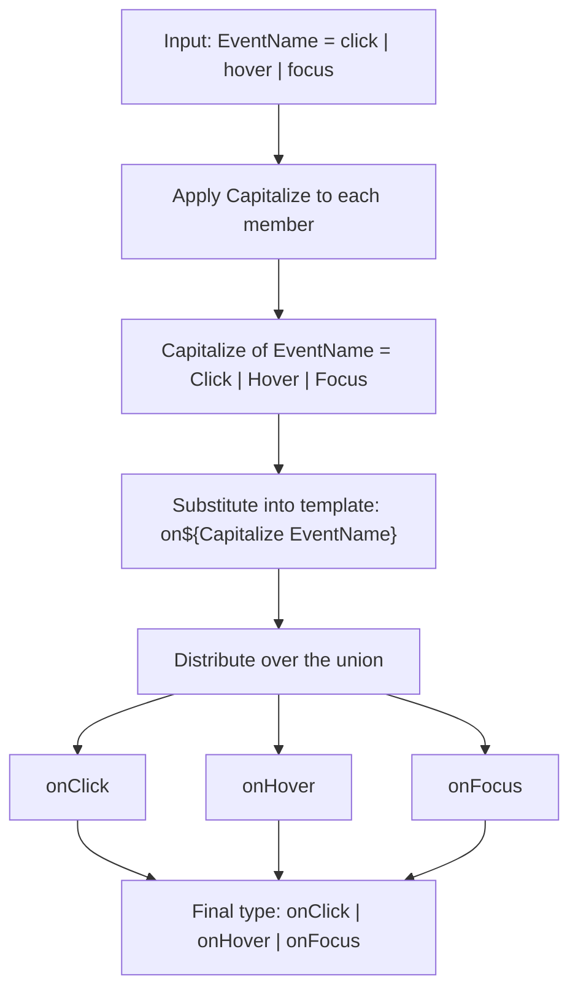

# 2.13 Template Literal Types

## 1. Purpose

For most of TypeScript's life, types described *shapes*. A type told you which properties an object had, which arguments a function expected, which members a union admitted. Types were a vocabulary for *structure*. What they could not do — at least not without elaborate conditional gymnastics — was talk about the *contents of strings*. If you wanted a type that meant "the literal string `click` plus the literal string `Handler`," you had to write the union `"clickHandler" | "hoverHandler" | "focusHandler"` by hand, and you had to keep it in sync with the source of truth by hand. Every typo was a runtime bug masquerading as a type. Every rename was a search-and-replace across dozens of files. Every new event name required three people to remember to update the union.

Template literal types close that gap. They take the runtime template literal syntax — `` `prefix ${value} suffix` `` — and lift it into the type system, where the "value" can itself be a type. A type like `` `on${EventName}` `` means "for every member of the `EventName` union, produce a string type that is the literal `on` followed by that member." If `EventName` is `"click" | "hover"`, the result is the literal union `"onClick" | "onHover"`. If `EventName` later gains a `"scroll"` member, the result silently gains `"onScroll"`. There is no second source of truth. There is no manual list. The string *and* the type are computed from a single seed.

That is the headline. Template literal types turn TypeScript from "types describe shapes" into "types compute strings." They make string literal types *first class*: a string literal type can be a function of other string literal types, can be pattern-matched, can be split, can be rejoined, can be renamed, can be recombined. The string is no longer an atomic token you must enumerate by hand. It is a value the type system can construct and deconstruct.

What does this enable? It enables the entire modern generation of "type-safe strings" libraries and patterns:

- **Type-safe event emitters** where the event name is `` `on${EventName}` `` and the handler's argument type is computed by looking up `EventName` in a registry. A typo in `emit("onClikc", ...)` is a compile error, not a silent runtime miss.
- **Type-safe routing** where a route string like `"/users/:id/posts/:postId"` is parsed at the type level into a params object `{ id: string; postId: string }`, and a handler's signature is required to match. Hit an unregistered route, forget a param, or pass the wrong type — each is a compile error.
- **Type-safe CSS-in-JS** where prop names like `"marginTop"` or `"paddingLeft"` are constructed from a union of directions and a union of properties, so `"marginWrong"` is rejected.
- **Type-safe SQL query builders** where column names are template-literal-derived from a schema, so `SELECT userId FROM users` is fine but `SELECT userWrong FROM users` is a compile error.
- **Type-safe IDs** where a branded ID like `` `user:${string}` `` prevents you from passing a `UserId` to a function that expects an `OrderId`, even though both are strings at runtime.
- **Type-safe React component props** where an `onChange` prop is automatically paired with the corresponding `value` prop name, so a typo is impossible.
- **Type-safe i18n** where translation keys are derived from a JSON schema, so `"welcome.title"` is fine but `"welcome.titel"` is rejected.

The shift is from "I write the type" to "I describe how the type is built from smaller types." Template literal types are the missing piece that makes TypeScript a real type-level programming language, not just a structural annotation language. They sit on top of [[2.05 Unions and Intersections]] (template literals distribute over unions), [[2.09 Mapped Types]] (template literals power key remapping), [[2.10 Utility Types Deep Dive]] (the four casing intrinsics are built on them), [[2.11 Conditional Types]] (template literals enable string pattern matching), and [[2.12 Type Inference in Conditionals]] (template literals introduce new `infer` positions). Master them and you have mastered the single most expressive feature in modern TypeScript.

## 2. Theory and Deep Dive

### 2.1 The syntax

A template literal type has the same surface syntax as a runtime template literal, except it lives in type position. The grammar is:

```typescript
// TS
type Greeting = `Hello, ${Name}!`;
```

where `Name` is a type. The placeholders inside `${...}` are not arbitrary types — they must be *string-like*. The five permitted kinds are:

1. `string` (and any string literal type, e.g., `"click"`)
2. `number` (and any numeric literal type, e.g., `42`)
3. `boolean` (and `true` / `false`)
4. `bigint` (and bigint literals, e.g., `100n`)
5. `null` and `undefined` (coerced to the literal strings `"null"` and `"undefined"`)

If you try to substitute an arbitrary object type into a placeholder, TypeScript will reject it. The error message is something like `Type 'Foo' is not assignable to type 'string | number | bigint | boolean | null | undefined'`. This is the first surprise for newcomers: template literals are not JavaScript template literals in disguise. They are a constrained type-level construct that only knows how to *coerce the five primitives to their string forms*.

Let's see each coercion in action:

```typescript
// TS
type T1 = `str: ${string}`;             // `str: ${string}` (still templated — `string` is open)
type T2 = `lit: ${"click"}`;            // "lit: click"
type T3 = `num: ${number}`;             // `num: ${number}` (still templated)
type T4 = `litnum: ${42}`;              // "litnum: 42"
type T5 = `bool: ${boolean}`;           // `bool: ${boolean}` (still templated)
type T6 = `litbool: ${true}`;           // "litbool: true"
type T7 = `big: ${bigint}`;             // `big: ${bigint}` (still templated)
type T8 = `litbig: ${100n}`;            // "litbig: 100"
type T9 = `nullish: ${null}`;           // "nullish: null"
type T10 = `undef: ${undefined}`;       // "undef: undefined"
```

The pattern to internalize: when the placeholder is a *literal* (`"click"`, `42`, `true`, `100n`, `null`, `undefined`), TypeScript resolves the template to a concrete string literal. When the placeholder is a *wide* type (`string`, `number`, `boolean`, `bigint`), the template stays open and resolves to `` `prefix: ${string}` `` — a type that admits any string with the right prefix. Both forms are useful. The literal form gives you exact type-safe strings. The wide form gives you branded prefix types.

The wide form is what powers branded IDs:

```typescript
// TS
type UserId = `user:${string}`;
type OrderId = `order:${string}`;

function getUser(id: UserId): User { /* ... */ }
function getOrder(id: OrderId): Order { /* ... */ }

declare const uid: UserId;
getOrder(uid);   // Error: Argument of type 'UserId' is not assignable to parameter of type 'OrderId'.
```

At runtime `uid` is just a string like `"user:abc123"`. At compile time it is a *distinct type* from `OrderId`, and the compiler will refuse to let you mix them up. This is the cheapest, most lightweight branding pattern in TypeScript, and it is built on a single template literal.

### 2.2 Distribution over unions

The other thing template literals do, almost invisibly, is *distribute over unions*. If a placeholder is a union of string literals, the template produces the union of all combinations:

```typescript
// TS
type EventName = "click" | "hover" | "focus";
type HandlerName = `on${Capitalize<EventName>}`;
// "onClick" | "onHover" | "onFocus"

type Direction = "top" | "right" | "bottom" | "left";
type Margin = `margin${Capitalize<Direction>}`;
// "marginTop" | "marginRight" | "marginBottom" | "marginLeft"

type Axis = "x" | "y";
type Prop = `size-${Axis}`;
// "size-x" | "size-y"
```

Distribution is what makes template literals scale. You do not have to enumerate the cross product yourself — TypeScript does. Add a new member to `EventName` and every derived template literal silently picks it up. This is the *single source of truth* pattern in action: define the union once, derive every related string type from it.

When you have multiple placeholders, the distribution is the full Cartesian product:

```typescript
// TS
type Prefix = "get" | "set";
type Field = "Name" | "Age" | "Email";
type Accessor = `${Prefix}${Field}`;
// "getName" | "getAge" | "getEmail" | "setName" | "setAge" | "setEmail"
```

Six members from two unions of size three. This is how you build a typed accessor API — every field gets a getter and a setter, and missing one is a compile error.

### 2.3 The four string manipulation types

TypeScript ships four intrinsic types that operate on string literal types: `Uppercase<S>`, `Lowercase<S>`, `Capitalize<S>`, and `Uncapitalize<S>`. They are called *intrinsic* because they are not implemented in TypeScript itself — they are baked into the compiler. You cannot write `Uppercase` in user-level TypeScript. It is compiler magic, much like `keyof` or `typeof`.

```typescript
// TS
type A = Uppercase<"hello">;        // "HELLO"
type B = Lowercase<"WORLD">;        // "world"
type C = Capitalize<"foo">;         // "Foo"
type D = Uncapitalize<"Bar">;       // "bar"

// They distribute over unions:
type E = Uppercase<"a" | "b" | "c">; // "A" | "B" | "C"
type F = Capitalize<"click" | "hover">; // "Click" | "Hover"
```

The four intrinsics use Unicode default case conversion, which is the same algorithm the runtime `String.prototype.toUpperCase` uses for the default (non-locale-aware) case. That means `Uppercase<"straße">` resolves to `"STRASSE"` because the default case mapping for `ß` uppercases to `SS`. It also means locale-specific casing (Turkish dotted/dotless I, for example) is *not* handled — `Uppercase<"i">` resolves to `"I"`, not `"İ"`.

The intrinsics are most often combined with template literals to produce PascalCase or camelCase transformations:

```typescript
// TS
type PascalCase<S extends string> = S extends `${infer First} ${infer Rest}`
  ? `${Uppercase<First>}${PascalCase<Rest>}`
  : Capitalize<S>;

type T = PascalCase<"hello world foo">; // "HelloWorldFoo"
```

Note the recursion: `PascalCase` calls itself on `Rest`. Recursion + template literals + `infer` is the core pattern for string-level type programming, and we will see a lot more of it.

### 2.4 Inference in template literals

This is where template literal types become genuinely powerful. You can use `infer` inside the placeholder position of a template literal to *pattern match a string type and extract a piece of it*. The grammar is:

```typescript
// TS
type ExtractMiddle<T> = T extends `prefix ${infer M} suffix` ? M : never;
```

This says: "if `T` is a string literal that starts with `prefix ` and ends with ` suffix`, bind `M` to whatever is in between, and return `M`; otherwise return `never`."

```typescript
// TS
type A = ExtractMiddle<"prefix hello world suffix">; // "hello world"
type B = ExtractMiddle<"prefix only">;               // never
type C = ExtractMiddle<"prefixed not matching">;      // never
```

This is *type-level regular expression matching*. You describe the shape of the string with a template literal that has `infer` holes; TypeScript binds variables to the holes; you return whatever you want from the conditional. The holes can be multiple, and they can be combined:

```typescript
// TS
type ParsePair<T> = T extends `${infer Key}=${infer Value}` 
  ? { key: Key; value: Value } 
  : never;

type P1 = ParsePair<"host=localhost">;      // { key: "host"; value: "localhost" }
type P2 = ParsePair<"port=5432">;           // { key: "port"; value: "5432" }
type P3 = ParsePair<"no equals sign">;      // never
```

A subtle but critical behavior: inference in template literals is *greedy from the left for the first placeholder and greedy from the right for the last*. With a single `infer` hole between two literal anchors, the hole captures everything in between (including spaces, equals signs, etc.):

```typescript
// TS
type FirstSegment<T extends string> = T extends `${infer Head}/${string}` ? Head : T;
type F1 = FirstSegment<"users/123/posts/456">; // "users"
```

But with two `infer` holes and a separator in between, the *first* hole is non-greedy and stops at the first occurrence of the separator:

```typescript
// TS
type SplitFirst<T extends string> = T extends `${infer Head}/${infer Tail}` 
  ? [Head, ...SplitFirst<Tail>] 
  : [T];

type S = SplitFirst<"a/b/c">; // ["a", "b", "c"]
```

This works because the first `${infer Head}` matches `a` (the shortest prefix that lets the rest of the pattern match), `/` matches the first `/`, and `${infer Tail}` greedily captures `b/c`. Then we recurse on `b/c`, splitting again, until there is no `/` left.

This *greedy-then-recurse* pattern is the foundation of every non-trivial template literal type. It is how you parse routes, split query strings, tokenize CSS selectors, and so on.

### 2.5 Combining with mapped types: key remapping

Mapped types let you produce a new object type from an existing one by transforming each key's value type. Without template literals, the *keys* had to stay the same — `{ [K in keyof T]: Something<T[K]> }` produced an object with the same keys as `T`, just different value types.

Template literal types add **key remapping**. The grammar is:

```typescript
// TS
type Mapped<T> = {
  [K in keyof T as NewKey<K>]: SomeType<T[K]>;
};
```

The `as` clause introduces a new key expression. The expression is evaluated for each key `K`, and the result becomes the key in the new object. If the expression evaluates to `never`, that key is filtered out entirely.

This is what unlocks the getter/setter pattern:

```typescript
// TS
type Getters<T> = {
  [K in keyof T as `get${Capitalize<string & K>}`]: () => T[K];
};

interface Person {
  name: string;
  age: number;
}

type PersonGetters = Getters<Person>;
// { getName: () => string; getAge: () => number }
```

The `string & K` is needed because `keyof T` includes `string | number | symbol` when `T` has index signatures, and `Capitalize` requires `string`. The intersection narrows `K` to its string form, which is safe because keys that are not strings are simply skipped (their intersection with `string` is `never`, and `never` keys are filtered out by the remapping clause).

Key remapping with template literals can also filter:

```typescript
// TS
type StringKeysOnly<T> = {
  [K in keyof T as K extends `${string}` ? K : never]: T[K];
};

type RemoveMethods<T> = {
  [K in keyof T as T[K] extends Function ? never : K]: T[K];
};
```

The first example filters out non-string keys (rare, but useful when working with symbol-keyed objects). The second filters out methods — a common request when building serialization types.

The combination of template literals + key remapping + conditional `infer` is the most expressive single pattern in TypeScript's type system. It is what powers every typed serializer, every typed event emitter, every typed router.

### 2.6 Recursive patterns

Template literals + recursion let you parse arbitrarily long strings. The classic example is parsing a route string into a list of segments:

```typescript
// TS
type Split<S extends string, D extends string> = 
  S extends `${infer Head}${D}${infer Tail}` 
    ? [Head, ...Split<Tail, D>] 
    : [S];

type R1 = Split<"users/123/posts/456", "/">; 
// ["users", "123", "posts", "456"]

type R2 = Split<"a,b,c,d", ",">; 
// ["a", "b", "c", "d"]
```

`Split` is a recursive conditional type that uses an `infer` hole in a template literal to peel off the first segment, then recurses on the rest. The base case is when there is no more delimiter — the conditional falls through to `[S]`.

From `Split` you can build a route parser:

```typescript
// TS
type RouteParams<Route extends string> = 
  Split<Route, "/">[number] extends `${infer Param}` 
    ? Param extends `:${infer Name}` ? Name : never 
    : never;

type Params1 = RouteParams<"/users/:id/posts/:postId">; 
// never (this naive version does not work — see below)

// A correct version uses a mapped type over the split tuple:
type ParamNames<Route extends string> = 
  Split<Route, "/">[number] extends `:${infer Name}` ? Name : never;

type Params2 = ParamNames<"/users/:id/posts/:postId">; 
// "id" | "postId"
```

The first attempt fails because `Split<...>[number]` is a union, and template literal inference on a union distributes, but the outer conditional does not — it tries to match the union as a single string, which fails. The second attempt fixes this by checking *each member* of the union against the `:name` pattern, which works because conditional types *distribute over naked type parameters*.

You can then build a params object type:

```typescript
// TS
type ParamsObject<Route extends string> = {
  [K in ParamNames<Route> as K extends string ? K : never]: string;
};

type P = ParamsObject<"/users/:id/posts/:postId">;
// { id: string; postId: string }
```

This is a complete, type-level route parser. The route string is the *only* source of truth. The handler signature is computed. Adding a new param to the route string automatically adds it to the handler's required params. Section 5.2 develops this into a full typed router.

### 2.7 Recursion limits

Recursive type-level computation in TypeScript is bounded by the compiler's *type instantiation depth* limit, roughly 50 levels deep, and by an overall complexity budget that prevents runaway types. For template literals, this means you can parse strings of maybe a few dozen segments before the compiler errors out or falls back to `any`.

```typescript
// TS
type DeepSplit<S extends string, D extends string> = 
  S extends `${infer Head}${D}${infer Tail}` 
    ? [Head, ...DeepSplit<Tail, D>] 
    : [S];

// This works:
type OK = DeepSplit<"a/b/c/d/e/f/g/h/i/j", "/">;

// This may hit recursion limits:
type TooDeep = DeepSplit<
  "a/b/c/d/e/f/g/h/i/j/k/l/m/n/o/p/q/r/s/t/u/v/w/x/y/z/aa/bb/cc/dd/ee",
  "/"
>;
```

The exact limit moves between TypeScript versions. Pragmatic advice: keep recursive template literal types shallow; for very long inputs, parse at runtime and use a generated type file. There is also a tuple length limit (around 10,000 elements) and a practical union size limit (a few hundred members before editor performance degrades). Section 6.3 covers mitigations including tail-call-friendly patterns.

### 2.8 A diagram of the evaluation

The following diagram shows how a template literal type is evaluated when the placeholders are unions.



The key insight: every placeholder that is a union triggers a distribution step, and the final type is the Cartesian product of all distributions. This is mechanical, predictable, and exactly what you want for type-safe string construction.

## 3. Mental Models

A handful of mental models make template literal types click. Pick whichever one resonates; eventually you will internalize all of them.

**Model 1: A string with type-level holes.** A template literal type is a string with type-level variables in it. `` `on${EventName}` `` is just the string `"on"` followed by a hole that gets filled by whatever `EventName` is. When `EventName` is a literal union, the hole resolves to each member. When `EventName` is `string`, the hole stays open and the result is a templated string type that admits any matching string.

**Model 2: Concatenate these types as strings.** A template literal type is the type-level equivalent of `String.prototype.concat`. It takes its inputs, coerces them to strings (using the same coercion rules as the runtime `String()` function), and concatenates them. `` `${A}${B}` `` at the type level does what `"" + A + B` does at the runtime level — for the five string-like types.

**Model 3: Pattern-match the string, extract the holes.** When you see `T extends \`prefix ${infer M} suffix\``, read it as "if `T` looks like `prefix ... suffix`, capture the middle as `M`." This is type-level regex. The template literal is the pattern; `infer M` is the capture group; the conditional branches on whether the match succeeded.

**Model 4: Rename keys during a mapped type.** When you see `{ [K in keyof T as \`get${Capitalize<K>}\`]: () => T[K] }`, read it as "for each key `K` in `T`, produce a new key that is the literal `get` followed by `K` capitalized, and the value type is `() => T[K]`." This is the key-remapping mental model: the `as` clause is a renaming expression that runs per key.

**Model 5: Distribution is the default.** Whenever a placeholder is a union, the template literal distributes over that union. This is not opt-in. It happens automatically, and it happens for *every* placeholder independently. The result is the Cartesian product. If you want to *prevent* distribution, you have to wrap the placeholder in a type alias that does not distribute — typically `[EventName] extends [never] ? never : EventName` to "undistribute."

**Model 6: Inference is greedy from the ends, non-greedy in the middle.** In a template literal with multiple `infer` holes, the *first* hole captures the shortest possible prefix that lets the rest of the pattern match, the *last* hole captures the longest possible suffix, and any middle hole gets whatever is left. This is why `` `${infer Head}/${infer Tail}` `` splits on the *first* `/` rather than the last.

**Model 7: Template literals are the universal glue.** Whenever you have a typed string at the boundary of your system — a route, an event name, a CSS prop, an SQL column, an i18n key, a CLI flag — template literal types let you derive the *type* of that string from its *definition*, rather than enumerating it by hand. They are the bridge between "this string exists at runtime" and "this string is checked at compile time."

## 4. Real-World Use Cases

### 4.1 Type-safe event emitter

The classic template literal type use case. You have a registry of events, each with a name and a payload type. You want an `on` method that only accepts valid event names and only accepts handlers whose signature matches the payload type.

```typescript
// TS
type EventRegistry = {
  click: { x: number; y: number };
  hover: { target: string };
  scroll: { deltaY: number };
};

type EventName = keyof EventRegistry; // "click" | "hover" | "scroll"
type HandlerName = `on${Capitalize<EventName>}`; // "onClick" | "onHover" | "onScroll"

class Emitter {
  private handlers: { [K in EventName as `on${Capitalize<K>}`]?: (payload: EventRegistry[K]) => void } = {};

  on<K extends EventName>(name: HandlerName, handler: (payload: EventRegistry[K]) => void): void {
    // ... store the handler
  }
}

const e = new Emitter();
e.on("onClick", (p) => p.x);     // OK
e.on("onClikc", (p) => p.x);     // Error: Argument of type '"onClikc"' is not assignable to parameter of type '"onClick" | "onHover" | "onScroll"'.
e.on("onClick", (p) => p.target); // Error: Property 'target' does not exist on type '{ x: number; y: number; }'.
```

Every event-name typo is a compile error. Every payload-type mismatch is a compile error. The registry is the single source of truth.

### 4.2 Type-safe routing

A route string like `"/users/:id/posts/:postId"` carries enough structure to be parsed into a params type. Template literals + recursion make that parsing happen at compile time.

```typescript
// TS
type ExtractParams<Route extends string> = 
  Route extends `${infer Segment}/${infer Rest}` 
    ? Segment extends `:${infer Name}` 
      ? Name | ExtractParams<Rest> 
      : ExtractParams<Rest> 
    : Route extends `:${infer Name}` 
      ? Name 
      : never;

type Params = ExtractParams<"/users/:id/posts/:postId">; // "id" | "postId"

type ParamsObject<Route extends string> = {
  [K in ExtractParams<Route>]: string;
};

type P = ParamsObject<"/users/:id/posts/:postId">; // { id: string; postId: string }

function handle<Route extends string>(
  route: Route, 
  handler: (params: ParamsObject<Route>) => void
): void {
  // ... runtime parsing and dispatch
}

handle("/users/:id/posts/:postId", (p) => {
  console.log(p.id, p.postId); // both typed as string
  // console.log(p.unknown); // Error: Property 'unknown' does not exist on type ...
});
```

A real typed router (Next.js, Tanstack Router, Hono) does this and more — it composes routes, infers query strings, types search params, and generates link components whose `href` is type-checked against the route table. All of it is built on template literal types parsing route strings.

### 4.3 Type-safe CSS-in-JS

CSS properties have regular structure. `margin` and `padding` each have variants for `Top`, `Right`, `Bottom`, `Left`. Color properties take a string. Numeric properties take a number. Template literal types let you construct the *prop name* type and pair it with the right *value* type:

```typescript
// TS
type Direction = "top" | "right" | "bottom" | "left";
type MarginProp = `margin${Capitalize<Direction>}`; // "marginTop" | "marginRight" | ...
type PaddingProp = `padding${Capitalize<Direction>}`;

type StyleProps = {
  [K in MarginProp | PaddingProp]?: number | string;
} & {
  color?: string;
  backgroundColor?: string;
};

function styled(props: StyleProps) { /* ... */ }

styled({ marginTop: 10, paddingLeft: 5, color: "red" }); // OK
styled({ marginWrong: 10 }); // Error
```

A real CSS-in-JS library (Emotion, Stitches) generates types like this from a CSS property database. The user gets autocomplete on prop names and a compile error on typos.

### 4.4 Type-safe SQL query builder

You have a schema: a map from table name to a record of column name to column type. You want a query builder whose `select`, `where`, and `from` methods only accept valid table and column names, and whose return type reflects the columns selected.

```typescript
// TS
type Schema = {
  users: { id: number; name: string; email: string };
  orders: { id: number; userId: number; total: number };
};

type TableName = keyof Schema; // "users" | "orders"
type ColumnOf<T extends TableName> = keyof Schema[T]; 
// "id" | "name" | "email" for "users"

function select<T extends TableName, C extends ColumnOf<T>>(
  table: T, 
  columns: C[]
): Pick<Schema[T], C> {
  // ... runtime query
  return {} as Pick<Schema[T], C>;
}

const r = select("users", ["id", "name"]);
// r: { id: number; name: string }

select("users", ["id", "wrongColumn"]); 
// Error: Type '"wrongColumn"' is not assignable to type '"id" | "name" | "email"'.
```

Template literals are not the only tool here (we also use `keyof` and `Pick`), but they enter when you want to allow *qualified* column names like `"users.id"`:

```typescript
// TS
type QualifiedColumn = `${TableName}.${ColumnOf<TableName>}`; 
// "users.id" | "users.name" | "users.email" | "orders.id" | ...
```

A real query builder (Drizzle, Kysely) types every column reference through template-literal-derived qualified names, and types every join, where-clause, and order-by through combinations of these.

### 4.5 Type-safe React component props

If you have a list of fields, you want to generate `onChange<Field>` and `value<Field>` props automatically:

```typescript
// TS
type Field = "username" | "password" | "remember";

type FormProps = {
  [K in Field as `onChange${Capitalize<K>}`]: (value: string) => void;
} & {
  [K in Field as `value${Capitalize<K>}`]: string;
};

function Form(props: FormProps) { /* ... */ }

<Form 
  onChangeUsername={(v) => v.length}
  valueUsername="alice"
  onChangePassword={(v) => v.length}
  valuePassword="hunter2"
  onChangeRemember={(v) => v.length}
  valueRemember="true"
/>; // OK

<Form onChangeUsername={(v) => v.length} valueUsername="alice" onChangeWrong={() => {}} />; 
// Error: onChangeWrong is not a valid prop
```

The field list is the seed. The prop names are derived. Adding a new field automatically generates its `onChange` and `value` props.

### 4.6 Type-safe i18n keys

Translation files are often deeply nested JSON. You want a type that represents all valid dotted keys — `"welcome.title"`, `"nav.home"`, etc. — so typos in `t("welcome.titel")` are compile errors.

```typescript
// TS
type PathsToStringProps<T> = T extends string | number | boolean 
  ? T 
  : {
      [K in keyof T & string]: 
        `${K}` | `${K}.${PathsToStringProps<T[K]>}`
    }[keyof T & string];

type Translations = {
  welcome: { title: string; subtitle: string };
  nav: { home: string; settings: string };
};

type TranslationKey = PathsToStringProps<Translations>;
// "welcome" | "welcome.title" | "welcome.subtitle" | "nav" | "nav.home" | "nav.settings"

function t(key: TranslationKey): string { /* ... */ }

t("welcome.title"); // OK
t("welcome.titel"); // Error
```

The recursive template literal type walks the nested object and produces every valid dotted path. Adding a translation key automatically adds it to the type. The `next-intl` and `react-i18next` libraries do exactly this.

### 4.7 Type-safe branded IDs

The cheapest branding pattern in TypeScript:

```typescript
// TS
type UserId = `user:${string}`;
type OrderId = `order:${string}`;
type ProductId = `product:${number}`;

function fetchUser(id: UserId): Promise<User> { /* ... */ }
function fetchOrder(id: OrderId): Promise<Order> { /* ... */ }

declare const myUserId: UserId;
fetchOrder(myUserId); // Error: UserId is not assignable to OrderId
```

At runtime a `UserId` is just a string. At compile time it is structurally distinct from `OrderId`. You cannot accidentally pass a user ID to a function expecting an order ID. The branded prefix is a type-level marker that costs nothing at runtime.

### 4.8 Type-safe CLI flag parsing

CLI flags have regular structure: `--name=value`. Template literal types can derive the union of valid flag names from a config object, and `infer` can split `name=value` into a typed pair:

```typescript
// TS
type Flags = { port: number; host: string; verbose: boolean };
type FlagName = `--${keyof Flags & string}`; // "--port" | "--host" | "--verbose"
type ArgPair<S extends string> = S extends `${FlagName}=${infer V}` ? V : never;
type A1 = ArgPair<"--port=3000">; // "3000"
type A2 = ArgPair<"--host=localhost">; // "localhost"
```

A real CLI library (Commander, Clipanion, Yargs) generates types like this from a config schema.

## 5. Code Examples

### 5.1 Example A — Minimal and Conceptual

Each pattern in five lines or fewer, side by side in JavaScript and TypeScript.

#### 5.1.1 Basic substitution

```typescript
// TS
type Name = "World";
type Greeting = `Hello, ${Name}!`; // "Hello, World!"
```

```javascript
// JS
const name = "World";
const greeting = `Hello, ${name}!`; // "Hello, World!"
```

#### 5.1.2 Union distribution

```typescript
// TS
type Color = "red" | "green" | "blue";
type ClassName = `bg-${Color}`; // "bg-red" | "bg-green" | "bg-blue"
```

```javascript
// JS
const colors = ["red", "green", "blue"];
const classNames = colors.map((c) => `bg-${c}`); // ["bg-red", "bg-green", "bg-blue"]
```

#### 5.1.3 Uppercase intrinsic

```typescript
// TS
type S = Uppercase<"hello">; // "HELLO"
type T = Uppercase<"a" | "b">; // "A" | "B"
```

```javascript
// JS
const s = "hello".toUpperCase(); // "HELLO"
const t = ["a", "b"].map((x) => x.toUpperCase()); // ["A", "B"]
```

#### 5.1.4 Capitalize intrinsic

```typescript
// TS
type Field = "name" | "age";
type Getter = `get${Capitalize<Field>}`; // "getName" | "getAge"
```

```javascript
// JS
const fields = ["name", "age"];
const getters = fields.map((f) => `get${f[0].toUpperCase()}${f.slice(1)}`); // ["getName", "getAge"]
```

#### 5.1.5 Inference in a template literal

```typescript
// TS
type Unprefix<T> = T extends `pre-${infer Rest}` ? Rest : T;
type A = Unprefix<"pre-foo">; // "foo"
type B = Unprefix<"bar">;     // "bar"
```

```javascript
// JS
function unprefixed(s) {
  return s.startsWith("pre-") ? s.slice("pre-".length) : s;
}
unprefixed("pre-foo"); // "foo"
unprefixed("bar");     // "bar"
```

#### 5.1.6 Split a string on a delimiter

```typescript
// TS
type Split<S extends string, D extends string> = 
  S extends `${infer Head}${D}${infer Tail}` 
    ? [Head, ...Split<Tail, D>] 
    : [S];
type Parts = Split<"a,b,c", ",">; // ["a", "b", "c"]
```

```javascript
// JS
const parts = "a,b,c".split(","); // ["a", "b", "c"]
```

#### 5.1.7 Key remapping

```typescript
// TS
type Getters<T> = { [K in keyof T as `get${Capitalize<string & K>}`]: () => T[K] };
type PersonGetters = Getters<{ name: string; age: number }>; 
// { getName: () => string; getAge: () => number }
```

```javascript
// JS
function makeGetters(obj) {
  const result = {};
  for (const key in obj) {
    const cap = key[0].toUpperCase() + key.slice(1);
    result[`get${cap}`] = () => obj[key];
  }
  return result;
}
const getters = makeGetters({ name: "Alice", age: 30 });
// { getName: () => "Alice", getAge: () => 30 }
```

#### 5.1.8 Branded prefix

```typescript
// TS
type UserId = `user:${string}`;
type OrderId = `order:${string}`;
declare const uid: UserId;
function orderLookup(id: OrderId): void {}
// orderLookup(uid); // Error
```

```javascript
// JS
// No runtime equivalent. Branding is purely a compile-time marker.
// At runtime a UserId and an OrderId are both just strings.
const uid = "user:abc";
orderLookup(uid); // runs fine — no protection
```

#### 5.1.9 Cartesian product

```typescript
// TS
type Prefix = "get" | "set";
type Field = "Name" | "Age";
type Methods = `${Prefix}${Field}`; // "getName" | "getAge" | "setName" | "setAge"
```

```javascript
// JS
const prefixes = ["get", "set"];
const fields = ["Name", "Age"];
const methods = prefixes.flatMap((p) => fields.map((f) => `${p}${f}`));
// ["getName", "getAge", "setName", "setAge"]
```

### 5.2 Example B — Production-Grade Typed Router

The full picture: a route table, a parser, a params type, a handler type, and a dispatch function. Side by side in JavaScript (untyped) and TypeScript (fully typed).

#### 5.2.1 JavaScript version (untyped)

```javascript
// JS
// A minimal untyped router.

const routes = [
  { pattern: "/users/:id", handler: (params) => fetch(`/api/users/${params.id}`) },
  { pattern: "/users/:id/posts/:postId", handler: (params) => 
    fetch(`/api/users/${params.id}/posts/${params.postId}`) },
  { pattern: "/health", handler: () => Promise.resolve({ ok: true }) },
];

function dispatch(pathname) {
  for (const route of routes) {
    const params = match(route.pattern, pathname);
    if (params !== null) {
      return route.handler(params);
    }
  }
  return Promise.reject(new Error(`No route matched: ${pathname}`));
}

function match(pattern, pathname) {
  const patternParts = pattern.split("/").filter(Boolean);
  const pathParts = pathname.split("/").filter(Boolean);
  if (patternParts.length !== pathParts.length) return null;
  const params = {};
  for (let i = 0; i < patternParts.length; i++) {
    const p = patternParts[i];
    const v = pathParts[i];
    if (p.startsWith(":")) {
      params[p.slice(1)] = v;
    } else if (p !== v) {
      return null;
    }
  }
  return params;
}

// Usage:
dispatch("/users/123").then((r) => console.log("user:", r));
dispatch("/users/123/posts/456").then((r) => console.log("post:", r));
dispatch("/unknown"); // rejects with "No route matched: /unknown"

// PROBLEM: no protection against dispatching an unknown path, accessing
// un-parsed params (returns undefined), or registering a mismatched handler.
```

#### 5.2.2 TypeScript version (fully typed)

```typescript
// TS
// A fully typed router. Every string error becomes a compile error.

// Step 1: define the route table as a const-asserted object.
const routeTable = {
  user: "/users/:id",
  userPosts: "/users/:id/posts/:postId",
  health: "/health",
} as const;

type RouteTable = typeof routeTable;
type RouteName = keyof RouteTable; // "user" | "userPosts" | "health"
type RoutePattern<N extends RouteName> = RouteTable[N];

// Step 2: parse a route pattern into its parameter names.
type Split<S extends string, D extends string> = 
  S extends `${infer Head}${D}${infer Tail}` 
    ? [Head, ...Split<Tail, D>] 
    : [S];

type ParamNames<R extends string> = 
  Split<R, "/">[number] extends `:${infer Name}` ? Name : never;

type UserParams = ParamNames<RoutePattern<"user">>; // "id"
type UserPostsParams = ParamNames<RoutePattern<"userPosts">>; // "id" | "postId"
type HealthParams = ParamNames<RoutePattern<"health">>; // never

// Step 3: build a params object type from the param names.
type ParamsObject<R extends string> = {
  [K in ParamNames<R>]: string;
};

type UserParamsObject = ParamsObject<RoutePattern<"user">>; // { id: string }
type UserPostsParamsObject = ParamsObject<RoutePattern<"userPosts">>; 
// { id: string; postId: string }
type HealthParamsObject = ParamsObject<RoutePattern<"health">>; // {}

// Step 4: define a typed handler type.
type Handler<N extends RouteName> = 
  (params: ParamsObject<RoutePattern<N>>) => unknown;

// Step 5: define the registration function.
type Registry = {
  [N in RouteName]?: Handler<N>;
};

const registry: Registry = {};

function register<N extends RouteName>(name: N, handler: Handler<N>): void {
  registry[name] = handler as Handler<RouteName>;
}

// Step 6: define the dispatch function.
function dispatch<N extends RouteName>(
  name: N, 
  params: ParamsObject<RoutePattern<N>>
): unknown {
  const handler = registry[name] as Handler<N> | undefined;
  if (!handler) throw new Error(`No handler registered for: ${name}`);
  return handler(params);
}

// Step 7: also support dispatching by raw pathname (runtime parsing, typed result).
function match<R extends string>(
  pattern: R, 
  pathname: string
): ParamsObject<R> | null {
  const patternParts = pattern.split("/").filter(Boolean);
  const pathParts = pathname.split("/").filter(Boolean);
  if (patternParts.length !== pathParts.length) return null;
  const params = {};
  for (let i = 0; i < patternParts.length; i++) {
    const p = patternParts[i];
    const v = pathParts[i];
    if (p.startsWith(":")) {
      params[p.slice(1)] = v;
    } else if (p !== v) {
      return null;
    }
  }
  return params as ParamsObject<R>;
}

// Usage:
register("user", (p) => fetch(`/api/users/${p.id}`));
register("userPosts", (p) => fetch(`/api/users/${p.id}/posts/${p.postId}`));
register("health", () => Promise.resolve({ ok: true }));

// Compile-time checks:
dispatch("user", { id: "123" }); // OK
dispatch("user", { wrong: "x" }); 
// Error: Argument of type '{ wrong: string; }' is not assignable to parameter of type 'ParamsObject<"/users/:id">'.
dispatch("userPosts", { id: "123", postId: "456" }); // OK
dispatch("userPosts", { id: "123" }); 
// Error: Property 'postId' is missing.
dispatch("health", {}); // OK
dispatch("unknown", {}); 
// Error: Argument of type '"unknown"' is not assignable to parameter of type '"user" | "userPosts" | "health"'.

// Pathname dispatch:
const m1 = match("/users/:id", "/users/abc"); 
// m1: { id: string } | null
if (m1) {
  console.log(m1.id); // OK — typed as string
}

// Registering a wrong handler:
register("user", (p) => fetch(`/api/users/${p.postId}`)); 
// Error: Property 'postId' does not exist on type '{ id: string; }'.

// Adding a new route is a single source of truth:
// const routeTable = { ..., newRoute: "/items/:itemId" } as const;
// register("newRoute", (p) => fetch(`/api/items/${p.itemId}`)); // automatically typed
```

The TypeScript version is longer, but every line of length buys a compile-time guarantee. The route string is the only source of truth; the handler signature is computed from it. A typo, a missing param, an extra param, an unknown route name — each is impossible. This is the entire point of template literal types: take a string that already exists, derive a type from it, and let the compiler enforce the correspondence.

## 6. Common Mistakes and Anti-Patterns

### 6.1 Template literals only accept string-like types

The most common first mistake: trying to substitute an object type into a template literal placeholder.

```typescript
// TS
type Bad = `obj: ${{ name: string }}`; 
// Error: Type '{ name: string; }' is not assignable to type 'string | number | bigint | boolean | null | undefined'.

type AlsoBad<T> = `value: ${T}`; 
// Error: Type 'T' does not satisfy the constraint 'string | number | bigint | boolean | null | undefined'.
```

The fix is to constrain `T`:

```typescript
// TS
type OK<T extends string | number | boolean | null | undefined | bigint> = `value: ${T}`;
```

Or to coerce explicitly with a conditional:

```typescript
// TS
type Stringify<T> = T extends string | number | boolean | null | undefined | bigint 
  ? `${T}` 
  : never;
```

If you find yourself wanting to substitute an arbitrary object, the right pattern is usually `keyof T` (to get the key string) or a lookup type (to get a string property of `T`), not the object itself.

### 6.2 Inference in template literals extracts `string`, not `number`

```typescript
// TS
type ParsePort<T extends string> = T extends `port=${infer Port}` ? Port : never;
type P = ParsePort<"port=8080">; // "8080" — but it is a string literal, not a number!

function usePort(p: number): void {}
// usePort(P); // Error: Argument of type '"8080"' is not assignable to parameter of type 'number'.
```

The captured `Port` is the string literal `"8080"`, not the number `8080`. Template literal inference always produces string types. To get a number, you must explicitly convert with a conditional and a check:

```typescript
// TS
type ParsePortNumber<T extends string> = 
  T extends `port=${infer PortStr}` 
    ? PortStr extends `${infer N extends number}` ? N : never 
    : never;

type P2 = ParsePortNumber<"port=8080">; // 8080 — a numeric literal!
```

The `${infer N extends number}` syntax (added in TypeScript 4.8) lets you infer a placeholder and constrain it to a type in one go. The constraint causes TypeScript to attempt the conversion, and if the captured string parses as a number, `N` binds to the numeric literal.

The same pattern works for booleans and bigints:

```typescript
// TS
type ParseBool<T extends string> = 
  T extends `flag=${infer B extends boolean}` ? B : never;
type B1 = ParseBool<"flag=true">;  // true
type B2 = ParseBool<"flag=false">; // false
type B3 = ParseBool<"flag=yes">;   // never

type ParseBigInt<T extends string> = 
  T extends `n=${infer N extends bigint}` ? N : never;
type N1 = ParseBigInt<"n=12345678901234567890">; // 12345678901234567890n
```

### 6.3 Recursive template literal parsing has compiler limits

Recursive types in TypeScript have a depth limit (around 50 instantiations before the compiler gives up). This bites when you try to parse long strings:

```typescript
// TS
type Deep<S extends string> = 
  S extends `${infer H}/${infer T}` ? [H, ...Deep<T>] : [S];

// Fine:
type Short = Deep<"a/b/c/d/e/f/g/h/i/j">; // works

// Hits the limit:
type Long = Deep<"a/b/c/d/e/f/g/h/i/j/k/l/m/n/o/p/q/r/s/t/u/v/w/x/y/z">;
// May produce an error or fall back to any, depending on TS version
```

The error message is typically `Type instantiation is excessively deep and possibly infinite.` There is no clean fix — the limit is real. Pragmatic mitigations:

- Keep recursive template literal types shallow (under ~30 segments).
- For long inputs, parse at runtime and use a generated type file.
- Use tail-recursion-elimination-friendly patterns (TypeScript 4.5+ supports tail-call optimization for conditional types, which extends the effective depth to about 1000, but only when the recursive call is in tail position).

The tail-call-friendly version of `Deep`:

```typescript
// TS
type DeepTail<S extends string, Acc extends string[] = []> = 
  S extends `${infer H}/${infer T}` 
    ? DeepTail<T, [...Acc, H]> 
    : [...Acc, S];

type Longer = DeepTail<"a/b/c/d/e/f/g/h/i/j/k/l/m/n/o/p/q/r/s/t/u/v/w/x/y/z">; 
// works, because the recursive call is in tail position
```

### 6.4 Key remapping can produce surprising keys

When you remap keys with a template literal, you have to be careful about what types the keys actually are. If `T` has symbol or number keys, they will be silently dropped:

```typescript
// TS
type Getters<T> = { [K in keyof T as `get${Capitalize<string & K>}`]: () => T[K] };

const obj = { name: "Alice", 0: "zero", [Symbol("x")]: "sym" } as const;
type ObjType = typeof obj;
// { name: "Alice"; 0: "zero"; readonly [Symbol(x)]: "sym" }

type ObjGetters = Getters<ObjType>;
// { getName: () => "Alice" } — the 0 and Symbol keys are dropped silently
```

The `string & K` intersection is `never` for non-string keys, and `never` keys are filtered out by the remapping clause. This is sometimes what you want (you only care about string keys) and sometimes a bug (you expected all keys to be remapped). The fix is to be explicit:

```typescript
// TS
type GettersAll<T> = {
  [K in keyof T as K extends string 
    ? `get${Capitalize<K>}` 
    : K extends number 
      ? `get${Capitalize<`${K}`>}` 
      : never
  ]: () => T[K];
};
```

Or to constrain the input type to only have string keys.

### 6.5 `Uppercase`, `Lowercase`, `Capitalize`, `Uncapitalize` are intrinsic (compiler magic)

A common confusion: developers try to implement these intrinsics themselves, or expect them to behave like the runtime methods. They do not, and cannot, because they are baked into the compiler.

```typescript
// TS
// Cannot implement Uppercase in user-level TypeScript:
type MyUppercase<S extends string> = ???; // no general implementation possible
```

The intrinsics use the Unicode default case mapping algorithm. They do not handle locale-specific casing (Turkish dotted/dotless I, Lithuanian dot above, etc.). They do handle the full Unicode range, including astral plane characters.

They also do not respect `String.prototype.toLocaleUpperCase` — `Uppercase<"i">` is always `"I"`, never `"İ"`. If you need locale-aware casing at the type level, you have to implement it yourself with a lookup table, which is rarely worth it.

```typescript
// TS
type T = Uppercase<"straße">; // "STRASSE" — default case mapping, ß -> SS
type T2 = "straße".toUpperCase(); // runtime: "STRASSE" — matches
```

The match between the type-level intrinsic and the runtime method is intentional and reliable, but only for the default (non-locale) form.

### 6.6 Template literals with `any` produce `string`

```typescript
// TS
type T = `prefix: ${any}`;    // string — the `any` widens the whole template
type T2 = `prefix: ${unknown}`; 
// Error: Type 'unknown' is not assignable to type 'string | number | bigint | boolean | null | undefined'.
```

`any` is assignable to the constraint, so the template compiles, but the result is the wide `string` type, not a templated literal. This is rarely what you want — usually it means you have an `any` leaking in from upstream that you should fix.

The fix is to track down the source of the `any` and replace it with a real type. If you genuinely want to accept any string-like type and produce a templated literal, use `string | number | boolean | null | undefined | bigint` as the constraint, not `any`.

### 6.7 Conditional distribution over unions can surprise

```typescript
// TS
type ExtractParam<S> = S extends `:${infer Name}` ? Name : never;

type R = ExtractParam<"/users/:id" | "/posts/:postId">; 
// "id" | "postId" — distributes correctly because S is a naked type parameter
```

But:

```typescript
// TS
type Wrapped<T> = T extends string ? ExtractParam<T> : never;
type R2 = Wrapped<"/users/:id" | "/posts/:postId">; 
// "id" | "postId" — still distributes, because Wrapped is also a conditional with a naked T

type Wrapped2<T> = [T] extends [string] ? ExtractParam<T> : never;
type R3 = Wrapped2<"/users/:id" | "/posts/:postId">; 
// "id" | "postId" — ExtractParam distributes inside Wrapped2, but Wrapped2 itself does not
```

Distribution is subtle. The rule: a conditional type `T extends X ? Y : Z` *distributes over naked type parameters*. If `T` is wrapped (e.g., `[T] extends [X] ? Y : Z`), the conditional does not distribute. But if the body calls *another* conditional that distributes, that inner distribution still happens.

The fix: be deliberate. If you want distribution, leave the parameter naked. If you do not, wrap it in a one-tuple. Most template literal parsing types *want* distribution (so they can handle union inputs), but you should be aware that this is happening, especially when composing multiple types.

### 6.8 Forgetting that template literal placeholders coerce `null` and `undefined`

```typescript
// TS
type T = `value: ${null}`;      // "value: null"
type T2 = `value: ${undefined}`; // "value: undefined"
type T3 = `value: ${undefined | "x"}`; // "value: null" | "value: undefined" | "value: x"
```

If your type allows `null` or `undefined` in a placeholder, the resulting literal union will include `"value: null"` and `"value: undefined"` members — usually not what you want. The fix is to use `NonNullable<T>` or to constrain the placeholder to exclude `null` and `undefined`:

```typescript
// TS
type Safe<T extends string | number | boolean | bigint> = `value: ${T}`;
```

### 6.9 Treating template literal types as runtime values

```typescript
// TS
type Route = `/users/:id`;
const r: Route = "/users/123"; // OK at compile time

// But you cannot do this:
// const segments = (Route extends `${infer A}/${infer B}` ? [A, B] : never); 
// — type-level computation cannot produce a runtime value.
```

Template literal types are erased at runtime. You cannot use them to drive runtime branching, runtime string construction, or runtime parsing. If you need both — a type-level representation *and* a runtime parser — you have to write both:

```typescript
// TS
function parse<Route extends string>(route: Route, input: string): ParamsObject<Route> | null {
  // Runtime parsing here.
  return ... as ParamsObject<Route> | null;
}
```

The runtime code does the actual work; the type-level code documents and enforces the shape. This dual implementation is the price of admission for type-safe strings.

### 6.10 Ignoring tuple tail-call optimization

TypeScript 4.5 introduced tail-call optimization for conditional types, but only when the recursive call is in *tail position* — when the result of the recursive call *is* the result of the current type, with no further wrapping. Spread positions in tuples count as tail position; unions and intersections wrapping the recursive result usually do not.

```typescript
// TS
// Tail-recursive — the recursive call's result is the tuple, with the spread filled in:
type Good<S extends string> = S extends `${infer H}/${infer T}` ? [H, ...Good<T>] : [S];

// Not tail-recursive — the recursive result is wrapped in a union, blocking TCO:
type Bad<S extends string> = 
  S extends `${infer H}/${infer T}` 
    ? H | Bad<T> 
    : never;
```

The pragmatic advice: if you are hitting recursion limits, rewrite the recursive type so the recursive call is in tail position (the last thing the type returns, possibly inside a spread). You will often get a 10x depth improvement.

## 7. Best Practices and Design Patterns

### 7.1 Use template literals for type-safe string patterns

If you have a string in your API that has internal structure — an event name, a route, a CSS prop, an SQL column, an i18n key, a CLI flag, a config key — that structure should be reflected in the type. Do not type it as `string`. Type it as a template literal that captures the structure.

```typescript
// TS
// Bad:
function emit(event: string, payload: unknown): void;

// Good:
function emit(event: `on${Capitalize<EventName>}`, payload: EventPayload<typeof event>): void;
```

### 7.2 Combine with conditional `infer` for string parsing

Whenever you need to extract a piece of a string type, reach for `T extends \`pattern ${infer X} pattern\` ? X : never`. It is the type-level equivalent of a regex capture group, and it is the foundation of every route parser, every env var parser, every CLI flag parser.

```typescript
// TS
type EnvVar<S extends string> = S extends `${infer Name}=${infer Value}` 
  ? { name: Name; value: Value } 
  : never;
```

### 7.3 Combine with mapped types for key remapping

Whenever you need to rename keys during a mapped type, use the `as` clause with a template literal. This is the canonical way to generate getter/setter types, event handler types, and prop-name transformations.

```typescript
// TS
type Setters<T> = {
  [K in keyof T as `set${Capitalize<string & K>}`]: (value: T[K]) => void;
};
```

### 7.4 Be aware of recursion limits

Keep recursive template literal types shallow. If you find yourself parsing strings with more than ~30 segments, switch to a runtime parser and a generated type file. Use tail-call-friendly patterns where possible.

### 7.5 Test with simple strings first

Before you parse a real route string, test your type with a trivial input:

```typescript
// TS
type Test1 = Split<"a/b", "/">; // should be ["a", "b"]
type Test2 = Split<"a", "/">;   // should be ["a"]
type Test3 = Split<"", "/">;    // should be [""]
type Test4 = Split<"a/b/c", "/">; // should be ["a", "b", "c"]
```

If your type works on the trivial cases, it almost certainly works on the real ones. If it does not work on the trivial cases, debug with the trivial cases — the error messages are shorter and the fix is more obvious.

### 7.6 Use `as` clauses for self-documenting key remapping

When the remapping expression is non-trivial, break it into a named type alias. This makes the intent clear:

```typescript
// TS
type GetterName<K extends string> = `get${Capitalize<K>}`;
type SetterName<K extends string> = `set${Capitalize<K>}`;

type Accessors<T> = {
  [K in keyof T as GetterName<string & K>]: () => T[K];
} & {
  [K in keyof T as SetterName<string & K>]: (value: T[K]) => void;
};
```

The named aliases also make it easier to test the renaming in isolation.

### 7.7 Constrain placeholder types explicitly

Do not rely on `any` or implicit widening. Constrain your generic parameters to the string-like union so accidental `unknown` or object-type substitutions fail at the call site where the error is most actionable:

```typescript
// TS
type Safe<T extends string | number | bigint | boolean | null | undefined> = `v: ${T}`;
```

### 7.8 Prefer tail-recursive patterns

When you write a recursive template literal type, structure it so the recursive call is in tail position. The tail-recursive version below can handle tuples of hundreds of elements; the naive version tops out around 30.

```typescript
// TS
// Tail-recursive — preferred:
type Join<T extends readonly string[], D extends string, Acc extends string = ""> = 
  T extends readonly [infer First extends string, ...infer Rest extends string[]]
    ? Rest extends readonly [] 
      ? `${Acc}${First}`
      : Join<Rest, D, `${Acc}${First}${D}`>
    : Acc;

// Not tail-recursive — avoid for long inputs:
type JoinNaive<T extends readonly string[], D extends string> = 
  T extends readonly [infer First extends string, ...infer Rest extends string[]]
    ? Rest extends readonly [] 
      ? First 
      : `${First}${D}${JoinNaive<Rest, D>}`
    : "";
```

### 7.9 Use `satisfies` to validate literal collections

When you define a route table or event registry, use `satisfies` to validate it without widening:

```typescript
// TS
const routeTable = {
  user: "/users/:id",
  userPosts: "/users/:id/posts/:postId",
  health: "/health",
} as const satisfies Record<string, string>;

type RouteTable = typeof routeTable;
```

The `as const` preserves literal types; the `satisfies` checks that the object matches the expected shape without widening. This is the safest pattern for defining the seed object from which template literal types derive everything else.

### 7.10 Document the source of truth

When you have a template literal type that derives from a union, document the relationship in a comment:

```typescript
// TS
// EventName is the single source of truth for event handler names.
// Add new events here; HandlerName, Emitter.on, and dispatch all derive from this.
type EventName = "click" | "hover" | "scroll";
type HandlerName = `on${Capitalize<EventName>}`;
```

A future maintainer who needs to add a `"focus"` event will know to update `EventName`, and the rest of the types will follow automatically.

## 8. Technical Interview Knowledge

### 8.1 Q: What is a template literal type?

A: A template literal type is the type-level counterpart of a JavaScript template literal. It has the same surface syntax — `` `prefix ${T} suffix` `` — but it lives in type position, and the placeholders `T` must be string-like types (string, number, boolean, bigint, null, or undefined). When the placeholders are literal types, the template resolves to a concrete string literal type. When the placeholders are unions, the template distributes and produces the union of all combinations. When the placeholders are wide types like `string`, the template stays open and resolves to a templated string type. Template literal types enable type-safe string construction: event names, routes, CSS props, SQL columns, i18n keys, branded IDs, and so on.

### 8.2 Q: How do you extract part of a string type?

A: With `infer` inside a template literal placeholder, used in the `extends` clause of a conditional type. For example, `T extends \`prefix ${infer M} suffix\` ? M : never` extracts the middle of a string that matches the pattern. Multiple `infer` holes can extract multiple parts. The first hole is non-greedy (it captures the shortest prefix that lets the rest of the pattern match), and the last hole is greedy (it captures the rest). This is type-level regex. To extract a number or boolean, use the constrained inference syntax `${infer N extends number}` or `${infer B extends boolean}`, which attempts to parse the captured string into the target type.

### 8.3 Q: How would you create type-safe event names?

A: Define an `EventName` union of literal strings, then derive a `HandlerName` type as `` `on${Capitalize<EventName>}` ``. Use that derived type as the parameter type of your `on` method, and use a mapped type to pair each event name with its payload type. Example: given `type EventName = "click" | "hover"`, the derived `HandlerName` is `"onClick" | "onHover"`. Adding a new event is a single-line change to `EventName`, and every derived type — handler names, payload types, emitter signatures — updates automatically. The single source of truth is the union.

### 8.4 Q: How would you parse a route string into a params object?

A: With a recursive template literal type. First, split the route on `/` using a recursive type that uses `` `${infer Head}/${infer Tail}` `` to peel off the first segment. Then map over the resulting tuple, filtering for segments that match `` `:${infer Name}` `` to extract param names. Finally, build an object type with those names as keys and `string` as values. The result is a type like `{ id: string; postId: string }` derived from the route string `"/users/:id/posts/:postId"`. The route string is the single source of truth — no manual param list, no drift between the route and its handler signature.

### 8.5 Q: What are the string manipulation types?

A: Four intrinsic types: `Uppercase<S>`, `Lowercase<S>`, `Capitalize<S>`, and `Uncapitalize<S>`. They are *intrinsic* — they are baked into the TypeScript compiler and cannot be implemented in user-level TypeScript. They use the Unicode default case mapping algorithm (the same one `String.prototype.toUpperCase` uses for the default, non-locale form). They distribute over unions: `Uppercase<"a" | "b">` is `"A" | "B"`. They do not handle locale-specific casing (Turkish dotted/dotless I, for example). They are most often combined with template literals to produce PascalCase, camelCase, or kebab-case transformations.

### 8.6 Q: How would you create getter method types?

A: With a mapped type that uses key remapping. The pattern is:

```typescript
// TS
type Getters<T> = {
  [K in keyof T as `get${Capitalize<string & K>}`]: () => T[K];
};
```

For an input `{ name: string; age: number }`, the result is `{ getName: () => string; getAge: () => number }`. The `as` clause introduces the new key expression — a template literal that prepends `get` and capitalizes the original key. The `string & K` intersection narrows `K` to its string form (necessary because `keyof T` can include `number | symbol`), and non-string keys are filtered out because their intersection with `string` is `never`, which the remapping clause filters.

### 8.7 Q: What are the recursion limits?

A: TypeScript has a type instantiation depth limit of roughly 50 levels (it varies by version). For template literal types, this means recursive parsing tops out around 30-50 string segments before the compiler errors with `Type instantiation is excessively deep and possibly infinite.` TypeScript 4.5 added tail-call optimization for conditional types, which extends the effective depth to around 1000 — but only when the recursive call is in tail position (i.e., when the result of the recursive call *is* the result of the current type, with no further wrapping). Pragmatic advice: keep recursive template literal types shallow, prefer tail-recursive patterns, and for very long inputs, switch to runtime parsing with a generated type file.

### 8.8 Q: How would you build a type-safe SQL query builder?

A: Define a schema as a `const`-asserted object mapping table names to column records. Derive `TableName` as `keyof Schema` and `ColumnOf<T>` as `keyof Schema[T]`. For qualified column names, use a template literal: `` `${TableName}.${ColumnOf<TableName>}` `` produces the union of all valid qualified names. Use mapped types to constrain `select` and `where` clauses to valid column references, and use `Pick<Schema[T], C>` to compute the return type from the selected columns. A real query builder like Drizzle or Kysely does all this plus typed joins, where-clauses, and order-by, but the foundation is the same: template literal types derive the qualified column names, and conditional types pair each column name with its value type.

## 9. Practical Exercises

### 9.1 Exercise 1: Build type-safe event names from a union

**Goal:** Given a union of event names, derive the corresponding `on<Event>` handler name union.

**Input:**

```typescript
// TS
type EventName = "click" | "hover" | "focus" | "blur";
```

**Expected output:**

```typescript
// TS
type HandlerName = "onClick" | "onHover" | "onFocus" | "onBlur";
```

**Worked solution:**

```typescript
// TS
type EventName = "click" | "hover" | "focus" | "blur";

// Step 1: derive the handler name by prepending "on" and capitalizing.
type HandlerName = `on${Capitalize<EventName>}`;
// "onClick" | "onHover" | "onFocus" | "onBlur"

// Step 2 (extension): pair each event name with a payload type.
type EventPayloads = {
  click: { x: number; y: number };
  hover: { target: string };
  focus: { target: string };
  blur: { target: string };
};

type EventHandler<K extends EventName> = (payload: EventPayloads[K]) => void;

type EventHandlerMap = {
  [K in EventName as `on${Capitalize<K>}`]: EventHandler<K>;
};
// { onClick: (p: { x: number; y: number }) => void; onHover: ...; ... }

// Step 3 (extension): build a typed emitter.
class Emitter {
  private handlers: Partial<EventHandlerMap> = {};

  on<K extends EventName>(
    name: `on${Capitalize<K>}`,
    handler: EventHandler<K>
  ): void {
    this.handlers[name] = handler as any;
  }

  emit<K extends EventName>(name: K, payload: EventPayloads[K]): void {
    const handler = this.handlers[`on${Capitalize<K>}` as keyof EventHandlerMap];
    if (handler) (handler as EventHandler<K>)(payload);
  }
}

const e = new Emitter();
e.on("onClick", (p) => console.log(p.x, p.y));
e.emit("click", { x: 10, y: 20 });
// e.on("onClikc", ...); // Error
// e.emit("click", { x: 10 }); // Error: missing y
```

The seed is `EventName` (and `EventPayloads`). Everything else is derived. Adding `"scroll"` to `EventName` automatically adds `"onScroll"` to `HandlerName`, requires a `scroll` payload in `EventPayloads` (which the compiler will flag if missing), and adds `onScroll` to `EventHandlerMap`.

### 9.2 Exercise 2: Parse route strings into param objects

**Goal:** Given a route string like `"/users/:id/posts/:postId"`, derive the params object type `{ id: string; postId: string }`.

**Input:**

```typescript
// TS
type Route = "/users/:id/posts/:postId";
```

**Expected output:**

```typescript
// TS
type Params = { id: string; postId: string };
```

**Worked solution:**

```typescript
// TS
// Step 1: split a string on a delimiter (recursive).
type Split<S extends string, D extends string> = 
  S extends `${infer Head}${D}${infer Tail}` 
    ? [Head, ...Split<Tail, D>] 
    : [S];

type Segments = Split<Route, "/">;
// ["users", ":id", "posts", ":postId"]

// Step 2: extract param names from the segments.
type ParamNames<R extends string> = 
  Split<R, "/">[number] extends `:${infer Name}` ? Name : never;

type Names = ParamNames<Route>; // "id" | "postId"

// Step 3: build the params object.
type ParamsObject<R extends string> = {
  [K in ParamNames<R>]: string;
};

type Params = ParamsObject<Route>; // { id: string; postId: string }

// Step 4 (extension): typed handler registration.
const routes = {
  user: "/users/:id",
  userPosts: "/users/:id/posts/:postId",
  health: "/health",
} as const;

type RouteTable = typeof routes;
type RouteName = keyof RouteTable;

function handle<N extends RouteName>(
  name: N,
  handler: (params: ParamsObject<RouteTable[N]>) => void
): void {
  // runtime registration
}

handle("user", (p) => { console.log(p.id); }); // OK
handle("userPosts", (p) => { console.log(p.id, p.postId); }); // OK
handle("health", (p) => { console.log(p); }); // p is {}
// handle("user", (p) => { console.log(p.postId); }); // Error: postId not on user params
```

The route string is the single source of truth. The params type, the handler signature, and the dispatch function all derive from it.

### 9.3 Exercise 3: Create getter method types via key remapping

**Goal:** Given an object type `T`, produce a new type with `get<K>` and `set<K>` methods for each key.

**Input:**

```typescript
// TS
interface Person {
  name: string;
  age: number;
  email: string;
}
```

**Expected output:**

```typescript
// TS
type PersonAccessors = {
  getName: () => string;
  setName: (value: string) => void;
  getAge: () => number;
  setAge: (value: number) => void;
  getEmail: () => string;
  setEmail: (value: string) => void;
};
```

**Worked solution:**

```typescript
// TS
interface Person {
  name: string;
  age: number;
  email: string;
}

// Step 1: define the getter and setter name types.
type GetterName<K extends string> = `get${Capitalize<K>}`;
type SetterName<K extends string> = `set${Capitalize<K>}`;

// Step 2: combine into an accessors type.
type Accessors<T> = {
  [K in keyof T as GetterName<string & K>]: () => T[K];
} & {
  [K in keyof T as SetterName<string & K>]: (value: T[K]) => void;
};

type PersonAccessors = Accessors<Person>;
// { getName: () => string; getAge: () => number; getEmail: () => string;
//   setName: (value: string) => void; setAge: (value: number) => void; setEmail: (value: string) => void; }

// Step 3 (extension): implement the runtime accessor factory.
function makeAccessors<T extends Record<string, any>>(obj: T): Accessors<T> {
  const result: any = {};
  for (const key in obj) {
    const cap = key[0].toUpperCase() + key.slice(1);
    result[`get${cap}`] = () => obj[key];
    result[`set${cap}`] = (value: any) => { obj[key] = value; };
  }
  return result as Accessors<T>;
}

const person = { name: "Alice", age: 30, email: "alice@example.com" };
const accessors = makeAccessors(person);
accessors.getName();    // "Alice"
accessors.setAge(31);
accessors.getAge();     // 31
// accessors.getWrong(); // Error: Property 'getWrong' does not exist
// accessors.setName(123); // Error: 123 is not assignable to string
```

The key remapping with template literals is what produces the `getName` / `setName` / `getAge` / `setAge` names automatically from the keys of `Person`.

### 9.4 Exercise 4: Build a type-safe CSS prop name type

**Goal:** Given a union of CSS property groups and directions, derive the full set of valid CSS prop names.

**Input:**

```typescript
// TS
type PropertyGroup = "margin" | "padding";
type Direction = "top" | "right" | "bottom" | "left";
```

**Expected output:**

```typescript
// TS
type CSSProp = 
  | "marginTop" | "marginRight" | "marginBottom" | "marginLeft"
  | "paddingTop" | "paddingRight" | "paddingBottom" | "paddingLeft";
```

**Worked solution:**

```typescript
// TS
type PropertyGroup = "margin" | "padding";
type Direction = "top" | "right" | "bottom" | "left";

// Step 1: derive the union of all direction-prop names.
type CSSProp = `${PropertyGroup}${Capitalize<Direction>}`;
// "marginTop" | "marginRight" | "marginBottom" | "marginLeft"
// | "paddingTop" | "paddingRight" | "paddingBottom" | "paddingLeft"

// Step 2 (extension): pair each prop name with its value type.
type DirectionalProps = {
  [K in CSSProp]?: number | string;
};

type ColorProps = {
  color?: string;
  backgroundColor?: string;
  borderColor?: string;
};

type BorderStyle = "none" | "solid" | "dashed" | "dotted";
type BorderWidth = number | `${number}px`;

type BorderProps = {
  borderWidth?: BorderWidth;
  borderStyle?: BorderStyle;
  borderColor?: string;
};

type AllStyleProps = DirectionalProps & ColorProps & BorderProps;

// Step 3 (extension): type-check a styled helper.
function styled(props: AllStyleProps): void {
  // runtime: apply props
}

styled({
  marginTop: 10,
  paddingLeft: 5,
  color: "red",
  borderWidth: 2,
  borderStyle: "solid",
});
// OK

styled({
  marginWrong: 10, // Error: not a valid prop
  borderWidth: "wrong", // Error: "wrong" is not assignable to BorderWidth
});
```

The seed is the union of property groups and directions. The derived `CSSProp` is the full cross product. Adding a new direction (say `"inlineStart"`) to the `Direction` union automatically adds `marginInlineStart` and `paddingInlineStart` to `CSSProp` and to `DirectionalProps`.

## 10. Mini-Project Blueprint

**Project: Build a Type-Safe Router**

**Goal:** A router where route strings are the single source of truth for handler signatures, params types, and dispatch. Compile-time checks for: unknown routes, missing params, wrong-typed params, handler signature mismatches. Zero runtime overhead from the types.

**Architecture:**

1. **Route table.** A `const`-asserted object mapping route names to route patterns.

```typescript
// TS
const routeTable = {
  home: "/",
  user: "/users/:id",
  userPosts: "/users/:id/posts/:postId",
  userPost: "/users/:id/posts/:postId/comments/:commentId",
  search: "/search",
  health: "/health",
} as const satisfies Record<string, string>;
```

2. **Type-level parser.** A `Split` type, a `ParamNames` type, and a `ParamsObject` type, as developed in Section 5.2.

3. **Handler type.** A `Handler<N>` type that takes a route name and produces the right handler signature.

```typescript
// TS
type Handler<N extends RouteName> = (params: ParamsObject<RouteTable[N]>) => unknown;
```

4. **Registry.** A `Registry` type that maps route names to handlers, plus a `register` function.

```typescript
// TS
type Registry = { [N in RouteName]?: Handler<N> };
const registry: Registry = {};
function register<N extends RouteName>(name: N, handler: Handler<N>): void { ... }
```

5. **Dispatch by name.** A `dispatch(name, params)` function that looks up the handler by name and invokes it with the typed params.

6. **Dispatch by pathname.** A `match(pattern, pathname)` function that runtime-parses the pathname against the pattern and returns the typed params (or null).

7. **Link generator.** A `link<N>(name, params)` function that builds the URL by substituting params into the route pattern, with the params type-checked against the route.

```typescript
// TS
function link<N extends RouteName>(name: N, params: ParamsObject<RouteTable[N]>): string {
  let path: string = routeTable[name];
  for (const key in params) {
    path = path.replace(`:${key}`, encodeURIComponent(params[key]));
  }
  return path;
}

link("user", { id: "123" }); // "/users/123"
link("userPosts", { id: "123", postId: "456" }); // "/users/123/posts/456"
link("user", { wrong: "x" }); // Error
link("user", {}); // Error: missing id
```

8. **Type-safe middleware.** A `use<N>(name, middleware)` function that registers typed middleware per route, where the middleware receives the typed params and can short-circuit.

9. **Type-safe query params.** Extend the route table to specify query params per route, and have the parser derive a query params type alongside the path params.

10. **Generated route list.** A `RouteName` union derived from `keyof RouteTable`, so adding a route to the table automatically adds it to every type that depends on it.

**Implementation sketch:**

```typescript
// TS
const routeTable = {
  home: "/",
  user: "/users/:id",
  userPosts: "/users/:id/posts/:postId",
  search: "/search?q",
  health: "/health",
} as const satisfies Record<string, string>;

type RouteTable = typeof routeTable;
type RouteName = keyof RouteTable;
type RoutePattern<N extends RouteName> = RouteTable[N];

type Split<S extends string, D extends string> = 
  S extends `${infer H}${D}${infer T}` ? [H, ...Split<T, D>] : [S];

type ParamNames<R extends string> = 
  Split<R, "/">[number] extends `:${infer Name}` ? Name : never;

type QueryNames<R extends string> = 
  R extends `${string}?${infer Q}` 
    ? Q extends `${infer Name}` ? Name : never 
    : never;

type ParamsObject<R extends string> = {
  [K in ParamNames<R>]: string;
};

type QueryObject<R extends string> = {
  [K in QueryNames<R>]?: string;
};

type Handler<N extends RouteName> = (
  params: ParamsObject<RoutePattern<N>>,
  query: QueryObject<RoutePattern<N>>
) => unknown;

type Registry = { [N in RouteName]?: Handler<N> };

const registry: Registry = {};

function register<N extends RouteName>(name: N, handler: Handler<N>): void {
  registry[name] = handler as Handler<RouteName>;
}

function dispatch<N extends RouteName>(
  name: N,
  params: ParamsObject<RoutePattern<N>>,
  query: QueryObject<RoutePattern<N>>
): unknown {
  const handler = registry[name] as Handler<N> | undefined;
  if (!handler) throw new Error(`No handler for ${name}`);
  return handler(params, query);
}

function link<N extends RouteName>(
  name: N,
  params: ParamsObject<RoutePattern<N>>,
  query: QueryObject<RoutePattern<N>>
): string {
  let path: string = routeTable[name];
  for (const key in params) {
    path = path.replace(`:${key}`, encodeURIComponent(params[key]));
  }
  const queryEntries = Object.entries(query).filter(([, v]) => v !== undefined);
  if (queryEntries.length > 0) {
    const qs = queryEntries
      .map(([k, v]) => `${encodeURIComponent(k)}=${encodeURIComponent(String(v))}`)
      .join("&");
    path = `${path.split("?")[0]}?${qs}`;
  }
  return path;
}

// Usage:
register("user", (p, q) => fetch(`/api/users/${p.id}`));
register("userPosts", (p, q) => fetch(`/api/users/${p.id}/posts/${p.postId}`));
register("search", (p, q) => fetch(`/api/search?q=${q.q ?? ""}`));
register("health", () => Promise.resolve({ ok: true }));

dispatch("user", { id: "123" }, {}); // OK
dispatch("userPosts", { id: "123", postId: "456" }, {}); // OK
dispatch("search", {}, { q: "hello" }); // OK
dispatch("health", {}, {}); // OK

link("user", { id: "123" }, {}); // "/users/123"
link("search", {}, { q: "hello" }); // "/search?q=hello"

// Compile errors:
// dispatch("user", {}, {}); // Error: missing id
// dispatch("user", { id: "123", extra: "x" }, {}); // Error: extra is not a param
// dispatch("unknown", {}, {}); // Error: unknown is not a route name
// link("user", { wrong: "x" }, {}); // Error: wrong is not a param
```

**What this project teaches:**

- Recursive template literal types (the `Split` parser).
- Conditional inference in template literals (`ParamNames`, `QueryNames`).
- Distribution over unions (every derived type works on the union of all routes).
- Key remapping (the `ParamsObject` and `QueryObject` mapped types).
- The single-source-of-truth pattern (add a route to `routeTable` and everything else updates).
- The duality of type-level parsing and runtime parsing (the `link` function uses runtime string manipulation but its signature is type-checked against the route).

**Extensions:**

- Add typed middleware (a chain of handlers, each typed).
- Add nested routers (compose route tables).
- Add typed redirects with type-checked param forwarding.
- Add typed redirects with param transformation (a route that takes one set of params and redirects to a route that takes a different set, with a typed transformer in between).
- Generate a Next.js-style `<Link href="..." />` component whose `href` is type-checked against the route table.

Build this once and you will never look at template literal types the same way again.

## 11. Core Connections

- **[[2.05 Unions and Intersections]]** — Template literal types distribute over unions in their placeholders. Every union placeholder produces the full Cartesian product. This is the foundation of the "derive handler names from a union of event names" pattern.
- **[[2.09 Mapped Types]]** — Template literal types power key remapping in mapped types via the `as` clause. The combination is what produces getter/setter types, event handler maps, and accessor APIs automatically from a seed type.
- **[[2.10 Utility Types Deep Dive]]** — The four casing intrinsics (`Uppercase`, `Lowercase`, `Capitalize`, `Uncapitalize`) are built on template literal type machinery and are the most commonly used companions to template literal types.
- **[[2.11 Conditional Types]]** — Template literal inference lives inside the `extends` clause of a conditional type: `T extends \`pattern ${infer X} pattern\` ? X : never`. Conditional types provide the branching; template literals provide the pattern.
- **[[2.12 Type Inference in Conditionals]]** — The `infer` keyword inside a template literal placeholder is a special case of conditional inference, applied to string positions. The same rules (capture groups, distribution over unions, fallback to `never`) apply.
- **[[2.14 Recursive Type-Level Operations]]** — Recursive template literal types (the `Split` parser, the `Join` builder, the `PascalCase` transformer) are the most common application of type-level recursion. The recursion depth limit is the binding constraint on how complex these types can get.
- **[[2.17 API Design with Types]]** — Template literal types are the foundation of type-safe API boundaries: typed event emitters, typed routers, typed SQL builders, typed i18n keys, typed CLI flag parsers. Every modern "wow, it just knows my types" library leans on them.
