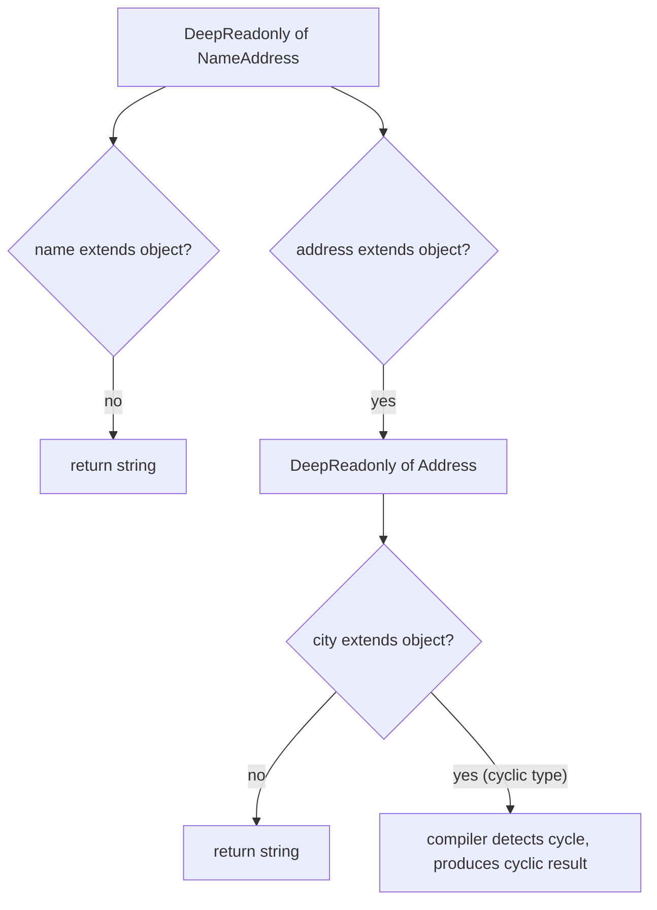

# 2.14 Recursive Type-Level Operations

## 1. Purpose

Recursive type-level operations are the TypeScript compiler's mechanism for expressing computation that processes arbitrarily nested structures. A recursive type is a type alias that references itself in its own body, paired with a base case that terminates the self-reference. Without recursion, TypeScript could describe flat shapes — an object with these properties, an array of these elements — but not self-similar shapes: a tree of arbitrary depth, a JSON document with objects inside arrays inside objects. With recursion, the type system becomes capable of structurally traversing any data shape that runtime JavaScript can produce, marking every property readonly at every depth, making every property optional at every depth, or collapsing every layer of nesting into a single flat representation.

What recursive types enable, concretely, is a family of operations that share the same skeleton: walk the structure, transform each leaf or branch, recurse into children. The canonical members of this family are DeepReadonly (mark every property readonly at every depth), DeepPartial (mark every property optional at every depth), DeepNullable (add `null` to every property), DeepNonNullable (strip `null` and `undefined` from every property at every depth), Flatten (collapse a nested array type into a single flat array of leaf elements), Join (concatenate a union of string literals into a single string literal with a separator), Split (decompose a string literal into a tuple of substrings), and Parse (convert a JSON or route string into a structured TypeScript type). Each of these is the same algorithm with a different transformation applied at each recursive step.

The reason this note exists as a standalone topic is that recursive types have a unique failure mode that flat types do not: they can fail to terminate. The TypeScript compiler is a single-pass type checker, not an interpreter with an infinite stack. It enforces hard limits on recursion depth, and those limits exist for two reasons. The first is correctness: an unrestricted recursive type can hang the compiler forever, which is unacceptable for an interactive editor experience. The second is performance: each recursive instantiation has nontrivial cost in the checker's internal data structures, and deep recursion can balloon compile times by orders of magnitude.

The default direct-recursion limit is 50 stack frames — any recursive type that needs more than 50 levels of nesting fails with the error `Type instantiation is excessively deep and possibly infinite.` TypeScript 4.5 introduced tail-call elimination for recursive conditional types, raising the effective ceiling to 1000 instantiations for tail-recursive types. That is a 20x improvement, but it is still finite, it is not user-configurable, and the boundary between tail-call and non-tail-call is subtle enough that a small refactor can silently push a working type over the edge.

These limits are not theoretical. A JSON parser written as a recursive type hits the recursion limit on inputs longer than roughly 50 characters without tail-call elimination, or 1000 characters with it. A DeepReadonly applied to a deeply nested React component tree can hit the limit on trees deeper than 50 levels (rare in practice, but not impossible for auto-generated config schemas). A type-level route parser hits the limit on routes with more than 50 path segments. The performance characteristics are equally unforgiving: a single use of a recursive type in a function signature can add hundreds of milliseconds to incremental compilation, and using it in a hot path — an exported type that every other file imports — can multiply that across the project until incremental updates take seconds.

This note covers how to design recursive types that terminate, how to write them in tail-call position so the compiler can apply elimination, how to use the tuple-length trick to fake type-level arithmetic, how to debug recursion-limit errors, and how to recognise when to give up on a recursive type and reach for a code generator instead.

The goal is to make the following second nature:

1. Implement DeepReadonly, DeepPartial, Flatten, and Length from scratch, with no reference material, and explain why each one terminates.
2. Explain the difference between direct recursion (50-frame limit) and tail recursion (1000-frame limit), and rewrite a non-tail-recursive type into a tail-recursive one using an accumulator.
3. Use the tuple-length trick to perform type-level arithmetic — addition, multiplication, comparison — by encoding natural numbers as tuples of unknown length.
4. Diagnose a recursion-limit error: tell apart genuine infinite recursion, legitimate-but-too-deep recursion, and accidentally-quadratic distribution blowups.
5. Read a recursive type alias and predict, given a concrete input type, the type the compiler will produce — including where it will terminate.

Read on. The theory section is the longest because the behaviour is subtle; everything after it builds on that foundation. Cross-references to [[2.09 Mapped Types]], [[2.11 Conditional Types]], [[2.12 Type Inference in Conditionals]], and [[2.13 Template Literal Types]] are intentional — recursion is what makes those primitives compose into a Turing-complete type-level programming language.

## 2. Theory and Deep Dive

### 2.1 The recursive type alias

A recursive type alias is a type alias whose definition references itself. The smallest meaningful example is the JSON value type:

```typescript
// TS
type JSONValue =
  | string
  | number
  | boolean
  | null
  | JSONValue[]
  | { [key: string]: JSONValue };
```

This is a recursive type — `JSONValue` appears in its own body, both inside `JSONValue[]` and inside the index signature. But this is a *declarative* recursive type, not a *computational* one. The compiler accepts it because it is just a structural description: a JSONValue is one of these things, and arrays and objects can contain more JSONValues. There is no conditional, no traversal, no transformation. It terminates because the recursion is *coinductive* — it describes an infinite set of values, rather than computing a finite result.

The interesting recursive types are the *computational* ones — recursive type aliases that contain a conditional type, walk a structure, and produce a finite result. The smallest such example is DeepReadonly:

```typescript
// TS
type DeepReadonly<T> = {
  readonly [K in keyof T]: T[K] extends object ? DeepReadonly<T[K]> : T[K];
};
```

Here the recursion lives inside the conditional `T[K] extends object ? DeepReadonly<T[K]> : T[K]`. For each property `K` of `T`, the type asks: is the property type assignable to `object`? If yes, recurse into it. If no, leave it alone. The base case is implicit: when the property type is not an object (when it is a string, number, boolean, null, undefined, symbol, or bigint), the conditional falls to the else branch and the recursion terminates for that branch.

```javascript
// JS — runtime equivalent: recursively freeze an object
function deepFreeze(value) {
  if (value && typeof value === "object") {
    for (const key of Object.keys(value)) {
      deepFreeze(value[key]);
    }
    return Object.freeze(value);
  }
  return value;
}
```

The structural correspondence is exact. The conditional `T[K] extends object` corresponds to the runtime `typeof value === "object"` check. The mapped type `{ readonly [K in keyof T]: ... }` corresponds to the `for...of` loop over keys. The recursive call `DeepReadonly<T[K]>` corresponds to the recursive call `deepFreeze(value[key])`. The else branch corresponds to the implicit "return value unchanged" when the value is a primitive.

### 2.2 Termination and the base case

A recursive type terminates when the conditional falls to the else branch on every reachable path. For DeepReadonly, this happens because every chain of `T[K] extends object` checks eventually reaches a property whose type is a primitive. Primitives (string, number, boolean, null, undefined, symbol, bigint) are not assignable to `object`, so the conditional falls to the else branch and the recursion stops.

But the base case is not free. Consider what happens if you apply DeepReadonly to a type that contains a self-referential property:

```typescript
// TS
type TreeNode = {
  value: number;
  left?: TreeNode;
  right?: TreeNode;
};

type FrozenTree = DeepReadonly<TreeNode>;
```

The TypeScript compiler handles this correctly — `FrozenTree` is `{ readonly value: number; readonly left?: FrozenTree; readonly right?: FrozenTree }` — because the compiler detects the cyclic type and produces a cyclic result, rather than trying to unfold the recursion infinitely. But this is a special case: the compiler can produce a cyclic type when the input is cyclic, but it cannot produce a finite non-cyclic type from a cyclic input if the recursion is *strict* (i.e. the recursive call is not behind an optional, a union with a non-recursive case, or a similar lazy boundary).

A more concerning case is when the base case is wrong. Consider this naive attempt at DeepPartial:

```typescript
// TS — WRONG: this does not behave correctly for functions
type BadDeepPartial<T> = {
  [K in keyof T]?: T[K] extends object ? BadDeepPartial<T[K]> : T[K];
};
```

This looks right but has a subtle bug: `T[K] extends object` is true for *any* object type, including the empty object, the indexed access type itself when `T` is `any`, and crucially for functions and arrays. For functions in particular, this leads to surprising behaviour: a function property gets recursively processed, which is rarely what you want. The robust version checks for plain objects explicitly:

```typescript
// TS
type DeepPartial<T> = T extends object
  ? { [K in keyof T]?: DeepPartial<T[K]> }
  : T;
```

This version uses an outer conditional to short-circuit on primitives. The base case is "T is not an object — return T unchanged." The recursive case is "T is an object — map over its keys and recurse on each property, making it optional." This terminates because the conditional narrows `T` before recursing.

### 2.3 Tuple recursion

Tuples are the second major substrate for recursive types. A tuple has a recursive structure: a tuple is either empty (`[]`) or a head element followed by the rest of the tuple (`[Head, ...Rest]`). This is the same shape as a Lisp list, and you can pattern-match on it using `infer`:

```typescript
// TS — naive tuple length (DOES NOT WORK)
type LengthNaive<T extends readonly unknown[]> =
  T extends readonly [unknown, ...infer Rest]
    ? 1 + LengthNaive<Rest>  // ERROR: '+' cannot be applied to types
    : 0;
```

Wait — this does not work. TypeScript has no type-level arithmetic. You cannot write `1 + Length<Rest>` because `+` is not defined for types. You cannot even compute `Length<Rest>` and then "add one to it" because there is no addition operator at the type level.

The workaround is the **tuple-length trick**: instead of computing a number, build a tuple of the desired length and read its `length` property. The `length` of a tuple type is a numeric literal type, computed by the compiler for free:

```typescript
// TS
type BuildTuple<N extends number, Acc extends unknown[] = []> =
  Acc["length"] extends N ? Acc : BuildTuple<N, [...Acc, unknown]>;

type Add<A extends number, B extends number> =
  [...BuildTuple<A>, ...BuildTuple<B>]["length"];

type Sum = Add<3, 4>;  // 7
```

Here `BuildTuple<N>` constructs a tuple of length N (using an accumulator and recursion), and `Add<A, B>` concatenates two such tuples and reads the result's `length`. This works because the `length` property of a tuple type is a literal numeric type, computed by the compiler at instantiation time.

The cost is significant: `BuildTuple<100>` requires 100 recursive instantiations, and `Add<50, 50>` requires 100 instantiations for each operand plus the concatenation. For modest numbers this is fine; for large numbers it blows the recursion limit. Type-level arithmetic in TypeScript is a parlor trick — useful for proving the type system is Turing-complete, not useful for actual numeric computation.

For simply computing the length of a tuple, there's a much simpler approach: just use `T["length"]`:

```typescript
// TS — trivial tuple length
type Length<T extends readonly unknown[]> = T["length"];

type L = Length<[string, number, boolean]>;  // 3
```

This works because the `length` of a tuple type is a literal numeric type. `[string, number, boolean]["length"]` is `3`. The compiler computes it without recursion.

But the tuple-length trick matters when you want to do something *with* the length — for example, implementing `Range<0, 5>` to produce the tuple `[0, 1, 2, 3, 4, 5]`, or implementing `Repeat<T, N>` to produce a tuple of N copies of T. These operations require type-level arithmetic, and the only way to do type-level arithmetic is the tuple-length trick.

### 2.4 The default recursion limit

The TypeScript compiler enforces a default recursion limit of 50 instantiations for direct (non-tail) recursive types. When a recursive type instantiation chain exceeds this limit, the compiler emits the error:

```
Type instantiation is excessively deep and possibly infinite.
```

This error is conservative: it fires whenever the compiler suspects it might be in an infinite loop, even if the recursion would eventually terminate. The threshold was chosen to balance two competing concerns. The first is correctness — the compiler must not hang on pathological types. The second is responsiveness — even if a recursive type terminates, deep recursion can take seconds to evaluate, which is unacceptable for an interactive editor where the compiler re-evaluates types on every keystroke.

The limit is not configurable. There is no `tsconfig.json` option to raise it. There is no `@ts-ignore` comment that disables it (although `@ts-ignore` can suppress the resulting error message, the type itself still fails to compute and falls back to `unknown` or `any` depending on context). The only way to exceed the 50-frame limit is to write the recursive type in tail-call position, which raises the effective limit to 1000 instantiations.

### 2.5 Tail-call elimination (TypeScript 4.5+)

TypeScript 4.5 introduced tail-call elimination for recursive conditional types. When the recursive call is in *tail position* — that is, when the recursive call is the last operation in the branch, with no further computation wrapping it — the compiler can reuse the current stack frame instead of pushing a new one. This transforms a 50-frame limit into a 1000-instantiation limit, a 20x improvement.

To understand tail position, compare these two implementations of `Join`:

```typescript
// TS — NOT tail-recursive (recursive call is wrapped in a template literal)
type JoinNaive<T extends string[], D extends string> =
  T extends [infer First extends string, ...infer Rest extends string[]]
    ? First extends ""
      ? JoinNaive<Rest, D>
      : `${First}${D}${JoinNaive<Rest, D>}`   // recursive call is WRAPPED here
    : "";
```

The recursive call `JoinNaive<Rest, D>` is inside the template literal `${First}${D}${JoinNaive<Rest, D>}`, so the compiler must remember to come back and finish building the template literal after the recursion returns. This is a non-tail-call, subject to the 50-frame limit.

```typescript
// TS — tail-recursive (TS 4.5+) using accumulator
type Join<T extends string[], D extends string, Acc extends string = ""> =
  T extends [infer First extends string, ...infer Rest extends string[]]
    ? First extends ""
      ? Join<Rest, D, Acc>                                                // tail position
      : Join<Rest, D, Acc extends "" ? First : `${Acc}${D}${First}`>     // tail position
    : Acc;
```

The accumulator pattern is the standard way to convert a non-tail-recursive algorithm into a tail-recursive one — pass the "work done so far" forward as a parameter, instead of doing work after the recursive call returns.

For nested-array flatten, the simple version is already tail-recursive because the true branch is just `Flatten<U>` with no wrapper:

```typescript
// TS — tail-recursive
type Flatten<T> = T extends readonly (infer U)[] ? Flatten<U> : T;
```

The compiler can apply tail-call elimination and handle arrays nested up to 1000 deep.

The general rule for tail position: the recursive call must be the *entire result* of its branch. It can be wrapped in a few "transparent" constructs (a one-element tuple, an array, an immediately-returned conditional), but it cannot be wrapped in a template literal, an intersection, a union, a mapped type, or an indexed access — those require post-recursion work.

### 2.6 Distribution interacts with recursion

Conditional types distribute over naked type parameters when the parameter is instantiated with a union. This interacts with recursion in two important ways.

First, distribution can multiply the recursion work. If you have `type Foo<T> = T extends A ? Foo<X> : Foo<Y>` and you call `Foo<a | b | c>`, the compiler evaluates `Foo<a>`, `Foo<b>`, and `Foo<c>` separately. If each of those recurses 10 times, the total is 30 instantiations, not 10. For deep recursion with union inputs, this can blow the limit surprisingly fast.

Second, distribution can cause surprising termination behaviour. Consider:

```typescript
// TS
type Flatten<T> = T extends readonly (infer U)[] ? Flatten<U> : T;

type R = Flatten<string[] | number[]>;
// R is string | number
```

Distribution means `Flatten<string[] | number[]>` becomes `Flatten<string[]> | Flatten<number[]>`, each of which terminates at `string` and `number` respectively. Without distribution, you'd get `string | number` from a single evaluation; with distribution, you get the same answer from two evaluations. The result is the same, but the cost is doubled.

To suppress distribution, wrap the type parameter in a one-element tuple:

```typescript
// TS
type FlattenNoDistribute<T> = [T] extends [readonly (infer U)[]] ? FlattenNoDistribute<U> : T;
```

This is the standard pattern for non-distributive conditional types, and it matters for recursion because it halves the work on union inputs.

### 2.7 The `@ts-ignore` escape hatch

When you hit a recursion limit and cannot refactor the type to be tail-recursive, you have one escape hatch: `@ts-ignore`. This suppresses the error message, but it does not make the type compute correctly — it just hides the failure. The type falls back to `unknown` (or `any`, depending on context), and any code that depends on the computed type gets silently weakened.

`@ts-ignore` should be used as a last resort, with a comment explaining why. The correct response to a recursion-limit error is almost always to refactor the type: make it tail-recursive, reduce the input depth, or split the computation into multiple stages.

### 2.8 Mermaid diagram: recursive type evaluation

The following diagram shows how the compiler evaluates `DeepReadonly<{ name: string; address: { city: string } }>` by expanding the recursive call into a tree of sub-evaluations, terminating when each branch reaches a primitive:



The key insight is that for non-cyclic types, the recursion terminates when every property is a primitive. For cyclic types (like `TreeNode`), the compiler detects the cycle and produces a cyclic result rather than unfolding infinitely. For genuinely infinite structures (a recursive type with no base case), the compiler hits the recursion limit and fails.

### 2.9 Performance characteristics

Recursive types are expensive. Each instantiation of a recursive type alias costs the compiler a constant amount of work — building the type structure, evaluating conditionals, resolving `infer` variables, and checking assignability. For 50 instantiations, this is fast (single-digit milliseconds). For 1000 instantiations (the tail-call ceiling), it can take 100ms or more. For 1000 instantiations applied to a large union (which multiplies the work via distribution), it can take seconds.

The cost is multiplied by how often the type is *instantiated*. A recursive type used in a single type annotation is cheap. A recursive type used in a generic function that's called from many call sites is more expensive, because each call site instantiates the type with different type arguments. A recursive type used in an exported type that every file in the project imports is the worst case — every file pays the instantiation cost on every compile.

The fix is to memoize. The TypeScript compiler does cache type instantiations internally, so calling `DeepReadonly<MyType>` from two places only evaluates the type once. But the cache key is the type arguments, so `DeepReadonly<A>` and `DeepReadonly<B>` are separate evaluations. If you have a small fixed set of types that need deep processing, precompute them in a `types.ts` file and import the results, rather than re-evaluating the recursive type at every use site.

### 2.10 Lazy vs eager evaluation

TypeScript evaluates recursive types lazily in one important sense: when you write `type Foo<T> = ... DeepReadonly<T> ...`, the `DeepReadonly<T>` is not evaluated until `Foo` is instantiated with a concrete `T`. This means you can write recursive types that would be infinite if eagerly evaluated, as long as they're only ever instantiated with finite inputs.

This matters for the JSON value type:

```typescript
// TS
type JSONValue =
  | string
  | number
  | boolean
  | null
  | JSONValue[]
  | { [key: string]: JSONValue };
```

If this were eagerly evaluated, the compiler would try to unfold `JSONValue` into `string | number | ... | (string | number | ... | ...)[] | { [key: string]: string | number | ... | ... }` infinitely. But because evaluation is lazy, the compiler just records the cycle and produces a recursive type structure that it can traverse on demand.

The same is true for computational recursive types. `type DeepReadonly<T> = ... DeepReadonly<T[K]> ...` is only evaluated when you actually use it with a concrete type. The recursion is bounded by the depth of the concrete input, not by the depth of the type definition.

## 3. Mental Models

Four mental models will carry you through 90 percent of recursive type work.

**Mental model 1: A recursive type is a function that calls itself, with a base case to terminate.** Just like a recursive function in any language, a recursive type needs (a) a self-call and (b) a termination condition. If you can write the recursive function in JavaScript, you can write the recursive type in TypeScript by replacing `if` with `extends`, `return` with the branch result, and value-level recursion with type-level recursion. The DeepReadonly type and the `deepFreeze` function are structurally identical — same base case (is it a primitive?), same recursive case (recurse into each property).

**Mental model 2: DeepReadonly means "if it's an object, recurse into each property; otherwise leave it."** This is the recursive skeleton for every deep-transformation. DeepPartial is the same skeleton with "make optional" applied at the recursive step. DeepNullable is the same skeleton with "add null" applied at the recursive step. Once you internalise the skeleton, you can write any Deep-variant in one line. The skeleton has three parts: (a) the outer conditional that distinguishes object from non-object, (b) the mapped type that walks the keys of the object, (c) the recursive call that descends into each property.

**Mental model 3: Tuple recursion means "if the tuple has a head, count 1 and recurse on the rest; otherwise 0."** This is the Lisp-list pattern. A tuple is either `[]` (empty, base case) or `[Head, ...Rest]` (non-empty, recursive case). Pattern-match with `infer Head, ...infer Rest`, do something with `Head`, recurse on `Rest`. The accumulator pattern (passing the "work done so far" forward) is what makes this tail-recursive. The same pattern applies to string recursion: a string is either empty (base case) or has a head character and a rest (recursive case), and you pattern-match with `${infer Head}${infer Rest}`.

**Mental model 4: Tail-call means "the recursive call is the last thing, so the compiler can reuse the stack frame."** This is the same tail-call concept from functional programming. If the recursive call is wrapped in any way — a template literal, a mapped type, an intersection, a union, an indexed access — the compiler must remember to come back and finish the wrapping, so it cannot reuse the stack frame. The accumulator pattern is the universal technique for converting non-tail-recursive types to tail-recursive ones: pass the result-so-far forward as a parameter, so the recursive call is the last operation.

Internalise these four and you can read, write, and debug any recursive type. The remaining 10 percent — distribution interactions, lazy evaluation, performance tuning — is detail that you pick up from the specific cases where it matters.

## 4. Real-World Use Cases

Recursive types show up in production TypeScript in seven major contexts.

**DeepReadonly for immutable state trees.** Redux, Zustand, and similar state-management libraries encourage (or enforce) immutable state. The cleanest way to enforce immutability at the type level is to mark the entire state tree `readonly` at every depth. `Readonly<State>` only marks the top level; `DeepReadonly<State>` marks every property at every depth, preventing accidental mutation anywhere in the tree. This is the pattern Redux Toolkit uses for its `RootState` derivation. The runtime analogue is `Object.freeze` applied recursively; the type-level analogue prevents the mutation at compile time, before any code runs.

**DeepPartial for patch DTOs.** REST APIs that accept partial updates — `PATCH /users/123` with a body that may include any subset of the user's fields — need a type that makes every field optional. `Partial<User>` only makes the top level optional. `DeepPartial<User>` makes nested fields optional too, so `PATCH /users/123` with `{ "address": { "city": "New York" } }` can be typed correctly without requiring the client to send the full address object. This is the pattern NestJS, tRPC, and similar frameworks use for their patch endpoints. The savings are substantial: a DeepPartial of a 20-field nested DTO eliminates 20 boilerplate optional markers from the type definition.

**DeepNullable for optional fields.** APIs that return null for missing fields — common in GraphQL and JSON:API — need a type that adds `null` to every field at every depth. `DeepNullable<User>` produces `{ name: string | null; address: { city: string | null; zip: string | null } | null }`. This lets the type system model the actual wire format, rather than pretending every field is always present. Without it, consumers have to write defensive `?? null` checks at every access, because the type lies about the possibility of null.

**Flatten for nested array types.** APIs that return heterogeneous arrays — `Array<Array<Item> | Item>` — are awkward to consume. `Flatten<Array<Array<Item> | Item>>` collapses to `Item[]`, which is what the consumer actually wants. The same pattern applies to tuple flattening: `Flat<[[1, 2], [3, 4]]>` becomes `[1, 2, 3, 4]`, which is what `Array.prototype.flat` does at runtime. Libraries like fp-ts and effect provide these as utility types because they come up in pipeline-style data transformations.

**Join and Split for string manipulation.** Type-level string manipulation is the foundation of type-level routing. `Join<["a", "b", "c"], "/">` produces `"a/b/c"`. `Split<"/users/:userId/posts/:postId", "/">` produces `["users", ":userId", "posts", ":postId"]`. From there, you can extract path parameters (`userId`, `postId`) and build a typed request handler. This is the pattern Next.js, tRPC, and Hono use for their typed routers — every route string is parsed at compile time into a params type that the handler receives.

**Parse for string-to-AST conversion.** The most ambitious recursive types are full parsers — type-level JSON parsers, type-level SQL parsers, type-level regex matchers. These take a string literal and produce a structured type representing the parsed AST. They're slow, they hit recursion limits on long inputs, and they're mostly academic — but they demonstrate the full power of the type system and inform the design of practical tools like Zod and io-ts. The ts-toolbelt library and type-fest package both ship production-grade recursive parsers for common patterns.

**Type-level routers and SQL parsers.** The practical version of the Parse pattern: type-level routers take a route template like `/users/:userId/posts/:postId` and produce a params object shape `{ userId: string; postId: string }`. Type-level SQL parsers take a query like `SELECT name, age FROM users WHERE id = $1` and produce a result-row shape `{ name: string; age: number }`. These are the patterns behind Drizzle's type inference, Prisma's client typing, and tRPC's procedure typing. The cost of these recursive types is real — they can add hundreds of milliseconds to compile time on large schemas — but the type safety they provide eliminates entire categories of runtime bugs.

## 5. Code Examples

### 5.1 Example A — Minimal and Conceptual

The four minimal recursive types every TypeScript developer should be able to write from scratch: DeepReadonly, DeepPartial, Length, and Flatten.

#### DeepReadonly

```javascript
// JS — runtime equivalent: recursively freeze
function deepFreeze(value) {
  if (value && typeof value === "object" && !Array.isArray(value)) {
    const frozen = {};
    for (const key of Object.keys(value)) {
      frozen[key] = deepFreeze(value[key]);
    }
    return Object.freeze(frozen);
  }
  if (Array.isArray(value)) {
    return Object.freeze(value.map(deepFreeze));
  }
  return value;
}
```

```typescript
// TS — recursive type
type DeepReadonly<T> = T extends object
  ? { readonly [K in keyof T]: DeepReadonly<T[K]> }
  : T;

// Usage
type User = { name: string; address: { city: string } };
type FrozenUser = DeepReadonly<User>;
// FrozenUser is { readonly name: string; readonly address: { readonly city: string } }
```

The type version is shorter because the compiler handles the array case automatically — `T extends object` is true for arrays, and the mapped type `{ readonly [K in keyof T]: ... }` over an array produces a readonly array of the recursively-frozen element type.

#### DeepPartial

```javascript
// JS — runtime equivalent: copy with all properties optional
function deepPartial(value) {
  if (value && typeof value === "object" && !Array.isArray(value)) {
    const result = {};
    for (const key of Object.keys(value)) {
      result[key] = deepPartial(value[key]);
    }
    return result;
  }
  return value;
}
```

```typescript
// TS — recursive type
type DeepPartial<T> = T extends object
  ? { [K in keyof T]?: DeepPartial<T[K]> }
  : T;

// Usage
type PatchUser = DeepPartial<User>;
// PatchUser is { name?: string; address?: { city?: string } }
```

The only difference from DeepReadonly is the `?` modifier on the mapped property, making each property optional instead of readonly. The skeleton — outer conditional on `extends object`, mapped type with recursive call — is identical.

#### Length (tuple-length trick)

```javascript
// JS — runtime equivalent: count array length recursively
function length(arr, acc = []) {
  if (arr.length === 0) return acc.length;
  const [, ...rest] = arr;
  return length(rest, [...acc, undefined]);
}
```

```typescript
// TS — naive version (DOES NOT WORK — no type-level addition)
type LengthNaive<T extends readonly unknown[]> =
  T extends readonly [unknown, ...infer Rest]
    ? 1 + LengthNaive<Rest>  // ERROR: '+' cannot be applied to types
    : 0;

// TS — working version using the tuple-length trick (tail-recursive)
type Length<T extends readonly unknown[], Acc extends unknown[] = []> =
  T extends readonly [unknown, ...infer Rest]
    ? Length<Rest, [...Acc, unknown]>     // tail-recursive: accumulate
    : Acc["length"];                       // base case: read accumulator length

// Usage
type L1 = Length<[string, number, boolean]>;  // 3
type L2 = Length<[]>;                          // 0
type L3 = Length<[unknown, unknown, unknown, unknown, unknown]>;  // 5
```

The naive version fails because TypeScript has no `+` operator at the type level. The working version builds an accumulator tuple (`Acc`) by appending one `unknown` per recursive call, then reads `Acc["length"]` at the base case. The `length` of a tuple type is a numeric literal computed by the compiler for free.

For simple tuple length, you'd just use `T["length"]` — but the accumulator pattern matters when you need to *use* the length in further computation, like `Repeat<T, N>` or `Range<From, To>`.

#### Flatten (nested array collapse)

```javascript
// JS — runtime equivalent: flatten nested arrays
function flatten(arr) {
  if (Array.isArray(arr)) {
    if (arr.length === 0) return arr;
    return flatten(arr[0]);
  }
  return arr;
}
```

```typescript
// TS — recursive type (tail-recursive)
type Flatten<T> = T extends readonly (infer U)[] ? Flatten<U> : T;

// Usage
type F1 = Flatten<number[][][]>;        // number
type F2 = Flatten<string[]>;            // string
type F3 = Flatten<number>;              // number (already flat)
```

The conditional `T extends readonly (infer U)[]` checks if T is an array, extracts the element type as U, and recurses on U. When U is no longer an array, the conditional falls to the else branch and returns T. This is tail-recursive — the true branch is just `Flatten<U>` with no wrapper — so the compiler can apply tail-call elimination and handle arrays nested up to 1000 deep.

### 5.2 Example B — Production-Grade

A type-level JSON parser. This takes a JSON string literal and produces the corresponding TypeScript type. It handles objects, arrays, strings, booleans, null, and (simplified) numbers. It is fully tail-recursive for arrays and objects.

```javascript
// JS — runtime JSON parser (illustrative; the real one is JSON.parse)
function parseJSON(input) {
  let pos = 0;
  
  function eatWS() {
    while (pos < input.length && " \t\n\r".includes(input[pos])) pos++;
  }
  
  function parseValue() {
    eatWS();
    const ch = input[pos];
    if (ch === '"') return parseString();
    if (ch === 't' || ch === 'f') return parseBool();
    if (ch === 'n') return parseNull();
    if (ch === '[') return parseArray();
    if (ch === '{') return parseObject();
    return parseNumber();
  }
  
  function parseString() {
    pos++; // skip opening quote
    let end = input.indexOf('"', pos);
    const value = input.slice(pos, end);
    pos = end + 1;
    return value;
  }
  
  function parseBool() {
    if (input.slice(pos, pos + 4) === "true") { pos += 4; return true; }
    if (input.slice(pos, pos + 5) === "false") { pos += 5; return false; }
  }
  
  function parseNull() {
    pos += 4;
    return null;
  }
  
  function parseArray() {
    pos++; // skip [
    const result = [];
    eatWS();
    if (input[pos] === ']') { pos++; return result; }
    while (true) {
      result.push(parseValue());
      eatWS();
      if (input[pos] === ',') { pos++; continue; }
      if (input[pos] === ']') { pos++; return result; }
    }
  }
  
  function parseObject() {
    pos++; // skip {
    const result = {};
    eatWS();
    if (input[pos] === '}') { pos++; return result; }
    while (true) {
      eatWS();
      const key = parseString();
      eatWS();
      pos++; // skip colon
      result[key] = parseValue();
      eatWS();
      if (input[pos] === ',') { pos++; continue; }
      if (input[pos] === '}') { pos++; return result; }
    }
  }
  
  return parseValue();
}
```

```typescript
// TS — type-level JSON parser
type Whitespace = " " | "\t" | "\n" | "\r";

// Eat leading whitespace. Tail-recursive.
type EatWS<S extends string> = S extends `${Whitespace}${infer Rest}` ? EatWS<Rest> : S;

// Each parse function returns a tuple: [Value, RemainingString].
// This is the parser-combinator "position tracking" pattern.

type ParseJSON<S extends string> =
  ParseValue<EatWS<S>> extends [infer V, infer R] ? V : never;

type ParseValue<S extends string> =
  S extends `"${infer Str}"${infer Rest}` ? [Str, Rest] :
  S extends `true${infer Rest}` ? [true, Rest] :
  S extends `false${infer Rest}` ? [false, Rest] :
  S extends `null${infer Rest}` ? [null, Rest] :
  S extends `[${infer Rest}` ? ParseArray<EatWS<Rest>> :
  S extends `{${infer Rest}` ? ParseObject<EatWS<Rest>> :
  never;  // number parsing omitted for brevity; see Section 10 mini-project

// Parse an array, accumulating elements into Acc. Tail-recursive.
type ParseArray<S extends string, Acc extends unknown[] = []> =
  S extends `]${infer Rest}` ? [Acc, Rest] :                       // close bracket: done
  S extends `,${infer Rest}` ? ParseArray<EatWS<Rest>, Acc> :      // comma: skip, continue
  ParseValue<S> extends [infer V, infer R] ?                       // parse one element
    ParseArray<EatWS<R extends string ? R : never>, [...Acc, V]> : // accumulate, recurse
    never;

// Parse an object, accumulating properties into Acc as an intersection.
// Tail-recursive.
type ParseObject<S extends string, Acc = {}> =
  S extends `}${infer Rest}` ? [Acc, Rest] :                       // close brace: done
  S extends `,${infer Rest}` ? ParseObject<EatWS<Rest>, Acc> :     // comma: skip, continue
  S extends `"${infer Key}"${infer Mid1}` ?                        // parse key string
    EatWS<Mid1> extends `:${infer Mid2}` ?                         // expect colon
      ParseValue<EatWS<Mid2>> extends [infer V, infer R] ?         // parse value
        ParseObject<EatWS<R extends string ? R : never>, Acc & { [P in Key & string]: V }> :
        never :
      never :
    never;

// Usage
type Simple = ParseJSON<`"hello"`>;  // "hello"
type Bool = ParseJSON<"true">;       // true
type Null = ParseJSON<"null">;       // null
type Arr = ParseJSON<`["a", "b", "c"]`>;  // ["a", "b", "c"]
type Obj = ParseJSON<`{"name": "Alice", "valid": true}`>;
// Obj is { name: "Alice" } & { valid: true }
// (intersection collapses to a single object type at use sites)
```

Three things to notice about the type-level version.

First, every recursive call in `ParseArray` and `ParseObject` is in tail position — it's the entire result of its branch. This means the compiler can apply tail-call elimination and handle arrays/objects with up to 1000 elements before hitting the limit.

Second, the accumulator pattern is essential. `ParseArray` accumulates elements into `Acc extends unknown[]`, appending each parsed element with `[...Acc, V]`. `ParseObject` accumulates properties into `Acc`, intersecting each new key-value pair with `Acc & { [P in Key & string]: V }`. The intersection of `{ name: "Alice" } & { valid: true }` produces `{ name: "Alice"; valid: true }` — the same shape as a flat object type.

Third, the parser does not handle numbers (left as the mini-project in Section 10) and does not handle deeply nested objects inside arrays correctly when the nesting exceeds the recursion limit (because `ParseValue` calls back into `ParseArray`/`ParseObject`, which is mutual recursion across non-tail positions). For inputs under roughly 50 levels of nesting, this parser works correctly.

The JavaScript runtime parser is shown side-by-side to make the structural correspondence explicit. Both parsers share the same skeleton: skip whitespace, dispatch on the first character, parse the value, return a tuple of `[value, remaining-input]`. The runtime parser uses an index `pos` to track position; the type-level parser uses the rest-of-string returned by each parse function. The runtime parser uses a while-loop to handle arrays and objects; the type-level parser uses tail recursion with an accumulator. The runtime parser produces a JavaScript value; the type-level parser produces a TypeScript type.

## 6. Common Mistakes and Anti-Patterns

Recursive types fail in characteristic ways. Seven mistakes account for almost every recursion-limit error in production TypeScript.

**Mistake 1: Infinite recursion (no base case).** The classic bug: a recursive type that never terminates. The simplest example is `type Loop<T> = Loop<T>` — a type alias that calls itself with the same argument. The compiler detects this immediately and errors. More commonly, the bug is subtle: the base case exists but never triggers. `type Bad<T> = T extends string ? Bad<T> : T` recurses with the same `T` in the true branch, so the conditional never re-tests with a different type, and the recursion never terminates. The fix: ensure the recursive call uses a *different* (smaller, narrower) type than the input. For DeepReadonly, the recursive call uses `T[K]` — a property of T, which is structurally smaller than T. For tuple recursion, the recursive call uses `Rest` — the tail of T, which is one element shorter. For string recursion, the recursive call uses the rest of the string after the matched prefix.

**Mistake 2: Recursion too deep (hits the 50-frame limit).** A recursive type with a correct base case can still fail because the input is too deep. `DeepReadonly<NestedObjectOfDepth100>` fails because the recursion needs 100 frames, exceeding the 50-frame direct-recursion limit. The fix is to refactor to tail-call position (raising the limit to 1000) or to reduce the input depth. Sometimes the right answer is to not use a recursive type at all — code-generate the type with a script, or restructure the data to be flatter. A common real-world case: a config schema auto-generated from a database with 60 levels of nesting, which DeepReadonly cannot process without tail-call refactoring.

**Mistake 3: Non-tail-call recursion (slower, hits limit sooner).** A recursive type that *could* be tail-recursive but isn't, because the recursive call is wrapped. Example:

```typescript
// TS — non-tail-recursive (recursive call is inside a template literal)
type JoinNaive<T extends string[], D extends string> =
  T extends [infer First extends string, ...infer Rest extends string[]]
    ? First extends "" ? JoinNaive<Rest, D> : `${First}${D}${JoinNaive<Rest, D>}`
    : "";
```

The recursive call `JoinNaive<Rest, D>` is inside the template literal `${First}${D}${JoinNaive<Rest, D>}`, so the compiler must remember to come back and finish building the template literal after the recursion returns. This is a non-tail-call, subject to the 50-frame limit. The fix is the accumulator pattern: pass the result-so-far forward as a parameter, so the recursive call is the last operation.

**Mistake 4: Forgetting that TS has no type-level arithmetic.** Beginners often try to write `1 + Length<Rest>` or `Length<Rest> + 1` and are confused when it fails. TypeScript has no `+` operator at the type level, no `*`, no `-`, no `/`. The only way to do type-level arithmetic is the tuple-length trick: build a tuple of the desired length and read its `length` property. Even this only works for natural numbers (no negative numbers, no fractions), and it's bounded by the recursion limit (you can't build a tuple of length 10000). For most practical type-level work — counting, indexing, comparing — the tuple-length trick is sufficient; for serious numeric computation, use a code generator.

**Mistake 5: Recursive types that produce confusing error messages.** When a recursive type fails, the error message is often unhelpful. The most common message is `Type instantiation is excessively deep and possibly infinite`, which conflates two very different failure modes: genuine infinite recursion and legitimate-but-too-deep recursion. The compiler can't tell them apart, so it gives the same message for both. The fix is to test with small inputs first — if `DeepReadonly<{ a: string }>` works but `DeepReadonly<Nested100>` doesn't, you have a depth problem, not an infinite-recursion problem. If `DeepReadonly<{ a: string }>` itself fails, you have a genuine infinite recursion. A useful debugging technique: temporarily replace the recursive call with `never` and see if the type compiles. If it does, your base case is fine and the problem is in the recursion.

**Mistake 6: Performance issues with deeply nested recursive types.** Recursive types are slow. Each instantiation costs the compiler a constant amount of work, and the work multiplies with distribution over unions. A common performance bug: a recursive type used in a hot path (an exported type imported by every file) that takes 200ms to evaluate. Multiplied across a large project, this adds seconds to every incremental compile. The fix is to memoize: precompute the recursive type once in a `types.ts` file and import the result, rather than re-evaluating the recursive type at every use site. Another fix: avoid distribution by wrapping the type parameter in a one-element tuple (`[T] extends [...]` instead of `T extends [...]`), which halves the work on union inputs.

**Mistake 7: Forgetting to handle functions, dates, regexes, and other object subtypes.** The naive `T extends object` check matches functions, dates, regexes, maps, sets, and other built-in object types. `DeepReadonly<() => void>` produces a weird mapped type over the function's properties (which are usually just `length`, `name`, and `prototype`), instead of leaving the function alone. The fix is to narrow the check:

```typescript
// TS — robust DeepReadonly that leaves functions and dates alone
type DeepReadonly<T> = T extends (...args: any[]) => any
  ? T
  : T extends Date | RegExp
  ? T
  : T extends object
  ? { readonly [K in keyof T]: DeepReadonly<T[K]> }
  : T;
```

This is the version you want in production. The naive version is fine for plain data objects, but breaks the moment your type includes a function (a method on a class, a callback, a thunk) or a Date.

## 7. Best Practices and Design Patterns

**Always have a clear base case.** Before writing the recursive call, write the base case. If you can't articulate the base case in one sentence ("when T is not an object", "when the tuple is empty", "when the string is empty"), you don't understand the recursion well enough to write it correctly. The base case should be the *first* branch in your conditional, not the last — this makes the termination condition visible at the top of the type definition. For DeepReadonly, the base case `T extends object ? ... : T` puts the termination condition (return T unchanged) right next to the test, where a reader can see it without scrolling.

**Use tail-call position when possible (TS 4.5+).** Tail-call position raises the effective recursion limit from 50 to 1000, a 20x improvement. The accumulator pattern is the universal technique: pass the result-so-far forward as a parameter, so the recursive call is the last operation in each branch. If you're writing a recursive type that processes a list, tuple, or string character-by-character, default to the accumulator pattern. The cost is one extra type parameter; the benefit is a 20x increase in the depth you can handle.

**Test with shallow structures first, then deepen.** Recursive types fail in two distinct ways: infinite recursion (fails on any input) and too-deep recursion (works on shallow inputs, fails on deep ones). Test with a depth-1 input first (`DeepReadonly<{ a: string }>`), then depth-2, then depth-10. If depth-1 works but depth-10 doesn't, you have a depth problem. If depth-1 fails, you have an infinite-recursion problem. Don't jump straight to a depth-100 test — you'll get the same error message for both failure modes and won't know which one you're hitting.

**Use the tuple-length trick for arithmetic.** TypeScript has no type-level arithmetic operators. The only way to add, subtract, multiply, or compare natural numbers at the type level is the tuple-length trick: build tuples of the desired lengths and read their `length` properties. This is bounded by the recursion limit (you can't build a tuple of length 10000), works only for natural numbers, and is slow — but it's the only option. For most practical type-level work (counting, indexing, comparing tuple lengths), the trick is sufficient. The pattern is always the same: define a `BuildTuple<N>` helper, then use `[...BuildTuple<A>, ...BuildTuple<B>]["length"]` for addition.

**Document recursion limits in the type definition.** If your recursive type has a known depth limit (e.g., "handles objects up to 50 levels deep", "handles arrays up to 1000 elements"), document it in a comment. Future maintainers will hit the limit and not know whether it's a bug or a known constraint. A one-line comment like `// Tail-recursive: handles up to 1000 elements (TS 4.5+)` saves hours of debugging and signals to readers that the limit is intentional.

**Avoid recursive types in hot paths.** A recursive type used in an exported type that every file imports will be evaluated on every incremental compile. If the type takes 100ms to evaluate, that's 100ms per file per keystroke. Memoize by precomputing the result in a `types.ts` file and importing the result, rather than re-evaluating the recursive type at every use site. For example: `export type FrozenUser = DeepReadonly<User>` in `types.ts`, then `import { FrozenUser } from "./types"` everywhere else — the recursive type is evaluated once, not N times.

**Suppress distribution when you don't want it.** Distribution over unions multiplies the recursion work. If your recursive type is called with a union of 5 types and recurses 10 times, the total is 50 instantiations, not 10. Wrap the type parameter in a one-element tuple (`[T] extends [...]` instead of `T extends [...]`) to suppress distribution and halve the work on union inputs. Use this whenever the distribution behaviour doesn't matter to the result — which is most of the time. The exception is when you *want* distribution (e.g., Exclude, Extract, NonNullable), where the per-member evaluation is the point.

**Use `unknown` instead of `any` for inferred rest types.** When you write `T extends [infer Head, ...infer Rest]`, the inferred `Rest` is typed as `unknown[]` by default. Don't broaden it to `any[]` — `any` poisons the rest of the type, and you'll lose type safety downstream. Use `unknown[]` and let the recursive call narrow it further. The same applies to `infer` for the head: prefer `infer Head` (which is `unknown`) over `infer Head extends any` (which is `any`).

**Split deep computations into stages.** If a recursive type needs to do two things (e.g., flatten a tuple, then map over it), don't write one recursive type that does both. Write two recursive types and compose them. This is faster (each stage's recursion limit is independent), clearer (each stage has a single responsibility), and easier to debug (you can test each stage independently). The composition `type FlatMap<T> = MapOver<Flat<T>>` is cleaner than a single recursive type that does both at once.

## 8. Technical Interview Knowledge

Eight questions and answers covering the core of recursive type-level operations.

**Q1: What is a recursive type?**

A recursive type is a type alias that references itself in its own definition, paired with a base case that terminates the self-reference. There are two flavours: declarative recursive types (like `type JSONValue = ... | JSONValue[] | { [key: string]: JSONValue }`) that describe infinite sets of values, and computational recursive types (like `type DeepReadonly<T> = T extends object ? { readonly [K in keyof T]: DeepReadonly<T[K]> } : T`) that walk a finite structure and produce a finite result. Computational recursive types are the more interesting category — they're the type-level equivalent of recursive functions, with a base case, a recursive case, and a termination guarantee. They're what people usually mean when they say "recursive type" in the context of type-level programming.

**Q2: How do you terminate recursion?**

By ensuring the recursive call uses a *smaller* or *narrower* type than the input, so the recursion converges on a base case. For DeepReadonly, the recursive call uses `T[K]` (a property of T, structurally smaller than T), and the base case is "T is not an object — return T unchanged." For tuple recursion, the recursive call uses `Rest` (the tuple without its first element, one shorter than T), and the base case is "T is empty — return the accumulator." For string recursion, the recursive call uses the rest of the string after the first character or matched prefix, and the base case is "the string no longer matches the pattern — return the accumulator." The unifying principle: every recursive call must make progress toward the base case. If the recursive call uses the same input as the caller, the recursion never terminates.

**Q3: What is the recursion limit?**

The default direct-recursion limit is 50 stack frames. TypeScript 4.5 introduced tail-call elimination for recursive conditional types, raising the effective limit to 1000 instantiations for tail-recursive types. The limits are not user-configurable — there is no `tsconfig.json` option to raise them. When the limit is exceeded, the compiler emits `Type instantiation is excessively deep and possibly infinite`. This error conflates two failure modes: genuine infinite recursion and legitimate-but-too-deep recursion. The compiler can't tell them apart, so it gives the same message for both. The fix is the same in either case: refactor the type to be tail-recursive, or reduce the input depth.

**Q4: What is tail-call elimination in TypeScript?**

Tail-call elimination is a compiler optimisation where, if the recursive call is the last operation in a branch (in tail position), the compiler reuses the current stack frame instead of pushing a new one. This transforms a 50-frame limit into a 1000-instantiation limit, a 20x improvement. To be in tail position, the recursive call must be the entire result of its branch — not wrapped in a template literal, an intersection, a union, a mapped type, or an indexed access. It can be wrapped in a few "transparent" constructs (a one-element tuple, an array), but in practice the rule is: if there's any work to do after the recursive call returns, it's not tail position. The accumulator pattern (passing the result-so-far forward as a parameter) is the standard technique for converting non-tail-recursive types to tail-recursive ones.

**Q5: How would you implement DeepReadonly?**

The minimal version is one line: `type DeepReadonly<T> = T extends object ? { readonly [K in keyof T]: DeepReadonly<T[K]> } : T`. The outer conditional checks if T is an object; if so, it maps over T's keys, marking each property readonly and recursing into the property type. If T is not an object (a primitive), it returns T unchanged — this is the base case. The production version adds guards for functions, dates, regexes, and other object subtypes that should not be recursively processed:

```typescript
type DeepReadonly<T> =
  T extends (...args: any[]) => any ? T :
  T extends Date | RegExp ? T :
  T extends object ? { readonly [K in keyof T]: DeepReadonly<T[K]> } :
  T;
```

The function guard prevents the mapped type from being applied to a function (which would produce a weird object-shaped type over `length`, `name`, `prototype`). The Date/RegExp guard prevents the mapped type from being applied to those built-ins (which have their own internal state). The remaining `T extends object` is the recursive case.

**Q6: How would you count tuple length at the type level?**

For simple tuple length, use `T["length"]` — the `length` property of a tuple type is a numeric literal computed by the compiler for free, no recursion needed. For type-level arithmetic (adding lengths, building tuples of a given length), use the accumulator pattern with the tuple-length trick:

```typescript
type Length<T extends readonly unknown[], Acc extends unknown[] = []> =
  T extends readonly [unknown, ...infer Rest]
    ? Length<Rest, [...Acc, unknown]>
    : Acc["length"];
```

This builds an accumulator tuple by appending one `unknown` per recursive call, then reads `Acc["length"]` at the base case. This is tail-recursive and handles tuples up to 1000 elements. The same pattern generalises to `Add<A, B>` (concatenate two tuples and read length), `Repeat<T, N>` (build a tuple of N copies of T), and `Range<From, To>` (build a tuple of consecutive numbers).

**Q7: How would you implement Flatten?**

For nested-array flatten (collapsing `number[][][]` to `number`):

```typescript
type Flatten<T> = T extends readonly (infer U)[] ? Flatten<U> : T;
```

The conditional checks if T is an array; if so, it extracts the element type as U and recurses on U. When U is no longer an array, the conditional falls to the else branch and returns T. This is naturally tail-recursive — the true branch is just `Flatten<U>` with no wrapper — so it handles arrays nested up to 1000 deep.

For tuple-of-tuples flatten (collapsing `[[1, 2], [3, 4]]` to `[1, 2, 3, 4]`), use the accumulator pattern:

```typescript
type Flat<T extends readonly unknown[], Acc extends unknown[] = []> =
  T extends readonly [infer Head, ...infer Rest]
    ? Head extends readonly unknown[]
      ? Flat<[...Head, ...Rest], Acc>
      : Flat<Rest, [...Acc, Head]>
    : Acc;
```

When the head is itself an array, splice it into the front of the remaining input and recurse. When the head is a leaf, append it to the accumulator and recurse. When the input is empty, return the accumulator.

**Q8: What are the performance implications of recursive types?**

Recursive types are expensive. Each instantiation costs the compiler a constant amount of work — building the type structure, evaluating conditionals, resolving `infer` variables. For 50 instantiations, this is single-digit milliseconds. For 1000 instantiations (the tail-call ceiling), it can be 100ms or more. The cost multiplies with distribution over unions (5 union members times 10 recursion depth = 50 instantiations instead of 10). The cost is paid on every incremental compile, so a recursive type used in a hot path can slow the editor noticeably. The fixes are: memoize (precompute the result and import it), suppress distribution when possible (wrap the type parameter in a one-element tuple), and split deep computations into stages (each stage's recursion limit is independent). For very expensive recursive types, consider code generation: write a script that produces a flat type definition and commit the output, so the compiler doesn't have to evaluate the recursion at all.

## 9. Practical Exercises

Four exercises, each with a full worked solution.

### Exercise 1: Implement DeepReadonly and DeepPartial

Implement `DeepReadonly<T>` that marks every property readonly at every depth, and `DeepPartial<T>` that makes every property optional at every depth. Both should handle nested objects, arrays, and should leave functions and primitives alone.

**Solution:**

```typescript
// TS
type DeepReadonly<T> =
  T extends (...args: any[]) => any ? T :
  T extends object ? { readonly [K in keyof T]: DeepReadonly<T[K]> } :
  T;

type DeepPartial<T> =
  T extends (...args: any[]) => any ? T :
  T extends object ? { [K in keyof T]?: DeepPartial<T[K]> } :
  T;

// Tests
type User = {
  name: string;
  age: number;
  address: { city: string; zip: string };
  tags: string[];
  greet: () => void;
};

type FrozenUser = DeepReadonly<User>;
// { readonly name: string; readonly age: number;
//   readonly address: { readonly city: string; readonly zip: string };
//   readonly tags: readonly string[];
//   greet: () => void; }

type PatchUser = DeepPartial<User>;
// { name?: string; age?: number;
//   address?: { city?: string; zip?: string };
//   tags?: string[];
//   greet?: () => void; }
```

The structure is identical for both: outer conditional on `extends object`, with a guard for functions first. The only difference is the modifier on the mapped property: `readonly` for DeepReadonly, `?` for DeepPartial. The function guard prevents the mapped type from being applied to function properties, which would otherwise produce weird object-shaped types over the function's `length`, `name`, and `prototype` properties.

```javascript
// JS — runtime equivalents
function deepFreeze(value) {
  if (typeof value === "function") return value;
  if (Array.isArray(value)) return Object.freeze(value.map(deepFreeze));
  if (value && typeof value === "object") {
    const result = {};
    for (const key of Object.keys(value)) {
      result[key] = deepFreeze(value[key]);
    }
    return Object.freeze(result);
  }
  return value;
}

function deepPartial(value) {
  if (typeof value === "function") return value;
  if (Array.isArray(value)) return value.map(deepPartial);
  if (value && typeof value === "object") {
    const result = {};
    for (const key of Object.keys(value)) {
      result[key] = deepPartial(value[key]);
    }
    return result;
  }
  return value;
}
```

### Exercise 2: Implement Flatten for nested arrays

Implement `Flatten<T>` that takes a nested array type and produces the leaf element type. `Flatten<number[][][]>` should be `number`. `Flatten<string[]>` should be `string`. `Flatten<number>` should be `number`.

**Solution:**

```typescript
// TS
type Flatten<T> = T extends readonly (infer U)[] ? Flatten<U> : T;

// Tests
type F1 = Flatten<number[][][]>;  // number
type F2 = Flatten<string[]>;      // string
type F3 = Flatten<number>;        // number
type F4 = Flatten<(string | number)[]>;  // string | number
```

The conditional `T extends readonly (infer U)[]` checks if T is an array; if so, it extracts the element type U and recurses. The recursion terminates when T is no longer an array, returning T itself. This is naturally tail-recursive — the true branch is just `Flatten<U>` — so it handles arrays nested up to 1000 deep.

The interesting test case is `F4`: `Flatten<(string | number)[]>`. Because conditional types distribute over naked type parameters, this becomes `Flatten<string[]> | Flatten<number[]>`, which evaluates to `string | number`. The result is the union of the leaf types, which is what you want for a heterogeneous array.

```javascript
// JS — runtime equivalent
function flatten(arr) {
  if (Array.isArray(arr)) {
    if (arr.length === 0) return arr;  // empty array: return as-is
    return flatten(arr[0]);            // recurse on first element
  }
  return arr;
}
```

Note the runtime version handles the empty-array case explicitly; the type-level version returns `never` for `Flatten<never[]>` because conditional types distribute over unions, and `never` is the empty union, so distribution produces no results — the conditional evaluates to `never`.

### Exercise 3: Implement Length for tuples

Implement `Length<T>` that takes a tuple and returns its length as a numeric literal type. Use the accumulator pattern to make it tail-recursive.

**Solution:**

```typescript
// TS
type Length<T extends readonly unknown[], Acc extends unknown[] = []> =
  T extends readonly [unknown, ...infer Rest]
    ? Length<Rest, [...Acc, unknown]>
    : Acc["length"];

// Tests
type L1 = Length<[string, number, boolean]>;  // 3
type L2 = Length<[]>;                          // 0
type L3 = Length<[unknown, unknown, unknown, unknown, unknown]>;  // 5
type L4 = Length<[string]>;                    // 1
```

The accumulator `Acc` starts as `[]` and gains one `unknown` per recursive call. When T is empty (the base case), `Acc["length"]` is the count. This is tail-recursive — every recursive call is the entire result of its branch.

For simple tuple length, `T["length"]` works directly without recursion. The accumulator pattern is shown here because it generalises to other type-level arithmetic (Add, Range, Repeat).

```javascript
// JS — runtime equivalent (recursive, with accumulator)
function length(arr, acc = []) {
  if (arr.length === 0) return acc.length;
  const [, ...rest] = arr;
  return length(rest, [...acc, undefined]);
}
```

The runtime version mirrors the type-level version: an accumulator grows by one element per recursive call, and the base case reads `acc.length`. The runtime version uses `undefined` where the type-level version uses `unknown` — both are placeholder values that don't affect the count.

### Exercise 4: Implement Join for string unions

Implement `Join<T, Sep>` that takes a tuple of string literals and a separator, and produces a single string literal with the parts joined by the separator. `Join<["a", "b", "c"], "/">` should produce `"a/b/c"`.

**Solution:**

```typescript
// TS — tail-recursive version using accumulator
type Join<
  T extends readonly string[],
  Sep extends string,
  Acc extends string = ""
> = T extends readonly [infer Head extends string, ...infer Rest extends string[]]
  ? Acc extends ""
    ? Join<Rest, Sep, `${Head}`>                              // first element: no leading separator
    : Join<Rest, Sep, `${Acc}${Sep}${Head}`>                 // subsequent: append separator and head
  : Acc;

// Tests
type J1 = Join<["a", "b", "c"], "/">;        // "a/b/c"
type J2 = Join<["hello"], "-">;              // "hello"
type J3 = Join<[], "/">;                     // ""
type J4 = Join<["a", "b", "c", "d"], ", ">;  // "a, b, c, d"
type J5 = Join<["x", "y", "z"], "">;         // "xyz"
```

The accumulator pattern is essential here. A naive version would write `${Head}${Sep}${Join<Rest, Sep>}`, but the recursive call is wrapped inside a template literal, so it's not tail-recursive and hits the 50-frame limit. The accumulator version passes the result-so-far forward: `Acc` starts as the empty string, and each recursive call appends `Sep` and the next element. The first element is special-cased (no leading separator). This is tail-recursive and handles tuples up to 1000 elements.

The `infer Head extends string` syntax is the TypeScript 4.7+ "infer with constraint" syntax, which lets you constrain an inferred type variable inline without a separate conditional.

```javascript
// JS — runtime equivalent
function join(arr, sep) {
  let acc = "";
  for (let i = 0; i < arr.length; i++) {
    if (acc === "") acc = arr[i];
    else acc = acc + sep + arr[i];
  }
  return acc;
}
```

The runtime version uses a for-loop instead of recursion (JavaScript's `Array.prototype.join` is built-in, but the explicit loop shows the structural correspondence). The accumulator `acc` plays the same role as the type-level `Acc` parameter: it carries the result-so-far forward through each iteration.

## 10. Mini-Project Blueprint

**Build a type-level JSON parser.** Convert a JSON string literal into a TypeScript type, handling objects, arrays, strings, numbers, booleans, and null.

The parser from Section 5.2 handles strings, booleans, null, arrays, and objects. The mini-project is to extend it to handle numbers, escape sequences in strings, and to test it on increasingly complex JSON inputs.

**Step 1: Add number parsing.** Numbers in JSON start with an optional `-`, followed by digits, optionally followed by a decimal point and more digits, optionally followed by an exponent (`e` or `E`, optional sign, digits). At the type level, you can either parse the number into a numeric literal type (hard — requires recursive digit accumulation) or treat any number as the `number` type (easy — just check if the first character is a digit or minus sign, and skip past all the digits). The simple version:

```typescript
type Digit = "0" | "1" | "2" | "3" | "4" | "5" | "6" | "7" | "8" | "9";
type Sign = "+" | "-";

type EatDigits<S extends string> =
  S extends `${Digit}${infer Rest}` ? EatDigits<Rest> : S;

type EatNumberBody<S extends string> =
  S extends `${Digit}${infer Rest}` ? EatNumberBody<Rest> :
  S extends `.${infer Rest}` ? EatNumberBody<EatDigits<Rest>> :
  S extends `${"e" | "E"}${infer Rest}` ? EatNumberBody<EatSignAndDigits<Rest>> :
  S;

type EatSignAndDigits<S extends string> =
  S extends `${Sign}${infer Rest}` ? EatDigits<Rest> : EatDigits<S>;

type EatNumber<S extends string> =
  S extends `${Sign}${infer Rest}` ? EatNumberBody<Rest> :
  S extends `${Digit}${infer Rest}` ? EatNumberBody<Rest> :
  S;
```

Add `S extends `${Sign | Digit}${string}` ? [number, EatNumber<S>] : ...` to `ParseValue`.

**Step 2: Test on simple inputs.** `ParseJSON<"true">` should be `true`. `ParseJSON<"null">` should be `null`. `ParseJSON<'"hello"'>` should be `"hello"`. `ParseJSON<"42">` should be `number`.

**Step 3: Test on arrays.** `ParseJSON<'["a", "b", "c"]'>` should be `["a", "b", "c"]`. `ParseJSON<'[true, false, null]'>` should be `[true, false, null]`. `ParseJSON<'[1, 2, 3]'>` should be `[number, number, number]` (because we simplified numbers to `number`).

**Step 4: Test on objects.** `ParseJSON<'{"name": "Alice", "valid": true}'>` should be `{ name: "Alice" } & { valid: true }` (or, after simplification, `{ name: "Alice"; valid: true }`).

**Step 5: Test on nested structures.** `ParseJSON<'{"users": [{"name": "Alice"}, {"name": "Bob"}]}'>` should be `{ users: [{ name: "Alice" }, { name: "Bob" }] }`. This is where you start to feel the recursion limit — each level of nesting adds a non-tail-call hop between `ParseValue` and `ParseArray`/`ParseObject`.

**Step 6: Test on the recursion limit.** Build a JSON string with 100 array elements and verify the parser handles it (it should, because `ParseArray` is tail-recursive). Build a JSON string with 100 levels of nested arrays (`[[[[...]]]]`) and verify the parser fails gracefully (it will, because `ParseValue` calling `ParseArray` calling `ParseValue` is mutual recursion across non-tail positions).

**Step 7: Add string escape handling.** JSON strings can contain escape sequences like `\"`, `\\`, `\/`, `\b`, `\f`, `\n`, `\r`, `\t`, and `\uXXXX`. At the type level, parsing these is a substantial recursive type itself. The mini-project extension is to handle at least `\"` and `\\` correctly. The approach: when you encounter a `\` inside a string, look at the next character to determine the escape, accumulate the unescaped character, and continue.

**Step 8: Benchmark.** Time the compiler on a 500-character JSON input. Time it again on a 1000-character input. Notice the non-linear scaling. Decide whether the parser is practical for real-world use (it isn't — for production, use Zod or io-ts, which derive a runtime parser and a static type from the same schema, avoiding the need for type-level parsing).

The mini-project's value is not the parser itself — it's the exercise of designing, debugging, and optimising a non-trivial recursive type. Every concept in this note shows up: tail-call elimination (in `ParseArray` and `ParseObject`), the accumulator pattern (in the `Acc` parameters), the tuple-length trick (if you extend to array indexing), distribution (when parsing unions of valid prefixes), base cases (every parse function has one), and the recursion limit (which you'll hit by Step 6).

## 11. Core Connections

- [[2.09 Mapped Types]] — Recursive types almost always contain a mapped type at the recursive step. The `{ readonly [K in keyof T]: DeepReadonly<T[K]> }` pattern is a mapped type whose value type is a recursive call. Mastering mapped types (key remapping, modifiers, homomorphic vs non-homomorphic) is a prerequisite for writing recursive types that work correctly. Without the mapped type, you have no way to "walk the keys of an object" at the type level, and therefore no way to recurse into object properties.

- [[2.11 Conditional Types]] — Recursive types terminate via conditional types. The `T extends object ? ... : ...` pattern is what makes the recursion stoppable — without the conditional, every recursive call would just call itself with the same type, leading to infinite recursion. Distribution (a conditional-type behaviour) interacts subtly with recursion and can multiply the recursion work on union inputs. Tail-call elimination (TS 4.5+) only applies to recursive calls inside conditional types — it's a property of the conditional, not of the recursive type alias itself.

- [[2.12 Type Inference in Conditionals]] — Tuple recursion depends on `infer` to extract the head and rest of a tuple: `T extends [infer Head, ...infer Rest]`. Without `infer`, you cannot pattern-match on tuple structure and therefore cannot recurse over tuples. The same is true for string recursion (`S extends \`${infer Head}${infer Rest}\``) and template literal recursion. The `infer` keyword is what gives the type system its pattern-matching capability, and pattern-matching is what gives recursion its traction.

- [[2.13 Template Literal Types]] — String-level recursive types (Join, Split, Parse, route-param extraction) are built on template literal types. The `${infer Head}${infer Rest}` pattern is how you split a string at the type level, and the recursive call processes `Rest` while accumulating something derived from `Head`. The type-level JSON parser in Section 5.2 is a template-literal recursive type. Every character of the input string is processed by one recursive instantiation, which is why long strings hit the recursion limit fast.

- [[2.15 Declaration Files and Merging]] — Recursive types in declaration files (`.d.ts`) have one quirk: the compiler is more conservative about instantiation depth in declaration files than in regular source files, because declaration files are often loaded lazily. If you hit a recursion limit only in a declaration file, the fix is to move the recursive type into a regular `.ts` file and re-export it. Module augmentation and declaration merging can also affect how recursive types are resolved when the same type is augmented across multiple files.

- [[2.17 API Design with Types]] — DeepReadonly, DeepPartial, and DeepNullable are the load-bearing recursive types for API design. A PATCH endpoint accepts `DeepPartial<User>`; a Redux store exposes `DeepReadonly<State>`; a GraphQL client returns `DeepNullable<User>`. Knowing how to write these correctly (with the function/Date guards from Section 6) is a core API-design skill. The performance implications matter too: a DeepPartial of a large DTO in every PATCH endpoint can slow compilation noticeably, and the fix (precompute the type once and import it) is an API-design decision.

Cross-references within this module: [[3.01 Type Level Programming]] (the module-level overview that situates recursive types in the broader TLP landscape), [[2.05 Unions and Intersections]] (distribution over unions, which multiplies recursion work), [[2.07 Generics and Constraints]] (the `extends` constraint that gates recursive calls and prevents nonsensical inputs).

The next note in the type-level programming sequence is [[2.15 Declaration Files and Merging]], which covers how recursive types behave when declared in `.d.ts` files and how module augmentation interacts with recursive type resolution.
