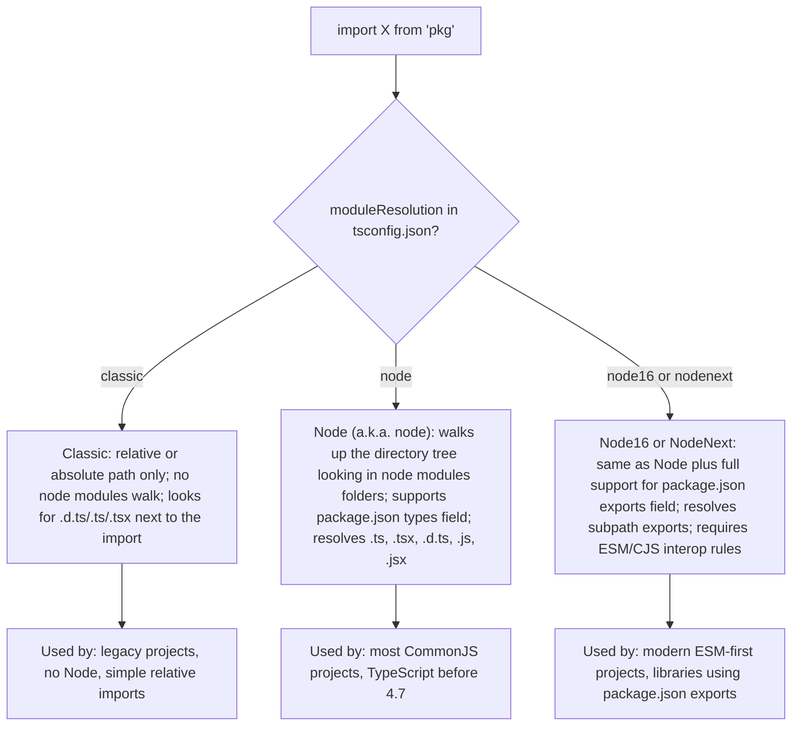
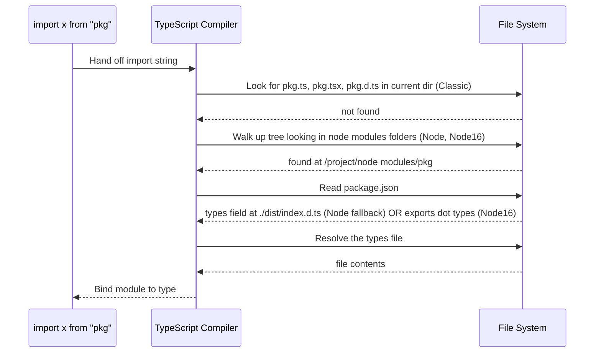
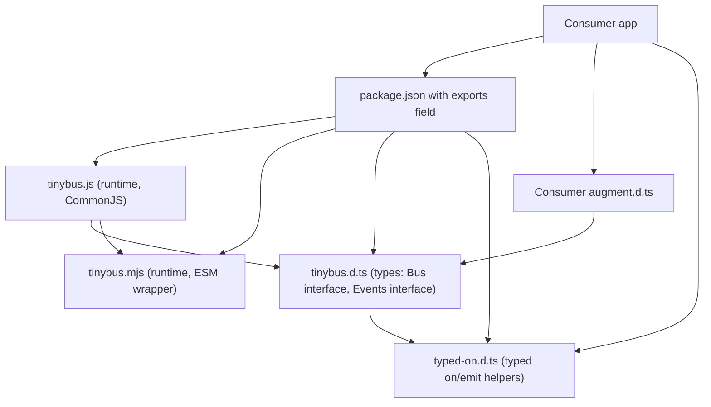

# 2.15 Declaration Files and Merging

## 1. Purpose

TypeScript exists to put types on JavaScript. But the world's JavaScript was not written with TypeScript in mind. There are tens of thousands of npm packages written in plain JavaScript, billions of lines of legacy code in monorepos, browser globals injected by HTML script tags, Node host globals like `process` and `Buffer`, runtime-injected variables like `import.meta.env` in Vite or build-time constants in webpack, and entire frameworks whose public types are computed at build time from your source code. None of those things have TypeScript types sitting next to them. If TypeScript could only type the code you wrote by hand inside `.ts` files, it would be useless for any real codebase past the size of a tutorial. **Declaration files are the bridge** between TypeScript's type system and the JavaScript that already exists in the world.

A declaration file — a `.d.ts` file — is a TypeScript file that contains **types and only types**. No runtime code is emitted from it. No variables are created. No functions are called. The compiler reads it, builds an in-memory type description of the things it declares, and then throws the file away when emitting JavaScript. The file is a pure type-level artifact. It says to the compiler: "Here is the shape of something that exists at runtime. Trust me. Use this shape to type-check the rest of the code." The something can be a global variable, a module exported by a library, a class added to the DOM by a polyfill, an environment variable, a CSS class name, a JSON import, a Webpack chunk manifest, a Vue single-file component, a CSS Module, a Prisma client, anything.

The `declare` keyword is the verb that does this trusting. `declare const process: Process` says: "There is a global variable named `process` at runtime. I am not creating it. I am telling you it exists and that its type is `Process`." Without `declare`, TypeScript assumes you are creating the value, and it would emit a `const process = ...` line in the JavaScript output — which would shadow or conflict with the actual runtime global. With `declare`, TypeScript does not emit anything; it just records the type in its internal registry.

**Declaration merging** is a separate but related feature. It says: when two declarations in TypeScript have the same name in the same scope, the compiler does not necessarily throw a "duplicate identifier" error. Instead, depending on the kind of declaration, it may **merge** them into a single combined declaration. Two interfaces with the same name merge their members. Two namespaces with the same name merge their exports. A namespace can merge with a class, a function, or an enum, in which case the namespace's members become static members of the class or function. This is the mechanism TypeScript uses to let you **add fields to a type you do not own** — to extend Express's `Request` with a `user` property, to add a `track` method to the global analytics object, to teach Jest's `expect` about a custom matcher, to give a Vue component a typed `props` object computed from a build step.

**Module resolution algorithms** are the third leg of this stool. When you write `import express from "express"`, TypeScript has to find the declaration file that describes `express`. There is no single obvious place to look — libraries can be authored in many formats (CommonJS, ESM, UMD), they can be installed in nested `node modules` folders, they can expose entry points through the `exports` field of their `package.json`, they can ship their types under `@types/...` packages on DefinitelyTyped, and they can publish both ESM and CJS versions of the same code. TypeScript ships **three** resolution algorithms — Classic, Node, and Node16/NodeNext — that differ in where they look and how they handle the modern `exports` field. Picking the wrong one is the single most common cause of "Cannot find module or its corresponding type declarations" errors in real TypeScript projects.

So this note covers four pillars: (1) the `.d.ts` file format; (2) the `declare` keyword for ambient declarations of things that exist at runtime but not in your TypeScript source; (3) module resolution — how TypeScript finds the declaration file for an import; (4) declaration merging — how same-named declarations combine, and how that powers module augmentation. Read this note end to end and you will be able to write a `.d.ts` for a plain-JavaScript library, use `declare` correctly for globals and ambient modules, choose the right module resolution mode, and augment Express's `Request` (or any third-party type) without breaking existing callers. For the bigger picture of why TypeScript cannot check runtime behavior, see [[2.01 Design Goals and Limitations]].

## 2. Theory and Deep Dive

### 2.1 What a `.d.ts` file is, structurally

A `.d.ts` file is parsed exactly like a `.ts` file, with three differences. First, **no emit.** When `tsc` runs, a `.d.ts` file produces no `.js` output. The file is type-only. Second, **no value initializers.** You may not write `const x = 5` in a `.d.ts` file. You may only write `declare const x: number`. The `declare` keyword says "this value exists; do not emit code for it." Third, **`export` is type-only.** When you `export` something from a `.d.ts` file, you are exporting a *type*, not a value. The runtime value comes from somewhere else — a `.js` file that ships alongside the `.d.ts`, a global script tag, a polyfill, anywhere.

Internally, the compiler treats every `.d.ts` file as if it were wrapped in an implicit `declare`. The whole file is ambient. Inside it, you can declare types, interfaces, classes (as types), functions (as signatures), variables (as types), namespaces, modules, and enums. You cannot write implementations — no function bodies, no initialized variables, no class method bodies.

```typescript
// TS: example.d.ts — all legal
export declare const version: string;
export declare function greet(name: string): string;
export declare class Queue<T> {
  constructor(initial?: T[]);
  push(item: T): void;
  pop(): T | undefined;
  get length(): number;
}
export declare namespace Queue {
  export function fromArray<T>(items: T[]): Queue<T>;
}
export interface QueueOptions {
  capacity?: number;
}
```

```javascript
// JS: the runtime implementation that pairs with example.d.ts
// (lives in example.js or example.mjs, NOT in example.d.ts)
const version = "1.0.0";
function greet(name) {
  return "Hello, " + name;
}
class Queue {
  constructor(initial = []) {
    this.items = [...initial];
  }
  push(item) {
    this.items.push(item);
  }
  pop() {
    return this.items.pop();
  }
  get length() {
    return this.items.length;
  }
  static fromArray(items) {
    return new Queue(items);
  }
}
module.exports = { version, greet, Queue };
```

The pairing is by **filename convention**. When `tsc` resolves `import { greet } from "example"`, it looks for `example.js` (the runtime) and `example.d.ts` (the types). The two files share a name; only the extensions differ. The `.d.ts` describes the shape; the `.js` provides the behavior. For more on how `tsc` parses `.d.ts` files into its in-memory symbol table, see [[6.07 TSC Compiler Operation]].

### 2.2 The `declare` keyword in detail

`declare` is the keyword that says "trust me, this exists at runtime; do not emit code for it." It can prefix almost any declaration:

| Declaration | What `declare` does |
|---|---|
| `declare const x: T` | Says `x` is a runtime global of type `T`; no `const x` is emitted. |
| `declare let x: T` | Same as `const` but mutable. |
| `declare var x: T` | Same, with `var` semantics. |
| `declare function f(...): T` | Says `f` is a runtime function with this signature; no function is emitted. |
| `declare class C {}` | Says `C` is a runtime class with these members; no class is emitted. |
| `declare enum E {}` | Says `E` is a runtime enum; no enum object is emitted (the runtime must provide it). |
| `declare namespace N {}` | Says `N` is a runtime object with these members; no object is emitted. |
| `declare module "x" {}` | Says the module `"x"` exists at runtime and has these exports. |
| `declare global {}` | Says the declarations inside are added to the global scope. |

The keyword exists because TypeScript has a dual nature: it both **describes** types and **emitted** code. Most of the time these two jobs happen together — when you write `const x: number = 5`, the type annotation describes `x` and the initializer emits the code that creates `x`. But when you are writing types for something that *already exists at runtime*, you want only the description, not the emission. `declare` is the switch that says "description only, please."

A useful way to remember this: `declare` is the **opposite** of `export`. `export` makes a declaration visible to other modules. `declare` makes a declaration **not emit code**. You can combine them: `export declare const x: number` says "this value exists at runtime, it is exported by this module, and I am not emitting code for it." For more on the value-vs-type distinction that `declare` rests on, see [[2.06 Interfaces vs Type Aliases]].

### 2.3 Global declarations vs module declarations

This is the single most important distinction in `.d.ts` files, and it is the source of the most common mistake (see Section 6.1). The rule is mechanical:

> **A `.d.ts` file with no top-level `import` or `export` statements is a global script. Everything declared at its top level is added to the global scope.**
>
> **A `.d.ts` file with at least one top-level `import` or `export` statement is a module. Everything declared at its top level is module-scoped, and only the explicitly `export`ed declarations are visible to importers.**

This rule applies to `.ts` files too, but it matters most for `.d.ts` files because the file's role is purely type-level — there is no runtime code to tip you off about whether the file is a module.

```typescript
// TS: globals.d.ts — global script (no imports or exports)
declare const appVersion: string;        // global, available everywhere
declare function dbg(msg: string): void; // global
interface Window {
  myCustomProp: number;                  // merges into the global Window interface
}
```

```typescript
// TS: module-types.d.ts — module (has an export)
export declare const version: string;
export declare function greet(name: string): string;
declare const internal: number;          // module-private; not visible outside
```

```javascript
// JS: the runtime equivalent of globals.d.ts
// appVersion is set by a bootstrap script before your bundle runs:
window.appVersion = "1.0.0";
window.dbg = function (msg) { console.log("[dbg]", msg); };
// myCustomProp is set somewhere in app code:
window.myCustomProp = 42;
```

The first file has no `export` or `import`, so everything in it is global. The second file has `export`, so it is a module, and only the exported declarations are visible to importers. The danger: **a single top-level `import` or `export` flips the entire file from global to module**. If you have a globals file and you accidentally add `import { SomeType } from "lib"` at the top to bring in a type for use in one of your global declarations, suddenly **every declaration in the file stops being global**. Nothing breaks loudly. Your code that relied on the globals just starts failing with "Cannot find name" errors elsewhere in the codebase. We will cover this in Section 6.2.

### 2.4 Global augmenting: `declare global`

When you are inside a module file (one that has imports or exports) and you need to add something to the global scope, you cannot just write `declare const x: number` at the top level — the file is a module, so the declaration is module-scoped. Instead, you wrap the declarations in `declare global { ... }`:

```typescript
// TS: app-globals.ts — a module (it has exports)
import { User } from "./types";

export const appVersion = "1.0.0";

declare global {
  // These now live in the global scope.
  const appVersion2: string;
  function dbg(msg: string): void;
  interface Window {
    appUser?: User;
  }
}
```

```javascript
// JS: the runtime equivalent — globals injected by an HTML script or a bootstrap file
// (often set in index.html or in a preload script)
window.appVersion2 = "1.0.0";
window.dbg = (msg) => console.log("[dbg]", msg);
```

Why does `declare global` exist? Because the file is a module — it has `import` and `export` — but you still need to declare globals. The `declare global` block is the explicit escape hatch. Inside it, you can declare `var`, `let`, `const`, `function`, `class`, `namespace`, `interface`, and `type`. Interface and type declarations inside `declare global` **merge** with the existing global interfaces of the same name — this is how you augment `Window`, `Document`, `Element`, `process`, `console`, and other ambient globals.

### 2.5 Module augmenting: `declare module`

Module augmentation is the technique that lets you **add exports to a module you do not own**. You write `declare module "name" { ... }` in a `.d.ts` file (or in a `.ts` file that is included in your compilation), and the declarations inside the block are merged into the existing module `"name"`.

```typescript
// TS: express.d.ts — augmenting the express module to add a `user` field to Request
import express from "express"; // this import is what makes it augmentation, not replacement

declare module "express" {
  interface Request {
    user?: {                       // added to the existing express.Request interface
      id: string;
      name: string;
      roles: string[];
    };
  }
}
```

```javascript
// JS: the runtime code that uses the augmented Request
const express = require("express");
const app = express();

app.use((req, res, next) => {
  // req.user is populated by some auth middleware at runtime;
  // the .d.ts above tells TypeScript it exists.
  req.user = { id: "abc", name: "Alice", roles: ["admin"] };
  next();
});

app.get("/me", (req, res) => {
  res.json(req.user);              // TS knows req.user exists, even though express did not declare it
});
```

The `import express from "express"` line is critical. Without it, the `declare module "express"` block would **replace** the existing module's types instead of augmenting them. With the import, TypeScript knows you are referencing the existing module's types, and the `declare module` block is merged into them. We will cover the failure mode in Section 6.5 and Section 6.7.

### 2.6 Module resolution algorithms

TypeScript ships **three** module resolution algorithms. You select one in `tsconfig.json` via the `moduleResolution` field. The choice interacts with the `module` field, the `target` field, and the runtime environment you are emitting for. For the full `tsconfig.json` context, see [[2.16 TSConfig Deep Dive]].



**Classic** is the oldest. It looks for the import path as a relative file (relative to the importing file's directory) with `.ts`, `.tsx`, `.d.ts` extensions appended. It does **not** walk up the directory tree looking for `node modules` folders, and does **not** read `package.json`. It is the resolution mode for environments without Node — for example, importing modules bundled by an older build tool, or running TypeScript in a non-Node host. Modern projects almost never use Classic.

**Node** (sometimes called `node`) mimics how Node.js's CommonJS `require` algorithm works. For a relative import, it resolves the file path. For a bare import (like `import x from "express"`), it walks up the directory tree from the importing file, looking in each ancestor's `node modules` folder for a directory matching the package name. When it finds the package directory, it reads the `package.json`, looks for a `types` or `typings` field, and resolves that file as the type entry point. If there is no `types` field, it falls back to `index.d.ts` in the package root. This is the resolution mode used by most TypeScript projects from 2015 to 2022.

**Node16** and **NodeNext** (the two are nearly identical; NodeNext forces `module: nodenext` too) are the modern modes. They do everything Node does, **plus** they understand the `exports` field in `package.json`. The `exports` field, standardized in Node 12+, is how modern packages declare their public entry points — it can expose different files for `import` vs `require`, restrict which subpaths are public, and map `./feature` imports to specific files. Node16/NodeNext also enforce ESM/CJS interop rules: importing a CommonJS module from an ESM module gets you a synthetic default, and importing a named export that does not exist on a CommonJS module is an error. These modes are mandatory if you want to use modern, ESM-first libraries correctly.



The most important practical difference between Node and Node16 is what happens with a package that has only an `exports` field and no `types`/`main` field. Under Node resolution, TypeScript cannot find the package's types and falls back to `any`. Under Node16, TypeScript reads the `exports` field and resolves the correct types file. This is the single most common cause of "Cannot find module or its corresponding type declarations" errors when migrating to modern ESM libraries. For the npm-side mechanics of how `node modules` is laid out and how `@types/*` is auto-discovered, see [[6.01 NPM Internals]].

### 2.7 Declaration merging: the rules

Declaration merging is the rule that two declarations with the same name in the same scope combine into one. The rules differ by declaration kind. Here is the full table:

| Declaration kind | Merges with | How |
|---|---|---|
| `interface` | Another `interface` of the same name | Members are unioned. Later declarations' members take precedence for duplicate function-signature ordering. |
| `namespace` | Another `namespace` of the same name | Exports are unioned. |
| `namespace` | A `class`, `function`, or `enum` of the same name | The namespace's exported members become static members of the class/function/enum. |
| `function` | Another `function` of the same name | Not merging — this is **overloading**. Signatures accumulate. |
| `class` | Another `class` of the same name | **Does not merge.** Duplicate identifier error. |
| `type alias` | Anything of the same name | **Does not merge.** Duplicate identifier error. |
| `enum` | Another `enum` of the same name | **Merges** as of TS 4.x; members are unioned. |

The most-used forms are interface merging and namespace merging. Let's cover each. For the broader question of when to use `interface` (which merges) vs `type` (which does not), see [[2.06 Interfaces vs Type Aliases]].

#### 2.7.1 Interface merging

Two interfaces with the same name combine their members. Non-function members must have unique names — duplicates are an error. Function members (methods) accumulate as overloads.

```typescript
// TS
interface Window {
  defaultStatus: string;             // original DOM lib declaration
}

interface Window {                   // augmentation in your code
  customProp: number;
  defaultStatus: string;             // OK: same type as original
}

declare const w: Window;
w.customProp;                        // number
w.defaultStatus;                     // string
```

```javascript
// JS
// No runtime effect — interfaces are erased. The augmentation only affects type-checking.
window.customProp = 42;              // you assign it at runtime somewhere
window.defaultStatus = "ready";
```

When two interfaces declare a property with the same name but different types, TypeScript errors with "Subsequent variable declarations must have the same type." The single exception is function members: they form an overload set, with later declarations appearing earlier in the overload order.

#### 2.7.2 Namespace merging

Two namespaces with the same name merge their exports. Operators (functions, classes, values) on each namespace remain accessible from the merged namespace.

```typescript
// TS
declare namespace Animals {
  class Dog { bark(): void; }
  const domestic: string[];
}

declare namespace Animals {
  class Cat { meow(): void; }
  const wild: string[];
}

const d = new Animals.Dog();
const c = new Animals.Cat();
const list = [...Animals.domestic, ...Animals.wild];
```

```javascript
// JS
// The runtime namespace Animals would be built up across multiple files:
var Animals = Animals || {};
Animals.Dog = class Dog { bark() { console.log("woof"); } };
Animals.domestic = ["labrador", "poodle"];

// Later, in another file:
var Animals = Animals || {};
Animals.Cat = class Cat { meow() { console.log("mew"); } };
Animals.wild = ["tiger", "lion"];
```

Namespaces are an older TypeScript feature (originally called "internal modules"). They are still common in `.d.ts` files for libraries that bundle everything onto a single global object — jQuery (`$`), D3 (`d3`), Lodash when used as a global (its single-character lowercase alias). Modern code generally uses modules instead, but the merging rules live on because they power the next pattern.

#### 2.7.3 Namespace merging with class, function, or enum

This is the pattern that makes namespace merging useful in modern TypeScript. A namespace and a class (or function, or enum) with the same name combine, and the namespace's exports become **static members** of the class/function/enum. The class (or function, or enum) keeps its value-level meaning; the namespace adds static side-properties.

```typescript
// TS
declare class Queue<T> {
  push(item: T): void;
  pop(): T | undefined;
}

declare namespace Queue {
  function fromArray<T>(items: T[]): Queue<T>;
  const version: string;
}

// Usage:
const q = new Queue<number>();         // class instance
const q2 = Queue.fromArray([1, 2, 3]); // static method from the namespace
console.log(Queue.version);            // static property from the namespace
```

```javascript
// JS
class Queue {
  push(item) { /* ... */ }
  pop() { /* ... */ }
}
Queue.fromArray = function (items) {
  const q = new Queue();
  items.forEach((i) => q.push(i));
  return q;
};
Queue.version = "1.0.0";

// Usage mirrors the TS exactly.
const q = new Queue();
const q2 = Queue.fromArray([1, 2, 3]);
console.log(Queue.version);
```

This pattern is what powers TypeScript's `Crypto.subtle`, `Math.max`, `Object.keys`, `Promise.all`, and many other standard library types. The class is the value; the namespace adds the static helpers. The same trick works for functions (a function that also has properties — `jQuery.fn`, `moment.locale`) and for enums (rare in modern code).

#### 2.7.4 Function overloads vs merging

Two function declarations with the same name do **not** merge — they form an overload set. Each declaration adds a signature. The implementation (if any) must be compatible with all overloads.

```typescript
// TS
function pad(value: string, len: number): string;
function pad(value: number, len: number): string;
function pad(value: string | number, len: number): string {
  return String(value).padStart(len, "0");
}

const a = pad("42", 5);     // "00042"
const b = pad(42, 5);       // "00042"
```

```javascript
// JS
function pad(value, len) {
  return String(value).padStart(len, "0");
}
// JS has no overloads; one implementation handles all cases.
```

This is technically not "merging" (the rules are different — overloads accumulate signatures, while merging combines declarations of different kinds), but it is often taught alongside merging because it is the value-space counterpart of interface member accumulation.

### 2.8 The four-stage lifecycle of a `.d.ts`

To tie the pieces together, here is the lifecycle of a `.d.ts` file from authoring to consumption:

1. **Authoring.** You (or the library author, or the DefinitelyTyped community) write a `.d.ts` describing the runtime shape of a JavaScript library. The file goes either in the library's own package or in a separate `@types/library` package on npm.
2. **Discovery.** When a consumer imports the library, TypeScript runs the module resolution algorithm (Classic, Node, or Node16/NodeNext) to find the `.d.ts`. Discovery rules differ by algorithm (Section 2.6).
3. **Loading.** TypeScript parses the `.d.ts`, builds type descriptions for everything declared in it, and stores those descriptions in an in-memory symbol table keyed by module path and name.
4. **Use.** When consumer code references a name from the library, TypeScript looks it up in the symbol table and uses the stored type to type-check the reference. Module augmentations (`declare module`) are merged into the stored type at this stage.

The `.d.ts` is never executed, never bundled into the consumer's output, and is purely a compile-time artifact. After compilation, the file is discarded — only the runtime `.js` shipped by the library is loaded by Node or the browser.

## 3. Mental Models

Five mental models make this entire topic click.

**Model A: `.d.ts` = "a types-only file, no JS emitted."** A `.d.ts` file is a TypeScript file with the runtime stripped out. Whatever you would normally write in a `.ts` file with implementations, you write in a `.d.ts` file with `declare` and signatures only. The compiler reads it, uses it, throws it away. The browser and Node never see it.

**Model B: `declare` = "trust me, this exists at runtime."** Every `declare` is a promise to the compiler that there is a real runtime value with this name and this shape, and that the compiler does not need to emit any code to create it. The promise is unchecked — if you lie (declare a function that does not exist), TypeScript will type-check your code as if it existed, and your code will fail at runtime. `declare` is an unchecked assertion.

**Model C: Global = "available everywhere without import." Module = "must be imported."** A `.d.ts` file with no top-level `import` or `export` is a global script. Everything it declares is in the global namespace — visible to every file in the compilation. A `.d.ts` file with at least one top-level `import` or `export` is a module. Its declarations are private to the module unless explicitly `export`ed. The presence of a single `import` or `export` flips the entire file's behavior. This is the single most common source of bugs in `.d.ts` files (Section 6.2).

**Model D: Augmenting = "add to an existing type without modifying its source."** Module augmentation (`declare module "name" { ... }`) and global augmentation (`declare global { ... }`) let you add fields, methods, and exports to types you do not own. The original `.d.ts` for the library is untouched. Your augmentation file is loaded alongside it, and TypeScript merges the two. This is how Express `Request.user`, Jest custom matchers, Vue plugin installs, and CSS-Module typing all work.

**Model E: Merging = "two declarations with the same name combine."** When TypeScript sees two interfaces, two namespaces, or a namespace-with-class/function/enum with the same name, it does not error — it merges them into one combined declaration. The merge rules differ by declaration kind (interface merges members, namespace merges exports, namespace-with-class adds static members). Merging is the engine behind augmentation: your augmentation file declares an `interface Request` with a `user` property; the original Express `.d.ts` declares `interface Request` with `body`, `params`, `query`; TypeScript merges the two; your code sees a `Request` with all of `body`, `params`, `query`, and `user`.

Internalize these five models and the rest of the topic is mechanical detail.

## 4. Real-World Use Cases

### 4.1 DefinitelyTyped (`@types/*`)

The largest deployment of `.d.ts` files in the world is DefinitelyTyped, the GitHub repository that publishes the `@types/library` packages on npm. There are thousands of these packages — `@types/node`, `@types/react`, `@types/express`, `@types/jest`, `@types/lodash`, `@types/jquery`. Each one is a `.d.ts` file (or a directory of them) that types a JavaScript library which itself ships no types. When you `npm install @types/node`, npm places a `node` directory inside the `@types` folder of your `node modules` directory; TypeScript's Node resolution algorithm automatically finds the `index.d.ts` file inside that package when you `import` something from `"node"` or when you reference the `process` global. The `typeRoots` and `types` fields in `tsconfig.json` control which `@types` packages are auto-included.

### 4.2 Express Request augmentation

The canonical module augmentation example. Express's `Request` interface declares `body`, `params`, `query`, `headers`, and the rest. It does **not** declare `user` — Express leaves authentication to user code. You install `passport` (or your own auth middleware), which sets `req.user` at runtime to the authenticated user object. To teach TypeScript about this, you write a `.d.ts` file with `declare module "express" { interface Request { user?: ... } }`. Every file in your project that uses `req.user` now type-checks correctly. We will build this end-to-end in Section 9.2.

### 4.3 Jest module mocking types

Jest's `jest.mock("module-path")` replaces a module with a mock at runtime. The Jest types alone do not know that after `jest.mock`, the imported module is a mock with `.mockImplementation`, `.mockReturnValue`, and friends. The community maintains augmentation types (`@types/jest`, `@types/jest-mock-extended`) that teach TypeScript how to narrow a module's type after mocking — module augmentation applied to a test framework.

### 4.4 CSS Modules type generation

When you `import styles from "./Button.module.css"`, the runtime object is a map from class name to generated class name (e.g., `{ button: "Button button abc123" }`). The types are not static — they depend on the actual class names in the CSS file. Build tools like `typed-scss-modules`, `css-modules-typescript-loader`, and Vite's CSS plugin generate a `.d.ts` file next to each `.module.css` file declaring the class names as keys. The generated file looks like `declare const styles: { readonly button: "button"; readonly primary: "primary"; }; export default styles;` — a one-off ambient module declaration.

### 4.5 Vue single-file component types

Vue SFCs (`.vue` files) are not TypeScript — they are a Vue-specific format with template, script, and style blocks. The `vue-tsc` compiler and Volar language server generate a `.d.ts` shim for each `.vue` file at build time, declaring the component's props, slots, emits, and exposed methods as a TypeScript type. The shim is what allows `import MyComponent from "./MyComponent.vue"` to type-check correctly — typically a tiny file like `declare const MyComponent: import("vue").DefineComponent<...>; export default MyComponent;`.

### 4.6 Build tools emitting `.d.ts` for libraries

When you publish a TypeScript library to npm, you ship two things: the compiled `.js` (so consumers can run your code) and the `.d.ts` (so consumers' TypeScript compilers can type-check their use of your code). `tsc` emits `.d.ts` automatically when `declaration: true` is set in `tsconfig.json`. Alternative compilers (`swc`, `esbuild`) do not emit `.d.ts` — you pair them with `tsc --emitDeclarationOnly`. Build tools like `tsup`, `unbuild`, and `microbundle` wrap this pattern: fast JS emit via esbuild, plus `.d.ts` emit via tsc. For the full publishing workflow, see [[6.03 Publishing Libraries]].

### 4.7 Global `process`, `window`, `document` types

The `@types/node` package ships a `.d.ts` that declares the `process` global. The `lib.dom.d.ts` that ships with TypeScript itself declares `window`, `document`, `Element`, `HTMLCanvasElement`, and the entire DOM API. These are global declarations — they live in the global scope because their `.d.ts` files have no top-level imports/exports. When you read the Node environment-mode variable, TypeScript finds the type of `process` in the global symbol table populated by `@types/node`.

### 4.8 Environment variables and import.meta.env

Vite, Next.js, and other meta-frameworks inject environment variables at build time — Vite exposes them via `import.meta.env.apiKey` (the framework requires a build-tool-specific prefix on the variable name), Next.js exposes them via `process.env.appName` (with the framework's public-env prefix). To teach TypeScript about these, write a `.d.ts` that augments either the `ImportMeta` interface (Vite) or the `NodeJS.ProcessEnv` interface (Next.js). This is interface merging applied to a build-tool-specific global.

### 4.9 Library plugin types (Vue, Vuex, Pinia)

Vue plugins install new methods onto the Vue app instance. The plugin ships a `.d.ts` that uses `declare module "vue"` (or `declare module "@vue/runtime-core"`) to add the methods to the `App` interface. When you `app.use(MyPlugin)`, TypeScript knows the new methods exist. Pinia, Vue Router, and Vue I18n all use this pattern.

### 4.10 jQuery plugins

The classic example. jQuery plugins add methods to `jQuery.fn` (a.k.a. `jQuery.prototype`). The plugin ships a `.d.ts` with `declare namespace jQuery { interface fn { myPlugin(options?: Options): jQuery; } }`, which merges into the existing `jQuery.fn` interface. After `import "jquery-my-plugin"`, `$(selector).myPlugin()` type-checks. This pattern is older than modules but still works.

## 5. Code Examples

### 5.1 Example A — Minimal and Conceptual

Five-line minimal demonstrations of each declaration kind, side by side with the runtime JavaScript equivalent.

#### 5.1.1 `declare var`

```typescript
// TS: env.d.ts
declare var appVersion: string;
// Usage anywhere:
console.log(appVersion.toUpperCase());
```

```javascript
// JS: index.html
// <script>window.appVersion = "1.0.0";</script>
// or: injected by a build tool into the global scope before your bundle runs.
```

#### 5.1.2 `declare const` for a global

```typescript
// TS: globals.d.ts
declare const DEBUG: boolean;
if (DEBUG) console.log("debug mode");
```

```javascript
// JS: webpack DefinePlugin replaces DEBUG at build time
// new webpack.DefinePlugin({ DEBUG: JSON.stringify(true) })
// becomes: if (true) console.log("debug mode");
```

#### 5.1.3 `declare function`

```typescript
// TS: legacy.d.ts
declare function legacyGreet(name: string): string;
const msg = legacyGreet("world");
```

```javascript
// JS: loaded by a <script> tag in index.html
function legacyGreet(name) { return "Hello, " + name; }
```

#### 5.1.4 `declare class`

```typescript
// TS: widget.d.ts
declare class Widget {
  constructor(el: HTMLElement);
  render(): void;
  destroy(): void;
}
const w = new Widget(document.body);
```

```javascript
// JS: loaded by a <script> tag from a CDN
class Widget {
  constructor(el) { this.el = el; }
  render() { /* ... */ }
  destroy() { /* ... */ }
}
window.Widget = Widget;
```

#### 5.1.5 `declare namespace`

```typescript
// TS: util.d.ts
declare namespace Util {
  function clamp(n: number, min: number, max: number): number;
  const version: string;
}
const c = Util.clamp(5, 0, 10);
```

```javascript
// JS: bundled as a global by an IIFE
var Util = (function () {
  return {
    clamp: function (n, min, max) { return Math.max(min, Math.min(max, n)); },
    version: "1.0.0",
  };
})();
```

#### 5.1.6 `declare module` (ambient module for a wildcard)

```typescript
// TS: assets.d.ts
declare module "*.svg" {
  const src: string;
  export default src;
}
declare module "*.png" {
  const src: string;
  export default src;
}
// Usage:
import logo from "./logo.svg";   // typed as string
```

```javascript
// JS: webpack's asset/resource or file-loader returns the URL string at runtime.
// module.exports = "/static/logo.abc123.svg";
```

#### 5.1.7 `declare global`

```typescript
// TS: shim.ts (a module because it has an export)
export {};
declare global {
  interface Window {
    analytics?: { track(event: string, props?: Record<string, unknown>): void };
  }
}
// Usage:
window.analytics?.track("page view", { url: location.href });
```

```javascript
// JS: a <script> tag from Segment or Google Analytics sets window.analytics at runtime.
```

#### 5.1.8 Module augmentation

```typescript
// TS: express-user.d.ts
import "express";
declare module "express" {
  interface Request {
    user?: { id: string };
  }
}
// Usage in any file that imports express:
import express from "express";
const app = express();
app.use((req, res, next) => { req.user = { id: "abc" }; next(); });
```

```javascript
// JS: nothing changes at runtime — the .d.ts is type-only.
// req.user is set by your middleware, exactly as before.
```

#### 5.1.9 Interface merging

```typescript
// TS
interface Config {
  host: string;
  port: number;
}
interface Config {
  debug: boolean;
}
const cfg: Config = { host: "localhost", port: 3000, debug: true };
```

```javascript
// JS: no equivalent — interfaces are erased. The object literal just has three keys.
const cfg = { host: "localhost", port: 3000, debug: true };
```

#### 5.1.10 Namespace merging with class

```typescript
// TS
declare class Color {
  constructor(r: number, g: number, b: number);
  toHex(): string;
}
declare namespace Color {
  function fromHex(hex: string): Color;
  const BLACK: Color;
}
const c1 = new Color(0, 0, 0);
const c2 = Color.fromHex("#ff0000");
const c3 = Color.BLACK;
```

```javascript
// JS
class Color {
  constructor(r, g, b) { this.r = r; this.g = g; this.b = b; }
  toHex() {
    return "#" + [this.r, this.g, this.b]
      .map((n) => n.toString(16).padStart(2, "0")).join("");
  }
}
Color.fromHex = function (hex) {
  const r = parseInt(hex.slice(1, 3), 16);
  const g = parseInt(hex.slice(3, 5), 16);
  const b = parseInt(hex.slice(5, 7), 16);
  return new Color(r, g, b);
};
Color.BLACK = new Color(0, 0, 0);
```

### 5.2 Example B — Production-Grade

A complete, production-grade TypeScript library that ships `.d.ts` files, supports module augmentation hooks, and uses modern `package.json` `exports` configuration. We show the JavaScript implementation, the TypeScript declaration file, the augmentation hook, and the package configuration side by side.

**Scenario:** a small event-bus library called `tinybus`. The runtime is plain JavaScript. The library author publishes types separately. Consumers can extend the bus with custom channels via module augmentation.

#### 5.2.1 The JavaScript runtime (`tinybus.js`)

```javascript
// JS: tinybus.js
function createBus() {
  const handlers = new Map();
  return {
    on(event, fn) {
      if (!handlers.has(event)) handlers.set(event, new Set());
      handlers.get(event).add(fn);
      return () => handlers.get(event).delete(fn);
    },
    emit(event, payload) {
      const set = handlers.get(event);
      if (set) for (const fn of set) fn(payload);
    },
    off(event, fn) {
      const set = handlers.get(event);
      if (set) set.delete(fn);
    },
    clear() { handlers.clear(); },
  };
}
const bus = createBus();
module.exports = { createBus, bus, version: "1.4.2" };
```

#### 5.2.2 The TypeScript declaration file (`tinybus.d.ts`)

```typescript
// TS: tinybus.d.ts
export interface Bus {
  on<T>(event: string, handler: (payload: T) => void): () => void;
  emit<T>(event: string, payload: T): void;
  off<T>(event: string, handler: (payload: T) => void): void;
  clear(): void;
}
export declare function createBus(): Bus;
export declare const bus: Bus;
export declare const version: string;

// Augmentation hook: consumers can declare known events like this:
//
//   declare module "tinybus" {
//     interface Events {
//       "user:login": { userId: string };
//       "user:logout": void;
//     }
//   }
//
// and then bus.on("user:login", (p) => p.userId) type-checks p.userId as string.
export interface Events {
  // empty by default; consumers augment
}
```

#### 5.2.3 The augmentation-aware typed wrapper (`typed-on.d.ts`)

This is the clever part. The library exposes a typed `on` method that uses conditional types to look up the consumer's augmented `Events` interface. For background on the conditional-type pattern used here, see [[2.11 Conditional Types]] and [[2.12 Type Inference in Conditionals]].

```typescript
// TS: typed-on.d.ts (part of the tinybus package)
import { Bus, Events } from "tinybus";

type KnownEvent = keyof Events;
type PayloadFor<E extends string> = E extends KnownEvent ? Events[E] : unknown;

export declare function on<E extends string>(
  event: E,
  handler: (payload: PayloadFor<E>) => void
): () => void;

export declare function emit<E extends string>(event: E, payload: PayloadFor<E>): void;
```

#### 5.2.4 Consumer code with augmentation (`app.ts`)

```typescript
// TS: app.ts
import { bus, on, emit } from "tinybus";

// Augment the library with known events for this app:
declare module "tinybus" {
  interface Events {
    "user:login": { userId: string; at: number };
    "user:logout": void;
    "cart:add": { sku: string; qty: number };
  }
}

// Now the typed wrapper knows the payload shapes:
on("user:login", (p) => {
  console.log(p.userId, p.at);          // p is { userId: string; at: number }
});

on("cart:add", (p) => {
  console.log(p.sku, p.qty);            // p is { sku: string; qty: number }
});

emit("user:login", { userId: "abc", at: Date.now() });
emit("cart:add", { sku: "X1", qty: 2 });

// @ts-expect-error — wrong payload shape
emit("user:login", { userId: "abc" });

// @ts-expect-error — unknown event (still allowed at runtime, but typed as unknown)
on("unknown:event", (p) => { console.log(p); });
```

#### 5.2.5 Consumer code at runtime (`app.js` after compilation)

```javascript
// JS: app.js (output of tsc, minus types)
const { bus, on, emit } = require("tinybus");
on("user:login", (p) => { console.log(p.userId, p.at); });
on("cart:add", (p) => { console.log(p.sku, p.qty); });
emit("user:login", { userId: "abc", at: Date.now() });
emit("cart:add", { sku: "X1", qty: 2 });
emit("user:login", { userId: "abc" });      // would fail at runtime if the handler expects p.at
on("unknown:event", (p) => { console.log(p); });
```

#### 5.2.6 `package.json` with `exports` for Node16 resolution

```json
{
  "name": "tinybus",
  "version": "1.4.2",
  "type": "commonjs",
  "main": "./tinybus.js",
  "types": "./tinybus.d.ts",
  "exports": {
    ".": {
      "types": "./tinybus.d.ts",
      "require": "./tinybus.js",
      "import": "./tinybus.mjs"
    },
    "./package.json": "./package.json"
  }
}
```

The `exports` field declares the public surface. The `types` condition is what TypeScript's Node16 resolution reads. The `require` and `import` conditions are what Node reads at runtime. With this configuration, both CommonJS and ESM consumers can import the package, and Node16 resolution finds the correct `.d.ts` regardless of the consumer's module format.

#### 5.2.7 The `tsconfig.json` of the consumer

```json
{
  "compilerOptions": {
    "module": "nodenext",
    "moduleResolution": "nodenext",
    "target": "es2022",
    "strict": true,
    "types": ["node"]
  }
}
```

With `moduleResolution: nodenext`, TypeScript reads the `exports` field of `tinybus`'s `package.json` and resolves the `types` condition to `./tinybus.d.ts`. Under the older `node` resolution, TypeScript falls back to the `types` field at the top level (also `./tinybus.d.ts`), which works for this simple case but breaks for packages that only expose types via `exports`.

## 6. Common Mistakes and Anti-Patterns

### 6.1 Forgetting `declare` (TS thinks it's a value, errors on emit)

**Mistake:**
```typescript
// TS: globals.d.ts (WRONG)
const appVersion: string = "1.0.0";   // looks like a real variable
```

**What happens:** TypeScript parses this as a real variable declaration with an initializer. In a `.d.ts` file, this is an error: "A top-level declaration in a `.d.ts` file must be ambient." Even if you remove the initializer, `const appVersion: string;` (without `declare`) is also an error in a `.d.ts` — TypeScript wants the `declare` keyword to make the ambient intent explicit.

**Fix:**
```typescript
// TS: globals.d.ts (CORRECT)
declare const appVersion: string;
```

### 6.2 Mixing global and module in the same `.d.ts`

**Mistake:**
```typescript
// TS: globals.d.ts (BROKEN — silently becomes a module)
import { User } from "./types";          // <- this single import flips the whole file
declare const appVersion: string;        // <- no longer global; only visible inside this file
interface Window { myProp: number; }     // <- no longer merges with the global Window
```

**What happens:** The file is now a module. The `declare const appVersion` is module-scoped — files that relied on the global `appVersion` now error with "Cannot find name 'appVersion'." The `interface Window` no longer merges with the global `Window` interface — your `window.myProp` accesses elsewhere in the codebase now fail to type-check.

**Fix:** Either move the `import` out (use a type-only import with `import type` in a separate file, or use `/// <reference types="..." />` directives), or wrap the globals in `declare global { ... }`:

```typescript
// TS: globals.d.ts (CORRECT — explicit global augmentation from a module)
import type { User } from "./types";
export {};                                // makes the file a module explicitly
declare global {
  const appVersion: string;
  interface Window { myProp: number; currentUser?: User; }
}
```

### 6.3 Module resolution fails because of `exports` field

**Mistake:** A modern package (say, `got` v12) ships only an `exports` field in its `package.json`, with no top-level `types` or `main`. Your `tsconfig.json` has `moduleResolution: node` (the legacy mode). You `import got from "got"` and get "Cannot find module 'got' or its corresponding type declarations."

**What happens:** The legacy `node` resolution algorithm does not read the `exports` field. It looks for a top-level `types` or `main` field, finds neither, and gives up. The runtime works (Node reads `exports`), but TypeScript cannot find the types.

**Fix:** Switch to `moduleResolution: "node16"` (or `"nodenext"`), which reads the `exports` field:

```json
{
  "compilerOptions": {
    "module": "node16",
    "moduleResolution": "node16"
  }
}
```

### 6.4 Declaration merging produces unexpected types

**Mistake:**
```typescript
// TS
interface Box { size: number; }
interface Box { size: string; }            // different type for the same property
declare const b: Box;
b.size;                                    // Error: Subsequent variable declarations must have the same type.
```

**What happens:** Non-function members of merged interfaces must have **identical** types. If you re-declare `size: string` when the original was `size: number`, TypeScript errors. The fix is either to align the types or to use a function member (which forms an overload set instead of conflicting).

**Fix:**
```typescript
// TS
interface Box { size: number; }
interface Box { label: string; }           // different property name — fine
declare const b: Box;
b.size;                                    // number
b.label;                                   // string
```

### 6.5 Augmenting a module that doesn't exist (silent)

**Mistake:**
```typescript
// TS: typo in the module name
declare module "exppress" {                // typo: "exppress" instead of "express"
  interface Request { user?: { id: string }; }
}
```

**What happens:** Nothing. TypeScript creates a brand new ambient module named `"exppress"`. No error. Your real `import express from "express"` imports the un-augmented Express types; your `req.user` accesses do not type-check.

**Fix:** Triple-check the module name. Use `import "express"` first (which gives a "cannot find module" error if the package is missing), then add the `declare module "express"` block:

```typescript
// TS
import "express";                          // if this errors, the package is missing
declare module "express" {
  interface Request { user?: { id: string }; }
}
```

### 6.6 `declare module "*"` (wildcard, too broad)

**Mistake:**
```typescript
// TS: assets.d.ts
declare module "*" {                       // matches EVERY import
  const content: string;
  export default content;
}
```

**What happens:** Every import — `import x from "react"`, `import y from "lodash"`, `import z from "./local"` — is typed as `{ default: string }`. Type safety is gone across the entire project. The wildcard is meant for file-extension matches (`declare module "*.svg"`), not for matching all module names.

**Fix:** Scope wildcards to file extensions only, and use specific module names for everything else:

```typescript
// TS: assets.d.ts
declare module "*.svg" {
  const src: string;
  export default src;
}
declare module "*.png" {
  const src: string;
  export default src;
}
```

### 6.7 Augmenting without importing the original module

**Mistake:**
```typescript
// TS: broken-augment.d.ts
declare module "express" {
  interface Request { user?: { id: string }; }
}
```

**What happens:** Without a prior `import "express"` or `import ... from "express"`, TypeScript treats the `declare module "express"` block as a **brand new ambient module**, not an augmentation. If `express` is later imported elsewhere, you get a conflict between the ambient module and the real one — or worse, your ambient module silently shadows the real one.

**Fix:** Always `import` the module before augmenting it:

```typescript
// TS: express-user.d.ts
import "express";                          // or: import express from "express";
declare module "express" {
  interface Request { user?: { id: string }; }
}
```

### 6.8 Using `declare global` in a non-module file

**Mistake:**
```typescript
// TS: broken-global.d.ts (no imports or exports — this is a global script)
declare global {
  const appVersion: string;
}
```

**What happens:** The file is already a global script — every top-level declaration is already global. Wrapping in `declare global` is an error: "Top-level declarations in `.d.ts` files must start with either a `declare` or `export` modifier." The `declare global` block is only meaningful inside a module file.

**Fix:** Either remove the `declare global` wrapper (since the file is already global), or add `export {}` to make the file a module and then use `declare global`:

```typescript
// TS: globals.d.ts (option A — already global, no wrapper needed)
declare const appVersion: string;
```

```typescript
// TS: globals.ts (option B — module with explicit global augmentation)
export {};
declare global {
  const appVersion: string;
}
```

### 6.9 Forgetting to ship `.d.ts` files with a published library

**Mistake:** You write a TypeScript library, compile it with `tsc`, ship the `.js` output to npm, and forget to ship the `.d.ts` files. Consumers install your library and get "Could not find a declaration file for module 'yourlib'. '.../yourlib.js' implicitly has an 'any' type."

**Fix:** Set `declaration: true` in your `tsconfig.json` (or use `tsc --emitDeclarationOnly` alongside a faster emitter like esbuild), and ensure the `.d.ts` files are included in the `files` field of your `package.json`:

```json
{
  "compilerOptions": {
    "declaration": true,
    "outDir": "./dist"
  }
}
```

```json
// package.json
{
  "main": "./dist/index.js",
  "types": "./dist/index.d.ts",
  "files": ["dist"]
}
```

### 6.10 Confusing ambient enum with regular enum

**Mistake:**
```typescript
// TS: colors.d.ts
declare enum Color { Red, Green, Blue }    // ambient enum
```

Then in your code:

```typescript
// TS
const c = Color.Red;                        // works at type-check time
console.log(c);                             // runtime: Color is not defined!
```

**What happens:** `declare enum` says "there is an enum object named Color at runtime." If the runtime enum does not exist (you forgot to ship the `.js` that creates it), the code throws `ReferenceError: Color is not defined`. The `declare` keyword made a promise TypeScript did not verify.

**Fix:** Either ship the runtime enum (as a real `enum` in a `.ts` file, not a `.d.ts`), or use `declare const enum` (which is inlined at compile time and emits no runtime lookup), or use a union of string literals with `declare const`:

```typescript
// TS: colors.d.ts (preferred — string literal union)
declare const Color: { Red: "Red"; Green: "Green"; Blue: "Blue" };
type Color = (typeof Color)[keyof typeof Color];
```

### 6.11 Using `declare` in a regular `.ts` file when an `import` would do

**Mistake:**
```typescript
// TS: app.ts (a normal module, not a .d.ts)
declare const config: { port: number; host: string };  // claims a global config exists
console.log(config.port);
```

**What happens:** If `config` is actually exported by a module (say, `./config`), this `declare` lies — it claims a global `config` exists, when in reality the value must be imported. The runtime throws `ReferenceError: config is not defined`.

**Fix:** Import the value instead:

```typescript
// TS: app.ts (CORRECT)
import { config } from "./config";
console.log(config.port);
```

Reserve `declare` for things that **truly** live in the global scope or are injected by the runtime/build tool — `process`, `Buffer`, the Node current-directory globals (in CommonJS), webpack `DefinePlugin` constants, browser-injected globals. For module-scoped values, use `import`.

### 6.12 Assuming `isolatedModules` does not affect `.d.ts`

**Mistake:** You write a `.d.ts` that uses `declare enum` and re-exports it, and your consumer project has `isolatedModules: true` (required by Vite, esbuild, Babel, SWC, and most modern build tools). The consumer's build fails with "Ambient enum cannot be re-exported."

**What happens:** Under `isolatedModules`, every file must be compilable in isolation. Ambient enums cannot be re-exported because the consumer's compiler cannot read your `.d.ts` to inline the values — it sees only the import statement and must emit a runtime lookup, which fails for ambient enums with no runtime object.

**Fix:** Avoid `declare enum` in libraries consumed by `isolatedModules` projects. Use `const enum` (which inlines values), or string-literal unions with `declare const`:

```typescript
// TS: colors.d.ts (isolatedModules-safe)
export type Color = "Red" | "Green" | "Blue";
export declare const Color: { Red: "Red"; Green: "Green"; Blue: "Blue" };
```

## 7. Best Practices and Design Patterns

1. **Use `.d.ts` files for library types, not for application types.** In an application, write your types inline in `.ts` files next to the code. Reach for `.d.ts` only when you are describing types for JavaScript code you cannot (or will not) port to TypeScript — third-party libraries, legacy globals, build-tool injections.

2. **Prefer `@types/*` from DefinitelyTyped over hand-written types.** If a library has no types of its own, check `npm install @types/library` first. The DefinitelyTyped community has spent years refining these declarations; yours will almost certainly be worse on the first try.

3. **Use `declare` for ambient globals, not for module-level values.** Inside a module, just write the value. Use `declare` only for things that exist outside your TypeScript source — globals injected by HTML, environment variables injected by build tools, runtime globals like `process` and `Buffer`.

4. **Use module augmentation for extending third-party types.** When you need to add a field to `Express.Request`, `Jest.expect`, `Vue.App`, or `NodeJS.ProcessEnv`, write a `.d.ts` with `declare module "name" { interface X { ... } }`. Never fork the library's types.

5. **Document your `.d.ts` files.** Use JSDoc comments — they show up in editor hovers. The cost of a one-line `/** ... */` is trivial; the benefit to consumers (including future you) is enormous.

6. **Use `moduleResolution: "node16"` (or `"nodenext"`) for modern projects.** The legacy `"node"` mode does not understand the `exports` field and will silently fail to find types for modern ESM-first libraries. `"node16"` is the new default for any project using Node 16+ or modern bundlers.

7. **Avoid global declarations when an import will do.** Globals create implicit dependencies between files — any file can read or write `window.myProp` without an import, which makes refactoring painful. Reach for globals only when truly necessary (browser-injected scripts, build-time constants).

8. **Always `import` a module before augmenting it.** The import is what tells TypeScript "augment the existing module," not "create a new ambient module with this name." Forgetting the import is the most common silent bug in declaration files.

9. **Use `export {}` to make a file a module when you need `declare global`.** If you have a `.d.ts` with `declare global`, the file must be a module (have at least one import or export). `export {}` is the idiomatic way to do this without a real export.

10. **Use `import type` for type-only imports in `.d.ts` files.** It makes the type-only intent explicit and avoids accidentally creating a runtime dependency that the bundler might try to follow.

11. **Prefer interface merging over type aliasing for augmentable types.** Type aliases do not merge; interfaces do. If you are designing a library that consumers will augment, expose your public types as `interface`, not `type`.

12. **Use `declare const` over `declare var` for ambient globals.** `const` communicates intent (the value will not be reassigned). Reserve `var` for cases where the runtime truly mutates the binding.

13. **Ship `.d.ts` files in your published library.** Set `declaration: true` in `tsconfig.json`, and ensure the `.d.ts` files are included in `files` of `package.json`. Without them, consumers get the dreaded "implicitly has an 'any' type" error. See [[6.03 Publishing Libraries]] for the full workflow.

14. **Use `package.json` `exports` for modern libraries.** Declare your public entry points via the `exports` field, with `types` conditions for each subpath. This works with `moduleResolution: node16` and is the forward-compatible choice.

15. **Pin your `@types/*` versions in `package.json`.** A breaking change in `@types/node` can break your build. Treat `@types/*` packages like any other dependency: pin them, review updates, and update deliberately.

## 8. Technical Interview Knowledge

### 8.1 What is a `.d.ts` file?

A `.d.ts` file is a TypeScript declaration file — a types-only file that contains no runtime code. It describes the shape of values that exist at runtime (variables, functions, classes, modules) so that TypeScript can type-check code that uses them, but the file itself produces no JavaScript output when compiled. `.d.ts` files are used to type JavaScript libraries that ship no TypeScript source of their own (via DefinitelyTyped's `@types/*` packages), to declare ambient globals (like `process` or `window.analytics`), to describe modules resolved by build tools (like `*.svg` imports), and to ship types from TypeScript libraries alongside their compiled `.js` output.

### 8.2 What does `declare` do?

`declare` is a TypeScript keyword that tells the compiler "this name exists at runtime; do not emit code for it." Without `declare`, a `const`, `let`, `var`, `function`, `class`, or `namespace` declaration produces runtime JavaScript. With `declare`, TypeScript only records the type in its symbol table and emits nothing. `declare` is used in `.d.ts` files (where everything is ambient), in regular `.ts` files to describe globals that exist outside TypeScript (e.g., `declare const process: Process`), and inside `declare global { ... }` blocks to add to the global scope from within a module.

### 8.3 Difference between global and module declarations?

A `.d.ts` (or `.ts`) file with **no** top-level `import` or `export` statements is a global script — every top-level declaration is added to the global scope and is visible to every other file in the compilation. A file with **at least one** top-level `import` or `export` statement is a module — top-level declarations are module-scoped, and only explicitly `export`ed declarations are visible to importers. The presence of a single `import` or `export` flips the entire file's behavior. This is why accidentally adding an `import` to a globals file silently breaks the rest of the codebase. To add to the global scope from within a module file, use `declare global { ... }`.

### 8.4 What is module augmentation?

Module augmentation is the technique of using `declare module "name" { ... }` inside a `.d.ts` or `.ts` file to add exports to a module that already exists. The key requirement is that the augmenting file **imports** the module first — this tells TypeScript "augment, don't replace." Without the import, `declare module "name"` creates a brand-new ambient module instead. Module augmentation is used to add fields to third-party types (like `user` to Express's `Request`), to teach a library about new features added by a plugin (like Vue plugins), and to extend test frameworks with custom matchers (like Jest's `expect`).

### 8.5 What is declaration merging?

Declaration merging is TypeScript's behavior of combining two or more declarations with the same name in the same scope into a single combined declaration. Interfaces merge by unioning their members (non-function members must have identical types; function members form overloads). Namespaces merge by unioning their exports. A namespace can merge with a class, function, or enum of the same name — the namespace's exports become static members of the class/function/enum. Type aliases do not merge (re-declaring a type alias is an error). Classes do not merge with each other (re-declaring a class is an error). Merging is the engine behind module and global augmentation: your augmentation declares an `interface Request` with new fields; the library's original declares `interface Request` with its fields; TypeScript merges them.

### 8.6 What are the module resolution algorithms?

TypeScript ships three: **Classic**, **Node**, and **Node16/NodeNext**. Classic is the oldest and simplest — it resolves only relative paths and looks for `.ts`/`.tsx`/`.d.ts` files next to the import; it does not walk `node modules` folders and does not read `package.json`. Node mimics Node.js's CommonJS `require` algorithm — it walks up the directory tree looking in `node modules` folders, reads the `types` or `typings` field of `package.json`, and falls back to `index.d.ts`. Node16/NodeNext does everything Node does plus full support for the `exports` field in `package.json`, with `types` conditions per subpath and ESM/CJS interop enforcement. Modern projects should use `node16` or `nodenext`; `node` is a legacy fallback for projects that cannot yet migrate.

### 8.7 How would you type a JavaScript library?

Two paths. **Path one:** the library author adds TypeScript types directly to the package — either by porting the source to TypeScript (so `tsc` emits `.d.ts` files alongside the `.js`), or by writing a hand-authored `index.d.ts` next to the `index.js` and pointing to it via the `types` field in `package.json`. **Path two:** the community contributes types to DefinitelyTyped, which publishes them as `@types/library` on npm. Consumers `npm install @types/library` and TypeScript automatically finds them. For modern libraries, the author should also declare entry points via the `exports` field with `types` conditions, so Node16 resolution works correctly. If neither path is available, the consumer can write a local ambient declaration in their own `.d.ts` file with `declare module "library" { ... }`.

### 8.8 How would you augment Express's `Request` to add a `user` property?

Write a `.d.ts` file (or a `.ts` file included in the compilation) with the following content:

```typescript
import "express";

declare module "express" {
  interface Request {
    user?: {
      id: string;
      name: string;
      roles: string[];
    };
  }
}
```

The `import "express"` line is critical — without it, the `declare module "express"` block would create a new ambient module instead of augmenting the existing one. The `interface Request` merges with Express's own `Request` (interfaces with the same name merge), so `req.user` is now typed across the project. The `?` reflects that not every request has an authenticated user — the auth middleware sets it, and other routes may not use it.

## 9. Practical Exercises

### 9.1 Write a `.d.ts` for a small JavaScript library

**Exercise:** The following JavaScript library is published to npm as `mathy`. Write a `mathy.d.ts` declaration file that types its public API.

```javascript
// JS: mathy.js
function clamp(n, min, max) { return Math.max(min, Math.min(max, n)); }
function sum(arr) { return arr.reduce((a, b) => a + b, 0); }
function mean(arr) { return sum(arr) / arr.length; }
const piApprox = 3.14159;
class Vector {
  constructor(x, y, z) { this.x = x; this.y = y; this.z = z; }
  add(other) { return new Vector(this.x + other.x, this.y + other.y, this.z + other.z); }
  magnitude() { return Math.sqrt(this.x ** 2 + this.y ** 2 + this.z ** 2); }
}
Vector.zero = new Vector(0, 0, 0);
module.exports = { clamp, sum, mean, piApprox, Vector };
```

**Solution:**

```typescript
// TS: mathy.d.ts
export declare function clamp(n: number, min: number, max: number): number;
export declare function sum(arr: number[]): number;
export declare function mean(arr: number[]): number;
export declare const piApprox: number;

export declare class Vector {
  constructor(x: number, y: number, z: number);
  readonly x: number;
  readonly y: number;
  readonly z: number;
  add(other: Vector): Vector;
  magnitude(): number;
}

export declare namespace Vector {
  const zero: Vector;
}
```

```javascript
// JS: consumer.js (after tsc strips the types)
const { clamp, sum, mean, piApprox, Vector } = require("mathy");
console.log(clamp(15, 0, 10));              // 10
console.log(sum([1, 2, 3]));                 // 6
console.log(mean([1, 2, 3]));                // 2
console.log(piApprox);                        // 3.14159
const v = new Vector(1, 2, 3).add(Vector.zero);
console.log(v.magnitude());                  // 3.7416573867739413
```

**Key points:** The `.d.ts` mirrors the `.js` exactly — every exported function, constant, and class gets a corresponding `declare`. The `Vector.zero` static property is typed via a `declare namespace Vector` block that merges with the `declare class Vector` (Section 2.7.3). The `readonly` modifiers on `x`, `y`, `z` reflect that the runtime constructor does not mutate them (a judgment call — leave them mutable if your runtime mutates them).

### 9.2 Augment Express Request with a `user` property

**Exercise:** Set up an Express project with TypeScript. Install `express` and `@types/express`. Write the augmentation file. Write a route that reads `req.user`. Verify that TypeScript knows the type.

**Solution:**

```typescript
// TS: types/express-user.d.ts
import "express";

declare module "express" {
  interface Request {
    user?: {
      id: string;
      email: string;
      roles: Array<"admin" | "editor" | "viewer">;
    };
  }
}
```

```typescript
// TS: src/middleware/auth.ts
import type { Request, Response, NextFunction } from "express";

export function requireAuth(req: Request, res: Response, next: NextFunction) {
  const token = req.headers.authorization;
  if (!token) {
    res.status(401).json({ error: "missing token" });
    return;
  }
  // Decode the token (out of scope for this exercise) and set req.user.
  req.user = { id: "u123", email: "alice@example.com", roles: ["admin"] };
  next();
}
```

```typescript
// TS: src/routes/me.ts
import express, { Request, Response } from "express";
import { requireAuth } from "../middleware/auth";

const router = express.Router();

router.get("/me", requireAuth, (req: Request, res: Response) => {
  // TypeScript knows req.user exists because of the augmentation.
  if (!req.user) {
    res.status(401).json({ error: "no user" });
    return;
  }
  res.json({ id: req.user.id, email: req.user.email, roles: req.user.roles });
});

export default router;
```

```javascript
// JS: src/routes/me.js (after tsc compilation)
const express = require("express");
const { requireAuth } = require("../middleware/auth");
const router = express.Router();
router.get("/me", requireAuth, (req, res) => {
  if (!req.user) { res.status(401).json({ error: "no user" }); return; }
  res.json({ id: req.user.id, email: req.user.email, roles: req.user.roles });
});
module.exports = router;
```

**Key points:** The `import "express"` at the top of the `.d.ts` file is what makes this augmentation rather than replacement (Section 6.7). The `?` on `user` reflects that not every request has authentication — routes that don't use `requireAuth` may not have a user. The `roles` array uses a string-literal union for type safety at the consumer side.

### 9.3 Demonstrate interface merging

**Exercise:** Define an `interface Logger` with `info`, `warn`, `error` methods. In a separate file, augment it with `debug` and `trace`. Show that a value typed as `Logger` now requires all five methods.

**Solution:**

```typescript
// TS: logger-core.ts
export interface Logger {
  info(msg: string): void;
  warn(msg: string): void;
  error(msg: string): void;
}

export function createLogger(): Logger {
  return {
    info: (msg) => console.log("[INFO]", msg),
    warn: (msg) => console.log("[WARN]", msg),
    error: (msg) => console.log("[ERROR]", msg),
  };
}
```

```typescript
// TS: logger-debug.ts (augments the Logger interface)
import "./logger-core";                    // ensures the original is loaded

declare module "./logger-core" {
  interface Logger {
    debug(msg: string): void;
    trace(msg: string): void;
  }
}
```

```typescript
// TS: app.ts
import { createLogger } from "./logger-core";
import "./logger-debug";                   // load the augmentation

const log = createLogger();
// TypeScript now requires `debug` and `trace` to exist on the returned object.
// But createLogger returns only info/warn/error — so we need to extend it:
const fullLog = {
  ...createLogger(),
  debug: (msg: string) => console.log("[DEBUG]", msg),
  trace: (msg: string) => console.log("[TRACE]", msg),
};

fullLog.info("hello");
fullLog.debug("world");
fullLog.trace("deep");
```

```javascript
// JS: app.js (after tsc compilation)
const { createLogger } = require("./logger-core");
require("./logger-debug");                  // no-op at runtime; only loads types
const fullLog = {
  ...createLogger(),
  debug: (msg) => console.log("[DEBUG]", msg),
  trace: (msg) => console.log("[TRACE]", msg),
};
fullLog.info("hello");
fullLog.debug("world");
fullLog.trace("deep");
```

**Key points:** The `declare module "./logger-core"` block augments the original module (Section 2.5). The `import "./logger-debug"` line in `app.ts` is what loads the augmentation — without it, the merged interface would not include `debug` and `trace` in `app.ts`. This is the subtle difference between merging and module augmentation of a relative path: relative-path augmentations require the consumer to actually import the augmentation file.

### 9.4 Configure Node16 module resolution and explain the behavior

**Exercise:** You have a project with the following `package.json` for a dependency `mylib`:

```json
{
  "name": "mylib",
  "exports": {
    ".": { "types": "./dist/index.d.ts", "import": "./dist/index.mjs", "require": "./dist/index.cjs" },
    "./utils": { "types": "./dist/utils.d.ts", "import": "./dist/utils.mjs", "require": "./dist/utils.cjs" }
  }
}
```

Configure your consumer's `tsconfig.json` so that `import { x } from "mylib"` and `import { y } from "mylib/utils"` both type-check correctly. Explain what would break under the legacy `node` resolution.

**Solution:**

```json
// tsconfig.json
{
  "compilerOptions": {
    "module": "node16",
    "moduleResolution": "node16",
    "target": "es2022",
    "strict": true,
    "esModuleInterop": true
  }
}
```

```typescript
// TS: consumer.ts
import { x } from "mylib";                  // resolves to dist/index.d.ts
import { y } from "mylib/utils";            // resolves to dist/utils.d.ts

console.log(x, y);
```

```javascript
// JS: consumer.js (after tsc compilation, ESM output)
import { x } from "mylib";                  // Node resolves to dist/index.mjs
import { y } from "mylib/utils";            // Node resolves to dist/utils.mjs
console.log(x, y);
```

**Explanation:** Under `moduleResolution: "node16"`, TypeScript reads the `exports` field of `mylib`'s `package.json`. For the import `"mylib"`, it looks up the `"."` subpath, finds the `types` condition, and resolves to `./dist/index.d.ts`. For the import `"mylib/utils"`, it looks up `"./utils"`, finds the `types` condition, and resolves to `./dist/utils.d.ts`. Both type-check.

Under the legacy `moduleResolution: "node"`, TypeScript does **not** read the `exports` field. It looks for a top-level `types` field, finds none, and falls back to `index.d.ts` in the package root — which does not exist. TypeScript errors with "Cannot find module 'mylib' or its corresponding type declarations." Even if you added a top-level `types` field, the `"mylib/utils"` subpath import would still fail because legacy `node` resolution does not know about the `./utils` subpath in `exports` — it would look for a directory `mylib/utils/` with an `index.d.ts`, which does not exist. The `exports` field is the modern, correct way to declare a library's public entry points, and `node16` is the resolution mode that understands it.

## 10. Mini-Project Blueprint

**Project:** Build a typed JavaScript library called `tinybus` (a small event bus) that ships `.d.ts` files, supports module augmentation for known events, and is published with a modern `package.json` `exports` field.

### 10.1 Architecture



### 10.2 Requirements

- Runtime in plain JavaScript (CommonJS plus an ESM wrapper) — no TypeScript compilation step for the library itself.
- A hand-authored `tinybus.d.ts` declaration file describing the public API.
- An `Events` interface that consumers can augment with their own event payloads.
- A `typed-on.d.ts` file exposing `on` and `emit` functions whose payload types come from the augmented `Events` interface.
- A `package.json` with `exports` declaring the public entry points, with `types` conditions for Node16 resolution.
- A consumer example that augments `Events` and uses the typed `on`/`emit` helpers.

### 10.3 Implementation steps

1. **Write the runtime** (`tinybus.js`) — see Section 5.2.1.
2. **Write the ESM wrapper** (`tinybus.mjs`) — a thin re-export of the CommonJS module for ESM consumers.
3. **Write the declaration file** (`tinybus.d.ts`) — see Section 5.2.2. Include the `Bus` interface, the `createBus` function, the `bus` singleton, the `version` constant, and the empty `Events` interface for augmentation.
4. **Write the typed helpers** (`typed-on.d.ts`) — see Section 5.2.3. Use conditional types to look up payloads from the augmented `Events` interface.
5. **Configure `package.json`** — see Section 5.2.6. Declare the `.` entry point with `types`/`require`/`import` conditions.
6. **Write a consumer** (`app.ts`) — see Section 5.2.4. Augment `Events` with three sample events, then call `on` and `emit` with type-checked payloads.
7. **Test the resolution** — set up a fresh project with `moduleResolution: "node16"`, install the local package via `npm link` or a `file:` dependency, and verify that `import { bus } from "tinybus"` resolves to the correct `.d.ts`.

### 10.4 Acceptance criteria

- `npm install tinybus` followed by `import { bus } from "tinybus"` works in both CommonJS and ESM consumer projects.
- TypeScript finds the `.d.ts` file via the `exports` field under `moduleResolution: "node16"`.
- The consumer can augment the `Events` interface via `declare module "tinybus" { interface Events { ... } }`.
- The typed `on` and `emit` functions use the augmented events to type-check payloads.
- An incorrect payload (e.g., `emit("user:login", { wrong: "shape" })`) is a TypeScript error.
- The library ships zero TypeScript source — only `.js` and `.d.ts` files.

### 10.5 Stretch goals

- Add a `tinybus/react` subpath that exports a React hook (`useBus`) typed against the augmented `Events` interface. Configure it as another entry point in `exports`.
- Add a `tinybus/node` subpath with a Node `EventEmitter` adapter.
- Generate the `.d.ts` files automatically from a TypeScript source version of the library (so the hand-authored `.d.ts` becomes a build output, not a source file). Use `tsc --emitDeclarationOnly`.
- Publish the library to npm and verify the type resolution in a real consumer project.

### 10.6 Testing strategy

- **Type-level tests:** Use the `Expect` and `Equal` type-level assertion helpers (see [[2.11 Conditional Types]]) to assert that `PayloadFor<"user:login">` resolves to `{ userId: string; at: number }` after augmentation.
- **Runtime tests:** Use Node's built-in test runner (or Jest) to assert that `emit` invokes the registered handler with the correct payload.
- **Resolution tests:** Set up two fresh consumer projects — one with `moduleResolution: "node"`, one with `"node16"` — and verify that the former fails to find types while the latter succeeds. This demonstrates the importance of the `exports` field and the Node16 resolution mode.
- **Augmentation tests:** Verify that augmenting `Events` in one file and using `on`/`emit` in another file works only when the augmentation file is imported somewhere in the compilation. This confirms the "augmentation must be loaded" rule from Section 9.3.

## 11. Core Connections

- [[2.01 Design Goals and Limitations]] — Why TypeScript does not type-check at runtime, and why `.d.ts` files are the compromise between "type everything" and "interop with the existing JavaScript world."
- [[2.06 Interfaces vs Type Aliases]] — Why interface merging exists but type-alias merging does not, and why this asymmetry matters for library authors who want their types to be augmentable.
- [[2.16 TSConfig Deep Dive]] — The `moduleResolution`, `module`, `types`, `typeRoots`, `declaration`, `declarationMap`, and `composite` options that control how `.d.ts` files are emitted, discovered, and consumed.
- [[6.01 NPM Internals]] — How `node modules` is laid out, how `@types/*` packages are auto-discovered, and how the `exports` field changes the package resolution contract.
- [[6.03 Publishing Libraries]] — How to ship `.d.ts` files alongside your `.js` output, how to configure `package.json` `exports` for Node16 consumers, and how to version your types.
- [[6.07 TSC Compiler Operation]] — How `tsc` parses `.d.ts` files, builds the in-memory symbol table, and resolves imports during type-checking. Understanding this pipeline makes the resolution algorithm click.
