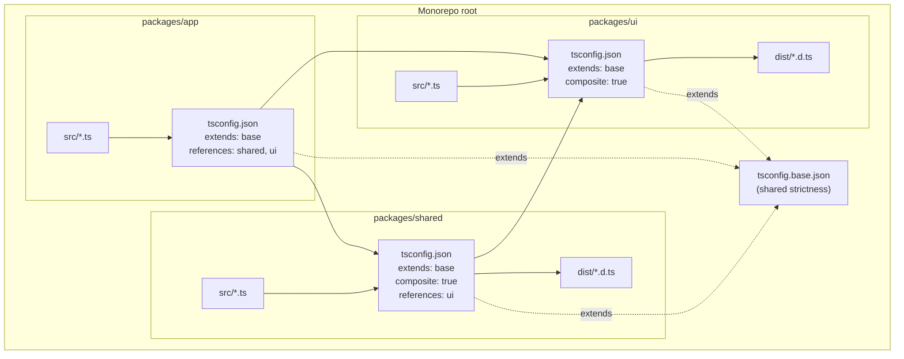
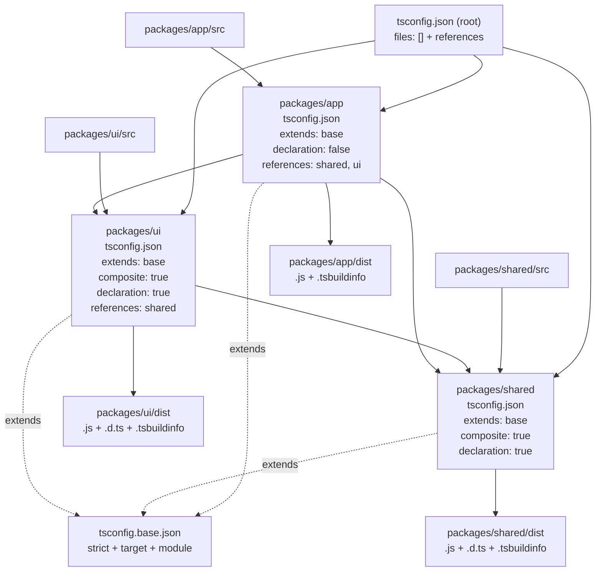

# 2.16 TSConfig Deep Dive

## 1. Purpose

Every nontrivial TypeScript project carries a small JSON file at its root called `tsconfig.json`. That file is the single source of truth for how the TypeScript compiler (`tsc`) interprets the source tree. Without it, `tsc` falls back to a default configuration that is loose, slow, and unsafe — and any project that grows past a handful of files will hit one of three failure modes: silent type errors that ship to production, builds that take minutes instead of seconds, or emitted JavaScript that does not run in the target runtime. The `tsconfig.json` file exists to prevent all three.

The reason `tsconfig.json` matters as much as it does is that TypeScript's defaults are deliberately permissive: `strict` off, `target` set to a low ECMAScript version, `module` set to `CommonJS`. None of those defaults are appropriate for a new project today, and a developer who runs `tsc --init` gets a freshly generated `tsconfig.json` with `strict: true` and a modern `target` precisely because the team-owned defaults are different from the compiler's baked-in ones.

The categories of compiler options — and the categories this note works through in order — are:

1. **Type-checking strictness** — `strict`, `noImplicitAny`, `strictNullChecks`, `strictFunctionTypes`, `strictBindCallApply`, `strictPropertyInitialization`, `noImplicitThis`, `alwaysStrict`, `useUnknownInCatchVariables`, `noUncheckedIndexedAccess`, `exactOptionalPropertyTypes`, `noImplicitReturns`, `noFallthroughCasesInSwitch`, `noImplicitOverride`. These control what the type system considers an error.
2. **Emit** — `target`, `module`, `outDir`, `rootDir`, `noEmit`, `declaration`, `declarationMap`, `sourceMap`, `inlineSourceMap`, `removeComments`, `importHelpers`, `downlevelIteration`. These control what JavaScript comes out of the compiler and where it goes.
3. **Module resolution** — `moduleResolution`, `baseUrl`, `paths`, `rootDirs`, `typeRoots`, `types`. These control how the compiler resolves `import` specifiers to files on disk.
4. **Project structure** — `include`, `exclude`, `files`, `references`, `composite`, `extends`. These control which files are part of the project and how sub-projects relate to each other.
5. **Performance** — `incremental`, `tsBuildInfoFile`, `skipLibCheck`, `assumeChangesOnlyAffectDirectDependencies`, `disableSourceOfProjectReferenceRedirect`. These control how fast the compiler runs.

A wrong choice in any of these categories produces a characteristic failure mode. A wrong `target` produces code that throws `SyntaxError` in older runtimes. A wrong `module` produces `Cannot use import statement outside a module` or `require is not defined`. A wrong `moduleResolution` produces `Cannot find module` errors for code that obviously exists on disk. A missing `strict` produces type errors the compiler should have caught but did not. A missing `composite` on a referenced project produces `Referenced project may not disable emit` and a build that refuses to run. A missing `incremental` produces a forty-second rebuild for a one-line change.

This note covers all five categories in depth, with side-by-side TypeScript source and emitted JavaScript for every option that changes the emit, and with configuration walkthroughs for both an application that uses a bundler (where `tsc` does not emit at all) and a library (where `tsc` emits declarations that downstream consumers depend on). The two scenarios are governed by different settings, and conflating them is one of the most common configuration mistakes.

The goal of this note is to make the following second nature:

1. Read a `tsconfig.json` and predict what JavaScript will come out of the compiler, what module-resolution strategy the compiler will use, and what category of type error the compiler will flag.
2. Choose the correct `target`, `module`, and `moduleResolution` for any runtime — Node CJS, Node ESM, browser with a bundler, browser without a bundler, Deno, Bun.
3. Configure a strict project from scratch, knowing exactly what each strictness flag turns on.
4. Set up a monorepo with project references, where each package has its own `tsconfig.json` that extends a shared base, builds independently, and type-checks across package boundaries.
5. Diagnose and fix the canonical tsconfig errors: `Cannot find module`, `Referenced project may not disable emit`, `Property does not exist on type`, `Object is possibly undefined`, `Type is not assignable to type 'T | undefined'`.

Read on. The theory section is the longest because the options interact, and most configuration bugs come from misunderstanding those interactions rather than from misunderstanding any single option in isolation. Cross-references to [[2.01 Design Goals and Limitations]] and [[6.07 TSC Compiler Operation]] are intentional — `tsconfig.json` is the user-facing surface of the compiler internals those notes describe.

## 2. Theory and Deep Dive

The theory section is structured as a tour through the five categories, with the load-bearing options in each. Where an option changes the emitted JavaScript, the TypeScript source and the emitted JavaScript are shown side by side. Where an option is type-checking only (no emit change), only the TypeScript source is shown, with a JavaScript comment block explaining what the compiler does at runtime (which is: nothing).

### 2.1 Anatomy of tsconfig.json

A `tsconfig.json` file has six top-level keys that matter: `extends`, `compilerOptions`, `include`, `exclude`, `files`, and `references`. The compiler reads them in roughly that order: it inherits from `extends`, then applies local `compilerOptions`, then determines which files are part of the project via `files` (an explicit list) or `include` (a glob pattern), minus anything in `exclude`, then resolves any `references` to other projects.

```typescript
// TS — a representative tsconfig.json (shown as TS for syntax highlighting)
{
  "extends": "./tsconfig.base.json",
  "compilerOptions": {
    "target": "ES2022",
    "module": "NodeNext",
    "moduleResolution": "NodeNext",
    "strict": true,
    "noUncheckedIndexedAccess": true,
    "exactOptionalPropertyTypes": true,
    "declaration": true,
    "incremental": true,
    "tsBuildInfoFile": ".tsbuildinfo/app.tsbuildinfo"
  },
  "include": ["src"],
  "exclude": ["dist", "**/*.test.ts"],
  "references": [
    { "path": "../shared" }
  ]
}
```

```javascript
// JS — tsconfig.json is not TypeScript; it is plain JSON consumed by tsc.
// There is no "emitted" form. The file is read at compile time and used
// to drive tsc's behaviour. At runtime it does not exist.
```

Note the absence of `files` in the example above. When `include` is present, `files` defaults to empty; the two keys are mutually exclusive in practice, with `files` being an explicit opt-in for very small projects where globbing is wasteful. The `exclude` key is consulted only when `include` is present; it filters the glob results. The dependency folder is always excluded by default, as are the directories named in `outDir`.

### 2.2 target

The `target` option tells the compiler which ECMAScript version the emitted JavaScript should run in. It controls three things: which syntax the compiler will downlevel (e.g. `class` to function-constructor patterns, arrow functions to function expressions), which `lib` files are included by default (e.g. `target: ES2020` includes `lib.es2020.d.ts` by default), and which emit-time helpers get pulled in (`importHelpers` from `tslib` for transforms like spread and async-await).

The valid targets are `ES5`, `ES6`/`ES2015`, `ES2016`, `ES2017`, `ES2018`, `ES2019`, `ES2020`, `ES2021`, `ES2022`, `ES2023`, `ES2024`, and `ESNext`. Each step up adds support for emitting newer syntax without downleveling. For example, with `target: ES2017`, the compiler emits `async`/`await` natively (it was standardised in ES2017); with `target: ES2015`, the compiler downlevels `async`/`await` to a generator-based transform that pulls in a runtime helper.

```typescript
// TS — source
async function fetchUser(id: number): Promise<User> {
  const res = await fetch(`/api/users/${id}`);
  return res.json();
}

class User {
  constructor(public name: string) {}
}
```

With `target: ES2022`:

```javascript
// JS — emitted by tsc with target ES2022 (async/await and class preserved)
async function fetchUser(id) {
  const res = await fetch("/api/users/" + id);
  return res.json();
}
class User {
  constructor(name) {
    this.name = name;
  }
}
```

With `target: ES5`:

```javascript
// JS — emitted by tsc with target ES5 (class downlevelled; async/await also
// downlevelled via a state-machine helper whose real-emit identifier names
// use leading-underscore characters and are omitted here for clarity)
var User = (function () {
  function User(name) {
    this.name = name;
  }
  return User;
}());
function fetchUser(id) {
  // Real tsc emit wraps this in a state-machine transform (~30 lines of
  // helper code) that converts the async/await syntax into a sequence of
  // promise-then callbacks. With target ES2017 or higher the syntax is
  // preserved natively.
  return fetch("/api/users/" + id).then(function (res) { return res.json(); });
}
```

Two practical implications. First, `target` controls emit, not type-checking — `Promise` is available as a type even with `target: ES5` because the type comes from `lib`, and `lib` defaults to a value matched to `target` but can be overridden. Second, the choice of `target` should match the *oldest runtime* the code will execute in. For Node 18+, `ES2022` is safe (Node 18 supports top-level await, class fields, and the rest of ES2022). For browsers, consult the `browserslist` config; for modern evergreen browsers, `ES2020` is a safe floor. For legacy Internet Explorer 11, you are stuck with `ES5` and the large downleveling emit shown above.

### 2.3 module

The `module` option tells the compiler which module system the emitted JavaScript should use. It controls the syntax of import/export statements in the emit, and it interacts with `moduleResolution` to determine how import specifiers are resolved.

The valid values are `CommonJS`, `AMD`, `UMD`, `System`, `ES2015`/`ES2020`/`ES2022`/`ESNext` (all of which emit native ESM, with newer values permitting newer ESM features like `import.meta` and top-level await), `Node16`, `NodeNext`, and `Preserve`. The ones that matter today are `CommonJS`, `NodeNext`, `ESNext`, and `Preserve`; the others are historical curiosities or specialist use cases.

```typescript
// TS — source
import { readFile } from "node:fs/promises";

export async function readConfig(path: string): Promise<Config> {
  const text = await readFile(path, "utf8");
  return JSON.parse(text);
}
```

With `module: CommonJS`:

```javascript
// JS — emitted by tsc with module CommonJS
// (Simplified: real tsc emit also adds an ES-module marker on the exports
// object and renames imported identifiers with a numeric suffix to avoid
// collisions; both are omitted here for clarity.)
"use strict";
const fs = require("node:fs/promises");
async function readConfig(path) {
  const text = await fs.readFile(path, "utf8");
  return JSON.parse(text);
}
exports.readConfig = readConfig;
```

With `module: NodeNext`:

```javascript
// JS — emitted by tsc with module NodeNext (and "type": "module" in package.json)
import { readFile } from "node:fs/promises";
export async function readConfig(path) {
  const text = await readFile(path, "utf8");
  return JSON.parse(text);
}
```

With `module: ESNext`:

```javascript
// JS — emitted by tsc with module ESNext — identical to NodeNext for this snippet
import { readFile } from "node:fs/promises";
export async function readConfig(path) {
  const text = await readFile(path, "utf8");
  return JSON.parse(text);
}
```

The difference between `NodeNext` and `ESNext` is not in the emit for this snippet — both emit native ESM. The difference is in how the compiler resolves import specifiers (`moduleResolution` is implied by `module: NodeNext` but must be set separately for `module: ESNext`), and in whether the compiler enforces Node's stricter ESM rules (e.g. file extensions required in relative import specifiers, `type: "module"` in `package.json`). Use `NodeNext` for Node projects; use `ESNext` or `Preserve` only when a bundler handles resolution.

The single most important interaction: `module: CommonJS` paired with `moduleResolution: NodeNext` is an error. `module: NodeNext` implies `moduleResolution: NodeNext` and overrides any explicit `moduleResolution` value. `module: CommonJS` implies `moduleResolution: Node` (the classic Node resolution) unless overridden.

### 2.4 moduleResolution

The `moduleResolution` option tells the compiler how to resolve an import specifier like `import { foo } from "bar"` to a file on disk. The valid values are `classic`, `node`, `node16`, `nodenext`, and `bundler`. Of these, `classic` is a 2012-era strategy that no one should use; `node` (alias `node10`) is the original Node CommonJS resolution, still the default when `module` is `CommonJS`; `node16` and `nodenext` are the modern Node resolution that handles both CJS and ESM correctly and enforces file extensions; `bundler` is for projects where a bundler (Webpack, Vite, esbuild, Rollup, SWC) handles resolution and TypeScript's job is only to type-check.

```typescript
// TS — source
import { something } from "./utils";        // no extension
import { express } from "express";          // bare specifier
import { foo } from "@myorg/shared";        // bare specifier from monorepo
```

With `moduleResolution: node` (classic Node CJS resolution):

```javascript
// JS — import specifiers preserved as-is in emit (CommonJS).
// Resolution at type-check time:
//   "./utils" -> tries ./utils.ts, ./utils.tsx, ./utils.d.ts, ./utils/index.ts, etc.
//   "express" -> walks up the dependency directory looking for express/package.json "types" field
//   "@myorg/shared" -> walks up the dependency directory looking for @myorg/shared
"use strict";
const utils = require("./utils");
const express = require("express");
const shared = require("@myorg/shared");
```

With `moduleResolution: nodenext`:

```javascript
// JS — import specifiers preserved as ESM.
// Resolution at type-check time:
//   "./utils" -> ERROR: relative path needs explicit file extension
//   "./utils.ts" -> OK at type-check time; emit rewrites to "./utils.js"
//   "express" -> looks at express/package.json "exports" field with conditions
//   "@myorg/shared" -> looks at @myorg/shared/package.json "exports" field
import { something } from "./utils";   // TS error under nodenext
import { express } from "express";
import { foo } from "@myorg/shared";
```

With `moduleResolution: bundler`:

```javascript
// JS — import specifiers preserved as ESM, bundler resolves at bundle time.
// Resolution at type-check time:
//   "./utils" -> OK, bundler mode allows extensionless relative imports
//   "express" -> OK, bundler mode reads package.json "exports"
//   "@myorg/shared" -> OK
// (Bundler mode requires module: esnext or preserve and no node-specific rules.)
import { something } from "./utils";
import { express } from "express";
import { foo } from "@myorg/shared";
```

The rule of thumb: use `bundler` for browser/bundled apps, use `nodenext` for Node apps (and pair it with `module: NodeNext`), use `node` only for legacy Node CJS projects that have not migrated.

### 2.5 lib

The `lib` option tells the compiler which built-in type definitions (the ambient declarations for things like `Array.prototype.flatMap`, `Promise.allSettled`, `Object.fromEntries`, `globalThis`, `localStorage`, `document`) to include. The default is a value matched to `target` (e.g. `target: ES2020` includes `lib.es2020.d.ts`), but `lib` can be overridden independently.

The two most common overrides are: adding `"DOM"` to the lib for browser-targeted code (so `document` and `window` are typed), and removing `"DOM"` for Node-only code (so a stray `document.getElementById` is caught at compile time, not at runtime).

```typescript
// TS — source that uses both DOM and ES2020 features
const button = document.querySelector("button");           // DOM
const entries = Object.fromEntries([["a", 1], ["b", 2]]); // ES2019
const allSettled = await Promise.allSettled([              // ES2020
  fetch("/a"),
  fetch("/b"),
]);
```

```javascript
// JS — emitted (unchanged regardless of lib; lib only affects type-checking)
const button = document.querySelector("button");
const entries = Object.fromEntries([["a", 1], ["b", 2]]);
const allSettled = await Promise.allSettled([
  fetch("/a"),
  fetch("/b"),
]);
```

With `lib: ["ES2020", "DOM"]`, all three lines type-check. With `lib: ["ES2020"]` (no DOM), `document.querySelector` is a type error. With `lib: ["ES2017", "DOM"]`, `Object.fromEntries` is a type error (added in ES2019). The `lib` option tightens the type-check to match your runtime, independent of `target`.

### 2.6 strict and its family

`strict: true` is a shorthand that enables eight individual strictness flags at once. Each of those flags can also be enabled individually, which matters when you are migrating an existing project: you can turn on strictness flags one at a time, fix the resulting errors, and reach `strict: true` over weeks rather than in a single painful commit.

The eight flags `strict: true` enables are:

1. **`noImplicitAny`** — flags any parameter or variable whose type cannot be inferred and would otherwise silently become `any`. This is the single most important strictness flag; without it, the compiler lets untyped code through that can hide almost any bug.
2. **`strictNullChecks`** — distinguishes `null` and `undefined` from `T`. Without it, every type silently includes `null` and `undefined`, and `null.foo` is not a type error. With it, `string` and `string | null` are different types, and you must narrow before accessing properties.
3. **`strictFunctionTypes`** — uses contravariant function parameter checking. Without it, function parameters are bivariantly checked (which is unsound but convenient for event-handler subtyping). With it, `(x: Animal) => void` is not assignable to `(x: Dog) => void` even though `Dog` is assignable to `Animal`.
4. **`strictBindCallApply`** — types `Function.prototype.bind`, `call`, and `apply` correctly using tuple types. Without it, those methods are typed as `any`.
5. **`strictPropertyInitialization`** — requires every class property to be initialised in the constructor or with a default value. Without it, `class Foo { x: number }` is allowed (and `x` is `undefined` at runtime, contradicting the type).
6. **`noImplicitThis`** — flags functions where the type of `this` cannot be inferred (typically callbacks passed to `forEach`, `map`, etc.). Without it, `this` is silently `any`.
7. **`alwaysStrict`** — emits `"use strict";` at the top of every output file and parses the source in strict mode.
8. **`useUnknownInCatchVariables`** — types the variable in a `catch` block as `unknown` instead of `any`. Requires narrowing before accessing properties.

```typescript
// TS — strict-mode violations
function double(x) { return x * 2; }            // noImplicitAny: x is implicit any
const arr: string[] = ["a"];
const first: string = arr[0];                   // noUncheckedIndexedAccess: arr[0] is string | undefined
class Counter { count: number; }                // strictPropertyInitialization: count not initialised
try { throw new Error("boom"); } catch (e) {    // useUnknownInCatchVariables: e is unknown
  console.log(e.message);                       // ERROR: e is unknown, must narrow
}
```

```javascript
// JS — emitted (strict-mode flags do not change runtime behaviour except for "use strict")
"use strict";
function double(x) { return x * 2; }
const arr = ["a"];
const first = arr[0];
class Counter {
}
try { throw new Error("boom"); } catch (e) {
  console.log(e.message);
}
```

The key point is that strictness flags are *compile-time only*. They do not change what JavaScript comes out of the compiler (except for the `"use strict"` directive from `alwaysStrict`). They change what the compiler rejects.

### 2.7 noUncheckedIndexedAccess

`noUncheckedIndexedAccess` is the strictness flag that experienced TypeScript developers most often wish were part of `strict: true`. It is not — it has to be set explicitly. With it on, every indexed access on an array, tuple, or record-with-string-index-signature returns `T | undefined` instead of `T`, because the index might be out of bounds.

```typescript
// TS — source
const numbers: number[] = [1, 2, 3];
const first: number = numbers[0];     // ERROR: numbers[0] is number | undefined
const third: number = numbers[2];
const tenth: number = numbers[10];    // number | undefined at type level (no runtime check added)

const map: Record<string, number> = { a: 1 };
const value: number = map["a"];       // number | undefined at type level

// Narrow before using:
const safe = numbers[0];              // number | undefined
if (safe !== undefined) {
  const doubled: number = safe * 2;   // OK, narrowed
}
```

```javascript
// JS — emitted (no runtime check added; this is a type-level change only)
const numbers = [1, 2, 3];
const first = numbers[0];
const third = numbers[2];
const tenth = numbers[10];
const map = { a: 1 };
const value = map["a"];
const safe = numbers[0];
if (safe !== undefined) {
  const doubled = safe * 2;
}
```

Note that `noUncheckedIndexedAccess` does *not* add a runtime check — it only changes the type. The emitted JavaScript is identical with and without the flag. The value of the flag is that the compiler now refuses to let you write `const first: number = numbers[0]` without narrowing, which prevents an entire class of `TypeError: Cannot read properties of undefined` bugs.

The flag is named "noUnchecked" because it disables the implicit assumption that indexed access is always in bounds. The trade-off is more narrowing boilerplate; the gain is a class of bugs eliminated at compile time.

### 2.8 exactOptionalPropertyTypes

`exactOptionalPropertyTypes` is the second strictness flag that is not part of `strict: true`. It changes the meaning of optional properties (`prop?: T`). Without the flag, `prop?: T` means "the property is either absent or of type `T`, and explicitly setting it to `undefined` is allowed." With the flag, `prop?: T` means "the property is either absent or of type `T`, and explicitly setting it to `undefined` is NOT allowed." If you want to allow `undefined` explicitly, you must write `prop: T | undefined` instead.

```typescript
// TS — source
interface Options {
  timeout?: number;       // optional, but NOT explicitly undefined
  retries: number | undefined;  // required, explicitly undefined allowed
}

function send(opts: Options) { /* ... */ }

send({ timeout: 1000, retries: 3 });         // OK
send({ retries: 3 });                         // OK (timeout absent)
send({ timeout: undefined, retries: 3 });     // ERROR under exactOptionalPropertyTypes
send({ timeout: 1000, retries: undefined });  // OK
```

```javascript
// JS — emitted (no runtime difference; type-only change)
function send(opts) { /* ... */ }
send({ timeout: 1000, retries: 3 });
send({ retries: 3 });
send({ timeout: undefined, retries: 3 });
send({ timeout: 1000, retries: undefined });
```

The motivation for the flag is that some libraries distinguish "property absent" from "property explicitly undefined" — for example, an HTTP client might omit the header entirely in the first case but send `Header: undefined` in the second. Without `exactOptionalPropertyTypes`, the type system cannot express that distinction. The trade-off is friction with libraries that have not been written with the flag in mind; turning it on in an existing project typically produces hundreds of errors and is best done as a focused migration.

### 2.9 paths and baseUrl

The `paths` option lets you declare path aliases: short, stable import specifiers that the compiler maps to file paths. The canonical example is `@/*` mapping to `./src/*`, so that `import { foo } from "@/foo"` resolves to `./src/foo.ts` regardless of where the importing file lives.

```typescript
// TS — tsconfig.json fragment
{
  "compilerOptions": {
    "baseUrl": ".",
    "paths": {
      "@/*": ["./src/*"],
      "@app/*": ["./src/app/*"],
      "@shared/*": ["./packages/shared/src/*"]
    }
  }
}

// Source file using aliases
import { config } from "@/config";
import { User } from "@shared/types";
```

```javascript
// JS — emitted by tsc, alias preserved as-is (a bundler or runtime resolver must handle it)
const config = require("@/config");
const User = require("@shared/types").User;
// (or, with module: nodenext:)
// import { config } from "@/config";
// import { User } from "@shared/types";
```

The crucial subtlety: `paths` does not rewrite import specifiers in the emitted JavaScript. The emit keeps the alias as-is, which means a downstream runtime (Node, or a bundler) must also be configured to resolve the alias. For Webpack this is `resolve.alias`; for Vite it is `resolve.alias`; for Jest it is `moduleNameMapper`; for Node it requires `tsconfig-paths` or a loader hook. Failing to configure the runtime resolver is one of the most common tsconfig mistakes.

Historically `paths` required `baseUrl` to be set; since TypeScript 5.0, `baseUrl` is optional and `paths` can be specified without it (paths are then resolved relative to the tsconfig.json itself). This is a cleaner pattern for monorepos.

### 2.10 incremental and tsBuildInfoFile

The `incremental` flag tells the compiler to emit a `.tsbuildinfo` file containing the type-checking state of the project from the last build. On the next build, the compiler reads that file and skips type-checking for files whose contents (and the contents of files they depend on) have not changed. For a project of a thousand files, this can turn a thirty-second clean rebuild into a two-second incremental rebuild.

```typescript
// TS — tsconfig.json fragment
{
  "compilerOptions": {
    "incremental": true,
    "tsBuildInfoFile": ".tsbuildinfo/app.tsbuildinfo"
  }
}
```

```javascript
// JS — no runtime change. The .tsbuildinfo file is a JSON file written next to
// (or at the path specified by tsBuildInfoFile) the emitted output. It contains
// a fingerprint of every source file, the compiler version, and the set of
// files type-checked last time. It is safe to delete; doing so forces a clean
// rebuild.
```

The `tsBuildInfoFile` option lets you control where the file is written. A common pattern is to write it into a `.tsbuildinfo/` directory that is gitignored. The file should not be committed.

`incremental` is implied by `composite: true` (see next subsection). It can also be enabled independently for non-composite projects. The flag is a pure performance optimisation; it does not change what the compiler does, only how fast it does it.

### 2.11 composite and project references

Project references are the mechanism for splitting a large TypeScript project into smaller sub-projects, each with its own `tsconfig.json`, that build independently and type-check across boundaries. The setup is: each sub-project has `composite: true` in its `tsconfig.json`, the parent project lists each sub-project in its `references` array, and the parent builds the sub-projects via `tsc --build` (which orchestrates building in dependency order and caches results).

The `composite` flag enforces three constraints that make project references work:

1. `rootDir` defaults to the directory containing the `tsconfig.json` (so all source files must live under the project root).
2. `declaration` is forced on (so the project emits `.d.ts` files that other projects can consume).
3. `incremental` is forced on (so the project emits a `.tsbuildinfo` file).



The build process for a project-references monorepo is `tsc --build` from the root. The compiler reads the root `tsconfig.json`, sees the references, builds them in topological order (ui before shared, shared before app), and caches each build's `.tsbuildinfo` so that a rebuild only re-checks changed projects.

```typescript
// TS — root tsconfig.json
{
  "files": [],
  "references": [
    { "path": "./packages/ui" },
    { "path": "./packages/shared" },
    { "path": "./packages/app" }
  ]
}

// TS — packages/shared/tsconfig.json
{
  "extends": "../../tsconfig.base.json",
  "compilerOptions": {
    "composite": true,
    "outDir": "./dist",
    "rootDir": "./src"
  },
  "include": ["src"]
}

// TS — packages/app/tsconfig.json
{
  "extends": "../../tsconfig.base.json",
  "compilerOptions": {
    "outDir": "./dist",
    "rootDir": "./src",
    "paths": {
      "@shared/*": ["../shared/src/*"]
    }
  },
  "include": ["src"],
  "references": [
    { "path": "../shared" },
    { "path": "../ui" }
  ]
}
```

```javascript
// JS — emitted by `tsc --build`
// Each package emits its own dist/ directory:
//   packages/ui/dist/index.js, index.d.ts, .tsbuildinfo
//   packages/shared/dist/index.js, index.d.ts, .tsbuildinfo
//   packages/app/dist/index.js, .tsbuildinfo (no declarations if declaration: false)
// The root tsconfig.json has files: [] so it emits nothing itself;
// it exists only to hold the references array for the orchestrator.
```

The two big wins from project references are build speed (a one-line change in `app` only rebuilds `app`, not `shared` and `ui`) and type-checking across boundaries (a breaking change in `shared` is caught at `app`'s build time, not at runtime).

### 2.12 extends

The `extends` option lets a `tsconfig.json` inherit from another `tsconfig.json`. The inherited config can be local (a relative path) or from a package (an npm package that exports a `tsconfig.json`). The compiler deep-merges `compilerOptions`, with the child's values overriding the parent's. Arrays like `include` and `exclude` are replaced, not concatenated.

```typescript
// TS — tsconfig.base.json
{
  "compilerOptions": {
    "target": "ES2022",
    "module": "NodeNext",
    "moduleResolution": "NodeNext",
    "strict": true,
    "noUncheckedIndexedAccess": true,
    "exactOptionalPropertyTypes": true,
    "declaration": true,
    "declarationMap": true,
    "sourceMap": true
  }
}

// TS — tsconfig.json
{
  "extends": "./tsconfig.base.json",
  "compilerOptions": {
    "outDir": "./dist",
    "rootDir": "./src"
  },
  "include": ["src"]
}
```

```javascript
// JS — the effective config is the deep-merged result:
// {
//   "compilerOptions": {
//     "target": "ES2022",
//     "module": "NodeNext",
//     "moduleResolution": "NodeNext",
//     "strict": true,
//     "noUncheckedIndexedAccess": true,
//     "exactOptionalPropertyTypes": true,
//     "declaration": true,
//     "declarationMap": true,
//     "sourceMap": true,
//     "outDir": "./dist",
//     "rootDir": "./src"
//   },
//   "include": ["src"]
// }
```

The `extends` field also accepts an array (since TS 5.0) of configs, applied in order, which lets you compose a base config with a project-type-specific config (e.g. `extends: ["./tsconfig.base.json", "@tsconfig/strictest/tsconfig.json"]`).

### 2.13 Emit-related options

The remaining emit options worth knowing:

- **`outDir`** — directory to emit JavaScript into.
- **`rootDir`** — directory containing the source files; output structure mirrors it under `outDir`.
- **`noEmit`** — type-check only, do not emit. Used when a bundler (esbuild, Vite, SWC) handles emit.
- **`declaration`** — emit `.d.ts` files alongside `.js`. Required for libraries and for `composite`.
- **`declarationMap`** — emit `.d.ts.map` files so editors can jump from a `.d.ts` to the source `.ts`.
- **`sourceMap`** — emit `.js.map` files for debugging.
- **`removeComments`** — strip comments from emitted JavaScript.
- **`importHelpers`** — import helpers from `tslib` instead of inlining them. Reduces emit size when downleveling.
- **`downlevelIteration`** — emit a runtime helper for `for...of` loops on non-arrays when targeting ES5.

```typescript
// TS — tsconfig.json fragment for a library
{
  "compilerOptions": {
    "target": "ES2020",
    "module": "NodeNext",
    "moduleResolution": "NodeNext",
    "strict": true,
    "declaration": true,
    "declarationMap": true,
    "sourceMap": true,
    "outDir": "./dist",
    "rootDir": "./src",
    "importHelpers": true,
    "removeComments": false
  },
  "include": ["src"]
}
```

```javascript
// JS — emitted by tsc
// dist/
//   index.js          (emitted JavaScript)
//   index.js.map      (source map)
//   index.d.ts        (type declarations)
//   index.d.ts.map    (declaration map, jumps to src/index.ts in editors)
// src/                (source untouched)
//   index.ts
```

### 2.14 Interactions and pitfalls

The options above interact in ways that produce specific, well-known failure modes. The most common interactions:

- `module: NodeNext` overrides any explicit `moduleResolution`. Setting `moduleResolution: Node` with `module: NodeNext` is silently ignored.
- `composite: true` forces `declaration: true` and `incremental: true`. Setting `declaration: false` on a composite project is a compile error.
- `noEmit: true` on a composite project is also a compile error (`Referenced project may not disable emit`), because downstream projects need the `.d.ts` files that the composite project emits.
- `paths` does not rewrite emitted JavaScript; the runtime must resolve the alias.
- `strict: true` does not enable `noUncheckedIndexedAccess` or `exactOptionalPropertyTypes`; these must be set explicitly.
- `target: ES5` with `module: ESNext` produces ESM-syntax imports on ES5 function-expression code, which is rarely what you want; pair targets and modules sensibly.

These interactions are the source of most real-world tsconfig bugs, and each is treated in Section 6.

## 3. Mental Models

The right mental models make tsconfig predictable. Each of these is a one-line compression of an option's purpose.

1. **tsconfig = "the compiler's settings."** The file is read by `tsc` at the start of every build. It is not part of your program. It does not run at runtime. It is configuration for a tool.
2. **target = "what JS version to emit."** The compiler reads your modern TypeScript and writes JavaScript that runs in the runtime you target. A higher target means less downleveling, smaller emit, and reliance on runtime support for newer features.
3. **module = "what module system to use."** The compiler writes `require` calls or `import` statements based on this. The choice is dictated by your runtime: Node CJS, Node ESM, or a bundler.
4. **moduleResolution = "how to find imports."** When the compiler sees `import { foo } from "bar"`, it walks the filesystem according to this strategy to find `bar` and its types. The choice is dictated by your runtime and module system.
5. **strict = "turn on all the safety."** One flag flips on eight independent checks. The checks are independent, but turning them all on at once is the recommended default for new projects.
6. **paths = "short names for long paths."** The compiler translates the alias when type-checking; the runtime must translate it again when running.
7. **incremental = "remember what you checked last time."** The `.tsbuildinfo` file is a cache of the type-checking state. Deleting it forces a clean rebuild.
8. **composite = "this project can be referenced."** It enforces the constraints (declaration emit, rootDir, incremental) that make cross-project type-checking possible.
9. **project references = "split a big project into smaller, faster-building sub-projects."** Each sub-project builds independently; the orchestrator builds them in dependency order.
10. **extends = "inherit from a base config."** The base config is the canonical place to put shared strictness, target, and module settings; child configs add project-specific paths and references.

The unifying model is this: a tsconfig is a *recipe* for one compilation unit. It tells the compiler what files are in the unit (include/exclude/files), what JavaScript to produce (target/module/emit options), how to resolve imports (moduleResolution/paths), what to check (strict flags), and how it relates to other units (references/extends). Every tsconfig mistake reduces to one of those five categories being wrong.

## 4. Real-World Use Cases

1. **Monorepos with project references.** A monorepo with `packages/app`, `packages/shared`, `packages/ui`, each with its own `tsconfig.json` extending a shared `tsconfig.base.json`, wired together by a root `tsconfig.json` with `references`. Build with `tsc --build`. A one-line change in `app` rebuilds only `app`, taking 2 seconds instead of 30.
2. **Library configs.** A library that ships to npm needs `declaration: true` to emit `.d.ts` files, `composite: true` if other monorepo packages consume it via project references, `importHelpers: true` to reduce emit size, and a `target` matched to the lowest supported runtime (typically `ES2019` or `ES2020` for libraries, since consumers may be on older runtimes).
3. **App configs with a bundler.** A Vite/esbuild/Webpack app typically sets `noEmit: true` (the bundler emits), `module: ESNext`, `moduleResolution: bundler`, and lets the bundler handle resolution. The tsconfig's only job is type-checking.
4. **Path aliases for cleaner imports.** An app with deep directory nesting uses `paths` to alias `@/` to `./src/`, so `import { config } from "@/config"` replaces `import { config } from "../../../config"`. The same alias must be configured in the bundler.
5. **Strict for all new projects.** A new project starts with `strict: true`, `noUncheckedIndexedAccess: true`, and `exactOptionalPropertyTypes: true` from day one. Turning these on later is a multi-day migration; turning them on at the start costs nothing.
6. **noUncheckedIndexedAccess for safety.** A codebase that does heavy array access (parsers, tokenizers, game engines, data-processing pipelines) turns on `noUncheckedIndexedAccess` to eliminate a class of `undefined` access bugs at compile time.
7. **Node ESM migration.** A Node project migrating from CommonJS to ESM sets `module: NodeNext` and `moduleResolution: NodeNext`, adds `.js` extensions to relative imports, sets `"type": "module"` in `package.json`, and uses `.mts`/`.cts` for mixed-source projects.
8. **Browser library with DOM types.** A browser library sets `lib: ["ES2022", "DOM"]` for both modern ECMAScript types and DOM types. A Node-only library sets `lib: ["ES2022"]` so accidental `document.querySelector` calls are caught at compile time.
9. **Hot-reload performance.** A large app enables `incremental: true` and writes the `.tsbuildinfo` file to a stable path so that watch-mode rebuilds skip unchanged files.
10. **Migration of an existing codebase to strict.** A legacy codebase turns on strictness flags one at a time (`noImplicitAny` first, then `strictNullChecks`, then `strictFunctionTypes`), fixing errors in focused commits over weeks. The final commit sets `strict: true` as a no-op.

## 5. Code Examples

### 5.1 Example A — Minimal and Conceptual

Each of the major options demonstrated with a small snippet, side by side with the emitted JavaScript.

#### 5.1.1 target: ES5 vs ES2022

```typescript
// TS — source
const list = [1, 2, 3];
const doubled = list.map((n) => n * 2);

class Greeter {
  constructor(public name: string) {}
  greet() { return `Hello, ${this.name}`; }
}
```

```javascript
// JS — emitted with target: ES2022 (native classes and arrow functions preserved)
const list = [1, 2, 3];
const doubled = list.map((n) => n * 2);
class Greeter {
  constructor(name) { this.name = name; }
  greet() { return `Hello, ${this.name}`; }
}
```

```javascript
// JS — emitted with target: ES5 (classes downlevelled to function-constructor
// pattern; template literals downlevelled to string concatenation; arrows
// downlevelled to function expressions; let/const downlevelled to var)
var list = [1, 2, 3];
var doubled = list.map(function (n) { return n * 2; });
var Greeter = (function () {
  function Greeter(name) { this.name = name; }
  Greeter.prototype.greet = function () { return "Hello, " + this.name; };
  return Greeter;
}());
// If the source uses async/await, tsc additionally emits a state-machine
// transform with runtime helpers (real tsc emit names those helpers with
// double-underscore prefixes, omitted here). With target ES2017 or higher,
// async/await is preserved natively.
```

#### 5.1.2 module: CommonJS vs NodeNext

```typescript
// TS — source
import { readFile } from "node:fs/promises";
import { parse } from "./parse";

export async function loadConfig(path: string) {
  return parse(await readFile(path, "utf8"));
}
```

```javascript
// JS — emitted with module: CommonJS
// (Simplified: real tsc emit also adds an ES-module marker on the exports
// object and renames imported identifiers with a numeric suffix; omitted here.)
"use strict";
const fs = require("node:fs/promises");
const parse = require("./parse");
async function loadConfig(path) {
  return parse.parse(await fs.readFile(path, "utf8"));
}
exports.loadConfig = loadConfig;
```

```javascript
// JS — emitted with module: NodeNext (with "type": "module" in package.json)
import { readFile } from "node:fs/promises";
import { parse } from "./parse.js";  // NodeNext requires the .js extension
export async function loadConfig(path) {
  return parse(await readFile(path, "utf8"));
}
```

#### 5.1.3 strict family — each flag demonstrated

```typescript
// TS — strict: true turns on all of the below

// noImplicitAny
function add(a, b) { return a + b; }            // ERROR: a, b are implicit any

// strictNullChecks
const s: string | null = Math.random() > 0.5 ? "hi" : null;
console.log(s.length);                            // ERROR: s is possibly null

// strictPropertyInitialization
class Counter { count: number; }                  // ERROR: count not initialised

// useUnknownInCatchVariables
try { JSON.parse("oops"); } catch (e) {
  console.log(e.message);                          // ERROR: e is unknown, must narrow
}
```

```javascript
// JS — emitted (strict-mode flags are type-only, except alwaysStrict which adds "use strict")
"use strict";
function add(a, b) { return a + b; }
const s = Math.random() > 0.5 ? "hi" : null;
console.log(s.length);
class Counter {
}
try { JSON.parse("oops"); } catch (e) {
  console.log(e.message);
}
```

#### 5.1.4 noUncheckedIndexedAccess

```typescript
// TS — source
const arr: number[] = [1, 2, 3];
const a: number = arr[0];      // ERROR: arr[0] is number | undefined
const b: number | undefined = arr[0];   // OK
if (arr[0] !== undefined) {
  const c: number = arr[0];    // OK, narrowed inside the if
}
```

```javascript
// JS — emitted (identical with or without the flag; type-level change only)
const arr = [1, 2, 3];
const a = arr[0];
const b = arr[0];
if (arr[0] !== undefined) {
  const c = arr[0];
}
```

#### 5.1.5 exactOptionalPropertyTypes

```typescript
// TS — source
interface Options { timeout?: number; }
function send(opts: Options) { /* ... */ }

send({});                       // OK
send({ timeout: 1000 });        // OK
send({ timeout: undefined });   // ERROR under exactOptionalPropertyTypes
```

```javascript
// JS — emitted (no runtime difference)
function send(opts) { /* ... */ }
send({});
send({ timeout: 1000 });
send({ timeout: undefined });
```

#### 5.1.6 paths

```typescript
// TS — tsconfig.json fragment
{
  "compilerOptions": {
    "baseUrl": ".",
    "paths": {
      "@/*": ["./src/*"]
    }
  }
}

// Source file
import { config } from "@/config";
import { User } from "@/models/user";
```

```javascript
// JS — emitted by tsc (alias preserved; runtime resolver must handle it)
const config = require("@/config");
const User = require("@/models/user").User;
```

#### 5.1.7 incremental

```typescript
// TS — tsconfig.json fragment
{
  "compilerOptions": {
    "incremental": true,
    "tsBuildInfoFile": ".tsbuildinfo/app.tsbuildinfo"
  }
}

// First build: writes .tsbuildinfo/app.tsbuildinfo
// Subsequent builds: reads the file, skips unchanged files
```

```javascript
// JS — no runtime change. The .tsbuildinfo file is JSON containing a
// fingerprint of every source file, the compiler version, and the set of
// files type-checked last time. Deleted on `tsc --build --clean`.
```

#### 5.1.8 composite and project references

```typescript
// TS — packages/shared/tsconfig.json
{
  "extends": "../../tsconfig.base.json",
  "compilerOptions": {
    "composite": true,
    "outDir": "./dist",
    "rootDir": "./src"
  },
  "include": ["src"],
  "references": []
}

// TS — packages/app/tsconfig.json
{
  "extends": "../../tsconfig.base.json",
  "compilerOptions": {
    "outDir": "./dist",
    "rootDir": "./src"
  },
  "include": ["src"],
  "references": [{ "path": "../shared" }]
}

// TS — root tsconfig.json
{
  "files": [],
  "references": [
    { "path": "./packages/shared" },
    { "path": "./packages/app" }
  ]
}
```

```javascript
// JS — `tsc --build` from the root produces:
// packages/shared/dist/index.js
// packages/shared/dist/index.d.ts
// packages/shared/tsconfig.tsbuildinfo
// packages/app/dist/index.js
// packages/app/tsconfig.tsbuildinfo
// Build order: shared first (because app references it), then app.
```

### 5.2 Example B — Production-Grade

A full monorepo tsconfig setup with project references, path aliases, a strict base config, separate library and app configs, and `tsc --build` orchestration.

#### 5.2.1 Directory layout

```
myorg-monorepo/
  tsconfig.base.json
  tsconfig.json                  (root references)
  packages/
    shared/
      package.json
      tsconfig.json              (library config)
      src/
        index.ts
        types.ts
      dist/                      (emitted by tsc)
    ui/
      package.json
      tsconfig.json              (library config, depends on shared)
      src/
        index.ts
      dist/
    app/
      package.json
      tsconfig.json              (app config, depends on shared and ui)
      src/
        index.ts
      dist/
```

#### 5.2.2 The base config

```typescript
// TS — tsconfig.base.json
{
  "compilerOptions": {
    "target": "ES2022",
    "lib": ["ES2022"],
    "module": "NodeNext",
    "moduleResolution": "NodeNext",
    "strict": true,
    "noUncheckedIndexedAccess": true,
    "exactOptionalPropertyTypes": true,
    "noImplicitOverride": true,
    "noImplicitReturns": true,
    "noFallthroughCasesInSwitch": true,
    "forceConsistentCasingInFileNames": true,
    "esModuleInterop": true,
    "skipLibCheck": true,
    "declaration": true,
    "declarationMap": true,
    "sourceMap": true,
    "importHelpers": true,
    "incremental": true
  }
}
```

```javascript
// JS — tsconfig.base.json is plain JSON, not emitted. It is the inherited
// configuration for every package's tsconfig.json via "extends".
```

#### 5.2.3 The root config

```typescript
// TS — tsconfig.json (root)
{
  "files": [],
  "references": [
    { "path": "./packages/shared" },
    { "path": "./packages/ui" },
    { "path": "./packages/app" }
  ]
}
```

```javascript
// JS — `tsc --build` reads this file, builds the referenced projects in
// topological order (shared -> ui -> app), caches each build's .tsbuildinfo,
// and only rebuilds projects whose inputs changed since the last build.
// `tsc --build --watch` runs the same in watch mode.
// `tsc --build --clean` deletes all emitted files and .tsbuildinfo files.
```

#### 5.2.4 The shared library config

```typescript
// TS — packages/shared/tsconfig.json
{
  "extends": "../../tsconfig.base.json",
  "compilerOptions": {
    "composite": true,
    "outDir": "./dist",
    "rootDir": "./src",
    "tsBuildInfoFile": "./dist/.tsbuildinfo"
  },
  "include": ["src"],
  "references": []
}

// TS — packages/shared/src/index.ts
export type { User, Post } from "./types.js";
export function formatUser(u: { name: string; age: number }): string {
  return `${u.name} (${u.age})`;
}

// TS — packages/shared/src/types.ts
export interface User { id: string; name: string; age: number; }
export interface Post { id: string; authorId: string; title: string; }
```

```javascript
// JS — emitted by `tsc --build` into packages/shared/dist/
// dist/index.js
// dist/index.d.ts
// dist/index.d.ts.map
// dist/index.js.map
// dist/types.js
// dist/types.d.ts
// dist/types.d.ts.map
// dist/types.js.map
// dist/.tsbuildinfo
```

```javascript
// JS — dist/index.js (emitted)
export { };
export function formatUser(u) {
  return `${u.name} (${u.age})`;
}
```

```javascript
// JS — dist/index.d.ts (emitted)
export type { User, Post } from "./types.js";
export declare function formatUser(u: { name: string; age: number; }): string;
```

#### 5.2.5 The UI library config (depends on shared)

```typescript
// TS — packages/ui/tsconfig.json
{
  "extends": "../../tsconfig.base.json",
  "compilerOptions": {
    "composite": true,
    "outDir": "./dist",
    "rootDir": "./src",
    "tsBuildInfoFile": "./dist/.tsbuildinfo",
    "paths": {
      "@myorg/shared": ["../shared/src"],
      "@myorg/shared/*": ["../shared/src/*"]
    }
  },
  "include": ["src"],
  "references": [{ "path": "../shared" }]
}

// TS — packages/ui/src/index.ts
import type { User } from "@myorg/shared";
import { formatUser } from "@myorg/shared";

export function UserCard(props: { user: User }): string {
  return `<div>${formatUser(props.user)}</div>`;
}
```

```javascript
// JS — emitted dist/index.js
import { formatUser } from "@myorg/shared";  // alias preserved; runtime must resolve
export function UserCard(props) {
  return `<div>${formatUser(props.user)}</div>`;
}
```

Note the subtlety: `paths` lets the type-checker find `@myorg/shared`, but the emitted JavaScript still says `@myorg/shared`, so the runtime must also resolve the alias. In a monorepo this is handled by the package manager (pnpm or npm workspaces) symlinking `@myorg/shared` into the dependency directory. Without that symlink, the runtime import fails.

#### 5.2.6 The app config (depends on shared and ui)

```typescript
// TS — packages/app/tsconfig.json
{
  "extends": "../../tsconfig.base.json",
  "compilerOptions": {
    "composite": false,
    "outDir": "./dist",
    "rootDir": "./src",
    "tsBuildInfoFile": "./dist/.tsbuildinfo",
    "declaration": false,
    "noEmitOnError": true,
    "paths": {
      "@myorg/shared": ["../shared/src"],
      "@myorg/shared/*": ["../shared/src/*"],
      "@myorg/ui": ["../ui/src"],
      "@myorg/ui/*": ["../ui/src/*"]
    }
  },
  "include": ["src"],
  "references": [
    { "path": "../shared" },
    { "path": "../ui" }
  ]
}

// TS — packages/app/src/index.ts
import { UserCard } from "@myorg/ui";
import type { User } from "@myorg/shared";

const user: User = { id: "1", name: "Alice", age: 30 };
console.log(UserCard({ user }));
```

```javascript
// JS — emitted dist/index.js
import { UserCard } from "@myorg/ui";
const user = { id: "1", name: "Alice", age: 30 };
console.log(UserCard({ user }));
```

#### 5.2.7 The build

```typescript
// TS — package.json scripts at the root
{
  "scripts": {
    "build": "tsc --build",
    "clean": "tsc --build --clean",
    "watch": "tsc --build --watch",
    "typecheck": "tsc --build --dry"
  }
}
```

```javascript
// JS — running `npm run build` from the root executes:
//   1. tsc reads root tsconfig.json, finds references to shared, ui, app
//   2. tsc builds shared first (no upstream deps), emits to packages/shared/dist
//   3. tsc builds ui (depends on shared), reads shared's emitted .d.ts files
//   4. tsc builds app (depends on shared and ui), reads their emitted .d.ts files
//   5. tsc writes a .tsbuildinfo file in each package's dist/ directory
//
// On the next `npm run build`, tsc reads the .tsbuildinfo files and skips
// rebuilding packages whose inputs have not changed.
//
// `npm run watch` runs the same logic in watch mode.
// `npm run clean` deletes all dist/ directories and .tsbuildinfo files.
```

This is the canonical production-grade monorepo setup. It scales: a 50-package monorepo with this structure builds incrementally in seconds, type-checks across package boundaries, and lets each package ship its own `.d.ts` files.

## 6. Common Mistakes and Anti-Patterns

### 6.1 Wrong target (too high for the runtime)

**Symptom:** `SyntaxError: Unexpected token` or `SyntaxError: Unexpected token class` in older runtimes.

**Cause:** `target: ES2022` set when the code runs in an older runtime (Node 14, old browser).

**Fix:** Lower `target` to the highest version supported by your *minimum* runtime. For Node 18+, `ES2022`; for Node 16, `ES2020`; for Internet Explorer 11, `ES5`. Consult `browserslist` or `node -e "console.log(process.versions.v8)"` for the actual floor.

### 6.2 Wrong module (CJS/ESM mismatch)

**Symptom:** `Cannot use import statement outside a module` (Node ESM specifiers imported from CJS) or `require is not defined` (CJS in browser).

**Cause:** `module: CommonJS` with `"type": "module"` in package.json, or `module: ESNext` with `"type": "commonjs"`.

**Fix:** Match `module` to your `package.json` `type` field: `module: NodeNext` handles both correctly (it picks the emit based on the file extension and the `type` field). For a pure ESM project, use `module: NodeNext` and `"type": "module"`. For a pure CJS project, use `module: CommonJS` and `"type": "commonjs"` (or omit `type`).

### 6.3 Wrong moduleResolution (cannot find imports)

**Symptom:** `Cannot find module 'foo' or its corresponding type declarations` for a module that is clearly installed in the dependency directory.

**Cause:** `moduleResolution: classic` (the 2012-era strategy), or `moduleResolution: node` for a package that uses `package.json` `exports` (which classic `node` resolution does not consult).

**Fix:** Use `moduleResolution: NodeNext` for Node projects, or `moduleResolution: bundler` for bundled apps. These consult `package.json` `exports` correctly. If you cannot migrate, use `moduleResolution: node16` which is the same as `nodenext` without enforcing file extensions.

### 6.4 Forgetting strict (silent type errors)

**Symptom:** Production bug where `null.foo` throws `TypeError: Cannot read properties of null`, even though TypeScript was supposed to catch that.

**Cause:** `strict: true` not set; the compiler let `null` flow through to `.foo` access because `string | null` was treated as just `string` without `strictNullChecks`.

**Fix:** Turn on `strict: true`. If the codebase is large, turn on each sub-flag one at a time and fix the resulting errors over weeks. The end state is `strict: true`.

### 6.5 paths without baseUrl (in older TS versions)

**Symptom:** `Cannot find module '@/config'` despite a `paths` entry mapping `@/*` to `./src/*`.

**Cause:** In TypeScript versions before 5.0, `paths` required `baseUrl` to be set; without `baseUrl`, the `paths` entry was silently ignored.

**Fix:** Either upgrade to TS 5.0 or later (where `baseUrl` is optional), or add `"baseUrl": "."` to `compilerOptions`. The `baseUrl: "."` is interpreted relative to the tsconfig.json itself.

### 6.6 Project references without composite (errors)

**Symptom:** `Referenced project 'packages/shared' must have setting 'composite': true` when running `tsc --build`.

**Cause:** The referenced project's `tsconfig.json` does not have `composite: true`, but another project references it via `references`.

**Fix:** Add `"composite": true` to the referenced project's `compilerOptions`. This forces `declaration: true` and `incremental: true` as well, both of which are required for cross-project type-checking.

### 6.7 noEmit on a referenced project (errors)

**Symptom:** `Referenced project 'packages/shared' may not disable emit` when running `tsc --build`.

**Cause:** The referenced project has `noEmit: true`, but a referenced project must emit `.d.ts` files so that the referencing project can consume them.

**Fix:** Remove `noEmit: true` from the referenced project. If you need the project to not emit JavaScript, set `emitDeclarationOnly: true` instead (which emits `.d.ts` but no `.js`).

### 6.8 noUncheckedIndexedAccess breaking existing code

**Symptom:** After enabling `noUncheckedIndexedAccess`, hundreds of `Type 'T | undefined' is not assignable to type 'T'` errors appear.

**Cause:** Existing code that does `const first: T = arr[0]` no longer type-checks because `arr[0]` is now `T | undefined`.

**Fix:** Either add narrowing (`if (arr[0] !== undefined) { ... }`) or, where provably safe (e.g. after a length check), use a non-null assertion (`arr[0]!`). Migrate per file, not all at once.

### 6.9 exactOptionalPropertyTypes breaking existing code

**Symptom:** After enabling `exactOptionalPropertyTypes`, hundreds of `Type 'undefined' is not assignable to type 'T'` errors appear for optional properties being set to `undefined` explicitly.

**Cause:** Code like `send({ timeout: undefined })` no longer type-checks when `Options.timeout` is `timeout?: number`.

**Fix:** Either change the property to `timeout: number | undefined` (allowing explicit `undefined`), or remove the explicit `undefined` from call sites. The migration is usually mechanical with a codemod.

### 6.10 paths alias not resolved at runtime

**Symptom:** Code type-checks fine but `Error: Cannot find module '@/config'` at runtime.

**Cause:** `paths` only affects type-checking; the emitted JavaScript keeps the alias, and the runtime has no idea what `@/config` means.

**Fix:** Configure the runtime to resolve the alias: Webpack `resolve.alias`, Vite `resolve.alias`, Jest `moduleNameMapper`, Node `tsconfig-paths`. Alternatively, use a bundler that resolves the alias at build time.

### 6.11 Setting both strict and overriding sub-flags

**Symptom:** `strict: true` is set but `strictNullChecks: false` is also set; the developer expects `strict: true` to win.

**Cause:** The explicit sub-flag overrides the shorthand. The compiler applies `strict: true` first, then the explicit overrides.

**Fix:** Be deliberate. If you want `strict: true` minus one flag, document it and re-enable the flag as soon as possible. Do not leave overrides in place out of inertia.

### 6.12 Including test files in the build

**Symptom:** Production build emits `.test.js` files alongside `.js` files, polluting the published package.

**Cause:** `include: ["src"]` includes everything under `src/`, including `*.test.ts` files.

**Fix:** Add `"exclude": ["src/**/*.test.ts", "src/**/*.spec.ts"]` to the production tsconfig, or use a separate `tsconfig.build.json` that extends the main config and adds the exclude. Many libraries use `tsc -p tsconfig.build.json` for the production build.

### 6.13 SkipLibCheck hiding errors

**Symptom:** A library ships with broken `.d.ts` files; the consuming project's build passes because `skipLibCheck: true` skips type-checking of `.d.ts` files.

**Cause:** `skipLibCheck: true` disables type-checking of declaration files. It is recommended for speed, but hides errors in third-party types.

**Fix:** Keep `skipLibCheck: true` for performance, but be aware of its limitation. Temporarily set `skipLibCheck: false` to confirm suspected library-type errors.

### 6.14 Inconsistent extends across packages

**Symptom:** One package has `strict: true` and another does not, despite both extending the same base; type errors appear in one package but not the other.

**Cause:** A package overrides `strict: false` locally, defeating the base config.

**Fix:** Audit each package's tsconfig.json for strictness overrides. The base config should be the source of truth; overrides should be rare and documented.

## 7. Best Practices and Design Patterns

1. **Use `strict: true` always.** Every new project starts with `strict: true`. Existing projects migrate to it flag-by-flag. There is no good reason to leave `strict` off today.
2. **Use `moduleResolution: NodeNext` or `bundler` for modern projects.** `node` (the old strategy) is a legacy default that does not handle `package.json` `exports`. `NodeNext` is correct for Node; `bundler` is correct for browser/bundled apps.
3. **Use `noUncheckedIndexedAccess: true` for new projects.** The flag eliminates a class of `undefined`-access bugs at compile time. The cost is more narrowing; the benefit is fewer runtime crashes.
4. **Use `exactOptionalPropertyTypes: true` for new projects.** The flag makes optional properties precise. The cost is friction with libraries that have not been written with it in mind; the benefit is correctness for libraries that distinguish absent from `undefined`.
5. **Use project references for monorepos.** A monorepo with three or more packages benefits from project references: faster builds, type-checking across boundaries, clear dependency graph.
6. **Use `extends` to share configs.** A `tsconfig.base.json` at the root holds the shared strictness, target, module, and moduleResolution. Each package's tsconfig.json extends it and adds project-specific paths, references, and outDir.
7. **Use `declaration: true` for libraries.** A library must emit `.d.ts` files for downstream consumers to type-check. `declarationMap: true` adds `.d.ts.map` files so editors can jump from the declaration to the source.
8. **Don't emit if using a bundler (`noEmit: true`).** A Vite/esbuild/Webpack app does not need `tsc` to emit JavaScript; the bundler does that. Set `noEmit: true` and use `tsc` only for type-checking in a `prebuild` script.
9. **Pair `target` with the runtime, not with the language features you want.** Use the highest target your *minimum* runtime supports. Lower target means larger emit but broader compatibility.
10. **Pair `module` with the runtime's module system.** `CommonJS` for Node CJS, `NodeNext` for Node ESM (or mixed), `ESNext`/`Preserve` for bundlers.
11. **Use `incremental: true` for large projects.** The `.tsbuildinfo` cache turns 30-second rebuilds into 2-second rebuilds. The file should be gitignored.
12. **Use `skipLibCheck: true` for performance, but know the trade-off.** The flag skips type-checking of `.d.ts` files, which is a significant speedup but hides errors in third-party types.
13. **Use `forceConsistentCasingInFileNames: true` for cross-platform safety.** Linux is case-sensitive; macOS is case-insensitive by default. The flag catches casing inconsistencies that would break on Linux CI.
14. **Use `noImplicitOverride`, `noImplicitReturns`, `noFallthroughCasesInSwitch` for additional safety.** These flags are not part of `strict` but are recommended for new projects.
15. **Use separate tsconfigs for build and test.** A `tsconfig.json` for editor/test type-checking (includes test files), and a `tsconfig.build.json` for production emit (excludes test files). The build config extends the main config.

## 8. Technical Interview Knowledge

### 8.1 What does `strict` enable?

`strict: true` is a shorthand for eight individual strictness flags: `noImplicitAny`, `strictNullChecks`, `strictFunctionTypes`, `strictBindCallApply`, `strictPropertyInitialization`, `noImplicitThis`, `alwaysStrict`, and `useUnknownInCatchVariables`. Each can also be set individually, which is useful during migration. `strict: true` does *not* enable `noUncheckedIndexedAccess` or `exactOptionalPropertyTypes`; those must be set explicitly.

### 8.2 What is the difference between `target` and `module`?

`target` controls which ECMAScript version the emitted JavaScript targets (e.g. `ES2020`, `ES5`). It determines which syntax the compiler downlevels (e.g. `async`/`await` to generators for `ES5`) and which `lib` is included by default. `module` controls which module system the emit uses (e.g. `CommonJS`, `NodeNext`, `ESNext`) — whether the emit uses `require`/`exports` or `import`/`export`. The two are independent: `target: ES2022` with `module: CommonJS` (modern syntax, CJS modules) or `target: ES5` with `module: ESNext` (downleveled syntax, ESM modules).

### 8.3 What is `moduleResolution`?

`moduleResolution` tells the compiler how to resolve import specifiers to files on disk. The strategies are `classic` (2012-era, no one uses), `node` (the original Node CJS resolution, walks up the dependency directory), `node16`/`nodenext` (modern Node resolution, handles both CJS and ESM, consults `package.json` `exports`), and `bundler` (for projects where a bundler handles resolution). `module: NodeNext` implies `moduleResolution: NodeNext`; `module: CommonJS` implies `moduleResolution: Node` unless overridden.

### 8.4 What are project references?

Project references split a large TypeScript project into sub-projects that build independently and type-check across boundaries. Each sub-project has `composite: true` in its tsconfig (which forces `declaration` and `incremental`), the parent lists each sub-project in its `references` array, and `tsc --build` orchestrates building in dependency order with caching. The wins are build speed (a change in one package only rebuilds that package and its dependents) and cross-boundary type-checking (a breaking change in a dependency is caught at build time).

### 8.5 What does `noUncheckedIndexedAccess` do?

With the flag on, every indexed access on an array, tuple, or record-with-string-index-signature returns `T | undefined` instead of `T`, because the index might be out of bounds. The flag is type-level only; it does not add a runtime check. The benefit is that the compiler refuses to let `const first: number = arr[0]` without narrowing, eliminating a class of `undefined`-access bugs. The cost is more narrowing boilerplate in code that does indexed access.

### 8.6 How do path aliases work?

The `paths` option in `tsconfig.json` declares a mapping from short specifiers to file paths (e.g. `@/*` to `./src/*`). When the type-checker sees `import { foo } from "@/foo"`, it consults the `paths` mapping to resolve `@/foo` to `./src/foo.ts`. Crucially, `paths` does *not* rewrite the emitted JavaScript; the alias is preserved as-is in the emit, and the runtime (Node, bundler, Jest) must be configured separately to resolve the alias. The runtime resolver typically reads the same `tsconfig.json` `paths` mapping (via `tsconfig-paths`, `vite-tsconfig-paths`, `ts-jest`).

### 8.7 What is `composite`?

`composite: true` is the flag that marks a project as eligible to be referenced by another project. It enforces three constraints: `rootDir` defaults to the tsconfig.json directory (all source files must live under the project root), `declaration: true` is forced on (the project emits `.d.ts` files for other projects to consume), and `incremental: true` is forced on (the project emits a `.tsbuildinfo` file). A composite project cannot have `noEmit: true`; if you want declaration-only emit, use `emitDeclarationOnly: true`.

### 8.8 How would you configure a monorepo?

A `tsconfig.base.json` at the root holds shared strictness, target, module, and moduleResolution. Each package has its own `tsconfig.json` that extends the base and adds project-specific `outDir`, `rootDir`, `paths`, and `references`. The root `tsconfig.json` has `files: []` and a `references` array listing every package. Build with `tsc --build` from the root, which orchestrates building in topological order with caching. Each package is `composite: true` (except the leaf app). Path aliases are declared per-package; the runtime resolver (pnpm workspaces symlinks, or a bundler) is configured separately.

## 9. Practical Exercises

### 9.1 Configure a strict tsconfig for a new app

**Exercise:** Create a `tsconfig.json` for a new Node ESM app. The app targets Node 20+, uses `strict` mode, enables `noUncheckedIndexedAccess` and `exactOptionalPropertyTypes`, emits to `./dist`, has source in `./src`, and uses path alias `@/` for `./src/`.

**Worked solution:**

```typescript
// TS — tsconfig.json
{
  "compilerOptions": {
    "target": "ES2022",
    "lib": ["ES2022"],
    "module": "NodeNext",
    "moduleResolution": "NodeNext",
    "strict": true,
    "noUncheckedIndexedAccess": true,
    "exactOptionalPropertyTypes": true,
    "noImplicitOverride": true,
    "noImplicitReturns": true,
    "noFallthroughCasesInSwitch": true,
    "forceConsistentCasingInFileNames": true,
    "esModuleInterop": true,
    "skipLibCheck": true,
    "outDir": "./dist",
    "rootDir": "./src",
    "sourceMap": true,
    "incremental": true,
    "tsBuildInfoFile": ".tsbuildinfo/app.tsbuildinfo",
    "baseUrl": ".",
    "paths": {
      "@/*": ["./src/*"]
    }
  },
  "include": ["src"],
  "exclude": ["dist", "**/*.test.ts"]
}
```

```javascript
// JS — package.json (must have "type": "module" for NodeNext ESM emit)
{
  "name": "my-app",
  "type": "module",
  "scripts": {
    "build": "tsc",
    "start": "node dist/index.js",
    "typecheck": "tsc --noEmit"
  }
}
```

Verification: `npm run build` emits `./dist/index.js`, `./dist/index.js.map`, and `.tsbuildinfo/app.tsbuildinfo`. A second `npm run build` is near-instant because the incremental cache is consulted.

### 9.2 Set up project references for a monorepo

**Exercise:** A monorepo has `packages/shared` and `packages/app`. `app` depends on `shared`. Configure tsconfigs so that `tsc --build` from the root builds both, with `shared` first.

**Worked solution:**

```typescript
// TS — tsconfig.base.json (root)
{
  "compilerOptions": {
    "target": "ES2022",
    "module": "NodeNext",
    "moduleResolution": "NodeNext",
    "strict": true,
    "declaration": true,
    "declarationMap": true,
    "sourceMap": true,
    "incremental": true
  }
}

// TS — tsconfig.json (root, orchestrator only)
{
  "files": [],
  "references": [
    { "path": "./packages/shared" },
    { "path": "./packages/app" }
  ]
}

// TS — packages/shared/tsconfig.json
{
  "extends": "../../tsconfig.base.json",
  "compilerOptions": {
    "composite": true,
    "outDir": "./dist",
    "rootDir": "./src",
    "tsBuildInfoFile": "./dist/.tsbuildinfo"
  },
  "include": ["src"],
  "references": []
}

// TS — packages/app/tsconfig.json
{
  "extends": "../../tsconfig.base.json",
  "compilerOptions": {
    "outDir": "./dist",
    "rootDir": "./src",
    "tsBuildInfoFile": "./dist/.tsbuildinfo"
  },
  "include": ["src"],
  "references": [{ "path": "../shared" }]
}

// TS — packages/app/src/index.ts
import { greet } from "@myorg/shared";
console.log(greet("World"));

// TS — packages/shared/src/index.ts
export function greet(name: string): string {
  return `Hello, ${name}!`;
}
```

```javascript
// JS — package.json at root
{
  "scripts": {
    "build": "tsc --build",
    "clean": "tsc --build --clean",
    "watch": "tsc --build --watch"
  }
}

// JS — packages/shared/package.json (so @myorg/shared resolves at runtime)
{
  "name": "@myorg/shared",
  "type": "module",
  "main": "./dist/index.js",
  "types": "./dist/index.d.ts"
}

// JS — packages/app/package.json
{
  "name": "@myorg/app",
  "type": "module",
  "dependencies": { "@myorg/shared": "workspace:*" }
}
```

Verification: `npm run build` from the root builds `shared` first, then `app`. `packages/shared/dist/index.js` and `packages/shared/dist/index.d.ts` exist. `packages/app/dist/index.js` exists and imports from `@myorg/shared`.

### 9.3 Add path aliases

**Exercise:** An app has source in `./src` with deep nesting (`./src/features/auth/permissions.ts`). Add a path alias `@/` mapping to `./src/` so that imports can be `import { can } from "@/features/auth/permissions"` regardless of where the importing file lives.

**Worked solution:**

```typescript
// TS — tsconfig.json (fragment)
{
  "compilerOptions": {
    "baseUrl": ".",
    "paths": {
      "@/*": ["./src/*"]
    }
  }
}

// TS — src/features/auth/permissions.ts
export function can(action: string): boolean {
  return action === "read";
}

// TS — src/index.ts (using the alias)
import { can } from "@/features/auth/permissions";
console.log(can("read"));
```

```javascript
// JS — emitted by tsc (alias preserved as-is)
const { can } = require("@/features/auth/permissions");  // (CJS)
// or, with module: NodeNext:
// import { can } from "@/features/auth/permissions";
console.log(can("read"));
// At runtime this FAILS unless a resolver handles the alias.
```

For a Node runtime, install `tsconfig-paths`:

```javascript
// JS — package.json
{
  "scripts": {
    "start": "node -r tsconfig-paths/register dist/index.js"
  },
  "devDependencies": {
    "tsconfig-paths": "^4.2.0"
  }
}
```

For a Vite app, use `vite-tsconfig-paths`:

```javascript
// JS — vite.config.js
import { defineConfig } from "vite";
import tsconfigPaths from "vite-tsconfig-paths";
export default defineConfig({
  plugins: [tsconfigPaths()]
});
```

For Jest:

```javascript
// JS — jest.config.js
module.exports = {
  moduleNameMapper: {
    "^@/(.*)$": "<rootDir>/src/$1"
  }
};
```

### 9.4 Diagnose and fix a moduleResolution error

**Exercise:** A project's `tsconfig.json` has `moduleResolution: node`. The project imports a package `modern-lib` that uses `package.json` `exports` to expose `./sub`:

```json
// modern-lib/package.json (in the dependency directory)
{
  "name": "modern-lib",
  "exports": {
    ".": "./dist/index.js",
    "./sub": "./dist/sub.js"
  }
}
```

The import `import { sub } from "modern-lib/sub"` fails with `Cannot find module 'modern-lib/sub'`. Diagnose and fix.

**Diagnosis:** `moduleResolution: node` (the old Node CJS strategy) does not consult `package.json` `exports`. It looks for `modern-lib/sub.ts`, `modern-lib/sub.js`, `modern-lib/sub/index.ts`, and so on — none of which exist. The `exports` field is a Node 12+ feature that the old resolution strategy predates.

**Fix:** Switch to `moduleResolution: node16`, `nodenext`, or `bundler`, all of which consult `exports`.

```typescript
// TS — tsconfig.json (fixed)
{
  "compilerOptions": {
    "module": "NodeNext",
    "moduleResolution": "NodeNext",
    "strict": true
  }
}
```

```javascript
// JS — emitted (now type-checks and runs correctly)
import { sub } from "modern-lib/sub";
// NodeNext resolution:
//   1. Reads modern-lib/package.json exports field
//   2. Finds "./sub" mapped to "./dist/sub.js"
//   3. Resolves to modern-lib/dist/sub.js
//   4. Looks for the matching .d.ts file (modern-lib ships dist/sub.d.ts)
```

If you cannot migrate (e.g. older TS version), the workaround is to install `@types/modern-lib` if it exists, or to add a `paths` mapping as a manual override. The proper fix is to upgrade `moduleResolution`.

## 10. Mini-Project Blueprint

### Build a monorepo tsconfig setup

The goal of this mini-project is to build the canonical monorepo tsconfig setup: a base config, an app config, two library configs, project references wiring them together, path aliases for clean imports, and a build script that orchestrates incremental builds. By the end, you will have a template you can copy into any new monorepo.

### Architecture



### Requirements

1. A `tsconfig.base.json` at the root with `strict: true`, `noUncheckedIndexedAccess: true`, `exactOptionalPropertyTypes: true`, `target: ES2022`, `module: NodeNext`, `moduleResolution: NodeNext`, `declaration: true`, `declarationMap: true`, `sourceMap: true`, `incremental: true`, `skipLibCheck: true`, `forceConsistentCasingInFileNames: true`.
2. A root `tsconfig.json` with `files: []` and `references` listing every package.
3. `packages/shared/tsconfig.json` extending the base, with `composite: true`, `outDir: ./dist`, `rootDir: ./src`, `tsBuildInfoFile: ./dist/.tsbuildinfo`, `include: ["src"]`.
4. `packages/ui/tsconfig.json` extending the base, with `composite: true`, `outDir: ./dist`, `rootDir: ./src`, `paths` mapping `@myorg/shared` to `../shared/src`, `references: [{ path: ../shared }]`.
5. `packages/app/tsconfig.json` extending the base, with `composite: false`, `declaration: false`, `outDir: ./dist`, `rootDir: ./src`, `paths` mapping `@myorg/shared` and `@myorg/ui`, `references: [{ path: ../shared }, { path: ../ui }]`.
6. A `package.json` at the root with scripts `build`, `clean`, `watch`, `typecheck`.
7. Each package has a `package.json` with `name`, `type: module`, `main`, `types`, and (for app) `dependencies` on `@myorg/shared` and `@myorg/ui` via `workspace:*`.

### Acceptance criteria

1. `npm run build` from the root produces `dist/` directories in `packages/shared`, `packages/ui`, and `packages/app`.
2. `packages/shared/dist/` contains `.js`, `.d.ts`, `.d.ts.map`, and `.js.map` files, plus a `.tsbuildinfo` file.
3. `packages/app/dist/` contains `.js` and `.js.map` files (no `.d.ts` because `declaration: false`).
4. A second `npm run build` completes in under 2 seconds (incremental cache hit).
5. `npm run clean` deletes all `dist/` directories and `.tsbuildinfo` files.
6. Touching a file in `packages/shared/src/` and running `npm run build` rebuilds `shared`, `ui`, and `app`; touching a file in `packages/app/src/` rebuilds only `app`.
7. A breaking change in `packages/shared/src/types.ts` (e.g. removing a field from `User`) produces a type error in `packages/app`'s build.

### Stretch goals

1. Add a `packages/cli` package that depends on `app` and emits a single bundled JS file via `esbuild`.
2. Add a `tsconfig.build.json` in each package that excludes test files, and a `tsconfig.json` that includes them, so the production build does not emit `.test.js`.
3. Add `tsconfig.test.json` that extends the base and adds `"types": ["jest"]` or `"vitest/globals"`.
4. Add `paths` for `@app/*`, `@shared/*`, `@ui/*` in each package's tsconfig.
5. Add a `tsc --build --watch` mode that rebuilds on file change.
6. Add a CI check that runs `tsc --build --clean` followed by `tsc --build` to ensure a clean build works.
7. Migrate to `tsconfig.json` `extends` array form to compose base with `@tsconfig/strictest`.

### Testing strategy

1. **Unit tests:** Each package has its own test suite, run via `vitest` or `jest`. Tests import from the package's source (via `paths`) not its emitted `dist/`, so they run without a prior `tsc --build`.
2. **Type tests:** Each package has a `types.test.ts` file that uses `expectType` from `tsd` to assert the public types of the package's exports. This catches type regressions that unit tests do not.
3. **Integration tests:** The `app` package has integration tests that import from `@myorg/shared` and `@myorg/ui` and exercise the full flow.
4. **Compiler tests:** A CI step runs `tsc --build --clean && tsc --build` to ensure a clean build passes. A second CI step runs `tsc --build` again to ensure the incremental cache is consistent.
5. **Property-based tests:** For pure functions in `shared` (e.g. a `deepEqual` utility), property-based tests via `fast-check` generate random inputs and assert invariants.

### Full TypeScript skeleton

```typescript
// TS — tsconfig.base.json
{
  "compilerOptions": {
    "target": "ES2022",
    "lib": ["ES2022"],
    "module": "NodeNext",
    "moduleResolution": "NodeNext",
    "strict": true,
    "noUncheckedIndexedAccess": true,
    "exactOptionalPropertyTypes": true,
    "noImplicitOverride": true,
    "noImplicitReturns": true,
    "noFallthroughCasesInSwitch": true,
    "forceConsistentCasingInFileNames": true,
    "esModuleInterop": true,
    "skipLibCheck": true,
    "declaration": true,
    "declarationMap": true,
    "sourceMap": true,
    "importHelpers": true,
    "incremental": true
  }
}

// TS — tsconfig.json (root)
{
  "files": [],
  "references": [
    { "path": "./packages/shared" },
    { "path": "./packages/ui" },
    { "path": "./packages/app" }
  ]
}

// TS — packages/shared/tsconfig.json
{
  "extends": "../../tsconfig.base.json",
  "compilerOptions": {
    "composite": true,
    "outDir": "./dist",
    "rootDir": "./src",
    "tsBuildInfoFile": "./dist/.tsbuildinfo"
  },
  "include": ["src"],
  "references": []
}

// TS — packages/ui/tsconfig.json
{
  "extends": "../../tsconfig.base.json",
  "compilerOptions": {
    "composite": true,
    "outDir": "./dist",
    "rootDir": "./src",
    "tsBuildInfoFile": "./dist/.tsbuildinfo",
    "paths": {
      "@myorg/shared": ["../shared/src"],
      "@myorg/shared/*": ["../shared/src/*"]
    }
  },
  "include": ["src"],
  "references": [{ "path": "../shared" }]
}

// TS — packages/app/tsconfig.json
{
  "extends": "../../tsconfig.base.json",
  "compilerOptions": {
    "composite": false,
    "declaration": false,
    "declarationMap": false,
    "outDir": "./dist",
    "rootDir": "./src",
    "tsBuildInfoFile": "./dist/.tsbuildinfo",
    "paths": {
      "@myorg/shared": ["../shared/src"],
      "@myorg/shared/*": ["../shared/src/*"],
      "@myorg/ui": ["../ui/src"],
      "@myorg/ui/*": ["../ui/src/*"]
    }
  },
  "include": ["src"],
  "references": [
    { "path": "../shared" },
    { "path": "../ui" }
  ]
}

// TS — packages/shared/src/index.ts
export type { User } from "./types.js";
export { formatUser } from "./formatUser.js";

// TS — packages/shared/src/types.ts
export interface User {
  id: string;
  name: string;
  age: number;
}

// TS — packages/shared/src/formatUser.ts
import type { User } from "./types.js";
export function formatUser(u: User): string {
  return `${u.name} (${u.age})`;
}

// TS — packages/ui/src/index.ts
import type { User } from "@myorg/shared";
import { formatUser } from "@myorg/shared";

export function UserCard(props: { user: User }): string {
  return `<div>${formatUser(props.user)}</div>`;
}

// TS — packages/app/src/index.ts
import { UserCard } from "@myorg/ui";
import type { User } from "@myorg/shared";

const user: User = { id: "1", name: "Alice", age: 30 };
console.log(UserCard({ user }));
```

### Full JavaScript skeleton (for comparison)

```javascript
// JS — package.json (root)
{
  "name": "myorg-monorepo",
  "private": true,
  "workspaces": ["packages/*"],
  "scripts": {
    "build": "tsc --build",
    "clean": "tsc --build --clean",
    "watch": "tsc --build --watch",
    "typecheck": "tsc --build --dry"
  },
  "devDependencies": {
    "typescript": "^5.4.0"
  }
}

// JS — packages/shared/package.json
{
  "name": "@myorg/shared",
  "version": "1.0.0",
  "type": "module",
  "main": "./dist/index.js",
  "types": "./dist/index.d.ts",
  "exports": {
    ".": {
      "types": "./dist/index.d.ts",
      "import": "./dist/index.js"
    }
  }
}

// JS — packages/ui/package.json
{
  "name": "@myorg/ui",
  "version": "1.0.0",
  "type": "module",
  "main": "./dist/index.js",
  "types": "./dist/index.d.ts",
  "exports": {
    ".": {
      "types": "./dist/index.d.ts",
      "import": "./dist/index.js"
    }
  },
  "dependencies": {
    "@myorg/shared": "workspace:*"
  }
}

// JS — packages/app/package.json
{
  "name": "@myorg/app",
  "version": "1.0.0",
  "type": "module",
  "main": "./dist/index.js",
  "dependencies": {
    "@myorg/shared": "workspace:*",
    "@myorg/ui": "workspace:*"
  },
  "scripts": {
    "start": "node dist/index.js"
  }
}

// JS — packages/shared/dist/index.js (emitted by tsc --build)
export { };
// (re-exports, no runtime code beyond the import/export)

// JS — packages/shared/dist/formatUser.js (emitted)
export function formatUser(u) {
  return `${u.name} (${u.age})`;
}

// JS — packages/ui/dist/index.js (emitted)
import { formatUser } from "@myorg/shared";
export function UserCard(props) {
  return `<div>${formatUser(props.user)}</div>`;
}

// JS — packages/app/dist/index.js (emitted)
import { UserCard } from "@myorg/ui";
const user = { id: "1", name: "Alice", age: 30 };
console.log(UserCard({ user }));
```

### Build, watch, clean

```javascript
// JS — running the build
// $ npm run build
//   -> tsc reads root tsconfig.json
//   -> builds shared (no upstream deps), writes packages/shared/dist/*
//   -> builds ui (deps on shared), reads shared's .d.ts, writes packages/ui/dist/*
//   -> builds app (deps on shared, ui), reads their .d.ts, writes packages/app/dist/*
//   -> writes .tsbuildinfo files in each dist/

// $ npm run build  (again, no changes)
//   -> tsc reads each .tsbuildinfo
//   -> finds no inputs changed
//   -> exits in under 2 seconds

// $ touch packages/shared/src/types.ts && npm run build
//   -> rebuilds shared, ui, app (cascade)

// $ touch packages/app/src/index.ts && npm run build
//   -> rebuilds only app (shared, ui unchanged)

// $ npm run clean
//   -> deletes all dist/ directories and .tsbuildinfo files
```

This is the canonical monorepo tsconfig setup. It is the foundation for every large TypeScript codebase.

## 11. Core Connections

- [[2.01 Design Goals and Limitations]] — TypeScript's design as a *gradual* type system means the strictness flags are opt-in; understanding the design goals explains why `strict` is not the default and why every option in tsconfig is a trade-off between strictness and ergonomics anchored in those goals.
- [[2.04 Type Inference and Contextual]] — strictness flags change what the compiler can infer; `strictNullChecks` in particular changes the inferred type of `arr[0]` from `T` to `T | undefined` when `noUncheckedIndexedAccess` is also on, and changes control-flow narrowing for `null`/`undefined`.
- [[6.01 NPM Internals]] — `package.json` `exports`, `main`, `types`, and `type` fields interact with `module` and `moduleResolution` to determine how packages are resolved at runtime and at type-check time; the `exports` field in particular is the bridge between `moduleResolution: nodenext` and modern package publishing.
- [[6.02 PNPM and Monorepo Workspaces]] — pnpm workspaces symlink local packages into the dependency directory, which is how `paths` aliases resolve at runtime in a monorepo without a separate runtime resolver; the symlink-based approach is what makes the app config's `@myorg/shared` import work after `tsc --build`.
- [[6.03 Publishing Libraries]] — `declaration: true` and `composite: true` are the tsconfig foundation for publishing libraries with `.d.ts` files; the `exports` field in `package.json` points consumers at those emitted files, and `declarationMap` lets editors jump from the declaration back to the source.
- [[6.07 TSC Compiler Operation]] — `tsconfig.json` is the user-facing surface of the compiler internals; `incremental`, `composite`, and `references` map directly to the compiler's build orchestration, caching, and project-graph traversal described in that note.

The throughline: `tsconfig.json` is the single configuration surface that controls everything about how TypeScript interacts with your codebase — what JavaScript comes out, how imports resolve, what errors the compiler flags, how fast the build runs, and how sub-projects relate. Mastering tsconfig is not optional; it is the difference between a TypeScript project that scales and one that becomes an unreadable mess of contradictory settings across packages. Every other note in the Architectural TypeScript module assumes you have internalised this one.
