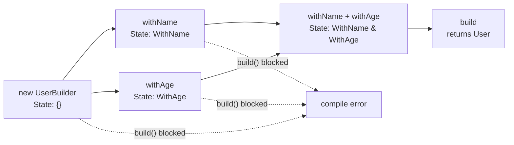
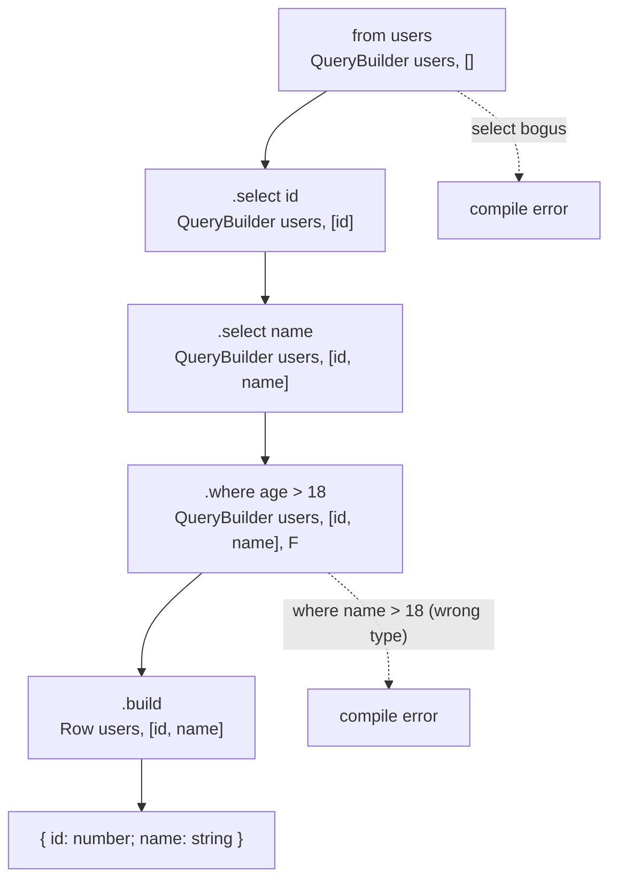

# 2.17 API Design with Types

## 1. Purpose

When you publish a function, a class, or a package, you are shipping two artifacts at once. The first is the runtime code that actually executes. The second is the type surface that the compiler sees and that every downstream consumer's editor will autocomplete, typecheck, and complain about. The second artifact is what we call the **public type API**, and for a TypeScript library it is often more important than the runtime code. Users read the types long before they read your source. They hover over a function and read its signature. They press Tab and let autocomplete guide them. They see a red squiggle and rewrite their call. In a well-designed library the types are the documentation, the autocomplete is the tutorial, and the compiler is the QA engineer who never sleeps.

The purpose of API design with types is to **make correct usage easy and incorrect usage impossible**. If a function requires a `URL` object, the type system should reject a plain string at the call site, not at runtime three frames deep. If a builder requires the user to call `.withName()` before `.build()`, the type system should make `.build()` disappear from autocomplete until `.withName()` has been called. If a function only accepts the literal `"asc"` or `"desc"`, the type system should not also accept `"ascending"` and silently default at runtime. Every type-level constraint you add removes a class of bugs the user cannot otherwise defend against.

The trade-off is real and constant: **type safety versus ergonomics**. The safest possible API takes a single exhaustive configuration object with twenty required fields and returns a tagged union of every possible outcome. Nobody wants to call that API. The most ergonomic API takes any argument and returns any value. Nobody should ship that API. Good API design lives in the middle: enough constraints to forbid the dangerous cases, enough flexibility that the common path reads as a one-liner. Every decision in this note is, at bottom, a decision about where to draw that line.

Error messages are part of the API. This is the part most library authors forget. A user types `loadUser("abc")` and the compiler spits back two hundred lines of conditional type instantiation with a `never` buried somewhere in the middle. The user does not read it. The user opens an issue titled "types broken." The library author knows the types are not broken — they are *informative*, if you can decode them. But decoding them requires a PhD in the library's internal type machinery. **Confusing errors are an abandoned library waiting to happen.** Designing types that produce good errors is a craft, and it is one of the few crafts where a tiny amount of extra work at the API surface pays off thousands of times downstream.

This note covers the four pillars of type-driven API design: **function overloads** for variant call signatures, **branded types** for nominal safety in a structurally typed language, the **builder pattern with type-level state** for required-step APIs, and **error message engineering** for the times when the compiler must speak to a human. Around those pillars we will assemble conditional constraints, template literal types, discriminated unions, and the discipline of separating public types from internal helpers. By the end you should be able to design a type-safe public API, choose the right tool for each constraint, and produce error messages that actually help the user fix their code.

If [[2.07 Generics and Constraints]] is the grammar of the type system, this note is the rhetoric. We are no longer asking "what can the type system express?" — we are asking "what should the type system express, and how do we make it express that in a way humans enjoy using?"

## 2. Theory and Deep Dive

### 2.1 Function overloads: many signatures, one implementation

A function overload is a TypeScript feature that lets you declare multiple call signatures for a single runtime function. The runtime has one body. The type system has several faces. Each face describes a different shape the caller is allowed to use, and TypeScript picks the best matching signature at the call site.

The rule that catches every newcomer is the **implementation signature compatibility rule**. The implementation signature (the last line, the one with the actual `{ ... }` body) must be compatible with every overload signature that precedes it. If an overload promises to accept a string and return a number, the implementation must, at the type level, accept at least a string and return at most a number. The implementation signature is *not* visible to callers — callers see only the overloads — but it must be a supertype of all of them.

```typescript
// TS
function format(value: string): string;
function format(value: number): string;
function format(value: string | number): string {
  return typeof value === "string" ? value.toUpperCase() : value.toFixed(2);
}

const a = format("hello"); // string, returned as "HELLO"
const b = format(42);      // string, returned as "42.00"
const c = format(true);    // error: no overload matches
```

```javascript
// JS
function format(value) {
  return typeof value === "string" ? value.toUpperCase() : value.toFixed(2);
}

const a = format("hello"); // "HELLO"
const b = format(42);      // "42.00"
const c = format(true);    // runtime TypeError: value.toFixed is not a function
```

In the JS version, `format(true)` runs until it crashes inside the function body. In the TS version the error is reported at the call site with a list of accepted signatures. The overloads turn a runtime crash into a compile-time hint. That is the entire game.

Two pitfalls hide inside overloads. First, **implementation signature leaks**. If you write `function format(value: any): string` as the implementation, callers do not see `any` (they see the overloads), but inside the body the parameter is typed `any`, so typos in the body are not caught. Always type the implementation as narrowly as the union of all overloads allows. Second, **order matters**. TypeScript tries overloads top-to-bottom and returns the first match. Put the most specific signatures first and the most general last. If you put `(value: any): string` first, every call matches it and the later overloads are dead.

Overloads shine when the return type depends on the input shape. A single generic signature often cannot express that dependency cleanly. Consider a `pick` function that returns a string for a string key, a number for a number key, and an object for an object key. A union return type loses information at the call site — the caller has to narrow. Overloads preserve it.

### 2.2 Branded types: nominal safety in a structural world

TypeScript is structurally typed. Two types with the same shape are interchangeable. `type UserId = string` and `type OrderId = string` are the same type as far as the compiler is concerned. You can pass an `OrderId` where a `UserId` is expected and TypeScript will not blink. This is sometimes convenient and sometimes catastrophic — when a `userId` ends up in an `orderId` column in your database, structural typing was the bug.

Branded types (also called opaque types or nominal types) restore nominal safety without leaving TypeScript's structural universe. The trick is to intersect a base type with a phantom field that exists only at the type level. The field never has a runtime value. It exists purely so the compiler can tell two same-shaped types apart.

```typescript
// TS
type Brand<T, B extends string> = T & { readonly brand: B };

type UserId = Brand<string, "UserId">;
type OrderId = Brand<string, "OrderId">;

function getUser(id: UserId): void { /* ... */ }

const uid = "u-123" as UserId;
const oid = "o-456" as OrderId;

getUser(uid);  // ok
getUser(oid);  // error: OrderId is not assignable to UserId
getUser("u-123"); // error: string is not assignable to UserId
```

```javascript
// JS
// Brands are erased at runtime. There is no JS representation.
// At runtime, uid, oid, and "u-123" are all just strings.
function getUser(id) { /* ... */ }

getUser("u-123"); // works, because there is no type information left
```

The `brand` field is phantom. At runtime it does not exist. The string `"u-123"` cast to `UserId` is still just `"u-123"`. But the compiler now distinguishes `UserId` from `OrderId` from `string`, and that is all we needed.

The cast `as UserId` is the dangerous moment. It is a claim by the programmer that this string really is a user ID. Used naively, branded types are just ceremony with no safety — every value gets cast and the compiler still cannot tell a real user ID from a random string. The discipline that makes brands pay off is **gateway functions**: only one or two places in the codebase are allowed to construct a branded value, and those places perform runtime validation first.

```typescript
// TS
function makeUserId(raw: string): UserId {
  if (!raw.startsWith("u-") || raw.length < 4) {
    throw new Error(`Invalid user id: ${raw}`);
  }
  return raw as UserId;
}

const uid = makeUserId("u-123"); // validated then branded
const bad = makeUserId("xyz");    // throws at runtime
```

```javascript
// JS
function makeUserId(raw) {
  if (!raw.startsWith("u-") || raw.length < 4) {
    throw new Error(`Invalid user id: ${raw}`);
  }
  return raw;
}

const uid = makeUserId("u-123"); // "u-123"
const bad = makeUserId("xyz");    // throws
```

The brand now means something: it means "this string passed validation at the gateway." Every function that takes a `UserId` can skip its own validation because the brand is a proof certificate. This is how brands earn their keep — not as a label, but as a *proof of prior validation*.

### 2.3 The builder pattern with type-level state

The builder pattern is a fluent API where each method returns a new builder with more configuration set, culminating in a `build()` call that produces the final object. In JavaScript this is a runtime pattern: methods chain, configuration accumulates, and at the end the builder assembles the result. The classic failure mode is that nothing forces the user to call the required setters before `build()`. You find out at runtime that `name` was undefined.

TypeScript can encode the *state* of the builder at the type level. The builder's type carries a phantom parameter that records which fields have been set. Calling `withName` returns a builder whose state parameter now includes "name has been set." Calling `build` is only allowed when the state parameter includes all required fields. The compiler hides `build` from autocomplete until the requirements are met.

The state is usually encoded as an intersection of marker types, one per required field:

```typescript
// TS
type WithName = { readonly hasName: true };
type WithAge = { readonly hasAge: true };

class UserBuilder<State extends {} = {}> {
  private nameValue?: string;
  private ageValue?: number;

  withName(name: string): UserBuilder<State & WithName> {
    const next = new UserBuilder<State & WithName>();
    next.nameValue = name;
    next.ageValue = this.ageValue;
    return next as unknown as UserBuilder<State & WithName>;
  }

  withAge(age: number): UserBuilder<State & WithAge> {
    const next = new UserBuilder<State & WithAge>();
    next.nameValue = this.nameValue;
    next.ageValue = age;
    return next as unknown as UserBuilder<State & WithAge>;
  }

  build(this: UserBuilder<WithName & WithAge>): { name: string; age: number } {
    return { name: this.nameValue!, age: this.ageValue! };
  }
}

const ok = new UserBuilder().withName("Ada").withAge(30).build();
const broken = new UserBuilder().withName("Ada").build();
// error: Property 'build' does not exist. Missing WithAge.
```

```javascript
// JS
class UserBuilder {
  constructor() { this.nameValue = undefined; this.ageValue = undefined; }
  withName(name) { this.nameValue = name; return this; }
  withAge(age) { this.ageValue = age; return this; }
  build() { return { name: this.nameValue, age: this.ageValue }; }
}

const ok = new UserBuilder().withName("Ada").withAge(30).build();
const broken = new UserBuilder().withName("Ada").build(); // { name: "Ada", age: undefined }
```

In the JS version, `broken` is silently `{ name: "Ada", age: undefined }` and the bug surfaces later when something reads `broken.age.toFixed`. In the TS version, the call does not typecheck: `build` is not on the type because the `this` parameter requires `WithName & WithAge` and we only have `WithName`.

The `this: UserBuilder<WithName & WithAge>` annotation on `build` is the magic. It says: this method is only callable on a builder whose state parameter includes both `WithName` and `WithAge`. If the state parameter is `WithName` only, the method is not on the type, autocomplete does not offer it, and any attempt to call it fails to compile.

The diagram below shows how the state type transitions as the user chains calls:



Each arrow widens the state. The dashed arrows are calls the type system refuses. The compiler is doing the work that would otherwise require runtime assertions or lengthy documentation.

### 2.4 Conditional types as constraints: forbidding invalid arguments

Generic constraints with `extends` are the simplest restriction: `function f<T extends string>(x: T)` accepts only strings. But what if you want to accept only strings *that look like URLs*? Or only numbers *that are integers at the type level*? Conditional types let you express these finer constraints by mapping invalid inputs to `never`, which makes the call site fail to compile.

The pattern is to constrain `T` broadly and then use a conditional type inside the parameter position:

```typescript
// TS
function fetchUrl<T extends string>(
  url: T extends `${string}://${string}` ? T : never
): Promise<Response> {
  return fetch(url);
}

fetchUrl("https://example.com");  // ok
fetchUrl("http://localhost:3000/api"); // ok
fetchUrl("example.com");          // error: string not assignable to never
fetchUrl("ftp://files.example.com"); // ok, matches the pattern
```

```javascript
// JS
function fetchUrl(url) {
  if (!/^[a-z]+:\/\//.test(url)) {
    throw new Error(`Invalid url: ${url}`);
  }
  return fetch(url);
}

fetchUrl("https://example.com"); // ok
fetchUrl("example.com");          // throws at runtime
```

In the JS version the validation is at runtime. In the TS version the validation is at compile time, *for literal strings*. Non-literal strings (variables typed as `string`) will not match the template literal pattern and will be rejected — which is usually what you want, because if the user has a runtime string they should validate it explicitly and pass it through a branded type.

This technique scales. You can constrain to email-shaped strings, to ISO date strings, to semver strings, to any pattern expressible as a template literal type. The cost is compilation time and error message clarity — a constraint like `T extends \`${string}://${string}\` ? T : never` produces an ugly error when violated. We will address error messages in section 2.7.

### 2.5 Template literal types for format strings

Template literal types let you build string types by interpolating other types into a template. Combined with generic inference, they let you write APIs that compute return types from input strings. The classic example is a `route` function whose return type includes the literal path the user passed.

```typescript
// TS
function route<P extends string>(path: P): { path: P; match: (u: string) => boolean } {
  return {
    path,
    match: (u) => u === path,
  };
}

const r = route("/users/:id");
// r.path is the literal "/users/:id", not just string
```

```javascript
// JS
function route(path) {
  return { path, match: (u) => u === path };
}

const r = route("/users/:id");
// r.path is "/users/:id" at runtime, but JS has no notion of literal types
```

This becomes powerful when you combine it with `infer` to extract path parameters. A route like `/users/:id/posts/:postId` should give the caller a typed object `{ id: string; postId: string }` for free, derived from the path string. The implementation requires a recursive conditional type that walks the path and collects the `:name` segments. We will build this in the production example.

### 2.6 Discriminated unions for variant APIs

When a function accepts several distinct shapes of input and behaves differently for each, a discriminated union is almost always the right tool. Each variant carries a literal `kind` (or `type`, or `tag`) field, and the union is the set of all variants. The compiler narrows on the discriminant, so inside a switch the variant's specific fields are available without a cast.

```typescript
// TS
type Shape =
  | { kind: "circle"; radius: number }
  | { kind: "square"; side: number }
  | { kind: "rect"; width: number; height: number };

function area(s: Shape): number {
  switch (s.kind) {
    case "circle": return Math.PI * s.radius ** 2;
    case "square": return s.side ** 2;
    case "rect":   return s.width * s.height;
  }
}

area({ kind: "circle", radius: 5 }); // ok
area({ kind: "circle" });            // error: missing radius
area({ kind: "hexagon", side: 5 });  // error: not assignable
```

```javascript
// JS
function area(s) {
  switch (s.kind) {
    case "circle": return Math.PI * s.radius ** 2;
    case "square": return s.side ** 2;
    case "rect":   return s.width * s.height;
    default: throw new Error(`Unknown shape: ${s.kind}`);
  }
}

area({ kind: "circle", radius: 5 }); // ok
area({ kind: "circle" });            // NaN at runtime
area({ kind: "hexagon", side: 5 });  // throws at runtime
```

Discriminated unions shine for **variant APIs** — APIs where the caller picks one of several call shapes. React component props are the most common example: a button is either a `default` button with an `onClick`, or a `link` button with an `href`, never both, never neither. The discriminated union encodes that constraint directly in the type, and autocomplete tells the user which fields each variant requires.

### 2.7 Improving error messages

TypeScript error messages are notoriously verbose, especially when generics and conditional types are involved. A poorly designed API can produce errors that point at the wrong location, expose internal type variables, or bury the actual cause five conditional branches deep. Good API design means engineering the types so the errors users see are short, pointed, and actionable.

Five techniques consistently improve error messages:

**1. Prefer `extends` constraints over `never`-coercion.** A signature like `<T extends string>(x: T extends \`${string}://${string}\` ? T : never)` produces a `not assignable to never` error. A signature like `<T extends \`${string}://${string}\`>(x: T)` produces a `does not satisfy the constraint` error with the constraint spelled out. The constraint error is friendlier because it tells the user what shape was expected.

**2. Add overloads for the common cases.** When a generic signature has many moving parts, a single overload that handles the common case (say, `string` input) gives users a precise error for the common case. The generic signature handles the rest. Two signatures, one for ergonomics and one for power.

**3. Avoid `any` in public signatures.** `any` is contagious. Once a parameter is `any`, every operation on it returns `any`, and errors vanish downstream instead of being reported at the source. Use `unknown` for "any value, but the caller must narrow," and use specific types everywhere else.

**4. Never expose internal helper types.** If your public function returns `InternalResolvedType<T, unknown, "default">`, users will see that name in their tooltips and error messages. Re-export a clean alias (`Resolved<T>`) from your entry point and use it in public signatures. The user-facing type should look like a name they could have written themselves.

**5. Test your error messages.** Use `@ts-expect-error` assertions in a test file to capture the exact error a misuse produces. If the error mentions an internal type variable, refactor until it mentions only the public-facing type. This is the same discipline as testing runtime behavior: you write a misuse, you read the error, you improve the type until the error reads like a sentence a human would write.

A useful mental shortcut: **a good type error reads like a sentence**. "Argument of type 'number' is not assignable to parameter of type 'string'." That is a sentence. "Type 'string' is not assignable to type 'never'." That is not a sentence — it is a compiler artifact. Aim for the first, refactor away from the second.

## 3. Mental Models

A handful of mental models make API design with types tractable. Internalize these and most decisions become obvious.

**The types are the contract users see.** When you publish a function, the type signature is the contract. Anything not in the signature is implementation detail. Anything in the signature is a promise. Treat the signature the way a lawyer treats a contract: every word matters, every word will be read by someone who does not have the source code, every word will be used against you if it is wrong.

**Overloads are multiple ways to call, one implementation.** The runtime has one body. The type system has several faces, one per supported call shape. Pick the face that best matches what the user is doing, and the compiler reports errors against that face, not against the implementation. Overloads are how you give the compiler permission to be specific about errors.

**Branded types are a string that is not just any string.** They are a value that has passed a validation gate and now carries the proof of that validation in its type. The brand is the proof. Functions that take a branded value are functions that trust the proof and skip their own validation. The discipline is in the gate, not in the type.

**The builder accumulates state in its type parameter.** Each chained method returns a builder whose type parameter has one more piece of state than before. The `build` method requires the type parameter to contain all required pieces. The compiler hides `build` from autocomplete until the requirements are met. The state is phantom — it exists at compile time, not runtime — but it enforces a real ordering on real calls.

**A good error message makes incorrect usage impossible to write.** Not "impossible to ship" — impossible to *write*. The user types the call, autocomplete does not offer the wrong option, the compiler refuses to accept the wrong argument, and the user fixes the call before they ever run the code. This is the highest bar of type-safe API design: the wrong code does not typecheck, and the wrong code does not even autocomplete.

**Public types are a separate artifact from internal types.** What you export is the public API. What you use internally is implementation. They can be the same type, but they should rarely share a name. A clean public surface uses short, intention-revealing names. Internal helpers can be long and descriptive of their mechanics. The boundary between them is part of the API.

**Constraints are documentation.** Every `extends` clause is a sentence in the documentation. `T extends \`${string}://\${string}\`` is the sentence "T must be a URL-shaped string." The compiler enforces the sentence, the editor shows the sentence on hover, and the user reads the sentence when they get it wrong. A constraint is a sentence that cannot drift out of date.

## 4. Real-World Use Cases

### 4.1 Zod

Zod is the canonical example of a type-safe schema API in the modern TypeScript ecosystem. You write a schema with chainable methods, the schema validates at runtime, and `z.infer<typeof schema>` derives the static type from the schema. The schema and the type are *one source of truth*. Zod's API is a masterclass in ergonomics: every method returns `this` (so chaining is natural), every method has a narrow generic signature (so autocomplete is precise), and the inferred type is computed from the runtime structure (so the type cannot drift from the validator). See [[2.12 Type Inference in Conditionals]] for the `infer` mechanics that make `z.infer` work.

### 4.2 Express route handlers

Express route handlers are a classic example of an API where the types lag behind the runtime. By default, `req.params` is typed as `ParamsDictionary` (essentially `Record<string, string>`), `req.query` is `any`, and `req.body` is `any`. The route pattern string and the typed params are disconnected. Libraries like `@types/express` plus a small generic wrapper can connect them: a `typedRouter.get("/users/:id", ...)` overload extracts the `id` param from the path string at the type level and types `req.params` accordingly. The path string and the param type stop drifting.

### 4.3 React component props

React components almost always accept discriminated unions for variant props. A `Button` might be `{ variant: "primary"; onClick: () => void } | { variant: "link"; href: string }`. The compiler refuses `variant: "link"` without `href`, refuses `variant: "primary"` with `href`, and autocomplete shows the right fields for each variant. This is the discriminated union pattern in its purest form, and it is the reason well-typed React libraries feel so much better than untyped ones.

### 4.4 Database query builders

Knex, Kysely, Drizzle, and Prisma all use the builder pattern with type-level state to track selected columns, joins, and filters. Kysely is the most aggressive: the builder's type parameter is a `SelectQueryBuilder<DB, "user", { id: number; name: string }>` that records the database shape, the current table, and the columns selected so far. Calling `.select("id")` returns a builder whose selected-columns type is `{ id: number }`. Calling `.execute()` returns a `Promise<{ id: number }[]>`. The whole chain is type-safe end to end, and the types are computed from the runtime chain, not declared separately.

### 4.5 i18n libraries

Type-safe i18n libraries (i18next with typed resources, Lingui, FormatJS with typed message descriptors) constrain translation keys to the actual keys present in the resource files. A call `t("user.profile.name")` is checked against the resource type. A typo `t("user.profle.name")` is a compile error. Interpolation parameters are derived from the message string: a message `"Hello {name}"` requires `{ name: string }` as the second argument. The key string and the parameters type are linked through template literal types and conditional inference.

### 4.6 State machines with XState

XState v5 encodes the entire state machine in the type system. The states, the transitions, the context, and the events are all part of the machine's type. Calling `machine.transition("idle", "START")` returns a state whose value is the literal `"running"`, not just `string`. Calling `machine.transition("idle", "BOGUS")` is a compile error because `BOGUS` is not an event valid from `idle`. The state machine's type *is* the state machine. The runtime just executes what the type already proved legal.

## 5. Code Examples

### 5.1 Example A — Minimal and Conceptual

#### 5.1.1 Function overloads

```typescript
// TS
function parse(input: string): string[];
function parse(input: string, sep: string): string[];
function parse(input: string, sep: string, limit: number): string[];
function parse(input: string, sep: string = ",", limit?: number): string[] {
  const parts = input.split(sep);
  return limit === undefined ? parts : parts.slice(0, limit);
}

const a = parse("a,b,c");            // string[], 3 elements
const b = parse("a;b;c", ";");       // string[], 3 elements
const c = parse("a;b;c;d", ";", 2);  // string[], 2 elements
const d = parse("a,b,c", ",", true); // error: no overload matches
```

```javascript
// JS
function parse(input, sep = ",", limit) {
  const parts = input.split(sep);
  return limit === undefined ? parts : parts.slice(0, limit);
}

const a = parse("a,b,c");            // ["a", "b", "c"]
const b = parse("a;b;c", ";");       // ["a", "b", "c"]
const c = parse("a;b;c;d", ";", 2);  // ["a", "b"]
const d = parse("a,b,c", ",", true); // ["a", "b", "c"] (true coerced to 1, slice(0, 1) => ["a"])
```

The JS version silently coerces `true` to `1` and returns `["a"]`. The TS version refuses the call. Overloads turn a silent runtime coercion into a compile-time refusal.

#### 5.1.2 Branded types

```typescript
// TS
type Brand<T, B extends string> = T & { readonly brand: B };

type Email = Brand<string, "Email">;
type UserId = Brand<string, "UserId">;

function makeEmail(raw: string): Email {
  if (!raw.includes("@")) throw new Error(`Not an email: ${raw}`);
  return raw as Email;
}

function sendEmail(to: Email, body: string): void {
  console.log(`Sending to ${to}: ${body}`);
}

const addr = makeEmail("ada@example.com");
sendEmail(addr, "Hello");          // ok
sendEmail("ada@example.com", "x"); // error: string not assignable to Email
sendEmail(makeEmail("nope"), "x"); // throws at runtime in makeEmail
```

```javascript
// JS
function makeEmail(raw) {
  if (!raw.includes("@")) throw new Error(`Not an email: ${raw}`);
  return raw;
}

function sendEmail(to, body) {
  console.log(`Sending to ${to}: ${body}`);
}

const addr = makeEmail("ada@example.com");
sendEmail(addr, "Hello");          // ok
sendEmail("ada@example.com", "x"); // ok at runtime, no type info
sendEmail(makeEmail("nope"), "x"); // throws in makeEmail
```

The brand guarantees that any value reaching `sendEmail` has already passed the `@` check at `makeEmail`. The body of `sendEmail` is free of defensive validation.

#### 5.1.3 Builder with type-level state

```typescript
// TS
type WithName = { readonly hasName: true };
type WithEmail = { readonly hasEmail: true };

class ContactBuilder<S extends {} = {}> {
  private nameValue?: string;
  private emailValue?: string;

  withName(name: string): ContactBuilder<S & WithName> {
    const next = new ContactBuilder<S & WithName>();
    next.nameValue = name;
    next.emailValue = this.emailValue;
    return next as unknown as ContactBuilder<S & WithName>;
  }

  withEmail(email: string): ContactBuilder<S & WithEmail> {
    const next = new ContactBuilder<S & WithEmail>();
    next.nameValue = this.nameValue;
    next.emailValue = email;
    return next as unknown as ContactBuilder<S & WithEmail>;
  }

  build(this: ContactBuilder<WithName & WithEmail>): { name: string; email: string } {
    return { name: this.nameValue!, email: this.emailValue! };
  }
}

const good = new ContactBuilder()
  .withName("Ada")
  .withEmail("ada@example.com")
  .build();

const incomplete = new ContactBuilder()
  .withName("Ada")
  .build(); // error: build not on the type, missing WithEmail
```

```javascript
// JS
class ContactBuilder {
  constructor() { this.nameValue = undefined; this.emailValue = undefined; }
  withName(name) { this.nameValue = name; return this; }
  withEmail(email) { this.emailValue = email; return this; }
  build() { return { name: this.nameValue, email: this.emailValue }; }
}

const good = new ContactBuilder()
  .withName("Ada")
  .withEmail("ada@example.com")
  .build();

const incomplete = new ContactBuilder()
  .withName("Ada")
  .build(); // { name: "Ada", email: undefined }
```

The JS version silently produces `email: undefined`. The TS version refuses to compile the `build()` call until `withEmail` has been chained.

### 5.2 Example B — Production-Grade

A production-grade typed query builder. The builder tracks the selected columns and the where-clause filters at the type level. `build()` returns a typed result whose shape is derived from the selected columns. The path parameters of a `where` clause are derived from the column names so a typo is a compile error.

```typescript
// TS
// Schema declaration: a record of table names to column maps.
type Schema = {
  users: { id: number; name: string; age: number };
  orders: { id: number; userId: number; total: number };
};

// Extract column names of a table as a union.
type Columns<T extends keyof Schema> = keyof Schema[T];

// Build the result row type from a list of selected columns.
type Row<T extends keyof Schema, C extends Columns<T>[]> = {
  [K in C[number]]: Schema[T][K];
};

// The builder's type state holds the table, the selected columns, and the filters.
class QueryBuilder<
  T extends keyof Schema,
  C extends Columns<T>[] = [],
  F extends string = ""
> {
  constructor(
    private readonly table: T,
    private readonly cols: C = [] as unknown as C,
    private readonly filters: string[] = []
  ) {}

  select<Col extends Columns<T>>(col: Col): QueryBuilder<T, [...C, Col], F> {
    const next = new QueryBuilder<T, [...C, Col], F>(
      this.table,
      [...this.cols, col] as [...C, Col],
      [...this.filters]
    );
    return next as unknown as QueryBuilder<T, [...C, Col], F>;
  }

  where<Col extends Columns<T>>(
    col: Col,
    op: "=" | ">" | "<",
    value: Schema[T][Col]
  ): QueryBuilder<T, C, F> {
    const literal = typeof value === "string" ? `'${value}'` : String(value);
    const clause = `${String(col)} ${op} ${literal}`;
    const next = new QueryBuilder<T, C, F>(
      this.table,
      this.cols,
      [...this.filters, clause]
    );
    return next as unknown as QueryBuilder<T, C, F>;
  }

  build(): { sql: string; params: unknown[]; result: Row<T, C> } {
    const colList = this.cols.length === 0 ? "*" : this.cols.join(", ");
    const whereClause =
      this.filters.length === 0 ? "" : ` WHERE ${this.filters.join(" AND ")}`;
    const sql = `SELECT ${colList} FROM ${String(this.table)}${whereClause}`;
    return { sql, params: [], result: undefined as unknown as Row<T, C> };
  }
}

function from<T extends keyof Schema>(table: T): QueryBuilder<T> {
  return new QueryBuilder(table);
}

// Usage: each step widens the type parameter C.
const q = from("users")
  .select("id")
  .select("name")
  .where("age", ">", 18);

const built = q.build();
// built.sql is "SELECT id, name FROM users WHERE age > 18"
// built.result is typed as { id: number; name: string }

const wrong = from("users")
  .select("id")
  .where("name", ">", 18);
// error: 18 is not assignable to Schema["users"]["name"] (which is string)

const wrongCol = from("users").select("bogus");
// error: "bogus" is not assignable to "id" | "name" | "age"
```

```javascript
// JS
const schema = {
  users: { id: "number", name: "string", age: "number" },
  orders: { id: "number", userId: "number", total: "number" },
};

class QueryBuilder {
  constructor(table, cols = [], filters = []) {
    this.table = table;
    this.cols = cols;
    this.filters = filters;
  }

  select(col) {
    return new QueryBuilder(this.table, [...this.cols, col], [...this.filters]);
  }

  where(col, op, value) {
    const literal = typeof value === "string" ? `'${value}'` : String(value);
    return new QueryBuilder(this.table, this.cols, [...this.filters, `${col} ${op} ${literal}`]);
  }

  build() {
    const colList = this.cols.length === 0 ? "*" : this.cols.join(", ");
    const whereClause = this.filters.length === 0 ? "" : ` WHERE ${this.filters.join(" AND ")}`;
    const sql = `SELECT ${colList} FROM ${this.table}${whereClause}`;
    return { sql, params: [] };
  }
}

function from(table) {
  return new QueryBuilder(table);
}

const q = from("users").select("id").select("name").where("age", ">", 18);
const built = q.build();
// built.sql is "SELECT id, name FROM users WHERE age > 18"

// No protection against typos in JS:
from("users").select("bogus").build();        // produces "SELECT bogus FROM users"
from("users").where("name", ">", 18).build(); // produces "WHERE name > 18"
```

The JS version produces SQL strings full of typos that the database will reject at runtime. The TS version refuses to compile the typos at the call site. The `Row<T, C>` mapped type computes the result row shape from the list of selected columns, so `built.result.id` is `number` and `built.result.bogus` is a compile error.

The diagram below shows the type-state transitions of the builder as `select` and `where` are chained:



Each solid arrow widens the state. The dashed arrows are calls the type system refuses.

## 6. Common Mistakes and Anti-Patterns

### 6.1 Overloads with an incompatible implementation signature

The most common overload bug is writing overloads the implementation cannot satisfy. If an overload promises `function f(x: string): number` but the implementation signature is `function f(x: string | number): string`, the compiler reports the mismatch. Worse, if the implementation signature is `function f(x: any): any`, every overload is technically compatible, but the body has no type safety and any typo in the body passes the compiler.

**Fix:** Type the implementation as the union of all overload inputs and the intersection of all overload outputs. Make the implementation signature narrower than the union of overloads would suggest, not wider.

### 6.2 Branded types without runtime validation

A branded type with no gateway function is theater. Every value reaches the brand through a cast, the cast asserts whatever the programmer typed, and the brand guarantees nothing. The user IDs in your database might still be order IDs. The brand is decoration.

**Fix:** Every branded type has exactly one constructor function (or one class with a private constructor and a static factory). That function validates at runtime and casts at the end. Every other piece of code receives branded values, never creates them. Audit your codebase for `as Brand<...>` casts outside the gateway and remove them.

### 6.3 Builder pattern that loses type state

A common mistake when implementing the builder is returning `this` from each chainable method. `this` works in JS, where chaining is dynamic, but in TS `this` carries the current state type, not the next state type. Calling `.withName("Ada")` returns `UserBuilder<{}>` (the original state), not `UserBuilder<WithName>`. The state never widens, and `build` is never callable.

**Fix:** Each chainable method must construct and return a new builder with the widened state type. The cast `as unknown as UserBuilder<...>` is necessary because the runtime constructor cannot produce a different type parameter than the class declares. The cast is safe because the state parameter is phantom — it affects types, not runtime behavior.

### 6.4 Error messages that blame the user

When the compiler reports an error inside the user's call, the message should explain what the API expected. A message like "Type 'string' is not assignable to type 'never'" blames the user's input without explaining the constraint. The user has to read the API source to understand the constraint.

**Fix:** Use `extends` constraints directly on type parameters instead of `never`-coercion in parameter positions. The constraint name appears in the error. Add overloads for the common cases so the error mentions the public overload, not the generic machinery. If the constraint is complex (a conditional type), write a one-line doc comment on the type parameter explaining it — the comment shows up in tooltips.

### 6.5 Exposing internal types in the public API

A library has internal helper types and public-facing types. Mixing them is the most common cause of confusing tooltips. A function that returns `InternalResolvedType<T, unknown, "default", true>` exposes four type parameters and a `true` literal to the user. The user does not know what any of them mean. The tooltip is a wall of internal names.

**Fix:** Wrap internal types in a single public alias. `export type Resolved<T> = InternalResolvedType<T, unknown, "default", true>`. Use `Resolved<T>` in every public signature. The internal type can change shape without breaking the public surface, as long as the alias keeps the same meaning.

### 6.6 `any` in the public API

`any` in a public signature is a hole in the type system. Once a value passes through `any`, every downstream operation is `any`, every error is suppressed, and the user gets no help from the compiler. `any` is sometimes necessary (third-party callbacks you cannot type), but it should never appear in a function you control.

**Fix:** Replace `any` with `unknown` for "any value, caller must narrow." Replace `any` with a generic `T` for "any value, but the function preserves its type." Replace `any[]` with `readonly unknown[]` for "any array, read-only." The compiler will report every place you used to silently accept garbage.

### 6.7 Missing overloads: users get wrong errors

A single generic signature that handles many call shapes produces generic errors. The user passes the wrong type and gets a generic mismatch error against the generic parameter, not a useful "this overload expects X" message. The API works, the errors are useless.

**Fix:** Add overloads for the common shapes the API supports. The generic signature handles exotic cases. The overloads give precise errors for the common cases. Two or three overloads is usually enough; ten is a sign the API is doing too much.

### 6.8 Implementation signature leaking through the editor

If the implementation signature is more permissive than the overloads (say, the overloads require `string` but the implementation accepts `any`), the editor will sometimes show the implementation signature on hover instead of the matching overload. This is confusing because the user sees a signature they cannot actually call.

**Fix:** Keep the implementation signature at least as narrow as the union of overloads. If the overloads require `string | number`, the implementation must require `string | number`, not `any`. The hover will show the overload, not the implementation.

### 6.9 Forgetting to test error messages

API authors test that valid calls compile. They rarely test that invalid calls produce the right errors. The errors drift over time as the internal types change, until the user opens an issue titled "types confusing" and the author realizes the public surface has been emitting internal type names for six months.

**Fix:** Maintain a `tests/types.test.ts` file with `@ts-expect-error` assertions. Each assertion captures the exact error a misuse should produce. When the error changes, the assertion fails and forces a decision: keep the new error (update the assertion) or refactor the type to produce the old error.

## 7. Best Practices and Design Patterns

**Design types first, then implement.** Write the public signatures in a `.d.ts` file before writing the runtime. The signatures are the contract; the implementation fulfills the contract. If the contract is hard to write, the API is too complicated. Refactor the contract until it reads like a sentence. Only then write the runtime.

**Use overloads for variant APIs.** When a function accepts several distinct call shapes, overloads give precise errors for each shape. The generic signature handles exotic cases. The overloads handle the common cases. Two to five overloads is the sweet spot.

**Use branded types for nominal safety.** When two same-shaped types represent different domain concepts (user IDs and order IDs, emails and usernames, timestamps and durations), brand them. The brand is the proof of validation. The gateway function is the only place the brand is created.

**Use the builder pattern for required-step APIs.** When an API requires multiple setup calls before a final action (build, execute, send), encode the required steps in a type-state parameter. The final action is only callable when the state includes all required pieces.

**Keep public API types minimal.** Export only the types users need. Internal helpers stay internal. Wrap complex internal types in clean public aliases. The public surface should read like a small library, not a large codebase.

**Test your error messages.** Write `@ts-expect-error` assertions for every misuse you can think of. Read the captured errors. Refactor the types until the errors read like sentences a human would write. This is the same discipline as writing unit tests for runtime behavior.

**Document with examples.** Every public type and function has a doc comment with at least one example. The example doubles as a test: if the example stops compiling, the public API changed in a breaking way. Tools like `tsdoc` and TypeDoc will surface the examples in generated docs.

**Prefer `unknown` over `any`.** `unknown` forces the caller to narrow. `any` lets everything through. Every `any` in a public signature is a hole. Every `unknown` is an enforced checkpoint.

**Prefer `readonly` for inputs.** `readonly` arrays and objects cannot be mutated by the function. The caller knows their input is safe. The compiler catches accidental mutations inside the function. The cost is zero.

**Prefer discriminated unions over optional fields.** `{ kind: "a"; x: number } | { kind: "b"; y: string }` is safer than `{ kind: "a" | "b"; x?: number; y?: string }`. The union enforces which fields each variant requires. The optional-fields version allows `kind: "a"` without `x`, which is a bug.

**Prefer specific literals over `string`.** `"asc" | "desc"` is safer than `string`. The literal union gives autocomplete and rejects typos. The bare string accepts anything and fails at runtime.

## 8. Technical Interview Knowledge

**Q1: How do you design a type-safe API?**

A: Start with the contract. Write the public signatures in a `.d.ts` file before writing the runtime. Choose constraints that forbid the dangerous cases (use `extends`, literal unions, branded types, discriminated unions). Choose overloads for variant call shapes. Choose a builder with type-state for required-step APIs. Type the implementation as the union of all overload inputs. Test your error messages with `@ts-expect-error` assertions. Export only the public types; wrap internal helpers in clean aliases. The goal is "make correct usage easy, incorrect usage impossible."

**Q2: What are function overloads?**

A: Multiple call signatures for one runtime function. The runtime has one body. The type system has several faces, one per supported call shape. TypeScript tries overloads top-to-bottom and uses the first match. The implementation signature (the last line, with the body) is not visible to callers but must be compatible with every overload. Overloads are useful when the return type depends on the input shape and a single generic signature cannot express that dependency cleanly. Order matters: most specific signatures first, most general last.

**Q3: What are branded types?**

A: A pattern for nominal type safety in a structurally typed language. You intersect a base type with a phantom field that exists only at the type level: `type Brand<T, B extends string> = T & { readonly brand: B }`. The brand field has no runtime value. The compiler can now distinguish two same-shaped types. The discipline that makes brands pay off is gateway functions: only one place constructs a branded value, and that place validates at runtime before the cast. The brand then means "this value passed validation."

**Q4: How does the builder pattern work with types?**

A: The builder's type parameter is a phantom state that records which fields have been set. Each chainable method returns a new builder whose state parameter includes one more piece of state. The `build` method has a `this` parameter that requires the state to include all required pieces. Calling `build` before all required pieces are set is a compile error because `build` is not on the type. The state is phantom — it affects types, not runtime behavior. The cast `as unknown as Builder<WidenedState>` is necessary because the runtime constructor cannot produce a different type parameter than the class declares.

**Q5: How do you improve error messages?**

A: Five techniques. (1) Prefer `extends` constraints over `never`-coercion: `T extends \`${string}://${string}\`` produces a friendlier error than `T extends ... ? T : never`. (2) Add overloads for the common cases so the error mentions the public overload. (3) Avoid `any` in public signatures, use `unknown` instead. (4) Never expose internal helper types; wrap them in clean public aliases. (5) Test your error messages with `@ts-expect-error` assertions and refactor until the errors read like sentences. The shortcut: a good error reads like a sentence, a bad error reads like a compiler artifact.

**Q6: How would you design a query builder API?**

A: Use a generic `QueryBuilder<T, C, F>` where `T` is the table name, `C` is the list of selected columns, and `F` is the where-clause state. The `select<Col>(col: Col)` method returns `QueryBuilder<T, [...C, Col], F>` — the variadic tuple widens the selected columns. The `where<Col>(col: Col, op, value: Schema[T][Col])` method constrains the value to the column's type. The `build` method computes the result row type from `C` using a mapped type: `{ [K in C[number]]: Schema[T][K] }`. The chain is type-safe end to end, and typos in column names or value types are compile errors.

**Q7: What should you not expose in a public API?**

A: Internal helper types, implementation signatures, private type parameters, `any`, and `unknown` in places where the caller has nothing useful to do with them. Internal helpers should be wrapped in clean public aliases. Implementation signatures should be at least as narrow as the union of overloads. Private type parameters should be inferred, not declared, on the public surface. `any` should be replaced with `unknown` or a generic. The public surface should read like a small library, not a slice of the internal codebase.

**Q8: How do you test type-level behavior?**

A: Use `@ts-expect-error` assertions in a dedicated `tests/types.test.ts` file. Each assertion captures the exact error a misuse should produce. If the error changes, the assertion fails and forces a decision. For positive tests, use `assertType<T>(value)` helpers (or the `expectTypeOf` utility from `expect-type`) to assert that a value's type is exactly what you expect. For conditional types, use `type Test = ConditionTrue extends true ? true : false; const t: Test = true;` patterns to assert the type computed the way you intended. Treat type tests like unit tests: every public type gets at least one positive and one negative test.

## 9. Practical Exercises

### 9.1 Exercise 1 — Design a typed API with overloads

Design a `log` function that accepts either a single message string, a message and a metadata object, or a message, a metadata object, and a numeric severity. Return a structured log entry whose shape depends on the inputs.

**Worked solution:**

```typescript
// TS
type LogEntry =
  | { message: string }
  | { message: string; meta: Record<string, unknown> }
  | { message: string; meta: Record<string, unknown>; severity: number };

function log(message: string): LogEntry;
function log(message: string, meta: Record<string, unknown>): LogEntry;
function log(
  message: string,
  meta: Record<string, unknown>,
  severity: number
): LogEntry;
function log(
  message: string,
  meta?: Record<string, unknown>,
  severity?: number
): LogEntry {
  if (severity !== undefined) {
    return { message, meta: meta ?? {}, severity };
  }
  if (meta !== undefined) {
    return { message, meta };
  }
  return { message };
}

const a = log("hello");
const b = log("hello", { user: "ada" });
const c = log("hello", { user: "ada" }, 3);
const d = log("hello", { user: "ada" }, "warn"); // error: "warn" not assignable to number
```

```javascript
// JS
function log(message, meta, severity) {
  if (severity !== undefined) return { message, meta: meta ?? {}, severity };
  if (meta !== undefined) return { message, meta };
  return { message };
}

const a = log("hello");
const b = log("hello", { user: "ada" });
const c = log("hello", { user: "ada" }, 3);
const d = log("hello", { user: "ada" }, "warn"); // { message, meta, severity: "warn" } — silent
```

The TS version refuses the string severity at the call site. The JS version silently includes it in the entry. The three overloads correspond to three distinct call shapes; the implementation signature is the union.

### 9.2 Exercise 2 — Implement branded types with runtime validation

Define branded types for `PositiveInt` and `NonEmptyString`. Provide gateway constructors that validate at runtime and brand the result. Write a function `repeat(s: NonEmptyString, n: PositiveInt): string` that uses both brands.

**Worked solution:**

```typescript
// TS
type Brand<T, B extends string> = T & { readonly brand: B };
type PositiveInt = Brand<number, "PositiveInt">;
type NonEmptyString = Brand<string, "NonEmptyString">;

function makePositiveInt(n: number): PositiveInt {
  if (!Number.isInteger(n) || n <= 0) {
    throw new Error(`Not a positive integer: ${n}`);
  }
  return n as PositiveInt;
}

function makeNonEmptyString(s: string): NonEmptyString {
  if (s.length === 0) {
    throw new Error(`String is empty`);
  }
  return s as NonEmptyString;
}

function repeat(s: NonEmptyString, n: PositiveInt): string {
  return s.repeat(n);
}

const out = repeat(makeNonEmptyString("ab"), makePositiveInt(3)); // "ababab"
const bad = repeat(makeNonEmptyString(""), makePositiveInt(3)); // throws in makeNonEmptyString
const wrong = repeat("ab", 3); // error: string not assignable to NonEmptyString
```

```javascript
// JS
function makePositiveInt(n) {
  if (!Number.isInteger(n) || n <= 0) {
    throw new Error(`Not a positive integer: ${n}`);
  }
  return n;
}

function makeNonEmptyString(s) {
  if (s.length === 0) {
    throw new Error(`String is empty`);
  }
  return s;
}

function repeat(s, n) {
  return s.repeat(n);
}

const out = repeat(makeNonEmptyString("ab"), makePositiveInt(3)); // "ababab"
const bad = repeat(makeNonEmptyString(""), makePositiveInt(3)); // throws
const wrong = repeat("ab", 3); // "ababab" — no validation, no brand, no safety
```

The TS version refuses the bare `repeat("ab", 3)` call. The JS version silently runs it. The brands guarantee that any value reaching `repeat` has passed the gateway.

### 9.3 Exercise 3 — Build a builder with type-state tracking

Build a `RequestBuilder` that requires `method` and `url` before `send`. Optional `headers` and `body` can be set in any order. `send` returns a typed response object.

**Worked solution:**

```typescript
// TS
type WithMethod = { readonly hasMethod: true };
type WithUrl = { readonly hasUrl: true };

type Response = { status: number; body: unknown };

class RequestBuilder<S extends {} = {}> {
  private methodValue?: string;
  private urlValue?: string;
  private headersValue: Record<string, string> = {};
  private bodyValue?: unknown;

  method(m: string): RequestBuilder<S & WithMethod> {
    const next = this.clone<S & WithMethod>();
    next.methodValue = m;
    return next as unknown as RequestBuilder<S & WithMethod>;
  }

  url(u: string): RequestBuilder<S & WithUrl> {
    const next = this.clone<S & WithUrl>();
    next.urlValue = u;
    return next as unknown as RequestBuilder<S & WithUrl>;
  }

  headers(h: Record<string, string>): RequestBuilder<S> {
    const next = this.clone<S>();
    next.headersValue = { ...this.headersValue, ...h };
    return next as unknown as RequestBuilder<S>;
  }

  body(b: unknown): RequestBuilder<S> {
    const next = this.clone<S>();
    next.bodyValue = b;
    return next as unknown as RequestBuilder<S>;
  }

  send(this: RequestBuilder<WithMethod & WithUrl>): Promise<Response> {
    return fetch(this.urlValue!, {
      method: this.methodValue!,
      headers: this.headersValue,
      body: JSON.stringify(this.bodyValue),
    }).then((r) => r.json().then((body) => ({ status: r.status, body })));
  }

  private clone<N extends {}>(): RequestBuilder<N> {
    const next = new RequestBuilder<N>();
    next.methodValue = this.methodValue;
    next.urlValue = this.urlValue;
    next.headersValue = { ...this.headersValue };
    next.bodyValue = this.bodyValue;
    return next as unknown as RequestBuilder<N>;
  }
}

const ok = new RequestBuilder()
  .method("POST")
  .url("https://api.example.com")
  .headers({ "Content-Type": "application/json" })
  .body({ hello: "world" })
  .send();

const missing = new RequestBuilder()
  .method("POST")
  .send(); // error: send not on the type, missing WithUrl
```

```javascript
// JS
class RequestBuilder {
  constructor() {
    this.methodValue = undefined;
    this.urlValue = undefined;
    this.headersValue = {};
    this.bodyValue = undefined;
  }

  method(m) { this.methodValue = m; return this; }
  url(u) { this.urlValue = u; return this; }
  headers(h) { this.headersValue = { ...this.headersValue, ...h }; return this; }
  body(b) { this.bodyValue = b; return this; }

  async send() {
    const r = await fetch(this.urlValue, {
      method: this.methodValue,
      headers: this.headersValue,
      body: JSON.stringify(this.bodyValue),
    });
    return { status: r.status, body: await r.json() };
  }
}

const ok = new RequestBuilder()
  .method("POST")
  .url("https://api.example.com")
  .headers({ "Content-Type": "application/json" })
  .body({ hello: "world" })
  .send();

const missing = new RequestBuilder()
  .method("POST")
  .send(); // runtime TypeError: Cannot read properties of undefined (urlValue)
```

The TS version refuses the `send()` call when `url` is missing. The JS version crashes inside `send`. The `this: RequestBuilder<WithMethod & WithUrl>` annotation on `send` is what hides the method until both required setters have been called.

### 9.4 Exercise 4 — Improve error messages for a poorly-typed API

Given this poorly-typed API, improve the error messages so a misuse produces a clear, sentence-like error:

```typescript
// TS — original, poor errors
function fetchResource(url: any): Promise<any> {
  return fetch(url);
}
```

A call `fetchResource(123)` compiles silently and fails at runtime. A call `fetchResource("example.com")` compiles and fetches the wrong URL. Improve the API.

**Worked solution:**

```typescript
// TS — improved
type Url = `${string}://${string}`;

function fetchResource(url: Url): Promise<Response>;
function fetchResource(url: Url, init: RequestInit): Promise<Response>;
function fetchResource(url: Url, init?: RequestInit): Promise<Response> {
  return fetch(url, init);
}

fetchResource("https://example.com");                       // ok
fetchResource("https://example.com", { method: "POST" });   // ok
fetchResource("example.com");                                // error: "example.com" does not satisfy Url
fetchResource(123);                                          // error: 123 does not satisfy Url
fetchResource("https://example.com", { bogus: true });      // error: bogus not in RequestInit
```

```javascript
// JS
function fetchResource(url, init) {
  if (typeof url !== "string" || !/^[a-z]+:\/\//.test(url)) {
    throw new Error(`Invalid url: ${url}`);
  }
  return fetch(url, init);
}

fetchResource("https://example.com");                       // ok
fetchResource("https://example.com", { method: "POST" });   // ok
fetchResource("example.com");                                // throws
fetchResource(123);                                          // throws
fetchResource("https://example.com", { bogus: true });      // fetch ignores bogus, no error
```

The improvements: replace `any` with the `Url` template literal type, add an overload for the `init` parameter, type the implementation as the union. The errors now read like sentences: "does not satisfy the constraint `Url`" instead of "not assignable to `any`" (which never appeared, because `any` accepted everything).

## 10. Mini-Project Blueprint

**Project: Build a typed query builder.**

Build a fluent query builder over a small in-memory schema. The builder tracks selected columns and where-clause filters at the type level. `build()` returns a typed result whose shape is derived from the selected columns.

**Schema.** Declare a `Schema` type mapping table names to column maps. Start with two tables, `users` and `orders`, each with three columns of distinct types.

**Builder.** Implement `QueryBuilder<T, C, F>` where `T` is the table name, `C` is the variadic tuple of selected columns, and `F` is the where-clause state. Implement `from(table)` to start the chain. Implement `select<Col>(col: Col)` to widen `C` with the new column. Implement `where<Col>(col: Col, op, value: Schema[T][Col])` to constrain the value to the column's type. Implement `build()` to return `{ sql: string; result: Row<T, C> }` where `Row<T, C>` is a mapped type computing the result row shape from `C`.

**Tests.** Write a `tests/types.test.ts` file with positive cases (each valid chain compiles) and negative cases (each misuse produces a `@ts-expect-error`). Test: selecting a bogus column fails; passing the wrong value type to `where` fails; calling `build` without selecting any columns returns `Row<T, []>` which is `{}`. Write a `tests/runtime.test.ts` file that executes valid chains and asserts the produced SQL string matches the expected output.

**Extensions.** Add `join` to support joins across tables, tracking the joined tables in a new type parameter. Add `orderBy(col, dir)` with `dir` constrained to `"asc" | "desc"`. Add `limit(n)` with `n` constrained to `number & { brand: "PositiveInt" }` (combining brands with the builder). Add a `transaction` builder that requires `begin` before `commit`, encoding the transaction lifecycle in the type state.

**Success criteria.** The builder compiles for valid chains, refuses invalid chains at the call site, produces SQL strings that match a hand-written reference, and the result type of `build` is correctly narrowed to the selected columns. The error messages for misuses read like sentences and never mention internal helper types.

## 11. Core Connections

- [[2.03 Type Assertions and Guards]] — Type assertions are the mechanism behind branded-type casts; type guards are the runtime counterpart to type-level narrowing.
- [[2.05 Unions and Intersections]] — Discriminated unions are unions with a literal discriminant; builder state is an intersection of marker types accumulating across chain calls.
- [[2.07 Generics and Constraints]] — The grammar of generic constraints (`extends`) is the foundation of every restrictive API signature in this note.
- [[2.13 Template Literal Types]] — Template literal types power URL-shaped constraints, route path inference, and column-name derivation in the query builder.
- [[2.18 OOP Patterns in TypeScript]] — The builder pattern is a class with phantom type-state; this note connects the runtime OOP pattern to its type-level state encoding.
- [[4.08 Dependency Injection DI]] — DI containers expose public type surfaces that must be minimal, well-documented, and free of internal helpers — the same discipline as library API design.

The throughline: every public type is a contract, every constraint is a sentence, every overload is a face the compiler shows to a specific kind of caller. Design the contract first, let the runtime follow, and the type system becomes a QA engineer that never sleeps.
