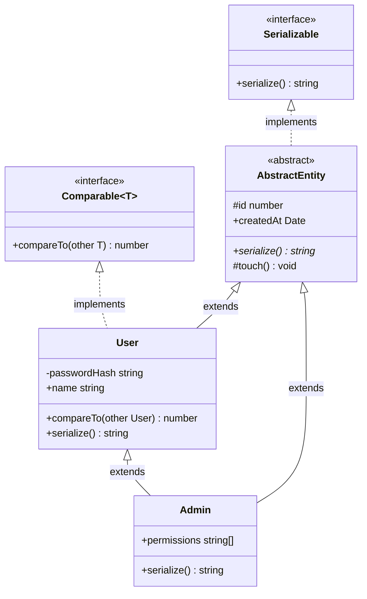
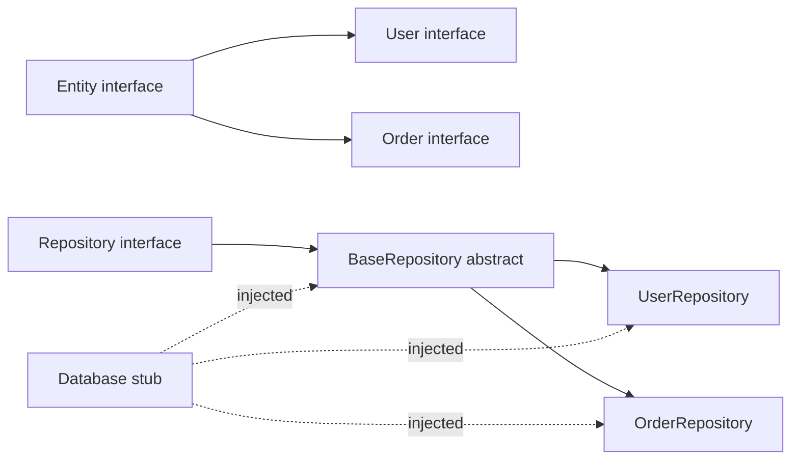

# 2.18 OOP Patterns in TypeScript

> TypeScript is sometimes described as "Java with structural typing" by engineers who come from C# or Java, and as "JavaScript with a layer of compile-time OOP documentation" by engineers who come from JavaScript. Both framings are partially correct and both miss the point. TypeScript's object-oriented features exist because large JavaScript codebases kept reinventing the same patterns (private-by-convention fields prefixed with underscores, manually wired prototype chains, hand-rolled dependency-injection containers) and the language team decided to give them first-class syntax. What TypeScript adds over JavaScript is a *compile-time* surface for access modifiers, abstract classes, parameter properties, the `override` keyword, and interface implementation. What it deliberately does not add is runtime enforcement of any of those things. The `private` keyword is a documentation hint to the compiler, not a runtime guarantee; if you want true runtime privacy you use the JavaScript `#field` syntax. This note is the full treatment of every OOP feature TypeScript gives you, every difference from Java and C#, every footgun, and every pattern you will meet in production.

## 1. Purpose

TypeScript's object-oriented surface exists for one overriding reason: large codebases want to express *intent* about who can touch what, and JavaScript as of ES2015 gave them only the syntactic class keyword without any of the surrounding vocabulary. The TypeScript team observed four patterns being reinvented in every codebase of consequence: (1) "private" fields denoted by a leading underscore and enforced only by code review, (2) abstract base classes simulated by throwing in the constructor when `this.constructor === Base`, (3) interface contracts simulated by JSDoc `@typedef` annotations and runtime duck-typing, and (4) verbose constructor boilerplate that just assigned each parameter to a field of the same name. The decision was to give all four patterns first-class syntax while staying strictly within the ECMAScript grammar that the TypeScript compiler emits.

What TypeScript adds over JavaScript, specifically, is the following surface, all of which is erased during compilation:

- The `public`, `private`, `protected`, and `readonly` modifiers on class fields and methods.
- **Parameter properties**: writing `constructor(private x: number)` and having the compiler auto-generate the field declaration and the `this.x = x` assignment.
- The `abstract` keyword on classes and methods, marking them as uninstantiable or requiring subclass implementation.
- The `implements` clause, allowing a class to declare that it conforms to one or more interfaces, with a compile-time check.
- The `override` keyword (TypeScript 4.3+), requiring explicit declaration when a method overrides a parent method, so that renaming the parent method produces a compile error rather than a silent bug.
- Generic class declarations, `class Foo<T>`, with full type-parameter support including constraints and defaults.

What TypeScript's `private` is **not** is runtime privacy. The TypeScript compiler, when it sees `private x: number`, erases the `private` keyword entirely. The emitted JavaScript has a plain, fully enumerable, fully writable `x` property on the instance. This is the single most misunderstood fact about TypeScript's OOP surface. True runtime privacy requires the JavaScript `#x` private field syntax (a TC39 proposal that landed in ES2019 and is supported in all modern engines). TypeScript understands `#x` natively and emits it as-is, providing genuine runtime encapsulation at the cost of slightly more verbose syntax and the loss of parameter-property shorthand for that field.

The trade-off between OOP, functional, and procedural styles in TypeScript is real and the answer is rarely "all in on OOP." TypeScript is multi-paradigm by inheritance from JavaScript: it supports first-class functions, closures, prototypes, and classes with equal weight. Most production codebases end up as a hybrid: classes for things that have *identity and lifecycle* (a database connection, a controller with injected dependencies, a stateful service), functions for things that are *transformations* (a parser, a reducer, a formatter), and procedural top-level glue for *sequences of side effects*. The Gang of Four advice to "favor composition over inheritance" applies with full force, and structural typing makes composition even more attractive than in Java or C#. The purpose of this note is to make you fluent in TypeScript's OOP surface so that you can choose it deliberately when it is the right tool, and choose something else when it is not.

## 2. Theory and Deep Dive

### 2.1 Access modifiers: `public`, `private`, `protected`, `readonly`

TypeScript recognises four modifiers that can be applied to class fields and methods. They are all erased at compile time; they exist purely to communicate intent to the compiler and to readers.

**`public`** is the default. A `public` member is accessible from anywhere: inside the class, from subclasses, and from external code. Because it is the default, writing `public` is optional and is mostly done for documentation. Java and C# differ here: in C# `public` is also default for members; in Java there is no default-member-access modifier and you must always write one of `public`, `protected`, `private`, or package-private.

```typescript
class Counter {
  public value = 0;
  increment() { this.value += 1; }
}
const c = new Counter();
c.increment();
console.log(c.value); // 1, accessible because public
```

**`private`** restricts access to the class body that declares the member. Subclasses cannot access `private` members of their parent, and external code cannot access them either. The restriction is enforced only by the TypeScript compiler: the emitted JavaScript has the property as a plain, enumerable, writable field. The `private` keyword is best understood as "compile-time suggestion, runtime-public."

```typescript
class BankAccount {
  private balance: number;
  constructor(initial: number) { this.balance = initial; }
  deposit(amount: number) { this.balance += amount; }
  getBalance() { return this.balance; }
}
const acc = new BankAccount(100);
acc.deposit(50);
// acc.balance;        // TypeScript error: Property 'balance' is private.
console.log(acc.getBalance()); // 150
// At runtime in the emitted JS, acc.balance is fully accessible:
// console.log(acc.balance); // 150 in the JS runtime, no error.
```

**`protected`** is between `public` and `private`. The declaring class can access the member, subclasses can access it, but external code cannot. The same compile-time-only enforcement caveat applies. `protected` is most useful for "template method" patterns where a base class exposes a hook that subclasses override or call but that external code should not invoke directly.

```typescript
class Logger {
  protected prefix = "[app]";
  log(msg: string) { console.log(`${this.prefix} ${msg}`); }
}
class VerboseLogger extends Logger {
  constructor() { super(); this.prefix = "[verbose]"; } // allowed, protected
}
const vl = new VerboseLogger();
vl.log("hello"); // [verbose] hello
// vl.prefix; // TypeScript error: Property 'prefix' is protected.
```

**`readonly`** is an orthogonal modifier that can be combined with any of the above. A `readonly` field can be assigned exactly once, at the point of declaration or in the constructor. After construction, any write produces a TypeScript error. The field is still writable at runtime (the modifier is erased), so `readonly` is a compile-time suggestion. The combination `public readonly` is the standard idiom for exposing an immutable-by-convention property.

```typescript
class Point {
  public readonly x: number;
  public readonly y: number;
  constructor(x: number, y: number) {
    this.x = x;
    this.y = y;
  }
}
const p = new Point(3, 4);
// p.x = 5; // TypeScript error: Cannot assign to 'x' because it is read-only.
// At runtime, the JS would happily let you do p.x = 5.
```

The `readonly` modifier is the field-level analogue of `const`. Like `private`, it is erased at runtime.

### 2.2 Parameter properties

Parameter properties are the single most TypeScript-specific syntactic feature on the OOP surface. Writing an access modifier (or `readonly`) on a constructor parameter causes the compiler to do three things automatically: declare a field of the same name on the class, with the same modifier and type; capture the constructor argument; and assign it to `this.field` in the constructor body. The parameter-property shorthand collapses a remarkable amount of boilerplate.

```typescript
// Without parameter properties (22 lines of boilerplate for 5 fields):
class UserEntityVerbose {
  public readonly id: number;
  public name: string;
  public email: string;
  private passwordHash: string;
  protected createdAt: Date;
  constructor(id: number, name: string, email: string, passwordHash: string, createdAt: Date) {
    this.id = id; this.name = name; this.email = email;
    this.passwordHash = passwordHash; this.createdAt = createdAt;
  }
}

// With parameter properties (one line per field):
class UserEntityConcise {
  constructor(
    public readonly id: number,
    public name: string,
    public email: string,
    private passwordHash: string,
    protected createdAt: Date
  ) {}
}
```

The two classes compile to nearly identical JavaScript. Parameter properties can mix freely with ordinary constructor parameters: only parameters that have a modifier become fields; parameters without modifiers are simply constructor-local variables.

There are two important caveats. First, parameter properties only work with the `public`, `private`, `protected`, and `readonly` modifiers (and combinations thereof). Second, parameter properties and `#private` fields do not combine: there is no `constructor(#x: number)` syntax. If you want runtime-private parameter properties, you must declare the field manually with `#x: number` and assign it in the constructor body. This is a deliberate trade-off: `#x` is a runtime feature with stricter semantics than the compile-time `private` keyword.

### 2.3 Abstract classes

The `abstract` keyword has two uses. Applied to a class, it means the class cannot be instantiated directly; you must subclass it and instantiate the subclass. Applied to a method, it means the method has no body in the base class and must be implemented by any concrete subclass.

```typescript
abstract class Shape {
  abstract area(): number;
  abstract perimeter(): number;
  describe(): string {
    return `Shape with area ${this.area()} and perimeter ${this.perimeter()}`;
  }
}

class Circle extends Shape {
  constructor(public readonly radius: number) { super(); }
  area() { return Math.PI * this.radius ** 2; }
  perimeter() { return 2 * Math.PI * this.radius; }
}

class Square extends Shape {
  constructor(public readonly side: number) { super(); }
  area() { return this.side ** 2; }
  perimeter() { return 4 * this.side; }
}

// new Shape(); // TypeScript error: Cannot create an instance of an abstract class.
const c = new Circle(5);
console.log(c.describe()); // Shape with area 78.5398... and perimeter 31.4159...
```

Abstract classes are the standard vehicle for the **Template Method pattern**: a base class implements a public method that calls one or more abstract "hook" methods, and each subclass provides its own implementation. Abstract methods can have modifiers (`protected abstract`, `public abstract`) but cannot have a body. A subclass that fails to implement an abstract method is itself forced to be abstract, or the compiler errors.

### 2.4 Interfaces and implementation

An `interface` in TypeScript declares a structural object shape; a class can declare conformance to one or more interfaces with the `implements` clause. The compiler checks that every property and method declared in the interface is present on the class with a compatible type.

```typescript
interface Comparable { compareTo(other: this): number; }
interface Serializable { serialize(): string; }

class Version implements Comparable, Serializable {
  constructor(public readonly major: number, public readonly minor: number) {}
  compareTo(other: Version): number {
    if (this.major !== other.major) return this.major - other.major;
    return this.minor - other.minor;
  }
  serialize(): string { return `${this.major}.${this.minor}`; }
}
```

Several things to notice. First, a class can implement **multiple** interfaces (comma-separated), unlike `extends` which permits only a single parent class. Second, `implements` does **not** copy any implementation, because interfaces in TypeScript cannot contain implementations (since TypeScript 2.0 they can contain optional methods, but not method bodies). Third, the interface is structural: any class that happens to have the right shape satisfies the interface, even without declaring `implements`. The `implements` clause is therefore partly documentation and partly a compile-time assertion that the class conforms. An interface cannot declare `private` or `protected` fields (it describes the *public* shape), and it cannot declare `#private` fields either.

### 2.5 Polymorphism in type space

Polymorphism in TypeScript operates through structural subtyping. A subclass instance is assignable to a variable typed as the parent class; a class instance is assignable to a variable typed as any interface it implements. Calls through the parent type dispatch to the subclass's overridden method at runtime, exactly as in Java or C#.

```typescript
type Animal = { sound(): string };
class Dog { sound() { return "woof"; } }
class Cat { sound() { return "meow"; } }
function makeSound(animal: Animal): string { return animal.sound(); }

console.log(makeSound(new Dog())); // woof
console.log(makeSound(new Cat())); // meow
```

Note that neither `Dog` nor `Cat` declares `implements Animal`. They satisfy `Animal` structurally: they each have a `sound()` method returning a string. The function `makeSound` accepts any value with that shape. This is the core difference between TypeScript's structural polymorphism and Java's nominal polymorphism: Java requires explicit `implements` declarations, TypeScript requires only shape compatibility.

When a class hierarchy uses `extends`, the parent type can hold subclass instances and runtime dispatch goes through the prototype chain:

```typescript
class Animal2 { sound(): string { return "(silence)"; } }
class Dog2 extends Animal2 { override sound(): string { return "woof"; } }
class Cat2 extends Animal2 { override sound(): string { return "meow"; } }

const animals: Animal2[] = [new Dog2(), new Cat2(), new Animal2()];
for (const a of animals) console.log(a.sound()); // woof, meow, (silence)
```

There is also **type-space polymorphism via generics**: a generic function or class that operates on `T` constrained to some interface is polymorphic over every type that satisfies the constraint. This is the same idea as Java's generic methods or C#'s generic methods, but with structural rather than nominal matching.

```typescript
interface Summable { valueOf(): number; }
function sum<T extends Summable>(items: T[]): number {
  return items.reduce((acc, x) => acc + x.valueOf(), 0);
}
console.log(sum([1, 2, 3]));        // 6, number is Summable structurally
console.log(sum([new Date(0), new Date(1000)])); // 1000, Date has valueOf
```

### 2.6 The `override` keyword

TypeScript 4.3 introduced the `override` keyword on class methods. A method marked `override` must override a method of the same name in a parent class; if the parent method is renamed or removed, the compiler errors. Without `override`, a subclass method that *intended* to override a parent method but is misspelled (or whose parent was renamed) silently becomes a new method. The keyword pairs with the `noImplicitOverride` compiler flag, which makes `override` mandatory on every overriding method — the recommended setting for any new TypeScript project.

```typescript
class Base {
  greet() { return "hello"; }
  getName() { return "Base"; }
}
class Sub extends Base {
  override greet() { return "hi"; }        // OK, overrides Base.greet
  override getName() { return "Sub"; }     // OK, overrides Base.getName
  // override fareWel() { return "bye"; }  // ERROR: not declared in the base class 'Base'.
}
```

If `Base.getName` is later renamed to `Base.getLabel`, the `override getName()` line becomes a compile error. Without `override`, `Sub.getName` would silently be a new method and any code dispatching through a `Base`-typed reference would call the parent's now-stale implementation (or fail at runtime when the parent method is missing).

### 2.7 How TypeScript's OOP differs from Java and C#

This is the section that Java and C# refugees should read most carefully, because most of the subtle bugs they will write in TypeScript come from assuming Java or C# semantics.

**Structural vs nominal typing.** Java and C# are nominally typed: two classes with identical shapes are not assignable unless they share an explicit inheritance relationship. TypeScript is structurally typed: two classes with identical shapes are mutually assignable, and `implements` is not even strictly necessary for type compatibility. A TypeScript class can satisfy an interface defined after the class, with no change to the class.

**Compile-time vs runtime privacy.** Java's `private` is enforced by the JVM bytecode verifier; C#'s by the CLR JIT. TypeScript's `private` is enforced by `tsc` and is erased; the emitted JavaScript has a public field. Only `#field` gives Java/C#-equivalent runtime privacy.

**Generics are erased.** Java erases generics (`List<String>` and `List<Integer>` are the same `List` at runtime). C# reifies them (`List<string>` and `List<int>` are different types at runtime). TypeScript follows Java: `class Foo<T>` compiles to `class Foo` with no runtime type parameter. You cannot write `if (x instanceof Foo<string>)`; only `if (x instanceof Foo)`.

**Multiple class inheritance.** All three forbid multiple class inheritance (a class can `extends` at most one parent). All three permit multiple interface implementation. TypeScript's structural typing makes the distinction less sharp.

**Interface default methods.** Java 8 and C# 8 both permit default methods on interfaces with bodies inherited by implementing classes. TypeScript does not: interfaces can declare signatures but not bodies. For default implementations, use an abstract base class.

**Method overloading.** Java and C# support overloading as a runtime feature with separate method bodies. TypeScript supports overload *signatures* but a single implementation body that must handle every case via runtime narrowing.

```typescript
class Printer {
  print(x: string): void;
  print(x: number): void;
  print(x: string | number): void {
    if (typeof x === "string") console.log(`string: ${x}`);
    else console.log(`number: ${x}`);
  }
}
```

The two overload signatures are erased; only the implementation is emitted.

**Constructors.** TypeScript permits classes with no explicit constructor (a default parameterless one is synthesised). Java and C# require `super()` as the first statement of a subclass constructor; TypeScript requires `super()` before any `this` access, but it need not be the very first statement.

### 2.8 Class hierarchy diagram

The following Mermaid diagram illustrates a small but representative class hierarchy showing every modifier, an abstract base, an interface implementation, parameter properties, and `override`:



Reading the diagram: `AbstractEntity` is abstract and cannot be instantiated; it declares a protected `id` (subclass-accessible), a public `createdAt`, an abstract `serialize()` that subclasses must implement, and a protected `touch()` hook. `User` extends `AbstractEntity` and implements `Comparable<User>`; it has a private `passwordHash` and overrides `serialize()`. `Admin` extends `User` and overrides `serialize()` again. Every arrow has a precise TypeScript meaning, and every modifier on every member is erased in the emitted JavaScript.

## 3. Mental Models

The following mental models are the load-bearing ones for TypeScript's OOP surface. If you internalise these, the rest of the note is implementation detail.

**TypeScript `private` equals "compile-time suggestion, runtime-public."** The keyword tells the compiler to refuse access from outside the class, and the compiler erases it before emitting JavaScript. The runtime field is fully accessible. Never rely on `private` for security, for hiding secrets, or for any guarantee that must hold at runtime. It is documentation, not enforcement.

**JavaScript `#private` equals "truly private, runtime-enforced."** The `#field` syntax is a runtime feature of the JavaScript engine; the field is stored in a hidden slot that is genuinely inaccessible from outside the class body. TypeScript understands `#field` natively and emits it as-is. Use it when encapsulation must hold at runtime, for example in a library where consumers should not depend on internal fields.

**Abstract class equals "a template, can't be instantiated directly."** An abstract class is a partial implementation that exists to be subclassed. It can have implemented methods (which subclasses inherit) and abstract methods (which subclasses must implement). It is the vehicle for the Template Method pattern: the base class defines the algorithm, the subclasses provide the steps.

**Interface equals "a contract, classes can implement multiple."** An interface is a structural shape that the compiler can check a class against. A class can implement many interfaces, and any class that happens to have the right shape satisfies the interface even without declaring `implements`. Interfaces cannot have implementations (no method bodies), so they describe *what* a class does, not *how*.

**`override` equals "I am intentionally overriding a parent method."** The keyword is a compile-time assertion. If the parent method is later renamed, the subclass method becomes a compile error rather than a silent new method. With `noImplicitOverride`, every override must declare itself, and the compiler becomes a static check that your subclass methods actually override what you think they do.

**Parameter property equals "constructor parameter that is also a field."** Writing `constructor(private x: number)` is exactly equivalent to declaring `private x: number` on the class, accepting an `x` parameter, and writing `this.x = x` in the constructor body. It is a shorthand for the most common class boilerplate, and it is the single feature that makes TypeScript classes feel materially more concise than Java or C# classes.

**`readonly` equals "assignable only at construction."** The modifier is a compile-time promise that the field will not be reassigned after the constructor returns. It is the field-level analogue of `const`, but for class fields. Like `private`, it is erased at runtime.

**`protected` equals "subclass-accessible, externally private."** The middle ground between `public` and `private`. Use it for members that subclasses need to use or override but that external code should not call. The most common use is template-method hooks.

**Structural polymorphism equals "if it has the methods, it satisfies the type."** You do not need to declare `implements` for a class to satisfy an interface. This is the single biggest difference from Java and C#, and it makes TypeScript feel considerably more flexible. The cost is that two unrelated classes with identical shapes are mutually assignable, which can hide bugs if you expected nominal identity.

## 4. Real-World Use Cases

### 4.1 NestJS controllers and services

NestJS is the most class-heavy framework in the Node.js ecosystem. Controllers, services, providers, guards, interceptors, pipes, and middleware are all classes that participate in a dependency-injection container. The DI container resolves constructor parameters by type, so parameter properties are the idiomatic way to declare dependencies:

```typescript
@Controller("users")
class UserController {
  constructor(private readonly users: UserService) {}
  @Get()
  list() { return this.users.findAll(); }
}
@Injectable()
class UserService {
  constructor(private readonly repo: UserRepository) {}
  findAll() { return this.repo.find(); }
}
```

The `readonly` modifier is conventional on injected dependencies. The `private` modifier signals that the dependency is internal to the class.

### 4.2 TypeORM entities

TypeORM models database tables as classes, with decorators on fields describing columns. The class-based approach is necessary because TypeORM uses the constructor's `instanceof` check and the prototype chain for entity metadata.

```typescript
@Entity()
class UserEntity {
  @PrimaryGeneratedColumn()
  id: number;
  @Column()
  name: string;
  @Column({ unique: true })
  email: string;
  @Column({ select: false })
  passwordHash: string;
}
```

TypeORM does not enforce `private` at runtime (it needs to set fields via assignment when hydrating from rows), so the field access modifiers are mostly documentation. The class structure is what TypeORM introspects.

### 4.3 Angular components

Angular was, until the Ivy compiler's recent improvements, the most aggressively class-based framework in the JavaScript world. Components, directives, pipes, and services are all classes with decorators; lifecycle hooks are method overrides on `OnInit`, `OnDestroy`, etc. (interfaces, not abstract base classes, in keeping with TypeScript's structural bias).

```typescript
@Component({ selector: "app-counter", template: "<button (click)=\"inc()\">{{n}}</button>" })
class CounterComponent implements OnInit, OnDestroy {
  n = 0;
  inc() { this.n += 1; }
  ngOnInit() { console.log("init"); }
  ngOnDestroy() { console.log("destroy"); }
}
```

### 4.4 React class components (legacy)

React class components are legacy but still present in many large codebases. They extend `React.Component` (or `React.PureComponent`), implement lifecycle methods as overrides, and use `state` and `props` as class fields. Modern React favours function components with hooks, but the class form remains important to read and occasionally maintain.

```typescript
interface CounterProps { initial: number; }
interface CounterState { n: number; }
class Counter extends React.Component<CounterProps, CounterState> {
  state: CounterState = { n: this.props.initial };
  increment = () => this.setState({ n: this.state.n + 1 });
  render() { return <button onClick={this.increment}>{this.state.n}</button>; }
}
```

### 4.5 Custom Error subclasses

Custom Error subclasses are one of the few OOP patterns that are universally useful in TypeScript. The built-in `Error` class is extended to add context.

```typescript
class HttpError extends Error {
  constructor(
    public readonly status: number,
    public readonly code: string,
    message: string
  ) {
    super(message);
    this.name = "HttpError";
    Object.setPrototypeOf(this, HttpError.prototype); // restore prototype chain
  }
}
throw new HttpError(404, "notFound", "user missing");
```

The `Object.setPrototypeOf` call is necessary because ES5 transpilation breaks the prototype chain when extending built-ins; without it, `instanceof HttpError` returns false.

### 4.6 Builder pattern

The Builder pattern uses a fluent class with methods that return `this` (or, for type-stateful builders, a different `this` type) to construct objects step by step. Parameter properties and `readonly` together give a concise immutable target:

```typescript
class Query {
  constructor(
    public readonly table: string,
    public readonly where?: string,
    public readonly limit?: number
  ) {}
}
class QueryBuilder {
  private whereClause?: string;
  private limitValue?: number;
  constructor(private readonly table: string) {}
  where(clause: string): this { this.whereClause = clause; return this; }
  limit(n: number): this { this.limitValue = n; return this; }
  build(): Query { return new Query(this.table, this.whereClause, this.limitValue); }
}
const q = new QueryBuilder("users").where("age > 18").limit(10).build();
```

### 4.7 Strategy pattern with abstract classes

The Strategy pattern selects an algorithm at runtime by swapping in a different implementation of a common interface. Abstract classes work well when strategies share common state or default behaviour:

```typescript
abstract class ShippingStrategy {
  constructor(protected readonly baseRate: number) {}
  abstract cost(weightKg: number): number;
  describe() { return `${this.constructor.name} (base $${this.baseRate})`; }
}
class AirShipping extends ShippingStrategy {
  cost(weightKg: number) { return this.baseRate + weightKg * 5; }
}
class GroundShipping extends ShippingStrategy {
  cost(weightKg: number) { return this.baseRate + weightKg * 1; }
}
function ship(weight: number, strategy: ShippingStrategy) {
  console.log(strategy.describe(), "$" + strategy.cost(weight));
}
ship(2, new AirShipping(10));    // AirShipping (base $10) $20
ship(2, new GroundShipping(10)); // GroundShipping (base $10) $12
```

### 4.8 Plugin systems with abstract bases

Plugin systems often use an abstract base class as the plugin contract, with subclasses providing the implementation. The base class can include shared utilities, lifecycle hooks, and registration logic. The abstract `name` and `init` members document what every plugin must provide; the `protected log` is a shared utility.

```typescript
abstract class Plugin {
  abstract name: string;
  abstract init(app: App): void;
  protected log(msg: string) { console.log(`[${this.name}] ${msg}`); }
}
class AuthPlugin extends Plugin {
  name = "auth";
  init(app: App) { this.log("ready"); app.context.auth = { user: null }; }
}
```

### 4.9 State machines with abstract states

State machines can be modelled as abstract base states with one concrete subclass per state. Transitions return a new state instance. Each transition is a method override; the type system catches invalid transitions only if you encode them in the type.

```typescript
abstract class OrderState {
  abstract pay(): OrderState;
  abstract ship(): OrderState;
}
class PendingState extends OrderState {
  pay() { return new PaidState(); }
  ship() { throw new Error("cannot ship pending order"); }
}
class PaidState extends OrderState {
  pay() { throw new Error("already paid"); }
  ship() { return new ShippedState(); }
}
class ShippedState extends OrderState {
  pay() { throw new Error("already paid"); }
  ship() { throw new Error("already shipped"); }
}
```

A library like XState provides the full state-machine semantics for production use.

### 4.10 Domain entities in DDD-style codebases

Domain-Driven Design codebases often model entities as classes with private state, public methods that enforce invariants, and no setters. TypeScript's `private` plus parameter properties gives a concise form:

```typescript
class Email {
  private constructor(public readonly value: string) {}
  static create(value: string): Email {
    if (!value.includes("@")) throw new Error("invalid email");
    return new Email(value);
  }
}
class Account {
  private constructor(
    public readonly id: string,
    private email: Email,
    private balance: number
  ) {}
  static open(id: string, email: Email, initial: number) {
    if (initial < 0) throw new Error("negative initial balance");
    return new Account(id, email, initial);
  }
  deposit(amount: number) { if (amount <= 0) throw new Error("invalid deposit"); this.balance += amount; }
  withdraw(amount: number) { if (amount > this.balance) throw new Error("insufficient"); this.balance -= amount; }
  getBalance() { return this.balance; }
}
```

## 5. Code Examples

### 5.1 Example A — Minimal and Conceptual

This section walks through every modifier, parameter properties, an abstract class, and an interface implementation, each with a side-by-side JavaScript equivalent.

#### 5.1.1 Access modifiers

```typescript
// TypeScript
class Account {
  public owner: string;       // public, default
  private balance: number;    // class-only
  protected interestRate: number; // class + subclasses
  readonly createdAt: Date;   // immutable after construction

  constructor(owner: string, balance: number, interestRate: number) {
    this.owner = owner;
    this.balance = balance;
    this.interestRate = interestRate;
    this.createdAt = new Date();
  }

  deposit(amount: number) { this.balance += amount; }
  getBalance() { return this.balance; }
}

class SavingsAccount extends Account {
  applyInterest() {
    this.deposit(this.getBalance() * this.interestRate); // interestRate accessible (protected)
    // this.balance; // ERROR: Property 'balance' is private.
  }
}

const acc = new Account("alice", 100, 0.05);
console.log(acc.owner);          // alice (public)
// console.log(acc.balance);     // ERROR: private
// console.log(acc.interestRate); // ERROR: protected
acc.deposit(50);
console.log(acc.getBalance());   // 150
// acc.createdAt = new Date();   // ERROR: readonly
```

```javascript
// JavaScript (emitted, roughly)
// All modifiers are erased; every field is plain, enumerable, writable.
class Account {
  constructor(owner, balance, interestRate) {
    this.owner = owner;
    this.balance = balance;
    this.interestRate = interestRate;
    this.createdAt = new Date();
  }
  deposit(amount) { this.balance += amount; }
  getBalance() { return this.balance; }
}
class SavingsAccount extends Account {
  applyInterest() { this.deposit(this.getBalance() * this.interestRate); }
}
const acc = new Account("alice", 100, 0.05);
console.log(acc.owner, acc.balance, acc.interestRate); // alice 100 0.05 — all accessible
acc.deposit(50);
console.log(acc.getBalance()); // 150
acc.createdAt = new Date(); // no error in plain JS
```

The emitted JavaScript is essentially the TypeScript with the modifiers stripped. This is the concrete proof that `private`, `protected`, and `readonly` are compile-time only.

#### 5.1.2 Parameter properties

```typescript
// TypeScript
class Point {
  constructor(
    public readonly x: number,
    public readonly y: number,
    private label: string
  ) {}
  describe() { return `${this.label} at (${this.x}, ${this.y})`; }
}
const p = new Point(3, 4, "origin");
console.log(p.describe()); // origin at (3, 4)
// p.label; // ERROR: private
```

```javascript
// JavaScript (emitted)
class Point {
  constructor(x, y, label) {
    this.x = x;
    this.y = y;
    this.label = label;
  }
  describe() { return `${this.label} at (${this.x}, ${this.y})`; }
}
const p = new Point(3, 4, "origin");
console.log(p.describe()); // origin at (3, 4)
console.log(p.label);      // "origin" — no error in plain JS
```

The compiler generated `this.x = x; this.y = y; this.label = label;` for you. This is the entire point of parameter properties.

#### 5.1.3 Abstract class

```typescript
// TypeScript
abstract class Animal {
  constructor(public readonly name: string) {}
  abstract sound(): string;
  introduce() { return `I am ${this.name} and I say ${this.sound()}`; }
}
class Dog extends Animal {
  constructor(name: string) { super(name); }
  override sound() { return "woof"; }
}
class Cat extends Animal {
  constructor(name: string) { super(name); }
  override sound() { return "meow"; }
}
// new Animal("x"); // ERROR: Cannot create an instance of an abstract class.
console.log(new Dog("rex").introduce()); // I am rex and I say woof
console.log(new Cat("tom").introduce());  // I am tom and I say meow
```

```javascript
// JavaScript (emitted) — `abstract` is erased; the class can be instantiated.
class Animal {
  constructor(name) { this.name = name; }
  introduce() { return `I am ${this.name} and I say ${this.sound()}`; }
}
class Dog extends Animal {
  constructor(name) { super(name); }
  sound() { return "woof"; }
}
class Cat extends Animal {
  constructor(name) { super(name); }
  sound() { return "meow"; }
}
// new Animal("x"); // works at runtime — no abstract enforcement in JS!
console.log(new Dog("rex").introduce()); // I am rex and I say woof
console.log(new Cat("tom").introduce());  // I am tom and I say meow
```

The `abstract` keyword is erased. The emitted `Animal` class can be instantiated in plain JavaScript.

#### 5.1.4 Interface implementation

```typescript
// TypeScript
interface Comparable {
  compareTo(other: this): number;
}
interface Printable {
  toString(): string;
}
class Temperature implements Comparable, Printable {
  constructor(public readonly celsius: number) {}
  compareTo(other: Temperature): number { return this.celsius - other.celsius; }
  toString() { return `${this.celsius}C`; }
}
const a = new Temperature(20), b = new Temperature(30);
console.log(a.compareTo(b)); // -10
console.log(`${a}`);         // 20C
```

```javascript
// JavaScript (emitted) — interfaces are erased entirely.
class Temperature {
  constructor(celsius) { this.celsius = celsius; }
  compareTo(other) { return this.celsius - other.celsius; }
  toString() { return `${this.celsius}C`; }
}
const a = new Temperature(20), b = new Temperature(30);
console.log(a.compareTo(b)); // -10
console.log(`${a}`);         // 20C
```

#### 5.1.5 The `override` keyword and `#private`

The `override` keyword is erased at compile time; the emitted JavaScript has a normal method override. The `#private` field is genuinely inaccessible at runtime (SyntaxError on direct access, undefined on bracket access, absent from `Object.keys()` and `JSON.stringify`). Both keywords are demonstrated in the production example in Section 5.2 and the exercises in Section 9.

### 5.2 Example B — Production-Grade

This is a typed abstract Repository base class with parameter properties, `override` safety, generic typing, an interface contract, and a concrete subclass. The pattern is the standard data-access abstraction in NestJS and in many enterprise TypeScript codebases.

```typescript
// TypeScript
// types.ts
interface Entity {
  readonly id: string;
}
interface FindOptions {
  limit?: number;
  offset?: number;
  where?: Partial<Record<string, unknown>>;
}
interface Repository<T extends Entity> {
  findById(id: string): Promise<T | null>;
  find(opts?: FindOptions): Promise<T[]>;
  save(entity: T): Promise<T>;
  delete(id: string): Promise<void>;
}

// base.repository.ts
abstract class BaseRepository<T extends Entity> implements Repository<T> {
  constructor(
    protected readonly tableName: string,
    protected readonly db: Database
  ) {}

  abstract findById(id: string): Promise<T | null>;
  abstract find(opts?: FindOptions): Promise<T[]>;
  abstract save(entity: T): Promise<T>;

  async delete(id: string): Promise<void> {
    await this.db.execute(`DELETE FROM ${this.tableName} WHERE id = ?`, [id]);
  }

  protected log(message: string): void {
    console.log(`[${this.tableName}] ${message}`);
  }
}

// user.repository.ts
interface User extends Entity {
  readonly id: string;
  name: string;
  email: string;
  passwordHash: string;
}
class UserRepository extends BaseRepository<User> {
  constructor(db: Database) { super("users", db); }

  override async findById(id: string): Promise<User | null> {
    this.log(`fetching ${id}`);
    const rows = await this.db.query(`SELECT * FROM ${this.tableName} WHERE id = ?`, [id]);
    return rows[0] ?? null;
  }

  override async find(opts: FindOptions = {}): Promise<User[]> {
    return this.db.query(`SELECT * FROM ${this.tableName} LIMIT ? OFFSET ?`,
      [opts.limit ?? 50, opts.offset ?? 0]);
  }

  override async save(entity: User): Promise<User> {
    await this.db.execute(
      `INSERT INTO ${this.tableName} (id, name, email, passwordHash) VALUES (?, ?, ?, ?)`,
      [entity.id, entity.name, entity.email, entity.passwordHash]
    );
    return entity;
  }

  async findByEmail(email: string): Promise<User | null> {
    const rows = await this.db.query(`SELECT * FROM ${this.tableName} WHERE email = ?`, [email]);
    return rows[0] ?? null;
  }
}

// Usage
const db = new Database();
const users = new UserRepository(db);
const alice = await users.findById("u1");
const all = await users.find({ limit: 10 });
await users.delete("u2");
```

```javascript
// JavaScript (no interfaces, no generics, no abstract, no override).
// The class bodies are otherwise identical to the TypeScript version.
class BaseRepository {
  constructor(tableName, db) { this.tableName = tableName; this.db = db; }
  async delete(id) { await this.db.execute(`DELETE FROM ${this.tableName} WHERE id = ?`, [id]); }
  log(message) { console.log(`[${this.tableName}] ${message}`); }
}

class UserRepository extends BaseRepository {
  constructor(db) { super("users", db); }
  async findById(id) {
    this.log(`fetching ${id}`);
    const rows = await this.db.query(`SELECT * FROM ${this.tableName} WHERE id = ?`, [id]);
    return rows[0] ?? null;
  }
  async find(opts = {}) {
    return this.db.query(`SELECT * FROM ${this.tableName} LIMIT ? OFFSET ?`,
      [opts.limit ?? 50, opts.offset ?? 0]);
  }
  async save(entity) {
    await this.db.execute(
      `INSERT INTO ${this.tableName} (id, name, email, passwordHash) VALUES (?, ?, ?, ?)`,
      [entity.id, entity.name, entity.email, entity.passwordHash]
    );
    return entity;
  }
  async findByEmail(email) {
    const rows = await this.db.query(`SELECT * FROM ${this.tableName} WHERE email = ?`, [email]);
    return rows[0] ?? null;
  }
}

const db = new Database();
const users = new UserRepository(db);
const alice = await users.findById("u1");
const all = await users.find({ limit: 10 });
await users.delete("u2");
```

The JavaScript version is what the TypeScript compiles to. The TypeScript version adds: a compile-time check that every `BaseRepository` subclass implements `findById`, `find`, `save`; a compile-time check that `UserRepository` actually overrides methods that exist on the parent (renaming `findById` on the parent surfaces as an error on the subclass); a `protected log` callable from subclasses but not consumers; parameter properties for `tableName` and `db`; and the `Repository<T>` interface that documents the contract. The JavaScript version has none of these guarantees.

## 6. Common Mistakes and Anti-Patterns

### 6.1 Believing TypeScript `private` is runtime-private

The most common mistake. Engineers from Java or C# assume `private` enforces runtime access control. It does not. The field is fully accessible from outside the class in the emitted JavaScript, by index, by destructuring, by JSON serialisation, by `Object.keys()`, by anything that reads object properties.

```typescript
class Wallet {
  private balance: number;
  constructor(initial: number) { this.balance = initial; }
}
const w = new Wallet(100);
// TypeScript: w.balance; // ERROR
// Runtime:    w["balance"]; // 100 — fully accessible
// Runtime:    JSON.stringify(w); // {"balance":100}
// Runtime:    Object.keys(w);    // ["balance"]
```

If you need real runtime privacy, use `#private`. If you only need to communicate "do not touch" to library consumers, `private` is fine; just do not assume it prevents access.

### 6.2 Forgetting `override` and getting a silent bug

Without `override`, renaming a parent method silently breaks subclasses. The subclass method that intended to override is now a new method, and the parent's stale implementation (or no implementation at all) is called when consumers invoke the method through a parent-typed reference.

```typescript
class Base { greet() { return "hi"; } }
class Sub extends Base { greet() { return "hello"; } } // no override
// Later, Base.greet is renamed to Base.sayHello:
class Base { sayHello() { return "hi"; } }
class Sub extends Base { greet() { return "hello"; } } // silent: no longer overrides anything
const s: Base = new Sub();
console.log(s.greet?.()); // undefined — Base no longer has greet
```

With `override` (and ideally `noImplicitOverride`), the rename surfaces as a compile error on `Sub.greet`.

### 6.3 Instantiating an abstract class directly

Abstract classes cannot be instantiated. The compiler catches this:

```typescript
abstract class Shape { abstract area(): number; }
// new Shape(); // ERROR: Cannot create an instance of an abstract class.
```

But the emitted JavaScript has no `abstract` enforcement. If you import the class into a plain JavaScript file (or call it from `eval`), you can instantiate it. The lesson: `abstract` is a compile-time-only guarantee; cross-language boundaries (JS consuming TS) bypass it.

### 6.4 Putting implementations in interfaces

TypeScript interfaces cannot contain method bodies. Java 8 and C# 8 both permit default methods on interfaces; TypeScript does not.

```typescript
interface Greeter {
  greet(): string { return "hi"; } // ERROR: Method signature cannot have implementation.
}
```

If you want default implementations, use an abstract base class:

```typescript
abstract class GreeterBase {
  greet() { return "hi"; }
}
class EnglishGreeter extends GreeterBase {}
```

### 6.5 Attempting multiple class inheritance

TypeScript, like Java and C#, forbids multiple class inheritance. A class can `extends` only one parent.

```typescript
class A {}
class B {}
// class C extends A, B {} // ERROR: Classes can only extend a single class.
```

Use interfaces (multiple `implements`) for the type contract, and composition (a private field of each collaborator type) for the implementation:

```typescript
class C implements IA, IB {
  constructor(private a: IA, private b: IB) {}
  aMethod() { return this.a.aMethod(); }
  bMethod() { return this.b.bMethod(); }
}
```

The [[1.18 Mixins and Composition]] note covers the mixin pattern, which is the standard escape hatch when you genuinely need behaviour from multiple sources.

### 6.6 Mutating a `readonly` field (caught only at compile time)

`readonly` only catches writes that the TypeScript compiler can see. Writes through `any`, through index access, through `Object.defineProperty`, or through `as` assertions all bypass it.

```typescript
class Point { constructor(public readonly x: number) {} }
const p = new Point(3);
// p.x = 5;          // ERROR: cannot assign to 'x'
// (p as any).x = 5; // No error, mutates at runtime
// Object.defineProperty(p, "x", { value: 5 }); // No error, mutates at runtime
```

The lesson: `readonly` is documentation, not enforcement. If you need true immutability, freeze the object or use a library like Immutable.js.

### 6.7 Treating `protected` as security

`protected` members are accessible from subclasses, which sounds reasonable until you remember that any class can `extends` your class and thereby gain access. There is no concept of "sealed" classes in TypeScript (unlike C#), so any consumer can subclass and read your `protected` fields.

```typescript
class Secrets {
  protected apiKey = "hunter2";
}
class Attacker extends Secrets {
  leak() { return this.apiKey; } // compiles and runs
}
console.log(new Attacker().leak()); // hunter2
```

If a field must be secret, use `#private`. If it just should not be touched by casual users, `protected` is fine, but it is not a security boundary.

### 6.8 Confusing `implements` with `extends`

`implements` declares conformance to an interface (no implementation inherited, only the contract). `extends` declares subclassing (implementation inherited). Confusing them produces different bugs:

```typescript
interface IFoo { bar(): void; }
class FooImpl implements IFoo {
  bar() { /* implementation */ } // must provide, even if IFoo had a body (it cannot)
}
class Base { bar() { /* implementation */ } }
class FooExt extends Base {
  // bar is inherited, no need to redeclare
}
```

A common mistake is `class Foo implements Base` (using `implements` with a class). This is legal but means "Foo must have the same shape as Base" without inheriting any of Base's implementation. The result is a class that satisfies the type but has none of the behaviour.

### 6.9 Parameter properties with side-effecting initialisers

Parameter properties are declared and assigned in one statement; if you need to validate or transform the value before assignment, parameter properties can hide that step.

```typescript
class User {
  constructor(public email: string) {} // no validation
}
const u = new User("not-an-email"); // accepted
```

The fix is to do validation in the constructor body, which means you cannot use parameter properties for that field:

```typescript
class User {
  public email: string;
  constructor(email: string) {
    if (!email.includes("@")) throw new Error("invalid email");
    this.email = email;
  }
}
```

### 6.10 Overusing inheritance

The Gang of Four advice to "favor composition over inheritance" is at least as true in TypeScript as in Java or C#. Deep inheritance hierarchies are brittle (changes to a parent break every subclass), hard to test (you cannot easily substitute a parent), and hard to reason about (which override wins?). TypeScript's structural typing makes composition more attractive: any duck-typed object suffices as a collaborator, with no interface declaration required. Prefer a small class with a few collaborator fields over a deep inheritance tree.

### 6.11 Forgetting `super()` before `this`

In a subclass constructor, `this` is not available until `super()` has been called. This is a JavaScript rule, inherited by TypeScript.

```typescript
class Base { constructor(public x: number) {} }
class Sub extends Base {
  constructor(x: number, public y: number) {
    // this.y = y; // ERROR: 'super' must be called before accessing 'this'.
    super(x);
    this.y = y; // OK after super
  }
}
```

Parameter properties on `Sub` (the `public y: number`) are assigned by the synthesised constructor code, which runs after `super()`. So the rule is satisfied automatically for parameter properties; you only need to worry about manual `this.x` assignments.

## 7. Best Practices and Design Patterns

### 7.1 Use `#private` for true runtime privacy

When encapsulation must hold at runtime (libraries, security-sensitive code, fields that must not leak into JSON serialisation), use `#private`. The syntax is slightly more verbose and you lose parameter-property shorthand for those fields, but the runtime guarantee is real. See the example in Section 5.1 and the exercise in Section 9.4.

### 7.2 Use TypeScript `private` and `protected` for documentation

For most application code, `private` and `protected` are documentation that the compiler enforces within the codebase. They communicate "this is internal" and are erased at runtime. Do not treat them as a security boundary.

### 7.3 Enable `noImplicitOverride` and use `override` everywhere

The `noImplicitOverride` compiler flag forces every overriding method to declare `override`. This is a one-line setting that prevents an entire class of silent bugs (renamed parent methods, misspelled overrides). Use it on every new project.

```json
// tsconfig.json
{
  "compilerOptions": {
    "noImplicitOverride": true
  }
}
```

### 7.4 Use abstract classes for partial implementations

When a base class has shared behaviour and subclass-specific behaviour, an abstract class is the right tool. The abstract methods document what subclasses must provide; the concrete methods provide the shared behaviour. This is the Template Method pattern.

### 7.5 Use interfaces for contracts

When you want to describe the shape of an object without prescribing implementation, use an interface. A class can implement multiple interfaces, which gives you a form of multiple-inheritance-of-type. See [[2.06 Interfaces vs Type Aliases]] for the full interface-vs-type-alias decision procedure.

### 7.6 Prefer composition over inheritance

For most application code, composition (a class with private fields of each collaborator type) is more flexible than inheritance. You can swap collaborators at runtime (or at construction time, with DI), test each collaborator in isolation, and avoid the brittleness of deep inheritance hierarchies. The [[1.18 Mixins and Composition]] note covers the composition patterns in detail.

### 7.7 Use parameter properties for concise constructors

Parameter properties collapse the most common class boilerplate (declare field, accept parameter, assign). Use them freely for fields that need no validation or transformation. For fields that need validation, fall back to manual declaration and assignment.

### 7.8 Use `readonly` for immutable-by-convention fields

Mark fields that should not change after construction with `readonly`. This is a compile-time hint that prevents accidental reassignment within your own code. It composes with `public`, `private`, and `protected`.

### 7.9 Mark injected dependencies as `private readonly`

In DI-heavy codebases (NestJS, Angular), the convention is `constructor(private readonly service: SomeService)`. The `readonly` signals that the dependency should not be reassigned, and the `private` signals that it is internal to the class.

### 7.10 Use the Template Method pattern with abstract classes

When an algorithm has a fixed skeleton but customisable steps, factor the skeleton into an abstract base class and the steps into abstract methods. This is one of the few patterns where inheritance is genuinely the right tool.

### 7.11 Use the Strategy pattern with interfaces

When you have multiple algorithms that are interchangeable at runtime, model them as a common interface with one implementation per algorithm. Inject the chosen strategy into the consumer. This is the standard pattern for shipping-cost calculation, discount calculation, and authentication flows.

### 7.12 Use custom Error subclasses for typed error handling

Extend `Error` to give your errors a class identity, then use `instanceof` to dispatch in catch blocks. Remember to call `Object.setPrototypeOf` in the constructor if you target ES5; for ES2015+ targets, the prototype chain is correct without it.

### 7.13 Avoid deep inheritance hierarchies

A rule of thumb: if your inheritance tree is more than three levels deep, refactor to composition. The Gang of Four's advice reflects decades of experience that deep hierarchies are hard to maintain.

## 8. Technical Interview Knowledge

### 8.1 Q: What is the difference between TypeScript `private` and the JavaScript `#private` field?

**A:** TypeScript's `private` keyword is a compile-time-only modifier. The compiler enforces access restrictions within your TypeScript codebase, but the keyword is erased during compilation; the emitted JavaScript has a plain, fully accessible property. Anyone with a reference to the object can read, write, or enumerate the field at runtime. The JavaScript `#private` field syntax is a runtime feature of the JavaScript engine. The field is stored in a hidden slot and is genuinely inaccessible from outside the class body. TypeScript understands `#private` natively and emits it as-is. Use `private` for documentation and compile-time enforcement within a TypeScript codebase; use `#private` when you need runtime encapsulation (libraries, security-sensitive fields, fields that must not leak into JSON serialisation).

### 8.2 Q: What are parameter properties?

**A:** Parameter properties are a TypeScript shorthand for the most common class boilerplate. Writing an access modifier (or `readonly`) on a constructor parameter causes the compiler to (a) declare a field of the same name on the class, with the same modifier and type; (b) capture the constructor argument; and (c) assign it to `this.field` in the constructor body. So `constructor(private x: number)` is exactly equivalent to declaring `private x: number` on the class, accepting an `x` parameter, and writing `this.x = x`. Parameter properties do not work with `#private` fields; if you want a runtime-private parameter property, you must declare the field manually.

### 8.3 Q: What is an abstract class?

**A:** An abstract class is a class that cannot be instantiated directly; it must be subclassed and the subclass must be instantiated. The `abstract` keyword can also be applied to methods, in which case the method has no body in the base class and must be implemented by any concrete subclass. Abstract classes are the standard vehicle for the Template Method pattern: the base class implements the algorithm skeleton and calls abstract hook methods that subclasses override. Abstract classes are erased at compile time; the emitted JavaScript has no `abstract` enforcement, so a plain JavaScript consumer can instantiate the class at runtime.

### 8.4 Q: Can a class implement multiple interfaces?

**A:** Yes. TypeScript permits a class to `implements` multiple interfaces, comma-separated. This is the TypeScript equivalent of multiple-inheritance-of-type, since a class can only `extends` one parent class. The interfaces are erased at compile time; only the implementation (the class itself) is emitted. Interfaces cannot have default implementations in TypeScript (unlike Java 8 or C# 8), so the class must provide every method body.

### 8.5 Q: What is the `override` keyword for?

**A:** The `override` keyword (TypeScript 4.3+) is a compile-time assertion that a method overrides a method of the same name in a parent class. If the parent method is later renamed or removed, the subclass method becomes a compile error rather than silently becoming a new method. This catches a common class of bugs: a subclass that intended to override a parent method but is misspelled, or whose parent method has been renamed. The `noImplicitOverride` compiler flag makes `override` mandatory on every overriding method, the recommended setting for any new project.

### 8.6 Q: How does TypeScript's OOP differ from Java's?

**A:** Six main differences. (1) Structural vs nominal typing: TypeScript is structurally typed, so two classes with identical shapes are mutually assignable even without explicit inheritance; Java is nominally typed. (2) Compile-time vs runtime privacy: TypeScript's `private` is erased; Java's `private` is enforced by the JVM. (3) Generics erasure: TypeScript follows Java in erasing generics at runtime, but unlike Java it does not have reified generics either. (4) Interface default methods: Java 8 permits default methods on interfaces; TypeScript does not. (5) Method overloading: TypeScript supports overload signatures but a single implementation body, unlike Java's separate bodies. (6) `override` keyword: TypeScript has it (since 4.3); Java has had `@Override` as an annotation for much longer.

### 8.7 Q: What is polymorphism in TypeScript?

**A:** Polymorphism in TypeScript is the ability to write code that operates on values of multiple types through a single interface. There are two forms. Runtime polymorphism: a subclass instance is assignable to a parent-typed variable, and method calls dispatch to the subclass's overridden method at runtime via the prototype chain (same as Java or C#). Type-space polymorphism: a generic function or class operates on a type parameter `T` constrained to some interface, and works for any `T` that satisfies the constraint structurally. The two forms compose: a generic repository of `T extends Entity` is polymorphic over every entity type, and each entity's overridden methods dispatch at runtime.

### 8.8 Q: How would you implement the Strategy pattern in TypeScript?

**A:** Define an interface that describes the strategy's contract (e.g., `interface ShippingStrategy { cost(weightKg: number): number; }`). Implement one class per algorithm (`AirShipping`, `GroundShipping`, `SeaShipping`), each implementing the interface. The consumer accepts a `ShippingStrategy` and delegates to it. Optionally, use an abstract base class to share default behaviour (like a `describe()` method or a shared `baseRate` field). At runtime, swap strategies by passing a different instance. The interface gives compile-time safety that every strategy implements the contract; structural typing means you can later add a new strategy without touching the consumer.

## 9. Practical Exercises

### 9.1 Exercise 1: Build a class with all modifiers and parameter properties

**Task:** Write a `BankAccount` class with: a `public readonly id`, a `public name`, a `private balance`, a `protected interestRate`, a parameter property for `name`, and a `readonly createdAt`. Provide `deposit`, `withdraw`, and `getBalance` methods. Demonstrate that a `SavingsAccount` subclass can read `interestRate` but not `balance`.

**Solution:**

```typescript
// TypeScript
class BankAccount {
  private balance: number;
  protected interestRate: number;
  public readonly createdAt: Date;

  constructor(
    public readonly id: string,
    public name: string,
    initialBalance: number,
    interestRate: number
  ) {
    if (initialBalance < 0) throw new Error("negative initial balance");
    this.balance = initialBalance;
    this.interestRate = interestRate;
    this.createdAt = new Date();
  }

  deposit(amount: number): void {
    if (amount <= 0) throw new Error("deposit must be positive");
    this.balance += amount;
  }

  withdraw(amount: number): void {
    if (amount <= 0) throw new Error("withdraw must be positive");
    if (amount > this.balance) throw new Error("insufficient funds");
    this.balance -= amount;
  }

  getBalance(): number { return this.balance; }
}

class SavingsAccount extends BankAccount {
  applyInterest(): void {
    this.deposit(this.getBalance() * this.interestRate); // interestRate OK (protected)
    // this.balance; // ERROR: Property 'balance' is private.
  }
}

const acc = new SavingsAccount("a1", "alice", 100, 0.05);
acc.deposit(50); acc.applyInterest();
console.log(acc.getBalance()); // 157.5
// acc.balance;       // ERROR: private
// acc.interestRate;  // ERROR: protected
// acc.id = "x";      // ERROR: readonly
```

```javascript
// JavaScript — at runtime all modifiers are erased; `balance` and
// `interestRate` become plain enumerable fields accessible to anyone.
// The structural invariants are still enforced by runtime checks.
class BankAccount {
  constructor(id, name, initialBalance, interestRate) {
    if (initialBalance < 0) throw new Error("negative initial balance");
    this.id = id; this.name = name;
    this.balance = initialBalance; this.interestRate = interestRate;
    this.createdAt = new Date();
  }
  deposit(amount) { if (amount <= 0) throw new Error("deposit must be positive"); this.balance += amount; }
  withdraw(amount) {
    if (amount <= 0) throw new Error("withdraw must be positive");
    if (amount > this.balance) throw new Error("insufficient funds");
    this.balance -= amount;
  }
  getBalance() { return this.balance; }
}
class SavingsAccount extends BankAccount {
  applyInterest() { this.deposit(this.getBalance() * this.interestRate); }
}
const acc = new SavingsAccount("a1", "alice", 100, 0.05);
acc.deposit(50); acc.applyInterest();
console.log(acc.getBalance()); // 157.5
// In JS: acc.balance, acc.interestRate fully accessible at runtime.
```

**Key points:** Parameter properties give us `id` and `name` for free; `balance` and `interestRate` need manual declaration because they have validation or are non-public; `createdAt` is `readonly` and assigned in the constructor; the subclass can access `interestRate` (protected) but not `balance` (private).

### 9.2 Exercise 2: Implement an abstract base class with `override`

**Task:** Write an abstract `Shape` class with abstract `area` and `perimeter` methods and a concrete `describe` method. Write two subclasses (`Circle`, `Rectangle`) that `override` the abstract methods. Rename one parent method and confirm that `override` produces a compile error.

**Solution:**

```typescript
// TypeScript
abstract class Shape {
  constructor(public readonly name: string) {}
  abstract area(): number;
  abstract perimeter(): number;
  describe(): string {
    return `${this.name}: area=${this.area().toFixed(2)}, perimeter=${this.perimeter().toFixed(2)}`;
  }
}

class Circle extends Shape {
  constructor(public readonly radius: number) { super("circle"); }
  override area(): number { return Math.PI * this.radius ** 2; }
  override perimeter(): number { return 2 * Math.PI * this.radius; }
}

class Rectangle extends Shape {
  constructor(public readonly width: number, public readonly height: number) { super("rectangle"); }
  override area(): number { return this.width * this.height; }
  override perimeter(): number { return 2 * (this.width + this.height); }
}

const shapes: Shape[] = [new Circle(5), new Rectangle(3, 4)];
for (const s of shapes) console.log(s.describe());
// circle: area=78.54, perimeter=31.42
// rectangle: area=12.00, perimeter=14.00

// Override safety: a misspelled `override perimetre()` would surface as
// "This member cannot have an 'override' modifier because it is not declared
// in the base class 'Shape'."
```

```javascript
// JavaScript — same class bodies with types and `override` erased.
class Shape {
  constructor(name) { this.name = name; }
  describe() {
    return `${this.name}: area=${this.area().toFixed(2)}, perimeter=${this.perimeter().toFixed(2)}`;
  }
}
class Circle extends Shape {
  constructor(radius) { super("circle"); this.radius = radius; }
  area() { return Math.PI * this.radius ** 2; }
  perimeter() { return 2 * Math.PI * this.radius; }
}
class Rectangle extends Shape {
  constructor(width, height) { super("rectangle"); this.width = width; this.height = height; }
  area() { return this.width * this.height; }
  perimeter() { return 2 * (this.width + this.height); }
}
const shapes = [new Circle(5), new Rectangle(3, 4)];
for (const s of shapes) console.log(s.describe());
// In JS, a misspelled `perimetre` method silently becomes a new method and
// the parent's missing `perimeter()` would fail at runtime.
```

**Key points:** The abstract class cannot be instantiated; subclasses must implement `area` and `perimeter`; `override` makes the intent explicit and catches typos; the parent's `describe` is inherited unchanged. In plain JS, a misspelled `perimetre` method silently becomes a new method and the parent's missing `perimeter()` would fail at runtime.

### 9.3 Exercise 3: Build a Strategy pattern with interfaces

**Task:** Define a `ShippingStrategy` interface. Implement three concrete strategies (`AirShipping`, `GroundShipping`, `SeaShipping`) with different cost formulas. Write a `Shipment` class that accepts a strategy and computes the cost. Demonstrate swapping strategies at runtime.

**Solution:**

```typescript
// TypeScript
interface ShippingStrategy {
  cost(weightKg: number): number;
  describe(): string;
}

abstract class BaseShippingStrategy implements ShippingStrategy {
  constructor(protected readonly baseRate: number) {}
  abstract cost(weightKg: number): number;
  describe(): string { return `${this.constructor.name} (base $${this.baseRate})`; }
}

class AirShipping extends BaseShippingStrategy {
  constructor(baseRate: number) { super(baseRate); }
  override cost(weightKg: number): number { return this.baseRate + weightKg * 5; }
}

class GroundShipping extends BaseShippingStrategy {
  constructor(baseRate: number) { super(baseRate); }
  override cost(weightKg: number): number { return this.baseRate + weightKg * 1; }
}

class SeaShipping extends BaseShippingStrategy {
  constructor(baseRate: number) { super(baseRate); }
  override cost(weightKg: number): number { return this.baseRate + weightKg * 0.5; }
}

class Shipment {
  constructor(
    public readonly weightKg: number,
    private strategy: ShippingStrategy
  ) {}
  setStrategy(strategy: ShippingStrategy): void { this.strategy = strategy; }
  cost(): number { return this.strategy.cost(this.weightKg); }
  describe(): string { return this.strategy.describe(); }
}

// Swapping strategies at runtime:
const sh = new Shipment(10, new AirShipping(20));
console.log(sh.describe(), "$" + sh.cost()); // AirShipping (base $20) $70
sh.setStrategy(new GroundShipping(20));
console.log(sh.describe(), "$" + sh.cost()); // GroundShipping (base $20) $30
sh.setStrategy(new SeaShipping(20));
console.log(sh.describe(), "$" + sh.cost()); // SeaShipping (base $20) $25
```

```javascript
// JavaScript — the strategy pattern is identical minus the types. There is no
// compile-time guarantee that every strategy implements `cost` or `describe`.
class BaseShippingStrategy {
  constructor(baseRate) { this.baseRate = baseRate; }
  describe() { return `${this.constructor.name} (base $${this.baseRate})`; }
}
class AirShipping extends BaseShippingStrategy { cost(w) { return this.baseRate + w * 5; } }
class GroundShipping extends BaseShippingStrategy { cost(w) { return this.baseRate + w * 1; } }
class SeaShipping extends BaseShippingStrategy { cost(w) { return this.baseRate + w * 0.5; } }
class Shipment {
  constructor(weightKg, strategy) { this.weightKg = weightKg; this.strategy = strategy; }
  setStrategy(s) { this.strategy = s; }
  cost() { return this.strategy.cost(this.weightKg); }
  describe() { return this.strategy.describe(); }
}
// Usage identical to TS version; runtime output matches.
```

**Key points:** The interface declares the contract; the abstract base class provides shared behaviour (`describe`, `baseRate`); the concrete strategies override `cost`; the consumer accepts any strategy through the interface and can swap at runtime. The TypeScript version guarantees every strategy implements `cost` and `describe`; the JavaScript version has no such guarantee.

### 9.4 Exercise 4: Convert TypeScript `private` to `#private`

**Task:** Take a `TokenStore` class that uses TypeScript `private`. Convert it to use `#private` for true runtime privacy. Demonstrate that the `#private` version blocks runtime access that the `private` version allows.

**Starting code:**

```typescript
class TokenStore {
  private tokens = new Map<string, string>();
  set(key: string, value: string) { this.tokens.set(key, value); }
  get(key: string) { return this.tokens.get(key) ?? null; }
}
// TypeScript blocks: store.tokens
// Runtime allows:   store["tokens"] // Map { "a" => "secret" }
```

**Solution:**

```typescript
// TypeScript
class TokenStore {
  #tokens = new Map<string, string>();
  set(key: string, value: string) { this.#tokens.set(key, value); }
  get(key: string) { return this.#tokens.get(key) ?? null; }
  clear() { this.#tokens.clear(); }
  size(): number { return this.#tokens.size; } // controlled exposure
}
const store = new TokenStore();
store.set("a", "secret");
console.log(store.get("a")); // secret
console.log(store.size());   // 1

// Compile-time and runtime errors with #private:
// store.#tokens;        // ERROR: must be declared in an enclosing class
// store["#tokens"];     // undefined at runtime (not the field)
// Object.keys(store);   // [] — not enumerable
// JSON.stringify(store); // "{}" — does not serialise

// Contrast with the `private` version (LeakyTokenStore):
// leaky["tokens"];      // Map { "a" => "secret" } — runtime access works
// Object.keys(leaky);   // ["tokens"] — enumerable
// JSON.stringify(leaky); // "{}" — Map does not serialise, but key is present
```

```javascript
// JavaScript (emitted — same class body with types stripped; #tokens remains
// a runtime-private field, inaccessible, non-enumerable, non-serialising).
class TokenStore {
  #tokens = new Map();
  set(key, value) { this.#tokens.set(key, value); }
  get(key) { return this.#tokens.get(key) ?? null; }
  clear() { this.#tokens.clear(); }
  size() { return this.#tokens.size; }
}
// The `private` version's emitted JS has `tokens` as a plain enumerable field.
```

**Key points:** `#private` fields are inaccessible at runtime, are not enumerable, and do not serialise. The `private` keyword offers none of these guarantees. The cost is that `#private` fields cannot be parameter properties (no `constructor(#x: number)` shorthand); the benefit is genuine runtime encapsulation.

## 10. Mini-Project Blueprint

### Build a typed abstract Repository

Build a generic, typed abstract Repository that you can subclass for each entity. The base class provides shared CRUD operations and a transactional helper; the subclasses provide entity-specific queries. The whole thing uses parameter properties for concise constructors, `override` for safety, `readonly` for immutability where appropriate, and an interface to declare the contract.

### Requirements

- A `Repository<T>` interface declaring `findById`, `find`, `save`, `delete`.
- An abstract `BaseRepository<T extends Entity>` class implementing the interface, with shared helpers and a default `delete` implementation.
- Two concrete subclasses: `UserRepository` and `OrderRepository`.
- Parameter properties on every constructor; `override` on every overriding method; `readonly` on every field that should not be reassigned.
- A `protected` helper method on the base class for logging; a `#private` field for the connection-pool reference (true runtime privacy).
- An `Entity` interface base type that every entity extends; a `Database` stub injected into every repository; a small demo script that performs CRUD and demonstrates the type safety.

### Architecture



### Full TypeScript skeleton

```typescript
// types.ts
export interface Entity {
  readonly id: string;
}
export interface FindOptions {
  limit?: number;
  offset?: number;
  where?: Record<string, unknown>;
}
export interface Repository<T extends Entity> {
  findById(id: string): Promise<T | null>;
  find(opts?: FindOptions): Promise<T[]>;
  save(entity: T): Promise<T>;
  delete(id: string): Promise<void>;
}

// database.ts
export class Database {
  async query<T>(sql: string, params: unknown[] = []): Promise<T[]> {
    console.log(`[sql] ${sql} ${JSON.stringify(params)}`);
    return [];
  }
  async execute(sql: string, params: unknown[] = []): Promise<void> {
    console.log(`[sql] ${sql} ${JSON.stringify(params)}`);
  }
  async transaction<T>(work: (db: Database) => Promise<T>): Promise<T> {
    console.log("[tx] begin");
    try {
      const result = await work(this);
      console.log("[tx] commit");
      return result;
    } catch (err) {
      console.log("[tx] rollback");
      throw err;
    }
  }
}

// base.repository.ts
import { Database } from "./database.js";
import { Entity, FindOptions, Repository } from "./types.js";

export abstract class BaseRepository<T extends Entity> implements Repository<T> {
  #pool: Database; // true runtime privacy for the pool reference

  constructor(
    protected readonly tableName: string,
    pool: Database
  ) {
    this.#pool = pool;
  }

  abstract findById(id: string): Promise<T | null>;
  abstract find(opts?: FindOptions): Promise<T[]>;
  abstract save(entity: T): Promise<T>;

  async delete(id: string): Promise<void> {
    await this.db().execute(`DELETE FROM ${this.tableName} WHERE id = ?`, [id]);
  }

  async transaction<U>(work: (db: Database) => Promise<U>): Promise<U> {
    return this.#pool.transaction(work);
  }

  protected db(): Database { return this.#pool; }
  protected log(message: string): void {
    console.log(`[${this.tableName}] ${message}`);
  }
}

// user.repository.ts
import { BaseRepository } from "./base.repository.js";
import { Database } from "./database.js";
import { Entity, FindOptions } from "./types.js";

export interface User extends Entity {
  readonly id: string;
  name: string;
  email: string;
  passwordHash: string;
}

export class UserRepository extends BaseRepository<User> {
  constructor(db: Database) { super("users", db); }

  override async findById(id: string): Promise<User | null> {
    this.log(`fetching ${id}`);
    const rows = await this.db().query<User>(
      `SELECT * FROM ${this.tableName} WHERE id = ?`, [id]
    );
    return rows[0] ?? null;
  }

  override async find(opts: FindOptions = {}): Promise<User[]> {
    const limit = opts.limit ?? 50;
    const offset = opts.offset ?? 0;
    return this.db().query<User>(
      `SELECT * FROM ${this.tableName} LIMIT ? OFFSET ?`, [limit, offset]
    );
  }

  override async save(entity: User): Promise<User> {
    await this.db().execute(
      `INSERT INTO ${this.tableName} (id, name, email, passwordHash) VALUES (?, ?, ?, ?)`,
      [entity.id, entity.name, entity.email, entity.passwordHash]
    );
    return entity;
  }

  async findByEmail(email: string): Promise<User | null> {
    const rows = await this.db().query<User>(
      `SELECT * FROM ${this.tableName} WHERE email = ?`, [email]
    );
    return rows[0] ?? null;
  }
}

// order.repository.ts
export interface Order extends Entity {
  readonly id: string;
  userId: string;
  totalCents: number;
  status: "pending" | "paid" | "shipped";
}

// OrderRepository mirrors UserRepository above (extending BaseRepository<Order>
// and overriding findById/find/save with order-specific SQL) and adds a
// findByUser(userId: string): Promise<Order[]> method. The full body is
// omitted for brevity; it follows the UserRepository template exactly.
export class OrderRepository extends BaseRepository<Order> {
  constructor(db: Database) { super("orders", db); }
  override async findById(id: string): Promise<Order | null> {
    const rows = await this.db().query<Order>(
      `SELECT * FROM ${this.tableName} WHERE id = ?`, [id]
    );
    return rows[0] ?? null;
  }
  override async find(opts: FindOptions = {}): Promise<Order[]> {
    return this.db().query<Order>(
      `SELECT * FROM ${this.tableName} LIMIT ? OFFSET ?`, [opts.limit ?? 50, opts.offset ?? 0]
    );
  }
  override async save(entity: Order): Promise<Order> {
    await this.db().execute(
      `INSERT INTO ${this.tableName} (id, userId, totalCents, status) VALUES (?, ?, ?, ?)`,
      [entity.id, entity.userId, entity.totalCents, entity.status]
    );
    return entity;
  }
  async findByUser(userId: string): Promise<Order[]> {
    return this.db().query<Order>(`SELECT * FROM ${this.tableName} WHERE userId = ?`, [userId]);
  }
}

// demo.ts
import { Database } from "./database.js";
import { UserRepository, User } from "./user.repository.js";
import { OrderRepository, Order } from "./order.repository.js";

async function demo(): Promise<void> {
  const db = new Database();
  const users = new UserRepository(db);
  const orders = new OrderRepository(db);

  const alice: User = { id: "u1", name: "alice", email: "alice@example.com", passwordHash: "hashed" };
  await users.save(alice);
  console.log(await users.findById("u1"));

  const order: Order = { id: "o1", userId: "u1", totalCents: 1500, status: "pending" };
  await orders.save(order);
  console.log(await orders.findByUser("u1"));

  // Transactional update across both repositories
  await orders.transaction(async (tx) => {
    const u = await new UserRepository(tx).findById("u1");
    if (u) await new OrderRepository(tx).save({ ...order, status: "paid" });
  });

  // Compile-time safety:
  // new BaseRepository<...>(...); // ERROR: Cannot create an instance of an abstract class.
  // users.save({ id: "x" });      // ERROR: missing required fields
  // orders.findById(123);         // ERROR: Argument of type 'number' is not assignable to 'string'
}

demo();
```

### Full JavaScript skeleton

The JavaScript skeleton is the TypeScript skeleton with every modifier, generic parameter, interface declaration, `abstract` keyword, and `override` keyword stripped. The class bodies are otherwise identical. The key points of difference are illustrated below; the full mirror of every repository file is omitted for brevity but follows the same pattern.

```javascript
// database.js
export class Database {
  async query(sql, params = []) {
    console.log(`[sql] ${sql} ${JSON.stringify(params)}`);
    return [];
  }
  async execute(sql, params = []) { console.log(`[sql] ${sql} ${JSON.stringify(params)}`); }
  async transaction(work) {
    console.log("[tx] begin");
    try { const result = await work(this); console.log("[tx] commit"); return result; }
    catch (err) { console.log("[tx] rollback"); throw err; }
  }
}

// base.repository.js (no abstract, no generics, no implements)
export class BaseRepository {
  #pool;
  constructor(tableName, pool) { this.tableName = tableName; this.#pool = pool; }
  async delete(id) { await this.db().execute(`DELETE FROM ${this.tableName} WHERE id = ?`, [id]); }
  async transaction(work) { return this.#pool.transaction(work); }
  db() { return this.#pool; }
  log(message) { console.log(`[${this.tableName}] ${message}`); }
}

// user.repository.js (no override keywords)
export class UserRepository extends BaseRepository {
  constructor(db) { super("users", db); }
  async findById(id) {
    this.log(`fetching ${id}`);
    const rows = await this.db().query(`SELECT * FROM ${this.tableName} WHERE id = ?`, [id]);
    return rows[0] ?? null;
  }
  async find(opts = {}) {
    const limit = opts.limit ?? 50;
    const offset = opts.offset ?? 0;
    return this.db().query(`SELECT * FROM ${this.tableName} LIMIT ? OFFSET ?`, [limit, offset]);
  }
  async save(entity) {
    await this.db().execute(
      `INSERT INTO ${this.tableName} (id, name, email, passwordHash) VALUES (?, ?, ?, ?)`,
      [entity.id, entity.name, entity.email, entity.passwordHash]
    );
    return entity;
  }
  async findByEmail(email) {
    const rows = await this.db().query(`SELECT * FROM ${this.tableName} WHERE email = ?`, [email]);
    return rows[0] ?? null;
  }
}

// order.repository.js and demo.js follow the same shape; the JS loses every
// compile-time guarantee. In particular:
//   new BaseRepository("x", db);  // works at runtime — no abstract enforcement
//   users.save({ id: "x" });      // works at runtime, missing fields are undefined
//   orders.findById(123);         // works at runtime, wrong type
//   users.nonExistent();          // fails at runtime, not at compile time
```

### Acceptance criteria

- The `Repository<T>` interface declares all four CRUD methods.
- The `BaseRepository` class is abstract and cannot be instantiated.
- Both `UserRepository` and `OrderRepository` compile cleanly with `override` on every method that overrides a parent.
- The `#pool` field on `BaseRepository` is inaccessible at runtime (verify with `Object.keys(new UserRepository(db))`).
- The `protected log` method is callable from subclasses but not from external code.
- Renaming `findById` on `BaseRepository` to `getById` produces a compile error on both subclasses (because they declared `override findById`).
- The transactional helper works across both repositories, using the injected `Database` instance.

### Stretch goals

- Add a `SoftDeletable` interface and a `SoftDeletableRepository` abstract subclass that overrides `delete` to set a `deletedAt` field instead of removing the row.
- Add a `Paginated<T>` result type and a `findPaginated` method on the base class.
- Add a `Specification<T>` pattern for composable `where` clauses, leveraging the type system to enforce that only valid field names are used.
- Add unit tests with a mock `Database` that records executed SQL.
- Use [[2.07 Generics and Constraints]] to constrain `T` further (e.g., `T extends Entity & { createdAt: Date }`) and provide a `findRecent` method that uses the constraint.

### Testing strategy

- Unit-test each repository with a mock `Database` that records queries and returns canned results.
- Integration-test against a real database (SQLite in-memory is fine for CI) to verify the SQL is correct.
- Type-test by writing `const r: Repository<User> = new UserRepository(db);` and verifying the compiler accepts it; this is a structural-conformance check.
- Refactor-test by renaming a method on the base class and confirming that the `override` keyword surfaces compile errors on every subclass.

## 11. Core Connections

This note ties into the broader vault along the following axes:

- [[1.16 ES6 Classes Syntactic Sugar]] — The class syntax that TypeScript builds on. This note's modifiers, parameter properties, abstract classes, and `override` are all extensions of the ES6 class grammar that [[1.16]] covers. Understanding the runtime model (prototypes, `[[HomeObject]]`, `super` semantics) is the foundation for understanding what TypeScript erases and what it preserves.
- [[1.17 Subclassing Prototypal Underpinnings]] — The prototype-chain mechanics that make `extends` work at runtime. TypeScript's `override` keyword is purely compile-time; the runtime dispatch that makes overriding work is the prototype chain covered in [[1.17]]. The `Object.setPrototypeOf` call in the custom-Error example is a direct consequence of the ES5 transpilation breaking that chain.
- [[1.18 Mixins and Composition]] — The standard escape hatch when you need behaviour from multiple sources and single-class inheritance is not enough. This note's Section 6.5 (multiple class inheritance is forbidden) and Section 7.6 (prefer composition over inheritance) point directly at the mixin and composition patterns covered in [[1.18]].
- [[2.06 Interfaces vs Type Aliases]] — The decision procedure for whether to express an object shape as an `interface` or a `type` alias. This note uses interfaces throughout because they are the natural fit for class `implements` clauses, but the underlying trade-offs (declaration merging, error-message quality, recursive types) are covered exhaustively in [[2.06]].
- [[2.07 Generics and Constraints]] — The `<T extends Entity>` constraint that makes the abstract Repository in Section 10 type-safe. This note's generic class declarations and generic method declarations rely on the constraint syntax and variance behaviour covered in [[2.07]].
- [[4.01 SOLID Single Responsibility]] — The architectural principle that drives most of the design choices in this note. The Repository pattern in Section 10 is a direct application of Single Responsibility (the repository is responsible for persistence, the entity is responsible for invariants, the controller is responsible for HTTP). The Strategy pattern in Section 4.7 and Section 9.3 is an application of the Open/Closed Principle (open for extension by adding new strategies, closed for modification of the consumer).

The unifying throughline: TypeScript's OOP surface gives large JavaScript codebases a vocabulary for access control, partial implementation, and contract declaration that they would otherwise reinvent ad-hoc. Every feature on that surface is a compile-time hint that the compiler enforces within your TypeScript codebase and erases before emitting JavaScript. The runtime semantics are JavaScript's: prototypes, the `[[HomeObject]]` slot, the `#private` hidden-slot mechanism, and the `super` keyword. Mastering TypeScript's OOP means knowing which features to reach for (parameter properties for boilerplate, `override` for safety, abstract classes for template methods, interfaces for contracts, `#private` for runtime encapsulation), which to avoid (deep inheritance trees, `private` for security), and how each one composes with the structural typing that makes TypeScript feel materially different from Java or C#. The Repository mini-project in Section 10 is the capstone. Read this note alongside [[1.16]], [[1.17]], and [[2.06]] for the full picture.

#typescript #oop #classes #access-modifiers #abstract-classes #interfaces #polymorphism #override #parameter-properties #architectural
