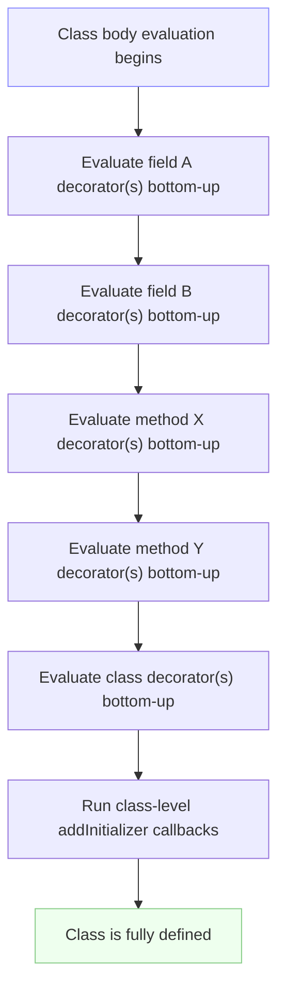
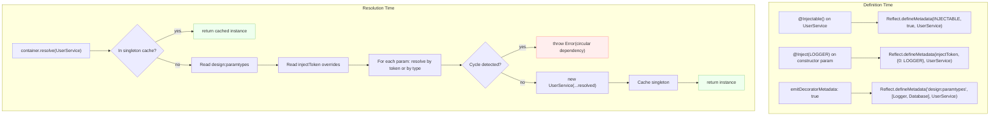

# 2.19 Decorators and Metaprogramming

> Decorators are functions that participate in the definition of a class element. They are the primary metaprogramming surface area in TypeScript, and the bridge between the type system and runtime frameworks like NestJS, TypeORM, class-validator, and routing-controllers. This note covers both the legacy Stage 2 decorators (`experimentalDecorators`) and the new Stage 3 decorators (the standard), the metadata reflection APIs (`reflect-metadata`, `emitDecoratorMetadata`, `Symbol.metadata`), and how to build the framework-shaped constructs (DI containers, ORMs, validators, routers) that decorators unlock.

---

## 1. Purpose

### 1.1 What decorators exist to solve

Most TypeScript code is *descriptive*: it tells the compiler about the shapes of values so the compiler can catch mistakes. Decorators are different. They are *transformative*: they let you attach behavior to a class, method, property, accessor, or field at the moment that element is defined. A decorator is a function that runs once, at class-definition time, and can replace, wrap, annotate, or register the element it decorates.

That single property — *run once, at definition time, with the ability to mutate the definition* — is the foundation of nearly every TypeScript framework on the server side. Without decorators, NestJS cannot know that ` UsersController ` is a controller or that ` findAll ` is a route handler. Without decorators, TypeORM cannot know that ` id ` is a primary column. Without decorators, class-validator cannot know that ` email ` must be a string. Decorators turn a class declaration into a *declarative specification* that a runtime framework can read, execute, and compose.

### 1.2 The metaprogramming axis

Decorators sit on the **metaprogramming** axis of TypeScript. Metaprogramming is, simply, writing code that reasons about other code. The other metaprogramming tools in the language are:

- The ` Proxy ` and ` Reflect ` APIs (see [[1.31 Proxy and Reflect APIs]]) for runtime interception.
- The ` Function.prototype.toString ` and ` Object.getOwnPropertyDescriptor ` reflection surfaces.
- The ` Symbol.metadata ` and ` Symbol.toStringTag ` well-known symbols.
- ` emitDecoratorMetadata `, a TypeScript compiler option that emits type information as metadata on decorated elements.

Decorators are special because they sit at the *definition* boundary. A ` Proxy ` wraps a value after it exists. A decorator wraps or replaces the definition itself, before any instance is created.

### 1.3 Two flavors: legacy (Stage 2) and Stage 3

There are two distinct decorator specifications in the TypeScript world.

**Legacy decorators** are the Stage 2 proposal from years ago. They are enabled with ` experimentalDecorators: true ` in ` tsconfig.json `. Their API uses positional arguments (` target `, ` propertyKey `, ` descriptor ` for methods; ` target `, ` propertyKey `, ` parameterIndex ` for parameters). They are what NestJS, TypeORM, class-validator, routing-controllers, Typestack, and most of the existing ecosystem use today. They require the ` reflect-metadata ` polyfill for runtime metadata and the ` emitDecoratorMetadata: true ` compiler option for type metadata.

**Stage 3 decorators** are the new standard proposal that reached Stage 3 in TC39 and is shipping in TypeScript 5.0+ (behind no flag — they are the default when ` experimentalDecorators ` is false). Their API uses a ` context ` object that carries kind, name, access, metadata, and (for fields) ` addInitializer `. Stage 3 decorators can replace the decorated element by returning a new value. Class-level metadata uses ` Symbol.metadata ` instead of ` reflect-metadata `.

### 1.4 The trade-off: magic versus explicit

Decorators trade explicitness for power. A class with ` @Injectable() ` on it is harder to reason about by reading the source alone — the actual construction behavior lives in the DI container, not in the class. This "magic" is exactly what makes frameworks terse and pleasant to use, but it is also what makes decorators a frequent source of "why didn't my dependency get injected?" debugging sessions.

The discipline that pays for that magic is: keep decorators small, keep them declarative, move real logic into a runtime registry, and document what each decorator does. Sections 6 and 7 below expand on this.

### 1.5 What this note covers

By the end of this note you should be able to:

1. Write class, method, getter/setter, auto-accessor, and field decorators in the Stage 3 syntax.
2. Write the legacy equivalents and explain why NestJS still uses them.
3. Explain ` emitDecoratorMetadata ` and ` reflect-metadata ` and how they power DI.
4. Explain ` Symbol.metadata ` and the new metadata standard.
5. Build a small DI container using ` @Injectable ` and ` @Inject `.
6. Build a small validation decorator set using ` @IsString `, ` @MinLength `.
7. Diagnose the most common decorator errors (forgetting to import ` reflect-metadata `, leaving ` experimentalDecorators ` off, returning the wrong type from a decorator, decorating a non-class target, and so on).

---

## 2. Theory and Deep Dive

### 2.1 The mental shape of a decorator

A decorator is a function. It is invoked once, at class-definition time, with information about the element it decorates. It may return a replacement value for that element. It does not run on every method call or every instance creation — it runs *once*, when the class body is evaluated.

This single-run property is critical. Anything you do inside a decorator body happens at module-load time, before any instance of the class exists. That is why decorators are the natural place to *register* things (controllers, routes, entities, validators) and the unnatural place to do per-call work (which belongs in a wrapped method).

### 2.2 Stage 3 class decorator

In the Stage 3 proposal, a class decorator receives two arguments: the ` value ` (the class itself) and a ` context ` object. The context carries:

- ` kind `: `"class"`.
- ` name `: the class name.
- ` addInitializer `: a function to register an initializer that runs after the class is fully defined.
- ` metadata `: the class's metadata object (backed by ` Symbol.metadata `).

A class decorator may return a new class to replace the original.

```ts
// TypeScript — Stage 3 class decorator
function logged(value: Function, context: ClassDecoratorContext) {
  console.log(`defining class ${context.name}`);
  return class extends (value as any) {
    constructor(...args: any[]) {
      super(...args);
      console.log(`instantiating ${context.name}`);
    }
  };
}

@logged
class Service {}

new Service();
// "defining class Service" (at definition time)
// "instantiating Service" (at construction time)
```

There is no JavaScript equivalent because the ` @logged ` syntax is not standard JavaScript yet — it is a TypeScript-only surface that compiles down to a function call. The compiled output looks like:

```js
// JavaScript — compiled output of the above
class Service {}
Service = logged(Service, { kind: "class", name: "Service", metadata: ... }) ?? Service;
```

That is, the decorator is *applied* to the class as an assignment. The ` ?? Service ` fallback means that if the decorator returns nothing, the original class is kept.

### 2.3 Stage 3 method decorator

A method decorator receives the method itself (a function) and a context with ` kind: "method" `, ` name `, ` static ` (boolean), ` access ` (an object with ` get ` and ` set ` for the method as a property), ` addInitializer `, and ` metadata ` (the owning class's metadata). It may return a new function to replace the method.

```ts
// TypeScript — Stage 3 method decorator
function trace(value: any, context: ClassMethodDecoratorContext) {
  const name = String(context.name);
  return function (this: any, ...args: any[]) {
    console.log(`-> ${name}(${args.join(", ")})`);
    const result = value.apply(this, args);
    console.log(`<- ${name} => ${result}`);
    return result;
  };
}

class Calc {
  @trace
  add(a: number, b: number) {
    return a + b;
  }
}

new Calc().add(2, 3);
// "-> add(2, 3)"
// "<- add => 5"
```

```js
// JavaScript — compiled output (Stage 3 method decorator)
class Calc {
  add(a, b) { return a + b; }
}
Calc.prototype.add = trace(Calc.prototype.add, {
  kind: "method", name: "add", static: false, access: {...}, metadata: ...
}) ?? Calc.prototype.add;
```

### 2.4 Stage 3 getter and setter decorators

Getters and setters each have their own context kind: ` "getter" ` and ` "setter" `. A getter decorator may return a new getter function; a setter decorator may return a new setter function. The ` access ` field exposes a unified ` get ` / ` set ` pair so that decorators can read or write the underlying field uniformly regardless of whether they are applied to the getter or the setter.

```ts
// TypeScript — Stage 3 getter and setter decorators
function auditGet(value: any, context: ClassGetterDecoratorContext) {
  const name = String(context.name);
  return function (this: any) {
    const v = value.call(this);
    console.log(`read ${name} => ${v}`);
    return v;
  };
}

function auditSet(value: any, context: ClassSetterDecoratorContext) {
  const name = String(context.name);
  return function (this: any, v: any) {
    console.log(`write ${name} <= ${v}`);
    value.call(this, v);
  };
}

class Account {
  #balance = 0;
  @auditGet get balance() { return this.#balance; }
  @auditSet set balance(v: number) { this.#balance = v; }
}
```

```js
// JavaScript — compiled output (sketch)
Object.defineProperty(Account.prototype, "balance", {
  get: auditGet(Object.getOwnPropertyDescriptor(Account.prototype, "balance").get, {kind:"getter", name:"balance", ...}),
  set: auditSet(Object.getOwnPropertyDescriptor(Account.prototype, "balance").set, {kind:"setter", name:"balance", ...}),
});
```

### 2.5 Stage 3 auto-accessor decorators

Auto-accessors (` accessor ` keyword, introduced alongside Stage 3 decorators) declare a field that is automatically backed by a getter and setter. Decorating an auto-accessor gives you a context of ` kind: "accessor" ` and an ` access ` object you can use to call the original get/set. An accessor decorator may return an object with ` get ` and ` set ` replacements.

```ts
// TypeScript — Stage 3 auto-accessor decorator
function reactive(value: any, context: ClassAccessorDecoratorContext) {
  const { get, set } = context.access;
  return {
    get(this: any) { return get.call(this); },
    set(this: any, v: any) {
      console.log("reactive set");
      set.call(this, v);
    },
  };
}

class Comp {
  @reactive accessor count = 0;
}
```

```js
// JavaScript — compiled output (sketch)
// Auto-accessors compile to a private slot with getter and setter on the prototype;
// the decorator's returned { get, set } overrides those.
```

### 2.6 Stage 3 field decorator

A field decorator receives ` undefined ` as the value (the field has no value yet at definition time — initialization happens per-instance) and a context of ` kind: "field" `, ` name `, ` static `, ` access `, ` addInitializer `, and ` metadata `. It may return a function that takes the initial value and returns the stored value — this lets you transform or replace the field's initial value at instance-construction time.

```ts
// TypeScript — Stage 3 field decorator
function double(value: undefined, context: ClassFieldDecoratorContext) {
  return function (initialValue: number) {
    return initialValue * 2;
  };
}

class Config {
  @double factor = 5;
}

console.log(new Config().factor); // 10
```

```js
// JavaScript — compiled output (sketch)
// The initializer of `factor` is replaced with `(initialValue) => initialValue * 2`.
```

### 2.7 Stage 3 class metadata via ` Symbol.metadata `

Stage 3 introduces a new well-known symbol, ` Symbol.metadata `, that exposes a per-class metadata object. Decorators can read and write to ` context.metadata `, and the result is stored on ` MyClass[Symbol.metadata] `. This replaces the role ` reflect-metadata ` used to play for class-level metadata in the legacy world.

```ts
// TypeScript — Stage 3 metadata collection
interface RouteMeta { path?: string; methods: Record<string, string>; }

function route(path: string) {
  return function (value: any, context: ClassMethodDecoratorContext) {
    const meta = (context.metadata as any).routes ?? ((context.metadata as any).routes = {});
    meta[String(context.name)] = path;
  };
}

class UserController {
  @route("/users") list() {}
  @route("/users/:id") get() {}
}

console.log((UserController as any)[Symbol.metadata].routes);
// { list: "/users", get: "/users/:id" }
```

```js
// JavaScript — runtime mirror (what the compiled output produces)
// UserController[Symbol.metadata].routes === { list: "/users", get: "/users/:id" }
```

### 2.8 Legacy decorators (` experimentalDecorators: true `)

The legacy API is what every shipping TypeScript framework uses today. It is enabled by setting ` experimentalDecorators: true ` in ` tsconfig.json `.

The signature is positional and varies by what is being decorated:

- **Class decorator**: ` (target: Function) => Function | void `.
- **Method decorator**: ` (target: Object, propertyKey: string | symbol, descriptor: TypedPropertyDescriptor<T>) => TypedPropertyDescriptor<T> | void `.
- **Accessor decorator**: same as method, but ` descriptor ` has ` get ` / ` set `.
- **Property decorator**: ` (target: Object, propertyKey: string | symbol) => void ` (no descriptor, no return).
- **Parameter decorator**: ` (target: Object, propertyKey: string | symbol | undefined, parameterIndex: number) => void `.

The ` target ` for instance members is the prototype; for static members it is the constructor.

```ts
// TypeScript — legacy class decorator
function logged<T extends { new (...args: any[]): {} }>(constructor: T) {
  return class extends constructor {
    constructor(...args: any[]) {
      super(...args);
      console.log(`instantiating ${constructor.name}`);
    }
  };
}

@logged
class Service {}

new Service(); // "instantiating Service"
```

```js
// JavaScript — compiled output (legacy, experimentalDecorators: true)
const Service = (function () {
  class Service {}
  return logged(Service);
})();
```

### 2.9 Legacy method decorator

```ts
// TypeScript — legacy method decorator
function trace(target: any, propertyKey: string, descriptor: PropertyDescriptor) {
  const original = descriptor.value;
  descriptor.value = function (...args: any[]) {
    console.log(`-> ${propertyKey}(${args.join(", ")})`);
    const result = original.apply(this, args);
    console.log(`<- ${propertyKey} => ${result}`);
    return result;
  };
  return descriptor;
}

class Calc {
  @trace
  add(a: number, b: number) { return a + b; }
}
```

```js
// JavaScript — compiled output (legacy)
// decorateHelper([trace], Calc.prototype, "add", null);
```

The ` decorateHelper ` function that TypeScript emits walks the decorator array and calls each decorator with the appropriate positional arguments, reassigning the descriptor in place.

### 2.10 ` emitDecoratorMetadata: true `

When ` emitDecoratorMetadata ` is enabled alongside ` experimentalDecorators `, TypeScript emits design-time type information as metadata on decorated elements. Three metadata keys are written per decorated element:

- ` design:type ` — the type of the property or method return.
- ` design:paramtypes ` — an array of constructor types for the method parameters (or class constructor).
- ` design:design:type ` (only on accessor decorators in older versions).

These keys live on the ` reflect-metadata ` registry. They are read at runtime by DI containers to figure out what to inject.

```ts
// TypeScript — emitDecoratorMetadata in action
import "reflect-metadata";

class Logger {}
class Database {}

@Injectable()
class UserService {
  constructor(private logger: Logger, private db: Database) {}
}

const paramTypes = Reflect.getMetadata("design:paramtypes", UserService);
console.log(paramTypes); // [Logger, Database]
```

```js
// JavaScript — compiled output (what gets emitted)
// metadataMarker("design:paramtypes", [Logger, Database])
// is emitted right next to the @Injectable() decorateHelper call.
```

### 2.11 ` reflect-metadata ` polyfill

The ` reflect-metadata ` package is a polyfill for the legacy "Metadata Reflection API" proposal (Strawman / Stage 1, never standardized). It exposes ` Reflect.defineMetadata `, ` Reflect.getMetadata `, ` Reflect.getMetadataKeys `, and friends. Importing ` reflect-metadata ` once at the entry point of your application patches the global ` Reflect ` object with these methods.

Even with ` emitDecoratorMetadata ` enabled, *TypeScript does not emit calls to ` Reflect.defineMetadata ` on its own* — it emits ` metadataMarker ` calls that are translated by the ` decorateHelper ` function into ` Reflect.defineMetadata ` calls. Without the ` reflect-metadata ` polyfill imported, those calls fail (or are no-ops, depending on TS version), and your DI container gets ` undefined ` from ` Reflect.getMetadata `.

```ts
// TypeScript — reflect-metadata in action
import "reflect-metadata";

function Entity(name: string) {
  return function (target: Function) {
    Reflect.defineMetadata("entity:name", name, target);
  };
}

@Entity("users")
class User {}

console.log(Reflect.getMetadata("entity:name", User)); // "users"
```

```js
// JavaScript — runtime
import "reflect-metadata";
function Entity(name) {
  return function (target) {
    Reflect.defineMetadata("entity:name", name, target);
  };
}
let User = class User {};
User = Entity("users")(User) ?? User;
console.log(Reflect.getMetadata("entity:name", User)); // "users"
```

### 2.12 Decorator evaluation order

Decorators are evaluated bottom-up per element, and elements are evaluated in declaration order. A Mermaid diagram makes this precise.



Within a single element, decorators run bottom-up. So ` @A @B method() {} ` evaluates ` B ` first, then ` A `. The outer decorator (` A `) sees the result of ` B `.

For a class with multiple fields and methods, the members run in source order, and the class decorator runs last (after all member decorators).

### 2.13 Decorator factories

A decorator factory is a function that returns a decorator. This is how you pass arguments to a decorator: ` @Route("/users") ` is a call to ` Route("/users") ` that returns a decorator, which is then applied to the method. The outer function runs at class-definition time and the inner decorator runs immediately after with the element.

```ts
// TypeScript — decorator factory
function Route(path: string) {
  return function (value: any, context: ClassMethodDecoratorContext) {
    const routes = (context.metadata as any).routes ?? ((context.metadata as any).routes = {});
    routes[String(context.name)] = path;
  };
}

class UserController {
  @Route("/users") list() {}
  @Route("/users/:id") getOne() {}
}
```

```js
// JavaScript — runtime mirror
function Route(path) {
  return function (value, context) {
    const routes = context.metadata.routes ??= {};
    routes[String(context.name)] = path;
  };
}
```

### 2.14 Stage 3 ` addInitializer `

The ` addInitializer ` callback (available on class, method, accessor, and field contexts) lets you register a function that runs after the class is fully defined (for class decorators) or after instance construction (for field and accessor decorators). This is the new way to do things that previously required ` Reflect.defineMetadata ` and a separate boot step.

```ts
// TypeScript — addInitializer for registration
function controller(prefix: string) {
  return function (value: Function, context: ClassDecoratorContext) {
    context.addInitializer(function () {
      registry.register(prefix, value);
    });
  };
}

const registry = {
  items: [] as { prefix: string; cls: any }[],
  register(prefix: string, cls: any) { this.items.push({ prefix, cls }); },
};

@controller("/api")
class ApiController {}

console.log(registry.items); // [{ prefix: "/api", cls: ApiController }]
```

```js
// JavaScript — runtime mirror
function controller(prefix) {
  return function (value, context) {
    context.addInitializer(function () {
      registry.register(prefix, value);
    });
  };
}
```

### 2.15 The compiled helper

When ` experimentalDecorators ` is enabled, TypeScript emits a ` decorateHelper ` function (roughly 30 lines of JavaScript) that walks the decorator array and applies each one. The new Stage 3 decorators do not use ` decorateHelper ` — they compile to direct assignments. This is why Stage 3 emits *less* code per decorator.

A rough sketch of ` decorateHelper `:

```js
// JavaScript — sketch of the legacy decorateHelper function emitted by TypeScript
var decorateHelper = function (decorators, target, key, desc) {
  var c = arguments.length;
  var r = c < 3 ? target : desc === null ? desc = Object.getOwnPropertyDescriptor(target, key) : desc;
  var d;
  for (var i = decorators.length - 1; i >= 0; i--) {
    if (d = decorators[i]) r = (c < 3 ? d(r) : c > 3 ? d(target, key, r) : d(target, key)) || r;
  }
  if (c > 3 && r) Object.defineProperty(target, key, r);
  return r;
};
```

The "iterate in reverse" line (` for (var i = decorators.length - 1; i >= 0; i--) `) is what gives decorators their bottom-up evaluation order.

### 2.16 The metadata flow for DI

A dependency injection container works by:

1. Reading the constructor's ` design:paramtypes ` metadata (a list of constructor functions).
2. For each parameter, recursively resolving an instance of that constructor.
3. Constructing the target class with the resolved instances.


Section 5.2 builds a working version of this.

### 2.17 Limitations and quirks

- Legacy property decorators receive only ` target ` and ` propertyKey ` — no descriptor, because the property has not been defined on the prototype yet (instance fields are assigned in the constructor). To intercept a property, you must use ` Object.defineProperty ` yourself.
- ` design:type ` for a property declared as ` logger?: Logger ` is ` Logger ` if the type annotation is ` Logger `, but ` Object ` if it is a union (` Logger | undefined `).
- ` design:type ` for a property typed as ` string[] ` is ` Array ` — the element type is lost.
- ` design:paramtypes ` for a constructor with rest parameters loses the rest types.
- Stage 3 decorators cannot currently be applied to constructor parameters — only to classes, methods, getters, setters, accessors, and fields.
- Stage 3 and legacy decorators cannot be mixed in the same file: ` experimentalDecorators ` is a per-file switch (set in ` tsconfig.json `).

### 2.18 The new metadata proposal and ` Symbol.metadata `

The ` Symbol.metadata ` well-known symbol was added specifically to give Stage 3 decorators a place to attach class-level metadata without depending on ` reflect-metadata `. The metadata object is created lazily per class and inherited along the prototype chain. The Stage 3 metadata proposal is small but consequential: it means a NestJS-equivalent framework could be built on Stage 3 without any polyfill, just by reading ` Class[Symbol.metadata] `.

---

## 3. Mental Models

### 3.1 Decorator = "function that wraps or modifies a class element at definition time"

Strip away the syntax and a decorator is just a function that gets called once when the class is being defined. Everything else — the ` @ ` sigil, the ` context ` object, the metadata — is sugar over that fundamental operation.

### 3.2 Class decorator = "wrap the constructor"

The simplest mental model for a class decorator: it returns a new class (or new constructor function) that wraps the original. The original is still called via ` super `; the wrapper can add arguments, log construction, register the class, lazily construct, or even replace the original entirely with a different class.

### 3.3 Method decorator = "wrap the method"

A method decorator returns a new function that wraps the original. The wrapper is what gets called when the method is invoked; the original is invoked via ` apply ` or ` call ` inside the wrapper. This is exactly the same shape as a function wrapper you might write by hand (` const old = obj.method; obj.method = function (...args) { ... old.apply(this, args); ... }; `), except it happens at definition time and is invisible to the caller.

### 3.4 Field decorator = "intercept initialization"

A field decorator does not have a value to wrap, because the field has no value at definition time. Instead, it returns an initializer function that receives the value the field *would* have been initialized to and returns the value the field *is* initialized to. This is the model for validators, transformers, and reactive systems.

### 3.5 Metadata = "extra info attached to the class for tools to read"

Metadata is the second axis of decorators. A decorator that does not change behavior — it just records information ("this method is a route handler with path /users") — is a *metadata decorator*. The class itself is unchanged; the metadata lives in a side table (either ` Reflect ` metadata or ` Symbol.metadata `) that frameworks read at boot.

### 3.6 DI framework = "read metadata, inject dependencies"

The dependency injection container is the canonical consumer of decorator-emitted metadata. It reads ` design:paramtypes ` from the constructor, resolves each parameter, and constructs the class. The decorator's only job is to mark the class as injectable and (optionally) tag specific parameters with custom tokens.

### 3.7 Decorator versus Proxy

A ` Proxy ` (see [[1.31 Proxy and Reflect APIs]]) intercepts access to an existing object. A decorator intercepts the *definition* of a class element. They are complementary: a decorator could install a ` Proxy ` on every instance, but the decorator itself is the thing that decides to do so, at definition time.

### 3.8 Decorator versus higher-order function

A higher-order function wraps a function you pass it. A decorator wraps a function at the point of definition, with no visible wrapping syntax at the call site. The ` @dec ` sigil is the only evidence that the wrapping happened.

---

## 4. Real-World Use Cases

### 4.1 NestJS controllers and providers

NestJS is the canonical decorator-driven framework. A controller is a class with ` @Controller(prefix) `; routes are methods with ` @Get `, ` @Post `, etc.; providers are classes with ` @Injectable `. NestJS uses legacy decorators and ` reflect-metadata `.

```ts
// TypeScript — NestJS controller sketch
import { Controller, Get, Post, Body, Injectable } from "@nestjs/common";

@Injectable()
class UsersService {
  findAll() { return [{ id: 1, name: "Ada" }]; }
  create(name: string) { return { id: 2, name }; }
}

@Controller("users")
class UsersController {
  constructor(private users: UsersService) {}

  @Get()
  list() { return this.users.findAll(); }

  @Post()
  create(@Body() body: { name: string }) { return this.users.create(body.name); }
}
```

### 4.2 TypeORM entities

TypeORM maps a class to a database table. Class-level ` @Entity ` decorator marks the class; field-level ` @PrimaryColumn `, ` @Column `, ` @CreateDateColumn ` decorators mark columns.

```ts
// TypeScript — TypeORM entity
import { Entity, PrimaryGeneratedColumn, Column, CreateDateColumn } from "typeorm";

@Entity("users")
class User {
  @PrimaryGeneratedColumn() id: number;
  @Column() email: string;
  @Column({ default: true }) active: boolean;
  @CreateDateColumn() createdAt: Date;
}
```

### 4.3 class-validator and class-transformer

class-validator attaches validation rules to properties via ` @IsString `, ` @MinLength `, ` @IsEmail `, etc. class-transformer converts plain objects into typed instances via ` plainToInstance `. Both rely on legacy decorators and ` reflect-metadata `.

```ts
// TypeScript — class-validator DTO
import { IsString, MinLength, IsEmail } from "class-validator";

class CreateUserDto {
  @IsString() name: string;
  @IsEmail() email: string;
  @MinLength(8) password: string;
}

// Validation:
import { validate } from "class-validator";
const dto = Object.assign(new CreateUserDto(), { name: 123, email: "bad", password: "x" });
const errors = await validate(dto);
// errors: [{ property: "name", ... }, { property: "email", ... }, { property: "password", ... }]
```

### 4.4 routing-controllers

routing-controllers exposes a thin decorator layer over Express (or Koa) that mirrors NestJS's surface but without the full framework.

```ts
// TypeScript — routing-controllers
import { Controller, Get, Post, Body } from "routing-controllers";

@Controller("/users")
class UserController {
  @Get("/")
  all() { return [{ id: 1 }]; }

  @Post("/")
  create(@Body() user: { name: string }) { return { id: 2, ...user }; }
}
```

### 4.5 Reflect-metadata for runtime type info

Any time you need to know the constructor of a method parameter at runtime — DI, serializers, validators, mock generators — ` emitDecoratorMetadata ` plus ` reflect-metadata ` is the standard answer. The trade-off is that the metadata only carries constructor references (no generics, no unions), so it is coarse.

### 4.6 tsoa and OpenAPI generation

tsoa reads ` @Get `, ` @Post `, ` @Route ` and the ` @IsString `-style validation decorators to generate OpenAPI specs and Express routes from your controllers. This is a powerful pattern: a single source of truth (your controller classes) drives both routing and API documentation.

### 4.7 TypeDI

TypeDI is a small DI container that uses ` @Service ` to mark injectable classes and ` @Inject ` to mark constructor or property dependencies. It is the DI layer under routing-controllers and MikroORM.

```ts
// TypeScript — TypeDI
import { Service, Container } from "typedi";

@Service()
class Logger { log(m: string) { console.log(m); } }

@Service()
class UsersService {
  constructor(private logger: Logger) {}
  findAll() { this.logger.log("find all"); return []; }
}

const svc = Container.get(UsersService);
svc.findAll();
```

### 4.8 MikroORM and Prisma

MikroORM uses the same ` @Entity ` / ` @Property ` pattern as TypeORM. Prisma does not use decorators at all (its schema is a separate DSL), which is itself a useful data point: decorators are not the only way to do these things, and the Prisma team chose explicit schemas over decorator-driven entities.

### 4.9 Custom decorators for cross-cutting concerns

In a NestJS codebase it is common to write custom decorators for things like ` @CurrentUser() `, ` @Public() `, ` @Roles("admin") `, ` @AuditLog() `. These compose with the framework's built-in decorators to express cross-cutting policy declaratively.

### 4.10 Performance profiling and tracing

Method decorators are a clean place to install timing, tracing, or metrics collection without modifying the method body. The decorator wraps the method once at definition time, and the wrapper records timing on every call.

---

## 5. Code Examples

### 5.1 Example A — Minimal and Conceptual

Five five-line examples, each side by side as TypeScript (Stage 3 where possible, legacy where the concept is legacy-only) and JavaScript (the compiled output or runtime mirror).

#### 5.1.1 Class decorator (Stage 3)

```ts
// TypeScript
function announce(value: Function, ctx: ClassDecoratorContext) {
  console.log(`defined ${ctx.name}`);
}

@announce class Service {}
// "defined Service"
```

```js
// JavaScript — compiled output
class Service {}
Service = announce(Service, { kind: "class", name: "Service", metadata: Service[Symbol.metadata] }) ?? Service;
```

#### 5.1.2 Method decorator (Stage 3)

```ts
// TypeScript
function upper(value: any, ctx: ClassMethodDecoratorContext) {
  return function (this: any) { return value.call(this).toUpperCase(); };
}

class Greet { @upper hello() { return "hi"; } }
console.log(new Greet().hello()); // "HI"
```

```js
// JavaScript — compiled output
class Greet { hello() { return "hi"; } }
Greet.prototype.hello = upper(Greet.prototype.hello, { kind: "method", name: "hello", static: false, access: {...}, metadata: ... }) ?? Greet.prototype.hello;
```

#### 5.1.3 Field decorator (Stage 3)

```ts
// TypeScript
function trim(value: undefined, ctx: ClassFieldDecoratorContext) {
  return (init: string) => String(init).trim();
}

class Form { @trim name = "  ada  "; }
console.log(new Form().name); // "ada"
```

```js
// JavaScript — compiled output (sketch)
// The initializer of `name` is replaced with (init) => String(init).trim();
```

#### 5.1.4 Auto-accessor decorator (Stage 3)

```ts
// TypeScript
function loud(value: any, ctx: ClassAccessorDecoratorContext) {
  const { get, set } = ctx.access;
  return {
    get(this: any) { return String(get.call(this)).toUpperCase(); },
    set(this: any, v: any) { set.call(this, v); },
  };
}

class UI { @loud accessor title = "hello"; }
const u = new UI();
console.log(u.title); // "HELLO"
```

```js
// JavaScript — compiled output (sketch, auto-accessor compiles to a private slot + getter/setter)
```

#### 5.1.5 Legacy class decorator with metadata (Stage 2)

```ts
// TypeScript — tsconfig: experimentalDecorators: true, emitDecoratorMetadata: true
import "reflect-metadata";

function Logged(target: Function) {
  Reflect.defineMetadata("logged", true, target);
}

@Logged class Service {}
console.log(Reflect.getMetadata("logged", Service)); // true
```

```js
// JavaScript — compiled output (legacy)
import "reflect-metadata";
let Service = class Service {};
Service = Logged(Service) ?? Service;
// Reflect.defineMetadata("logged", true, Service) ran inside Logged
console.log(Reflect.getMetadata("logged", Service)); // true
```

### 5.2 Example B — Production-Grade DI Container

A minimal but functional DI container built on legacy decorators and ` reflect-metadata `. This is the heart of how NestJS, TypeDI, and InversifyJS work, stripped to its essentials.

#### TypeScript — full DI container

```ts
// TypeScript — di-container.ts
// tsconfig: experimentalDecorators: true, emitDecoratorMetadata: true
import "reflect-metadata";

const INJECTABLE = Symbol("injectable");
const injectToken = Symbol("inject-token");

type Constructor<T = any> = { new (...args: any[]): T };

// Mark a class as injectable. Optionally register under a class-level token.
function Injectable(token?: string): ClassDecorator {
  return function (target: Function) {
    Reflect.defineMetadata(INJECTABLE, true, target);
    if (token) container.register(token, target as Constructor);
  };
}

// Mark a constructor parameter to be resolved by token instead of by type.
function Inject(token: string): ParameterDecorator {
  return function (target: Object, propertyKey: string | symbol | undefined, parameterIndex: number) {
    const existing: Record<number, string> =
      Reflect.getOwnMetadata(injectToken, target as object) ?? {};
    existing[parameterIndex] = token;
    Reflect.defineMetadata(injectToken, existing, target as object);
  };
}

class Container {
  private singletons = new Map<Constructor, any>();
  private tokens = new Map<string, Constructor>();

  register(token: string, ctor: Constructor) { this.tokens.set(token, ctor); }

  resolve<T>(ctor: Constructor<T>): T {
    // Already instantiated?
    if (this.singletons.has(ctor)) return this.singletons.get(ctor);

    // Param types emitted by TypeScript via emitDecoratorMetadata.
    const paramTypes: Constructor[] =
      Reflect.getMetadata("design:paramtypes", ctor) ?? [];

    // Token overrides from @Inject.
    const tokenMap: Record<number, string> =
      Reflect.getOwnMetadata(injectToken, ctor as object) ?? {};

    const args = paramTypes.map((type, i) => {
      const token = tokenMap[i];
      if (token) {
        const resolved = this.tokens.get(token);
        if (!resolved) throw new Error(`No provider for token "${token}"`);
        return this.resolve(resolved);
      }
      if (!type) throw new Error(`Cannot resolve parameter ${i} of ${ctor.name}: no type info`);
      return this.resolve(type);
    });

    const instance = new ctor(...args);
    this.singletons.set(ctor, instance);
    return instance;
  }
}

const container = new Container();

// --- Usage ---

@Injectable()
class Logger {
  log(msg: string) { console.log(`[logger] ${msg}`); }
}

@Injectable()
class Database {
  query(sql: string) { console.log(`[db] ${sql}`); return []; }
}

const paymentToken = "PaymentGateway";

interface PaymentGateway { charge(amount: number): void; }

@Injectable()
class StripeGateway implements PaymentGateway {
  charge(amount: number) { console.log(`[stripe] charged $${amount}`); }
}

@Injectable()
class OrderService {
  constructor(
    private logger: Logger,
    private db: Database,
    @Inject(paymentToken) private payments: PaymentGateway,
  ) {}

  placeOrder(amount: number) {
    this.logger.log("placing order");
    this.db.query("INSERT INTO orders ...");
    this.payments.charge(amount);
  }
}

container.register(paymentToken, StripeGateway);

const orders = container.resolve(OrderService);
orders.placeOrder(99);
// [logger] placing order
// [db] INSERT INTO orders ...
// [stripe] charged $99
```

#### JavaScript — runtime mirror (what the compiled output effectively does)

```js
// JavaScript — di-container.runtime.js
import "reflect-metadata";

const INJECTABLE = Symbol("injectable");
const injectToken = Symbol("inject-token");

class Container {
  constructor() {
    this.singletons = new Map();
    this.tokens = new Map();
  }
  register(token, ctor) { this.tokens.set(token, ctor); }
  resolve(ctor) {
    if (this.singletons.has(ctor)) return this.singletons.get(ctor);
    const paramTypes = Reflect.getMetadata("design:paramtypes", ctor) ?? [];
    const tokenMap = Reflect.getOwnMetadata(injectToken, ctor) ?? {};
    const args = paramTypes.map((type, i) => {
      const token = tokenMap[i];
      if (token) {
        const resolved = this.tokens.get(token);
        if (!resolved) throw new Error(`No provider for token "${token}"`);
        return this.resolve(resolved);
      }
      if (!type) throw new Error(`Cannot resolve parameter ${i} of ${ctor.name}`);
      return this.resolve(type);
    });
    const instance = new ctor(...args);
    this.singletons.set(ctor, instance);
    return instance;
  }
}

const container = new Container();

function Injectable(token) {
  return function (target) {
    Reflect.defineMetadata(INJECTABLE, true, target);
    if (token) container.register(token, target);
  };
}

function Inject(token) {
  return function (target, propertyKey, parameterIndex) {
    const existing = Reflect.getOwnMetadata(injectToken, target) ?? {};
    existing[parameterIndex] = token;
    Reflect.defineMetadata(injectToken, existing, target);
  };
}

class Logger { log(msg) { console.log(`[logger] ${msg}`); } }
class Database { query(sql) { console.log(`[db] ${sql}`); return []; } }
const paymentToken = "PaymentGateway";
class StripeGateway { charge(amount) { console.log(`[stripe] charged $${amount}`); } }

class OrderService {
  constructor(logger, db, payments) {
    this.logger = logger; this.db = db; this.payments = payments;
  }
  placeOrder(amount) {
    this.logger.log("placing order");
    this.db.query("INSERT INTO orders ...");
    this.payments.charge(amount);
  }
}
// The compiled TS emits:
// decorateHelper([Inject(paymentToken)], OrderService, undefined, 2);
// decorateHelper([Injectable()], OrderService);

Reflect.defineMetadata("design:paramtypes", [Logger, Database, Object], OrderService);
const tokenMap = { 2: paymentToken };
Reflect.defineMetadata(injectToken, tokenMap, OrderService);

container.register(paymentToken, StripeGateway);
container.resolve(OrderService).placeOrder(99);
// [logger] placing order
// [db] INSERT INTO orders ...
// [stripe] charged $99
```

#### How it works, step by step

1. ` @Injectable() ` writes ` INJECTABLE: true ` to the class's metadata. (In a fuller implementation this would gate resolution.)
2. ` @Inject(token) ` writes ` { [parameterIndex]: token } ` to the class's ` injectToken ` metadata.
3. ` emitDecoratorMetadata ` writes ` design:paramtypes ` to the class — an array of constructor functions matching the constructor signature.
4. ` container.resolve(OrderService) ` reads ` design:paramtypes `, walks each parameter, looks up a token override in ` injectToken ` if present, recursively resolves the parameter, and constructs the class.
5. The result is cached in ` singletons ` so that subsequent resolutions return the same instance.

The TypeScript version gains compile-time checking on the constructor signature and the parameter types. The JavaScript version is what TypeScript actually emits.

---

## 6. Common Mistakes and Anti-Patterns

### 6.1 Mixing legacy and Stage 3 syntax in the same project

` experimentalDecorators ` is a per-file, per-tsconfig flag. If you set it ` true ` for some files and not for others, the two cannot share decorators. The compiler will reject Stage 3 syntax in ` experimentalDecorators ` files and reject legacy parameter decorators in non-` experimentalDecorators ` files.

**Fix**: pick one. If you are on NestJS, TypeORM, TypeDI, InversifyJS, or class-validator, you are on legacy. If you are starting fresh and not using any of those, prefer Stage 3.

### 6.2 Forgetting ` emitDecoratorMetadata: true `

Without ` emitDecoratorMetadata `, TypeScript does not emit ` design:paramtypes `, and your DI container reads ` undefined ` from ` Reflect.getMetadata("design:paramtypes", target) `. The container then throws "cannot resolve parameter 0" or injects ` undefined `.

**Symptom**: every constructor parameter resolves to ` undefined ` or to the wrong type.

**Fix**: in ` tsconfig.json `, set both ` experimentalDecorators: true ` and ` emitDecoratorMetadata: true `.

### 6.3 Forgetting to import ` reflect-metadata ` at the entry point

` emitDecoratorMetadata ` only emits the *calls* to ` Reflect.defineMetadata `. The ` Reflect.defineMetadata ` and ` Reflect.getMetadata ` methods themselves come from the ` reflect-metadata ` polyfill. If you do not import it at least once before any decorator runs, those methods do not exist, and either the call throws or ` getMetadata ` returns ` undefined `.

**Symptom**: ` Reflect.getMetadata is not a function `, or silent ` undefined ` returns.

**Fix**: ` import "reflect-metadata"; ` at the very top of your application entry file (for example, ` main.ts ` in NestJS).

### 6.4 Decorating the wrong target

In legacy decorators, ` target ` is the prototype for instance members and the constructor for static members. Beginners often write ` target.constructor ` everywhere, which is ` undefined ` for instance-member decorators (because ` Object.prototype.constructor ` is the constructor, but on the prototype it does work — except when the property has not been defined yet, in which case the ` target ` is the prototype, and ` target.constructor ` is the class). The confusion leads to metadata being written to the wrong object.

**Fix**: be explicit. For class-level metadata, target the constructor (the ` target ` argument of a class decorator). For method-level metadata, target the prototype (the ` target ` argument of a method decorator). Use ` target.constructor ` only when you need the class from a method decorator.

### 6.5 Returning the wrong type from a decorator

A Stage 3 method decorator must return a function. A Stage 3 class decorator must return a constructor (or nothing). A Stage 3 field decorator must return a function (the initializer transformer) or nothing. Returning the wrong type silently does nothing (the assignment ` x = decorator(x, ctx) ?? x ` keeps ` x ` if the return value is not the right type, but TypeScript will catch this if you have typed the decorator correctly).

**Fix**: type your decorator functions precisely. The context types (` ClassDecoratorContext `, ` ClassMethodDecoratorContext `, ` ClassFieldDecoratorContext `, etc.) and their corresponding return types exist for exactly this reason.

### 6.6 Decorator on a non-class element

Stage 3 decorators cannot be applied to standalone functions, plain objects, or constructor parameters. Legacy parameter decorators exist but only inside class constructors.

```ts
// TypeScript — invalid
@logged function standalone() {} // ERROR
```

**Fix**: wrap your function in a class, or use a higher-order function (` const standalone = logged(function standalone() {}) `).

### 6.7 Heavy logic inside a decorator

Because decorators run at module-load time, heavy logic (file reads, network calls, large data structure construction) inside a decorator body slows down application startup. Worse, if the logic depends on runtime state that is not available at load time, the decorator will see stale or missing data.

**Fix**: decorators should *register* and *annotate*. Real work belongs in a runtime registry that runs once at boot (after all decorators have run) or per-request.

### 6.8 Relying on ` design:type ` for unions, generics, or arrays

` emitDecoratorMetadata ` stores constructor references only. A property typed as ` string | number ` is stored as ` Object `. A property typed as ` string[] ` is stored as ` Array `. A property typed as ` User<Postgres> ` is stored as ` User `. This breaks DI containers and serializers that rely on per-property type info.

**Fix**: for unions and generics, use an explicit ` @Inject(token) ` or ` @Type(() => User) ` decorator to carry the type at runtime.

### 6.9 Not handling circular dependencies

If ` A ` depends on ` B ` and ` B ` depends on ` A `, the DI container either needs to break the cycle with a proxy or refuse to construct. Naive recursive resolution will stack-overflow.

**Fix**: detect cycles (track a "currently resolving" set), and either throw a clear error or return a lazy proxy.

### 6.10 Forgetting that decorators run bottom-up

If you stack ` @A @B @C ` on a method, the application order is ` C `, then ` B `, then ` A `. The outer decorator (` A `) sees the result of ` B `, which sees the result of ` C `. Beginners sometimes write decorators assuming the opposite order.

**Fix**: remember the order is bottom-up (innermost first, outermost last). Test your decorator stacks.

### 6.11 Assuming Stage 3 will work in your framework

If you are on NestJS, TypeORM, or any other legacy-decorator framework, turning off ` experimentalDecorators ` will break the framework's decorators. Stage 3 is not a drop-in replacement; frameworks must explicitly migrate.

**Fix**: read your framework's decorator documentation. Until your framework explicitly supports Stage 3, stay on legacy.

### 6.12 Decorator on a property without a value at definition time (legacy)

Legacy property decorators receive ` target ` and ` propertyKey ` only — no descriptor. The property has not been defined on the prototype. Attempting to read or modify the value through ` target[propertyKey] ` returns ` undefined ` and writing to it does nothing useful (it gets overwritten by the instance assignment in the constructor).

**Fix**: use ` Object.defineProperty(target, propertyKey, { get, set, configurable: true }) ` to install a getter and setter that intercept the property. This is exactly what class-validator does internally.

### 6.13 Module load order

If a decorator reads a registry (e.g., a controllers list) at definition time, and another module has not been imported yet, the registry will be incomplete. This is why NestJS has an ` @Module ` decorator that explicitly lists controllers and providers — to avoid relying on import order.

**Fix**: either register explicitly in a module, or use a "scan" step at boot that imports all modules before reading the registry.

---

## 7. Best Practices and Design Patterns

### 7.1 Choose Stage 3 for greenfield code

If you are starting a new project without a framework dependency, use Stage 3 decorators. They are the standard, they have a cleaner API, they support ` Symbol.metadata `, and they emit less code. Legacy decorators remain necessary only when your framework requires them.

### 7.2 Use legacy decorators when your framework requires them

NestJS, TypeORM, TypeDI, InversifyJS, class-validator, routing-controllers, and tsoa all use legacy decorators. Mixing is not possible. If you are on one of these, set ` experimentalDecorators: true ` and ` emitDecoratorMetadata: true `.

### 7.3 Import ` reflect-metadata ` exactly once, at the entry point

` import "reflect-metadata" ` patches the global ` Reflect `. Importing it more than once is harmless but redundant. Importing it anywhere other than the entry point risks it being imported too late (after a decorator that depends on it has run).

### 7.4 Keep decorators declarative

A decorator should declare intent. Real work — constructing, validating, routing, serializing — belongs in a runtime system that reads the declaration. A ` @Route("/users") ` decorator should record ` { method: "list", path: "/users" } ` in a registry; the router itself runs later, when the HTTP server starts.

### 7.5 Type your decorators precisely

Stage 3 decorator context types (` ClassDecoratorContext `, ` ClassMethodDecoratorContext `, ` ClassGetterDecoratorContext `, ` ClassSetterDecoratorContext `, ` ClassAccessorDecoratorContext `, ` ClassFieldDecoratorContext `) exist precisely so that you cannot accidentally return the wrong type. Use them. The equivalent for legacy decorators is to write ` (target: Function) => Function | void ` for class decorators, etc.

### 7.6 Document what each decorator does

A decorator's effect is invisible at the call site. The ` @Injectable() ` on a class does not say "this class will be constructed by a DI container with its dependencies auto-wired" — you have to know that. Mitigate this with comments on the decorator definition and a project-wide README that lists the decorators and their effects.

### 7.7 Use factories for parameterized decorators

` @Route("/users") ` is a factory. ` @Route ` (without parens) is a bare decorator. The factory form is more flexible and more readable — always take the factory form for any decorator that takes configuration.

### 7.8 Avoid returning the original element unchanged

If a decorator does not need to replace the element, return nothing. Returning the original element forces the runtime to do a pointless assignment. It is also misleading: it suggests the decorator is wrapping when it is not.

### 7.9 Move per-call work into the wrapper, not the decorator

The decorator body runs once. Per-call work — timing, logging, validation — must happen inside the function the decorator returns. This is obvious once stated, but beginners frequently put ` console.log ` in the decorator body itself, expecting it to run on every call.

### 7.10 Use ` addInitializer ` for one-time setup

Stage 3's ` addInitializer ` is the right hook for "register this class with the framework" or "validate the metadata we just collected". It runs after the class is fully defined, so all member decorators have already run.

### 7.11 Cache metadata reads

` Reflect.getMetadata ` is not free. If you are reading metadata on every request (in a route handler, for example), cache the result in a ` WeakMap ` keyed by the constructor. The first call reads metadata; subsequent calls read the cache.

### 7.12 Test decorator behavior with both presence and absence

A decorator that does nothing if applied to the wrong kind of element silently fails. Test your decorators on the right kind, the wrong kind, and with multiple stacked instances.

### 7.13 Avoid decorators for things that can be plain functions

Not every cross-cutting concern needs a decorator. A ` validateUserInput(dto) ` function called explicitly is often clearer than a ` @Validate ` decorator. Reach for decorators when the declaration site (the class or method) is the right place to express the intent, and a function call would clutter the code.

### 7.14 Treat ` design:type ` as coarse-grained

When designing a metadata-driven system, design for ` design:type ` being a constructor reference only. Carry anything more specific (union members, generic parameters, array element types) through explicit ` @Type(() => X) ` or ` @Inject(token) ` decorators.

### 7.15 Prefer composition over deep decorator stacks

Three decorators on a method is fine. Ten decorators on a method is a sign that you have moved too much behavior into the declaration and should refactor into a composed higher-order function or a wrapper class.

---

## 8. Technical Interview Knowledge

### 8.1 Q: What is a decorator?

A decorator is a function that participates in the definition of a class element. It runs once, at class-definition time, with information about the element it decorates. It may return a replacement value for the element. Decorators exist in two flavors: legacy (Stage 2, enabled by ` experimentalDecorators: true `) and Stage 3 (the new standard, default in TypeScript 5.0+). They are the primary metaprogramming surface in TypeScript and underlie frameworks like NestJS, TypeORM, and class-validator.

### 8.2 Q: What is the difference between legacy and Stage 3 decorators?

Legacy decorators use positional arguments (` target `, ` propertyKey `, ` descriptor ` for methods; ` target `, ` propertyKey `, ` parameterIndex ` for parameters). They require ` experimentalDecorators: true ` and are what the existing framework ecosystem uses. They pair with ` emitDecoratorMetadata ` and ` reflect-metadata ` for type metadata.

Stage 3 decorators use a ` context ` object (` ClassDecoratorContext `, ` ClassMethodDecoratorContext `, etc.) that carries ` kind `, ` name `, ` access `, ` static `, ` addInitializer `, and ` metadata `. They use ` Symbol.metadata ` for class-level metadata instead of ` reflect-metadata `. They cannot be applied to constructor parameters (legacy parameter decorators do not exist in Stage 3). They emit less code (no ` decorateHelper ` function; direct assignment instead).

### 8.3 Q: What is ` emitDecoratorMetadata `?

A TypeScript compiler option (only effective when ` experimentalDecorators ` is also enabled) that emits design-time type information as metadata on decorated elements. Three keys are emitted:

- ` design:type ` — the constructor of the property's type or the method's return type.
- ` design:paramtypes ` — an array of constructors for the method's (or class constructor's) parameter types.
- ` design:returntype ` — the constructor of the method's return type (on method decorators).

These keys live in the ` reflect-metadata ` registry and are read by DI containers (NestJS, TypeDI, InversifyJS) to auto-wire constructor dependencies. Without ` emitDecoratorMetadata `, the DI container has no way to know what types a constructor expects.

### 8.4 Q: What is ` reflect-metadata `?

A polyfill for the legacy "Metadata Reflection API" Stage 1 proposal. It patches the global ` Reflect ` object with ` defineMetadata `, ` getMetadata `, ` getMetadataKeys `, ` getOwnMetadata `, ` hasMetadata `, ` deleteMetadata `. The ` reflect-metadata ` package is what makes ` Reflect.getMetadata("design:paramtypes", target) ` work in Node.js. It must be imported exactly once, before any decorator that depends on it runs — usually at the application entry point.

` reflect-metadata ` is being replaced for new code by ` Symbol.metadata ` (a standard well-known symbol) under the Stage 3 decorators proposal.

### 8.5 Q: How does NestJS use decorators?

NestJS uses legacy decorators throughout. ` @Module `, ` @Controller `, ` @Injectable `, ` @Inject `, ` @Optional `, ` @Global ` mark classes and parameters with metadata that the NestJS runtime reads at boot. ` @Get `, ` @Post `, ` @Put `, ` @Delete `, ` @Patch `, ` @All ` mark methods as route handlers with paths. ` @Body `, ` @Query `, ` @Param `, ` @Headers `, ` @Req ` mark parameters as coming from specific parts of the HTTP request. NestJS reads ` design:paramtypes ` on each injectable class to auto-wire constructor dependencies, and uses ` @Inject(token) ` for non-class tokens.

### 8.6 Q: How would you build a DI container with decorators?

1. Define an ` @Injectable() ` class decorator that writes a marker (e.g., ` Reflect.defineMetadata(INJECTABLE, true, target) `).
2. Define an ` @Inject(token) ` parameter decorator that writes ` { [parameterIndex]: token } ` to ` injectToken ` metadata on the class.
3. Enable ` emitDecoratorMetadata ` so that TypeScript emits ` design:paramtypes ` on each decorated constructor.
4. Implement a ` Container.resolve(ctor) ` method that:
   - Reads ` design:paramtypes ` for the constructor.
   - Reads ` injectToken ` overrides.
   - Recursively resolves each parameter (by token if specified, otherwise by type).
   - Caches the resulting instance as a singleton.
5. Throw clear errors for missing tokens, missing param types (e.g., when the type is a union or interface), and circular dependencies.

Section 5.2 above is a complete working implementation.

### 8.7 Q: What can you decorate?

In Stage 3: classes, methods, getters, setters, auto-accessors, and fields. You cannot decorate constructor parameters or standalone functions.

In legacy decorators: classes, methods, accessors (getters/setters), properties, and constructor parameters. You cannot decorate standalone functions or arbitrary object literals.

### 8.8 Q: What are the performance implications of decorators?

Decorators add overhead at three points:

1. **Module load time**: each decorator runs once when the class is defined. Heavy logic here slows startup.
2. **Per-call overhead**: a method decorator that wraps the method adds a function call and an ` apply ` indirection per invocation. For most code this is negligible; for hot paths it is measurable.
3. **Metadata storage**: ` Reflect.defineMetadata ` and ` Reflect.getMetadata ` involve key lookups on the target object. Caching metadata reads in a ` WeakMap ` removes this overhead.

In practice, decorator overhead is small compared to the I/O work most frameworks do, and the readability gains outweigh the cost. But for hot-path code (a tight loop, a high-frequency event handler), avoid method decorators.

---

## 9. Practical Exercises

### 9.1 Exercise 1 — Class decorator that logs construction

**Goal**: write a ` @Logged ` class decorator that prints ` "constructed <ClassName>" ` each time an instance is created.

**TypeScript solution (Stage 3)**:

```ts
// TypeScript
function Logged(value: Function, context: ClassDecoratorContext) {
  return class extends (value as any) {
    constructor(...args: any[]) {
      super(...args);
      console.log(`constructed ${context.name}`);
    }
  };
}

@Logged
class Service {
  constructor(public id: number) {}
}

new Service(1); // "constructed Service"
new Service(2); // "constructed Service"
```

**JavaScript solution (runtime mirror)**:

```js
// JavaScript
function Logged(value, context) {
  return class extends value {
    constructor(...args) {
      super(...args);
      console.log(`constructed ${context.name}`);
    }
  };
}

let Service = class Service { constructor(id) { this.id = id; } };
Service = Logged(Service, { kind: "class", name: "Service" }) ?? Service;
new Service(1); // "constructed Service"
new Service(2); // "constructed Service"
```

**Key points**: the decorator returns a subclass that calls ` super ` and logs. The original constructor runs intact; the wrapper adds logging. The decorator runs once (at definition), the wrapper runs on every construction.

### 9.2 Exercise 2 — Method decorator that logs calls

**Goal**: write a ` @Trace ` method decorator that logs the method name, arguments, and return value on every call.

**TypeScript solution (Stage 3)**:

```ts
// TypeScript
function Trace(value: any, context: ClassMethodDecoratorContext) {
  const name = String(context.name);
  return function (this: any, ...args: any[]) {
    console.log(`-> ${name}(${args.map(a => JSON.stringify(a)).join(", ")})`);
    const result = value.apply(this, args);
    console.log(`<- ${name} => ${JSON.stringify(result)}`);
    return result;
  };
}

class Calculator {
  @Trace
  add(a: number, b: number) { return a + b; }
  @Trace
  greet(name: string) { return `hello, ${name}`; }
}

const c = new Calculator();
c.add(2, 3);      // -> add(2, 3)  <- add => 5
c.greet("Ada");   // -> greet("Ada")  <- greet => "hello, Ada"
```

**JavaScript solution (runtime mirror)**:

```js
// JavaScript
function Trace(value, context) {
  const name = String(context.name);
  return function (...args) {
    console.log(`-> ${name}(${args.map(a => JSON.stringify(a)).join(", ")})`);
    const result = value.apply(this, args);
    console.log(`<- ${name} => ${JSON.stringify(result)}`);
    return result;
  };
}

class Calculator {
  add(a, b) { return a + b; }
  greet(name) { return `hello, ${name}`; }
}
Calculator.prototype.add = Trace(Calculator.prototype.add, { kind: "method", name: "add" });
Calculator.prototype.greet = Trace(Calculator.prototype.greet, { kind: "method", name: "greet" });
```

**Key points**: the decorator returns a new function that wraps the original. ` this ` is forwarded via ` apply `. The original method is unchanged. The wrapper runs on every call.

### 9.3 Exercise 3 — Simple DI container with ` @Injectable ` and ` @Inject `

**Goal**: build a minimal DI container. ` @Injectable() ` marks a class as resolvable. ` @Inject(token) ` marks a constructor parameter to be resolved by token. The container resolves dependencies recursively and caches singletons.

**TypeScript solution (legacy decorators + reflect-metadata)**:

```ts
// TypeScript — tsconfig: experimentalDecorators: true, emitDecoratorMetadata: true
import "reflect-metadata";

const injectToken = Symbol("inject-token");
type Constructor<T = any> = { new (...args: any[]): T };

function Injectable(): ClassDecorator {
  return (target: Function) => { /* mark */ };
}

function Inject(token: string): ParameterDecorator {
  return (target, key, parameterIndex) => {
    const map: Record<number, string> = Reflect.getOwnMetadata(injectToken, target) ?? {};
    map[parameterIndex] = token;
    Reflect.defineMetadata(injectToken, map, target);
  };
}

class Container {
  private singletons = new Map<Constructor, any>();
  private providers = new Map<string, Constructor>();

  provide(token: string, ctor: Constructor) { this.providers.set(token, ctor); }

  resolve<T>(ctor: Constructor<T>): T {
    if (this.singletons.has(ctor)) return this.singletons.get(ctor);
    const paramTypes: Constructor[] = Reflect.getMetadata("design:paramtypes", ctor) ?? [];
    const tokenMap: Record<number, string> = Reflect.getOwnMetadata(injectToken, ctor) ?? {};
    const args = paramTypes.map((type, i) => {
      const token = tokenMap[i];
      if (token) {
        const provider = this.providers.get(token);
        if (!provider) throw new Error(`No provider for "${token}"`);
        return this.resolve(provider);
      }
      return this.resolve(type);
    });
    const instance = new ctor(...args);
    this.singletons.set(ctor, instance);
    return instance;
  }
}

const container = new Container();

@Injectable()
class Logger { log(m: string) { console.log(m); } }

const NOTIFIER = "Notifier";
interface Notifier { send(to: string, body: string): void; }

class EmailNotifier implements Notifier { send(to: string, body: string) { console.log(`email to ${to}: ${body}`); } }

@Injectable()
class UserService {
  constructor(private logger: Logger, @Inject(NOTIFIER) private notifier: Notifier) {}
  welcome(user: string) {
    this.logger.log(`welcoming ${user}`);
    this.notifier.send(user, "welcome!");
  }
}

container.provide(NOTIFIER, EmailNotifier);
container.resolve(UserService).welcome("ada@example.com");
// welcoming ada@example.com
// email to ada@example.com: welcome!
```

**JavaScript solution (runtime mirror)**:

```js
// JavaScript
import "reflect-metadata";
const injectToken = Symbol("inject-token");

function Injectable() { return (target) => {}; }
function Inject(token) {
  return (target, key, parameterIndex) => {
    const map = Reflect.getOwnMetadata(injectToken, target) ?? {};
    map[parameterIndex] = token;
    Reflect.defineMetadata(injectToken, map, target);
  };
}

class Container {
  constructor() { this.singletons = new Map(); this.providers = new Map(); }
  provide(token, ctor) { this.providers.set(token, ctor); }
  resolve(ctor) {
    if (this.singletons.has(ctor)) return this.singletons.get(ctor);
    const paramTypes = Reflect.getMetadata("design:paramtypes", ctor) ?? [];
    const tokenMap = Reflect.getOwnMetadata(injectToken, ctor) ?? {};
    const args = paramTypes.map((type, i) => {
      const token = tokenMap[i];
      if (token) {
        const provider = this.providers.get(token);
        if (!provider) throw new Error(`No provider for "${token}"`);
        return this.resolve(provider);
      }
      return this.resolve(type);
    });
    const instance = new ctor(...args);
    this.singletons.set(ctor, instance);
    return instance;
  }
}

const container = new Container();
class Logger { log(m) { console.log(m); } }
const NOTIFIER = "Notifier";
class EmailNotifier { send(to, body) { console.log(`email to ${to}: ${body}`); } }

class UserService {
  constructor(logger, notifier) { this.logger = logger; this.notifier = notifier; }
  welcome(user) {
    this.logger.log(`welcoming ${user}`);
    this.notifier.send(user, "welcome!");
  }
}

Reflect.defineMetadata("design:paramtypes", [Logger, Object], UserService);
Reflect.defineMetadata(injectToken, { 1: NOTIFIER }, UserService);
container.provide(NOTIFIER, EmailNotifier);
container.resolve(UserService).welcome("ada@example.com");
```

**Key points**: ` @Injectable() ` is a marker. ` @Inject(token) ` writes a ` parameterIndex: token ` map. ` emitDecoratorMetadata ` writes ` design:paramtypes `. The container reads both, recurses, and caches. Note that ` Notifier ` (an interface) is emitted as ` Object ` — that is why we need ` @Inject(NOTIFIER) ` to carry the binding at runtime.

### 9.4 Exercise 4 — Validation decorator ` @IsString `

**Goal**: write a ` @IsString ` property decorator that marks a property as required to be a string. Write a ` validate(instance) ` function that returns an array of errors.

**TypeScript solution (legacy decorators + reflect-metadata)**:

```ts
// TypeScript — tsconfig: experimentalDecorators: true
import "reflect-metadata";

const VALIDATIONS = Symbol("validations");

interface ValidationRule { propertyKey: string; kind: string; }

function IsString(target: Object, propertyKey: string | symbol) {
  const rules: ValidationRule[] = Reflect.getOwnMetadata(VALIDATIONS, target.constructor) ?? [];
  rules.push({ propertyKey: String(propertyKey), kind: "string" });
  Reflect.defineMetadata(VALIDATIONS, rules, target.constructor);
}

function MinLength(min: number) {
  return function (target: Object, propertyKey: string | symbol) {
    const rules: ValidationRule[] = Reflect.getOwnMetadata(VALIDATIONS, target.constructor) ?? [];
    rules.push({ propertyKey: String(propertyKey), kind: "minlength", min });
    Reflect.defineMetadata(VALIDATIONS, rules, target.constructor);
  };
}

function validate(instance: Object): { property: string; message: string }[] {
  const rules: ValidationRule[] = Reflect.getOwnMetadata(VALIDATIONS, instance.constructor) ?? [];
  const errors: { property: string; message: string }[] = [];
  for (const rule of rules) {
    const value = (instance as any)[rule.propertyKey];
    if (rule.kind === "string" && typeof value !== "string") {
      errors.push({ property: rule.propertyKey, message: "must be a string" });
    }
    if (rule.kind === "minlength" && typeof value === "string" && value.length < (rule as any).min) {
      errors.push({ property: rule.propertyKey, message: `must be at least ${(rule as any).min} characters` });
    }
  }
  return errors;
}

class CreateUserDto {
  @IsString name!: string;
  @IsString @MinLength(8) password!: string;
}

const dto = new CreateUserDto();
(dto as any).name = 123;
(dto as any).password = "x";
console.log(validate(dto));
// [{ property: "name", message: "must be a string" },
//  { property: "password", message: "must be at least 8 characters" }]
```

**JavaScript solution (runtime mirror)**:

```js
// JavaScript
import "reflect-metadata";
const VALIDATIONS = Symbol("validations");

function IsString(target, propertyKey) {
  const rules = Reflect.getOwnMetadata(VALIDATIONS, target.constructor) ?? [];
  rules.push({ propertyKey: String(propertyKey), kind: "string" });
  Reflect.defineMetadata(VALIDATIONS, rules, target.constructor);
}

function MinLength(min) {
  return function (target, propertyKey) {
    const rules = Reflect.getOwnMetadata(VALIDATIONS, target.constructor) ?? [];
    rules.push({ propertyKey: String(propertyKey), kind: "minlength", min });
    Reflect.defineMetadata(VALIDATIONS, rules, target.constructor);
  };
}

function validate(instance) {
  const rules = Reflect.getOwnMetadata(VALIDATIONS, instance.constructor) ?? [];
  const errors = [];
  for (const rule of rules) {
    const value = instance[rule.propertyKey];
    if (rule.kind === "string" && typeof value !== "string") {
      errors.push({ property: rule.propertyKey, message: "must be a string" });
    }
    if (rule.kind === "minlength" && typeof value === "string" && value.length < rule.min) {
      errors.push({ property: rule.propertyKey, message: `must be at least ${rule.min} characters` });
    }
  }
  return errors;
}

class CreateUserDto {}
IsString(CreateUserDto.prototype, "name");
IsString(CreateUserDto.prototype, "password");
MinLength(8)(CreateUserDto.prototype, "password");

const dto = new CreateUserDto();
dto.name = 123;
dto.password = "x";
console.log(validate(dto));
```

**Key points**: legacy property decorators receive ` target ` (the prototype) and ` propertyKey `. We store rules on ` target.constructor ` (the class itself) so that all instances share the same rule list. ` validate ` reads the rules and walks the instance. This is the skeleton of how class-validator works.

---

## 10. Mini-Project Blueprint — Build a Mini DI Container

### 10.1 Goal

Build a small but realistic dependency injection container that supports:

- ` @Injectable() ` class decorator marking classes as resolvable.
- ` @Inject(token) ` parameter decorator marking constructor parameters to be resolved by token.
- Singleton lifetime (one instance per container per class).
- Token-based provider registration (` container.provide(token, ctor) `).
- Cycle detection (throw on circular dependencies).
- Clear error messages for missing providers and missing type info.

### 10.2 Architecture



### 10.3 Requirements

1. ` tsconfig.json ` must set ` experimentalDecorators: true ` and ` emitDecoratorMetadata: true `.
2. ` reflect-metadata ` must be imported once at the entry point.
3. ` @Injectable() ` must be a class decorator factory (callable with no arguments).
4. ` @Inject(token) ` must be a parameter decorator factory.
5. ` Container.resolve(ctor) ` must:
   - Return the cached singleton if one exists.
   - Detect cycles (track a "currently resolving" set).
   - Recursively resolve each parameter.
   - Cache and return the new instance.
6. ` Container.provide(token, ctor) ` must register a constructor under a string or symbol token.
7. Missing providers and missing type info must throw clear, named errors.

### 10.4 TypeScript skeleton

```ts
// TypeScript — di-container project
// tsconfig: experimentalDecorators: true, emitDecoratorMetadata: true
import "reflect-metadata";

const INJECTABLE = Symbol("injectable");
const injectToken = Symbol("inject-token");
type Constructor<T = any> = { new (...args: any[]): T };

function Injectable(): ClassDecorator {
  return (target: Function) => {
    Reflect.defineMetadata(INJECTABLE, true, target);
  };
}

function Inject(token: string | symbol): ParameterDecorator {
  return (target, key, parameterIndex) => {
    const map: Record<number, string | symbol> =
      Reflect.getOwnMetadata(injectToken, target) ?? {};
    map[parameterIndex] = token;
    Reflect.defineMetadata(injectToken, map, target);
  };
}

class Container {
  private singletons = new Map<Constructor, any>();
  private providers = new Map<string | symbol, Constructor>();
  private resolving = new Set<Constructor>();

  provide(token: string | symbol, ctor: Constructor) {
    this.providers.set(token, ctor);
  }

  resolve<T>(ctor: Constructor<T>): T {
    if (this.singletons.has(ctor)) return this.singletons.get(ctor);
    if (this.resolving.has(ctor)) {
      throw new Error(`Circular dependency detected while resolving ${ctor.name}`);
    }
    this.resolving.add(ctor);
    try {
      const paramTypes: Constructor[] = Reflect.getMetadata("design:paramtypes", ctor) ?? [];
      const tokenMap: Record<number, string | symbol> =
        Reflect.getOwnMetadata(injectToken, ctor) ?? {};
      const args = paramTypes.map((type, i) => {
        const token = tokenMap[i];
        if (token) {
          const provider = this.providers.get(token);
          if (!provider) throw new Error(`No provider registered for token "${String(token)}"`);
          return this.resolve(provider);
        }
        if (!type) throw new Error(`Parameter ${i} of ${ctor.name} has no type info (interface or union?)`);
        return this.resolve(type);
      });
      const instance = new ctor(...args);
      this.singletons.set(ctor, instance);
      return instance;
    } finally {
      this.resolving.delete(ctor);
    }
  }
}

const container = new Container();

// --- Demo ---

@Injectable()
class Logger { log(m: string) { console.log(`[log] ${m}`); } }

const dbToken = "Database";
interface Database { query(sql: string): any; }
class PostgresDatabase implements Database {
  query(sql: string) { console.log(`[pg] ${sql}`); return []; }
}

@Injectable()
class UserService {
  constructor(private logger: Logger, @Inject(dbToken) private db: Database) {}
  findAll() { this.logger.log("findAll"); return this.db.query("SELECT * FROM users"); }
}

container.provide(dbToken, PostgresDatabase);
container.resolve(UserService).findAll();
// [log] findAll
// [pg] SELECT * FROM users
```

### 10.5 JavaScript skeleton (runtime mirror)

```js
// JavaScript — runtime mirror of the above
import "reflect-metadata";

const INJECTABLE = Symbol("injectable");
const injectToken = Symbol("inject-token");

function Injectable() {
  return (target) => { Reflect.defineMetadata(INJECTABLE, true, target); };
}
function Inject(token) {
  return (target, key, parameterIndex) => {
    const map = Reflect.getOwnMetadata(injectToken, target) ?? {};
    map[parameterIndex] = token;
    Reflect.defineMetadata(injectToken, map, target);
  };
}

class Container {
  constructor() {
    this.singletons = new Map();
    this.providers = new Map();
    this.resolving = new Set();
  }
  provide(token, ctor) { this.providers.set(token, ctor); }
  resolve(ctor) {
    if (this.singletons.has(ctor)) return this.singletons.get(ctor);
    if (this.resolving.has(ctor)) {
      throw new Error(`Circular dependency detected while resolving ${ctor.name}`);
    }
    this.resolving.add(ctor);
    try {
      const paramTypes = Reflect.getMetadata("design:paramtypes", ctor) ?? [];
      const tokenMap = Reflect.getOwnMetadata(injectToken, ctor) ?? {};
      const args = paramTypes.map((type, i) => {
        const token = tokenMap[i];
        if (token) {
          const provider = this.providers.get(token);
          if (!provider) throw new Error(`No provider registered for token "${String(token)}"`);
          return this.resolve(provider);
        }
        if (!type) throw new Error(`Parameter ${i} of ${ctor.name} has no type info`);
        return this.resolve(type);
      });
      const instance = new ctor(...args);
      this.singletons.set(ctor, instance);
      return instance;
    } finally {
      this.resolving.delete(ctor);
    }
  }
}

const container = new Container();
class Logger { log(m) { console.log(`[log] ${m}`); } }
const dbToken = "Database";
class PostgresDatabase { query(sql) { console.log(`[pg] ${sql}`); return []; } }

class UserService {
  constructor(logger, db) { this.logger = logger; this.db = db; }
  findAll() { this.logger.log("findAll"); return this.db.query("SELECT * FROM users"); }
}

Reflect.defineMetadata("design:paramtypes", [Logger, Object], UserService);
Reflect.defineMetadata(injectToken, { 1: dbToken }, UserService);
container.provide(dbToken, PostgresDatabase);
container.resolve(UserService).findAll();
```

### 10.6 Acceptance criteria

- ` container.resolve(UserService) ` returns an instance with ` logger ` and ` db ` injected.
- Resolving the same class twice returns the same instance (singleton).
- Resolving a class with a missing provider throws ` Error: No provider registered for token "..." `.
- Resolving a class with a circular dependency throws ` Error: Circular dependency detected while resolving ... `.
- Resolving a class whose constructor parameter is typed as an interface or union (no ` design:type `) throws ` Error: Parameter N of X has no type info `.

### 10.7 Stretch goals

- Add a ` transient ` lifetime (new instance every time) via ` @Injectable({ scope: "transient" }) `.
- Add ` container.resolveAsync ` for asynchronous providers (e.g., a database connection pool that must be opened before use).
- Add property injection via ` @Inject ` on properties (not just constructor parameters).
- Add module-scoped containers (a child container that inherits from a parent).
- Migrate to Stage 3 decorators and ` Symbol.metadata ` instead of ` reflect-metadata `.

### 10.8 Testing strategy

- Unit-test each decorator in isolation: ` @Injectable ` writes the right metadata; ` @Inject ` writes the right map.
- Unit-test ` Container.resolve ` with simple graphs (no dependencies), graphs with one dependency, graphs with multiple dependencies, graphs with token overrides, graphs with cycles, graphs with missing providers.
- Integration-test the full flow end-to-end: define ` UserService `, ` Logger `, ` PostgresDatabase `, register them, resolve, and verify the calls happen in the expected order.

---

## 11. Core Connections

- [[1.16 ES6 Classes Syntactic Sugar]] — decorators attach to the class syntax introduced in ES6. Understanding the underlying prototype and constructor model clarifies what ` target ` and ` context ` actually point to.
- [[1.31 Proxy and Reflect APIs]] — the ` Reflect ` API (especially ` Reflect.getMetadata ` from the polyfill) is the runtime side of decorator metadata. ` Proxy ` and decorators are complementary metaprogramming surfaces — one wraps definitions, the other wraps instances.
- [[2.17 API Design with Types]] — decorators are how API design and runtime behavior meet. A well-designed decorator API reads like prose at the call site and hides a precise contract at the implementation site.
- [[2.18 OOP Patterns in TypeScript]] — decorators compose with classical OOP patterns: ` @Injectable ` is the modern factory, ` @Entity ` is the modern data-mapper, ` @Controller ` is the command-pattern dispatcher.
- [[4.08 Dependency Injection DI]] — this note's mini-project is the foundational implementation of every DI container. NestJS, TypeDI, and InversifyJS all build on the same three primitives: ` @Injectable `, ` @Inject `, and a ` resolve ` function that reads ` design:paramtypes `.
- [[4.09 Clean and Onion Architecture]] — decorators enable the clean separation of concerns at the heart of Onion architecture: the domain layer is plain classes; the application layer uses ` @Injectable ` to wire use cases; the infrastructure layer uses ` @Entity ` and ` @Repository ` to declare persistence. The decorator is the seam between layers.

Decorators are where TypeScript's type system becomes a runtime affordance. They turn a class declaration into a specification that a framework can execute. Master them and you have mastered the seam between types and behavior — which is exactly the seam that NestJS, TypeORM, and class-validator live on.
