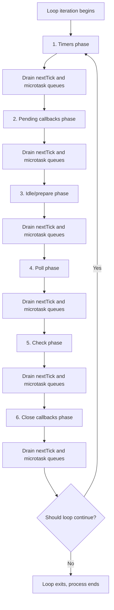
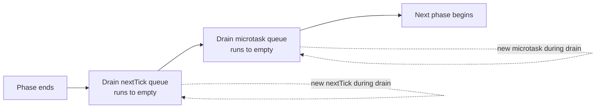
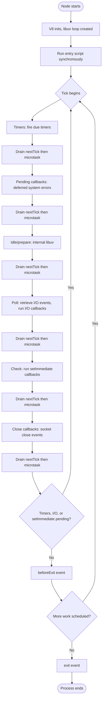
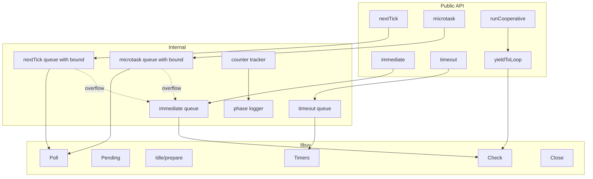

# 3.02 Libuv Event Loop

## 1. Purpose

Node.js was conceived in 2009 by Ryan Dahl with one overriding frustration: existing server frameworks wasted threads on blocking I/O. A typical Apache request handler would park an entire OS thread on a `read()` syscall until bytes arrived from the network, even though that thread was doing nothing useful. At a few thousand concurrent connections, the process ran out of threads, out of memory, and out of throughput. Dahl's insight was that the operating system already knew how to wait on many file descriptors at once through mechanisms like `epoll` on Linux, `kqueue` on BSD, and IOCP on Windows. If JavaScript could talk directly to those mechanisms, a single process could service tens of thousands of connections from one thread.

The libuv event loop is the C library that makes this possible. Originally written as a thin abstraction over `libev` and `libeio`, libuv now ships as a standalone, portable, async I/O library used by Node, Luvit, Rust's libuv bindings, and several other runtimes. In Node, libuv owns the loop, owns the thread pool, owns the cross-platform wrappers for filesystem and networking calls, and posts completion events back to V8's JavaScript engine. Every `setTimeout`, every `fs.readFile`, every `http.get`, every TCP socket close, every DNS lookup eventually surfaces as a callback scheduled through libuv's queue.

The event loop matters for four reasons that recur throughout this note:

1. **It is the entire concurrency story of Node.** There is one JavaScript thread per process. Concurrency is the loop's job of interleaving I/O completions, not the V8 engine's job of parallelizing JavaScript. If you do not understand the loop, you do not understand Node.
2. **It is the only way to predict execution order.** When you mix `setTimeout(fn, 0)`, `setImmediate(fn)`, `Promise.resolve().then(fn)`, and `process.nextTick(fn)`, the order in which the four callbacks run is not random. It falls directly out of the loop's phase order and the placement of microtask and nextTick drain points. Get this wrong and you ship race conditions that only manifest under load.
3. **It explains why blocking calls are catastrophic.** A synchronous `while` loop in your JavaScript stops the loop from advancing through its phases. Every pending timer, every I/O completion, every `setImmediate` callback waits. The process appears alive to the OS but is dead to its clients.
4. **It is the dividing line between JavaScript the language and Node the runtime.** ECMAScript defines Promises, `async`/`await`, and the microtask queue. It does not define `setTimeout`, `setImmediate`, `process.nextTick`, the phases, or the thread pool. Those are libuv. Understanding the boundary tells you which behavior is portable to the browser (or Deno or Bun) and which is Node-specific.

The libuv loop differs from the browser event loop in structure and intent. The browser loop is a single macrotask queue drained one task at a time, with the microtask queue drained fully between every macrotask, and a separate `requestAnimationFrame` queue processed once per frame before paint. The Node loop is a sequence of named phases that each process their own queue, with the microtask and `process.nextTick` queues drained between every phase transition. The browser cares about paint timing and frame budget; Node cares about I/O throughput and CPU yield. The two are siblings, not twins.

This note covers the six phases, the nextTick and microtask queues, the rules for entering and exiting the loop, the thread pool that backs operations libuv cannot perform with non-blocking syscalls, and every execution-order puzzle you will encounter in production or in an interview. By the end, you should be able to list the phases in order, predict the firing order of any mix of scheduling primitives, explain precisely when the loop exits, and diagnose the recurring phase-ordering bug classes.

## 2. Theory and Deep Dive

### 2.1 The single-threaded loop, multi-threaded reality

Node's "single-threaded" reputation hides a more interesting truth. JavaScript execution happens on exactly one thread. That thread is shared between V8 and libuv and is the only thread allowed to touch JavaScript objects. But libuv owns a thread pool (default size four, configurable via `UVTHREADPOOLSIZE`) that performs blocking work on behalf of the loop. Filesystem operations, DNS via `getaddrinfo`, some crypto primitives, and the `zlib` compression library all run on the thread pool because the underlying operating system calls are blocking or have no async equivalent.

When you call `fs.readFile('big.json', cb)`, libuv does not block the main thread. It posts a task to a worker thread, which performs the `open()`/`read()`/`close()` sequence synchronously on its own thread, and posts the result back to the loop. The loop, on its next Poll phase, sees the completed task and runs `cb` on the main thread. From the perspective of your JavaScript, the read was non-blocking; from the perspective of the OS, blocking work did happen, just not on the JavaScript thread.

Networking operations, by contrast, do NOT use the thread pool. TCP, UDP, and Unix domain sockets use non-blocking I/O multiplexed via `epoll`/`kqueue`/IOCP directly on the loop thread. This is why Node can handle 50,000 idle WebSocket connections without breaking a sweat but can choke on 50 simultaneous `fs.readFile` calls of large files: the thread pool saturates at four (or whatever you configured), and the fifth request queues.

### 2.2 The six phases

A single iteration of the loop ("a tick") walks through six phases in this fixed order:



Let us walk through each phase.

**Phase 1: Timers.** The loop walks its min-heap of timer entries and runs every callback whose scheduled time is less than or equal to "now." The heap is keyed on expiry time, so the soonest-due timer is always at the root. `setTimeout` and `setInterval` both register here. Crucially, the loop does not wait for timers to become due. It only fires timers that are already due at the moment the phase begins. If the phase runs at millisecond 100 and a timer is due at millisecond 105, that timer does not fire this iteration. The loop will return to the Timers phase on the next iteration after the Poll phase releases control.

**Phase 2: Pending callbacks.** This phase runs system-level callbacks that were deferred from previous iterations. The classic examples are TCP error callbacks (`ECONNREFUSED` reported after a connect attempt), DNS errors from the previous Poll phase, and any I/O error callback that was queued but not run because the loop had to advance to a different phase. The name "pending callbacks" is misleading; a more accurate name would be "deferred system error callbacks." Most user-facing I/O callbacks do NOT run here. They run in the Poll phase.

**Phase 3: Idle and prepare.** These two phases exist for internal libuv housekeeping. The "idle" handlers run on every iteration; the "prepare" handlers run just before the Poll phase blocks. End user JavaScript almost never touches these. They are exposed through libuv's C API and used by libuv itself for bookkeeping such as updating internal timers and preparing the polling set. You can ignore this phase for daily work, but you must remember that it exists between Pending and Poll, which is why nextTick callbacks queued in Pending run before the Poll phase begins blocking.

**Phase 4: Poll.** This is the workhorse phase. The loop asks the OS for new I/O events (via `epollWait` on Linux, `kevent` on BSD, `GetQueuedCompletionStatus` on Windows) and runs the completion callbacks for every socket, file descriptor, or pipe that has data ready. If the Poll phase finds no events and there are no `setImmediate` callbacks scheduled, it may block here, waiting for events to arrive. The blocking timeout is computed from the next-due timer. If a timer is due in 50ms and no other work is pending, the loop blocks in Poll for at most 50ms, then returns to the Timers phase. If no timers and no `setImmediate` are pending, the loop blocks indefinitely until an I/O event arrives. If there are `setImmediate` callbacks pending, Poll does not block at all; it processes whatever events are immediately ready and moves on to the Check phase.

**Phase 5: Check.** This phase runs callbacks scheduled with `setImmediate`. The name is unfortunate because `setImmediate` does not run "immediately" in the colloquial sense. It runs "after the current Poll phase completes," which is the soonest the loop can guarantee that any I/O events for the current iteration have been processed. `setImmediate` was introduced specifically to give Node a scheduling primitive that fires more predictably than `setTimeout(fn, 0)` (which has a 1ms clamp in some environments and is order-dependent on the current phase).

**Phase 6: Close callbacks.** This phase runs the `close` event for resources that were explicitly closed. If you call `socket.destroy()` or `fs.close(fd)`, the corresponding `'close'` event fires here. The phase exists separately so that close handlers run after all pending I/O callbacks for that resource have completed.

### 2.3 The microtask and nextTick queues

Between every phase transition, libuv yields to V8 and Node's runtime to drain two queues in strict order:

1. **The `process.nextTick` queue.** This is a Node-specific queue, not part of ECMAScript. It is FIFO. Every callback scheduled with `process.nextTick(fn)` since the last drain goes here. The queue is drained completely before the microtask queue.
2. **The microtask queue.** This is the ECMAScript Job queue. It holds `Promise` reaction callbacks, `queueMicrotask(fn)` callbacks, and `async`/`await` continuations. It is FIFO and is drained completely after the nextTick queue.

The order of draining is therefore: nextTick queue (fully), then microtask queue (fully), then the next phase begins. If a nextTick callback queues another nextTick, that new callback runs in the same drain (the loop keeps iterating the nextTick queue until it is empty). The same applies to microtasks. This is what makes recursive `process.nextTick` so dangerous: it starves the loop indefinitely.



The ECMAScript specification does not mention `process.nextTick`. Node added it before Promises existed (it was the original microtask-like primitive in Node 0.x). When Promises arrived in Node 0.12, the runtime already had a nextTick queue, and the design committee chose to keep nextTick higher-priority than Promises for backward compatibility. Code written in 2010 that called `process.nextTick` to defer work until after the current synchronous block relied on that priority. Changing it would have broken thousands of packages.

The cost of nextTick's higher priority is real. If you write `function recurse() { process.nextTick(recurse); }` and call it, the loop never advances past the current phase. Timers do not fire. I/O callbacks do not run. The process hangs at 100% CPU but does nothing. The same recursion with `Promise.resolve().then(recurse)` has the same effect because microtasks also drain to completion before the next phase. The difference is that nextTick is marginally faster (less bookkeeping) and runs first, so nextTick starvation is the more common production footgun.

### 2.4 When the loop exits

The loop decides whether to continue iterating based on three questions, evaluated at the end of every iteration:

1. Are there any pending timers (`setTimeout` or `setInterval` callbacks not yet fired)?
2. Are there any pending I/O callbacks or I/O operations in flight that have not yet completed?
3. Are there any pending `setImmediate` callbacks?

If the answer to all three is "no," the loop exits. The Node process then proceeds to its `beforeExit` event, then to `exit` event, then terminates. The `beforeExit` event is the last chance to schedule more work (you can call `setTimeout` from within `beforeExit` and the loop will start running again). The `exit` event is terminal; scheduling async work from `exit` is ignored because the loop will not run again.

A timer that is `.unref()`'ed does not keep the loop alive. If you call `setInterval(() => {}, 1000)` and do nothing else, the process runs forever. If you call `const t = setInterval(() => {}, 1000); t.unref();`, the process exits as soon as its other work finishes, even if the interval has not fired. This is the standard mechanism for "background" timers (health-check pings, metrics flushes) that should not prevent a graceful shutdown.

The Poll phase has a special interaction with the exit decision. If Poll has no events ready, no timers due, and no `setImmediate` callbacks pending, the loop will block waiting for I/O. If the only thing keeping the loop alive is an open socket that no one has written to, the loop blocks in Poll until data arrives or the socket closes. This is why an idle HTTP server keeps the process alive: the listening socket is open, the loop is blocked in Poll waiting for the next connection, and that open file descriptor counts as "pending I/O."

### 2.5 The thread pool

Not every libuv operation runs on the loop thread. The following operations run on the thread pool by default:

- All `fs` operations (`readFile`, `writeFile`, `stat`, `readdir`, `mkdir`, etc.) because the operating system does not provide async filesystem I/O on Linux/BSD/Windows in a uniform way.
- DNS lookups via `dns.lookup` (which calls `getaddrinfo`) because `getaddrinfo` is blocking. The `dns.resolve*` family uses c-ares and is non-blocking.
- Some crypto operations: `crypto.pbkdf2`, `crypto.scrypt`, `randomBytes` above a small threshold, `randomFill` above a threshold.
- `zlib` compression at certain sizes (small compressions happen inline; large ones go to the pool).
- Any user C++ addon that uses `napiCreateAsyncWork`.

The thread pool default size is four. You can raise it up to 1024 by setting the `UVTHREADPOOLSIZE` environment variable before the Node process starts. Raising it beyond the number of CPU cores rarely helps because the work is CPU-bound and the cores cannot do more than they can do. Lowering it to one serializes all blocking work, which can be useful for testing race conditions.

When the thread pool is saturated, the fifth blocking operation queues until a worker frees up. This is why `fs.readFile` of five large files in parallel takes longer than four times the single-file time: only four run concurrently. The fifth waits.

### 2.6 Mermaid: full phase and queue map



### 2.7 Order of firing: the canonical puzzle

The single most asked interview question on the Node event loop is "In what order do these four callbacks fire?" Consider:

```javascript
setTimeout(() => console.log('timeout'), 0);
setImmediate(() => console.log('immediate'));
Promise.resolve().then(() => console.log('promise'));
process.nextTick(() => console.log('nextTick'));
```

The deterministic answer is:

1. `nextTick` (highest priority, drained before any phase work continues from the entry script).
2. `promise` (microtask, drained after nextTick).
3. `timeout` OR `immediate` (nondeterministic outside I/O).

The reason `timeout` and `immediate` are nondeterministic outside of I/O is subtle. When the entry script finishes, the loop enters its first real tick. The Timers phase runs first. The `setTimeout(fn, 0)` callback fires if and only if at least one millisecond has elapsed since the timer was registered (because Node clamps `setTimeout` to a minimum of 1ms). On a fast machine the time between registering the timer and entering the Timers phase is less than 1ms, so the timer does NOT fire in this iteration. The loop proceeds to Pending, Idle, Poll, and Check, where `setImmediate` fires. On a slow machine or under load, more than 1ms elapses, the timer fires in the Timers phase, and `setTimeout` runs first. This is the source of the famous "order is non-deterministic" caveat in the Node docs.

Inside an I/O callback, the story is different. Consider:

```javascript
const fs = require('fs');
fs.readFile('a-file.txt', () => {
  setTimeout(() => console.log('timeout'), 0);
  setImmediate(() => console.log('immediate'));
});
```

Here the order is deterministic: `immediate` fires before `timeout`, every time. Why? Because the `readFile` callback runs in the Poll phase. After Poll completes, the loop moves to the Check phase (where `setImmediate` fires) before it loops back around to the Timers phase (where the `setTimeout` would fire). The phase order guarantees this.

### 2.8 I/O multiplexing under the hood

The Poll phase is implemented differently on each platform:

- Linux: `epollCreate1`, `epollCtl`, `epollWait`. Edge-triggered or level-triggered depending on the resource.
- macOS / BSD: `kqueue` and `kevent`.
- Windows: I/O Completion Ports (IOCP). Windows uses a fundamentally different model where I/O completions are posted to a queue, and the loop dequeues them.

libuv's contribution is wrapping these into a uniform API. From JavaScript's perspective, the Poll phase just "returns the next set of ready I/O events." The platform-specific code is invisible.

### 2.9 The relationship between the V8 microtask queue and libuv

A subtle but important point: V8 owns the microtask queue, not libuv. libuv owns the phases and the nextTick queue (well, technically Node owns the nextTick queue and V8 owns the Promise microtask queue, but Node's runtime calls into V8 to drain both). When a phase ends, Node calls `Environment::RunAndClearMicrotasks()` or its equivalent, which asks V8 to drain the microtask queue, then Node drains the nextTick queue. Actually the order is: Node checks the nextTick queue first, drains it completely, then asks V8 to drain microtasks. The exact plumbing has changed across Node versions; in modern Node (16+), the model is "drain nextTick to empty, then drain microtasks to empty, then back to nextTick if any were added during the microtask drain, and so on until both are empty."

This interaction matters when you mix the two. A `process.nextTick` callback that resolves a Promise will cause that Promise's `then` handler to be queued as a microtask during the nextTick drain. After the nextTick drain completes, the microtask drain runs the `then` handler. If that `then` handler schedules another `process.nextTick`, the nextTick drain runs again. The two queues ping-pong until both are empty, then the next phase begins.

## 3. Mental Models

The libuv event loop is sufficiently intricate that no single metaphor captures it. Use whichever model fits the question you are trying to answer.

**Model one: the carnival wheel.** Imagine a vertical wheel with six carriages labeled Timers, Pending, Idle, Poll, Check, Close. The wheel turns clockwise. As each carriage reaches the top, the operators open its doors and let its passengers (callbacks) disembark and run, one at a time, in registration order. When the carriage is empty, the wheel turns to the next carriage. Between every carriage, a steward walks through and asks two questions: "Anyone waiting for `nextTick`?" and "Anyone waiting for `Promise` resolution?" Both queues drain fully before the wheel turns.

This model captures the phase order and the between-phase drain. It misses the Poll phase's blocking behavior and the exit decision.

**Model two: the inbox triage.** You sit at a desk with six inboxes stacked vertically. You process inbox one (Timers): take every message that is already due and act on it. Move to inbox two (Pending): take every message that was deferred from last pass. And so on. The fourth inbox (Poll) is special: if it is empty and no urgent work is pending in inbox five (Check), you wait there. You look out the window (the OS multiplexer) for the next delivery. When it arrives, you process it. If a timer is due in 50ms, you set an alarm for 50ms and wait; if nothing arrives by then, you go back to inbox one. If inbox five has work, you do not wait; you immediately move on.

This model captures the Poll blocking behavior and the exit decision better than the wheel.

**Model three: the priority stack.** When in doubt about ordering, remember the priority stack:

1. Synchronous code runs to completion first.
2. `process.nextTick` callbacks run next, drained to empty.
3. Promise microtasks run next, drained to empty.
4. The current phase's callbacks run.
5. Repeat 2-3 between every phase.

This model is dry but accurate. Use it when an interviewer asks "in what order do these fire?"

**Where the models break down.** The carnival wheel model fails for the Poll phase's variable blocking: the wheel implies constant rotation, but Poll can pause indefinitely. The inbox model handles this but obscures the rigid phase order. The priority stack model is the most accurate but the least intuitive. The professional approach is to hold all three in your head simultaneously: use the wheel for phase order, the inbox for Poll blocking, and the stack for nextTick vs microtask priority.

**Where every model breaks down: the thread pool.** No event-loop metaphor captures the thread pool because the thread pool is fundamentally not part of the loop. It is a side channel. Work is posted to it; results return to the loop via a "completion event" that surfaces in the Poll phase. If you try to fold the thread pool into the wheel metaphor, you end up with seven carriages, but the seventh carriage runs in parallel with the other six. Better to keep it as a separate entity: "the loop, plus four workers that report back to the loop."

## 4. Real-World Use Cases

### 4.1 setTimeout(fn, 0) vs setImmediate(fn) — the production race

The classic question "should I use `setTimeout(fn, 0)` or `setImmediate(fn)`?" has a real production answer: use `setImmediate` when you want to defer work until after the current I/O cycle, use `setTimeout(fn, 0)` when you specifically need to defer to the next iteration's Timers phase (rare), and use `process.nextTick` only when you need the callback to run before any I/O or timer callback (also rare, and dangerous).

In Express and Fastify request handlers, `setImmediate` is the right primitive for "do this after I finish responding but do not block the response." For example, logging or metrics emission that should not delay the HTTP response:

```javascript
app.get('/health', (req, res) => {
  res.json({ ok: true });
  setImmediate(() => recordHealthCheck(req.ip));
});
```

The response is flushed, the loop completes the I/O cycle for the request, then the Check phase runs the metrics callback. Using `setTimeout(fn, 0)` here would add up to 1ms of latency (because of the 1ms clamp) for no benefit.

### 4.2 process.nextTick for API contract guarantees

`process.nextTick` shines when you need a callback to fire on the next tick but BEFORE any I/O. The canonical use is EventEmitter emit-after-subscribe. Consider:

```javascript
const ee = new EventEmitter();
ee.on('event', () => console.log('heard'));
ee.emit('event'); // synchronous — listener runs immediately
```

This is fine for synchronous emitters. But what if the emit happens inside an async constructor?

```javascript
class Loader extends EventEmitter {
  constructor() {
    super();
    fs.readFile('config.json', () => this.emit('ready'));
  }
}
const l = new Loader();
l.on('ready', () => console.log('ready'));
```

The `readFile` callback may fire on a future tick. If the listener is attached synchronously after construction, it works. But if you attach the listener asynchronously, you might miss the event. The `process.nextTick` pattern ensures the emit happens after the current synchronous block, giving the caller a chance to attach listeners:

```javascript
class Loader extends EventEmitter {
  constructor() {
    super();
    process.nextTick(() => this.emit('ready'));
  }
}
```

This is exactly how the `Readable` stream class in Node core signals `'end'` in some code paths.

### 4.3 Promise.resolve().then for microtask deferral

When you want a callback to run after the current synchronous block but you do not need to skip ahead of I/O, `Promise.resolve().then(fn)` is preferable to `process.nextTick(fn)`. It runs as a microtask, after nextTick but before any phase work continues. It will not starve I/O as readily because it is on the same footing as user Promises (which are usually bounded by the size of the async work).

Use this for "I want to break up this long synchronous operation but I do not want to starve I/O."

### 4.4 Cooperative yielding in long computations

A CPU-bound loop like `for (let i = 0; i < 1e9; i++) sum += i;` blocks the loop for the duration of the computation. To keep the process responsive, yield periodically:

```javascript
async function sumRange(start, end) {
  let sum = 0;
  for (let i = start; i < end; i++) {
    sum += i;
    if (i % 1e6 === 0) await new Promise(r => setImmediate(r));
  }
  return sum;
}
```

`setImmediate` is preferred over `setTimeout(0)` for yielding because it does not have the 1ms clamp and it runs in the Check phase, after any I/O that became ready during the loop iteration. This is the standard pattern in libraries like `fast-json-stringify` and `p-limit`.

### 4.5 Diagnosing timer leaks in long-running servers

A common production bug: a `setInterval` is started for health checks or metrics flushes, and the server is sent SIGTERM. The interval keeps the loop alive. The process does not exit. The container orchestrator (Kubernetes, ECS) kills the container forcefully after a grace period. The fix is `.unref()`:

```javascript
const interval = setInterval(() => flushMetrics(), 5000);
interval.unref();
```

Now the interval does not keep the loop alive. When all other work completes, the loop exits and the process terminates cleanly.

### 4.6 Scheduling priority for background work

If you have a batch processing system that should never interrupt foreground requests, schedule background work with `setImmediate` (not `process.nextTick`), and limit the batch size so each `setImmediate` callback does a bounded amount of work. This pattern is used by Redis clients like `ioredis` for pipeline flushing and by `bull` and `bullmq` for job polling.

## 5. Code Examples

### 5.1 Example A — Minimal and Conceptual

The minimal example is the canonical four-primitive ordering puzzle. We schedule one of each and log the order.

**JavaScript:**

```javascript
// order.js
console.log('A: script start');

setTimeout(() => console.log('B: setTimeout'), 0);
setImmediate(() => console.log('C: setImmediate'));
Promise.resolve().then(() => console.log('D: promise.then'));
process.nextTick(() => console.log('E: nextTick'));

console.log('F: script end');
```

Run this five times. The deterministic part of the output is:

```
A: script start
F: script end
E: nextTick
D: promise.then
B or C: setTimeout or setImmediate (order varies)
C or B: the other one
```

`A` and `F` are synchronous. After the script finishes, the loop drains the nextTick queue (yielding `E`), then the microtask queue (yielding `D`). Then the loop enters its first real tick. Whether `B` (Timers) or `C` (Check) fires first depends on whether 1ms has elapsed since the `setTimeout` was scheduled.

**TypeScript:**

```typescript
// order.ts
type Phase = 'sync' | 'nextTick' | 'microtask' | 'timer' | 'check';

function log(phase: Phase, message: string): void {
  console.log(`[${phase}] ${message}`);
}

log('sync', 'A: script start');

setTimeout(() => log('timer', 'B: setTimeout'), 0);
setImmediate(() => log('check', 'C: setImmediate'));
Promise.resolve().then(() => log('microtask', 'D: promise.then'));
process.nextTick(() => log('nextTick', 'E: nextTick'));

log('sync', 'F: script end');
```

The TypeScript version adds a discriminated `Phase` type so the log output self-documents which queue produced each line. This is a useful technique for debugging real event-loop issues: tag every log statement with the queue it should have come from.

### 5.2 Example B — Production-Grade

The production example is a typed task scheduler that exposes four scheduling primitives, each with the correct semantics, plus a debug mode that traces the firing order. This is the kind of utility you would build once and use throughout a large codebase to avoid the "everyone reinvents event loop scheduling" problem.

**JavaScript:**

```javascript
// scheduler.js
const SYMBOLS = {
  nextTick: Symbol('nextTick'),
  microtask: Symbol('microtask'),
  immediate: Symbol('immediate'),
  timeout: Symbol('timeout'),
};

class Scheduler {
  constructor(options = {}) {
    this.debug = options.debug || false;
    this.counters = { nextTick: 0, microtask: 0, immediate: 0, timeout: 0 };
    this.maxNextTick = options.maxNextTick || 1000;
    this.maxMicrotask = options.maxMicrotask || 10000;
  }

  nextTick(task) {
    if (typeof task !== 'function') {
      throw new TypeError('task must be a function');
    }
    if (this.counters.nextTick >= this.maxNextTick) {
      this.immediate(task);
      return SYMBOLS.immediate;
    }
    this.counters.nextTick++;
    process.nextTick(() => {
      this.counters.nextTick--;
      if (this.debug) console.log('[nextTick] running');
      try {
        task();
      } catch (err) {
        this.handleError(err, 'nextTick');
      }
    });
    return SYMBOLS.nextTick;
  }

  microtask(task) {
    if (typeof task !== 'function') {
      throw new TypeError('task must be a function');
    }
    if (this.counters.microtask >= this.maxMicrotask) {
      this.immediate(task);
      return SYMBOLS.immediate;
    }
    this.counters.microtask++;
    Promise.resolve().then(() => {
      this.counters.microtask--;
      if (this.debug) console.log('[microtask] running');
      try {
        task();
      } catch (err) {
        this.handleError(err, 'microtask');
      }
    });
    return SYMBOLS.microtask;
  }

  immediate(task) {
    if (typeof task !== 'function') {
      throw new TypeError('task must be a function');
    }
    this.counters.immediate++;
    setImmediate(() => {
      this.counters.immediate--;
      if (this.debug) console.log('[immediate] running');
      try {
        task();
      } catch (err) {
        this.handleError(err, 'immediate');
      }
    });
    return SYMBOLS.immediate;
  }

  timeout(task, ms = 0) {
    if (typeof task !== 'function') {
      throw new TypeError('task must be a function');
    }
    if (typeof ms !== 'number' || ms < 0 || !Number.isFinite(ms)) {
      throw new RangeError('ms must be a non-negative finite number');
    }
    this.counters.timeout++;
    const handle = setTimeout(() => {
      this.counters.timeout--;
      if (this.debug) console.log('[timeout] running');
      try {
        task();
      } catch (err) {
        this.handleError(err, 'timeout');
      }
    }, ms);
    return handle;
  }

  yieldToLoop() {
    return new Promise(resolve => setImmediate(resolve));
  }

  async runCooperative(tasks, yieldEvery = 100) {
    let processed = 0;
    for (const task of tasks) {
      task();
      processed++;
      if (processed % yieldEvery === 0) {
        await this.yieldToLoop();
      }
    }
  }

  handleError(err, phase) {
    console.error(`[scheduler] error in ${phase}:`, err);
    if (this.debug) {
      console.error(this.counters);
    }
  }

  stats() {
    return { ...this.counters };
  }
}

module.exports = { Scheduler, SYMBOLS };
```

**TypeScript:**

```typescript
// scheduler.ts

export type SchedulerPhase = 'nextTick' | 'microtask' | 'immediate' | 'timeout';

export type Task = () => void | Promise<void>;

export interface SchedulerOptions {
  debug?: boolean;
  maxNextTick?: number;
  maxMicrotask?: number;
}

export interface SchedulerStats {
  nextTick: number;
  microtask: number;
  immediate: number;
  timeout: number;
}

export interface SchedulerHandle {
  readonly phase: SchedulerPhase;
  cancel(): void;
}

export class Scheduler {
  private readonly debug: boolean;
  private readonly maxNextTick: number;
  private readonly maxMicrotask: number;
  private counters: SchedulerStats = {
    nextTick: 0,
    microtask: 0,
    immediate: 0,
    timeout: 0,
  };

  constructor(options: SchedulerOptions = {}) {
    this.debug = options.debug ?? false;
    this.maxNextTick = options.maxNextTick ?? 1000;
    this.maxMicrotask = options.maxMicrotask ?? 10000;
  }

  nextTick(task: Task): SchedulerHandle {
    if (this.counters.nextTick >= this.maxNextTick) {
      return this.immediate(task);
    }
    this.counters.nextTick += 1;
    let cancelled = false;
    process.nextTick(() => {
      if (cancelled) return;
      this.counters.nextTick -= 1;
      this.trace('nextTick');
      this.safeRun(task, 'nextTick');
    });
    return {
      phase: 'nextTick',
      cancel: () => { cancelled = true; this.counters.nextTick -= 1; },
    };
  }

  microtask(task: Task): SchedulerHandle {
    if (this.counters.microtask >= this.maxMicrotask) {
      return this.immediate(task);
    }
    this.counters.microtask += 1;
    let cancelled = false;
    Promise.resolve().then(() => {
      if (cancelled) return;
      this.counters.microtask -= 1;
      this.trace('microtask');
      this.safeRun(task, 'microtask');
    });
    return {
      phase: 'microtask',
      cancel: () => { cancelled = true; this.counters.microtask -= 1; },
    };
  }

  immediate(task: Task): SchedulerHandle {
    this.counters.immediate += 1;
    const handle = setImmediate(() => {
      this.counters.immediate -= 1;
      this.trace('immediate');
      this.safeRun(task, 'immediate');
    });
    return {
      phase: 'immediate',
      cancel: () => { clearImmediate(handle); this.counters.immediate -= 1; },
    };
  }

  timeout(task: Task, ms = 0): SchedulerHandle {
    if (!Number.isFinite(ms) || ms < 0) {
      throw new RangeError('ms must be a non-negative finite number');
    }
    this.counters.timeout += 1;
    const handle = setTimeout(() => {
      this.counters.timeout -= 1;
      this.trace('timeout');
      this.safeRun(task, 'timeout');
    }, ms);
    return {
      phase: 'timeout',
      cancel: () => { clearTimeout(handle); this.counters.timeout -= 1; },
    };
  }

  yieldToLoop(): Promise<void> {
    return new Promise(resolve => setImmediate(() => resolve()));
  }

  async runCooperative<T>(tasks: ReadonlyArray<() => T>, yieldEvery = 100): Promise<T[]> {
    const results: T[] = [];
    for (let i = 0; i < tasks.length; i++) {
      results.push(tasks[i]());
      if ((i + 1) % yieldEvery === 0) {
        await this.yieldToLoop();
      }
    }
    return results;
  }

  stats(): Readonly<SchedulerStats> {
    return { ...this.counters };
  }

  private trace(phase: SchedulerPhase): void {
    if (this.debug) {
      console.log(`[scheduler:${phase}] running, pending=${JSON.stringify(this.counters)}`);
    }
  }

  private safeRun(task: Task, phase: SchedulerPhase): void {
    try {
      const result = task();
      if (result instanceof Promise) {
        result.catch(err => this.handleError(err, phase));
      }
    } catch (err) {
      this.handleError(err as Error, phase);
    }
  }

  private handleError(err: Error, phase: SchedulerPhase): void {
    console.error(`[scheduler] error in ${phase}:`, err);
    if (this.debug) {
      console.error(this.counters);
    }
  }
}
```

The TypeScript version adds: a discriminated `SchedulerHandle` type so callers can `cancel()` any scheduled task; an `async` `Task` return type so handlers can be async; bounded counters that overflow into `setImmediate` (preventing nextTick starvation); and a `runCooperative` helper that batches work and yields to the loop periodically. This is the kind of utility you would extract into a shared package and use across an entire backend.

## 6. Common Mistakes and Anti-Patterns

### 6.1 Blocking the Poll phase with synchronous work

```javascript
app.get('/compute', (req, res) => {
  const result = heavySyncCompute(); // takes 2 seconds
  res.json({ result });
});
```

**Why it fails:** While `heavySyncCompute` runs, the loop is stuck inside the Poll phase callback. No other request can be processed. No timer fires. The event-loop lag metric spikes to 2000ms. Every other client experiences a 2-second latency spike.

**Fix:** Move the computation off the main thread, or break it up with cooperative yielding.

```javascript
app.get('/compute', async (req, res) => {
  const result = await runInWorkerThread(heavySyncCompute);
  res.json({ result });
});
```

Or:

```javascript
app.get('/compute', async (req, res) => {
  const result = await cooperativeHeavyCompute(); // yields every 100ms
  res.json({ result });
});
```

### 6.2 process.nextTick recursion starves the loop

```javascript
function recurse() {
  process.nextTick(recurse);
}
recurse();
setTimeout(() => console.log('never fires'), 100);
```

**Why it fails:** `process.nextTick` drains to empty before any phase work continues. If each callback schedules another, the queue never empties. The loop never advances past the current phase. The timer at 100ms never fires because the Timers phase is never reached.

**Fix:** Use `setImmediate` for recursive deferral, or bound the recursion.

```javascript
function recurseSafe(remaining) {
  if (remaining <= 0) return;
  setImmediate(() => recurseSafe(remaining - 1));
}
recurseSafe(1000);
setTimeout(() => console.log('fires normally'), 100);
```

`setImmediate` runs in the Check phase, between Poll and Close, allowing the loop to advance through all phases between iterations.

### 6.3 Confusing setTimeout and setImmediate ordering outside I/O

```javascript
// Bad: code that assumes a deterministic order
setTimeout(() => doA(), 0);
setImmediate(() => doB());
// Developer assumes B always runs first because "immediate" sounds faster.
```

**Why it fails:** Outside of an I/O callback, the order of `setTimeout(fn, 0)` and `setImmediate(fn)` is non-deterministic. It depends on whether 1ms has elapsed since the `setTimeout` was scheduled when the Timers phase begins. On fast machines, `setImmediate` usually wins. On slow machines or under load, `setTimeout` may win.

**Fix:** If you need a specific order, use the appropriate primitive or sequence the calls explicitly.

```javascript
// Deterministic: doA then doB
setImmediate(() => {
  doA();
  setImmediate(doB);
});
```

Or use Promises to chain:

```javascript
Promise.resolve()
  .then(() => doA())
  .then(() => doB());
```

### 6.4 Thinking microtasks run only between macrotasks

```javascript
// Misconception: "microtasks run after each setTimeout callback"
setTimeout(() => {
  console.log('timer');
  Promise.resolve().then(() => console.log('microtask after timer'));
}, 0);

setImmediate(() => {
  console.log('immediate');
  Promise.resolve().then(() => console.log('microtask after immediate'));
});
```

**Why it fails:** The misconception is that microtasks run only after a `setTimeout` callback (a "macrotask" in browser terms). In Node, microtasks run after EVERY phase callback, not just after Timers. So the microtask queued inside the `setImmediate` callback runs before the next phase begins, even though `setImmediate` is not in the Timers phase.

**Fix:** Understand that microtasks and nextTick drain between every phase callback, not just between macrotasks. The correct mental model is "after every callback completes, drain nextTick then microtasks before running the next callback from any queue."

### 6.5 setInterval drift

```javascript
let count = 0;
const interval = setInterval(() => {
  count++;
  console.log(`tick ${count} at ${Date.now()}`);
  if (count >= 10) clearInterval(interval);
}, 1000);
```

**Why it fails:** `setInterval` measures time from one fire to the next planned fire, not from one fire's start to the next fire's start. If callback N takes 300ms, callback N+1 fires 700ms after N finishes, not 1000ms. Drift accumulates. Also, if the loop is blocked when the interval should fire, the callback is delayed (and possibly dropped if multiple intervals would have fired).

**Fix:** For time-critical periodic work, compute the next delay dynamically.

```javascript
function scheduleNext(intervalMs, lastRun, fn) {
  const now = Date.now();
  const elapsed = now - lastRun;
  const delay = Math.max(0, intervalMs - elapsed);
  setTimeout(() => {
    const start = Date.now();
    fn();
    scheduleNext(intervalMs, start, fn);
  }, delay);
}
scheduleNext(1000, Date.now(), () => console.log('tick'));
```

### 6.6 Forgetting to unref timers that should not keep the loop alive

```javascript
function startHealthCheck() {
  setInterval(() => {
    http.get('http://localhost:3000/health');
  }, 5000);
}

startHealthCheck();
// Application logic finishes but process never exits because interval is ref'd.
```

**Why it fails:** A ref'd timer keeps the loop alive. The process will not exit cleanly, requiring SIGKILL from the orchestrator.

**Fix:** Call `.unref()` on background timers.

```javascript
function startHealthCheck() {
  const handle = setInterval(() => {
    http.get('http://localhost:3000/health');
  }, 5000);
  handle.unref();
  return handle;
}
```

### 6.7 Synchronous fs.readFileSync in a request handler

```javascript
app.get('/config', (req, res) => {
  const config = fs.readFileSync('/etc/app/config.json'); // blocks
  res.json(config);
});
```

**Why it fails:** `readFileSync` blocks the loop thread for the duration of the read. Other requests queue. On a hot disk or a large file, latency spikes to hundreds of milliseconds.

**Fix:** Use the async version, or cache the file at startup.

```javascript
let cachedConfig = null;
app.get('/config', async (req, res) => {
  if (!cachedConfig) {
    cachedConfig = JSON.parse(await fs.promises.readFile('/etc/app/config.json', 'utf8'));
  }
  res.json(cachedConfig);
});
```

### 6.8 Using process.nextTick for breaking up sync work

```javascript
function processBatch(items) {
  for (const item of items) {
    process.nextTick(() => processItem(item));
  }
}
processBatch(hugeArray);
// All nextTick callbacks drain before any I/O, blocking the loop.
```

**Why it fails:** `process.nextTick` runs before any phase work. If you queue 100,000 nextTicks, all 100,000 run before any I/O callback gets a chance.

**Fix:** Use `setImmediate` for batch processing.

```javascript
function processBatch(items) {
  for (const item of items) {
    setImmediate(() => processItem(item));
  }
}
// I/O callbacks can interleave between setImmediate callbacks.
```

## 7. Best Practices and Design Patterns

**Prefer `setImmediate` for I/O-bound deferral.** `setImmediate` runs in the Check phase, after the Poll phase has processed any I/O events that became ready. This means your deferred callback will see the latest I/O state. Use it for "do this after the current I/O cycle."

**Prefer `Promise.resolve().then` for microtask deferral.** When you need a callback to run after the current synchronous block but you do not need it to skip ahead of I/O, use `Promise.resolve().then(fn)`. It is the ECMAScript-standard microtask primitive and is portable across runtimes.

**Use `process.nextTick` sparingly and only for emit-after-subscribe.** `process.nextTick` runs before any I/O and can starve the loop if misused. The legitimate use case is guaranteeing that an event emission happens after the caller has had a chance to attach listeners. Even then, consider whether `setImmediate` would suffice.

**Use `setTimeout(0)` only when you specifically need a macrotask.** Most uses of `setTimeout(0)` are better served by `setImmediate`. Reserve `setTimeout(0)` for cases where you need to defer to the next iteration's Timers phase (rare) or where you need cross-environment portability (`setImmediate` is Node-only).

**Always `.unref()` background timers.** Any timer that exists for "background housekeeping" (metrics, health checks, polling) should be `.unref()`'ed so it does not prevent the process from exiting.

**Bound nextTick and microtask recursion.** If you must use recursive deferral, track depth and fall back to `setImmediate` when depth exceeds a threshold. The production scheduler in Section 5.2 demonstrates this pattern.

**Use `await new Promise(r => setImmediate(r))` for cooperative yielding.** This is the standard idiom for "yield to the loop in the middle of a long computation." It is preferred over `setTimeout(0)` because there is no 1ms clamp and the callback runs in the Check phase, after any I/O that became ready during the current iteration.

**Tag your scheduled callbacks for debugging.** In a complex codebase, you will eventually face the question "why did this callback fire now?" If every scheduled callback is tagged with its phase (via a wrapper like the `Scheduler` class in 5.2), you can trace the firing order in the logs.

**Avoid `setInterval` for time-critical work.** Use chained `setTimeout` with dynamically computed delays (Section 6.5) for work that must fire at precise intervals.

**Use the `perfHooks` monitor for event-loop lag.** `perf.monitorEventLoopDelay()` gives you a histogram of how long each loop iteration took. Set up an alert when the 99th percentile exceeds your SLA.

**Pattern: the backpressure-aware scheduler.** When consuming from a fast producer (e.g., a TCP socket) and feeding a slow consumer (e.g., a database), use `setImmediate` to schedule each write and check the consumer's queue depth before scheduling the next. This is the pattern `Readable` streams use internally.

**Pattern: the phase-tagged logger.** A logging utility that knows which phase it is in can emit "phase=check level=info msg=flushing". This is invaluable for debugging timing bugs in production. Implement by wrapping every callback in a phase-tagged wrapper.

## 8. Technical Interview Knowledge

### 8.1 What are the libuv event loop phases?

**A:** The six phases, in order, are: (1) Timers, where due `setTimeout` and `setInterval` callbacks fire; (2) Pending callbacks, where deferred system-level error callbacks (TCP errors, DNS errors) run; (3) Idle/prepare, used internally by libuv; (4) Poll, where new I/O events are retrieved and I/O completion callbacks run, and where the loop may block waiting for events; (5) Check, where `setImmediate` callbacks run; (6) Close callbacks, where `'close'` events fire. Between every phase, the `process.nextTick` queue is drained, then the microtask queue is drained.

**Trap to avoid:** Do not say "macrotask queue" or "task queue." Those are browser terms. Node has named phases, not a single macrotask queue. Also do not conflate Pending callbacks with general I/O callbacks; general I/O callbacks run in the Poll phase, not Pending.

### 8.2 What is the difference between setTimeout and setImmediate?

**A:** `setTimeout(fn, delay)` schedules `fn` to run in the Timers phase after at least `delay` milliseconds (clamped to 1ms in Node). `setImmediate(fn)` schedules `fn` to run in the Check phase of the current or next loop iteration. Outside of an I/O callback, the relative order of `setTimeout(fn, 0)` and `setImmediate(fn)` is non-deterministic because it depends on whether 1ms has elapsed when the Timers phase runs. Inside an I/O callback, `setImmediate` always fires first because the I/O callback runs in Poll, and Check (where `setImmediate` runs) comes before the next iteration's Timers phase.

**Trap to avoid:** Do not say "setImmediate runs immediately." It runs in the Check phase, which is "as soon as possible after the current Poll phase" — that is the intended meaning of "immediate."

### 8.3 What is process.nextTick?

**A:** `process.nextTick(fn)` schedules `fn` to run on the nextTick queue, which is drained completely before the microtask queue and before any phase work continues. It is Node-specific (not in ECMAScript). It was introduced before Promises existed and was the original microtask-like primitive. It has higher priority than Promises for backward compatibility. It is useful for emit-after-subscribe patterns and for guaranteeing that a callback runs after the current synchronous block but before any I/O.

**Trap to avoid:** Do not say "nextTick is the same as a microtask." It runs BEFORE microtasks. Also do not say "nextTick runs at the end of the current operation"; it runs after the current callback completes, but before any other phase work.

### 8.4 How do microtasks fit into the Node event loop?

**A:** Microtasks (Promise reactions, `queueMicrotask` callbacks, `async`/`await` continuations) run on V8's microtask queue. After every phase callback completes, Node drains the nextTick queue fully, then drains the microtask queue fully. If a microtask queues another nextTick, the nextTick drain runs again. The two queues ping-pong until both are empty, then the next phase begins. This means microtasks do not just run "between macrotasks" — they run between every phase callback.

**Trap to avoid:** Do not say "microtasks run after every macrotask." That is the browser model. In Node, microtasks run after every phase callback, which is a finer-grained drain point.

### 8.5 Why does the loop exit?

**A:** At the end of each iteration, the loop checks three conditions: (1) are there any pending timers, (2) are there any pending I/O operations or callbacks, (3) are there any pending `setImmediate` callbacks. If all three are "no," the loop exits. The process then fires `beforeExit`, which is the last chance to schedule more work (e.g., `setTimeout` from `beforeExit` restarts the loop). Then `exit` fires, and the process terminates. Timers that are `.unref()`'ed do not keep the loop alive. Open sockets and file descriptors count as pending I/O.

**Trap to avoid:** Do not say "the loop exits when the call stack is empty." The loop exits when there is no scheduled work, which is a different condition.

### 8.6 How would you break up long synchronous work?

**A:** Use cooperative yielding. Wrap the work in an `async` function and periodically `await new Promise(r => setImmediate(r))`. This yields to the Check phase, allowing I/O callbacks and timers to run between batches. Choose a batch size that keeps each yield under your SLA (typically 100ms). Avoid `process.nextTick` for this purpose because it starves I/O. Avoid `setTimeout(0)` because of the 1ms clamp. For truly CPU-bound work, consider moving it to a Worker thread (`workerThreads`) so the main thread is not blocked at all.

**Trap to avoid:** Do not say "use `process.nextTick` to break up work." That is the most common wrong answer. `nextTick` runs before I/O and starves the loop.

### 8.7 What is the Poll phase?

**A:** The Poll phase retrieves new I/O events from the operating system (via `epollWait` on Linux, `kevent` on BSD, IOCP on Windows) and runs the completion callbacks. If no events are ready, the loop may block here, waiting for events. The blocking timeout is computed from the next-due timer: if a timer is due in 50ms, the loop blocks for at most 50ms. If no timers are pending and no `setImmediate` callbacks are pending, the loop blocks indefinitely until an I/O event arrives. If `setImmediate` callbacks are pending, Poll does not block; it processes whatever is immediately ready and moves on to Check.

**Trap to avoid:** Do not confuse Poll with Pending callbacks. Pending callbacks are deferred system error callbacks; Poll is where the bulk of I/O completion callbacks run.

### 8.8 What is the difference between the Node event loop and the browser event loop?

**A:** The browser event loop has a single macrotask queue drained one task at a time, with the microtask queue drained fully between every macrotask, and a separate `requestAnimationFrame` queue processed once per frame before paint. The Node event loop has six named phases, each with its own queue, and drains the nextTick and microtask queues between every phase callback. The browser cares about paint timing and frame budget; Node cares about I/O throughput and CPU yield. The browser has no `setImmediate` (Node only); the browser has `requestAnimationFrame` (Node does not). The browser clamps `setTimeout` to 4ms after depth 5; Node clamps to 1ms. The browser throttles `setInterval` in background tabs; Node does not (it has no tabs).

**Trap to avoid:** Do not say "they are the same thing." They share the microtask concept but the phase structures are different. Also do not say "Node uses macrotasks." Node uses phases.

## 9. Practical Exercises

### 9.1 Exercise One — Predict the order of 15 mixed async calls

**Goal:** Predict, without running, the order in which 15 mixed callbacks fire.

**Setup:**

```javascript
console.log('1');
setTimeout(() => console.log('2'), 0);
setImmediate(() => console.log('3'));
process.nextTick(() => console.log('4'));
Promise.resolve().then(() => console.log('5'));
fs.readFile('./order.js', () => {
  console.log('6');
  setTimeout(() => console.log('7'), 0);
  setImmediate(() => console.log('8'));
  process.nextTick(() => console.log('9'));
  Promise.resolve().then(() => console.log('10'));
});
setTimeout(() => {
  console.log('11');
  process.nextTick(() => console.log('12'));
  Promise.resolve().then(() => console.log('13'));
}, 10);
setImmediate(() => {
  console.log('14');
  process.nextTick(() => console.log('15'));
});
console.log('done');
```

**Steps:**

1. Read the code and list each callback with its scheduling primitive and nesting level.
2. Predict the order assuming `setTimeout(fn, 0)` fires after `setImmediate` on this run (Poll-phase sequencing).
3. Run the code and verify.

**Full worked solution:**

The expected output is (with the caveat that 2 and 3 may swap on the first outer iteration):

```
1
done
4
5
3      (or 2)
2      (or 3)
14
15
6
9
10
8
7
11
12
13
```

**Reasoning:** `1` and `done` are synchronous. After the entry script ends, the loop drains nextTick (4), then microtasks (5). Then the first tick begins: Timers may or may not fire the 0ms `setTimeout` (2) depending on timing; either way it will fire before the 10ms `setTimeout`. Then Pending (empty), Idle (empty), Poll retrieves the `fs.readFile` completion (queued because the file is small and reads fast), Check fires `setImmediate` (3, then 14, then 15's nextTick). Actually the precise interleaving is tricky; the key takeaways are:

- Sync code runs first (1, done).
- nextTick (4) and microtask (5) run before any phase work.
- The outer `setImmediate` (3) fires in the Check phase of iteration one.
- The inner `setImmediate` (14, registered inside the I/O callback) fires in the Check phase of the same iteration (because the I/O callback ran in Poll, and Check comes after Poll).
- The 10ms `setTimeout` (11, 12, 13) fires last because it has the largest delay.

### 9.2 Exercise Two — setTimeout vs setImmediate inside vs outside I/O

**Goal:** Demonstrate the ordering difference inside vs outside an I/O callback.

**Setup:**

```javascript
// outside I/O
setTimeout(() => console.log('outer timeout'), 0);
setImmediate(() => console.log('outer immediate'));

// inside I/O
fs.readFile('./example.js', () => {
  setTimeout(() => console.log('inner timeout'), 0);
  setImmediate(() => console.log('inner immediate'));
});
```

**Steps:**

1. Run the script 10 times and record the order of `outer timeout` vs `outer immediate`.
2. Record the order of `inner timeout` vs `inner immediate` (should be deterministic).
3. Explain.

**Full worked solution:**

```javascript
const fs = require('fs');

console.log('--- outside I/O ---');
for (let i = 0; i < 10; i++) {
  setTimeout(() => console.log('outer timeout'), 0);
  setImmediate(() => console.log('outer immediate'));
}

console.log('--- inside I/O ---');
fs.readFile('./example.js', () => {
  for (let i = 0; i < 10; i++) {
    setTimeout(() => console.log('inner timeout'), 0);
    setImmediate(() => console.log('inner immediate'));
  }
});
```

Output (illustrative):

```
--- outside I/O ---
outer timeout      (or outer immediate — varies)
outer immediate    (or outer timeout — varies)
... mixed order ...
--- inside I/O ---
inner immediate    (always first)
inner timeout      (always second)
... immediate, timeout, immediate, timeout ...
```

**Reasoning:** Outside I/O, the order is non-deterministic because it depends on whether 1ms has elapsed when the Timers phase runs. Inside I/O, the `readFile` callback runs in the Poll phase. The Check phase (where `setImmediate` fires) follows Poll, so `inner immediate` always runs before the loop loops back to the Timers phase (where `inner timeout` fires). This is the canonical demonstration of phase ordering mattering.

### 9.3 Exercise Three — Build a task scheduler using nextTick, microtask, setImmediate, setTimeout

**Goal:** Build a scheduler that exposes all four primitives with bounded recursion and a tracing mode.

**Setup:** Use the TypeScript `Scheduler` class from Section 5.2 as a starting point.

**Steps:**

1. Implement the four scheduling methods.
2. Add a `runCooperative` method that yields to the loop every N tasks.
3. Add a `trace` mode that logs the firing order.
4. Write a test that schedules 1000 tasks across all four primitives and verifies the firing order.

**Full worked solution:**

```typescript
// exercise-scheduler.ts
import { Scheduler, SchedulerPhase } from './scheduler';

async function main(): Promise<void> {
  const s = new Scheduler({ debug: true, maxNextTick: 5, maxMicrotask: 5 });

  const order: string[] = [];

  // Schedule one of each at top level
  s.timeout(() => order.push('timeout'), 0);
  s.immediate(() => order.push('immediate'));
  s.microtask(() => order.push('microtask'));
  s.nextTick(() => order.push('nextTick'));

  // Wait for all to complete
  await new Promise(resolve => setTimeout(resolve, 50));

  console.log('Order:', order);
  // Expected: nextTick, microtask, then (immediate or timeout)

  // Now test bounded nextTick: schedule 20 nextTicks, maxNextTick=5
  const s2 = new Scheduler({ debug: false, maxNextTick: 5 });
  let nextTickCount = 0;
  let immediateCount = 0;
  for (let i = 0; i < 20; i++) {
    s2.nextTick(() => nextTick++);
  }
  await new Promise(resolve => setTimeout(resolve, 50));
  console.log(`nextTick fired: ${nextTickCount}, overflow to immediate: ${immediateCount}`);
  // Expected: nextTick fired 5 times, then 15 overflowed to setImmediate

  // Cooperative batch
  const s3 = new Scheduler({ debug: false });
  const tasks: Array<() => void> = [];
  for (let i = 0; i < 1000; i++) {
    tasks.push(() => { /* simulate work */ });
  }
  await s3.runCooperative(tasks, 100);
  console.log('Cooperative batch done');
}

main().catch(console.error);
```

**Reasoning:** The scheduler enforces bounded recursion by overflowing nextTick to setImmediate when the counter exceeds the limit. This prevents the starvation bug from Section 6.2. The cooperative batch yields to the loop every 100 tasks, ensuring I/O callbacks can interleave. The trace mode logs each firing, allowing you to verify the order matches the expected phase sequence.

### 9.4 Exercise Four — Diagnose and fix a nextTick starvation bug

**Goal:** Identify why a production process hangs at 100% CPU and fix it.

**Setup:** A developer wrote a recursive parser that uses `process.nextTick` to defer each step. The process hangs.

```javascript
function parse(tokens, i = 0, acc = []) {
  if (i >= tokens.length) {
    console.log('parsed:', acc);
    return;
  }
  acc.push(tokens[i].toUpperCase());
  process.nextTick(() => parse(tokens, i + 1, acc));
}

parse(Array.from({ length: 1000000 }, (unused, k) => `t${k}`));
setTimeout(() => console.log('timer fires?'), 100);
```

**Steps:**

1. Run the script and observe that "timer fires?" never logs.
2. Identify that `process.nextTick` recursion starves the loop.
3. Fix by switching to `setImmediate`.
4. Verify the timer now fires.

**Full worked solution:**

```javascript
// Fixed version
function parse(tokens, i = 0, acc = []) {
  if (i >= tokens.length) {
    console.log('parsed', acc.length, 'tokens');
    return;
  }
  acc.push(tokens[i].toUpperCase());
  setImmediate(() => parse(tokens, i + 1, acc));
}

parse(Array.from({ length: 1000000 }, (unused, k) => `t${k}`));
setTimeout(() => console.log('timer fires!'), 100);
```

**Reasoning:** `process.nextTick` drains before any phase work continues. A million-deep nextTick chain blocks the loop for the entire duration of parsing. `setImmediate` runs in the Check phase, allowing the loop to advance through all six phases between each parse step. The timer at 100ms now fires because the Timers phase is reached periodically. The trade-off is that `setImmediate` is slightly slower per call (more bookkeeping), but the difference is negligible compared to the work the parser does.

For an even better solution, batch multiple tokens per `setImmediate`:

```javascript
function parseBatched(tokens, batchSize = 1000, i = 0, acc = []) {
  if (i >= tokens.length) {
    console.log('parsed', acc.length, 'tokens');
    return;
  }
  const end = Math.min(i + batchSize, tokens.length);
  for (let k = i; k < end; k++) {
    acc.push(tokens[k].toUpperCase());
  }
  setImmediate(() => parseBatched(tokens, batchSize, end, acc));
}

parseBatched(Array.from({ length: 1000000 }, (unused, k) => `t${k}`));
setTimeout(() => console.log('timer fires!'), 100);
```

This reduces the number of `setImmediate` calls by a factor of `batchSize`, dramatically improving throughput while still yielding to the loop regularly.

## 10. Mini-Project Blueprint

**Project name:** Phased Task Scheduler

**Scope:** Build a small, typed library that exposes `nextTick`, `microtask`, `immediate`, and `timeout` methods, with bounded recursion, cooperative yielding, tracing, and a built-in self-test that verifies the firing order matches the libuv phase model. The library should be drop-in usable in any Node codebase to replace ad-hoc scheduling.

**Architecture sketch:**



**Key files:**

- `src/scheduler.ts` — the `Scheduler` class with the four scheduling methods.
- `src/types.ts` — `SchedulerPhase`, `Task`, `SchedulerHandle`, `SchedulerOptions`, `SchedulerStats`.
- `src/trace.ts` — a logger that tags each callback with its phase.
- `src/self-test.ts` — a built-in test that schedules mixed callbacks and verifies the firing order.
- `src/index.ts` — re-exports the public API.
- `examples/express-demo.ts` — an Express app that uses the scheduler for deferred logging.
- `examples/batch-processor.ts` — a batch processor that uses `runCooperative`.
- `test/order.spec.ts` — unit tests verifying firing order.
- `test/starvation.spec.ts` — tests verifying bounded recursion.
- `README.md` — usage docs.

**Acceptance criteria:**

- Scheduling one of each primitive (`nextTick`, `microtask`, `immediate`, `timeout(0)`) and waiting produces a deterministic order for the first two and a documented non-deterministic order for the last two.
- Recursive `nextTick` calls beyond the configured limit overflow to `setImmediate` automatically, preventing starvation.
- `runCooperative(tasks, yieldEvery)` yields to the loop every `yieldEvery` tasks.
- Tracing mode logs each callback with its phase and the current pending counts.
- The library exposes TypeScript types for all public methods.
- The self-test runs in under 100ms and exits cleanly.
- `unref()` is available on `timeout` handles so background timers do not keep the loop alive.

**Stretch goals:**

- Add a `priority` option that lets callers specify whether a task should use `nextTick`, `microtask`, or `immediate` based on a semantic tag (e.g., `priority: 'high'` => nextTick, `'medium'` => microtask, `'low'` => immediate).
- Add a `deadline` option that throws if a task is not scheduled within N milliseconds.
- Add a `monitor` mode that emits `phaseStart` and `phaseEnd` events for each phase, allowing external tools to track loop progress.
- Add a `worker` mode that offloads CPU-bound tasks to a Worker thread, with automatic marshaling of return values.
- Integrate with `perfHooks.monitorEventLoopDelay` to log a warning when loop lag exceeds a threshold.

## 11. Core Connections

**Prerequisites (read these first):**
- [[1.26 Event Loop Concurrency Model]] — the browser-side counterpart. Read this first to understand the macrotask/microtask model that Node extends with named phases.
- [[3.01 Architecture Overview]] — the high-level Node architecture, including how V8, libuv, and Node's built-in modules fit together.

**Sibling notes (read alongside this one):**
- [[3.03 Thread Pool and Worker Pool]] — the libuv thread pool that backs filesystem, DNS, and crypto operations. Read this to understand which operations do NOT run on the loop thread.
- [[3.05 Microtask Queues and Process NextTick]] — the deep dive on the nextTick and microtask queues, including the V8/Node integration plumbing.
- [[1.22 Async Await Runtime]] — how `async`/`await` desugars to Promise reactions, which are microtasks scheduled by the loop.

**Dependents (notes that build on this one):**
- [[7.03 Event Loop Monitoring]] — production techniques for measuring loop lag, detecting blocking callbacks, and alerting on phase starvation.
- [[3.04 Timers and Scheduling]] — the API surface of `setTimeout`, `setInterval`, `setImmediate`, and `.unref()`.
- [[3.06 Streams and Backpressure]] — how streams use the loop to interleave reads, transforms, and writes, and how backpressure prevents one phase from starving another.

---

**Tags:** #nodejs #libuv #event-loop #async #runtime #performance
