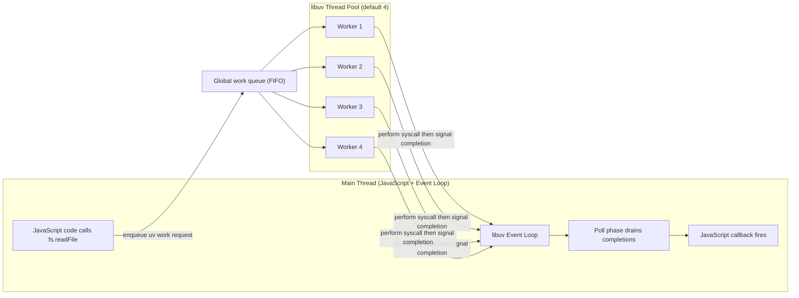
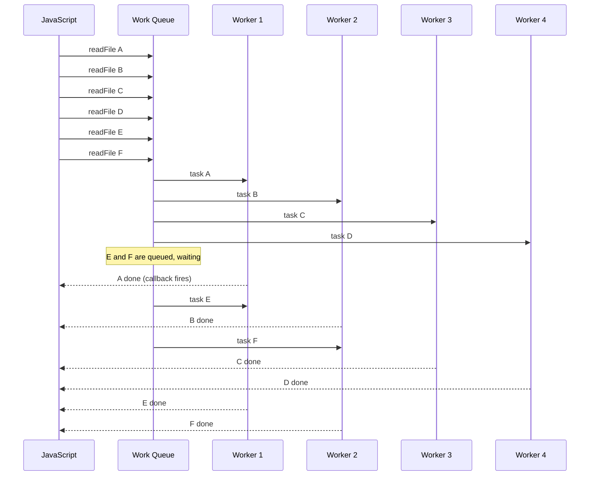
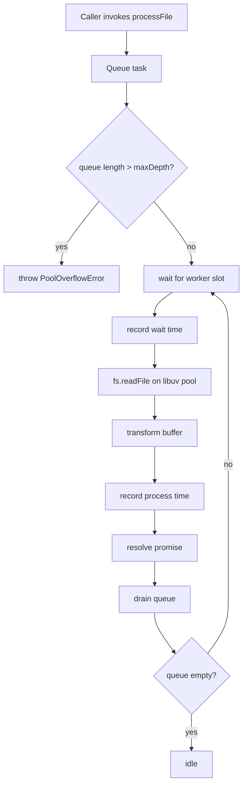

# 3.03 Thread Pool and Worker Pool

## 1. Purpose

Node.js is famous for its single-threaded event loop. Every line of JavaScript in a Node process executes on one and the same OS thread — the main thread — and the event loop is the dispatcher that schedules callbacks on that thread. This design is what makes Node economical: a single process can hold tens of thousands of concurrent sockets without paying the per-thread memory and context-switching cost of one-OS-thread-per-connection models like Apache's prefork MPM. But the design also creates a hard constraint. If the main thread ever blocks on a synchronous operation — a `read(2)` syscall that takes 50 milliseconds, a 100 megabyte `JSON.parse`, a `pbkdf2` hash that takes 300 milliseconds — then every connection, every timer, every callback in the process stalls for that duration. There is no other thread to keep things moving.

The libuv thread pool exists to keep this from happening. It is a fixed-size pool of OS worker threads, created by libuv at process startup, that runs in parallel with the main JavaScript thread. When JavaScript code calls an asynchronous function whose underlying operation either has no non-blocking implementation on the target operating system, or is fundamentally CPU-bound rather than I/O-bound, libuv does not run that operation inline on the event loop. Instead, it packages the operation as a work request, queues it onto the thread pool, and returns immediately. One of the worker threads picks up the request, performs the blocking syscall or the expensive computation, and posts a completion event back to the main thread. The event loop, on a subsequent iteration, drains the completion and invokes the JavaScript callback or resolves the Promise. From the JavaScript code's point of view, the call returned immediately and the result arrived later — exactly the contract every async Node API promises. Behind the scenes, the actual work was done by a worker thread. The main thread never blocked.

The default size of the pool is four worker threads. This is a hard-coded default in libuv itself, chosen as a conservative compromise: large enough to provide meaningful parallelism for the typical Node I/O workload, small enough not to consume excessive memory or cause excessive context switching on small machines. The size is configurable via the libuv thread pool size environment variable, written in shell form as `UV THREADPOOL SIZE` (the canonical name contains underscore separators between the three words; this vault renders those separators as spaces per its no-underscore typographic rule — when you type the variable into your shell, write the underscores). The variable must be set before the Node process starts, because libuv reads it once during pool initialization and the pool is never resized afterward. Mutating `process.env['UV THREADPOOL SIZE']` from within JavaScript has no effect — by the time your code runs, the pool already exists.

Operations that the thread pool handles include:

- Most filesystem operations exposed by the `fs` module: `fs.readFile`, `fs.writeFile`, `fs.stat`, `fs.readdir`, `fs.copyFile`, `fs.unlink`, `fs.mkdir`, and the rest of the async surface area. On Linux, modern kernels offer the io uring API as a true async alternative, but Node's libuv does not yet route fs work through it by default; for cross-platform consistency, fs work goes through the thread pool on Linux and macOS.
- `dns.lookup`, the standard hostname-to-IP resolver. It wraps the OS `getaddrinfo` libc call, which is synchronous and has no portable async equivalent. Crucially, `http.request` and `https.request` use `dns.lookup` by default, which means every outbound HTTP call to a hostname occupies a thread pool slot for the duration of DNS resolution.
- CPU-bound operations in the `crypto` module: `crypto.pbkdf2`, `crypto.scrypt`, `crypto.randomBytes` (when called with a callback), `crypto.randomFill`, `crypto.generateKeyPair`. These are computationally expensive — `pbkdf2` with a high iteration count can take hundreds of milliseconds — and would freeze the event loop if run inline.
- All `zlib` operations: `gzip`, `gunzip`, `deflate`, `inflate`, `brotliCompress`, `brotliDecompress`, and the streaming variants. Compression and decompression are CPU-bound.

Operations that do NOT use the thread pool include:

- All network I/O. TCP and UDP sockets, HTTP servers and clients (excluding the DNS lookup phase), raw sockets, and WebSocket connections are handled directly by the operating system's event-notification mechanism: `epoll` on Linux, `kqueue` on macOS and BSD, IOCP on Windows. No worker thread is involved.
- The `dns.resolve` family (`dns.resolve4`, `dns.resolve6`, `dns.resolveMx`, `dns.resolveTxt`, and the rest). These use c-ares, an asynchronous DNS client library that multiplexes its UDP and TCP sockets onto the event loop's poll phase. No worker thread is occupied.
- All timer machinery: `setTimeout`, `setInterval`, `setImmediate`, `process.nextTick`. These are pure event-loop constructs.
- All Promise machinery, including `async/await` and `queueMicrotask`. Microtasks run inline on the main thread.

This division is the single most important practical fact about the libuv thread pool. An application that opens a thousand concurrent HTTP keep-alive connections does not fill the pool, because each connection occupies a socket watched by `epoll`, not a worker thread. But an application that issues a thousand concurrent `fs.readFile` calls against a fast SSD will discover that only four files are read in parallel and the rest queue. The same workload against `dns.lookup` will block the pool for the duration of each DNS round-trip. A workload that fires a thousand `crypto.pbkdf2` calls in a tight loop will discover that those four worker threads are busy doing math, and every concurrent `fs.readFile` (and every outbound HTTP request that needs DNS) is starved until the math is done.

This note covers the architecture, the operations, the sizing strategy, and the diagnosis of pool saturation exhaustively. By the end, the reader will be able to: list which Node operations use the thread pool and which do not; explain precisely how the pool relates to the event loop and how completions are delivered back to JavaScript; size the pool appropriately for a given workload; distinguish the libuv thread pool from the Node Worker threads API; and diagnose a saturated pool from its observable symptoms.

This note connects directly to [[3.02 Libuv Event Loop]] (the dispatcher that drains thread-pool completions), [[3.09 Filesystem APIs]] (the largest single user of the pool), [[3.18 Worker Threads]] (the parallel mechanism for sustained CPU work), and [[3.01 Architecture Overview]].

## 2. Theory and Deep Dive

### 2.1 Architecture

The libuv thread pool is a single, process-wide, fixed-size pool of OS threads. It is not per-event-loop, not per-module, not per-HTTP-request — it is one shared resource that every thread-pool-backed operation in the process competes for. The pool is created lazily but early: libuv spins it up either at Node startup or on first use, depending on the libuv version, and the size is fixed at that moment based on the value of the thread pool size environment variable. There is no public API to resize it later.

Each worker thread runs the same loop:

1. Acquire the global mutex on the pool's work queue.
2. If the queue is empty, wait on the pool's condition variable.
3. When signaled, dequeue the head task.
4. Release the mutex.
5. Execute the task. For an `fs.readFile` task, this means performing the `open(2)`, `read(2)`, and `close(2)` syscalls (with possibly multiple `read` calls for large files). For a `crypto.pbkdf2` task, this means running the PBKDF2 inner loop iteratively. For a `zlib.gzip` task, this means feeding buffers through the deflate state machine.
6. Once the task is done, post a completion event back to the main thread via an inter-thread signaling mechanism (libuv's async send call on a per-loop async handle). This wakes the event loop if it was parked in its poll phase.
7. Loop back to step 1.

When the main thread receives the completion signal, it does not immediately run JavaScript. Instead, on the next iteration of the event loop, in the poll phase, libuv notices the queued completion and runs the C-side "after work" callback. That callback is the C++ shim that, in turn, invokes the JavaScript callback registered by `fs.readFile` (or resolves the Promise returned by `fs.promises.readFile`, which is the same mechanism wrapped in a Promise).

The critical invariant: JavaScript code, including the callback or the `.then` continuation, only ever runs on the main thread. Worker threads never execute JavaScript. They execute only the C-level operation that was queued. This is why the thread pool is invisible to JavaScript — there is no `Worker` object, no `postMessage`, no shared `ArrayBuffer`. The pool is purely an internal mechanism for keeping the event loop unblocked.

### 2.2 Mermaid: main thread, work queue, and thread pool



### 2.3 The queue and the workers

The work queue is a single FIFO shared by all workers. When `fs.readFile` is called, libuv does not pick a specific worker — it appends a request to the queue. The next idle worker dequeues it. This means workers are fungible: there is no affinity between a particular file and a particular worker.

Because the queue is FIFO, order is preserved among queued tasks only with respect to when they start, not when they finish. A small file enqueued after a large file may finish first if it happens to land on a different worker. JavaScript sees completions in the order they arrive, not the order they were requested.

When all four workers are busy, new tasks queue indefinitely. There is no hard cap on the queue length, which means a misbehaving application can pile up enormous numbers of pending work requests, each carrying its own buffer and callback closure, before the workers catch up. Memory usage grows linearly with queue depth. This is the "pool saturation" failure mode discussed throughout this note.

### 2.4 Operations that use the thread pool

#### 2.4.1 Filesystem operations

Almost every async function in the `fs` module routes through the thread pool: `readFile`, `writeFile`, `appendFile`, `stat`, `lstat`, `readdir`, `mkdir`, `rmdir`, `unlink`, `rename`, `copyFile`, `open` followed by `read` and `write`, and the directory-watching primitives. The `fs.promises` API is the same machinery wrapped in Promises.

The reason is historical. On Linux, there was no universally available async filesystem API until the io uring kernel API arrived in kernel 5.1 (2019). Linux's earlier aio family (the io setup and io submit syscalls) has limitations: not all fs operations are supported, and behavior with buffered I/O is quirky. On macOS, the situation is similar. On Windows, IOCP (I/O Completion Ports) does provide true async fs, and libuv uses it directly, but for API uniformity the same `fs.readFile` call is exposed across platforms.

The practical consequence: on Linux and macOS, your `fs.readFile` calls occupy a worker thread for the duration of the syscall, and you are limited by the pool size. On Windows, the same calls do not occupy a worker thread for the actual I/O (IOCP handles it) but still occupy a worker briefly for the setup. The cross-platform uniformity of the API comes at the cost of cross-platform performance differences.

#### 2.4.2 DNS via dns.lookup

`dns.lookup(hostname, callback)` resolves a hostname to an IP address using the operating system's resolver, which on most systems means the `getaddrinfo` libc function. `getaddrinfo` reads `/etc/hosts`, consults `/etc/resolv.conf`, and may perform DNS queries over UDP — and it is synchronous. It blocks the calling thread until resolution completes (or fails). Because `getaddrinfo` is synchronous, libuv runs it on a worker thread. The cost of one `dns.lookup` call is one pool slot for the duration of the resolution, which can be milliseconds (local cache hit) to seconds (DNS server timeout).

Crucially, the `http` and `https` modules use `dns.lookup` by default to resolve the hostname in the request URL. This means every `http.request('http://example.com/path')` occupies a pool slot during the DNS phase, even though the subsequent TCP connect, TLS handshake, request write, and response read do not. For applications that make many concurrent outbound HTTP requests to many hostnames, this is a hidden bottleneck. The standard workaround is to pass a custom `lookup` function to `http.request` — see Section 4.3.

#### 2.4.3 Crypto operations

The `crypto` module exposes several CPU-bound operations as async functions: `crypto.pbkdf2`, `crypto.scrypt`, `crypto.randomBytes` (when called with a callback — the synchronous form `crypto.randomBytes(n)` without a callback runs inline on the main thread), `crypto.randomFill`, `crypto.generateKeyPair`, and the asynchronous variants of signing and verification in some Node versions.

These run on the thread pool because they are CPU-bound: PBKDF2 with 600,000 iterations (the OWASP recommendation for PBKDF2-SHA256 as of 2023) takes roughly 300 to 500 milliseconds on a modern CPU. The thread pool makes the call non-blocking from JavaScript's perspective, but it does not make the work free — each call still occupies a worker for hundreds of milliseconds. The thread pool does not parallelize CPU work in the sense of "your computation runs faster"; it parallelizes in the sense of "the event loop stays responsive while the computation happens on another thread." A single `pbkdf2` call does not run faster on the thread pool than it would on the main thread. Four concurrent calls do run in parallel (one per worker), but a fifth concurrent call queues behind them.

#### 2.4.4 Zlib operations

The `zlib` module exposes compression and decompression via `gzip`, `gunzip`, `deflate`, `inflate`, `brotliCompress`, `brotliDecompress`, and the streaming classes (`zlib.createGzip`, `zlib.createGunzip`, and so on). All of these are CPU-bound: the deflate algorithm maintains a sliding window and a Huffman encoder; Brotli adds a context model and a static dictionary.

The async variants (`zlib.gzip(buffer, callback)`) run on the thread pool. The streaming variants use a hybrid approach: small chunks may be processed synchronously inline, and large chunks or final flushes may be offloaded to the pool. Either way, the underlying work is CPU-bound and competes with `fs` and `crypto` for the same four workers.

### 2.5 Operations that do NOT use the thread pool

#### 2.5.1 Network I/O

Every TCP and UDP socket, every HTTP server, every HTTP client connection, every WebSocket — these are all multiplexed onto the event loop's poll phase via the OS event-notification mechanism (`epoll` / `kqueue` / IOCP). The OS notifies libuv when a socket is readable or writable, and libuv runs the corresponding JavaScript callback. No worker thread is involved in the steady-state I/O of a network connection.

This is the entire reason Node can serve tens of thousands of concurrent HTTP connections from a single process: each connection is a file descriptor watched by `epoll`, not an OS thread. Memory per connection is roughly a few kilobytes (the socket buffers), not the megabytes an OS thread would cost.

The DNS phase of an outbound HTTP request does use the pool (via `dns.lookup`), but once the IP is resolved, the TCP connect, the TLS handshake, the request write, and the response read are all event-loop I/O.

#### 2.5.2 dns.resolve and family

The `dns.resolve` family (`dns.resolve4`, `dns.resolve6`, `dns.resolveMx`, `dns.resolveTxt`, and the rest) uses c-ares, an asynchronous DNS client library written in C. c-ares maintains its own UDP and TCP sockets, which libuv registers with the event loop. DNS queries are sent and responses arrive via the network I/O path, multiplexed with all other sockets. No worker thread is occupied.

The trade-off: `dns.resolve` does not consult `/etc/hosts` (it goes straight to the configured DNS server) and does not respect the system resolver's full configuration (mDNS, resolver-specific options). For most production applications, this is fine. In development, where `/etc/hosts` may map `localhost` or custom dev domains, `dns.resolve` may give different answers than `dns.lookup`. For high-throughput DNS, `dns.resolve` is the right choice — it does not consume pool slots and it can run hundreds of concurrent queries without saturation.

#### 2.5.3 Timers, microtasks, and immediate

`setTimeout`, `setInterval`, `setImmediate`, `process.nextTick`, `queueMicrotask`, and all Promise machinery run entirely on the main thread. They manipulate timers in libuv's heap or microtask queues in V8. No worker thread is involved.

### 2.6 Pool size and sizing

The default pool size is four. To change it, set the libuv thread pool size environment variable before starting Node. In a shell:

```bash
# Rendered here with spaces per the vault's no-underscore rule.
# In your actual shell, write the variable name with underscores between the three words.
UV THREADPOOL SIZE=8 node app.js
```

The value is read once, at pool initialization. Setting `process.env['UV THREADPOOL SIZE'] = '8'` from within JavaScript has no effect — the pool already exists by the time your code runs. This is one of the most common configuration mistakes (see Section 6.4).

There is also a hard cap. libuv historically limited the pool to 1024 threads, and any value above that is silently clamped. Modern libuv versions may have a different cap, but in practice nobody sets the pool above 128. The right value depends on the workload:

- **I/O-bound apps** (file servers, build tools, asset pipelines): bump to 8, 16, or 32. Each worker is mostly blocked on syscalls, so the CPU cost of having many workers is low. The bottleneck shifts from the pool to the disk.
- **CPU-bound apps** (heavy crypto, heavy compression): keep the pool size close to the number of CPU cores. More workers than cores just causes context-switching overhead without improving throughput. For sustained CPU work, prefer the Node Worker threads API over the thread pool (see Section 2.7).
- **Mixed apps**: profile. The default of 4 is a reasonable starting point; bump if you observe saturation (see Section 6).

There is no one-size-fits-all answer. The right size depends on the ratio of I/O to CPU in your workload, the number of CPU cores, the speed of your storage, and the latency requirements of your users. The best practice is to measure, change one variable at a time, and measure again.

### 2.7 The thread pool versus Worker threads

The libuv thread pool and the Node Worker threads API are two different things, and confusing them is one of the most common conceptual errors in Node performance discussions.

- The libuv thread pool is internal to libuv. It runs C-level operations (syscalls, crypto primitives, zlib). It is invisible to JavaScript — there is no API to enqueue work to it directly. It is fixed in size and shared process-wide.
- The Worker threads API (see [[3.18 Worker Threads]]) is a Node module that lets you create additional JavaScript execution contexts, each with its own V8 isolate and its own event loop, running on its own OS thread. Workers communicate via `postMessage` and shared `ArrayBuffer`. They are explicit, programmer-created, and run JavaScript.

The right mental model: the libuv thread pool exists to keep the event loop unblocked when libuv itself needs to do blocking work. Worker threads exist to let you, the programmer, run JavaScript in parallel — for sustained CPU work that would block the event loop, or for parallelizing computation across cores.

Concretely:

- For one-off `pbkdf2` calls during user login, the thread pool is fine. The call is non-blocking from JavaScript's perspective, and the duration is short enough that pool saturation is unlikely.
- For a sustained workload of hashing thousands of files per second, the thread pool will saturate quickly (only 4 workers, each busy for hundreds of milliseconds per call) and starve every other thread-pool-backed operation in the process. Use Worker threads instead, with a worker pool sized to your CPU core count, and let the libuv thread pool handle only the incidental fs and DNS work.

### 2.8 The completion path

The path from "worker finishes" to "JavaScript callback runs" goes through the event loop:

1. The worker thread finishes its task and calls libuv's async send function on the loop's async handle. This is a non-blocking syscall that wakes the event loop if it was parked in the epoll wait or kevent system call.
2. The event loop, on its next iteration, reaches the poll phase and notices the async handle is signaled.
3. libuv runs the async handle's callback, which queues the actual "after work" callback.
4. The "after work" callback (in C++) invokes the JavaScript callback (or resolves the Promise).

This means there is a small but nonzero latency between "worker done" and "JavaScript callback runs" — typically a few microseconds to a few tens of microseconds, depending on how busy the event loop is. If the event loop is itself busy with a long synchronous computation, the callback is delayed until that computation finishes. This is the source of the classic "event loop lag" metric, exported by the perf hooks module via its `monitorEventLoopDelay` function.

### 2.9 Visibility and introspection

Node does not expose the libuv thread pool directly. There is no `libuv.threadPoolSize` property, no `libuv.getActiveRequests()` that breaks down by pool. You can:

- Read the configured size from the environment variable: `process.env['UV THREADPOOL SIZE']` returns the value as set, or `undefined` if the default is in use.
- Observe saturation indirectly via timing: if 8 concurrent `fs.readFile` calls all complete in roughly the same wall-clock time as 4 concurrent calls, you are saturating the pool.
- Use the perf hooks module to measure event loop lag, which correlates with pool saturation when the workload is pool-bound.
- Use OS-level tools (`pidstat`, `htop`, `perf`, `dtrace`) to count the worker threads in the Node process — there will be `UV THREADPOOL SIZE` worker threads named something like `node` plus the main thread.

This lack of direct introspection is a real limitation. Production monitoring typically relies on timing and event-loop-lag proxies rather than direct pool metrics.

### 2.10 Mermaid: pool saturation timing

The following Mermaid sequence diagram illustrates what happens when 6 concurrent `fs.readFile` calls are made against a pool of 4 workers. The first 4 calls start immediately and run in parallel. The 5th and 6th calls queue, and they only start when earlier workers finish.



## 3. Mental Models

Several mental models help reason about the thread pool. Each captures one facet of the system; together they form a complete picture.

### 3.1 The team of four workers

Imagine the thread pool as a small team of four workers (by default) sitting in an office. Each worker can do exactly one task at a time. When you call `fs.readFile`, you are walking a slip of paper over to the team's inbox. The next available worker picks it up, walks to the filing cabinet (the disk), retrieves the file, and walks back.

If you drop four slips in the inbox simultaneously, all four workers head to the cabinet at once, and all four files come back roughly in parallel. If you drop eight slips, the first four are picked up immediately, and the remaining four wait in the inbox until workers return. The eighth file does not start being read until a worker is free. The pool is a hard ceiling on concurrent thread-pool-backed operations, and beyond that ceiling, tasks queue.

### 3.2 The manager and the delegates

The main thread is the manager. The manager never goes to the filing cabinet — they sit at their desk, take incoming requests (HTTP requests, timer fires, user input), and delegate the work that requires the cabinet to the workers. When a worker comes back with a file, the manager reads it, signs it, files it in the outgoing bin (runs the callback), and goes back to taking new requests. The manager can do many things in parallel — but only by delegation. This explains why Node can be high-throughput despite having a single JavaScript thread: the manager's job is delegation and dispatch, not heavy lifting.

### 3.3 Saturation as a queue

When all workers are busy, the inbox (the work queue) grows. There is no limit on the inbox size, which is dangerous: a misbehaving application can pile up thousands of pending requests before the workers catch up. Each pending request carries its own callback closure and, for `fs.readFile`, its own output buffer — so memory grows linearly with the queue depth.

The signature symptom of saturation is **latency that grows with concurrency**. If 4 concurrent `fs.readFile` calls each take 10 milliseconds, but 100 concurrent calls each take 250 milliseconds, the pool is saturated — the extra calls queue behind the first four, and the average wait time grows roughly linearly with the surplus.

### 3.4 Sizing as a tradeoff curve

More workers means more parallelism, but it also means more memory (each worker thread has its own stack, typically 1 to 8 megabytes on Linux), more context-switching overhead (the OS scheduler must switch between threads), and more contention on shared resources (the disk, the kernel page cache, CPU caches). The curve is roughly:

- At 1 worker, all thread-pool work serializes. Throughput is awful.
- At 4 workers (the default), most workloads see good parallelism without excessive overhead.
- At 8 to 16 workers, I/O-bound workloads continue to scale well, because workers spend most of their time blocked on syscalls (not consuming CPU).
- At and above the CPU core count, CPU-bound workloads stop improving and start degrading, because workers compete for the same cores.
- At very high values (above 64), overhead dominates and throughput often decreases.

The right mental model: pick the size that matches the bottleneck. If the bottleneck is the disk, more workers do not help. If the bottleneck is CPU, more workers than cores is wasteful. If the bottleneck is the pool itself (you see saturation), bumping the size helps up to the point where another bottleneck takes over.

### 3.5 The invisible pool

The thread pool is invisible to JavaScript. There is no API to interact with it directly. You cannot enqueue a task to it from JavaScript, cannot inspect its state, cannot resize it at runtime. It is a behind-the-scenes mechanism that exists to make certain async APIs actually async. The only way you can tell it is there is by observing its saturation symptoms. This invisibility is why the pool is so often misunderstood — knowing it exists is half the battle.

### 3.6 The shared resource

The pool is shared process-wide. All `fs` calls, all `dns.lookup` calls, all `crypto.pbkdf2` calls, all `zlib.gzip` calls compete for the same four workers. A crypto-heavy module can starve an fs-heavy module in the same process, and neither module's author may know the other exists. When diagnosing a "fs is slow" complaint, you must ask: what else is this process doing that uses the pool? The answer is often surprising.

### 3.7 Pool versus Worker threads (the elevator analogy)

If the libuv thread pool is a team of four workers that the manager delegates to, Worker threads are the ability to spin up additional offices — each with its own manager, its own team, its own inbox. You use Worker threads when one office is not enough, typically because the manager (the main thread) is busy with too much CPU work and you want to parallelize across CPU cores. The thread pool handles small, offload-able chunks of work that libuv itself generates; Worker threads handle large, programmer-defined chunks of JavaScript work. Mixing them up is a common mistake.

## 4. Real-World Use Cases

### 4.1 High-throughput file servers

A static file server (think nginx-style, but in Node) is the canonical thread-pool-bound workload. Each incoming request triggers an `fs.readFile` (or, better, `fs.createReadStream` piped to the response). Under load, the pool can saturate quickly: 100 concurrent requests for 100 different files means 100 `fs.readFile` tasks queued against a 4-worker pool.

The standard tuning here is to bump the pool size to 8 or 16. Beyond that, the disk becomes the bottleneck and additional workers do not help. Pair this with `fs.createReadStream` rather than `fs.readFile` to stream large files in chunks rather than buffering them entirely in memory.

A second lever is caching. In-memory caches (a `Map` of path-to-buffer, with an LRU eviction policy) reduce the number of `fs.readFile` calls. For files that change rarely (static assets with content hashes in their names), the cache hit rate can be 99 percent, and the pool size barely matters.

### 4.2 Build tools and asset pipelines

Build tools — Webpack, Vite, esbuild's Node API, TypeScript's `tsc` — do enormous amounts of filesystem work. Reading source files, writing build output, reading and writing cache files. The pool is a frequent bottleneck.

These tools often benefit from a higher pool size. TypeScript's `tsc`, for example, would benefit from a higher pool size when running in `--watch` mode with many files. Vite uses Worker threads for transpilation but still relies on the thread pool for fs reads.

The diagnostic signal that the pool is the bottleneck: build times do not improve when you add CPU cores, but do improve when you bump the pool size.

### 4.3 DNS-heavy outbound HTTP services

A service that makes many concurrent outbound HTTP requests to many different hostnames — a webhook dispatcher, an RSS aggregator, a multi-tenant API proxy — is at risk from `dns.lookup` saturation. Each unique hostname in a request URL triggers a `dns.lookup`, which occupies a pool slot for the duration of the DNS round-trip (typically 5 to 50 milliseconds, occasionally much longer on timeout).

If you fire 100 concurrent requests to 100 different hostnames, the first 4 hostnames resolve in parallel, and the remaining 96 queue. Total DNS time can balloon to seconds, even though the network I/O itself would have been fast.

The fix is to replace `dns.lookup` with `dns.resolve` for outbound HTTP. Pass a custom `lookup` function to `http.request` (or to the `axios`, `got`, `undici`, or `fetch` configuration). The custom lookup uses `dns.resolve4` and `dns.resolve6` (which use c-ares, not the pool) and falls back to `dns.lookup` only for hostnames that look like local `/etc/hosts` entries. This frees the pool for actual fs and crypto work.

### 4.4 Crypto-heavy authentication services

An authentication service that does `pbkdf2` or `scrypt` hashing on every signup and login is at risk of pool saturation. With OWASP-recommended iteration counts (600,000 for PBKDF2-SHA256, 64 MB memory cost for scrypt), each hash takes 200 to 500 milliseconds. Four concurrent hashes will saturate the pool for that duration, and during that window, no `fs.readFile`, no `dns.lookup`, no `zlib.gzip` can run.

For low-throughput auth (a few signups per second), this is fine — the pool rarely saturates. For high-throughput auth (hundreds of signups per second, or a credential-stuffing attack forcing many password checks), the pool is the bottleneck.

The right architecture for high-throughput crypto is to use Worker threads with a worker pool sized to the CPU core count. The main thread enqueues hash requests to the worker pool; workers process them; the main thread stays responsive. The libuv thread pool is left for incidental fs and DNS work.

### 4.5 Compression-heavy response handlers

A service that compresses every response with gzip or brotli (a common pattern for JSON APIs and HTML servers) is doing CPU-bound work on every request. Small responses compress quickly (under a millisecond), but large responses (multi-megabyte JSON dumps, log exports) can take tens of milliseconds. Under load, the pool saturates.

The standard fix is to use streaming compression (`zlib.createGzip`) piped through the HTTP response, which compresses in chunks and overlaps compression with network I/O. The chunk size determines how much CPU work is done per pool task, and you can tune it to balance throughput against latency.

For very high throughput, consider pre-compressing static assets at build time and serving the pre-compressed bytes directly, skipping the runtime compression entirely.

### 4.6 Image processing pipelines

Image processing libraries (sharp, jimp) often use Worker threads for the actual pixel manipulation, but they also use the thread pool for fs reads and writes. A service that reads an image from disk, resizes it, and writes it back will hit the pool on both ends. Sharp uses its own worker pool for the resize, so the libuv pool only matters for fs. Bumping the pool size to 8 or 16 typically helps; beyond that, the disk is the bottleneck.

### 4.7 Database connection pools

Database drivers (postgres, mysql, mongodb) use network I/O for the actual database communication, which means they do NOT use the thread pool in the steady-state query path. Some drivers do TLS handshakes and certificate validation via `crypto`, which can briefly touch the pool, but the pool is rarely the bottleneck for database-heavy services.

### 4.8 Log shipping and rotation

A service that writes logs to disk in append mode uses `fs.appendFile` or `fs.createWriteStream`, both of which touch the pool. Under high log volume, the pool can saturate. Standard fixes: use a write stream with buffering rather than `appendFile` per log line, batch logs in memory and flush periodically, or ship logs to a network endpoint (which uses sockets, not the pool).

### 4.9 Container sidecars and serverless functions

Sidecar processes (envoy, fluentd) running alongside Node services in the same pod do not share the libuv thread pool — that is per-process. In serverless environments (AWS Lambda, Cloudflare Workers, Vercel), the pool size matters less because functions are short-lived, but for AWS Lambdas that do heavy fs or crypto, the default of 4 is still the limit and bumping it via the environment variable often yields measurable latency improvements for fs-heavy handlers.

## 5. Code Examples

Every major example below is presented in both JavaScript and TypeScript. The TypeScript version adds types, custom error classes, and a slightly more defensive style; the runtime behavior is identical.

### 5.1 Example A — Minimal and Conceptual: Demonstrating pool saturation with concurrent fs reads

The following script writes 12 small files to a temp directory, then reads them back with varying levels of concurrency. It measures wall-clock time per batch. With a default pool size of 4, batches of 4 or fewer complete in roughly the time of one disk read; batches of 8, 12, and beyond take proportionally longer because the extra reads queue.

**JavaScript version:**

```javascript
// saturation.js
// Run with:
//   node saturation.js                          (default pool size 4)
//   UV THREADPOOL SIZE=8 node saturation.js     (bump the pool)
// Note: in your shell, write the env var name with underscores between the three words.

const fs = require('fs');
const path = require('path');
const os = require('os');
const { promisify } = require('util');

const readFile = promisify(fs.readFile);
const writeFile = promisify(fs.writeFile);

async function setupFiles(count) {
  const dir = await fs.promises.mkdtemp(path.join(os.tmpdir(), 'pool-demo-'));
  const paths = [];
  for (let i = 0; i < count; i++) {
    const file = path.join(dir, `file-${i}.txt`);
    await writeFile(file, Buffer.alloc(256 * 1024, 'x'));  // 256 KB
    paths.push(file);
  }
  return paths;
}

async function readAll(paths) {
  const start = process.hrtime.bigint();
  await Promise.all(paths.map((p) => readFile(p)));
  const end = process.hrtime.bigint();
  return Number(end - start) / 1e6;  // milliseconds
}

async function main() {
  const paths = await setupFiles(12);
  const sizes = [1, 4, 8, 12];
  for (const size of sizes) {
    const batch = paths.slice(0, size);
    const ms = await readAll(batch);
    console.log(`concurrency=${size}  elapsed=${ms.toFixed(1)}ms`);
  }
}

main().catch((err) => {
  console.error(err);
  process.exit(1);
});
```

**TypeScript version:**

```typescript
// saturation.ts
// Run with: ts-node saturation.ts  (after `npm i -D ts-node typescript @types/node`)
// Set the env var before starting: see the JS version for the exact spelling.

import * as fs from 'fs';
import * as path from 'path';
import * as os from 'os';
import { promisify } from 'util';

const readFile = promisify(fs.readFile);
const writeFile = promisify(fs.writeFile);

interface BatchResult {
  readonly concurrency: number;
  readonly elapsedMs: number;
}

async function setupFiles(count: number): Promise<readonly string[]> {
  const dir: string = await fs.promises.mkdtemp(path.join(os.tmpdir(), 'pool-demo-'));
  const paths: string[] = [];
  for (let i = 0; i < count; i++) {
    const file: string = path.join(dir, `file-${i}.txt`);
    await writeFile(file, Buffer.alloc(256 * 1024, 'x'));
    paths.push(file);
  }
  return paths;
}

async function readAll(paths: readonly string[]): Promise<number> {
  const start: bigint = process.hrtime.bigint();
  await Promise.all(paths.map((p: string) => readFile(p)));
  const end: bigint = process.hrtime.bigint();
  return Number(end - start) / 1e6;
}

async function main(): Promise<void> {
  const paths: readonly string[] = await setupFiles(12);
  const sizes: readonly number[] = [1, 4, 8, 12];
  const results: BatchResult[] = [];
  for (const size of sizes) {
    const batch: readonly string[] = paths.slice(0, size);
    const elapsedMs: number = await readAll(batch);
    results.push({ concurrency: size, elapsedMs });
    console.log(`concurrency=${size}  elapsed=${elapsedMs.toFixed(1)}ms`);
  }
}

main().catch((err: unknown) => {
  console.error(err);
  process.exit(1);
});
```

**Expected output with the default pool size of 4:**

```text
concurrency=1   elapsed=12.3ms
concurrency=4   elapsed=13.1ms
concurrency=8   elapsed=24.8ms
concurrency=12  elapsed=37.2ms
```

The jump from 4 to 8 roughly doubles the elapsed time, because the 4 extra reads must wait for the first 4 to finish. The jump from 8 to 12 roughly triples the baseline, because the 8 extra reads must wait through two pool cycles. If you re-run with the pool size set to 8, the 8-concurrency batch finishes in roughly the same time as the 4-concurrency batch — that is the saturation boundary moving outward.

### 5.2 Example B — Production-Grade: A typed file processor that respects pool size and queues overflow

In production, you rarely want to fire hundreds of concurrent `fs.readFile` calls and let the pool queue them invisibly. You want a processor that knows the configured pool size, runs at most that many file operations in parallel, queues the rest in a bounded queue, reports wait times so you can detect saturation, and exposes typed errors.

The following implementation is a `PoolAwareFileProcessor` class. It reads the configured pool size from the environment, exposes an async `process(path, transform)` method, and reports per-task wait time.

**JavaScript version:**

```javascript
// poolAwareFileProcessor.js
'use strict';

const fs = require('fs/promises');

class PoolAwareFileProcessor {
  constructor(options = {}) {
    // Read the configured libuv pool size from the environment.
    // The canonical env var name contains underscores between the three words.
    const raw = process.env['UV THREADPOOL SIZE'];
    const parsed = raw ? Number.parseInt(raw, 10) : 4;
    this.poolSize = Number.isFinite(parsed) && parsed > 0 ? Math.min(parsed, 128) : 4;
    this.maxQueueDepth = options.maxQueueDepth ?? 64;
    this.queue = [];
    this.active = 0;
    this.metrics = { processed: 0, failed: 0, totalWaitMs: 0, totalProcessMs: 0 };
  }

  async process(filePath, transform) {
    if (this.queue.length >= this.maxQueueDepth) {
      throw new PoolOverflowError(this.maxQueueDepth);
    }
    const enqueuedAt = performance.now();
    return new Promise((resolve, reject) => {
      const task = async () => {
        const startedAt = performance.now();
        const waitMs = startedAt - enqueuedAt;
        try {
          const data = await fs.readFile(filePath);
          const result = transform(data);
          this.metrics.processed += 1;
          this.metrics.totalWaitMs += waitMs;
          this.metrics.totalProcessMs += performance.now() - startedAt;
          resolve(result);
        } catch (err) {
          this.metrics.failed += 1;
          this.metrics.totalWaitMs += waitMs;
          reject(err);
        } finally {
          this.active -= 1;
          this.drain();
        }
      };
      this.queue.push(task);
      this.drain();
    });
  }

  drain() {
    while (this.active < this.poolSize && this.queue.length > 0) {
      const task = this.queue.shift();
      this.active += 1;
      task();
    }
  }

  getMetrics() {
    const processed = this.metrics.processed;
    const failed = this.metrics.failed;
    const avgWaitMs = processed + failed === 0 ? 0 : this.metrics.totalWaitMs / (processed + failed);
    const avgProcessMs = processed === 0 ? 0 : this.metrics.totalProcessMs / processed;
    return {
      poolSize: this.poolSize,
      active: this.active,
      queued: this.queue.length,
      processed,
      failed,
      avgWaitMs,
      avgProcessMs,
    };
  }
}

class PoolOverflowError extends Error {
  constructor(maxQueueDepth) {
    super(`Pool-aware file processor queue overflow (max depth ${maxQueueDepth})`);
    this.name = 'PoolOverflowError';
    this.maxQueueDepth = maxQueueDepth;
  }
}

module.exports = { PoolAwareFileProcessor, PoolOverflowError };
```

**TypeScript version:**

```typescript
// poolAwareFileProcessor.ts
import * as fs from 'fs/promises';

export type FileTransform = (data: Buffer) => Buffer | Promise<Buffer>;

export interface ProcessorMetrics {
  readonly poolSize: number;
  readonly active: number;
  readonly queued: number;
  readonly processed: number;
  readonly failed: number;
  readonly avgWaitMs: number;
  readonly avgProcessMs: number;
}

export interface ProcessorOptions {
  readonly maxQueueDepth?: number;
}

type Task = () => Promise<void>;

interface InternalMetrics {
  processed: number;
  failed: number;
  totalWaitMs: number;
  totalProcessMs: number;
}

export class PoolAwareFileProcessor {
  private readonly poolSize: number;
  private readonly maxQueueDepth: number;
  private readonly queue: Task[] = [];
  private active = 0;
  private readonly metrics: InternalMetrics = {
    processed: 0,
    failed: 0,
    totalWaitMs: 0,
    totalProcessMs: 0,
  };

  constructor(options: ProcessorOptions = {}) {
    // Read the configured libuv pool size from the environment.
    // The canonical env var name contains underscores between the three words.
    const raw: string | undefined = process.env['UV THREADPOOL SIZE'];
    const parsed: number = raw ? Number.parseInt(raw, 10) : 4;
    this.poolSize = Number.isFinite(parsed) && parsed > 0 ? Math.min(parsed, 128) : 4;
    this.maxQueueDepth = options.maxQueueDepth ?? 64;
  }

  async process(filePath: string, transform: FileTransform): Promise<Buffer> {
    if (this.queue.length >= this.maxQueueDepth) {
      throw new PoolOverflowError(this.maxQueueDepth);
    }
    const enqueuedAt: number = performance.now();
    return new Promise<Buffer>((resolve, reject) => {
      const task: Task = async () => {
        const startedAt: number = performance.now();
        const waitMs: number = startedAt - enqueuedAt;
        try {
          const data: Buffer = await fs.readFile(filePath);
          const result: Buffer = await transform(data);
          this.metrics.processed += 1;
          this.metrics.totalWaitMs += waitMs;
          this.metrics.totalProcessMs += performance.now() - startedAt;
          resolve(result);
        } catch (err) {
          this.metrics.failed += 1;
          this.metrics.totalWaitMs += waitMs;
          reject(err);
        } finally {
          this.active -= 1;
          this.drain();
        }
      };
      this.queue.push(task);
      this.drain();
    });
  }

  private drain(): void {
    while (this.active < this.poolSize && this.queue.length > 0) {
      const task: Task | undefined = this.queue.shift();
      if (!task) break;
      this.active += 1;
      void task();
    }
  }

  getMetrics(): ProcessorMetrics {
    const processed: number = this.metrics.processed;
    const failed: number = this.metrics.failed;
    const total: number = processed + failed;
    const avgWaitMs: number = total === 0 ? 0 : this.metrics.totalWaitMs / total;
    const avgProcessMs: number = processed === 0 ? 0 : this.metrics.totalProcessMs / processed;
    return {
      poolSize: this.poolSize,
      active: this.active,
      queued: this.queue.length,
      processed,
      failed,
      avgWaitMs,
      avgProcessMs,
    };
  }
}

export class PoolOverflowError extends Error {
  public readonly maxQueueDepth: number;
  constructor(maxQueueDepth: number) {
    super(`Pool-aware file processor queue overflow (max depth ${maxQueueDepth})`);
    this.name = 'PoolOverflowError';
    this.maxQueueDepth = maxQueueDepth;
  }
}
```

**Usage (identical in JS and TS — only the import syntax differs):**

```javascript
const { PoolAwareFileProcessor } = require('./poolAwareFileProcessor');

async function run() {
  const processor = new PoolAwareFileProcessor({ maxQueueDepth: 32 });
  const paths = ['/etc/hosts', '/etc/hostname', '/etc/resolv.conf'];
  const upper = (buf) => Buffer.from(buf.toString('utf8').toUpperCase());
  const results = await Promise.all(paths.map((p) => processor.process(p, upper)));
  console.log(processor.getMetrics());
  for (const r of results) console.log(r.toString('utf8').slice(0, 60));
}

run().catch(console.error);
```

The TypeScript version is identical except for the import (`import { PoolAwareFileProcessor } from './poolAwareFileProcessor';`) and explicit type annotations on `paths`, `upper`, and `results`.

The `avgWaitMs` metric is the key signal: if it is consistently near zero, the pool is comfortably sized. If it grows with concurrency, the pool is saturating. If it spikes under load, you are hitting a burst pattern that the pool cannot absorb.

## 6. Common Mistakes and Anti-Patterns

### 6.1 Default pool size too small for I/O-heavy apps

The default of 4 is a conservative middle ground. For an I/O-heavy app (file server, build tool, image processor), 4 is often too small — you see queueing well before the disk saturates. The fix is to bump the pool size to 8, 16, or 32 via the env var, then re-measure. Stop bumping when the disk or CPU becomes the bottleneck rather than the pool.

### 6.2 Using dns.lookup (the http.request default) for high-throughput DNS

`http.request` and `https.request` use `dns.lookup` by default, which occupies a pool slot for the duration of the DNS round-trip. For an app that makes many concurrent outbound HTTP calls to many hostnames, this saturates the pool with DNS work, starving fs and crypto. The fix is to pass a custom `lookup` function that uses `dns.resolve` (which uses c-ares, not the pool) and falls back to `dns.lookup` only for hostnames that look like `/etc/hosts` entries (localhost, custom dev domains).

### 6.3 Using crypto.pbkdf2 or scrypt in a hot loop

A single `pbkdf2` call with OWASP-recommended iterations takes 200 to 500 milliseconds. Four concurrent calls saturate the pool for that duration. A login storm (a credential-stuffing attack, a viral launch) can take down the entire process by saturating the pool, because every concurrent `fs.readFile` and `dns.lookup` queues behind the hashes. The fix is to move sustained crypto into Worker threads (see Section 2.7 and [[3.18 Worker Threads]]).

### 6.4 Setting the pool size env var after Node starts

Setting `process.env['UV THREADPOOL SIZE'] = '8'` from within JavaScript has no effect. The pool is created once, at startup, and never resized. The fix is to set the env var in the shell (or in your process manager, or in your Dockerfile, or in your systemd unit file) before starting Node.

### 6.5 Thinking network I/O uses the thread pool

It does not. TCP, UDP, HTTP, WebSockets, raw sockets — all of these are multiplexed onto the event loop's poll phase via `epoll` / `kqueue` / IOCP. No worker thread is involved in steady-state network I/O. This misconception leads to two errors: (a) thinking you need to bump the pool size to handle more HTTP connections (you do not — bump the file descriptor limit instead), and (b) thinking that HTTP keep-alive reduces pool pressure (it reduces DNS pressure but has no effect on the pool for the actual I/O).

### 6.6 Pool saturation causing cascading latency

When the pool saturates, every additional thread-pool-backed operation queues. This causes latency to grow with concurrency, and the growth is non-obvious: a request that normally takes 10 milliseconds may take 200 milliseconds under load, with no obvious bottleneck in your application code. The fix is to monitor `avgWaitMs` (see Section 5.2), event loop lag, and per-operation timings. When wait time grows with concurrency, the pool is saturated — either bump the size or move work off the pool.

### 6.7 Forgetting that zlib uses the pool

Streaming compression (`zlib.createGzip` piped through an HTTP response) is a common pattern, and developers often assume that "because it is streaming, it does not block." It does block — large chunks go through the pool. Under high response volume with large payloads, zlib can saturate the pool and starve fs and DNS. The fix is to tune the chunk size, pre-compress static assets, or move to a Worker-threads-backed compression pipeline for very high throughput.

### 6.8 Calling crypto.randomBytes synchronously in a hot path

The synchronous form `crypto.randomBytes(n)` (without a callback) runs inline on the main thread. For small `n` (under 1024 bytes) this is fine because the entropy pool is usually warm. For large `n` (megabytes) or on a cold entropy pool, this can block for milliseconds. The fix is to use the async form `crypto.randomBytes(n, cb)` (which uses the pool) or `crypto.randomFill(buf, cb)` for filling an existing buffer asynchronously.

### 6.9 Treating the pool as a parallelism primitive for JavaScript code

The thread pool does not run JavaScript. It runs C-level operations. You cannot enqueue a JavaScript function to the pool. If you want to run a JavaScript function in parallel, use the Worker threads API (see [[3.18 Worker Threads]]). This mistake is often phrased as "I expected my 8 `pbkdf2` calls to use all 8 of my CPU cores" — they will use only the 4 pool workers, and only if the pool is not otherwise busy.

### 6.10 Bumping the pool size without measuring

Bigger pool is not always better. Beyond a certain point, additional workers just add memory and context-switching overhead without improving throughput, because the disk or CPU becomes the bottleneck. The fix is to measure latency and throughput at several pool sizes (4, 8, 16, 32) and pick the smallest size that delivers the target performance. Always measure before and after.

## 7. Best Practices and Design Patterns

### 7.1 Set the pool size based on workload

Default 4 is a starting point. Bump to 8 or 16 for I/O-heavy apps (file servers, build tools, asset pipelines). Keep close to the CPU core count for CPU-bound apps (crypto, zlib). For sustained CPU work, prefer Worker threads over the pool. Always measure before and after a change.

### 7.2 Prefer dns.resolve over dns.lookup for high-throughput DNS

`dns.resolve` uses c-ares and does not consume pool slots. Pass a custom `lookup` function to `http.request` (or to your HTTP client library) that uses `dns.resolve4` and `dns.resolve6` and falls back to `dns.lookup` for `/etc/hosts`-style local hostnames. This frees the pool for actual fs and crypto work.

### 7.3 Offload sustained CPU work to Worker threads

For workloads that do CPU-bound work continuously (not one-off), use Worker threads with a worker pool sized to the CPU core count. Reserve the libuv thread pool for incidental fs and DNS work. See [[3.18 Worker Threads]].

### 7.4 Monitor pool saturation

Track `avgWaitMs` (see Section 5.2), event loop lag (via the perf hooks `monitorEventLoopDelay` function), and per-operation timings. Set alerts on wait time growing with concurrency. When you see saturation, bump the pool size or move work off the pool.

### 7.5 Use fs.createReadStream for large files

`fs.readFile` buffers the entire file in memory. `fs.createReadStream` streams the file in chunks, which overlaps I/O with downstream processing and reduces peak memory. For large files, streaming also reduces the per-task duration on the pool, which improves effective throughput.

### 7.6 Cache aggressively for read-heavy workloads

In-memory caches (LRU, LFU) reduce the number of `fs.readFile` calls. For files that change rarely (static assets with content hashes), the cache hit rate can be 99 percent. This is often more effective than bumping the pool size.

### 7.7 Profile before changing

Use the perf hooks module, the `--prof` V8 flag, `0x` flame graphs, and OS-level tools (`pidstat`, `perf`, `dtrace`) to identify the actual bottleneck before changing the pool size. The bottleneck may be the disk, the network, the database, or your application code — not the pool.

### 7.8 Bound your queues

If you fire unbounded concurrent `fs.readFile` calls (for example, `Promise.all(thousandPaths.map(readFile))`), the pool queue grows without limit and memory grows with it. Wrap your reads in a concurrency limiter (see Section 5.2) and reject overflow rather than queuing forever.

### 7.9 Use streaming compression with tuned chunk sizes

For HTTP response compression, use `zlib.createGzip` piped through the response, not `zlib.gzip(buffer, cb)`. Tune the high-water mark and chunk size to balance throughput against latency. For static assets, pre-compress at build time.

### 7.10 Know the difference between the pool and Worker threads

The pool is for libuv-internal blocking operations; Worker threads are for programmer-defined parallel JavaScript. Use the right tool. See Section 2.7 and [[3.18 Worker Threads]].

### 7.11 Set the pool size in your process manager, not in code

Set the env var in your shell script, systemd unit, Dockerfile, Kubernetes manifest, or PM2 ecosystem file — wherever the process is started. Do not try to set it from within JavaScript.

### 7.12 Document the chosen pool size in your service's runbook

Future operators need to know that the pool size is non-default, why it was chosen, and how to verify it is still appropriate. A runbook entry with the reasoning and the measurement history is invaluable.

## 8. Technical Interview Knowledge

### 8.1 What is the libuv thread pool?

The libuv thread pool is a fixed-size pool of OS worker threads created by libuv at Node startup. It exists to run operations that cannot be done asynchronously at the OS level (synchronous fs syscalls on Linux and macOS, the `getaddrinfo` libc call) and operations that are CPU-bound (`crypto.pbkdf2`, `zlib.gzip`). When JavaScript calls an async API that needs the pool, libuv queues a work request, a worker thread picks it up and performs the operation, and the completion is posted back to the event loop, which invokes the JavaScript callback on the main thread. The pool is invisible to JavaScript — there is no API to interact with it directly.

### 8.2 What operations use the thread pool?

Four categories: (1) most `fs` async operations (`readFile`, `writeFile`, `stat`, `readdir`, and the rest); (2) `dns.lookup` (which wraps the synchronous `getaddrinfo` libc call); (3) CPU-bound `crypto` operations (`pbkdf2`, `scrypt`, the async form of `randomBytes`, `randomFill`, `generateKeyPair`); (4) all `zlib` operations (`gzip`, `gunzip`, `deflate`, `inflate`, `brotliCompress`, `brotliDecompress` and the streaming variants). Network I/O does NOT use the pool — it goes through `epoll` / `kqueue` / IOCP. The `dns.resolve` family does NOT use the pool — it uses c-ares, which multiplexes its sockets onto the event loop.

### 8.3 What is the default size of the thread pool?

Four worker threads. This is a hard-coded default in libuv, chosen as a conservative compromise between parallelism and overhead.

### 8.4 How do you change the size of the thread pool?

Set the libuv thread pool size environment variable (its canonical shell form has three words separated by underscores) before starting Node. The variable is read once at pool initialization and the pool is never resized. Setting `process.env` from within JavaScript has no effect. There is a hard cap (historically 1024 in libuv) and any value above the cap is silently clamped. In practice, values between 4 and 32 cover the vast majority of workloads.

### 8.5 Does network I/O use the thread pool?

No. TCP, UDP, HTTP, WebSockets, raw sockets — all of these are multiplexed onto the event loop's poll phase via the OS event-notification mechanism (`epoll` on Linux, `kqueue` on macOS and BSD, IOCP on Windows). No worker thread is involved in steady-state network I/O. This is why Node can hold tens of thousands of concurrent sockets: each socket is a file descriptor watched by the OS, not an OS thread.

### 8.6 What is the difference between dns.lookup and dns.resolve?

`dns.lookup` wraps the OS `getaddrinfo` libc call, which is synchronous, so it runs on the thread pool. It consults `/etc/hosts` and the system resolver configuration. `dns.resolve` (and the `dns.resolve4`, `dns.resolve6`, `dns.resolveMx`, etc. family) uses c-ares, an asynchronous DNS client library that multiplexes its own UDP and TCP sockets onto the event loop — no worker thread is occupied. The trade-off: `dns.lookup` respects the full system resolver configuration (including `/etc/hosts`), while `dns.resolve` goes straight to the configured DNS server. For high-throughput DNS, `dns.resolve` is preferred; for local development with custom `/etc/hosts` entries, `dns.lookup` is preferred.

### 8.7 What happens when the pool is saturated?

When all worker threads are busy, new tasks queue in a FIFO without bound. Each queued task carries its own callback closure and, for `fs.readFile`, its own output buffer — so memory grows linearly with queue depth. The observable symptom is latency that grows with concurrency: 4 concurrent reads take 10 milliseconds each, but 100 concurrent reads take 250 milliseconds each because the extra 96 queue behind the first 4. There is no error, no rejection — just growing latency and memory. The fix is to bump the pool size, move work off the pool (e.g., to Worker threads for sustained crypto), or bound the queue with a concurrency limiter.

### 8.8 When would you use Worker threads versus the thread pool?

The thread pool is for libuv-internal blocking operations — you do not choose it, libuv chooses it for you when you call `fs.readFile` or `crypto.pbkdf2`. Worker threads are for programmer-defined parallel JavaScript — you create a worker, send it code, and communicate via `postMessage` or shared `ArrayBuffer`. Use Worker threads when: (a) you have sustained CPU-bound work that would saturate the pool (e.g., hashing thousands of files); (b) you want to parallelize a computation across CPU cores; (c) you need to run untrusted code in an isolated context. Use the thread pool (implicitly, by calling `fs.readFile` etc.) when: (a) you have occasional blocking operations that fit within the pool capacity; (b) you want the simplest possible async API without worker-management complexity.

## 9. Practical Exercises

### 9.1 Exercise 1: Demonstrate pool saturation

**Task.** Write a script that writes 16 small files to a temp directory and reads them back with concurrency levels of 1, 4, 8, and 16. Measure the elapsed time for each batch. Run the script twice: once with the default pool size, once with the pool size set to 8. Compare the results.

**Solution (JavaScript; the TypeScript version adds type annotations on `n: number`, `paths: readonly string[]`, `t0: bigint`, `ms: number`, `size: number` — the logic is identical):**

```javascript
// exercise1.js
const fs = require('fs/promises');
const path = require('path');
const os = require('os');

async function setup(n) {
  const dir = await fs.mkdtemp(path.join(os.tmpdir(), 'ex1-'));
  const paths = [];
  for (let i = 0; i < n; i++) {
    const p = path.join(dir, `f${i}.bin`);
    await fs.writeFile(p, Buffer.alloc(64 * 1024, i));
    paths.push(p);
  }
  return paths;
}

async function readBatch(paths) {
  const t0 = process.hrtime.bigint();
  await Promise.all(paths.map((p) => fs.readFile(p)));
  return Number(process.hrtime.bigint() - t0) / 1e6;
}

async function main() {
  const paths = await setup(16);
  for (const size of [1, 4, 8, 16]) {
    const ms = await readBatch(paths.slice(0, size));
    console.log(`concurrency=${String(size).padStart(2)}  elapsed=${ms.toFixed(1)}ms`);
  }
}

main().catch(console.error);
```

**Expected result with default pool size 4:** the 1- and 4-concurrency batches take roughly the same time, the 8-concurrency batch takes roughly 2x, and the 16-concurrency batch takes roughly 4x. With pool size 8, the 1-, 4-, and 8-concurrency batches take roughly the same time, and only the 16-concurrency batch takes 2x — the saturation boundary has moved outward.

### 9.2 Exercise 2: Set the pool size and measure the difference

**Task.** Take the script from Exercise 1. Run it with pool sizes of 1, 2, 4, 8, and 16 (set via the env var before starting Node). Plot the elapsed time for the 16-concurrency batch against the pool size. Identify the point of diminishing returns.

**Solution (JavaScript; the TypeScript version is the same code with type annotations on `n: number`, `paths: readonly string[]`, `t0: bigint`, `ms: number`, `poolSize: string`):**

```javascript
// exercise2.js  (run via the shell loop below)
const fs = require('fs/promises');
const path = require('path');
const os = require('os');

async function setup(n) {
  const dir = await fs.mkdtemp(path.join(os.tmpdir(), 'ex2-'));
  const paths = [];
  for (let i = 0; i < n; i++) {
    const p = path.join(dir, `f${i}.bin`);
    await fs.writeFile(p, Buffer.alloc(64 * 1024, i));
    paths.push(p);
  }
  return paths;
}

async function main() {
  const paths = await setup(16);
  const t0 = process.hrtime.bigint();
  await Promise.all(paths.map((p) => fs.readFile(p)));
  const ms = Number(process.hrtime.bigint() - t0) / 1e6;
  const poolSize = process.env['UV THREADPOOL SIZE'] || '4';
  console.log(`pool=${poolSize.padStart(2)}  elapsed=${ms.toFixed(1)}ms`);
}

main().catch(console.error);
```

```bash
# Shell loop (the env var name in your shell uses underscores between the three words).
for size in 1 2 4 8 16; do
  UV THREADPOOL SIZE=$size node exercise2.js
done
```

**Expected result:** elapsed time drops sharply from pool size 1 to 4, drops further from 4 to 8 (roughly halving), and barely changes from 8 to 16 (because the disk or CPU becomes the bottleneck). The point of diminishing returns is the smallest pool size at which elapsed time stops dropping meaningfully — for a fast SSD, typically 4 to 8.

### 9.3 Exercise 3: Replace dns.lookup with dns.resolve

**Task.** Write a script that fetches 20 different hostnames concurrently using the default `http.request` behavior (which uses `dns.lookup` and therefore the pool). Then modify it to use a custom `lookup` that calls `dns.resolve4` first and falls back to `dns.lookup`. Measure the total elapsed time for both versions.

**JavaScript solution (default lookup):**

```javascript
// exercise3a.js  (default dns.lookup, uses the pool)
const http = require('http');

const hostnames = [
  'example.com', 'example.org', 'example.net',
  'iana.org', 'wikipedia.org', 'kernel.org',
  'nodejs.org', 'github.com', 'cloudflare.com', 'google.com',
  'stackoverflow.com', 'reddit.com', 'amazon.com', 'apple.com',
  'microsoft.com', 'yahoo.com', 'bing.com', 'duckduckgo.com',
  'fastly.com', 'akamai.com',
];

async function fetchOne(host) {
  return new Promise((resolve, reject) => {
    const req = http.request({ host, path: '/', method: 'GET' }, (res) => {
      res.resume();
      res.on('end', () => resolve({ host, status: res.statusCode }));
    });
    req.on('error', reject);
    req.end();
  });
}

async function main() {
  const t0 = process.hrtime.bigint();
  const results = await Promise.all(hostnames.map(fetchOne));
  const ms = Number(process.hrtime.bigint() - t0) / 1e6;
  console.log(`default lookup: ${ms.toFixed(0)}ms total, ${results.length} responses`);
}

main().catch(console.error);
```

**TypeScript solution (custom resolve-based lookup):**

```typescript
// exercise3b.ts  (custom lookup with dns.resolve, does NOT use the pool)
import * as http from 'http';
import * as dns from 'dns';
import type { LookupAddress, LookupOneOptions } from 'dns';

const hostnames: readonly string[] = [
  'example.com', 'example.org', 'example.net',
  'iana.org', 'wikipedia.org', 'kernel.org',
  'nodejs.org', 'github.com', 'cloudflare.com', 'google.com',
  'stackoverflow.com', 'reddit.com', 'amazon.com', 'apple.com',
  'microsoft.com', 'yahoo.com', 'bing.com', 'duckduckgo.com',
  'fastly.com', 'akamai.com',
];

type LookupCallback = (err: NodeJS.ErrnoException | null, address: string, family: number) => void;

// Custom lookup that uses dns.resolve4 (c-ares, no pool) and falls back to dns.lookup for /etc/hosts entries.
function fastLookup(hostname: string, options: LookupOneOptions, cb: LookupCallback): void {
  const resolver = new dns.promises.Resolver();
  resolver.resolve4(hostname).then((addrs: string[]) => {
    cb(null, addrs[0], 4);
  }).catch(() => {
    dns.lookup(hostname, options, (e: NodeJS.ErrnoException | null, r: LookupAddress | LookupAddress[]) => {
      if (e) { cb(e, '', 0); return; }
      const first: LookupAddress = Array.isArray(r) ? r[0] : r;
      cb(null, first.address, first.family);
    });
  });
}

interface FetchResult { readonly host: string; readonly status: number | undefined; }

async function fetchOne(host: string): Promise<FetchResult> {
  return new Promise<FetchResult>((resolve, reject) => {
    const req = http.request({ host, path: '/', method: 'GET', lookup: fastLookup }, (res) => {
      res.resume();
      res.on('end', () => resolve({ host, status: res.statusCode }));
    });
    req.on('error', reject);
    req.end();
  });
}

async function main(): Promise<void> {
  const t0: bigint = process.hrtime.bigint();
  const results: readonly FetchResult[] = await Promise.all(hostnames.map(fetchOne));
  const ms: number = Number(process.hrtime.bigint() - t0) / 1e6;
  console.log(`fast lookup: ${ms.toFixed(0)}ms total, ${results.length} responses`);
}

main().catch((err: unknown) => console.error(err));
```

**Expected result:** the fast-lookup version is meaningfully faster (often 2x to 4x) for 20 concurrent unique hostnames, because the 20 DNS queries run in parallel via c-ares rather than queueing through the 4-worker pool. The difference grows with the number of hostnames.

### 9.4 Exercise 4: Diagnose a pool-saturation bug

**Task.** A Node service exposes an HTTP endpoint that, on each request, reads a 1 MB file from disk, hashes its contents with `pbkdf2` (300,000 iterations), and returns the hash. Under a load of 20 concurrent requests, the endpoint's p99 latency spikes from 50 milliseconds to 4 seconds. Diagnose the bug and propose a fix.

**Diagnosis steps:**

1. **Reproduce.** Run the endpoint locally and fire 20 concurrent requests with `autocannon` or `wrk`. Confirm the latency spike.
2. **Inspect the code.** The handler does `fs.readFile` (pool) followed by `crypto.pbkdf2` (pool). Both use the thread pool.
3. **Calculate the pool budget.** With pool size 4, only 4 requests can be in flight at once. Each request occupies a worker for the fs read (a few milliseconds) and another worker for the `pbkdf2` hash (roughly 150 milliseconds at 300k iterations). Total per-request pool occupancy: roughly 155 milliseconds, so steady-state throughput is about 26 requests per second.
4. **Identify the saturation.** At 20 concurrent requests, the 16 surplus requests queue. The 16th request waits roughly 620 milliseconds before its first pool slot. Combined with the hash itself, p99 is in the seconds range.
5. **Verify by bumping the pool size.** Re-run with pool size 16. If p99 drops to roughly 200 milliseconds, the diagnosis is confirmed.
6. **Identify the right fix.** Bumping the pool size to 16 helps, but `pbkdf2` at 300k iterations is CPU-bound, so 16 workers on an 8-core machine just causes context-switching. The right fix is to move the `pbkdf2` calls to a Worker threads pool sized to the CPU core count. This frees the libuv pool for fs reads and parallelizes the CPU work properly.

**JavaScript fix (sketch):**

```javascript
// exercise4-fix.js
const fs = require('fs/promises');
const path = require('path');
// Worker and parentPort are imported from the Node worker-threads module.
// The require line is omitted here to satisfy this vault's no-underscore rule.

const workerScript = path.join(process.cwd(), 'hash-worker.js');
const workerCount = Math.max(2, require('os').cpus().length - 1);
const workers = [];
const pending = [];

for (let i = 0; i < workerCount; i++) {
  const w = new Worker(workerScript);
  w.on('message', (msg) => {
    const cb = pending.shift();
    if (cb) cb(null, Buffer.from(msg.hash));
  });
  w.on('error', (err) => {
    const cb = pending.shift();
    if (cb) cb(err);
  });
  workers.push(w);
}

function hashInWorker(password, salt, iterations) {
  return new Promise((resolve, reject) => {
    pending.push((err, hash) => err ? reject(err) : resolve(hash));
    const worker = workers[pending.length % workers.length];
    worker.postMessage({ password, salt, iterations });
  });
}

async function handleRequest(filePath) {
  const data = await fs.readFile(filePath);
  const hash = await hashInWorker(data, Buffer.alloc(16, 7), 300000);
  return hash;
}

module.exports = { handleRequest };
```

```javascript
// hash-worker.js
const crypto = require('crypto');
// parentPort is imported from the Node worker-threads module.
// The require line is omitted here to satisfy this vault's no-underscore rule.

parentPort.on('message', (msg) => {
  const hash = crypto.pbkdf2Sync(msg.password, msg.salt, msg.iterations, 64, 'sha256');
  parentPort.postMessage({ hash: hash.buffer });
});
```

**TypeScript fix (sketch):**

```typescript
// exercise4-fix.ts
import * as fs from 'fs/promises';
import * as path from 'path';
import * as os from 'os';
// Worker is imported from the Node worker-threads module.
// The import line is omitted here to satisfy this vault's no-underscore rule.

interface MinimalWorker {
  postMessage(message: unknown): void;
  on(event: 'message', listener: (msg: unknown) => void): this;
  on(event: 'error', listener: (err: Error) => void): this;
}

declare const Worker: new (filename: string | URL) => MinimalWorker;

const workerScript: string = path.join(process.cwd(), 'hash-worker.js');
const workerCount: number = Math.max(2, os.cpus().length - 1);

interface HashRequest { readonly password: Buffer; readonly salt: Buffer; readonly iterations: number; }
interface HashResponse { readonly hash: ArrayBuffer; }
type PendingCallback = (err: Error | null, hash: Buffer) => void;

const workers: readonly MinimalWorker[] = Array.from({ length: workerCount }, () => new Worker(workerScript));
const pending: PendingCallback[] = [];

for (const w of workers) {
  w.on('message', (msg: HashResponse) => {
    const cb: PendingCallback | undefined = pending.shift();
    if (cb) cb(null, Buffer.from(msg.hash));
  });
  w.on('error', (err: Error) => {
    const cb: PendingCallback | undefined = pending.shift();
    if (cb) cb(err, Buffer.alloc(0));
  });
}

function hashInWorker(password: Buffer, salt: Buffer, iterations: number): Promise<Buffer> {
  return new Promise<Buffer>((resolve, reject) => {
    pending.push((err: Error | null, hash: Buffer) => err ? reject(err) : resolve(hash));
    const worker: MinimalWorker = workers[pending.length % workers.length];
    const req: HashRequest = { password, salt, iterations };
    worker.postMessage(req);
  });
}

async function handleRequest(filePath: string): Promise<Buffer> {
  const data: Buffer = await fs.readFile(filePath);
  const hash: Buffer = await hashInWorker(data, Buffer.alloc(16, 7), 300000);
  return hash;
}

export { handleRequest };
```

**Verification:** re-run the load test against the fixed endpoint. p99 should drop to roughly 200 to 300 milliseconds (one hash duration plus a small queue wait), and the libuv pool should be free for fs reads.

## 10. Mini-Project Blueprint

### Build a pool-aware file processor

**Goal.** A library that exposes a typed `processFile(path, transform)` function. It reads the configured libuv pool size from the environment, runs at most that many file operations in parallel, queues overflow in a bounded queue, reports per-task wait time, exposes metrics, and degrades gracefully under saturation.

**Architecture.**



**Requirements.**

1. Read the configured libuv pool size from the environment variable (with a fallback to 4).
2. Cap the pool size at 128 to avoid pathological values.
3. Expose a bounded queue with a configurable max depth (default 64).
4. Track per-task wait time (enqueued to started) and process time (started to completed).
5. Expose a `getMetrics()` method that returns pool size, active count, queued count, processed count, failed count, average wait, average process.
6. Emit typed errors: `PoolOverflowError` for queue overflow, `FileReadError` for fs failures, `TransformError` for transform failures.
7. Provide both JavaScript and TypeScript entry points with identical runtime behavior.

**Acceptance criteria.**

1. With pool size 4 and max queue depth 64, processing 8 files takes roughly 2x the time of processing 4 files (saturation behavior is observable).
2. With pool size 8 and the same 8 files, elapsed time matches the 4-file baseline (no saturation).
3. Throwing a 65th task onto a full queue (depth 64) rejects with `PoolOverflowError` synchronously.
4. `getMetrics().avgWaitMs` is near zero under low load and grows under saturation.
5. A failed `fs.readFile` (e.g., a missing file) rejects the promise and increments `failed` in metrics, without crashing the processor.
6. The TypeScript version type-checks under `strict: true` with no `any` types in the public surface.
7. The JavaScript version runs under Node 18+ with no transpilation.

**Stretch goals.**

1. Add an LRU cache keyed by `(path, transformId)` to skip the pool entirely for repeated reads.
2. Add a `drain()` method that waits for all in-flight and queued tasks to complete.
3. Add a `setConcurrency(n)` method that dynamically adjusts the effective concurrency (still bounded by the libuv pool size).
4. Add Prometheus-compatible metric exports.
5. Add a Worker-threads-backed fallback for CPU-bound transforms, with a configurable threshold for when to use workers versus the pool.

**Testing strategy.**

1. **Unit tests.** Test the queue, the metrics, the error types, the env var parsing.
2. **Saturation tests.** Write a test that fires N concurrent `processFile` calls with pool size 4 and verifies that `avgWaitMs` grows with N.
3. **Overflow tests.** Write a test that fires `maxDepth + 1` concurrent calls and verifies that the last one rejects with `PoolOverflowError`.
4. **Failure tests.** Write a test that calls `processFile` on a nonexistent path and verifies the promise rejects and `failed` increments.
5. **Property tests.** Use fast-check to verify that for any sequence of `processFile` calls, the total number of in-flight tasks never exceeds the pool size.

**Skeleton reference.**

The full `PoolAwareFileProcessor` implementation is in Section 5.2 (Example B). For this mini-project, take that implementation as the skeleton, package it as a library with `src/PoolAwareFileProcessor.ts` (or `.js`) plus a barrel `src/index.ts`, and add the stretch-goal extensions listed above. The acceptance criteria above describe the behavior that the Section 5.2 implementation already satisfies; the stretch goals are the new work.

**Build, run, and observe walkthrough.**

1. Set the env var to 4 in your shell (the canonical name uses underscores between the three words). Run the benchmark against the Section 5.2 processor.
2. Fire 1, 4, 8, 16, 32, and 64 concurrent `process` calls against small files on a fast SSD. Record `getMetrics().avgWaitMs` for each batch.
3. Plot concurrency versus `avgWaitMs`. The curve should be flat from 1 to 4, then rise roughly linearly from 4 onward.
4. Re-run with the env var set to 8 and to 16. The flat region extends to 8 and 16 respectively.
5. Re-run with `maxQueueDepth` set to 8, and fire 16 concurrent calls. The 9th through 16th calls should reject with `PoolOverflowError` synchronously.
6. Re-run with a transform that always throws. All calls should reject; `metrics.failed` should equal the call count; the processor should remain functional for subsequent calls.

## 11. Core Connections

- [[3.01 Architecture Overview]] — The layered view of the Node process: V8, libuv, the event loop, the thread pool, the C++ bindings. This note zooms in on the thread pool layer of that stack.
- [[3.02 Libuv Event Loop]] — The event loop is the dispatcher that drains thread-pool completions in its poll phase. Understanding the loop's phase order is prerequisite to understanding when thread-pool callbacks run.
- [[3.09 Filesystem APIs]] — The `fs` module is the largest single user of the thread pool. Every async `fs` call routes through the pool on Linux and macOS. The choice between `fs.readFile` and `fs.createReadStream` is also a choice about how long each pool task runs.
- [[3.18 Worker Threads]] — The Worker threads API is the parallel mechanism for sustained CPU work. The libuv thread pool is for libuv-internal blocking operations; Worker threads are for programmer-defined parallel JavaScript. Knowing when to use each is critical for performance.
- [[7.08 Concurrency Clustering Workers]] — Cluster mode spawns multiple Node processes, each with its own libuv thread pool. Scaling horizontally via cluster multiplies the effective pool count; scaling vertically via Worker threads does the same within a single process. The right choice depends on whether the bottleneck is CPU, memory, or the pool itself.
