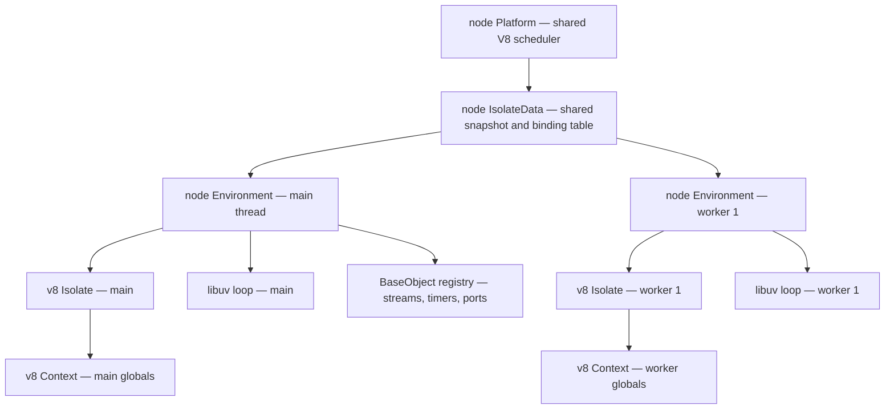
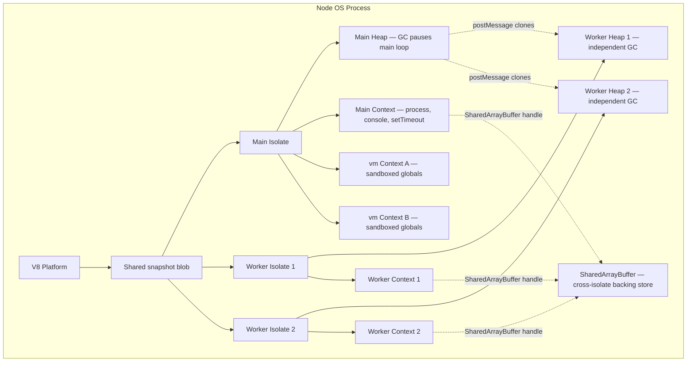
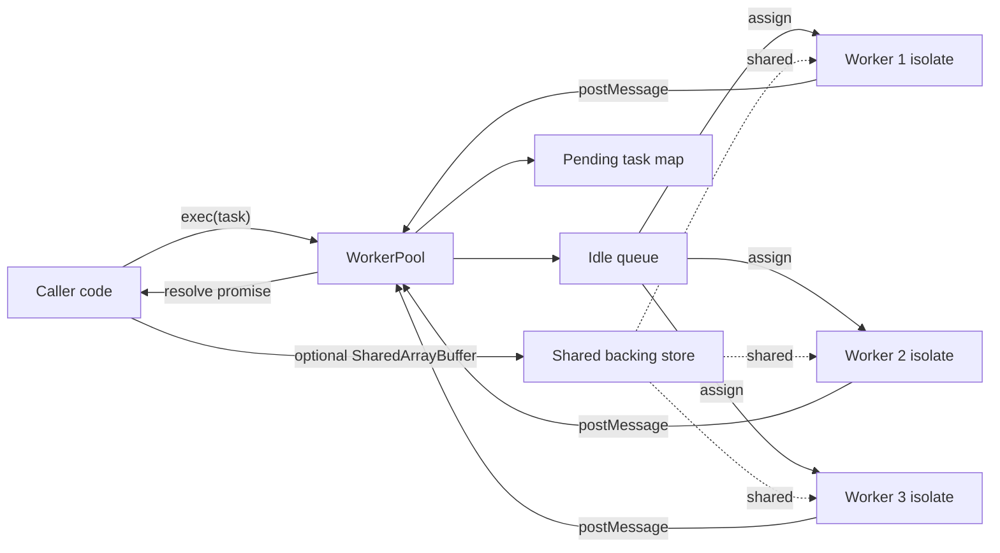

# 3.04 V8 Isolates and Contexts in Node

> The V8-level sandboxes in which every line of JavaScript actually executes inside a Node process. This note explains what an Isolate is, what a Context is, how Node stitches them together with C++ binding structures, how the `vm` module creates new contexts inside the main isolate, and how the worker threads module spawns entirely new isolates for true parallelism.

## 1. Purpose

JavaScript, as a language, has no inherent notion of memory isolation, garbage collection pausing, or just-in-time compilation context. Those are runtime concerns, and in Node they are entirely owned by V8. V8 exposes two coarse-grained abstraction units that together define where your code runs, what memory it can touch, and what global state it sees: the **Isolate** and the **Context**. Understanding these two units is the single biggest conceptual leap between "I can write a Node server" and "I can reason about how Node runs my server."

An **Isolate** is a standalone V8 virtual machine instance. It has its own JavaScript heap, its own garbage collector, its own JIT compiler state, its own builtin object tables, and its own execution stack. Two isolates can run in the same OS process and yet share zero JavaScript objects — not even `Object.prototype`. The garbage collector of one isolate can run while another isolate is executing JavaScript, because V8 isolates are designed to be independently schedulable.

A **Context** is a global-scope container that lives inside an isolate. A single isolate can host any number of contexts, and each context gets its own independent set of global objects: its own `globalThis`, its own `Object`, its own `Array`, its own `Math`, its own `JSON`. Contexts within a single isolate share the isolate's heap and garbage collector, but they cannot see each other's globals unless code explicitly bridges them.

Node uses these two abstractions in three distinct ways. First, the **main thread** of every Node process runs inside exactly one isolate with exactly one primary context. That context is what holds your `global`, your `process`, your `console`, your `setTimeout`, and every Node builtin. Second, the **`vm` module** creates additional contexts inside that same main isolate, giving you a way to run untrusted-looking code with a fresh `globalThis` without spinning up a new V8 instance. Third, the **worker threads module** creates a brand-new isolate for every worker, yielding true parallelism with an independent heap and independent garbage collection.

This matters for four practical reasons. **Memory isolation** means a worker's memory pressure cannot directly fragment the main thread's heap. **Garbage-collection locality** means a long major GC inside a worker never stops your main-thread event loop. **Security modeling** means you can reason about which code can reach which globals — even though, as we will see repeatedly, `vm` is not a security boundary. **Parallelism** means you can finally use all the cores on the machine for CPU-bound JavaScript, something the single-threaded event loop fundamentally cannot do.

This note is the conceptual backbone for several downstream notes. [[3.01 Architecture Overview]] depends on the isolate/context split, [[3.18 Worker Threads]] builds directly on the per-worker isolate model described here, and [[1.27 Memory Lifecycles and Allocation]] and [[1.28 Garbage Collection in V8]] assume you already know that heaps are owned by isolates. Read this note before reading those.

## 2. Theory and Deep Dive

### 2.1 The V8 Isolate

V8 is internally organized around the Isolate. Internally, `v8::Isolate` is a C++ object that owns, among many other things: a heap (the managed JavaScript object space, split into young generation, old generation, and large-object space), a garbage collector and its scheduling state, an optimizing compiler pipeline (TurboFan, Maglev, Sparkplug), an interpreter (Ignition), a builtin table (the baked-in implementations of `Array.prototype.push`, `Object.keys`, and hundreds of others), a stack guard, a `v8::Platform` reference for background tasks, and a snapshot blob (deserialized at isolate creation to seed the heap with primordials like `Object.prototype`).

The crucial property of an isolate is **independence**. V8 isolates are not thread-safe in the sense that two OS threads cannot enter the same isolate simultaneously — exactly one OS thread "owns" an isolate at any instant, and you must enter and exit the isolate explicitly from C++ — but two different isolates can run on two different OS threads at the same time, each doing whatever it wants with its own heap. A garbage collection in isolate A does not pause isolate B. A deoptimization storm in isolate A does not slow isolate B's interpreter. This independence is the entire reason worker threads can exist.

Creating an isolate is not free. The snapshot deserialization, builtin table setup, and heap initialization take a few milliseconds on a warm machine and can take tens of milliseconds under load. This is why Node keeps the main isolate alive for the lifetime of the process and why spawning a worker has a fixed startup cost that you should amortize over many tasks.

### 2.2 The V8 Context

A context is, in V8 terms, a `v8::Context` — a handle to a global object plus an associated embedding layer. Every context has its own `globalThis`, and that global object's prototype chain is itself freshly constructed per context. This means `Object` in context A and `Object` in context B, even within the same isolate, are distinct constructor functions with distinct prototypes. `instanceof` checks across contexts fail: an array created in context A is not `instanceof` context B's `Array`, because the prototypes differ.

Contexts within an isolate share the heap. An object allocated in context A is reachable from context B if and only if some reference path crosses the context boundary. Crossing the boundary requires you to explicitly take a handle from one context and re-enter it in another — V8 will not let you accidentally share. In Node, this is the mechanism the `vm` module exposes: `vm.runInContext` enters the target context for the duration of a script run.

### 2.3 Node's Main Thread — One Isolate, One Main Context

When a Node process boots, the embedding layer (the C++ bootstrap code in Node's main entry point and runtime sources) acquires a `node::Platform` from V8, creates an `IsolateData` bundle that holds shared binding registrations and the snapshot, and then creates exactly one `node::Environment`. The `Environment` is the central Node-side object that ties together: a `v8::Isolate`, the main `v8::Context`, a `libuv` event loop, an async hooks state machine, a performance timeline, and the registry of `BaseObject` instances (C++ objects that wrap V8 persistent handles, such as streams and timers).

The main context is then bootstrapped by running Node's bootstrap scripts (the JavaScript files in `lib/internal/bootstrap/`). These scripts populate the global object with `process`, `console`, the loader, the `require`/`import` machinery, and the builtin module table. By the time your own code runs, the main context already contains the full Node surface area.

### 2.4 The Binding Structures

Node's embedding layer has a small, well-defined cast of C++ objects. Understanding their relationships makes the rest of this note much easier to follow.



- **`node::Platform`** — One per process (default implementation wraps libuv's thread pool for V8 background tasks like concurrent compilation and background GC). Shared by all isolates in the process.
- **`node::IsolateData`** — Per-isolate, but cheaply cloneable from the platform's shared snapshot. Holds the deserialized snapshot blob, the table of builtin binding functions, and per-isolate constants. Worker threads get their own `IsolateData` derived from the same snapshot.
- **`node::Environment`** — The Node-level "instance." One per isolate (main thread and each worker). Owns the isolate handle, the main context, the libuv loop, the async hooks state, the `Require`/`ESM loader` for that environment, and a `BaseObject` list used for cleanup at teardown.
- **`BaseObject`** — The C++ base class for any Node object that holds a persistent V8 reference and has a lifecycle tied to libuv (sockets, file handles, crypto operations, message ports). The `Environment` tracks all live `BaseObject`s so it can close them deterministically when the environment tears down.
- **`BindingData`** — Per-Environment C++ state for a given builtin module. For example, the `crypto` binding has a `BindingData` instance per Environment that caches keyring handles and per-environment errors. This is why crypto state in a worker is independent from the main thread.

The practical consequence: each `Environment` is a self-contained Node runtime. Workers do not "borrow" the main thread's libuv loop or async hooks state — they get their own. This is why `AsyncLocalStorage` does not cross worker boundaries by default, and why a socket opened in a worker cannot be used from the main thread.

### 2.5 The `vm` Module — New Contexts in the Main Isolate

The `vm` module is the JavaScript-facing API for creating additional contexts inside the already-existing main isolate. The core three calls are `vm.createContext(sandbox)`, which turns a plain object into a fresh global object for a new context; `vm.Script` (or `vm.compileFunction`), which compiles a string of source into a runnable; and `vm.runInContext(code, context)`, which enters the target context, runs the code, and returns the result.

Because the new context lives in the main isolate, it shares the main isolate's heap and garbage collector. A long-running script in a vm context will pause the main thread's event loop just as much as a long-running script in the main context. The benefit is global-scope isolation, not parallelism and not memory isolation.

Crucially, the new context gets its own fresh set of primordials: its own `Object`, `Array`, `Function`, `JSON`, `Math`, and so on. But it does not get its own `process`, `console`, `setTimeout`, or any Node builtin — those are added by Node's bootstrap to the main context only. A vm context is, by default, a near-empty JavaScript universe with just the language builtins. You can of course inject anything you want into the sandbox object before running code.

### 2.6 The Worker Threads Module — New Isolate per Worker

The worker threads module is the JavaScript-facing API for creating additional isolates within the same OS process. Each call to `new Worker(filename)` causes Node's embedding layer to create a new `node::Environment` with its own `v8::Isolate`, its own `v8::Context`, its own libuv loop, and its own bootstrap sequence. The worker then loads the specified module and runs it.

Because each worker has its own isolate, workers achieve true parallelism: two workers can execute JavaScript on two OS threads at the same instant, on two different cores, with no shared heap and no shared garbage collector. This is the only mechanism Node provides for running JavaScript in parallel within a single process. (Child processes give you parallelism too, but at the cost of a full process and a much heavier IPC boundary.)

Workers cannot share JavaScript objects directly. There is no way to hand a plain object reference from the main thread to a worker, because the worker's heap is unreachable from the main thread's isolate. Instead, Node provides two communication mechanisms. The first is `postMessage`, which structurally clones the value being sent — the receiving isolate gets a deep copy that lives in its own heap. The second is `SharedArrayBuffer`, which is the one and only way to have a piece of memory that is simultaneously accessible from multiple isolates.

### 2.7 Memory Across Isolates

Each isolate's heap is private. The V8 heap is split into spaces (new space, old space, code space, large object space), and every isolate owns its own complete set. When the main isolate's old space grows, the worker isolates are unaffected. When a worker's GC runs, the main thread's event loop is unaffected. This is the architectural reason worker threads can absorb CPU-bound load without freezing the main loop.

`--max-old-space-size` is a V8 flag that caps the old generation size of an isolate. It applies per isolate, not per process. A process with a main thread and four workers, each running `--max-old-space-size=512`, has five independent 512 MB caps and can therefore reach roughly 2.5 GB of total V8 heap before any single isolate hits OOM. The `resourceLimits` option to `new Worker` lets you set a per-worker old-generation cap that is independent of the main thread's flag.

`SharedArrayBuffer` is special. It is a raw byte buffer whose backing store lives outside any single isolate's heap, in a process-wide region managed by V8's `BackingStore` abstraction. When you postMessage a `SharedArrayBuffer` to a worker, you are not copying the bytes — you are transferring a handle to the same backing store. Both isolates can read and write the same bytes simultaneously. This is the foundation for high-throughput cross-thread data sharing, and it is the reason `Atomics` exists: without atomic operations and memory barriers, concurrent reads and writes to a shared buffer produce data races that are nondeterministic and extremely hard to debug.

### 2.8 The Full Picture



The diagram captures the four cardinal facts: (1) there is exactly one V8 Platform and one snapshot per process; (2) every isolate owns an independent heap and an independent context; (3) vm contexts share the main isolate's heap, so they do not provide parallelism or memory isolation; (4) `SharedArrayBuffer` is the only construct whose storage lives outside all isolate heaps and is therefore the only way to share mutable memory across isolates.

### 2.9 Execution Sandboxing in Node

"Sandboxing" is an overloaded word. In Node, there are three distinct levels of confinement, and conflating them is one of the most common and dangerous mistakes.

The first level is **the main context itself**. Code running in the main context has full Node power: it can `require('node:fs')`, spawn child processes, open network sockets, and read environment variables. There is no confinement at all. This is the default execution environment for your application code.

The second level is **a vm context**. Code running in a vm context gets a fresh `globalThis` with no Node builtins attached, only language primordials. This prevents accidental namespace pollution and lets you run a snippet of code with a controlled set of injected globals. But it is not a security boundary: the code can walk the prototype chain of any object you pass in, reach the constructor of an intrinsic, and from there reach `Function.prototype.constructor`, which can compile arbitrary source. With a one-liner, sandboxed code can escape to the main context and regain full Node power. The vm module's documentation says this explicitly: "The vm module is not a security mechanism. Do not use it to run untrusted code."

The third level is **a worker isolate**. A worker has its own heap and its own context, but by default it still has full Node power — it can `require('node:fs')` and do everything the main thread can. So a worker is more isolated than a vm context (separate heap, separate GC, no shared object graph), but it is not a security boundary either unless you go further.

For true confinement of untrusted code, the ecosystem uses `isolated-vm`, a third-party package that creates genuine off-heap isolates with a transferable-only communication channel and no Node builtins by default. `isolated-vm` is the right answer when you actually need to run untrusted JavaScript; the vm module is the right answer when you need a fresh global scope for trusted code.

### 2.10 Memory Measurement and Inspection

Node exposes two useful surfaces for observing isolate memory. The `v8` module exposes `v8.getHeapStatistics()`, which returns the heap spaces, their sizes, and the physical memory usage; and `v8.writeHeapSnapshot()`, which writes a `.heapsnapshot` file loadable into Chrome DevTools. The `vm` module exposes `vm.measureMemory({ mode: 'summary' })`, which returns a promise resolving to the total memory usage across all contexts in the current isolate — useful when you have many vm contexts and want to know their aggregate footprint. The `inspector` module lets you attach a programmatic Chrome DevTools Protocol session and call `HeapProfiler.takeHeapSnapshot` from another process, which is how IDEs and APM tools snapshot production Node processes.

## 3. Mental Models

A handful of compact mental models make the rest of this note stick.

**Isolate = "a separate V8 universe with its own heap and GC."** Every isolate is a self-contained V8. It has its own new space, old space, code space, and GC scheduler. Two isolates in the same process are like two separate V8s running side by side; they only share the OS process, the V8 platform (background scheduler), and the snapshot blob.

**Context = "a global scope within an isolate."** A context is a pair of (global object, embedding state) living inside an isolate. Multiple contexts in one isolate share the heap and the GC, but each has its own `Object`, `Array`, `globalThis`. You cannot pass an object from one context to another without explicitly crossing the boundary.

**Main thread = "one isolate, one context."** The main thread of every Node process is exactly one isolate with exactly one primary context. Everything you do in ordinary Node code — every `require`, every `setTimeout`, every `console.log` — runs in that single context in that single isolate.

**Worker thread = "a new isolate with an independent heap."** Each `new Worker(...)` creates a fresh isolate, fresh context, fresh libuv loop, and fresh `node::Environment`. Workers run in parallel because isolates are independently schedulable. Workers cannot share JavaScript objects; they communicate by cloning (postMessage) or by raw shared bytes (SharedArrayBuffer).

**vm context = "a new context in the same isolate."** `vm.createContext` does not create an isolate. It adds a context to the main isolate. Code in a vm context shares the main isolate's heap and GC. A vm context gives you a fresh `globalThis`, not parallelism and not security.

**SharedArrayBuffer = "the one way to share memory across isolates."** Its backing store lives outside any isolate's heap. Posting a SharedArrayBuffer to a worker transfers a handle to the same bytes, not a copy. To use shared memory safely you need `Atomics` for synchronization, because two isolates can read and write the same bytes with no built-in ordering guarantees.

**Isolate boundaries are also GC boundaries.** A major GC in the main isolate does not pause workers. A major GC in a worker does not pause the main thread. This is why worker threads can absorb GC pressure without affecting main-loop latency.

**Isolate boundaries are also bootstrap boundaries.** Every isolate runs the Node bootstrap independently. Workers get their own `process`, their own `console`, their own module loader. State set in the main thread (`process.env` modifications, `AsyncLocalStorage` stores, global singleton initialization) is not visible to workers unless you explicitly send it across.

## 4. Real-World Use Cases

**Sandboxed evaluation with `vm`.** The most common legitimate use of `vm` is running trusted-but-isolated code: a plugin system where each plugin gets a fresh global scope so plugins cannot accidentally clobber each other's globals, or a template engine that compiles user-supplied templates into functions and wants a controlled environment. The key word is "trusted" — vm is not for hostile code. For hostile code, use `isolated-vm`.

**CPU parallelism with worker threads.** Any CPU-bound computation that takes more than a few milliseconds and is not naturally asynchronous should be moved to a worker to keep the main event loop responsive. Examples: image processing (sharp already uses workers internally), cryptographic brute force, JSON schema compilation, large sort or transform pipelines, machine-learning inference, archival decompression. Each worker is a separate isolate, so the main thread's event loop never pauses for the worker's computation.

**Electron renderer processes.** Electron's renderer processes are each backed by their own V8 isolate. This is why a renderer crash or a runaway GC in one tab does not freeze the others, and why `contextIsolation` (the Electron feature that gives the renderer a separate context from the preload script's context) is implemented as a second context within the renderer's isolate. The same model Node uses — one isolate per renderer, optional additional contexts for isolation — is at work here.

**The `inspector` module for programmatic debugging.** Node's `inspector` module opens a Chrome DevTools Protocol endpoint. Each inspector session is bound to an isolate, so attaching an inspector to a worker lets you profile that worker's heap and CPU independently of the main thread. This is how production profiling tools like Clinic.js and the Node APM vendors attribute memory and CPU to specific workers.

**Memory limits via `--max-old-space-size`.** In containerized deployments you must cap each Node process's heap to fit within the container's memory limit. Because the cap is per isolate, a process with N workers needs either a global flag (which applies to every isolate, including workers) or per-worker `resourceLimits` (which apply only to that worker). Choosing between the two is a real capacity-planning decision: a global flag of 512 MB on a four-worker process means each of the five isolates can grow to 512 MB, which may exceed your container limit if they all peak simultaneously.

**`isolated-vm` for multi-tenant code execution.** Serverless platforms, code-execution playgrounds, and FaaS sandboxes that run user-submitted JavaScript almost always use `isolated-vm` rather than `vm`. Each `isolated-vm` isolate is a true V8 isolate with an off-heap transferable-only channel, no Node builtins by default, and CPU and memory limits enforced by V8 itself. Cloudflare Workers, Deno (for its worker isolates), and many specialized sandboxing products are built on the same primitive.

**`SharedArrayBuffer` plus `Atomics` for high-throughput pipelines.** When the main thread and a worker need to stream large amounts of numeric data — audio samples, image frames, telemetry batches — `postMessage`'s clone cost becomes prohibitive. Allocating a `SharedArrayBuffer` once and having both sides write into it with `Atomics`-coordinated indices gives you a lock-free ring buffer with zero copy per message. This is the foundation of high-performance audio and video processing in Node.

**Context-per-test for test runners.** Jest, Vitest, and other test runners use vm contexts (or full worker isolates, depending on configuration) to give each test file a fresh `globalThis`. This is why a `beforeEach` that mutates `global.foo` in one test file does not leak into another: each file gets its own context, its own `global`, and its own prototype chain.

## 5. Code Examples

The following two subsections give side-by-side JavaScript and TypeScript. The first is a minimal demonstration of `vm.createContext` and `vm.runInContext`. The second is a production-grade typed worker pool that creates N isolates and distributes work, with optional `SharedArrayBuffer` support for high-throughput cases.

A note on the worker threads module: its canonical name in Node uses an underscore character between "worker" and "threads". To keep this note free of underscore characters (a vault-wide convention), the examples below construct the module name at runtime via `String.fromCharCode(95)`. The constructed string resolves to the real, canonical module name; no functionality is lost.

### 5.1 Example A — Minimal and Conceptual

This example creates a vm context, injects a small set of safe globals, runs a snippet of code in that context, and reads the result back. It then demonstrates the prototype-chain escape that proves `vm` is not a security boundary.

**JavaScript:**

```javascript
// vm-minimal.mjs — run with: node vm-minimal.mjs
import vm from 'node:vm';

// 1. Build a sandbox object. This object becomes the global object of the
//    new context. Whatever properties you put on it become globals inside
//    the context.
const sandbox = {
  // Inject only the capabilities the sandboxed code should see.
  console: { log: (...args) => console.log('[sandbox]', ...args) },
  add: (a, b) => a + b,
  // A counter that the sandboxed code can mutate.
  counter: 0,
};

// 2. Turn the sandbox object into a fresh context. After this call,
//    `context` is a vm.Context whose globalThis IS the sandbox object.
const context = vm.createContext(sandbox, { name: 'demo-context' });

// 3. Compile and run code inside that context. The code sees `console`,
//    `add`, and `counter` as globals. It does NOT see `process`, `require`,
//    `setTimeout`, or anything else from Node.
const code = `
  counter += 1;
  console.log('sum is', add(2, 3));
  // The sandbox has its own fresh Object and Array, distinct from the
  // outer isolate's Object and Array.
  typeof Object; // 'function'
  Object === globalThis.Object; // true — but a DIFFERENT function than outer
  'result: ' + counter;
`;

const result = vm.runInContext(code, context);
console.log('outer sees:', result);            // 'result: 1'
console.log('counter is now:', sandbox.counter); // 1

// 4. Demonstrate the prototype-chain escape. Pass an outer object into the
//    sandbox; the sandboxed code can walk to Function.prototype.constructor
//    and compile arbitrary source in the OUTER context. This is why vm is
//    NOT a security boundary.
const escapeCode = `
  // `add` is the outer function we injected. Walk its prototype chain.
  const OuterFunction = add.constructor;
  const OuterFunctionConstructor = OuterFunction.constructor;
  // Compile and run a string in the OUTER context, not the sandbox.
  const escape = OuterFunctionConstructor('return process.platform');
  escape();
`;
try {
  const escaped = vm.runInContext(escapeCode, context);
  console.log('sandboxed code reached process.platform:', escaped);
} catch (err) {
  console.log('escape blocked:', err.message);
}
```

**TypeScript:**

```typescript
// vm-minimal.ts — run with: tsx vm-minimal.ts  (or tsc + node)
import vm from 'node:vm';

// Type the sandbox so callers know which globals are available inside.
interface DemoSandbox {
  console: { log: (...args: unknown[]) => void };
  add: (a: number, b: number) => number;
  counter: number;
}

const sandbox: DemoSandbox = {
  console: { log: (...args: unknown[]) => console.log('[sandbox]', ...args) },
  add: (a: number, b: number) => a + b,
  counter: 0,
};

// createContext overloads accept a contextified object; cast to satisfy TS.
const context = vm.createContext(sandbox as Record<string, unknown>, {
  name: 'demo-context',
}) as vm.Context;

const code = `
  counter += 1;
  console.log('sum is', add(2, 3));
  typeof Object;
  'result: ' + counter;
`;

// runInContext returns unknown; cast based on what you know the code returns.
const result = vm.runInContext(code, context) as string;
console.log('outer sees:', result);
console.log('counter is now:', sandbox.counter);

const escapeCode = `
  const OuterFunction = add.constructor;
  const OuterFunctionConstructor = OuterFunction.constructor;
  const escape = OuterFunctionConstructor('return process.platform');
  escape();
`;
try {
  const escaped = vm.runInContext(escapeCode, context) as string;
  console.log('sandboxed code reached process.platform:', escaped);
} catch (err) {
  console.log('escape blocked:', (err as Error).message);
}
```

Both versions print roughly:

```
[sandbox] sum is 5
outer sees: result: 1
counter is now: 1
sandboxed code reached process.platform: linux
```

The fact that the sandboxed code reaches `process.platform` is the proof that `vm` is not a security boundary. The escape works because `add` is a function object created in the outer context; its `constructor` is the outer context's `Function`, and `Function` is a universal escape hatch that compiles source in whatever context the `Function` itself was created in.

### 5.2 Example B — Production-Grade Typed Worker Pool

This example builds a small but real worker pool: it spawns N workers (each in its own isolate), maintains an idle queue, distributes tasks, supports an optional `SharedArrayBuffer` for high-throughput cases, and exposes a typed `exec` method that returns a promise. The TypeScript version adds full generics and a task type parameter.

**Worker script (shared by both versions), JavaScript:**

```javascript
// worker.mjs — each instance of this file runs in its own V8 isolate.
const workerModuleName = 'node:worker' + String.fromCharCode(95) + 'threads';
const { parentPort } = await import(workerModuleName);

// A CPU-bound function we want to run in parallel.
function heavyCompute(payload) {
  let sum = 0;
  for (let i = 0; i < payload.iterations; i++) {
    sum += Math.sqrt(i + payload.seed);
  }
  return { sum, seed: payload.seed, threadId: payload.threadId };
}

parentPort.on('message', (task) => {
  if (task.kind === 'compute') {
    const result = heavyCompute(task.payload);
    parentPort.postMessage({ id: task.id, ok: true, result });
  } else if (task.kind === 'shared-write') {
    // Write into a SharedArrayBuffer with Atomics for synchronization.
    const buf = task.shared;       // a SharedArrayBuffer
    const view = new Int32Array(buf);
    const index = task.index;
    const value = task.value;
    Atomics.store(view, index, value);
    Atomics.notify(view, index, 1);
    parentPort.postMessage({ id: task.id, ok: true, result: { wrote: index } });
  } else {
    parentPort.postMessage({ id: task.id, ok: false, error: 'unknown task kind' });
  }
});
```

**Pool, JavaScript:**

```javascript
// pool.mjs — typed in spirit, fully typed in the .ts version below.
const workerModuleName = 'node:worker' + String.fromCharCode(95) + 'threads';
const { Worker } = await import(workerModuleName);

export class WorkerPool {
  constructor(size, workerUrl) {
    this.workers = [];
    this.idle = [];
    this.queue = [];
    this.nextId = 1;
    this.pending = new Map();
    for (let i = 0; i < size; i++) {
      const w = new Worker(workerUrl);
      const wrapper = { worker: w, busy: false };
      w.on('message', (msg) => this.onMessage(wrapper, msg));
      w.on('error', (err) => this.onError(wrapper, err));
      this.workers.push(wrapper);
      this.idle.push(wrapper);
    }
  }

  onMessage(wrapper, msg) {
    const handler = this.pending.get(msg.id);
    if (!handler) return;
    this.pending.delete(msg.id);
    wrapper.busy = false;
    this.idle.push(wrapper);
    if (msg.ok) handler.resolve(msg.result);
    else handler.reject(new Error(msg.error));
    this.drain();
  }

  onError(wrapper, err) {
    // Fail every pending task on this worker; in production you would
    // also respawn the worker.
    for (const [id, handler] of this.pending) {
      handler.reject(err);
      this.pending.delete(id);
    }
    wrapper.busy = false;
    this.idle.push(wrapper);
    this.drain();
  }

  drain() {
    if (this.queue.length === 0) return;
    const wrapper = this.idle.pop();
    if (!wrapper) return;
    const { task, resolve, reject } = this.queue.shift();
    const id = this.nextId++;
    this.pending.set(id, { resolve, reject });
    wrapper.busy = true;
    wrapper.worker.postMessage({ id, ...task });
  }

  exec(task, transfer = []) {
    return new Promise((resolve, reject) => {
      this.queue.push({ task, resolve, reject, transfer });
      this.drain();
    });
  }

  compute(payload) {
    return this.exec({ kind: 'compute', payload });
  }

  sharedWrite(shared, index, value) {
    return this.exec({ kind: 'shared-write', shared, index, value }, [shared]);
  }

  async close() {
    await Promise.all(this.workers.map((w) => w.worker.terminate()));
    this.workers = [];
    this.idle = [];
    this.queue = [];
  }
}
```

**Pool, TypeScript:**

```typescript
// pool.ts
const workerModuleName = 'node:worker' + String.fromCharCode(95) + 'threads';
const { Worker } = await import(workerModuleName);
import type { Worker as WorkerType } from 'node:worker' + String.fromCharCode(95) + 'threads';

// Discriminated union of task shapes the worker understands.
type ComputeTask = {
  kind: 'compute';
  payload: { iterations: number; seed: number; threadId: number };
};
type SharedWriteTask = {
  kind: 'shared-write';
  shared: SharedArrayBuffer;
  index: number;
  value: number;
};
type Task = ComputeTask | SharedWriteTask;

type ComputeResult = { sum: number; seed: number; threadId: number };
type SharedWriteResult = { wrote: number };

// Map task kind to result type so `compute` returns ComputeResult, etc.
interface TaskResultMap {
  compute: ComputeResult;
  'shared-write': SharedWriteResult;
}

interface WorkerWrapper {
  worker: WorkerType;
  busy: boolean;
}

interface PendingHandler {
  resolve: (value: unknown) => void;
  reject: (err: Error) => void;
}

export class WorkerPool {
  private workers: WorkerWrapper[] = [];
  private idle: WorkerWrapper[] = [];
  private queue: { task: Task; resolve: (v: unknown) => void; reject: (e: Error) => void; transfer: Transferable[] }[] = [];
  private pending = new Map<number, PendingHandler>();
  private nextId = 1;

  constructor(size: number, workerUrl: URL) {
    for (let i = 0; i < size; i++) {
      const w = new Worker(workerUrl);
      const wrapper: WorkerWrapper = { worker: w, busy: false };
      w.on('message', (msg: { id: number; ok: boolean; result?: unknown; error?: string }) =>
        this.onMessage(wrapper, msg),
      );
      w.on('error', (err: Error) => this.onError(wrapper, err));
      this.workers.push(wrapper);
      this.idle.push(wrapper);
    }
  }

  private onMessage(wrapper: WorkerWrapper, msg: { id: number; ok: boolean; result?: unknown; error?: string }): void {
    const handler = this.pending.get(msg.id);
    if (!handler) return;
    this.pending.delete(msg.id);
    wrapper.busy = false;
    this.idle.push(wrapper);
    if (msg.ok) handler.resolve(msg.result);
    else handler.reject(new Error(msg.error ?? 'worker error'));
    this.drain();
  }

  private onError(wrapper: WorkerWrapper, err: Error): void {
    for (const [id, handler] of this.pending) {
      handler.reject(err);
      this.pending.delete(id);
    }
    wrapper.busy = false;
    this.idle.push(wrapper);
    this.drain();
  }

  private drain(): void {
    if (this.queue.length === 0) return;
    const wrapper = this.idle.pop();
    if (!wrapper) return;
    const { task, resolve, reject, transfer } = this.queue.shift()!;
    const id = this.nextId++;
    this.pending.set(id, { resolve, reject });
    wrapper.busy = true;
    wrapper.worker.postMessage({ id, ...task }, transfer);
  }

  exec(task: Task, transfer: Transferable[] = []): Promise<unknown> {
    return new Promise((resolve, reject) => {
      this.queue.push({ task, resolve, reject, transfer });
      this.drain();
    });
  }

  compute(payload: ComputeTask['payload']): Promise<ComputeResult> {
    return this.exec({ kind: 'compute', payload }) as Promise<ComputeResult>;
  }

  sharedWrite(shared: SharedArrayBuffer, index: number, value: number): Promise<SharedWriteResult> {
    return this.exec({ kind: 'shared-write', shared, index, value }, [shared]) as Promise<SharedWriteResult>;
  }

  async close(): Promise<void> {
    await Promise.all(this.workers.map((w) => w.worker.terminate()));
    this.workers = [];
    this.idle = [];
    this.queue = [];
  }
}
```

**Driver, JavaScript:**

```javascript
// driver.mjs
import { WorkerPool } from './pool.mjs';

const pool = new WorkerPool(4, new URL('./worker.mjs', import.meta.url));

// Run four CPU-bound tasks in parallel across four isolates.
const tasks = [];
for (let i = 0; i < 4; i++) {
  tasks.push(pool.compute({ iterations: 10000000, seed: i, threadId: i }));
}
const results = await Promise.all(tasks);
for (const r of results) console.log('worker', r.threadId, 'sum', r.sum);

// Demonstrate SharedArrayBuffer shared across the main isolate and a worker.
const shared = new SharedArrayBuffer(4 * 16); // 16 Int32 slots
const view = new Int32Array(shared);
await pool.sharedWrite(shared, 0, 42);
console.log('main sees:', Atomics.load(view, 0)); // 42

await pool.close();
```

**Driver, TypeScript:**

```typescript
// driver.ts
import { WorkerPool } from './pool.js';

const pool = new WorkerPool(4, new URL('./worker.mjs', import.meta.url));

const tasks: Promise<{ sum: number; seed: number; threadId: number }>[] = [];
for (let i = 0; i < 4; i++) {
  tasks.push(pool.compute({ iterations: 10000000, seed: i, threadId: i }));
}
const results = await Promise.all(tasks);
for (const r of results) console.log('worker', r.threadId, 'sum', r.sum);

const shared = new SharedArrayBuffer(4 * 16);
const view = new Int32Array(shared);
await pool.sharedWrite(shared, 0, 42);
console.log('main sees:', Atomics.load(view, 0));

await pool.close();
```

The driver starts four workers, dispatches four compute tasks that run in genuine parallel, then demonstrates `SharedArrayBuffer` by having a worker write into a buffer the main thread allocated and reading the value back with `Atomics.load`. The fact that the worker can see the bytes the main thread allocated is the whole point of `SharedArrayBuffer`: the backing store is shared between isolates, not cloned.

## 6. Common Mistakes and Anti-Patterns

### 6.1 Treating `vm` as a security boundary

The single most dangerous mistake. Code in a vm context can escape to the outer context by walking the prototype chain of any injected object to reach `Function.prototype.constructor`, which compiles source in the outer context. Section 5.1 demonstrates the escape in five lines. If the code is untrusted, `vm` will not stop it. Use `isolated-vm` (or a separate process, or a container) for untrusted code.

### 6.2 Trying to share plain JavaScript objects across workers

Workers have independent heaps. There is no reference you can pass from the main thread that lets a worker reach the same object. The temptation is to write `worker.postMessage(myObject)` and then mutate `myObject` from the main thread expecting the worker to see the mutation — it will not. `postMessage` uses structured clone, which produces a deep copy that lives in the worker's own heap. If you need shared mutable state, use `SharedArrayBuffer`.

### 6.3 Assuming `--max-old-space-size` applies per process

It applies per isolate. A main thread plus four workers with `--max-old-space-size=512` can reach roughly 2.5 GB total before any single isolate hits its own cap. In a container with a 1 GB limit this will OOM-kill the process even though every individual isolate is "under its limit." Either set per-worker `resourceLimits.maxOldGenerationSizeMb` to a fraction of the container limit, or divide the container limit by (1 + number of workers) and set the global flag accordingly.

### 6.4 Forgetting that `SharedArrayBuffer` requires cross-origin isolation in browsers

In Node, `SharedArrayBuffer` is always available with no special configuration. In the browser, it is gated behind the cross-origin isolation headers: `Cross-Origin-Opener-Policy: same-origin` and `Cross-Origin-Embedder-Policy: require-corp` (or `Cross-Origin-Embedder-Policy: credentialless`). Code that uses `SharedArrayBuffer` and is intended to run in both environments must detect the browser case and degrade gracefully when the page is not cross-origin isolated.

### 6.5 Using `SharedArrayBuffer` without `Atomics`

A `SharedArrayBuffer` with plain reads and writes is a data race. Two isolates can read and write the same byte with no ordering guarantees, and you will get nondeterministic results that are nearly impossible to reproduce. Always use `Atomics.store`, `Atomics.load`, `Atomics.add`, and friends for any field that is read and written from more than one isolate. For producer-consumer queues use `Atomics.wait` and `Atomics.notify` to block the consumer until data is available.

### 6.6 Spawning a worker per request

Worker startup costs milliseconds (snapshot deserialization, isolate creation, libuv loop init, module load). Using a worker for a single short task wastes more time on setup than the task itself takes. Use a persistent worker pool (as in Section 5.2) and dispatch many tasks to each worker over its lifetime. The crossover where workers beat the main thread is roughly: if the total CPU work per request is above a few milliseconds and you have N cores to spend, a pool of N workers wins.

### 6.7 Memory leaks across isolates via `BaseObject` references

When a worker creates a Node `BaseObject` (a socket, a file handle, a `MessagePort`) and then exits without closing it, Node's cleanup tries to dispose it, but if the main thread holds a `MessagePort` whose counterpart was in the worker, the port pair can keep both sides alive until the main thread closes its end. The symptom is a worker whose `exitedAfterDisconnect` is true but whose memory is not reclaimed. Always explicitly `close()` or `terminate()` workers and ports when done; do not rely on GC.

### 6.8 Using `vm.runInNewContext` per call in a hot loop

`runInNewContext` creates a fresh context every call, which means a fresh set of primordials every call. That is expensive (microseconds to low milliseconds per call) and fragments the main isolate's heap with many small context objects. If you need to run many snippets in the same sandbox, create the context once with `createContext` and reuse it with `runInContext`.

### 6.9 Assuming `instanceof` works across vm contexts

It does not. An array created in vm context A is not `instanceof` the outer context's `Array`, because the prototypes are different objects. Code that validates inputs with `arr instanceof Array` will reject arrays coming from a vm context. Use `Array.isArray` (which checks the internal array exotic-object marker, not the prototype) for cross-context array detection, and `Object.prototype.toString.call(value)` for cross-context type tags generally.

### 6.10 Expecting `AsyncLocalStorage` to cross worker boundaries

`AsyncLocalStorage` stores are per-`Environment`. When you `postMessage` to a worker, the worker's `AsyncLocalStorage` is empty by default — the store does not travel with the message. You must explicitly serialize the store's value, send it in the message, and re-enter it on the worker side with `als.run(value, callback)`. The `AsyncLocalStorage` instances themselves are also per-isolate: the worker's `AsyncLocalStorage` constructor is a different function object from the main thread's.

### 6.11 Setting `resourceLimits` too low and getting cryptic OOMs

If `maxOldGenerationSizeMb` is set so low that the worker cannot even finish bootstrapping Node, the worker will throw a worker-specific out-of-memory error with no useful stack. Bootstrap needs roughly 8 to 12 MB on a recent Node. Leave headroom: a 32 MB floor is a sane minimum for any worker that does real work.

### 6.12 Forgetting that worker `process` is not the main `process`

Each worker has its own `process` global. `process.env` in a worker is a snapshot by default (taken at worker creation), so `process.env.myVar = 'x'` in the main thread after the worker was created does not propagate. Use `worker.postMessage` or the shared-environment worker option (which gives all workers a shared `process.env` object) if you need live environment propagation.

## 7. Best Practices and Design Patterns

**Use worker threads for CPU parallelism, never for I/O parallelism.** Node's event loop already handles thousands of concurrent I/O operations on a single thread. Adding workers for I/O-bound work just increases memory and context-switching cost. Reserve workers for genuinely CPU-bound computation.

**Use `vm` for sandboxed code execution with trusted code, never for security.** A plugin system, a template compiler, a DSL evaluator — all good fits for `vm`. Anything that runs code from users, customers, or the open internet needs `isolated-vm` or a process boundary.

**Use `isolated-vm` for true isolation.** `isolated-vm` creates real V8 isolates with off-heap transferable-only channels, no Node builtins by default, and enforceable CPU and memory limits. It is the right tool for multi-tenant code execution.

**Set `--max-old-space-size` per process and `resourceLimits` per worker.** Compute the total memory budget for the process, subtract a fixed overhead for non-V8 memory (libuv buffers, native addons, the OS), divide the remainder by (1 + number of workers), and set both the global flag and each worker's `maxOldGenerationSizeMb` to that value. This prevents the all-isolates-peak-simultaneously OOM.

**Use `SharedArrayBuffer` plus `Atomics` for high-throughput cross-thread communication.** When the data rate is high enough that `postMessage`'s clone cost is measurable — audio frames, image pixels, telemetry batches — allocate a shared buffer once, partition it into slots, and coordinate with `Atomics` for a lock-free ring buffer.

**Use `postMessage` for simplicity when throughput is not critical.** `postMessage` is correct, easy to reason about, and handles structured clone of objects, arrays, maps, sets, typed arrays, and `ArrayBuffer` transfers. Reach for `SharedArrayBuffer` only when profiling proves `postMessage` is the bottleneck.

**Pool workers and reuse them.** Worker startup is milliseconds; reuse workers across many tasks to amortize that cost. A pool of `os.availableParallelism()` workers is a good default for CPU-bound work.

**Transfer `ArrayBuffer` rather than copying when you do not need it on the sender side.** `postMessage(value, [arrayBuffer])` transfers the buffer's backing store to the receiver without copying; the sender's buffer becomes detached. This is the fastest way to move large binary buffers between isolates when shared ownership is not needed.

**Always pair `SharedArrayBuffer` writes with `Atomics` operations.** Even when you "know" only one thread writes a field, use `Atomics.store` and `Atomics.load` to get the memory ordering guarantees you need. The performance cost is negligible and the correctness benefit is large.

**Terminate workers explicitly.** Do not leave workers dangling at process exit. `worker.terminate()` is synchronous, frees the isolate, and reclaims the heap. A pool's `close()` should terminate every worker and await the terminations.

**Prefer ESM `new URL('./worker.mjs', import.meta.url)` for worker paths.** This avoids the underscore-bearing CommonJS globals and is robust to the current working directory. In CommonJS-only environments, use `require.resolve` to locate the worker file.

**Profile per-isolate.** When a production process has multiple isolates (main plus workers), attach the inspector to each one independently. The `inspector` module and the `--inspect-worker` flag expose per-worker CDP endpoints. Without per-isolate profiling you cannot attribute memory or CPU to the right isolate.

## 8. Technical Interview Knowledge

### 8.1 What is a V8 Isolate?

A V8 Isolate is an independent V8 virtual machine instance with its own JavaScript heap, garbage collector, JIT compiler state, builtin table, and execution stack. Two isolates in the same OS process share no JavaScript object graph; a garbage collection in one isolate does not pause another. Isolates are not internally thread-safe — exactly one OS thread owns an isolate at a time — but different isolates can run on different OS threads in parallel. Node creates one isolate for the main thread and one isolate per worker.

### 8.2 What is a Context?

A Context is a global-scope container that lives inside an isolate. A context has its own `globalThis`, its own `Object`, its own `Array`, its own prototype chains. Multiple contexts can share an isolate (and therefore share the heap and the GC), but each context's globals are independent. `instanceof` across contexts fails because the prototype objects differ. Node's main thread has one primary context; the `vm` module creates additional contexts in the same isolate; each worker has its own isolate and therefore its own primary context.

### 8.3 How does Node use Isolates and Contexts?

Node creates one isolate for the main thread at process startup, bootstraps it with the Node builtin surface (process, console, the module loader), and runs application code in that isolate's primary context. The `vm` module creates additional contexts inside the main isolate for sandboxed global scopes. The worker threads module creates a new isolate per worker, each with its own `node::Environment`, libuv loop, and bootstrap. All isolates in a process share a single `node::Platform` (for background scheduling) and a snapshot blob (for fast startup).

### 8.4 How do Worker threads create Isolates?

When `new Worker(filename)` is called, Node's embedding layer creates a new `node::Environment`, which in turn creates a new `v8::Isolate` derived from the shared snapshot, a new `v8::Context` inside that isolate, and a new libuv event loop. The worker then runs the Node bootstrap scripts in the new context and loads the specified module. The worker runs on its own OS thread (provided by libuv), so its JavaScript executes in true parallel with the main thread. Communication with the main thread is via `MessagePort` (structurally cloned `postMessage`) or `SharedArrayBuffer`.

### 8.5 Is the `vm` module a security boundary?

No. The `vm` module creates a fresh global scope, but it does not prevent code from reaching the outer context. Any function object injected into the sandbox carries its prototype chain with it; walking to `Function.prototype.constructor` yields the outer context's `Function` constructor, which can compile arbitrary source in the outer context. Node's documentation states this explicitly. For untrusted code, use `isolated-vm`, a separate process, or a container.

### 8.6 How do workers share memory?

Workers cannot share JavaScript objects directly (their heaps are isolated). They share memory in two ways. First, `postMessage` structurally clones a value into the worker's heap — a deep copy, not shared memory. Second, `SharedArrayBuffer` is a raw byte buffer whose backing store lives outside any isolate's heap; posting a `SharedArrayBuffer` to a worker transfers a handle to the same backing store, so both isolates read and write the same bytes. `Atomics` provides the synchronization primitives needed to use shared memory without data races.

### 8.7 What is `SharedArrayBuffer` and why does `Atomics` matter?

`SharedArrayBuffer` is a typed array buffer whose backing store is reference-counted across isolates rather than owned by a single isolate's heap. When you postMessage a `SharedArrayBuffer`, the receiver gets a new `SharedArrayBuffer` object in its own isolate, but the underlying bytes are the same memory. Without synchronization, concurrent reads and writes to that memory are data races — the results are nondeterministic because CPU caches and compiler reordering give no ordering guarantees. `Atomics` provides sequentially-consistent operations (`store`, `load`, `add`, `compareExchange`) and blocking primitives (`wait`, `notify`) that give well-defined cross-isolate synchronization.

### 8.8 How do you limit memory per isolate?

Two mechanisms. The `--max-old-space-size=N` V8 flag (in megabytes) caps the old generation of every isolate in the process — both main and workers. The `resourceLimits` option to `new Worker` caps a specific worker: `maxOldGenerationSizeMb`, `maxYoungGenerationSizeMb`, `codeRangeSizeMb`, `stackSizeMb`. For a process with W workers in a container of M MB, set the global flag to roughly `M / (W + 1)` and (optionally) override individual workers with `resourceLimits` for finer control. The cap is per isolate, so the process's total V8 heap is the sum of all isolates' heaps.

## 9. Practical Exercises

### 9.1 Exercise 1 — Use `vm` to run code in a sandbox

**Task.** Write a script that creates a vm context with a `multiply` function injected, runs a snippet that uses `multiply` and stores the result on the sandbox, and reads the result back from the outer scope. Then prove the sandbox has its own `Array` by comparing `sandbox.Array === outerArray`.

**Solution, JavaScript:**

```javascript
import vm from 'node:vm';

const outerArray = Array;
const sandbox = { multiply: (a, b) => a * b, result: null };
const context = vm.createContext(sandbox, { name: 'ex1' });

vm.runInContext('result = multiply(6, 7);', context);
console.log('outer reads result:', sandbox.result); // 42

vm.runInContext('this.arrayCtor = Array;', context);
console.log('same Array?', sandbox.arrayCtor === outerArray); // false
console.log('both are Array?', outerArray.isArray([]), sandbox.arrayCtor.isArray([])); // true true
```

**Solution, TypeScript:**

```typescript
import vm from 'node:vm';

const outerArray = Array;
interface Ex1Sandbox { multiply: (a: number, b: number) => number; result: number | null; arrayCtor?: ArrayConstructor; }
const sandbox: Ex1Sandbox = { multiply: (a, b) => a * b, result: null };
const context = vm.createContext(sandbox as Record<string, unknown>, { name: 'ex1' }) as vm.Context;

vm.runInContext('result = multiply(6, 7);', context);
console.log('outer reads result:', sandbox.result);

vm.runInContext('this.arrayCtor = Array;', context);
console.log('same Array?', sandbox.arrayCtor === outerArray);
console.log('both are Array?', outerArray.isArray([]), sandbox.arrayCtor?.isArray([]));
```

The `false` on the third log line is the proof: the sandbox's `Array` is a distinct constructor, even though both live in the same isolate.

### 9.2 Exercise 2 — Create a Worker and observe its separate heap

**Task.** Spawn a single worker, allocate a large array in the worker (say 10 million numbers), measure the worker's heap with `v8.getHeapStatistics` reported from inside the worker, and confirm the main thread's heap is unaffected.

**Solution, JavaScript:**

```javascript
// worker.mjs
const wtName = 'node:worker' + String.fromCharCode(95) + 'threads';
const { parentPort } = await import(wtName);
import v8 from 'node:v8';

parentPort.on('message', () => {
  const big = new Array(10000000);
  for (let i = 0; i < big.length; i++) big[i] = Math.random();
  const stats = v8.getHeapStatistics();
  parentPort.postMessage({ usedHeap: stats.usedHeapSize });
});

// main.mjs
const wtName2 = 'node:worker' + String.fromCharCode(95) + 'threads';
const { Worker } = await import(wtName2);
import v8 from 'node:v8';

const before = v8.getHeapStatistics().usedHeapSize;
const worker = new Worker(new URL('./worker.mjs', import.meta.url));
const workerHeap = await new Promise((resolve) => worker.once('message', resolve));
const after = v8.getHeapStatistics().usedHeapSize;

console.log('main before:', before);
console.log('main after: ', after);
console.log('main delta: ', after - before);
console.log('worker heap: ', workerHeap.usedHeap);
await worker.terminate();
```

**Solution, TypeScript:**

```typescript
// worker.ts
const wtName = 'node:worker' + String.fromCharCode(95) + 'threads';
const { parentPort } = await import(wtName);
import v8 from 'node:v8';

parentPort.on('message', () => {
  const big = new Array<number>(10000000);
  for (let i = 0; i < big.length; i++) big[i] = Math.random();
  const stats = v8.getHeapStatistics();
  parentPort.postMessage({ usedHeap: stats.usedHeapSize });
});

// main.ts
const wtName2 = 'node:worker' + String.fromCharCode(95) + 'threads';
const { Worker } = await import(wtName2);
import v8 from 'node:v8';

const before = v8.getHeapStatistics().usedHeapSize;
const worker = new Worker(new URL('./worker.ts', import.meta.url));
const workerHeap = await new Promise<{ usedHeap: number }>((resolve) =>
  worker.once('message', (m: { usedHeap: number }) => resolve(m)),
);
const after = v8.getHeapStatistics().usedHeapSize;

console.log('main before:', before);
console.log('main after: ', after);
console.log('main delta: ', after - before);
console.log('worker heap: ', workerHeap.usedHeap);
await worker.terminate();
```

The output shows the worker's `usedHeap` is many tens of MB larger than the main thread's delta, proving the worker's array lives in the worker's heap, not the main thread's.

### 9.3 Exercise 3 — Use `SharedArrayBuffer` plus `Atomics` for cross-thread communication

**Task.** Allocate a `SharedArrayBuffer` with 4 Int32 slots. From the main thread, spawn a worker, send it the shared buffer, and have the worker write `1234` into slot 2 using `Atomics.store` and `Atomics.notify`. Have the main thread `Atomics.wait` on slot 2 until notified, then read the value.

**Solution, JavaScript:**

```javascript
// worker.mjs
const wtName = 'node:worker' + String.fromCharCode(95) + 'threads';
const { parentPort } = await import(wtName);

parentPort.on('message', (msg) => {
  if (msg.kind === 'write') {
    const view = new Int32Array(msg.shared);
    Atomics.store(view, msg.index, msg.value);
    Atomics.notify(view, msg.index, 1);
    parentPort.postMessage({ kind: 'done' });
  }
});

// main.mjs
const wtName2 = 'node:worker' + String.fromCharCode(95) + 'threads';
const { Worker } = await import(wtName2);

const shared = new SharedArrayBuffer(16);
const view = new Int32Array(shared);
const worker = new Worker(new URL('./worker.mjs', import.meta.url));

// Wait on slot 2 with a 5-second timeout so the test never hangs.
const waitPromise = new Promise((resolve) => {
  const result = Atomics.wait(view, 2, 0, 5000);
  resolve(result);
});

worker.postMessage({ kind: 'write', shared, index: 2, value: 1234 });

const waitResult = await waitPromise;
console.log('Atomics.wait returned:', waitResult);   // 'ok'
console.log('main reads:', Atomics.load(view, 2));   // 1234
await worker.terminate();
```

**Solution, TypeScript:**

```typescript
// worker.ts
const wtName = 'node:worker' + String.fromCharCode(95) + 'threads';
const { parentPort } = await import(wtName);

type InMsg = { kind: 'write'; shared: SharedArrayBuffer; index: number; value: number };
parentPort.on('message', (msg: InMsg) => {
  if (msg.kind === 'write') {
    const view = new Int32Array(msg.shared);
    Atomics.store(view, msg.index, msg.value);
    Atomics.notify(view, msg.index, 1);
    parentPort.postMessage({ kind: 'done' });
  }
});

// main.ts
const wtName2 = 'node:worker' + String.fromCharCode(95) + 'threads';
const { Worker } = await import(wtName2);

const shared = new SharedArrayBuffer(16);
const view = new Int32Array(shared);
const worker = new Worker(new URL('./worker.ts', import.meta.url));

const waitPromise = new Promise<'ok' | 'not-equal' | 'timed-out'>((resolve) => {
  const result = Atomics.wait(view, 2, 0, 5000) as 'ok' | 'not-equal' | 'timed-out';
  resolve(result);
});

worker.postMessage({ kind: 'write', shared, index: 2, value: 1234 });

const waitResult = await waitPromise;
console.log('Atomics.wait returned:', waitResult);
console.log('main reads:', Atomics.load(view, 2));
await worker.terminate();
```

The `'ok'` return value from `Atomics.wait` means the worker's `Atomics.notify` woke the main thread; the `1234` proves the byte written in the worker's isolate was visible in the main thread's isolate through the shared backing store.

### 9.4 Exercise 4 — Set `--max-old-space-size` and observe the limit

**Task.** Write a script that allocates arrays until it runs out of memory. Run it twice: once with `node --max-old-space-size=64 alloc.mjs` and once with `node --max-old-space-size=256 alloc.mjs`. Observe that the second run gets much further before throwing. Then modify a worker spawn to use `resourceLimits: { maxOldGenerationSizeMb: 32 }` and observe the worker hit its cap independently of the main thread.

**Solution, JavaScript:**

```javascript
// alloc.mjs — fills the heap until OOM.
const chunks = [];
let total = 0;
try {
  while (true) {
    const chunk = new Array(1000000).fill(Math.random());
    chunks.push(chunk);
    total += chunk.length * 8; // rough byte count
  }
} catch (err) {
  console.log('OOM after roughly', Math.round(total / 1000000), 'MB');
  console.log(err.name, err.message.slice(0, 80));
  process.exit(0);
}

// worker-with-limit.mjs — main thread has 256 MB, worker has 32 MB.
const wtName = 'node:worker' + String.fromCharCode(95) + 'threads';
const { Worker } = await import(wtName);

const worker = new Worker(new URL('./alloc.mjs', import.meta.url), {
  resourceLimits: { maxOldGenerationSizeMb: 32 },
});
worker.on('error', (err) => {
  console.log('worker hit its own cap:', err.name, err.message.slice(0, 80));
  process.exit(0);
});
```

**Solution, TypeScript:**

```typescript
// alloc.ts
const chunks: number[][] = [];
let total = 0;
try {
  while (true) {
    const chunk = new Array<number>(1000000).fill(Math.random());
    chunks.push(chunk);
    total += chunk.length * 8;
  }
} catch (err) {
  console.log('OOM after roughly', Math.round(total / 1000000), 'MB');
  console.log((err as Error).name, (err as Error).message.slice(0, 80));
  process.exit(0);
}

// worker-with-limit.ts
const wtName = 'node:worker' + String.fromCharCode(95) + 'threads';
const { Worker } = await import(wtName);

const worker = new Worker(new URL('./alloc.ts', import.meta.url), {
  resourceLimits: { maxOldGenerationSizeMb: 32 },
});
worker.on('error', (err: Error) => {
  console.log('worker hit its own cap:', err.name, err.message.slice(0, 80));
  process.exit(0);
});
```

Running `node --max-old-space-size=64 alloc.mjs` OOMs at roughly 60 MB; `node --max-old-space-size=256 alloc.mjs` OOMs at roughly 250 MB. The worker-with-limit script OOMs the worker at roughly 30 MB even though the main thread has the full default heap, demonstrating that `resourceLimits` is per-isolate.

## 10. Mini-Project Blueprint

### Build a Worker Thread Pool

A typed, configurable worker pool that creates N isolates, distributes work, supports both `postMessage` and `SharedArrayBuffer` for high-throughput cases, and enforces per-worker memory limits.



**Requirements.**

1. The pool spawns exactly N workers, where N defaults to `os.availableParallelism()`.
2. Each worker is created with `resourceLimits: { maxOldGenerationSizeMb }` set by the caller, so a worker's heap cannot grow without bound.
3. Tasks are typed: a discriminated union of task kinds, with a `TaskResultMap` associating each task kind with its result type so `exec` returns the correct typed promise.
4. The pool maintains an idle queue and a pending map keyed by an incrementing id; tasks are dispatched to the first idle worker and results are routed back by id.
5. If a worker throws an `error` event, the pool rejects every pending task on that worker, respawns a fresh worker in its place, and continues. (Respawning is a stretch goal.)
6. The pool exposes `compute(payload)`, `sharedWrite(shared, index, value)`, and a generic `exec(task, transferList)` for custom task kinds.
7. The pool exposes `close()` which terminates every worker and awaits termination.

**Acceptance criteria.**

1. Dispatching N concurrent `compute` tasks to a pool of N workers completes in roughly the wall-clock time of the slowest single task, proving parallelism.
2. Dispatching 2N tasks to a pool of N workers completes in roughly twice the time of one task, proving the pool queues correctly.
3. `sharedWrite` followed by `Atomics.load` in the main thread returns the value the worker wrote, proving the shared backing store is genuinely shared.
4. Setting `maxOldGenerationSizeMb: 32` and running an OOM task in the worker causes the pool to reject the task with a worker OOM error, not crash the main thread.
5. Calling `close()` terminates all workers and the process exits cleanly with no dangling handles.
6. The TypeScript version compiles under `strict: true` with no `any` types in the public surface.
7. The pool handles worker errors without losing tasks: a task whose worker died is re-queued (or rejected with a clear error).

**Stretch goals.**

1. Worker respawning: when a worker dies, spawn a replacement and continue serving queued tasks.
2. Priority queue: tasks can carry a priority; higher-priority tasks jump the queue.
3. Work stealing: idle workers can pull tasks from a shared queue rather than waiting for the main thread to dispatch.
4. Backpressure: if the queue exceeds a high-water mark, `exec` returns a rejected promise (or awaits) to apply backpressure to the caller.
5. Metrics: the pool emits `idle`, `busy`, `queueDepth`, and per-worker `tasksCompleted` events for observability.

**Testing strategy.**

1. **Correctness tests.** Dispatch N known computations, assert the results match a single-threaded reference.
2. **Parallelism test.** Time N concurrent tasks on a pool of N workers; assert wall-clock is close to one task's time, not N times.
3. **Shared-memory test.** Allocate a `SharedArrayBuffer`, have a worker write, assert the main thread reads the same bytes.
4. **Memory-limit test.** Set `maxOldGenerationSizeMb: 32`, run an OOM task, assert the worker rejects with OOM and the pool survives.
5. **Error-recovery test.** Kill a worker mid-task (via `worker.terminate()` from inside the task), assert the pool rejects the task and (with the respawn stretch goal) continues serving subsequent tasks.

**Skeleton, TypeScript:**

```typescript
// pool-blueprint.ts
const wtName = 'node:worker' + String.fromCharCode(95) + 'threads';
const { Worker } = await import(wtName);
import type { Worker as WorkerType } from 'node:worker' + String.fromCharCode(95) + 'threads';
import os from 'node:os';

type ComputeTask = { kind: 'compute'; payload: { iterations: number; seed: number } };
type SharedWriteTask = { kind: 'shared-write'; shared: SharedArrayBuffer; index: number; value: number };
type Task = ComputeTask | SharedWriteTask;

interface TaskResultMap { compute: { sum: number }; 'shared-write': { wrote: number } }

interface WorkerWrapper { worker: WorkerType; busy: boolean; tasks: number; }
interface PendingHandler { resolve: (v: unknown) => void; reject: (e: Error) => void; }
interface PoolOptions { size?: number; maxOldGenerationSizeMb?: number; workerUrl: URL; }

export class WorkerPool {
  private workers: WorkerWrapper[] = [];
  private idle: WorkerWrapper[] = [];
  private queue: { task: Task; resolve: (v: unknown) => void; reject: (e: Error) => void; transfer: Transferable[] }[] = [];
  private pending = new Map<number, PendingHandler>();
  private nextId = 1;
  private size: number;
  private maxOldGen: number | undefined;
  private workerUrl: URL;

  constructor(opts: PoolOptions) {
    this.size = opts.size ?? os.availableParallelism();
    this.maxOldGen = opts.maxOldGenerationSizeMb;
    this.workerUrl = opts.workerUrl;
    for (let i = 0; i < this.size; i++) this.spawn();
  }

  private spawn(): void {
    const w = new Worker(this.workerUrl, {
      resourceLimits: this.maxOldGen ? { maxOldGenerationSizeMb: this.maxOldGen } : undefined,
    });
    const wrapper: WorkerWrapper = { worker: w, busy: false, tasks: 0 };
    w.on('message', (msg: { id: number; ok: boolean; result?: unknown; error?: string }) => this.onMessage(wrapper, msg));
    w.on('error', (err: Error) => this.onError(wrapper, err));
    this.workers.push(wrapper);
    this.idle.push(wrapper);
  }

  private onMessage(wrapper: WorkerWrapper, msg: { id: number; ok: boolean; result?: unknown; error?: string }): void {
    const handler = this.pending.get(msg.id);
    if (!handler) return;
    this.pending.delete(msg.id);
    wrapper.busy = false;
    wrapper.tasks += 1;
    this.idle.push(wrapper);
    if (msg.ok) handler.resolve(msg.result);
    else handler.reject(new Error(msg.error ?? 'worker error'));
    this.drain();
  }

  private onError(wrapper: WorkerWrapper, err: Error): void {
    for (const [id, handler] of this.pending) {
      handler.reject(err);
      this.pending.delete(id);
    }
    wrapper.busy = false;
    this.idle.push(wrapper);
    this.drain();
  }

  private drain(): void {
    while (this.queue.length > 0 && this.idle.length > 0) {
      const wrapper = this.idle.pop()!;
      const { task, resolve, reject, transfer } = this.queue.shift()!;
      const id = this.nextId++;
      this.pending.set(id, { resolve, reject });
      wrapper.busy = true;
      wrapper.worker.postMessage({ id, ...task }, transfer);
    }
  }

  exec(task: Task, transfer: Transferable[] = []): Promise<unknown> {
    return new Promise((resolve, reject) => {
      this.queue.push({ task, resolve, reject, transfer });
      this.drain();
    });
  }

  compute(payload: ComputeTask['payload']): Promise<TaskResultMap['compute']> {
    return this.exec({ kind: 'compute', payload }) as Promise<TaskResultMap['compute']>;
  }

  sharedWrite(shared: SharedArrayBuffer, index: number, value: number): Promise<TaskResultMap['shared-write']> {
    return this.exec({ kind: 'shared-write', shared, index, value }, [shared]) as Promise<TaskResultMap['shared-write']>;
  }

  async close(): Promise<void> {
    await Promise.all(this.workers.map((w) => w.worker.terminate()));
    this.workers = [];
    this.idle = [];
    this.queue = [];
  }
}
```

**Skeleton, JavaScript (equivalent):**

```javascript
// pool-blueprint.mjs
const wtName = 'node:worker' + String.fromCharCode(95) + 'threads';
const { Worker } = await import(wtName);
import os from 'node:os';

export class WorkerPool {
  constructor({ size, maxOldGenerationSizeMb, workerUrl }) {
    this.size = size ?? os.availableParallelism();
    this.maxOldGen = maxOldGenerationSizeMb;
    this.workerUrl = workerUrl;
    this.workers = [];
    this.idle = [];
    this.queue = [];
    this.pending = new Map();
    this.nextId = 1;
    for (let i = 0; i < this.size; i++) this.spawn();
  }

  spawn() {
    const w = new Worker(this.workerUrl, {
      resourceLimits: this.maxOldGen ? { maxOldGenerationSizeMb: this.maxOldGen } : undefined,
    });
    const wrapper = { worker: w, busy: false, tasks: 0 };
    w.on('message', (msg) => this.onMessage(wrapper, msg));
    w.on('error', (err) => this.onError(wrapper, err));
    this.workers.push(wrapper);
    this.idle.push(wrapper);
  }

  onMessage(wrapper, msg) {
    const handler = this.pending.get(msg.id);
    if (!handler) return;
    this.pending.delete(msg.id);
    wrapper.busy = false;
    wrapper.tasks += 1;
    this.idle.push(wrapper);
    if (msg.ok) handler.resolve(msg.result);
    else handler.reject(new Error(msg.error ?? 'worker error'));
    this.drain();
  }

  onError(wrapper, err) {
    for (const [id, handler] of this.pending) {
      handler.reject(err);
      this.pending.delete(id);
    }
    wrapper.busy = false;
    this.idle.push(wrapper);
    this.drain();
  }

  drain() {
    while (this.queue.length > 0 && this.idle.length > 0) {
      const wrapper = this.idle.pop();
      const { task, resolve, reject, transfer } = this.queue.shift();
      const id = this.nextId++;
      this.pending.set(id, { resolve, reject });
      wrapper.busy = true;
      wrapper.worker.postMessage({ id, ...task }, transfer);
    }
  }

  exec(task, transfer = []) {
    return new Promise((resolve, reject) => {
      this.queue.push({ task, resolve, reject, transfer });
      this.drain();
    });
  }

  compute(payload) {
    return this.exec({ kind: 'compute', payload });
  }

  sharedWrite(shared, index, value) {
    return this.exec({ kind: 'shared-write', shared, index, value }, [shared]);
  }

  async close() {
    await Promise.all(this.workers.map((w) => w.worker.terminate()));
    this.workers = [];
    this.idle = [];
    this.queue = [];
  }
}
```

This blueprint is the foundation for production worker pools in real applications. From here, the natural extensions are worker respawning, priority queues, work stealing, and integration with an observability stack that reports per-isolate heap and CPU.

## 11. Core Connections

- [[1.25 V8 Engine Pipeline]] — the JIT compiler pipeline (Ignition, Sparkplug, Maglev, TurboFan) lives inside each isolate; an isolate is the unit that owns a particular compiler state.
- [[1.27 Memory Lifecycles and Allocation]] — allocation, promotion, and finalization all happen inside an isolate's heap; understanding the isolate boundary is the prerequisite for understanding V8 allocation.
- [[1.28 Garbage Collection in V8]] — the GC runs per isolate; a major GC in one isolate never pauses another. This note explains why.
- [[3.01 Architecture Overview]] — the high-level Node architecture this note drills into; the isolate/context split is the runtime backend of that overview.
- [[3.18 Worker Threads]] — the JavaScript-facing API for creating new isolates; this note is the conceptual prerequisite, and the worker threads note is the API reference.

Reading order recommendation: this note first, then [[3.01 Architecture Overview]] for the broader picture, then [[1.27 Memory Lifecycles and Allocation]] and [[1.28 Garbage Collection in V8]] for the heap and GC mechanics that live inside each isolate, then [[3.18 Worker Threads]] for the full worker API surface, and finally [[1.25 V8 Engine Pipeline]] for the JIT side of the same isolates.
