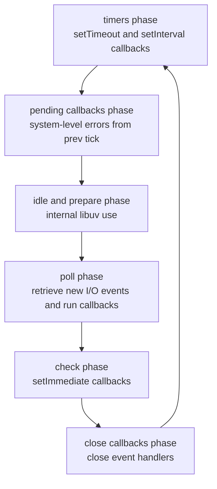
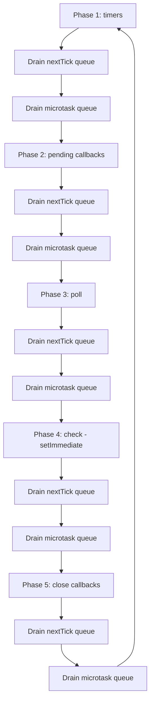
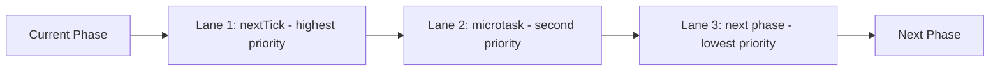
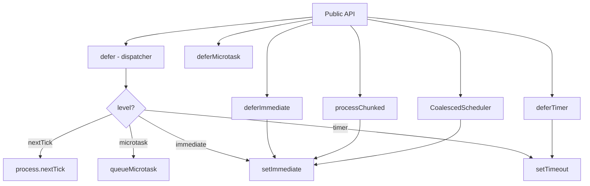

# 3.05 Microtask Queues and Process NextTick

> A Node.js process is not a single event loop; it is a sequence of phases, with two high-priority queues that drain between every phase. The first queue, called the **nextTick queue**, is Node-specific and runs callbacks scheduled with `process.nextTick`. The second queue, the **microtask queue**, is the V8-level queue that runs Promise reactions and `queueMicrotask` callbacks. Both run between every phase of the loop, and both are drained to completion before the loop advances. This double-queue design is what gives Node its "run this immediately, but asynchronously" semantics, and what makes event loop starvation so easy to trigger. This note is the canonical reference for predicting execution order of any mix of `process.nextTick`, `queueMicrotask`, `setImmediate`, `setTimeout`, and Promise reactions, and for choosing the correct scheduler for every deferral.

---

## 1. Purpose

### 1.1 The Problem Node Faced in 2009

When Ryan Dahl released Node.js in 2009, the V8 engine had no concept of a microtask queue. Promises did not yet exist as a language feature (ES6 was six years away), and the only scheduling primitives V8 exposed were the synchronous call stack and the host-provided macrotask callbacks. Browsers had a single task queue and a concept of "run-to-completion," but no formalized "run-this-soon-but-not-now" mechanism beyond `setTimeout(fn, 0)`, which was clamped and ran in the macrotask queue.

Node needed a way to defer a callback until "after the current operation finishes, but before anything else." The motivating use cases were:

1. **EventEmitter semantics.** When you call `emitter.emit('data', chunk)`, you want the listeners to run as if the emit happened, but you sometimes want the emit call itself to return before listeners execute, so the caller can finish its synchronous bookkeeping first. Node uses `process.nextTick` internally to schedule listener invocation after `emit` returns in certain code paths.
2. **API contract consistency.** Many Node APIs promise to "always invoke the callback asynchronously, even if the data is available synchronously." Without a fast deferral primitive, an API like `fs.readFile` would synchronously invoke its callback when the file was cached, breaking the Zalgo problem (see [[1.10 Closures and Lexical Scope]]). `process.nextTick` was the primitive that made "always async" cheap.
3. **Post-operation cleanup.** After a synchronous operation completes, you often want to run cleanup or scheduling code before the event loop moves to the next phase. `process.nextTick` was the "right after this, before anything else" hook.

So Node invented its own queue, the **nextTick queue**, exposed via `process.nextTick(fn)`. This queue is drained after every phase of the libuv event loop, before any other queue runs.

### 1.2 The Second Queue: Microtasks

When V8 added Promises in 2013 (formally ES2015), the engine introduced its own microtask queue to hold Promise reactions (`then`, `catch`, `finally` callbacks). This queue was conceptually similar to the nextTick queue, but it lived inside V8 rather than inside Node's runtime layer.

Node integrated the V8 microtask queue into its event loop. The integration rule is:

> Between every phase of the libuv loop, Node first drains the entire nextTick queue, then drains the entire V8 microtask queue, then proceeds to the next phase.

This means `process.nextTick` callbacks always run before Promise reactions, even when both are queued during the same operation. The `queueMicrotask` global, standardized as part of the Web platform, simply enqueues onto the V8 microtask queue — it is the same queue as Promise reactions.

### 1.3 Why Two Queues Instead of One?

You might wonder why Node did not simply retire `process.nextTick` once V8 had its own microtask queue. The answer is backward compatibility and a slightly different semantic guarantee:

- `process.nextTick` guarantees that the callback runs after the current synchronous operation completes but before any I/O event or timer fires. This is the strongest "run me next" guarantee Node offers.
- The microtask queue guarantees that callbacks run after the current macrotask completes but (in Node) after the nextTick queue. It is slightly weaker than nextTick but stronger than a macrotask.

Because millions of lines of existing Node code depend on `process.nextTick` running strictly before Promise reactions, removing it would break the ecosystem. Node instead kept both, with `process.nextTick` having higher priority.

### 1.4 The Standardized API: `queueMicrotask`

The `queueMicrotask(fn)` global was added to Node 11.0.0 as part of the alignment with the HTML and WebIDL standards. It exists for one reason: to give library authors a portable, standard way to schedule a microtask without having to construct a Promise. Before `queueMicrotask`, the idiomatic way to schedule a microtask was:

```js
Promise.resolve().then(fn);
```

This works but allocates a Promise object unnecessarily. `queueMicrotask(fn)` is faster, allocates less memory, and is portable across browsers and Node. The callback runs on the same V8 microtask queue as Promise reactions.

### 1.5 The Third Level: `setImmediate`

`setImmediate(fn)` is a Node-only API that schedules `fn` to run in the **Check phase** of the libuv event loop, which fires after the Poll phase. It is a macrotask, not a microtask. Its priority is lower than both nextTick and microtasks, but higher than `setTimeout(fn, 0)` in the typical I/O-bound scenario (because the Check phase runs before the next Timers phase).

The name is misleading: `setImmediate` is not actually "immediate." It means "run this in the next Check phase," which is at least one full phase transition away. The Check phase exists specifically so that I/O callbacks scheduled during the Poll phase can schedule follow-up work that runs after the current batch of I/O callbacks but before the next timers fire.

### 1.6 Event Loop Starvation

The dark side of having two drain-to-completion queues is starvation. If a nextTick callback schedules another nextTick callback, which schedules another, and so on, the nextTick queue never empties, and the event loop never advances to the next phase. The same is true for the microtask queue. A recursive `Promise.resolve().then(recurse)` or `process.nextTick(recurse)` will hang the event loop forever, blocking all timers, I/O, and shutdown hooks.

This is called **event loop starvation**, and it is the single most common way that well-intentioned Node code accidentally hangs a production server. The mitigation is to use `setImmediate` when you need to "yield to the loop" between recursive iterations, because `setImmediate` schedules a macrotask that runs in a different phase, allowing the loop to drain I/O and timers between iterations.

### 1.7 What This Note Will Teach You

By the end of this note, you will be able to predict the exact execution order of any mix of `process.nextTick`, `queueMicrotask`, `Promise.then`, `setImmediate`, and `setTimeout`; explain why Node has `process.nextTick` and the browser does not; diagnose and fix starvation bugs; choose the correct scheduler for any deferral use case; understand how Node uses `process.nextTick` internally in `EventEmitter`; and build a typed deferral utility that exposes all four scheduling levels with clear semantics.

---

## 2. Theory and Deep Dive

### 2.1 The libuv Event Loop Phases

Before we can understand where the nextTick and microtask queues fit, we need to recall the phases of the libuv event loop. The loop runs in iterations called "ticks." Each tick passes through the following phases in order:



Between every two consecutive phases, Node inserts a "between-phase checkpoint" that drains the nextTick queue and then the microtask queue. The structure is:



This diagram is the single most important picture in this entire note. Every execution-order question about `process.nextTick`, `queueMicrotask`, `setImmediate`, and `setTimeout` is answered by reading this diagram.

### 2.2 The Two Between-Phase Queues

Node maintains two distinct queues that are drained between phases:

**The nextTick queue** (Node-specific):
- Populated by `process.nextTick(fn)`.
- Stored in Node's internal `Environment` instance, not in V8.
- Drained FIRST, before the microtask queue.
- Each callback can optionally receive arguments: `process.nextTick(fn, arg1, arg2)`.
- Has a hard recursion limit (Node will throw `RangeError: Maximum call stack size exceeded` if a callback synchronously re-schedules itself too many times in a row without yielding).

**The microtask queue** (V8-level):
- Populated by Promise reactions (`then`, `catch`, `finally`) and `queueMicrotask(fn)`.
- Stored inside V8, exposed to Node via the `MicrotasksPolicy` API.
- Drained SECOND, after the nextTick queue.
- No argument-passing convenience — use a closure.
- V8 imposes its own recursion limit similar to nextTick.

The strict ordering rule is:

> At every between-phase checkpoint, Node drains the nextTick queue completely. Only when the nextTick queue is empty does it drain the microtask queue. Only when the microtask queue is empty does it proceed to the next phase.

### 2.3 Drain Semantics: What "Drain Completely" Means

"Drain completely" has a subtle but critical implication. Suppose the nextTick queue contains one callback `A`. Node runs `A`. During `A`, the code calls `process.nextTick(B)`. Now the nextTick queue contains `B`. The drain loop notices the queue is non-empty and runs `B`. During `B`, the code calls `process.nextTick(C)`. The drain loop runs `C`. And so on.

The drain only ends when the queue is empty **after** a callback finishes. If a callback always schedules another callback, the drain never ends. This is exactly the starvation scenario.

The same is true for the microtask queue: a microtask that schedules another microtask will see the new microtask run before the drain completes.

### 2.4 Why nextTick Beats microtask: A Concrete Trace

Consider this snippet:

```js
Promise.resolve().then(() => console.log('promise'));
process.nextTick(() => console.log('nextTick'));
console.log('sync');
```

Output:

```
sync
nextTick
promise
```

Walk-through:

1. `Promise.resolve()` creates a resolved Promise. `.then(...)` schedules a microtask (Promise reaction) onto the V8 microtask queue.
2. `process.nextTick(...)` schedules a callback onto the nextTick queue.
3. `console.log('sync')` runs synchronously and prints `sync`.
4. The current macrotask (the initial script) ends. Node enters the between-phase checkpoint.
5. Node drains the nextTick queue. There is one callback. It runs and prints `nextTick`.
6. Node drains the microtask queue. There is one callback. It runs and prints `promise`.
7. Node proceeds to the next phase (which is none — the loop exits).

Note that the nextTick callback was scheduled AFTER the microtask, but it ran first. This is the priority rule in action.

### 2.5 Where `setImmediate` Fits

`setImmediate(fn)` schedules `fn` onto the Check phase queue, which is a macrotask queue. It is NOT drained between phases; it is one of the phases itself. So a `setImmediate` callback runs at most once per loop iteration, specifically during the Check phase.

Compare:

```js
setImmediate(() => console.log('immediate'));
Promise.resolve().then(() => console.log('promise'));
process.nextTick(() => console.log('nextTick'));
```

Output:

```
nextTick
promise
immediate
```

Walk-through:

1. `setImmediate` schedules onto the Check phase queue. The Check phase has not happened yet (we are still in the initial macrotask).
2. The microtask is scheduled.
3. The nextTick is scheduled.
4. The initial macrotask ends. Between-phase checkpoint fires.
5. Drain nextTick → prints `nextTick`.
6. Drain microtask → prints `promise`.
7. Loop proceeds. There are no pending timers or I/O. The Poll phase finds no pending I/O and, noticing that `setImmediate` has a callback queued, transitions directly to the Check phase.
8. Check phase runs → prints `immediate`.

### 2.6 Where `setTimeout(fn, 0)` Fits

`setTimeout(fn, 0)` (or any small delay) schedules onto the Timers phase queue. The Timers phase is the FIRST phase of each loop iteration, but a `setTimeout` callback scheduled during a macrotask does not run until the NEXT loop iteration (because the current iteration's Timers phase has already passed).

The relative order of `setTimeout(fn, 0)` and `setImmediate(fn)` depends on context:

- **In the main module (no I/O pending):** The order is non-deterministic between `setTimeout(fn, 0)` and `setImmediate(fn)`, because the loop's entry timing depends on process startup overhead. Sometimes the timer fires first, sometimes the immediate fires first.
- **Inside an I/O callback:** `setImmediate` always fires before `setTimeout(fn, 0)`, because after the Poll phase comes the Check phase, and only on the NEXT loop iteration does the Timers phase fire.

This is the famous `setImmediate` vs `setTimeout` ordering puzzle. The rule of thumb: inside I/O callbacks, prefer `setImmediate` for "do this next" semantics, because it is deterministic and runs before any timers.

### 2.7 The Complete Priority Table

Combining everything, the priority order from highest to lowest is:

| Priority | Scheduler | Queue | Phase location | Recursion behavior |
|---|---|---|---|---|
| 1 (highest) | `process.nextTick(fn)` | nextTick queue (Node) | Between phases | Drained fully, can starve the loop |
| 2 | `queueMicrotask(fn)`, `Promise.then` | microtask queue (V8) | Between phases | Drained fully, can starve the loop |
| 3 | `setImmediate(fn)` | Check phase queue | Phase 4 (Check) | One callback per loop iteration, cannot starve |
| 4 (lowest) | `setTimeout(fn, 0)` | Timers phase queue | Phase 1 (Timers) | One callback per loop iteration, cannot starve |

Note that priorities 3 and 4 can swap depending on context (inside I/O vs in main script).

### 2.8 Starvation Mechanism: A Detailed Walk-Through

Consider:

```js
let count = 0;
function recurse() {
  count++;
  process.nextTick(recurse);
}
process.nextTick(recurse);

setTimeout(() => console.log('this never runs'), 1000);
```

What happens:

1. `process.nextTick(recurse)` queues `recurse`.
2. Initial macrotask ends. Between-phase checkpoint.
3. Drain nextTick: run `recurse`. count becomes 1. `recurse` queues another `recurse`.
4. Drain nextTick: run `recurse`. count becomes 2. `recurse` queues another `recurse`.
5. ... forever.
6. The loop never reaches the Timers phase. The `setTimeout` callback never fires.

Node will eventually throw `RangeError: Maximum call stack size exceeded` because each `process.nextTick` invocation increments the call stack depth slightly during the drain. (In modern Node, the drain is implemented iteratively, but the recursion limit is still enforced to prevent infinite loops from hanging the process silently.)

The microtask queue has the same problem:

```js
function recurseMicro() {
  Promise.resolve().then(recurseMicro);
}
Promise.resolve().then(recurseMicro);
```

This also hangs the loop. Promises do not have the same call stack limit issue because V8 implements the microtask drain iteratively, but the loop still never reaches the next phase.

The fix is to use `setImmediate`:

```js
function recurseSafe() {
  setImmediate(recurseSafe);
}
setImmediate(recurseSafe);
```

Each `setImmediate` schedules a Check phase callback. After running, control returns to the loop, which can drain I/O and timers before the next Check phase. No starvation.

### 2.9 The nextTick Recursion Limit

Node imposes a soft recursion limit on `process.nextTick`. If you call `process.nextTick` recursively without yielding, after approximately 1000 iterations (the exact number varies by Node version), you will see:

```
RangeError: Maximum call stack size exceeded
```

This is a safety net, not a feature. You should never write code that depends on this limit. The correct approach is to use `setImmediate` for recursive scheduling.

The microtask queue has a similar but less strict limit. V8's microtask drain is iterative (it does not grow the C++ stack), so a recursive `Promise.resolve().then` chain can run for millions of iterations without throwing — but it will still starve the loop.

### 2.10 How EventEmitter Uses nextTick Internally

Node's `EventEmitter` has a subtle interaction with `process.nextTick`. The classic case is the `'error'` event: if you emit an error and there are no listeners, Node throws. But what about the timing of listener invocation?

In some Node internals, `emit` is followed by a `process.nextTick` to defer listener invocation. The most prominent example is the `'listen'` event on `net.Server`. When you call `server.listen(port)`, Node binds the socket synchronously, then schedules `'listen'` emission via `process.nextTick`. This ensures that any `server.on('listen', ...)` handlers registered AFTER the `listen()` call still fire:

```js
const server = http.createServer();
server.listen(3000);
server.on('listening', () => console.log('listening!')); // This still fires
```

If `listening` were emitted synchronously inside `listen()`, the handler registered on the next line would miss it. `process.nextTick` defers the emit until after the current macrotask, allowing other listeners to attach.

This is the same pattern as the "deferred emit" idiom in user code. It is the canonical use case for `process.nextTick`: ensure an event fires after the current synchronous code path completes, but before any I/O or timers.

### 2.11 Microtasks vs nextTick: A Side-by-Side Comparison

| Aspect | `process.nextTick(fn)` | `queueMicrotask(fn)` / `Promise.then` |
|---|---|---|
| Origin | Node-specific (2009) | V8 / Web standard (ES2015, HTML) |
| Queue location | Node's `Environment` | V8's microtask queue |
| Drain order | Runs FIRST between phases | Runs SECOND between phases |
| Arguments | `process.nextTick(fn, a, b, c)` | Closure capture only |
| Recursion limit | Hard limit, ~1000 in modern Node | Soft, V8 iterative |
| Portability | Node only | All JS environments |
| Performance | Very fast, ~10ns per call | Fast, but Promise allocates more |
| Recommended for | Deferring emits, breaking sync work | Promise-like scheduling |

### 2.12 The `--stack-trace-limit` and `--microtask-mode` Flags

Node exposes two V8 flags relevant to microtask behavior: `--stack-trace-limit=N` (controls how deep stack traces go; default 10; useful when debugging recursive nextTick/microtask code) and `--microtask-policy=explicit` or `auto` (controls how Node pumps microtasks; modern Node pumps automatically after every C++ to JS transition; the `explicit` mode requires manual pumping). You generally never need to touch these.

### 2.13 The `MaxTickDepth` History

In Node 0.4 through 0.10, `process.nextTick` could recurse infinitely and hang the process. Node 0.12 introduced a `MaxTickDepth` of 1000 to prevent silent hangs. This limit still exists today, though the exact value has been refined. The lesson: if you find yourself writing `process.nextTick(recurse)`, you almost certainly want `setImmediate(recurse)` instead.

### 2.14 Worker Threads and nextTick

The `worker` `threads` module (see [[3.10 Worker Threads]]) gives each worker its own event loop, its own nextTick queue, and its own microtask queue. There is no cross-thread nextTick or microtask propagation. Messages between threads go through `MessageChannel`, which delivers via macrotask callbacks on the receiving side. This means `process.nextTick` and `queueMicrotask` cannot be used for inter-thread priority scheduling; you must use macrotask-level primitives (`MessageChannel`, `MessagePort.postMessage`).

### 2.15 The `unref` Interaction

`setImmediate` and `setTimeout` both return `Immediate` and `Timeout` objects that expose an `unref()` method. Calling `unref()` tells Node "if this is the only thing keeping the event loop alive, exit anyway." `process.nextTick` and `queueMicrotask` do not return objects and do not have `unref`. They cannot keep the loop alive on their own — they only run if the loop is running for some other reason. This is another reason to prefer `setImmediate` for "do this later, but do not block shutdown" semantics.

### 2.16 Summary of the Theory

The mental model: one event loop with phases; between every phase, Node drains nextTick fully, then drains microtask fully; nextTick has the strictest "run me next" guarantee; microtasks run after nextTick but before the next phase; `setImmediate` and `setTimeout` are macrotasks scheduled into specific phases; recursive nextTick or microtask scheduling starves the loop; `setImmediate` is the safe way to yield between recursive iterations.

---

## 3. Mental Models

### 3.1 The "Three Lanes" Model

Imagine the event loop as a three-lane highway between every two phases:



Lane 1 must be empty before Lane 2 starts. Lane 2 must be empty before Lane 3 starts. If Lane 1 keeps refilling, Lane 2 and Lane 3 never move. That is starvation.

### 3.2 The "VIP Queue" Model

Think of a nightclub with three queues:

- **VIP queue (nextTick):** Closest to the door. Always processed first. If a VIP brings another VIP, that new VIP goes to the back of the VIP queue but is still ahead of everyone in the regular and standard queues.
- **Regular queue (microtask):** Processed only when the VIP queue is empty. If a regular brings another regular, the new regular goes to the back of the regular queue, still ahead of the street queue.
- **Street queue (macrotasks: setImmediate, setTimeout):** Processed only when both VIP and regular queues are empty. New arrivals go to the back of the street queue.

The VIP and regular queues are drained to empty before the bouncer (event loop) moves anyone from the street queue. This is why recursive VIPs or regulars starve the street queue indefinitely.

### 3.3 The "Run Me" Spectrum

A useful verbal model:

- `process.nextTick(fn)` = "Run this right after the current operation, before anything else, even before Promise callbacks."
- `queueMicrotask(fn)` or `Promise.resolve().then(fn)` = "Run this after nextTick, before the next phase."
- `setImmediate(fn)` = "Run this in the Check phase, after I/O polling, before the next timers."
- `setTimeout(fn, 0)` = "Run this in the next Timers phase, after at least one full loop iteration."
- Synchronous code = "Run this now, in line."

Choosing a scheduler is choosing a point on this spectrum. The further down the spectrum you go, the more opportunities the loop has to do other work first.

### 3.4 The "Synchronous Continuation" Trap

A common mental error is to think of `process.nextTick(fn)` as "run `fn` immediately." It is not. It runs after the current synchronous call stack fully unwinds. If you have:

```js
function a() {
  process.nextTick(() => console.log('tick'));
  b();
}
function b() {
  console.log('inside b');
}
a();
console.log('after a');
```

Output:

```
inside b
after a
tick
```

The `nextTick` callback waits until the entire call stack (including `a` and `b`) unwinds and the current macrotask completes. Only then does it run.

### 3.5 The "Starvation Mirror" Model

nextTick and microtask are mirror images: both are drained between phases, both can starve the loop. The only difference is priority (nextTick first) and origin (Node vs V8). When reasoning about starvation, treat them as a single category "high-priority drain-to-empty queues," and contrast them with macrotask schedulers (`setImmediate`, `setTimeout`) which cannot starve the loop because each callback runs in its own phase iteration.

---

## 4. Real-World Use Cases

### 4.1 Deferred Event Emission

The classic `process.nextTick` use case. You want to emit an event, but you want callers to be able to attach listeners after the emit call returns. This is the pattern Node uses internally for `server.listen`, `fs.watch`, and `process.stdin` resume.

```js
class ResourceLoader {
  constructor() {
    this.events = new Map();
  }
  on(name, fn) {
    if (!this.events.has(name)) this.events.set(name, []);
    this.events.get(name).push(fn);
  }
  emit(name, ...args) {
    const listeners = this.events.get(name) || [];
    for (const fn of listeners) fn(...args);
  }
  loadSync() {
    const data = doExpensiveSyncWork();
    // Defer emit so callers can subscribe after loadSync returns
    process.nextTick(() => this.emit('loaded', data));
    return data;
  }
}
```

Without `process.nextTick`, any listener registered after `loadSync` would miss the `'loaded'` event.

### 4.2 Breaking Up Long Synchronous Work

Suppose you must process a 100,000-element array synchronously (e.g., parsing or transforming). Doing it all in one go blocks the loop for 200ms, causing request latency spikes. You can chunk the work using `setImmediate`:

```js
function processChunked(items, fn, done) {
  let i = 0;
  const CHUNK = 1000;
  function next() {
    const end = Math.min(i + CHUNK, items.length);
    while (i < end) {
      fn(items[i]);
      i++;
    }
    if (i < items.length) {
      setImmediate(next); // Yield to the loop
    } else {
      done();
    }
  }
  setImmediate(next);
}
```

Why `setImmediate` and not `process.nextTick`? Because `setImmediate` yields to the loop, allowing timers and I/O to drain between chunks. `process.nextTick` would run the next chunk immediately, blocking the loop just as badly as the synchronous version.

### 4.3 Promise-Like Scheduling Without a Promise

`queueMicrotask` is the right choice when you want "run this after the current synchronous code, but I do not need a Promise." A common case is internal queue management:

```js
class BatchWriter {
  constructor() {
    this.queue = [];
    this.scheduled = false;
  }
  write(record) {
    this.queue.push(record);
    if (!this.scheduled) {
      this.scheduled = true;
      queueMicrotask(() => this.flush());
    }
  }
  flush() {
    const batch = this.queue;
    this.queue = [];
    this.scheduled = false;
    this.target.write(batch);
  }
}
```

Why `queueMicrotask` and not `process.nextTick`? Because the contract is "after the current synchronous batch of writes, but I do not need to beat Promise reactions." `queueMicrotask` is the standardized, portable, lighter-weight choice. Using `process.nextTick` here would work but would impose Node-specific priority semantics that are not necessary for the use case.

### 4.4 I/O-Bound Deferral

When you have just finished an I/O callback and want to schedule follow-up work that should not block the current batch of I/O callbacks, use `setImmediate`:

```js
socket.on('data', (chunk) => {
  const parsed = parseFrame(chunk);
  if (parsed.isComplete) {
    setImmediate(() => handleCompleteMessage(parsed));
  }
});
```

`setImmediate` runs in the Check phase, which fires after the current Poll phase. This means all currently-queued I/O callbacks drain first, then your `setImmediate` callback runs. If you used `process.nextTick` here, the nextTick callback would block any further I/O callbacks from running until it completes.

### 4.5 After-Emit Listener Invocation

Node's `EventEmitter` uses `process.nextTick` internally in specific scenarios. The most user-visible is the `'listening'` event on `net.Server`, as discussed in Section 2.10. A user-level equivalent is the "emit on next tick" pattern for error events:

```js
class Database {
  connect() {
    this.doConnect((err) => {
      if (err) {
        // Defer the error emit so the caller can attach an error handler
        // on the next line: db.connect(); db.on('error', handler)
        process.nextTick(() => this.emit('error', err));
      } else {
        this.emit('connected');
      }
    });
  }
}
```

### 4.6 Zalgo Prevention

Zalgo (see [[1.10 Closures and Lexical Scope]]) is the anti-pattern where an API sometimes invokes its callback synchronously and sometimes asynchronously. Callers cannot rely on a consistent contract. The fix is to always invoke the callback asynchronously, even when the result is available immediately:

```js
function readFileCached(path, cb) {
  if (cache.has(path)) {
    // ALWAYS defer, even on cache hit
    process.nextTick(cb, null, cache.get(path));
    return;
  }
  fs.readFile(path, (err, data) => {
    if (err) return cb(err);
    cache.set(path, data);
    cb(null, data);
  });
}
```

`process.nextTick` is the canonical Zalgo-prevention primitive in Node. `queueMicrotask` would also work and is more portable.

### 4.7 Ordering Guarantees for Stream Backpressure

Node streams (see [[3.07 Streams Fundamentals]]) use `process.nextTick` to ensure that `'data'` events fire after the consumer has had a chance to attach listeners and that backpressure signals propagate correctly. The stream internals schedule `'data'` emission via `process.nextTick` so that the synchronous stream setup code completes before any data flows.

### 4.8 Test Framework Hooks and Cooperative Scheduling

Test frameworks like Mocha and Jest use `setImmediate` to break up test execution and prevent one slow test from blocking the framework's timeout watchdog. `process.nextTick` would not work here because it does not yield to the loop, so the timeout (which fires from a `setTimeout`) would never get a chance to fire. The same pattern applies to HTTP servers that process requests with occasional CPU-heavy work — `setImmediate` yields between phases, ensuring other connections' I/O callbacks get a turn:

```js
http.createServer((req, res) => {
  setImmediate(() => {
    const body = heavyParse(req);
    setImmediate(() => {
      const result = heavyCompute(body);
      setImmediate(() => {
        res.end(JSON.stringify(result));
      });
    });
  });
});
```

This pattern, called "cooperative yielding," is what allows a single-threaded Node server to handle tens of thousands of concurrent connections.

### 4.10 Worker Communication

When a worker thread posts a message via `MessagePort.postMessage`, the receiving side runs the `'message'` callback as a macrotask. To do priority scheduling on incoming messages, the receiver can re-queue them with `process.nextTick` or `queueMicrotask` to process them in priority order before any other macrotasks.

### 4.11 Diagnostic Instrumentation and Connection Pooling

APM tools (New Relic, Datadog, OpenTelemetry) use hooks like the `async` `hooks` module (see [[3.06 Async Hooks and Resource Tracking]]) which fire on nextTick and microtask boundaries to track async context propagation. Separately, connection pools often use `process.nextTick` to return connections to the pool asynchronously, ensuring the current request handler fully completes (and releases its references) before the pool reuses the connection, avoiding subtle double-handout race conditions.

---

## 5. Code Examples

### 5.1 Example A — Minimal and Conceptual

This example demonstrates the relative ordering of `process.nextTick`, `queueMicrotask`, `Promise.then`, `setImmediate`, and `setTimeout(fn, 0)` in the main module.

**JavaScript version:**

```js
// file: ordering.js
console.log('1: sync start');

setTimeout(() => console.log('2: setTimeout'), 0);
setImmediate(() => console.log('3: setImmediate'));
Promise.resolve().then(() => console.log('4: promise.then'));
queueMicrotask(() => console.log('5: queueMicrotask'));
process.nextTick(() => console.log('6: process.nextTick'));

console.log('7: sync end');
```

**Expected output** (the order of 2 and 3 may swap depending on process startup timing, but the relative order of 4/5/6 and the late position of 2/3 is reliable):

```
1: sync start
7: sync end
6: process.nextTick
4: promise.then
5: queueMicrotask
2: setTimeout       (or 3 first)
3: setImmediate     (or 2 first)
```

**TypeScript version:**

```ts
// file: ordering.ts
console.log('1: sync start');

setTimeout(() => console.log('2: setTimeout'), 0);
setImmediate(() => console.log('3: setImmediate'));
Promise.resolve().then(() => console.log('4: promise.then'));
queueMicrotask(() => console.log('5: queueMicrotask'));
process.nextTick(() => console.log('6: process.nextTick'));

console.log('7: sync end');
```

The TypeScript version is byte-identical because the example uses only standard globals. TypeScript adds type safety only when you start passing values around. Here is the same example with types to show where TS becomes useful:

```ts
// file: ordering-typed.ts
type SchedulerName = 'nextTick' | 'microtask' | 'immediate' | 'timer';

const log = (name: SchedulerName, msg: string): void => {
  console.log(`${name}: ${msg}`);
};

console.log('1: sync start');

setTimeout(() => log('timer', 'fired'), 0);
setImmediate(() => log('immediate', 'fired'));
Promise.resolve().then(() => log('microtask', 'promise.then fired'));
queueMicrotask(() => log('microtask', 'queueMicrotask fired'));
process.nextTick(() => log('nextTick', 'fired'));

console.log('7: sync end');
```

This version uses a discriminated union type for the scheduler name, which makes the logs self-documenting and prevents typos.

### 5.2 Example B — Production-Grade Typed Deferral Utility

A production-grade deferral utility should expose all four scheduling levels with clear semantics, type safety, error propagation, and optional unref behavior. Here is the full implementation.

**JavaScript version:**

```js
// file: defer.js

/**
 * Defer levels, in priority order (highest first):
 *   - nextTick:   run after current sync code, before any I/O or timers
 *   - microtask:  run after nextTick, before the next phase
 *   - immediate:  run in the Check phase, after I/O polling
 *   - timer:      run in the next Timers phase (minimum 1ms in practice)
 */

const DeferralLevels = Object.freeze({
  nextTick: 'nextTick',
  microtask: 'microtask',
  immediate: 'immediate',
  timer: 'timer',
});

function deferNextTick(fn, ...args) {
  process.nextTick(fn, ...args);
}

function deferMicrotask(fn) {
  queueMicrotask(fn);
}

function deferImmediate(fn, opts = {}) {
  const handle = setImmediate(fn);
  if (opts.unref) handle.unref();
  return handle;
}

function deferTimer(fn, delayMs = 0, opts = {}) {
  const handle = setTimeout(fn, delayMs);
  if (opts.unref) handle.unref();
  return handle;
}

function defer(fn, level = DeferralLevels.immediate, opts = {}) {
  switch (level) {
    case DeferralLevels.nextTick:
      deferNextTick(fn, ...(opts.args || []));
      return null;
    case DeferralLevels.microtask:
      deferMicrotask(fn);
      return null;
    case DeferralLevels.immediate:
      return deferImmediate(fn, opts);
    case DeferralLevels.timer:
      return deferTimer(fn, opts.delayMs || 0, opts);
    default:
      throw new Error(`Unknown deferral level: ${level}`);
  }
}

function cancel(handle) {
  if (!handle) return;
  if (typeof handle.unref === 'function' && typeof handle.hasRef === 'function') {
    clearImmediate(handle);
  } else {
    clearTimeout(handle);
  }
}

// Chunked processing helper using setImmediate
function processChunked(items, fn, opts = {}, done) {
  const chunkSize = opts.chunkSize || 1000;
  let i = 0;
  function next() {
    const end = Math.min(i + chunkSize, items.length);
    while (i < end) {
      fn(items[i], i);
      i++;
    }
    if (i < items.length) {
      setImmediate(next);
    } else if (typeof done === 'function') {
      done();
    }
  }
  setImmediate(next);
}

module.exports = {
  DeferralLevels,
  defer,
  deferNextTick,
  deferMicrotask,
  deferImmediate,
  deferTimer,
  cancel,
  processChunked,
};
```

**TypeScript version:**

```ts
// file: defer.ts

export const DeferralLevels = {
  nextTick: 'nextTick',
  microtask: 'microtask',
  immediate: 'immediate',
  timer: 'timer',
} as const;

export type DeferralLevel = typeof DeferralLevels[keyof typeof DeferralLevels];

export type DeferralHandle = NodeJS.Immediate | NodeJS.Timeout | null;

export interface DeferralOptions {
  args?: unknown[];
  delayMs?: number;
  unref?: boolean;
}

export type ChunkProcessor<T> = (item: T, index: number) => void;

export interface ChunkOptions {
  chunkSize?: number;
}

function deferNextTick<Args extends unknown[]>(fn: (...args: Args) => void, ...args: Args): void {
  process.nextTick(fn, ...args);
}

function deferMicrotask(fn: () => void): void {
  queueMicrotask(fn);
}

function deferImmediate(fn: () => void, opts: DeferralOptions = {}): NodeJS.Immediate {
  const handle = setImmediate(fn);
  if (opts.unref) handle.unref();
  return handle;
}

function deferTimer(fn: () => void, delayMs: number = 0, opts: DeferralOptions = {}): NodeJS.Timeout {
  const handle = setTimeout(fn, delayMs);
  if (opts.unref) handle.unref();
  return handle;
}

export function defer(
  fn: () => void,
  level: DeferralLevel = DeferralLevels.immediate,
  opts: DeferralOptions = {},
): DeferralHandle {
  switch (level) {
    case DeferralLevels.nextTick:
      deferNextTick(fn);
      return null;
    case DeferralLevels.microtask:
      deferMicrotask(fn);
      return null;
    case DeferralLevels.immediate:
      return deferImmediate(fn, opts);
    case DeferralLevels.timer:
      return deferTimer(fn, opts.delayMs ?? 0, opts);
    default: {
      const exhaustive: never = level;
      throw new Error(`Unknown deferral level: ${String(exhaustive)}`);
    }
  }
}

export function cancel(handle: DeferralHandle): void {
  if (!handle) return;
  // Immediate objects have hasRef; Timeout objects do too in newer Node.
  // We check by duck-typing on the constructor name as a fallback.
  const ref = handle;
  if ('hasRef' in ref && typeof ref.hasRef === 'function') {
    // Both Immediate and Timeout have hasRef in modern Node; distinguish by ref() return type
    // Simplest: try clearImmediate first, fall back to clearTimeout
    try {
      clearImmediate(ref as NodeJS.Immediate);
    } catch {
      clearTimeout(ref as NodeJS.Timeout);
    }
  } else {
    clearTimeout(ref as NodeJS.Timeout);
  }
}

export function processChunked<T>(
  items: readonly T[],
  fn: ChunkProcessor<T>,
  opts: ChunkOptions = {},
  done?: () => void,
): void {
  const chunkSize: number = opts.chunkSize ?? 1000;
  let i = 0;
  function next(): void {
    const end = Math.min(i + chunkSize, items.length);
    while (i < end) {
      fn(items[i], i);
      i++;
    }
    if (i < items.length) {
      setImmediate(next);
    } else if (done) {
      done();
    }
  }
  setImmediate(next);
}
```

**Usage example (TypeScript):**

```ts
import { defer, DeferralLevels, processChunked, cancel } from './defer';

// Schedule a high-priority cleanup
defer(() => console.log('runs first'), DeferralLevels.nextTick);

// Schedule a microtask
defer(() => console.log('runs after nextTick'), DeferralLevels.microtask);

// Schedule a Check-phase callback that does not block shutdown
const handle = defer(
  () => console.log('runs in Check phase, can be cancelled'),
  DeferralLevels.immediate,
  { unref: true },
);

// Cancel it
cancel(handle);

// Chunk-process 100,000 items
const big = Array.from({ length: 100000 }, (ignored, k) => k);
processChunked(
  big,
  (item, idx) => {
    if (idx % 10000 === 0) console.log(`processed ${idx}`);
  },
  { chunkSize: 5000 },
  () => console.log('done'),
);
```

This utility is the foundation for the mini-project in Section 10.

---

## 6. Common Mistakes and Anti-Patterns

### 6.1 Recursive `process.nextTick` Starvation

**Anti-pattern:**

```js
function recurse() {
  process.nextTick(recurse);
}
process.nextTick(recurse);
```

**Symptom:** The process hangs. Timers never fire. I/O never drains. Eventually Node throws `RangeError: Maximum call stack size exceeded`.

**Cause:** The nextTick queue is drained to empty between phases. If every callback re-queues another callback, the queue never empties, and the loop never advances.

**Fix:** Use `setImmediate` for recursive scheduling. It runs in the Check phase, allowing the loop to drain I/O and timers between iterations.

```js
function recurseSafe() {
  setImmediate(recurseSafe);
}
setImmediate(recurseSafe);
```

### 6.2 Recursive `queueMicrotask` / `Promise.then` Starvation

**Anti-pattern:**

```js
function recurseMicro() {
  Promise.resolve().then(recurseMicro);
}
Promise.resolve().then(recurseMicro);
```

**Symptom:** Same as above. The process hangs, but unlike `process.nextTick`, V8's microtask drain is iterative and may run for millions of iterations without throwing.

**Cause:** Same root cause: the microtask queue is drained to empty, and recursive scheduling keeps it non-empty.

**Fix:** Same: use `setImmediate`.

### 6.3 Using `process.nextTick` When `setImmediate` Is Correct

**Anti-pattern:**

```js
socket.on('data', (chunk) => {
  process.nextTick(() => processChunk(chunk));
});
```

**Symptom:** Under high load, the socket's `'data'` events stop firing or fire in bursts. Other I/O (timers, other sockets) is delayed.

**Cause:** `process.nextTick` blocks the next I/O callback from running. If `processChunk` is slow or if many `'data'` events arrive in one Poll phase, the nextTick queue grows and starves the rest of the loop.

**Fix:** Use `setImmediate` for I/O-bound deferral. `setImmediate` runs in the Check phase, AFTER all currently-queued I/O callbacks have drained.

```js
socket.on('data', (chunk) => {
  setImmediate(() => processChunk(chunk));
});
```

### 6.4 Confusing `nextTick` and Microtask Priority

**Anti-pattern:**

```js
Promise.resolve().then(() => console.log('A'));
process.nextTick(() => console.log('B'));
```

**Wrong expectation:** "A was scheduled first, so it should print first."

**Actual output:** `B` then `A`. The nextTick queue is drained before the microtask queue, regardless of scheduling order.

**Cause:** nextTick has strictly higher priority than microtasks in Node. The V8 microtask queue is not touched until the nextTick queue is empty.

**Fix:** Memorize the rule: nextTick always beats microtask. If you need consistent cross-environment priority, do not use `process.nextTick` at all — use only `queueMicrotask` and Promises.

### 6.5 Expecting `process.nextTick` to Run Before Current Sync Code

**Anti-pattern:**

```js
console.log('before');
process.nextTick(() => console.log('tick'));
console.log('after');
```

**Wrong expectation:** "tick prints between 'before' and 'after'."

**Actual output:**

```
before
after
tick
```

**Cause:** `process.nextTick` defers until the current synchronous call stack fully unwinds. It does NOT interrupt synchronous code.

**Fix:** None needed — this is correct behavior. The mental model must be: `process.nextTick` runs after the current macrotask ends, not in the middle of it.

### 6.6 EventEmitter Using `nextTick` for Listeners Causes Surprising Ordering

**Anti-pattern:**

```js
class Emitter {
  constructor() { this.listeners = new Map(); }
  on(name, fn) {
    if (!this.listeners.has(name)) this.listeners.set(name, []);
    this.listeners.get(name).push(fn);
  }
  emit(name, ...args) {
    // Always defer to nextTick
    process.nextTick(() => {
      for (const fn of this.listeners.get(name) || []) fn(...args);
    });
  }
}

const e = new Emitter();
e.emit('hello', 'world');
e.on('hello', (msg) => console.log('heard:', msg));
```

**Symptom:** The listener registered AFTER `emit` is missed, OR the listener fires in a surprising order relative to other synchronous work.

**Cause:** Deferring emit via `process.nextTick` means the listeners captured at emit time are the ones that existed when emit was called, not when nextTick fires. If you add a listener after emit but before nextTick fires, the new listener is NOT included (because you snapshotted the array at emit time). Conversely, if you re-read the listener array inside the nextTick callback (as the code above does), late-added listeners ARE included, which may surprise callers who expect emit-time semantics.

**Fix:** Be explicit about your contract. Either:

1. Always emit synchronously (no nextTick), and document that listeners must be attached before emit.
2. Always emit on nextTick, and document that listeners attached after emit but before the nextTick fires WILL receive the event.
3. Use a "ready" Promise pattern instead of an emit pattern.

```js
// Pattern 3: ready promise
class Service {
  constructor() {
    this.ready = new Promise((resolve) => {
      this.resolveReady = resolve;
    });
  }
  start() {
    doAsyncInit().then(() => this.resolveReady());
  }
}
// Usage
const svc = new Service();
svc.start();
svc.ready.then(() => console.log('ready!'));
```

### 6.7 Using `setTimeout(fn, 0)` When `setImmediate` Is Correct Inside I/O Callbacks

**Anti-pattern:**

```js
socket.on('data', (chunk) => {
  setTimeout(() => processChunk(chunk), 0);
});
```

**Symptom:** Under load, `processChunk` is delayed more than necessary, sometimes by several milliseconds.

**Cause:** Inside an I/O callback, the loop is in the Poll phase. The Check phase comes next, but `setTimeout(fn, 0)` schedules into the Timers phase of the NEXT loop iteration. So `setTimeout` runs after `setImmediate` would have.

**Fix:** Use `setImmediate` for "do this right after the current I/O batch" semantics.

### 6.8 Leaking `Immediate` or `Timeout` Handles Preventing Clean Shutdown

**Anti-pattern:**

```js
function schedulePing() {
  setImmediate(() => {
    sendPing();
    schedulePing(); // Never unrefs, never cancels
  });
}
schedulePing();
```

**Symptom:** The process never exits, even after all real work is done, because the recursive `setImmediate` keeps the loop alive.

**Cause:** `setImmediate` and `setTimeout` keep the event loop alive by default. A scheduled callback that always reschedules is a leak.

**Fix:** Either use `unref()` so the handle does not keep the loop alive, or implement explicit cancellation when the work is done.

```js
function schedulePing() {
  const handle = setImmediate(() => {
    sendPing();
    schedulePing();
  });
  handle.unref();
}
```

### 6.9 Treating `process.nextTick` as a Cancellation Point

**Anti-pattern:**

```js
let cancelled = false;
process.nextTick(() => {
  if (!cancelled) doWork();
});
// Later, caller sets cancelled = true hoping to prevent doWork
```

**Symptom:** `doWork` still runs, because the nextTick callback fired before the caller had a chance to set `cancelled`.

**Cause:** `process.nextTick` runs very soon — typically before any other code in the same macrotask can interleave. If the caller is in the same synchronous flow, they cannot reliably cancel a nextTick callback.

**Fix:** Use a deferred model that supports cancellation explicitly (a `Promise` with a cancel token, or an `AbortController`).

### 6.10 Calling `process.nextTick` After Process Exit Has Begun

**Anti-pattern:**

```js
process.on('exit', () => {
  process.nextTick(() => console.log('this never runs'));
});
```

**Symptom:** The nextTick callback never fires. No error is reported.

**Cause:** During the `'exit'` event, the event loop is no longer running. nextTick callbacks are only drained by the loop. There IS no loop to drain them.

**Fix:** Do any synchronous cleanup directly inside the `'exit'` handler. Do not schedule async work in `'exit'`.

### 6.11 Mixing `process.nextTick` and `queueMicrotask` and Assuming Equivalence

**Anti-pattern:**

```js
queueMicrotask(() => console.log('microtask'));
process.nextTick(() => console.log('nextTick'));
// Caller assumes both run "as soon as possible" in FIFO order
```

**Symptom:** Output is `nextTick` then `microtask`, contradicting the FIFO assumption.

**Cause:** The two queues have different priorities. nextTick always drains first.

**Fix:** Pick one. If you need cross-environment portability, use `queueMicrotask` exclusively. If you specifically need Node's "run before any Promise" semantics, use `process.nextTick`.

### 6.12 Using `Promise.resolve().then` Instead of `queueMicrotask` for Performance-Critical Code

**Anti-pattern:**

```js
// Hot path: thousands of these per second
function enqueue(item) {
  this.queue.push(item);
  Promise.resolve().then(() => this.flush());
}
```

**Symptom:** Higher than expected memory pressure and GC pauses.

**Cause:** `Promise.resolve().then(fn)` allocates a Promise object and a reaction record. `queueMicrotask(fn)` allocates only the callback closure.

**Fix:** Use `queueMicrotask` when you do not need the Promise itself.

```js
function enqueue(item) {
  this.queue.push(item);
  if (!this.scheduled) {
    this.scheduled = true;
    queueMicrotask(() => {
      this.scheduled = false;
      this.flush();
    });
  }
}
```

Note also the `if (!this.scheduled)` guard, which coalesces multiple enqueues into a single microtask. This is a critical optimization in hot paths.

### 6.13 Ignoring the `MaxTickDepth` Limit in Recursive nextTick

**Anti-pattern:**

```js
function recurseWithLimit(depth) {
  if (depth <= 0) return;
  process.nextTick(() => recurseWithLimit(depth - 1));
}
recurseWithLimit(100000);
```

**Symptom:** Node throws `RangeError: Maximum call stack size exceeded` after about 1000 iterations.

**Cause:** Node's nextTick drain enforces a stack depth limit to prevent silent hangs.

**Fix:** Use `setImmediate` for deep recursion. `setImmediate` does not have this limit (each callback runs in its own phase, so the call stack resets between iterations).

---

## 7. Best Practices and Design Patterns

### 7.1 Choose the Right Scheduler by Default

Default to `setImmediate` for "do this later" — it yields to the loop, does not starve I/O, can be cancelled, and can be unrefed. Use `queueMicrotask` when you specifically need "run this after the current synchronous code, before any I/O or timers" and want cross-environment portability. Reserve `process.nextTick` for cases where you specifically need to run before Promise reactions. The two main legitimate uses are: (1) **deferred emit** (EventEmitter pattern) — run listeners after `emit` returns, before any I/O; (2) **API contract consistency** (Zalgo prevention) — ensure a callback always runs asynchronously, even when the data is sync. For almost every other use case, `queueMicrotask` or `setImmediate` is more appropriate.

### 7.2 Document Why You Chose a Specific Scheduler

Comments should explain the choice:

```js
// Use setImmediate here, not process.nextTick, because we need to allow
// other pending I/O callbacks (incoming socket data) to drain between
// iterations of this batch processor.
setImmediate(processNextBatch);
```

Without the comment, the next maintainer may "optimize" by switching to `process.nextTick` and introduce a starvation bug.

### 7.3 Avoid Recursive nextTick and Microtask

If you find yourself writing `process.nextTick(() => process.nextTick(...))` or `Promise.resolve().then(() => Promise.resolve().then(...))`, you almost certainly want `setImmediate` instead. The only legitimate use of recursive microtasks is when the recursion is bounded (e.g., processing a fixed-depth tree).

### 7.4 Use `unref` for Non-Critical Background Work

If you schedule a `setImmediate` or `setTimeout` for background work (telemetry, metrics flush) that should not prevent the process from exiting, call `unref()`:

```js
const handle = setInterval(flushMetrics, 5000);
handle.unref();
```

### 7.5 Coalesce Multiple Schedules

When multiple events trigger the same deferred work, coalesce them into a single scheduled callback:

```js
class CoalescedScheduler {
  constructor() {
    this.scheduled = false;
    this.work = [];
  }
  request(item) {
    this.work.push(item);
    if (!this.scheduled) {
      this.scheduled = true;
      setImmediate(() => {
        this.scheduled = false;
        const batch = this.work;
        this.work = [];
        this.process(batch);
      });
    }
  }
}
```

This pattern is critical in hot paths. Without coalescing, you may schedule thousands of redundant microtasks.

### 7.6 Use `AbortController` for Cancellation

For modern cancellation semantics, pair your scheduler with `AbortController`:

```ts
function deferWithCancel(
  fn: () => void,
  signal: AbortSignal,
  level: 'immediate' | 'timer' = 'immediate',
): void {
  if (signal.aborted) return;
  const handle =
    level === 'immediate' ? setImmediate(fn) : setTimeout(fn, 0);
  signal.addEventListener('abort', () => {
    clearImmediate(handle as NodeJS.Immediate);
    clearTimeout(handle as NodeJS.Timeout);
  }, { once: true });
}
```

### 7.7 Prefer Promises for Async Result Propagation

If you need to propagate a result, use a Promise. `process.nextTick` and `queueMicrotask` do not propagate values or errors. Promises do, and they integrate with `async`/`await`.

### 7.8 Test Execution Order in Unit Tests

When writing tests that depend on execution order, assert the order explicitly:

```js
const order = [];
process.nextTick(() => order.push('tick'));
queueMicrotask(() => order.push('micro'));
setImmediate(() => order.push('immediate'));

setImmediate(() => {
  assert.deepStrictEqual(order, ['tick', 'micro', 'immediate']);
});
```

This makes the contract visible and catches regressions when Node changes its scheduling behavior.

### 7.9 Use `async`/`await` for Readability

When the deferral is part of a logical async flow, prefer `async`/`await` over manual nextTick/microtask scheduling. The compiler handles the microtask scheduling for you:

```ts
async function loadAll(): Promise<void> {
  const a = await loadA();
  const b = await loadB(a);
  await save(b);
}
```

This is more readable than the equivalent `process.nextTick` chain and propagates errors automatically.

### 7.10 Profile Before Optimizing

Do not switch from `queueMicrotask` to `process.nextTick` for performance reasons without measuring. The difference is on the order of nanoseconds. The bigger risks are correctness (priority) and starvation, not raw speed.

### 7.11 Use a Centralized Deferral Module

In a large codebase, centralize deferral logic in one module (like the `defer` utility in Section 5.2). This makes it easy to swap schedulers, add logging, or insert instrumentation in one place.

### 7.12 Beware of nextTick in Module Initialization

Module top-level code runs synchronously during `require` or `import`. If you call `process.nextTick` at module top level, the callback runs after the `require` call returns but before the next macrotask. This can cause surprising ordering if the caller expects to set up state after `require`:

```js
// my-module.js
process.nextTick(() => console.log('module tick'));
console.log('module sync');
```

```js
// caller.js
require('./my-module');
console.log('caller sync');
```

Output:

```
module sync
caller sync
module tick
```

The `module tick` runs last, after both synchronous blocks complete. This is correct but can surprise callers.

### 7.13 Use `setImmediate` to Break Up Synchronous Work, Not `process.nextTick`

The pattern for chunked synchronous work (Section 4.2) uses `setImmediate` because it yields to the loop. Using `process.nextTick` would not yield — the next chunk would run immediately, blocking I/O just as badly as the synchronous version.

---

## 8. Technical Interview Knowledge

### 8.1 Q: What is the difference between `process.nextTick` and `queueMicrotask`?

**A:** Both schedule a callback to run after the current synchronous code completes, but they use different queues with different priorities.

- `process.nextTick` puts the callback on Node's internal nextTick queue. This queue is drained FIRST between every event loop phase, before the V8 microtask queue.
- `queueMicrotask` puts the callback on the V8 microtask queue, the same queue that Promise reactions use. This queue is drained SECOND, after the nextTick queue.

So `process.nextTick` callbacks always run before `queueMicrotask` callbacks, even when the `queueMicrotask` was scheduled first. Additionally, `process.nextTick` is Node-specific, while `queueMicrotask` is a Web standard available in browsers and Node. `process.nextTick` accepts extra arguments that are passed to the callback; `queueMicrotask` does not (you must use a closure).

### 8.2 Q: What is the difference between `process.nextTick` and `setImmediate`?

**A:** The names are misleading. `process.nextTick` runs sooner: it executes between every event loop phase, before any I/O or timers. `setImmediate` runs later: it executes in the Check phase, which is one of the loop phases itself.

The order is: `process.nextTick` runs first (between phases), then `queueMicrotask`/Promise reactions (between phases), then `setImmediate` (Check phase), then `setTimeout` (Timers phase of the next iteration).

Use `process.nextTick` when you need to run code immediately after the current operation, before any I/O. Use `setImmediate` when you want to run code on the next loop iteration, allowing I/O and timers to drain first. The classic mnemonic: "nextTick runs first, but setImmediate is more immediate than setTimeout."

### 8.3 Q: What is event loop starvation?

**A:** Event loop starvation occurs when a high-priority queue (nextTick or microtask) is continuously refilled, preventing the event loop from advancing to the next phase. Because both queues are drained to empty between phases, a callback that always re-schedules another callback will keep the queue non-empty forever. The loop never reaches the next phase, so timers, I/O callbacks, and shutdown hooks never fire.

The most common form is recursive `process.nextTick`:

```js
function recurse() { process.nextTick(recurse); }
process.nextTick(recurse);
```

Node has a `MaxTickDepth` limit (~1000) that throws `RangeError` to prevent silent hangs. The microtask queue has a similar starvation risk but no hard limit; V8's microtask drain is iterative and can run millions of times without throwing.

The fix is to use `setImmediate` for recursive scheduling, because `setImmediate` runs in a separate phase and yields to the loop between iterations.

### 8.4 Q: Predict the order of `nextTick`, `microtask`, `setImmediate`, and `setTimeout`.

**A:** The order is:

1. `process.nextTick` (highest priority, drains first between phases)
2. `queueMicrotask` and `Promise.then` (drains second between phases)
3. `setImmediate` (Check phase)
4. `setTimeout(fn, 0)` (Timers phase of next iteration)

The relative order of 3 and 4 can swap depending on context. In the main module (no I/O pending), the order of `setImmediate` and `setTimeout(fn, 0)` is non-deterministic. Inside an I/O callback, `setImmediate` always fires before `setTimeout(fn, 0)` because the Check phase follows the Poll phase, and the Timers phase of the next iteration comes after.

### 8.5 Q: When would you use each scheduler?

**A:**

- **`process.nextTick`**: When you need to run code immediately after the current synchronous operation, before any I/O or Promise reactions. Use cases: deferred event emission, Zalgo prevention, internal Node patterns.
- **`queueMicrotask`**: When you need Promise-like scheduling but do not need a Promise object. Use cases: batched queue flushes, lightweight async deferrals. Portable across browsers and Node.
- **`Promise.then`**: When you need to propagate a value or error asynchronously. Use cases: async result composition, `async`/`await` integration.
- **`setImmediate`**: When you need to defer work to the next loop iteration, allowing I/O and timers to drain first. Use cases: chunked synchronous work, cooperative yielding, I/O-bound deferral.
- **`setTimeout`**: When you need a specific delay, or when you need a macrotask in the Timers phase. Use cases: retries with backoff, periodic cleanup, debouncing.

### 8.6 Q: Why does Node have `process.nextTick` when the browser does not?

**A:** Historical reasons. Node was released in 2009, six years before Promises became a language feature in ES2015. Node needed a primitive to schedule callbacks "immediately, but asynchronously" for use cases like EventEmitter, Zalgo prevention, and post-operation cleanup. Since V8 did not yet have a microtask queue, Node invented its own queue, exposed via `process.nextTick`.

When V8 added the microtask queue in 2013, Node could not remove `process.nextTick` without breaking the existing ecosystem. The nextTick queue was given higher priority than the microtask queue to preserve the semantics of existing code that relied on running before Promise reactions.

Browsers never had `process.nextTick` because they did not need it: when Promises arrived, the microtask queue was the only "high-priority deferred" queue, and browsers used it for everything. Node's two-queue design is a historical artifact, not a deliberate architectural choice.

### 8.7 Q: How does `EventEmitter` use `process.nextTick` internally?

**A:** Node's `EventEmitter` does not use `process.nextTick` for every emit (emitting is synchronous by default). However, specific core modules use `process.nextTick` to defer event emission in cases where the emit must happen after the caller's synchronous code completes. The most prominent example is `net.Server.prototype.listen`: it binds the socket synchronously, then schedules the `'listening'` event emission via `process.nextTick`. This allows the caller to attach a listener after the `listen()` call returns:

```js
const server = net.createServer();
server.listen(3000);
server.on('listening', () => console.log('listening!')); // Still fires
```

Without `process.nextTick`, the `'listening'` event would fire synchronously inside `listen()`, before the `on('listening', ...)` line could execute.

Node streams also use `process.nextTick` internally to ensure `'data'` events fire after the consumer has had a chance to attach listeners and set up backpressure.

### 8.8 Q: How would you break up long synchronous work to avoid blocking the event loop?

**A:** Use `setImmediate` to chunk the work into pieces that run across multiple loop iterations. Each chunk processes a fixed number of items, then schedules the next chunk via `setImmediate`. This allows the loop to drain timers and I/O between chunks.

```js
function processChunked(items, fn, chunkSize, done) {
  let i = 0;
  function next() {
    const end = Math.min(i + chunkSize, items.length);
    while (i < end) {
      fn(items[i], i);
      i++;
    }
    if (i < items.length) {
      setImmediate(next); // Yield to the loop
    } else if (done) {
      done();
    }
  }
  setImmediate(next);
}
```

Key points:

- Use `setImmediate`, NOT `process.nextTick`. `process.nextTick` would not yield — the next chunk would run immediately, defeating the purpose.
- Choose a chunk size that balances overhead (small chunks mean more setImmediate calls) against latency (large chunks mean longer pauses between yields). 1000 to 10000 items per chunk is typical.
- For CPU-bound work that cannot be easily chunked, consider moving it to a Worker thread (see [[3.10 Worker Threads]]).

### 8.9 Bonus Q: What is the `MaxTickDepth` and why does it exist?

**A:** `MaxTickDepth` is Node's safety limit on recursive `process.nextTick` calls. After approximately 1000 iterations of recursive `process.nextTick` without yielding, Node throws `RangeError: Maximum call stack size exceeded`. The limit was introduced in Node 0.12 to prevent silent process hangs from recursive nextTick starvation. The exact value has changed across versions and should not be relied upon for application logic.

---

## 9. Practical Exercises

### 9.1 Exercise 1: Predict the Order of 15 Mixed Calls

Predict the output of the following program. Do not run it until you have written down your prediction.

```js
console.log('A');

setTimeout(() => console.log('B'), 0);
setImmediate(() => console.log('C'));
Promise.resolve().then(() => console.log('D'));
queueMicrotask(() => console.log('E'));
process.nextTick(() => console.log('F'));

setTimeout(() => {
  console.log('G');
  process.nextTick(() => console.log('H'));
  Promise.resolve().then(() => console.log('I'));
  setImmediate(() => console.log('J'));
}, 0);

setImmediate(() => {
  console.log('K');
  process.nextTick(() => console.log('L'));
  queueMicrotask(() => console.log('M'));
  setTimeout(() => console.log('N'), 0);
});

process.nextTick(() => console.log('O'));

console.log('P');
```

**Worked solution:**

Step-by-step trace:

1. `console.log('A')` → prints `A`.
2. The two `setTimeout(..., 0)` calls schedule Timers callbacks T1 (prints B) and T2 (prints G with inner schedules).
3. The two `setImmediate(...)` calls schedule Check callbacks I1 (prints C) and I2 (prints K with inner schedules).
4. `Promise.resolve().then(...)` schedules microtask M1 (prints D); `queueMicrotask(...)` schedules microtask M2 (prints E).
5. The two `process.nextTick(...)` calls schedule nextTick N1 (prints F) and N2 (prints O).
6. `console.log('P')` → prints `P`.
7. Initial macrotask ends. Between-phase checkpoint.
8. Drain nextTick: N1 prints `F`. N2 prints `O`.
9. Drain microtask: M1 prints `D`. M2 prints `E`.
10. Loop proceeds. The order of T1 (Timers) and I1 (Check) in the main module is non-deterministic, but let's trace both branches.

**Branch 1: Timers phase first.**

11. Timers phase runs T1: prints `B`. T1 schedules N3 (nextTick), M3 (microtask via Promise), I3 (immediate).
12. T1 ends. Between-phase checkpoint: drain N3 → prints `H`; drain M3 → prints `I`.
13. Check phase runs I1: prints `C`. No new schedules.
14. Next iteration: Timers phase runs T2: prints `G`. T2 schedules N4, M4, I4.
15. Between-phase checkpoint: drain N4 → prints `H`; drain M4 → prints `I`.
16. Check phase runs I2: prints `K`. I2 schedules N5, M5, T3.
17. Between-phase checkpoint: drain N5 → prints `L`; drain M5 → prints `M`.
18. Next iteration: Timers phase runs T3 → prints `N`.
19. Check phase runs I3 (from T1) → prints `J`. Then I4 (from T2) → prints `J` again (both T1 and T2 schedule `setImmediate(() => console.log('J'))`, so `J` appears twice).

The deterministic invariant is: between every two macrotasks, all nextTicks and microtasks scheduled by the previous macrotask drain.

**Deterministic output (always):**

```
A
P
F
O
D
E
```

After that, the order depends on whether T1 or I1 fires first. Both are possible in the main module.

**Branch 1 (T1 first):**

```
A
P
F
O
D
E
B
H
I
C
G
H
I
K
L
M
N
J
```

Wait — T2 is the second setTimeout, which prints `G`. But the inner schedule inside T2 calls nextTick `H` and Promise `I` again. So we get `H` and `I` printed twice (once from T1's inner schedule, once from T2's inner schedule). Both T1 and T2 also schedule `setImmediate(() => console.log('J'))`, so `J` appears twice.

**Branch 2 (I1 first):**

```
A
P
F
O
D
E
C
B
H
I
G
H
I
K
L
M
N
J
```

The two branches differ only in whether `C` or `B` comes first (and the corresponding reordering of the inner nextTick/microtask pairs). The key takeaways are:

- Sync code (`A`, `P`) always runs first.
- nextTick (`F`, `O`) always runs before microtasks.
- Microtasks (`D`, `E`) always run before any macrotask.
- The relative order of `setTimeout(fn, 0)` and `setImmediate` in the main module is non-deterministic.
- Inside I/O or timer callbacks, nextTick always runs before microtask, which runs before any subsequent macrotask.

### 9.2 Exercise 2: Demonstrate nextTick Starvation

Write a program that demonstrates nextTick starvation. It should:

1. Schedule a `setTimeout` that prints "I never run" after 100ms.
2. Recursively schedule `process.nextTick` forever.
3. Observe that the setTimeout never fires and the process eventually throws `RangeError`.

**JavaScript solution:**

```js
// starvation.js
let count = 0;
function starve() {
  count++;
  if (count % 1000 === 0) console.log(`tick ${count}`);
  process.nextTick(starve);
}

setTimeout(() => console.log('I never run'), 100);
process.nextTick(starve);

console.log('started');
```

**TypeScript solution:**

```ts
// starvation.ts
let count: number = 0;
function starve(): void {
  count++;
  if (count % 1000 === 0) console.log(`tick ${count}`);
  process.nextTick(starve);
}

setTimeout(() => console.log('I never run'), 100);
process.nextTick(starve);

console.log('started');
```

**Expected behavior:** The process prints "started", then "tick 1000", "tick 2000", and so on. The setTimeout never fires. Eventually Node throws `RangeError: Maximum call stack size exceeded`.

**Fix:** Replace `process.nextTick` with `setImmediate`:

```ts
let count: number = 0;
function safe(): void {
  count++;
  if (count % 1000 === 0) console.log(`tick ${count}`);
  setImmediate(safe);
}

setTimeout(() => console.log('I run after 100ms'), 100);
setImmediate(safe);
```

Now the setTimeout fires because `setImmediate` yields to the loop between iterations.

### 9.3 Exercise 3: Build a Deferral Utility with All Three Levels

Build a TypeScript utility that exposes `deferNextTick`, `deferMicrotask`, and `deferImmediate`, each with clear semantics, plus a generic `defer(level, fn)` dispatcher. Include a small test that verifies the priority order.

**TypeScript solution:**

```ts
// defer-util.ts
export type DeferralLevel = 'nextTick' | 'microtask' | 'immediate';

export type DeferralHandle = NodeJS.Immediate | null;

export function deferNextTick<Args extends unknown[]>(
  fn: (...args: Args) => void,
  ...args: Args
): void {
  process.nextTick(fn, ...args);
}

export function deferMicrotask(fn: () => void): void {
  queueMicrotask(fn);
}

export function deferImmediate(fn: () => void): NodeJS.Immediate {
  return setImmediate(fn);
}

export function defer(
  level: DeferralLevel,
  fn: () => void,
  ...args: unknown[]
): DeferralHandle {
  switch (level) {
    case 'nextTick':
      // The args overload for nextTick is omitted for simplicity in this dispatcher
      process.nextTick(fn);
      return null;
    case 'microtask':
      queueMicrotask(fn);
      return null;
    case 'immediate':
      return setImmediate(fn);
    default: {
      const exhaustive: never = level;
      throw new Error(`Unknown level: ${String(exhaustive)}`);
    }
  }
}

// Test
const order: string[] = [];

deferImmediate(() => order.push('immediate'));
deferMicrotask(() => order.push('microtask'));
defer('nextTick', () => order.push('nextTick'));

setImmediate(() => {
  console.log('order:', order);
  // Expected: ['nextTick', 'microtask', 'immediate']
});
```

**JavaScript solution:**

```js
// defer-util.js
function deferNextTick(fn, ...args) {
  process.nextTick(fn, ...args);
}

function deferMicrotask(fn) {
  queueMicrotask(fn);
}

function deferImmediate(fn) {
  return setImmediate(fn);
}

function defer(level, fn) {
  switch (level) {
    case 'nextTick':
      process.nextTick(fn);
      return null;
    case 'microtask':
      queueMicrotask(fn);
      return null;
    case 'immediate':
      return setImmediate(fn);
    default:
      throw new Error(`Unknown level: ${level}`);
  }
}

// Test
const order = [];

deferImmediate(() => order.push('immediate'));
deferMicrotask(() => order.push('microtask'));
defer('nextTick', () => order.push('nextTick'));

setImmediate(() => {
  console.log('order:', order);
  // Expected: ['nextTick', 'microtask', 'immediate']
});

module.exports = { defer, deferNextTick, deferMicrotask, deferImmediate };
```

**Verification:** Run with `node defer-util.js` (or `ts-node defer-util.ts`). The output should be `order: [ 'nextTick', 'microtask', 'immediate' ]`, confirming the priority order nextTick > microtask > immediate.

### 9.4 Exercise 4: Refactor a nextTick-Based Deferral to setImmediate

The following code uses `process.nextTick` to defer processing of incoming socket data. It causes performance issues under load because the nextTick queue grows faster than the loop can drain I/O. Refactor it to use `setImmediate`.

**Original (buggy) code:**

```js
const net = require('net');

const server = net.createServer((socket) => {
  socket.on('data', (chunk) => {
    process.nextTick(() => {
      const parsed = parseFrame(chunk);
      if (parsed.isComplete) {
        process.nextTick(() => handleComplete(parsed));
      }
    });
  });
});

server.listen(3000);

function parseFrame(chunk) {
  // ... expensive sync work
  return { isComplete: true, payload: chunk.toString() };
}

function handleComplete(parsed) {
  // ... expensive sync work
  console.log('handled:', parsed.payload.length);
}
```

**Problem:** Under high load, many `'data'` events arrive in a single Poll phase. Each one schedules a `process.nextTick`. The nextTick queue grows, and the loop never gets back to the Poll phase to read more data. Effective throughput collapses.

**Refactored solution (JavaScript):**

```js
const net = require('net');

const server = net.createServer((socket) => {
  socket.on('data', (chunk) => {
    // Use setImmediate so the loop can drain other I/O between parses
    setImmediate(() => {
      const parsed = parseFrame(chunk);
      if (parsed.isComplete) {
        // Schedule the handler for the next Check phase too
        setImmediate(() => handleComplete(parsed));
      }
    });
  });
});

server.listen(3000);

function parseFrame(chunk) {
  return { isComplete: true, payload: chunk.toString() };
}

function handleComplete(parsed) {
  console.log('handled:', parsed.payload.length);
}
```

**Refactored solution (TypeScript):**

```ts
import net from 'net';

interface ParsedFrame {
  isComplete: boolean;
  payload: string;
}

const server = net.createServer((socket: net.Socket) => {
  socket.on('data', (chunk: Buffer) => {
    setImmediate(() => {
      const parsed: ParsedFrame = parseFrame(chunk);
      if (parsed.isComplete) {
        setImmediate(() => handleComplete(parsed));
      }
    });
  });
});

server.listen(3000);

function parseFrame(chunk: Buffer): ParsedFrame {
  return { isComplete: true, payload: chunk.toString() };
}

function handleComplete(parsed: ParsedFrame): void {
  console.log('handled:', parsed.payload.length);
}
```

**Why this works:** `setImmediate` runs in the Check phase, which is after the Poll phase — so all currently-queued `'data'` events drain first. Each `setImmediate` callback runs in its own macrotask with a full between-phase checkpoint in between. The loop can interleave I/O polling, timer firing, and processing work, preventing starvation. If the work is CPU-bound and chunks are large, consider using a Worker thread (see [[3.10 Worker Threads]]).

---

## 10. Mini-Project Blueprint

### 10.1 Project: Typed Deferral Utility

Build a small, well-tested TypeScript module that exposes four deferral levels (`defer`, `deferMicrotask`, `deferImmediate`, `deferTimer`) with clear semantics, plus a chunked processor and a coalescing scheduler. The project should include unit tests that verify execution order, starvation safety, and cancellation.

### 10.2 Requirements

1. **Type-safe API:** All functions are typed. Callback signatures use generics where appropriate.
2. **Four levels exposed:** `defer` (defaults to immediate), `deferMicrotask`, `deferImmediate`, `deferTimer`.
3. **Cancellation:** Immediate and Timer handles can be cancelled.
4. **Unref support:** Optional `unref` flag for non-critical background work.
5. **Chunked processor:** A `processChunked` function that uses `setImmediate` to yield between chunks.
6. **Coalescing scheduler:** A `CoalescedScheduler` class that batches multiple requests into a single deferred callback.
7. **Order test:** A test that verifies nextTick > microtask > immediate > timer priority.
8. **Starvation test:** A test that confirms `setImmediate`-based recursion does not starve the loop (the setTimeout fires).
9. **Cancellation test:** A test that confirms cancelling an Immediate prevents the callback from running.

### 10.3 Architecture



### 10.4 File Layout

```
defer-project/
  package.json
  tsconfig.json
  src/
    defer.ts
    chunked.ts
    coalesced.ts
    index.ts
  test/
    order.test.ts
    starvation.test.ts
    cancel.test.ts
    coalesced.test.ts
  README.md
```

### 10.5 Implementation Sketches

**src/defer.ts:**

```ts
export const DeferralLevels = {
  nextTick: 'nextTick',
  microtask: 'microtask',
  immediate: 'immediate',
  timer: 'timer',
} as const;

export type DeferralLevel = typeof DeferralLevels[keyof typeof DeferralLevels];
export type DeferralHandle = NodeJS.Immediate | NodeJS.Timeout | null;

export interface DeferralOptions {
  args?: unknown[];
  delayMs?: number;
  unref?: boolean;
}

export function deferNextTick<Args extends unknown[]>(
  fn: (...args: Args) => void,
  ...args: Args
): void {
  process.nextTick(fn, ...args);
}

export function deferMicrotask(fn: () => void): void {
  queueMicrotask(fn);
}

export function deferImmediate(
  fn: () => void,
  opts: Pick<DeferralOptions, 'unref'> = {},
): NodeJS.Immediate {
  const handle = setImmediate(fn);
  if (opts.unref) handle.unref();
  return handle;
}

export function deferTimer(
  fn: () => void,
  delayMs: number = 0,
  opts: Pick<DeferralOptions, 'unref'> = {},
): NodeJS.Timeout {
  const handle = setTimeout(fn, delayMs);
  if (opts.unref) handle.unref();
  return handle;
}

export function defer(
  fn: () => void,
  level: DeferralLevel = DeferralLevels.immediate,
  opts: DeferralOptions = {},
): DeferralHandle {
  switch (level) {
    case DeferralLevels.nextTick:
      deferNextTick(fn);
      return null;
    case DeferralLevels.microtask:
      deferMicrotask(fn);
      return null;
    case DeferralLevels.immediate:
      return deferImmediate(fn, opts);
    case DeferralLevels.timer:
      return deferTimer(fn, opts.delayMs ?? 0, opts);
    default: {
      const exhaustive: never = level;
      throw new Error(`Unknown deferral level: ${String(exhaustive)}`);
    }
  }
}

export function cancel(handle: DeferralHandle): void {
  if (!handle) return;
  if ('unref' in handle) {
    // Distinguish Immediate from Timeout
    // Immediate has ref() returning boolean in modern Node
    clearImmediate(handle as NodeJS.Immediate);
  } else {
    clearTimeout(handle as NodeJS.Timeout);
  }
}
```

**src/chunked.ts:**

```ts
export interface ChunkOptions {
  chunkSize?: number;
}

export type ChunkProcessor<T> = (item: T, index: number) => void;

export function processChunked<T>(
  items: readonly T[],
  fn: ChunkProcessor<T>,
  opts: ChunkOptions = {},
  done?: () => void,
): void {
  const chunkSize: number = opts.chunkSize ?? 1000;
  let i: number = 0;
  function next(): void {
    const end: number = Math.min(i + chunkSize, items.length);
    while (i < end) {
      fn(items[i], i);
      i++;
    }
    if (i < items.length) {
      setImmediate(next);
    } else if (done) {
      done();
    }
  }
  setImmediate(next);
}
```

**src/coalesced.ts:**

```ts
export type CoalescedHandler<T> = (batch: T[]) => void;

export class CoalescedScheduler<T> {
  private readonly queue: T[] = [];
  private scheduled: boolean = false;

  constructor(
    private readonly handler: CoalescedHandler<T>,
    private readonly level: 'microtask' | 'immediate' = 'immediate',
  ) {}

  request(item: T): void {
    this.queue.push(item);
    if (!this.scheduled) {
      this.scheduled = true;
      this.schedule();
    }
  }

  private schedule(): void {
    const flush = (): void => {
      this.scheduled = false;
      const batch: T[] = this.queue;
      this.queue.length = 0;
      this.handler(batch);
    };
    if (this.level === 'microtask') {
      queueMicrotask(flush);
    } else {
      setImmediate(flush);
    }
  }

  get pending(): number {
    return this.queue.length;
  }
}
```

**src/index.ts:**

```ts
export * from './defer';
export * from './chunked';
export * from './coalesced';
```

### 10.6 Test Sketches

**test/order.test.ts:**

```ts
import { defer, DeferralLevels } from '../src/defer';

test('nextTick beats microtask beats immediate beats timer', (done) => {
  const order: string[] = [];

  defer(() => order.push('timer'), DeferralLevels.timer, { delayMs: 0 });
  defer(() => order.push('immediate'), DeferralLevels.immediate);
  defer(() => order.push('microtask'), DeferralLevels.microtask);
  defer(() => order.push('nextTick'), DeferralLevels.nextTick);

  setTimeout(() => {
    expect(order[0]).toBe('nextTick');
    expect(order[1]).toBe('microtask');
    expect(order.slice(2)).toEqual(expect.arrayContaining(['immediate', 'timer']));
    // Note: timer vs immediate order is non-deterministic in main module
    done();
  }, 100);
});
```

**test/starvation.test.ts:**

```ts
import { processChunked } from '../src/chunked';

test('setImmediate-based chunking does not starve the loop', (done) => {
  const big = Array.from({ length: 100000 }, (ignored, k) => k);
  let timerFired = false;

  setTimeout(() => {
    timerFired = true;
  }, 50);

  processChunked(
    big,
    (item) => {
      // simulate work
      Math.sqrt(item);
    },
    { chunkSize: 1000 },
    () => {
      expect(timerFired).toBe(true);
      done();
    },
  );
});
```

**test/cancel.test.ts:**

```ts
import { deferImmediate, cancel } from '../src/defer';

test('cancelling an Immediate prevents the callback', (done) => {
  let called = false;
  const handle = deferImmediate(() => {
    called = true;
  });
  cancel(handle);

  setTimeout(() => {
    expect(called).toBe(false);
    done();
  }, 50);
});
```

**test/coalesced.test.ts:**

```ts
import { CoalescedScheduler } from '../src/coalesced';

test('coalesces multiple requests into one batch', (done) => {
  const batches: number[][] = [];
  const scheduler = new CoalescedScheduler<number>((batch) => {
    batches.push(batch);
  });

  for (let i = 0; i < 100; i++) {
    scheduler.request(i);
  }

  setImmediate(() => {
    expect(batches.length).toBe(1);
    expect(batches[0].length).toBe(100);
    done();
  });
});
```

### 10.7 Acceptance Criteria

1. `npm test` passes all four tests.
2. `npm run build` (tsc) produces clean JavaScript with no errors.
3. The order test confirms nextTick > microtask > immediate (timer is non-deterministic, noted in the test).
4. The starvation test confirms a 50ms timer fires during 100,000-item chunked processing.
5. The cancel test confirms the callback does not run after `cancel`.
6. The coalesced test confirms 100 synchronous requests produce exactly 1 batch.

### 10.8 Stretch Goals

1. **Add a `deferWithAbort` function** that accepts an `AbortSignal` and cancels the deferral if the signal aborts before the callback fires.
2. **Add metrics**: count how many of each level were scheduled. Expose via a `getMetrics()` function.
3. **Add a `priorityQueue` class** that uses `process.nextTick` to drain higher-priority items before lower-priority ones.
4. **Add a `rateLimiter` class** that uses `setTimeout` to enforce a minimum interval between callbacks.
5. **Port to ESM**: make the package dual-mode (CommonJS + ESM).

### 10.9 Testing Strategy and What You Will Learn

- **Unit tests** for each function: verify the callback runs, verify the handle is returned, verify the handle can be cancelled.
- **Integration tests** for the chunked processor: verify it completes a large batch without starving the loop.
- **Order tests** that assert the relative priority of nextTick, microtask, immediate, and timer.
- **Property-based tests** (optional, with fast-check): generate random mixes of schedules and verify the priority invariant holds.
- **Performance tests** (optional): measure the overhead of each scheduler.

By building this project, you will internalize the priority order of nextTick, microtask, immediate, and timer; when to use each scheduler; how to coalesce multiple deferrals into a single callback; how to test execution order deterministically; and how to design a type-safe, extensible deferral API.

---

## 11. Core Connections

This note connects to the broader vault in the following ways:

- **[[1.20 Promises Specification]]** — The Promise specification defines the microtask queue semantics that this note builds on. Promises are the primary user of the V8 microtask queue. Understanding Promises is essential for understanding why `queueMicrotask` exists and how `Promise.then` callbacks are scheduled.

- **[[1.26 Event Loop Concurrency Model]]** — This note extends the event loop concurrency model to Node-specific territory. The browser event loop has only one between-phase queue (microtasks); Node has two (nextTick + microtasks). The general principles of macrotasks, microtasks, and run-to-completion are shared.

- **[[3.02 Libuv Event Loop]]** — The libuv event loop is the C library that implements Node's event loop. This note references the phases (Timers, Pending, Idle/Prepare, Poll, Check, Close) defined by libuv. Understanding libuv is essential for understanding why `setImmediate` runs in the Check phase and why `setTimeout` runs in the Timers phase.

- **[[3.01 Architecture Overview]]** — The Node architecture overview provides the high-level picture of how V8, libuv, and Node's built-in modules fit together. This note zooms into one specific aspect of that architecture: the integration of V8's microtask queue with Node's nextTick queue.

- **[[7.03 Event Loop Monitoring]]** — Production event loop monitoring tools (like `clinic.js`, `--inspect`, and APM agents) measure the time spent in each phase and the lag between scheduled callbacks and their actual execution. Understanding nextTick and microtask priority is essential for interpreting these metrics correctly. A nextTick-heavy workload shows up as high "between-phase" time, not high phase time.

---

> **Final takeaway:** Node has two between-phase queues because of history. The nextTick queue exists because Node predated Promises. The microtask queue was added when V8 got Promises. Both are drained to completion between every phase, which is why recursive scheduling starves the loop. The fix is almost always `setImmediate`. Memorize the priority order: nextTick, microtask, immediate, timer. Choose the scheduler that matches your semantics, not the one that sounds fastest. Document your choice. Test your assumptions.
