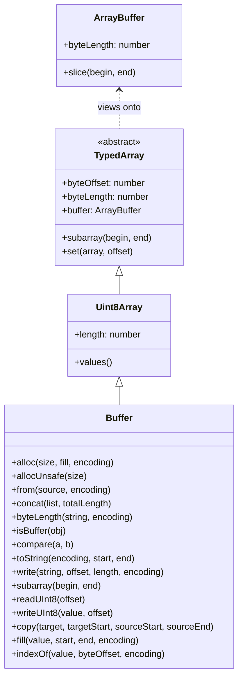
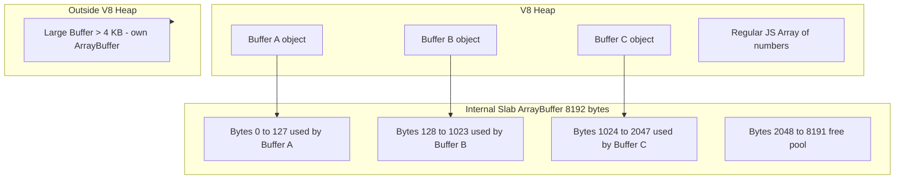

# 3.06 Buffers and Binary Data

## 1. Purpose

JavaScript, for the first twenty years of its life, had no native notion of binary data. The language was born in the browser, where the dominant data type was the string: a URL was a string, the DOM was a tree of strings, an HTTP form was a string of field names. When JavaScript needed to deal with bytes, it borrowed the trick it had for everything else — it encoded them as characters. A "binary" PNG became a string of `"%89PNG"` and developers squinted at it through `charCodeAt`. That was tolerable for a script that ran for half a second on a web page. It was intolerable for a server that had to read a 4 GB file off disk, hand it to a TCP socket, and move on.

Node.js was built to be that server. From its first release in 2009, Node needed a way to represent raw memory in JavaScript *without* copying it into a string, *without* round-tripping through Base64, *without* paying the per-byte tax of UTF-16 encoding (which is what V8 uses internally for ordinary strings). The Node authors could not wait for TC39 to design a proper binary type — that took until ES2015 with `TypedArray` and `ArrayBuffer`. So Ryan Dahl and the early Node team shipped their own answer: the `Buffer` class. Buffer was, and still is, the entry point for every byte that flows through Node's I/O surface. Every `fs.readFile` of a binary file returns one. Every TCP socket emits them in `'data'` events. Every `crypto.randomBytes` call produces one. Every HTTP body that the framework hands you is, under the hood, a stream of Buffers.

What is a Buffer, concretely? It is a fixed-length chunk of raw memory outside the V8 heap, exposed to JavaScript as a flat array of unsigned 8-bit integers. You index into it like an array (`buf[0]` returns a number between 0 and 255). You write to it like an array (`buf[0] = 0xff`). You ask for its length (`buf.length`). But unlike a regular JavaScript array, the elements are *not* boxed, *not* stored on the V8 heap, *not* subject to the hidden-class transitions that V8 uses for ordinary objects. The memory behind a Buffer is allocated by Node's C++ layer, owned by libuv or by the operating system directly, and the Buffer object you hold in JavaScript is merely a *view* onto that memory.

That "view" framing is the most important conceptual shift. The ES2015 spec introduced `ArrayBuffer` — a raw, fixed-length, byte-addressable block of memory — and a family of typed array views (`Uint8Array`, `Int32Array`, `Float64Array`, etc.) that interpret that memory through a particular numeric lens. Starting in Node 4 (2015), `Buffer` was reimplemented as a *subclass* of `Uint8Array`. Every Buffer is, today, a Uint8Array. Every Buffer has a `byteOffset`, a `byteLength`, and a backing `ArrayBuffer` accessible via `buf.buffer`. The Buffer class adds Node-specific conveniences — encoding helpers, `concat`, `from(string)`, `alloc`, `allocUnsafe` — on top of the Uint8Array foundation. That is why you can pass a Buffer to any browser-API function that expects a Uint8Array and it will work; the browser types only see the Uint8Array shape.

The two creation methods that everyone learns first are `Buffer.alloc(size)` and `Buffer.allocUnsafe(size)`. The difference is one word: *zeroing*. `Buffer.alloc(1024)` allocates 1024 bytes and writes a `0` into every one of them before handing them to you. `Buffer.allocUnsafe(1024)` allocates 1024 bytes and hands them to you *with whatever was already there*. The latter is faster because zeroing 1024 bytes is real work, and the operating system does not promise that the memory it hands you is clean. Sometimes it is (a fresh page from the OS is zeroed by the kernel as a security measure), sometimes it is not (Node maintains an internal pool of pre-allocated slabs and recycles them). The "unsafe" in the name refers to a single, specific risk: the memory you receive may contain data that a *previous* Buffer in your process wrote to it. If you allocate with `allocUnsafe` and then forget to overwrite some tail bytes, those bytes will quietly leak into whatever you ship downstream — a password from a previous request, an authentication token, a private key. This is the classic "Buffer leak" vulnerability that has bitten Node several times in its history (CVE-2015-8027, the 2015 leak of uninitialized memory across requests in Express-style middleware, the 2017 OpenSSL `Heartbleed`-style leaks).

So Buffer exists because I/O is bytes, JS strings are not bytes, and somebody had to bridge the gap. It is what it is — a Uint8Array with Node-specific helpers — because the language eventually caught up with what Node had been doing by hand. It is dangerous when used carelessly because the bytes it carries are real memory, and real memory remembers.

## 2. Theory and Deep Dive

### 2.1 The class hierarchy

`Buffer` extends `Uint8Array`. That is the single most important fact about the modern (post-Node-4) Buffer. The chain is:



What this buys you, the developer, is *interoperability*. You can pass a Buffer anywhere a `Uint8Array` is expected: Web Crypto, Web Streams, `fetch`'s `Response.arrayBuffer()`, third-party libraries that consume `Uint8Array`. You can also reach below the Buffer abstraction: `buf.buffer` gives you the underlying `ArrayBuffer`, and from there you can construct additional views (`new Int32Array(buf.buffer, buf.byteOffset, buf.byteLength / 4)`) that share the same memory. This is the basis of zero-copy parsing — read a Buffer off the network, then interpret the same memory as integers, floats, or characters without copying a single byte.

### 2.2 Memory layout

A Buffer does not own its memory in the way a JavaScript `Array` owns its slots. A Buffer *points to* memory. The memory lives in an `ArrayBuffer`, and one `ArrayBuffer` can host many Buffers at once. This is the *slab* allocation strategy Node uses internally:



When you call `Buffer.alloc(64)`, Node does not (necessarily) call out to the operating system for 64 bytes. It carves 64 bytes out of a shared 8 KB slab that Node pre-allocated the first time anyone asked for a small Buffer. The Buffer object on the V8 heap stores three pointers: which slab, where in the slab it starts, and how long it is. This makes small-Buffer allocation essentially free — the cost is one object on the V8 heap plus an offset bump in the slab. The trade-off is that *the slab itself is not garbage-collected until every Buffer pointing into it is gone*. If you allocate one tiny Buffer and keep it alive, the entire 8 KB slab stays alive, even though 8128 of those bytes are not yours. For long-running servers this matters: it is the source of "I have a tiny Buffer but my RSS is 8 KB higher than I expected" surprises.

Buffers larger than about 4 KB skip the slab entirely and get their own dedicated `ArrayBuffer`. This avoids the wasted-space problem but pays the full allocation cost. The exact threshold has changed across Node versions; today the slab size is `Buffer.poolSize` (8192 by default, configurable), and any allocation request larger than half the pool size goes direct.

### 2.3 The three creation pathways

There are three *families* of Buffer constructor. Every call to `Buffer.something` is one of these three.

**`Buffer.alloc(size, fill, encoding)`** is the safe path. It allocates `size` bytes, fills every byte with `fill` (default `0`), and returns the Buffer. The zeroing is mandatory for security: even when Node pulls a slab region that was previously used by another Buffer, `alloc` scrubs it before you see it. The cost is one memset, which is fast (modern CPUs can zero memory at tens of GB/s) but not free. If you are allocating a million small Buffers per second, the memsets add up. For most application code, `alloc` is what you want.

**`Buffer.allocUnsafe(size)`** is the fast path. It allocates `size` bytes and hands them to you unmodified. If the bytes came from a fresh OS page, they happen to be zero (the kernel zeroes pages before handing them to user space, as a defence-in-depth measure). If they came from a recycled slab region, they contain whatever the previous Buffer wrote there. The contract is: *you must overwrite every byte you intend to use*. If you intend to use the whole Buffer, you must overwrite the whole Buffer — not "the first N bytes" if N might be less than `size`. The classic bug is `const buf = Buffer.allocUnsafe(256); fs.readSync(fd, buf, 0, 64, 0); socket.write(buf);` — only 64 bytes were read into the first 64 slots, and the remaining 192 bytes are whatever the previous owner left there, now being shipped over the socket. This is how secrets leak.

There is also **`Buffer.allocUnsafeSlow(size)`**, which forces Node to allocate a fresh `ArrayBuffer` outside the slab, *without* zeroing. It is "slow" relative to `allocUnsafe` (no slab reuse) but "unsafe" in the same way (no zeroing). Use it when you want to avoid contaminating the slab, e.g., when you are going to hold this Buffer for a long time and don't want to keep the slab alive.

**`Buffer.from(...)`** is the wrap-or-copy path. It has five overloads:

1. `Buffer.from(string, encoding)` — encodes the string into bytes using the given encoding (default `'utf8'`). The result is a fresh Buffer; the string is consumed and discarded.
2. `Buffer.from(buffer)` — copies the contents of another Buffer into a new Buffer. The two Buffers do not share memory after this call.
3. `Buffer.from(arrayBuffer, byteOffset, length)` — *views* an existing `ArrayBuffer` without copying. The Buffer shares memory with the ArrayBuffer; mutating one mutates the other. This is the zero-copy bridge between Web APIs (which speak `ArrayBuffer`) and Node APIs (which speak `Buffer`).
4. `Buffer.from(typedArray)` — like the `arrayBuffer` form, but copies element-by-element preserving the numeric values. Slightly subtle: if you pass a `Uint16Array` of length 4, you get a `Buffer` of length 4 (not 8) where each byte holds the low 8 bits of each input element. The Buffer does not view the typed array's memory.
5. `Buffer.from(array)` — copies the numeric values from a plain array. Each value is masked to `0xff`.

The single most confusing overload is (3). Developers expect `Buffer.from(someArrayBuffer)` to copy; it does not. It views. If you want a copy, you must explicitly `Buffer.from(arrayBuffer).slice()` — wait, no, `slice` shares memory too — you must explicitly `Buffer.from(arrayBuffer.slice())`, where `arrayBuffer.slice()` is the ArrayBuffer method that *does* copy. The full chain is documented but easy to get wrong.

### 2.4 Encodings

An encoding is a bidirectional mapping between bytes and strings. Node supports seven that matter for everyday work:

| Encoding | Bytes per char | Notes |
|---|---|---|
| `utf8` (also `utf-8`) | 1 to 4 | The default. Variable-width. ASCII-compatible. The encoding of the modern web. |
| `utf16le` | 2 to 4 | Little-endian UTF-16. This is essentially what V8 stores ordinary strings as internally, so conversion is nearly free. |
| `latin1` | 1 | One byte per char. Maps each byte directly to a Unicode code point in 0 to 255 (ISO-8859-1). Useful for legacy binary-as-string hacks. |
| `ascii` | 1 | Like `latin1` but only the low 7 bits are used; the high bit is discarded on write. Legacy. |
| `base64` | 4 in to 3 out | Standard Base64 (RFC 4648). Encodes every 3 bytes as 4 ASCII characters. Pads with `=`. |
| `base64url` | 4 in to 3 out | URL-safe Base64. Uses hyphen and underscore characters instead of plus and slash, no padding. For JWTs, data URLs, query params. |
| `hex` | 2 out to 1 in | Two ASCII characters per byte (`0`-`9`, `a`-`f`). Lowercase. |

The default encoding everywhere in Node is `'utf8'`. If you call `Buffer.from('hello')` with no second argument, you get UTF-8 bytes. If you call `buf.toString()` with no argument, you get UTF-8 decoding. This is *not* the same as the encoding JavaScript uses internally for strings (UTF-16) or the encoding your terminal uses (probably UTF-8, but maybe Windows-1252 on older Windows). The conversion happens at the Buffer boundary.

UTF-8's variable width is the source of two surprises. First, `Buffer.byteLength('é', 'utf8')` is `2`, not `1` — `é` is U+00E9, which UTF-8 encodes as the two bytes `0xc3 0xa9`. Second, `Buffer.byteLength(str)` is not equal to `str.length` for any string containing non-ASCII characters. If you are writing a network protocol that prepends a length header, you must use `Buffer.byteLength`, never `str.length`, or your framing will be wrong.

### 2.5 Reading and writing integers

Buffers expose a large family of methods for reading and writing fixed-width integers: `readUInt8`, `readInt8`, `readUInt16BE`, `readUInt16LE`, `readInt32BE`, `readInt32LE`, `readBigUInt64LE`, and so on through every width from 1 to 8 bytes and both endiannesses. The `BE` suffix means big-endian (network byte order, most significant byte first); `LE` means little-endian (x86 native, least significant byte first). TCP/IP specifies big-endian for protocol headers, so `BE` is what you reach for when parsing DNS, TLS, HTTP/2, etc. File formats vary: PNG is big-endian, WAV is little-endian.

These methods are convenient but they have a cost: each call goes through the V8 inline cache, and each method is a separate function on the Buffer prototype. For high-throughput parsing (parsing hundreds of thousands of packets per second), the faster approach is to drop down to `DataView`, which is a single object with `getUint8`, `getUint16(offset, littleEndian)`, etc. — one method that takes an endianness flag, no separate `BE`/`LE` variants. `DataView` is also the only choice when you need to *mix* endiannesses within one structure (some protocols do this).

### 2.6 slice vs subarray

`buf.slice(start, end)` and `buf.subarray(start, end)` both return a new Buffer that *shares* memory with the original. Neither copies. The difference is historical: `slice` was Node's original (pre-ES2015) name, and it had a bug — passing out-of-range arguments would silently clamp, but the spec for `Uint8Array.prototype.subarray` was different. Node 6 (2016) deprecated `slice` in favor of `subarray` to align with the spec. `slice` is still available, still works, still shares memory, but it prints a deprecation warning under some flags and is considered harmful. The recommendation is universal: use `subarray`.

The "shares memory" behaviour is the second most common Buffer footgun (after `allocUnsafe`). The pattern that bites:

```javascript
// JS
const original = Buffer.from('hello world', 'utf8');
const sub = original.subarray(0, 5); // 'hello'
original[0] = 0x48;                  // 'H'
console.log(sub.toString('utf8'));   // 'Hello' — sub sees the change!
```

If you want a *copy*, you must say so explicitly: `Buffer.from(original.subarray(0, 5))` (which copies), or `original.subarray(0, 5).slice()` (also copies, since `slice` with no args on a Buffer returns a copy — yes, this is confusing), or the unambiguous `Buffer.alloc(5); original.copy(target, 0, 0, 5)`.

### 2.7 concat

`Buffer.concat([bufA, bufB, bufC], totalLength)` joins multiple Buffers into one. It allocates a single new Buffer of size `totalLength` (or, if omitted, the sum of the inputs' lengths) and copies each input in. It is the canonical way to assemble a message from chunks. The cost is one allocation plus `totalLength` bytes of memcpy; for most workloads this is fine. The pathological case is *thousands* of tiny Buffers concatenated in a loop — each `concat` allocates and copies, and the total work is quadratic. The fix is to collect chunks in an array and call `Buffer.concat` once at the end, not to call it inside a loop.

### 2.8 byteLength and isBuffer

`Buffer.byteLength(string, encoding)` returns the number of bytes a string would occupy if encoded with the given encoding. This is *not* the same as `string.length` for non-ASCII inputs. Use it whenever you need to pre-allocate a Buffer for a string you are about to write.

`Buffer.isBuffer(obj)` is the duck-type check for "is this a Buffer?" — useful when a function accepts either a string or a Buffer and needs to branch. It is preferred over `instanceof Buffer` because it works across Buffer classes from different Node realms (e.g., when an object is passed through a worker thread boundary).

## 3. Mental Models

Five short sentences capture most of what you need to keep in your head:

1. **Buffer = a fixed-length array of bytes, raw memory.** It is not a string and not a JS array. It is a window into RAM. The window has a length set at creation; you cannot grow it (you can only allocate a new one and copy).
2. **`alloc` = "give me clean memory."** Every byte is zero before you see it. Safe by default. Pay one memset.
3. **`allocUnsafe` = "give me memory fast, I'll fill it."** Every byte is whatever was there. Fast. Dangerous if you forget to overwrite.
4. **`from` = "wrap existing data as a Buffer."** Strings get encoded; arrays and Buffers get copied; ArrayBuffers get viewed. The five overloads do five different things — know which one you are calling.
5. **Encoding = "how to translate between bytes and strings."** A Buffer has no encoding. The encoding is a parameter you pass *to* `toString` and `from(string)`. The same bytes can be interpreted as UTF-8, as Latin1, or as Hex — they produce different strings.

A sixth, subtler model: **Buffers are views, not boxes.** A Buffer points at memory; it does not own it. Two Buffers can point at the same memory. Mutating one mutates the other. Freeing one does not free the memory if another still points at it. This is the same mental model you need for `Uint8Array` and `ArrayBuffer` in the browser; Buffer is the Node flavour of the same idea.

A seventh, for I/O: **Buffers are the currency of Node streams.** Every chunk that flows through a `Readable` is (by default) a Buffer. Every chunk you push into a `Writable` can be a Buffer (or a string, which gets encoded internally). When you think "data flowing through my program," think "Buffers flowing through my program."

## 4. Real-World Use Cases

### 4.1 File I/O

The most common use. `fs.readFile('image.png')` (no `encoding` argument) returns a Buffer containing the raw file bytes. `fs.writeFile('out.bin', buf)` writes a Buffer directly. `fs.createReadStream('big.mp4')` emits `'data'` events with Buffer chunks. Without Buffer, Node would have to either store the entire file as a string (with the encoding ambiguity that implies) or expose the C++ file handle directly (which JavaScript cannot usefully manipulate). Buffer is the bridge.

### 4.2 Network I/O

TCP sockets emit Buffers in `'data'` events. HTTP request bodies — when not aggregated by a framework — arrive as a stream of Buffers. UDP datagrams are Buffers. WebSocket binary frames are Buffers. TLS handshake records are Buffers that get decrypted into other Buffers. The entire networking stack is Buffer in, Buffer out.

### 4.3 Streams

Streams are covered in detail in [[3.07 Streams Fundamentals]] and [[3.08 Streams Advanced Backpressure]], but the short version: a Node stream is an EventEmitter that produces or consumes chunks. The default chunk type for binary streams is Buffer. The default chunk type for object streams is whatever JavaScript object you push. Most file and socket streams are binary, so most chunks are Buffers.

### 4.4 Crypto

`crypto.randomBytes(16)` returns a Buffer of cryptographically strong random bytes. `crypto.createHash('sha256').update(buf).digest()` produces a Buffer digest. `crypto.createCipheriv('aes-256-gcm', key, iv).update(buf)` consumes Buffers and produces Buffers. The entire `crypto` module is Buffer-native.

### 4.5 Image processing

`sharp`, `jimp`, `canvas`, and friends all consume Buffers (or produce them). An image loaded from disk is a Buffer; it gets decoded into pixel arrays for manipulation, then re-encoded into a Buffer for output. The Buffer is the on-disk wire format; the pixel array is the in-memory working format.

### 4.6 WebSocket binary frames

The browser `WebSocket` API can send and receive either strings (text frames) or `ArrayBuffer`/`Blob` (binary frames). Node's `ws` library exposes binary frames as Buffers. This is the most common way to push binary data — images, audio, video chunks, protocol messages — from a server to a browser.

### 4.7 Protocol parsing

DNS messages, MQTT packets, Thrift/Protobuf frames, gRPC length-prefixed messages, TLS records, HTTP/2 frames, ICMP packets — every binary wire format is, at the bottom, a sequence of bytes that needs to be read with attention to width, endianness, and bit-packing. Buffer's `readUInt16BE`, `readInt32LE`, and friends are the tools you reach for. For mixed-endian or bit-packed structures, `DataView` on the Buffer's underlying `ArrayBuffer` is the right tool.

### 4.8 Database drivers

`pg`, `mysql2`, `mongodb`, and `redis` all use Buffers for BLOB columns, binary UUIDs, geometry data, and large result streaming. A BLOB in PostgreSQL comes back as a Buffer; you write a Buffer back.

### 4.9 Worker thread message passing

The Node Worker Threads module can transfer (not copy) an ArrayBuffer between threads via the `transferList` argument of `postMessage`. Since every Buffer is a view onto an ArrayBuffer, you can transfer the *backing* ArrayBuffer of a Buffer to another thread, after which the Buffer in the sending thread becomes detached and any access throws. This is the basis of zero-copy parallelism in Node, covered in [[3.18 Worker Threads]].

## 5. Code Examples

### 5.1 Example A — Minimal and Conceptual

This example walks through every Buffer creation pathway, every common encoding, and the basic read/write methods. Each snippet is shown side by side in JavaScript and TypeScript.

#### 5.1.1 Creating Buffers

```javascript
// JS
const { Buffer } = require('node:buffer');

// alloc: zero-filled, safe
const a = Buffer.alloc(8);
console.log(a);                          // <Buffer 00 00 00 00 00 00 00 00>

// alloc with fill
const b = Buffer.alloc(8, 0xff);
console.log(b);                          // <Buffer ff ff ff ff ff ff ff ff>

// allocUnsafe: not zeroed, fast
const c = Buffer.allocUnsafe(8);
console.log(c);                          // <Buffer ?? ?? ?? ?? ?? ?? ?? ??>

// from string, default UTF-8
const d = Buffer.from('hello');
console.log(d);                          // <Buffer 68 65 6c 6c 6f>

// from string, explicit encoding
const e = Buffer.from('hello', 'utf8');
const f = Buffer.from('hello', 'base64');
const g = Buffer.from('hello', 'hex');   // 'h' is not a hex digit -> treats as 0
console.log(e, f, g);

// from array of numbers
const h = Buffer.from([0x48, 0x65, 0x6c, 0x6c, 0x6f]);
console.log(h.toString('utf8'));         // 'Hello'

// from another Buffer (copy)
const i = Buffer.from(h);
i[0] = 0x68;                            // 'h'
console.log(h.toString('utf8'));         // 'Hello' - h unchanged, i is independent

// from ArrayBuffer (view - shares memory)
const ab = new ArrayBuffer(8);
const view = new Uint8Array(ab);
view[0] = 42;
const j = Buffer.from(ab, 0, 8);
console.log(j[0]);                       // 42
j[0] = 99;
console.log(view[0]);                    // 99 - mutation flows through

// from typed array (copies values)
const u16 = new Uint16Array([0x0102, 0x0304]);
const k = Buffer.from(u16);
console.log(k);                          // <Buffer 02 04> (low 8 bits of each)
```

```typescript
// TS
import { Buffer } from 'node:buffer';

// alloc: zero-filled, safe
const a: Buffer = Buffer.alloc(8);
console.log(a);                          // <Buffer 00 00 00 00 00 00 00 00>

// alloc with fill
const b: Buffer = Buffer.alloc(8, 0xff);
console.log(b);                          // <Buffer ff ff ff ff ff ff ff ff>

// allocUnsafe: not zeroed, fast
const c: Buffer = Buffer.allocUnsafe(8);
console.log(c);                          // <Buffer ?? ?? ?? ?? ?? ?? ?? ??>

// from string, default UTF-8
const d: Buffer = Buffer.from('hello');
console.log(d);                          // <Buffer 68 65 6c 6c 6f>

// from string, explicit encoding
type Encoding = 'utf8' | 'utf16le' | 'latin1' | 'ascii' | 'base64' | 'base64url' | 'hex';
const encodings: Encoding[] = ['utf8', 'base64', 'hex'];
for (const enc of encodings) {
  const buf: Buffer = Buffer.from('hello', enc);
  console.log(enc, buf);
}

// from array of numbers
const h: Buffer = Buffer.from([0x48, 0x65, 0x6c, 0x6c, 0x6f]);
console.log(h.toString('utf8'));         // 'Hello'

// from another Buffer (copy)
const i: Buffer = Buffer.from(h);
i[0] = 0x68;
console.log(h.toString('utf8'));         // 'Hello'

// from ArrayBuffer (view - shares memory)
const ab: ArrayBuffer = new ArrayBuffer(8);
const view: Uint8Array = new Uint8Array(ab);
view[0] = 42;
const j: Buffer = Buffer.from(ab, 0, 8);
console.log(j[0]);                       // 42
j[0] = 99;
console.log(view[0]);                    // 99

// from typed array (copies values)
const u16: Uint16Array = new Uint16Array([0x0102, 0x0304]);
const k: Buffer = Buffer.from(u16);
console.log(k);                          // <Buffer 02 04>
```

#### 5.1.2 Encoding round-trips

```javascript
// JS
const { Buffer } = require('node:buffer');

const text = 'Héllo, 世界!';

const utf8 = Buffer.from(text, 'utf8');
const utf16le = Buffer.from(text, 'utf16le');
const latin1 = Buffer.from(text, 'latin1'); // lossy for non-Latin1 chars
const base64 = Buffer.from(text, 'utf8').toString('base64');
const base64url = Buffer.from(text, 'utf8').toString('base64url');
const hex = Buffer.from(text, 'utf8').toString('hex');

console.log('byteLength utf8   :', Buffer.byteLength(text, 'utf8'));
console.log('byteLength utf16le:', Buffer.byteLength(text, 'utf16le'));
console.log('string length     :', text.length);
console.log('utf8 buffer       :', utf8);
console.log('utf16le buffer    :', utf16le);
console.log('latin1 buffer     :', latin1);
console.log('base64            :', base64);
console.log('base64url         :', base64url);
console.log('hex               :', hex);

// Round-trip back to the original string
const fromBase64 = Buffer.from(base64, 'base64').toString('utf8');
const fromHex = Buffer.from(hex, 'hex').toString('utf8');
console.log('from base64 ==    :', fromBase64 === text); // true
console.log('from hex ==       :', fromHex === text);    // true

// Latin1 round-trip is lossy for non-Latin1 characters
const fromLatin1 = latin1.toString('latin1');
console.log('from latin1 ==    :', fromLatin1 === text); // false
```

```typescript
// TS
import { Buffer } from 'node:buffer';

const text: string = 'Héllo, 世界!';

const utf8: Buffer = Buffer.from(text, 'utf8');
const utf16le: Buffer = Buffer.from(text, 'utf16le');
const latin1: Buffer = Buffer.from(text, 'latin1');
const base64: string = Buffer.from(text, 'utf8').toString('base64');
const base64url: string = Buffer.from(text, 'utf8').toString('base64url');
const hex: string = Buffer.from(text, 'utf8').toString('hex');

console.log('byteLength utf8   :', Buffer.byteLength(text, 'utf8'));
console.log('byteLength utf16le:', Buffer.byteLength(text, 'utf16le'));
console.log('string length     :', text.length);
console.log('utf8 buffer       :', utf8);
console.log('utf16le buffer    :', utf16le);
console.log('latin1 buffer     :', latin1);
console.log('base64            :', base64);
console.log('base64url         :', base64url);
console.log('hex               :', hex);

const fromBase64: string = Buffer.from(base64, 'base64').toString('utf8');
const fromHex: string = Buffer.from(hex, 'hex').toString('utf8');
console.log('from base64 ==    :', fromBase64 === text);
console.log('from hex ==       :', fromHex === text);

const fromLatin1: string = latin1.toString('latin1');
console.log('from latin1 ==    :', fromLatin1 === text);
```

#### 5.1.3 Reading and writing integers

```javascript
// JS
const { Buffer } = require('node:buffer');

const buf = Buffer.alloc(16);

// 8-bit
buf.writeUInt8(0x42, 0);
console.log(buf.readUInt8(0));            // 66

// 16-bit big-endian (network order)
buf.writeUInt16BE(0x1234, 1);
console.log(buf.readUInt16BE(1));         // 4660

// 16-bit little-endian
buf.writeUInt16LE(0x1234, 3);
console.log(buf.readUInt16LE(3));         // 4660
console.log(buf);                         // <Buffer 42 12 34 34 12 ...>

// 32-bit signed big-endian
buf.writeInt32BE(-1, 5);
console.log(buf.readInt32BE(5));          // -1

// 64-bit unsigned, big-endian, via BigInt
buf.writeBigUInt64BE(2n ** 63n, 9);
console.log(buf.readBigUInt64BE(9));      // 9223372036854775808n

// Using DataView for mixed endianness in one structure
const dv = new DataView(buf.buffer, buf.byteOffset, buf.byteLength);
dv.setFloat32(0, Math.PI, false);         // big-endian
console.log(dv.getFloat32(0, false));     // 3.141592653589793
dv.setFloat32(0, Math.PI, true);          // little-endian
console.log(dv.getFloat32(0, true));      // 3.141592653589793
console.log(buf.subarray(0, 4));          // different bytes for the two endiannesses
```

```typescript
// TS
import { Buffer } from 'node:buffer';

const buf: Buffer = Buffer.alloc(16);

buf.writeUInt8(0x42, 0);
console.log(buf.readUInt8(0));            // 66

buf.writeUInt16BE(0x1234, 1);
console.log(buf.readUInt16BE(1));         // 4660

buf.writeUInt16LE(0x1234, 3);
console.log(buf.readUInt16LE(3));         // 4660
console.log(buf);

buf.writeInt32BE(-1, 5);
console.log(buf.readInt32BE(5));          // -1

buf.writeBigUInt64BE(2n ** 63n, 9);
console.log(buf.readBigUInt64BE(9));      // 9223372036854775808n

const dv: DataView = new DataView(buf.buffer, buf.byteOffset, buf.byteLength);
dv.setFloat32(0, Math.PI, false);
console.log(dv.getFloat32(0, false));
dv.setFloat32(0, Math.PI, true);
console.log(dv.getFloat32(0, true));
console.log(buf.subarray(0, 4));
```

#### 5.1.4 subarray and concat

```javascript
// JS
const { Buffer } = require('node:buffer');

const original = Buffer.from('Hello, World!', 'utf8');
const hello = original.subarray(0, 5); // shares memory
console.log(hello.toString('utf8'));     // 'Hello'

original[0] = 0x68;                      // lowercase the H
console.log(hello.toString('utf8'));     // 'hello' - sub sees the change

// To get a real copy, allocate and copy
const copy = Buffer.allocUnsafe(5);
original.copy(copy, 0, 0, 5);
original[0] = 0x48;                      // restore H
console.log(copy.toString('utf8'));      // 'hello' - copy unchanged

// concat
const parts = [
  Buffer.from('Hello', 'utf8'),
  Buffer.from(', ', 'utf8'),
  Buffer.from('World', 'utf8'),
  Buffer.from('!', 'utf8'),
];
const joined = Buffer.concat(parts);
console.log(joined.toString('utf8'));    // 'Hello, World!'

// concat with explicit total length (avoids one pass to compute)
const total = parts.reduce((sum, b) => sum + b.length, 0);
const joined2 = Buffer.concat(parts, total);
console.log(joined2.toString('utf8'));   // 'Hello, World!'
```

```typescript
// TS
import { Buffer } from 'node:buffer';

const original: Buffer = Buffer.from('Hello, World!', 'utf8');
const hello: Buffer = original.subarray(0, 5);
console.log(hello.toString('utf8'));

original[0] = 0x68;
console.log(hello.toString('utf8'));

const copy: Buffer = Buffer.allocUnsafe(5);
original.copy(copy, 0, 0, 5);
original[0] = 0x48;
console.log(copy.toString('utf8'));

const parts: Buffer[] = [
  Buffer.from('Hello', 'utf8'),
  Buffer.from(', ', 'utf8'),
  Buffer.from('World', 'utf8'),
  Buffer.from('!', 'utf8'),
];
const joined: Buffer = Buffer.concat(parts);
console.log(joined.toString('utf8'));

const total: number = parts.reduce((sum: number, b: Buffer) => sum + b.length, 0);
const joined2: Buffer = Buffer.concat(parts, total);
console.log(joined2.toString('utf8'));
```

### 5.2 Example B — Production-Grade Typed Binary Protocol Parser

The following example implements a small binary protocol with three message types: `LOGIN`, `DATA`, and `PING`. The wire format is:

| Offset | Size | Field |
|---|---|---|
| 0 | 1 | Magic byte `0x55` |
| 1 | 1 | Message type (0=LOGIN, 1=DATA, 2=PING) |
| 2 | 4 | Payload length (big-endian uint32) |
| 6 | N | Payload bytes |

For `LOGIN`, the payload is a UTF-8 username and a UTF-8 password separated by a `0x00` byte. For `DATA`, the payload is an opaque blob. For `PING`, the payload is empty and the response should be a `PONG` (type 3).

```javascript
// JS
const { Buffer } = require('node:buffer');

const MAGIC = 0x55;
const headerSize = 6;
const TYPE = { LOGIN: 0, DATA: 1, PING: 2, PONG: 3 };

function encodeLogin(user, pass) {
  const userBuf = Buffer.from(user, 'utf8');
  const passBuf = Buffer.from(pass, 'utf8');
  const sep = Buffer.from([0x00]);
  const payload = Buffer.concat([userBuf, sep, passBuf]);
  return frame(TYPE.LOGIN, payload);
}

function encodeData(blob) {
  const payload = Buffer.isBuffer(blob) ? blob : Buffer.from(blob);
  return frame(TYPE.DATA, payload);
}

function encodePing() {
  return frame(TYPE.PING, Buffer.alloc(0));
}

function encodePong() {
  return frame(TYPE.PONG, Buffer.alloc(0));
}

function frame(type, payload) {
  if (payload.length > 0xffffffff) {
    throw new Error('Payload too large');
  }
  const out = Buffer.allocUnsafe(headerSize + payload.length);
  out[0] = MAGIC;
  out[1] = type;
  out.writeUInt32BE(payload.length, 2);
  payload.copy(out, headerSize);
  return out;
}

function parse(buf) {
  if (buf.length < headerSize) {
    throw new Error('Header truncated');
  }
  const magic = buf.readUInt8(0);
  if (magic !== MAGIC) {
    throw new Error(`Bad magic byte: 0x${magic.toString(16)}`);
  }
  const type = buf.readUInt8(1);
  const payloadLength = buf.readUInt32BE(2);
  if (buf.length < headerSize + payloadLength) {
    throw new Error('Payload truncated');
  }
  const payload = buf.subarray(headerSize, headerSize + payloadLength);
  switch (type) {
    case TYPE.LOGIN: {
      const sep = payload.indexOf(0x00);
      if (sep < 0) throw new Error('LOGIN payload missing separator');
      const user = payload.subarray(0, sep).toString('utf8');
      const pass = payload.subarray(sep + 1).toString('utf8');
      return { type: 'LOGIN', user, pass };
    }
    case TYPE.DATA:
      return { type: 'DATA', blob: Buffer.from(payload) };
    case TYPE.PING:
      return { type: 'PING' };
    case TYPE.PONG:
      return { type: 'PONG' };
    default:
      throw new Error(`Unknown message type: ${type}`);
  }
}

// Demo
const wire = encodeLogin('alice', 's3cret');
console.log('wire bytes:', wire);
const msg = parse(wire);
console.log('parsed:', msg);

// Stream-style: parse multiple messages from one buffer
function* parseStream(buf) {
  let offset = 0;
  while (offset < buf.length) {
    if (buf.length - offset < headerSize) {
      yield { error: 'need more bytes', remaining: buf.length - offset };
      return;
    }
    const len = buf.readUInt32BE(offset + 2);
    const end = offset + headerSize + len;
    if (buf.length < end) {
      yield { error: 'need more bytes', remaining: buf.length - offset };
      return;
    }
    yield parse(buf.subarray(offset, end));
    offset = end;
  }
}

const batch = Buffer.concat([
  encodePing(),
  encodeData('hello'),
  encodePing(),
]);
for (const m of parseStream(batch)) {
  console.log('stream message:', m);
}
```

```typescript
// TS
import { Buffer } from 'node:buffer';

const MAGIC = 0x55 as const;
const headerSize = 6 as const;

enum MessageType {
  LOGIN = 0,
  DATA = 1,
  PING = 2,
  PONG = 3,
}

type LoginMessage = {
  type: 'LOGIN';
  user: string;
  pass: string;
};
type DataMessage = {
  type: 'DATA';
  blob: Buffer;
};
type PingMessage = { type: 'PING' };
type PongMessage = { type: 'PONG' };
type ProtocolMessage = LoginMessage | DataMessage | PingMessage | PongMessage;

type ParseError = { error: 'need more bytes'; remaining: number };
type StreamItem = ProtocolMessage | ParseError;

function encodeLogin(user: string, pass: string): Buffer {
  const userBuf: Buffer = Buffer.from(user, 'utf8');
  const passBuf: Buffer = Buffer.from(pass, 'utf8');
  const sep: Buffer = Buffer.from([0x00]);
  const payload: Buffer = Buffer.concat([userBuf, sep, passBuf]);
  return frame(MessageType.LOGIN, payload);
}

function encodeData(blob: Buffer | string): Buffer {
  const payload: Buffer = Buffer.isBuffer(blob) ? blob : Buffer.from(blob);
  return frame(MessageType.DATA, payload);
}

function encodePing(): Buffer {
  return frame(MessageType.PING, Buffer.alloc(0));
}

function encodePong(): Buffer {
  return frame(MessageType.PONG, Buffer.alloc(0));
}

function frame(type: MessageType, payload: Buffer): Buffer {
  if (payload.length > 0xffffffff) {
    throw new Error('Payload too large');
  }
  const out: Buffer = Buffer.allocUnsafe(headerSize + payload.length);
  out[0] = MAGIC;
  out[1] = type;
  out.writeUInt32BE(payload.length, 2);
  payload.copy(out, headerSize);
  return out;
}

function parse(buf: Buffer): ProtocolMessage {
  if (buf.length < headerSize) {
    throw new Error('Header truncated');
  }
  const magic: number = buf.readUInt8(0);
  if (magic !== MAGIC) {
    throw new Error(`Bad magic byte: 0x${magic.toString(16)}`);
  }
  const type: number = buf.readUInt8(1);
  const payloadLength: number = buf.readUInt32BE(2);
  if (buf.length < headerSize + payloadLength) {
    throw new Error('Payload truncated');
  }
  const payload: Buffer = buf.subarray(headerSize, headerSize + payloadLength);
  switch (type) {
    case MessageType.LOGIN: {
      const sep: number = payload.indexOf(0x00);
      if (sep < 0) throw new Error('LOGIN payload missing separator');
      const user: string = payload.subarray(0, sep).toString('utf8');
      const pass: string = payload.subarray(sep + 1).toString('utf8');
      return { type: 'LOGIN', user, pass };
    }
    case MessageType.DATA:
      return { type: 'DATA', blob: Buffer.from(payload) };
    case MessageType.PING:
      return { type: 'PING' };
    case MessageType.PONG:
      return { type: 'PONG' };
    default:
      throw new Error(`Unknown message type: ${type}`);
  }
}

const wire: Buffer = encodeLogin('alice', 's3cret');
console.log('wire bytes:', wire);
const msg: ProtocolMessage = parse(wire);
console.log('parsed:', msg);

function* parseStream(buf: Buffer): Generator<StreamItem, void, undefined> {
  let offset: number = 0;
  while (offset < buf.length) {
    if (buf.length - offset < headerSize) {
      yield { error: 'need more bytes', remaining: buf.length - offset };
      return;
    }
    const len: number = buf.readUInt32BE(offset + 2);
    const end: number = offset + headerSize + len;
    if (buf.length < end) {
      yield { error: 'need more bytes', remaining: buf.length - offset };
      return;
    }
    yield parse(buf.subarray(offset, end));
    offset = end;
  }
}

const batch: Buffer = Buffer.concat([
  encodePing(),
  encodeData('hello'),
  encodePing(),
]);
for (const m of parseStream(batch)) {
  console.log('stream message:', m);
}
```

This parser is deliberately idiomatic: it uses `allocUnsafe` for the encode path (because `payload.copy` then overwrites every byte), `subarray` for zero-copy slicing during parse, `Buffer.concat` for assembling payloads, and a generator for the stream variant so the caller can drive it from a TCP `'data'` event without buffering the entire stream in memory. The TypeScript version adds a discriminated union (`ProtocolMessage`) that makes every parsed message type-safe — you cannot access `msg.user` on a `PING` without the compiler complaining.

## 6. Common Mistakes and Anti-Patterns

### 6.1 Using `allocUnsafe` for sensitive data

The classic. You write `const token = Buffer.allocUnsafe(32); crypto.randomFillSync(token);` and ship `token` over the wire. Looks fine — `randomFillSync` overwrites all 32 bytes. The bug is more subtle: `allocUnsafe(32)` carved those 32 bytes out of a slab, and the slab region it carved may have *previously* held someone else's secret. You overwrite the 32 bytes, so no leak — *this time*. But if you ever write `const token = Buffer.allocUnsafe(64); crypto.randomFillSync(token.subarray(0, 32));` (only filling the first half), you ship 32 bytes of someone else's old data along with your 32 bytes of randomness. The rule: never use `allocUnsafe` unless you are about to overwrite *every byte*. For secrets, use `Buffer.alloc` — the memset is cheap insurance.

### 6.2 Trusting `buf.slice` to copy

`buf.slice` shares memory. `buf.subarray` shares memory. `Buffer.from(buf)` copies. The Node docs spell this out, but every developer gets bitten once. The fix is muscle memory: never reach for `slice` or `subarray` when you mean "give me an independent copy." Use `Buffer.from(buf.subarray(...))` or `buf.subarray(...).slice()` (where the latter's `slice` with no args is the ArrayBuffer-style copy, *not* the Buffer-style share — confusing but standard) or, most explicitly, `Buffer.alloc(n); src.copy(dst, 0, start, end)`.

### 6.3 Wrong encoding for binary-as-string

You read a file in Latin1 (because the file *is* bytes, not text, but you used `fs.readFile(path, 'latin1')` thinking it was the "binary" encoding) and then write it back. Round-trip works for bytes 0 to 255, but anything that compares the resulting string to a UTF-8 string will be wrong. The rule: if you want bytes, use Buffer (omit the `encoding` argument to `fs.readFile`). If you want text, use `'utf8'`. The legacy `'binary'` encoding is an alias for `'latin1'` and exists only for backwards compatibility; do not use it for new code.

### 6.4 `Buffer.from(arrayBuffer)` and being surprised it shares memory

`Buffer.from(someArrayBuffer)` *views* the ArrayBuffer. Mutating the Buffer mutates the ArrayBuffer, and vice versa. If you wanted a copy, you got a view; if you wanted a view, you might still be confused because you cannot tell from the call site which one you got. The defensive pattern is: if you want a view, use `Buffer.from(ab, byteOffset, length)` explicitly; if you want a copy, use `Buffer.from(ab.slice(byteOffset, byteOffset + length))`. The `ab.slice()` is the ArrayBuffer method that allocates a new ArrayBuffer with copied contents.

### 6.5 Modifying a Buffer view modifies the underlying ArrayBuffer

```javascript
// JS
const ab = new ArrayBuffer(8);
const buf = Buffer.from(ab);
const u32 = new Uint32Array(ab);
buf.writeUInt32LE(0x41424344, 0);
console.log(u32[0]);          // 0x44434241 - little-endian read of 'ABCD'
```

This is *the* point of typed array views, but it surprises developers who think `Buffer.from(ab)` "snapshots" the ArrayBuffer. It does not. It aliases it. The same surprise happens in reverse: you hold a Buffer view of an ArrayBuffer, then somewhere else you write to the ArrayBuffer via a different view, and your Buffer's contents change underneath you. The fix is the same as 6.4: copy if you need independence.

### 6.6 `Buffer.concat` in a loop

```javascript
// JS - BAD
let acc = Buffer.alloc(0);
for (const chunk of chunks) {
  acc = Buffer.concat([acc, chunk]); // O(n^2) total copies
}
```

Each iteration allocates a new Buffer of size `acc.length + chunk.length` and copies both into it. For N chunks of size S, the total work is roughly `N^2 * S / 2`. The fix is to collect chunks into an array and call `Buffer.concat` once:

```javascript
// JS - GOOD
const acc = Buffer.concat(chunks);
```

For the truly hot path where you cannot pre-collect, use a `PassThrough` stream (see [[3.07 Streams Fundamentals]]) or a growing Uint8Array pattern.

### 6.7 Forgetting that `Buffer.from(string)` defaults to UTF-8

`Buffer.from('café')` is 5 bytes, not 4. The `é` is two UTF-8 bytes (`0xc3 0xa9`). If you then write a length-prefixed header with `buf.writeUInt32BE(str.length, 0)`, you will be off by one and every downstream parser will desync. Always use `Buffer.byteLength(str)` for the byte count, never `str.length`.

### 6.8 Holding a small Buffer that pins a large slab

If you allocate a small Buffer (say, 16 bytes) from the slab, and then keep that Buffer alive for the lifetime of your process (e.g., as a cached key), the entire 8 KB slab stays alive too. This is rarely a problem in practice, but it can show up as a "why does my RSS never go down?" mystery. The fix is `Buffer.allocUnsafeSlow(16)` for the long-lived case — it allocates a fresh 16-byte ArrayBuffer instead of carving out of the slab.

### 6.9 Trusting `buf.length` to be the string length

`buf.length` is bytes. `str.length` is UTF-16 code units. For ASCII they are equal; for anything else they are not. Mixing them up in protocol headers, allocation sizes, or truncation logic is a constant source of bugs.

### 6.10 Using `Buffer` in browser code

Buffer is a Node global. Browsers do not have it. If you write a library that imports `Buffer` and runs in the browser, you either pull in the `buffer` polyfill (40 KB) or break. The modern alternative: write against `Uint8Array` directly, which is native to both Node and browsers, and only import `Buffer` from `node:buffer` at the edges (file I/O, network I/O). The TypeScript types for `Uint8Array` are a strict subset of `Buffer`, so a function that accepts `Uint8Array` accepts `Buffer` too.

## 7. Best Practices and Design Patterns

### 7.1 Default to `Buffer.alloc`

Use `Buffer.alloc(size)` for almost everything. The memset is fast and the safety is real. Reserve `allocUnsafe` for hot paths where you have measured the impact and you can prove every byte is overwritten before being read.

### 7.2 Use `subarray`, not `slice`

`subarray` is the spec-compliant, non-deprecated method. `slice` shares memory too but is on the deprecation path and may print warnings. Train your fingers to type `subarray`.

### 7.3 Specify encodings explicitly

`Buffer.from('hello')` works because UTF-8 is the default. But `Buffer.from('hello', 'utf8')` documents intent. In a code review, the explicit form answers "did the author think about encoding?" without requiring the reviewer to look it up.

### 7.4 Use `Buffer.concat` for joining, not loops

`Buffer.concat([a, b, c])` is one allocation and three memcpys. The loop alternative is N allocations and `N^2/2` memcpys. There is no case where the loop wins.

### 7.5 Prefer TypedArrays for type-safe binary data

`Uint8Array` for bytes, `Int32Array` for 32-bit signed integers, `Float64Array` for doubles, `BigInt64Array` for 64-bit ints. These are spec types, they work in browsers, and they document your intent. Reach for `Buffer` only when you need its extra methods (`toString`, `concat`, `from(string, encoding)`).

### 7.6 Use `DataView` for endian-aware reading

When a protocol mixes endianness, or when you want a single object that can read any width in either endianness, `DataView` is cleaner than the Buffer family of `readUInt16BE`/`readUInt16LE`/etc. methods. `const dv = new DataView(buf.buffer, buf.byteOffset, buf.byteLength); dv.getUint16(offset, true)` for little-endian, `dv.getUint16(offset, false)` for big-endian.

### 7.7 Don't use Buffer in browser code

Target `Uint8Array` at the library boundary; let Node code convert at the I/O edges. This keeps your bundle small and your code portable.

### 7.8 Zero-copy where you can

`subarray`, `Buffer.from(arrayBuffer)`, and `Buffer.concat` (which still copies once but does not pre-encode) are the zero-copy primitives. Prefer them over `slice`+copy when the lifetime of the source is longer than the lifetime of the consumer. Be careful: zero-copy means the consumer can mutate the producer's data. Only use zero-copy when both sides agree not to mutate, or when you can prove the source is no longer used after the view is created.

### 7.9 Pre-allocate and reuse for hot paths

For a TCP server that parses millions of small messages, allocating a Buffer per message is wasteful. Pre-allocate a pool of Buffers and reuse them. The pattern is essentially what Node does internally with slabs; you can do the same at the application layer for message-sized buffers.

### 7.10 Use `Buffer.from(buf)` for copies, `Buffer.from(ab)` for views

Make the intent explicit in code reviews. If you see `Buffer.from(x)` and `x` is an `ArrayBuffer`, ask: "did the author mean to view, or to copy?" If `x` is a `Buffer`, the copy is intentional. The two overloads look identical at the call site but behave differently.

### 7.11 Always pass `totalLength` to `concat` when known

`Buffer.concat(list)` without a second argument walks the list to compute the total length. `Buffer.concat(list, total)` skips that walk. For hot paths where you know the total, pass it.

### 7.12 Don't read or write past the end

Buffer methods like `readUInt32BE(offset)` do bounds-check and throw `RangeError` if `offset + 4 > buf.length`. That throw can be expensive in hot paths. Either pre-validate the length once (the parser pattern in 5.2 does this) or accept the throw and handle it.

## 8. Technical Interview Knowledge

### Q1: What is a Buffer?

A Buffer is a fixed-length, byte-addressable chunk of raw memory allocated outside the V8 heap and exposed to JavaScript as a subclass of `Uint8Array`. It is the primary data type for binary I/O in Node.js — every byte that flows through `fs`, `net`, `http`, `crypto`, and `stream` is, at some point, a Buffer. Unlike a JavaScript string (which is UTF-16 and immutable), a Buffer is mutable, has a fixed byte length, and can hold any byte value including the `0x00` byte that breaks C-style strings.

### Q2: What is the difference between `Buffer.alloc` and `Buffer.allocUnsafe`?

`Buffer.alloc(size, fill)` allocates `size` bytes and writes `fill` (default `0`) into every byte before returning. It is safe — the bytes you receive are guaranteed to be `fill`, never stale data from a previous Buffer. `Buffer.allocUnsafe(size)` allocates `size` bytes without zeroing. The bytes you receive may contain whatever the previous owner of that slab region wrote there. `allocUnsafe` is faster (skips one memset) but creates a security risk if any of the uninitialised bytes are not subsequently overwritten before being read or sent over the network. The default for all application code should be `alloc`; `allocUnsafe` is reserved for hot paths where the developer can prove every byte is overwritten.

### Q3: What is the relationship between Buffer and `Uint8Array`?

Since Node 4 (2015), `Buffer` is a subclass of `Uint8Array`. Every Buffer *is* a Uint8Array — it has `byteOffset`, `byteLength`, and `buffer` properties inherited from the TypedArray contract. The Buffer class adds Node-specific conveniences on top: `alloc`, `allocUnsafe`, `from(string, encoding)`, `concat`, `toString`, `write`, the `readUInt*`/`writeUInt*` family, and so on. You can pass a Buffer anywhere a `Uint8Array` is expected (Web Crypto, fetch, third-party libraries) without conversion. Conversely, you can wrap a `Uint8Array`'s buffer as a Buffer via `Buffer.from(uint8.buffer, uint8.byteOffset, uint8.byteLength)` when you need Buffer's methods.

### Q4: How do you convert between a Buffer and a string?

Buffer to string: `buf.toString(encoding, start, end)` where `encoding` defaults to `'utf8'`. String to Buffer: `Buffer.from(str, encoding)` where `encoding` defaults to `'utf8'`. The same bytes produce different strings under different encodings: the buffer `<Buffer 48 65 6c 6c 6f>` is `'Hello'` in UTF-8, `'Hello'` in Latin1, `'SGVsbG8='` in Base64, and `'48656c6c6f'` in Hex. For length calculations, use `Buffer.byteLength(str, encoding)`, never `str.length`, because non-ASCII characters occupy more than one UTF-8 byte.

### Q5: What is the difference between `buf.slice` and `buf.subarray`?

Both return a new Buffer that *shares* memory with the original — neither copies. `slice` is the older Node-specific method, predating the ES2015 TypedArray standardisation. `subarray` is the spec-compliant method inherited from `Uint8Array`. The two have slightly different argument-clamping behaviour for out-of-range indices. `slice` is deprecated; `subarray` is the recommended method. If you need an independent copy, use `Buffer.from(buf.subarray(...))` or `Buffer.alloc(n); src.copy(dst, 0, start, end)`.

### Q6: How do you read a multi-byte integer from a Buffer?

Use the typed read methods: `buf.readUInt16BE(offset)`, `buf.readInt32LE(offset)`, `buf.readBigUInt64BE(offset)`, etc. The `BE` suffix is big-endian (network byte order, most significant byte first); `LE` is little-endian (x86 native). For mixed-endian structures, or when you want a single object that can read any width, use `DataView`: `const dv = new DataView(buf.buffer, buf.byteOffset, buf.byteLength); const v = dv.getUint16(offset, littleEndianFlag);`. DataView is also faster than the Buffer family for tight parsing loops because it avoids per-method inline cache misses.

### Q7: Why is `allocUnsafe` dangerous?

Because the bytes you receive may contain data from a previous Buffer in the same process. Node maintains an 8 KB slab and carves small allocations out of it; when a Buffer is garbage-collected, the slab region it occupied is *not* zeroed, just marked free. The next `allocUnsafe` call may return that same region with its previous contents intact. If you allocate a Buffer with `allocUnsafe`, write only the first N bytes, and then send the whole Buffer over the network, the remaining bytes are whatever the previous owner left there — which could be a password, a session token, a private key, or any other sensitive data. The defence is either to use `alloc` (which zeroes) or to ensure that every byte of an `allocUnsafe` Buffer is overwritten before being read or sent.

### Q8: How would you parse a binary protocol?

The standard pattern: (1) read the header into a Buffer of fixed size; (2) extract the length field with the appropriate `readUInt*BE`/`readUInt*LE` call; (3) read the payload of that length into a second Buffer (or subarray into a larger one); (4) interpret the payload using `subarray`, `toString`, `readUInt*`, or `DataView` as needed; (5) repeat. For streaming, accumulate incoming bytes into a single growing Buffer and re-run the parser on each `'data'` event, stopping when there are not enough bytes for the next message. Return the unparsed remainder to the caller so it can be prepended to the next chunk. Use a generator or an explicit state machine for non-trivial protocols. See Section 5.2 for a worked example.

## 9. Practical Exercises

### Exercise 1: Round-trip a string through UTF-8, Base64, and Hex

**Task.** Take the string `'Node.js Buffer'` and produce three Buffers: one in UTF-8, one decoded from Base64, and one decoded from Hex. Then convert each Buffer back to the original string. Print each intermediate Buffer's contents and confirm the round-trip succeeds.

**Worked solution (JS).**

```javascript
// JS
const { Buffer } = require('node:buffer');

const original = 'Node.js Buffer';

// UTF-8 path
const utf8Buf = Buffer.from(original, 'utf8');
const fromUtf8 = utf8Buf.toString('utf8');

// Base64 path: encode to base64 string, decode back to a buffer
const b64 = Buffer.from(original, 'utf8').toString('base64');
const b64Buf = Buffer.from(b64, 'base64');
const fromB64 = b64Buf.toString('utf8');

// Hex path
const hex = Buffer.from(original, 'utf8').toString('hex');
const hexBuf = Buffer.from(hex, 'hex');
const fromHex = hexBuf.toString('utf8');

console.log('original      :', original);
console.log('utf8 bytes    :', utf8Buf);
console.log('from utf8     :', fromUtf8, '==', fromUtf8 === original);
console.log('base64 string :', b64);
console.log('base64 bytes  :', b64Buf);
console.log('from base64   :', fromB64, '==', fromB64 === original);
console.log('hex string    :', hex);
console.log('hex bytes     :', hexBuf);
console.log('from hex      :', fromHex, '==', fromHex === original);
```

**Worked solution (TS).**

```typescript
// TS
import { Buffer } from 'node:buffer';

const original: string = 'Node.js Buffer';

const utf8Buf: Buffer = Buffer.from(original, 'utf8');
const fromUtf8: string = utf8Buf.toString('utf8');

const b64: string = Buffer.from(original, 'utf8').toString('base64');
const b64Buf: Buffer = Buffer.from(b64, 'base64');
const fromB64: string = b64Buf.toString('utf8');

const hex: string = Buffer.from(original, 'utf8').toString('hex');
const hexBuf: Buffer = Buffer.from(hex, 'hex');
const fromHex: string = hexBuf.toString('utf8');

console.log('original      :', original);
console.log('utf8 bytes    :', utf8Buf);
console.log('from utf8     :', fromUtf8, '==', fromUtf8 === original);
console.log('base64 string :', b64);
console.log('base64 bytes  :', b64Buf);
console.log('from base64   :', fromB64, '==', fromB64 === original);
console.log('hex string    :', hex);
console.log('hex bytes     :', hexBuf);
console.log('from hex      :', fromHex, '==', fromHex === original);
```

### Exercise 2: Build a binary protocol parser

**Task.** Define a wire format with a 4-byte magic string `'PMX1'`, a 1-byte version, a 1-byte message type, a 4-byte big-endian payload length, and a payload. Implement `encode(type, payload)` and `decode(buffer)` functions. Test with at least three different messages and one invalid magic.

**Worked solution (JS).**

```javascript
// JS
const { Buffer } = require('node:buffer');

const MAGIC = Buffer.from('PMX1', 'ascii');
const headerSize = 10;

function encode(type, payload) {
  const body = Buffer.isBuffer(payload) ? payload : Buffer.from(payload, 'utf8');
  const out = Buffer.allocUnsafe(headerSize + body.length);
  MAGIC.copy(out, 0);
  out.writeUInt8(1, 4);                 // version
  out.writeUInt8(type, 5);
  out.writeUInt32BE(body.length, 6);
  body.copy(out, headerSize);
  return out;
}

function decode(buf) {
  if (buf.length < headerSize) throw new Error('Header too short');
  for (let i = 0; i < 4; i++) {
    if (buf[i] !== MAGIC[i]) {
      throw new Error(`Bad magic at byte ${i}`);
    }
  }
  const version = buf.readUInt8(4);
  const type = buf.readUInt8(5);
  const length = buf.readUInt32BE(6);
  if (buf.length < headerSize + length) {
    throw new Error('Payload truncated');
  }
  const payload = buf.subarray(headerSize, headerSize + length);
  return { version, type, payload: Buffer.from(payload) };
}

// Tests
const a = encode(1, 'hello');
console.log(decode(a));
const b = encode(2, Buffer.from([0xde, 0xad, 0xbe, 0xef]));
console.log(decode(b));
const c = encode(3, '');
console.log(decode(c));
const bad = Buffer.concat([Buffer.from('XXXX', 'ascii'), a.subarray(4)]);
try { decode(bad); } catch (e) { console.log('expected error:', e.message); }
```

**Worked solution (TS).**

```typescript
// TS
import { Buffer } from 'node:buffer';

const MAGIC: Buffer = Buffer.from('PMX1', 'ascii');
const headerSize = 10 as const;

type Decoded = {
  version: number;
  type: number;
  payload: Buffer;
};

function encode(type: number, payload: Buffer | string): Buffer {
  const body: Buffer = Buffer.isBuffer(payload)
    ? payload
    : Buffer.from(payload, 'utf8');
  const out: Buffer = Buffer.allocUnsafe(headerSize + body.length);
  MAGIC.copy(out, 0);
  out.writeUInt8(1, 4);
  out.writeUInt8(type, 5);
  out.writeUInt32BE(body.length, 6);
  body.copy(out, headerSize);
  return out;
}

function decode(buf: Buffer): Decoded {
  if (buf.length < headerSize) throw new Error('Header too short');
  for (let i = 0; i < 4; i++) {
    if (buf[i] !== MAGIC[i]) {
      throw new Error(`Bad magic at byte ${i}`);
    }
  }
  const version: number = buf.readUInt8(4);
  const type: number = buf.readUInt8(5);
  const length: number = buf.readUInt32BE(6);
  if (buf.length < headerSize + length) {
    throw new Error('Payload truncated');
  }
  const payload: Buffer = buf.subarray(headerSize, headerSize + length);
  return { version, type, payload: Buffer.from(payload) };
}

const a: Buffer = encode(1, 'hello');
console.log(decode(a));
const b: Buffer = encode(2, Buffer.from([0xde, 0xad, 0xbe, 0xef]));
console.log(decode(b));
const c: Buffer = encode(3, '');
console.log(decode(c));
const bad: Buffer = Buffer.concat([Buffer.from('XXXX', 'ascii'), a.subarray(4)]);
try { decode(bad); } catch (e) { console.log('expected error:', (e as Error).message); }
```

### Exercise 3: Use `allocUnsafe` safely

**Task.** Allocate a 64-byte Buffer with `allocUnsafe`. Immediately overwrite every byte using `crypto.randomFillSync`. Print the Buffer before and after the fill (the "before" should look random or recycled; the "after" should be fresh random). Confirm that no original byte survives.

**Worked solution (JS).**

```javascript
// JS
const { Buffer } = require('node:buffer');
const { randomFillSync } = require('node:crypto');

const buf = Buffer.allocUnsafe(64);
const before = Buffer.from(buf); // snapshot copy of current contents
randomFillSync(buf);             // overwrite every byte
const after = buf;

let survivors = 0;
for (let i = 0; i < 64; i++) {
  if (before[i] === after[i]) survivors++;
}
console.log('before:', before.toString('hex').slice(0, 32), '...');
console.log('after :', after.toString('hex').slice(0, 32), '...');
console.log('matching byte positions:', survivors, '/ 64');
console.log('all bytes overwritten:', survivors < 64);
```

**Worked solution (TS).**

```typescript
// TS
import { Buffer } from 'node:buffer';
import { randomFillSync } from 'node:crypto';

const buf: Buffer = Buffer.allocUnsafe(64);
const before: Buffer = Buffer.from(buf);
randomFillSync(buf);
const after: Buffer = buf;

let survivors: number = 0;
for (let i = 0; i < 64; i++) {
  if (before[i] === after[i]) survivors++;
}
console.log('before:', before.toString('hex').slice(0, 32), '...');
console.log('after :', after.toString('hex').slice(0, 32), '...');
console.log('matching byte positions:', survivors, '/ 64');
console.log('all bytes overwritten:', survivors < 64);
```

Note: on a fresh process the "before" buffer is likely to be all zeroes (the slab was just allocated from a fresh OS page, which the kernel zeroed). To see recycled data, allocate and free some Buffers first.

### Exercise 4: Concatenate many Buffers efficiently

**Task.** Generate 10,000 small Buffers (each 8 bytes of random data). Concatenate them in two ways: (a) the naive loop-with-concat approach, (b) the collect-then-concat approach. Time both. Confirm the output Buffers are byte-identical.

**Worked solution (JS).**

```javascript
// JS
const { Buffer } = require('node:buffer');
const { randomFillSync } = require('node:crypto');

const N = 10000;
const SIZE = 8;
const chunks = [];
for (let i = 0; i < N; i++) {
  const c = Buffer.allocUnsafe(SIZE);
  randomFillSync(c);
  chunks.push(c);
}

// (a) Naive loop
const t0 = Date.now();
let naive = Buffer.alloc(0);
for (const c of chunks) {
  naive = Buffer.concat([naive, c]);
}
const t1 = Date.now();
console.log('naive  :', (t1 - t0), 'ms, length', naive.length);

// (b) Collect then concat
const t2 = Date.now();
const efficient = Buffer.concat(chunks);
const t3 = Date.now();
console.log('single:', (t3 - t2), 'ms, length', efficient.length);

// Confirm identical
let same = naive.length === efficient.length;
for (let i = 0; same && i < naive.length; i++) {
  if (naive[i] !== efficient[i]) same = false;
}
console.log('identical:', same);
```

**Worked solution (TS).**

```typescript
// TS
import { Buffer } from 'node:buffer';
import { randomFillSync } from 'node:crypto';

const N: number = 10000;
const SIZE: number = 8;
const chunks: Buffer[] = [];
for (let i = 0; i < N; i++) {
  const c: Buffer = Buffer.allocUnsafe(SIZE);
  randomFillSync(c);
  chunks.push(c);
}

const t0: number = Date.now();
let naive: Buffer = Buffer.alloc(0);
for (const c of chunks) {
  naive = Buffer.concat([naive, c]);
}
const t1: number = Date.now();
console.log('naive  :', (t1 - t0), 'ms, length', naive.length);

const t2: number = Date.now();
const efficient: Buffer = Buffer.concat(chunks);
const t3: number = Date.now();
console.log('single:', (t3 - t2), 'ms, length', efficient.length);

let same: boolean = naive.length === efficient.length;
for (let i = 0; same && i < naive.length; i++) {
  if (naive[i] !== efficient[i]) same = false;
}
console.log('identical:', same);
```

On a typical laptop the naive approach takes seconds; the collect-then-concat approach takes milliseconds. The output is byte-identical. The lesson: `Buffer.concat` is the right primitive, but only when called once on a list, not when called repeatedly on an accumulator.

## 10. Mini-Project Blueprint

### Build a Typed Binary Protocol Library

**Goal.** A small npm-publishable library that encodes and decodes messages in a binary wire format with full TypeScript type safety. The library should support multiple message types, length-prefixed framing, zero-copy parsing via `subarray`, and endian-safe integer reads via `DataView`.

**Wire format.**

```
+--------+--------+--------+--------+--------+--------+--------+--------+--------+--------+
| magic  | magic  | magic  | magic  | ver    | type   |     payload length (BE u32)       |
+--------+--------+--------+--------+--------+--------+--------+--------+--------+--------+
|                                                                                          |
|                                 payload bytes                                            |
|                                                                                          |
+------------------------------------------------------------------------------------------+
```

- Magic: 4 bytes ASCII `'BIN1'`.
- Version: 1 byte (currently `1`).
- Type: 1 byte (enum value).
- Payload length: 4 bytes big-endian unsigned 32-bit integer.
- Payload: variable length bytes.

**Message types.**

1. `HELLO` — payload is a UTF-8 string (the client's name).
2. `ECHO` — payload is an opaque Buffer (server echoes it back).
3. `TIME` — payload is empty (request); response payload is 8 bytes big-endian unsigned 64-bit Unix milliseconds.
4. `SUM` — payload is a sequence of 4-byte big-endian signed integers; response is a single 4-byte big-endian signed integer.
5. `BYE` — payload is empty (close connection).

**Type-safe message model (TS).**

```typescript
// TS
type HelloMsg = { type: 'HELLO'; name: string };
type EchoMsg = { type: 'ECHO'; data: Buffer };
type TimeMsg = { type: 'TIME' };
type SumMsg = { type: 'SUM'; values: number[] };
type ByeMsg = { type: 'BYE' };
type ServerTimeMsg = { type: 'SERVERTIME'; millis: bigint };
type SumResultMsg = { type: 'SUMRESULT'; sum: number };

type ClientMessage = HelloMsg | EchoMsg | TimeMsg | SumMsg | ByeMsg;
type ServerMessage = EchoMsg | ServerTimeMsg | SumResultMsg | ByeMsg;
type AnyMessage = ClientMessage | ServerMessage;
```

**Encoder (TS).**

```typescript
// TS
import { Buffer } from 'node:buffer';

const MAGIC = Buffer.from('BIN1', 'ascii');
const headerSize = 10;
const VERSION = 1;

const typeIds = {
  HELLO: 1,
  ECHO: 2,
  TIME: 3,
  SUM: 4,
  BYE: 5,
  SERVERTIME: 6,
  SUMRESULT: 7,
} as const;

function encodePayload(msg: AnyMessage): { typeId: number; payload: Buffer } {
  switch (msg.type) {
    case 'HELLO':
      return { typeId: typeIds.HELLO, payload: Buffer.from(msg.name, 'utf8') };
    case 'ECHO':
      return { typeId: typeIds.ECHO, payload: msg.data };
    case 'TIME':
      return { typeId: typeIds.TIME, payload: Buffer.alloc(0) };
    case 'SUM': {
      const buf = Buffer.allocUnsafe(msg.values.length * 4);
      for (let i = 0; i < msg.values.length; i++) {
        buf.writeInt32BE(msg.values[i], i * 4);
      }
      return { typeId: typeIds.SUM, payload: buf };
    }
    case 'BYE':
      return { typeId: typeIds.BYE, payload: Buffer.alloc(0) };
    case 'SERVERTIME': {
      const buf = Buffer.allocUnsafe(8);
      buf.writeBigUInt64BE(msg.millis, 0);
      return { typeId: typeIds.SERVERTIME, payload: buf };
    }
    case 'SUMRESULT': {
      const buf = Buffer.allocUnsafe(4);
      buf.writeInt32BE(msg.sum, 0);
      return { typeId: typeIds.SUMRESULT, payload: buf };
    }
  }
}

function encode(msg: AnyMessage): Buffer {
  const { typeId, payload } = encodePayload(msg);
  const out = Buffer.allocUnsafe(headerSize + payload.length);
  MAGIC.copy(out, 0);
  out.writeUInt8(VERSION, 4);
  out.writeUInt8(typeId, 5);
  out.writeUInt32BE(payload.length, 6);
  payload.copy(out, headerSize);
  return out;
}
```

**Decoder (TS).**

```typescript
// TS
const typeNames: Record<number, AnyMessage['type']> = {
  1: 'HELLO',
  2: 'ECHO',
  3: 'TIME',
  4: 'SUM',
  5: 'BYE',
  6: 'SERVERTIME',
  7: 'SUMRESULT',
};

function decodePayload(type: AnyMessage['type'], payload: Buffer): AnyMessage {
  switch (type) {
    case 'HELLO':
      return { type: 'HELLO', name: payload.toString('utf8') };
    case 'ECHO':
      return { type: 'ECHO', data: Buffer.from(payload) };
    case 'TIME':
      return { type: 'TIME' };
    case 'SUM': {
      const count = Math.floor(payload.length / 4);
      const values: number[] = new Array(count);
      for (let i = 0; i < count; i++) {
        values[i] = payload.readInt32BE(i * 4);
      }
      return { type: 'SUM', values };
    }
    case 'BYE':
      return { type: 'BYE' };
    case 'SERVERTIME':
      return { type: 'SERVERTIME', millis: payload.readBigUInt64BE(0) };
    case 'SUMRESULT':
      return { type: 'SUMRESULT', sum: payload.readInt32BE(0) };
  }
}

function decode(buf: Buffer): AnyMessage {
  if (buf.length < headerSize) throw new Error('Header truncated');
  for (let i = 0; i < 4; i++) {
    if (buf[i] !== MAGIC[i]) throw new Error('Bad magic');
  }
  const version = buf.readUInt8(4);
  if (version !== VERSION) throw new Error(`Unsupported version ${version}`);
  const typeId = buf.readUInt8(5);
  const typeName = typeNames[typeId];
  if (!typeName) throw new Error(`Unknown type id ${typeId}`);
  const length = buf.readUInt32BE(6);
  if (buf.length < headerSize + length) {
    throw new Error('Payload truncated');
  }
  const payload = buf.subarray(headerSize, headerSize + length);
  return decodePayload(typeName, payload);
}
```

**Stream parser (TS).**

```typescript
// TS
class ProtocolParser {
  private buffer: Buffer = Buffer.alloc(0);

  push(chunk: Buffer): AnyMessage[] {
    this.buffer = this.buffer.length === 0 ? chunk : Buffer.concat([this.buffer, chunk]);
    const messages: AnyMessage[] = [];
    while (this.buffer.length >= headerSize) {
      const length = this.buffer.readUInt32BE(6);
      const end = headerSize + length;
      if (this.buffer.length < end) break;
      const msgBuf = this.buffer.subarray(0, end);
      messages.push(decode(msgBuf));
      this.buffer = this.buffer.subarray(end);
    }
    return messages;
  }
}
```

**Server (TS).**

```typescript
// TS
import { createServer } from 'node:net';

const server = createServer((socket) => {
  const parser = new ProtocolParser();
  socket.on('data', (chunk: Buffer) => {
    for (const msg of parser.push(chunk)) {
      switch (msg.type) {
        case 'HELLO':
          console.log(`client connected: ${msg.name}`);
          break;
        case 'ECHO':
          socket.write(encode({ type: 'ECHO', data: msg.data }));
          break;
        case 'TIME':
          socket.write(encode({ type: 'SERVERTIME', millis: BigInt(Date.now()) }));
          break;
        case 'SUM':
          socket.write(encode({
            type: 'SUMRESULT',
            sum: msg.values.reduce((a: number, b: number) => a + b, 0),
          }));
          break;
        case 'BYE':
          socket.end();
          break;
      }
    }
  });
});

server.listen(8080, () => console.log('listening on 8080'));
```

**Client (TS).**

```typescript
// TS
import { connect } from 'node:net';

const socket = connect(8080, 'localhost');
const parser = new ProtocolParser();

socket.on('data', (chunk: Buffer) => {
  for (const msg of parser.push(chunk)) {
    console.log('server:', msg);
  }
});

socket.write(encode({ type: 'HELLO', name: 'alice' }));
socket.write(encode({ type: 'ECHO', data: Buffer.from('ping') }));
socket.write(encode({ type: 'TIME' }));
socket.write(encode({ type: 'SUM', values: [1, 2, 3, 4, 5] }));
socket.write(encode({ type: 'BYE' }));
```

**Stretch goals.**

- Add a `PING`/`PONG` heartbeat with timeouts.
- Add Zlib compression for large payloads (prepend a 1-byte flag).
- Add TLS support via `tls.connect`.
- Add a `Worker` thread that offloads encoding/decoding for very high throughput.
- Add property-based tests that round-trip every message type with random payloads.
- Port to the browser using `Uint8Array` instead of `Buffer`, sharing the parser code between Node and web.

This blueprint gives you a working, type-safe, endian-aware binary protocol library in roughly 250 lines of TypeScript. It exercises every concept in this note: `alloc`/`allocUnsafe` trade-offs, `subarray` for zero-copy slicing, `Buffer.concat` for stream accumulation, `DataView`-style integer reads, encoding round-trips, and the slab-aware memory model. Build it once and you will not need to look up the Buffer API again.

## 11. Core Connections

- [[1.06 Complex Types Arrays]] — Buffer is, fundamentally, an array of bytes. The mental model of "fixed-length, indexed access, mutable elements" carries over directly. The difference is that Buffer elements are guaranteed to be unsigned 8-bit integers in raw memory, not boxed JavaScript numbers.
- [[3.07 Streams Fundamentals]] — Streams are the most common consumer and producer of Buffers. Every binary `Readable` emits Buffer chunks; every binary `Writable` accepts them. The Stream chapter builds on this note's coverage of `Buffer.concat` (for joining chunks) and `subarray` (for slicing without copying).
- [[3.08 Streams Advanced Backpressure]] — Backpressure is fundamentally about not letting the producer fill memory faster than the consumer drains it. With Buffers, the "filling" is concrete: each queued Buffer is real memory, and an unbounded queue is an OOM waiting to happen. The `highWaterMark` is measured in bytes (for binary streams) precisely because Buffers are byte-sized.
- [[3.12 HTTP and HTTPS Modules]] — HTTP request and response bodies are, by default, streams of Buffers. The `'data'` event on an `http.IncomingMessage` hands you Buffers; `res.write(buf)` accepts a Buffer. The `Content-Length` header must be the byte length (`Buffer.byteLength`), not the string length, for non-ASCII bodies.
- [[3.18 Worker Threads]] — Worker threads can transfer (not copy) the underlying `ArrayBuffer` of a Buffer via the `transferList` argument to `postMessage`. This is the basis of zero-copy parallelism: the sending thread's Buffer becomes detached, the receiving thread gets a new Buffer over the same memory, and no bytes are copied across the thread boundary. The cost is that the sender can no longer touch the bytes — they have moved, not been shared.
