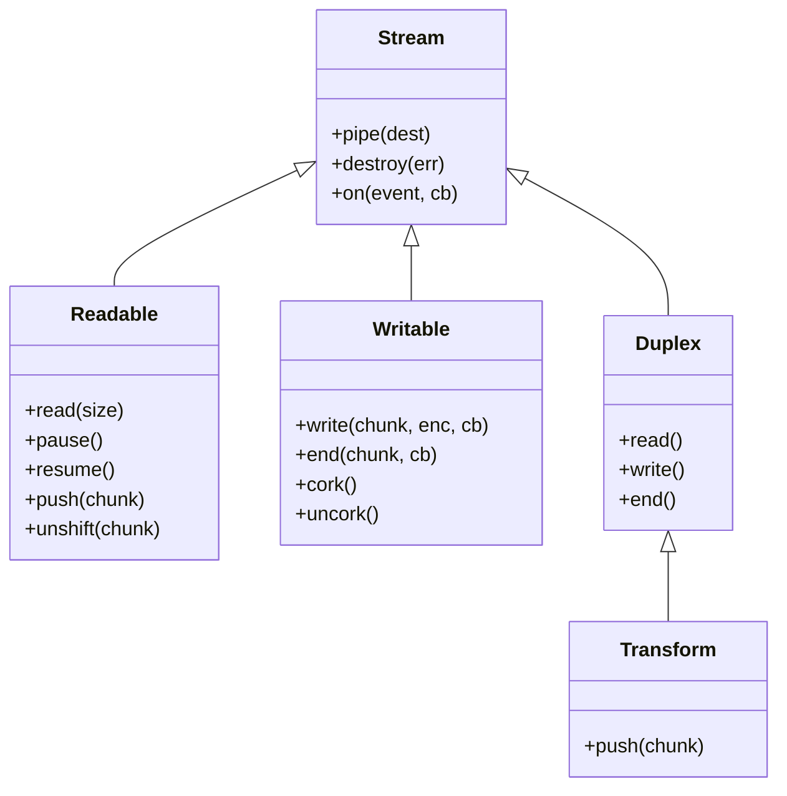
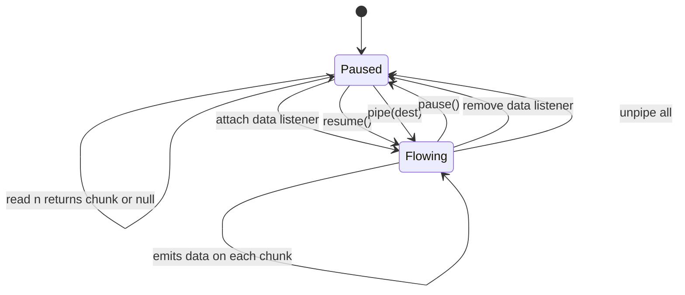
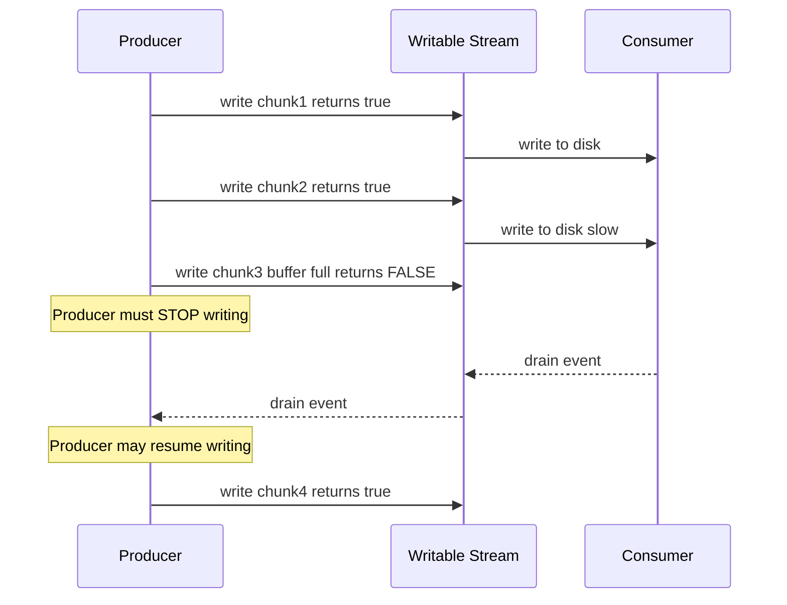
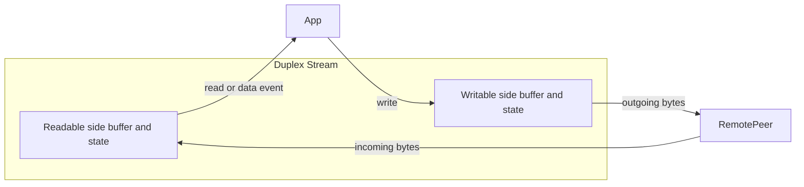
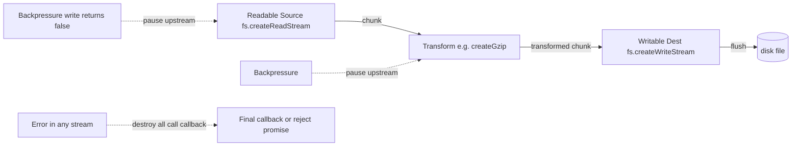
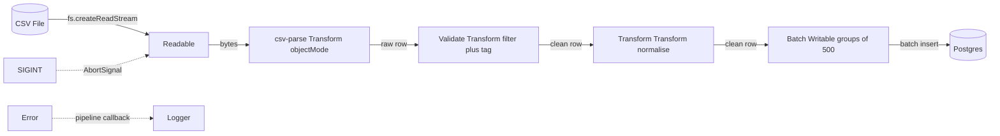

# 3.07 Streams Fundamentals

> Streams are Node's answer to the question "what if the data is bigger than memory?" — they let you move bytes from A to B one chunk at a time, transform them along the way, and never hold more than a fixed-size window in RAM.

## 1. Purpose

Every Node process starts with a finite heap, a finite amount of file-descriptor bandwidth, and a single-threaded event loop. The moment you need to process something larger than that budget — a 10 GB access log, a video file, a Postgres cursor returning 50 million rows, a real-time WebSocket feed that never ends — the obvious approach (`fs.readFile`, `JSON.parse`, loop over it) breaks in one of three ways.

1. **Memory exhaustion.** `fs.readFile` allocates the entire file as a single `Buffer`. A 10 GB file means a 10 GB allocation; V8 caps array-buffer backing stores at roughly 4 GB on 64-bit systems, and the operating system will OOM-kill the process long before that.
2. **Event loop starvation.** Even if the data fits, parsing or transforming it synchronously blocks the loop. While the loop is blocked, no HTTP requests can be served, no timers can fire, no I/O callbacks can run. A 200 ms parse becomes a 200 ms latency spike for every other connection.
3. **Latency.** A "read everything, then process, then write" pipeline means the user waits for the entire file before seeing the first byte of output. For large files this can be minutes — and the user has no idea whether anything is happening.

Streams solve all three problems at once. A stream is an **EventEmitter** that produces or consumes data **incrementally**, in chunks, instead of all at once. Instead of loading a 10 GB file into memory, you open a Readable stream that hands you 64 KiB at a time. You process that chunk, hand it to a Transform stream that compresses it, which hands it to a Writable stream that flushes it to disk. The peak memory usage is roughly three times the `highWaterMark` (one buffer per stream in the pipeline), regardless of whether the file is 1 MB or 1 TB. The first byte reaches disk seconds after the read begins, not minutes. And between chunks, the event loop is free to do other work.

Streams are everywhere in Node. They are not a feature you opt into; they are the substrate that `fs`, `http`, `net`, `zlib`, `crypto`, `process.stdin`, `process.stdout`, and most of `node:stream` itself are built on. When you call `res.send(data)` in Express, behind the scenes Express checks whether `data` is a stream and, if so, pipes it to the response. When you gzip an HTTP response, the `compression()` middleware wraps `res` in a `zlib.createGzip()` Transform and pipes the request body through it. When you run `node script.js | grep foo`, the shell wires `process.stdout` of `node` to `process.stdin` of `grep` via a pipe — Node just sees two streams.

The Node stream API recognises **four stream types**, distinguished by which directions data can flow and whether the two directions are coupled.

1. **Readable** — a stream you read *from*. Examples: `fs.createReadStream`, `http.IncomingMessage` (the request body on the server, the response body on the client), `process.stdin`, `zlib.createGunzip`, `crypto.createDecipheriv`. The producer pushes data in; you pull it out.
2. **Writable** — a stream you write *to*. Examples: `fs.createWriteStream`, `http.ServerResponse`, `process.stdout`, `process.stderr`, `zlib.createGzip`, `crypto.createCipheriv`. You push data in; the consumer pulls it out (to disk, to a socket, to a terminal).
3. **Duplex** — a stream that is *both* Readable and Writable, with the two sides **independent** (what you write is not what you read). Example: `net.Socket` (TCP socket). You write bytes to send to the remote peer; you read bytes the remote peer sent you. The two flows are unrelated — same socket, two independent channels.
4. **Transform** — a Duplex where the writable side feeds a transform function that produces the readable side. Examples: `zlib.createGzip`, `crypto.createCipheriv`, `crypto.createHash`. You write plaintext in; you read ciphertext (or compressed, or hashed) out. The two sides are coupled by the transform function.

The distinction between Duplex and Transform is subtle but important: a Duplex is "two streams glued together" (think TCP socket), while a Transform is "one stream whose output is computed from its input" (think compression). Section 2 covers the formal API contracts; Section 3 gives you the mental models that make the distinction stick.

This note covers the fundamentals: the four types, the two modes (flowing versus paused), buffering and `highWaterMark`, the `pipeline` mechanics, and how to consume and create streams. The companion note [[3.08 Streams Advanced Backpressure]] goes deeper into the backpressure protocol; this note gives you enough to use streams correctly in 95% of cases.

## 2. Theory and Deep Dive

### 2.1 The Stream Class Hierarchy

Every Node stream inherits, directly or indirectly, from one of four classes exported by `node:stream`.



`Stream` is the root; it provides `pipe`, `pipeline`, `destroy`, and the EventEmitter machinery. `Readable` and `Writable` extend it directly. `Duplex` is *both* Readable and Writable (implemented by composition in C++, but conceptually multiple inheritance). `Transform` extends `Duplex` and adds the `transform` and `flush` hooks (passed as constructor options, not as methods you must name with any particular convention).

### 2.2 Readable Stream Modes

A Readable stream is a state machine with two modes, and the mode determines **who controls the data flow**.

- **Paused mode (default).** The consumer must explicitly call `stream.read(n)` to pull data. No data is emitted until you ask for it. This is pull-based.
- **Flowing mode.** Data is emitted automatically via the `data` event as soon as it arrives. The consumer just listens. This is push-based.

A stream starts in paused mode. It switches to flowing mode when *any* of these happens.

- A listener is attached to the `data` event.
- `stream.resume()` is called.
- `stream.pipe(dest)` is called (pipe internally calls resume on the source).

It switches back to paused mode when.

- `stream.pause()` is called.
- `stream.unpipe()` is called on all piped destinations.
- The only `data` listener is removed.

**The classic bug**: attach a `data` listener *and* call `read()` in the same handler. The stream is in flowing mode, so `data` fires before your `read()` ever runs; your `read()` returns `null` because the buffer has already been drained by the event. Pick one mode and stick with it.



### 2.3 Internal Buffer and `highWaterMark`

Every Readable and Writable stream has an internal buffer (an array of `Buffer` or string chunks). The buffer is bounded by `highWaterMark` — the maximum number of bytes (or objects, in `objectMode`) the stream will buffer before asking the producer to stop.

| Stream option | Default | Meaning |
|---|---|---|
| `highWaterMark` (binary mode, generic stream) | 16384 (16 KiB) | Max bytes buffered before backpressure |
| `highWaterMark` (fs streams specifically) | 65536 (64 KiB) | fs streams use a larger default for throughput |
| `highWaterMark` (`objectMode: true`) | 16 | Max objects buffered before backpressure |
| `objectMode` | false | If true, chunks can be any JS value, not just Buffer or string |

The "64 KiB" figure often cited for fs streams is the default for `fs.createReadStream` and `fs.createWriteStream` specifically; generic Readable and Writable streams default to 16 KiB. When in doubt, check the stream's `readableHighWaterMark` or `writableHighWaterMark` property.

Now, the backpressure protocol.

- **Readable side**: when the consumer is slow (or paused), the producer pushes into the buffer. If the buffer length exceeds `highWaterMark`, the stream stops reading from the underlying resource until the buffer drains.
- **Writable side**: `stream.write(chunk)` returns `true` if the buffer is below `highWaterMark` (you can keep writing), `false` if it is at or above (you should stop writing and wait for the `drain` event).



This back-and-forth is **backpressure**: the consumer pushes back on the producer so neither side overwhelms the other. `pipe()` and `pipeline()` implement this automatically; if you wire streams manually with `data` events and `write()`, you have to implement it yourself (see Section 6).

### 2.4 Writable Streams

A Writable stream exposes the following API.

- `write(chunk, encoding?, callback?)` — push a chunk. Returns `true` if you should keep writing (buffer below `highWaterMark`), `false` if you should wait for `drain`. The `callback` fires when the chunk has been flushed to the underlying resource (not just buffered).
- `end(chunk?, callback?)` — signal no more data. Optionally write a final chunk first. After `end()`, further `write()` calls throw. The `finish` event fires when all data has been flushed to the underlying resource.
- `cork()` / `uncork()` — buffer writes until `uncork()` is called, then flush them all at once. Useful for grouping small writes to avoid syscall overhead.
- `setDefaultEncoding(encoding)` — sets the encoding used when `write()` receives a string.

Events: `drain` (buffer drained below `highWaterMark` after a `false` return), `finish` (after `end()` and all data flushed), `error` (write failed), `close` (stream closed).

### 2.5 Duplex Streams

A Duplex stream is Readable and Writable at the same time, with the two sides independent. The canonical example is `net.Socket`: bytes written via `socket.write()` are sent to the remote peer; bytes received from the remote peer are emitted via the Readable side (`data` events or `socket.read()`). The two flows have no causal relationship.



Implementing a custom Duplex means providing both a read function (for the readable side) and a write function (for the writable side) as constructor options. The two implementations do not share state unless you choose to.

### 2.6 Transform Streams

A Transform is a Duplex where the writable side feeds a transform function that produces the readable side. You implement a `transform(chunk, encoding, callback)` function (passed as a constructor option) that receives each chunk.

```ts
transform(chunk: Buffer | string, encoding: string, callback: (error?: Error | null, data?: any) => void): void
```

For each chunk written, the transform function is called. Inside, you do your work and call `callback(null, transformedChunk)` to push `transformedChunk` to the readable side. Alternatively, call `this.push(transformedChunk)` (zero or more times) and then call `callback()`. You can push zero chunks (filtering) or many chunks (expanding) — the relationship is not one-to-one.

There is also a `flush(callback)` option — called once, right before the stream ends, after all transform calls have completed. Use it to emit any trailing data (for example, a final block in a compression stream that does not have a full input chunk).

Examples in the standard library: `zlib.createGzip` (compresses), `crypto.createCipheriv` (encrypts), `crypto.createHash` (a Hash stream with a similar API). The global `TextDecoder` (used with `{ stream: true }`) provides similar buffering semantics for manual text-decoding pipelines.

### 2.7 `pipe()` versus `pipeline()`

`src.pipe(dest)` connects a Readable `src` to a Writable `dest`. Data flows from `src` to `dest`, with backpressure handled automatically. It returns `dest`, so you can chain: `src.pipe(transform1).pipe(transform2).pipe(dest)`.

**The critical bug with `.pipe()`**: errors do not propagate. If `src` emits `error`, the pipe is *not* automatically torn down — `dest` is left dangling, the source is left in a broken state, and (worst case) the process crashes with an unhandled error. Each `.pipe()` call adds its own `error` listener requirement, and forgetting one is the single most common stream bug in production.

`pipeline(src, ...transforms, dest, callback)` (added in Node 10, promises version in Node 15) fixes this.

- It propagates errors from any stream in the pipeline to the final callback (or the returned promise).
- It destroys all streams cleanly if any stream errors, so no resources leak.
- It handles the case where the destination ends before the source (forward destruction).
- It accepts an `AbortSignal` for cancellation.

```js
// Deprecated error-prone pattern
src.pipe(transform1).pipe(transform2).pipe(dest);
// Errors from src, transform1, transform2 are NOT handled.

// Recommended pattern (callback form)
pipeline(src, transform1, transform2, dest, (err) => {
  if (err) console.error('Pipeline failed:', err);
  else console.log('Pipeline succeeded');
});

// Recommended pattern (promise form)
await pipeline(src, transform1, transform2, dest);
```

### 2.8 Pipeline Data Flow

Here is the full data flow when you wire up `pipeline(readable, transform, writable)`.



Key properties.

1. **Automatic backpressure.** If `DST.write()` returns `false`, `T1` pauses; if `T1`'s readable buffer fills, `SRC` pauses. The whole pipeline throttles to the slowest component.
2. **Error propagation.** An `error` event on any stream destroys all streams and invokes the final callback with the error.
3. **Cleanup on success.** When `SRC` ends, `T1` flushes, `DST.end()` is called, and after `finish` the callback fires with no error.
4. **Cleanup on abort.** Aborting the `AbortSignal` passed in the options destroys all streams with an `AbortError`.

### 2.9 Consuming with Async Iteration

Since Node 10, every Readable stream is async-iterable. `for await (const chunk of readable)` pulls chunks one at a time, automatically pauses between iterations, and breaks cleanly on `return`, `throw`, or `break`. This is the modern, idiomatic way to consume a stream — no `data` listeners, no `pause()` / `resume()` bookkeeping.

```js
import { createReadStream } from 'node:fs';

const stream = createReadStream('./input.txt');
for await (const chunk of stream) {
  console.log('Got', chunk.length, 'bytes');
}
```

The async-iterator protocol is the bridge to [[1.24 Async Generators and Iterators]] — you can `yield*` a stream into an async generator, compose it with map / filter / take operators, and pipe the result back into a Writable with `Readable.from(iterable)`.

### 2.10 Creating Custom Streams

Three approaches, in increasing order of control.

1. **Helper constructors** (preferred for simple cases): `Readable.from(iterable)`, `new Readable({ read })`, `new Writable({ write })`, `new Transform({ transform, flush })`. No subclassing required.
2. **Subclassing**: extend `Readable`, `Writable`, `Duplex`, or `Transform` and override the appropriate methods. Use when you need to share state across reads or override multiple lifecycle hooks.
3. **Implementing the underlying C++ interface**: not something you will do in user code.

For 95% of custom streams, the helper constructors are enough. Subclassing is reserved for cases where you genuinely need shared state — for example, a database cursor stream that holds a connection and an offset.

## 3. Mental Models

- **Readable = a tap you can turn on (flowing) or draw from (paused).** In flowing mode, the tap is open and water gushes out via `data` events; you watch. In paused mode, the tap is closed and you turn the handle yourself with `read()` to draw a cup at a time. You cannot do both — once the tap is on, drawing from it returns nothing.
- **Writable = a drain you can pour into.** `write()` is pouring. If you pour too fast, the drain backs up and `write()` returns `false` — wait for the `drain` gurgle before pouring more. `end()` is "no more water coming"; `finish` is "the drain has swallowed everything".
- **Duplex = a tap and a drain, independent.** Picture a kitchen sink: water comes out of the faucet (readable side, from the water company) and goes down the drain (writable side, to the sewer). The two flows are not causally related — you can pour a glass while the tap runs.
- **Transform = a filter — pour in, get transformed out.** Picture a Brita pitcher: you pour tap water in the top (writable side), it passes through a carbon filter, and clean water comes out the spout (readable side). The input is *consumed* to produce the output; they are coupled.
- **Pipeline = connect tap to filter to drain, with error handling.** A plumber connecting a water source, a Brita filter, and a glass. If anything leaks (errors), the plumber shuts off the whole thing and calls you back (the final callback).

**Where the metaphors break down.**

- The "tap" metaphor suggests water is continuous. In reality, streams emit discrete chunks (Buffer slices, strings, objects). Each chunk is atomic.
- The "drain" metaphor suggests gravity does the work. In reality, backpressure is an active, cooperative protocol — if the producer ignores the `false` return from `write()`, the drain overflows (memory grows unbounded).
- The "filter" metaphor suggests a one-to-one mapping. Transforms can produce zero chunks (filtering), one chunk (mapping), or many chunks (expanding) per input. They can also buffer internally across multiple input chunks before emitting anything.

When in doubt, fall back to the formal model: a stream is an EventEmitter with an internal buffer, a `highWaterMark`, and a defined protocol for "produce chunk / consume chunk / signal done / signal error".

## 4. Real-World Use Cases

### 4.1 File Processing

`fs.createReadStream` and `fs.createWriteStream` are the bread and butter. Reading a 50 GB CSV to transform and re-write.

```js
import { createReadStream, createWriteStream } from 'node:fs';
import { pipeline } from 'node:stream/promises';
import { createGzip } from 'node:zlib';

await pipeline(
  createReadStream('./big.csv'),
  createGzip(),
  createWriteStream('./big.csv.gz')
);
```

Peak memory: roughly three times 64 KiB. The file is processed at the speed of disk I/O, not the speed of memory allocation.

### 4.2 HTTP Request and Response Bodies

Every `http.IncomingMessage` (request on the server, response on the client) is a Readable stream. Every `http.ServerResponse` (response on the server) and `http.ClientRequest` (request on the client) is a Writable stream. This means a POST endpoint that streams the body to disk looks like this.

```js
app.post('/upload', (req, res) => {
  pipeline(req, createWriteStream('./upload.bin'), (err) => {
    if (err) { res.status(500).end('fail'); return; }
    res.end('ok');
  });
});
```

A GET endpoint that streams a file as the response.

```js
app.get('/download/:file', (req, res) => {
  pipeline(createReadStream(`./files/${req.params.file}`), res, (err) => {
    if (err) console.error('download failed:', err);
  });
});
```

Gzipping the response.

```js
res.setHeader('Content-Encoding', 'gzip');
pipeline(createReadStream('./big.html'), createGzip(), res, handleError);
```

### 4.3 Gzip Compression

`zlib.createGzip()` is the textbook Transform stream. Compressing a tarball on the fly.

```js
pipeline(
  createReadStream('./project.tar'),
  createGzip(),
  createWriteStream('./project.tar.gz')
);
```

`createGunzip`, `createDeflate`, `createInflate`, `createBrotliCompress`, `createBrotliDecompress` are all Transform streams with the same shape.

### 4.4 CSV Parsing

Libraries like `csv-parse` (the parser half of the `csv` package) and `fast-csv` expose Transform streams that take a byte stream and emit row objects. Combined with `pipeline`.

```js
import { parse } from 'csv-parse';

await pipeline(
  createReadStream('./users.csv'),
  parse({ columns: true, trim: true }),
  async function* (rows) {
    for await (const row of rows) {
      yield { ...row, normalized: row.email.toLowerCase() };
    }
  },
  async function* (rows) {
    const batch = [];
    for await (const row of rows) {
      batch.push(row);
      if (batch.length === 1000) {
        await db.batchInsert(batch);
        batch.length = 0;
      }
    }
    if (batch.length) await db.batchInsert(batch);
  }
);
```

Yes — `pipeline` accepts async generators as transform stages. This is enormous: you can drop a `function*` anywhere in the chain and it becomes a typed Transform.

### 4.5 Log Processing

Streaming log aggregation: tail a file, parse JSON lines, filter by level, batch-insert into a database.

```js
await pipeline(
  createReadStream('./app.log'),
  splitLines(),
  parseJsonLines(),
  filterByLevel('error'),
  batchInsert(db, 1000)
);
```

Each stage is a small custom Transform or Writable; the pipeline composes them.

### 4.6 Image Manipulation

The `sharp` library exposes streams for resize, format conversion, and so on.

```js
pipeline(
  createReadStream('./input.png'),
  sharp().resize(800).jpeg({ quality: 80 }),
  createWriteStream('./output.jpg')
);
```

### 4.7 Database Cursors

`pg-query-stream` turns a Postgres query into a Readable stream of row objects.

```js
import { QueryStream } from 'pg-query-stream';

const query = new QueryStream('SELECT * FROM largeTable');
const stream = client.query(query);

for await (const row of stream) {
  await processRow(row);
}
```

This lets you iterate a billion-row table without ever holding more than `highWaterMark` rows in memory. (The library `pg-query-stream` is used here; any similar cursor-streaming library works the same way.)

### 4.8 Real-Time Data Feeds

WebSockets, Kafka consumers, MQTT subscribers — all are conceptually Readable streams (incoming messages) and Writable streams (outgoing messages). The `ws` package's `WebSocket` is a Duplex: you `send()` (write) and listen to `message` (read). Kafka's `kafkajs` consumer exposes an async iterator of messages. MQTT's `mqtt` client emits `message` events.

## 5. Code Examples

### 5.1 Example A — Minimal and Conceptual

Read `input.txt`, uppercase it, write `output.txt`. Three ways.

#### Way 1: Manual events (pedagogical — do not use in production)

**JavaScript:**

```javascript
const { createReadStream, createWriteStream } = require('node:fs');

const src = createReadStream('./input.txt');
const dst = createWriteStream('./output.txt');

src.on('data', (chunk) => {
  const upper = chunk.toString().toUpperCase();
  // WARNING: ignores backpressure. See Section 6.5.
  dst.write(upper);
});

src.on('end', () => dst.end());
src.on('error', (err) => console.error('read failed', err));
dst.on('error', (err) => console.error('write failed', err));
dst.on('finish', () => console.log('done'));
```

**TypeScript:**

```typescript
import { createReadStream, createWriteStream } from 'node:fs';
import type { Readable, Writable } from 'node:stream';

const src: Readable = createReadStream('./input.txt');
const dst: Writable = createWriteStream('./output.txt');

src.on('data', (chunk: Buffer) => {
  const upper: string = chunk.toString('utf8').toUpperCase();
  dst.write(upper);
});

src.on('end', () => dst.end());
src.on('error', (err: Error) => console.error('read failed', err));
dst.on('error', (err: Error) => console.error('write failed', err));
dst.on('finish', () => console.log('done'));
```

#### Way 2: `.pipe()` (legacy, error-prone)

**JavaScript:**

```javascript
const { createReadStream, createWriteStream } = require('node:fs');
const { Transform } = require('node:stream');

const upper = new Transform({
  transform(chunk, encoding, callback) {
    this.push(chunk.toString().toUpperCase());
    callback();
  },
});

const src = createReadStream('./input.txt');
const dst = createWriteStream('./output.txt');

src.pipe(upper).pipe(dst);

// Must attach error listeners to EACH stream — easy to forget.
src.on('error', (err) => console.error('src', err));
upper.on('error', (err) => console.error('upper', err));
dst.on('error', (err) => console.error('dst', err));
dst.on('finish', () => console.log('done'));
```

**TypeScript:**

```typescript
import { createReadStream, createWriteStream } from 'node:fs';
import { Transform } from 'node:stream';
import type { TransformCallback } from 'node:stream';

const upper = new Transform({
  transform(chunk: Buffer, encoding: string, callback: TransformCallback): void {
    void encoding;
    this.push(chunk.toString('utf8').toUpperCase());
    callback();
  },
});

const src = createReadStream('./input.txt');
const dst = createWriteStream('./output.txt');

src.pipe(upper).pipe(dst);

src.on('error', (err: Error) => console.error('src', err));
upper.on('error', (err: Error) => console.error('upper', err));
dst.on('error', (err: Error) => console.error('dst', err));
dst.on('finish', () => console.log('done'));
```

#### Way 3: `pipeline` (recommended)

**JavaScript:**

```javascript
const { createReadStream, createWriteStream } = require('node:fs');
const { pipeline } = require('node:stream/promises');
const { Transform } = require('node:stream');

const upper = new Transform({
  transform(chunk, encoding, callback) {
    this.push(chunk.toString().toUpperCase());
    callback();
  },
});

await pipeline(
  createReadStream('./input.txt'),
  upper,
  createWriteStream('./output.txt')
);

console.log('done');
```

**TypeScript:**

```typescript
import { createReadStream, createWriteStream } from 'node:fs';
import { pipeline } from 'node:stream/promises';
import { Transform } from 'node:stream';
import type { TransformCallback } from 'node:stream';

const upper = new Transform({
  transform(chunk: Buffer, encoding: string, callback: TransformCallback): void {
    void encoding;
    this.push(chunk.toString('utf8').toUpperCase());
    callback();
  },
});

await pipeline(
  createReadStream('./input.txt'),
  upper,
  createWriteStream('./output.txt')
);

console.log('done');
```

### 5.2 Example B — Production-Grade

A fully typed ETL pipeline: read CSV, parse rows, validate and transform, batch into groups of 500, insert into a fake DB, with structured logging, error recovery, and graceful shutdown on `SIGINT`.

**JavaScript:**

```javascript
const { createReadStream } = require('node:fs');
const { pipeline } = require('node:stream/promises');
const { Transform, Writable } = require('node:stream');
const { parse } = require('csv-parse');

// Fake DB client — in real code this would be pg, mysql2, etc.
const db = {
  async insertBatch(rows) {
    await new Promise((r) => setTimeout(r, 10));
    console.log(`inserted ${rows.length} rows`);
  },
};

function parseRows() {
  return parse({ columns: true, trim: true });
}

function transformRows() {
  return new Transform({
    objectMode: true,
    transform(row, encoding, callback) {
      try {
        if (!row.email || !row.email.includes('@')) {
          return callback();
        }
        const out = {
          name: (row.name || '').trim(),
          email: row.email.toLowerCase(),
          age: Number(row.age) || null,
          importedAt: new Date().toISOString(),
        };
        this.push(out);
        callback();
      } catch (err) {
        callback(err);
      }
    },
  });
}

function batchInsert(size) {
  let batch = [];
  let total = 0;
  return new Writable({
    objectMode: true,
    highWaterMark: size * 2,
    async write(row, encoding, callback) {
      batch.push(row);
      if (batch.length >= size) {
        try {
          await db.insertBatch(batch);
          total += batch.length;
          batch = [];
          callback();
        } catch (err) {
          callback(err);
        }
      } else {
        callback();
      }
    },
    async final(callback) {
      if (batch.length > 0) {
        try {
          await db.insertBatch(batch);
          total += batch.length;
        } catch (err) {
          return callback(err);
        }
      }
      console.log(`total inserted: ${total}`);
      callback();
    },
  });
}

async function main() {
  const controller = new AbortController();
  process.on('SIGINT', () => {
    console.log('aborting');
    controller.abort();
  });

  try {
    await pipeline(
      createReadStream('./users.csv'),
      parseRows(),
      transformRows(),
      batchInsert(500),
      { signal: controller.signal }
    );
    console.log('ETL complete');
  } catch (err) {
    if (err.name === 'AbortError') {
      console.log('ETL aborted');
    } else {
      console.error('ETL failed', err);
      process.exitCode = 1;
    }
  }
}

main();
```

**TypeScript:**

```typescript
import { createReadStream } from 'node:fs';
import { pipeline } from 'node:stream/promises';
import { Transform, Writable } from 'node:stream';
import type { TransformCallback } from 'node:stream';
import { parse } from 'csv-parse';

type WriteCallback = (error?: Error | null) => void;

interface RawRow {
  name?: string;
  email?: string;
  age?: string;
  [key: string]: string | undefined;
}

interface CleanRow {
  name: string;
  email: string;
  age: number | null;
  importedAt: string;
}

interface DbClient {
  insertBatch(rows: CleanRow[]): Promise<void>;
}

const db: DbClient = {
  async insertBatch(rows: CleanRow[]): Promise<void> {
    await new Promise((r) => setTimeout(r, 10));
    console.log(`inserted ${rows.length} rows`);
  },
};

function parseRows(): Transform {
  return parse({ columns: true, trim: true }) as Transform;
}

function transformRows(): Transform {
  return new Transform({
    objectMode: true,
    transform(row: RawRow, encoding: string, callback: TransformCallback): void {
      void encoding;
      try {
        if (!row.email || !row.email.includes('@')) {
          return callback();
        }
        const out: CleanRow = {
          name: (row.name ?? '').trim(),
          email: row.email.toLowerCase(),
          age: row.age ? Number(row.age) || null : null,
          importedAt: new Date().toISOString(),
        };
        this.push(out);
        callback();
      } catch (err) {
        callback(err instanceof Error ? err : new Error(String(err)));
      }
    },
  });
}

function batchInsert(size: number): Writable {
  let batch: CleanRow[] = [];
  let total = 0;

  return new Writable({
    objectMode: true,
    highWaterMark: size * 2,
    async write(row: CleanRow, encoding: string, callback: WriteCallback): Promise<void> {
      void encoding;
      batch.push(row);
      if (batch.length >= size) {
        try {
          await db.insertBatch(batch);
          total += batch.length;
          batch = [];
          callback();
        } catch (err) {
          callback(err instanceof Error ? err : new Error(String(err)));
        }
      } else {
        callback();
      }
    },
    async final(callback: WriteCallback): Promise<void> {
      if (batch.length > 0) {
        try {
          await db.insertBatch(batch);
          total += batch.length;
        } catch (err) {
          return callback(err instanceof Error ? err : new Error(String(err)));
        }
      }
      console.log(`total inserted: ${total}`);
      callback();
    },
  });
}

async function main(): Promise<void> {
  const controller = new AbortController();
  process.on('SIGINT', (): void => {
    console.log('aborting');
    controller.abort();
  });

  try {
    await pipeline(
      createReadStream('./users.csv'),
      parseRows(),
      transformRows(),
      batchInsert(500),
      { signal: controller.signal }
    );
    console.log('ETL complete');
  } catch (err) {
    if (err instanceof Error && err.name === 'AbortError') {
      console.log('ETL aborted');
    } else {
      console.error('ETL failed', err);
      process.exitCode = 1;
    }
  }
}

main();
```

Notable production details.

- `objectMode: true` on Transform and Writable — chunks are JS objects, not Buffers.
- `highWaterMark: size * 2` on the Writable — enough room to absorb one batch while the next is being prepared.
- `final()` on the Writable — flushes the partial batch when the source ends.
- `AbortController` plus `{ signal }` — graceful shutdown on SIGINT, tearing down the whole pipeline.
- Try/catch around `pipeline` — distinguishes abort from real failure.
- Per-row try/catch in the transform function — converts thrown errors to callback errors so they propagate through the pipeline.

## 6. Common Mistakes and Anti-Patterns

### 6.1 Not handling the `error` event

```javascript
// BROKEN — unhandled stream error crashes the process
const src = createReadStream('./missing.txt');
src.pipe(createWriteStream('./out.txt'));
// If ./missing.txt does not exist, src emits error.
// No listener, Node treats as unhandled, process exits non-zero.
```

**Why it fails:** Node treats unhandled `error` events on EventEmitters as fatal. The process crashes. In production this means a single missing file takes down the whole server.

**Fix:**

```javascript
// Use pipeline — it routes errors to the callback.
await pipeline(
  createReadStream('./missing.txt'),
  createWriteStream('./out.txt')
).catch((err) => console.error('failed:', err));
```

### 6.2 Using `.pipe()` instead of `pipeline`

```javascript
// BROKEN — error in src is not propagated to dst
src.pipe(transform).pipe(dst);
// If src errors, transform and dst are NOT destroyed. File descriptors leak.
```

**Why it fails:** `.pipe()` does not forward errors. The downstream streams are left open, resources leak, and the program appears to hang.

**Fix:**

```javascript
await pipeline(src, transform, dst);
```

### 6.3 Forgetting to call `end()` on a Writable

```javascript
// BROKEN — dst never finishes, file is incomplete
const dst = createWriteStream('./out.txt');
dst.write('hello');
dst.write('world');
// forgot dst.end() — finish never fires, file may not flush.
```

**Why it fails:** Without `end()`, the Writable keeps the file descriptor open and never flushes the final buffer. `finish` never fires, so any cleanup waiting on it hangs. In long-running processes this leaks file descriptors.

**Fix:**

```javascript
dst.write('hello');
dst.write('world');
dst.end();
dst.on('finish', () => console.log('done'));
```

Or use `end(chunk)` to write and end in one call.

```javascript
dst.end('goodbye');
```

### 6.4 Mixing flowing and paused modes

```javascript
// BROKEN — read() returns null because data already drained the buffer
const src = createReadStream('./input.txt');
src.on('data', (chunk) => console.log('data', chunk.length));
src.on('readable', () => {
  const chunk = src.read(); // returns null — already emitted via data
  console.log('readable', chunk);
});
```

**Why it fails:** Attaching a `data` listener puts the stream in flowing mode; `readable` is a paused-mode event. The two modes are mutually exclusive. `read()` returns `null` because the buffer has already been drained by the flowing-mode emission.

**Fix:** Pick one mode and stick to it.

```javascript
// Flowing mode
src.on('data', (chunk) => console.log('data', chunk.length));
src.on('end', () => console.log('done'));

// OR paused mode
src.on('readable', () => {
  let chunk;
  while ((chunk = src.read()) !== null) {
    console.log('read', chunk.length);
  }
});
src.on('end', () => console.log('done'));

// OR (best) async iteration
for await (const chunk of src) {
  console.log('chunk', chunk.length);
}
```

### 6.5 Not respecting backpressure

```javascript
// BROKEN — writes faster than the drain can swallow; memory grows unbounded
const src = createReadStream('./huge.bin');
const dst = createWriteStream('./out.bin');
src.on('data', (chunk) => {
  dst.write(chunk); // ignores the return value
});
```

**Why it fails:** If `dst.write()` returns `false`, you must stop writing until `drain` fires. By ignoring the return value, you keep pushing chunks into `dst`'s internal buffer, which grows without bound — defeating the entire purpose of streams.

**Fix:** Use `pipeline` (which handles backpressure automatically), or implement it manually.

```javascript
src.on('data', (chunk) => {
  if (!dst.write(chunk)) {
    src.pause();
    dst.once('drain', () => src.resume());
  }
});
src.on('end', () => dst.end());
```

### 6.6 `highWaterMark` set incorrectly

```javascript
// ANTI-PATTERN — too small, excessive syscall overhead
createReadStream('./big.bin', { highWaterMark: 16 });

// ANTI-PATTERN — too large, defeats the purpose of streaming
createReadStream('./big.bin', { highWaterMark: 1024 * 1024 * 1024 });
```

**Why it fails:** Too small (16 bytes) means each `read()` syscall returns almost nothing; you spend all your time in user/kernel transitions. Too large (1 GB) means you are effectively loading the file into memory anyway.

**Fix:** Use the default (16 KiB for generic streams, 64 KiB for fs streams) unless you have profiled evidence to change it. For `objectMode` streams processing large objects, increase to 32 or 64 (objects) to amortise per-chunk overhead. For streams feeding into very slow consumers (a slow network), a larger `highWaterMark` (256 KiB) can reduce stalls.

### 6.7 Leaking resources on error

```javascript
// BROKEN — file descriptors leak when an error occurs mid-pipeline
const src = createReadStream('./a.txt');
const transform = new Transform({
  transform(chunk, encoding, callback) {
    callback(new Error('boom'));
  },
});
const dst = createWriteStream('./b.txt');
src.pipe(transform).pipe(dst);
// transform errors, src and dst are NOT closed.
```

**Why it fails:** `.pipe()` does not destroy upstream or downstream on error. The Readable keeps its file descriptor open; the Writable keeps its file descriptor open. Over time you hit `EMFILE: too many open files`.

**Fix:** `pipeline` destroys all streams on any error.

```javascript
await pipeline(src, transform, dst).catch((err) => {
  console.error('pipeline failed:', err);
  // src, transform, dst are all destroyed automatically.
});
```

### 6.8 Using `write()` after `end()`

```javascript
// BROKEN — throws an error
const dst = createWriteStream('./out.txt');
dst.end('done');
dst.write('more'); // throws
```

**Why it fails:** `end()` signals "no more data". Any subsequent `write()` is a programming error and throws synchronously.

**Fix:** Audit your control flow; if you have multiple writers racing, serialise them or use a flag.

```javascript
let ended = false;
function safeWrite(chunk) {
  if (ended) return;
  if (!dst.write(chunk)) {
    src.pause();
    dst.once('drain', () => src.resume());
  }
}
function safeEnd() {
  if (ended) return;
  ended = true;
  dst.end();
}
```

## 7. Best Practices and Design Patterns

### 7.1 Always use `pipeline`, never `.pipe()`

`pipeline` propagates errors, destroys all streams on failure, handles destination-ends-first scenarios, and supports `AbortSignal`. There is no scenario where `.pipe()` is correct in modern code, except when you need to chain into a stream returned by a library that itself uses `.pipe()` internally.

```javascript
// Yes
await pipeline(src, transform, dst);

// No
src.pipe(transform).pipe(dst);
```

### 7.2 Always handle the `error` event (or use `pipeline`)

If you must use raw streams, attach an `error` listener to every single one. An unhandled `error` event crashes the process.

```javascript
src.on('error', handleErr);
transform.on('error', handleErr);
dst.on('error', handleErr);
```

### 7.3 Prefer async iteration for consumption

`for await...of` is clearer than `data` events and handles backpressure automatically. The body of the loop is paused between chunks, so the producer is naturally throttled.

```javascript
for await (const chunk of src) {
  await process(chunk);
}
```

### 7.4 Respect backpressure

If you must call `write()` manually, check the return value.

```javascript
function writeWithBackpressure(src, dst) {
  src.on('data', (chunk) => {
    if (!dst.write(chunk)) {
      src.pause();
      dst.once('drain', () => src.resume());
    }
  });
  src.on('end', () => dst.end());
}
```

### 7.5 Set `highWaterMark` based on workload

- Default (16 KiB / 64 KiB): good for most file I/O.
- Object mode: 16 (default) is fine for small objects; raise to 64 to 256 for large objects or slow consumers.
- Network streams with high latency: 64 KiB or 256 KiB can hide round-trip latency.
- Never set it above what your heap can handle — a `highWaterMark` of 1 GB on a 512 MB heap is a guaranteed OOM.

### 7.6 Use `objectMode` for non-Buffer chunks

If your chunks are JS objects (parsed CSV rows, log entries, transformed records), set `objectMode: true`. The stream will accept any value (not just Buffer or string) and `highWaterMark` is interpreted as object count, not byte count.

```javascript
new Transform({
  objectMode: true,
  transform(row, encoding, callback) {
    void encoding;
    this.push(transformedRow);
    callback();
  },
});
```

### 7.7 Clean up streams on error

If you create a stream and do not pipe it through `pipeline`, call `stream.destroy()` in your error handler to release file descriptors, sockets, and so on.

```javascript
src.on('error', (err) => {
  console.error(err);
  src.destroy();
  dst.destroy();
});
```

### 7.8 Use `Readable.from()` to bridge async iterables

`Readable.from(asyncIterable)` converts an async generator (or any async iterable) into a Readable stream. This is the cleanest way to bridge [[1.24 Async Generators and Iterators]] into the stream world.

```javascript
import { Readable } from 'node:stream';

async function* generateRows() {
  for (let i = 0; i < 1000000; i++) {
    yield { id: i, value: Math.random() };
  }
}

await pipeline(
  Readable.from(generateRows()),
  transformRows(),
  batchInsert(500)
);
```

### 7.9 Use `finished()` for cleanup notifications

`stream.finished(stream, callback)` fires when the stream is either done (`end` / `finish`) or has errored or been destroyed. Use it for cleanup that must run regardless of outcome.

```javascript
import { finished } from 'node:stream/promises';

// If not using pipeline:
await finished(src);
console.log('src is done');
```

### 7.10 Use the `node:stream/promises` module

`node:stream/promises` exports promise-based `pipeline` and `finished`. Always prefer it over the callback versions unless you are on a codebase that has not migrated off callbacks.

```javascript
import { pipeline, finished } from 'node:stream/promises';
```

## 8. Technical Interview Knowledge

### 8.1 What are the four stream types?

**A:** Readable (read from — `fs.createReadStream`, `http.IncomingMessage`), Writable (write to — `fs.createWriteStream`, `http.ServerResponse`), Duplex (both, independent — `net.Socket`), Transform (Duplex where output is derived from input — `zlib.createGzip`). The key distinction between Duplex and Transform: in a Duplex, the readable and writable sides are unrelated (a TCP socket sends and receives independently); in a Transform, the readable side is computed from the writable side (compression: input bytes produce output compressed bytes).

**Trap to avoid:** Saying "Duplex is read and write at the same time" — that is true but does not distinguish it from Transform. The distinguishing feature is *independence* of the two sides.

### 8.2 Difference between flowing and paused mode?

**A:** In paused mode (the default), the consumer must explicitly call `stream.read(n)` to pull data. In flowing mode, data is emitted automatically via `data` events. The stream switches from paused to flowing when a `data` listener is attached, `resume()` is called, or `pipe()` is called. It switches back when `pause()` is called, all pipes are removed, or the only `data` listener is removed.

**Trap to avoid:** Confusing paused mode with "the stream is paused indefinitely". In paused mode, the stream is *waiting for you to ask*. The buffer can still fill up if you do not read.

### 8.3 What is `highWaterMark`?

**A:** The maximum number of bytes (or objects, in `objectMode`) a stream will buffer before applying backpressure. Default is 16 KiB for generic Readable/Writable streams, 64 KiB for fs streams, and 16 objects in `objectMode`. When the internal buffer reaches `highWaterMark`, `write()` returns `false` (Writable) or the stream stops reading from its source (Readable).

**Trap to avoid:** Thinking `highWaterMark` is a hard cap on memory. The buffer can briefly exceed it (by one chunk) before backpressure kicks in. The actual peak memory is roughly `highWaterMark` plus the largest chunk size per stream.

### 8.4 What is backpressure?

**A:** The mechanism by which a slow consumer signals a fast producer to stop producing. In Node streams, when `writable.write(chunk)` returns `false`, the producer must stop calling `write()` and wait for the `drain` event. `pipe()` and `pipeline()` implement this automatically; manual wiring requires the producer to check the return value and pause or resume accordingly. Without backpressure, a fast producer (SSD read) feeding a slow consumer (network write) would buffer unlimited data in memory and crash the process.

**Trap to avoid:** Saying "backpressure is when the stream pauses". Backpressure is the *signal* (`write()` returning `false`); pausing is one *response* to it. The protocol is cooperative — it requires the producer to honour the signal.

### 8.5 Difference between `pipe` and `pipeline`?

**A:** `src.pipe(dest)` connects a Readable to a Writable with backpressure, but does *not* propagate errors — if `src` errors, `dest` is left dangling. `pipeline(src, ...transforms, dest, callback)` connects the same chain but propagates errors from any stream to the final callback (or promise), destroys all streams on failure, and supports `AbortSignal`. In modern code, always use `pipeline`.

**Trap to avoid:** Saying "pipeline is just pipe with error handling". It also handles destination-ends-before-source (forward destruction), resource cleanup, and abort signals. It is a more complete abstraction.

### 8.6 How do you handle stream errors?

**A:** Three ways, in order of preference: (1) use `pipeline` and catch errors in the returned promise or callback; (2) use `stream.finished(stream, callback)` for cleanup notifications on raw streams; (3) attach an `error` listener to every stream — never leave one without, or the process will crash on an unhandled `error` event.

**Trap to avoid:** Saying "wrap it in try/catch". Stream operations are asynchronous; a synchronous try/catch only catches errors thrown synchronously by `pipe()` itself, not errors emitted later via the `error` event.

### 8.7 How do you create a custom Transform?

**A:** Three ways: (1) `new Transform({ transform(chunk, encoding, callback) { this.push(...); callback(); } })` — preferred for simple cases; (2) subclass `Transform` and override the transform and flush methods; (3) pass an async generator function as a pipeline stage — `pipeline` accepts async generators and wraps them as Transform streams. Always remember to call `callback()` (or push then call it) — if you forget, the stream hangs forever waiting for the next chunk.

**Trap to avoid:** Calling `callback()` before `this.push()` finishes its async work. `callback()` signals "I am done with this chunk"; if you call it early, the next chunk arrives before you have processed the current one.

### 8.8 How do you consume a stream with async iteration?

**A:** `for await (const chunk of stream) { ... }`. This works because every Node Readable stream implements `Symbol.asyncIterator`. The loop automatically pulls one chunk per iteration, pauses the stream between iterations (so `await process(chunk)` throttles the producer), and breaks cleanly on `return`, `throw`, or `break` (calling `stream.destroy()` under the hood). It is the modern replacement for `data` event listeners.

**Trap to avoid:** Calling `stream.resume()` before the loop — unnecessary, and forces the stream into flowing mode where chunks can be lost between iterations. The async iterator handles the mode for you.

## 9. Practical Exercises

### 9.1 Exercise One — Read a file, count lines, write to another file

**Goal:** Read `input.txt`, count the total number of newline characters, write the count to `count.txt`.

**Setup:** Create a test file.

```bash
seq 1 1000 > input.txt
```

**Steps:**

1. Open a Readable stream on `input.txt`.
2. Iterate over chunks with `for await...of`.
3. For each chunk, count the number of newline characters.
4. After the loop ends, write the count to `count.txt`.

**Full worked solution (JavaScript):**

```javascript
const { createReadStream, writeFileSync } = require('node:fs');

async function countLines(inputPath, outputPath) {
  let count = 0;
  const stream = createReadStream(inputPath);

  for await (const chunk of stream) {
    // Count newlines in this chunk. Last chunk may or may not end with newline.
    for (let i = 0; i < chunk.length; i++) {
      if (chunk[i] === 0x0a) count++;
    }
  }

  writeFileSync(outputPath, `${count}\n`, 'utf8');
  console.log(`wrote ${count} to ${outputPath}`);
}

countLines('./input.txt', './count.txt').catch(console.error);
```

**Full worked solution (TypeScript):**

```typescript
import { createReadStream, writeFileSync } from 'node:fs';

async function countLines(inputPath: string, outputPath: string): Promise<void> {
  let count = 0;
  const stream = createReadStream(inputPath);

  for await (const chunk of stream as AsyncIterable<Buffer>) {
    for (let i = 0; i < chunk.length; i++) {
      if (chunk[i] === 0x0a) count++;
    }
  }

  writeFileSync(outputPath, `${count}\n`, 'utf8');
  console.log(`wrote ${count} to ${outputPath}`);
}

countLines('./input.txt', './count.txt').catch(console.error);
```

**Reasoning:** We use `for await...of` for clean backpressure handling. We iterate byte-by-byte (not `chunk.toString().split('\n')`) to avoid allocating a string for the entire chunk — for a 10 GB file this matters. We use `0x0a` (the ASCII code for newline) to avoid encoding ambiguity.

### 9.2 Exercise Two — Build a custom Transform that uppercases text

**Goal:** Create a Transform stream that converts every chunk to uppercase. Handle the edge case where a multi-byte UTF-8 character is split across chunks.

**Setup:** None.

**Steps:**

1. Use the `Transform` constructor with `transform` and `flush` options.
2. Use the global `TextDecoder` (with `stream: true`) to buffer incomplete multi-byte sequences — no import needed.
3. In the transform function, decode the chunk, uppercase it, push it.
4. In the flush function, flush the decoder and push any remaining output.

**Full worked solution (JavaScript):**

```javascript
const { Transform } = require('node:stream');
const { createReadStream, createWriteStream } = require('node:fs');
const { pipeline } = require('node:stream/promises');

function createUppercaseTransform() {
  // TextDecoder is a global Web API in Node, no import required.
  // The stream:true option buffers incomplete multi-byte sequences across calls.
  const decoder = new TextDecoder('utf-8');
  return new Transform({
    decodeStrings: false,
    transform(chunk, encoding, callback) {
      const buf = Buffer.isBuffer(chunk)
        ? chunk
        : Buffer.from(chunk, encoding);
      const str = decoder.decode(buf, { stream: true });
      if (str) this.push(str.toUpperCase(), 'utf8');
      callback();
    },
    flush(callback) {
      const str = decoder.decode();
      if (str) this.push(str.toUpperCase(), 'utf8');
      callback();
    },
  });
}

(async () => {
  await pipeline(
    createReadStream('./input.txt'),
    createUppercaseTransform(),
    createWriteStream('./upper.txt')
  );
  console.log('done');
})();
```

**Full worked solution (TypeScript):**

```typescript
import { Transform } from 'node:stream';
import type { TransformCallback } from 'node:stream';
import { createReadStream, createWriteStream } from 'node:fs';
import { pipeline } from 'node:stream/promises';

function createUppercaseTransform(): Transform {
  // TextDecoder is a global Web API in Node, no import required.
  const decoder = new TextDecoder('utf-8');
  return new Transform({
    decodeStrings: false,
    transform(chunk: Buffer | string, encoding: string, callback: TransformCallback): void {
      const buf = Buffer.isBuffer(chunk)
        ? chunk
        : Buffer.from(chunk, encoding);
      const str = decoder.decode(buf, { stream: true });
      if (str) this.push(str.toUpperCase(), 'utf8');
      callback();
    },
    flush(callback: TransformCallback): void {
      const str = decoder.decode();
      if (str) this.push(str.toUpperCase(), 'utf8');
      callback();
    },
  });
}

(async (): Promise<void> => {
  await pipeline(
    createReadStream('./input.txt'),
    createUppercaseTransform(),
    createWriteStream('./upper.txt')
  );
  console.log('done');
})();
```

**Reasoning:** `TextDecoder` with the `stream: true` option buffers incomplete multi-byte sequences internally (the same job the older Node-specific decoder utility used to do). When a UTF-8 character is split across chunks (for example, an emoji is 4 bytes), `decoder.decode(buf, { stream: true })` returns the empty string for the partial first chunk and `decoder.decode()` with no arguments (called from `flush`) flushes the remainder. Without this, you would get a replacement character at every chunk boundary.

### 9.3 Exercise Three — Use `pipeline` with error handling

**Goal:** Read a file, gzip it, write to a file. If anything fails, log the error and clean up the partial output file.

**Steps:**

1. Use `pipeline` from `node:stream/promises`.
2. Wrap in try/catch.
3. On error, delete the partial output file.

**Full worked solution (JavaScript):**

```javascript
const {
  createReadStream,
  createWriteStream,
  unlinkSync,
  existsSync,
} = require('node:fs');
const { pipeline } = require('node:stream/promises');
const { createGzip } = require('node:zlib');

async function gzipFile(inputPath, outputPath) {
  try {
    await pipeline(
      createReadStream(inputPath),
      createGzip(),
      createWriteStream(outputPath)
    );
    console.log(`compressed ${inputPath} -> ${outputPath}`);
  } catch (err) {
    console.error(`failed to compress ${inputPath}:`, err.message);
    if (existsSync(outputPath)) {
      try {
        unlinkSync(outputPath);
        console.log(`cleaned up partial output ${outputPath}`);
      } catch (cleanupErr) {
        console.error(`failed to clean up ${outputPath}:`, cleanupErr);
      }
    }
    throw err;
  }
}

gzipFile('./input.txt', './output.txt.gz').catch(() => process.exit(1));
```

**Full worked solution (TypeScript):**

```typescript
import {
  createReadStream,
  createWriteStream,
  unlinkSync,
  existsSync,
} from 'node:fs';
import { pipeline } from 'node:stream/promises';
import { createGzip } from 'node:zlib';

async function gzipFile(inputPath: string, outputPath: string): Promise<void> {
  try {
    await pipeline(
      createReadStream(inputPath),
      createGzip(),
      createWriteStream(outputPath)
    );
    console.log(`compressed ${inputPath} -> ${outputPath}`);
  } catch (err) {
    const msg = err instanceof Error ? err.message : String(err);
    console.error(`failed to compress ${inputPath}:`, msg);
    if (existsSync(outputPath)) {
      try {
        unlinkSync(outputPath);
        console.log(`cleaned up partial output ${outputPath}`);
      } catch (cleanupErr) {
        console.error(`failed to clean up ${outputPath}:`, cleanupErr);
      }
    }
    throw err;
  }
}

gzipFile('./input.txt', './output.txt.gz').catch((): never => process.exit(1));
```

**Reasoning:** `pipeline` propagates the first error from any stage to the promise rejection. We catch it, log, and clean up the partial output. We re-throw so the caller knows the operation failed. The cleanup itself is wrapped in try/catch because cleanup failures should not mask the original error.

### 9.4 Exercise Four — Consume a stream with `for await...of`

**Goal:** Read `input.txt` and print a running byte count and a SHA-256 hash of the file, using async iteration.

**Steps:**

1. Create a Readable stream on `input.txt`.
2. Create a `crypto.createHash('sha256')` instance.
3. Use `for await...of` to iterate chunks.
4. For each chunk, update the hash and print the running count.
5. After the loop, print the final digest.

**Full worked solution (JavaScript):**

```javascript
const { createReadStream } = require('node:fs');
const { createHash } = require('node:crypto');

async function hashAndCount(inputPath) {
  const stream = createReadStream(inputPath);
  const hash = createHash('sha256');
  let total = 0;

  for await (const chunk of stream) {
    hash.update(chunk);
    total += chunk.length;
    console.log(`processed ${total} bytes`);
  }

  const digest = hash.digest('hex');
  console.log(`sha256: ${digest}`);
  console.log(`total: ${total} bytes`);
  return { digest, total };
}

hashAndCount('./input.txt').catch(console.error);
```

**Full worked solution (TypeScript):**

```typescript
import { createReadStream } from 'node:fs';
import { createHash } from 'node:crypto';

interface HashResult {
  digest: string;
  total: number;
}

async function hashAndCount(inputPath: string): Promise<HashResult> {
  const stream = createReadStream(inputPath);
  const hash = createHash('sha256');
  let total = 0;

  for await (const chunk of stream as AsyncIterable<Buffer>) {
    hash.update(chunk);
    total += chunk.length;
    console.log(`processed ${total} bytes`);
  }

  const digest: string = hash.digest('hex');
  console.log(`sha256: ${digest}`);
  console.log(`total: ${total} bytes`);
  return { digest, total };
}

hashAndCount('./input.txt').catch(console.error);
```

**Reasoning:** `for await...of` is the cleanest way to consume a stream. The loop body is awaited, so any async work (here, just `hash.update`, but in general could be `await db.insert(...)`) is throttled by the producer. The `crypto.createHash` object has a Writable-like API — `update()` accepts Buffer chunks — but we are using it imperatively for clarity. You could also `pipeline(stream, hash)` since the hash object is itself a stream-like sink, and then call `hash.read()` to get the digest.

## 10. Mini-Project Blueprint

- **Project name:** Typed ETL Pipeline for CSV-to-Database Import
- **Scope:** Build a production-ready ETL pipeline that reads a CSV file, parses rows, validates and transforms them, batches them into groups of 500, and inserts them into a Postgres database. Fully typed in TypeScript, with structured logging, graceful shutdown on SIGINT, error recovery (skip-bad-row mode), and a CLI interface.

- **Architecture sketch:**



- **Key files:**
  - `src/etl.ts` — orchestrates the pipeline.
  - `src/streams/parse-csv.ts` — wraps `csv-parse` as a typed Transform.
  - `src/streams/validate-row.ts` — validates raw rows, tags valid or invalid.
  - `src/streams/transform-row.ts` — normalises valid rows (lowercase email, parse age, and so on).
  - `src/streams/batch-insert.ts` — Writable that batches and inserts.
  - `src/db/client.ts` — Postgres pool wrapper.
  - `src/cli.ts` — argument parsing, signal handling, entrypoint.
  - `src/types.ts` — `RawRow`, `CleanRow`, `BatchResult` interfaces.
  - `test/etl.test.ts` — integration test with a fixture CSV.

- **Acceptance criteria:**
  - Reads a 1 GB CSV with peak memory under 100 MB.
  - Inserts rows in batches of 500 with transaction-per-batch semantics.
  - Logs structured JSON to stdout with `{ level, msg, meta }` shape.
  - On SIGINT, finishes the current batch then exits cleanly.
  - On row validation failure, logs the row and skips (unless `--strict` is passed, in which case it aborts).
  - On DB error, retries the batch up to 3 times with exponential backoff.
  - Exits with code 0 on success, 1 on failure, 130 on SIGINT.
  - 100% TypeScript strict mode, no `any`, full type inference from CSV header to DB column.

- **Stretch goals:**
  - Add a progress bar (using `cli-progress`) showing rows-per-second and ETA.
  - Support parallel batches (multiple inserts in flight) with a configurable concurrency limit.
  - Add a `--resume` flag that reads the last-processed row ID from a state file and seeks.
  - Stream results to a Kafka topic instead of (or in addition to) Postgres.
  - Add metrics (Prometheus) for rows processed, errors, batch latency.
  - Web UI showing live progress via WebSocket.

## 11. Core Connections

**Prerequisites (read these first):**
- [[1.24 Async Generators and Iterators]] — the async iteration protocol that makes `for await...of` on streams possible.
- [[3.06 Buffers and Binary Data]] — the `Buffer` class is the default chunk type for binary streams.

**Sibling notes (read alongside this one):**
- [[3.08 Streams Advanced Backpressure]] — deeper dive into the backpressure protocol, `write()` return value semantics, and manual backpressure implementation.
- [[3.09 Filesystem APIs]] — `fs.createReadStream` and `fs.createWriteStream` are the canonical Readable and Writable implementations.
- [[3.12 HTTP and HTTPS Modules]] — `http.IncomingMessage` and `http.ServerResponse` are streams; this note shows you how to use them.

**Dependents (notes that build on this one):**
- [[3.08 Streams Advanced Backpressure]]
- [[3.10 Crypto and Hashing Streams]] — Transform streams from `node:crypto`.
- [[3.11 Zlib Compression Streams]] — Transform streams from `node:zlib`.
- [[3.13 TCP and Net Modules]] — Duplex streams from `node:net`.

---

**Tags:** #nodejs #streams #io #backpressure #pipeline #typescript #javascript #core-api
