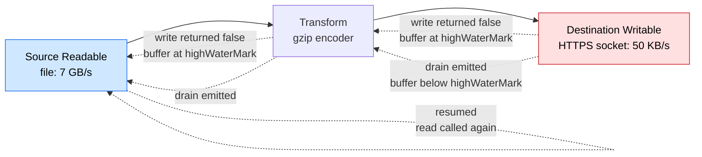
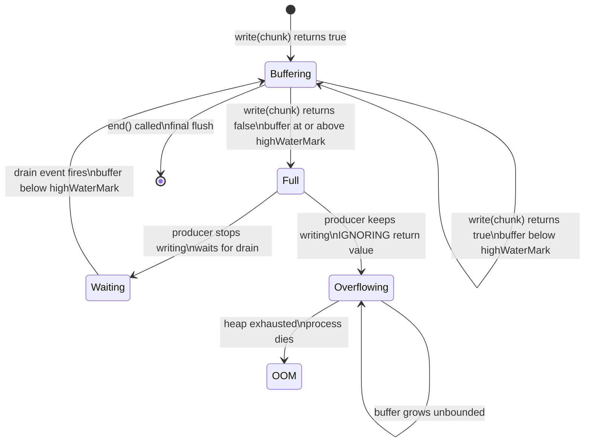

# 3.08 Streams Advanced Backpressure

> Backpressure is the stream's way of saying "slow down, I cannot keep up." Ignore it and your process dies of memory exhaustion. Respect it and your pipeline becomes a self-regulating conveyor belt that never overflows.

## 1. Purpose

Backpressure is the single most important concept in Node.js streams, and it is also the one most often ignored by developers who reach for `pipe()` without reading the return value of `write()`. This note exists to make backpressure impossible to misunderstand: what it is, why it exists, how it propagates, how to implement it correctly in custom streams, and how to diagnose the catastrophic memory exhaustion that follows when you get it wrong.

A Node.js stream is a conveyor belt between a **producer** (the source of bytes) and a **consumer** (the sink that absorbs them). In an ideal world the producer and consumer run at exactly the same speed, so the belt is always perfectly loaded. In the real world they never do. A high-speed NVMe SSD can push 7 GB/s of data into a Readable stream; a gzip Transform can only compress at perhaps 300 MB/s; an HTTPS response to a mobile client on a flaky 3G connection might drain at 50 KB/s. Without coordination, the producer floods the consumer's internal buffer, the buffer grows without bound, the V8 heap explodes, and the process dies with an `OOM-killed` exit code or a `JavaScript heap out of memory` `FATAL ERROR`.

Backpressure is the coordination mechanism. It is a **signal that travels upstream**: the slow consumer tells the fast producer "stop, I am full," and the producer obliges by pausing. When the consumer has drained enough of its buffer, it sends a second signal — "ok, you may resume" — and the producer starts pushing again. The result is a pipeline that runs at the speed of the slowest link, with bounded memory usage at every stage.

Concretely, backpressure in Node.js is built on three primitives:

1. **`writable.write(chunk)` returns a boolean.** `true` means "the internal buffer is still below the `highWaterMark`, keep writing." `false` means "the buffer is at or above the `highWaterMark`, stop writing and wait."
2. **The `'drain'` event on a Writable stream.** It fires once, after `write()` has returned `false`, when the buffer has been drained back below the `highWaterMark`. It is the consumer's "ok, resume" signal.
3. **`pipeline(src, ...transforms, dest, callback)`** from `node:stream`. It wires up the source through the transforms to the destination and **automatically** propagates backpressure: when `dest` signals `false`, every transform upstream pauses, all the way back to `src`, which is paused (if it is a Readable in flowing mode) or has its `read` hook withheld (if it is being pulled).

Without backpressure, the producer drowns the consumer; memory explodes. With backpressure, the pipeline self-throttles to the slowest stage and stays within its memory budget. The purpose of this note is to make the mechanism, the implementation, and the failure modes so concrete that you will never again write `writable.write(chunk)` without checking the return value.

## 2. Theory and Deep Dive

### 2.1 The `write()` Contract

Every Writable stream in Node.js exposes a `write(chunk, encoding?, callback?)` method. Its return value is the heart of backpressure:

- **Returns `true`** when, after enqueueing `chunk`, the internal buffer is still **strictly below** the stream's `highWaterMark` (default 16 KB for normal Writable streams, 16 objects for object-mode streams). The producer may call `write()` again immediately.
- **Returns `false`** when, after enqueueing `chunk`, the internal buffer is **at or above** the `highWaterMark`. The producer **must stop calling `write()`** and must wait for the `'drain'` event before writing more.

The `highWaterMark` is not a hard cap — the buffer can exceed it. It is a soft trigger. The stream will accept the chunk that pushed it over the mark (which is why `write()` returns `false` rather than throwing), but it is now the producer's responsibility to back off. The buffer will continue to hold everything written so far until the underlying resource (file descriptor, socket, gzip encoder) consumes it.

### 2.2 The `'drain'` Event

After `write()` returns `false`, the stream emits `'drain'` exactly once when the buffer has been flushed back below the `highWaterMark`. The canonical producer loop is:

```js
function pumpWithBackpressure(src, dest) {
  src.on('data', (chunk) => {
    if (!dest.write(chunk)) {
      src.pause();
      dest.once('drain', () => src.resume());
    }
  });
  src.on('end', () => dest.end());
}
```

This is literally what `pipe()` and `pipeline()` do internally. The pattern is: on every chunk, check `write()`; if false, pause the source and register a one-shot `'drain'` listener that resumes the source.

### 2.3 Two Modes of Readable Stream

A Readable stream has two operating modes, and backpressure behaves differently in each:

- **Flowing mode.** The stream pushes data via `'data'` events as fast as it can read. Backpressure is achieved by calling `src.pause()` when the destination is full and `src.resume()` on drain. This is the mode `pipe()` puts the source into.
- **Paused (pull) mode.** The stream only produces data when `src.read(n)` is called explicitly, or when the stream is being consumed by `for await...of` or pulled by a Transform's read hook. Backpressure is automatic: nothing is pulled until the consumer asks for it.

`for await...of` over a Readable is the modern, backpressure-safe consumption idiom. The loop naturally awaits each chunk, so the consumer never pulls faster than it can process.

### 2.4 Custom Streams and the Implementation Hooks

When you create a custom `Readable`, `Writable`, or `Transform`, you pass implementation functions to the constructor (or override the underscore-prefixed hooks if you subclass — both forms are equivalent; this note uses the constructor-option form throughout because it is more concise and works identically in JS and TS):

- **`Readable`**: pass a `read(size)` function. Inside it, push data with `this.push(chunk)`. Node withholds calls to this hook when the internal buffer is full, so a correctly implemented Readable automatically respects backpressure: just keep calling `push()` until it returns `false`, then stop. Node will call `read` again when there is room.
- **`Writable`**: pass a `write(chunk, encoding, callback)` function. Write the chunk to the underlying resource, then invoke `callback()` (or `callback(err)`) when the resource is ready for more. Node will not deliver the next chunk until `callback` fires, so a slow underlying resource automatically throttles the producer. Pass `final(callback)` for end-of-stream cleanup, and `destroy(err, callback)` for resource teardown.
- **`Transform`**: pass a `transform(chunk, encoding, callback)` function. Transform the chunk, call `this.push(transformed)` zero or more times, then invoke `callback(err?, data?)`. The Transform is simultaneously a Writable (upstream writes into it) and a Readable (downstream reads from it), so backpressure flows in both directions: it pauses upstream when its Writable side fills, and it pauses downstream pulls when its Readable side is full. Pass a `flush(callback)` hook if you need to emit trailing data after the last input chunk.

### 2.5 How Backpressure Propagates Through a Pipeline

Consider a 3-stage pipeline: `src` (a fast file Readable) → `gzip` (a Transform) → `dest` (a slow HTTPS response Writable). The chain of backpressure signals looks like this:



Reading the diagram top-to-bottom for the "full" signal:

1. `dest.write(chunk)` returns `false` because the HTTPS socket is slow and its buffer has hit the `highWaterMark`.
2. The Transform's Writable side stops accepting data from upstream. Its own buffer fills, and its `transform` hook is no longer called by Node.
3. The Transform's Readable side stops pushing to `dest` (because `dest` is full). Its internal buffer fills.
4. The Transform signals upstream: `src` is paused (or its `read` hook is withheld).
5. `src` stops reading from the file. The file descriptor sits idle.

Reading the dotted "drain" arrows bottom-to-top for the "resume" signal:

1. The HTTPS socket flushes a chunk; `dest`'s buffer drops below `highWaterMark`; `dest` emits `'drain'`.
2. The Transform's Readable side pushes more data to `dest`.
3. The Transform's Writable side drains; it emits `'drain'` upstream.
4. `src` is resumed; `read` is called again; more file bytes flow in.

The net effect: the entire pipeline runs at the speed of the slowest link (the HTTPS socket), and every buffer along the way stays at or near its `highWaterMark`. Memory usage is bounded by the sum of `highWaterMark` across all stages, which is tiny.

### 2.6 `pipeline()` Versus `.pipe()`

The legacy `.pipe()` method wires up backpressure correctly but has two fatal flaws:

1. **No error propagation.** If any stage in `a.pipe(b).pipe(c)` emits `'error'`, the other stages are not automatically destroyed. You get a stream leak (file descriptors stay open) and unhandled `'error'` events crash the process.
2. **No cleanup on destination abort.** If the destination closes early, the source keeps pumping.

`pipeline(src, ...transforms, dest, callback)` fixes both. It:

- Registers `'error'` and `'close'` listeners on every stream.
- On any error, calls `.destroy(err)` on every stream, propagating the error to the callback.
- On normal completion, calls the callback with no arguments.
- Handles backpressure exactly as `.pipe()` does, but with the safety net.

Since Node 10, `pipeline` is the only correct way to compose streams. `.pipe()` is legacy.

### 2.7 `for await...of` and Async Generators

Async iteration is the cleanest modern way to consume a Readable with backpressure. The loop body `await`s between iterations, so the consumer naturally throttles the producer:

```js
for await (const chunk of readable) {
  await process(chunk);  // slow operation
}
```

Node will not pull the next chunk until `process(chunk)` resolves. This is structurally backpressure-safe and is the recommended pattern for new code. Async generators (functions marked `async function*`) can be wrapped with `Readable.from()` to produce streams, and they compose beautifully with `pipeline`.

### 2.8 Memory Exhaustion Without Backpressure

When a producer ignores the return value of `write()` and just keeps writing, the Writable's internal buffer grows without bound. Each chunk sits in memory until the underlying resource consumes it. For a fast producer and slow consumer, the buffer can accumulate hundreds of megabytes in seconds. Eventually:

- The V8 heap limit is hit (default ~2 GB on 64-bit, but the old-generation heap is much smaller in practice — often 1.5 GB or less).
- V8 throws `FATAL ERROR: Ineffective mark-compacts near heap limit Allocation failed - JavaScript heap out of memory`.
- Or, on Linux, the kernel OOM-killer sends `SIGKILL` and the process vanishes with exit code 137.

The recovery is to introduce backpressure: either check `write()` return values manually, or — almost always — switch to `pipeline()` and let Node handle it.

### 2.9 `highWaterMark` Tuning

The default `highWaterMark` is 16 KB (16,384 bytes) for byte streams and 16 objects for object-mode streams. It is a trade-off:

- **Too low** (e.g., 1 KB): the producer and consumer thrash between full and empty, paying the overhead of `pause`/`resume` and `'drain'` events on every chunk. Throughput drops.
- **Too high** (e.g., 64 MB): backpressure triggers too late; the buffer can balloon before anyone pauses. Memory usage spikes, and the latency of the slowest stage is hidden behind a giant in-flight buffer.

For most workloads, the default is right. Tune up (to 64 KB or 256 KB) only when you have measured that the `'drain'` overhead is dominating. Tune down (to 1 KB or 4 KB) only for very-low-memory embedded targets or when you need fine-grained flow control. Never set it to a value larger than the amount of memory you are willing to lose to a single stage's buffer.

### 2.10 The State Machine of a Single Write

A single `write()` call moves the Writable through a small state machine. Understanding it clarifies why the `'drain'` event is one-shot and why you must re-register it after every `false` return:



The `Overflowing` state is the bug. It is reached only when the producer ignores the `false` return value. The fix is to never leave the `Buffering` → `Full` → `Waiting` → `Buffering` cycle: always honor `false`, always wait for `'drain'`.

## 3. Mental Models

Backpressure is best held in the head as a small set of vivid analogies. Internalize these and the API becomes obvious.

**Mental Model 1: The Conveyor Belt with a Pressure Sensor.** Imagine a factory conveyor belt. The producer dumps boxes onto the belt; the consumer takes them off the end. The belt has a pressure sensor: when boxes pile up past a threshold, a red light flashes "stop," and the producer halts. When the consumer clears enough boxes, the light turns green and the producer resumes. The `write()` return value is the red light; the `'drain'` event is the green light.

**Mental Model 2: The Full Glass.** Pouring water into a glass. `write(chunk)` is pouring. The return value `true` means "there is still room below the rim." The return value `false` means "you are at the rim, stop pouring." `'drain'` is the glass telling you "I have sipped some, you may pour a little more." Ignore the signal and water spills everywhere — memory exhaustion.

**Mental Model 3: The Polite Dinner Guest.** A good dinner guest does not keep talking when the host's mouth is full. They say a sentence, watch the host chew, and only continue when the host swallows. `write()` returning `false` is the host's "hold on, I'm chewing" gesture. `'drain'` is the swallow. The producer who ignores `write()` is the boor who talks over everyone.

**Mental Model 4: The Brake Lights on a Highway.** Cars in a chain. The front car (the slow consumer, the destination socket) brakes. Its brake lights come on. The car behind sees the lights and brakes too, propagating the signal backward through the chain. When the front car accelerates, its brake lights go off, and each car behind accelerates in turn. Backpressure propagates upstream exactly like brake lights; resumption propagates the same way in reverse.

**Mental Model 5: The Pull Rope.** A long rope between a fast puller (producer) and a slow puller (consumer). The fast puller yanks; the slow puller cannot keep up; the rope goes taut and the fast puller must wait for slack. `write()` returning `false` is the rope going taut; `'drain'` is slack returning.

**Mental Model 6: The Inbox and the Worker.** An email inbox (the buffer) and a worker (the underlying resource) who processes one email at a time. The producer keeps forwarding emails into the inbox. The `highWaterMark` is the inbox's capacity warning: "inbox is 80 percent full, slow down." `write()` returning `false` is the warning. `'drain'` is the inbox dropping back below 50 percent. Ignore the warning and the inbox server crashes (OOM).

**Mental Model 7: `pipeline` as the Conveyor Belt Manager.** `pipeline` is the factory floor manager who installs pressure sensors on every belt, wires the red lights to the upstream machines, and adds a master kill switch that shuts down the whole line if any single machine throws a gear. You do not have to install sensors yourself; the manager does it. You just have to call `pipeline`.

**Mental Model 8: Async Iteration as a Conversation.** `for await (const chunk of readable)` is a conversation: the consumer asks "what's next?", the producer answers with one chunk, the consumer thinks about it (the `await process(chunk)`), then asks again. The producer never volunteers a second chunk until asked. There is no need for a "stop" signal because the producer only speaks when spoken to. This is why async iteration is structurally backpressure-safe.

These eight mental models all describe the same mechanism from different angles. The takeaway: backpressure is a polite pause-and-resume protocol between a fast producer and a slow consumer, mediated by a soft buffer limit and a single boolean return value.

## 4. Real-World Use Cases

### 4.1 File Processing Where the Disk Is Slower Than the CPU

Reading a 100 GB CSV file, parsing each row, and writing transformed rows to a new file. The CPU can parse at perhaps 500 MB/s; the disk reads at 200 MB/s and writes at 200 MB/s. Without backpressure, the parser outruns the writer; the writer's buffer fills with unflushed rows; memory explodes. With `pipeline(readCsv, parse, transform, writeCsv)`, the parser is paused whenever the writer's buffer hits `highWaterMark`, and the whole pipeline runs at the disk's speed with bounded memory.

### 4.2 HTTP Request to Response Where the Network Is Slower Than the Disk

Serving a large file over HTTP. The disk reads at 200 MB/s; the client's network downloads at 5 MB/s. `pipeline(fs.createReadStream(path), res)` lets the kernel TCP send buffer and Node's Writable buffer fill to `highWaterMark`, then pauses the file read until the client drains some bytes. Without backpressure, Node would read the entire file into memory waiting for the slow client, and one request could OOM the server.

### 4.3 Streaming Uploads to S3 Where S3 Is Slower Than Local

Uploading a 50 GB database dump to S3. The local SSD reads at 1 GB/s; S3's multipart upload accepts at perhaps 100 MB/s. `pipeline(fs.createReadStream(dump), gzip, s3UploadStream)` keeps the gzip encoder and the file reader paused while S3 slowly ingests. Without backpressure, the gzip encoder would emit compressed bytes faster than S3 could accept them, and the S3 upload stream's buffer would balloon to gigabytes.

### 4.4 Log Processing Where the Consumer Parses Slower Than the Producer Reads

Tail-and-process a high-volume log file (or a Kafka topic). The log source produces lines at 100k/sec; the parser/normalizer handles 20k/sec. `pipeline(logSource, parseLine, enrich, batchSink)` throttles the source to the parser's speed. Without backpressure, the parser's input queue grows unbounded and the process dies within minutes.

### 4.5 Real-Time Data Feeds Where the Producer Bursts and the Consumer Is Steady

A WebSocket feed from a market-data provider that bursts 10k messages in a single tick when the market opens, then goes quiet for seconds. The consumer (a risk engine) processes at a steady 1k/sec. Backpressure here is a smoothing function: the buffer absorbs the burst, then drains steadily. `highWaterMark` tuning matters — too small and the burst causes backpressure thrash; too large and a single burst consumes too much memory.

### 4.6 Database Bulk Export to Parquet

Exporting a billion-row table to Parquet files on S3. The database cursor yields rows at 200k/sec; the Parquet encoder can columnate at 80k/sec; S3 accepts at 50 MB/s. `pipeline(dbCursor, parquetEncoder, s3Stream)` runs the whole chain at S3's pace. The cursor stays paused most of the time, the database connection pool is not saturated, and memory stays flat at a few MB regardless of export size.

### 4.7 Video Transcoding

Piping raw video frames from a capture device through an FFmpeg Transform into a streaming HLS output. Frames arrive at 60 fps; FFmpeg encodes at 30 fps. Backpressure pauses the capture device when FFmpeg falls behind, preventing frame-buffer memory blowup. Without it, every minute of capture would accumulate 1,800 unencoded frames in memory.

### 4.8 AI Inference Streaming

Token streaming from an LLM API through a post-processor to an HTTP Server-Sent Events response. The LLM produces tokens at 50/sec; the client's network drains at 10/sec. `pipeline(llmTokenStream, postProcess, res)` keeps the LLM connection paused while the client catches up. Without backpressure, a slow client causes the server to buffer an entire long response in memory — one per concurrent request — and a handful of slow clients OOM the server.

## 5. Code Examples

### 5.1 Example A — Minimal and Conceptual

A minimal backpressure-aware writer. A fast producer (a generator that yields numbers as strings) writes to a slow consumer (a Writable that takes 50 ms per chunk). We respect the `write()` return value and wait for `'drain'`.

#### JavaScript

```js
const { Writable } = require('node:stream');

// A slow consumer: takes 50 ms to "process" each chunk.
const slowSink = new Writable({
  write(chunk, encoding, callback) {
    setTimeout(() => {
      console.log('consumed:', chunk.toString().trim());
      callback();
    }, 50);
  },
});

// A fast producer: yields immediately, never waits on its own.
function* fastProducer() {
  for (let i = 0; i < 1000; i++) {
    yield `line ${i}\n`;
  }
}

// Backpressure-aware pump.
function pump(generator, sink) {
  return new Promise((resolve, reject) => {
    const iter = generator();
    sink.on('error', reject);

    function writeNext() {
      let canContinue = true;
      while (canContinue) {
        const { value, done } = iter.next();
        if (done) {
          sink.end(resolve);
          return;
        }
        canContinue = sink.write(value);
        if (!canContinue) {
          // Buffer at highWaterMark. Wait for drain.
          sink.once('drain', writeNext);
          return;
        }
      }
    }

    writeNext();
  });
}

pump(fastProducer(), slowSink).then(() => console.log('done'));
```

#### TypeScript

```ts
import { Writable } from 'node:stream';

interface LineSinkOptions {
  delayMs?: number;
}

function createSlowLineSink(opts: LineSinkOptions = {}): Writable {
  const delayMs: number = opts.delayMs ?? 50;
  return new Writable({
    write(
      chunk: Buffer,
      encoding: BufferEncoding,
      callback: (error?: Error | null) => void,
    ): void {
      setTimeout(() => {
        console.log('consumed:', chunk.toString('utf8').trim());
        callback();
      }, delayMs);
    },
  });
}

function* fastProducer(): Generator<string> {
  for (let i = 0; i < 1000; i++) {
    yield `line ${i}\n`;
  }
}

function pump(generator: Generator<string>, sink: Writable): Promise<void> {
  return new Promise<void>((resolve, reject) => {
    const iter = generator();
    sink.on('error', reject);

    const writeNext = (): void => {
      let canContinue = true;
      while (canContinue) {
        const { value, done } = iter.next();
        if (done) {
          sink.end(resolve);
          return;
        }
        canContinue = sink.write(value);
        if (!canContinue) {
          sink.once('drain', writeNext);
          return;
        }
      }
    };

    writeNext();
  });
}

pump(fastProducer(), createSlowLineSink({ delayMs: 50 })).then(() =>
  console.log('done'),
);
```

**What to observe.** Without the `canContinue` check and the `once('drain', writeNext)`, the producer would push all 1000 lines into the Writable's buffer instantly. With the check, the producer stops as soon as `write()` returns `false`, waits for `'drain'`, and resumes. Memory stays flat; throughput drops to the consumer's 20 lines/sec.

### 5.2 Example B — Production-Grade

A typed pipeline: read a CSV file, parse it into row objects, filter out rows that fail validation, convert back to CSV, gzip, and write to a destination file. The destination is artificially slowed to demonstrate backpressure propagation. Memory is logged at intervals.

#### JavaScript

```js
const { pipeline, Transform, Writable } = require('node:stream');
const { createReadStream, createWriteStream } = require('node:fs');
const { createGzip } = require('node:zlib');
const path = require('node:path');

function parseCsvLine(line) {
  const [id, name, email, amount] = line.split(',');
  return { id, name, email, amount: Number(amount) };
}

function toCsvLine(row) {
  return [row.id, row.name, row.email, row.amount].join(',') + '\n';
}

function createCsvParser() {
  let remainder = '';
  return new Transform({
    objectMode: true,
    transform(chunk, encoding, callback) {
      const text = remainder + chunk.toString('utf8');
      const lines = text.split('\n');
      remainder = lines.pop();
      for (const line of lines) {
        if (line.trim()) this.push(parseCsvLine(line));
      }
      callback();
    },
    flush(callback) {
      if (remainder.trim()) this.push(parseCsvLine(remainder));
      callback();
    },
  });
}

function createRowFilter(predicate) {
  return new Transform({
    objectMode: true,
    transform(row, encoding, callback) {
      if (predicate(row)) this.push(row);
      callback();
    },
  });
}

function createCsvStringifier() {
  return new Transform({
    writableObjectMode: true,
    transform(row, encoding, callback) {
      this.push(toCsvLine(row));
      callback();
    },
  });
}

function createSlowFileSink(filePath, delayMs) {
  const stream = createWriteStream(filePath);
  return new Writable({
    write(chunk, encoding, callback) {
      stream.write(chunk);
      setTimeout(callback, delayMs);
    },
    final(callback) {
      stream.end(callback);
    },
  }).on('error', (err) => stream.destroy(err));
}

const inputPath = path.join(process.cwd(), 'input.csv');
const outputPath = path.join(process.cwd(), 'output.csv.gz');

const isHealthy = (row) =>
  row.id && row.email.includes('@') && Number.isFinite(row.amount) && row.amount > 0;

const memWatcher = setInterval(() => {
  const mb = process.memoryUsage().heapUsed / 1024 / 1024;
  console.log(`heap: ${mb.toFixed(1)} MB`);
}, 1000);

pipeline(
  createReadStream(inputPath),
  createCsvParser(),
  createRowFilter(isHealthy),
  createCsvStringifier(),
  createGzip(),
  createSlowFileSink(outputPath, 20),
  (err) => {
    clearInterval(memWatcher);
    if (err) {
      console.error('pipeline failed:', err);
      process.exit(1);
    }
    console.log('pipeline succeeded');
  },
);
```

#### TypeScript

```ts
import {
  pipeline,
  Transform,
  Writable,
  TransformCallback,
} from 'node:stream';
import { createReadStream, createWriteStream } from 'node:fs';
import { createGzip } from 'node:zlib';
import * as path from 'node:path';

interface Row {
  id: string;
  name: string;
  email: string;
  amount: number;
}

type WriteCallback = (error?: Error | null) => void;

function parseCsvLine(line: string): Row {
  const [id, name, email, amount] = line.split(',');
  return { id, name, email, amount: Number(amount) };
}

function toCsvLine(row: Row): string {
  return [row.id, row.name, row.email, row.amount].join(',') + '\n';
}

function createCsvParser(): Transform {
  let remainder: string = '';
  return new Transform({
    objectMode: true,
    transform(
      chunk: Buffer,
      encoding: BufferEncoding,
      callback: TransformCallback,
    ): void {
      const text: string = remainder + chunk.toString('utf8');
      const lines: string[] = text.split('\n');
      remainder = lines.pop() ?? '';
      for (const line of lines) {
        if (line.trim()) this.push(parseCsvLine(line));
      }
      callback();
    },
    flush(callback: TransformCallback): void {
      if (remainder.trim()) this.push(parseCsvLine(remainder));
      callback();
    },
  });
}

function createRowFilter(predicate: (row: Row) => boolean): Transform {
  return new Transform({
    objectMode: true,
    transform(row: Row, encoding: BufferEncoding, callback: TransformCallback): void {
      if (predicate(row)) this.push(row);
      callback();
    },
  });
}

function createCsvStringifier(): Transform {
  return new Transform({
    writableObjectMode: true,
    transform(row: Row, encoding: BufferEncoding, callback: TransformCallback): void {
      this.push(toCsvLine(row));
      callback();
    },
  });
}

function createSlowFileSink(filePath: string, delayMs: number): Writable {
  const stream = createWriteStream(filePath);
  const sink = new Writable({
    write(chunk: Buffer, encoding: BufferEncoding, callback: WriteCallback): void {
      stream.write(chunk);
      setTimeout(callback, delayMs);
    },
    final(callback: WriteCallback): void {
      stream.end(callback);
    },
  });
  sink.on('error', (err: Error) => stream.destroy(err));
  return sink;
}

const inputPath: string = path.join(process.cwd(), 'input.csv');
const outputPath: string = path.join(process.cwd(), 'output.csv.gz');

const isHealthy = (row: Row): boolean =>
  Boolean(row.id) &&
  row.email.includes('@') &&
  Number.isFinite(row.amount) &&
  row.amount > 0;

const memWatcher: NodeJS.Timeout = setInterval(() => {
  const mb: number = process.memoryUsage().heapUsed / 1024 / 1024;
  console.log(`heap: ${mb.toFixed(1)} MB`);
}, 1000);

pipeline(
  createReadStream(inputPath),
  createCsvParser(),
  createRowFilter(isHealthy),
  createCsvStringifier(),
  createGzip(),
  createSlowFileSink(outputPath, 20),
  (err?: Error | null) => {
    clearInterval(memWatcher);
    if (err) {
      console.error('pipeline failed:', err);
      process.exit(1);
    }
    console.log('pipeline succeeded');
  },
);
```

**What to observe.** The slow file sink deliberately delays each `write` by 20 ms to simulate a slow destination. Watch the heap log: it stays flat at a few MB, regardless of input file size. Comment out the `setTimeout(callback, this.delayMs)` line (making the sink instant) and the pipeline runs much faster but the heap stays flat too — backpressure is no longer engaged because the consumer is no longer slow. Comment out the `if (!canContinue) { sink.once('drain', ...) }` logic in Example A and re-run, and you will see the heap climb steadily as the buffer fills. That contrast is the whole lesson of backpressure.

## 6. Common Mistakes and Anti-Patterns

### 6.1 Ignoring the `write()` Return Value

```js
// BAD: never checks the return value
src.on('data', (chunk) => dest.write(chunk));
```

This is the original sin of streams. `dest.write(chunk)` may return `false`, but the producer keeps pushing `'data'` events as fast as the source can emit them. The destination's buffer grows without bound. With a fast source and a slow destination, the process OOMs in seconds. **Fix:** check the return value, pause the source on `false`, resume on `'drain'`. Or just use `pipeline`.

### 6.2 Not Waiting for `'drain'` Before Writing Again

```js
// BAD: registers drain but does not actually stop writing
src.on('data', (chunk) => {
  const ok = dest.write(chunk);
  if (!ok) {
    dest.once('drain', () => {
      // nothing here resumes the source, so data keeps coming
    });
  }
});
```

The check is there, but the source is never paused, so `'data'` events keep firing. The `'drain'` listener is decorative. **Fix:** in the `if (!ok)` branch, call `src.pause()`, and in the `'drain'` handler call `src.resume()`.

### 6.3 Using `.pipe()` Without Error Handling

```js
// BAD: errors in any stream are not propagated; resources leak
fs.createReadStream('input.txt')
  .pipe(zlib.createGzip())
  .pipe(fs.createWriteStream('output.txt.gz'));
```

If the gzip transform throws, or the destination file is unwritable, an `'error'` event is emitted. Without a listener, Node's default behavior is to throw the error and crash the process. Worse, the other streams are not cleaned up — file descriptors leak. **Fix:** use `pipeline()`.

### 6.4 `pipeline` Without the Final Callback

```js
// BAD: errors are swallowed, completion is invisible
pipeline(src, transform, dest);
```

Without the callback (or without `await pipeline(...)` in its promise form), errors in any stream are emitted as `'error'` events on that stream, which — if unhandled — crash the process, and the pipeline's automatic cleanup still runs but you have no way to know whether the pipeline succeeded. **Fix:** always pass a callback, or `await` the promise form (`node:stream/promises`).

### 6.5 Custom Streams Not Calling the Implementation Callback

```js
// BAD: callback never invoked, stream hangs forever
const bad = new Writable({
  write(chunk, encoding, callback) {
    saveToDb(chunk);  // forgot to call callback()
  },
});
```

Node calls the `write` hook with a callback. The contract is: invoke the callback when you are ready for the next chunk. If you never call it, Node never sends another chunk, and the pipeline stalls forever (or until the source emits `'end'` and the Writable hangs in a half-open state). **Fix:** always call `callback()` (or `callback(err)` on failure), even — especially — on slow paths. Use `setTimeout(callback, delay)` if you must simulate latency.

### 6.6 `highWaterMark` Set Too High

```js
// BAD: 1 GB buffer defeats backpressure
const sink = new Writable({ highWaterMark: 1 << 30, write() {} });
```

A 1 GB `highWaterMark` means the producer will keep writing until 1 GB is buffered before getting a `false` return value. For a slow consumer this is 1 GB of wasted memory per stage. Backpressure still works in principle, but the trigger fires so late that you have already paid the memory cost. **Fix:** leave the default (16 KB) unless you have measured that drain overhead is dominating throughput, in which case tune up modestly (64 KB to 256 KB).

### 6.7 Pushing from a Readable After `push()` Returned `false`

```js
// BAD: ignores push() return value, over-produces
const badSource = new Readable({
  read(size) {
    while (true) {
      const chunk = generateChunk();
      this.push(chunk);  // push() may return false; ignored
    }
  },
});
```

`this.push(chunk)` returns `false` when the internal buffer is at `highWaterMark`. Ignoring it means the Readable's buffer grows unbounded — the same OOM scenario, just on the producer side. **Fix:** check the return value of `push()` and stop generating when it returns `false`. Node will call `read` again when there is room.

### 6.8 Mixing `pipe()` and `'data'` Listeners

```js
// BAD: pipe() and a manual data listener fight for control
src.pipe(dest);
src.on('data', (chunk) => log(chunk));
```

Adding a `'data'` listener switches the source to flowing mode, which can interfere with `pipe()`'s own flow control. The `'data'` listener receives every chunk but does not respect the destination's backpressure, so it can cause the source to flow faster than `dest` can absorb. **Fix:** use `pipeline` for transport, and observe chunks with a Transform in the pipeline (e.g., a logging transform), not a direct `'data'` listener.

### 6.9 Forgetting to Handle `'error'` on Every Stream

```js
// BAD: only dest has an error listener
pipeline(src, transform, dest, (err) => { /* ... */ });
// plus an unmanaged side-stream:
const sideStream = new Transform({ transform() {} });
src.pipe(sideStream);  // no error listener on sideStream
```

`pipeline` does attach error listeners to every stream it manages, so the pipeline itself is fine. The mistake is adding extra streams outside the pipeline (e.g., a manually-created Transform tee'd off the side) and forgetting to add `'error'` listeners there. An unhandled `'error'` on any stream crashes the process. **Fix:** every stream you create outside a `pipeline` call needs an `'error'` listener, or attach it via `stream.on('error', ...)`.

### 6.10 Not Calling `end()` on the Destination

```js
// BAD: source ends but destination never closes
src.on('data', (chunk) => dest.write(chunk));
src.on('end', () => { /* forgot dest.end() */ });
```

The destination's underlying resource (file descriptor, socket) stays open forever. File descriptors leak; eventually `EMFILE: too many open files` crashes the process. **Fix:** always call `dest.end()` on source `'end'`, or use `pipeline` which does this for you.

### 6.11 Object-Mode Without Realizing It

```js
// BAD: silently switches to object mode, highWaterMark becomes 16 OBJECTS not 16KB
const t = new Transform({
  readableObjectMode: true,
  transform(chunk, encoding, callback) {
    this.push({ value: chunk.length });  // pushing objects
    callback();
  },
});
```

A transform with `readableObjectMode: true` has a `highWaterMark` of 16 objects on its readable side. If you push large objects (e.g., 1 MB each), 16 objects is 16 MB of buffer before backpressure engages. Conversely, if you intended byte mode and accidentally pushed an object, you get a `TypeError: The "chunk" argument must be of type string or an instance of Buffer`. **Fix:** be explicit about `objectMode`, `writableObjectMode`, and `readableObjectMode`. Tune `highWaterMark` to match the size of the objects you push.

## 7. Best Practices and Design Patterns

### 7.1 Always Check the `write()` Return Value

Treat `writable.write(chunk)` as a function that returns a boolean you must honor. The only exception is when you are intentionally willing to buffer (e.g., a tiny one-shot write of a few KB at startup). For anything sustained, check the return and wait for `'drain'`.

### 7.2 Use `pipeline()` for Every Multi-Stage Pipeline

`pipeline` from `node:stream` is the canonical, correct, error-safe composition primitive. It handles backpressure, error propagation, cleanup, and `end()` for you. There is no good reason to use `.pipe()` chains in new code. The promise form (`const { pipeline } = require('node:stream/promises')`) is even cleaner.

### 7.3 Implement the Hooks Correctly

When creating a custom `Readable`, `Writable`, or `Transform` via constructor options:

- Always call the `callback` argument of `write` / `transform` / `final`. Forgetting it hangs the pipeline.
- In `read`, stop pushing when `this.push(chunk)` returns `false`. Node will call `read` again when there is room.
- In `transform`, call `this.push(output)` for each transformed output chunk (you can push zero, one, or many per input), then `callback()`.
- Implement `final` for Writables if you need to flush state before the underlying resource closes.
- Implement `destroy` to clean up external resources (file descriptors, database connections).

### 7.4 Tune `highWaterMark` Based on Workload

- Default (16 KB / 16 objects) for general use.
- 64 KB to 256 KB for high-throughput byte streams where `'drain'` overhead matters.
- 4 KB to 8 KB for low-memory environments or when you need fine-grained flow control.
- Object mode: 16 to 64 objects depending on per-object size.

Never set it above the memory you can afford to lose per stage.

### 7.5 Prefer `for await...of` for Consumption

```js
for await (const chunk of readable) {
  await process(chunk);
}
```

This is the modern, idiomatic, backpressure-safe consumption pattern. The `await` in the loop body naturally throttles the producer. Combine with `pipeline` for the production side.

### 7.6 Monitor Memory in Stream-Heavy Code

In long-running stream pipelines, log `process.memoryUsage().heapUsed` periodically. If it grows monotonically, you have a backpressure bug or a leak. A correctly backpressured pipeline shows flat memory regardless of input size.

### 7.7 Use the Promise Form of `pipeline`

```js
const { pipeline } = require('node:stream/promises');
await pipeline(src, transform, dest);
```

The promise form integrates cleanly with `async`/`await` and `try`/`catch`. Errors propagate as rejections. This is the cleanest API for new code.

### 7.8 Design Pattern: The Backpressure-Aware Queue

When you need to buffer between a producer and consumer that are not directly stream-connected (e.g., producer is a webhook handler, consumer is a batch database writer), use a bounded queue with explicit blocking semantics. `p-queue` with `concurrency` and a max queue size approximates this; `fastq` is another option. The queue's "full" signal is the analog of `write()` returning `false`; the queue's "drained below threshold" signal is the analog of `'drain'`.

### 7.9 Design Pattern: The Transform Tee

When you need to fan-out one input to multiple outputs while preserving backpressure, write a Transform that pushes to multiple destinations and only calls `callback()` when all destinations have drained. This is fiddly to get right; consider the `streamx` library's `passThrough` with `Writable.from` for simpler fan-out. The key invariant: the upstream must not be resumed until all downstreams are ready.

### 7.10 Design Pattern: Async Generator Pipelines

For pure in-process pipelines without filesystem or network I/O, async generators compose beautifully:

```js
async function* parse(source) {
  for await (const chunk of source) {
    for (const line of chunk.toString().split('\n')) {
      if (line) yield JSON.parse(line);
    }
  }
}

async function* filter(source, predicate) {
  for await (const item of source) {
    if (predicate(item)) yield item;
  }
}

for await (const item of filter(parse(readable), isValid)) {
  // consume
}
```

Each `yield` naturally propagates backpressure: the consumer's `await` between iterations pauses the entire generator chain. `Readable.from(asyncGenerator)` bridges this world back into Node streams for interoperability.

### 7.11 Design Pattern: The Circuit Breaker on Top of Backpressure

Backpressure handles slow consumers, but it cannot handle a *broken* consumer (e.g., a database that has stopped accepting writes entirely). Without a circuit breaker, the pipeline pauses forever and memory stays flat but the process is effectively deadlocked. Add a timeout: if the Writable's `write` callback has not fired within N seconds, destroy the stream with a `TimeoutError` so `pipeline`'s error handling kicks in. Libraries like `p-timeout` wrap this pattern; you can also implement it with `setTimeout` inside the `write` hook.

## 8. Technical Interview Knowledge

### Q1: What is backpressure?

**A:** Backpressure is the mechanism by which a slow consumer signals to a fast producer to slow down, preventing the producer from overwhelming the consumer's buffer and exhausting memory. In Node.js streams, it is implemented via the boolean return value of `writable.write(chunk)` (returns `false` when the buffer is at or above `highWaterMark`) and the `'drain'` event (emitted when the buffer drops back below). Without backpressure, a fast source feeding a slow destination causes the destination's internal buffer to grow unbounded, leading to OOM crashes.

### Q2: How does `write()` signal backpressure?

**A:** `writable.write(chunk, encoding?, callback?)` returns a boolean. `true` means "the internal buffer is still below `highWaterMark`, you may keep writing." `false` means "the buffer is at or above `highWaterMark`, stop calling `write()` and wait for the `'drain'` event." The `highWaterMark` is a soft limit, not a hard cap — the chunk that pushes the buffer over the limit is still accepted; it is the producer's responsibility to back off afterward.

### Q3: What is the `'drain'` event?

**A:** After `write()` returns `false`, the Writable stream emits `'drain'` exactly once when its internal buffer has been flushed back below `highWaterMark` by the underlying resource. The canonical producer loop is: on each chunk, call `write()`; if it returns `false`, pause the source and register a one-shot `once('drain', () => source.resume())` listener. This is what `pipe()` and `pipeline()` do internally.

### Q4: How does backpressure propagate through a pipeline?

**A:** When the destination's `write()` returns `false`, the destination stops accepting from the stage upstream of it. That upstream stage's buffer fills; when it crosses its own `highWaterMark`, it stops accepting from the stage upstream of it, and so on, all the way back to the source. The source is paused (if flowing mode) or has its `read` hook withheld (if pull mode). When the destination drains, the reverse happens: each stage resumes the stage upstream of it. The whole pipeline self-throttles to the slowest stage.

### Q5: How does `pipeline()` handle backpressure?

**A:** `pipeline(src, ...transforms, dest, callback)` wires the streams together using the same pause/resume mechanism as `.pipe()`, so backpressure propagates identically. The difference from `.pipe()` is error handling: `pipeline` registers `'error'` and `'close'` listeners on every stream, destroys all streams on any error, and invokes the callback with the error. On normal completion, it calls `end()` on the destination and invokes the callback with no arguments. The promise form (`node:stream/promises`) resolves or rejects accordingly.

### Q6: What happens without backpressure?

**A:** The producer writes faster than the consumer can drain. The Writable's internal buffer grows without bound. For a fast source (file read at GB/s) and a slow destination (network at KB/s), the buffer accumulates hundreds of MB to GB within seconds. Eventually V8 hits its heap limit and throws `FATAL ERROR: ... JavaScript heap out of memory`, or the Linux OOM-killer sends `SIGKILL` (exit code 137). The fix is to check `write()` return values, use `pipeline`, or use `for await...of`.

### Q7: How do you implement a backpressure-aware custom stream?

**A:** For a `Writable`, pass a `write(chunk, encoding, callback)` function to the constructor and call `callback()` only when the underlying resource has consumed the chunk and is ready for more. For a `Readable`, pass a `read(size)` function and call `this.push(chunk)` until it returns `false`, then stop; Node will call `read` again when there is room. For a `Transform`, pass a `transform(chunk, encoding, callback)` function, push zero or more output chunks via `this.push()`, then call `callback()`. The key discipline: never ignore the `callback` (it is your "I am ready for more" signal), and never ignore `push()`'s return value (it is your "I am full" signal).

### Q8: How does async iteration handle backpressure?

**A:** `for await (const chunk of readable)` pulls one chunk at a time, awaiting the consumer's processing between iterations. The Readable is in pull mode: it only produces a new chunk when the consumer's `next()` is awaited. This is structurally backpressure-safe — the consumer cannot pull faster than it can process. Async generators (functions marked `async function*`) compose via `yield`, and each `yield` propagates backpressure upstream: the generator does not pull from its source until the consumer awaits the next value. `Readable.from(asyncGenerator)` bridges async generators back into the stream world.

## 9. Practical Exercises

### Exercise 1: Implement a Backpressure-Aware Writer

**Task.** Write a function `writeAll(source, sink)` that reads chunks from an async generator `source` and writes them to a Writable `sink`, respecting backpressure. Do not use `pipeline`.

**Solution (JavaScript):**

```js
const { Writable } = require('node:stream');

async function* source() {
  for (let i = 0; i < 10000; i++) {
    yield Buffer.from(`chunk ${i}\n`);
  }
}

const sink = new Writable({
  write(chunk, encoding, callback) {
    setTimeout(callback, 10);  // simulate slow sink
  },
});

async function writeAll(source, sink) {
  for await (const chunk of source) {
    if (!sink.write(chunk)) {
      await new Promise((resolve) => sink.once('drain', resolve));
    }
  }
  await new Promise((resolve) => sink.end(resolve));
}

writeAll(source(), sink).then(() => console.log('done'));
```

**Solution (TypeScript):**

```ts
import { Writable } from 'node:stream';

async function* source(): AsyncGenerator<Buffer> {
  for (let i = 0; i < 10000; i++) {
    yield Buffer.from(`chunk ${i}\n`);
  }
}

const sink: Writable = new Writable({
  write(
    chunk: Buffer,
    encoding: BufferEncoding,
    callback: (error?: Error | null) => void,
  ): void {
    setTimeout(callback, 10);
  },
});

async function writeAll(
  source: AsyncGenerator<Buffer>,
  sink: Writable,
): Promise<void> {
  for await (const chunk of source) {
    if (!sink.write(chunk)) {
      await new Promise<void>((resolve) => sink.once('drain', resolve));
    }
  }
  await new Promise<void>((resolve) => sink.end(resolve));
}

writeAll(source(), sink).then(() => console.log('done'));
```

**What you should observe.** The `for await` loop pulls one chunk at a time. When `sink.write(chunk)` returns `false`, we `await` a promise that resolves on `'drain'`. This blocks the loop, which blocks the async generator, which blocks the source. Backpressure propagates cleanly through async/await.

### Exercise 2: Build a Slow Consumer and Observe Backpressure

**Task.** Build a pipeline: fast file Readable → identity Transform → slow Writable (50 ms per chunk). Log heap usage every second. Confirm the heap stays flat. Then break backpressure (set `highWaterMark` to 1 GB) and confirm the heap grows.

**Solution (JavaScript):**

```js
const { pipeline, Transform, Writable } = require('node:stream');
const { createReadStream } = require('node:fs');

const slowSink = new Writable({
  highWaterMark: 1024,
  write(chunk, encoding, callback) {
    setTimeout(callback, 50);
  },
});

const identity = new Transform({
  transform(chunk, encoding, callback) {
    this.push(chunk);
    callback();
  },
});

const watcher = setInterval(() => {
  const mb = process.memoryUsage().heapUsed / 1024 / 1024;
  console.log(`heap: ${mb.toFixed(2)} MB`);
}, 1000);

pipeline(
  createReadStream(process.argv[2]),
  identity,
  slowSink,
  (err) => {
    clearInterval(watcher);
    console.log(err ? `failed: ${err}` : 'done');
  },
);
```

**To break backpressure**, replace the sink with:

```js
const brokenSink = new Writable({
  highWaterMark: 1 << 30,  // 1 GB
  write(chunk, encoding, callback) {
    setTimeout(callback, 50);
  },
});
```

With a 1 GB `highWaterMark`, `write()` essentially never returns `false`, so the source is never paused, and the entire file is read into memory before the sink can drain it. Run with a large input file (e.g., `dd if=/dev/zero of=big.txt bs=1M count=500`) and watch the heap climb to GB before the process OOMs.

### Exercise 3: Use `pipeline` and Demonstrate It Handles Backpressure and Errors

**Task.** Build a 4-stage pipeline (read → uppercase → gzip → write) with a deliberately slow writer. Add an intentional error in the middle (a Transform that throws on the 1000th chunk). Confirm `pipeline` cleans up all streams and calls the callback with the error.

**Solution (TypeScript):**

```ts
import { pipeline, Transform, TransformCallback } from 'node:stream';
import { createReadStream, createWriteStream } from 'node:fs';
import { createGzip } from 'node:zlib';

function createUpperCase(): Transform {
  let count: number = 0;
  return new Transform({
    transform(
      chunk: Buffer,
      encoding: BufferEncoding,
      callback: TransformCallback,
    ): void {
      count++;
      if (count === 1000) {
        callback(new Error('intentional failure on chunk 1000'));
        return;
      }
      this.push(chunk.toString('utf8').toUpperCase());
      callback();
    },
  });
}

function createSlowPassthrough(delayMs: number = 5): Transform {
  return new Transform({
    transform(
      chunk: Buffer,
      encoding: BufferEncoding,
      callback: TransformCallback,
    ): void {
      setTimeout(() => {
        this.push(chunk);
        callback();
      }, delayMs);
    },
  });
}

pipeline(
  createReadStream('input.txt'),
  createUpperCase(),
  createGzip(),
  createSlowPassthrough(5),
  createWriteStream('output.txt.gz'),
  (err?: Error | null) => {
    if (err) {
      console.error('pipeline failed (expected):', err.message);
      process.exitCode = 1;
    } else {
      console.log('pipeline succeeded');
    }
  },
);
```

**What you should observe.** The callback fires with the intentional error. All file descriptors are closed. The process exits cleanly. If you had used `.pipe()` instead, the error would have been an unhandled `'error'` event crashing the process, and the file descriptors would have leaked.

### Exercise 4: Diagnose and Fix a Memory-Exhaustion Bug

**Task.** The following code processes a large CSV file. It works for small files but OOMs on files larger than ~500 MB. Diagnose and fix it.

**Broken code:**

```js
const { createReadStream, createWriteStream } = require('node:fs');

const src = createReadStream('big.csv');
const dest = createWriteStream('out.csv');

src.on('data', (chunk) => {
  dest.write(chunk.toString().toUpperCase());
});

src.on('end', () => dest.end());
```

**Diagnosis.** Two bugs: (1) the `'data'` listener never checks `dest.write()`'s return value, so the source keeps flowing regardless of the destination's state; (2) no `'error'` listeners. For a fast disk and a slow destination (or a large file that fills the buffer faster than the disk can drain), the destination's buffer grows unbounded.

**Fix using `pipeline`:**

```js
const { pipeline, Transform } = require('node:stream');
const { createReadStream, createWriteStream } = require('node:fs');

const upper = new Transform({
  transform(chunk, encoding, callback) {
    this.push(chunk.toString().toUpperCase());
    callback();
  },
});

pipeline(
  createReadStream('big.csv'),
  upper,
  createWriteStream('out.csv'),
  (err) => {
    if (err) {
      console.error('failed:', err);
      process.exit(1);
    }
    console.log('done');
  },
);
```

**Fix using `for await...of` (modern):**

```js
const { createReadStream, createWriteStream } = require('node:fs');

const src = createReadStream('big.csv');
const dest = createWriteStream('out.csv');

(async () => {
  try {
    for await (const chunk of src) {
      if (!dest.write(chunk.toString().toUpperCase())) {
        await new Promise((resolve) => dest.once('drain', resolve));
      }
    }
    await new Promise((resolve) => dest.end(resolve));
    console.log('done');
  } catch (err) {
    console.error('failed:', err);
    process.exit(1);
  }
})();
```

Both fixes respect backpressure and stay flat in memory regardless of input file size. The `pipeline` version is preferred because it also handles errors and cleanup.

## 10. Mini-Project Blueprint

### Project: Backpressure-Aware Data Pipeline

**Goal.** Build a typed, observable, backpressure-safe pipeline that reads a JSON-lines file, validates and transforms each record, batches them, and writes to a slow simulated API endpoint. The pipeline must demonstrate backpressure propagation and remain flat in memory regardless of input size.

**Architecture.**

```mermaid
flowchart LR
    A[File Readable\nJSON Lines] --> B[JsonParse Transform\nobject mode]
    B --> C[Validate Transform\nfilter + enrich]
    C --> D[Batch Transform\n100 records per batch]
    D --> E[ApiSink Writable\nsimulated 200ms per batch]

    E -. "backpressure signal\nwrite returned false" .-> D
    D -. "backpressure signal" .-> C
    C -. "backpressure signal" .-> B
    B -. "backpressure signal\nread paused" .-> A

    classDef stage fill:#e8f4ff,stroke:#1f6feb,color:#000
    classDef sink fill:#ffe8e8,stroke:#cf222e,color:#000
    class A,B,C,D stage
    class E sink
```



**TypeScript skeleton:**

```ts
import {
  pipeline,
  Transform,
  Writable,
  TransformCallback,
} from 'node:stream';
import { createReadStream } from 'node:fs';

interface Record {
  id: string;
  timestamp: number;
  value: number;
}

type WriteCallback = (error?: Error | null) => void;

function createJsonParse(): Transform {
  let remainder: string = '';
  return new Transform({
    objectMode: true,
    transform(
      chunk: Buffer,
      encoding: BufferEncoding,
      callback: TransformCallback,
    ): void {
      const text: string = remainder + chunk.toString('utf8');
      const lines: string[] = text.split('\n');
      remainder = lines.pop() ?? '';
      for (const line of lines) {
        const trimmed: string = line.trim();
        if (!trimmed) continue;
        try {
          this.push(JSON.parse(trimmed));
        } catch (err) {
          callback(err as Error);
          return;
        }
      }
      callback();
    },
    flush(callback: TransformCallback): void {
      if (remainder.trim()) {
        try {
          this.push(JSON.parse(remainder.trim()));
        } catch (err) {
          callback(err as Error);
          return;
        }
      }
      callback();
    },
  });
}

function createValidate(): Transform {
  return new Transform({
    objectMode: true,
    transform(
      rec: Record,
      encoding: BufferEncoding,
      callback: TransformCallback,
    ): void {
      if (
        typeof rec.id === 'string' &&
        typeof rec.timestamp === 'number' &&
        typeof rec.value === 'number' &&
        Number.isFinite(rec.value)
      ) {
        this.push({ ...rec, value: Math.round(rec.value * 100) / 100 });
      }
      callback();
    },
  });
}

function createBatch(batchSize: number = 100): Transform {
  let buffer: Record[] = [];
  return new Transform({
    objectMode: true,
    transform(
      rec: Record,
      encoding: BufferEncoding,
      callback: TransformCallback,
    ): void {
      buffer.push(rec);
      if (buffer.length >= batchSize) {
        this.push(buffer);
        buffer = [];
      }
      callback();
    },
    flush(callback: TransformCallback): void {
      if (buffer.length > 0) {
        this.push(buffer);
        buffer = [];
      }
      callback();
    },
  });
}

function createApiSink(latencyMs: number = 200): Writable {
  let batchesWritten: number = 0;
  return new Writable({
    objectMode: true,
    highWaterMark: 4,
    write(
      batch: Record[],
      encoding: BufferEncoding,
      callback: WriteCallback,
    ): void {
      setTimeout(() => {
        batchesWritten++;
        console.log(
          `wrote batch ${batchesWritten} (${batch.length} records)`,
        );
        callback();
      }, latencyMs);
    },
    final(callback: WriteCallback): void {
      console.log(`total batches written: ${batchesWritten}`);
      callback();
    },
  });
}

async function run(inputPath: string): Promise<void> {
  const memWatcher: NodeJS.Timeout = setInterval(() => {
    const mb: number = process.memoryUsage().heapUsed / 1024 / 1024;
    console.log(`heap: ${mb.toFixed(2)} MB`);
  }, 1000);

  try {
    await pipeline(
      createReadStream(inputPath),
      createJsonParse(),
      createValidate(),
      createBatch(100),
      createApiSink(200),
    );
    console.log('pipeline succeeded');
  } catch (err) {
    console.error('pipeline failed:', err);
    process.exitCode = 1;
  } finally {
    clearInterval(memWatcher);
  }
}

run(process.argv[2] ?? 'input.jsonl');
```

**Acceptance criteria.**

1. Heap stays flat (within a few MB) regardless of input file size, even for multi-GB inputs.
2. The `ApiSink`'s `highWaterMark` of 4 batches is the throttle: once 4 batches are queued, the `BatchTransform` is paused, which pauses the `ValidateTransform`, which pauses the `JsonParseTransform`, which pauses the file read.
3. Errors in any stage propagate to the `catch` block, and all streams are destroyed cleanly.
4. Removing the `highWaterMark: 4` on the sink (or setting it very high) and re-running with a large input should reproduce memory exhaustion — demonstrating that the throttle is what keeps the pipeline bounded.

**Extensions.**

- Add a metrics Transform that counts records and logs throughput.
- Replace the simulated `ApiSink` with a real HTTP POST using `undici`'s streaming request body.
- Add retry-with-backoff on transient API failures, using a `p-retry` wrapper around the batch write.
- Add a parallel-fan-out variant: split the validated stream into N parallel `ApiSink`s with a round-robin dispatcher, while preserving backpressure across the fan-out.
- Add a circuit breaker: if no batch has been acknowledged for 30 seconds, destroy the sink with a `TimeoutError` so `pipeline`'s error handling kicks in.

## 11. Core Connections

- [[3.07 Streams Fundamentals]] — the bedrock: Readable, Writable, Duplex, Transform, modes, events, the basic `pipe` mechanism. This note assumes you have internalized that material; backpressure is the layer that makes streams safe under load.
- [[3.06 Buffers and Binary Data]] — the unit of stream transport. Every chunk is a `Buffer` (or a string encoded into one). Understanding `Buffer` allocation, pooling, and `Uint8Array` lineage clarifies why memory exhaustion from missing backpressure is so rapid.
- [[3.09 Filesystem APIs]] — `fs.createReadStream` and `fs.createWriteStream` are the most common stream sources and sinks. Backpressure between them and the rest of the pipeline is what lets you process files larger than RAM.
- [[3.12 HTTP and HTTPS Modules]] — `http.IncomingMessage` is a Readable; `http.ServerResponse` is a Writable. Serving large files over HTTP without backpressure is the classic server-OOM scenario; `pipeline(fs.createReadStream(path), res)` is the fix.
- [[1.24 Async Generators and Iterators]] — the modern, backpressure-safe consumption idiom. `for await...of` over a Readable, and async generators composed via `yield`, give you stream-like flow control without the stream API. `Readable.from(asyncGenerator)` bridges the two worlds.
