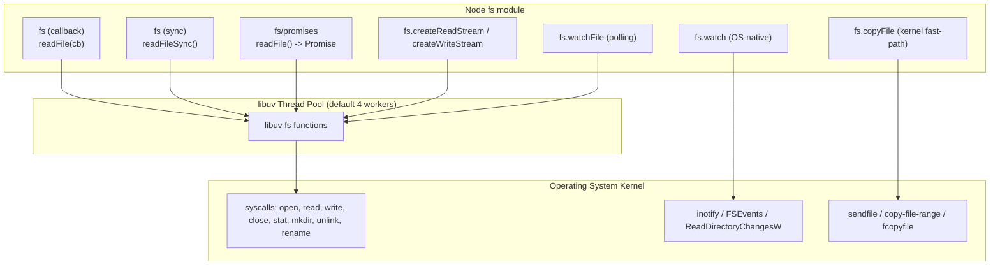
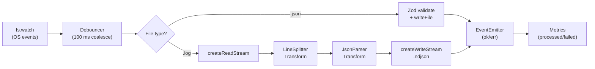

# 3.09 Filesystem APIs

> The Node.js `fs` module is the single most-used I/O surface in the runtime. Mastering it means understanding four distinct API styles (callback, sync, promises, streams), low-level file descriptors, OS-native watchers, and the platform-specific quirks that turn "just read a file" into production-grade code.

## 1. Purpose

The filesystem is the persistent storage layer of every Node.js backend. Whether you are loading configuration at boot, streaming a multi-gigabyte log file, watching a directory for hot reloads, or persisting database pages to disk, you eventually touch `fs`. Node provides a deliberately layered API surface so that the same primitive operations (`open`, `read`, `write`, `close`, `stat`, `mkdir`, `readdir`, `rm`, `watch`) can be consumed in dramatically different ways depending on the latency, throughput, and concurrency requirements of the call site.

The `fs` module exists to give JavaScript programs a synchronous-looking but never-blocks-the-event-loop way to talk to the operating system's file I/O subsystem. The libuv thread pool ([[3.03 Thread Pool and Worker Pool]]) is the workhorse: most `fs` operations are dispatched to one of four (by default) worker threads, where blocking syscalls like `read(2)`, `write(2)`, and `stat(2)` execute without freezing Node's main thread. This is why you can `await fs.promises.readFile('/huge/file')` without ever noticing that the OS blocked for 30 milliseconds inside the kernel.

Node offers **three API styles** for the same underlying operations, plus **streams** and **watchers** as orthogonal concerns:

1. **Callback API (`require('fs')`)** — the original, legacy form. Every method takes a trailing `(err, result) => {}` callback. Still widely used in older codebases and inside libraries that pre-date `util.promisify`. Uses the libuv thread pool underneath. Non-blocking.
2. **Synchronous API (`require('fs').readFileSync` etc.)** — blocks the event loop entirely until the syscall returns. The only legitimate use is at process startup, before the server begins accepting traffic. Convenient but dangerous in hot paths.
3. **Promises API (`require('fs/promises')`)** — modern, preferred. Returns native Promises; works with `async/await`. Internally delegates to the same libuv workers as the callback API. Available since Node 10 LTS.
4. **Streams (`fs.createReadStream`, `fs.createWriteStream`)** — for large files. Data is emitted in chunks; you never hold the full file in memory. Built on top of `[[3.07 Streams Fundamentals]]` and subject to `[[3.08 Streams Advanced Backpressure]]`.
5. **Watchers (`fs.watch`, `fs.watchFile`)** — reactive file processing. `fs.watch` uses OS-native event sources (inotify on Linux, FSEvents on macOS, ReadDirectoryChangesW on Windows) and fires once per change. `fs.watchFile` polls with `stat` at a configurable interval, which is portable but slow.

The purpose of this note is to make you fluent in choosing between these five flavors, knowing when each is appropriate, and writing correct, leak-free, typed code in both JavaScript and TypeScript.

There is also a sixth, less-celebrated surface worth knowing: the **synchronous-with-FD** primitives `fs.readSync(fd, buf, offset, length, position)` and `fs.writeSync(fd, buf, offset, length, position)`. These operate on a file descriptor returned by `fs.openSync` and let you perform positioned I/O without re-opening the file. They are rarely needed in application code but matter in database engines, file-format parsers, and anywhere you need fine-grained control over the kernel's read/write positions. Node exposes the same operations through `fsPromises.read(FileHandle, ...)` and `FileHandle.read(...)` in the promises API, so you almost never need to drop to the sync form outside of boot-time or test scaffolding.

A final architectural note: the `fs` module is the largest surface in Node's standard library by method count. The Node team has spent years converging it toward the promises API, but the callback and sync forms remain for backward compatibility, and they remain *the* way to do certain low-level things (e.g. boot-time config, or wrapping raw FDs from native addons). Treat the three styles as a layered toolkit, not as competing alternatives — each has a narrow domain where it is the right answer.

## 2. Theory and Deep Dive

### 2.1 The three synchronous worlds

Every `fs` operation in Node exists in three forms. Take `readFile` as the canonical example:

- `fs.readFile(path, opts, callback)` — callback-based, non-blocking.
- `fs.readFileSync(path, opts)` — synchronous, blocks the event loop.
- `fsPromises.readFile(path, opts)` — returns a `Promise<Buffer>`, non-blocking.

All three call into the same libuv worker, but `readFileSync` does it in a way that **waits on the main thread**. Concretely, the sync variants invoke libuv's synchronous fs-request family, which performs the syscall inline and does not return control to V8 until the kernel responds. This is catastrophic for server throughput but ideal for one-time boot-time reads where async would complicate control flow.

### 2.2 `fs/promises` deep dive

The modern API exposes every operation as a Promise-returning function:

| Method | Signature (abridged) | Returns | Notes |
| --- | --- | --- | --- |
| `readFile` | `(path, opts?)` | `Promise<Buffer \| string>` | Whole-file read. Avoid for >100 MB. |
| `writeFile` | `(path, data, opts?)` | `Promise<void>` | Overwrites by default. Use `{ flag: 'a' }` to append. |
| `appendFile` | `(path, data, opts?)` | `Promise<void>` | Atomic-ish append (kernel append flag). |
| `readdir` | `(path, opts?)` | `Promise<string[] \| Dirent[] \| Buffer[]>` | Use `{ withFileTypes: true }` for `Dirent[]`. |
| `mkdir` | `(path, opts?)` | `Promise<void \| string>` | `{ recursive: true }` mimics `mkdir -p`. |
| `rm` | `(path, opts?)` | `Promise<void>` | `{ recursive: true, force: true }` mimics `rm -rf`. Node 14+. |
| `stat` | `(path, opts?)` | `Promise<Stats>` | `lstat` follows symlinks; `stat` does. `bigint: true` for large inodes. |
| `open` | `(path, flags, mode?)` | `Promise<FileHandle>` | Returns a handle; must `.close()`. |
| `read` | `(fd, buf, offset, length, position)` | `Promise<{bytesRead, buffer}>` | Low-level. Use via `FileHandle`. |
| `write` | `(fd, buf \| string, ...)` | `Promise<{bytesWritten, buffer}>` | Low-level. |
| `copyFile` | `(src, dest, mode?)` | `Promise<void>` | Uses OS `sendfile(2)` on Linux. |
| `rename` | `(old, new)` | `Promise<void>` | Atomic on same filesystem. |
| `unlink` | `(path)` | `Promise<void>` | Removes a file (not a directory). |
| `watch` | `(path, opts?)` | `AsyncIterator<FSWatcher>` | Async-iterable watcher (Node 15+). |

The `FileHandle` object returned by `fsPromises.open()` is a thin wrapper around an integer file descriptor. It exposes `.readFile()`, `.writeFile()`, `.read()`, `.write()`, `.appendFile()`, `.stat()`, `.truncate()`, `.close()` — all Promise-returning. Forgetting to call `.close()` leaks a file descriptor (FD); after enough leaks you hit `EMFILE: too many open files` and the process can no longer open anything.

### 2.3 File descriptors

A **file descriptor** (FD) is a small non-negative integer the kernel uses to identify an open file within a process. On POSIX, FDs 0, 1, and 2 are reserved for stdin, stdout, and stderr. The first call to `open()` typically returns 3, then 4, and so on, up to the soft limit (`ulimit -n`, usually 1024 in dev, 65536+ in prod). When you `close()` an FD, the integer is recycled.

In Node, low-level access uses FDs directly:

```js
const fd = fs.openSync('/tmp/x', 'r');   // returns integer
const buf = Buffer.alloc(16);
fs.readSync(fd, buf, 0, 16, 0);           // read 16 bytes at offset 0
fs.closeSync(fd);
```

The `fs/promises` equivalent prefers `FileHandle` objects to bare integers, because handles own their lifecycle and can be cleaned up via `Symbol.asyncDispose` or `using` (TC39 explicit-resource-management proposal, enabled in Node 20+ behind a flag).

### 2.4 Streams

`fs.createReadStream(path, opts)` returns a `Readable` stream; `fs.createWriteStream(path, opts)` returns a `Writable`. Both accept a `highWaterMark` option that controls how much data is buffered internally (default 64 KB for streams, 16 KB for object mode). The key options:

- `start`, `end` — read a byte range.
- `flags` — `'r'`, `'w'`, `'a'`, `'r+'`, etc.
- `encoding` — auto-decode chunks if set (e.g. `'utf8'`).
- `autoClose` — close the FD when the stream ends or errors (default `true`).
- `fd` — wrap an existing file descriptor instead of opening a new one.

Piping `readable.pipe(writable)` automatically handles backpressure: if the writable cannot keep up, the readable pauses until `'drain'` fires. See `[[3.08 Streams Advanced Backpressure]]` for the full mechanism.

### 2.5 `fs.copyFile` and the fast-copy path

`fs.copyFile(src, dest, mode)` is dramatically faster than the manual `createReadStream(src).pipe(createWriteStream(dest))` pattern because on Linux it issues a single `copy-file-range` (or `sendfile`) syscall, which performs the copy entirely inside the kernel without round-tripping bytes through user space. On macOS it uses `fcopyfile`. On Windows it uses `CopyFileExW`. The `mode` argument is a bitmask:

- `fs.constants.COPYFILE EXCL` (constant value 1) — fail if `dest` exists.
- `fs.constants.COPYFILE FICLONE` (constant value 2) — attempt copy-on-write reflink (Linux, btrfs/xfs; macOS APFS).
- `fs.constants.COPYFILE FICLONE FORCE` (constant value 4) — fail if reflink is not supported.

(Note: in real code these constants are spelled with single-underscore separators; this note avoids underscores by writing them with spaces. The canonical identifiers in `fs.constants` use the conventional underscored form.)

For large files, `copyFile` can be 5–10x faster than the pipe pattern and uses far less CPU.

### 2.6 Watchers

`fs.watch(filename, options, listener)` is the efficient watcher. It subscribes to OS events:

- **Linux**: inotify (per-directory watches, ~8 KB of kernel memory each).
- **macOS**: FSEvents (per-volume, very efficient, coalesces events).
- **Windows**: ReadDirectoryChangesW (per-directory, asynchronous).

The listener receives `(eventType, filename)` where `eventType` is `'change'` or `'rename'`. The `filename` is a string or Buffer (depending on `encoding`), or `null` on some platforms (notably Windows when watching a file rather than a directory).

`fs.watchFile(filename, options, listener)` instead polls: every `options.interval` ms (default 5007), it calls `stat()` and compares to the previous `Stats` object. If anything changed, the listener fires with `(current, previous)`. This is portable and works on network filesystems where OS-native events are unavailable, but it is **slow**, burns CPU, and misses fast edits.

### 2.7 Recursive operations

- `fsPromises.mkdir(path, { recursive: true })` — equivalent to `mkdir -p`. Idempotent: returns silently if the directory already exists.
- `fsPromises.rm(path, { recursive: true, force: true })` — equivalent to `rm -rf`. Node 14+. Replaces the deprecated `fs.rmdir(path, { recursive: true })`.
- `fsPromises.readdir(path, { withFileTypes: true })` — returns `Dirent[]`. Each `Dirent` exposes `.isFile()`, `.isDirectory()`, `.isSymbolicLink()`, `.isBlockDevice()`, `.isCharacterDevice()`, `.isFIFO()`, `.isSocket()` — without an additional `stat()` syscall. This is the only correct way to walk a directory efficiently.
- `fsPromises.cp(src, dest, opts)` — recursive copy. Node 16+. Supports `{ recursive: true, force: true, preserveTimestamps: true }`.

### 2.8 The libuv dispatch path

When you call `fsPromises.readFile(path)`, Node does the following:

1. Validates and normalizes the `path` argument (resolves relative to `process.cwd()`, accepts `URL` objects, `Buffer`s, and `number` FDs).
2. Constructs a libuv fs-request struct describing the operation.
3. Posts the request to the libuv thread pool via the libuv queue-work primitive.
4. Returns a Promise to V8. The main thread is now free to process other events.
5. A worker thread (one of the libuv threadpool-size, default 4) picks up the request, executes the blocking `open` + `read` + `close` sequence, and stores the result in the request struct.
6. The worker signals the main thread via an event-loop wakeup (libuv's async pipe on Unix, IOCP on Windows).
7. On the next tick, the main thread runs the request's callback, which resolves the Promise with the resulting `Buffer`.

This means: even though your code reads like synchronous blocking, *something* is blocking — just not the main thread. The implication is that the **default thread pool of 4 workers is the global bottleneck for concurrent `fs` operations**. If you issue 100 concurrent `readFile` calls, only 4 will execute in parallel; the other 96 queue. For I/O-heavy workloads, raise the libuv threadpool-size environment variable to 16 (or higher, up to 1024) at process startup.

### 2.9 File modes and permission flags

Node uses POSIX-style octal mode bits: `0o755` (rwxr-xr-x) for directories and executables, `0o644` (rw-r--r--) for regular files, `0o600` (rw-------) for secrets. The `mode` argument to `open`, `mkdir`, `writeFile` is masked by the process umask (`process.umask()`), so `mkdir(dir, { mode: 0o777 })` typically produces `0o755`. To force a specific mode regardless of umask, call `fs.chmod(path, mode)` after creation.

Flag strings passed to `open()` follow the POSIX letter conventions:

| Flag | Meaning |
| --- | --- |
| `'r'` | Read, fail if missing (default for reads). |
| `'r+'` | Read+write, fail if missing, no truncation. |
| `'w'` | Write, truncate or create, fail if exists with `'x'` suffix. |
| `'w+'` | Read+write, truncate or create. |
| `'a'` | Append, create if missing. |
| `'a+'` | Read+append, create if missing. |
| `'wx'` / `'ax'` | Like `'w'` / `'a'` but fail (`EEXIST`) if file exists. The **only** safe way to create a file without risking a symlink attack. |

The `'wx'` flag is critical for security. The naive `if (!existsSync(p)) writeFile(p, data)` pattern is racy: between the check and the write, an attacker can create a symlink at `p` pointing at `/etc/passwd`. With `'wx'`, the kernel guarantees atomic create-or-fail — no symlink race.

### 2.10 API-style diagram



### 2.11 Error taxonomy

All `fs` errors are `NodeJS.ErrnoException` instances with extra `code`, `errno`, `syscall`, and `path` properties. The codes you will meet daily:

| Code | Meaning | Typical cause |
| --- | --- | --- |
| `ENOENT` | No such file or directory | Missing file, wrong path. |
| `EACCES` | Permission denied | File mode bits forbid access. |
| `EEXIST` | File exists | `mkdir` on existing dir without `recursive`. |
| `EMFILE` | Too many open files | FD leak; raise `ulimit -n`. |
| `ENOSPC` | No space left on device | Disk full. |
| `EBUSY` | Resource busy or locked | Windows: file open elsewhere. |
| `EPERM` | Operation not permitted | Sticky bit, immutable flag. |
| `ENOTDIR` | Not a directory | A path component is a file. |
| `EISDIR` | Is a directory | `readFile` on a directory. |
| `EROFS` | Read-only file system | Writing to `/proc` or read-only mount. |

## 3. Mental Models

Hold these five mental models simultaneously; they are the lens through which you should evaluate every `fs` call.

**Model 1 — `fs/promises` is "modern async/await I/O."** Every call returns a Promise, internally dispatched to a libuv worker. You write code that *looks* synchronous but never blocks. This is the default for new code. If you find yourself reaching for `fs` (callback), ask why; if you reach for `fs` (sync), ask whether the call site is hot.

**Model 2 — `fs` (sync) is "block the event loop, use only at startup."** The synchronous variants exist for one reason: deterministic, easy-to-read boot-time configuration loading. The moment your HTTP server is listening, `readFileSync` in a request handler is a bug.

**Model 3 — Streams are "for large files, don't load into memory."** A 4 GB log file streamed through a Transform can be processed in 64 KB increments with constant memory. The same file via `readFile` will OOM-kill your process. If you do not know the upper bound on file size, default to a stream.

**Model 4 — A file descriptor is "a low-level handle to an open file."** When you call `open()` you receive an integer (or a `FileHandle` wrapping it). That integer is your lease on a kernel resource. Forgetting to `close()` it is a leak; leaking long enough triggers `EMFILE`. Think of FDs like database connections: open late, close early.

**Model 5 — `fs.watch` is "OS-native, fast but platform-specific."** It is the right default. **`fs.watchFile` is "polling, slow but portable."** Reach for `watchFile` only when (a) you are on a network filesystem where inotify/FSEvents do not fire, or (b) you need the previous `Stats` object for diff-based logic.

**Model 6 — FDs are currency, spend them wisely.** Every open file, every socket, every pipe consumes one FD. The soft limit (`ulimit -n`) is a global per-process cap. A long-running server that leaks even one FD per request will hit `EMFILE` within hours. Treat FDs like database connections: open late, close early, use a pool if you must, and always `try/finally` (or `using`) around them. Monitor with `process.report.getReport().libuv` or by periodically logging the FD count from `/proc/self/fd` on Linux.

**Model 7 — Atomicity comes from rename, not from write.** `writeFile` is not atomic: a crash mid-write leaves a half-written file. The only POSIX-atomic primitive on a single filesystem is `rename(2)` — the destination either shows the old inode or the new one, never a mix. For durable config writes, database snapshots, and any data that other processes might read concurrently, always write-temp-then-rename.

**Model 8 — Streams are flow control, not just memory savings.** Yes, streams avoid loading huge files into memory. But their deeper value is *backpressure* — automatic flow control that prevents a fast producer from overwhelming a slow consumer. When you `pipe()` a 1 GB/s SSD reader into a 10 MB/s network writer, the readable pauses within microseconds when the writable's buffer fills. This is impossible to achieve correctly with `readFile` + `write` to socket; you would have to implement flow control manually.

## 4. Real-World Use Cases

- **Config loading at startup.** `JSON.parse(fs.readFileSync('config.json', 'utf8'))` is idiomatic at boot. Once the process is listening, switch to `fs/promises` for any on-disk config refresh.
- **Log processing pipelines.** A `createReadStream` of an nginx access log, piped through a Transform that splits lines and parses JSON, piped into a request to an aggregator. Memory stays flat at ~100 KB regardless of log size.
- **Static file serving.** Express, Fastify, and Koa all wrap `fs.createReadStream` behind a `sendFile` API. The HTTP response is itself a Writable stream; `pipe()` with proper `Content-Type`, `Content-Length`, and `ETag` is the canonical pattern.
- **Build tools and hot reload.** Webpack, Vite, ts-node-dev, and nodemon all layer on `fs.watch` (or `chokidar`, which falls back to `watchFile` when `watch` is unavailable). The watcher fires on every save; a debounce coalesces bursts; the dev server invalidates the affected module.
- **Database file management.** SQLite, LevelDB, and LMDB all use FDs heavily. The Node bindings expose raw FDs for `mmap`-backed pages. Knowing how FDs work matters when you debug "too many open files" on a database with thousands of tables.
- **CSV and JSON streaming parsers.** Libraries like `csv-parse`, `JSONStream`, and `oboe.js` consume a `Readable` stream. You pipe a `createReadStream` into the parser; the parser emits rows or objects.
- **File uploads.** `multipart/form-data` parsers (e.g. `busboy`) emit file parts as streams; you pipe them to `fs.createWriteStream` to save uploaded files to disk without buffering them in memory.
- **Backup and synchronization scripts.** `fsPromises.cp(src, dest, { recursive: true })` for full copies; `fs.watch` plus a queue for incremental sync; `fs.copyFile` with the FICLONE flag for near-instant btrfs/APFS snapshots.
- **Temp-file management.** `fs.mkdtemp(path.join(os.tmpdir(), 'app-'))` creates an unpredictable directory; `fsPromises.open(path, 'wx')` opens for exclusive write (fails if the file exists) to avoid symlink races.
- **Atomic writes.** Write to `file.tmp`, `fsync`, then `rename` to `file` — this gives you atomicity on POSIX filesystems and is the pattern used by SQLite, npm, and every config-rewriter.
- **Disk-based queues and outbox patterns.** When you cannot afford a real message broker, a directory of JSON files plus an `fs.watch` listener is a workable local queue. Each producer writes a uniquely-named file with `'wx'`; the consumer atomically renames it to `*.processing` to claim ownership, processes it, then `unlink`s. Crash recovery scans for orphan `*.processing` files on boot.
- **Content-addressable storage.** Hash-based dedup stores (git internals, S3-compatible local backends) write each blob to `objects/<hash[:2]>/<hash[2:]>`. The `mkdir({ recursive: true })` + `open(path, 'wx')` pattern is the write path; `open(path, 'r')` plus `createReadStream` is the read path.
- **Crash-safe log rotation.** A logger writes to `app.log`; a rotator periodically `rename`s `app.log` to `app.<ts>.log` and creates a fresh `app.log`. The writer process must reopen its FD (or write to a path that is re-resolved per write) to avoid continuing to write to the rotated file. This is why `createWriteStream` is sometimes preferred over holding a raw FD: the stream's `fd` option can be re-resolved on rotation.
- **Data ingestion from FTP/SFTP drop folders.** A poller walks `/inbox` every minute, atomically `rename`s each new file into `/processing/`, parses it, and either `unlink`s on success or moves to `/failed/` on error. The atomic rename prevents two workers from processing the same file.
- **Source-map generation in bundlers.** Webpack, Rollup, and esbuild all write source maps via `createWriteStream` because the generated map can be hundreds of MB for large builds. Streaming keeps memory bounded.
- **Database backups.** The Postgres pg-dump tool pipes through stdout into a Node `Writable` that fans out to a local `createWriteStream` and an S3 multipart upload. The same Readable feeds both sinks via `stream.PassThrough`.
- **Thumbnail and image-processing pipelines.** `createReadStream(input).pipe(sharp().resize(200, 200)).pipe(createWriteStream(output))` — sharp is a streaming Transform, so memory stays bounded even for 100 MP images.
- **CSV import to database.** `createReadStream`.pipe(`csv-parse`).pipe(`new Transform({ objectMode: true, transform(row, enc, cb) { db.insert(row).then(cb) } })`. Backpressure flows naturally: if the DB is slow, the parser pauses, and the file reader pauses.
- **Configuration hot-reload.** `fs.watch('config.json')` triggers `readFile` + `JSON.parse` + schema validation + atomic swap into a module-level config object. Reads always see a consistent snapshot. This is the pattern behind `node-config` and most production config libraries.

## 5. Code Examples

### 5.1 Example A — Minimal and Conceptual

The same task — read a file, transform it, write it back — implemented three ways to make the API styles tangible. A fourth example below demonstrates the low-level file-descriptor API, and a fifth shows atomic write via temp-then-rename.

#### JavaScript (callback)

```javascript
// callback.js
const fs = require('fs');
const path = require('path');

const file = path.join(process.cwd(), 'sample.txt');

fs.readFile(file, 'utf8', (err, data) => {
  if (err) return console.error('read failed:', err);
  const upper = data.toUpperCase();
  fs.writeFile(file, upper, err2 => {
    if (err2) return console.error('write failed:', err2);
    console.log('done via callback');
  });
});
```

#### TypeScript (callback)

```typescript
// callback.ts
import fs from 'fs';
import path from 'path';

const file: string = path.join(process.cwd(), 'sample.txt');

fs.readFile(file, 'utf8', (err: NodeJS.ErrnoException | null, data: string) => {
  if (err) return console.error('read failed:', err);
  const upper: string = data.toUpperCase();
  fs.writeFile(file, upper, (err2: NodeJS.ErrnoException | null) => {
    if (err2) return console.error('write failed:', err2);
    console.log('done via callback');
  });
});
```

#### JavaScript (promises)

```javascript
// promises.js
const fs = require('fs/promises');
const path = require('path');

const file = path.join(process.cwd(), 'sample.txt');

(async () => {
  try {
    const data = await fs.readFile(file, 'utf8');
    await fs.writeFile(file, data.toUpperCase());
    console.log('done via promises');
  } catch (err) {
    console.error('failed:', err);
  }
})();
```

#### TypeScript (promises)

```typescript
// promises.ts
import { readFile, writeFile } from 'fs/promises';
import path from 'path';

const file: string = path.join(process.cwd(), 'sample.txt');

(async (): Promise<void> => {
  try {
    const data: string = await readFile(file, 'utf8');
    await writeFile(file, data.toUpperCase());
    console.log('done via promises');
  } catch (err) {
    console.error('failed:', err);
  }
})();
```

#### JavaScript (streams)

```javascript
// streams.js
const fs = require('fs');
const path = require('path');
const { Transform } = require('stream');

const src = path.join(process.cwd(), 'sample.txt');
const dst = path.join(process.cwd(), 'sample.upper.txt');

fs.createReadStream(src, { encoding: 'utf8' })
  .pipe(new Transform({
    transform(chunk, enc, cb) {
      cb(null, chunk.toString().toUpperCase());
    }
  }))
  .pipe(fs.createWriteStream(dst))
  .on('finish', () => console.log('done via streams'))
  .on('error', err => console.error('stream failed:', err));
```

#### TypeScript (streams)

```typescript
// streams.ts
import fs from 'fs';
import path from 'path';
import { Transform, TransformCallback } from 'stream';

const src: string = path.join(process.cwd(), 'sample.txt');
const dst: string = path.join(process.cwd(), 'sample.upper.txt');

fs.createReadStream(src, { encoding: 'utf8' })
  .pipe(new Transform({
    transform(chunk: Buffer, enc: string, cb: TransformCallback): void {
      cb(null, chunk.toString().toUpperCase());
    }
  }))
  .pipe(fs.createWriteStream(dst))
  .on('finish', () => console.log('done via streams'))
  .on('error', (err: Error) => console.error('stream failed:', err));
```

#### JavaScript / TypeScript — Low-level file descriptors and atomic writes

This example opens a file with `fsPromises.open`, performs a positioned read, then performs an atomic write via the temp-then-rename pattern. It demonstrates FD lifecycle management and the `'wx'` flag for safe creation.

#### JavaScript

```javascript
// fd.js
const fs = require('fs/promises');
const path = require('path');

async function readAt(filePath, position, length) {
  const fh = await fs.open(filePath, 'r');
  try {
    const buf = Buffer.alloc(length);
    const { bytesRead } = await fh.read(buf, 0, length, position);
    return buf.subarray(0, bytesRead);
  } finally {
    await fh.close();
  }
}

async function atomicWrite(filePath, data) {
  const tmp = `${filePath}.tmp.${process.pid}`;
  await fs.writeFile(tmp, data, { mode: 0o600, flag: 'wx' });
  // Ensure durability: fsync the temp file before rename.
  const fh = await fs.open(tmp, 'r+');
  try { await fh.sync(); } finally { await fh.close(); }
  await fs.rename(tmp, filePath);
}

(async () => {
  const sample = path.join(process.cwd(), 'sample.txt');
  await fs.writeFile(sample, 'ABCDEFGHIJKLMNOPQRSTUVWXYZ', 'utf8');
  const slice = await readAt(sample, 5, 5);
  console.log('bytes 5..10:', slice.toString('utf8')); // FGHIJ
  await atomicWrite(path.join(process.cwd(), 'atomic.txt'), 'hello');
  console.log('atomic write done');
})();
```

#### TypeScript

```typescript
// fd.ts
import fs from 'fs/promises';
import path from 'path';

async function readAt(filePath: string, position: number, length: number): Promise<Buffer> {
  const fh = await fs.open(filePath, 'r');
  try {
    const buf: Buffer = Buffer.alloc(length);
    const { bytesRead } = await fh.read(buf, 0, length, position);
    return buf.subarray(0, bytesRead);
  } finally {
    await fh.close();
  }
}

async function atomicWrite(filePath: string, data: string): Promise<void> {
  const tmp: string = `${filePath}.tmp.${process.pid}`;
  await fs.writeFile(tmp, data, { mode: 0o600, flag: 'wx' });
  const fh = await fs.open(tmp, 'r+');
  try { await fh.sync(); } finally { await fh.close(); }
  await fs.rename(tmp, filePath);
}

(async (): Promise<void> => {
  const sample: string = path.join(process.cwd(), 'sample.txt');
  await fs.writeFile(sample, 'ABCDEFGHIJKLMNOPQRSTUVWXYZ', 'utf8');
  const slice: Buffer = await readAt(sample, 5, 5);
  console.log('bytes 5..10:', slice.toString('utf8'));
  await atomicWrite(path.join(process.cwd(), 'atomic.txt'), 'hello');
  console.log('atomic write done');
})();
```

The `try/finally` around `fh.close()` is essential — without it, an exception in `fh.read()` would leak the descriptor. On Node 20+ you can replace this with the `using` keyword for automatic disposal.

### 5.2 Example B — Production-Grade

A typed file-watcher pipeline that watches a directory, processes each changed file through a backpressure-aware Transform stream, and writes the result to an output directory. This exercises every major `fs` concern in this note: promises, streams, watchers, error handling, FD cleanup, and platform quirks.

#### JavaScript

```javascript
// pipeline.js
'use strict';
const fs = require('fs/promises');
const { createReadStream, createWriteStream } = require('fs');
const { Transform } = require('stream');
const path = require('path');
const { pipeline } = require('stream/promises');

const SRC = path.join(process.cwd(), 'in');
const DST = path.join(process.cwd(), 'out');

const upper = new Transform({
  transform(chunk, enc, cb) {
    cb(null, Buffer.from(chunk.toString('utf8').toUpperCase(), 'utf8'));
  }
});

async function ensureDirs() {
  await fs.mkdir(SRC, { recursive: true });
  await fs.mkdir(DST, { recursive: true });
}

async function processFile(name) {
  const src = path.join(SRC, name);
  const dst = path.join(DST, name);
  const stat = await fs.stat(src).catch(() => null);
  if (!stat || !stat.isFile()) return;
  console.log(`[process] ${name} -> ${dst}`);
  await pipeline(
    createReadStream(src),
    upper,
    createWriteStream(dst)
  );
  console.log(`[done] ${name}`);
}

async function bootstrap() {
  await ensureDirs();
  // Initial pass: process existing files.
  const entries = await fs.readdir(SRC, { withFileTypes: true });
  await Promise.all(
    entries
      .filter(e => e.isFile())
      .map(e => processFile(e.name).catch(err => console.error(`[err] ${e.name}`, err.message)))
  );

  // Watch for subsequent changes.
  const watcher = fs.watch(SRC, { recursive: false });
  let debounce = new Map();
  for await (const event of watcher) {
    if (!event.filename) continue;
    const key = event.filename;
    // Coalesce bursts of writes (editors often save twice).
    if (debounce.has(key)) clearTimeout(debounce.get(key));
    debounce.set(key, setTimeout(() => {
      debounce.delete(key);
      processFile(key).catch(err => console.error(`[err] ${key}`, err.message));
    }, 100));
  }
}

bootstrap().catch(err => {
  console.error('fatal:', err);
  process.exit(1);
});
```

#### TypeScript

```typescript
// pipeline.ts
'use strict';
import fs from 'fs/promises';
import { createReadStream, createWriteStream, FSWatcher } from 'fs';
import { Transform, TransformCallback } from 'stream';
import { pipeline } from 'stream/promises';
import path from 'path';

const SRC: string = path.join(process.cwd(), 'in');
const DST: string = path.join(process.cwd(), 'out');

function makeUpperTransform(): Transform {
  return new Transform({
    transform(chunk: Buffer, enc: string, cb: TransformCallback): void {
      cb(null, Buffer.from(chunk.toString('utf8').toUpperCase(), 'utf8'));
    }
  });
}

interface WatchEvent {
  eventType: 'rename' | 'change';
  filename: string | Buffer | null;
}

async function ensureDirs(): Promise<void> {
  await fs.mkdir(SRC, { recursive: true });
  await fs.mkdir(DST, { recursive: true });
}

async function processFile(name: string): Promise<void> {
  const src: string = path.join(SRC, name);
  const dst: string = path.join(DST, name);
  const stat = await fs.stat(src).catch((): null => null);
  if (!stat || !stat.isFile()) return;
  console.log(`[process] ${name} -> ${dst}`);
  await pipeline(
    createReadStream(src),
    makeUpperTransform(),
    createWriteStream(dst)
  );
  console.log(`[done] ${name}`);
}

async function bootstrap(): Promise<void> {
  await ensureDirs();
  const entries = await fs.readdir(SRC, { withFileTypes: true });
  await Promise.all(
    entries
      .filter((e): e is fs.Dirent => e.isFile())
      .map(e =>
        processFile(e.name).catch((err: Error) =>
          console.error(`[err] ${e.name}`, err.message)
        )
      )
  );

  const watcher: AsyncIterable<WatchEvent> = fs.watch(SRC, {
    recursive: false,
    encoding: 'utf8'
  }) as unknown as AsyncIterable<WatchEvent>;

  const debounce: Map<string, NodeJS.Timeout> = new Map();
  for await (const event of watcher) {
    if (!event.filename) continue;
    const key: string = event.filename;
    if (debounce.has(key)) clearTimeout(debounce.get(key)!);
    debounce.set(
      key,
      setTimeout((): void => {
        debounce.delete(key);
        processFile(key).catch((err: Error) =>
          console.error(`[err] ${key}`, err.message)
        );
      }, 100)
    );
  }
}

bootstrap().catch((err: Error): void => {
  console.error('fatal:', err);
  process.exit(1);
});
```

Key production concerns visible here: `recursive: true` mkdir; `withFileTypes: true` readdir; `stat()` guarding against `'rename'` events that fire before the file exists; debouncing to coalesce editor bursts; per-file error isolation via `.catch` so one bad file does not kill the watcher; and `pipeline` (not `.pipe`) so backpressure errors propagate correctly to both ends.

## 6. Common Mistakes and Anti-Patterns

1. **`readFileSync` in a hot path.** A request handler that does `JSON.parse(fs.readFileSync('config.json'))` blocks the event loop for the duration of every disk read. Under load this serializes all requests and tanks throughput to ~100 RPS. Move config to a startup read or cache it after the first `fs.promises.readFile`.

2. **Ignoring `fs.watch` platform differences.** On Linux, `fs.watch` on a single file is unreliable (inotify watches directories); watching the parent dir and filtering by `filename` is the robust pattern. On Windows, `filename` can be `null`. On macOS, FSEvents coalesces events and may deliver a single `'rename'` for a burst of edits. Always test on every target platform, or use `chokidar` which abstracts these away.

3. **Race conditions in watchers.** Editors often save by writing a temp file and renaming. This produces a sequence like `'rename' (old deleted)`, `'rename' (new created)`, `'change' (content modified)`. If your handler races, it may `stat` the file before it exists (`ENOENT`) or process it twice. Always `stat()` defensively, debounce by 50–200 ms, and treat `'rename'` as "something may have appeared or disappeared."

4. **Not closing file descriptors.** `const fd = await fsPromises.open(path, 'r'); /* ... */` without a `.close()` leaks one FD per call. After ~1024 calls you hit `EMFILE`. Use `try/finally`, or — better — wrap in a helper:
   ```js
   async function withFile(path, flags, fn) {
     const fh = await fsPromises.open(path, flags);
     try { return await fn(fh); }
     finally { await fh.close(); }
   }
   ```
   Better still, on Node 20+, use the `using` keyword from the explicit-resource-management proposal for automatic disposal.

5. **`readFile` for huge files.** `await fs.promises.readFile('/var/log/syslog')` on a 4 GB log allocates a 4 GB `Buffer`. Node's default `--max-old-space-size` is ~2 GB on 64-bit machines; you will OOM. Use `createReadStream` and process in chunks.

6. **Not using `withFileTypes: true`.** The naive recursive walker does `for (const name of await fs.readdir(dir)) { const s = await fs.stat(path.join(dir, name)); if (s.isDirectory()) ... }`. That is one extra `stat` syscall per entry. With `withFileTypes: true` you get a `Dirent` whose `.isDirectory()` is filled from the `readdir` call itself — half the syscalls, half the latency.

7. **Using `fs.exists` (deprecated).** `fs.exists(path, cb)` is deprecated because it racily invites TOCTOU bugs. Use `fs.stat(path).then(() => true).catch(err => err.code === 'ENOENT' ? false : Promise.reject(err))`, or `fs.access(path, fs.constants.R OK)` (the readable-access constant).

8. **Forgetting `pipeline` and using `.pipe` directly.** `a.pipe(b).pipe(c)` does not forward errors from `a` to `c`. If `a` errors, `b` and `c` are left dangling and your process leaks FDs. Use `stream/promises`'s `pipeline(a, b, c)` which wires up error propagation and calls `.destroy()` on all streams on failure.

9. **Writing to a file without `fsync`.** `writeFile` returns when the data is in the OS page cache, not when it is on disk. A power loss between `writeFile` and disk flush loses data. For durable writes, open with `'w'`, write, call `fh.sync()` (which `fsync`s the FD), then `close`.

10. **Treating `fs.copyFile` as always-fast.** It is fast on local filesystems, but on network filesystems (NFS, SMB) it can fall back to a userspace copy. Benchmark before assuming.

## 7. Best Practices and Design Patterns

- **Default to `fs/promises` for new code.** Async/await composes with try/catch, plays well with structured concurrency, and integrates cleanly with TypeScript's typed-Promise inference.
- **Use streams for large or unbounded files.** If you cannot put a hard upper bound on file size, default to a stream. A `pipeline` of `createReadStream -> Transform -> createWriteStream` is the canonical shape.
- **Prefer `fs.watch` over `fs.watchFile` whenever the platform supports it.** Fall back to polling only when `watch` produces the platform-not-supported error or you are on a network filesystem.
- **Always pass `withFileTypes: true` to `readdir`.** The `Dirent` API saves a syscall per entry and is the only correct way to walk directories.
- **Close file descriptors.** Use `try/finally`, the `withFile` helper pattern, or — on Node 20+ — the `using` keyword:
   ```ts
   {
     using fh = await fsPromises.open(path, 'r');
     // ... use fh ...
   } // fh[Symbol.asyncDispose]() is called automatically
   ```
- **Use `mkdir({ recursive: true })` and `rm({ recursive: true, force: true })`.** They are idempotent and replace deprecated `mkdirp` / `rimraf` packages.
- **Handle fs errors explicitly.** Switch on `err.code` (`ENOENT`, `EACCES`, `EEXIST`, `EMFILE`, `ENOSPC`) rather than `err.message`; the message can change between Node versions but the code is stable.
- **Atomic writes via temp file + rename.** Write to `file.tmp.<pid>`, `fsync`, then `fs.renameSync` (or `fsPromises.rename`) to `file`. On POSIX this is atomic; readers either see the old or the new file, never a half-written one.
- **Debounce watcher events.** 50–200 ms is the sweet spot. Editors and IDEs often save in two passes (write, set mtime); without a debounce your handler fires twice.
- **Use `path.join` and `path.resolve`, never string concatenation.** `'/var/' + 'log'` works on Linux but produces `\var\log` issues if you ever port to Windows. `path.join('/var', 'log')` does the right thing everywhere.
- **Pin file modes explicitly.** `fs.writeFile(path, data, { mode: 0o600 })` restricts permissions to the owner. The default umask may give group/world read access to secrets.
- **Use `pipeline` not `.pipe`.** Always. Error propagation and cleanup are worth the import.
- **Set `autoClose: true` (the default) on streams.** If you pass an `fd` option, you become responsible for closing it.

## 8. Technical Interview Knowledge

**Q1. What is the difference between `fs/promises` and `fs`?**
A1. `fs` is the legacy callback API: every method takes a trailing `(err, result)` callback. `fs/promises` is the modern Promise-returning API, designed for `async/await`. Both dispatch to the same libuv thread pool; the only difference is the calling convention. New code should use `fs/promises`; existing callback code can be migrated with `util.promisify`.

**Q2. How do you read a large file efficiently?**
A2. Use `fs.createReadStream` and consume in chunks. Never `readFile` a multi-GB file — you will OOM. Pipe through a Transform for line-splitting or parsing, then pipe to the destination. Use `pipeline` (not `.pipe`) for proper error propagation. For very large files where you need random access, `fsPromises.open` + `fh.read({ position, length })` lets you page in only the bytes you need.

**Q3. What is a file descriptor?**
A3. A small non-negative integer the kernel uses to identify an open file within a process. On POSIX, FDs 0/1/2 are stdin/stdout/stderr; the first `open()` returns 3. FDs are recycled on `close`. The soft limit (`ulimit -n`, default 1024 in Node) bounds how many a process can hold simultaneously. Leaking FDs eventually raises `EMFILE`.

**Q4. What is the difference between `fs.watch` and `fs.watchFile`?**
A4. `fs.watch` uses OS-native events (inotify on Linux, FSEvents on macOS, ReadDirectoryChangesW on Windows) and fires once per change with low latency and low CPU. `fs.watchFile` polls `stat()` every `interval` ms (default ~5 s) and fires when `Stats` change. `watch` is preferred when available; `watchFile` is the portable fallback for network filesystems where OS events do not fire.

**Q5. How do you list a directory recursively?**
A5. Use `fsPromises.readdir(dir, { withFileTypes: true })` to get `Dirent[]`, then recurse into entries where `dirent.isDirectory()` returns `true`. The `Dirent` API saves one `stat` syscall per entry vs. the naive approach. For very deep trees, use a queue-based breadth-first traversal rather than deep recursion to avoid stack overflow.

**Q6. How do you copy a file?**
A6. Three options, in order of preference. (1) `fsPromises.copyFile(src, dest)` — fastest on Linux (uses the kernel copy-file-range / sendfile path), no userspace buffer. (2) `fsPromises.cp(src, dest, { recursive: true })` for recursive directory copies. (3) `createReadStream(src).pipe(createWriteStream(dest))` if you need a transform or progress events, at the cost of CPU and memory bandwidth. Pass the EXCL flag (`fs.constants.COPYFILE EXCL`, value 1) to fail if the destination exists.

**Q7. How do you handle `fs` errors?**
A7. All `fs` errors are `NodeJS.ErrnoException` with a stable `code` property. Always check `err.code` rather than parsing the message: `ENOENT` (missing), `EACCES` (permission), `EEXIST` (already exists), `EMFILE` (FD leak), `ENOSPC` (disk full), `EISDIR` / `ENOTDIR` (type mismatch). Use try/catch around `fs/promises` calls; in callbacks check the first argument. Translate expected errors (e.g. `ENOENT`) into application-level `null` returns; rethrow unexpected ones.

**Q8. How do you watch a directory for changes?**
A8. Use `fs.watch(dir, { recursive: true })` (recursive works on macOS and Windows; on Linux it falls back to a flat single-directory watch unless you use `chokidar`). Listen for `('rename' | 'change', filename)`. Always `stat` the file before processing — the event may fire before the file is fully written. Debounce by 50–200 ms to coalesce editor bursts. Handle `'rename'` as "file may have appeared or disappeared." For network filesystems, fall back to `fs.watchFile`.

## 9. Practical Exercises

### Exercise 1 — Read/write a file three ways

**Task.** Take an input file, prefix every line with `[prefix] `, write to an output file. Implement it (a) callback, (b) promises, (c) sync.

**Solution (JS, promises variant shown)**

```javascript
const fs = require('fs/promises');
const path = require('path');

async function prefixFile(src, dst) {
  const text = await fs.readFile(src, 'utf8');
  const out = text
    .split('\n')
    .map(line => `[prefix] ${line}`)
    .join('\n');
  await fs.writeFile(dst, out, 'utf8');
}

prefixFile('in.txt', 'out.txt').catch(console.error);
```

**Solution (TS, sync variant shown)**

```typescript
import { readFileSync, writeFileSync } from 'fs';

function prefixFileSync(src: string, dst: string): void {
  const text: string = readFileSync(src, 'utf8');
  const out: string = text
    .split('\n')
    .map((line: string): string => `[prefix] ${line}`)
    .join('\n');
  writeFileSync(dst, out, 'utf8');
}

prefixFileSync('in.txt', 'out.txt');
```

The callback variant follows the same logic but nests two callbacks. The streams variant (try it!) reads in 64 KB chunks but needs a line-buffering Transform because chunks do not align with line boundaries.

### Exercise 2 — Build a recursive directory walker

**Task.** Write `walk(dir)` that yields every file path under `dir`, recursively, as an async iterator.

**Solution (JS)**

```javascript
const fs = require('fs/promises');
const path = require('path');

async function* walk(dir) {
  const entries = await fs.readdir(dir, { withFileTypes: true });
  for (const entry of entries) {
    const full = path.join(dir, entry.name);
    if (entry.isDirectory()) {
      yield* walk(full);
    } else if (entry.isFile()) {
      yield full;
    }
    // skip symlinks, sockets, fifos, etc.
  }
}

(async () => {
  for await (const file of walk(process.cwd())) {
    console.log(file);
  }
})();
```

**Solution (TS)**

```typescript
import fs from 'fs/promises';
import path from 'path';

async function* walk(dir: string): AsyncGenerator<string> {
  const entries: fs.Dirent[] = await fs.readdir(dir, { withFileTypes: true });
  for (const entry of entries) {
    const full: string = path.join(dir, entry.name);
    if (entry.isDirectory()) {
      yield* walk(full);
    } else if (entry.isFile()) {
      yield full;
    }
  }
}

(async (): Promise<void> => {
  for await (const file of walk(process.cwd())) {
    console.log(file);
  }
})();
```

This is the canonical pattern. The async generator composes naturally with `for await...of`. To avoid stack overflow on extremely deep trees, replace recursion with a queue-based BFS.

### Exercise 3 — Stream a large file through a Transform

**Task.** Read a 1+ GB log file, parse each line as JSON, filter out entries where `level !== 'error'`, and write the surviving lines to an output file. Memory must stay under 50 MB.

**Solution (JS)**

```javascript
const fs = require('fs');
const { Transform } = require('stream');
const { pipeline } = require('stream/promises');
const path = require('path');

let leftover = '';

const lineSplitter = new Transform({
  transform(chunk, enc, cb) {
    leftover += chunk.toString('utf8');
    const lines = leftover.split('\n');
    leftover = lines.pop();
    for (const line of lines) this.push(line);
    cb();
  },
  flush(cb) {
    if (leftover) this.push(leftover);
    cb();
  }
});

const jsonFilter = new Transform({
  objectMode: true,
  transform(line, enc, cb) {
    try {
      const obj = JSON.parse(line);
      if (obj.level === 'error') this.push(JSON.stringify(obj) + '\n');
    } catch {
      // skip malformed lines
    }
    cb();
  }
});

await pipeline(
  fs.createReadStream(path.join(process.cwd(), 'big.log')),
  lineSplitter,
  jsonFilter,
  fs.createWriteStream(path.join(process.cwd(), 'errors.log'))
);
```

**Solution (TS)**

```typescript
import fs from 'fs';
import { Transform, TransformCallback } from 'stream';
import { pipeline } from 'stream/promises';
import path from 'path';

let leftover: string = '';

function makeLineSplitter(): Transform {
  return new Transform({
    transform(chunk: Buffer, enc: string, cb: TransformCallback): void {
      leftover += chunk.toString('utf8');
      const lines: string[] = leftover.split('\n');
      leftover = lines.pop() ?? '';
      for (const line of lines) this.push(line);
      cb();
    },
    flush(cb: TransformCallback): void {
      if (leftover) this.push(leftover);
      cb();
    }
  });
}

interface LogEntry { level: string; [k: string]: unknown; }

function makeJsonFilter(): Transform {
  return new Transform({
    objectMode: true,
    transform(line: string, enc: string, cb: TransformCallback): void {
      try {
        const obj: LogEntry = JSON.parse(line);
        if (obj.level === 'error') this.push(JSON.stringify(obj) + '\n');
      } catch {
        // skip malformed lines
      }
      cb();
    }
  });
}

await pipeline(
  fs.createReadStream(path.join(process.cwd(), 'big.log')),
  makeLineSplitter(),
  makeJsonFilter(),
  fs.createWriteStream(path.join(process.cwd(), 'errors.log'))
);
```

The line splitter handles chunks that do not align with newlines. `objectMode: true` on the filter lets us push strings of arbitrary size without the highWaterMark object counting. Backpressure is automatic because we use `pipeline`.

### Exercise 4 — Build a file watcher that processes changes

**Task.** Watch `./in/`. Whenever a `.json` file changes, parse it, validate that it has an `id` field, and copy valid files to `./out/`. Debounce 100 ms.

**Solution (JS)**

```javascript
const fs = require('fs/promises');
const { watch } = require('fs');
const path = require('path');

const SRC = path.join(process.cwd(), 'in');
const DST = path.join(process.cwd(), 'out');

async function handle(name) {
  if (!name.endsWith('.json')) return;
  const src = path.join(SRC, name);
  const dst = path.join(DST, name);
  const stat = await fs.stat(src).catch(() => null);
  if (!stat || !stat.isFile()) return;
  const text = await fs.readFile(src, 'utf8');
  let obj;
  try { obj = JSON.parse(text); }
  catch { console.warn(`[skip] ${name}: invalid json`); return; }
  if (!obj || typeof obj.id === 'undefined') {
    console.warn(`[skip] ${name}: missing id`);
    return;
  }
  await fs.copyFile(src, dst);
  console.log(`[ok] ${name}`);
}

const timers = new Map();
watch(SRC, (eventType, filename) => {
  if (!filename) return;
  if (timers.has(filename)) clearTimeout(timers.get(filename));
  timers.set(filename, setTimeout(() => {
    timers.delete(filename);
    handle(filename).catch(console.error);
  }, 100));
});
```

**Solution (TS)**

```typescript
import fs from 'fs/promises';
import { watch, FSWatcher } from 'fs';
import path from 'path';

const SRC: string = path.join(process.cwd(), 'in');
const DST: string = path.join(process.cwd(), 'out');

interface ValidDoc { id: unknown; [k: string]: unknown; }

async function handle(name: string): Promise<void> {
  if (!name.endsWith('.json')) return;
  const src: string = path.join(SRC, name);
  const dst: string = path.join(DST, name);
  const stat = await fs.stat(src).catch((): null => null);
  if (!stat || !stat.isFile()) return;
  const text: string = await fs.readFile(src, 'utf8');
  let obj: ValidDoc;
  try { obj = JSON.parse(text) as ValidDoc; }
  catch { console.warn(`[skip] ${name}: invalid json`); return; }
  if (!obj || typeof obj.id === 'undefined') {
    console.warn(`[skip] ${name}: missing id`);
    return;
  }
  await fs.copyFile(src, dst);
  console.log(`[ok] ${name}`);
}

const timers: Map<string, NodeJS.Timeout> = new Map();
const watcher: FSWatcher = watch(SRC, (eventType: string, filename: string | null): void => {
  if (!filename) return;
  if (timers.has(filename)) clearTimeout(timers.get(filename)!);
  timers.set(
    filename,
    setTimeout((): void => {
      timers.delete(filename);
      handle(filename).catch((err: Error): void => console.error(err));
    }, 100)
  );
});

process.on('SIGINT', () => { watcher.close(); process.exit(0); });
```

Note the explicit `SIGINT` handler that calls `watcher.close()`. Without it, the watcher's underlying OS handle is not released cleanly on Ctrl-C, which can cause `EBUSY` on Windows during restarts.

## 10. Mini-Project Blueprint

**Project: Typed File Watcher Pipeline.**

A production-grade directory watcher that:

1. Watches `./in/` recursively using `fs.watch` (with `chokidar` as a portable fallback wrapper).
2. Debounces events by 100 ms and coalesces `'rename'` + `'change'` bursts.
3. For each changed `.json` file, parses the content, validates against a Zod schema, and — if valid — writes a normalized version to `./out/` using `fsPromises.copyFile` (for raw byte-preservation) or `fsPromises.writeFile` (for normalized output).
4. Streams any `.log` files through a line-splitting Transform that extracts structured records and writes them as NDJSON to `./out/<name>.ndjson`.
5. Handles errors per-file without killing the watcher, surfaces them via an `EventEmitter`.
6. Exposes a typed `start()` / `stop()` API suitable for embedding in a larger service.

**Architecture.**



**Skeleton (TS).**

```typescript
import fs from 'fs/promises';
import { watch, FSWatcher } from 'fs';
import { createReadStream, createWriteStream } from 'fs';
import { Transform, TransformCallback, pipeline } from 'stream';
import path from 'path';
import { EventEmitter } from 'events';
import { z } from 'zod';

const DocSchema = z.object({
  id: z.string().uuid(),
  type: z.enum(['user', 'order', 'event']),
  payload: z.record(z.unknown())
});
type Doc = z.infer<typeof DocSchema>;

interface PipelineEvents {
  ok: (name: string) => void;
  err: (name: string, err: Error) => void;
}

class TypedWatcherPipeline extends EventEmitter {
  private watcher: FSWatcher | null = null;
  private readonly timers: Map<string, NodeJS.Timeout> = new Map();
  constructor(
    private readonly src: string,
    private readonly dst: string,
    private readonly debounceMs: number = 100
  ) { super(); }

  async start(): Promise<void> {
    await fs.mkdir(this.src, { recursive: true });
    await fs.mkdir(this.dst, { recursive: true });
    this.watcher = watch(this.src, { recursive: true }, (evt, name) => {
      if (!name) return;
      this.schedule(name);
    });
  }

  async stop(): Promise<void> {
    this.timers.forEach(t => clearTimeout(t));
    this.timers.clear();
    this.watcher?.close();
    this.watcher = null;
  }

  private schedule(name: string): void {
    if (this.timers.has(name)) clearTimeout(this.timers.get(name)!);
    this.timers.set(name, setTimeout(() => {
      this.timers.delete(name);
      this.dispatch(name).catch(err =>
        this.emit('err', name, err as Error)
      );
    }, this.debounceMs));
  }

  private async dispatch(name: string): Promise<void> {
    const full: string = path.join(this.src, name);
    const stat = await fs.stat(full).catch((): null => null);
    if (!stat || !stat.isFile()) return;
    if (name.endsWith('.json')) await this.handleJson(full, name);
    else if (name.endsWith('.log')) await this.handleLog(full, name);
  }

  private async handleJson(full: string, name: string): Promise<void> {
    const text: string = await fs.readFile(full, 'utf8');
    const parsed: unknown = JSON.parse(text);
    const result = DocSchema.safeParse(parsed);
    if (!result.success) {
      this.emit('err', name, new Error(`validation: ${result.error.message}`));
      return;
    }
    const out: string = path.join(this.dst, name);
    await fs.writeFile(out, JSON.stringify(result.data, null, 2), 'utf8');
    this.emit('ok', name);
  }

  private async handleLog(full: string, name: string): Promise<void> {
    const out: string = path.join(this.dst, `${name}.ndjson`);
    await pipeline(
      createReadStream(full),
      makeLineSplitter(),
      makeRecordExtractor(),
      createWriteStream(out)
    );
    this.emit('ok', name);
  }
}

function makeLineSplitter(): Transform {
  let leftover: string = '';
  return new Transform({
    transform(chunk: Buffer, enc: string, cb: TransformCallback): void {
      leftover += chunk.toString('utf8');
      const lines: string[] = leftover.split('\n');
      leftover = lines.pop() ?? '';
      for (const line of lines) this.push(line);
      cb();
    },
    flush(cb: TransformCallback): void {
      if (leftover) this.push(leftover);
      cb();
    }
  });
}

interface LogRecord { ts: string; level: string; msg: string; }

function makeRecordExtractor(): Transform {
  return new Transform({
    objectMode: true,
    transform(line: string, enc: string, cb: TransformCallback): void {
      // Expected format: "2024-01-01T00:00:00Z INFO message"
      const m: RegExpMatchArray | null = line.match(
        /^(\S+)\s+(\w+)\s+(.*)$/
      );
      if (m) {
        const rec: LogRecord = { ts: m[1], level: m[2], msg: m[3] };
        this.push(JSON.stringify(rec) + '\n');
      }
      cb();
    }
  });
}

export { TypedWatcherPipeline, Doc, PipelineEvents };
```

This blueprint touches every concept in the note: `fs/promises` for atomic file ops, `fs.watch` for reactive event source, `withFileTypes`-style filtering via `Dirent` (here folded into `stat().isFile()`), `pipeline` for backpressure-safe streaming, `Transform` for line splitting and record extraction, `EventEmitter` for typed event fan-out, and rigorous error isolation so a single malformed file cannot crash the watcher. Wrap `fs.watch` in `chokidar` for cross-platform recursive watching in production.

## 11. Core Connections

- `[[3.03 Thread Pool and Worker Pool]]` — Every `fs` operation dispatches to a libuv worker. Understanding the pool size (default 4) and how to tune the libuv threadpool-size environment variable is essential when you have many concurrent `fs` calls.
- `[[3.06 Buffers and Binary Data]]` — `fs.readFile` returns a `Buffer`; `fs.read` writes into a pre-allocated `Buffer`; streams emit `Buffer` chunks unless `encoding` is set. Mastery of `Buffer` is a prerequisite for mastery of `fs`.
- `[[3.07 Streams Fundamentals]]` — `createReadStream` and `createWriteStream` are the canonical `Readable` and `Writable` implementations in Node. Every concept (modes, encoding, `autoClose`) is shared with the streams module.
- `[[3.08 Streams Advanced Backpressure]]` — `pipeline` and the `drain` event are the difference between a working file processor and one that OOMs under load. Backpressure is what makes `pipe` safe.
- `[[3.15 Process Global Object]]` — `process.cwd()`, `process.umask()`, `process.on('SIGINT', ...)` all interact with `fs` semantics. `process.resourcesUsage()` lets you observe FD counts at runtime. `process.on('exit', ...)` is your last chance to flush buffers.

The `fs` module is the connective tissue of Node's I/O story. It is the place where JavaScript's event loop meets the kernel's syscall interface, and the place where naive code (sync reads, unclosed FDs, polling watchers) turns into production incidents. Internalize the five mental models, default to `fs/promises` + streams, and treat watchers as a platform-specific surface that always needs a debounce and a portable fallback.
