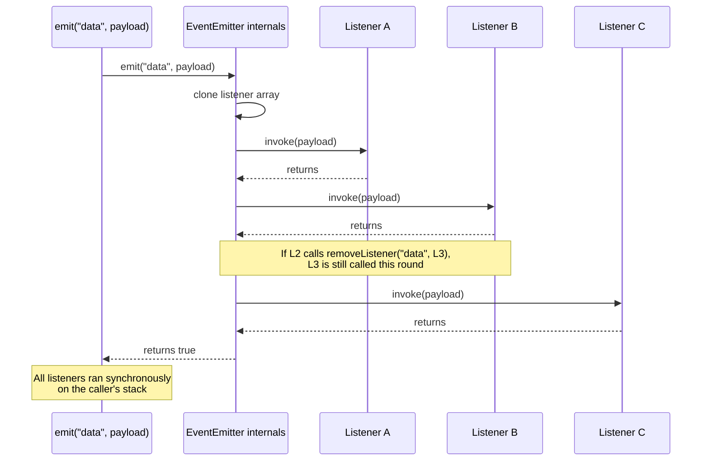

# 3.10 Event Emitter Pattern

> An `EventEmitter` is a named mailbox. Anyone who knows the address can leave a listener there; anyone who knows the name can drop a message in. The mailbox does not know, and does not care, who its subscribers are. That ignorance is the whole point: it is what lets a producer ship events to zero consumers, one consumer, or a thousand, without changing a single line of its own code.

This note is the canonical reference for the `EventEmitter` class in Node.js — the synchronous pub/sub primitive that underpins every stream, every HTTP server, every WebSocket, every worker thread message channel, and every custom plugin system in the Node ecosystem. Master this primitive and you have mastered the spine of Node's own internals; fail to master it and you will leak memory, crash processes on uncaught `'error'` events, and wonder why your `once` listener never fired.

The note is paired with [[3.07 Streams Fundamentals]] (which consumes `EventEmitter` to model backpressure), [[3.12 HTTP and HTTPS Modules]] (whose `http.Server` is itself an `EventEmitter`), [[1.29 Memory Leaks Diagnostic]] (which treats the listener-leak pattern in depth), and [[1.26 Event Loop Concurrency Model]] (which explains why `emit` is synchronous and what that costs you on a hot path).

---

## 1. Purpose

Node.js was designed around a single insight: I/O is slow, blocking is wasteful, and the only honest way to write a server that handles ten thousand idle connections is to never block any of them. The mechanism that delivers "this socket is readable" or "this file has bytes ready" or "this DNS lookup completed" to the JavaScript layer is, in every case, an `EventEmitter`. The kernel notifies libuv; libuv enqueues a callback on the event loop; the callback calls `emit`; the listeners run. The whole asynchronous runtime is, from the JavaScript perspective, an enormous tree of event emitters.

The `EventEmitter` class therefore exists to solve a single architectural problem: **how does a producer notify consumers about things that have already happened, without knowing how many consumers exist, who they are, or what they will do with the notification?**

The classical answer, in every object-oriented language since the 1990s, is the **observer pattern**. The producer holds a list of subscribers. Subscribers register themselves. When something happens, the producer iterates the list and calls each subscriber. That is the entire pattern. `EventEmitter` is Node's implementation of it: a small, fast, synchronous, in-process message bus with no dependencies and no opinion about what you do with it.

What `EventEmitter` enables, in concrete terms:

1. **Custom application events.** A `User` model can `emit('login', user)` and a dozen subsystems (analytics, audit log, session store, welcome emailer) can subscribe without `User` knowing about any of them. The `User` class stays small; the cross-cutting concerns stay decoupled.
2. **Pub/sub without a broker.** Redis, RabbitMQ, and Kafka are external brokers with network hops and serialization costs. `EventEmitter` is an in-process pub/sub bus: zero network, zero serialization, zero latency beyond the function call. For events that only matter inside one process, it is the right tool.
3. **Hook systems and plugin architectures.** Webpack, Gulp, VS Code's extension host, and Fastify's lifecycle hooks are all built on event-emitter-like primitives. A plugin registers listeners on the host's hooks; the host emits events at well-defined points; the plugin runs without being compiled into the host.
4. **Lifecycle notifications.** `process.on('exit')`, `process.on('SIGINT')`, `worker.on('message')`, `socket.on('close')` — every long-lived object in Node exposes its lifecycle as a set of events you can listen to.
5. **Streams.** Every `Readable` and `Writable` stream is an `EventEmitter`. The `'data'`, `'end'`, `'error'`, `'drain'`, `'finish'`, and `'close'` events are the entire streaming API in its oldest form. The newer async-iterator API is a wrapper around the same emissions.

The pattern also has a single, persistent, catastrophic failure mode that you must internalize before writing a single line of code with it: **memory leaks from unremoved listeners.** When a listener is registered on a long-lived emitter, the emitter holds a reference to the listener function, and the listener function (being a closure) holds references to everything in its enclosing scope, including, often, large objects. If the listener is never removed, those objects live for as long as the emitter lives — which, for a server, is the entire process lifetime. A handful of unremoved listeners on a per-request emitter, multiplied by a million requests, will exhaust memory and kill the process. The `EventEmitter` class ships with a default safety net — a warning printed to `stderr` when more than 10 listeners are registered on a single event — but the warning is just a warning. It does not prevent the leak. It only tells you that you have one.

This note exists to make that warning unnecessary. By the end of it, you will know the lifecycle of a listener cold, you will know how to type an emitter so the compiler catches misuses, you will know how to diagnose a listener leak with the built-in tooling, and you will know the four lines of cleanup code that prevent every common leak class.

---

## 2. Theory and Deep Dive

### 2.1 The `events` module

`EventEmitter` lives in the `events` built-in module. It is a class. To use it you either instantiate it directly or extend it.

```javascript
const EventEmitter = require('node:events');
const bus = new EventEmitter();
bus.on('ping', () => console.log('pong'));
bus.emit('ping'); // pong
```

In modern ESM:

```javascript
import { EventEmitter } from 'node:events';
const bus = new EventEmitter();
bus.on('ping', () => console.log('pong'));
bus.emit('ping');
```

The class is intentionally tiny. Its public surface, in Node 20+, is roughly twenty methods. You will use four of them ninety percent of the time: `on`, `once`, `emit`, `off`. The rest exist for edge cases and for the framework authors who need them.

### 2.2 The methods

| Method | Signature | Behavior |
|---|---|---|
| `on(event, listener)` | `(string \| symbol, Function) => EventEmitter` | Appends `listener` to the end of the list for `event`. Returns `this` for chaining. Alias: `addListener`. |
| `once(event, listener)` | `(string \| symbol, Function) => EventEmitter` | Appends a wrapper that runs `listener` once and then removes itself. Returns `this`. |
| `off(event, listener)` | `(string \| symbol, Function) => EventEmitter` | Removes the first occurrence of `listener` from the list for `event`. Identity must match (same function reference). Alias: `removeListener`. |
| `removeAllListeners(event?)` | `(string \| symbol?) => EventEmitter` | Removes every listener for `event`, or every listener on the emitter if `event` is omitted. |
| `emit(event, ...args)` | `(string \| symbol, ...any) => boolean` | Calls every listener for `event` synchronously in registration order with the supplied `args`. Returns `true` if any listeners were called, `false` otherwise. |
| `listeners(event)` | `(string \| symbol) => Function[]` | Returns a copy of the listener array for `event`. |
| `rawListeners(event)` | `(string \| symbol) => Function[]` | Returns the array without unwrapping `once` wrappers (so you can see the actual wrapper function). |
| `listenerCount(event)` | `(string \| symbol) => number` | Returns the count of listeners for `event`. |
| `prependListener(event, listener)` | same as `on` | Inserts `listener` at the front of the list instead of the end. |
| `prependOnceListener(event, listener)` | same as `once` | Inserts a one-shot wrapper at the front. |
| `setMaxListeners(n)` | `(number) => void` | Sets the warning threshold for this emitter. `0` (or `Infinity`) disables the warning entirely. |
| `getMaxListeners()` | `() => number` | Returns the current threshold. |
| `eventNames()` | `() => (string \| symbol)[]` | Returns the list of events that currently have at least one listener. |

There is also a static helper `EventEmitter.once(emitter, event)` that returns a Promise resolving the next time `event` is emitted, and `EventEmitter.on(emitter, event)` that returns an async iterator yielding each emission. Both are essential when you need to consume events from `async`/`await` code instead of registering callbacks.

### 2.3 Synchronous emission

This is the single most important fact about `EventEmitter` and the one that surprises people coming from browser `dispatchEvent` or from message queues: **`emit` is synchronous.** When you call `bus.emit('x', 1, 2)`, the call does not return until every listener for `'x'` has run to completion. Listeners are called in the order they were registered (FIFO), one after another, on the same call stack as the `emit`.

```javascript
const bus = new EventEmitter();
bus.on('x', () => console.log('first'));
bus.on('x', () => console.log('second'));
bus.on('x', () => console.log('third'));
console.log('before emit');
bus.emit('x');
console.log('after emit');
// before emit
// first
// second
// third
// after emit
```

If a listener throws, `emit` re-throws immediately. Listeners registered after the throwing one do not run. The throwing listener is not removed. This is brutal but predictable: a synchronous emitter has no try/catch of its own, so an unhandled throw in a listener propagates up the call stack exactly as a throw in any other function would.

The synchronous nature has three consequences you must internalize:

1. **A long-running listener blocks the producer.** If listener B takes 500ms, listener C waits 500ms, and so does the code that called `emit`. There is no fairness, no scheduler, no yielding. If you need to defer work, defer it yourself with `setImmediate`, `process.nextTick`, or `queueMicrotask` inside the listener.
2. **Re-entrancy is possible.** A listener can call `emit` on the same emitter, re-entering `emit` recursively. This is legal and well-defined, but it is a great way to write an infinite loop.
3. **Removing a listener from inside a listener is safe.** The emitter iterates a copy of the listener array (since Node 6); removing the current listener or a later one mid-iteration has no effect on the current pass. Removing an earlier one is also safe because it has already run.

### 2.4 The `'newListener'` and `'removeListener'` special events

`EventEmitter` emits two meta-events of its own, on itself, before adding or removing a listener:

- `'newListener'` is emitted **before** the new listener is added to the internal list. The handler receives `(event, listener)`.
- `'removeListener'` is emitted **before** the listener is removed from the list. Same arguments.

The "before" timing is not a typo. It is intentional, and it exists to support one specific use case: a subclass that wants to track listeners and react to them, but that needs to know about a new listener *before* the first event it cares about is emitted. If `'newListener'` fired after the add, a race would exist between the registration and the meta-listener.

The classic example is the `Domain` module (deprecated) and several debugging wrappers: they hook `'newListener'` to wrap every listener in a try/catch, so that throws are caught instead of crashing the process. The wrapping must happen before the listener is stored, hence the "before" semantics.

A second, subtler consequence: a `'newListener'` handler that calls `on(event, listener)` itself will recurse. To avoid infinite recursion, you must guard:

```javascript
const bus = new EventEmitter();
bus.on('newListener', (event, listener) => {
  if (event === 'newListener') return; // avoid infinite recursion
  console.log(`adding listener for ${event}`);
});
bus.on('ping', () => {}); // logs "adding listener for ping"
```

### 2.5 The `'error'` event

`'error'` is the only event name with special semantics in `EventEmitter`. If you call `emit('error', err)` and there is no listener registered for `'error'`, the emitter does **not** silently ignore it. Instead:

- The error is re-thrown on the next tick (in modern Node) or synchronously (in older Node — the behavior moved across versions and is now async via `process.nextTick` to give the process one last chance to attach a handler).
- If the thrown error is uncaught, the process emits `'uncaughtException'` and, by default, exits with a non-zero code.

This is the most dangerous default in all of Node. A single `emit('error', err)` on an emitter with no error listener will crash a production server. The mitigation is mandatory: **always register an `'error'` listener on any emitter that can emit `'error'`**, even if the listener is just `() => {}`.

```javascript
const bus = new EventEmitter();
bus.on('error', () => {}); // the "do nothing" handler that saves your process
bus.emit('error', new Error('boom')); // swallowed, no crash
```

If you remove the `on('error', ...)` line above, the same `emit` will print a stack trace and exit the process.

### 2.6 The default max listeners and the leak warning

By default, `EventEmitter` warns to `stderr` when the listener count for a single event exceeds 10. The warning looks like:

```
(node:12345) MaxListenersExceededWarning: Possible EventEmitter memory leak detected.
11 ping listeners added. Use emitter.setMaxListeners() to increase limit.
```

The number 10 is a heuristic. It is not a hard limit. Adding the 11th listener does not throw; it just warns. The point of the warning is to catch the most common bug pattern: a per-request listener added to a per-process emitter, which leaks one listener per request and reaches 11 within seconds of load testing.

You have three responses to the warning:

1. **Find and fix the leak.** This is almost always the right answer. The warning is correct: you are leaking.
2. **Raise the limit deliberately** with `setMaxListeners(n)` when you genuinely intend to have many listeners (a pub/sub bus with a hundred subscribers is fine).
3. **Disable the warning** with `setMaxListeners(0)`. Use this only when you have audited the emitter and confirmed that the listener count is bounded by something other than the warning threshold — for example, a fixed set of plugin registrations at startup.

The warning is per-emitter and per-event. You can also set the global default with `EventEmitter.defaultMaxListeners = n`, which affects every emitter created afterward.

### 2.7 `once` under the hood

`once` is not a separate code path. It is `on` with a wrapper:

```javascript
// approximate implementation
function once(event, listener) {
  const wrapper = (...args) => {
    this.removeListener(event, wrapper);
    return listener.apply(this, args);
  };
  wrapper.listener = listener; // so rawListeners can recover the original
  this.on(event, wrapper);
  return this;
}
```

Two consequences:

1. **The wrapper is a different function reference than the listener you passed.** If you try to `removeListener(event, listener)` to cancel a `once` registration, it will not work — the emitter is storing the wrapper, not your function. You must keep a reference to the wrapper (use `off` with the wrapper, or use `EventEmitter.once(emitter, event)` which returns a Promise you can ignore). In practice this is rarely a problem because `once` listeners remove themselves, but it bites people who try to "cancel a once" from outside.
2. **If the event never fires, the wrapper stays in memory forever.** `once` does not have a timeout. If you `once('connect', handler)` on a socket that never connects, the wrapper and the handler and everything they close over live until the socket is garbage-collected. For a long-lived emitter, this is a leak.

### 2.8 Listener order and `prependListener`

Listeners run in registration order: first registered, first called. This is FIFO. If listener A is registered before listener B, A runs before B, always.

Sometimes you need the opposite: you need a listener to run before everything else. The canonical case is a logging or metrics listener that must observe the event before any handler can mutate state. `prependListener(event, listener)` does this — it inserts at the front of the list instead of the back. `prependOnceListener` is the one-shot variant.

A listener prepended later still runs before listeners added before it:

```javascript
const bus = new EventEmitter();
bus.on('x', () => console.log('first registered'));
bus.prependListener('x', () => console.log('prepended later'));
bus.emit('x');
// prepended later
// first registered
```

### 2.9 The `EventEmitter` static helpers

Two static methods turn an emitter into a Promise or async iterator:

```javascript
const { EventEmitter } = require('node:events');

// Promise that resolves on the next emission, rejects on 'error'
const value = await EventEmitter.once(server, 'listen');

// Async iterator yielding each emission
for await (const chunk of EventEmitter.on(stream, 'data')) {
  console.log(chunk);
}
```

`EventEmitter.once(emitter, event)` returns a Promise that resolves with an array of the emit arguments. It rejects if `'error'` is emitted first (unless the event is `'error'` itself, in which case it resolves). This is the modern way to wait for a single event from `async`/`await` code.

`EventEmitter.on(emitter, event)` returns an async iterator. Each `next()` call resolves with `{ value: argsArray, done: false }`. The iterator can be cleaned up with `break`, `return`, or `throw` — Node wires the cleanup to `removeListener` under the hood, so breaking out of the loop removes the listener. This is the bridge between the callback-based event world and the async-iterator world.

There is also `EventEmitter.captureRejections Symbol`, an opt-in feature where async (Promise-returning) listeners have their rejections routed to the `'error'` event instead of being swallowed. Enable it by setting `EventEmitter.captureRejections = true` globally or passing `{ captureRejections: true }` to the constructor.

### 2.10 Sequence diagram of an emit



The crucial detail in this diagram: the listener array is cloned at the start of `emit`. Mutations to the live array during iteration (via `removeListener`, `off`, or `removeAllListeners`) do not affect the current pass. This is the guarantee that lets a listener clean up after itself safely.

---

## 3. Mental Models

### 3.1 The mailbox

An `EventEmitter` is a wall of mailboxes, one per event name. `on('mail', handler)` is "deliver my mail here." `emit('mail', letter)` is "drop this letter in every mailbox labeled `mail`." The mail carrier (`emit`) does not know who lives at the mailbox; the mailbox does not know who dropped the letter. Both sides are decoupled through the mailbox.

### 3.2 The subscriber list

Under the hood, the emitter keeps a `Map<event, Function[]>`. `on` pushes to the array. `off` finds and removes by identity. `emit` iterates and calls. Everything else is sugar.

### 3.3 The one-shot ticket

`once` is a ticket stub. You hand it to the doorman; the doorman tears it in half the first time you walk through; you cannot use it again. The wrapper function is the doorman; the listener is you.

### 3.4 The tripwire

The default max-listeners threshold is a tripwire, not a wall. It does not stop the leak. It prints a warning to `stderr` and hopes someone is reading logs. The warning says "you probably have a leak." It does not say "you have a leak" and it does not say "you don't." A legitimately fan-out pub/sub with 50 subscribers will trip it without leaking; a per-request leak will trip it after 11 requests and keep growing.

### 3.5 The error grenade

`emit('error', err)` is a grenade with the pin pulled. If someone has their hand on it (a registered `'error'` listener), nothing happens — they catch it. If nobody does, the pin blows on the next tick and the process dies. Always keep a hand on the grenade.

### 3.6 The synchronous call stack

`emit` is just a `for` loop over an array, calling each function. There is no magic, no scheduler, no event loop involvement. The "event" in `EventEmitter` is not a macrotask or a microtask; it is a function call. This is why throwing in a listener breaks the producer: the throw unwinds the producer's stack.

### 3.7 The leak magnet

A listener is a closure. A closure captures its enclosing scope. A scope often contains large objects (request bodies, file handles, database connections). A long-lived emitter holding a listener holds the closure, which holds the scope, which holds the objects. The listener is the magnet; the scope is the chain; the objects are the iron filings.

---

## 4. Real-World Use Cases

### 4.1 Streams

Every `Readable` and `Writable` stream in Node extends `EventEmitter`. The stream API in its oldest form is entirely event-based:

- `Readable`: `'data'`, `'end'`, `'error'`, `'close'`, `'readable'`, `'pause'`, `'resume'`
- `Writable`: `'drain'`, `'finish'`, `'error'`, `'close'`, `'pipe'`, `'unpipe'`

The modern async-iterator API (`for await (const chunk of stream)`) is built on top of these emissions, via the same `EventEmitter.on` helper described above. If you have ever written `stream.on('data', chunk => ...)`, you have used `EventEmitter`.

The reason streams use `EventEmitter` instead of callbacks or Promises is structural: a stream produces many chunks over time, and consumers want to react to each one as it arrives. A Promise resolves once. A callback fires once. An event can fire a million times. The event model is the natural fit.

See [[3.07 Streams Fundamentals]] for the streaming API in full.

### 4.2 HTTP server

`http.Server` is an `EventEmitter`. The `'request'` event fires on every incoming HTTP request; the `'connection'` event fires on every new TCP socket; the `'upgrade'` event fires on WebSocket upgrades; the `'error'` event fires on bind failures.

```javascript
const http = require('node:http');
const server = http.createServer();
server.on('request', (req, res) => { res.end('hello'); });
server.on('error', err => { console.error('server error', err); });
server.listen(3000);
```

`http.createServer((req, res) => {...})` is sugar for `new http.Server().on('request', cb)`. The class is an emitter; the callback is a listener; everything else is plumbing.

See [[3.12 HTTP and HTTPS Modules]] for the full HTTP API.

### 4.3 WebSocket servers

The `ws` package, the standard WebSocket library for Node, is built entirely on `EventEmitter`. A `WebSocketServer` emits `'connection'` with a new `WebSocket` client. Each `WebSocket` emits `'message'`, `'close'`, `'error'`, `'ping'`, `'pong'`. The same pattern repeats at every layer: emitter → listener → handler.

### 4.4 Custom plugin systems

Fastify, Webpack, Rollup, and Gulp all expose their extension points as event-emitter-like hooks. A plugin registers a listener on a named hook; the framework emits the hook at the appropriate lifecycle point; the plugin runs.

Fastify specifically uses a custom hook system, but the mental model is identical: `'onRequest'`, `'preHandler'`, `'onSend'`, `'onError'` are named events, and plugins are listeners. Webpack's `compiler.hooks` is a `tapable` instance, which is itself an `EventEmitter` variant with extra support for async serial and parallel hooks.

The benefit of the event model for plugins is decoupling: the framework ships a fixed set of hook points; plugins subscribe without the framework knowing they exist; the framework can be loaded with zero plugins or a thousand. The cost is ordering: if plugins depend on each other's effects, the order of listener registration matters and must be documented.

### 4.5 Process events

`process` is itself an `EventEmitter`. The standard lifecycle events are:

- `'exit'` — fired when the event loop has no more work and the process is about to terminate. Listeners must be synchronous; async work in an `'exit'` listener is ignored.
- `'beforeExit'` — fired when the event loop empties but the process has not been told to exit. Useful for scheduling more work to keep the process alive.
- `'SIGINT'`, `'SIGTERM'`, `'SIGHUP'` — Unix signals, surfaced as events.
- `'uncaughtException'` — fired when a synchronous throw reaches the top of the call stack.
- `'unhandledRejection'` — fired when a Promise rejection is not caught.

The `'exit'` listener rule is worth memorizing: **only synchronous work runs.** The process is tearing down; the event loop is gone; `setTimeout`, `setImmediate`, and any callback queued by an async operation will never run. If you need to flush logs or close a database connection on shutdown, you must do it synchronously (for example, with `fs.writeFileSync` and a sync driver) or in a `'beforeExit'` handler that schedules more work.

### 4.6 Worker threads

The `Worker` class from the Node worker threads module is an `EventEmitter`. The `'message'` event fires when the worker posts a message via the parent port's `postMessage` method. The `'error'` event fires when the worker throws. The `'exit'` event fires when the worker terminates. The `'online'` event fires when the worker has booted its V8 isolate.

Cross-thread communication is, from the main thread's perspective, just another event emitter — the only difference is that `emit` is replaced by `postMessage` plus the kernel's thread message queue, which makes emissions asynchronous across thread boundaries.

### 4.7 File watchers

`fs.watch` returns an `EventEmitter`-like object (`FSWatcher`) that emits `'change'` and `'error'`. `chokidar` wraps this in a more reliable API but the model is the same: register a listener, get notified on file system changes.

### 4.8 Custom domain events

Beyond the standard library, `EventEmitter` is the right tool whenever you have a single object that needs to broadcast domain events to a dynamic set of subscribers. A `User` model emitting `'login'`, an `Order` model emitting `'shipped'`, a `ChatRoom` model emitting `'message'` — these are textbook observer pattern, and `EventEmitter` is the textbook implementation.

The alternative — calling each subscriber directly — requires the producer to know the subscriber list, which inverts the dependency and couples the producer to every consumer. The event model inverts the dependency back: subscribers depend on the producer's event names; the producer depends on nothing.

---

## 5. Code Examples

### 5.1 Example A — Minimal and Conceptual

The minimal tour. Every method, in five lines or fewer, side by side in JavaScript and TypeScript.

**JavaScript**

```javascript
const EventEmitter = require('node:events');
const bus = new EventEmitter();

// on: subscribe
bus.on('ping', (payload) => console.log('ping', payload));

// once: subscribe, auto-remove after first fire
bus.once('boot', () => console.log('booted'));

// emit: synchronously call all listeners in registration order
bus.emit('ping', 1);   // ping 1
bus.emit('boot');      // booted
bus.emit('boot');      // (nothing — once already fired)

// off: unsubscribe by reference identity
const handler = (x) => console.log('h', x);
bus.on('e', handler);
bus.off('e', handler);
bus.emit('e', 42);     // (nothing — handler removed)

// removeAllListeners: bulk cleanup
bus.on('a', () => {});
bus.on('a', () => {});
bus.removeAllListeners('a');
console.log(bus.listenerCount('a'));  // 0

// listeners: inspect the registered functions
bus.on('x', handler);
console.log(bus.listeners('x').length);  // 1

// setMaxListeners: tune the leak warning
bus.setMaxListeners(50);
console.log(bus.getMaxListeners());       // 50

// prependListener: insert at front
bus.on('y', () => console.log('second'));
bus.prependListener('y', () => console.log('first'));
bus.emit('y');
// first
// second

// the error event — without a listener, this crashes
bus.on('error', (err) => console.log('caught', err.message));
bus.emit('error', new Error('boom'));  // caught boom

// EventEmitter.once as a Promise
EventEmitter.once(bus, 'ready').then(() => console.log('ready!'));
bus.emit('ready');  // ready!
```

**TypeScript**

```typescript
import { EventEmitter } from 'node:events';

type Events = {
  ping: [payload: number];
  boot: [];
  e: [x: number];
  a: [];
  x: [x: number];
  y: [];
  error: [err: Error];
  ready: [];
};

const bus = new EventEmitter<Events>();

bus.on('ping', (payload) => console.log('ping', payload));
bus.once('boot', () => console.log('booted'));

bus.emit('ping', 1);
bus.emit('boot');
bus.emit('boot');

const handler = (x: number) => console.log('h', x);
bus.on('e', handler);
bus.off('e', handler);
bus.emit('e', 42);

bus.on('a', () => {});
bus.on('a', () => {});
bus.removeAllListeners('a');
console.log(bus.listenerCount('a'));

bus.on('x', handler);
console.log(bus.listeners('x').length);

bus.setMaxListeners(50);
console.log(bus.getMaxListeners());

bus.on('y', () => console.log('second'));
bus.prependListener('y', () => console.log('first'));
bus.emit('y');

bus.on('error', (err) => console.log('caught', err.message));
bus.emit('error', new Error('boom'));

EventEmitter.once<Events['ready']>(bus, 'ready').then(() => console.log('ready!'));
bus.emit('ready');
```

Note: in TypeScript, `EventEmitter<Events>` is the typed-emitter pattern. The `Events` type maps event names to tuples of argument types. The compiler then enforces that `on('ping', (payload: number) => ...)` matches the `[payload: number]` tuple, that `emit('ping', 1)` is called with a number, and that `emit('ping', 'oops')` is rejected. This pattern is so common that the `@types/node` package ships a `EventEmitter` that accepts a generic, and several npm packages (`typed-emitter`, `tsee`) exist to provide the same ergonomics on older Node versions.

### 5.2 Example B — Production-Grade

A typed pub/sub bus with strongly-typed event maps, async listener support with rejection capture, a `scope()` helper for grouped cleanup, and a diagnostic surface for leak detection. This is the kind of emitter you would ship inside a real application.

**JavaScript**

```javascript
const { EventEmitter } = require('node:events');

class TypedBus extends EventEmitter {
  constructor() {
    super({ captureRejections: true });
  }

  // Type-safe subscribe (runtime only; JS has no compile-time types)
  subscribe(event, listener) {
    this.on(event, listener);
    return () => this.off(event, listener); // disposer
  }

  // Subscribe once, returning a disposer for early cancellation
  subscribeOnce(event, listener) {
    this.once(event, listener);
    return () => this.off(event, listener);
  }

  // Group many subscriptions under one cleanup handle
  scope() {
    const disposers = [];
    return {
      on: (event, listener) => {
        disposers.push(this.subscribe(event, listener));
      },
      once: (event, listener) => {
        disposers.push(this.subscribeOnce(event, listener));
      },
      cleanup: () => {
        while (disposers.length) disposers.pop()();
      },
    };
  }

  // Defer emission so listeners cannot block the producer
  emitAsync(event, ...args) {
    setImmediate(() => this.emit(event, ...args));
  }

  // Diagnostic dump for leak hunting
  diagnose() {
    return this.eventNames().map((name) => ({
      event: name,
      count: this.listenerCount(name),
      listeners: this.listeners(name).map((fn) =>
        fn.name || '<anonymous>'
      ),
    }));
  }
}

// usage
const bus = new TypedBus();

const scope = bus.scope();
scope.on('user.login', (user) => console.log('analytics', user.id));
scope.on('user.login', (user) => console.log('audit', user.id));

bus.emit('user.login', { id: 42 });
// analytics 42
// audit 42

scope.cleanup();
console.log(bus.listenerCount('user.login')); // 0

// async emit
bus.on('flush', async () => {
  await new Promise((r) => setTimeout(r, 10));
  console.log('flushed');
});
bus.emitAsync('flush');
console.log('emitted');
// emitted
// flushed (10ms later)

// captureRejections routes async listener rejections to 'error'
bus.on('error', (err) => console.log('bus error:', err.message));
bus.on('risky', async () => { throw new Error('listener failed'); });
bus.emit('risky');
// bus error: listener failed (after the listener's Promise rejects)
```

**TypeScript**

```typescript
import { EventEmitter } from 'node:events';

// The event map: every event name maps to a tuple of argument types.
type BusEvents = {
  'user.login': [user: { id: number; email: string }];
  'user.logout': [userId: number];
  'flush': [];
  'risky': [];
  'error': [err: Error];
};

type Disposer = () => void;

interface Scope {
  on<E extends keyof BusEvents>(
    event: E,
    listener: (...args: BusEvents[E]) => void | Promise<void>
  ): void;
  once<E extends keyof BusEvents>(
    event: E,
    listener: (...args: BusEvents[E]) => void | Promise<void>
  ): void;
  cleanup(): void;
}

class TypedBus extends EventEmitter<BusEvents> {
  constructor() {
    super({ captureRejections: true });
  }

  subscribe<E extends keyof BusEvents>(
    event: E,
    listener: (...args: BusEvents[E]) => void | Promise<void>
  ): Disposer {
    this.on(event, listener);
    return () => this.off(event, listener);
  }

  subscribeOnce<E extends keyof BusEvents>(
    event: E,
    listener: (...args: BusEvents[E]) => void | Promise<void>
  ): Disposer {
    this.once(event, listener);
    return () => this.off(event, listener);
  }

  scope(): Scope {
    const disposers: Disposer[] = [];
    return {
      on: (event, listener) => {
        disposers.push(this.subscribe(event, listener));
      },
      once: (event, listener) => {
        disposers.push(this.subscribeOnce(event, listener));
      },
      cleanup: () => {
        while (disposers.length) disposers.pop()();
      },
    };
  }

  emitAsync<E extends keyof BusEvents>(event: E, ...args: BusEvents[E]): void {
    setImmediate(() => this.emit(event, ...args));
  }

  diagnose(): Array<{ event: keyof BusEvents; count: number; listeners: string[] }> {
    return (this.eventNames() as Array<keyof BusEvents>).map((name) => ({
      event: name,
      count: this.listenerCount(name),
      listeners: this.listeners(name).map((fn) => fn.name || '<anonymous>'),
    }));
  }
}

// usage
const bus = new TypedBus();

const scope = bus.scope();
scope.on('user.login', (user) => console.log('analytics', user.id));
scope.on('user.login', (user) => console.log('audit', user.id));

bus.emit('user.login', { id: 42, email: 'u@example.com' });
// analytics 42
// audit 42

scope.cleanup();
console.log(bus.listenerCount('user.login')); // 0

bus.on('flush', async () => {
  await new Promise<void>((r) => setTimeout(r, 10));
  console.log('flushed');
});
bus.emitAsync('flush');
console.log('emitted');
// emitted
// flushed

bus.on('error', (err) => console.log('bus error:', err.message));
bus.on('risky', async () => { throw new Error('listener failed'); });
bus.emit('risky');
// bus error: listener failed
```

The disposer pattern — every `on` returns a function that calls `off` — is the single most useful convention for preventing listener leaks in application code. It costs nothing, composes into scopes and lifecycles trivially, and turns the otherwise error-prone "remember to remove this listener" rule into a mechanical "call the disposer in the `finally` block" rule.

The `scope()` helper is a small generalization: bundle N disposers under one cleanup handle, then call `cleanup()` once when the owning component (an HTTP request handler, a React effect, a CLI command) finishes. This is the same pattern that Vue's `effectScope` and many React state-management libraries provide; it works just as well for plain Node emitters.

`captureRejections: true` is the second essential production setting. Without it, an async listener that returns a rejected Promise has its rejection silently swallowed. With it, the rejection is routed to the `'error'` event, where your global error handler can observe and log it. This is mandatory for any emitter whose listeners might do async work — which, in a real application, is most of them.

---

## 6. Common Mistakes and Anti-Patterns

### 6.1 Registering a listener on every request and never removing it

The single most common `EventEmitter` bug, and the reason the max-listeners warning exists.

```javascript
// ANTI-PATTERN: leaks one listener per request
const http = require('node:http');
const bus = require('./bus'); // long-lived application bus
http.createServer((req, res) => {
  bus.on('flush', () => res.end()); // wrong: this listener is per-request
  // ... eventually something emits 'flush'
}).listen(3000);
```

Every request adds a listener to the long-lived `bus`. The listener closes over `res`, which closes over the socket, which closes over the request body. After 11 requests the warning fires. After a thousand requests the process is holding a thousand sockets in memory and the heap is enormous. The fix is either `once` (if the listener really should fire once per request) or explicit removal in a `finally`:

```javascript
http.createServer((req, res) => {
  const onFlush = () => res.end();
  bus.once('flush', onFlush);
  // ... or bus.on('flush', onFlush) with cleanup
  req.on('close', () => bus.off('flush', onFlush));
}).listen(3000);
```

### 6.2 No `'error'` listener on an emitter that can emit `'error'`

The process-crashing default. Any emitter that wraps I/O — a stream, a socket, an HTTP request, a worker — can emit `'error'`. If you do not register an `'error'` listener, the first emission crashes the process.

```javascript
// ANTI-PATTERN: process dies on the first TCP error
const socket = new net.Socket();
socket.on('data', (chunk) => handle(chunk));
// no error listener — emit('error', err) will throw and crash
socket.connect(80, 'example.com');
```

The fix is mandatory and trivial:

```javascript
socket.on('error', (err) => log('socket error', err));
```

Even a no-op listener is better than nothing: `socket.on('error', () => {})` swallows the error and keeps the process alive. Whether swallowing is the right policy is a separate question (usually it is not — you should at least log), but it is strictly better than crashing.

### 6.3 Emitting `'error'` synchronously with no listener

If you write a custom emitter that emits `'error'` and a consumer has not yet attached a listener, the emit will throw. This is by design — it is the same as the previous anti-pattern viewed from the producer side.

```javascript
class Loader extends EventEmitter {
  load(path) {
    if (!fs.existsSync(path)) {
      this.emit('error', new Error('not found')); // throws if no listener
      return;
    }
    // ...
  }
}

const loader = new Loader();
loader.load('/missing'); // throws synchronously, no error listener attached
```

The fix on the consumer side is always to attach the `'error'` listener before any operation that can fail. The fix on the producer side is either to document the requirement loudly, or to use `process.nextTick` to defer the emit so consumers have one tick to attach:

```javascript
load(path) {
  if (!fs.existsSync(path)) {
    const err = new Error('not found');
    process.nextTick(() => this.emit('error', err));
    return;
  }
}
```

The `process.nextTick` deferral is exactly what Node itself does internally for many emitters — it is the reason you can write `const stream = fs.createReadStream(path); stream.on('error', handler);` and have the handler catch errors that occurred during construction. Without the deferral, the error would emit before the consumer's `on('error', ...)` line ran.

### 6.4 Assuming listener order does not matter

Listeners run in registration order, period. If listener A depends on listener B having run first, A must be registered after B — or A must use `prependListener` if B is registered by code you do not control.

```javascript
// ANTI-PATTERN: order-dependent listeners, fragile to registration order
bus.on('transform', (doc) => { doc.value = doc.value.toUpperCase(); });
bus.on('transform', (doc) => { console.log(doc.value); });
// If the two registrations are flipped (e.g., by a plugin loader that
// sorts alphabetically), the log prints the untransformed value.
```

The fix is to make listeners order-independent whenever possible. If order matters, document it loudly, or use a single ordered pipeline (an array of transforms run by one listener) instead of N independent listeners.

### 6.5 `once` registered after the event already fired

```javascript
// ANTI-PATTERN: once never fires
const stream = fs.createReadStream(path);
stream.on('open', () => console.log('opened'));
// some time later, after the file has already been opened:
stream.once('open', () => console.log('also opened')); // never fires
```

`once` only fires on the *next* emission. If the event has already fired and will not fire again, the listener waits forever. This is the listener equivalent of subscribing to a Promise that already resolved — except Promises cache their resolution, while `EventEmitter` does not.

For events that fire exactly once (a server's `'listening'`, a file's `'open'`, a process's `'exit'`), prefer `EventEmitter.once(emitter, event)` only if you can guarantee you call it before the event fires. If you cannot guarantee that, you need a different primitive — typically a Promise that resolves either immediately (if the event already fired) or on the next emission. Several libraries (notably `p-event`) provide exactly this.

### 6.6 Exceeding max listeners and dismissing the warning

The warning is not a hard limit, so it is easy to ignore. But a warning that fires once per process per emitter is easy to miss in logs, and a real leak can grow for hours before anyone notices.

```javascript
// ANTI-PATTERN: silencing the warning instead of fixing the leak
bus.setMaxListeners(0); // now nobody will ever tell you about the leak
```

The right fix is almost always to find the leak. The wrong fix is `setMaxListeners(0)`. The exception is a deliberately fan-out emitter (a pub/sub bus with a known, bounded subscriber set) where the warning is a known false positive.

### 6.7 Removing a `once` listener by the original function reference

```javascript
// ANTI-PATTERN: off does not find the once wrapper
const handler = () => console.log('once');
bus.once('e', handler);
bus.off('e', handler);  // no-op: emitter stored the wrapper, not handler
bus.emit('e');           // still fires once
```

The emitter stores the wrapper, not your function. `off` does identity comparison and finds nothing. To cancel a `once`, either keep the wrapper (which `once` does not return in the standard API) or use `EventEmitter.once(emitter, event)` which returns a Promise you can simply ignore.

### 6.8 Re-entrant emit causing infinite recursion

```javascript
// ANTI-PATTERN: emit re-enters itself
bus.on('x', () => {
  console.log('x');
  bus.emit('x'); // re-enters emit on the same emitter
});
bus.emit('x'); // infinite recursion, stack overflow
```

A listener that emits the same event synchronously causes the emit to recurse without bound. The fix is to defer the re-emit with `setImmediate` or `process.nextTick`, or to use a queue-and-drain pattern instead of direct recursion.

### 6.9 Forgetting that `removeAllListeners()` with no argument wipes `'error'` too

```javascript
// ANTI-PATTERN: accidentally removing the error handler
bus.on('error', err => log(err));
bus.on('data', handleData);
// ...later, trying to clear data listeners:
bus.removeAllListeners(); // also removes the error handler!
```

`removeAllListeners()` with no argument removes every listener on every event, including `'error'`. The next `emit('error', ...)` will then crash the process. Always pass an explicit event name, or re-attach the error handler immediately after.

### 6.10 Long-running listeners blocking the producer

```javascript
// ANTI-PATTERN: a slow listener blocks emit
bus.on('log', async (entry) => {
  await fs.writeFile('app.log', entry); // ~5ms per call
});
bus.emit('log', 'a'); // emit waits for the listener to settle
bus.emit('log', 'b'); // waits again
// 1000 emits = 5 seconds of synchronous blocking from the producer's view
```

Wait — this example is subtler than it looks. The listener is `async`, so it returns a Promise immediately; `emit` does not await it. But the file write happens in the background, and 1000 concurrent file writes will saturate the libuv thread pool. The real problem is not blocking `emit` but overwhelming the I/O subsystem. The fix is to use a queue with bounded concurrency, not to call `emit` 1000 times and hope for the best.

A clearer example of blocking:

```javascript
// ANTI-PATTERN: a synchronous slow listener blocks emit
bus.on('log', (entry) => {
  fs.writeFileSync('app.log', entry); // synchronous, blocks emit
});
bus.emit('log', 'a'); // blocks until the write completes
```

This version truly blocks. The fix is to use the async `fs.writeFile` (or a logging library that batches writes), not the synchronous variant.

---

## 7. Best Practices and Design Patterns

### 7.1 Always remove listeners when done, or use `once`

The rule that prevents 90 percent of listener leaks. If you call `on`, you must call `off` somewhere — usually in a `finally` block, a cleanup method, or a disposer returned from a helper. If you do not need to remove manually, use `once` so the emitter removes for you.

The disposer pattern from Section 5.2 is the cleanest expression of this rule:

```javascript
function subscribe(bus, event, listener) {
  bus.on(event, listener);
  return () => bus.off(event, listener);
}

// usage
const dispose = subscribe(bus, 'data', handle);
try {
  await doWork();
} finally {
  dispose();
}
```

### 7.2 Always handle `'error'`

Mandatory for any emitter that can emit `'error'`. Even a no-op handler is better than crashing. Prefer a real handler that logs and continues, or logs and shuts down gracefully, depending on the severity.

```javascript
bus.on('error', (err) => {
  logger.error({ err }, 'unhandled bus error');
  // optionally: process.exit(1) for fatal errors
});
```

If you write a custom emitter that others will consume, document loudly that `'error'` is emitted and that consumers must register a handler. Better still, defer the first `'error'` emission with `process.nextTick` so consumers have a chance to attach.

### 7.3 Use `setMaxListeners(0)` only when you know what you are doing

The warning is there for a reason. Disabling it globally is almost always wrong. Disabling it for a specific emitter that is genuinely a fan-out pub/sub bus is acceptable, but you should document why the warning was disabled and confirm that the listener count is bounded by something other than the warning threshold.

A bounded pub/sub bus with 200 subscribers and a fixed plugin set at startup is fine. A per-request listener on a per-process emitter is not fine, and silencing the warning on the latter is a bug disguised as a fix.

### 7.4 Defer heavy work with `setImmediate` to avoid blocking the producer

If a listener might do slow synchronous work (CPU-bound computation, large serialization, blocking I/O), defer it:

```javascript
bus.on('compute', (input) => {
  setImmediate(() => {
    const result = heavyCompute(input);
    bus.emit('computed', result);
  });
});
```

This lets `emit` return immediately and lets the event loop process other work between computations. For I/O-bound work, prefer the async variants of the I/O functions (`fs.writeFile` over `fs.writeFileSync`); `setImmediate` is for CPU-bound work that you cannot offload to a worker thread.

### 7.5 Use TypeScript to type event maps

The typed-emitter pattern from Section 5.2 is the single biggest reliability win available. The compiler enforces:

- The event name is one of the known keys.
- The listener signature matches the declared argument tuple.
- `emit` is called with arguments of the right types.
- `off` is called with a function whose signature matches the event.

A typo like `bus.emit('user.Logi', user)` becomes a compile error instead of a runtime silent miss. This is worth the type-definition overhead in every non-trivial codebase.

### 7.6 Document event names and payloads

Event names are part of your public API. Treat them as such. Document:

- The event name (as a string literal in the type, but also in prose).
- The arguments, in order, with types and semantics.
- When the event fires (lifecycle point, pre- or post-condition).
- Whether it can fire zero, one, or many times.
- Whether the listener is allowed to mutate the arguments.

Without this documentation, consumers guess, and guesses lead to bugs. With it, the event map type becomes self-documenting and the prose covers the semantics that types cannot express.

### 7.7 Prefer `EventEmitter.once` (the static Promise helper) for one-shot awaits in async code

Inside an `async` function, prefer:

```javascript
const [port] = await EventEmitter.once(server, 'listening');
```

over:

```javascript
await new Promise((resolve) => server.once('listening', () => resolve()));
```

The static helper is shorter, handles `'error'` correctly (rejects if `'error'` fires first), and is the canonical idiom. The same applies to `EventEmitter.on` for async iteration over a stream of events.

### 7.8 Use `captureRejections` for async listeners

If your listeners are async (return Promises), enable `captureRejections: true` on the emitter so that rejected Promises are routed to `'error'` instead of being swallowed. This is opt-in (set globally with `EventEmitter.captureRejections = true` or per-emitter via the constructor option) because changing the default would break existing code that relies on the swallow behavior, but for any new code it should be on.

### 7.9 Use `eventNames()` and `listenerCount()` for diagnostics

Ship a diagnostic endpoint in long-running services that dumps `eventNames()` with `listenerCount()` for each, plus the names of registered listeners (function `name` property). This is the cheapest possible leak detector: if the listener count for some event climbs over the process lifetime, you have a leak. The dump takes 20 lines of code and saves hours of heap-snapshot analysis.

### 7.10 Do not subclass `EventEmitter` if you do not need to

Composition beats inheritance for emitters. Instead of:

```javascript
class User extends EventEmitter {
  login() { /* ... */ this.emit('login', this); }
}
```

prefer:

```javascript
class User {
  constructor() { this.events = new EventEmitter(); }
  login() { /* ... */ this.events.emit('login', this); }
}
```

The composed version keeps the `User` API clean (no accidental `on`/`off` on user instances), makes the emitter swappable (use a stricter subclass for tests), and avoids the multiple-inheritance trap that hits when `User` wants to extend both `Model` and `EventEmitter`.

---

## 8. Technical Interview Knowledge

### Q1 — What is `EventEmitter`?

`EventEmitter` is Node's implementation of the observer pattern. It is a class from the `node:events` module that maintains a map of event names to arrays of listener functions. Producers call `emit(eventName, ...args)` to synchronously invoke every registered listener for that event with the supplied arguments. Consumers call `on(eventName, listener)` to subscribe and `off(eventName, listener)` to unsubscribe. The class is the foundation of Node's asynchronous I/O model: every stream, HTTP server, socket, and worker thread is an `EventEmitter`.

### Q2 — How do you remove a listener?

Call `emitter.off(event, listener)` (alias `removeListener`) with the exact same function reference you passed to `on`. The emitter compares by identity (`===`), so anonymous functions cannot be removed — you must keep a reference. For bulk cleanup, `removeAllListeners(event)` removes every listener for that event, and `removeAllListeners()` with no argument removes every listener on every event (including `'error'`, which is dangerous). To remove a `once` listener before it fires, you must remove the wrapper, not the original function — which is awkward, so prefer `EventEmitter.once(emitter, event)` (the Promise version) when you might need to cancel.

### Q3 — What happens if you emit `'error'` with no listener?

The emitter throws the error. In modern Node, the throw is deferred to `process.nextTick` to give the process one tick to attach a handler, but if no handler is attached by then, the error propagates as an uncaught exception, the process emits `'uncaughtException'`, and (by default) the process exits with a non-zero code. This is the most dangerous default in `EventEmitter` and the reason every emitter that can emit `'error'` must have an `'error'` listener registered, even if the listener is a no-op.

### Q4 — What is the default max listeners?

10. When the 11th listener is added to a single event, Node prints a `MaxListenersExceededWarning` to `stderr`. The limit is per-emitter and per-event, not global. It is a warning only — the 11th listener is added and works fine. The limit can be raised per-emitter with `setMaxListeners(n)`, set globally with `EventEmitter.defaultMaxListeners = n`, or disabled with `setMaxListeners(0)`. The default exists to catch the most common leak pattern: per-request listeners on per-process emitters.

### Q5 — Difference between `on` and `once`?

`on` registers a listener that fires on every emission of the event. `once` registers a listener that fires on exactly one emission and then removes itself. Under the hood, `once` wraps the listener in a one-shot function: the wrapper calls the listener, then calls `removeListener` on itself, then returns. The wrapper is what the emitter stores; the original function is stored as `wrapper.listener` for diagnostic purposes. Because the wrapper is a different reference than the original function, you cannot `off` a `once` by passing the original function — you must keep the wrapper (which the standard `once` API does not return) or use the Promise-based `EventEmitter.once`.

### Q6 — How do you handle async listeners?

By default, `EventEmitter` does nothing special with Promises returned from listeners — it calls the listener, ignores the return value, and moves on. If the listener throws synchronously, the throw propagates up the `emit` call stack. If the listener returns a rejected Promise, the rejection is silently swallowed unless `captureRejections: true` is set, in which case the rejection is routed to the `'error'` event with the original error as the argument. For long-running async work, prefer to defer with `setImmediate` inside the listener so `emit` returns immediately and the work happens on a later tick. For awaiting all listeners, you would need to wrap `emit` yourself: collect the return values, `await Promise.allSettled` them, route rejections to your error handler.

### Q7 — How would you type an event emitter?

Use the typed-emitter pattern: define a type that maps event names to tuples of argument types, then pass it as the generic parameter to `EventEmitter`:

```typescript
type Events = {
  login: [user: User];
  logout: [userId: number];
  error: [err: Error];
};
class MyBus extends EventEmitter<Events> {}
```

The compiler then enforces that `bus.on('login', (user: User) => ...)` has the right signature, that `bus.emit('login', user)` is called with a `User`, and that `bus.emit('login', 42)` is rejected. The `@types/node` package ships `EventEmitter` with this generic since Node 14.something. For older versions or for stricter typing (including async listeners), the `typed-emitter` npm package provides a drop-in.

### Q8 — How do you prevent memory leaks?

Four rules cover almost every case:

1. **Always remove listeners when done.** Use the disposer pattern (`on` returns a function that calls `off`), `finally` blocks, or scope helpers that bundle many disposers.
2. **Use `once` for one-shot subscriptions** so the emitter removes the listener for you.
3. **Never add per-request listeners to per-process emitters.** The listener count grows unboundedly with traffic.
4. **Always register an `'error'` listener** so an uncaught error does not crash the process while you are debugging a leak.

For diagnostics, ship an endpoint or a periodic log that dumps `eventNames()` with `listenerCount()`. If counts climb over time, you have a leak. For deeper inspection, use `process.report.getReport()` or take a heap snapshot with `node --inspect` and look for retained listener wrappers.

---

## 9. Practical Exercises

### Exercise 1 — Build a custom event emitter from scratch

Implement a minimal `EventEmitter` supporting `on`, `off`, `once`, `emit`, `removeAllListeners`, and `listenerCount`. Do not use the `node:events` module.

**JavaScript solution**

```javascript
class MyEmitter {
  constructor() {
    this.events = new Map();
  }

  on(event, listener) {
    if (!this.events.has(event)) this.events.set(event, []);
    this.events.get(event).push(listener);
    return this;
  }

  off(event, listener) {
    const list = this.events.get(event);
    if (!list) return this;
    const idx = list.indexOf(listener);
    if (idx !== -1) list.splice(idx, 1);
    if (list.length === 0) this.events.delete(event);
    return this;
  }

  once(event, listener) {
    const wrapper = (...args) => {
      this.off(event, wrapper);
      listener.apply(this, args);
    };
    wrapper.listener = listener;
    this.on(event, wrapper);
    return this;
  }

  emit(event, ...args) {
    const list = this.events.get(event);
    if (!list) return false;
    // iterate a copy so listeners can mutate the live array safely
    for (const fn of [...list]) {
      fn.apply(this, args);
    }
    return true;
  }

  removeAllListeners(event) {
    if (event === undefined) {
      this.events.clear();
    } else {
      this.events.delete(event);
    }
    return this;
  }

  listenerCount(event) {
    return this.events.get(event)?.length ?? 0;
  }
}

// test
const e = new MyEmitter();
e.on('x', (a) => console.log('first', a));
e.on('x', (a) => console.log('second', a));
e.once('x', (a) => console.log('once', a));
e.emit('x', 1);
// first 1
// second 1
// once 1
e.emit('x', 2);
// first 2
// second 2
console.log(e.listenerCount('x')); // 2
```

**TypeScript solution**

```typescript
type Listener = (...args: any[]) => void;

class MyEmitter {
  private events = new Map<string, Listener[]>();

  on(event: string, listener: Listener): this {
    if (!this.events.has(event)) this.events.set(event, []);
    this.events.get(event)!.push(listener);
    return this;
  }

  off(event: string, listener: Listener): this {
    const list = this.events.get(event);
    if (!list) return this;
    const idx = list.indexOf(listener);
    if (idx !== -1) list.splice(idx, 1);
    if (list.length === 0) this.events.delete(event);
    return this;
  }

  once(event: string, listener: Listener): this {
    const wrapper: Listener = (...args) => {
      this.off(event, wrapper);
      listener(...args);
    };
    (wrapper as Listener & { listener: Listener }).listener = listener;
    this.on(event, wrapper);
    return this;
  }

  emit(event: string, ...args: any[]): boolean {
    const list = this.events.get(event);
    if (!list) return false;
    for (const fn of [...list]) fn(...args);
    return true;
  }

  removeAllListeners(event?: string): this {
    if (event === undefined) this.events.clear();
    else this.events.delete(event);
    return this;
  }

  listenerCount(event: string): number {
    return this.events.get(event)?.length ?? 0;
  }
}

const e = new MyEmitter();
e.on('x', (a: number) => console.log('first', a));
e.on('x', (a: number) => console.log('second', a));
e.once('x', (a: number) => console.log('once', a));
e.emit('x', 1);
e.emit('x', 2);
console.log(e.listenerCount('x'));
```

The key details: the listener array is cloned (`[...list]`) before iteration so listeners can safely remove themselves or others mid-emit. `once` is implemented as `on` with a wrapper that removes itself before invoking the original. `off` uses `indexOf` to find the listener, which means identity comparison — passing a different function reference (even one that is structurally identical) does nothing.

### Exercise 2 — Implement a typed emitter with event maps

Build a `TypedEmitter<Events>` class where `Events` maps event names to argument tuples. The compiler must enforce that `on`, `once`, `emit`, and `off` are called with the correct types.

**TypeScript solution**

```typescript
type EventHandler<Args extends any[]> = (...args: Args) => void;

class TypedEmitter<Events extends Record<string, any[]>> {
  private events = new Map<keyof Events, EventHandler<any[]>[]>();

  on<E extends keyof Events>(event: E, listener: EventHandler<Events[E]>): this {
    if (!this.events.has(event)) this.events.set(event, []);
    this.events.get(event)!.push(listener as EventHandler<any[]>);
    return this;
  }

  once<E extends keyof Events>(event: E, listener: EventHandler<Events[E]>): this {
    const wrapper: EventHandler<Events[E]> = (...args) => {
      this.off(event, wrapper as EventHandler<Events[E]>);
      listener(...args);
    };
    return this.on(event, wrapper);
  }

  off<E extends keyof Events>(event: E, listener: EventHandler<Events[E]>): this {
    const list = this.events.get(event);
    if (!list) return this;
    const idx = list.indexOf(listener as EventHandler<any[]>);
    if (idx !== -1) list.splice(idx, 1);
    if (list.length === 0) this.events.delete(event);
    return this;
  }

  emit<E extends keyof Events>(event: E, ...args: Events[E]): boolean {
    const list = this.events.get(event);
    if (!list) return false;
    for (const fn of [...list]) (fn as EventHandler<Events[E]>)(...args);
    return true;
  }

  removeAllListeners<E extends keyof Events>(event?: E): this {
    if (event === undefined) this.events.clear();
    else this.events.delete(event);
    return this;
  }

  listenerCount<E extends keyof Events>(event: E): number {
    return this.events.get(event)?.length ?? 0;
  }
}

// usage
type AppEvents = {
  'user.login': [user: { id: number; email: string }];
  'user.logout': [userId: number];
  'order.created': [order: { id: string; total: number }];
};

const bus = new TypedEmitter<AppEvents>();

bus.on('user.login', (user) => {
  // user is typed as { id: number; email: string }
  console.log(user.id, user.email);
});

bus.emit('user.login', { id: 1, email: 'a@b.com' }); // ok
// bus.emit('user.login', { id: 'oops' }); // type error
// bus.emit('user.Logi', {}); // type error: not a known event
// bus.on('user.login', (id: number) => {}); // type error: wrong arg type
```

The trick is the constrained generic `E extends keyof Events` on every method, plus the indexed access `Events[E]` to recover the argument tuple for that specific event. The internal storage uses `EventHandler<any[]>` because the runtime map is heterogeneous (different events have different signatures), but the public API restores the per-event type via the generic.

### Exercise 3 — Diagnose and fix a memory leak

The following code leaks. Identify the leak, confirm it with a diagnostic, and fix it.

```javascript
const http = require('node:http');
const bus = new (require('node:events'))();

bus.setMaxListeners(100); // attempt to silence the warning

function handleRequest(req, res) {
  bus.on('flush', () => {
    res.end('done');
  });
  // simulate some work then flush
  setTimeout(() => bus.emit('flush'), 100);
}

http.createServer(handleRequest).listen(3000);
```

**Diagnosis**

The leak is on line 9: `bus.on('flush', ...)` adds a new listener to the long-lived `bus` on every request. The listener closes over `res`, which keeps the socket (and the request body) alive. After 100 requests the silenced warning threshold is hit; after a thousand requests the heap is enormous.

**Confirmation**

Add a diagnostic endpoint that dumps the listener count:

```javascript
http.createServer((req, res) => {
  if (req.url === '/diag') {
    res.end(JSON.stringify({
      flushListeners: bus.listenerCount('flush'),
      eventNames: bus.eventNames(),
    }));
    return;
  }
  handleRequest(req, res);
}).listen(3000);
```

Hit `http://localhost:3000/` ten times, then `http://localhost:3000/diag`. The `flushListeners` count will be 10, then 11, then 100, climbing forever. That is the leak.

**Fix (JavaScript)**

```javascript
const http = require('node:http');
const EventEmitter = require('node:events');
const bus = new EventEmitter();

function handleRequest(req, res) {
  // use once: auto-removed after first fire
  bus.once('flush', () => res.end('done'));
  setTimeout(() => bus.emit('flush'), 100);
}

http.createServer(handleRequest).listen(3000);
```

`once` removes the listener automatically after the first fire, so no listener accumulates across requests.

**Fix (TypeScript, with a belt-and-braces cleanup on disconnect)**

```typescript
import http from 'node:http';
import { EventEmitter } from 'node:events';

type BusEvents = {
  flush: [];
};

const bus = new EventEmitter<BusEvents>();

function handleRequest(req: http.IncomingMessage, res: http.ServerResponse): void {
  const onFlush = () => res.end('done');
  bus.once('flush', onFlush);

  // safety net: if the client disconnects before flush, remove the listener
  req.on('close', () => {
    bus.off('flush', onFlush);
    if (!res.writableEnded) res.end();
  });

  setTimeout(() => bus.emit('flush'), 100);
}

http.createServer(handleRequest).listen(3000);
```

The `req.on('close')` cleanup handles the case where the client disconnects before `'flush'` fires — without it, the `once` listener would wait forever for a flush that may not come, holding `res` in memory.

### Exercise 4 — Build a pub/sub system with cleanup

Build a typed pub/sub system that supports topic strings, multiple subscribers per topic, scoped subscriptions (a group of subscriptions cleaned up together), and a `publish` method that returns the number of subscribers notified.

**JavaScript solution**

```javascript
const { EventEmitter } = require('node:events');

class PubSub {
  constructor() {
    this.bus = new EventEmitter();
    this.bus.setMaxListeners(0); // legitimate fan-out
  }

  subscribe(topic, listener) {
    this.bus.on(topic, listener);
    return () => this.bus.off(topic, listener);
  }

  publish(topic, ...args) {
    const count = this.bus.listenerCount(topic);
    this.bus.emit(topic, ...args);
    return count;
  }

  scope() {
    const disposers = [];
    return {
      add: (topic, listener) => disposers.push(this.subscribe(topic, listener)),
      cleanup: () => { while (disposers.length) disposers.pop()(); },
    };
  }
}

// usage
const pubsub = new PubSub();
const scope = pubsub.scope();

scope.add('user.login', (user) => console.log('analytics', user.id));
scope.add('user.login', (user) => console.log('audit', user.id));
scope.add('user.logout', (id) => console.log('bye', id));

pubsub.publish('user.login', { id: 1 });
// analytics 1
// audit 1
console.log('notified', pubsub.publish('user.login', { id: 2 }), 'subscribers');
// analytics 2
// audit 2
// notified 2 subscribers

scope.cleanup();
console.log('notified', pubsub.publish('user.login', { id: 3 }), 'subscribers');
// notified 0 subscribers
```

**TypeScript solution**

```typescript
import { EventEmitter } from 'node:events';

type PubSubEvents = Record<string, any[]>;

class PubSub<Events extends PubSubEvents = Record<string, any[]>> {
  private bus = new EventEmitter();
  private disposerCount = 0;

  constructor() {
    this.bus.setMaxListeners(0);
  }

  subscribe<E extends keyof Events>(
    topic: E,
    listener: (...args: Events[E]) => void
  ): () => void {
    this.bus.on(topic as string, listener);
    this.disposerCount++;
    return () => {
      this.bus.off(topic as string, listener);
      this.disposerCount--;
    };
  }

  publish<E extends keyof Events>(topic: E, ...args: Events[E]): number {
    const count = this.bus.listenerCount(topic as string);
    this.bus.emit(topic as string, ...args);
    return count;
  }

  scope(): {
    add: <E extends keyof Events>(
      topic: E,
      listener: (...args: Events[E]) => void
    ) => void;
    cleanup: () => void;
  } {
    const disposers: Array<() => void> = [];
    return {
      add: (topic, listener) => disposers.push(this.subscribe(topic, listener)),
      cleanup: () => { while (disposers.length) disposers.pop()(); },
    };
  }

  get subscriberCount(): number {
    return this.disposerCount;
  }
}

// usage with a typed event map
type AppEvents = {
  'user.login': [user: { id: number }];
  'user.logout': [userId: number];
};

const pubsub = new PubSub<AppEvents>();
const scope = pubsub.scope();

scope.add('user.login', (user) => console.log('analytics', user.id));
scope.add('user.login', (user) => console.log('audit', user.id));
scope.add('user.logout', (id) => console.log('bye', id));

pubsub.publish('user.login', { id: 1 });
// analytics 1
// audit 1

console.log('notified', pubsub.publish('user.login', { id: 2 }), 'subscribers');
// analytics 2
// audit 2
// notified 2 subscribers

scope.cleanup();
console.log('notified', pubsub.publish('user.login', { id: 3 }), 'subscribers');
// notified 0 subscribers
```

The TypeScript version uses a generic `Events` constraint so topics are type-checked. The `scope()` helper returns an object whose `add` method accepts the same generic constraints as `subscribe`, so scoped subscriptions are typed identically to top-level ones. The internal `EventEmitter` is untyped (it accepts strings) but the public API restores type safety via the generic on every method.

The `setMaxListeners(0)` here is legitimate: a pub/sub bus is by design a fan-out point, and the warning threshold of 10 is meaningless for it. The `disposerCount` field gives a cheap sanity check on overall subscriber count, which is the right invariant to monitor for a pub/sub system.

---

## 10. Mini-Project Blueprint

### Project: A typed pub/sub system with wildcards, async listeners, and cleanup utilities

Build a `TopicBus` class that supports:

1. Strongly-typed event maps (compile-time event name and payload checking).
2. Wildcard subscriptions (a `*` listener that fires on every event).
3. Async listeners with rejection capture.
4. Scoped subscriptions with grouped cleanup.
5. A diagnostic dump for leak detection.
6. An optional middleware pipeline (transform payloads before delivery).

### Step 1 — Define the type surface

```typescript
type EventHandler<Args extends any[]> = (...args: Args) => void | Promise<void>;

type EventMap = Record<string, any[]>;

type Disposer = () => void;

interface Scope {
  on<E extends keyof EventMap>(
    event: E,
    listener: EventHandler<EventMap[E]>
  ): void;
  once<E extends keyof EventMap>(
    event: E,
    listener: EventHandler<EventMap[E]>
  ): void;
  cleanup(): void;
  readonly size: number;
}

interface Diagnostics {
  totalListeners: number;
  perEvent: Array<{ event: string; count: number; listeners: string[] }>;
}
```

### Step 2 — Implement the core class

```typescript
import { EventEmitter } from 'node:events';

class TopicBus<Events extends EventMap> {
  private bus: EventEmitter;
  private wildcardListeners = new Set<EventHandler<any[]>>();

  constructor() {
    this.bus = new EventEmitter({ captureRejections: true });
    this.bus.setMaxListeners(0);
    this.bus.on('error', (err: Error) => this.handleBusError(err));
  }

  protected handleBusError(err: Error): void {
    console.error('[TopicBus] uncaught listener error:', err.message);
  }

  on<E extends keyof Events>(event: E, listener: EventHandler<Events[E]>): Disposer {
    this.bus.on(event as string, listener);
    return () => this.bus.off(event as string, listener);
  }

  once<E extends keyof Events>(event: E, listener: EventHandler<Events[E]>): Disposer {
    this.bus.once(event as string, listener);
    return () => this.bus.off(event as string, listener);
  }

  onAny(listener: EventHandler<any[]>): Disposer {
    this.wildcardListeners.add(listener);
    return () => this.wildcardListeners.delete(listener);
  }

  async emit<E extends keyof Events>(event: E, ...args: Events[E]): Promise<void> {
    // Wildcards fire first, in insertion order
    for (const fn of this.wildcardListeners) {
      await fn(event, ...args);
    }
    // Then typed listeners, synchronously (captureRejections handles async)
    this.bus.emit(event as string, ...args);
  }

  scope(): Scope {
    const disposers: Disposer[] = [];
    return {
      on: (event, listener) => disposers.push(this.on(event, listener)),
      once: (event, listener) => disposers.push(this.once(event, listener)),
      cleanup: () => { while (disposers.length) disposers.pop()!(); },
      get size() { return disposers.length; },
    };
  }

  diagnose(): Diagnostics {
    const names = this.bus.eventNames() as string[];
    return {
      totalListeners:
        names.reduce((sum, n) => sum + this.bus.listenerCount(n), 0) +
        this.wildcardListeners.size,
      perEvent: names.map((event) => ({
        event,
        count: this.bus.listenerCount(event),
        listeners: (this.bus.listeners(event) as Array<{ name?: string }>).map(
          (fn) => fn.name || '<anonymous>'
        ),
      })),
    };
  }
}
```

### Step 3 — Add a middleware pipeline

```typescript
type Middleware<Events extends EventMap> = <E extends keyof Events>(
  event: E,
  args: Events[E],
  next: () => Promise<void>
) => Promise<void>;

class MiddlewareBus<Events extends EventMap> extends TopicBus<Events> {
  private middlewares: Middleware<Events>[] = [];

  use(mw: Middleware<Events>): this {
    this.middlewares.push(mw);
    return this;
  }

  async emit<E extends keyof Events>(event: E, ...args: Events[E]): Promise<void> {
    let i = 0;
    const runMiddlewares = async (): Promise<void> => {
      if (i >= this.middlewares.length) {
        await super.emit(event, ...args);
        return;
      }
      const mw = this.middlewares[i++];
      await mw(event, args, runMiddlewares);
    };
    await runMiddlewares();
  }
}

// usage: logging middleware
const bus = new MiddlewareBus<AppEvents>();
bus.use(async (event, args, next) => {
  const start = Date.now();
  await next();
  console.log(`[bus] ${String(event)} took ${Date.now() - start}ms`);
});
```

### Step 4 — Add a typed async-iterator consumer

```typescript
async function* consume<E extends keyof Events>(
  bus: TopicBus<Events>,
  event: E
): AsyncGenerator<Events[E]> {
  const queue: Events[E][] = [];
  let resolveNext: ((value: Events[E] | undefined) => void) | null = null;

  const dispose = bus.on(event, (...args: any[]) => {
    const payload = args as Events[E];
    if (resolveNext) {
      resolveNext(payload);
      resolveNext = null;
    } else {
      queue.push(payload);
    }
  });

  try {
    while (true) {
      if (queue.length > 0) {
        yield queue.shift()!;
      } else {
        const value = await new Promise<Events[E] | undefined>((resolve) => {
          resolveNext = resolve;
        });
        if (value === undefined) break;
        yield value;
      }
    }
  } finally {
    dispose();
  }
}

// usage
for await (const [user] of consume(bus, 'user.login')) {
  console.log('observed login', user.id);
  if (user.id === 999) break; // disposes the listener via finally
}
```

### Step 5 — Add leak detection integration

```typescript
setInterval(() => {
  const diag = bus.diagnose();
  if (diag.totalListeners > 1000) {
    console.warn('[TopicBus] high listener count:', diag.totalListeners);
    for (const e of diag.perEvent) {
      if (e.count > 50) console.warn(`  ${e.event}: ${e.count} listeners`);
    }
  }
}, 60000).unref();
```

The `.unref()` on the timer is critical: it lets the process exit cleanly if the timer is the only thing keeping the event loop alive.

### Step 6 — Write a test suite

Test cases to cover:

1. Typed `on` and `emit` with correct types.
2. Compile-time rejection of wrong event names and wrong argument types.
3. `once` fires exactly once.
4. `off` removes the listener.
5. `removeAllListeners` clears the event.
6. The disposer returned from `on` removes the listener.
7. `scope().cleanup()` removes all scoped listeners.
8. `onAny` fires on every event.
9. Async listeners' rejections are routed to `'error'`.
10. The async iterator cleans up its listener on `break`.
11. The diagnostic dump reports correct counts.

### Step 7 — Production hardening

1. Add structured logging instead of `console.error`.
2. Add metrics (Prometheus counters for emit count, listener count, error count).
3. Add a circuit breaker: if a listener throws N times in a row, auto-unsubscribe it.
4. Add per-event backpressure: if a listener queue grows beyond a threshold, drop or coalesce events.
5. Add tracing: tag each emit with a trace id, propagate through middleware.

### Step 8 — Documentation

Document every public method with:

- Signature (TypeScript types do most of the work).
- When the event fires.
- Argument semantics (mutable or immutable, ownership).
- Whether the listener is allowed to throw.
- Whether the listener is allowed to be async.
- Cleanup expectations (manual `off`, `once`, or disposer).

This blueprint produces a pub/sub system that is type-safe, leak-resistant, observable, and extensible — the kind of component you would ship inside a real backend service and not regret three months later.

---

## 11. Core Connections

- [[1.10 Closures and Lexical Scope]] — Every listener is a closure. Understanding what a closure captures and how long it lives is the prerequisite for understanding why a forgotten listener leaks memory.
- [[1.11 This Keyword Binding]] — The `this` inside a listener is the emitter, by default. Arrow-function listeners capture the lexical `this` instead, which is usually what you want when the listener is a method on another object. The distinction matters when porting class-based code to use `EventEmitter`.
- [[1.29 Memory Leaks Diagnostic]] — The listener-leak pattern is one of the six classic JavaScript leak classes. This note covers the emitter side; the diagnostic note covers the heap-snapshot and DevTools side.
- [[3.07 Streams Fundamentals]] — Every stream is an `EventEmitter`. The `'data'`, `'end'`, `'error'`, `'drain'`, and `'close'` events are the streaming API in its oldest form, and the modern async-iterator API is a wrapper around them.
- [[3.12 HTTP and HTTPS Modules]] — `http.Server` is an `EventEmitter`. The `'request'`, `'connection'`, `'upgrade'`, and `'error'` events are the entire server API in its raw form. Frameworks like Express and Fastify are layers on top.
- [[2.08 Typeof Keyof Lookup]] — The typed-emitter pattern uses `keyof Events` and indexed access `Events[E]` to recover per-event argument types. This is the same machinery that powers typed utility types throughout TypeScript.
- [[1.26 Event Loop Concurrency Model]] — `emit` is synchronous and runs on the caller's stack; it does not touch the event loop. The event loop is involved only when an emitter is fed by libuv I/O (a stream, a socket, a timer), in which case libuv schedules the `emit` call, but the call itself is still synchronous.
- [[1.28 Garbage Collection in V8]] — A listener held by a long-lived emitter is a GC root path. The collector cannot free anything reachable through it. This is why listener leaks are structural, not syntactic.
- [[1.22 Async Await Runtime]] — Async listeners return Promises that `emit` does not await by default. The `captureRejections` opt-in routes those Promises' rejections to `'error'`, bridging the async world to the synchronous emitter's error model.

---

The `EventEmitter` is small, synchronous, and unforgiving. It does not schedule, it does not queue, it does not retry, it does not catch. It calls functions in order and returns. Everything else — async safety, leak prevention, error handling, type safety — is your responsibility, and the four rules (remove your listeners, handle your errors, type your maps, defer your heavy work) cover almost everything you will ever need. The rest is reading the warning messages and treating them as bugs, not noise.
