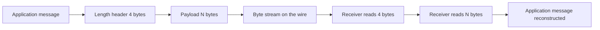
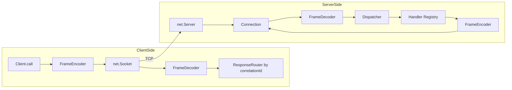

# 3.11 Net Module TCP Sockets

> A TCP socket is a bidirectional byte pipe between two endpoints. The pipe does not know about messages, requests, responses, or sessions. It only knows about bytes. Every higher-level protocol on the internet — HTTP, WebSockets, SMTP, FTP, every database wire protocol — is someone's answer to the question: "Now that I have a byte pipe, how do I impose structure on it?"

The `net` module is Node.js's binding to the operating system's TCP stack. It is the lowest-level network primitive you can touch from JavaScript without dropping into C. Everything else — `http`, `https`, `http2`, the `ws` WebSocket library, `pg` (PostgreSQL client), `amqplib` (RabbitMQ client), `ioredis`, the `mongodb` driver — is built on top of `net`. If you understand this note, you understand the substrate they all share.

The note is paired with [[3.07 Streams Fundamentals]] (because `net.Socket` is a Duplex stream), [[3.08 Streams Advanced Backpressure]] (because TCP flow control is the canonical backpressure problem), [[3.10 Event Emitter Pattern]] (because every socket is an EventEmitter with a fixed vocabulary of events), [[3.12 HTTP and HTTPS Modules]] (which is `net` plus a text-based request/response framing), and [[3.14 WebSockets and Realtime]] (which is HTTP upgraded into a framed protocol over the same TCP socket).

---

## 1. Purpose

The Node.js `net` module exists for one reason: to expose raw TCP to JavaScript. Not HTTP. Not WebSockets. Not gRPC. Just TCP — the reliable, ordered, byte-stream transport that sits on top of IP and that the entire internet is built on.

Why does that matter? Because HTTP is a thick layer on top of TCP. HTTP adds request lines, headers, status codes, content-length, chunked transfer encoding, connection keepalive rules, and a request/response model that assumes every interaction is a single round trip. Those assumptions are wrong for many real workloads:

- A multiplayer game server does not have requests and responses; it has a continuous stream of position updates that must arrive in under 50 milliseconds.
- A database wire protocol does not want HTTP's text framing; it wants a compact binary header followed by exactly the bytes the protocol specified.
- An IoT device talking to a gateway over a cellular link does not want HTTP's header overhead on every 20-byte telemetry packet.
- A chat server does not want to open a new TCP connection for every message; it wants one long-lived socket that both sides can write to at any time.

For all of these, the answer is: drop down to raw TCP and design your own protocol. The `net` module is the tool that lets you do that from JavaScript.

Concretely, the `net` module gives you three things:

1. **`net.createServer`** — a factory for TCP servers. The server listens on a port, accepts incoming connections from the kernel's backlog, and hands each one to your code as a `net.Socket`.
2. **`net.connect` / `net.createConnection`** — a factory for TCP client sockets. You give it a host and port, it opens a connection, and gives you back a `net.Socket` you can read from and write to.
3. **`net.Socket`** — the class representing one TCP connection. It is simultaneously a `Duplex` stream (so you can `pipe` it), an `EventEmitter` (so you can listen for `'data'`, `'end'`, `'error'`, `'close'`, `'drain'`, `'timeout'`, `'connect'`), and a thin wrapper around libuv's stream handle.

What raw TCP enables in practice:

- **Custom binary protocols.** You define your own header layout, your own message types, your own framing. No HTTP overhead, no JSON bloat. The PostgreSQL frontend/backend protocol, MySQL's packet format, MongoDB's Wire Protocol, and Redis's RESP are all examples of bespoke binary or text protocols layered on TCP.
- **Game servers.** Real-time multiplayer games need 30-to-60 updates per second per player, sub-50ms latency, and a single long-lived connection per client. HTTP's request/response model is fundamentally wrong for this; raw TCP is the default.
- **Chat servers.** Before WebSockets, every chat server was a raw TCP server (often with a TLS upgrade). IRC, XMPP, and proprietary chat backends all run on TCP. WebSockets are themselves just a TCP socket with a handshake and a frame format.
- **IoT and embedded.** MQTT brokers, CoAP gateways, and custom industrial protocols talk TCP. The devices are constrained; the bandwidth is expensive; HTTP's per-message header tax is unacceptable.
- **Database drivers.** Every database driver in the Node ecosystem (`pg`, `mysql2`, `mariadb`, `mongodb`, `ioredis`, `tedious` for SQL Server, `cassandra-driver`) opens TCP connections to the database and speaks the database's wire protocol over them.
- **SMTP, FTP, IRC, SSH, and other text-protocol servers.** These are all TCP servers with line-oriented or block-oriented framing. Node's `net` module is the right tool if you want to write your own SMTP relay, FTP server, or IRC bouncer.
- **Reverse proxies and load balancers.** HAProxy, Envoy, and NGINX are all TCP servers under the hood. If you wanted to write a Node-based load balancer that round-robins TCP connections to backends, you would use `net.createServer` and `net.connect`.

Why does understanding TCP itself matter, even if you only ever write HTTP? Because every HTTP behavior that surprises you — every "why is my request taking 200 milliseconds when the server responds in 5," every "why did my connection get reset after 30 seconds of idle," every "why is my data arriving in two chunks when the server sent it in one" — is a TCP behavior visible through the HTTP layer. Knowing TCP means knowing why `Connection: keep-alive` exists (because opening a TCP connection costs a round trip), why `Expect: 100-continue` exists (to avoid sending a large body over a connection the server would reject), why the no-delay socket option exists (because Nagle's algorithm batches small writes), and why the keepalive socket option exists (because NAT routers garbage-collect idle connections after 5 to 30 minutes).

TCP is the foundation. HTTP, WebSockets, HTTP/2, and almost every internet protocol are decorations on it. The `net` module is the door from JavaScript to that foundation. This note is the key.

---

## 2. Theory and Deep Dive

### 2.1 The `net` module surface

The `net` module exposes a small set of factory functions and one class. The complete surface you will use day to day:

| Export | Purpose |
|---|---|
| `net.createServer(options?, connectionListener?)` | Returns a `net.Server` that listens for TCP connections. |
| `net.connect(options[, callback])` / `net.createConnection(...)` | Returns a `net.Socket` connected to a remote host. The two names are aliases. |
| `net.Socket` | The class for a TCP connection. Returned by both `createServer`'s listener and `connect`. |
| `net.Server` | The class for the listener itself. Inherits from `EventEmitter`. |
| `net.isIP(input)`, `net.isIPv4(input)`, `net.isIPv6(input)` | Tiny validation helpers. |
| `net.BlockList` | A list of IP addresses or ranges to refuse connections from. |

Everything else is on instances of `net.Socket` and `net.Server`. The surface is small; the depth is in the lifecycle and the events.

### 2.2 Creating a server

```javascript
const net = require('node:net');

const server = net.createServer((socket) => {
  socket.write('hello\r\n');
  socket.end();
});

server.listen(3000, '127.0.0.1', () => {
  console.log('listening on 127.0.0.1:3000');
});
```

The function you pass to `createServer` is called the **connection listener**. It is invoked once per accepted connection, with a fresh `net.Socket` for that connection. Node does not pool, queue, or batch your connection listener; it calls it synchronously on the event loop turn after the kernel hands the connection over.

`server.listen` is asynchronous. The callback fires once, when the server is bound and accepting. If the bind fails (port already in use, permission denied on a privileged port, invalid host), the server emits an `'error'` event instead, and the callback never runs.

The signature you will use most:

```javascript
server.listen(port, host, backlog, callback);
```

- `port` — the TCP port to bind. `0` means "let the OS pick an ephemeral port" (useful in tests; read it back with `server.address().port`).
- `host` — the local interface to bind. Omitting it binds to all interfaces (`0.0.0.0` for IPv4, `::` for IPv6). For local development, `'127.0.0.1'` is safer.
- `backlog` — the kernel's pending-connection queue size. Default is usually 511 (libuv picks a value near the system maximum). If your server accepts connections slower than they arrive, this queue fills and new connections are refused or dropped.
- `callback` — equivalent to `server.on('listening', callback)`.

### 2.3 The `net.Socket` as a Duplex stream

Every connection is a `net.Socket`, and every `net.Socket` is both a `Readable` and a `Writable` stream (it inherits from `stream.Duplex`). That means:

- You can call `socket.write(chunk)` to send bytes.
- You can listen for `socket.on('data', chunk => ...)` to receive bytes.
- You can `pipe` the socket into another stream and vice versa.
- Backpressure works the same way as on any stream: `socket.write` returns `false` when the internal buffer hits the high-water mark, and the socket emits `'drain'` when it catches up.

This is not a coincidence. The Node stream API was originally designed around sockets; the abstract `Readable`/`Writable` interfaces are generalizations of what `net.Socket` already did in 2009. See [[3.07 Streams Fundamentals]] for the full stream model and [[3.08 Streams Advanced Backpressure]] for the backpressure contract.

### 2.4 Socket events

The complete event vocabulary of a `net.Socket`:

| Event | When it fires | Notes |
|---|---|---|
| `'connect'` | The client socket has completed the TCP handshake and is ready to write. | Server-side sockets do not emit `'connect'`; the connection is already established by the time the connection listener runs. |
| `'data'` | The kernel has handed libuv some bytes from the remote peer. | The `chunk` is a `Buffer`. There is no boundary semantics — see below. |
| `'end'` | The remote peer sent a FIN. It will not send any more data. | The socket may still be writable if `allowHalfOpen` is true. |
| `'finish'` | All queued writes have been flushed to the kernel. | Emitted after `end()` is called and the write buffer drains. |
| `'drain'` | The write buffer dropped below the high-water mark after `write` returned `false`. | The signal to resume writing. |
| `'error'` | An I/O error occurred (connection reset, host unreachable, timeout, etc.). | If unhandled, this crashes the process. Always attach a listener. |
| `'close'` | The socket is fully closed (both directions, all I/O done). | Fires after `'end'` and `'finish'` if both directions closed cleanly, or after `'error'` if not. |
| `'timeout'` | The socket has been idle for longer than the timeout set with `setTimeout`. | The socket is not closed; you must call `destroy()` yourself if you want to close it. |
| `'lookup'` | DNS resolution finished (for `connect` with a hostname). | Emitted before `'connect'`. |
| `'ready'` | The socket is ready for use. | Mostly internal; `'connect'` is the one you want on the client side. |
| `'secureConnect'` | Not on plain `net.Socket`; this is a TLS socket event. | See the `tls` module. |

The two events that catch everyone the first time are `'end'` and `'close'`:

- `'end'` means "the other side said it has nothing more to say." It is a one-direction signal. You can still write to the socket if `allowHalfOpen` is true.
- `'close'` means "the underlying file descriptor is now closed." It is the terminal event. After `'close'`, no more events will fire on this socket.

### 2.5 Socket methods

The methods you will actually call:

| Method | Purpose |
|---|---|
| `socket.write(data, encoding?, callback?)` | Enqueues bytes for sending. Returns `true` if the data fit under the high-water mark, `false` if it buffered (and you should wait for `'drain'`). |
| `socket.end(data?)` | Sends `data` if provided, then sends a FIN to the peer. Half-closes the writable side. |
| `socket.destroy(error?)` | Forcibly closes the socket. Use this when something went wrong or when a timeout fired. Triggers `'close'` (and `'error'` if you pass an error). |
| `socket.setTimeout(ms, callback?)` | Sets an inactivity timeout. If no data flows for `ms` milliseconds, `'timeout'` fires. Does not close the socket. |
| `socket.setKeepAlive(enable, delay?)` | Enables TCP keepalive probes at the kernel level. The kernel will send probe packets after `delay` seconds of inactivity, detecting dead peers. |
| `socket.setNoDelay(noDelay?)` | Disables (default `true`) or enables Nagle's algorithm via the no-delay socket option. Disabling it means small writes are sent immediately instead of being batched. |
| `socket.setEncoding(encoding)` | Makes `'data'` emit strings instead of Buffers. Usually a mistake for binary protocols. |
| `socket.pause()` / `socket.resume()` | Stop / resume emitting `'data'`. Backpressure primitive. |
| `socket.ref()` / `socket.unref()` | Controls whether the socket keeps the event loop alive. |
| `socket.address()` | Returns `{ port, family, address }` for the local end. |
| `socket.remoteAddress` / `socket.remotePort` | Properties for the peer. |
| `socket.bytesRead` / `socket.bytesWritten` | Counters for diagnostics. |

### 2.6 TCP is a stream, not a message bus

This is the single most important fact in the entire note. TCP delivers an ordered, reliable, byte-stream service. The unit of transmission at the TCP layer is a **byte**, not a message. There is no notion of "one send equals one receive."

If the sender does:

```javascript
socket.write('hello');
socket.write(' ');
socket.write('world');
```

the receiver may see any of the following arrive as a single `'data'` event:

- `'hello world'` (all three writes coalesced into one segment)
- `'hello'`, then `' world'` (two segments)
- `'hel'`, `'lo wo'`, `'rld'` (split arbitrarily)
- `'h'`, `'e'`, `'l'`, `'l'`, `'o'`, `' '`, `'w'`, `'o'`, `'r'`, `'l'`, `'d'` (one byte per event, pathological but legal)

TCP is allowed to coalesce small writes (Nagle's algorithm does this) and to split large writes across multiple segments (the kernel's send buffer and the network's MTU do this). The receiver's kernel may further coalesce or split based on its receive buffer and read patterns. By the time the bytes reach your `'data'` handler, all memory of "how many writes produced them" is gone.

This means: **you cannot treat one `'data'` event as one message.** You must impose your own framing on the byte stream. There are three classic approaches:

1. **Length-prefix.** Each message is preceded by a fixed-size header that says how many bytes follow. The receiver reads the header, then reads exactly that many bytes, then reads the next header. This is what most binary protocols do (PostgreSQL, MongoDB's wire protocol message frames, gRPC's length-prefixed frames).
2. **Delimiter.** Each message ends with a sentinel byte sequence (a newline for text protocols, a special byte for binary). The receiver scans the buffer for the delimiter and splits on it. This is what RESP (Redis), HTTP/1 headers, and IRC do.
3. **Fixed-size.** Every message is exactly N bytes. No header, no delimiter. Only works if every message has the same shape. Used in some embedded protocols and in financial market-data feeds where latency matters more than flexibility.

You will see all three implemented in code later in this note. The framing parser is the heart of every TCP protocol implementation.

### 2.7 Half-open connections

By default, when one side calls `socket.end()`, the kernel sends a FIN, the other side's `'end'` event fires, and Node automatically closes the socket. This is "full close on FIN."

If you pass `allowHalfOpen: true` to either `net.createServer` or `net.connect`, this behavior changes. When the remote sends a FIN, your `'end'` event fires, but the socket stays writable. You can continue to `write()` to it. You must explicitly call `socket.end()` yourself when you are done; otherwise the socket stays open forever (or until you call `destroy()`).

This is useful for protocols where one side finishes sending before the other — for example, an HTTP/1.0 client sends a request, then calls `end()` to signal "I have no more request body," and the server reads that signal, computes the response, and writes it back over the same still-open socket. (HTTP/1.1 replaced this pattern with `Connection: close` or `Content-Length` framing, but the underlying TCP mechanism is the same.)

### 2.8 The TCP handshake and data flow

```mermaid
sequenceDiagram
    participant C as Client
    participant S as Server
    participant K as Kernel Backlog
    Note over S,K: server.listen done; kernel is accepting
    C->>S: SYN seq x
    S->>K: enqueue connection
    K->>S: SYN-ACK seq y ack x+1
    S->>C: SYN-ACK
    C->>S: ACK ack y+1
    Note over C,S: Three-way handshake complete; connection established
    C->>S: socket.write PING
    S->>C: connectionListener fires with new net.Socket
    S->>C: socket.write PONG
    Note over C,S: Bidirectional byte stream now open
    C->>S: socket.end sends FIN
    S->>C: end event fires
    S->>C: socket.end sends FIN
    C->>S: close event fires
    Note over C,S: Both sides closed
```

The diagram hides two important realities. First, the kernel — not Node — does the handshake. By the time `connectionListener` runs on the server side, the handshake is already complete; you are holding a fully established socket. Second, the `'data'` events on both sides may fire zero, one, or many times for any single `write` call on the other side, because TCP is a stream.

### 2.9 Backpressure and flow control

TCP has built-in flow control via the **sliding window**. The receiver advertises how many bytes it is willing to accept; the sender must not exceed that window. If the receiver's window closes (the application is not reading fast enough), the sender stops getting ACKs that open new window and the connection stalls.

In Node, this surfaces as standard stream backpressure. `socket.write` returns `false` when the kernel's send buffer is full (or, more precisely, when Node's internal write buffer exceeds the high-water mark). If you keep writing past `false`, Node buffers the data in memory and you risk a slow memory leak. The fix is the standard one: stop writing on `false`, resume on `'drain'`. Or use `stream.pipeline`, which handles this for you. See [[3.08 Streams Advanced Backpressure]] for the full treatment.

### 2.10 Server lifecycle and graceful shutdown

A `net.Server` is itself an `EventEmitter` with its own events:

| Event | When |
|---|---|
| `'listening'` | The server is bound and accepting. |
| `'connection'` | A new socket was accepted. (You usually use the connection listener instead.) |
| `'error'` | Bind failed, or an accept error occurred. |
| `'close'` | The server is fully closed. Fires after `server.close()` finishes draining. |

`server.close()` does two things: it stops accepting new connections, and it waits for existing connections to drain. It does **not** close existing connections; if you want to forcibly close them, you must track them yourself and call `socket.destroy()` on each.

Graceful shutdown therefore looks like this:

1. Stop sending new traffic to the server (drain your load balancer).
2. Call `server.close()` so the kernel stops accepting.
3. Track every open socket; send each one a "shutting down" message if your protocol supports it, then call `socket.end()`.
4. After a timeout (say 5 seconds), call `socket.destroy()` on any that have not closed.
5. Wait for the server's `'close'` event, then exit.

This is the pattern NGINX, HAProxy, and Envoy all use. Node makes you implement it yourself because `net` is a low-level primitive.

---

## 3. Mental Models

A handful of mental models make TCP in Node predictable. Internalize them and most of the surprising behavior disappears.

### 3.1 "A TCP socket is a bidirectional byte pipe"

Imagine two cans connected by a string. You can pour bytes in one end and they come out the other end, in order, without loss. The pipe does not understand the concept of a "message." If you pour in "hello" and then "world," the other end might see "helloworld" or "hel" + "loworld" or any other split. The pipe only guarantees that the bytes arrive in the order they were sent.

This is the model that explains why `'data'` does not correspond to `write`. The pipe is a continuous stream; your writes are not preserved as discrete units through it.

### 3.2 "The server is a listener that accepts incoming pipes"

A `net.Server` is a bouncer at a door. It stands at the port, waits for someone to knock (a SYN packet), lets them in (completes the handshake), and hands them off to your connection listener. Once handed off, the server forgets about them — the socket is yours to manage. The server goes back to waiting for the next knock.

If your connection listener throws, the socket is destroyed and the connection drops, but the server keeps running. The server only dies if it emits an `'error'` event with no listener (bind failure, accept failure).

### 3.3 "The client is the one who initiates the pipe"

The client calls `net.connect` (or `net.createConnection`). The kernel sends a SYN, the server responds, the handshake completes, and the client's `'connect'` event fires. From that point the client and server are symmetric — both can read, both can write, both can end. The only asymmetry is who initiated.

### 3.4 "You get bytes, not messages — frame your own"

Because TCP is a stream, you must impose message boundaries yourself. Framing is the act of drawing lines in the byte stream: "these bytes belong to message 1, those belong to message 2." The two universal techniques:

- **Length-prefix:** precede each message with a fixed-size header that says "the next N bytes are message 1." Read the header, read exactly N bytes, repeat.
- **Delimiter:** terminate each message with a sentinel sequence. Scan the buffer for the sentinel; everything before it is one message.

There is no third option. If you do not frame, you do not have a protocol — you have an undifferentiated byte stream, and your application logic will break the first time the kernel coalesces or splits a write.

### 3.5 "Framing is wrapping each message in a header"

A length-prefixed frame is a tiny envelope: a 4-byte (or 1-byte, or 2-byte) length field, then the payload. The receiver reads the envelope, knows exactly how many bytes to expect, and reads them. The envelope is what gives the stream structure.



### 3.6 "The socket is also a file descriptor"

Every `net.Socket` corresponds to an operating system file descriptor. The kernel has limits on how many open file descriptors a process can have, and each open socket counts. A server with 100,000 idle connections is using 100,000 file descriptors. If you exceed the limit, `accept` starts failing, connections are dropped, and your `'error'` events fire with `EMFILE`. Tune the limit before you tune your code.

### 3.7 "An idle connection is a dying connection"

NAT routers, firewalls, and load balancers all garbage-collect idle TCP connections. The defaults vary: 5 minutes for a typical home NAT, 30 to 60 minutes for cloud load balancers, often shorter for mobile carriers. If your connection sits idle for longer than that timeout, the device silently drops the state, and the next time you write, you get `ECONNRESET` or `ETIMEDOUT` minutes later.

The fix is keepalive: either `socket.setKeepAlive(true, 30000)` to let the kernel send TCP keepalive probes, or an application-level ping message every 30 seconds. The application-level ping is more reliable because it works through NATs that drop TCP keepalive probes.

---

## 4. Real-World Use Cases

### 4.1 Database wire protocols

Every Node database driver uses `net` (or `tls` for the encrypted variant). PostgreSQL's frontend/backend protocol is a length-prefixed binary protocol: every message starts with a 1-byte type identifier, a 4-byte length, and a payload. The `pg` driver uses `net.connect` to open the connection, then implements a state machine that reads frames and dispatches them. MySQL's packet format is similar (3-byte length, 1-byte sequence id, payload). MongoDB's Wire Protocol uses a standard 16-byte header followed by an op-specific body. Redis's RESP is a delimiter-based text protocol: every reply is terminated by `\r\n`, and bulk strings have a length prefix.

If you want to understand how to write a real binary protocol in Node, the source of `pg` or `mysql2` is the canonical reading.

### 4.2 Game servers

Real-time multiplayer games — FPS, MOBA, MMO — need to push 20 to 60 state updates per second to each connected client. Each update is small (a few hundred bytes of entity positions). HTTP is wrong for this: it has too much overhead per request, it cannot push from server to client without polling, and its request/response model does not match the "broadcast state at 30 Hz" pattern.

Game servers run on raw TCP (or UDP for the truly latency-sensitive bits). The protocol is typically length-prefixed binary: a 2-byte length, a 1-byte message type, and a tightly packed payload. Connection lifetime is the duration of the match. Backpressure matters: if a client's network is slow and the server keeps writing, the kernel send buffer fills and writes start returning `false`; the server must drop updates rather than block the game loop.

### 4.3 Chat servers

Before WebSockets, chat was a TCP problem. IRC (Internet Relay Chat) is a line-oriented text protocol over TCP: every message is a UTF-8 string terminated by `\r\n`. An IRC server is a `net.createServer` whose connection listener splits incoming bytes on `\r\n` and dispatches each line as a command. XMPP is XML-over-TCP with a different framing. Proprietary chat backends (Slack, Discord, WhatsApp) often use a length-prefixed binary protocol over TCP for their internal client-to-edge traffic, with WebSocket gateways translating for browsers.

WebSockets themselves are TCP plus a handshake plus a frame format. After the upgrade, the underlying socket is a raw TCP socket; the WebSocket library just adds framing on top. If you implement a WebSocket server in Node from scratch, you start with `net.createServer` and add the HTTP-upgrade handshake and the WebSocket frame parser.

### 4.4 IoT and embedded

MQTT is the dominant IoT pub/sub protocol. It runs over TCP. The broker is a TCP server; clients connect, subscribe to topics, and publish messages. The MQTT packet format is a 2-byte fixed header (packet type + flags, then a variable-length remaining-length field) followed by a variable header and payload. The connection is long-lived; MQTT has built-in ping packets (PINGREQ/PINGRESP) to keep NATs from dropping the connection.

Industrial protocols (Modbus TCP, DNP3, IEC 60870-5-104) are all TCP-based with their own binary framing. If you are writing a Node gateway for factory equipment, you will be using `net`.

### 4.5 Custom RPC protocols

gRPC is HTTP/2-based, but many internal RPC systems are raw TCP. Stripe, Uber, and Discord have all described internal RPC systems that use length-prefixed binary protocols over TCP for performance. The advantage over HTTP/2 is full control: no shared HTTP/2 connection multiplexing head-of-line blocking, no header compression overhead, just bytes.

If you write a custom RPC, the design space is: pick a serialization format (JSON, MessagePack, Protocol Buffers, FlatBuffers), pick a framing (length-prefix is the default), design your message types, and implement a request/response correlation layer on top. Section 10 walks through this in detail.

### 4.6 SMTP, FTP, IRC, and other legacy servers

These are all TCP servers with text-based framing. SMTP uses `\r\n`-terminated commands; the server replies with status codes. FTP has a control connection (text commands) and data connections (binary blobs). IRC is line-oriented text. If you want to build an SMTP relay, an FTP server, or an IRC bouncer in Node, `net.createServer` is your starting point and a line-buffered framing parser is your first piece of code.

### 4.7 Load balancers and reverse proxies

HAProxy, Envoy, and NGINX all do TCP-level load balancing in addition to HTTP. A TCP load balancer accepts a connection, picks a backend, opens a connection to the backend, and pipes bytes between the two. In Node, this is `net.createServer` on the front and `net.connect` on the back, with `socket.pipe(backendSocket)` and `backendSocket.pipe(socket)` (or, better, `stream.pipeline` to handle errors and cleanup). This pattern is also how TLS-terminating proxies work: they terminate TLS on the front and speak plain TCP to the back.

---

## 5. Code Examples

### 5.1 Example A — Minimal and Conceptual: Echo Server and Client

The simplest possible useful TCP program: a server that echoes back whatever you send, and a client that sends a line and prints the response.

**JavaScript — echo-server.js**

```javascript
const net = require('node:net');

const server = net.createServer((socket) => {
  const remote = `${socket.remoteAddress}:${socket.remotePort}`;
  console.log(`connection from ${remote}`);

  socket.setEncoding('utf8');
  socket.on('data', (chunk) => {
    socket.write(`echo: ${chunk}`);
  });

  socket.on('end', () => {
    console.log(`${remote} closed`));
  });

  socket.on('error', (err) => {
    console.error(`${remote} error:`, err.message);
  });
});

server.on('error', (err) => {
  console.error('server error:', err.message);
  process.exit(1);
});

server.listen(3000, '127.0.0.1', () => {
  console.log('echo server listening on 127.0.0.1:3000');
});
```

**TypeScript — echo-server.ts**

```typescript
import net from 'node:net';

const server = net.createServer((socket: net.Socket) => {
  const remote = `${socket.remoteAddress}:${socket.remotePort}`;
  console.log(`connection from ${remote}`);

  socket.setEncoding('utf8');
  socket.on('data', (chunk: string) => {
    socket.write(`echo: ${chunk}`);
  });

  socket.on('end', () => {
    console.log(`${remote} closed`);
  });

  socket.on('error', (err: Error) => {
    console.error(`${remote} error:`, err.message);
  });
});

server.on('error', (err: Error) => {
  console.error('server error:', err.message);
  process.exit(1);
});

server.listen(3000, '127.0.0.1', () => {
  console.log('echo server listening on 127.0.0.1:3000');
});
```

**JavaScript — echo-client.js**

```javascript
const net = require('node:net');

const socket = net.connect(3000, '127.0.0.1');
socket.setEncoding('utf8');

socket.on('connect', () => {
  socket.write('hello\r\n');
});

socket.on('data', (chunk) => {
  console.log('server said:', chunk.trim());
  socket.end();
});

socket.on('error', (err) => {
  console.error('client error:', err.message);
});
```

**TypeScript — echo-client.ts**

```typescript
import net from 'node:net';

const socket = net.connect(3000, '127.0.0.1');
socket.setEncoding('utf8');

socket.on('connect', () => {
  socket.write('hello\r\n');
});

socket.on('data', (chunk: string) => {
  console.log('server said:', chunk.trim());
  socket.end();
});

socket.on('error', (err: Error) => {
  console.error('client error:', err.message);
});
```

Run `node echo-server.js` in one terminal and `node echo-client.js` in another. The client prints `server said: echo: hello` and exits; the server logs the connection and the close.

This example is intentionally tiny. It is wrong for production in several ways (no framing, no timeouts, no error handling on the client beyond logging, no graceful shutdown), and we will fix all of them in Example B.

### 5.2 Example B — Production-Grade: Typed Length-Prefixed Protocol

A real protocol needs framing, typed messages, request/response correlation, connection management, and graceful shutdown. This example implements a minimal request/response protocol:

- Every frame is `[4-byte big-endian length][1-byte type][payload bytes]`.
- Two message types: `request` (type 1) and `response` (type 2).
- A `request` payload is `[4-byte correlation id][UTF-8 JSON string]`.
- A `response` payload is `[4-byte correlation id][UTF-8 JSON string]`.
- The server echoes back the JSON with a `receivedAt` timestamp added.
- The server tracks all connections and supports graceful shutdown.

**JavaScript — framing.js**

```javascript
const headerLength = 4;

function encodeFrame(type, payload) {
  const length = Buffer.byteLength(payload) + 1;
  const header = Buffer.alloc(headerLength + 1);
  header.writeUInt32BE(length, 0);
  header.writeUInt8(type, headerLength);
  return Buffer.concat([header, payload]);
}

function decodeFrame(buffer) {
  if (buffer.length < headerLength) return null;
  const length = buffer.readUInt32BE(0);
  if (buffer.length < headerLength + length) return null;
  const type = buffer.readUInt8(headerLength);
  const payload = buffer.subarray(headerLength + 1, headerLength + length);
  const consumed = headerLength + length;
  return { type, payload, consumed };
}

module.exports = { encodeFrame, decodeFrame, headerLength };
```

**TypeScript — framing.ts**

```typescript
export const headerLength = 4;
export const requestType = 1;
export const responseType = 2;

export interface DecodedFrame {
  type: number;
  payload: Buffer;
  consumed: number;
}

export function encodeFrame(type: number, payload: Buffer): Buffer {
  const length = Buffer.byteLength(payload) + 1;
  const header = Buffer.alloc(headerLength + 1);
  header.writeUInt32BE(length, 0);
  header.writeUInt8(type, headerLength);
  return Buffer.concat([header, payload]);
}

export function decodeFrame(buffer: Buffer): DecodedFrame | null {
  if (buffer.length < headerLength) return null;
  const length = buffer.readUInt32BE(0);
  if (buffer.length < headerLength + length) return null;
  const type = buffer.readUInt8(headerLength);
  const payload = buffer.subarray(headerLength + 1, headerLength + length);
  const consumed = headerLength + length;
  return { type, payload, consumed };
}
```

**JavaScript — server.js**

```javascript
const net = require('node:net');
const { encodeFrame, decodeFrame } = require('./framing');

const requestType = 1;
const responseType = 2;

const server = net.createServer({ allowHalfOpen: false });
const sockets = new Set();

server.on('connection', (socket) => {
  socket.setNoDelay(true);
  socket.setTimeout(60000);
  sockets.add(socket);

  let buffer = Buffer.alloc(0);

  socket.on('data', (chunk) => {
    buffer = Buffer.concat([buffer, chunk]);
    while (true) {
      const frame = decodeFrame(buffer);
      if (!frame) break;
      buffer = buffer.subarray(frame.consumed);
      if (frame.type === requestType) {
        const correlationId = frame.payload.readUInt32BE(0);
        const json = JSON.parse(frame.payload.subarray(4).toString('utf8'));
        const reply = { ...json, receivedAt: Date.now() };
        const replyBytes = Buffer.from(JSON.stringify(reply), 'utf8');
        const header = Buffer.alloc(4);
        header.writeUInt32BE(correlationId, 0);
        socket.write(encodeFrame(responseType, Buffer.concat([header, replyBytes])));
      }
    }
  });

  socket.on('timeout', () => {
    socket.destroy(new Error('idle timeout'));
  });

  socket.on('error', (err) => {
    console.error('socket error:', err.message);
  });

  socket.on('close', () => {
    sockets.delete(socket);
  });
});

server.on('error', (err) => {
  console.error('server error:', err.message);
  process.exit(1);
});

function gracefulShutdown() {
  console.log('shutting down...');
  server.close();
  for (const s of sockets) {
    s.end();
  }
  setTimeout(() => {
    for (const s of sockets) s.destroy();
    process.exit(0);
  }, 5000).unref();
}

process.on('SIGINT', gracefulShutdown);
process.on('SIGTERM', gracefulShutdown);

server.listen(3000, '127.0.0.1', () => {
  console.log('server listening on 127.0.0.1:3000');
});
```

**TypeScript — server.ts**

```typescript
import net from 'node:net';
import { encodeFrame, decodeFrame, requestType, responseType } from './framing';

interface RequestPayload {
  correlationId: number;
  body: unknown;
}

function parseRequest(payload: Buffer): RequestPayload {
  const correlationId = payload.readUInt32BE(0);
  const body = JSON.parse(payload.subarray(4).toString('utf8'));
  return { correlationId, body };
}

function encodeResponse(correlationId: number, body: unknown): Buffer {
  const jsonBytes = Buffer.from(JSON.stringify(body), 'utf8');
  const header = Buffer.alloc(4);
  header.writeUInt32BE(correlationId, 0);
  return Buffer.concat([header, jsonBytes]);
}

const server = net.createServer({ allowHalfOpen: false });
const sockets = new Set<net.Socket>();

server.on('connection', (socket: net.Socket) => {
  socket.setNoDelay(true);
  socket.setTimeout(60000);
  sockets.add(socket);

  let buffer = Buffer.alloc(0);

  socket.on('data', (chunk: Buffer) => {
    buffer = Buffer.concat([buffer, chunk]);
    while (true) {
      const frame = decodeFrame(buffer);
      if (!frame) break;
      buffer = buffer.subarray(frame.consumed);
      if (frame.type === requestType) {
        const { correlationId, body } = parseRequest(frame.payload);
        const reply = { ...(body as object), receivedAt: Date.now() };
        socket.write(encodeFrame(responseType, encodeResponse(correlationId, reply)));
      }
    }
  });

  socket.on('timeout', () => {
    socket.destroy(new Error('idle timeout'));
  });

  socket.on('error', (err: Error) => {
    console.error('socket error:', err.message);
  });

  socket.on('close', () => {
    sockets.delete(socket);
  });
});

server.on('error', (err: Error) => {
  console.error('server error:', err.message);
  process.exit(1);
});

function gracefulShutdown(): void {
  console.log('shutting down...');
  server.close();
  for (const s of sockets) {
    s.end();
  }
  setTimeout(() => {
    for (const s of sockets) s.destroy();
    process.exit(0);
  }, 5000).unref();
}

process.on('SIGINT', gracefulShutdown);
process.on('SIGTERM', gracefulShutdown);

server.listen(3000, '127.0.0.1', () => {
  console.log('server listening on 127.0.0.1:3000');
});
```

**JavaScript — client.js**

```javascript
const net = require('node:net');
const { encodeFrame, decodeFrame } = require('./framing');

const requestType = 1;
const responseType = 2;

const socket = net.connect(3000, '127.0.0.1');
socket.setNoDelay(true);

let buffer = Buffer.alloc(0);
let nextCorrelationId = 1;
const pending = new Map();

socket.on('connect', () => {
  send({ method: 'ping', args: { hello: 'world' } }).then((res) =>
    console.log('ping reply:', res)
  );
  send({ method: 'status' }).then((res) =>
    console.log('status reply:', res)
  );
});

socket.on('data', (chunk) => {
  buffer = Buffer.concat([buffer, chunk]);
  while (true) {
    const frame = decodeFrame(buffer);
    if (!frame) break;
    buffer = buffer.subarray(frame.consumed);
    if (frame.type === responseType) {
      const correlationId = frame.payload.readUInt32BE(0);
      const body = JSON.parse(frame.payload.subarray(4).toString('utf8'));
      const cb = pending.get(correlationId);
      if (cb) {
        pending.delete(correlationId);
        cb(body);
      }
    }
  }
});

socket.on('error', (err) => {
  console.error('client error:', err.message);
});

function send(request) {
  const correlationId = nextCorrelationId++;
  return new Promise((resolve) => {
    pending.set(correlationId, resolve);
    const header = Buffer.alloc(4);
    header.writeUInt32BE(correlationId, 0);
    const body = Buffer.from(JSON.stringify(request), 'utf8');
    socket.write(encodeFrame(requestType, Buffer.concat([header, body])));
  });
}

setTimeout(() => socket.end(), 2000);
```

**TypeScript — client.ts**

```typescript
import net from 'node:net';
import { encodeFrame, decodeFrame, requestType, responseType } from './framing';

interface Request {
  method: string;
  args?: unknown;
}

const socket = net.connect(3000, '127.0.0.1');
socket.setNoDelay(true);

let buffer = Buffer.alloc(0);
let nextCorrelationId = 1;
const pending = new Map<number, (response: unknown) => void>();

socket.on('connect', () => {
  send({ method: 'ping', args: { hello: 'world' } }).then((res) =>
    console.log('ping reply:', res)
  );
  send({ method: 'status' }).then((res) =>
    console.log('status reply:', res)
  );
});

socket.on('data', (chunk: Buffer) => {
  buffer = Buffer.concat([buffer, chunk]);
  while (true) {
    const frame = decodeFrame(buffer);
    if (!frame) break;
    buffer = buffer.subarray(frame.consumed);
    if (frame.type === responseType) {
      const correlationId = frame.payload.readUInt32BE(0);
      const body = JSON.parse(frame.payload.subarray(4).toString('utf8'));
      const cb = pending.get(correlationId);
      if (cb) {
        pending.delete(correlationId);
        cb(body);
      }
    }
  }
});

socket.on('error', (err: Error) => {
  console.error('client error:', err.message);
});

function send(request: Request): Promise<unknown> {
  const correlationId = nextCorrelationId++;
  return new Promise((resolve) => {
    pending.set(correlationId, resolve);
    const header = Buffer.alloc(4);
    header.writeUInt32BE(correlationId, 0);
    const body = Buffer.from(JSON.stringify(request), 'utf8');
    socket.write(encodeFrame(requestType, Buffer.concat([header, body])));
  });
}

setTimeout(() => socket.end(), 2000);
```

Read this code carefully. The interesting parts:

1. **Framing parser.** `decodeFrame` is called in a `while (true)` loop because a single `'data'` event may contain multiple frames, or a partial frame, or a frame split across events. The loop consumes as many complete frames as it can; the leftover stays in `buffer` for the next `'data'` event.
2. **Correlation.** Each request carries a 4-byte correlation ID. The response echoes it. The client keeps a `Map` from correlation ID to a Promise resolver; when a response arrives, it looks up the resolver and fulfills the Promise. This is the simplest possible RPC layer.
3. **Connection management.** The server tracks every socket in a `Set`. On `SIGINT` or `SIGTERM`, it calls `server.close()` (stop accepting), sends `end()` to every socket (let them drain), and after 5 seconds forcibly destroys anything still alive. This is the graceful shutdown pattern from Section 2.10.
4. **`setNoDelay(true)`.** Disables Nagle's algorithm so small writes go out immediately. Without this, the kernel would batch the header and the payload into one segment, adding latency.
5. **`setTimeout`.** Each socket has a 60-second idle timeout. If no data flows, the timeout fires and we destroy the socket. This prevents idle-connection leaks.
6. **Error handling.** Every socket has an `'error'` listener. Every server has an `'error'` listener. Unhandled `'error'` events crash the process; this is the single most common Node crash in production.

---

## 6. Common Mistakes and Anti-Patterns

### 6.1 Assuming one `'data'` event equals one message

The mistake: the client calls `socket.write('hello')`, and the server's `'data'` handler assumes `chunk.toString()` is the entire message.

Why it is wrong: TCP is a byte stream. The kernel may coalesce or split writes arbitrarily. A single `write` on the sender may arrive as zero, one, or many `'data'` events on the receiver; many writes may arrive as one `'data'` event.

The fix: frame your messages. Use a length-prefix or a delimiter, accumulate bytes in a `Buffer` until you have a complete frame, then process. The framing parser in Example B is the template.

### 6.2 Not handling the `'error'` event

The mistake: forgetting to attach `socket.on('error', ...)`.

Why it is wrong: in Node, an `'error'` event with no listener throws the error on the next tick, which crashes the process. Sockets emit `'error'` for many reasons: connection reset (`ECONNRESET`), host unreachable (`EHOSTUNREACH`), DNS failure (`ENOTFOUND`), TLS handshake failure, or just a peer that closed uncleanly. In production, every long-lived socket will eventually error; if you do not have a listener, the process dies.

The fix: attach an `'error'` listener to every `net.Socket` and every `net.Server`. Even if the listener only logs, that is enough to prevent the crash.

### 6.3 Not calling `end()` or `destroy()`

The mistake: the server is done with a connection but never calls `socket.end()` or `socket.destroy()`. The socket lingers.

Why it is wrong: each open socket is a file descriptor and a chunk of memory. If you accumulate them, you leak. The kernel's file descriptor limit is typically 1024 by default on Linux; you will hit it sooner than you think. Memory grows by a few KB per socket for the buffers, plus whatever you stored in closures attached to its events.

The fix: be explicit about lifecycle. When the protocol exchange is done, call `socket.end()`. When something went wrong, call `socket.destroy()`. Track open sockets in a `Set` and audit the size periodically.

### 6.4 Forgetting `setNoDelay(true)` (Nagle's algorithm)

The mistake: a real-time protocol where the server writes a 50-byte update every 50 ms, but the client sees updates arriving in batches of 200 ms.

Why it is wrong: Nagle's algorithm (RFC 896) delays sending small packets if there is an unacknowledged packet in flight. The idea is to coalesce small writes into one segment to avoid network congestion. For interactive protocols — games, chat, terminals — this adds latency that the user notices. The 50-byte update gets held waiting for an ACK that the receiver has not sent yet because it has nothing to ACK.

The fix: call `socket.setNoDelay(true)` on every socket as soon as you get it. This sets the no-delay socket option and disables the algorithm. The default is `false` (Nagle enabled) on most platforms.

### 6.5 Not setting keepalive

The mistake: a long-lived client connection that sits idle for 10 minutes, then suddenly fails with `ECONNRESET` on the next write.

Why it is wrong: NAT routers, firewalls, and load balancers drop idle TCP state after a timeout (commonly 5 to 30 minutes). When you next write, the device between you and the peer has no record of the connection; the packet is dropped or RST is sent. You do not know the connection is dead until you try to use it.

The fix: `socket.setKeepAlive(true, 30000)` enables TCP keepalive probes. The kernel sends a probe after 30 seconds of inactivity; if the peer does not ACK, it sends more probes and eventually closes the connection with `ETIMEDOUT`. For critical connections, also implement application-level pings every 30 seconds — TCP keepalive does not work through all NATs, and an application ping both keeps the NAT alive and detects dead peers faster.

### 6.6 Buffer fragmentation across `'data'` events

The mistake: in the framing parser, the code reads the length prefix from the first `'data'` event, then reads the payload from the second `'data'` event, assuming the payload is intact.

Why it is wrong: the payload may itself be split across multiple `'data'` events, especially for large messages. The framing parser must accumulate bytes in a persistent buffer and only consume a frame when the buffer contains the entire frame.

The fix: the pattern in Example B — keep a `buffer` variable, append every `chunk` to it with `Buffer.concat`, and run the decode loop until `decodeFrame` returns null. Never assume a frame is contained in one event.

### 6.7 Calling `write` after `end`

The mistake: the server calls `socket.end()` to close the connection, then calls `socket.write(...)` to send one more thing.

Why it is wrong: after `end()`, the socket is half-closing; you have told the kernel to send a FIN after the queued writes drain. Calling `write` after `end` either throws a stream-after-end error or silently drops the data (depending on Node version).

The fix: send all your data first, then call `end()`. If you genuinely need to send one last message and then close, pass it to `end`: `socket.end(lastMessage)`.

### 6.8 Synchronous heavy work in the connection listener

The mistake: the connection listener parses a 10 MB JSON payload synchronously.

Why it is wrong: the connection listener runs on the event loop. If it blocks for 100 ms, every other connection — and every other event in the process — waits 100 ms. One slow client slows everyone.

The fix: do heavy work asynchronously. Use `JSON.parse` on small messages; for large ones, stream the parse or use a worker thread. Offload CPU-bound work to the worker threads module or child process. Keep the event loop turning.

### 6.9 Leaking listeners on long-lived sockets

The mistake: each request, you do `socket.on('data', handler)`. After 1000 requests, the socket has 1000 `'data'` listeners.

Why it is wrong: Node prints a "MaxListenersExceededWarning" after 10 listeners on one event, but it does not prevent more. Each listener is a closure that holds references to its scope; the memory grows. And every `'data'` event runs all 1000 listeners, which is slow.

The fix: attach listeners once, when the socket is created, not per request. Use `once` if you only need the next event. See [[3.10 Event Emitter Pattern]] for the full treatment of listener leaks.

---

## 7. Best Practices and Design Patterns

### 7.1 Frame every message

Never send unframed data over TCP. Pick a framing scheme — length-prefix for binary, delimiter for text, fixed-size for homogeneous protocols — and apply it consistently. The framing code is the first thing you write; the protocol design happens on top of it.

### 7.2 Always handle `'error'`

Attach an `'error'` listener to every `net.Socket` and every `net.Server` before you start using them. The listener can log and destroy; it must exist. Treat this as a checklist item like closing a file.

### 7.3 Use `stream.pipeline` to compose sockets with streams

If you are piping a socket into a transform stream (for example, a framing parser implemented as a Transform), use `stream.pipeline(socket, transform, sink, onDone)` instead of `socket.pipe(transform).pipe(sink)`. `pipeline` propagates errors, cleans up all streams on failure, and prevents the listener-leak and silent-failure problems of `.pipe`. See [[3.08 Streams Advanced Backpressure]].

### 7.4 Set timeouts

Call `socket.setTimeout(ms)` on every socket. Decide what "idle" means for your protocol (often 30 to 120 seconds) and destroy on timeout. This prevents idle-connection leaks from clients that disappear without closing.

### 7.5 Enable keepalive

Call `socket.setKeepAlive(true, 30000)` on long-lived sockets. Combine with an application-level ping for robustness. This is what database drivers, message queue clients, and chat servers all do.

### 7.6 Call `setNoDelay(true)` for low-latency protocols

For interactive protocols (games, chat, terminal, RPC), disable Nagle's algorithm. For bulk transfer (file download), leave it enabled — coalescing small writes is a net win.

### 7.7 Manage connection lifecycle explicitly

Track open sockets in a `Set`. On shutdown, call `end()` on each, then destroy after a timeout. On `SIGINT` and `SIGTERM`, run graceful shutdown. On `'error'`, remove from the set and destroy. The pattern in Example B is the template.

### 7.8 Use TypeScript for protocol types

A protocol is a contract between two programs. Encode the contract in TypeScript types: message interfaces, union types for variants, branded types for IDs. The compiler will catch shape mismatches that would otherwise be runtime bugs. The Mini-Project in Section 10 demonstrates this fully.

### 7.9 Prefer Transform streams over inline parsing

A framing parser can be inline (the `while (true)` loop in Example B) or a `Transform` stream (the input is bytes, the output is decoded frames). The Transform version is composable: you can `pipeline(socket, frameDecoder, messageHandler, frameEncoder, socket)` and the backpressure flows automatically. The inline version is simpler to read; the Transform version is simpler to test and reuse. Pick based on complexity.

### 7.10 Log with `bytesRead` and `bytesWritten`

For long-lived sockets, periodically log `socket.bytesRead` and `socket.bytesWritten`. A connection where these numbers never change is idle and a candidate for cleanup. A connection where `bytesWritten` grows but `bytesRead` does not is a client that is not acknowledging — a sign of a slow or dead peer.

### 7.11 Avoid `setEncoding` for binary protocols

`socket.setEncoding('utf8')` makes `'data'` emit strings instead of Buffers. This is convenient for text protocols but a footgun: it can corrupt binary data, and it makes buffer manipulation awkward (you end up calling `Buffer.from(chunk)` everywhere). For binary protocols, leave the encoding as Buffer and convert explicitly when you need a string.

### 7.12 Use `BlockList` to refuse hostile addresses

`net.BlockList` lets you refuse connections from specific IPs or ranges before your connection listener ever sees them. For a public server, this is cheaper and safer than accepting and immediately destroying.

---

## 8. Technical Interview Knowledge

### 8.1 Q: What is the `net` module for?

**A:** The `net` module is Node's binding to the operating system's TCP stack. It exposes raw TCP — no HTTP, no WebSockets — as a small API: `createServer` for servers, `connect` for clients, and the `Socket` class for connections. You use it when you need a custom protocol, a low-latency stream (games, chat, RPC), a database wire protocol client, or any case where HTTP's overhead or request/response model is wrong. Everything higher-level (`http`, `https`, `ws`, `pg`) is built on `net`.

### 8.2 Q: How do you create a TCP server?

**A:** `net.createServer(connectionListener)` returns a `net.Server`. Call `server.listen(port, host)` to bind. Each accepted connection invokes the connection listener with a fresh `net.Socket`. Always attach a server `'error'` listener — bind failures (`EADDRINUSE`, `EACCES`) emit `'error'`, and without a listener the process crashes. Sample one-liner: `net.createServer(s => s.end('hi')).listen(3000)`.

### 8.3 Q: Why is TCP a stream, not a sequence of messages?

**A:** Because TCP's service model is a reliable ordered byte stream, not a message-passing service. The kernel's send buffer, the network MTU, and Nagle's algorithm all coalesce and split your writes. The receiver's kernel may further coalesce based on its read patterns. By the time bytes reach the application, there is no record of how many `write` calls produced them. This is why every protocol on top of TCP — HTTP, WebSockets, PostgreSQL, MQTT — has its own framing layer that draws message boundaries in the byte stream.

### 8.4 Q: How do you frame messages?

**A:** Three classic techniques:

1. **Length-prefix.** Precede each message with a fixed-size length field (1, 2, 4, or 8 bytes, depending on max message size). The receiver reads the length, then reads exactly that many bytes. Used by gRPC, PostgreSQL, MQTT, most binary RPC.
2. **Delimiter.** Terminate each message with a sentinel sequence. Text protocols use `\r\n` (HTTP headers, IRC, Redis RESP). Binary protocols use a byte that cannot appear in the payload (rare; requires escaping).
3. **Fixed-size.** Every message is exactly N bytes. Only works for homogeneous protocols (financial market data, some embedded protocols).

The receiver maintains a buffer, appends every `'data'` chunk, and parses complete frames in a loop, leaving the partial remainder for the next event.

### 8.5 Q: What is Nagle's algorithm?

**A:** A 1984 algorithm (RFC 896) that delays sending small TCP packets if there is an unacknowledged packet in flight. The goal is to coalesce small writes into one segment, reducing network overhead from too many tiny packets. For bulk transfer it is a net win. For interactive protocols (terminal, chat, game, RPC) it adds latency: a 50-byte update waits for an ACK that the receiver has not sent yet because it has nothing to ACK. Disable it with `socket.setNoDelay(true)`, which sets the no-delay socket option.

### 8.6 Q: How do you handle half-open connections?

**A:** By default, when one side calls `socket.end()`, Node automatically closes the socket after the peer's FIN arrives. Pass `allowHalfOpen: true` to `createServer` or `connect` to change this: the peer's FIN fires `'end'` but the socket stays writable, and you must call `socket.end()` yourself to close it. Use cases: HTTP/1.0-style "client sends request, calls end, server reads FIN, computes response, writes back, then ends" and protocols where one side finishes before the other. Always pair `allowHalfOpen` with a timeout; otherwise a forgotten half-open socket leaks forever.

### 8.7 Q: How would you build a chat server?

**A:** The architecture:

1. `net.createServer` on a port.
2. Each accepted socket gets a `setNoDelay(true)`, a `setTimeout`, and an `'error'` listener.
3. Track all sockets in a `Set`.
4. Frame messages with a length-prefix (binary) or `\r\n` delimiter (text).
5. On a complete inbound message, broadcast it to every other socket: iterate the `Set`, call `socket.write(framedMessage)` on each. Skip the sender.
6. Handle backpressure: if `socket.write` returns `false`, either buffer the message for that client or drop it (depending on the protocol's semantics — a chat server usually drops slow clients rather than block the broadcaster).
7. On `'close'`, remove the socket from the `Set`.
8. On `'error'`, log and destroy.
9. On `SIGINT` or `SIGTERM`, send a "server shutting down" message to all clients, call `end()` on each, destroy after a timeout, then exit.

For a real chat server, add: authentication (a login message first), rooms (route messages by room ID), presence (track who is online), and persistence (write messages to a database or queue).

### 8.8 Q: How do you handle backpressure on a socket?

**A:** The standard stream contract. `socket.write(data)` returns `false` when the internal buffer exceeds the high-water mark (16 KB by default). Stop writing when it returns `false`; resume when the socket emits `'drain'`. If you keep writing past `false`, Node buffers in memory — slow leak. The robust patterns:

- For one-in-one-out pipelines, use `stream.pipeline(source, transform, socket, onDone)` — pipeline manages backpressure automatically.
- For broadcast (one source, many sinks), check `write`'s return value per sink; for sinks that return `false`, either pause the source until all sinks drain, or drop updates for the slow sinks.
- For request/response, just await `write`'s return value and pause if false; the protocol's natural cadence usually handles this.

See [[3.08 Streams Advanced Backpressure]] for the deep dive on backpressure semantics, high-water marks, and the relationship to TCP's sliding window.

---

## 9. Practical Exercises

### 9.1 Exercise 1: Build an echo server and client

**Task.** Write a TCP server that accepts a connection, reads UTF-8 text until newline, and echoes back the line uppercased. Write a client that connects, sends three lines, prints the responses, and closes.

**Worked solution (server, JavaScript).**

```javascript
const net = require('node:net');

const server = net.createServer((socket) => {
  socket.setEncoding('utf8');
  socket.setNoDelay(true);

  let line = '';

  socket.on('data', (chunk) => {
    line += chunk;
    let idx;
    while ((idx = line.indexOf('\n')) !== -1) {
      const out = line.slice(0, idx).toUpperCase() + '\n';
      socket.write(out);
      line = line.slice(idx + 1);
    }
  });

  socket.on('error', () => {});
});

server.listen(4000, '127.0.0.1');
```

**Worked solution (client, JavaScript).**

```javascript
const net = require('node:net');

const socket = net.connect(4000, '127.0.0.1');
socket.setEncoding('utf8');

socket.on('connect', () => {
  socket.write('hello\n');
  socket.write('world\n');
  socket.write('goodbye\n');
  socket.end();
});

let received = 0;
socket.on('data', (chunk) => {
  process.stdout.write(chunk);
  received += chunk.split('\n').length - 1;
  if (received >= 3) socket.end();
});

socket.on('error', () => {});
```

The framing here is the newline delimiter. The server accumulates text in `line`, splits on `\n`, and processes each complete line. This is the simplest possible framing and the basis of every line-oriented text protocol.

### 9.2 Exercise 2: Implement length-prefixed framing

**Task.** Write a `createFrameEncoder` factory (a Transform stream that takes a Buffer and outputs a length-prefixed frame) and a `createFrameDecoder` factory (a Transform stream that takes bytes and outputs Buffers, one per frame). Wire them up in an echo server using `stream.pipeline`.

**Worked solution (framing, TypeScript).**

```typescript
import { Transform, TransformCallback } from 'node:stream';

const HEADER = 4;

export function createFrameEncoder(): Transform {
  return new Transform({
    transform(chunk: Buffer, encoding: string, callback: TransformCallback) {
      const header = Buffer.alloc(HEADER);
      header.writeUInt32BE(chunk.length, 0);
      callback(null, Buffer.concat([header, chunk]));
    },
  });
}

export function createFrameDecoder(): Transform {
  let buffer = Buffer.alloc(0);
  return new Transform({
    transform(chunk: Buffer, encoding: string, callback: TransformCallback) {
      buffer = Buffer.concat([buffer, chunk]);
      while (buffer.length >= HEADER) {
        const length = buffer.readUInt32BE(0);
        if (buffer.length < HEADER + length) break;
        const payload = buffer.subarray(HEADER, HEADER + length);
        this.push(payload);
        buffer = buffer.subarray(HEADER + length);
      }
      callback();
    },
  });
}
```

**Worked solution (server, TypeScript).**

```typescript
import net from 'node:net';
import { pipeline } from 'node:stream';
import { createFrameEncoder, createFrameDecoder } from './framing';

const server = net.createServer((socket) => {
  const encoder = createFrameEncoder();
  const decoder = createFrameDecoder();

  pipeline(
    socket,
    decoder,
    async function* (source) {
      for await (const chunk of source) {
        yield chunk; // echo
      }
    },
    encoder,
    socket,
    (err) => {
      if (err) socket.destroy(err);
    }
  );
});

server.listen(4000, '127.0.0.1');
```

The Transform-stream framing is composable: the same encoder and decoder factories work for any protocol that uses 4-byte big-endian length prefixes. The server is a one-liner of business logic (the async generator that yields back the input) surrounded by framing machinery.

### 9.3 Exercise 3: Build a multi-client chat server

**Task.** A TCP chat server. Clients connect and send a nickname as the first line. Subsequent lines are broadcast to all other clients as `<nick>: <message>`. Implement nickname set, broadcast, and clean disconnect handling.

**Worked solution (server, JavaScript).**

```javascript
const net = require('node:net');

const clients = new Map(); // socket -> nick

const server = net.createServer((socket) => {
  socket.setEncoding('utf8');
  socket.setNoDelay(true);
  socket.write('Enter nickname: ');

  let nick = null;
  let line = '';

  socket.on('data', (chunk) => {
    line += chunk;
    let idx;
    while ((idx = line.indexOf('\n')) !== -1) {
      const msg = line.slice(0, idx).trim();
      line = line.slice(idx + 1);
      handle(msg);
    }
  });

  function handle(msg) {
    if (nick === null) {
      nick = msg;
      clients.set(socket, nick);
      socket.write(`Welcome, ${nick}\n`);
      broadcast(`* ${nick} joined\n`, socket);
      return;
    }
    broadcast(`<${nick}> ${msg}\n`, null);
  }

  function broadcast(message, except) {
    for (const [s] of clients) {
      if (s !== except && !s.destroyed) s.write(message);
    }
  }

  socket.on('close', () => {
    clients.delete(socket);
    if (nick) broadcast(`* ${nick} left\n`, null);
  });

  socket.on('error', () => {});
});

server.listen(5000, '127.0.0.1');
```

Notes: the broadcast iterates `clients` and writes to each non-destroyed socket. There is no backpressure handling — a slow client will buffer in memory. For a real server, track each socket's `write` return value and either pause the broadcaster or disconnect the slow client. The nickname is set from the first line; subsequent lines are messages. The `'close'` handler removes the socket and broadcasts the departure. Every socket has an `'error'` listener (empty) to prevent process crashes.

### 9.4 Exercise 4: Diagnose a "messages stuck together" bug

**Task.** A user reports: "My client sends two messages and the server sometimes sees them as one. Here is the server."

```javascript
const net = require('node:net');
net.createServer((socket) => {
  socket.on('data', (chunk) => {
    const message = chunk.toString('utf8');
    console.log('got:', message);
    handleMessage(message);
  });
}).listen(6000);
```

**Diagnosis.** The server assumes one `'data'` event equals one message. TCP does not guarantee this. Two client writes may be coalesced by the kernel into one segment, in which case the server sees `'data'` once with both messages concatenated; or a single client write may be split, in which case the server sees two `'data'` events with partial messages. The bug surfaces intermittently depending on network timing, kernel buffer state, and write sizes.

**Fix.** Frame the messages. If the protocol is text with newline delimiters, accumulate and split:

```javascript
const net = require('node:net');

net.createServer((socket) => {
  socket.setEncoding('utf8');
  let line = '';
  socket.on('data', (chunk) => {
    line += chunk;
    let idx;
    while ((idx = line.indexOf('\n')) !== -1) {
      const message = line.slice(0, idx);
      line = line.slice(idx + 1);
      handleMessage(message);
    }
  });
  socket.on('error', () => {});
}).listen(6000);
```

If the protocol is binary, use the length-prefixed framing from Exercise 2. The lesson: **never assume `data` is a message**. Always frame.

---

## 10. Mini-Project Blueprint

**Project.** Build a typed TCP protocol library. The library should provide:

1. A `Frame` type and length-prefixed encoder/decoder.
2. A `Message` type union (request, response, notification) with TypeScript discriminated unions.
3. A `Server` class that accepts connections, tracks them, and dispatches incoming messages to handlers.
4. A `Client` class that connects, sends typed requests, and returns Promises for the responses.
5. A `ConnectionPool` class that maintains N connections to a backend and round-robins requests.
6. Graceful shutdown, timeouts, keepalive, and `setNoDelay` built in.

**Architecture.**



**Type design (TypeScript).**

```typescript
import type net from 'node:net';

export interface RequestMessage<TParams = unknown> {
  kind: 'request';
  id: number;
  method: string;
  params: TParams;
}

export interface ResponseMessage<TResult = unknown> {
  kind: 'response';
  id: number;
  result?: TResult;
  error?: { code: number; message: string };
}

export interface NotificationMessage<TParams = unknown> {
  kind: 'notification';
  method: string;
  params: TParams;
}

export type Message<TParams = unknown, TResult = unknown> =
  | RequestMessage<TParams>
  | ResponseMessage<TResult>
  | NotificationMessage<TParams>;

export type Handler<TParams, TResult> = (
  params: TParams,
  socket: net.Socket
) => Promise<TResult>;
```

**Framing (TypeScript).**

```typescript
import { Transform, TransformCallback } from 'node:stream';

const HEADER = 4;

export function createFrameEncoder(): Transform {
  return new Transform({
    transform(chunk: Buffer, encoding: string, callback: TransformCallback) {
      const header = Buffer.alloc(HEADER);
      header.writeUInt32BE(chunk.length, 0);
      callback(null, Buffer.concat([header, chunk]));
    },
  });
}

export function createFrameDecoder(): Transform {
  let buffer = Buffer.alloc(0);
  return new Transform({
    transform(chunk: Buffer, encoding: string, callback: TransformCallback) {
      buffer = Buffer.concat([buffer, chunk]);
      while (buffer.length >= HEADER) {
        const length = buffer.readUInt32BE(0);
        if (buffer.length < HEADER + length) break;
        this.push(buffer.subarray(HEADER, HEADER + length));
        buffer = buffer.subarray(HEADER + length);
      }
      callback();
    },
  });
}
```

**Server class (TypeScript).**

```typescript
import net from 'node:net';
import { pipeline } from 'node:stream';
import { createFrameEncoder, createFrameDecoder } from './framing';

type AnyHandler = Handler<any, any>;

export class Server {
  private server = net.createServer();
  private sockets = new Set<net.Socket>();
  private handlers = new Map<string, AnyHandler>();

  register<TParams, TResult>(method: string, handler: Handler<TParams, TResult>): void {
    this.handlers.set(method, handler as AnyHandler);
  }

  start(port: number, host = '127.0.0.1'): Promise<void> {
    return new Promise((resolve, reject) => {
      this.server.once('error', reject);
      this.server.on('connection', (socket) => this.onConnection(socket));
      this.server.listen(port, host, () => {
        this.server.off('error', reject);
        resolve();
      });
    });
  }

  private onConnection(socket: net.Socket): void {
    socket.setNoDelay(true);
    socket.setKeepAlive(true, 30000);
    socket.setTimeout(60000);
    this.sockets.add(socket);

    const encoder = createFrameEncoder();
    const decoder = createFrameDecoder();

    const iterate = async (source: AsyncIterable<Buffer>) => {
      for await (const payload of source) {
        const message = JSON.parse(payload.toString('utf8')) as Message;
        if (message.kind === 'request') {
          const handler = this.handlers.get(message.method);
          const response: ResponseMessage = { kind: 'response', id: message.id };
          if (!handler) {
            response.error = { code: 404, message: 'no such method' };
          } else {
            try {
              response.result = await handler(message.params, socket);
            } catch (err) {
              response.error = {
                code: 500,
                message: (err as Error).message,
              };
            }
          }
          encoder.write(Buffer.from(JSON.stringify(response), 'utf8'));
        }
      }
    };

    pipeline(socket, decoder, iterate, () => {});

    socket.on('timeout', () => socket.destroy(new Error('idle')));
    socket.on('error', () => {});
    socket.on('close', () => this.sockets.delete(socket));
  }

  async stop(): Promise<void> {
    for (const s of this.sockets) s.end();
    return new Promise((resolve) => {
      this.server.close(() => resolve());
      setTimeout(() => {
        for (const s of this.sockets) s.destroy();
        resolve();
      }, 5000).unref();
    });
  }
}
```

**Client class (TypeScript).**

```typescript
import net from 'node:net';
import { pipeline } from 'node:stream';
import { createFrameEncoder, createFrameDecoder } from './framing';

export class Client {
  private socket: net.Socket | null = null;
  private encoder = createFrameEncoder();
  private decoder = createFrameDecoder();
  private nextId = 1;
  private pending = new Map<number, (m: ResponseMessage) => void>();

  connect(port: number, host = '127.0.0.1'): Promise<void> {
    return new Promise((resolve, reject) => {
      const socket = net.connect(port, host);
      socket.setNoDelay(true);
      socket.setKeepAlive(true, 30000);
      socket.once('error', reject);
      socket.once('connect', () => {
        socket.off('error', reject);
        socket.on('error', (err) => {
          for (const cb of this.pending.values()) {
            cb({ kind: 'response', id: 0, error: { code: 0, message: err.message } });
          }
          this.pending.clear();
        });
        this.socket = socket;
        pipeline(
          socket,
          this.decoder,
          async (source) => {
            for await (const payload of source) {
              const message = JSON.parse(payload.toString('utf8')) as Message;
              if (message.kind === 'response') {
                const cb = this.pending.get(message.id);
                if (cb) {
                  this.pending.delete(message.id);
                  cb(message);
                }
              }
            }
          },
          () => {}
        );
        pipeline(this.encoder, socket, () => {});
        resolve();
      });
    });
  }

  call<TParams, TResult>(method: string, params: TParams): Promise<TResult> {
    const id = this.nextId++;
    const request: RequestMessage<TParams> = { kind: 'request', id, method, params };
    return new Promise((resolve, reject) => {
      this.pending.set(id, (response) => {
        if (response.error) reject(new Error(response.error.message));
        else resolve(response.result as TResult);
      });
      this.encoder.write(Buffer.from(JSON.stringify(request), 'utf8'));
    });
  }

  close(): void {
    this.socket?.end();
  }
}
```

**Connection pool (TypeScript).**

```typescript
export class ConnectionPool {
  private clients: Client[] = [];
  private next = 0;

  constructor(private size: number, private port: number, private host = '127.0.0.1') {}

  async connect(): Promise<void> {
    for (let i = 0; i < this.size; i++) {
      const client = new Client();
      await client.connect(this.port, this.host);
      this.clients.push(client);
    }
  }

  call<TParams, TResult>(method: string, params: TParams): Promise<TResult> {
    const client = this.clients[this.next % this.clients.length];
    this.next++;
    return client.call<TParams, TResult>(method, params);
  }

  close(): void {
    for (const c of this.clients) c.close();
  }
}
```

**Usage example (TypeScript).**

```typescript
async function main() {
  const server = new Server();
  server.register<{ name: string }, string>('greet', async (params) => {
    return `hello, ${params.name}`;
  });
  await server.start(7000);

  const client = new Client();
  await client.connect(7000);
  const reply = await client.call<{ name: string }, string>('greet', { name: 'world' });
  console.log(reply); // hello, world

  client.close();
  await server.stop();
}

main();
```

This is the skeleton of every RPC library. Production additions: heartbeat pings, reconnect on disconnect, circuit breakers, request timeouts (reject the Promise after N seconds), metrics (latency histogram per method), TLS support (use `tls.connect` instead of `net.connect`), and an IDL compiler (generate the `Message` types and handler stubs from a `.proto` or `.thrift` file).

---

## 11. Core Connections

- **[[3.07 Streams Fundamentals]]** — `net.Socket` is a `Duplex` stream. The Readable/Writable model, the high-water mark, the `'data'`/`'end'`/`'drain'` events, and the `pipe`/`pipeline` mechanics all come from streams. Read this first if any of the streaming vocabulary in this note was unfamiliar.
- **[[3.08 Streams Advanced Backpressure]]** — The deep dive on backpressure. TCP's sliding window, the kernel send buffer, Node's internal write buffer, the high-water mark, and the `write` returns `false` / `'drain'` contract are all explained here. If you have ever wondered why a slow client causes a fast server to balloon in memory, the answer is in this note.
- **[[3.10 Event Emitter Pattern]]** — `net.Socket` and `net.Server` are both EventEmitters. The `'data'`, `'end'`, `'error'`, `'close'`, `'drain'`, `'timeout'`, `'connect'` events you saw throughout this note are all EventEmitter emissions. The listener-leak warnings, the `once` semantics, the synchronous `emit` model, and the unhandled `'error'` crash are all explained in this note.
- **[[3.12 HTTP and HTTPS Modules]]** — `http.Server` is a `net.Server` with an HTTP request/response parser layered on top. `http.IncomingMessage` is a `net.Socket` (well, it wraps one) emitting parsed HTTP request data. Understanding `net` makes `http` transparent: an HTTP server is a TCP server plus a state machine that reads bytes and emits request events.
- **[[3.14 WebSockets and Realtime]]** — A WebSocket is an HTTP upgrade followed by framed bidirectional communication over the same TCP socket. After the upgrade handshake, the underlying `net.Socket` is taken over by the WebSocket implementation and used to send and receive WebSocket frames. Every WebSocket library in Node — `ws`, `socket.io`, `uWebSockets.js` — is built on `net` (or `tls`).

The full picture: TCP is the substrate; `net` is Node's binding to it; streams are the abstraction for the bytes; EventEmitter is the abstraction for the events; HTTP is a text protocol layered on TCP; WebSockets are a framed protocol layered on TCP after an HTTP upgrade. Master `net` and you have mastered the layer they all share.
