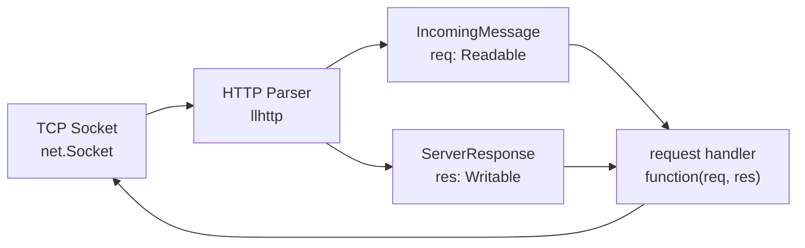
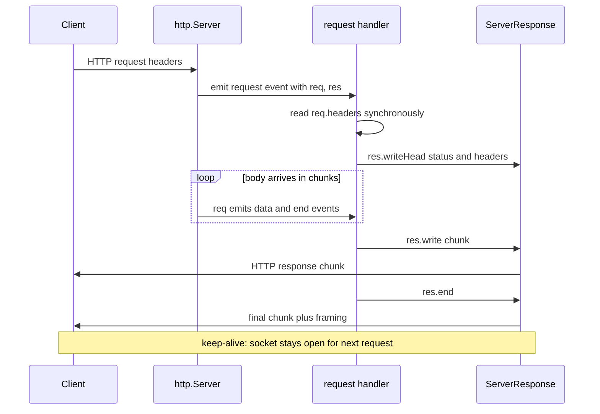
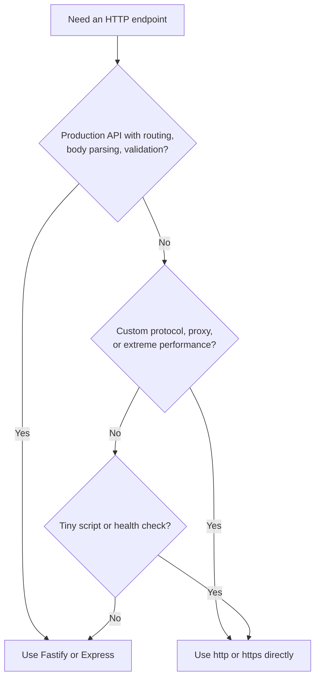
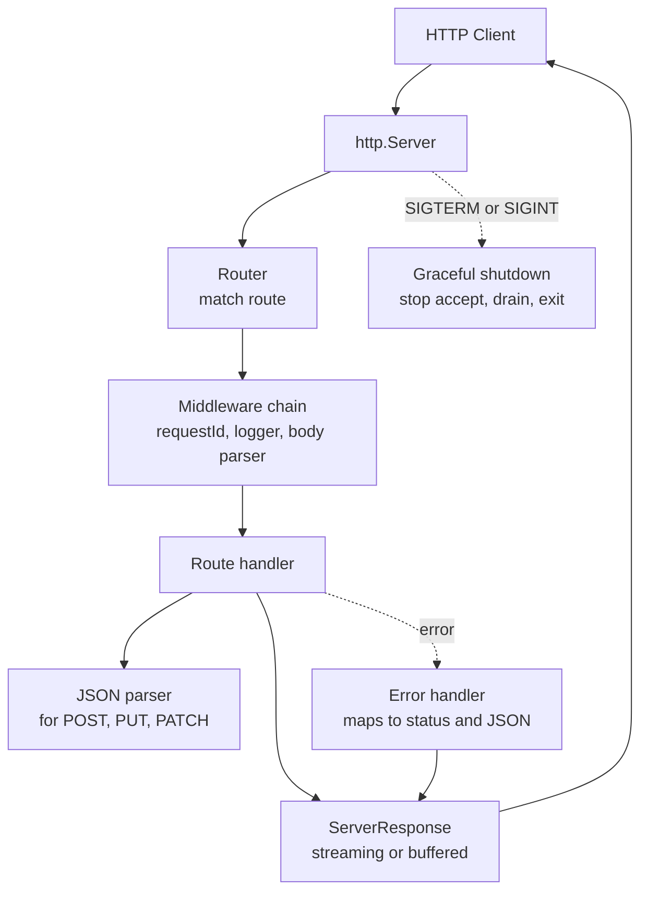

# 3.12 HTTP and HTTPS Modules

> The `http` and `https` modules are Node's built-in answer to "how do I speak the web?" — a callback-driven server and client that turn a TCP socket into a stream of headers and bytes, plus a thin TLS wrapper that bolts encryption underneath without changing the API. Every framework you have ever used in Node — Express, Fastify, Koa, NestJS, Restify — is a sugar coating on this substrate. This note makes the substrate so concrete that you can ship a typed HTTP service, parse streaming request bodies, stream large responses, and configure HTTPS with certificates, all without a single `npm install`.

## 1. Purpose

The `http` and `https` modules ship as part of the Node binary. No `npm install`, no external dependency, no compilation step. Together with `net` (raw TCP) and `tls` (raw TLS), they form the lowest layer of the Node web stack that most developers will touch directly. You can build a production web server, an HTTP client, a proxy, a webhook receiver, or a streaming endpoint using only what comes in the box.

### 1.1 Why http exists as a first-class module

Ryan Dahl's original 2009 motivation for Node was, in his words, "HTTP servers should be easy." His first demo at JSConf EU that year was a hello-world HTTP server that did not block on I/O — a sharp contrast to the threaded Apache model that dominated the era, where each inbound request consumed a thread and each thread cost roughly a megabyte of resident memory whether it was doing work or sleeping on a socket. The `http` module is the answer to that motivation: a small, callback-driven API that exposes an HTTP/1.1 server and client on top of libuv's non-blocking sockets. From this primitive, the entire Node web ecosystem was built.

### 1.2 What the http module enables

The `http` module is the substrate for essentially everything web-flavoured in Node.

- **Web servers and APIs.** A `http.Server` listening on a port, dispatching on `req.method` and `req.url`, is the simplest possible API server. Every framework from Express to Fastify to NestJS to Koa wraps this primitive.
- **HTTP clients.** `http.request` and `http.get` make outbound calls. The Axios, node-fetch, got, and undici libraries all sit on top of (or replace) this primitive.
- **Proxy servers.** Reverse proxies, forward proxies, load balancers — they all read an incoming `IncomingMessage`, transform it, and write it to an outbound `http.request`, then pipe the response back to the original `ServerResponse`.
- **Webhook receivers.** Stripe, GitHub, Slack, Twilio — they all POST events to your endpoint. Your endpoint is a `http.Server`.
- **Health-check endpoints.** The `/health` route a Kubernetes probe hits is a `http.Server` returning `200 OK`.
- **Static file servers.** `http.createServer` plus `fs.createReadStream` plus `res.setHeader('Content-Type', ...)` is a 20-line static server.
- **Streaming responses.** Server-sent events, large file downloads, infinite telemetry streams — all done by writing to a `ServerResponse` chunk by chunk.
- **Scrapers and crawlers.** `http.get` plus a streaming HTML parser is a low-overhead scraper.
- **WebSocket upgrades.** The HTTP/1.1 `Upgrade` handshake that bootstraps every WebSocket connection begins life as a `http.Server` `'upgrade'` event.

### 1.3 Why https is a separate module

HTTP and HTTPS share 95% of their API. `https.createServer` returns the same `http.Server` type; `https.request` returns the same `http.ClientRequest` type; `req` is still `http.IncomingMessage`; `res` is still `http.ServerResponse`. So why is `https` a separate module?

Because HTTPS is HTTP wrapped in TLS, and TLS requires a certificate, a private key, and a handshake. The `tls` module exposes the underlying TLS primitives (`tls.createServer`, `tls.connect`); `https` is a thin layer that wires TLS into `http` by passing `key`, `cert`, and friends into a `tls.SecureContext` and using `tls.TLSSocket` to wrap the raw TCP socket. Putting HTTPS in its own module keeps the surface area clean: if you do not need TLS, you do not pay for the `tls` import, and the `http` API stays focused on protocol semantics. If you do need TLS, you bring in `https` (or `tls` directly) and configure it explicitly.

### 1.4 Relationship to Express, Fastify, NestJS

Express, Fastify, Koa, Hapi, Restify, and NestJS are all frameworks built on top of `http`. They do not replace the module; they wrap it. Specifically:

- **Express** calls `http.createServer(app)` where `app` is a function `(req, res) => {}`. Express adds the middleware pipeline, the router, parameter parsing, body parsers, and template rendering.
- **Fastify** does the same, but with a JSON-schema-first design and a faster router. Fastify also exposes `fastify.server` — the underlying `http.Server` — for direct access.
- **NestJS** is itself a wrapper around Express (or optionally Fastify), adding dependency injection, decorators, modules, and a class-based controller pattern.

When you need the framework, use it. When you need absolute control — a 50-line proxy, a health check, a webhook receiver, a custom protocol on top of HTTP — drop down to `http` directly. This note is for the second case.

### 1.5 What this note is NOT

This note is not a tutorial on Express, Fastify, or NestJS. It is not a deep dive on HTTP/2 (see [[3.13 HTTP2 Server Push]]), WebSockets (see [[3.14 WebSockets and Realtime]]), or REST API design (see [[3.19 REST API Design]]). It is the protocol-level primitive: how to create a server, how to read the request, how to write the response, how to do it securely with TLS, and how to make outbound requests as a client. By the end you should be able to build an HTTP server from scratch, read request bodies as streams, stream large responses, and set up HTTPS with certificates.

## 2. Theory and Deep Dive

### 2.1 The two-sided API: server and client

The `http` module exposes two parallel surfaces: a server surface and a client surface. Both use the same stream types, the same header parsing, and the same chunked transfer semantics — but the direction of data flow is mirrored.

| Concept | Server side | Client side |
|---|---|---|
| Create | `http.createServer(handler)` | `http.request(opts)` or `http.get(url)` |
| Returns | `http.Server` | `http.ClientRequest` |
| Incoming | `http.IncomingMessage` (req) | `http.IncomingMessage` (response) |
| Outgoing | `http.ServerResponse` (res) | `http.ClientRequest` (the request you build) |
| Underlying | wraps `net.Server` | wraps `net.Socket` |

Both surfaces are stream-based: incoming data arrives as a Readable, outgoing data is written to a Writable. The asymmetry is that on the server, you receive an `IncomingMessage` and respond with a `ServerResponse`; on the client, you write to a `ClientRequest` and receive an `IncomingMessage` as the response.

### 2.2 http.createServer

`http.createServer` accepts an optional request handler and returns a `http.Server` (which extends `net.Server`, which extends `EventEmitter`). The handler you pass is registered as a listener for the `'request'` event. These two forms are equivalent:

```javascript
const http = require('node:http');

const server = http.createServer((req, res) => {
  res.end('hello');
});
server.listen(3000);
```

```javascript
const http = require('node:http');

const server = http.createServer();
server.on('request', (req, res) => {
  res.end('hello');
});
server.listen(3000);
```

The first form is a convenience. The second form matters when you want multiple listeners (a logging hook plus a handler), or when you want to attach other events like `'upgrade'` (for WebSockets) or `'checkContinue'` (for `Expect: 100-continue`).

### 2.3 The request/response flow

The full flow from request arrival to response completion, with the stream events highlighted:



The HTTP parser Node uses internally is `llhttp`, a generated C library. It consumes bytes from the socket and produces headers, body chunks, and lifecycle events. The `http` module wraps those into the `IncomingMessage` and `ServerResponse` objects you see in your handler.



On a keep-alive connection, multiple requests can flow through the same socket, each with its own `(req, res)` pair. The server recycles the socket automatically.

### 2.4 IncomingMessage: the request as a stream

`req` is an instance of `http.IncomingMessage`, which extends `stream.Readable`. That means:

- The request body is a stream. You consume it via `for await (const chunk of req)`, via `req.on('data', ...)`, via `req.pipe(dest)`, or via `pipeline(req, dest)`.
- The headers, method, URL, and HTTP version are properties available synchronously the moment the handler fires. You do not have to wait for the body to read `req.headers['content-type']`.

The key properties:

| Property | Type | Notes |
|---|---|---|
| `req.method` | string | `'GET'`, `'POST'`, etc. Always uppercase. |
| `req.url` | string | The raw request target. Includes query string, does not include host. Example: `'/api/users?limit=10'`. |
| `req.headers` | object | Lowercased header names. Example: `req.headers['content-type']`. |
| `req.httpVersion` | string | `'1.0'`, `'1.1'`, or `'2.0'`. |
| `req.socket` | net.Socket or tls.TLSSocket | The underlying socket. For HTTPS, this is a `TLSSocket` and you can read `req.socket.authorized` and the peer certificate. |
| `req.rawHeaders` | string[] | The headers exactly as received, preserving case and duplicates. Useful for signature verification. |

Because `req` is a Readable stream, the body is not buffered by default. If you never read it, the underlying TCP receive window fills up, the client stalls waiting for an ack that never comes, and eventually the connection times out. This is the most common Node HTTP bug; see Section 6.1.

### 2.5 ServerResponse: the response as a stream

`res` is an instance of `http.ServerResponse`, which extends `stream.Writable`. The response lifecycle has three phases:

1. **Headers phase.** You can call `res.setHeader(name, value)`, `res.getHeader(name)`, `res.removeHeader(name)`, and `res.writeHead(status, headers)` to assemble the response headers. Once you call `res.write` or `res.end`, the headers are flushed; subsequent `setHeader` calls throw.
2. **Body phase.** `res.write(chunk)` writes a chunk to the underlying socket. It returns `true` if the data was flushed to the kernel buffer, `false` if it was queued in userland (backpressure). Listen for `'drain'` before writing more.
3. **End phase.** `res.end([chunk], [encoding], [callback])` writes the final chunk, sends the trailing `0\r\n\r\n` for chunked encoding (or fills in `Content-Length` if known), and signals the client that the response is complete. The connection is then either reused (keep-alive) or closed.

Three things must always happen for a well-formed response:

- A status code is set (default `200`).
- Headers are set (at minimum `Content-Type`).
- `res.end()` is called.

If you forget `res.end()`, the client hangs. If you set headers after writing, you throw. If you write to a closed response, you get a stream-write-after-end error.

### 2.6 http.request and http.get

On the client side, `http.request(options, callback)` creates a `ClientRequest` (a Writable stream) and emits a `'response'` event with an `IncomingMessage` when the server replies.

```javascript
const http = require('node:http');

const req = http.request({
  hostname: 'example.com',
  port: 80,
  path: '/api',
  method: 'POST',
  headers: { 'Content-Type': 'application/json' }
}, (res) => {
  console.log(res.statusCode);
  res.on('data', (chunk) => console.log(chunk.toString()));
});

req.write(JSON.stringify({ hello: 'world' }));
req.end();
```

`http.get(url, callback)` is a shorthand for `http.request` with `method: 'GET'` and `req.end()` called automatically. Use it for read-only requests.

The `options` object accepts: `hostname`, `host`, `port`, `path`, `method`, `headers`, `auth` (basic auth, `user:pass`), `agent` (connection pooling), `timeout`, `socketPath` (Unix socket), and `createConnection` (override the socket factory).

The callback receives the response, but you should also listen for `'error'` on the request itself — the callback is only invoked on success. A network failure (DNS, connection refused, TCP reset) emits `'error'`; without a listener, the process crashes.

### 2.7 HTTPS: HTTP wrapped in TLS

The `https` module is `http` with a TLS layer bolted underneath. `https.createServer(options, handler)` accepts the same handler signature, but `options` must include `key` and `cert` (or `pfx`).

The underlying mechanics:

1. `https.createServer` creates a `tls.Server` (which extends `net.Server`).
2. On each new TCP connection, the TLS layer performs the handshake: certificate exchange, key agreement, cipher negotiation.
3. Once the handshake completes, the resulting `tls.TLSSocket` is handed to the HTTP parser (`llhttp`).
4. The HTTP parser produces `IncomingMessage` and `ServerResponse` exactly as on plain HTTP.
5. Everything else — headers, body streaming, keep-alive — works identically.

The `req.socket` on an HTTPS server is a `tls.TLSSocket`. You can inspect:

- `req.socket.authorized` — whether the client certificate (if any) was verified.
- `req.socket.getCipher()` — the negotiated cipher.
- `req.socket.getPeerCertificate()` — the client's certificate (mutual TLS).

### 2.8 HTTPS client: certificate validation

By default, `https.request` validates the server's certificate chain against the operating system's trusted CA store. If validation fails (self-signed cert, expired cert, hostname mismatch), the request emits an `'error'` event with a code describing the failure: a TLS-cert-altname-invalid error when the hostname does not match a `subjectAltName`, or an unable-to-verify-leaf-signature error when the chain cannot be verified to a trusted root.

To disable validation (for testing only!), pass `rejectUnauthorized: false`:

```javascript
const https = require('node:https');

const req = https.request({
  hostname: 'localhost',
  port: 8443,
  path: '/',
  rejectUnauthorized: false  // DO NOT USE IN PRODUCTION
}, (res) => { /* ... */ });
```

This disables all TLS verification — you are vulnerable to man-in-the-middle attacks. The correct fix in development is to add your self-signed CA to the trusted store via the Node environment variable that adds extra CA certificates (commonly referenced by its uppercased name with underscores, which the shell expands), or pass the `ca` option explicitly with your self-signed cert. Never ship `rejectUnauthorized: false` to production.

### 2.9 HTTP/1.1 keep-alive

HTTP/1.1 keep-alive is the default in Node. After a response completes, the underlying TCP socket stays open and can be reused for the next request to the same host. This eliminates the TCP handshake (and TLS handshake, on HTTPS) for subsequent requests — a massive latency win.

On the server side, keep-alive is controlled by:

- `server.keepAliveTimeout` — how long (ms) the server keeps an idle connection open before closing it. Default 5000ms.
- `server.headersTimeout` — how long the server waits for the complete headers before giving up. Default 60000ms. Must be greater than `keepAliveTimeout` to avoid a race.
- `server.requestTimeout` — how long the server waits for the entire request to arrive. Default 300000ms (5 min).

On the client side, keep-alive is governed by `http.Agent` (see 2.10).

### 2.10 http.Agent and connection pooling

`http.Agent` manages a pool of TCP sockets per origin (host plus port). When you make a request, the agent looks for an existing idle socket to that origin; if one is available, it reuses it; otherwise it opens a new one. The agent caps the number of concurrent sockets per origin via `agent.maxSockets` (default `Infinity` in modern Node for HTTP/1.1, though historically 5).

```javascript
const http = require('node:http');

const agent = new http.Agent({
  keepAlive: true,
  keepAliveMsecs: 1000,
  maxSockets: 256,
  maxFreeSockets: 32,
  timeout: 30000
});

const req = http.request({ hostname: 'example.com', agent }, (res) => { /* ... */ });
```

Without `keepAlive: true`, the agent opens a new socket per request and closes it immediately after the response. This is the historical default for the global agent — fine for occasional requests, catastrophic for high-throughput clients (you will exhaust ephemeral ports and hit `EADDRNOTAVAIL`).

Always use `keepAlive: true` for any client doing more than a handful of requests per second to the same host. The global `http.globalAgent` has `keepAlive: false` by default; create your own agent for production.

### 2.11 Streaming the response body

Because `res` is a Writable stream, you can stream arbitrarily large data without buffering it in memory:

```javascript
const http = require('node:http');
const fs = require('node:fs');

http.createServer((req, res) => {
  const stream = fs.createReadStream('/huge/file.bin');
  res.setHeader('Content-Type', 'application/octet-stream');
  stream.pipe(res);
}).listen(3000);
```

`stream.pipe(res)` does three things:

1. Sets up a `'data'` listener on the source that writes each chunk to `res`.
2. Calls `res.end()` when the source ends.
3. Propagates backpressure — if `res.write(chunk)` returns `false`, `pipe` pauses the source until `res` emits `'drain'`.

For production code, prefer `stream.pipeline(src, res, callback)` over `pipe`. `pipeline` properly propagates errors and destroys both streams on failure; `pipe` does not, and an error on the source leaves `res` hanging. See [[3.07 Streams Fundamentals]] and [[3.08 Streams Advanced Backpressure]] for the full backpressure story.

### 2.12 Server-Sent Events

Server-Sent Events (SSE) are a streaming pattern on top of HTTP/1.1: the server sets `Content-Type: text/event-stream`, keeps the connection open, and writes `data:` lines as they become available. The browser's `EventSource` API consumes them.

```javascript
http.createServer((req, res) => {
  res.writeHead(200, {
    'Content-Type': 'text/event-stream',
    'Cache-Control': 'no-cache',
    'Connection': 'keep-alive'
  });

  const interval = setInterval(() => {
    res.write(`data: ${JSON.stringify({ time: Date.now() })}\n\n`);
  }, 1000);

  req.on('close', () => clearInterval(interval));
}).listen(3000);
```

Two things to notice:

1. We do not call `res.end()` until the client disconnects. We rely on `req.on('close')` to clean up.
2. Each event is terminated by `\n\n` (two newlines). The SSE wire format requires this.

### 2.13 The upgrade event and WebSockets

The HTTP/1.1 `Upgrade` header is used to switch protocols. The most common use is the WebSocket handshake. The `http.Server` emits an `'upgrade'` event when it receives an upgrade request; you handle the protocol switch yourself.

```javascript
const http = require('node:http');

http.createServer().on('upgrade', (req, socket, head) => {
  if (req.headers['upgrade'] !== 'websocket') {
    socket.destroy();
    return;
  }
  // perform WebSocket handshake, frame parsing, etc.
}).listen(3000);
```

The `socket` here is the raw `net.Socket`. You are now operating below HTTP. Most projects use the `ws` package, which implements the WebSocket protocol on top of this primitive. See [[3.14 WebSockets and Realtime]].

### 2.14 The error event

`http.Server` extends `EventEmitter`. If it emits an `'error'` event and there is no listener, Node throws and the process exits. Common error sources:

- `EADDRINUSE` — port already in use.
- `EACCES` — port requires root (below 1024 on Linux).
- `ECONNRESET` — client reset the connection mid-handshake.

Always attach a listener:

```javascript
server.on('error', (err) => {
  console.error('server error:', err);
  if (err.code === 'EADDRINUSE') {
    console.error('port in use, retrying in 1s');
    setTimeout(() => server.listen(3000), 1000);
  }
});
```

The same applies to `http.ClientRequest`: always listen for `'error'`, because the request callback is only invoked on a successful response.

### 2.15 Timeouts

Node's HTTP server has several timeouts, each protecting against a different failure mode:

| Timeout | Default | What it protects against |
|---|---|---|
| `server.headersTimeout` | 60s | Slowloris-style header flood. |
| `server.requestTimeout` | 5min | Client never finishes sending the request body. |
| `server.keepAliveTimeout` | 5s | Idle keep-alive connections sitting forever. |
| `server.timeout` | 0 (no timeout) in older Node; 5min in modern | Total time per request. Set to a sane value. |
| `req.setTimeout(msecs)` | 2min | Per-request inactivity timeout. |

For production, set `server.timeout` to a finite value (30 seconds for an API, 5 minutes for file uploads) and tune `keepAliveTimeout` based on your load balancer's idle timeout. The classic race: if your load balancer has a 60-second idle timeout and your server has a 65-second `keepAliveTimeout`, the LB will close first and the server's next response on that socket will hit a closed connection.

### 2.16 The four stream types revisited

All four Node stream types appear in the HTTP/HTTPS modules:

- **Readable**: `http.IncomingMessage` (both server-side `req` and client-side `res`).
- **Writable**: `http.ServerResponse` (server-side `res`), `http.ClientRequest` (client-side request being built).
- **Duplex**: not directly used by HTTP; the underlying `net.Socket` is a Duplex.
- **Transform**: not used by HTTP directly, but commonly composed in pipelines (gzip a response, hash a request body for signature verification).

The implication is that everything you learned in [[3.07 Streams Fundamentals]] and [[3.08 Streams Advanced Backpressure]] applies directly. `pipeline`, `for await...of`, backpressure, `highWaterMark`, and `destroy` all work on HTTP streams.

### 2.17 TLS internals: the SecureContext

Behind `https.createServer` is a `tls.SecureContext`. The context bundles:

- The private key (`key`).
- The certificate chain (`cert`).
- The CA bundle (`ca`) for verifying client certificates (mutual TLS).
- Optional `pfx` (PKCS12 bundle, common in Windows shops).
- The list of allowed ciphers (`ciphers`).
- The list of allowed TLS protocol versions (`minVersion`, `maxVersion`).

You can create the context up front and reuse it across servers, or pass the options directly and let `https` build the context for you. For SNI (Server Name Indication), where one server hosts multiple certificates keyed on the hostname in the TLS ClientHello, use `SNICallback`:

```javascript
const https = require('node:https');
const tls = require('node:tls');

const ctxA = tls.createSecureContext({ key, cert: certA });
const ctxB = tls.createSecureContext({ key, cert: certB });

https.createServer({
  SNICallback: (servername, cb) => {
    if (servername === 'a.example.com') return cb(null, ctxA);
    if (servername === 'b.example.com') return cb(null, ctxB);
    cb(new Error('unknown host'));
  }
}, handler).listen(443);
```

### 2.18 Generating a self-signed certificate

For local HTTPS development, you need a cert. OpenSSL generates one in one line:

```bash
openssl req -x509 -newkey rsa:4096 -nodes -keyout key.pem -out cert.pem -days 365 -subj '/CN=localhost' -addext 'subjectAltName=DNS:localhost,IP:127.0.0.1'
```

The `subjectAltName` extension is required by modern browsers and Node's TLS validation; without it, you get a TLS-cert-altname-invalid error even when the CN matches. Then:

```javascript
const https = require('node:https');
const fs = require('node:fs');

https.createServer({
  key: fs.readFileSync('key.pem'),
  cert: fs.readFileSync('cert.pem')
}, (req, res) => {
  res.end('hello over TLS');
}).listen(8443);
```

The browser will warn about the self-signed cert. Add `cert.pem` to your OS trust store, or use `mkcert` to create a locally-trusted CA.

## 3. Mental Models

These five mental models capture the essence of the HTTP/HTTPS modules. Internalise them and the API becomes obvious.

### 3.1 The server is a function

**An HTTP server is a function that takes (req, res) and writes to res.**

Everything else — the `http.Server` object, the `listen` call, the event emitters, the timeouts — is plumbing. The core abstraction is: a callback receives two arguments, a request stream and a response stream. You read from one, you write to the other, you call `end`.

```javascript
const handler = (req, res) => {
  // read req, write res, end res
};
http.createServer(handler).listen(3000);
```

Express and Fastify expose the same function signature with extras bolted on. The `app` object in Express is a function `(req, res) => {}` — that is literally what `http.createServer(app)` consumes. When you write `app.get('/users', ...)`, you are decorating that function with a routing table.

### 3.2 req is a Readable stream

**`req` is the incoming request as a stream.**

The headers arrive synchronously; the body arrives as chunks. If you treat the body as something you can read once at the top of the handler, you will be confused when the chunks arrive later. If you treat it as a stream you subscribe to, the model fits.

Three valid consumption patterns:

```javascript
// Pattern 1: data event
let body = '';
req.on('data', (c) => body += c);
req.on('end', () => handle(body));

// Pattern 2: for await (preferred)
let body = '';
for await (const chunk of req) body += chunk;
handle(body);

// Pattern 3: pipe to a transform
pipeline(req, parser, writableToDb, done);
```

The headers are properties on `req`; the body is a stream you read from. Do not confuse the two.

### 3.3 res is a Writable stream

**`res` is the outgoing response as a stream.**

You set headers (once, before the first write), then write chunks, then call `end`. The stream metaphor is exact: `res.write(chunk)` returns `false` under backpressure; `res.end()` closes the stream.

```javascript
res.writeHead(200, { 'Content-Type': 'text/plain' });
for (let i = 0; i < 10; i++) {
  res.write(`chunk ${i}\n`);
}
res.end();
```

You can pipe any Readable into `res`. You can compose Transform streams (gzip, encrypt) in between. You can write a single `res.end('done')` for tiny responses.

### 3.4 HTTPS is HTTP wrapped in TLS

**HTTPS equals HTTP wrapped in TLS.**

Picture two boxes: the outer box is TLS (a `tls.TLSSocket`), the inner box is HTTP (the `IncomingMessage` / `ServerResponse` pair). The TLS layer is transparent to your handler — you still write `res.writeHead` and `res.end`, you still read `req.headers` — but the bytes on the wire are encrypted.

The only API differences are:

- You pass `{ key, cert }` to `https.createServer`.
- `req.socket` is a `tls.TLSSocket` with extra properties (`authorized`, `getPeerCertificate`, etc.).
- The client validates certificates by default.

Everything else — headers, status codes, methods, keep-alive, streaming — is identical.

### 3.5 Frameworks are wrappers

**Express, Fastify, NestJS are wrappers that add routing, middleware, parsing.**

They do not replace the HTTP module; they sit on top of it. A Fastify route handler `(req, reply) => {}` is, under the hood, a function that reads from the underlying `http.IncomingMessage` and writes to the underlying `http.ServerResponse`. The `reply.send(obj)` call serialises `obj` to JSON, sets `Content-Type: application/json`, and calls `res.end(json)`.

When the framework gets in your way — when you need a streaming response that the framework does not support well, when you need a custom protocol on top of HTTP, when you need a 100-line microservice — drop down to `http` directly. The framework is convenience, not necessity.

The decision tree:



## 4. Real-World Use Cases

### 4.1 Custom web servers (when Express is too much)

Not every endpoint needs a router, middleware stack, and body parser. A health-check endpoint, a Prometheus metrics endpoint, a webhook receiver that does one thing — these are 30-line scripts. Spinning up Express for them is overhead (the require itself adds tens of milliseconds to startup). A bare `http.createServer` is faster to boot, faster to run, and easier to audit.

### 4.2 API gateways

An API gateway sits in front of multiple backend services. It receives a request, decides which backend to forward to (by path, header, or auth claim), makes an outbound `http.request`, and pipes the backend's response back to the client. The code is essentially: `pipeline(req, backendReq)` then `pipeline(backendRes, res)`. Express does not help here; the gateway is fundamentally a stream router.

### 4.3 Proxy servers

Forward and reverse proxies are built on `http`. A reverse proxy (like nginx, or a Node implementation thereof) listens for inbound requests, forwards them to upstreams, and applies transformations: header rewriting, rate limiting, authentication, response compression. Node's stream-based HTTP makes this natural — every transformation is a `Transform` stream in a `pipeline`.

### 4.4 Health check endpoints

Kubernetes, Consul, AWS ALB — they all poll a `/health` endpoint to decide whether to route traffic to your pod. The endpoint should return 200 in a few milliseconds, with no dependencies on databases or external services (otherwise the health check itself becomes the failure). A bare `http.createServer` is the right tool.

```javascript
http.createServer((req, res) => {
  if (req.url === '/health') {
    res.end('ok');
    return;
  }
  res.writeHead(404).end();
}).listen(3000);
```

### 4.5 Static file servers

A development-only static file server is 20 lines: `http.createServer` plus `fs.createReadStream` plus a MIME lookup. Production static serving should use nginx or a CDN, but for local dev (mocking a frontend, testing a build) the bare version is perfect.

### 4.6 Webhook receivers

Stripe, GitHub, Slack, Twilio — they all POST events to your endpoint. The handler signature is always the same: read the raw body, verify the signature header, parse JSON, dispatch to a queue. The signature verification needs the raw bytes (not the parsed JSON), so you cannot use a body parser that mutates the stream. A raw `http.Server` with `for await (const chunk of req)` is the cleanest implementation.

### 4.7 Streaming responses (SSE and large downloads)

Server-Sent Events (Section 2.12) require an open, long-lived response that the server writes to over time. Express can do this, but it is awkward; the framework was not designed for it. A bare `http.Server` shines. The same applies to large file downloads — a 50 GB log file served via `fs.createReadStream().pipe(res)` never uses more than 64 KiB of memory.

### 4.8 HTTP clients for APIs

Internal service-to-service calls, scraping, API integrations — `http.request` is the lowest-level client. For high throughput, configure an `http.Agent` with `keepAlive: true` and reuse it. For one-off calls, `http.get` is fine. For modern code, consider `undici` (Node's high-performance HTTP/1.1 client, used internally by `fetch`) — but understand that `undici` itself is built on top of the same primitives this note covers.

### 4.9 Real-world debugging: the hanging client

A client reports "your API hangs forever after POST upload." The server logs show the handler fired, the response was written, `res.end()` was called. The bug: the server did not consume the request body. The client is waiting for the server to ack the bytes; the server never read them; the TCP window fills; the client blocks on `socket.write`. Fix: always drain `req`, even if you do not need the body.

### 4.10 Real-world debugging: ECONNRESET in production

A service behind a load balancer sees sporadic `ECONNRESET` errors. The load balancer has a 60-second idle timeout; the server's `keepAliveTimeout` is 65 seconds. The LB closes first; the server tries to write the next response on a dead socket; the client sees `ECONNRESET`. Fix: set `server.keepAliveTimeout` to a value lower than the LB's idle timeout (e.g., 55 seconds if LB is 60).

## 5. Code Examples

### 5.1 Example A — Minimal and Conceptual

Three minimal servers, side by side in JS and TS: hello world, request body streaming, and HTTPS.

**A.1 Hello world HTTP server (JS)**

```javascript
const http = require('node:http');

const server = http.createServer((req, res) => {
  res.writeHead(200, { 'Content-Type': 'text/plain' });
  res.end('hello world\n');
});

server.listen(3000, () => {
  console.log('listening on http://localhost:3000');
});
```

**A.1 Hello world HTTP server (TS)**

```typescript
import http, { IncomingMessage, ServerResponse } from 'node:http';

const server = http.createServer((req: IncomingMessage, res: ServerResponse) => {
  res.writeHead(200, { 'Content-Type': 'text/plain' });
  res.end('hello world\n');
});

server.listen(3000, () => {
  console.log('listening on http://localhost:3000');
});
```

**A.2 Reading the request body as a stream (JS)**

```javascript
const http = require('node:http');

http.createServer(async (req, res) => {
  const chunks = [];
  for await (const chunk of req) {
    chunks.push(chunk);
  }
  const body = Buffer.concat(chunks).toString('utf8');
  console.log('received:', body);

  res.writeHead(200, { 'Content-Type': 'application/json' });
  res.end(JSON.stringify({ ok: true, bytes: body.length }));
}).listen(3000);
```

**A.2 Reading the request body as a stream (TS)**

```typescript
import http, { IncomingMessage, ServerResponse } from 'node:http';

http.createServer(async (req: IncomingMessage, res: ServerResponse) => {
  const chunks: Buffer[] = [];
  for await (const chunk of req) {
    chunks.push(chunk as Buffer);
  }
  const body = Buffer.concat(chunks).toString('utf8');
  console.log('received:', body);

  res.writeHead(200, { 'Content-Type': 'application/json' });
  res.end(JSON.stringify({ ok: true, bytes: body.length }));
}).listen(3000);
```

**A.3 HTTPS server with self-signed cert (JS)**

```javascript
const https = require('node:https');
const fs = require('node:fs');
const path = require('node:path');

const certDir = process.cwd();

https.createServer({
  key: fs.readFileSync(path.join(certDir, 'key.pem')),
  cert: fs.readFileSync(path.join(certDir, 'cert.pem'))
}, (req, res) => {
  res.writeHead(200, { 'Content-Type': 'text/plain' });
  res.end('hello over TLS\n');
}).listen(8443, () => {
  console.log('listening on https://localhost:8443');
});
```

**A.3 HTTPS server with self-signed cert (TS)**

```typescript
import https, { ServerOptions, IncomingMessage, ServerResponse } from 'node:https';
import fs from 'node:fs';
import path from 'node:path';

const certDir = process.cwd();

const tlsOptions: ServerOptions = {
  key: fs.readFileSync(path.join(certDir, 'key.pem')),
  cert: fs.readFileSync(path.join(certDir, 'cert.pem'))
};

https.createServer(tlsOptions, (req: IncomingMessage, res: ServerResponse) => {
  res.writeHead(200, { 'Content-Type': 'text/plain' });
  res.end('hello over TLS\n');
}).listen(8443, () => {
  console.log('listening on https://localhost:8443');
});
```

**A.4 HTTPS client validating certs (JS)**

```javascript
const https = require('node:https');

https.get('https://example.com', (res) => {
  console.log('status:', res.statusCode);
  res.on('data', (chunk) => process.stdout.write(chunk));
}).on('error', (err) => {
  console.error('request failed:', err.message);
});
```

**A.4 HTTPS client validating certs (TS)**

```typescript
import https, { IncomingMessage } from 'node:https';

https.get('https://example.com', (res: IncomingMessage) => {
  console.log('status:', res.statusCode);
  res.on('data', (chunk: Buffer) => process.stdout.write(chunk));
}).on('error', (err: Error) => {
  console.error('request failed:', err.message);
});
```

### 5.2 Example B — Production-Grade

A typed API server with: routing, JSON body parsing with size limit, streaming response, error handling, structured logging, request timeouts, and graceful shutdown.

**B.1 Production API server (JS)**

```javascript
const http = require('node:http');

const PORT = Number(process.env.PORT || 3000);
const maxBodyBytes = 1024 * 1024; // 1 MiB

function route(method, path, handler) {
  return { method, path, handler };
}

const routes = [
  route('GET', '/health', async (req, res) => {
    res.writeHead(200, { 'Content-Type': 'application/json' });
    res.end(JSON.stringify({ status: 'ok' }));
  }),
  route('POST', '/echo', async (req, res, body) => {
    res.writeHead(200, { 'Content-Type': 'application/json' });
    res.end(JSON.stringify({ echoed: body }));
  }),
  route('GET', '/stream', async (req, res) => {
    res.writeHead(200, {
      'Content-Type': 'text/event-stream',
      'Cache-Control': 'no-cache',
      'Connection': 'keep-alive'
    });
    let i = 0;
    const timer = setInterval(() => {
      res.write(`data: tick ${i++}\n\n`);
    }, 1000);
    req.on('close', () => clearInterval(timer));
  })
];

async function readBody(req, maxBytes) {
  let size = 0;
  const chunks = [];
  for await (const chunk of req) {
    size += chunk.length;
    if (size > maxBytes) {
      throw Object.assign(new Error('payload too large'), { statusCode: 413 });
    }
    chunks.push(chunk);
  }
  const raw = Buffer.concat(chunks).toString('utf8');
  if (!raw) return null;
  try {
    return JSON.parse(raw);
  } catch {
    throw Object.assign(new Error('invalid json'), { statusCode: 400 });
  }
}

const server = http.createServer(async (req, res) => {
  const start = Date.now();
  try {
    const match = routes.find(r =>
      r.method === req.method && r.path === (req.url || '/').split('?')[0]
    );
    if (!match) {
      res.writeHead(404, { 'Content-Type': 'application/json' });
      res.end(JSON.stringify({ error: 'not found' }));
      return;
    }
    const body = ['POST', 'PUT', 'PATCH'].includes(req.method)
      ? await readBody(req, maxBodyBytes)
      : null;
    await match.handler(req, res, body);
  } catch (err) {
    if (res.headersSent) {
      res.end();
      return;
    }
    const status = err.statusCode || 500;
    res.writeHead(status, { 'Content-Type': 'application/json' });
    res.end(JSON.stringify({ error: err.message }));
  } finally {
    console.log({ method: req.method, url: req.url, ms: Date.now() - start });
  }
});

server.timeout = 30000;
server.keepAliveTimeout = 5000;
server.headersTimeout = 60000;
server.requestTimeout = 30000;

server.on('error', (err) => {
  console.error('server error', err);
  process.exit(1);
});

server.listen(PORT, () => {
  console.log(`listening on http://localhost:${PORT}`);
});

for (const sig of ['SIGINT', 'SIGTERM']) {
  process.on(sig, () => {
    console.log(`${sig} received, shutting down`);
    server.close(() => process.exit(0));
  });
}
```

**B.1 Production API server (TS)**

```typescript
import http, { IncomingMessage, ServerResponse, Server } from 'node:http';

interface RouteContext {
  req: IncomingMessage;
  res: ServerResponse;
  body: unknown;
}

interface Route {
  method: string;
  path: string;
  handler: (ctx: RouteContext) => Promise<void>;
}

interface HttpError extends Error {
  statusCode?: number;
}

const PORT = Number(process.env.PORT || 3000);
const maxBodyBytes = 1024 * 1024;

function route(method: string, path: string, handler: (ctx: RouteContext) => Promise<void>): Route {
  return { method, path, handler };
}

const routes: Route[] = [
  route('GET', '/health', async ({ res }) => {
    res.writeHead(200, { 'Content-Type': 'application/json' });
    res.end(JSON.stringify({ status: 'ok' }));
  }),
  route('POST', '/echo', async ({ res, body }) => {
    res.writeHead(200, { 'Content-Type': 'application/json' });
    res.end(JSON.stringify({ echoed: body }));
  }),
  route('GET', '/stream', async ({ req, res }) => {
    res.writeHead(200, {
      'Content-Type': 'text/event-stream',
      'Cache-Control': 'no-cache',
      'Connection': 'keep-alive'
    });
    let i = 0;
    const timer = setInterval(() => {
      res.write(`data: tick ${i++}\n\n`);
    }, 1000);
    req.on('close', () => clearInterval(timer));
  })
];

async function readBody(req: IncomingMessage, maxBytes: number): Promise<unknown> {
  let size = 0;
  const chunks: Buffer[] = [];
  for await (const chunk of req) {
    const buf = chunk as Buffer;
    size += buf.length;
    if (size > maxBytes) {
      const err: HttpError = new Error('payload too large');
      err.statusCode = 413;
      throw err;
    }
    chunks.push(buf);
  }
  const raw = Buffer.concat(chunks).toString('utf8');
  if (!raw) return null;
  try {
    return JSON.parse(raw);
  } catch {
    const err: HttpError = new Error('invalid json');
    err.statusCode = 400;
    throw err;
  }
}

const server: Server = http.createServer(async (req: IncomingMessage, res: ServerResponse) => {
  const start = Date.now();
  try {
    const path = (req.url || '/').split('?')[0];
    const match = routes.find(r => r.method === req.method && r.path === path);
    if (!match) {
      res.writeHead(404, { 'Content-Type': 'application/json' });
      res.end(JSON.stringify({ error: 'not found' }));
      return;
    }
    const body = ['POST', 'PUT', 'PATCH'].includes(req.method || '')
      ? await readBody(req, maxBodyBytes)
      : null;
    await match.handler({ req, res, body });
  } catch (err) {
    const e = err as HttpError;
    if (res.headersSent) {
      res.end();
      return;
    }
    const status = e.statusCode || 500;
    res.writeHead(status, { 'Content-Type': 'application/json' });
    res.end(JSON.stringify({ error: e.message }));
  } finally {
    console.log({ method: req.method, url: req.url, ms: Date.now() - start });
  }
});

server.timeout = 30000;
server.keepAliveTimeout = 5000;
server.headersTimeout = 60000;
server.requestTimeout = 30000;

server.on('error', (err: Error) => {
  console.error('server error', err);
  process.exit(1);
});

server.listen(PORT, () => {
  console.log(`listening on http://localhost:${PORT}`);
});

for (const sig of ['SIGINT', 'SIGTERM'] as const) {
  process.on(sig, () => {
    console.log(`${sig} received, shutting down`);
    server.close(() => process.exit(0));
  });
}
```

**B.2 Keep-alive HTTP client (JS)**

```javascript
const http = require('node:http');

const agent = new http.Agent({
  keepAlive: true,
  maxSockets: 64,
  maxFreeSockets: 16,
  timeout: 30000
});

async function fetchJson(url, opts = {}) {
  return new Promise((resolve, reject) => {
    const req = http.request(url, { ...opts, agent }, (res) => {
      if (res.statusCode && (res.statusCode < 200 || res.statusCode >= 300)) {
        reject(new Error(`HTTP ${res.statusCode}`));
        return;
      }
      const chunks = [];
      res.on('data', (c) => chunks.push(c));
      res.on('end', () => {
        try { resolve(JSON.parse(Buffer.concat(chunks).toString('utf8'))); }
        catch (e) { reject(e); }
      });
    });
    req.on('error', reject);
    req.setTimeout(5000, () => req.destroy(new Error('timeout')));
    if (opts.body) req.write(opts.body);
    req.end();
  });
}

fetchJson('http://localhost:3000/health').then(console.log).catch(console.error);
```

**B.2 Keep-alive HTTP client (TS)**

```typescript
import http, { Agent, ClientRequest, IncomingMessage } from 'node:http';
import { URL } from 'node:url';

const agent = new Agent({
  keepAlive: true,
  maxSockets: 64,
  maxFreeSockets: 16,
  timeout: 30000
});

interface FetchOptions {
  method?: string;
  headers?: Record<string, string>;
  body?: string;
}

async function fetchJson(url: string, opts: FetchOptions = {}): Promise<unknown> {
  return new Promise((resolve, reject) => {
    const parsed = new URL(url);
    const req: ClientRequest = http.request({
      hostname: parsed.hostname,
      port: parsed.port || 80,
      path: parsed.pathname + parsed.search,
      method: opts.method || 'GET',
      headers: opts.headers || {},
      agent
    }, (res: IncomingMessage) => {
      if (res.statusCode && (res.statusCode < 200 || res.statusCode >= 300)) {
        reject(new Error(`HTTP ${res.statusCode}`));
        return;
      }
      const chunks: Buffer[] = [];
      res.on('data', (c: Buffer) => chunks.push(c));
      res.on('end', () => {
        try { resolve(JSON.parse(Buffer.concat(chunks).toString('utf8'))); }
        catch (e) { reject(e); }
      });
    });
    req.on('error', reject);
    req.setTimeout(5000, () => req.destroy(new Error('timeout')));
    if (opts.body) req.write(opts.body);
    req.end();
  });
}

fetchJson('http://localhost:3000/health').then(console.log).catch(console.error);
```

## 6. Common Mistakes and Anti-Patterns

### 6.1 Not consuming the request body

**Symptom**: POST/PUT/PATCH clients hang until the server's timeout fires, then see an `ECONNRESET` or `408`.

**Cause**: The server received the request, dispatched to the handler, and responded without ever reading `req`. The client is still sending the body (or has sent it and is waiting for a TCP ack). The TCP receive window fills, the client blocks on `socket.write`, and the request hangs.

**Fix**: Always drain `req`, even if you do not need the body.

```javascript
// WRONG
http.createServer((req, res) => {
  res.end('ok');  // body never read
});

// RIGHT
http.createServer((req, res) => {
  req.resume();  // drain and discard
  res.end('ok');
});

// ALSO RIGHT (use the body)
http.createServer(async (req, res) => {
  const chunks = [];
  for await (const chunk of req) chunks.push(chunk);
  res.end('ok');
});
```

`req.resume()` is the explicit "drain and discard" call. It is the one-line fix for any handler that does not need the body.

### 6.2 Not calling res.end()

**Symptom**: The client never receives a response, the connection eventually times out.

**Cause**: The handler wrote some data with `res.write()` but never called `res.end()`. The HTTP/1.1 protocol has no way to know the response is complete without either a `Content-Length` header or chunked transfer encoding's terminal `0\r\n\r\n` — both of which are sent by `res.end()`.

**Fix**: Always call `res.end()`. If you have nothing more to write, call `res.end()` with no arguments. For tiny responses, `res.end(payload)` writes and ends in one call.

### 6.3 Forgetting Content-Type

**Symptom**: Browsers download your JSON as a file instead of rendering it; `curl` prints the body but `jq` complains; clients cannot parse the response.

**Cause**: Without `Content-Type`, the client has to guess. Browsers default to `application/octet-stream` for unknown types and prompt the user to download. `curl | jq` works only because `jq` is permissive.

**Fix**: Always set `Content-Type`. For JSON, `application/json; charset=utf-8`. For HTML, `text/html; charset=utf-8`. For SSE, `text/event-stream`. For plain text, `text/plain; charset=utf-8`.

### 6.4 Sync errors in handlers crash the server

**Symptom**: A single malformed request brings down the entire server.

**Cause**: An uncaught `throw` inside the request handler becomes an `'uncaughtException'` if no `try/catch` wraps it. Node's default behaviour is to print the stack and exit. With `process.on('uncaughtException')` set up, the process survives but the connection leaks.

**Fix**: Wrap every handler body in `try/catch`. For async handlers, either use `try/catch` with `await`, or attach a `.catch()` to the returned promise.

```javascript
http.createServer(async (req, res) => {
  try {
    await handle(req, res);
  } catch (err) {
    if (!res.headersSent) {
      res.writeHead(500, { 'Content-Type': 'application/json' });
      res.end(JSON.stringify({ error: 'internal' }));
    } else {
      res.end();
    }
  }
});
```

### 6.5 HTTPS without proper cert config

**Symptom**: Browsers refuse to connect; clients see a TLS verification error (typically a leaf-signature verification failure or a hostname-mismatch failure).

**Cause**: The server is using a self-signed cert without the matching CA in the client trust store; or the cert is missing intermediate certificates; or the cert is for the wrong hostname; or the `subjectAltName` extension is missing.

**Fix**: For production, use a real certificate from Let's Encrypt or your CA. Include the full chain (server plus intermediates) in the `cert` option. For local development, use `mkcert` to create a locally-trusted CA, or set the Node environment variable that adds extra CA certificates to point at your self-signed cert path. Never use `rejectUnauthorized: false` outside of one-off scripts.

### 6.6 Not handling the 'error' event on the server

**Symptom**: The server starts, runs for a while, then exits with a stack trace the moment something goes wrong with the underlying socket or listener.

**Cause**: `http.Server` extends `EventEmitter`. An `'error'` event with no listener causes Node to throw, which (since the early days) crashes the process. The most common error is `EADDRINUSE` when starting a second instance on the same port.

**Fix**: Always attach a listener.

```javascript
server.on('error', (err) => {
  if (err.code === 'EADDRINUSE') {
    console.error('port in use');
    process.exit(1);
  } else {
    throw err;
  }
});
```

### 6.7 Not handling the 'error' event on ClientRequest

**Symptom**: An `ECONNRESET` or `ETIMEDOUT` on an outbound HTTP call crashes the process.

**Cause**: The `http.request` callback only fires on a successful response. Network errors emit `'error'` on the request object. Without a listener, the error is unhandled.

**Fix**: Always attach `.on('error', ...)` to the request, or wrap in a Promise and reject on error.

### 6.8 Setting headers after writing

**Symptom**: Node throws an HTTP-headers-sent error: `Cannot set headers after they are sent to the client`.

**Cause**: `res.write()` and `res.end()` flush the headers. Subsequent `setHeader` or `writeHead` calls throw.

**Fix**: Set all headers before the first write. Use `res.setHeader` for individual headers; use `res.writeHead(status, headers)` to set the status and a batch of headers atomically. Check `res.headersSent` if you are unsure.

### 6.9 Forgetting to set timeouts

**Symptom**: A Slowloris-style attack or a misbehaving client keeps connections open forever, exhausting file descriptors until the server can no longer accept new connections.

**Cause**: The default `server.timeout` is `0` (no timeout) in older Node versions; modern Node has sensible defaults but `server.requestTimeout` is 5 minutes, which is too long for some attacks.

**Fix**: Set `server.timeout` explicitly (30 seconds for APIs). Set `server.headersTimeout` shorter than `server.requestTimeout`. Set `server.keepAliveTimeout` a few seconds shorter than your load balancer's idle timeout.

### 6.10 Using the global agent for high-throughput clients

**Symptom**: Sporadic `EADDRNOTAVAIL` errors after sustained outbound traffic.

**Cause**: The default `http.globalAgent` has `keepAlive: false`. Every request opens a new socket and closes it immediately. After roughly 28,000 sockets in 30 seconds (the default ephemeral port range and TIME-WAIT duration on Linux), the OS runs out of ports.

**Fix**: Create an `http.Agent({ keepAlive: true, maxSockets: ... })` and reuse it.

### 6.11 Treating req.url as a parsed object

**Symptom**: `req.url.query` is undefined; the route does not match.

**Cause**: `req.url` is the raw request target string (e.g., `/api?foo=bar`), not a parsed URL object. There is no `req.path` or `req.query` by default.

**Fix**: Parse with `new URL(req.url, 'http://localhost')` to get `searchParams`, or use `req.url.split('?')[0]` for just the path.

```javascript
const u = new URL(req.url, 'http://localhost');
console.log(u.pathname);             // '/api'
console.log(u.searchParams.get('foo')); // 'bar'
```

### 6.12 Using pipe instead of pipeline for streaming responses

**Symptom**: A file read error leaves the response hanging open; the client eventually times out.

**Cause**: `src.pipe(res)` does not propagate errors from `src` to `res`. If `src` errors, `res` stays open and the client waits forever.

**Fix**: Use `pipeline(src, res, callback)` from `node:stream/promises`. It propagates errors, destroys both streams on failure, and calls the callback when complete.

## 7. Best Practices and Design Patterns

### 7.1 Always consume the request body

Even if your handler ignores the body, drain it. A single `req.resume()` at the top of every GET handler prevents the hanging-client bug (Section 6.1). For routes that need the body, read it explicitly via `for await...of`.

### 7.2 Always call res.end()

Every code path through the handler must call `res.end()` exactly once. Use early returns, `try/finally`, or a wrapper that guarantees the call. The cost of forgetting is a hung connection and a leaked socket.

### 7.3 Set appropriate headers

At minimum: `Content-Type`, `Content-Length` (if known), `Cache-Control` (for cacheable responses). For APIs, `Content-Type: application/json; charset=utf-8` is the default. For static files, look up the MIME type from the extension.

### 7.4 Use a framework for production apps

Express, Fastify, or NestJS give you: routing, body parsing, query parsing, content negotiation, error handling, middleware (see [[3.20 Middleware Pattern]]), security headers, cookies, sessions, and a testing harness. Reimplementing all of this on raw `http` is a waste of time unless you have a specific reason (a microservice with one endpoint, a proxy, a custom protocol).

Use Fastify for new JSON APIs (it is faster, schema-first, and has built-in serialization). Use Express if you need its ecosystem of middleware. Use NestJS if you want a class-based, decorator-driven architecture with dependency injection.

### 7.5 Use http.Agent for connection pooling

For outbound HTTP clients, create a dedicated `http.Agent` with `keepAlive: true` and reuse it across requests. Tune `maxSockets` based on the upstream's capacity — too high and you overload it, too low and you underutilise the connection. For HTTPS, use `https.Agent` (same options).

### 7.6 Handle errors via 'error' event and try/catch

Three layers of error handling:

1. **Server-level**: `server.on('error', ...)` catches listener errors like `EADDRINUSE`.
2. **Request-level**: `try/catch` around the handler body catches sync and async errors.
3. **Client-level**: `.on('error', ...)` on every `http.request` catches network errors.

Combine with `process.on('uncaughtException')` and `process.on('unhandledRejection')` as a last resort (log and exit, do not try to recover — the process state may be corrupted).

### 7.7 Use HTTPS in production

No exceptions. Browsers refuse HTTP for many features (geolocation, camera, service workers); Let's Encrypt gives free certs; the performance cost of TLS is negligible with modern ciphers and session resumption. Use `https` or terminate TLS at a reverse proxy (nginx, ALB, Cloudflare).

### 7.8 Set timeouts

Always set `server.timeout`, `server.keepAliveTimeout`, `server.headersTimeout`, and `server.requestTimeout` explicitly. Document why you chose each value. Tune them based on your traffic patterns and load balancer configuration.

### 7.9 Use pipeline, not pipe

`stream.pipeline(src, dest, callback)` properly propagates errors and destroys both streams on failure. `src.pipe(dest)` does not — an error on `src` leaves `dest` hanging, and a destruction on `dest` does not pause `src`. Always prefer `pipeline`.

### 7.10 Validate and sanitise input

The handler is the boundary between untrusted input and your application. Validate `req.headers`, `req.url`, and the parsed body before using them. Use a schema validator (zod, joi, ajv) for non-trivial endpoints. Reject early with a 400.

### 7.11 Log structured

Log JSON with method, path, status, duration, and request id. Pipe to stdout (let the orchestrator handle file rotation and shipping). Avoid `console.log(string)` in production — it is unstructured and hard to grep.

### 7.12 Implement graceful shutdown

On `SIGTERM` or `SIGINT`:

1. Stop accepting new connections (`server.close()`).
2. Let in-flight requests finish (with a hard deadline).
3. Close database pools, message broker connections, file handles.
4. Exit cleanly.

```javascript
process.on('SIGTERM', async () => {
  server.close();
  await db.close();
  process.exit(0);
});
```

### 7.13 Use ESM imports

`import http from 'node:http'` is the modern syntax. The `node:` prefix forces loading from the built-in module (avoiding any same-name package in your local modules folder by accident) and is the only style that works in ESM. CommonJS still works, but ESM is the future.

### 7.14 Add request IDs

Generate a UUID per request, attach it to logs, propagate it to outbound calls via a header. When something goes wrong, you can trace the request across services.

### 7.15 Compress responses

For text responses larger than 1 KiB, gzip or brotli compression saves bandwidth. Use `zlib.createGzip()` in a `pipeline`:

```javascript
pipeline(fs.createReadStream('big.json'), zlib.createGzip(), res, done);
```

Set `Content-Encoding: gzip`. Do not compress small responses — the overhead exceeds the savings.

## 8. Technical Interview Knowledge

### Q1: How do you create an HTTP server in Node?

**A**: Use `http.createServer(handler).listen(port)`. The handler receives `(req, res)` where `req` is an `IncomingMessage` (a Readable stream of the body, with `headers`, `method`, `url` properties) and `res` is a `ServerResponse` (a Writable stream with `writeHead`, `write`, `end` methods).

```javascript
const http = require('node:http');
http.createServer((req, res) => {
  res.writeHead(200, { 'Content-Type': 'text/plain' });
  res.end('hello');
}).listen(3000);
```

You can also pass no handler and listen for the `'request'` event, which is useful for multiple listeners or for the `'upgrade'` event (WebSockets).

### Q2: How do you read the request body?

**A**: The body is a stream on `req`. Three ways:

```javascript
// 1. data and end events
let body = '';
req.on('data', (c) => body += c.toString());
req.on('end', () => use(body));

// 2. for await (preferred)
let body = '';
for await (const chunk of req) body += chunk.toString();
use(body);

// 3. pipeline
pipeline(req, transformStream, writableStream, done);
```

Important: if you do not read the body, the client hangs. Always drain `req` (e.g., `req.resume()`) even if you discard.

### Q3: How do you stream the response?

**A**: `res` is a Writable stream. Call `res.writeHead(status, headers)` once, then `res.write(chunk)` for each chunk, then `res.end()`. For file streaming, pipe a Readable into `res`:

```javascript
fs.createReadStream('big.bin').pipe(res);
// or, safer:
pipeline(fs.createReadStream('big.bin'), res, done);
```

For Server-Sent Events, keep the response open and write `data:` lines:

```javascript
res.writeHead(200, { 'Content-Type': 'text/event-stream' });
setInterval(() => res.write(`data: hi\n\n`), 1000);
```

### Q4: What is the difference between http and https?

**A**: `https` is `http` wrapped in TLS. The API is identical — `createServer` returns the same `http.Server`, the handler gets the same `(req, res)`. The differences:

1. `https.createServer` requires `{ key, cert }` options for the TLS layer.
2. `req.socket` is a `tls.TLSSocket` (with `authorized`, `getPeerCertificate`, `getCipher`).
3. The client (`https.request`) validates the server's certificate against the trusted CA store by default. Disable with `rejectUnauthorized: false` (not recommended).

Everything else — headers, methods, status codes, streaming, keep-alive — is identical.

### Q5: What is keep-alive?

**A**: HTTP/1.1 keep-alive is the default behaviour where the TCP connection stays open after a response completes, so subsequent requests to the same host reuse it. This avoids the TCP handshake (and TLS handshake for HTTPS) on every request.

On the server, `server.keepAliveTimeout` controls how long an idle connection stays open (default 5s). On the client, `http.Agent` manages the pool of keep-alive sockets; `agent.keepAlive = true` enables reuse.

The classic production bug: the server's `keepAliveTimeout` is longer than the load balancer's idle timeout. The LB closes first, the server tries to write the next response on a dead socket, the client sees an `ECONNRESET`. Fix: set the server timeout a few seconds shorter than the LB timeout.

### Q6: How does connection pooling work?

**A**: `http.Agent` maintains a per-origin (host and port) pool of sockets. On a request, the agent looks for an idle socket to that origin; if found, it reuses it; otherwise it opens a new socket (up to `agent.maxSockets`, default Infinity in modern Node). After the response completes, the socket returns to the pool if `keepAlive: true`; otherwise it is destroyed.

Without `keepAlive: true` (the historical default for the global agent), every request opens a new socket and closes it immediately. Under sustained load this exhausts ephemeral ports (`EADDRNOTAVAIL`) and creates excessive `TIME-WAIT` socket states.

Always create your own `http.Agent({ keepAlive: true, maxSockets: 64 })` for production clients. Tune `maxSockets` to match the upstream's capacity.

### Q7: How would you handle errors in an HTTP server?

**A**: Three layers:

1. **Per-request try/catch.** Wrap the handler body. On error, if `!res.headersSent`, write a 500; otherwise just `res.end()`.

2. **Server 'error' event.** Catches listener-level errors like `EADDRINUSE`. Without a listener, the process crashes.

3. **Process-level.** `process.on('uncaughtException')` and `process.on('unhandledRejection')` as a last resort — log and exit. Do not try to recover; the state may be corrupted.

For clients, always attach `.on('error', ...)` to every `http.request` — the callback only fires on a successful response.

```javascript
http.request(opts, (res) => { /* ... */ }).on('error', (err) => { /* ... */ });
```

### Q8: How does Express relate to http?

**A**: Express is a wrapper around `http`. The Express `app` is a function `(req, res) => {}` that you pass to `http.createServer(app)`. Express adds:

- A middleware pipeline (a chain of `(req, res, next)` functions executed in order).
- A router (`app.get('/users/:id', ...)`).
- Request extensions (`req.params`, `req.query`, `req.body` after a body-parser middleware).
- Response helpers (`res.json`, `res.send`, `res.render`).
- Error handling middleware.

Under the hood, every middleware and route is a function that reads from the underlying `http.IncomingMessage` and writes to the underlying `http.ServerResponse`. The framework is convenience, not necessity — you can do everything Express does with raw `http`, you just write more boilerplate.

```javascript
const express = require('express');
const http = require('node:http');
const app = express();
app.get('/', (req, res) => res.send('hi'));
http.createServer(app).listen(3000);  // equivalent to app.listen(3000)
```

### Bonus Q9: How would you implement Server-Sent Events?

**A**: Set `Content-Type: text/event-stream`, keep the connection open, write `data:` lines terminated by `\n\n`. Clean up on `req.on('close')`.

```javascript
http.createServer((req, res) => {
  res.writeHead(200, {
    'Content-Type': 'text/event-stream',
    'Cache-Control': 'no-cache',
    'Connection': 'keep-alive'
  });
  const timer = setInterval(() => {
    res.write(`data: ${JSON.stringify({ time: Date.now() })}\n\n`);
  }, 1000);
  req.on('close', () => clearInterval(timer));
}).listen(3000);
```

Heartbeat: send a comment line (`: ping\n\n`) every 15 seconds to keep proxies from closing the connection.

## 9. Practical Exercises

### Exercise 1: Build a hello world server

**Task**: Create an HTTP server on port 3000 that responds to `GET /` with `hello world` and to any other path with `404`.

**JS solution**:

```javascript
const http = require('node:http');

const server = http.createServer((req, res) => {
  if (req.method === 'GET' && req.url === '/') {
    res.writeHead(200, { 'Content-Type': 'text/plain' });
    res.end('hello world');
  } else {
    res.writeHead(404, { 'Content-Type': 'text/plain' });
    res.end('not found');
  }
});

server.listen(3000, () => {
  console.log('listening on http://localhost:3000');
});
```

**TS solution**:

```typescript
import http, { IncomingMessage, ServerResponse } from 'node:http';

const server = http.createServer((req: IncomingMessage, res: ServerResponse) => {
  if (req.method === 'GET' && req.url === '/') {
    res.writeHead(200, { 'Content-Type': 'text/plain' });
    res.end('hello world');
  } else {
    res.writeHead(404, { 'Content-Type': 'text/plain' });
    res.end('not found');
  }
});

server.listen(3000, () => {
  console.log('listening on http://localhost:3000');
});
```

**Test**: `curl http://localhost:3000/` returns `hello world`; `curl http://localhost:3000/foo` returns `not found`.

### Exercise 2: Parse a JSON request body

**Task**: Build a server that accepts `POST /echo` with a JSON body and returns the same JSON wrapped in `{ "echoed": ... }`. Reject bodies larger than 1 MiB with 413. Reject invalid JSON with 400.

**JS solution**:

```javascript
const http = require('node:http');

const maxBodyBytes = 1024 * 1024;

http.createServer(async (req, res) => {
  if (req.method !== 'POST' || req.url !== '/echo') {
    res.writeHead(404, { 'Content-Type': 'application/json' });
    res.end(JSON.stringify({ error: 'not found' }));
    return;
  }

  let size = 0;
  const chunks = [];
  try {
    for await (const chunk of req) {
      size += chunk.length;
      if (size > maxBodyBytes) {
        res.writeHead(413, { 'Content-Type': 'application/json' });
        res.end(JSON.stringify({ error: 'payload too large' }));
        return;
      }
      chunks.push(chunk);
    }
    const raw = Buffer.concat(chunks).toString('utf8');
    const parsed = JSON.parse(raw);
    res.writeHead(200, { 'Content-Type': 'application/json' });
    res.end(JSON.stringify({ echoed: parsed }));
  } catch (err) {
    if (res.headersSent) return;
    res.writeHead(400, { 'Content-Type': 'application/json' });
    res.end(JSON.stringify({ error: 'invalid json' }));
  }
}).listen(3000);
```

**TS solution**:

```typescript
import http, { IncomingMessage, ServerResponse } from 'node:http';

const maxBodyBytes = 1024 * 1024;

http.createServer(async (req: IncomingMessage, res: ServerResponse) => {
  if (req.method !== 'POST' || req.url !== '/echo') {
    res.writeHead(404, { 'Content-Type': 'application/json' });
    res.end(JSON.stringify({ error: 'not found' }));
    return;
  }

  let size = 0;
  const chunks: Buffer[] = [];
  try {
    for await (const chunk of req) {
      const buf = chunk as Buffer;
      size += buf.length;
      if (size > maxBodyBytes) {
        res.writeHead(413, { 'Content-Type': 'application/json' });
        res.end(JSON.stringify({ error: 'payload too large' }));
        return;
      }
      chunks.push(buf);
    }
    const raw = Buffer.concat(chunks).toString('utf8');
    const parsed: unknown = JSON.parse(raw);
    res.writeHead(200, { 'Content-Type': 'application/json' });
    res.end(JSON.stringify({ echoed: parsed }));
  } catch (err) {
    if (res.headersSent) return;
    res.writeHead(400, { 'Content-Type': 'application/json' });
    res.end(JSON.stringify({ error: 'invalid json' }));
  }
}).listen(3000);
```

**Test**: `curl -X POST localhost:3000/echo -H 'Content-Type: application/json' -d '{"a":1}'` returns `{"echoed":{"a":1}}`. A 2 MiB body returns 413. Invalid JSON returns 400.

### Exercise 3: Stream a large file as the response

**Task**: Build a server that streams a large file (say, a 1 GB log) as the response to `GET /download`, with proper `Content-Type` and `Content-Length` headers. Use `pipeline` for error-safe streaming.

**JS solution**:

```javascript
const http = require('node:http');
const fs = require('node:fs');
const path = require('node:path');
const { pipeline } = require('node:stream/promises');

const FILE = path.join(process.cwd(), 'large.log');

http.createServer(async (req, res) => {
  if (req.method !== 'GET' || req.url !== '/download') {
    res.writeHead(404).end();
    return;
  }
  try {
    const stat = await fs.promises.stat(FILE);
    res.writeHead(200, {
      'Content-Type': 'application/octet-stream',
      'Content-Length': stat.size.toString(),
      'Content-Disposition': 'attachment; filename="large.log"'
    });
    await pipeline(fs.createReadStream(FILE), res);
  } catch (err) {
    if (!res.headersSent) {
      res.writeHead(500, { 'Content-Type': 'application/json' });
      res.end(JSON.stringify({ error: err.message }));
    } else {
      res.destroy();
    }
  }
}).listen(3000);
```

**TS solution**:

```typescript
import http, { IncomingMessage, ServerResponse } from 'node:http';
import fs from 'node:fs';
import path from 'node:path';
import { pipeline } from 'node:stream/promises';

const FILE = path.join(process.cwd(), 'large.log');

http.createServer(async (req: IncomingMessage, res: ServerResponse) => {
  if (req.method !== 'GET' || req.url !== '/download') {
    res.writeHead(404).end();
    return;
  }
  try {
    const stat = await fs.promises.stat(FILE);
    res.writeHead(200, {
      'Content-Type': 'application/octet-stream',
      'Content-Length': stat.size.toString(),
      'Content-Disposition': 'attachment; filename="large.log"'
    });
    await pipeline(fs.createReadStream(FILE), res);
  } catch (err) {
    const e = err as Error;
    if (!res.headersSent) {
      res.writeHead(500, { 'Content-Type': 'application/json' });
      res.end(JSON.stringify({ error: e.message }));
    } else {
      res.destroy();
    }
  }
}).listen(3000);
```

**Test**: Generate a 1 GB file (`yes | head -c 1G > large.log`), start the server, run `curl -o out.log http://localhost:3000/download`, observe memory usage stays under 50 MB throughout the transfer. Kill the server mid-stream with `Ctrl-C`; the client should see the connection close promptly (graceful shutdown is left as a stretch goal).

### Exercise 4: Set up HTTPS with self-signed certs

**Task**: Generate a self-signed certificate with OpenSSL, start an HTTPS server on port 8443 that responds with `hello over TLS`, and write a client that connects to it (validating the cert by passing the CA explicitly).

**Step 1: Generate the cert**

```bash
openssl req -x509 -newkey rsa:4096 -nodes \
  -keyout key.pem -out cert.pem -days 365 \
  -subj '/CN=localhost' \
  -addext 'subjectAltName=DNS:localhost,IP:127.0.0.1'
```

The `subjectAltName` is required by modern browsers and Node's TLS validation.

**Step 2: HTTPS server (JS)**

```javascript
const https = require('node:https');
const fs = require('node:fs');
const path = require('node:path');

const certDir = process.cwd();

https.createServer({
  key: fs.readFileSync(path.join(certDir, 'key.pem')),
  cert: fs.readFileSync(path.join(certDir, 'cert.pem'))
}, (req, res) => {
  res.writeHead(200, { 'Content-Type': 'text/plain' });
  res.end('hello over TLS');
}).listen(8443, () => {
  console.log('listening on https://localhost:8443');
});
```

**Step 2: HTTPS server (TS)**

```typescript
import https, { ServerOptions, IncomingMessage, ServerResponse } from 'node:https';
import fs from 'node:fs';
import path from 'node:path';

const certDir = process.cwd();

const options: ServerOptions = {
  key: fs.readFileSync(path.join(certDir, 'key.pem')),
  cert: fs.readFileSync(path.join(certDir, 'cert.pem'))
};

https.createServer(options, (req: IncomingMessage, res: ServerResponse) => {
  res.writeHead(200, { 'Content-Type': 'text/plain' });
  res.end('hello over TLS');
}).listen(8443, () => {
  console.log('listening on https://localhost:8443');
});
```

**Step 3: HTTPS client validating the cert (JS)**

```javascript
const https = require('node:https');
const fs = require('node:fs');
const path = require('node:path');

const ca = fs.readFileSync(path.join(process.cwd(), 'cert.pem'));

https.get('https://localhost:8443', { ca }, (res) => {
  console.log('status:', res.statusCode);
  res.on('data', (c) => process.stdout.write(c));
  res.on('end', () => console.log('\ndone'));
}).on('error', (err) => {
  console.error('error:', err.message);
});
```

**Step 3: HTTPS client validating the cert (TS)**

```typescript
import https, { RequestOptions, IncomingMessage } from 'node:https';
import fs from 'node:fs';
import path from 'node:path';

const ca = fs.readFileSync(path.join(process.cwd(), 'cert.pem'));

const options: RequestOptions = { ca };

https.get('https://localhost:8443', options, (res: IncomingMessage) => {
  console.log('status:', res.statusCode);
  res.on('data', (c: Buffer) => process.stdout.write(c));
  res.on('end', () => console.log('\ndone'));
}).on('error', (err: Error) => {
  console.error('error:', err.message);
});
```

**Test**: Start the server, run the client, observe `hello over TLS` printed. Remove the `{ ca }` option from the client — it should now fail with an unable-to-verify-leaf-signature error because the cert is not in the system trust store.

## 10. Mini-Project Blueprint: Typed API Server

**Goal**: Build a small, fully-typed HTTP API server on raw `node:http`. The server will demonstrate routing, JSON body parsing with size limits, streaming responses (SSE), proper error handling, structured logging, request IDs, timeouts, and graceful shutdown.

This project is intentionally framework-free. The point is to make every layer visible: you will see exactly how `req` flows through middleware, how errors are caught, how responses are written, and how the server shuts down. After this, picking up Fastify will feel like a sugar coating on a substrate you already understand.

### 10.1 Architecture



### 10.2 Project layout

```
typed-api-server/
  src/
    server.ts        entry point: creates the server, wires routes, starts listening
    router.ts        tiny route table with method and path matching
    middleware.ts    requestId, logger, bodyParser, errorHandler
    routes/
      health.ts      GET /health
      echo.ts        POST /echo
      stream.ts      GET /stream (SSE)
      upload.ts      POST /upload (streaming, no buffering)
    types.ts         shared interfaces
  certs/
    key.pem
    cert.pem
  package.json
  tsconfig.json
```

### 10.3 types.ts

```typescript
import type { IncomingMessage, ServerResponse } from 'node:http';

export interface RouteContext {
  req: IncomingMessage;
  res: ServerResponse;
  body: unknown;
  requestId: string;
}

export type RouteHandler = (ctx: RouteContext) => Promise<void> | void;
export type Middleware = (ctx: RouteContext, next: () => Promise<void>) => Promise<void>;

export interface Route {
  method: string;
  path: string;
  handler: RouteHandler;
  middleware?: Middleware[];
}

export interface HttpError extends Error {
  statusCode?: number;
}
```

### 10.4 router.ts

```typescript
import type { Route, RouteContext, RouteHandler } from './types';

export class Router {
  private routes: Route[] = [];

  add(method: string, path: string, handler: RouteHandler, middleware: Middleware[] = []): this {
    this.routes.push({ method, path, handler, middleware });
    return this;
  }

  match(method: string, url: string): Route | undefined {
    const path = (url || '/').split('?')[0];
    return this.routes.find(r => r.method === method && r.path === path);
  }

  async dispatch(ctx: RouteContext): Promise<void> {
    const route = this.match(ctx.req.method || 'GET', ctx.req.url || '/');
    if (!route) {
      throw Object.assign(new Error('not found'), { statusCode: 404 });
    }

    let index = 0;
    const chain = [...(route.middleware || []), async (c: RouteContext) => route.handler(c)];
    const next = async (): Promise<void> => {
      const mw = chain[index++];
      if (mw) await mw(ctx, next);
    };
    await next();
  }
}
```

Note: in the real project, import `Middleware` from `./types` at the top of `router.ts` — the snippet shows the essence; the type annotation on the `middleware` parameter is `Middleware[]`.

### 10.5 middleware.ts

```typescript
import { randomUUID } from 'node:crypto';
import type { Middleware, RouteContext, HttpError } from './types';

const maxBodyBytes = 1024 * 1024;

export const requestId: Middleware = async (ctx, next) => {
  ctx.requestId = (ctx.req.headers['x-request-id'] as string) || randomUUID();
  ctx.res.setHeader('X-Request-Id', ctx.requestId);
  await next();
};

export const logger: Middleware = async (ctx, next) => {
  const start = Date.now();
  try {
    await next();
  } finally {
    console.log(JSON.stringify({
      requestId: ctx.requestId,
      method: ctx.req.method,
      url: ctx.req.url,
      ms: Date.now() - start
    }));
  }
};

export const bodyParser: Middleware = async (ctx, next) => {
  if (!['POST', 'PUT', 'PATCH'].includes(ctx.req.method || '')) {
    await next();
    return;
  }
  let size = 0;
  const chunks: Buffer[] = [];
  for await (const chunk of ctx.req) {
    const buf = chunk as Buffer;
    size += buf.length;
    if (size > maxBodyBytes) {
      const err: HttpError = new Error('payload too large');
      err.statusCode = 413;
      throw err;
    }
    chunks.push(buf);
  }
  const raw = Buffer.concat(chunks).toString('utf8');
  if (raw) {
    try { ctx.body = JSON.parse(raw); }
    catch {
      const err: HttpError = new Error('invalid json');
      err.statusCode = 400;
      throw err;
    }
  }
  await next();
};

export const errorHandler = (ctx: RouteContext, err: unknown): void => {
  const e = err as HttpError;
  if (ctx.res.headersSent) {
    ctx.res.end();
    return;
  }
  const status = e.statusCode || 500;
  ctx.res.writeHead(status, { 'Content-Type': 'application/json' });
  ctx.res.end(JSON.stringify({
    error: e.message || 'internal',
    requestId: ctx.requestId
  }));
};
```

### 10.6 routes/stream.ts

```typescript
import type { RouteHandler } from '../types';

export const streamHandler: RouteHandler = async ({ req, res }) => {
  res.writeHead(200, {
    'Content-Type': 'text/event-stream',
    'Cache-Control': 'no-cache',
    'Connection': 'keep-alive'
  });

  let counter = 0;
  const timer = setInterval(() => {
    res.write(`data: ${JSON.stringify({ n: counter++, t: Date.now() })}\n\n`);
  }, 1000);

  const heartbeat = setInterval(() => {
    res.write(`: ping\n\n`);
  }, 15000);

  req.on('close', () => {
    clearInterval(timer);
    clearInterval(heartbeat);
  });
};
```

### 10.7 server.ts

```typescript
import http, { Server } from 'node:http';
import { Router } from './router';
import { requestId, logger, bodyParser, errorHandler } from './middleware';
import type { RouteContext } from './types';
import { streamHandler } from './routes/stream';

const PORT = Number(process.env.PORT || 3000);

const router = new Router();

router.add('GET', '/health', async ({ res }) => {
  res.writeHead(200, { 'Content-Type': 'application/json' });
  res.end(JSON.stringify({ status: 'ok' }));
}, [requestId, logger]);

router.add('POST', '/echo', async ({ res, body }) => {
  res.writeHead(200, { 'Content-Type': 'application/json' });
  res.end(JSON.stringify({ echoed: body }));
}, [requestId, logger, bodyParser]);

router.add('GET', '/stream', streamHandler, [requestId, logger]);

const server: Server = http.createServer(async (req, res) => {
  const ctx: RouteContext = { req, res, body: null, requestId: '' };
  try {
    await router.dispatch(ctx);
  } catch (err) {
    errorHandler(ctx, err);
  }
});

server.timeout = 30000;
server.keepAliveTimeout = 5000;
server.headersTimeout = 60000;
server.requestTimeout = 30000;

server.on('error', (err: Error) => {
  console.error('server error', err);
  process.exit(1);
});

server.listen(PORT, () => {
  console.log(`listening on http://localhost:${PORT}`);
});

for (const sig of ['SIGINT', 'SIGTERM'] as const) {
  process.on(sig, () => {
    console.log(`${sig} received, draining connections`);
    server.close(() => {
      console.log('all connections closed, exiting');
      process.exit(0);
    });
    setTimeout(() => process.exit(1), 10000).unref();
  });
}
```

### 10.8 Acceptance criteria

- `curl http://localhost:3000/health` returns `{"status":"ok"}` with an `X-Request-Id` header.
- `curl -X POST localhost:3000/echo -H 'Content-Type: application/json' -d '{"a":1}'` returns `{"echoed":{"a":1}}`.
- `curl http://localhost:3000/stream` opens an SSE stream emitting one JSON event per second.
- A body larger than 1 MiB returns 413.
- Invalid JSON returns 400.
- Unknown routes return 404.
- `SIGTERM` triggers graceful shutdown; in-flight requests complete; the process exits within 10 seconds.
- Memory usage stays under 50 MB during sustained SSE streaming.

### 10.9 Stretch goals

- Add a `/upload` route that streams the request body to disk via `pipeline(req, fs.createWriteStream(...))` without buffering.
- Add gzip compression via `zlib.createGzip()` in a `pipeline` for responses larger than 1 KiB.
- Add mutual TLS: configure the server with `requestCert: true, ca: clientCa` and reject unauthorised clients.
- Add Prometheus metrics: a `/metrics` endpoint exposing request count, latency histogram, in-flight gauge.
- Add rate limiting via a token bucket keyed on the `X-Forwarded-For` header.
- Migrate the server to HTTPS using `https.createServer` and a Let's Encrypt cert.
- Add HTTP/2 support (see [[3.13 HTTP2 Server Push]]) using `http2.createSecureServer`.

## 11. Core Connections

- **[[3.07 Streams Fundamentals]]** — `http.IncomingMessage` extends `Readable`, `http.ServerResponse` extends `Writable`. Every technique from streams (pipeline, for-await, backpressure, highWaterMark, destroy) applies directly. The HTTP modules are streams with extra metadata bolted on.
- **[[3.08 Streams Advanced Backpressure]]** — When streaming large responses, `res.write(chunk)` returns `false` under backpressure; ignoring it grows the buffer unbounded. `pipeline(src, res, done)` handles this correctly. Read this note before serving large files or building proxy servers.
- **[[3.11 Net Module TCP Sockets]]** — `http.Server` extends `net.Server`; `req.socket` is a `net.Socket`. The HTTP module is a layer on top of TCP. For custom binary protocols, raw socket work, or understanding what HTTP hides, this is the substrate.
- **[[3.13 HTTP2 Server Push]]** — HTTP/2 multiplexes multiple streams over a single TCP connection. The `http2` module is the modern alternative to `http` for high-throughput scenarios. Server push (deprecated by browsers in 2022 but still useful internally) is one of its headline features.
- **[[3.14 WebSockets and Realtime]]** — WebSockets begin life as an HTTP/1.1 Upgrade request. The `http.Server` emits an `'upgrade'` event; you handle the protocol switch on the raw socket. Most projects use the `ws` package, which sits on top of this primitive.
- **[[3.19 REST API Design]]** — REST is a convention on top of HTTP. The `http` module gives you the protocol; REST gives you the resource model, status code semantics, content negotiation, and HATEOAS. Use them together.
- **[[3.20 Middleware Pattern]]** — Express, Fastify, and Koa all implement the middleware pattern: a chain of `(req, res, next)` functions composing into a single handler. The pattern is independent of the HTTP module but most commonly applied to it.
- **[[3.09 Filesystem APIs]]** — `fs.createReadStream().pipe(res)` is the canonical static file server. Pair it with `mime-types` for Content-Type and `pipeline` for error safety.
- **[[3.06 Buffers and Binary Data]]** — `Buffer.concat(chunks).toString('utf8')` is the standard way to assemble a parsed request body. Buffer is the lingua franca of HTTP body chunks.
- **[[3.05 Microtask Queues and Process NextTick]]** — A `res.end()` followed by a `process.nextTick()` lets you release the request before doing background work. Understanding the microtask queue helps reason about handler sequencing.
