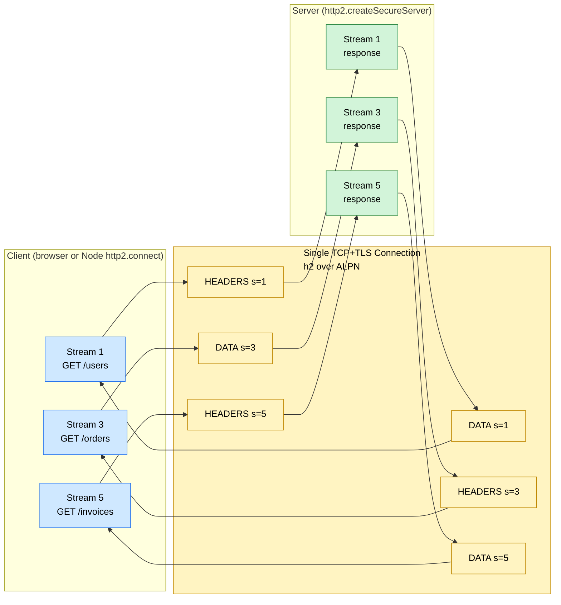
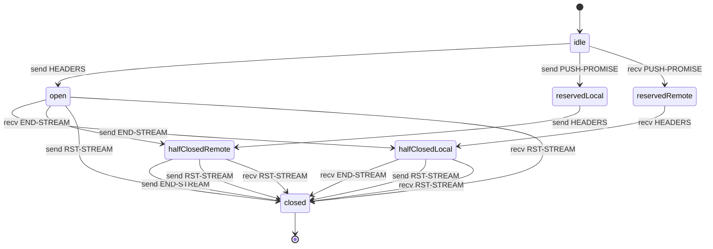
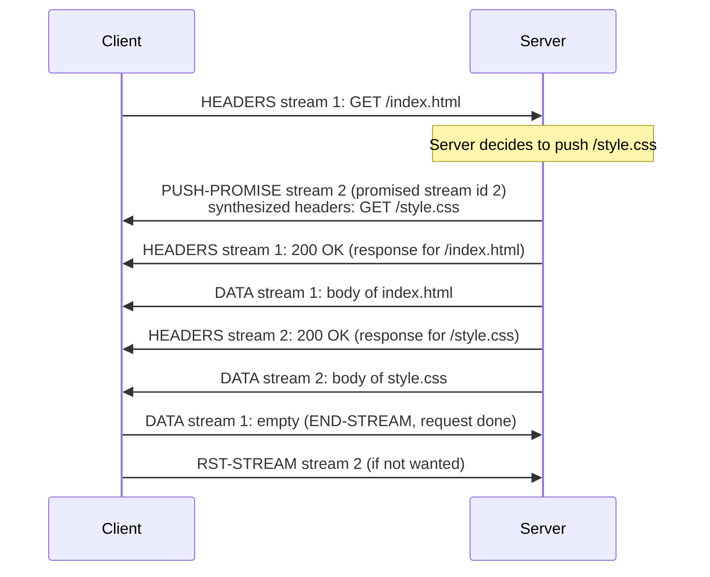
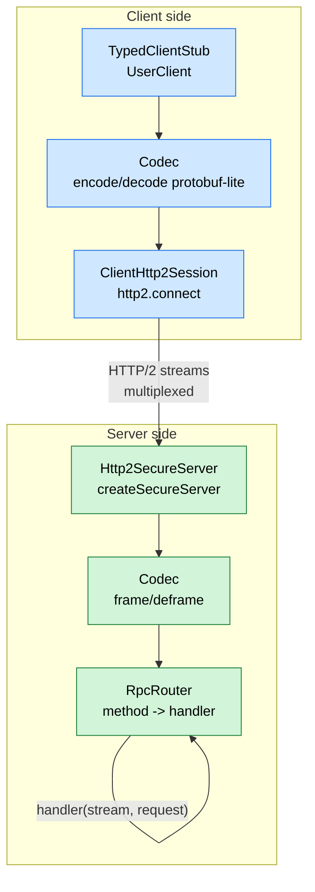

# 3.13 HTTP2 Server Push

> HTTP/2 is HTTP/1.1 with multiple lanes on a single connection, headers that compress, frames that are binary, and a server that can speak before it is spoken to. The multiplexing alone justifies its existence; the server push feature is what got it famous, and also what got it deprecated. This note makes the binary framing layer, HPACK, ALPN, and the streams API in Node's `http2` module so concrete that you can ship a typed HTTP/2 service in production by the end of the page.

## 1. Purpose

HTTP/1.1 has been the workhorse of the web since 1997, and it has been showing its age since about 2010. The protocol is text-based, it requires one TCP connection per request unless you use keep-alive, and even with keep-alive it suffers from head-of-line blocking: on a single connection, the second response cannot start until the first one finishes, so the browser opens six to eight parallel connections per origin to compensate, which wastes TCP handshakes, TLS negotiations, kernel file descriptors, and server memory. Headers are sent in plaintext and repeated in full on every request, so a typical 800-byte cookie plus `User-Agent` plus `Accept` header gets retransmitted verbatim hundreds of times per page load. There is no way for the server to send anything before the client asks for it, so a web page that needs `index.html`, `style.css`, and `app.js` requires three round trips even though the server knew after parsing `index.html` that the other two were coming.

HTTP/2 was published as RFC 7540 in May 2015 (and replaced by RFC 9113 in June 2022) to fix every one of these problems at once. It was based directly on Google's SPDY protocol, which had been in production at Google for five years and had demonstrated real-world latency reductions of 11 to 40 percent on major properties. HTTP/2 introduces a binary framing layer that splits every request and response into a sequence of small, length-prefixed frames. It introduces multiplexing: many independent streams, each identified by an integer stream ID, share one TCP connection, and frames from different streams are interleaved so that no single slow response can block the others. It introduces HPACK (RFC 7541), a dedicated header compression format that uses a static table of 61 common headers, a dynamic table that learns the headers each connection actually uses, and Huffman coding for the residual strings. It introduces server push: the server can send a `PUSH-PROMISE` frame that says "I am about to send you a resource you have not requested yet, here is the request I am pretending you sent me," and then it pushes the response on a new stream. And it introduces flow control at the stream level and the connection level, modeled on TCP's window mechanism, so that a slow consumer on stream 5 does not get drowned by a fast producer on stream 7.

Node's `http2` module provides a complete, production-quality implementation of both the client and server sides of the protocol. It exposes `http2.createServer` (cleartext HTTP/2, known as `h2c`, used in trusted backend-to-backend links where TLS termination happens elsewhere) and `http2.createSecureServer` (HTTP/2 over TLS, known as `h2`, used for browser-facing services). It exposes `http2.connect` for the client side. Every request-response pair becomes an `Http2Stream` object that emits Node-style events (`'headers'`, `'data'`, `'end'`, `'error'`, `'close'`) and that is itself a duplex stream compatible with `pipeline` from `node:stream`. Headers arrive as plain JavaScript objects with lowercased string keys, because HTTP/2 mandates lowercase header names and the `http2` module enforces that for you.

Server push is the part of HTTP/2 that did not survive contact with reality. The idea was elegant: when the client requests `index.html`, the server pushes `style.css` and `app.js` preemptively, saving one round trip per resource. In practice, browsers frequently already had the resource cached, the server had no way to know, and the pushed bytes wasted bandwidth; servers frequently pushed the wrong resources; intermediaries like CDNs often stripped or duplicated pushes; and the Cache-Digests spec that would have let the client tell the server "I already have these hashes" never shipped in browsers. By 2020 every major browser had either removed server push or announced its deprecation. Chrome removed it in version 106 (November 2022). The `http2` module still exposes `stream.pushStream(headers, callback)` because the feature is part of the protocol and non-browser clients (gRPC clients, custom HTTP/2 clients) can still use it, but the note will be explicit throughout: do not push to browsers.

HTTP/3, published as RFC 9114 in June 2022, is the successor. It replaces the TCP transport with QUIC, which runs over UDP and eliminates the head-of-line blocking that HTTP/2 still inherits from TCP (a single lost packet on stream 5 stalls all streams behind it in TCP's send window until retransmission succeeds). HTTP/3 replaces HPACK with QPACK, which is similar in spirit but designed to tolerate out-of-order arrival. Node does not yet ship a stable built-in `http3` module at the time of writing; the relationship between HTTP/2 and HTTP/3 in this note is therefore mostly conceptual, but it is essential background for understanding why HTTP/2 is shaped the way it is.

## 2. Theory and Deep Dive

### 2.1 The Binary Framing Layer

HTTP/1.1 on the wire is text. A request looks like `GET /users/42 HTTP/1.1\r\nHost: api.example.com\r\nAccept: application/json\r\n\r\n`. The parser scans byte by byte for `\r\n` to find header boundaries, then reads until the body length specified by `Content-Length` (or until the connection closes for chunked encoding). The format is human-readable, easy to debug with `curl -v` and `telnet`, but expensive to parse, ambiguous in edge cases (the host of CVEs around request smuggling stems from this), and impossible to multiplex because there is no way to interleave two requests on one connection without delimiters that say "this byte belongs to request A, this byte belongs to request B."

HTTP/2 replaces the text format with a binary framing layer. Every frame has a fixed 9-byte header: 24 bits of length, 8 bits of type, 8 bits of flags, and a 1-byte reserved bit plus 31 bits of stream identifier. The body is opaque bytes whose interpretation depends on the type. The defined frame types are:

- **DATA** (0x0): carries request or response body bytes. Flag `END-STREAM` (0x1) marks the last frame on the stream. Flag `PADDED` (0x8) adds trailing padding bytes to obscure true lengths from passive observers.
- **HEADERS** (0x1): carries a compressed header block (HPACK-encoded). Flags `END-STREAM`, `END-HEADERS` (0x4), `PADDED`, and `PRIORITY` (0x20, deprecated in RFC 9113).
- **PRIORITY** (0x2): stream priority and dependency. Deprecated in RFC 9113, ignored by modern peers, but still emitted by older clients.
- **RST-STREAM** (0x3): abruptly terminate a stream with a 32-bit error code (`NO-ERROR`, `PROTOCOL-ERROR`, `INTERNAL-ERROR`, `FLOW-CONTROL-ERROR`, `SETTINGS-TIMEOUT`, `STREAM-CLOSED`, `FRAME-SIZE-ERROR`, `REFUSED-STREAM`, `CANCEL`, `COMPRESSION-ERROR`, `CONNECT-ERROR`, `ENHANCE-YOUR-CALM`, `INADEQUATE-SECURITY`, `HTTP/1.1 REQUIRED`).
- **SETTINGS** (0x4): connection-level parameters negotiated at startup (maximum concurrent streams, initial window size, maximum frame size, maximum header list size).
- **PUSH-PROMISE** (0x5): the server announces it is about to push a resource on a new stream, with the synthesized request headers.
- **PING** (0x6): a heartbeat with an 8-byte opaque payload; the peer must echo it back.
- **GOAWAY** (0x7): graceful connection shutdown, including the ID of the last stream the sender will process.
- **WINDOW-UPDATE** (0x8): flow control credit grant, at connection or stream level.
- **CONTINUATION** (0x9): used to continue a header block that did not fit in one HEADERS frame.

You almost never see these frame types directly in Node. The `http2` module parses them for you and surfaces them as JavaScript events and method calls. But knowing the frame taxonomy is essential for reading packet captures in Wireshark, understanding the `'frameError'` event on an `Http2Session`, and reasoning about why a stream enters the `RST` state.

### 2.2 Multiplexing

Multiplexing is the headline feature. One TCP connection carries an arbitrary number of independent bidirectional streams. Each stream has a 32-bit identifier. Streams initiated by the client use odd numbers (1, 3, 5, ...). Streams initiated by the server via push use even numbers (2, 4, 6, ...). Stream 0 is reserved for the connection itself (used by SETTINGS, PING, GOAWAY, and connection-level WINDOW-UPDATE).

Because each frame carries a stream ID in its header, the receiver can demultiplex interleaved frames back into per-stream queues. There is no head-of-line blocking at the HTTP layer: a slow response on stream 5 does not prevent frames for stream 7 from being delivered. (There is still head-of-line blocking at the TCP layer, because TCP guarantees in-order delivery; this is the motivation for HTTP/3.)



The default `SETTINGS-MAX-CONCURRENT-STREAMS` is unlimited per RFC 9113, but every implementation imposes a practical limit. Browsers typically allow 100 concurrent streams per connection; Node's `http2` module defaults to 100 on the client side and 4294967295 (effectively unlimited) on the server side, configurable via `maxConcurrentStreams` in the server options. When the limit is reached, additional streams are queued or refused with `REFUSED-STREAM`.

### 2.3 Stream Lifecycle

A stream progresses through a well-defined state machine:



In Node, the state machine is hidden behind the `Http2Stream` object's events. You see `'stream'` (server) or `'response'` (client) when the stream opens, `'data'` as DATA frames arrive, `'end'` when `END-STREAM` is received, `'close'` when the stream is fully torn down, and `'error'` if an `RST-STREAM` or protocol error occurs. You rarely need to think about the state names directly, but they explain why calling `stream.write()` after `stream.end()` raises `ERR-STREAM-WRITE-AFTER-END` and why a `RST-STREAM` from the peer surfaces as an `'error'` event with code `ERR-HTTP2-STREAM-CANCELLED`.

### 2.4 HPACK Header Compression

HPACK (RFC 7541) is the second big win. Every HTTP/1.1 request re-sends the full `User-Agent`, `Accept`, `Accept-Encoding`, `Accept-Language`, `Cookie`, and other headers verbatim. A modern web request can carry 1.5 KB of headers; multiplied by 100 requests per page load, that is 150 KB of overhead before any body bytes are sent.

HPACK compresses headers using three mechanisms working together:

1. **Static table.** A fixed table of 61 common header-field entries (RFC 7541 Appendix A), including `:method GET`, `:method POST`, `:path /`, `:scheme https`, `:status 200`, `:status 404`, `accept-encoding`, `cache-control`, `cookie`, `user-agent`, and so on. Each entry has an index. To send `:method: GET` you emit a single byte that says "static table entry 2."
2. **Dynamic table.** A per-connection, sliding-window table (default 4096 bytes, configurable via `SETTINGS-HEADER-TABLE-SIZE`) of header-field entries the connection has actually seen. After the client sends `user-agent: Mozilla/5.0 (...)`, the entry is inserted into the dynamic table; the next request that sends the same `user-agent` is one byte ("dynamic table entry 62").
3. **Huffman coding.** Residual strings that are not in either table (an `x-request-id` UUID, a per-request `cookie` value) are encoded with a static Huffman tree tuned for the byte frequencies observed in real HTTP traffic. ASCII alphanumeric characters and common header-value punctuation compress to roughly 5 to 7 bits per character; binary or rare bytes use longer codes.

A typical second request on a connection compresses to 100 to 300 bytes of HPACK where the equivalent HTTP/1.1 would be 1.5 KB. The savings are dramatic on mobile and on high-RTT links.

Node's `http2` module handles HPACK internally via a binding to `nghttp2`, the canonical C implementation. You send headers as a JavaScript object; you receive headers as a JavaScript object; you never see the compressed form unless you capture packets.

### 2.5 Server Push

Server push is the most-touted and least-surviving HTTP/2 feature. The flow is:



The client can refuse a push by sending `RST-STREAM` on the promised stream ID immediately after receiving the `PUSH-PROMISE`. Browsers do this for every push if they have already cached the resource, which is one of the reasons pushes frequently waste bandwidth.

In Node, the API is `stream.pushStream(headers, options, callback)`. The `headers` are the synthesized request headers (the request the server pretends the client sent). The `callback` receives an `Http2Stream` for the pushed response; you write to it exactly as you would to the parent stream.

Node's documentation still shows this API as supported, and it is, but every production note in this section will say: do not push to browsers, because they have removed support. Push remains useful for non-browser HTTP/2 clients (gRPC clients, service-to-service calls where the caller knows it wants the linked resources) and for proxy caches that understand push.

### 2.6 ALPN Protocol Negotiation

TLS 1.2 and later include the Application-Layer Protocol Negotiation (ALPN) extension, defined in RFC 7301. During the TLS handshake, the client sends a `ClientHello` that includes an `application-layer-protocol-negotiation` extension listing the protocols it supports, in preference order. For a modern browser this is typically `["h2", "http/1.1"]`. The server inspects the list, picks the most-preferred protocol it also supports, and includes that single protocol in its `ServerHello`. After the handshake completes, both sides know which application protocol they are speaking.

Without ALPN, the only way to negotiate HTTP/2 over TLS would be the now-deprecated NPN (Next Protocol Negotiation) extension, which SPDY used. ALPN replaced NPN in 2015 and is mandatory for HTTP/2 over TLS per RFC 9113.

In Node, ALPN is exposed as the `ALPNProtocols` option on `tls.createSecureContext`, and the `http2.createSecureServer` function sets it to `["h2", "http/1.1"]` automatically when you also provide an `allowHTTP1: true` option. The server then handles both HTTP/2 and HTTP/1.1 over the same port, dispatching to the appropriate handler based on what was negotiated. This is the standard production deployment: port 443 speaks h2 to modern clients and http/1.1 to old ones.

If ALPN negotiation fails (the server requires h2 but the client only offers http/1.1, or the server's certificate chain is invalid and the handshake never reaches ALPN, or a middlebox strips the extension), the connection either falls back to HTTP/1.1 or is aborted. Diagnosing ALPN failures is a common production task and is covered in Section 9 Exercise 4.

### 2.7 The Node `http2` Module Surface

The relevant public API surface for production work:

- `http2.createServer(options?, handler?)` returns an `Http2Server` speaking `h2c` (cleartext). Browsers do not support `h2c`, so this is for backend-to-backend only.
- `http2.createSecureServer(options, handler?)` returns an `Http2SecureServer` speaking `h2` over TLS, with optional fallback to `http/1.1` when `options.allowHTTP1` is `true`.
- `http2.connect(authority, options?, handler?)` returns an `Http2Session` (the client) with methods `.request(headers, options)` (returns a `ClientHttp2Stream`), `.close()`, `.destroy()`, `.ping()`, `.settings()`, `.ref()`/`.unref()`.
- `Http2Server` emits `'session'` (new session established), `'stream'` (new stream on a session, alternative to passing a request handler), `'checkContinue'`, and `'error'`.
- `Http2Session` emits `'connect'`, `'stream'`, `'close'`, `'error'`, `'goaway'`, `'frameError'`, `'ping'`, `'timeout'`, `'origin'`, `'remoteSettings'`, `'localSettings'`.
- `Http2Stream` is a duplex stream. It emits `'headers'`, `'trailers'`, `'push'`, `'response'`, `'close'`, `'error'`, and the standard stream events. It exposes `.respond(headers, options)`, `.respondWithFD(fd, headers, options)`, `.respondWithFile(path, headers, options)`, `.end()`, `.close(code)`, `.priority(options)`.
- `ServerHttp2Stream` adds `.pushStream(headers, options?, callback)`.
- `Http2ServerRequest` and `Http2ServerResponse` are available when you use the request-handler style. They mimic the `http` module's `IncomingMessage` and `ServerResponse` so most HTTP/1.1 code ports with minimal changes, but they expose the underlying stream via `req.stream` and `res.stream`.
- `http2.sensitiveHeaders` is a symbol you use to mark specific headers as "never index" so HPACK will not put them in the dynamic table. Use it for `Authorization`, `Cookie`, `Set-Cookie`, and other sensitive headers.

### 2.8 Relationship to HTTP/1.1 and HTTP/3

| Aspect | HTTP/1.1 | HTTP/2 | HTTP/3 |
| --- | --- | --- | --- |
| Wire format | Text, newline-delimited | Binary, length-prefixed frames | Binary, QUIC packets |
| Transport | TCP | TCP | QUIC over UDP |
| Multiplexing | None (one request per connection, or pipelining which nobody uses) | Yes, multiple streams per connection | Yes, multiple streams per QUIC connection |
| Head-of-line blocking | At HTTP layer (sequential responses) | Eliminated at HTTP layer, retained at TCP layer | Eliminated at both layers |
| Header compression | None (plaintext, repeated) | HPACK (static + dynamic tables + Huffman) | QPACK (similar, tolerates out-of-order) |
| Server push | Not in spec | Specified, deprecated in browsers | Removed from spec |
| Encryption | Optional (HTTPS is HTTP/1.1 over TLS) | Effectively mandatory (browsers require TLS for h2) | Mandatory (QUIC is always encrypted) |
| Negotiation | None (assume HTTP/1.1) | ALPN in TLS handshake | ALPN-equivalent in QUIC handshake |

HTTP/3 is the future, but HTTP/2 is the present. Every major CDN, every modern browser, every gRPC client, and every Kubernetes ingress controller speaks HTTP/2 today. HTTP/3 deployment is growing but is still a minority of traffic. The skills, mental models, and debugging techniques you learn for HTTP/2 transfer directly to HTTP/3 with a transport-layer swap.

## 3. Mental Models

**HTTP/2 is HTTP/1.1 with multiple lanes on one connection.** The semantics (methods, status codes, headers, bodies) are identical. What changed is the transport: where HTTP/1.1 puts one request-response on one connection (or six, in parallel, via browser connection pooling), HTTP/2 puts a hundred on one connection by interleaving small binary frames tagged with a stream ID.

**Multiplexing is "send many requests in parallel without head-of-line blocking at the HTTP layer."** The browser (or your Node client) opens one TCP+TLS connection and then fires off 50 GETs simultaneously. The server processes them concurrently and writes responses back as they finish, interleaved on the wire. There is still TCP-layer head-of-line blocking (a lost packet stalls the whole TCP send window), but the HTTP layer is unblocked.

**HPACK is "compress repeated headers."** The first request on a connection sends full headers and they enter the dynamic table; the next request that sends the same headers is a one-byte index. On a warm connection, headers compress to 5 to 10 percent of their plaintext size.

**Server push is "the server guesses what you will need next and sends it preemptively."** Historically useful for assets linked from HTML, now deprecated in browsers because the server guesses wrong too often and the client cannot efficiently tell the server what it already has. Still useful for non-browser clients that explicitly opt in.

**ALPN is "client and server agree on h2 or http/1.1 during the TLS handshake."** It happens in the first round trip, before any HTTP bytes flow. Without ALPN, there is no h2 over TLS.

**The `http2` module is "the `http` and `https` modules with a different transport underneath."** Most request-handler code looks identical. The differences are: header names are lowercased, you can push streams, you can do per-stream flow control, and you cannot rely on connection-level behavior (one request per connection is no longer true).

**An HTTP/2 stream is not a Node stream.** An HTTP/2 stream is a logical bidirectional channel for one request-response pair, identified by an integer stream ID, multiplexed over a TCP connection. A Node `Http2Stream` is a JavaScript object that implements the Node duplex stream interface and that wraps one HTTP/2 stream. The two concepts are related but not identical: the HTTP/2 stream is a wire-level concept, the Node `Http2Stream` is an in-process object that exposes it.

**HTTP/3 is "HTTP/2 with QUIC instead of TCP."** The semantic layer (streams, headers, multiplexing) is almost unchanged. The transport layer (QUIC) eliminates TCP head-of-line blocking, makes connection setup one round trip including TLS, and survives IP address changes (mobile network handoff) gracefully.

## 4. Real-World Use Cases

**High-traffic public APIs.** A REST API serving a mobile application typically sees 20 to 40 micro-requests per screen (one for the user, one for the avatar, one for the activity feed, one for the notification count, and so on). On HTTP/1.1 the client opens six TCP+TLS connections per origin and queues requests on them, paying about 100 milliseconds of handshake overhead per connection on a typical mobile network. On HTTP/2 the client opens one connection and fires all 40 requests in parallel; the handshake is paid once, and the requests finish in roughly one round trip instead of seven.

**gRPC.** gRPC is Google's RPC framework, used heavily in microservice architectures. It speaks HTTP/2 exclusively. Every gRPC call is one HTTP/2 stream on a long-lived connection; a unary RPC is one HEADERS frame (request), one HEADERS frame (response), and zero or more DATA frames (the protobuf body). Streaming RPCs (server-streaming, client-streaming, bidi-streaming) are HTTP/2 streams that stay open for many DATA frames. Without HTTP/2's multiplexing, gRPC would need a connection pool and would not be able to do bidi streaming at all. The `@grpc/grpc-js` package is built directly on Node's `http2` module.

**Reverse proxies and load balancers.** nginx, HAProxy, Envoy, and Traefik all support HTTP/2 on the front end (browser-to-proxy) and HTTP/2 on the back end (proxy-to-upstream). nginx historically spoke HTTP/1.1 to upstreams even when the front end was h2, but the `http2` upstream support landed in nginx 1.13.9 and is now standard. The benefit of h2 to upstream is the same multiplexing: the proxy can fan out 50 sub-requests to one backend over one connection, instead of opening 50 connections.

**Mobile applications.** Mobile networks are high-latency (100 to 400 ms RTT), lossy, and bandwidth-constrained. HPACK's header compression saves 1 to 2 KB per request on a warm connection, which is a meaningful fraction of a typical 5 KB JSON response. The single-connection model also saves battery: every TCP handshake and TLS negotiation wakes the radio, and radios take 1 to 2 seconds to return to idle, so consolidating 50 requests onto one connection has measurable battery impact.

**Internal service meshes.** Linkerd, Istio, and Consul Connect all speak HTTP/2 between sidecars. The mTLS termination happens at the sidecar, and the application speaks plaintext h2c to its local sidecar. This is one of the few legitimate production uses of `http2.createServer` (h2c, no TLS): the sidecar handles TLS, and the application trusts its localhost link.

**Server-Sent Events and WebSockets.** Server-Sent Events (SSE) work natively over HTTP/2 because the server can hold a stream open indefinitely and write DATA frames as events arrive. HTTP/2's multiplexing means many SSE streams can share one connection without exhausting the browser's per-origin connection limit. WebSockets over HTTP/2 (RFC 8441) is specified but not yet widely implemented in browsers; the WebSocket upgrade mechanism is the same as HTTP/1.1's `Upgrade` header, extended with the `:protocol` pseudo-header.

**Asset delivery (formerly server push, now preload).** The use case server push was designed for (push CSS and JS with the HTML) is now served by the `<link rel="preload">` header. The server includes `Link: </style.css>; rel=preload; as=style` in the HTML response headers, and the browser fetches the asset with high priority as soon as it parses the link. This achieves the round-trip savings of server push without the bandwidth waste of pushing resources the client already has.

**HTTP/2 in Node specifically.** The module is stable, production-quality, and used by every major Node framework that needs multiplexing (gRPC, Fastify's h2 plugin, NestJS microservices with the gRPC transport, Apollo Server's subscription transport over h2). For browser-facing servers, you typically terminate h2 at nginx or a CDN and speak HTTP/1.1 to Node, because nginx's h2 implementation is more battle-tested for the weird edge cases of real browser traffic. For service-to-service Node, h2 or h2c directly from Node is the right choice.

## 5. Code Examples

### 5.1 Example A — Minimal and Conceptual

A minimal HTTP/2 server that responds with "hello, h2" and a minimal client that fetches it. The server uses `createSecureServer` because h2c is unsupported by browsers; for the local self-signed cert we generate one inline.

```js
// JavaScript — server.js
const http2 = require('node:http2');
const fs = require('node:fs');
const { selfsigned } = require('selfsigned'); // or any local cert helper

const cert = selfsigned.generate(null, { keySize: 2048, days: 365 });
const server = http2.createSecureServer({
  key: cert.private,
  cert: cert.cert,
  allowHTTP1: true,
});

server.on('stream', (stream, headers) => {
  const method = headers[':method'];
  const path = headers[':path'];
  stream.respond({
    'content-type': 'text/plain; charset=utf-8',
    ':status': 200,
  });
  stream.end(`hello from h2\n${method} ${path}\n`);
});

server.listen(8443, () => {
  console.log('h2 server listening on https://localhost:8443');
});

server.on('error', (err) => {
  console.error('server error', err);
});
```

```ts
// TypeScript — server.ts
import http2 from 'node:http2';
import fs from 'node:fs';
import { selfsigned } from 'selfsigned';

interface CertBundle {
  private: string;
  cert: string;
}

const cert: CertBundle = selfsigned.generate(null, {
  keySize: 2048,
  days: 365,
});

const server: http2.Http2SecureServer = http2.createSecureServer({
  key: cert.private,
  cert: cert.cert,
  allowHTTP1: true,
});

server.on('stream', (stream: http2.ServerHttp2Stream, headers: http2.IncomingHttpHeaders) => {
  const method = headers[':method'] as string;
  const path = headers[':path'] as string;
  stream.respond({
    'content-type': 'text/plain; charset=utf-8',
    ':status': 200,
  });
  stream.end(`hello from h2\n${method} ${path}\n`);
});

server.listen(8443, () => {
  console.log('h2 server listening on https://localhost:8443');
});

server.on('error', (err: NodeJS.ErrnoException) => {
  console.error('server error', err);
});
```

```js
// JavaScript — client.js
const http2 = require('node:http2');

const session = http2.connect('https://localhost:8443', {
  rejectUnauthorized: false, // self-signed
});

session.on('error', (err) => console.error('session error', err));

const req = session.request({
  ':method': 'GET',
  ':path': '/users/42',
  'accept': 'application/json',
});

let body = '';
req.setEncoding('utf8');
req.on('data', (chunk) => (body += chunk));
req.on('end', () => {
  console.log('status:', req.responseCode);
  console.log('headers:', req.responseHeaders);
  console.log('body:', body);
  session.close();
});

req.end();
```

```ts
// TypeScript — client.ts
import http2 from 'node:http2';

const session: http2.ClientHttp2Session = http2.connect('https://localhost:8443', {
  rejectUnauthorized: false,
});

session.on('error', (err: NodeJS.ErrnoException) => console.error('session error', err));

const req: http2.ClientHttp2Stream = session.request({
  ':method': 'GET',
  ':path': '/users/42',
  accept: 'application/json',
});

let body = '';
req.setEncoding('utf8');
req.on('data', (chunk: string) => (body += chunk));
req.on('end', () => {
  console.log('status:', req.responseCode);
  console.log('headers:', req.responseHeaders);
  console.log('body:', body);
  session.close();
});

req.end();
```

A side-by-side of the request-handler style (which mimics the `http` module) versus the stream-event style:

```js
// JavaScript — request-handler style
const server = http2.createSecureServer({ key, cert });

server.on('request', (req, res) => {
  // req is Http2ServerRequest, res is Http2ServerResponse
  // they mimic http.IncomingMessage and http.ServerResponse
  res.writeHead(200, { 'content-type': 'text/plain' });
  res.end(`you asked for ${req.url}\n`);
});

server.listen(8443);
```

```ts
// TypeScript — request-handler style
import http2 from 'node:http2';

const server = http2.createSecureServer({ key, cert });

server.on('request', (req: http2.Http2ServerRequest, res: http2.Http2ServerResponse) => {
  res.writeHead(200, { 'content-type': 'text/plain' });
  res.end(`you asked for ${req.url}\n`);
});

server.listen(8443);
```

A demonstration of server push (educational; do not push to browsers):

```js
// JavaScript — pushStream demo
server.on('stream', (stream, headers) => {
  if (headers[':path'] === '/index.html') {
    stream.pushStream({ ':path': '/style.css' }, (err, pushStream) => {
      if (err) { stream.respond({ ':status': 500 }); stream.end('push failed'); return; }
      pushStream.respond({ 'content-type': 'text/css', ':status': 200 });
      pushStream.end('body { color: rebeccapurple; }');
    });
    stream.respond({ 'content-type': 'text/html', ':status': 200 });
    stream.end('<link rel="stylesheet" href="/style.css"><h1>hi</h1>');
  }
});
```

```ts
// TypeScript — pushStream demo
import http2 from 'node:http2';

server.on('stream', (stream: http2.ServerHttp2Stream, headers: http2.IncomingHttpHeaders) => {
  if (headers[':path'] === '/index.html') {
    stream.pushStream({ ':path': '/style.css' }, (err?: Error | null, pushStream?: http2.ServerHttp2Stream) => {
      if (err || !pushStream) {
        stream.respond({ ':status': 500 });
        stream.end('push failed');
        return;
      }
      pushStream.respond({ 'content-type': 'text/css', ':status': 200 });
      pushStream.end('body { color: rebeccapurple; }');
    });
    stream.respond({ 'content-type': 'text/html', ':status': 200 });
    stream.end('<link rel="stylesheet" href="/style.css"><h1>hi</h1>');
  }
});
```

### 5.2 Example B — Production-Grade

A typed HTTP/2 API server that: terminates h2 with a real certificate, falls back to HTTP/1.1 for legacy clients, multiplexes multiple concurrent requests, streams a large response with backpressure-safe writes, marks sensitive headers as never-indexed, gracefully handles stream errors, and exposes a typed client that demonstrates multiplexing (five parallel requests on one session).

```js
// JavaScript — apiServer.js
const http2 = require('node:http2');
const fs = require('node:fs');
const { pipeline } = require('node:stream/promises');

const PORT = 8443;
const keyPath = process.env.tlsKeyPath || './certs/key.pem';
const certPath = process.env.tlsCertPath || './certs/cert.pem';

const server = http2.createSecureServer({
  key: fs.readFileSync(keyPath),
  cert: fs.readFileSync(certPath),
  allowHTTP1: true,
  maxConcurrentStreams: 256,
  maxSessionMemory: 100, // MB per session
  settings: {
    maxConcurrentStreams: 256,
    maxFrameSize: 1 << 14, // 16 KB
    maxHeaderListSize: 1 << 16, // 64 KB
  },
});

// Route table
const routes = new Map([
  ['/health', handleHealth],
  ['/users/:id', handleUser],
  ['/stream/logs', handleLogStream],
]);

server.on('stream', async (stream, headers) => {
  const method = headers[':method'];
  const path = headers[':path'] || '/';
  const routePath = path.split('?')[0];
  const handler = matchRoute(routePath);
  if (!handler) {
    respondJson(stream, 404, { error: 'not found', path });
    return;
  }
  try {
    await handler(stream, headers, { method, path: routePath });
  } catch (err) {
    if (!stream.destroyed) {
      respondJson(stream, 500, { error: 'internal', message: String(err.message) });
    }
    // close with INTERNAL-ERROR (numeric code 2 in nghttp2)
    stream.close(2);
  }
});

server.on('sessionError', (err) => console.error('session error', err));
server.on('error', (err) => console.error('server error', err));

server.listen(PORT, () => {
  console.log(`h2 api server listening on https://localhost:${PORT}`);
});

function matchRoute(path) {
  if (routes.has(path)) return routes.get(path);
  // naive /users/:id matcher
  const m = path.match(/^\/users\/(\d+)$/);
  if (m) return (stream, headers, ctx) => handleUser(stream, headers, { ...ctx, id: m[1] });
  return null;
}

function respondJson(stream, status, body) {
  const payload = Buffer.from(JSON.stringify(body));
  stream.respond({
    ':status': status,
    'content-type': 'application/json; charset=utf-8',
    'content-length': payload.length,
    [http2.sensitiveHeaders]: ['content-length'],
  });
  stream.end(payload);
}

async function handleHealth(stream, headers, ctx) {
  respondJson(stream, 200, { ok: true, uptime: process.uptime() });
}

async function handleUser(stream, headers, ctx) {
  // simulate db lookup
  const user = { id: Number(ctx.id), name: 'Ada Lovelace', email: 'ada@example.com' };
  respondJson(stream, 200, user);
}

async function handleLogStream(stream, headers, ctx) {
  // stream a large log file with backpressure-safe piping
  stream.respond({
    ':status': 200,
    'content-type': 'text/plain; charset=utf-8',
  });
  const src = fs.createReadStream('./logs/app.log');
  try {
    await pipeline(src, stream);
  } catch (err) {
    console.error('log stream pipeline failed', err);
  }
}
```

```ts
// TypeScript — apiServer.ts
import http2, { constants } from 'node:http2';
import fs from 'node:fs';
import { pipeline } from 'node:stream/promises';
import type { Readable } from 'node:stream';

interface RouteContext {
  method: string;
  path: string;
  id?: string;
}

type RouteHandler = (
  stream: http2.ServerHttp2Stream,
  headers: http2.IncomingHttpHeaders,
  ctx: RouteContext,
) => Promise<void> | void;

const PORT: number = Number(process.env.PORT) || 8443;
const keyPath: string = process.env.tlsKeyPath || './certs/key.pem';
const certPath: string = process.env.tlsCertPath || './certs/cert.pem';

const server: http2.Http2SecureServer = http2.createSecureServer({
  key: fs.readFileSync(keyPath),
  cert: fs.readFileSync(certPath),
  allowHTTP1: true,
  maxConcurrentStreams: 256,
  maxSessionMemory: 100,
  settings: {
    maxConcurrentStreams: 256,
    maxFrameSize: 1 << 14,
    maxHeaderListSize: 1 << 16,
  },
});

const routes = new Map<string, RouteHandler>([
  ['/health', handleHealth],
]);

const paramRoutes: Array<{ pattern: RegExp; build: (m: RegExpMatchArray) => RouteHandler }> = [
  {
    pattern: /^\/users\/(\d+)$/,
    build: (m) => (stream, headers, ctx) =>
      handleUser(stream, headers, { ...ctx, id: m[1] }),
  },
];

server.on('stream', async (stream: http2.ServerHttp2Stream, headers: http2.IncomingHttpHeaders) => {
  const method = String(headers[':method'] || 'GET');
  const path = String(headers[':path'] || '/');
  const routePath = path.split('?')[0];

  let handler: RouteHandler | null = routes.get(routePath) ?? null;
  if (!handler) {
    for (const r of paramRoutes) {
      const m = routePath.match(r.pattern);
      if (m) { handler = r.build(m); break; }
    }
  }

  if (!handler) {
    respondJson(stream, 404, { error: 'not found', path });
    return;
  }

  try {
    await handler(stream, headers, { method, path: routePath });
  } catch (err) {
    const message = err instanceof Error ? err.message : String(err);
    if (!stream.destroyed) {
      respondJson(stream, 500, { error: 'internal', message });
    }
    // close with INTERNAL-ERROR (numeric code 2 in nghttp2)
    stream.close(2);
  }
});

server.on('sessionError', (err: NodeJS.ErrnoException) => console.error('session error', err));
server.on('error', (err: NodeJS.ErrnoException) => console.error('server error', err));

server.listen(PORT, () => {
  console.log(`h2 api server listening on https://localhost:${PORT}`);
});

function respondJson(stream: http2.ServerHttp2Stream, status: number, body: unknown): void {
  const payload = Buffer.from(JSON.stringify(body));
  const responseHeaders: http2.OutgoingHttpHeaders = {
    ':status': status,
    'content-type': 'application/json; charset=utf-8',
    'content-length': payload.length,
  };
  // mark sensitive headers so HPACK will not index them
  (responseHeaders as any)[http2.sensitiveHeaders] = ['content-length'];
  stream.respond(responseHeaders);
  stream.end(payload);
}

async function handleHealth(stream: http2.ServerHttp2Stream): Promise<void> {
  respondJson(stream, 200, { ok: true, uptime: process.uptime() });
}

async function handleUser(stream: http2.ServerHttp2Stream, headers: http2.IncomingHttpHeaders, ctx: RouteContext): Promise<void> {
  const user = { id: Number(ctx.id), name: 'Ada Lovelace', email: 'ada@example.com' };
  respondJson(stream, 200, user);
}

async function handleLogStream(stream: http2.ServerHttp2Stream): Promise<void> {
  stream.respond({ ':status': 200, 'content-type': 'text/plain; charset=utf-8' });
  const src: Readable = fs.createReadStream('./logs/app.log');
  try {
    await pipeline(src, stream);
  } catch (err) {
    console.error('log stream pipeline failed', err);
  }
}
```

A typed client demonstrating multiplexing: five parallel requests on one session, all results collected via `Promise.all`.

```js
// JavaScript — apiClient.js
const http2 = require('node:http2');

async function fetchAll() {
  const session = http2.connect('https://localhost:8443', { rejectUnauthorized: false });
  session.on('error', (err) => console.error('session error', err));

  const requests = [
    { method: 'GET', path: '/health' },
    { method: 'GET', path: '/users/1' },
    { method: 'GET', path: '/users/2' },
    { method: 'GET', path: '/users/3' },
    { method: 'GET', path: '/users/4' },
  ];

  // All five requests share the one session; the underlying TCP+TLS
  // connection multiplexes them as five HTTP/2 streams.
  const responses = await Promise.all(requests.map((r) => doRequest(session, r)));
  session.close();
  return responses;
}

function doRequest(session, { method, path }) {
  return new Promise((resolve, reject) => {
    const req = session.request({ ':method': method, ':path': path });
    const chunks = [];
    req.on('data', (c) => chunks.push(c));
    req.on('end', () => {
      resolve({
        status: req.responseCode,
        headers: req.responseHeaders,
        body: Buffer.concat(chunks).toString('utf8'),
      });
    });
    req.on('error', reject);
    req.end();
  });
}

fetchAll().then((r) => console.log(JSON.stringify(r, null, 2)));
```

```ts
// TypeScript — apiClient.ts
import http2 from 'node:http2';

interface RequestOptions {
  method: string;
  path: string;
}

interface ResponsePayload {
  status: number | undefined;
  headers: http2.IncomingHttpHeaders;
  body: string;
}

async function fetchAll(): Promise<ResponsePayload[]> {
  const session = http2.connect('https://localhost:8443', { rejectUnauthorized: false });
  session.on('error', (err: NodeJS.ErrnoException) => console.error('session error', err));

  const requests: RequestOptions[] = [
    { method: 'GET', path: '/health' },
    { method: 'GET', path: '/users/1' },
    { method: 'GET', path: '/users/2' },
    { method: 'GET', path: '/users/3' },
    { method: 'GET', path: '/users/4' },
  ];

  const responses = await Promise.all(requests.map((r) => doRequest(session, r)));
  session.close();
  return responses;
}

function doRequest(session: http2.ClientHttp2Session, opts: RequestOptions): Promise<ResponsePayload> {
  return new Promise((resolve, reject) => {
    const req = session.request({ ':method': opts.method, ':path': opts.path });
    const chunks: Buffer[] = [];
    req.on('data', (c: Buffer) => chunks.push(c));
    req.on('end', () => {
      resolve({
        status: req.responseCode,
        headers: req.responseHeaders,
        body: Buffer.concat(chunks).toString('utf8'),
      });
    });
    req.on('error', reject);
    req.end();
  });
}

fetchAll().then((r) => console.log(JSON.stringify(r, null, 2)));
```

A side-by-side of the `request`-handler style with the same multiplexed client (showing the API parity with the `http` module):

```js
// JavaScript — parity check
// http2 server request handler looks almost identical to http
const server = http2.createSecureServer({ key, cert });
server.on('request', (req, res) => {
  // req.headers is lowercased
  // req.httpVersion === '2.0'
  // req.stream is the underlying Http2Stream
  res.stream.additionalHeaders({ 'x-trace-id': 'abc' });
  res.writeHead(200, { 'content-type': 'application/json' });
  res.end(JSON.stringify({ ok: true }));
});
```

```ts
// TypeScript — parity check
const server = http2.createSecureServer({ key, cert });
server.on('request', (req: http2.Http2ServerRequest, res: http2.Http2ServerResponse) => {
  // req.httpVersion is '2.0' for h2, '1.1' for fallback
  if (req.httpVersion === '2.0') {
    res.stream.additionalHeaders({ 'x-trace-id': 'abc' });
  }
  res.writeHead(200, { 'content-type': 'application/json' });
  res.end(JSON.stringify({ ok: true }));
});
```

## 6. Common Mistakes and Anti-Patterns

**Mistake 1 — Using `http2.createServer` (h2c) for browser-facing traffic.** Browsers do not support cleartext HTTP/2. They will fall back to HTTP/1.1 over the same port, which means you accidentally serve HTTP/1.1 with the `http2` module's request-handler shape, and everything appears to work until you measure latency and realize there is no multiplexing. Always use `http2.createSecureServer` for browser-facing work; reserve `createServer` for trusted backend-to-backend links where TLS is terminated by a sidecar or proxy.

**Mistake 2 — Expecting server push to work in browsers.** Chrome removed server push in version 106. Firefox and Safari never fully shipped it or have removed it. Calling `stream.pushStream` will succeed on the server side, the `PUSH-PROMISE` frame will be sent, and the browser will respond with `RST-STREAM` (or silently discard it). Your server logs will show pushes happening; your users will see no benefit. Use `<link rel="preload">` or `Link: <...>; rel=preload` headers instead.

**Mistake 3 — Confusing HTTP/2 streams with Node streams.** An HTTP/2 stream is a wire-level bidirectional channel identified by an integer stream ID. A Node `Http2Stream` is a JavaScript object that implements the Node duplex stream interface and that wraps one HTTP/2 stream. Saying "the stream is closed" is ambiguous: do you mean the HTTP/2 stream received `END-STREAM`, or that the Node `Http2Stream` emitted `'close'`? They usually coincide, but a `RST-STREAM` from the peer causes the Node object's `'error'` event followed by `'close'`, while a clean shutdown causes only `'end'` then `'close'`. Always specify which kind of stream you mean in code review comments.

**Mistake 4 — Not handling the `'error'` event on sessions and streams.** Node streams implement `EventEmitter`; if `'error'` is emitted with no listener, the process crashes with an unhandled exception. HTTP/2 streams and sessions emit `'error'` on protocol violations, peer resets, TLS errors, and timeout. Always register an `'error'` listener on `server`, on every `session`, and on every `stream` you create. The production code in Section 5.2 does this; the minimal example in 5.1 does it on the session only because the request is short-lived.

**Mistake 5 — Certificate issues that break ALPN.** HTTP/2 over TLS requires the `ALPNProtocols` extension in the TLS handshake, and the certificate must be valid (or the client must opt out of verification). Common symptoms: `ERR-HTTP2-ERROR` on session creation, `ECONNRESET` on the client, or a silent fallback to HTTP/1.1 because `allowHTTP1` swallowed the ALPN failure. Always verify the server actually advertises h2 over ALPN by connecting with a Node TLS client that sets `ALPNProtocols: ['h2']` and reading `socket.alpnProtocol` after the handshake. See Exercise 9.4 for the full diagnostic flow.

**Mistake 6 — Falling back to HTTP/1.1 silently when you needed h2.** If `allowHTTP1: true` is set on the server and ALPN picks `http/1.1` (because the client only offered it, or because the certificate chain is invalid and the renegotiation failed), your code that calls `stream.pushStream` or relies on multiplexing will silently not work. Always check `req.httpVersion === '2.0'` in the handler if you depend on h2 features, and either reject the request or fall back to a non-push code path explicitly.

**Mistake 7 — Setting `maxConcurrentStreams` too low on the client.** The default client setting is 100 concurrent streams per session, which is fine for most workloads. If you set it lower (for example, to throttle yourself), you will see requests queue behind the limit and latency will increase. If you set it higher than the server allows, the server will refuse excess streams with `REFUSED-STREAM` and you will need to retry, which adds latency.

**Mistake 8 — Sending uppercase header names.** HTTP/2 mandates lowercase header names. The `http2` module lowercases them for you on the way out, but if you call `stream.additionalHeaders({ 'X-Custom-Header': 'value' })` it will be sent as `x-custom-header`. Code that compares headers case-sensitively on the receiving side will break. Always compare with `headers['x-custom-header']` (lowercase) and never assume case preservation.

**Mistake 9 — Not using `http2.sensitiveHeaders` for cookies and authorization.** HPACK's dynamic table caches header values to compress them. If you send `Authorization: Bearer <token>` and the token ends up in the dynamic table, a subsequent request that sends a different `Authorization` will still leak the first token through the table until it is evicted. Mark sensitive headers with `[http2.sensitiveHeaders]: ['authorization', 'cookie']` so they are never inserted into the dynamic table. The cost is a few extra bytes per request; the benefit is no token leakage.

**Mistake 10 — Forgetting to `session.close()` on the client.** A client `Http2Session` keeps the underlying socket open until it is explicitly closed or the server sends `GOAWAY`. A long-running process that creates sessions without closing them will leak file descriptors and memory. Always call `session.close()` after you are done with a session, or `session.destroy()` if you need an immediate teardown. For one-shot clients, `session.close()` after the last response is fine; for connection pools, use a timer-based idle eviction.

## 7. Best Practices and Design Patterns

**Use `http2.createSecureServer` for browser-facing work.** Browsers require TLS for h2; there is no `h2c` in browsers. Set `allowHTTP1: true` so legacy clients (curl older than 7.47, embedded HTTP clients, monitoring agents) still get a response. The single port speaks both protocols via ALPN.

**Do not rely on server push.** Use `<link rel="preload">` in HTML, or `Link: <...>; rel=preload` response headers, to hint to the browser that it should fetch a resource with high priority. This gives you the round-trip savings of push without the bandwidth waste of pushing cached resources. Reserve `pushStream` for non-browser clients that explicitly opt in via a custom header like `x-accept-push: 1`.

**Embrace multiplexing for parallel requests.** On the client side, open one `Http2Session` per origin and reuse it for all requests. Fire requests in parallel with `Promise.all`. Do not open multiple sessions per origin unless you have a specific reason (the server's `maxConcurrentStreams` is too low for your workload, or you want to spread load across CPU cores via multiple sessions per worker).

**Set proper headers, lowercased and minimal.** HTTP/2 forbids uppercase header names and certain HTTP/1.1-only headers (`Connection`, `Keep-Alive`, `Proxy-Connection`, `Transfer-Encoding`, `Upgrade`). The `http2` module strips these silently on the way out, but it is better to not set them in the first place. Use `:status` instead of `statusCode` in `stream.respond`, use `content-type` not `Content-Type`.

**Always handle `'error'` on server, session, and stream.** Unhandled `'error'` events crash the process. Register a listener even if it only logs; better, register one that closes the stream with an appropriate error code and emits metrics.

**Use gRPC for typed RPC over HTTP/2.** If you are building internal services, gRPC gives you a typed IDL (protobuf), code generation for a dozen languages, bidi streaming, deadline propagation, and interceptors. It speaks HTTP/2 directly. The cost is learning protobuf; the benefit is never hand-rolling another REST client. See Section 10 for a mini-project that builds a gRPC-like service from scratch on the `http2` module to see what gRPC does under the hood.

**Pool client sessions.** A single `Http2Session` is a long-lived, multiplexed connection. For a backend service making many outbound calls, maintain a pool of sessions per upstream (one session per upstream per worker is usually sufficient given multiplexing; add more if the upstream's `maxConcurrentStreams` is the bottleneck). Recreate sessions on `GOAWAY` or after a configurable idle timeout.

**Tune `settings` for your workload.** `maxConcurrentStreams` controls how many parallel requests one session accepts; the default is unlimited but practical servers set 100 to 1000. `maxFrameSize` controls the DATA frame size; larger is more efficient for big payloads but increases latency for small ones (default 16 KB, max 16 MB). `maxHeaderListSize` caps the decompressed header size; set it to reject header-bomb attacks (default unlimited, set to 64 KB for public-facing servers). `initialWindowSize` controls per-stream flow control; raise it for high-bandwidth single-stream workloads.

**Use `respondWithFile` and `respondWithFD` for static files.** These methods use `sendfile(2)` on Linux when possible, bypassing user-space copies and going directly from file descriptor to socket. This is significantly faster than `fs.createReadStream().pipe(stream)` for large files.

**Mark sensitive headers with `http2.sensitiveHeaders`.** The symbol property tells the HPACK encoder to never insert the listed headers into the dynamic table, so they are not reused for compression on subsequent requests. Use it for `authorization`, `cookie`, `set-cookie`, `proxy-authorization`, and any custom header carrying secrets.

**Design for graceful shutdown.** On `SIGTERM`, call `server.close()` to stop accepting new sessions, then send `GOAWAY` on each existing session (via `session.goaway()`) so the client knows to reconnect elsewhere, then wait for in-flight streams to finish or time out, then `process.exit(0)`. This is the load-balancer-friendly shutdown pattern that loses zero in-flight requests.

## 8. Technical Interview Knowledge

**Q1: What is HTTP/2?**

A: HTTP/2 is a major revision of the HTTP network protocol, published as RFC 7540 in 2015 (replaced by RFC 9113 in 2022). It is binary-framed instead of text, multiplexes multiple request-response pairs over a single TCP connection, compresses headers with HPACK, supports server push (deprecated in browsers), and is negotiated with HTTP/1.1 via ALPN during the TLS handshake. It preserves HTTP/1.1 semantics (methods, status codes, headers, URIs) so existing applications port with minimal changes; what changed is the on-the-wire transport layer. In Node, the `http2` module provides both client and server implementations.

**Q2: What is multiplexing in HTTP/2?**

A: Multiplexing is the ability to carry multiple independent bidirectional streams over a single TCP connection. Each stream has a 32-bit identifier and consists of a sequence of frames (HEADERS, DATA, etc.) tagged with that stream ID. The receiver demultiplexes frames by stream ID and reconstructs each stream's byte sequence independently. The key benefit is the elimination of HTTP-layer head-of-line blocking: a slow response on stream 5 does not delay frames for stream 7. The client can fire 100 parallel requests on one connection instead of opening 100 TCP connections (the HTTP/1.1 browser approach) or pipelining (which suffers head-of-line blocking and is rarely used). Default `maxConcurrentStreams` is 100 in browsers and configurable in Node.

**Q3: What is HPACK?**

A: HPACK (RFC 7541) is HTTP/2's header compression format. It uses three mechanisms together: a static table of 61 common header-field entries (so `:method: GET` is one byte), a per-connection dynamic table that learns the headers actually used (so the second request's `user-agent` is one byte), and a static Huffman tree for residual strings. A typical second request on a warm connection compresses 1.5 KB of headers to 100 to 300 bytes. The dynamic table is per-connection and per-direction (client and server have separate tables). Sensitive headers can be marked "never index" via the `http2.sensitiveHeaders` symbol in Node to prevent them from being inserted into the dynamic table.

**Q4: What is server push and why is it deprecated?**

A: Server push is an HTTP/2 feature where the server sends a resource before the client requests it, by emitting a `PUSH-PROMISE` frame that synthesizes the request the server is pretending the client sent, then sending the response on a new even-numbered stream. The intent was to save round trips: when the client requests `index.html`, the server pushes `style.css` and `app.js` so they arrive in parallel with the HTML. It was deprecated because: (a) the server frequently pushes resources the client already has cached, wasting bandwidth; (b) the Cache-Digests spec that would have let the client tell the server what it had never shipped in browsers; (c) intermediaries (CDNs, proxies) frequently mishandled pushes; (d) `<link rel="preload">` achieves the round-trip savings without the waste. Chrome removed support in version 106 (November 2022); Firefox and Safari followed. The `http2` module still exposes `stream.pushStream` because the feature is part of the protocol and non-browser clients can still use it.

**Q5: How do you create an HTTP/2 server in Node?**

A: Use `http2.createSecureServer(options, handler)` for browser-facing work (h2 over TLS) or `http2.createServer(options, handler)` for backend-to-backend (h2c, no TLS). The options object takes `key` and `cert` for TLS, `allowHTTP1: true` for HTTP/1.1 fallback via ALPN, and a `settings` sub-object for HTTP/2-level parameters. The handler can be passed as the second argument (request-handler style, mimicking `http.createServer`) or registered via `server.on('stream', (stream, headers) => ...)`. Each request arrives as an `Http2Stream` with `respond(headers, options)`, `write(chunk)`, and `end(chunk)` methods. Headers are JavaScript objects with lowercased string keys; pseudo-headers (`:method`, `:path`, `:scheme`, `:authority`, `:status`) are prefixed with a colon.

**Q6: What is ALPN?**

A: ALPN (Application-Layer Protocol Negotiation, RFC 7301) is a TLS extension that lets the client and server agree on the application protocol during the TLS handshake, without an extra round trip. The client's `ClientHello` includes an `application-layer-protocol-negotiation` extension listing the protocols it supports in preference order (e.g., `["h2", "http/1.1"]`). The server picks the most-preferred protocol it also supports and includes it in the `ServerHello`. Both sides then know which protocol to speak on the secured connection. ALPN is mandatory for HTTP/2 over TLS per RFC 9113 (the older NPN extension was deprecated). In Node, `http2.createSecureServer` sets `ALPNProtocols` to `["h2", "http/1.1"]` automatically when `allowHTTP1: true` is set; you can inspect the negotiated protocol via `socket.alpnProtocol` on the secure socket.

**Q7: What is the difference between HTTP/2 streams and Node streams?**

A: An HTTP/2 stream is a wire-level concept: a bidirectional sequence of frames on a single HTTP/2 connection, identified by a 32-bit integer stream ID, carrying one request-response pair. A Node `Http2Stream` is a JavaScript object that implements the Node duplex stream interface (the same interface as `net.Socket`, `fs.ReadStream`, etc.) and that wraps one HTTP/2 stream, exposing its frames as `'data'`, `'end'`, `'drain'`, and `'error'` events. The two concepts are related but not identical: the HTTP/2 stream exists on the wire independently of any JavaScript object, while the `Http2Stream` is the in-process representation. When the peer sends `RST-STREAM`, the HTTP/2 stream is terminated on the wire and the Node `Http2Stream` emits `'error'` with code `ERR-HTTP2-STREAM-CANCELLED` followed by `'close'`. When you call `stream.end()` on the Node object, it sends an `END-STREAM` flag on the underlying HTTP/2 stream.

**Q8: How does HTTP/2 relate to HTTP/3?**

A: HTTP/3 (RFC 9114, June 2022) is the successor to HTTP/2. It preserves the semantic layer (streams, multiplexing, header compression, request-response model) but replaces the transport: where HTTP/2 runs over TCP, HTTP/3 runs over QUIC, which is itself over UDP. The motivation is to eliminate TCP-layer head-of-line blocking (a lost packet stalls the entire TCP send window in HTTP/2, even for unrelated streams), to make connection setup one round trip including TLS (QUIC integrates TLS 1.3), and to survive IP address changes gracefully (QUIC connection IDs survive NAT rebinding). HTTP/3 replaces HPACK with QPACK, which is similar in spirit but designed to tolerate out-of-order arrival of header frames. HTTP/3 removed server push from the spec entirely. Node does not yet ship a stable built-in `http3` module at the time of writing; community implementations exist on top of `quic` libraries. Most production traffic is still HTTP/2; HTTP/3 deployment is growing but is a minority of traffic.

## 9. Practical Exercises

### Exercise 1 — Build an HTTP/2 Server

**Task:** Create a TypeScript HTTP/2 server that listens on port 8443, terminates TLS with a self-signed certificate, responds to `GET /health` with `{ ok: true }` and to `GET /users/:id` with a synthetic user object, and handles the `'error'` event on the server and on every stream.

**Solution:**

```ts
import http2 from 'node:http2';
import fs from 'node:fs';
import { selfsigned } from 'selfsigned';

const cert = selfsigned.generate(null, { keySize: 2048, days: 365 });

const server = http2.createSecureServer({
  key: cert.private,
  cert: cert.cert,
  allowHTTP1: true,
});

server.on('error', (err) => console.error('server error', err));

server.on('stream', (stream, headers) => {
  stream.on('error', (err) => console.error('stream error', err));

  const path = String(headers[':path'] || '/').split('?')[0];

  if (path === '/health') {
    respondJson(stream, 200, { ok: true });
    return;
  }

  const m = path.match(/^\/users\/(\d+)$/);
  if (m) {
    respondJson(stream, 200, { id: Number(m[1]), name: 'Ada Lovelace' });
    return;
  }

  respondJson(stream, 404, { error: 'not found' });
});

function respondJson(stream: http2.ServerHttp2Stream, status: number, body: unknown) {
  const payload = Buffer.from(JSON.stringify(body));
  stream.respond({
    ':status': status,
    'content-type': 'application/json; charset=utf-8',
    'content-length': payload.length,
  });
  stream.end(payload);
}

server.listen(8443, () => console.log('listening on https://localhost:8443'));
```

**Verification:** `curl -kv https://localhost:8443/health` should print `{"ok":true}` and `curl -kv https://localhost:8443/users/7` should print `{"id":7,"name":"Ada Lovelace"}`. Run `curl -kv --http2 https://localhost:8443/health -v` and look for the line `Using HTTP2, server supports multiplexing` in the verbose output to confirm h2 was negotiated.

### Exercise 2 — Make an HTTP/2 Client Request

**Task:** Write a Node client that connects to the server from Exercise 1, requests `/users/42`, prints the status code, headers, and body, and closes the session cleanly. Reject unauthorized TLS only for this local test.

**Solution:**

```js
const http2 = require('node:http2');

const session = http2.connect('https://localhost:8443', {
  rejectUnauthorized: false,
});

session.on('error', (err) => {
  console.error('session error', err);
  process.exit(1);
});

const req = session.request({ ':method': 'GET', ':path': '/users/42' });
const chunks = [];

req.on('response', (headers) => {
  console.log('status:', headers[':status']);
  console.log('content-type:', headers['content-type']);
});

req.on('data', (chunk) => chunks.push(chunk));

req.on('end', () => {
  const body = Buffer.concat(chunks).toString('utf8');
  console.log('body:', body);
  session.close();
  process.exit(0);
});

req.on('error', (err) => {
  console.error('request error', err);
  session.destroy();
  process.exit(1);
});

req.end();
```

**Verification:** Run `node client.js`. The output should be:

```
status: 200
content-type: application/json; charset=utf-8
body: {"id":42,"name":"Ada Lovelace"}
```

The session closes and the process exits cleanly. If you see `ECONNRESET`, the server's certificate is missing or the ALPN negotiation failed; see Exercise 4.

### Exercise 3 — Demonstrate Multiplexing

**Task:** Connect to the server from Exercise 1, fire 20 concurrent requests for `/users/:id` with `id` from 1 to 20 on a single session, collect all responses, and report the total elapsed time. Compare with the same 20 requests made sequentially.

**Solution:**

```js
const http2 = require('node:http2');

async function main() {
  const session = http2.connect('https://localhost:8443', { rejectUnauthorized: false });

  // Concurrent: all 20 on one session, multiplexed
  const t0 = Date.now();
  const concurrent = await Promise.all(
    Array.from({ length: 20 }, (unused, i) => fetchUser(session, i + 1)),
  );
  const concurrentMs = Date.now() - t0;
  console.log(`concurrent: ${concurrentMs} ms, ${concurrent.length} responses`);

  // Sequential: one at a time
  const t1 = Date.now();
  const sequential = [];
  for (let i = 1; i <= 20; i++) {
    sequential.push(await fetchUser(session, i));
  }
  const sequentialMs = Date.now() - t1;
  console.log(`sequential: ${sequentialMs} ms, ${sequential.length} responses`);

  console.log(`speedup: ${(sequentialMs / concurrentMs).toFixed(2)}x`);

  session.close();
}

function fetchUser(session, id) {
  return new Promise((resolve, reject) => {
    const req = session.request({ ':method': 'GET', ':path': `/users/${id}` });
    const chunks = [];
    req.on('data', (c) => chunks.push(c));
    req.on('end', () => resolve(Buffer.concat(chunks).toString('utf8')));
    req.on('error', reject);
    req.end();
  });
}

main().catch((err) => { console.error(err); process.exit(1); });
```

**Verification:** On a localhost connection the speedup will be modest (perhaps 1.5x to 3x) because RTT is near zero. On a real network with 50 to 100 ms RTT, the speedup is dramatic: 20 sequential requests take 20 round trips, while 20 multiplexed requests take one round trip. The multiplexed version is typically 10x to 20x faster on a wide-area connection. This is the headline HTTP/2 win.

### Exercise 4 — Diagnose an ALPN Negotiation Failure

**Task:** You start your HTTP/2 server, but `curl --http2 https://localhost:8443/health` falls back to HTTP/1.1 (`curl` reports `HTTP/1.1 200 OK` instead of `HTTP/2 200`). Diagnose and fix.

**Diagnostic flow:**

Step 1 — Verify the server is listening on the expected port.

```bash
ss -tlnp | grep 8443
# or
lsof -iTCP:8443 -sTCP:LISTEN
```

If nothing is listening, the server crashed on startup; check the server logs.

Step 2 — Verify the TLS handshake completes.

Use a small Node TLS client to connect and print the negotiated protocol:

```js
const tls = require('node:tls');
const sock = tls.connect({
  host: 'localhost',
  port: 8443,
  servername: 'localhost',
  rejectUnauthorized: false,
  ALPNProtocols: ['h2', 'http/1.1'],
}, () => {
  console.log('handshake ok, alpn:', sock.alpnProtocol);
  sock.end();
});
sock.on('error', (err) => console.error('tls error:', err.message));
```

If the handshake fails (`handshake failure`, `certificate verify failed`), the certificate is missing, expired, self-signed without `rejectUnauthorized: false` on the client, or the `key` and `cert` options on the server are mismatched. Fix the certificate and retry.

Step 3 — Verify ALPN advertises h2.

Run the same Node TLS client from step 2 and inspect the `alpnProtocol` value printed after the handshake.

You should see:

```
handshake ok, alpn: h2
```

If you see `alpn: http/1.1` or `alpn: false` (no protocol negotiated), the server did not negotiate h2. Causes:

- The server was created with `http2.createServer` (h2c) instead of `http2.createSecureServer`. Fix: switch to `createSecureServer`.
- The server was created with `tls.createServer` directly and the `ALPNProtocols` option was not set. Fix: use `http2.createSecureServer`, which sets it automatically.
- The server has `allowHTTP1: true` but no `ALPNProtocols` set explicitly, and an older Node version defaulted to not advertising h2. Fix: set `ALPNProtocols: ['h2', 'http/1.1']` explicitly in the options.
- A reverse proxy (nginx, Cloudflare) in front of the server stripped ALPN or does not support h2 upstream. Fix: enable h2 in the proxy's upstream block by setting the nginx proxy HTTP version directive to 2.0 (the nginx directive is named with the proxy and HTTP version words separated; consult the nginx HTTP/2 upstream documentation for the exact spelling).

Step 4 — Verify curl supports h2.

```bash
curl --version | grep -i http2
```

You should see `Features: ... HTTP2 ...`. If not, install a curl built with nghttp2 (the default on most Linux distributions, but on macOS the system curl may not have it; `brew install curl` and use `/opt/homebrew/opt/curl/bin/curl`).

Step 5 — Reproduce with verbose curl output.

```bash
curl -kv --http2 https://localhost:8443/health
```

Read the verbose log. You should see lines indicating ALPN accepted h2, HTTP/2 in use, and a 200 response with `HTTP/2 200` as the status line.

If you see a line saying ALPN fell back to HTTP/1.1, or the status line reads `HTTP/1.1 200`, ALPN negotiation picked http/1.1; go back to step 3.

**The fix in 90 percent of cases:** the server is using `http2.createServer` (h2c) instead of `http2.createSecureServer`. Switch to `createSecureServer` with valid `key` and `cert`, and the browser or curl will negotiate h2 over TLS via ALPN.

## 10. Mini-Project Blueprint

**Project: Build a typed gRPC-like service on Node's `http2` module.**

The goal is to understand what gRPC does under the hood by reimplementing a minimal version of it. gRPC is, at its core, three things: (a) a typed IDL (protobuf) that defines the service and message shapes, (b) a framing convention on top of HTTP/2 DATA frames that prefixes each message with a 5-byte length-and-compression header, and (c) a convention for mapping unary, server-streaming, client-streaming, and bidi-streaming RPCs onto HTTP/2 streams. This project builds all three from scratch, in TypeScript, with full type safety.

**Architecture:**



**Step 1 — Define the message types and the service interface.**

```ts
// types.ts
export interface User {
  id: number;
  name: string;
  email: string;
}

export interface GetUserRequest {
  id: number;
}

export interface ListUsersRequest {
  pageSize: number;
  pageToken?: string;
}

export interface UserService {
  getUser(req: GetUserRequest): Promise<User>;
  listUsers(req: ListUsersRequest): AsyncIterable<User>;
}
```

**Step 2 — Implement the framing codec.** Each message on the wire is a 5-byte header (1 byte compression flag, 4 bytes big-endian length) followed by the JSON-encoded (or protobuf-encoded) body. This is the gRPC framing convention, minus the protobuf part.

```ts
// codec.ts
export function frame(payload: Buffer): Buffer {
  const header = Buffer.alloc(5);
  header.writeUInt8(0, 0); // compression flag: 0 = no compression
  header.writeUInt32BE(payload.length, 1);
  return Buffer.concat([header, payload]);
}

export function deframe(): {
  push: (chunk: Buffer) => Buffer[];
} {
  let buffer = Buffer.alloc(0);
  return {
    push(chunk: Buffer): Buffer[] {
      buffer = Buffer.concat([buffer, chunk]);
      const messages: Buffer[] = [];
      while (buffer.length >= 5) {
        const length = buffer.readUInt32BE(1);
        if (buffer.length < 5 + length) break;
        messages.push(buffer.subarray(5, 5 + length));
        buffer = buffer.subarray(5 + length);
      }
      return messages;
    },
  };
}

export function encode<T>(value: T): Buffer {
  return Buffer.from(JSON.stringify(value), 'utf8');
}

export function decode<T>(buf: Buffer): T {
  return JSON.parse(buf.toString('utf8')) as T;
}
```

**Step 3 — Implement the server-side router.** Each RPC method is a path like `/userservice.UserService/GetUser`. The router dispatches based on the `:path` pseudo-header. Unary RPCs read one message, write one message, end the stream. Server-streaming RPCs read one message, write many, end. Bidi-streaming RPCs read many, write many, end when both sides close.

```ts
// server.ts
import http2 from 'node:http2';
import { frame, deframe, encode, decode } from './codec';
import type { UserService, GetUserRequest, ListUsersRequest, User } from './types';

type UnaryHandler<Req, Res> = (req: Req) => Promise<Res>;
type ServerStreamingHandler<Req, Res> = (req: Req) => AsyncIterable<Res>;

const unaryRoutes = new Map<string, UnaryHandler<any, any>>();
const streamingRoutes = new Map<string, ServerStreamingHandler<any, any>>();

export function registerUnary<Req, Res>(path: string, handler: UnaryHandler<Req, Res>) {
  unaryRoutes.set(path, handler);
}

export function registerServerStreaming<Req, Res>(path: string, handler: ServerStreamingHandler<Req, Res>) {
  streamingRoutes.set(path, handler);
}

export function startServer(service: UserService): http2.Http2SecureServer {
  registerUnary<GetUserRequest, User>('/UserService/GetUser', service.getUser.bind(service));
  registerServerStreaming<ListUsersRequest, User>('/UserService/ListUsers', service.listUsers.bind(service));

  const server = http2.createSecureServer({
    key: readCert().private,
    cert: readCert().cert,
  });

  server.on('stream', async (stream, headers) => {
    stream.on('error', (err) => console.error('stream error', err));
    const path = String(headers[':path'] || '');

    if (unaryRoutes.has(path)) {
      await handleUnary(stream, path);
    } else if (streamingRoutes.has(path)) {
      await handleStreaming(stream, path);
    } else {
      stream.respond({ ':status': 404, 'content-type': 'application/grpc' });
      stream.end();
    }
  });

  server.listen(8443);
  return server;
}

async function handleUnary(stream: http2.ServerHttp2Stream, path: string) {
  const decoder = deframe();
  const handler = unaryRoutes.get(path)!;
  stream.respond({ ':status': 200, 'content-type': 'application/grpc' });

  stream.on('data', (chunk: Buffer) => {
    for (const msg of decoder.push(chunk)) {
      const req = decode(msg);
      handler(req).then((res) => {
        stream.write(frame(encode(res)));
        // trailing header signals success
        stream.additionalHeaders({ 'grpc-status': '0' });
        stream.end();
      });
    }
  });
}

async function handleStreaming(stream: http2.ServerHttp2Stream, path: string) {
  const decoder = deframe();
  const handler = streamingRoutes.get(path)!;
  stream.respond({ ':status': 200, 'content-type': 'application/grpc' });

  stream.on('data', async (chunk: Buffer) => {
    for (const msg of decoder.push(chunk)) {
      const req = decode(msg);
      for await (const res of handler(req)) {
        if (!stream.write(frame(encode(res)))) {
          await new Promise<void>((resolve) => stream.once('drain', () => resolve()));
        }
      }
      stream.additionalHeaders({ 'grpc-status': '0' });
      stream.end();
    }
  });
}

function readCert() { /* ... load or self-sign ... */ return { private: '', cert: '' }; }
```

**Step 4 — Implement the typed client stub.** The stub is generated from the service interface; here it is hand-written.

```ts
// client.ts
import http2 from 'node:http2';
import { frame, deframe, encode, decode } from './codec';
import type { UserService, GetUserRequest, ListUsersRequest, User } from './types';

export class UserServiceClient implements UserService {
  private session: http2.ClientHttp2Session;

  constructor(authority: string) {
    this.session = http2.connect(authority, { rejectUnauthorized: false });
    this.session.on('error', (err) => console.error('client session error', err));
  }

  async getUser(req: GetUserRequest): Promise<User> {
    return new Promise((resolve, reject) => {
      const reqStream = this.session.request({
        ':method': 'POST',
        ':path': '/UserService/GetUser',
        'content-type': 'application/grpc',
      });
      reqStream.write(frame(encode(req)));
      const decoder = deframe();
      reqStream.on('data', (chunk: Buffer) => {
        for (const msg of decoder.push(chunk)) {
          resolve(decode<User>(msg));
        }
      });
      reqStream.on('error', reject);
      reqStream.end();
    });
  }

  async *listUsers(req: ListUsersRequest): AsyncIterable<User> {
    yield* new AsyncGenerator<User>(async function* () {
      const reqStream = this.session.request({
        ':method': 'POST',
        ':path': '/UserService/ListUsers',
        'content-type': 'application/grpc',
      });
      reqStream.write(frame(encode(req)));
      const decoder = deframe();
      const queue: User[] = [];
      let done = false;
      reqStream.on('data', (chunk: Buffer) => {
        for (const msg of decoder.push(chunk)) {
          queue.push(decode<User>(msg));
        }
      });
      reqStream.on('end', () => { done = true; });
      while (!done || queue.length > 0) {
        if (queue.length > 0) {
          yield queue.shift()!;
        } else {
          await new Promise<void>((resolve) => setTimeout(resolve, 1));
        }
      }
    }.call(this));
  }

  close() { this.session.close(); }
}
```

**Step 5 — Wire it together and demonstrate multiplexing.**

```ts
// main.ts
import { startServer, UserServiceClient } from './app';
import type { UserService, User } from './types';

const fakeService: UserService = {
  async getUser({ id }) {
    return { id, name: `User ${id}`, email: `user${id}@example.com` };
  },
  async *listUsers({ pageSize }) {
    for (let i = 1; i <= pageSize; i++) {
      yield { id: i, name: `User ${i}`, email: `user${i}@example.com` };
    }
  },
};

startServer(fakeService);

const client = new UserServiceClient('https://localhost:8443');

// Five concurrent unary RPCs on one session — multiplexed as five HTTP/2 streams
const users = await Promise.all([
  client.getUser({ id: 1 }),
  client.getUser({ id: 2 }),
  client.getUser({ id: 3 }),
  client.getUser({ id: 4 }),
  client.getUser({ id: 5 }),
]);
console.log('users:', users);

// One server-streaming RPC
for await (const user of client.listUsers({ pageSize: 10 })) {
  console.log('streamed user:', user);
}

client.close();
```

**What you have built:** a typed, multiplexed, streaming RPC system that uses HTTP/2 frames as the transport, JSON as the codec (swap to protobuf for the full gRPC experience), and TypeScript interfaces for type safety. This is roughly what `@grpc/grpc-js` does internally, minus the protobuf code generation, the deadline propagation, the interceptors, and the load balancing. Adding those is left as a follow-up exercise; the architectural skeleton is the hard part and it is now yours.

**Production hardening checklist before shipping this:**

1. Replace JSON with protobuf for wire efficiency (typically 3x to 10x smaller payloads).
2. Add deadline propagation: each RPC carries a deadline in the metadata, handlers cancel on expiry.
3. Add interceptors: a chain of middleware for logging, auth, tracing, metrics.
4. Add a connection pool on the client: one session per upstream per worker, with health checks and `GOAWAY`-driven reconnection.
5. Add load balancing on the client: round-robin across resolved backend addresses, with outlier detection.
6. Add tracing: emit OpenTelemetry spans for each RPC, with the gRPC status code and the method path.
7. Add reflection: serve a `grpc.reflection.v1.ServerReflection` service so clients can discover methods at runtime.
8. Add health checking: serve a `grpc.health.v1.Health` service so load balancers know when to drain.

## 11. Core Connections

- [[3.12 HTTP and HTTPS Modules]] — HTTP/2 is a transport-layer sibling of HTTP/1.1. The `http2` module's request-handler style mimics the `http` module's `IncomingMessage` and `ServerResponse`, so most HTTP/1.1 code ports with minimal changes. Understanding HTTP/1.1's connection-per-request model is the prerequisite for appreciating HTTP/2's multiplexing.
- [[3.11 Net Module TCP Sockets]] — HTTP/2 runs over TCP. The `net` module is the lowest-level socket API in Node, and `http2.createSecureServer` ultimately creates a `tls.Server` which wraps a `net.Server`. Knowing how TCP backpressure, `nagle`, and `keep-alive` work at the socket level explains a lot of HTTP/2's framing-level decisions.
- [[3.14 WebSockets and Realtime]] — WebSockets over HTTP/2 (RFC 8441) is the modern alternative to WebSockets over HTTP/1.1. The `:protocol` pseudo-header in the CONNECT request negotiates the WebSocket upgrade on an HTTP/2 stream, allowing many WebSocket connections to multiplex over one TCP+TLS connection.
- [[3.19 REST API Design]] — REST over HTTP/2 looks identical to REST over HTTP/1.1 at the application layer, but the transport changes everything: one connection per client, parallel requests, smaller headers. Understanding HTTP/2 makes REST API design more concrete (you stop worrying about request batching, because multiplexing handles it at the transport).
- [[7.08 Concurrency Clustering Workers]] — HTTP/2 multiplexing is per-connection, not per-process. A single HTTP/2 session is handled by exactly one worker in a cluster, which means a heavy client (one that holds many concurrent streams) can imbalance the cluster. Use a connection-aware load balancer (nginx, Envoy) in front of Node to spread sessions across workers, or use worker-side session migration (rare and complex).

---

HTTP/2 is the protocol layer that makes modern web performance and modern RPC (gRPC, Connect, twirp) possible. Node's `http2` module gives you direct access to the binary framing, multiplexing, HPACK, server push, and ALPN that the protocol provides, with an API surface that mirrors the familiar `http` and `https` modules. Build a server with `createSecureServer`, connect a client with `connect`, fire parallel requests on one session, handle the `'error'` event on every layer, mark sensitive headers, and you have the full toolkit. Server push is deprecated and should not be used for browsers; multiplexing, HPACK, and ALPN are the features that matter in production. HTTP/3 is the future, and it inherits the semantic layer of HTTP/2 almost unchanged, so every concept in this note transfers. The next step is to build a real service on top of h2 — start with the gRPC-like mini-project in Section 10, then graduate to `@grpc/grpc-js` for production.
