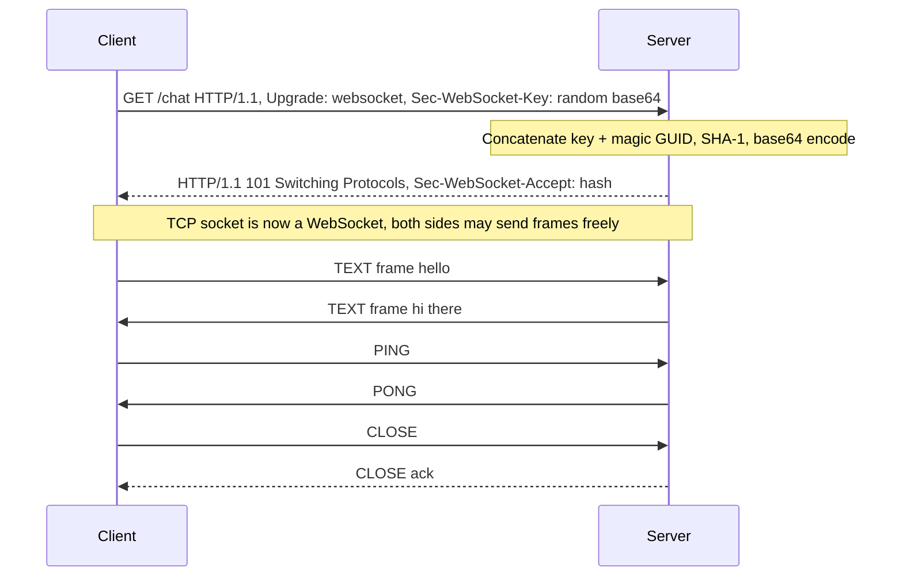
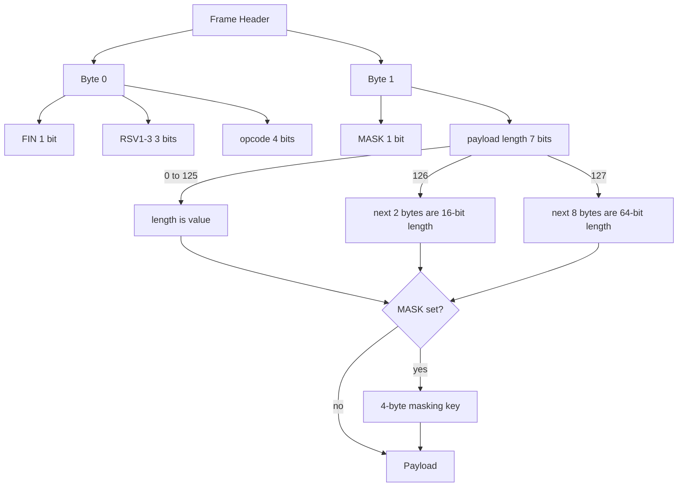
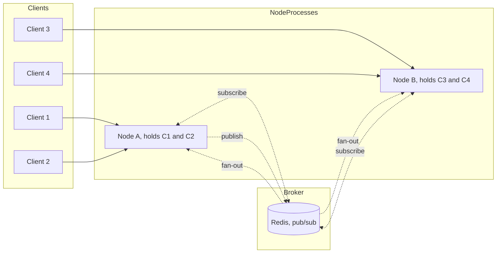
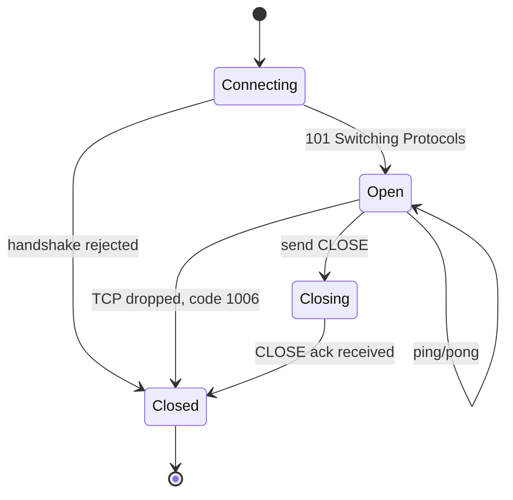
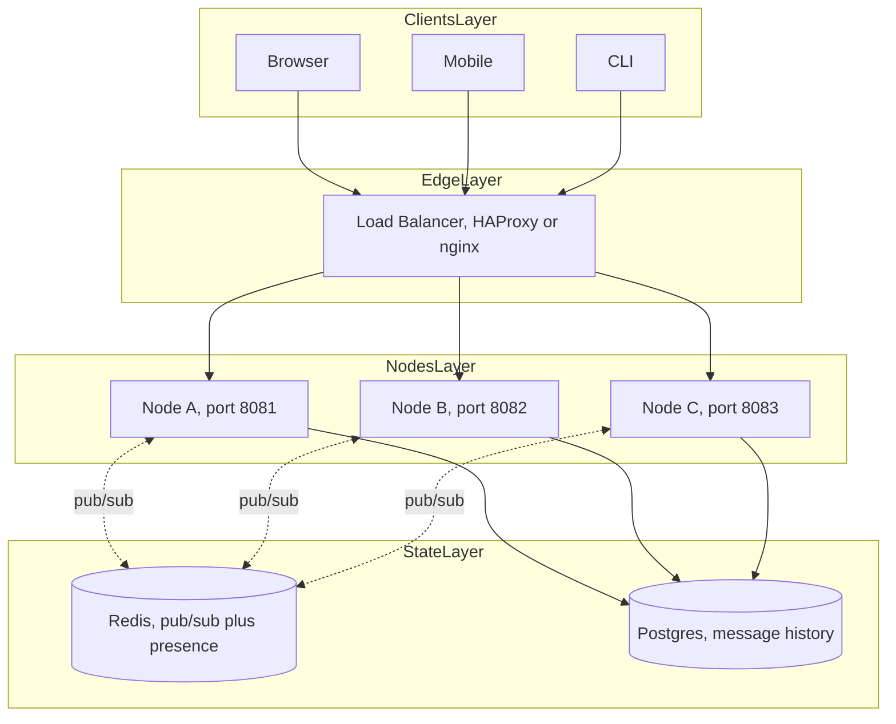

# 3.14 WebSockets and Realtime

> A WebSocket is an HTTP request that grows up into a full-duplex phone call between browser and server. This note covers the RFC 6455 protocol, the upgrade handshake, frame parsing, ping/pong heartbeats, and the Redis-backed pub/sub pattern that lets you scale stateful connections across dozens of Node processes.

Related notes: [[3.07 Streams Fundamentals]], [[3.11 Net Module TCP Sockets]], [[3.12 HTTP and HTTPS Modules]], [[3.10 Event Emitter Pattern]], [[7.07 Redis Caching Strategies]], [[7.08 Concurrency Clustering Workers]].

## 1. Purpose

HTTP was designed for document retrieval: a client asks, a server answers, the connection closes. This request/response model is beautifully simple and entirely inadequate for any application that needs the server to push data to the client the instant something happens. A chat message from a friend, a price tick on a stock feed, a cursor movement in a shared Figma file, a kill notification in a multiplayer match — none of these are responses to a client request. They are spontaneous events on the server that must reach the client without delay.

WebSockets exist to bridge that gap. Defined in RFC 6455 (December 2011), the WebSocket Protocol upgrades a single HTTP connection into a persistent, full-duplex, bidirectional byte stream between client and server. Once the upgrade completes, both sides may write at any time, without waiting for the other, until either side closes the connection.

### 1.1 Why HTTP alone is not enough

Consider the four classic workarounds for real-time push over HTTP:

1. **Short polling.** The client sends `GET /updates` every few seconds. Most responses are empty. You pay a full HTTP request/response round trip per poll, with TLS handshake, header parsing, and TCP overhead every time. Latency is bounded below by your poll interval; bandwidth is wasted on empty responses.

2. **Long polling.** The client sends `GET /updates` and the server holds the request open until something interesting happens, then responds. The client immediately reconnects. Better than short polling, but every message still pays the cost of a fresh HTTP request, and you must re-establish state on every reconnect.

3. **Server-Sent Events (SSE).** The server holds one long-lived HTTP response open and streams text frames down it. Cheap and simple, but unidirectional: the client can only listen. To send data upstream the client still needs a separate HTTP POST.

4. **WebSocket.** One HTTP request upgrades the connection. After that, both sides send and receive binary or text frames over the same TCP socket with a 2-byte header (or 6, or 14, depending on payload size). No headers, no reconnection tax, no protocol overhead per message.

### 1.2 What WebSockets enable

- Chat applications (Slack, Discord, WhatsApp Web, Microsoft Teams).
- Multiplayer browser and mobile games.
- Live dashboards (Datadog, Grafana, New Relic, Stripe Sigma).
- Collaborative editors (Google Docs, Notion, Figma, Linear).
- Server push notifications to web clients (when the browser is open).
- Real-time trading platforms (Robinhood, Coinbase Pro, Bloomberg Terminal).
- IoT device telemetry and control.
- Live sports scores and betting odds.

### 1.3 When NOT to use WebSockets

WebSockets are stateful. Each connection lives on one specific server process. This breaks the assumption that made HTTP horizontally scalable: any server can handle any request. With WebSockets, if connection C is on server A and you want to push a message to C, you must somehow get the message to server A. See Section 2.12 on Redis pub/sub scaling.

Use WebSockets when:
- The server must push data to the client with sub-second latency.
- Both directions are used frequently.
- You can afford the operational complexity of stateful connections.

Prefer SSE when:
- The server only needs to push (one-way).
- You want automatic reconnection and Last-Event-ID resume for free.
- You can live without binary frames.

Prefer HTTP polling when:
- Updates are infrequent (less than one per minute).
- The infrastructure cannot support persistent connections (some corporate proxies).

### 1.4 What this note covers

By the end you will understand the wire protocol (so you can debug with `tcpdump`), the `ws` library API (so you can build a server), the heartbeat pattern (so you can detect dead clients), and the Redis pub/sub pattern (so you can broadcast to connections on other nodes).

---

## 2. Theory and Deep Dive

### 2.1 The WebSocket protocol (RFC 6455)

RFC 6455 was published in December 2011, the result of work by Ian Fette and Alexey Melnikov. It defines:
- A handshake that begins as an HTTP/1.1 request and ends as a TCP byte stream.
- A frame format for exchanging messages once the handshake completes.
- A masking rule (client-to-server frames must be XOR-masked to defeat intermediary proxy cache poisoning).
- A small set of control frames (close, ping, pong) interleaved with data frames (text, binary, continuation).

The protocol uses the `ws://` scheme (unencrypted) or `wss://` scheme (TLS-encrypted, the only sensible choice on the public internet).

### 2.2 The handshake

The WebSocket handshake is an HTTP request that masquerades as a normal GET until the server agrees to switch protocols.

Client request:
```
GET /chat HTTP/1.1
Host: example.com
Upgrade: websocket
Connection: Upgrade
Sec-WebSocket-Key: dGhlIHNhbXBsZSBub25jZQ==
Sec-WebSocket-Version: 13
Origin: https://example.com
```

Server response:
```
HTTP/1.1 101 Switching Protocols
Upgrade: websocket
Connection: Upgrade
Sec-WebSocket-Accept: s3pPLMBiTxaQ9kYGzzhZRbK+xOo=
```

The magic happens in `Sec-WebSocket-Accept`. The server takes the value of `Sec-WebSocket-Key`, concatenates the fixed GUID `258EAFA5-E914-47DA-95CA-C5AB0DC85B11`, computes SHA-1, and returns the base64 encoding. This proves the server understood the upgrade request (rather than blindly proxying it) without inventing a new authentication scheme.



After the 101 response, the HTTP parser is shut off on both sides. The TCP socket is now a raw WebSocket. There is no more HTTP.

### 2.3 Why the magic GUID exists

The GUID `258EAFA5-E914-47DA-95CA-C5AB0DC85B11` is a known sentinel that proves the server deliberately implemented the WebSocket protocol. A naive HTTP server or transparent proxy that just echoes back headers would not know to compute the SHA-1 hash, and a misbehaving intermediary would be exposed. It is not a security measure — the GUID is public — but it does prevent accidental upgrade by non-WebSocket intermediaries.

### 2.4 Subprotocols: `Sec-WebSocket-Protocol`

The handshake can also negotiate a subprotocol. The client offers one or more:
```
Sec-WebSocket-Protocol: chat, superchat
```
The server picks one (or none) and echoes it back:
```
Sec-WebSocket-Protocol: chat
```
This is how you version your realtime API on the wire without inventing a content-type negotiation layer.

### 2.5 Framing

After the handshake, every byte on the wire belongs to a WebSocket frame. The frame header layout:

- Byte 0, bit 7: `FIN` — 1 if this is the last fragment of a message.
- Byte 0, bits 6-4: `RSV1`, `RSV2`, `RSV3` — reserved, must be 0 unless extensions (like per-message-deflate) are negotiated.
- Byte 0, bits 3-0: `opcode` — 4 bits.
- Byte 1, bit 7: `MASK` — 1 if the payload is XOR-masked with a 4-byte key.
- Byte 1, bits 6-0: `payload length` — 7 bits.
- If payload length is 0-125, that is the length.
- If 126, the next 2 bytes are a 16-bit big-endian length.
- If 127, the next 8 bytes are a 64-bit big-endian length.
- If `MASK` is 1, the next 4 bytes are the masking key.
- Then the payload.

Opcodes:
- `0x0` continuation (fragment after a non-FIN frame).
- `0x1` text (UTF-8).
- `0x2` binary.
- `0x8` close (carries an optional 2-byte status code and reason).
- `0x9` ping (control frame, must be answered with pong).
- `0xA` pong (control frame).

An opcode with the high bit set (0x8 through 0xF) is a control frame. Control frames cannot be fragmented and their payload cannot exceed 125 bytes.



### 2.6 Why client-to-server frames are masked

The masking rule exists to defend against cache poisoning by malicious intermediaries on legacy HTTP proxies. The classic attack: an attacker sends a crafted HTTP request to a proxy that misunderstands pipelining, gets the proxy to cache a poisoned response, and now every user requesting that URL gets the attacker's payload. WebSockets sidesteps this by XOR-ing every client-to-server frame with a 32-bit key chosen fresh for each frame. The server un-masks by XOR-ing again. Server-to-client frames are not masked because the attack scenario does not apply.

You do not write this code yourself. The `ws` library handles masking and unmasking for you in C. Just be aware that if you ever see raw bytes on the wire that look like garbage from a client, you forgot to mask (or your library is broken).

### 2.7 Fragmentation

A single logical message may be split across multiple frames. The first frame has the opcode (text or binary) and FIN=0. Subsequent frames have opcode 0 (continuation). The last frame has FIN=1. Fragmentation lets you stream a large message without buffering it entirely, and lets you interleave control frames (ping/pong) in the middle of a long message.

In practice, most applications do not fragment manually. The `ws` library will fragment automatically when you `send()` a Buffer larger than the configured chunk size, and it will reassemble fragments transparently on receive.

### 2.8 Ping/pong heartbeats

WebSocket defines two control frames for liveness:
- `ping` (opcode 0x9): a probe. Up to 125 bytes of arbitrary payload.
- `pong` (opcode 0xA): the response. Must echo the ping's payload.

A healthy client must respond to a server ping with a pong. The server can use this to detect dead connections (NAT timeouts, laptop closed, mobile dropped) and clean them up.

TCP keepalive alone is not enough. TCP keepalive defaults are typically 2-hour idle before the first probe, with 75-second intervals and 9 failures before giving up. That is far too long for a chat app. Application-level ping/pong with a 30-second interval and a 60-second timeout is the standard.

### 2.9 Close codes

When closing a connection, the close frame may carry a 2-byte status code:
- `1000` Normal Closure.
- `1001` Going Away (browser navigated, server shutting down).
- `1002` Protocol Error.
- `1003` Unsupported Data (e.g. got binary, only text accepted).
- `1006` Abnormal Closure (no close frame received — usually a network drop).
- `1008` Policy Violation (authentication failed, message too big).
- `1011` Internal Error (server bug).
- `4000-4999` Application-defined.

`1006` is special — it is never sent on the wire. The library synthesizes it when the TCP connection drops without a close frame.

### 2.10 The `ws` library

`ws` is the de facto WebSocket implementation for Node.js. It is a thin, fast, low-level library that implements RFC 6455 with no opinionated features on top. Most production WebSocket deployments in Node use `ws` directly.

```javascript
import { WebSocketServer } from 'ws';

const wss = new WebSocketServer({ port: 8080 });
wss.on('connection', (ws) => {
  ws.on('message', (data) => console.log('received', data.toString()));
  ws.send('welcome');
});
```

The `WebSocketServer` constructor accepts options including:
- `port` to bind a new HTTP server on the given port.
- `server` to attach to an existing `http.Server` (so you can serve HTTP and WS on the same port).
- `path` to only upgrade requests matching a URL path.
- `maxPayload` to reject messages larger than N bytes (default 100 MiB).
- `verifyClient` to run custom authentication during the handshake.

### 2.11 The `socket.io` library

`socket.io` is a higher-level library that predates native browser WebSocket support. It adds:
- Automatic reconnection with backoff.
- Rooms and namespaces (broadcast to subsets of connections).
- Acknowledgements (request/response on top of WebSocket).
- Fallback to long polling for ancient browsers.
- A custom packet format on top of WebSocket frames.

Use `socket.io` if you need its feature set. Use `ws` if you want maximum performance, minimum abstraction, and direct protocol control. For greenfield projects in 2024 and later, `ws` plus a small application layer is usually the right call.

### 2.12 Scaling WebSockets

HTTP scales horizontally because any server can serve any request. A load balancer round-robins requests across N identical servers and the system works.

WebSockets break this assumption. A connection opened on server 3 lives on server 3. If a user on server 7 wants to send a message to the user on server 3, server 7 cannot reach that connection directly.

The standard solution is a pub/sub broker:
1. Each Node process maintains its own set of WebSocket connections.
2. Each process subscribes to a Redis channel (e.g. `chat:room:42`).
3. When any process wants to broadcast a message, it `PUBLISH`es to the channel.
4. Redis fans the message out to every subscriber, including the originating process.
5. Each process delivers the message to its local connections that belong to that room.



This pattern works for Redis, NATS, RabbitMQ, Kafka, or any pub/sub system. Redis is the most common choice because it is fast enough (sub-millisecond on a LAN), simple, and already in the stack.

### 2.13 State synchronization across nodes

For most chat applications, Redis pub/sub is sufficient because messages are ephemeral: a missed message is gone. But for applications with shared state (collaborative editors, multiplayer games, presence), you also need to synchronize state, not just events.

Patterns:
1. **Shared state store.** All state lives in Redis (or Postgres). Each node reads, mutates, writes back. The WebSocket layer is just a notification channel. Simple but every mutation is a Redis round trip.

2. **CRDTs (Conflict-free Replicated Data Types).** Each node holds a local copy of state and exchanges operations via pub/sub. CRDTs guarantee convergence without coordination. Libraries: Yjs, Automerge. Used by Figma, Notion, Linear.

3. **Operational Transform (OT).** The classic Google Docs approach. A central server serializes operations. More complex than CRDTs and requires a single authoritative node per document.

4. **Single-leader per room.** Use a consistent hash of the room ID to route all connections for a room to one node, which becomes the leader for that room. The leader holds authoritative state. Avoids cross-node coordination but limits a single room to one node's capacity.

For most realtime apps, start with option 1 (Redis as state store plus pub/sub) and graduate to CRDTs only when you have a true collaborative-editing problem.

### 2.14 Backpressure

WebSocket `send()` returns `true` if the data was flushed to the kernel buffer, `false` if it had to be queued in user space because the kernel buffer is full (the client is not reading fast enough). Ignoring the return value leads to unbounded memory growth as outgoing messages pile up.

The `ws` library exposes:
- `ws.send(data, { callback })` — the callback fires when the data is finally written (or errored).
- `ws.bufferedAmount` — bytes queued in user space.
- The `'drain'` event inherited from the underlying stream.

A robust server either (a) drops messages when `bufferedAmount` exceeds a threshold, or (b) blocks the producer until the consumer drains. See [[3.08 Streams Advanced Backpressure]] for the general pattern.

### 2.15 Authentication

There are three common places to authenticate a WebSocket:
1. **During the handshake.** The `verifyClient` callback (or an HTTP middleware that runs before upgrade) inspects headers or cookies. This is the cleanest — the connection is either established or rejected before any frames flow.
2. **First message.** The client sends an auth token as its first message; the server validates before processing anything else. Simpler to implement but the connection is technically open before auth.
3. **Query parameter.** `wss://example.com/chat?token=abc`. Works but the token leaks into logs and proxy caches.

Cookies sent during the handshake are the most secure option for browser clients because the browser automatically includes cookies for the WebSocket's origin, and you avoid putting tokens in URLs.

### 2.16 Connection lifecycle



---

## 3. Mental Models

### 3.1 WebSocket = an HTTP request that becomes a phone call

An HTTP request is a letter. You write it, you mail it, you wait for a reply, the conversation ends. A WebSocket is a phone call. The first ring is the HTTP upgrade. Once the other side picks up, you can both talk whenever you want, until someone hangs up.

### 3.2 Handshake = "let's upgrade", "101 ok"

The handshake is a polite protocol negotiation. The client says "I would like to upgrade this connection to WebSocket, here is my random key." The server says "101 Switching Protocols, here is proof I understood you." After that, the HTTP parser on both sides is thrown away and the bytes belong to WebSocket frames.

### 3.3 Frame = a single message chunk with metadata

Think of a frame as a postcard. The front has metadata (text or binary, last fragment or not, masked or not, how many bytes of payload). The back has the payload. Long messages split across multiple postcards; the first says "text, more to come", the middle ones say "continuation, more to come", the last says "continuation, FIN".

### 3.4 Ping/pong = "are you still there?", "yes"

TCP keepalive is a slow heartbeat at the OS level. Application-level ping/pong is a faster, smarter heartbeat at the WebSocket level. The server pings every 30 seconds; if no pong arrives within 60 seconds, the server assumes the client is gone (laptop closed, mobile dropped, NAT timeout) and closes the connection.

### 3.5 Scaling = each server holds some connections, broadcast via a shared broker

Picture a stadium with 100,000 spectators and 50 sections. Each section has a security guard (a Node process) who knows the people in their section. If a guard in section 3 wants to announce something to everyone in the stadium, they do not run to every section — they call the PA system (Redis). The PA broadcasts to all guards, who each announce to their section. The guard does not even need to know which sections have which people; they just relay.

### 3.6 The lifecycle as a state machine

Connecting, then Open, then Closing, then Closed. The Open state is where 99% of the interesting code runs. The transitions out of Open (to Closing or directly to Closed) are where most bugs live, because that is where cleanup must happen.

### 3.7 The library as a frame translator

The `ws` library takes raw TCP bytes, parses frame headers, unmasks client payloads, reassembles fragments, decodes UTF-8 for text frames, and hands you a clean `Buffer` or string. In the other direction, it accepts your data, picks the right opcode, frames it, masks it if needed, and writes to the socket. You never see a frame header in application code; you see `'message'` events with `Buffer` payloads.

---

## 4. Real-World Use Cases

### 4.1 Chat applications

Slack, Discord, Microsoft Teams, WhatsApp Web, Telegram Web. Each open browser tab holds one WebSocket. Messages, typing indicators, presence (online/away), reactions, and channel switches all flow over the same socket. Discord famously runs millions of concurrent WebSocket connections across hundreds of Go and ScyllaDB nodes; Slack runs a similar architecture on Node.js with HAProxy in front.

### 4.2 Multiplayer games

Browser games (agar.io, slither.io, the .io genre), mobile games with realtime PvP, and even some AAA titles use WebSockets (or raw TCP) for game state sync. The server runs the authoritative game loop at a fixed tick rate (e.g. 20 Hz) and broadcasts diffs to all clients each tick. WebSocket's low overhead per frame matters here: at 20 Hz with 100 players, that is 2000 frames per second per server.

### 4.3 Live dashboards

Datadog, Grafana, New Relic, Stripe Sigma, Vercel Analytics. A dashboard subscribes to a stream of metrics; the server pushes new data points as they arrive. SSE would also work, but WebSocket is more flexible if the dashboard also sends filter changes upstream.

### 4.4 Collaborative editors

Google Docs (OT over a custom protocol), Notion (CRDTs over WebSocket), Figma (custom binary protocol over WebSocket), Linear, Excalidraw (Yjs CRDTs over WebSocket). Each open document is a WebSocket; every keystroke or cursor movement is a small frame. Yjs and Automerge are the dominant CRDT libraries; both ship WebSocket provider packages.

### 4.5 Push notifications to web clients

When the browser is open, the WebSocket is the fastest push channel. When the browser is closed, you fall back to the Push API (service worker plus Web Push protocol). Many apps use both: WebSocket while open, Web Push while closed.

### 4.6 Real-time trading platforms

Robinhood, Coinbase Pro, Kraken, Bloomberg Terminal. Price ticks, order book updates, trade notifications. Latency budgets are sub-100ms; binary frames are common to minimize parsing cost. Coinbase Pro's WebSocket feed pushes thousands of messages per second during volatile periods.

### 4.7 IoT device control

Smart home dashboards (Home Assistant), industrial sensor monitoring, drone telemetry. Devices push telemetry up; control panels push commands down. MQTT-over-WebSocket is a common pattern because MQTT's pub/sub model maps cleanly onto IoT.

### 4.8 Live sports and betting

Live score feeds, in-play betting odds, race telemetry. The server pushes updates as events happen on the field; clients render in real time.

---

## 5. Code Examples

### 5.1 Example A — Minimal and Conceptual

A minimal WebSocket echo server and client using `ws`.

**JavaScript (server):**

```javascript
// server.js
import { WebSocketServer } from 'ws';

const wss = new WebSocketServer({ port: 8080 });

wss.on('connection', (ws, req) => {
  const ip = req.socket.remoteAddress;
  console.log(`client connected from ${ip}`);

  ws.on('message', (data, isBinary) => {
    // Echo back whatever we received, text or binary.
    ws.send(data, { binary: isBinary });
  });

  ws.on('close', (code, reason) => {
    console.log(`client closed: ${code} ${reason.toString()}`);
  });

  ws.on('error', (err) => {
    console.error('socket error:', err.message);
  });

  ws.send('welcome to the echo server');
});

console.log('echo server listening on ws://localhost:8080');
```

**JavaScript (client):**

```javascript
// client.js
import WebSocket from 'ws';

const ws = new WebSocket('ws://localhost:8080');

ws.on('open', () => {
  console.log('connected');
  ws.send('hello server');
  ws.send(Buffer.from([1, 2, 3, 4]));
});

ws.on('message', (data) => {
  console.log('echo:', data.toString());
});

ws.on('close', () => console.log('disconnected'));
ws.on('error', (err) => console.error('error:', err.message));
```

**TypeScript (server):**

```typescript
// server.ts
import { WebSocketServer, WebSocket } from 'ws';
import type { IncomingMessage } from 'node:http';

const wss = new WebSocketServer({ port: 8080 });

wss.on('connection', (ws: WebSocket, req: IncomingMessage) => {
  const ip: string = req.socket.remoteAddress ?? 'unknown';
  console.log(`client connected from ${ip}`);

  ws.on('message', (data: Buffer, isBinary: boolean) => {
    ws.send(data, { binary: isBinary });
  });

  ws.on('close', (code: number, reason: Buffer) => {
    console.log(`client closed: ${code} ${reason.toString()}`);
  });

  ws.on('error', (err: Error) => {
    console.error('socket error:', err.message);
  });

  ws.send('welcome to the echo server');
});

console.log('echo server listening on ws://localhost:8080');
```

**TypeScript (client):**

```typescript
// client.ts
import WebSocket from 'ws';

const ws: WebSocket = new WebSocket('ws://localhost:8080');

ws.on('open', () => {
  console.log('connected');
  ws.send('hello server');
  ws.send(Buffer.from([1, 2, 3, 4]));
});

ws.on('message', (data: Buffer) => {
  console.log('echo:', data.toString());
});

ws.on('close', () => console.log('disconnected'));
ws.on('error', (err: Error) => console.error('error:', err.message));
```

### 5.2 Example B — Production-Grade

A typed chat server with rooms, ping/pong heartbeats, handshake authentication, and Redis-based scaling. The TypeScript version is the canonical implementation; the JavaScript version is the same code with types stripped.

**TypeScript (canonical):**

```typescript
// chat-server.ts
import { WebSocketServer, WebSocket } from 'ws';
import type { IncomingMessage } from 'node:http';
import Redis from 'ioredis';

// --- Message types ---
type ClientMessage =
  | { kind: 'join'; room: string }
  | { kind: 'leave'; room: string }
  | { kind: 'say'; room: string; text: string };

type BroadcastMessage =
  | { kind: 'say'; room: string; from: string; text: string; at: number }
  | { kind: 'join'; room: string; user: string }
  | { kind: 'leave'; room: string; user: string };

interface Session {
  ws: WebSocket;
  user: string;
  rooms: Set<string>;
  alive: boolean;
}

const secretToken = process.env.chatSecretToken ?? 'dev-secret';
const heartbeatMs = 30000;

const pub = new Redis(process.env.redisUrl ?? 'redis://localhost:6379');
const sub = new Redis(process.env.redisUrl ?? 'redis://localhost:6379');
const sessions = new Map<WebSocket, Session>();

// Subscribe to the global broadcast channel.
sub.subscribe('chat:broadcast');
sub.on('message', (channel: string, payload: string) => {
  if (channel !== 'chat:broadcast') return;
  const msg: BroadcastMessage = JSON.parse(payload);
  // Deliver to local sessions that are in the target room.
  for (const session of sessions.values()) {
    if (session.rooms.has(msg.room)) {
      session.ws.send(JSON.stringify(msg));
    }
  }
});

function broadcast(msg: BroadcastMessage): void {
  // Publish to Redis so every node delivers it.
  pub.publish('chat:broadcast', JSON.stringify(msg));
}

function authenticate(req: IncomingMessage): string | null {
  const auth = req.headers.authorization;
  if (typeof auth !== 'string') return null;
  const token = auth.replace(/^Bearer\s+/i, '');
  if (token !== secretToken) return null;
  // In real life, decode a JWT here and return the user id.
  const userHeader = req.headers['x-chat-user'];
  return typeof userHeader === 'string' ? userHeader : null;
}

const wss = new WebSocketServer({
  port: 8080,
  maxPayload: 64 * 1024, // 64 KiB per message
  verifyClient: (info, cb) => {
    const user = authenticate(info.req);
    if (!user) {
      cb(false, 401, 'unauthorized');
      return;
    }
    cb(true);
  },
});

wss.on('connection', (ws: WebSocket, req: IncomingMessage) => {
  const user = authenticate(req) ?? 'anon';
  const session: Session = { ws, user, rooms: new Set(), alive: true };
  sessions.set(ws, session);
  console.log(`${user} connected`);

  ws.on('message', (raw: Buffer) => {
    let msg: ClientMessage;
    try {
      msg = JSON.parse(raw.toString()) as ClientMessage;
    } catch {
      ws.close(1003, 'invalid JSON');
      return;
    }

    switch (msg.kind) {
      case 'join':
        session.rooms.add(msg.room);
        broadcast({ kind: 'join', room: msg.room, user });
        break;
      case 'leave':
        session.rooms.delete(msg.room);
        broadcast({ kind: 'leave', room: msg.room, user });
        break;
      case 'say':
        broadcast({
          kind: 'say',
          room: msg.room,
          from: user,
          text: msg.text.slice(0, 4096),
          at: Date.now(),
        });
        break;
    }
  });

  ws.on('pong', () => { session.alive = true; });

  ws.on('close', () => {
    for (const room of session.rooms) {
      broadcast({ kind: 'leave', room, user });
    }
    sessions.delete(ws);
    console.log(`${user} disconnected`);
  });

  ws.on('error', (err: Error) => {
    console.error(`error for ${user}:`, err.message);
  });
});

// Heartbeat: ping every 30s, terminate if no pong by next tick.
const heartbeat = setInterval(() => {
  for (const session of sessions.values()) {
    if (!session.alive) {
      session.ws.terminate();
      continue;
    }
    session.alive = false;
    session.ws.ping();
  }
}, heartbeatMs);

wss.on('close', () => clearInterval(heartbeat));

console.log('chat server listening on ws://localhost:8080');
```

**JavaScript (same code, types stripped):**

```javascript
// chat-server.js
import { WebSocketServer } from 'ws';
import Redis from 'ioredis';

const secretToken = process.env.chatSecretToken ?? 'dev-secret';
const heartbeatMs = 30000;

const pub = new Redis(process.env.redisUrl ?? 'redis://localhost:6379');
const sub = new Redis(process.env.redisUrl ?? 'redis://localhost:6379');
const sessions = new Map();

sub.subscribe('chat:broadcast');
sub.on('message', (channel, payload) => {
  if (channel !== 'chat:broadcast') return;
  const msg = JSON.parse(payload);
  for (const session of sessions.values()) {
    if (session.rooms.has(msg.room)) {
      session.ws.send(JSON.stringify(msg));
    }
  }
});

function broadcast(msg) {
  pub.publish('chat:broadcast', JSON.stringify(msg));
}

function authenticate(req) {
  const auth = req.headers.authorization;
  if (typeof auth !== 'string') return null;
  const token = auth.replace(/^Bearer\s+/i, '');
  if (token !== secretToken) return null;
  const userHeader = req.headers['x-chat-user'];
  return typeof userHeader === 'string' ? userHeader : null;
}

const wss = new WebSocketServer({
  port: 8080,
  maxPayload: 64 * 1024,
  verifyClient: (info, cb) => {
    const user = authenticate(info.req);
    if (!user) {
      cb(false, 401, 'unauthorized');
      return;
    }
    cb(true);
  },
});

wss.on('connection', (ws, req) => {
  const user = authenticate(req) ?? 'anon';
  const session = { ws, user, rooms: new Set(), alive: true };
  sessions.set(ws, session);
  console.log(`${user} connected`);

  ws.on('message', (raw) => {
    let msg;
    try {
      msg = JSON.parse(raw.toString());
    } catch {
      ws.close(1003, 'invalid JSON');
      return;
    }

    switch (msg.kind) {
      case 'join':
        session.rooms.add(msg.room);
        broadcast({ kind: 'join', room: msg.room, user });
        break;
      case 'leave':
        session.rooms.delete(msg.room);
        broadcast({ kind: 'leave', room: msg.room, user });
        break;
      case 'say':
        broadcast({
          kind: 'say',
          room: msg.room,
          from: user,
          text: msg.text.slice(0, 4096),
          at: Date.now(),
        });
        break;
    }
  });

  ws.on('pong', () => { session.alive = true; });

  ws.on('close', () => {
    for (const room of session.rooms) {
      broadcast({ kind: 'leave', room, user });
    }
    sessions.delete(ws);
    console.log(`${user} disconnected`);
  });

  ws.on('error', (err) => {
    console.error(`error for ${user}:`, err.message);
  });
});

const heartbeat = setInterval(() => {
  for (const session of sessions.values()) {
    if (!session.alive) {
      session.ws.terminate();
      continue;
    }
    session.alive = false;
    session.ws.ping();
  }
}, heartbeatMs);

wss.on('close', () => clearInterval(heartbeat));

console.log('chat server listening on ws://localhost:8080');
```

Run with two instances on different ports (parameterize the port via `process.env.port`) and a local Redis, then connect a client to either port and watch messages fan out to both.

---

## 6. Common Mistakes and Anti-Patterns

### 6.1 Not handling the 'error' event

If a WebSocket emits `'error'` and there is no listener, Node throws and the process crashes. A single malformed client can take down the whole server.

```javascript
// BROKEN
ws.on('message', (data) => { /* ... */ });
// no error listener — one socket error crashes the process
```

```javascript
// FIXED
ws.on('error', (err) => {
  console.error('socket error:', err.message);
});
```

Always attach an `'error'` listener to every WebSocket and every WebSocketServer.

### 6.2 Not implementing ping/pong

Without heartbeats, dead connections pile up. A laptop closes, the TCP socket enters the CLOSE-WAIT half-closed state but the server never notices. Within hours, the process holds tens of thousands of ghost connections and runs out of file descriptors.

```javascript
// BROKEN: no heartbeats, no cleanup
wss.on('connection', (ws) => {
  ws.on('message', (data) => { /* ... */ });
});
```

```javascript
// FIXED: ping every 30s, terminate if no pong
const sessions = new Map();
wss.on('connection', (ws) => {
  sessions.set(ws, { alive: true });
  ws.on('pong', () => { sessions.get(ws).alive = true; });
});
setInterval(() => {
  for (const [ws, s] of sessions) {
    if (!s.alive) { ws.terminate(); sessions.delete(ws); continue; }
    s.alive = false;
    ws.ping();
  }
}, 30000);
```

### 6.3 Not cleaning up on 'close'

If you store sessions in a Map keyed by the WebSocket and forget to delete on `'close'`, the Map grows forever. The garbage collector cannot reclaim the WebSocket because the Map still references it.

```javascript
// BROKEN
const sessions = new Map();
wss.on('connection', (ws) => {
  sessions.set(ws, { user: 'alice' });
  ws.on('message', (data) => { /* ... */ });
  // close handler missing — sessions map leaks
});
```

Always pair your `sessions.set(ws, ...)` with a `sessions.delete(ws)` in the `'close'` handler.

### 6.4 Broadcasting only to local connections

A naive broadcast iterates over `wss.clients` — but `wss.clients` only contains connections on THIS process. Clients connected to other Node processes never see the message.

```javascript
// BROKEN: only reaches local clients
function broadcastAll(msg) {
  for (const ws of wss.clients) ws.send(msg);
}
```

```javascript
// FIXED: publish to Redis, every node delivers locally
function broadcastAll(msg) {
  pub.publish('chat:broadcast', JSON.stringify(msg));
}
```

### 6.5 Hand-rolling masking

WebSocket masking is a 4-byte XOR with cyclic repetition. It is not hard to implement, but it is also unnecessary: the `ws` library does it in optimized C. If you ever find yourself writing `payload[i] ^ mask[i % 4]` in application code, stop. You are either reinventing the library or working around a bug that should be fixed upstream.

### 6.6 Not setting `maxPayload`

The default `maxPayload` in `ws` is 100 MiB. A malicious client can send a 100 MiB frame and exhaust memory. Set an explicit limit appropriate to your application.

```javascript
// BROKEN: default 100 MiB limit, easy to abuse
const wss = new WebSocketServer({ port: 8080 });
```

```javascript
// FIXED: 64 KiB is plenty for chat messages
const wss = new WebSocketServer({ port: 8080, maxPayload: 64 * 1024 });
```

### 6.7 Authentication after the handshake

Some tutorials send the auth token as the first WebSocket message. This means the connection is technically open before authentication, and an attacker can hold thousands of unauthenticated sockets open (a memory-exhaustion DoS). Authenticate in `verifyClient` or in HTTP middleware before the upgrade.

### 6.8 Ignoring backpressure

```javascript
// BROKEN: keeps queueing even if the client is slow
function sendLots(ws) {
  for (let i = 0; i < 1000000; i++) {
    ws.send(`message ${i}`);
  }
}
```

Each `send()` queues data in user space if the kernel buffer is full. Either check the return value of `send()` (true means flushed, false means queued) or monitor `ws.bufferedAmount` and back off.

```javascript
// FIXED: respect backpressure
function sendLots(ws) {
  let i = 0;
  function next() {
    while (i < 1000000) {
      if (ws.bufferedAmount > 1048576) {
        ws.once('drain', next);
        return;
      }
      ws.send(`message ${i++}`);
    }
  }
  next();
}
```

### 6.9 CPU-heavy work inside the 'message' handler

```javascript
// BROKEN: blocks the event loop, stalls every other connection
ws.on('message', (data) => {
  const result = heavyComputation(data); // 500ms of CPU
  ws.send(result);
});
```

Move CPU-heavy work to a worker thread (see [[3.18 Worker Threads]]) or break it into chunks with `setImmediate` (see [[3.05 Microtask Queues and Process NextTick]]).

### 6.10 No graceful shutdown

When the process receives SIGTERM (e.g. from a deploy), the default behavior is to die immediately, dropping every WebSocket connection. Clients see a 1006 abnormal close and must reconnect.

```javascript
// FIXED: graceful shutdown
process.on('SIGTERM', () => {
  console.log('shutting down, closing all sockets with 1001');
  for (const ws of wss.clients) {
    ws.close(1001, 'server shutting down');
  }
  wss.close(() => process.exit(0));
});
```

### 6.11 Trusting `req.socket.remoteAddress` for auth

Proxies (HAProxy, nginx, AWS ALB) overwrite the source IP. The `req.socket.remoteAddress` will be the proxy's IP, not the client's. Use `X-Forwarded-For` (and only if you trust the proxy chain) or the `X-Real-IP` header.

### 6.12 One Redis connection for both pub and sub

Redis requires separate connections for `SUBSCRIBE` and `PUBLISH`. A connection that is in subscriber mode cannot publish. Always create two Redis clients, one for pub and one for sub.

---

## 7. Best Practices and Design Patterns

### 7.1 Use `ws` for production

`ws` is fast, well-maintained, has TypeScript types, and implements RFC 6455 faithfully. Reach for `socket.io` only when you need its features (rooms, namespaces, auto-reconnect, fallback to polling). For greenfield projects, `ws` plus a thin application layer is usually the right call.

### 7.2 Implement ping/pong heartbeats

30-second ping interval, terminate after one missed pong. The pattern from Section 5.2 (mark `alive = false` before each ping, set `alive = true` in the `'pong'` handler, terminate if still false next tick) is the canonical implementation.

### 7.3 Handle 'error' and 'close' on every socket

Unconditionally. Missing either is a production bug waiting to happen.

### 7.4 Set `maxPayload`

A chat message is rarely more than a few KB. A binary blob rarely more than a few MB. Pick a limit appropriate to your application and reject anything larger with a 1009 close code.

### 7.5 Use Redis pub/sub for multi-node scaling

Each Node process holds its own connections, subscribes to a shared Redis channel, and publishes broadcasts. See Section 2.12 and Section 5.2.

### 7.6 Authenticate during the handshake

Use `verifyClient` (or HTTP middleware before the upgrade). Cookies sent automatically by the browser are the most secure option for browser clients.

### 7.7 Use TypeScript for message types

Define a discriminated union of incoming and outgoing message shapes. The compiler will catch typos and missing fields at build time.

```typescript
type Incoming =
  | { kind: 'join'; room: string }
  | { kind: 'say'; room: string; text: string };
```

### 7.8 Validate incoming messages

Never trust JSON.parse. Use a schema validator (zod, ajv, or hand-rolled switch on a `kind` discriminator) and close the connection with 1003 on invalid input.

### 7.9 Use binary frames for binary data

Sending a Buffer as a text frame will UTF-8-decode the bytes and corrupt them. Always pass `{ binary: true }` (or let `ws` infer it from the type of the argument).

### 7.10 Implement backpressure

Check `ws.send()` return value or `ws.bufferedAmount` and back off when the client is slow. Otherwise a single slow client can OOM the server.

### 7.11 Use sticky sessions for socket.io

`socket.io` maintains per-connection state. If a load balancer routes a reconnect to a different node, the state is lost. Configure sticky sessions (by client IP or by a cookie) so the same client always reaches the same node. With plain `ws` and Redis pub/sub, sticky sessions are not required.

### 7.12 Version your protocol with subprotocols

Negotiate `Sec-WebSocket-Protocol: chat.v1` during the handshake. When you ship a breaking change, use `chat.v2`. Old clients connect with v1, new clients with v2, and the server can support both during a migration.

### 7.13 Log connection lifecycle events

Connection opened (with user id and IP), joined room, left room, closed (with code and reason). Without these logs, production debugging is guesswork.

### 7.14 Implement graceful shutdown

On SIGTERM, send a 1001 close to every client and wait for `wss.close()` callback before exiting. Allows clients to reconnect cleanly to another node.

### 7.15 Monitor metrics

Connections per node, messages per second, broadcast latency, Redis pub/sub lag, ping/pong failures. Without observability, you cannot tell whether your realtime system is healthy.

---

## 8. Technical Interview Knowledge

### 8.1 What is the WebSocket protocol?

WebSocket is a protocol standardized in RFC 6455 (2011) that upgrades a single HTTP connection into a persistent, full-duplex, bidirectional byte stream. The connection begins as an HTTP GET with an `Upgrade: websocket` header; the server responds with `101 Switching Protocols`; from then on, both sides exchange WebSocket frames (not HTTP) until one side sends a close frame or the TCP connection drops. The protocol supports text and binary data, control frames (ping, pong, close), and fragmentation for large messages.

### 8.2 How does the handshake work?

The client sends an HTTP GET with `Upgrade: websocket`, `Connection: Upgrade`, `Sec-WebSocket-Key` (a random 16-byte base64 value), and `Sec-WebSocket-Version: 13`. The server concatenates the key with the magic GUID `258EAFA5-E914-47DA-95CA-C5AB0DC85B11`, computes SHA-1, base64-encodes the result, and returns it in `Sec-WebSocket-Accept` along with the 101 status. This proves the server understood the upgrade request rather than blindly proxying it. After the 101 response, the HTTP parser is shut off and the connection is a WebSocket.

### 8.3 What are frames and opcodes?

Once upgraded, every byte on the wire belongs to a WebSocket frame. Each frame has a header: a FIN bit (last fragment of a message), three RSV bits (reserved for extensions), a 4-bit opcode, a MASK bit, and a 7/16/64-bit payload length. Opcodes: 0 = continuation, 1 = text, 2 = binary, 8 = close, 9 = ping, 10 (0xA) = pong. Control frames (high bit set: 8 through F) cannot be fragmented and their payload is at most 125 bytes. Client-to-server frames must be XOR-masked with a 4-byte key; server-to-client frames are not masked.

### 8.4 How do you handle dead connections?

TCP keepalive is too slow (default 2-hour idle). Use application-level ping/pong: every 30 seconds the server sends a ping frame; the client must respond with a pong. If no pong arrives within 60 seconds, the server calls `ws.terminate()` to forcibly close the TCP connection. The pattern in `ws`: track `alive` per session, set it to false before each ping, set it true in the `'pong'` handler, terminate if still false on the next tick.

### 8.5 How do you scale WebSockets?

WebSockets are stateful — each connection lives on one Node process. To broadcast across processes, use a pub/sub broker (Redis is the standard). Each process subscribes to a shared channel (e.g. `chat:broadcast`); when any process publishes a message, Redis fans it out to every subscriber, which delivers to its local connections. For per-room broadcasts, use a channel per room (`chat:room:42`). Redis pub/sub is ephemeral (no persistence) — for missed-message recovery, persist messages to Redis lists or Postgres and let clients request missed messages on reconnect.

### 8.6 Difference between `ws` and `socket.io`?

`ws` is a low-level RFC 6455 implementation: handshakes, frames, ping/pong, that is it. Fast, small, no opinions. `socket.io` is a higher-level library built on top of WebSocket (with a long-polling fallback) that adds: auto-reconnect with backoff, rooms and namespaces, acknowledgements (request/response on top of WebSocket), a custom packet format, and a matching client library. Use `ws` for greenfield projects where you control both sides and want maximum performance. Use `socket.io` when you need its feature set or when you must support ancient browsers without native WebSocket.

### 8.7 How do you authenticate a WebSocket?

Three options: (1) During the handshake, via `verifyClient` or HTTP middleware that runs before the upgrade — inspect the `Authorization` header, a cookie, or a query parameter. Cleanest, because the connection is either established or rejected before any frames flow. (2) As the first message after the upgrade — the client sends `{ kind: 'auth', token: '...' }` and the server buffers all other messages until auth completes. Simpler but the socket is open before auth. (3) Query parameter (`?token=abc`) — works but the token leaks into logs and proxy caches. Cookies sent during the handshake are the most secure option for browser clients because the browser includes them automatically.

### 8.8 How do you handle backpressure?

`ws.send()` returns `true` if the data was flushed to the kernel buffer, `false` if it was queued in user space. The `ws.bufferedAmount` property exposes the queued byte count. A robust sender either (a) drops messages when `bufferedAmount` exceeds a threshold, (b) blocks the producer and waits for the `'drain'` event, or (c) uses `ws.send(data, { callback })` to know when each chunk finally flushes. Without backpressure handling, a single slow client can queue megabytes in user space and exhaust server memory.

---

## 9. Practical Exercises

### 9.1 Build a WS echo server

**Goal:** A server that echoes every message back to the sender, supporting both text and binary frames.

**TypeScript solution:**

```typescript
// echo-server.ts
import { WebSocketServer, WebSocket } from 'ws';

const wss = new WebSocketServer({ port: 8080 });

wss.on('connection', (ws: WebSocket) => {
  ws.on('message', (data: Buffer, isBinary: boolean) => {
    ws.send(data, { binary: isBinary });
  });
  ws.on('error', (err: Error) => console.error(err.message));
});

console.log('echo server on ws://localhost:8080');
```

**JavaScript solution:**

```javascript
// echo-server.js
import { WebSocketServer } from 'ws';

const wss = new WebSocketServer({ port: 8080 });

wss.on('connection', (ws) => {
  ws.on('message', (data, isBinary) => {
    ws.send(data, { binary: isBinary });
  });
  ws.on('error', (err) => console.error(err.message));
});

console.log('echo server on ws://localhost:8080');
```

**Test:** Connect with `wscat -c ws://localhost:8080`, type a message, see it echoed. Send a binary file with `wscat` and verify byte-for-byte echo.

### 9.2 Implement ping/pong heartbeats

**Goal:** A server that pings every client every 30 seconds and terminates any client that does not respond within 60 seconds.

**TypeScript solution:**

```typescript
// heartbeat-server.ts
import { WebSocketServer, WebSocket } from 'ws';

const wss = new WebSocketServer({ port: 8080 });
const alive = new Map<WebSocket, boolean>();

wss.on('connection', (ws: WebSocket) => {
  alive.set(ws, true);
  ws.on('pong', () => alive.set(ws, true));
  ws.on('close', () => alive.delete(ws));
  ws.on('error', () => alive.delete(ws));
});

setInterval(() => {
  for (const [ws, isAlive] of alive) {
    if (!isAlive) {
      ws.terminate();
      alive.delete(ws);
      continue;
    }
    alive.set(ws, false);
    ws.ping();
  }
}, 30000);

console.log('heartbeat server on ws://localhost:8080');
```

**JavaScript solution:**

```javascript
// heartbeat-server.js
import { WebSocketServer } from 'ws';

const wss = new WebSocketServer({ port: 8080 });
const alive = new Map();

wss.on('connection', (ws) => {
  alive.set(ws, true);
  ws.on('pong', () => alive.set(ws, true));
  ws.on('close', () => alive.delete(ws));
  ws.on('error', () => alive.delete(ws));
});

setInterval(() => {
  for (const [ws, isAlive] of alive) {
    if (!isAlive) {
      ws.terminate();
      alive.delete(ws);
      continue;
    }
    alive.set(ws, false);
    ws.ping();
  }
}, 30000);

console.log('heartbeat server on ws://localhost:8080');
```

**Test:** Connect, then suspend the client process (Ctrl-Z in another terminal). After 60 seconds, the server should log a termination and the `alive` map should shrink.

### 9.3 Build a chat server with rooms

**Goal:** A server where clients can `join`, `leave`, and `say` to a named room; messages reach only clients in that room.

**TypeScript solution:**

```typescript
// rooms-server.ts
import { WebSocketServer, WebSocket } from 'ws';

type Incoming =
  | { kind: 'join'; room: string }
  | { kind: 'leave'; room: string }
  | { kind: 'say'; room: string; text: string };

const wss = new WebSocketServer({ port: 8080 });
const rooms = new Map<string, Set<WebSocket>>();

function inRoom(room: string, ws: WebSocket): boolean {
  return rooms.get(room)?.has(ws) ?? false;
}

function addToRoom(room: string, ws: WebSocket): void {
  if (!rooms.has(room)) rooms.set(room, new Set());
  rooms.get(room)!.add(ws);
}

function removeFromRoom(room: string, ws: WebSocket): void {
  rooms.get(room)?.delete(ws);
  if (rooms.get(room)?.size === 0) rooms.delete(room);
}

function send(ws: WebSocket, payload: unknown): void {
  ws.send(JSON.stringify(payload));
}

wss.on('connection', (ws: WebSocket) => {
  ws.on('message', (raw: Buffer) => {
    let msg: Incoming;
    try { msg = JSON.parse(raw.toString()) as Incoming; }
    catch { ws.close(1003, 'invalid JSON'); return; }

    switch (msg.kind) {
      case 'join':
        addToRoom(msg.room, ws);
        send(ws, { kind: 'joined', room: msg.room });
        break;
      case 'leave':
        removeFromRoom(msg.room, ws);
        send(ws, { kind: 'left', room: msg.room });
        break;
      case 'say':
        if (!inRoom(msg.room, ws)) {
          send(ws, { kind: 'error', text: 'not in room' });
          return;
        }
        const out = { kind: 'say', room: msg.room, text: msg.text, at: Date.now() };
        for (const peer of rooms.get(msg.room) ?? []) {
          if (peer !== ws && peer.readyState === WebSocket.OPEN) {
            send(peer, out);
          }
        }
        break;
    }
  });

  ws.on('close', () => {
    for (const [name, members] of rooms) {
      if (members.delete(ws) && members.size === 0) rooms.delete(name);
    }
  });

  ws.on('error', (err: Error) => console.error(err.message));
});

console.log('rooms server on ws://localhost:8080');
```

**JavaScript solution:**

```javascript
// rooms-server.js
import { WebSocketServer, WebSocket } from 'ws';

const wss = new WebSocketServer({ port: 8080 });
const rooms = new Map();

function inRoom(room, ws) {
  return rooms.get(room)?.has(ws) ?? false;
}
function addToRoom(room, ws) {
  if (!rooms.has(room)) rooms.set(room, new Set());
  rooms.get(room).add(ws);
}
function removeFromRoom(room, ws) {
  rooms.get(room)?.delete(ws);
  if (rooms.get(room)?.size === 0) rooms.delete(room);
}
function send(ws, payload) {
  ws.send(JSON.stringify(payload));
}

wss.on('connection', (ws) => {
  ws.on('message', (raw) => {
    let msg;
    try { msg = JSON.parse(raw.toString()); }
    catch { ws.close(1003, 'invalid JSON'); return; }

    switch (msg.kind) {
      case 'join':
        addToRoom(msg.room, ws);
        send(ws, { kind: 'joined', room: msg.room });
        break;
      case 'leave':
        removeFromRoom(msg.room, ws);
        send(ws, { kind: 'left', room: msg.room });
        break;
      case 'say':
        if (!inRoom(msg.room, ws)) {
          send(ws, { kind: 'error', text: 'not in room' });
          return;
        }
        const out = { kind: 'say', room: msg.room, text: msg.text, at: Date.now() };
        for (const peer of rooms.get(msg.room) ?? []) {
          if (peer !== ws && peer.readyState === WebSocket.OPEN) {
            send(peer, out);
          }
        }
        break;
    }
  });

  ws.on('close', () => {
    for (const [name, members] of rooms) {
      if (members.delete(ws) && members.size === 0) rooms.delete(name);
    }
  });

  ws.on('error', (err) => console.error(err.message));
});

console.log('rooms server on ws://localhost:8080');
```

**Test:** Open three `wscat` sessions. Two join `room-a`, one joins `room-b`. The `room-a` members exchange messages; the `room-b` member sees nothing.

### 9.4 Scale across nodes with Redis pub/sub

**Goal:** Two server instances on different ports, both subscribed to a Redis channel. A message sent to one instance is delivered to clients connected to the other.

**TypeScript solution:**

```typescript
// scaled-server.ts
import { WebSocketServer, WebSocket } from 'ws';
import Redis from 'ioredis';

const PORT = Number(process.env.port ?? 8080);
const ROOM = 'chat:room:42';

const pub = new Redis(process.env.redisUrl ?? 'redis://localhost:6379');
const sub = new Redis(process.env.redisUrl ?? 'redis://localhost:6379');

const wss = new WebSocketServer({ port: PORT });
const clients = new Set<WebSocket>();

sub.subscribe(ROOM);
sub.on('message', (channel: string, payload: string) => {
  if (channel !== ROOM) return;
  for (const ws of clients) {
    if (ws.readyState === WebSocket.OPEN) ws.send(payload);
  }
});

wss.on('connection', (ws: WebSocket) => {
  clients.add(ws);
  ws.on('message', (raw: Buffer) => {
    // Publish to Redis so the other node also delivers.
    pub.publish(ROOM, raw.toString());
  });
  ws.on('close', () => clients.delete(ws));
  ws.on('error', (err: Error) => console.error(err.message));
});

console.log(`scaled server on ws://localhost:${PORT}`);
```

**JavaScript solution:**

```javascript
// scaled-server.js
import { WebSocketServer, WebSocket } from 'ws';
import Redis from 'ioredis';

const PORT = Number(process.env.port ?? 8080);
const ROOM = 'chat:room:42';

const pub = new Redis(process.env.redisUrl ?? 'redis://localhost:6379');
const sub = new Redis(process.env.redisUrl ?? 'redis://localhost:6379');

const wss = new WebSocketServer({ port: PORT });
const clients = new Set();

sub.subscribe(ROOM);
sub.on('message', (channel, payload) => {
  if (channel !== ROOM) return;
  for (const ws of clients) {
    if (ws.readyState === WebSocket.OPEN) ws.send(payload);
  }
});

wss.on('connection', (ws) => {
  clients.add(ws);
  ws.on('message', (raw) => {
    pub.publish(ROOM, raw.toString());
  });
  ws.on('close', () => clients.delete(ws));
  ws.on('error', (err) => console.error(err.message));
});

console.log(`scaled server on ws://localhost:${PORT}`);
```

**Test:** Start Redis (`docker run -p 6379:6379 redis`). Start two servers: `port=8081 node scaled-server.js` and `port=8082 node scaled-server.js`. Connect one client to 8081, another to 8082. A message sent from either client reaches both.

---

## 10. Mini-Project Blueprint

### 10.1 Project: Typed Realtime Chat Backend

Build a production-ready chat backend that supports:
- Multiple rooms with join/leave semantics.
- Per-user presence (online/offline/away).
- 30-second ping/pong heartbeats with 60-second timeout.
- Handshake authentication via `Authorization: Bearer <jwt>`.
- Redis pub/sub scaling across N Node processes.
- Fully typed messages (discriminated unions in TypeScript).
- Graceful shutdown on SIGTERM.
- Backpressure-aware broadcasting (drop messages if `bufferedAmount` exceeds 1 MiB).

### 10.2 Architecture



### 10.3 Message schema

```typescript
// schema.ts
export type Incoming =
  | { kind: 'join'; room: string }
  | { kind: 'leave'; room: string }
  | { kind: 'say'; room: string; text: string }
  | { kind: 'typing'; room: string; isTyping: boolean }
  | { kind: 'presence'; room: string };

export type Outgoing =
  | { kind: 'joined'; room: string; at: number }
  | { kind: 'left'; room: string; at: number }
  | { kind: 'say'; room: string; from: string; text: string; at: number }
  | { kind: 'typing'; room: string; user: string; isTyping: boolean }
  | { kind: 'presence'; room: string; users: string[] }
  | { kind: 'error'; code: string; message: string };

export type Broadcast =
  | { kind: 'say'; room: string; from: string; text: string; at: number }
  | { kind: 'typing'; room: string; user: string; isTyping: boolean }
  | { kind: 'presence'; room: string; users: string[] };
```

### 10.4 Module layout

- `src/server.ts` — the WebSocketServer setup, heartbeat loop, graceful shutdown.
- `src/auth.ts` — JWT verification in `verifyClient`.
- `src/rooms.ts` — local room membership manager (Map of room name to Set of sessions).
- `src/presence.ts` — Redis-backed presence: `SADD chat:presence:<room> <user>` on join, `SREM` on leave, `SMEMBERS` on demand.
- `src/broker.ts` — Redis pub/sub wrapper: `publish(channel, msg)` and `subscribe(channel, handler)`.
- `src/schema.ts` — the discriminated unions above.
- `src/backpressure.ts` — `safeSend(ws, data)` that respects `bufferedAmount`.

### 10.5 Backpressure-aware send

```typescript
// backpressure.ts
import type { WebSocket } from 'ws';

const maxBuffered = 1048576; // 1 MiB

export function safeSend(ws: WebSocket, data: string): boolean {
  if (ws.bufferedAmount > maxBuffered) {
    // Drop the message; in production, log and alert.
    return false;
  }
  ws.send(data);
  return true;
}
```

### 10.6 Graceful shutdown

```typescript
// shutdown.ts
import type { WebSocketServer } from 'ws';

export function installShutdown(wss: WebSocketServer): void {
  process.on('SIGTERM', () => {
    console.log('SIGTERM received, closing all sockets');
    for (const ws of wss.clients) {
      ws.close(1001, 'server shutting down');
    }
    setTimeout(() => process.exit(0), 5000);
  });
}
```

### 10.7 Presence module

```typescript
// presence.ts
import Redis from 'ioredis';

const redis = new Redis(process.env.redisUrl ?? 'redis://localhost:6379');

function key(room: string): string {
  return `chat:presence:${room}`;
}

export async function joinRoom(room: string, user: string): Promise<void> {
  await redis.sadd(key(room), user);
}

export async function leaveRoom(room: string, user: string): Promise<void> {
  await redis.srem(key(room), user);
}

export async function usersIn(room: string): Promise<string[]> {
  return redis.smembers(key(room));
}
```

### 10.8 Acceptance criteria

- Two instances running on ports 8081 and 8082, both behind a single Redis.
- A client connected to 8081 sends `say` in `room-1`; a client connected to 8082 (also in `room-1`) receives it within 50 ms.
- Killing one instance causes its clients to reconnect to the other; presence is updated within 60 seconds (heartbeat timeout).
- A client that stops responding to pings is terminated within 60 seconds.
- A 1 MB message is rejected with a 1009 close code (configure `maxPayload`).
- Unauthenticated handshakes are rejected with 401.

### 10.9 Stretch goals

- Per-message acknowledgement (request/response on top of WebSocket).
- Last-Event-ID-style resume: persist the last 100 messages per room in Redis, let clients request missed messages on reconnect.
- CRDT-backed collaborative document editing per room (using Yjs).
- Binary protocol (MessagePack instead of JSON) for high-throughput use cases.
- Metrics endpoint (Prometheus) exposing connections, messages per second, broadcast latency.

---

## 11. Core Connections

- [[3.07 Streams Fundamentals]] — `ws` is built on top of Node streams; backpressure semantics for WebSocket `send()` mirror those of `Writable.write()`.
- [[3.11 Net Module TCP Sockets]] — WebSocket is a framed protocol layered on top of a raw TCP socket; understanding TCP is prerequisite to debugging WebSocket issues.
- [[3.12 HTTP and HTTPS Modules]] — the WebSocket handshake is an HTTP GET with an `Upgrade` header; the `ws` library can attach to an existing `http.Server`.
- [[3.10 Event Emitter Pattern]] — `WebSocket` and `WebSocketServer` are EventEmitters; the `'message'`, `'close'`, `'error'`, `'ping'`, `'pong'` events follow the same conventions as every other Node stream.
- [[7.07 Redis Caching Strategies]] — Redis pub/sub is the canonical broker for multi-node WebSocket scaling; the same Redis instance often doubles as a session store and presence store.
- [[7.08 Concurrency Clustering Workers]] — running one WebSocket server per worker process multiplies connection capacity; the Redis pub/sub pattern is what makes that safe.

Cross-references: see also [[3.05 Microtask Queues and Process NextTick]] for breaking up CPU-heavy message handlers, [[3.08 Streams Advanced Backpressure]] for the general backpressure pattern that `ws.send()` return values implement, and [[3.18 Worker Threads]] for offloading CPU-heavy per-message work.
