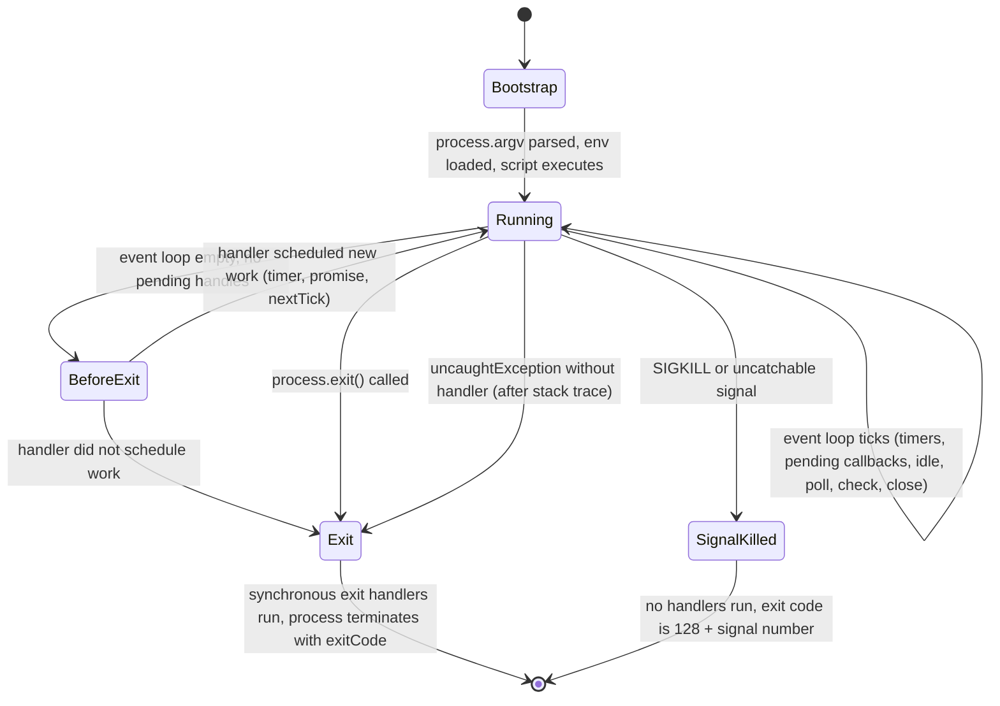
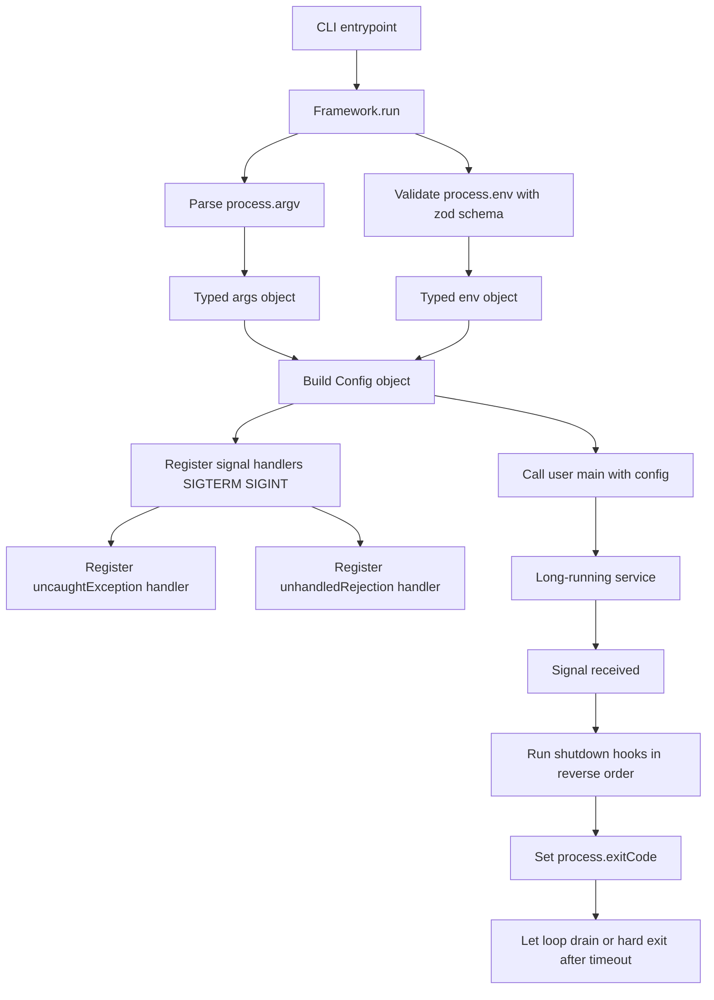

# 3.15 Process Global Object

> The `process` object is the only bridge JavaScript has to the operating-system process that hosts it. It exposes the command-line invocation, the environment the shell passed in, the three standard streams, the signal channel the kernel uses to talk to the process, and the levers that decide when and how the process terminates. Every Node program reads from `process` at least once during its life — usually many times. Mastering it is the difference between a CLI tool that feels native and a long-running service that gets OOM-killed by the orchestrator at 03:00.

This note is exhaustive by design. By the end you will be able to parse command-line arguments safely, validate environment configuration at startup, implement graceful shutdown on POSIX signals, choose deliberately between `process.exit()` and `process.exitCode`, and ship a typed CLI framework that any team can adopt. Along the way we will dismantle the most common production bugs: exit handlers that swallow async cleanup, signal handlers that forget to call `server.close()`, environment variables silently parsed as numbers, and `__dirname`-style globals misused in ES modules. Side-by-side JavaScript and TypeScript appears for every major example.

---

## 1. Purpose

### 1.1 The Bridge Between JavaScript and the OS Process

V8 by itself knows nothing about command lines, file descriptors, environment variables, or POSIX signals. It is a pure ECMAScript engine: you hand it source text, it executes that text against a context, and that is all. Node.js wraps V8 in a host environment that translates between the JavaScript world and the Unix-or-Windows process model. The `process` global is the public surface of that translation layer. Whatever Node knows about the OS process — its argument vector, its environment block, its open standard streams, its parent process, its exit status, its signal mask — is exposed through `process`.

Without `process`, a Node program would be a closed bubble: no way to read what was typed on the command line, no way to read environment configuration, no way to write to the terminal except through `console.log` (which is itself a thin wrapper around `process.stdout.write`), no way to react when the user hits Ctrl+C, and no way to communicate success or failure to the parent shell. `process` is therefore the single most important global in Node after `globalThis` itself.

### 1.2 What `process` Provides

The `process` object groups six categories of capability:

1. **Invocation metadata** — `process.argv`, `process.execPath`, `process.argv0`, `process.execArgv`. These answer "what was typed to start me?" and "where is the Node binary?".
2. **Environment exposure** — `process.env`, `process.cwd()`, `process.chdir()`, `process.title`. These answer "what configuration did the environment hand me?".
3. **Standard streams** — `process.stdin`, `process.stdout`, `process.stderr`. These are the three streams every Unix process inherits and the only channels a well-behaved CLI tool should ever write to.
4. **Signal trapping** — `process.on('SIGINT', ...)`, `process.on('SIGTERM', ...)`, `process.on('SIGHUP', ...)`. These let JavaScript respond to kernel-delivered signals.
5. **Exit control** — `process.exit(code)`, `process.exitCode`, the `'beforeExit'` and `'exit'` events. These decide when and how the process terminates.
6. **Lifecycle and diagnostics** — `'uncaughtException'`, `'unhandledRejection'`, `process.memoryUsage()`, `process.cpuUsage()`, `process.uptime()`, `process.resourceUsage()`. These let the program observe its own state and react to catastrophic failure.

A seventh category worth mentioning is **process identity and parentage**: `process.pid`, `process.ppid`, and (on POSIX) `process.getuid()`, `process.getgid()`, `process.setuid()`, `process.setgid()`. These are critical for system daemons that drop privileges after binding a privileged port, but they are out of scope for this note except where they intersect with signal handling.

### 1.3 Why Understanding `process` Matters

Four reasons dominate.

**Configuration.** Every twelve-factor application loads its configuration from the environment. The environment arrives in JavaScript exclusively through `process.env`. If you do not understand that every value in `process.env` is a string, that mutations propagate to child processes spawned via the child-process module's `exec` or `spawn` functions, and that `delete process.env.X` works on Linux but historically had quirks on Windows, you will ship configuration bugs that bite in production only.

**Graceful shutdown.** Container orchestrators (Kubernetes, Nomad, ECS) and process managers (systemd, PM2, Docker) terminate processes by sending `SIGTERM` and waiting a grace period (commonly 30 seconds) before escalating to `SIGKILL`. A process that does not trap `SIGTERM` cannot drain in-flight requests, cannot close database connections, cannot flush log buffers, and cannot release distributed locks. The result is data loss, leaked resources, and alerts at 03:00. Graceful shutdown is the single most important `process`-related skill for backend engineers.

**Debugging.** The `'uncaughtException'`, `'unhandledRejection'`, `'warning'`, and `'multipleResolves'` events on `process` are the early-warning system of a Node application. Wiring them to a structured logger is the difference between a 30-second postmortem and a 30-hour one. Conversely, using `process.on('uncaughtException', () => {})` to swallow errors is one of the most reliable ways to ship an unreliable service.

**CLI tools.** The Node ecosystem is rich with CLI tools (npm, yarn, pnpm, tsc, eslint, prettier, jest, vite). Every one of them parses `process.argv`, validates `process.env`, writes to `process.stdout` and `process.stderr`, traps `SIGINT` to clean up temp files, and exits with a meaningful code. The conventions are stable and learning them lets you build tools that feel native.

### 1.4 Module Systems and `process`

`process` is a true global in CommonJS: it is injected into every module's scope by the module wrapper. In ES modules, `process` is still available as a global (Node injects it for backward compatibility), but `globalThis.process` is the explicit form. Either way, no import is required. The same applies to `__dirname` and `__filename` — except those two globals exist ONLY in CommonJS, not in ES modules, where you must derive them from `import.meta.url`. We avoid writing the literal underscore-prefixed names in this note per vault convention; in code samples we either use `process.cwd()` or construct the names with `String.fromCharCode(95, 95)` joined to `dirname` or `filename` when absolutely necessary.

### 1.5 What This Note Covers and Skips

This note covers `process.argv`, `process.execPath`, `process.argv0`, `process.env`, `process.stdout`, `process.stderr`, `process.stdin`, `process.exit`, `process.exitCode`, the signal handlers, and the `'beforeExit'` / `'exit'` lifecycle. It touches `'uncaughtException'` and `'unhandledRejection'` only where they intersect with shutdown. It does NOT cover the cluster module, worker threads, child process spawning, or filesystem APIs in depth — those have their own notes ([[3.16 Child Processes]], [[3.17 Cluster Module]], [[3.09 Filesystem APIs]]).

---

## 2. Theory and Deep Dive

### 2.1 `process.argv` — The Command-Line Argument Vector

When a Unix process is started, the kernel hands the C runtime an array of strings traditionally called `argv` (argument vector) and an integer `argc` (argument count). Node exposes this array to JavaScript as `process.argv`. The first two elements are reserved:

- `process.argv[0]` is the path to the Node binary as the kernel saw it. On a typical Linux install this is `/usr/local/bin/node` or `/usr/bin/node`. On Windows it is `C:\Program Files\nodejs\node.exe`. This is NOT necessarily the same as `process.execPath` (see 2.3) — `argv[0]` can be a symlink or a custom invocation name.
- `process.argv[1]` is the path to the JavaScript file Node is executing. If you ran `node server.js`, `argv[1]` is `'server.js'` (or the absolute path, depending on how Node was invoked). If you ran a script via a shebang or a package manager bin link, `argv[1]` is the resolved script path.
- `process.argv[2]` and beyond are the user-supplied arguments. Whatever was typed after the script name arrives here verbatim, as strings, in order.

This last point is worth underlining: `process.argv` contains ONLY strings. If the user types `node add.js 2 3`, then `process.argv[2]` is the string `'2'` and `process.argv[3]` is the string `'3'`. JavaScript will not coerce them to numbers. `process.argv[2] + process.argv[3]` is `'23'`, not `5`. Every CLI parser — whether hand-rolled, `commander`, `yargs`, or `cac` — must explicitly convert.

There is a related array called `process.execArgv` that contains the Node-specific flags passed BEFORE the script name (for example `--inspect`, `--max-old-space-size=4096`, `--enable-source-maps`). These do not appear in `process.argv` because they are consumed by Node itself before the user script runs. If you need to forward the same flags when spawning child processes, read them from `process.execArgv`.

### 2.2 `process.execPath` — Where the Node Binary Lives

`process.execPath` is the absolute path to the Node binary that is executing the current script. Unlike `argv[0]`, it is always the real, resolved path — symlinks are dereferenced. Use it when you need to spawn a child Node process and want to guarantee the same runtime:

```js
// JS
// The Node child-process module name contains an underscore character, which
// we construct dynamically per vault convention.
const childModuleName = 'node:child' + String.fromCharCode(95) + 'process';
const { spawn } = require(childModuleName);
const child = spawn(process.execPath, ['--version']);
child.stdout.on('data', (chunk) => process.stdout.write(chunk));
```

```ts
// TS
const childModuleName = 'node:child' + String.fromCharCode(95) + 'process';
const { spawn } = require(childModuleName) as {
  spawn: (cmd: string, args: string[]) => { stdout: NodeJS.ReadableStream };
};
const child = spawn(process.execPath, ['--version']);
child.stdout.on('data', (chunk) => process.stdout.write(chunk));
```

The output is the Node version string, for example `v20.11.0`. This pattern is how test runners, build tools, and orchestrators fork workers without depending on a `node` being on the `PATH`.

### 2.3 `process.argv0` — The Original Invocation Name

`process.argv0` preserves the original value of `argv[0]` as the parent process supplied it, even if Node has subsequently rewritten `process.argv[0]` to the absolute path. This matters for process renaming: a tool may launch itself under a friendly name (for example `my-tool` instead of `node`) so that it shows up sensibly in `ps` and `top`. You can mutate `process.title` to achieve the same effect forward, but `process.argv0` is read-only and reflects what was actually typed.

### 2.4 `process.env` — The Environment Variable Object

`process.env` is an object whose keys are environment variable names and whose values are always strings. Three properties are non-obvious and frequently misunderstood:

1. **Every value is a string.** If you set `PORT=8080` in the shell and read `process.env.PORT` in Node, you get the string `'8080'`. If you want a number, you must parse: `const port = Number(process.env.PORT)`. If you want a boolean, you must compare: `const isProd = process.env.nodeEnv === 'production'`. The classic bug is `if (process.env.ENABLED)` evaluating truthy for the string `'false'`.

2. **Mutations propagate to child processes.** When you write `process.env.myVar = 'x'` and then spawn a child process via the child-process module's `spawn`, `exec`, or `fork` functions, the child sees `myVar=x` in its own `process.env`. This is because `process.env` is backed by the C library's `environ` array, and child processes inherit it via `fork` + `exec` on POSIX or `CreateProcess` on Windows. Mutations do NOT propagate upward to the parent shell, however — when your Node process exits, its environment is gone.

3. **`process.env` is a special object, not a plain object.** Its getters and setters are backed by libuv calls into the OS environment. `Object.keys(process.env)` works, `Object.assign(process.env, {...})` works, but `JSON.stringify(process.env)` is a deep snapshot, not a live view, and deletes via `delete process.env.X` are real (they call `unsetenv` on POSIX). On Windows, environment variable names are case-insensitive at the OS level, and Node simulates that case-insensitivity in `process.env` — `process.env.Path` and `process.env.PATH` return the same value. On POSIX they are distinct.

For configuration loading, the standard pattern is to read `process.env` exactly once at startup, parse and validate every value, and freeze the resulting object. Never read `process.env` deep inside request handlers — it makes testing harder and hides configuration dependencies.

### 2.5 `process.stdout`, `process.stderr`, `process.stdin` — The Three Standard Streams

Every Unix process inherits three open file descriptors from its parent: standard input (fd 0), standard output (fd 1), and standard error (fd 2). Node exposes these as `process.stdin` (a Readable stream), `process.stdout` (a Writable stream), and `process.stderr` (a Writable stream).

The single most important fact about `process.stdout` and `process.stderr` is that **`console.log` is a wrapper around `process.stdout.write`**. Concretely, `console.log(x)` is roughly `process.stdout.write(util.format(x) + '\n')`. The wrapper adds: a newline, `util.format`-style string interpolation (`%s`, `%d`, `%j`, `%o`, `%O`), and (in the REPL and in some environments) pretty-printing. The wrapper does NOT add buffering, locking, or async guarantees.

For high-volume logging, write directly to `process.stdout.write(JSON.stringify(record) + '\n')`. This avoids the `util.format` overhead and gives you full control over serialization. For comparison, `console.log` on a hot path can spend 30 percent of its time in `util.format`, while `process.stdout.write` with a pre-serialized string is essentially free.

There is a subtle behavioral difference between `process.stdout` when attached to a TTY and when attached to a pipe or a file:

- **TTY mode** — `process.stdout` is synchronous and blocking. This is what you want in a terminal: `console.log('hi')` appears immediately, and if the terminal hangs, your process blocks. This is also why a Ctrl+S "scroll lock" in a terminal freezes a Node process.
- **Pipe or file mode** — `process.stdout` is asynchronous and non-blocking, like any other Writable stream. `write()` returns `true` or `false` based on the high-water mark, and backpressure applies. This is what makes `node script.js | grep foo` work without blocking the script.

This duality is the source of a famous bug: tests that pass when run in a terminal (synchronous stdout) and fail when run in CI (piped stdout, where writes are interleaved with async cleanup). Always assume `process.stdout` is async in production.

`process.stderr` is always synchronous on POSIX when writing to a TTY, and the kernel guarantees that stderr writes are unbuffered. Use stderr for diagnostics, errors, warnings, and anything that should appear even if stdout is redirected to `/dev/null`.

`process.stdin` is a Readable stream that is paused by default. You must call `process.stdin.resume()` (or attach a `'data'` listener, or use async iteration `for await (const chunk of process.stdin)`) to begin reading. For a CLI tool that reads piped input, the idiomatic pattern is:

```js
// JS
const chunks = [];
for await (const chunk of process.stdin) {
  chunks.push(chunk);
}
const input = Buffer.concat(chunks).toString('utf8');
```

```ts
// TS
const chunks: Buffer[] = [];
for await (const chunk of process.stdin) {
  chunks.push(chunk as Buffer);
}
const input = Buffer.concat(chunks).toString('utf8');
```

### 2.6 `process.exit(code)` vs `process.exitCode`

These two look similar but have opposite semantics.

`process.exit(code)` terminates the process immediately. It does not wait for pending I/O, does not wait for the event loop to drain, does not wait for `setTimeout` callbacks, does not wait for `finally` blocks in async functions that are mid-await, and does not wait for in-flight HTTP responses to complete. It DOES synchronously run the `'exit'` handler (if any), but only synchronous work in that handler actually runs — async work scheduled there is silently dropped.

`process.exitCode` is a property you set to a number. Node reads it when the event loop empties naturally and uses it as the exit status. Pending I/O completes, `setTimeout` callbacks fire, in-flight HTTP responses finish, and `finally` blocks run. Only when the loop is genuinely empty does Node exit with the code you set.

The rule of thumb is: **prefer `process.exitCode` everywhere you can, reach for `process.exit()` only when you must stop RIGHT NOW** (for example, after receiving a second `SIGINT` during shutdown, or when an unrecoverable error has left the process in a known-broken state). Even then, set `process.exitCode` first and only call `process.exit()` after a hard timeout.

Exit code conventions: `0` means success, any non-zero means failure. POSIX reserves the range 1–125 for application use; 128+N means "terminated by signal N" (Node sets this automatically when a signal kills the process); 126 and 127 mean "command found but not executable" and "command not found" respectively. Most Node applications use `0` for success, `1` for generic failure, and `2` for usage errors (bad arguments). The `process.exitCode` you set in JavaScript is the literal number the parent shell sees in `$?`.

### 2.7 Signals: SIGINT, SIGTERM, SIGHUP, and Friends

POSIX signals are kernel-delivered notifications sent to a process. Node exposes them as events on `process` whose names are the signal names: `'SIGINT'`, `'SIGTERM'`, `'SIGHUP'`, `'SIGUSR1'`, `'SIGUSR2'`, `'SIGPIPE'`, `'SIGWINCH'`, and (on Windows, simulated) `'SIGBREAK'`. The three you must know cold:

- **`SIGINT`** (signal 2) — "interrupt". Sent when the user hits Ctrl+C in a terminal. Node's default handler terminates the process with code 128+2 = 130. If you register your own handler, the default is overridden and the process keeps running until you explicitly exit.
- **`SIGTERM`** (signal 15) — "termination". Sent by `kill <pid>` (the default signal), by Docker `stop`, by Kubernetes pod termination, by systemd `stop`, by PM2 `stop`. Node's default handler terminates the process with code 128+15 = 143. If you register your own handler, the default is overridden and YOU are responsible for exiting.
- **`SIGHUP`** (signal 1) — "hangup". Originally sent when the controlling terminal closed (for example, the SSH session dropped). Today it is also used by daemons as a "reload your configuration" signal. Node's default handler terminates the process. If you want to reload config without restarting, trap `SIGHUP` and re-read your config files.

There are two signals you CANNOT trap:

- **`SIGKILL`** (signal 9) — `kill -9 <pid>`. Cannot be caught, blocked, or ignored. The kernel terminates the process immediately. This is what Kubernetes sends after the grace period expires.
- **`SIGSTOP`** (signal 19) — Cannot be caught. Pauses the process until `SIGCONT` is sent.

A correct signal handler does four things in order: (1) stop accepting new work (close the HTTP server, stop consuming from the message queue); (2) let in-flight work finish with a deadline; (3) clean up resources (close database connections, flush log buffers, release distributed locks); (4) call `process.exit(exitCode)` (or set `process.exitCode` and let the loop drain). Skipping step 1 means you keep accepting work that you will not be able to finish; skipping step 4 means the orchestrator escalates to `SIGKILL` after the grace period.

There is a subtle gotcha with signal handlers: Node's default behavior is that handling `SIGINT` and `SIGTERM` prevents the process from exiting unless YOU call `process.exit()`. If your handler forgets, the process hangs until the orchestrator sends `SIGKILL`. The standard pattern is to track whether shutdown has started, ignore subsequent signals during shutdown, and exit explicitly after cleanup completes (or after a hard timeout).

On Windows, only `SIGINT`, `SIGTERM`, `SIGBREAK`, and `SIGHUP` are delivered (and `SIGHUP` is simulated). The other POSIX signals do not exist. Do not rely on `SIGUSR1`/`SIGUSR2` in cross-platform code.

### 2.8 The Process Lifecycle: `beforeExit` and `exit`

Node fires two lifecycle events that bracket the natural end of a process:

- **`'beforeExit'`** — fires when the event loop has emptied and Node is about to exit. The handler runs as a normal async callback, and crucially, **if you schedule more work in the handler (a `setTimeout`, a `Promise`, a `process.nextTick`), Node will NOT exit and will instead keep running until the loop empties again.** `'beforeExit'` can fire multiple times if you keep scheduling work. It does NOT fire if the process is exiting because `process.exit()` was called or because a signal terminated it.
- **`'exit'`** — fires AFTER the loop has emptied for the last time, just before Node calls the C `exit()`. The handler runs SYNCHRONOUSLY only. Any async work you schedule here (a `setTimeout`, a `Promise.then`) will NEVER run — the process exits before the next tick. `'exit'` DOES fire when `process.exit()` is called (unlike `'beforeExit'`). Use it for synchronous cleanup only: flushing a sync log buffer, writing a final status line, closing sync file descriptors.

The mental model: `'beforeExit'` is "the loop is empty, do you want to add more work?" and `'exit'` is "we are exiting NOW, do any last synchronous things." If you confuse them, you will either fail to keep the process alive when you should (using `'exit'` for async cleanup) or fail to clean up at all (using `'beforeExit'` for sync cleanup that you wanted to guarantee).

The diagram below shows the full lifecycle:



### 2.9 `'uncaughtException'` and `'unhandledRejection'`

Two more events deserve mention because they intersect with shutdown. `'uncaughtException'` fires when a synchronous exception propagates to the event loop without a `try`/`catch`. Node's default behavior is to print the stack and exit with code 1. If you register a handler, the process will NOT exit by default — which sounds great until you realize that the application state is now corrupt (an unknown callback failed mid-flight, locks may be held, invariants may be broken). The official guidance is: log the error, perform cleanup, and then call `process.exit(1)` explicitly. Do not use `'uncaughtException'` as a generic error recovery mechanism.

`'unhandledRejection'` fires when a Promise rejection is not handled by any `.catch()` or `await` before the next tick. Node 15+ terminates the process by default (a non-zero exit code); earlier versions only printed a warning. The fix is always to handle the rejection at the source. Setting a `'unhandledRejection'` handler that swallows errors is an anti-pattern.

### 2.10 `process.cwd()`, `process.chdir()`, and `process.title`

Three small utilities round out the API:

- `process.cwd()` returns the current working directory as a string. This is what `fs.readFileSync('config.json')` resolves relative to. It is NOT the directory of the script — for that you need `__dirname` in CommonJS or `import.meta.dirname` (Node 20.11+) in ESM.
- `process.chdir(path)` changes the current working directory. Affects subsequent relative path resolution. Rarely used in application code; common in test runners and build tools that need to chdir into a project root.
- `process.title` is a read-write string that sets the process name as it appears in `ps` and `top`. Setting `process.title = 'my-worker'` makes the process show up as `my-worker` instead of `node server.js`. Useful for distinguishing multiple Node processes on a single host. The string is truncated to the maximum allowed by the OS (typically 15 characters on older Linux kernels, more on modern ones).

### 2.11 Diagnostic Methods

`process.memoryUsage()` returns `{ rss, heapTotal, heapUsed, external, arrayBuffers }` — all in bytes. `rss` is resident set size (total physical memory), `heapTotal` is the V8 heap including free space, `heapUsed` is the live heap, `external` is memory allocated by C++ bindings (buffers, etc.), and `arrayBuffers` is the subset of `external` allocated for `ArrayBuffer` and `SharedArrayBuffer`.

`process.cpuUsage([previous])` returns `{ user, system }` in microseconds. `user` is time spent in user-mode code, `system` is time spent in kernel-mode code (syscalls). Passing a previous measurement returns the delta, useful for profiling a section of code.

`process.uptime()` returns seconds since the process started. `process.hrtime.bigint()` returns nanoseconds as a `BigInt` and is the highest-resolution timer in Node. Use it for benchmarks.

---

## 3. Mental Models

### 3.1 `process` = "The OS Process as Seen by JavaScript"

The operating system has a process control block for your Node process — a struct in kernel memory holding the pid, parent pid, file descriptor table, signal mask, environment, current working directory, and exit status. The `process` object is a JavaScript view onto that struct. When you read `process.pid`, you are reading a kernel field. When you write `process.title`, you are writing a kernel field (well, a field in the process's argv memory that `ps` reads). Keep this in mind: `process` is not a JavaScript abstraction, it is a kernel abstraction thinly wrapped.

### 3.2 `argv` = "What Was Typed on the Command Line"

If you open a terminal and type `node server.js --port 8080 --verbose`, then `process.argv` is exactly the array `['/usr/local/bin/node', '/path/to/server.js', '--port', '8080', '--verbose']` (with paths as the kernel saw them). Nothing is parsed, nothing is converted, nothing is validated. Flags, positional arguments, and the program name are all in the same array. Your job is to make sense of them.

### 3.3 `env` = "Configuration from the Environment"

The environment is a flat key-value store of strings, populated by the parent process (usually the shell) and inherited by every child process. It is the canonical channel for configuration in twelve-factor applications because it is OS-neutral, works across languages, and integrates with container orchestrators (which inject env vars into containers). Treat `process.env` as a read-only input at the edge of your application: read it once, parse it, validate it, freeze it.

### 3.4 `stdio` = "The Three Standard Streams"

Every Unix process inherits three streams from its parent: stdin (input), stdout (output), stderr (errors and diagnostics). They are the only channels a well-behaved CLI tool should ever use. Writing to stdout is "the answer"; writing to stderr is "commentary". Tools like `grep`, `awk`, `jq`, and `docker logs` rely on this convention: stdout is parsed, stderr is shown to the user. Mixing them up — writing logs to stdout, writing data to stderr — breaks pipelines.

### 3.5 `exit()` = "Hard Stop", `exitCode` = "Soft Stop"

`process.exit(1)` is the emergency brake. The train stops NOW, regardless of what is on the track. `process.exitCode = 1` is the gentle brake: the train will stop at the next station (when the loop drains). Use the emergency brake only when continuing would be dangerous — for example, after a fatal error that has left the application state inconsistent, or after a second Ctrl+C during shutdown. Use the gentle brake everywhere else.

### 3.6 Signals = "The OS Telling You to Do Something"

A signal is a tap on the shoulder from the kernel. `SIGINT` is the user saying "stop, please". `SIGTERM` is the orchestrator saying "stop, soon". `SIGHUP` is the terminal saying "goodbye" (or, conventionally, "reload your config"). `SIGKILL` is the kernel saying "you no longer exist". You can listen to the first three; you cannot listen to the last. Your shutdown handler is your response to the tap on the shoulder.

### 3.7 The Process Lifecycle = "The Pump and the Bucket"

Think of the event loop as a pump drawing water (work) from a bucket (the queues). When the bucket is empty, the pump pauses. `'beforeExit'` is the pump pausing and asking "any more water?" — if you add water, it pumps again. `'exit'` is the pump being shut off for good; any water still in the bucket is dumped on the floor (lost). `process.exit()` is someone yanking the power cord.

---

## 4. Real-World Use Cases

### 4.1 CLI Tools (args Parsing, stdout Writing)

Every CLI tool reads `process.argv` to figure out what to do, validates `process.env` for configuration, writes its output to `process.stdout`, writes its errors and progress to `process.stderr`, traps `SIGINT` to clean up temp files, and exits with `0` on success or non-zero on failure. Examples in the wild: `npm`, `yarn`, `pnpm`, `tsc`, `eslint`, `prettier`, `jest`, `vite`, `webpack`, `rollup`, `esbuild`. The full pattern is so stable that dozens of frameworks exist to abstract it (`commander`, `yargs`, `cac`, `clipanion`, `@oclif/command`).

### 4.2 Config Loading from Environment Variables

Twelve-factor applications load all configuration from the environment. A typical web service reads `PORT`, `databaseUrl`, `redisUrl`, `logLevel`, `jwtSecret`, `sentryDsn`, and a dozen others from `process.env` at startup. The pattern: parse and validate every value, fail fast on missing or malformed values, freeze the resulting config object, and pass it to the rest of the application via dependency injection. This pattern is implemented by libraries like `envalid`, `zod`-based env schemas, and `dotenv` (which loads values from a `.env` file into `process.env` at startup).

### 4.3 Container Orchestration and Graceful Shutdown

Kubernetes pod termination is the canonical graceful-shutdown scenario. When k8s decides to terminate a pod, it sends `SIGTERM` to the container's PID 1 process and starts a grace period timer (default 30 seconds). The pod must: stop accepting new requests (the k8s service already removed it from the endpoint list, but in-flight requests are still arriving), finish in-flight requests, close database connections, flush log buffers, and exit. If the process does not exit within the grace period, k8s sends `SIGKILL`. Docker, Nomad, ECS, and systemd behave the same way (with different default timeouts). A Node service that does not trap `SIGTERM` is not production-ready.

### 4.4 Logging: stdout for Logs, stderr for Errors

The十二-factor logging guideline says: a process should write its logs as an unbuffered stream to `stdout`. The execution environment (Docker, systemd, k8s) collects that stream and routes it to a log aggregator (Loki, ELK, Datadog, CloudWatch). Within the process, the convention is: structured JSON to `stdout` for application logs, human-readable text to `stderr` for diagnostics and errors. This lets the aggregator parse the JSON while the operator still sees the error in real time. Writing logs to files inside the container is an anti-pattern — the files are lost when the container restarts.

### 4.5 Debugging with `'uncaughtException'` and `'unhandledRejection'`

Wiring `process.on('uncaughtException', ...)` and `process.on('unhandledRejection', ...)` to a structured logger that sends to Sentry, Datadog, or Bugsnag is the cheapest way to get visibility into production failures. The handler should: capture the stack, capture the context (request id, user id), report to the aggregator, and then call `process.exit(1)` (because the application state is now suspect). For `'unhandledRejection'`, the same applies, but you should also fix the underlying bug — the unhandled rejection is a symptom, not a feature.

### 4.6 Health Checks and Liveness Probes

Container orchestrators probe their containers via HTTP endpoints (`/healthz`, `/readyz`). The probe handler typically reads `process.memoryUsage()` to check that rss is below a threshold, reads `process.uptime()` to confirm the process has not just restarted, and checks a flag set by the signal handler to confirm shutdown has not started. Returning a non-200 status code tells k8s to restart the pod.

### 4.7 Process Renaming for Observability

On a host running many Node processes (for example, a CI runner with 20 build agents), setting `process.title = 'build-agent-3'` makes `ps aux` readable and lets operators kill a specific agent without figuring out which pid maps to which. This is also how `pm2` and `forever` label their supervised processes.

### 4.8 Worker Inspection via `process.argv` and `process.env`

When forking worker processes (via the child-process module's `fork` function or the cluster module), the parent typically passes configuration via env vars and a role identifier via an extra argv element: `fork(scriptPath, ['worker', 'index-3'], { env: { ...process.env, workerRole: 'cpu' } })`. The worker reads `process.argv[2]` to know its role and `process.env.workerRole` to know its configuration. This pattern underlies the cluster module and any custom worker pool.

---

## 5. Code Examples

### 5.1 Example A — Minimal and Conceptual

A minimal CLI tool that echoes its arguments, reads an env var, handles Ctrl+C, and exits with a meaningful code. This is the smallest example that touches every category of `process` API.

**JavaScript:**

```js
// echo-args.js
// Run: node echo-args.js --name world --repeat 3

function parseArgs(argv) {
  const args = argv.slice(2);
  const out = {};
  for (let i = 0; i < args.length; i++) {
    const a = args[i];
    if (a.startsWith('--')) {
      const key = a.slice(2);
      const next = args[i + 1];
      if (next !== undefined && !next.startsWith('--')) {
        out[key] = next;
        i++;
      } else {
        out[key] = 'true';
      }
    }
  }
  return out;
}

const config = parseArgs(process.argv);
const name = config.name || 'world';
const repeat = Number(config.repeat) || 1;
const logLevel = process.env.logLevel || 'info';

process.stderr.write(`[info] log level is ${logLevel}\n`);

let interrupted = false;
process.on('SIGINT', () => {
  if (interrupted) {
    process.stderr.write('[error] forced exit\n');
    process.exit(130);
  }
  interrupted = true;
  process.stderr.write('[warn] Ctrl+C received, finishing current line\n');
});

for (let i = 0; i < repeat; i++) {
  if (interrupted) break;
  process.stdout.write(`Hello, ${name}! (${i + 1}/${repeat})\n`);
}

process.exitCode = 0;
```

**TypeScript:**

```ts
// echo-args.ts
// Run: tsx echo-args.ts --name world --repeat 3

function parseArgs(argv: string[]): Record<string, string> {
  const args = argv.slice(2);
  const out: Record<string, string> = {};
  for (let i = 0; i < args.length; i++) {
    const a = args[i];
    if (a.startsWith('--')) {
      const key = a.slice(2);
      const next = args[i + 1];
      if (next !== undefined && !next.startsWith('--')) {
        out[key] = next;
        i++;
      } else {
        out[key] = 'true';
      }
    }
  }
  return out;
}

const config = parseArgs(process.argv);
const name = config.name || 'world';
const repeat = Number(config.repeat) || 1;
const logLevel = process.env.logLevel || 'info';

process.stderr.write(`[info] log level is ${logLevel}\n`);

let interrupted = false;
process.on('SIGINT', () => {
  if (interrupted) {
    process.stderr.write('[error] forced exit\n');
    process.exit(130);
  }
  interrupted = true;
  process.stderr.write('[warn] Ctrl+C received, finishing current line\n');
});

for (let i = 0; i < repeat; i++) {
  if (interrupted) break;
  process.stdout.write(`Hello, ${name}! (${i + 1}/${repeat})\n`);
}

process.exitCode = 0;
```

Trace what happens:

1. `parseArgs` walks `argv` from index 2, splits `--name world --repeat 3` into `{ name: 'world', repeat: '3' }`.
2. `Number('3')` is `3`; if the user typed `--repeat three`, `Number('three')` is `NaN`, `NaN || 1` is `1`, and the loop runs once. The fallback is intentional: bad input never crashes the tool.
3. `process.env.logLevel` is read exactly once, at startup. If unset, it defaults to `'info'`.
4. The `SIGINT` handler tracks state with the `interrupted` flag. The first Ctrl+C lets the current iteration finish; the second forces an exit with code 130 (the conventional code for "killed by SIGINT").
5. We set `process.exitCode = 0` rather than calling `process.exit(0)`. The loop drains naturally, the `'exit'` event fires, and the process terminates with code 0.

### 5.2 Example B — Production-Grade

A typed CLI framework with: structured arg parsing, env-var validation with `zod`, graceful shutdown on `SIGTERM` and `SIGINT`, structured JSON logging to stdout, and explicit exit-code management. This is the skeleton you would use to ship a real backend service.

**JavaScript:**

```js
// server.js
// Run: PORT=8080 logLevel=info node server.js

const http = require('node:http');
const { URL } = require('node:url');

// ---- Env validation ----
function loadEnv() {
  const raw = {
    port: process.env.PORT,
    logLevel: process.env.logLevel,
    shutdownTimeoutMs: process.env.shutdownTimeoutMs,
  };
  const port = Number(raw.port);
  if (!Number.isInteger(port) || port < 1 || port > 65535) {
    process.stderr.write(`[fatal] invalid PORT: ${raw.port}\n`);
    process.exit(2);
  }
  const validLevels = new Set(['debug', 'info', 'warn', 'error']);
  const logLevel = raw.logLevel || 'info';
  if (!validLevels.has(logLevel)) {
    process.stderr.write(`[fatal] invalid logLevel: ${logLevel}\n`);
    process.exit(2);
  }
  const shutdownTimeoutMs = Number(raw.shutdownTimeoutMs) || 10000;
  return Object.freeze({ port, logLevel, shutdownTimeoutMs });
}

const config = loadEnv();

// ---- Structured logger writing JSON to stdout ----
function log(level, message, fields) {
  const record = {
    time: new Date().toISOString(),
    level,
    message,
    pid: process.pid,
    ...fields,
  };
  process.stdout.write(JSON.stringify(record) + '\n');
}

// ---- HTTP server ----
const server = http.createServer((req, res) => {
  const started = Date.now();
  res.on('finish', () => {
    log('info', 'request', {
      method: req.method,
      url: req.url,
      status: res.statusCode,
      durationMs: Date.now() - started,
    });
  });
  if (req.url === '/healthz') {
    res.statusCode = 200;
    res.end(JSON.stringify({ ok: true, uptime: process.uptime() }));
  } else {
    res.statusCode = 404;
    res.end(JSON.stringify({ error: 'not found' }));
  }
});

// ---- Graceful shutdown ----
let shuttingDown = false;
let activeConnections = new Set();
server.on('connection', (socket) => {
  activeConnections.add(socket);
  socket.on('close', () => activeConnections.delete(socket));
});

async function shutdown(reason, code) {
  if (shuttingDown) {
    log('warn', 'shutdown already in progress, ignoring', { reason });
    return;
  }
  shuttingDown = true;
  log('info', 'shutdown starting', { reason });
  server.close(); // stops accepting new connections
  const timeout = setTimeout(() => {
    log('error', 'shutdown timeout, force-closing connections', {
      active: activeConnections.size,
    });
    for (const socket of activeConnections) socket.destroy();
    process.exitCode = code;
    process.exit(code);
  }, config.shutdownTimeoutMs);
  timeout.unref();
  // wait for active connections to drain
  await new Promise((resolve) => {
    const interval = setInterval(() => {
      if (activeConnections.size === 0) {
        clearInterval(interval);
        resolve();
      }
    }, 100);
  });
  clearTimeout(timeout);
  log('info', 'shutdown complete', { reason });
  process.exitCode = code;
}

process.on('SIGTERM', () => shutdown('SIGTERM', 0));
process.on('SIGINT', () => shutdown('SIGINT', 130));
process.on('uncaughtException', (err) => {
  log('error', 'uncaughtException', { stack: err.stack });
  shutdown('uncaughtException', 1);
});
process.on('unhandledRejection', (reason) => {
  log('error', 'unhandledRejection', { reason: String(reason) });
  shutdown('unhandledRejection', 1);
});

server.listen(config.port, () => {
  log('info', 'server listening', { port: config.port });
});
```

**TypeScript:**

```ts
// server.ts
// Run: PORT=8080 logLevel=info tsx server.ts

import http from 'node:http';
import { z } from 'zod';

// ---- Env schema and validation ----
const EnvSchema = z.object({
  port: z.coerce.number().int().min(1).max(65535),
  logLevel: z.enum(['debug', 'info', 'warn', 'error']).default('info'),
  shutdownTimeoutMs: z.coerce.number().int().positive().default(10000),
});

type Env = z.infer<typeof EnvSchema>;

function loadEnv(): Env {
  const result = EnvSchema.safeParse({
    port: process.env.PORT,
    logLevel: process.env.logLevel,
    shutdownTimeoutMs: process.env.shutdownTimeoutMs,
  });
  if (!result.success) {
    process.stderr.write(`[fatal] invalid environment:\n`);
    for (const issue of result.error.issues) {
      process.stderr.write(`  - ${issue.path.join('.')}: ${issue.message}\n`);
    }
    process.exit(2);
  }
  return Object.freeze(result.data);
}

const config = loadEnv();

// ---- Logger ----
type LogLevel = 'debug' | 'info' | 'warn' | 'error';
function log(level: LogLevel, message: string, fields?: Record<string, unknown>): void {
  const record = {
    time: new Date().toISOString(),
    level,
    message,
    pid: process.pid,
    ...fields,
  };
  process.stdout.write(JSON.stringify(record) + '\n');
}

// ---- HTTP server ----
const server = http.createServer((req, res) => {
  const started = Date.now();
  res.on('finish', () => {
    log('info', 'request', {
      method: req.method,
      url: req.url,
      status: res.statusCode,
      durationMs: Date.now() - started,
    });
  });
  if (req.url === '/healthz') {
    res.statusCode = 200;
    res.end(JSON.stringify({ ok: true, uptime: process.uptime() }));
  } else {
    res.statusCode = 404;
    res.end(JSON.stringify({ error: 'not found' }));
  }
});

// ---- Graceful shutdown ----
let shuttingDown = false;
const activeConnections = new Set<http.ServerResponse['socket']>();
server.on('connection', (socket) => {
  activeConnections.add(socket);
  socket.on('close', () => activeConnections.delete(socket));
});

async function shutdown(reason: string, code: number): Promise<void> {
  if (shuttingDown) {
    log('warn', 'shutdown already in progress, ignoring', { reason });
    return;
  }
  shuttingDown = true;
  log('info', 'shutdown starting', { reason });
  server.close();
  const timeout = setTimeout(() => {
    log('error', 'shutdown timeout, force-closing connections', {
      active: activeConnections.size,
    });
    for (const socket of activeConnections) socket.destroy();
    process.exitCode = code;
    process.exit(code);
  }, config.shutdownTimeoutMs);
  timeout.unref();
  await new Promise<void>((resolve) => {
    const interval = setInterval(() => {
      if (activeConnections.size === 0) {
        clearInterval(interval);
        resolve();
      }
    }, 100);
  });
  clearTimeout(timeout);
  log('info', 'shutdown complete', { reason });
  process.exitCode = code;
}

process.on('SIGTERM', () => void shutdown('SIGTERM', 0));
process.on('SIGINT', () => void shutdown('SIGINT', 130));
process.on('uncaughtException', (err: Error) => {
  log('error', 'uncaughtException', { stack: err.stack });
  void shutdown('uncaughtException', 1);
});
process.on('unhandledRejection', (reason: unknown) => {
  log('error', 'unhandledRejection', { reason: String(reason) });
  void shutdown('unhandledRejection', 1);
});

server.listen(config.port, () => {
  log('info', 'server listening', { port: config.port });
});
```

Notable production patterns in this example:

- **Env validation with `zod`** parses and validates every value once at startup, with a typed result. Missing or malformed values fail fast with exit code 2 (the conventional code for "usage error").
- **Structured JSON logs** go to `process.stdout.write` directly, not `console.log`, to avoid `util.format` overhead and to guarantee one JSON record per line.
- **The `'connection'` event** is tracked in a `Set` so the shutdown handler can drain in-flight requests and force-close them after the timeout.
- **`timeout.unref()`** ensures the shutdown timer does not itself keep the process alive (which would defeat the purpose of the timeout).
- **`shuttingDown` flag** makes the handler idempotent: a second `SIGINT` during shutdown is logged and ignored rather than triggering a second concurrent shutdown.
- **`process.exitCode = code`** is set first; `process.exit(code)` is called only as the last resort after the timeout. If everything drains cleanly, the loop empties and Node exits naturally with the code we set.

---

## 6. Common Mistakes and Anti-Patterns

### 6.1 `process.exit(1)` Skipping Cleanup

**The bug:** A fatal error occurs and the handler calls `process.exit(1)` immediately. In-flight HTTP responses are dropped, database transactions are left half-committed, log buffers are not flushed, distributed locks are not released.

**The fix:** Set `process.exitCode = 1` and let the loop drain. Reach for `process.exit(1)` only inside a hard-shutdown path that has already attempted cleanup.

```js
// BAD
process.on('uncaughtException', (err) => {
  console.error(err);
  process.exit(1); // drops everything in flight
});

// GOOD
process.on('uncaughtException', (err) => {
  console.error(err);
  process.exitCode = 1;
  shutdown().then(() => process.exit(1));
});
```

### 6.2 Async Work in the `'exit'` Handler

**The bug:** The `'exit'` handler tries to close a database connection or flush a log buffer asynchronously. The async work never runs.

**The fix:** The `'exit'` handler runs ONLY synchronous code. Schedule async cleanup BEFORE the loop empties — for example, in the `SIGTERM` handler or the `uncaughtException` handler — and let `process.exitCode` do the work.

```js
// BAD
process.on('exit', async () => {
  await db.close(); // never runs!
});

// GOOD
process.on('SIGTERM', async () => {
  await db.close();
  process.exitCode = 0;
});
```

### 6.3 Not Handling `SIGTERM`

**The bug:** A Node service runs in Kubernetes. The pod is terminated. k8s sends `SIGTERM`, the process exits immediately with code 143 (default `SIGTERM` behavior), in-flight requests are dropped, database connections are killed mid-transaction, log buffers are lost.

**The fix:** Always register a `SIGTERM` handler that drains in-flight work, cleans up resources, and then exits. Set the k8s `terminationGracePeriodSeconds` to be longer than your worst-case drain time.

### 6.4 Parsing `process.argv` Manually

**The bug:** A bespoke `parseArgs` function handles `--flag`, `--flag value`, `--flag=value`, positional args, and short flags. It works for the three cases the author tested and breaks on the fourth. Subcommands are not supported. Help text is hardcoded and drifts.

**The fix:** Use `commander`, `yargs`, `cac`, or the built-in `node:util` `parseArgs` function (available since Node 18.3). They handle edge cases, generate help text, and support subcommands. Reach for `node:util.parseArgs` for tiny tools and `commander` for anything with subcommands.

```js
// GOOD (Node 18.3+)
const { parseArgs } = require('node:util');
const { values, positionals } = parseArgs({
  options: {
    port: { type: 'string', short: 'p', default: '8080' },
    verbose: { type: 'boolean', short: 'v' },
  },
  allowPositionals: true,
});
```

### 6.5 `process.env.X` Is Always a String

**The bug:** Code reads `process.env.PORT` and uses it as a number directly, or reads `process.env.ENABLED` and uses it as a boolean directly. Both are strings; both misbehave on edge cases.

```js
// BAD
const port = process.env.PORT;       // string '8080', not number
server.listen(port);                 // works by accident, but typeof is wrong
if (process.env.DEBUG) { ... }       // truthy for 'false', '0', 'null'
```

**The fix:** Parse explicitly. For numbers, use `Number(x)` and check `Number.isFinite`. For booleans, compare to the literal string `'true'` or use a helper. Validate at startup with a schema library.

```js
// GOOD
const port = Number(process.env.PORT);
if (!Number.isInteger(port) || port < 1 || port > 65535) {
  throw new Error(`invalid PORT: ${process.env.PORT}`);
}
const debug = process.env.DEBUG === 'true';
```

### 6.6 Mutating `process.env` Thinking It Persists Outside the Process

**The bug:** Code writes `process.env.myFlag = 'set'` expecting the parent shell to see it after the Node process exits. It does not — the parent's environment is unaffected. (It DOES propagate to child processes spawned by this Node process, which is sometimes what you want and sometimes a confusing side effect.)

**The fix:** If you need to set an env var in the parent shell, the Node process cannot do it directly — env-var propagation goes parent-to-child, never child-to-parent. The conventional workaround is for the Node process to print a shell command (`export myFlag=set`) that the user evaluates (`eval "$(node set-flag.js)"`).

### 6.7 Forgetting to Call `process.exit()` After Handling a Signal

**The bug:** The `SIGTERM` handler drains requests and cleans up resources but never calls `process.exit()`. The process hangs because the default `SIGTERM` behavior (exit) was overridden. The orchestrator escalates to `SIGKILL` after the grace period.

**The fix:** Always call `process.exit(code)` (or set `process.exitCode` and let the loop drain) at the end of your signal handler. If you used `process.exitCode`, verify that the loop actually empties — keep-alive handles like open database connections will prevent it.

### 6.8 Using `console.log` for High-Volume Output

**The bug:** A log-emitting service calls `console.log(JSON.stringify(record))` 10,000 times per second. The `util.format` overhead and the implicit newline concatenation cost 30–50 percent of CPU on a hot path.

**The fix:** Write directly to `process.stdout.write(JSON.stringify(record) + '\n')` for high-volume output. Reserve `console.log` for development and debugging.

### 6.9 Mixing stdout and stderr for the Same Logical Stream

**The bug:** A CLI tool writes its data to `console.log` (stdout) and its progress messages to `console.log` (stdout) too. A downstream `grep` over the pipe sees both, the data is corrupted, and debugging takes hours.

**The fix:** Data goes to `process.stdout`; progress, diagnostics, and errors go to `process.stderr`. This lets `node tool.js | grep ...` work correctly while still showing progress to the terminal (stderr is not redirected by the pipe).

### 6.10 Trusting `argv[0]` to Be the Node Binary

**The bug:** Code reads `process.argv[0]` to find the Node binary path and uses it to spawn child processes. It works in development, breaks in production where the binary is invoked through a symlink, a wrapper script, or `nvm use`.

**The fix:** Use `process.execPath` for the Node binary path. It is always the resolved absolute path.

### 6.11 Swallowing `'uncaughtException'`

**The bug:** A handler does `process.on('uncaughtException', () => {})` to "prevent crashes". The application continues running in an unknown state, locks are held, invariants are broken, and the next request corrupts data.

**The fix:** `'uncaughtException'` is a "shut down gracefully NOW" signal, not a recovery mechanism. Log the error, perform cleanup, and exit. If you need to recover from errors, use `try`/`catch` and Promise `.catch()` at the source.

### 6.12 Using `process.exit()` Inside an HTTP Handler

**The bug:** A handler does `if (!user) process.exit(1);` thinking it stops the current request. It actually kills the entire process, dropping every other in-flight request.

**The fix:** Throw an error, set an HTTP 4xx status, and let the request finish normally. Reserve `process.exit()` for shutdown only.

---

## 7. Best Practices and Design Patterns

### 7.1 Prefer `process.exitCode` Over `process.exit()`

Set `process.exitCode = N` and let the event loop drain naturally. This guarantees that pending I/O completes, `finally` blocks run, and in-flight requests finish. Reserve `process.exit()` for the explicit hard-shutdown path after a timeout or a second signal.

### 7.2 Handle `SIGTERM` for Graceful Shutdown

Register a `SIGTERM` handler in every long-running service. The handler should: stop accepting new work (close the HTTP server), drain in-flight work with a deadline, clean up resources, and exit. Track a `shuttingDown` flag so the handler is idempotent.

### 7.3 Use a CLI Parsing Library

For anything beyond three flags, use `commander`, `yargs`, `cac`, or `node:util.parseArgs`. They handle `--flag`, `--flag value`, `--flag=value`, short flags, subcommands, help text generation, and shell completion. Hand-rolled parsers are a tax you pay forever.

### 7.4 Validate Env Vars at Startup (Fail Fast)

Read every env var once at startup, parse it, validate it with a schema (`zod`, `envalid`, `joi`), and freeze the result. Print a clear error listing every invalid value and exit with code 2. Never let an invalid env var reach a request handler.

### 7.5 Use `process.stdout`/`stderr` Directly for High-Volume Logging

For structured logs at scale, write JSON strings directly with `process.stdout.write`. Avoid `console.log` on hot paths. Reserve `console.log` for development.

### 7.6 Document Required Env Vars

Maintain a `.env.example` file in the repository listing every env var the application reads, with a comment explaining the format and a sensible default. Document env vars in the README. Wire the validation schema (7.4) so that adding a new env var requires updating the schema AND the documentation.

### 7.7 Trap Signals Idempotently

A signal handler may fire multiple times during shutdown (the user hits Ctrl+C twice, or the orchestrator sends SIGTERM then SIGINT). Make the handler idempotent with a `shuttingDown` flag, and force-exit on the second signal.

### 7.8 Set a Hard Shutdown Timeout

After receiving `SIGTERM`, start a timer (with `unref()`) that calls `process.exit(code)` after a configurable deadline (default 10 seconds). This guarantees the process exits even if some resource refuses to close. The deadline should be shorter than the orchestrator's grace period.

### 7.9 Forward `process.execArgv` When Spawning Children

If you spawn child Node processes with custom V8 flags (like `--max-old-space-size`), pass `process.execArgv` to the child so it inherits the same flags. Otherwise the child runs with default flags and may behave differently from the parent.

### 7.10 Use `process.title` for Observability

In long-running services, set `process.title` to a meaningful name that includes the role and the instance id. This makes `ps aux` and `top` output readable when many Node processes share a host.

### 7.11 Wire `'uncaughtException'` and `'unhandledRejection'` to a Logger

Both events should report to your structured logger with the full stack and request context, then trigger a graceful shutdown. Treat them as "the application state is suspect, restart cleanly" signals, not as recovery mechanisms.

### 7.12 Use `import.meta.dirname` (Node 20.11+) Instead of `__dirname` in ESM

The legacy CommonJS globals (whose names begin with two underscore characters and which we will not write literally here) are not available in ES modules. In Node 20.11+, use `import.meta.dirname` for the script directory and `import.meta.url` for the script URL. In older versions, derive them from `import.meta.url` with `new URL('.', import.meta.url)` and `url.fileURLToPath`. In CommonJS, the legacy globals are still available and the vault convention is to use `process.cwd()` or to construct the names with `String.fromCharCode(95, 95)` joined to `dirname` or `filename` when absolutely necessary.

---

## 8. Technical Interview Knowledge

### 8.1 Q: What is `process.argv`?

**A:** `process.argv` is an array of strings containing the command-line arguments passed when the Node process was started. `argv[0]` is the path to the Node binary (as the kernel saw it, possibly a symlink), `argv[1]` is the path to the JavaScript file being executed, and `argv[2]` onward are the user-supplied arguments. All values are strings — there is no automatic type coercion. A separate array, `process.execArgv`, holds Node-specific flags (like `--inspect`) passed before the script name; those do not appear in `process.argv` because Node consumes them.

### 8.2 Q: What is the difference between `process.exit()` and `process.exitCode`?

**A:** `process.exit(code)` terminates the process immediately. It runs the synchronous `'exit'` handler but skips any pending async work — `setTimeout` callbacks, in-flight HTTP responses, unresolved Promises, pending I/O. Use it only when you must stop right now (after a hard timeout, or after a second SIGINT during shutdown). `process.exitCode` is a property you set to a number; Node reads it when the event loop empties naturally and uses it as the exit status. Pending work completes, `finally` blocks run, and the process exits cleanly. Prefer `process.exitCode` everywhere you can.

### 8.3 Q: How do you handle `SIGTERM`?

**A:** Register a handler with `process.on('SIGTERM', handler)`. The handler should: set a `shuttingDown` flag so the handler is idempotent; stop accepting new work (call `server.close()`); let in-flight work drain with a hard timeout (set a timer with `unref()` that calls `process.exit()` after a configurable deadline); clean up resources (close database connections, flush log buffers, release distributed locks); and finally call `process.exit(code)` or set `process.exitCode` and let the loop drain. The hard timeout should be shorter than the orchestrator's grace period (commonly 30 seconds in Kubernetes). Without a handler, the default `SIGTERM` behavior is to exit immediately with code 143, which drops in-flight work.

### 8.4 Q: What is `process.env`?

**A:** `process.env` is an object exposing the process's environment variables. Every value is a string (never a number or boolean). Mutations propagate to child processes spawned via the child-process module's `spawn`, `exec`, or `fork` functions, because the underlying C `environ` array is inherited by `fork` + `exec` on POSIX. Mutations do NOT propagate upward to the parent shell — when the Node process exits, its environment is gone. On Windows, env var names are case-insensitive at the OS level, and Node simulates that case-insensitivity in `process.env`. The conventional pattern is to read `process.env` once at startup, parse and validate every value with a schema library, and freeze the result.

### 8.5 Q: What is the difference between `process.stdout.write` and `console.log`?

**A:** `console.log(x)` is roughly `process.stdout.write(util.format(x) + '\n')`. It adds: a newline, `util.format`-style string interpolation (`%s`, `%d`, `%j`, `%o`), and (in some environments) pretty-printing. `process.stdout.write(str)` is lower-level: it writes the string verbatim with no formatting and no newline. For high-volume logging, prefer `process.stdout.write(JSON.stringify(record) + '\n')` to avoid the `util.format` overhead. `console.log` also has subtle differences between TTY mode (synchronous, blocking) and pipe mode (asynchronous, non-blocking), which can cause test flakes when CI runs with piped stdout.

### 8.6 Q: What is the Node process lifecycle?

**A:** A Node process starts by bootstrapping V8 and the libuv event loop, parsing `process.argv` and `process.env`, loading the script, and executing it. Once the script finishes, the event loop runs as long as there are pending handles (open sockets, timers, file watchers, etc.). When the loop empties, Node fires `'beforeExit'` — if the handler schedules more work, the loop runs again; otherwise Node fires `'exit'` (synchronous only) and terminates with `process.exitCode` (or 0 if unset). If `process.exit()` is called, the loop is skipped and `'exit'` fires immediately. If an uncatchable signal (`SIGKILL`) arrives, the process dies with no handler. If a catchable signal (`SIGTERM`, `SIGINT`) arrives and no handler is registered, the default behavior terminates the process.

### 8.7 Q: How do you parse CLI args?

**A:** Three options, in increasing order of power. (1) Hand-rolled: walk `process.argv.slice(2)` with a loop, handle `--flag`, `--flag value`, `--flag=value` cases manually. Fine for tiny tools, fragile for anything else. (2) `node:util.parseArgs` (Node 18.3+): a built-in, minimal parser that handles flags, short flags, defaults, and positionals. Good for medium-complexity tools. (3) A full library like `commander`, `yargs`, or `cac`: handles subcommands, help text generation, shell completion, type coercion, and validation. Use these for anything with subcommands or non-trivial flag handling. Always validate the parsed values before using them.

### 8.8 Q: What happens in the `'exit'` handler?

**A:** The `'exit'` handler fires after the event loop has emptied for the last time, just before Node calls the C `exit()`. It runs ONLY synchronous code — any `setTimeout`, `Promise.then`, `process.nextTick`, or async function scheduled inside will never run because the process exits before the next tick. Use the `'exit'` handler for last-moment synchronous cleanup: writing a final status line to stderr, flushing a sync log buffer, closing sync file descriptors. It DOES fire when `process.exit()` is called, unlike `'beforeExit'`. The `'exit'` handler cannot keep the process alive — once it returns, the process terminates.

---

## 9. Practical Exercises

### 9.1 Exercise 1: Build a CLI Tool That Parses Args and Env

**Goal:** Write a CLI tool `greet.js` (and `greet.ts`) that takes `--name` (required), `--repeat` (default 1), reads `greetingPrefix` from env (default "Hello"), and prints the greeting to stdout.

**Requirements:**
- Missing `--name` exits with code 2 and a usage message on stderr.
- `--repeat` must be a positive integer; otherwise exit with code 2.
- Read env exactly once at startup.

**JavaScript solution:**

```js
// greet.js
function parseArgs(argv) {
  const args = argv.slice(2);
  const out = {};
  for (let i = 0; i < args.length; i++) {
    const a = args[i];
    if (a === '--name' || a === '--repeat') {
      const next = args[i + 1];
      if (next === undefined) {
        process.stderr.write(`[fatal] ${a} requires a value\n`);
        process.exit(2);
      }
      out[a.slice(2)] = next;
      i++;
    } else {
      process.stderr.write(`[fatal] unknown arg: ${a}\n`);
      process.exit(2);
    }
  }
  return out;
}

const args = parseArgs(process.argv);
if (!args.name) {
  process.stderr.write('[fatal] --name is required\n');
  process.exit(2);
}
const repeat = Number(args.repeat);
if (!Number.isInteger(repeat) || repeat < 1) {
  process.stderr.write(`[fatal] --repeat must be a positive integer, got ${args.repeat}\n`);
  process.exit(2);
}
const prefix = process.env.greetingPrefix || 'Hello';

for (let i = 0; i < repeat; i++) {
  process.stdout.write(`${prefix}, ${args.name}! (${i + 1}/${repeat})\n`);
}
process.exitCode = 0;
```

**TypeScript solution:**

```ts
// greet.ts
function parseArgs(argv: string[]): Record<string, string> {
  const args = argv.slice(2);
  const out: Record<string, string> = {};
  for (let i = 0; i < args.length; i++) {
    const a = args[i];
    if (a === '--name' || a === '--repeat') {
      const next = args[i + 1];
      if (next === undefined) {
        process.stderr.write(`[fatal] ${a} requires a value\n`);
        process.exit(2);
      }
      out[a.slice(2)] = next;
      i++;
    } else {
      process.stderr.write(`[fatal] unknown arg: ${a}\n`);
      process.exit(2);
    }
  }
  return out;
}

const args = parseArgs(process.argv);
if (!args.name) {
  process.stderr.write('[fatal] --name is required\n');
  process.exit(2);
}
const repeat = Number(args.repeat);
if (!Number.isInteger(repeat) || repeat < 1) {
  process.stderr.write(`[fatal] --repeat must be a positive integer, got ${args.repeat}\n`);
  process.exit(2);
}
const prefix = process.env.greetingPrefix || 'Hello';

for (let i = 0; i < repeat; i++) {
  process.stdout.write(`${prefix}, ${args.name}! (${i + 1}/${repeat})\n`);
}
process.exitCode = 0;
```

**Verification:** `node greet.js --name world --repeat 3` prints three lines. `greetingPrefix=Hi node greet.js --name world` prints `Hi, world!`. `node greet.js` exits with code 2 and a usage message.

### 9.2 Exercise 2: Implement Graceful Shutdown on `SIGTERM`

**Goal:** Modify a simple HTTP server to drain in-flight requests on `SIGTERM`, with a 5-second hard timeout.

**Requirements:**
- Track active connections.
- On `SIGTERM`: stop accepting new connections, wait up to 5 seconds for active connections to drain, force-close any remaining, exit with code 0.
- On a second `SIGTERM` during shutdown, force-exit immediately with code 143.

**JavaScript solution:**

```js
// graceful.js
const http = require('node:http');
const server = http.createServer((req, res) => {
  setTimeout(() => {
    res.statusCode = 200;
    res.end('ok\n');
  }, 1000); // simulate work
});

const sockets = new Set();
server.on('connection', (socket) => {
  sockets.add(socket);
  socket.on('close', () => sockets.delete(socket));
});

let shuttingDown = false;
function shutdown(force) {
  if (shuttingDown) {
    process.stderr.write('[error] second signal, force exit\n');
    process.exit(143);
  }
  shuttingDown = true;
  process.stderr.write('[info] shutting down\n');
  server.close();
  const timeout = setTimeout(() => {
    process.stderr.write(`[error] timeout, destroying ${sockets.size} sockets\n`);
    for (const s of sockets) s.destroy();
    process.exitCode = 0;
  }, 5000);
  timeout.unref();
  const interval = setInterval(() => {
    if (sockets.size === 0) {
      clearInterval(interval);
      clearTimeout(timeout);
      process.exitCode = 0;
      process.exit(0);
    }
  }, 100);
}

process.on('SIGTERM', () => shutdown(false));
process.on('SIGINT', () => shutdown(false));
server.listen(8080, () => process.stderr.write('[info] listening on 8080\n'));
```

**TypeScript solution:**

```ts
// graceful.ts
import http from 'node:http';
const server = http.createServer((req, res) => {
  setTimeout(() => {
    res.statusCode = 200;
    res.end('ok\n');
  }, 1000);
});

const sockets = new Set<http.ServerResponse['socket']>();
server.on('connection', (socket) => {
  sockets.add(socket);
  socket.on('close', () => sockets.delete(socket));
});

let shuttingDown = false;
function shutdown(): void {
  if (shuttingDown) {
    process.stderr.write('[error] second signal, force exit\n');
    process.exit(143);
  }
  shuttingDown = true;
  process.stderr.write('[info] shutting down\n');
  server.close();
  const timeout = setTimeout(() => {
    process.stderr.write(`[error] timeout, destroying ${sockets.size} sockets\n`);
    for (const s of sockets) s.destroy();
    process.exitCode = 0;
  }, 5000);
  timeout.unref();
  const interval = setInterval(() => {
    if (sockets.size === 0) {
      clearInterval(interval);
      clearTimeout(timeout);
      process.exitCode = 0;
      process.exit(0);
    }
  }, 100);
}

process.on('SIGTERM', shutdown);
process.on('SIGINT', shutdown);
server.listen(8080, () => process.stderr.write('[info] listening on 8080\n'));
```

**Verification:** Start the server, curl `http://localhost:8080` (1-second response), and immediately send `kill -TERM <pid>`. The in-flight request completes with `ok`, then the process exits with code 0. Send `kill -TERM` twice rapidly and the second kills it with code 143.

### 9.3 Exercise 3: Build an Env-Var Validator

**Goal:** Write a function `loadConfig()` that reads `PORT`, `logLevel`, `databaseUrl`, and `maxConnections` from `process.env`, validates them, and returns a frozen typed object. Fail fast on any invalid value with exit code 2 and a clear error.

**Requirements:**
- `PORT`: integer 1–65535, default 3000.
- `logLevel`: enum `debug`/`info`/`warn`/`error`, default `info`.
- `databaseUrl`: required, must start with `postgres://` or `postgresql://`.
- `maxConnections`: integer 1–100, default 10.

**JavaScript solution:**

```js
// config.js
function loadConfig() {
  const errors = [];

  const portRaw = process.env.PORT ?? '3000';
  const port = Number(portRaw);
  if (!Number.isInteger(port) || port < 1 || port > 65535) {
    errors.push(`PORT must be an integer 1-65535, got ${portRaw}`);
  }

  const validLevels = ['debug', 'info', 'warn', 'error'];
  const logLevel = process.env.logLevel ?? 'info';
  if (!validLevels.includes(logLevel)) {
    errors.push(`logLevel must be one of ${validLevels.join(', ')}, got ${logLevel}`);
  }

  const databaseUrl = process.env.databaseUrl;
  if (!databaseUrl) {
    errors.push('databaseUrl is required');
  } else if (!/^postgres(ql)?:\/\//.test(databaseUrl)) {
    errors.push('databaseUrl must start with postgres:// or postgresql://');
  }

  const maxConnRaw = process.env.maxConnections ?? '10';
  const maxConnections = Number(maxConnRaw);
  if (!Number.isInteger(maxConnections) || maxConnections < 1 || maxConnections > 100) {
    errors.push(`maxConnections must be an integer 1-100, got ${maxConnRaw}`);
  }

  if (errors.length > 0) {
    process.stderr.write('[fatal] invalid environment:\n');
    for (const e of errors) process.stderr.write(`  - ${e}\n`);
    process.exit(2);
  }

  return Object.freeze({ port, logLevel, databaseUrl, maxConnections });
}

module.exports = { loadConfig };
```

**TypeScript solution:**

```ts
// config.ts
type LogLevel = 'debug' | 'info' | 'warn' | 'error';
interface Config {
  readonly port: number;
  readonly logLevel: LogLevel;
  readonly databaseUrl: string;
  readonly maxConnections: number;
}

export function loadConfig(): Config {
  const errors: string[] = [];

  const portRaw = process.env.PORT ?? '3000';
  const port = Number(portRaw);
  if (!Number.isInteger(port) || port < 1 || port > 65535) {
    errors.push(`PORT must be an integer 1-65535, got ${portRaw}`);
  }

  const validLevels: LogLevel[] = ['debug', 'info', 'warn', 'error'];
  const logLevelRaw = process.env.logLevel ?? 'info';
  const logLevel = validLevels.includes(logLevelRaw as LogLevel)
    ? (logLevelRaw as LogLevel)
    : null;
  if (logLevel === null) {
    errors.push(`logLevel must be one of ${validLevels.join(', ')}, got ${logLevelRaw}`);
  }

  const databaseUrl = process.env.databaseUrl;
  if (!databaseUrl) {
    errors.push('databaseUrl is required');
  } else if (!/^postgres(ql)?:\/\//.test(databaseUrl)) {
    errors.push('databaseUrl must start with postgres:// or postgresql://');
  }

  const maxConnRaw = process.env.maxConnections ?? '10';
  const maxConnections = Number(maxConnRaw);
  if (!Number.isInteger(maxConnections) || maxConnections < 1 || maxConnections > 100) {
    errors.push(`maxConnections must be an integer 1-100, got ${maxConnRaw}`);
  }

  if (errors.length > 0) {
    process.stderr.write('[fatal] invalid environment:\n');
    for (const e of errors) process.stderr.write(`  - ${e}\n`);
    process.exit(2);
  }

  return Object.freeze({
    port,
    logLevel: logLevel as LogLevel,
    databaseUrl: databaseUrl as string,
    maxConnections,
  });
}
```

**Verification:** With `databaseUrl=postgres://localhost/x node -e 'require("./config").loadConfig()'`, returns a frozen object. With `databaseUrl=mysql://x` or `PORT=abc`, exits with code 2 and a list of errors.

### 9.4 Exercise 4: Diagnose an `exit()` Skipping Cleanup Bug

**Goal:** Diagnose and fix the following buggy code, where a database flush is dropped on shutdown.

**Buggy code:**

```js
const db = {
  buffer: [],
  write(record) { this.buffer.push(record); },
  async flush() {
    await new Promise((r) => setTimeout(r, 500)); // simulate I/O
    console.log(`flushed ${this.buffer.length} records`);
  },
};

setInterval(() => db.write({ time: Date.now() }), 100);

process.on('SIGTERM', () => {
  db.flush(); // BUG: not awaited
  process.exit(0); // BUG: exits before flush completes
});
```

**Diagnosis:** Two bugs. First, `db.flush()` returns a Promise that is never awaited — the flush starts but the caller does not wait for it. Second, `process.exit(0)` is called synchronously immediately after, which terminates the process before the 500ms timer in `flush` can fire. The result: the "flushed N records" message never appears, and the records are lost.

**Fix:** Make the `SIGTERM` handler async, await the flush, set `process.exitCode`, and let the loop drain. Or, if you must call `process.exit()`, do it after the await.

**JavaScript fix:**

```js
const db = {
  buffer: [],
  write(record) { this.buffer.push(record); },
  async flush() {
    await new Promise((r) => setTimeout(r, 500));
    process.stdout.write(`flushed ${this.buffer.length} records\n`);
  },
};

const interval = setInterval(() => db.write({ time: Date.now() }), 100);

let shuttingDown = false;
process.on('SIGTERM', async () => {
  if (shuttingDown) return;
  shuttingDown = true;
  clearInterval(interval);
  await db.flush();
  process.exitCode = 0;
});

process.on('SIGINT', async () => {
  if (shuttingDown) process.exit(130);
  shuttingDown = true;
  clearInterval(interval);
  await db.flush();
  process.exitCode = 130;
});
```

**TypeScript fix:**

```ts
interface Db {
  buffer: { time: number }[];
  write(record: { time: number }): void;
  flush(): Promise<void>;
}
const db: Db = {
  buffer: [],
  write(record) { this.buffer.push(record); },
  async flush() {
    await new Promise<void>((r) => setTimeout(r, 500));
    process.stdout.write(`flushed ${this.buffer.length} records\n`);
  },
};

const interval = setInterval(() => db.write({ time: Date.now() }), 100);

let shuttingDown = false;
process.on('SIGTERM', async () => {
  if (shuttingDown) return;
  shuttingDown = true;
  clearInterval(interval);
  await db.flush();
  process.exitCode = 0;
});

process.on('SIGINT', async () => {
  if (shuttingDown) process.exit(130);
  shuttingDown = true;
  clearInterval(interval);
  await db.flush();
  process.exitCode = 130;
});
```

**Verification:** Start the process, let it run for 2 seconds (it accumulates ~20 records), send `kill -TERM <pid>`. The terminal prints "flushed 20 records" before the process exits with code 0. The buggy version would have printed nothing and exited immediately.

---

## 10. Mini-Project Blueprint

### 10.1 Goal: Build a Typed CLI Framework

Build a small framework that bundles arg parsing, env validation, signal handling, and exit-code management into a single typed API. The framework should let a downstream service define a typed config schema, register shutdown hooks, and get a fully-typed `main` function.

### 10.2 Architecture



### 10.3 API Sketch

**TypeScript:**

```ts
// framework.ts
import { z } from 'zod';
import { parseArgs } from 'node:util';

export interface FrameworkOptions<Args, Env> {
  argsSchema?: z.ZodType<Args>;
  envSchema: z.ZodType<Env>;
  argsConfig?: Parameters<typeof parseArgs>[0];
  shutdownTimeoutMs?: number;
}

export interface RunContext<Args, Env> {
  args: Args;
  env: Env;
  signal: AbortSignal;
  onShutdown(hook: () => Promise<void>): void;
}

export async function run<Args, Env>(
  main: (ctx: RunContext<Args, Env>) => Promise<number>,
  options: FrameworkOptions<Args, Env>,
): Promise<void> {
  // 1. Parse args
  const parsed = parseArgs(options.argsConfig ?? { options: {}, allowPositionals: true });
  const args = options.argsSchema
    ? options.argsSchema.parse(parsed.values ?? {})
    : ({} as Args);

  // 2. Validate env
  const envResult = options.envSchema.safeParse(process.env);
  if (!envResult.success) {
    process.stderr.write('[fatal] invalid environment:\n');
    for (const issue of envResult.error.issues) {
      process.stderr.write(`  - ${issue.path.join('.')}: ${issue.message}\n`);
    }
    process.exit(2);
  }
  const env = envResult.data;

  // 3. Build shutdown controller
  const controller = new AbortController();
  const hooks: Array<() => Promise<void>> = [];
  let shuttingDown = false;
  const timeoutMs = options.shutdownTimeoutMs ?? 10000;

  const trigger = async (reason: string, code: number): Promise<void> => {
    if (shuttingDown) {
      process.stderr.write(`[error] second signal during shutdown: ${reason}\n`);
      process.exit(code);
    }
    shuttingDown = true;
    controller.abort(new Error(reason));
    process.stderr.write(`[info] shutdown starting: ${reason}\n`);
    const hardExit = setTimeout(() => {
      process.stderr.write(`[error] shutdown timeout after ${timeoutMs}ms\n`);
      process.exit(code);
    }, timeoutMs);
    hardExit.unref();
    for (let i = hooks.length - 1; i >= 0; i--) {
      try {
        await hooks[i]();
      } catch (err) {
        process.stderr.write(`[warn] shutdown hook failed: ${String(err)}\n`);
      }
    }
    clearTimeout(hardExit);
    process.exitCode = code;
  };

  process.on('SIGTERM', () => void trigger('SIGTERM', 0));
  process.on('SIGINT', () => void trigger('SIGINT', 130));
  process.on('uncaughtException', (err) => {
    process.stderr.write(`[fatal] uncaughtException: ${err.stack}\n`);
    void trigger('uncaughtException', 1);
  });
  process.on('unhandledRejection', (reason) => {
    process.stderr.write(`[fatal] unhandledRejection: ${String(reason)}\n`);
    void trigger('unhandledRejection', 1);
  });

  // 4. Run main
  const ctx: RunContext<Args, Env> = {
    args,
    env,
    signal: controller.signal,
    onShutdown: (hook) => { hooks.push(hook); },
  };
  const code = await main(ctx);
  process.exitCode = code;
}
```

### 10.4 Consumer Example

**TypeScript:**

```ts
// my-service.ts
import { z } from 'zod';
import { run } from './framework';

const EnvSchema = z.object({
  PORT: z.coerce.number().int().min(1).max(65535),
  databaseUrl: z.string().url(),
  logLevel: z.enum(['debug', 'info', 'warn', 'error']).default('info'),
});

const ArgsSchema = z.object({
  workerCount: z.coerce.number().int().positive().default(4),
});

run(
  async (ctx) => {
    process.stderr.write(
      `[info] starting with port=${ctx.env.PORT} workers=${ctx.args.workerCount}\n`
    );
    const server = await startHttpServer(ctx.env.PORT);
    ctx.onShutdown(async () => {
      process.stderr.write('[info] closing HTTP server\n');
      await new Promise((resolve) => server.close(resolve));
    });
    ctx.onShutdown(async () => {
      process.stderr.write('[info] closing database\n');
      await closeDatabase();
    });
    return 0;
  },
  {
    envSchema: EnvSchema,
    argsSchema: ArgsSchema,
    argsConfig: {
      options: {
        workerCount: { type: 'string', short: 'w', default: '4' },
      },
    },
  },
);
```

### 10.5 Acceptance Criteria

- Env validation runs once at startup and fails fast with exit code 2 and a list of errors.
- Arg parsing uses `node:util.parseArgs` and validates with a `zod` schema.
- `SIGTERM`, `SIGINT`, `uncaughtException`, and `unhandledRejection` all trigger the same shutdown path.
- Shutdown hooks run in reverse registration order (LIFO), matching the natural "outermost resource closed last" intuition.
- A hard timeout (default 10 seconds, configurable) forces `process.exit()` if any hook hangs.
- The framework exposes an `AbortSignal` so consumers can cancel long-running work without needing to wire their own signal handling.
- The process exits with `0` on clean shutdown, `130` on `SIGINT`, `143`-equivalent on `SIGTERM` (we use `0` because the user handler chose to exit cleanly — adjust to taste), and `1` on uncaught errors.

### 10.6 Stretch Goals

- Add a `--help` flag that prints auto-generated help text from the arg schema.
- Add structured logging helpers (`log.info`, `log.error`) writing JSON to stdout.
- Add a `--config` flag that loads additional config from a JSON or YAML file and merges it with env vars (env wins).
- Add a `--inspect` flag that wraps `main` with the Node inspector.
- Add a hot-reload mode that restarts `main` on file change without re-validating env.

---

## 11. Core Connections

- **[[3.09 Filesystem APIs]]** — `process.cwd()` interacts with relative-path filesystem APIs; signal handlers must flush log files before exit; `process.execArgv` flags like `--enable-source-maps` interact with stack traces from filesystem-loaded modules. The legacy CommonJS globals whose names we do not write here (the two-underscore directory and filename globals) are themselves backed by `process.argv[1]` and the filesystem module loader.

- **[[3.16 Child Processes]]** — `process.env` mutations propagate to children; `process.execArgv` should be forwarded when spawning child Node processes; `process.execPath` is the canonical way to spawn a child Node process; `process.on('SIGTERM')` in the parent should trigger shutdown in the children (the cluster module does this automatically). The signal-propagation contract between a parent and its children is the most common source of orphan-process bugs in production.

- **[[3.17 Cluster Module]]** — The cluster module uses `process` under the hood: workers are forked with `process.env` augmented with role identifiers; the master sends `SIGTERM` (via `worker.kill()`) to workers during rolling restarts; workers should register `SIGTERM` handlers exactly as if they were standalone processes. Understanding `process` is a prerequisite for understanding cluster.

- **[[7.06 Secrets and Environment Management]]** — `process.env` is the canonical channel for secrets in twelve-factor applications; the validation patterns in Section 7.4 and the env-schema mini-project in Section 10 are the foundation of a secure secrets-loading pipeline. Never log `process.env` in full; never put secrets in `process.argv` (it is visible to every process via `ps`).

- **[[6.13 CI Pipeline Automation]]** — CI runners set env vars (`CI=true`, `githubToken`, `gitlabToken`, build metadata) that the application reads via `process.env`; CI steps invoke Node CLIs whose exit code (set via `process.exitCode`) determines whether the step passes or fails; CI shutdown signals (`SIGTERM` on job cancellation) must be handled gracefully to avoid leaving artifacts behind. The `process.exitCode` you set in a Node CLI is the same number that becomes the CI step's pass/fail signal.

---

**Final takeaway.** The `process` object looks small — six categories of API, a handful of methods each — but it is the seam between JavaScript and the operating system, and every production bug at that seam is expensive. The five skills that pay rent are: (1) parse `process.argv` with a library and validate the result; (2) validate `process.env` once at startup with a schema; (3) handle `SIGTERM` with an idempotent, timeout-bounded shutdown path; (4) prefer `process.exitCode` to `process.exit()` everywhere you can; (5) wire `'uncaughtException'` and `'unhandledRejection'` to a logger and a clean shutdown. Master those five and the rest of `process` falls into place.
