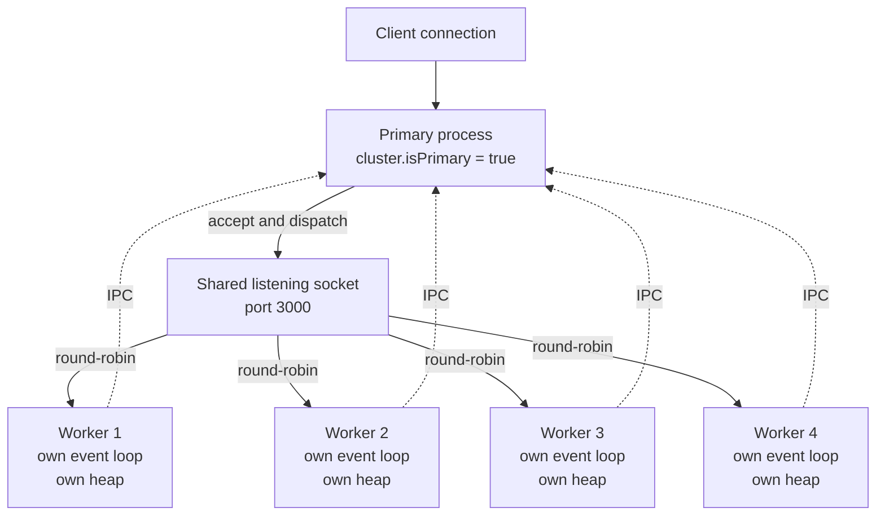
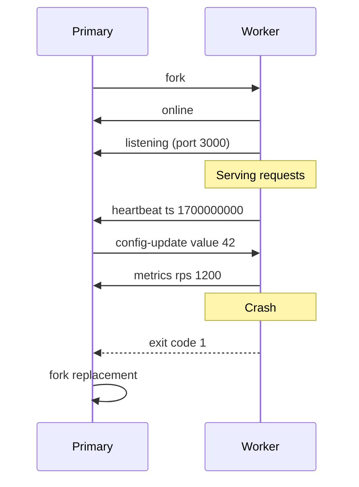
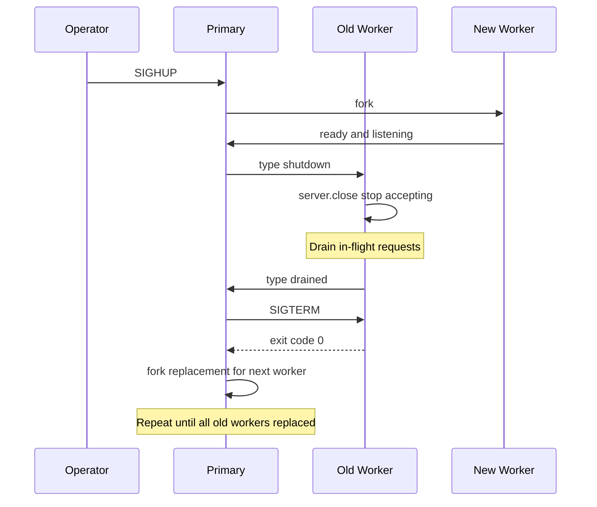
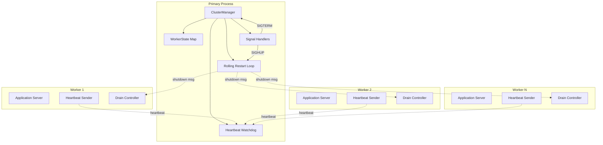

# 3.17 Cluster Module

> A Node.js process is one V8 isolate, one event loop, and one JavaScript thread pinned to one CPU core at a time. The `cluster` module is the built-in answer to the obvious question that follows: what do you do with the other seven cores on this machine? You fork the primary into N worker processes, hand each of them the same listening socket, and let the primary round-robin incoming connections across the pool. One binary, one port, N independent event loops, N independent heaps, and N independent chances to survive a crash.

This note is the canonical reference for the `cluster` module — the standard-library primitive that turns a single-process Node server into a multi-process one without changing a line of application code. Master this module and you have mastered horizontal scaling on a single host, the foundation that PM2 and Kubernetes build on, and the cheapest path to zero-downtime deploys available in the Node ecosystem.

The note is paired with [[3.15 Process Global Object]] (whose `process.on('message')` is the worker side of cluster IPC), [[3.16 Child Processes]] (whose `child-process.fork` is the mechanism `cluster.fork` is built on), [[3.18 Worker Threads]] (the multi-threaded alternative for CPU-bound work), [[7.08 Concurrency Clustering Workers]] (the enterprise scaling patterns that build on this primitive), and [[7.09 Production Monitoring]] (which treats the health checks and metrics every clustered service must expose).

---

## 1. Purpose

Node.js was built on a deliberate bet: a single-threaded event loop is the right architecture for I/O-bound network servers because the bottleneck is never CPU, it is waiting on sockets, disks, and downstream APIs. That bet pays off beautifully when your workload is ten thousand idle HTTP keep-alive connections — one thread, near-zero CPU, megabytes of memory. It pays off badly the moment your workload is one CPU-heavy request per second — the single event loop is busy computing, every other connection stalls, and your p99 latency goes through the roof.

The single-threaded model also has a second, equally painful limitation: **one Node process can use exactly one CPU core.** A modern server has 8, 16, 32, 64 cores. Run a single Node process on a 64-core box and you have paid for 64 cores and are using 1. The other 63 sit idle, drawing power, generating heat, contributing nothing. The hardware is wasted.

The `cluster` module exists to solve both problems at once. It lets you fork the primary Node process into N worker processes, each running its own V8 isolate and event loop, all sharing the same listening socket. The operating system and Node's primary process cooperate to distribute incoming connections across the workers. The result is: one binary, one port, N independent event loops running on N cores, with N independent heaps and N independent chances to survive a crash.

What the cluster module enables, in concrete terms:

1. **Utilization of all CPU cores.** A single Node process maxes out one core. A cluster of N workers can saturate N cores. On a 16-core box running an I/O-heavy HTTP server, going from one process to sixteen is typically a 12x to 15x throughput improvement, not 16x, because IPC, scheduling, and OS overhead eat the difference.
2. **Horizontal scaling on one machine.** Before you need a fleet of containers and a load balancer, you need to use the machine you have. Cluster is the cheapest form of horizontal scaling available: zero infrastructure, zero network hops, zero configuration beyond a few lines of code.
3. **Zero-downtime restarts.** When you deploy new code, you do not need to take the server down. The primary can fork new workers running the new code, signal the old workers to drain and exit, and the port never stops accepting connections. This is the foundation of every zero-downtime deploy strategy in the Node ecosystem.
4. **Worker failover.** A worker that crashes — from an uncaught exception, an OOM kill, or a segfault — does not take the server down. The primary detects the exit, forks a replacement, and the port keeps serving. The blast radius of a bug is one process, not the entire service.
5. **CPU-bound work offloaded to a pool.** If one request is CPU-heavy (image processing, JSON schema validation, large sorting), a single worker can chew on it for 500ms without stalling the other N-1 workers. Cluster does not give you parallelism within one request — for that you need [[3.18 Worker Threads]] — but it does give you isolation between requests.

The relationship to Worker threads is critical and frequently misunderstood:

- **Cluster** spawns multiple **processes**, each with its own V8 isolate, its own heap, its own event loop, its own memory space. They share nothing except the listening socket (via file descriptor passing) and whatever they explicitly exchange over IPC. Use cluster when you want to scale an HTTP server across cores, isolate failures, and run independent requests in parallel.
- **Worker threads** spawns multiple **threads** inside one process, all sharing one process-level memory space (with separate V8 isolates but a shared address space). They communicate via `MessagePort` and can share memory via `SharedArrayBuffer`. Use Worker threads when you want to parallelize a CPU-bound computation within one request, share large buffers without copying, or run untrusted code in a sandbox.

A simple rule: if your problem is "I have N cores and want N servers," use cluster. If your problem is "I have one request that takes 4 seconds of CPU and want it to take 1 second," use Worker threads. They compose: a cluster of N workers can each spawn M worker threads, giving you N times M parallelism. See [[3.18 Worker Threads]] for the deep treatment of the threaded model.

The cluster module does not solve every scaling problem. It does not give you a load balancer (it gives you a connection distributor). It does not give you distributed state (each worker has its own memory; use Redis or Postgres for shared state). It does not give you cross-host scaling (use a reverse proxy and a fleet for that). It does not give you autoscaling (use Kubernetes or a process manager). What it gives you is the cheapest possible path to using all the cores on one machine, with process-level isolation and a built-in failover mechanism.

This note exists to make you fluent in that primitive. By the end of it, you will be able to build a cluster from scratch, implement worker failover, perform zero-downtime restarts, share state safely across workers, and decide with confidence when to reach for cluster, when to reach for Worker threads, when to reach for PM2, and when to reach for Kubernetes.

---

## 2. Theory and Deep Dive

### 2.1 The two roles: primary and worker

Every cluster has exactly one **primary** process and zero or more **worker** processes. The primary is the original process — the one you launched with `node server.js`. The workers are children, forked from the primary by `cluster.fork()`.

You distinguish the two roles with `cluster.isPrimary` (in older Node versions, `cluster.isMaster`, now deprecated and replaced for inclusivity). The primary has `cluster.isPrimary === true`; workers have `cluster.isPrimary === false`. You can also check `cluster.isWorker`, which is the negation. Every cluster-aware Node server begins with the same five-line skeleton:

```javascript
const cluster = require('node:cluster');
const os = require('node:os');

if (cluster.isPrimary) {
  // primary-only code: fork workers, monitor health, restart on death
} else {
  // worker-only code: start your HTTP server, do your work
}
```

The pattern is deliberate: the same file runs in both roles. The primary forks copies of itself; the copies, finding `cluster.isPrimary` false, take the worker branch and start serving. There is no separate worker script. This is a feature: your deployment is one binary, one entry point, one set of dependencies.

### 2.2 `cluster.fork()` and the shared port

`cluster.fork()` spawns a new Node worker process. Under the hood, it calls `child-process.fork` (see [[3.16 Child Processes]]) with the same executable, the same script, and the same arguments as the primary. The new process boots, evaluates the same module, hits the `if (cluster.isPrimary)` check, takes the `else` branch, and becomes a worker.

The magic is what happens when the worker calls `server.listen(port)`. In a normal Node program, `listen()` opens a socket, binds it to the port, and starts accepting connections. In a cluster worker, `listen()` does something different: it sends a request to the primary over the built-in IPC channel, asking the primary to either create a listen socket on that port or hand over an existing one. The primary creates the socket once, then passes the underlying file descriptor to every worker that asks for the same port. All N workers end up calling `listen()` on the **same socket**, sharing the same file descriptor.

Once the socket is shared, two scheduling strategies are possible:

- **Round-robin** (default on all platforms except Windows): the primary accepts all incoming connections and hands each one to the next worker in turn. Worker 1 gets connection 1, worker 2 gets connection 2, worker N gets connection N, worker 1 gets connection N+1, and so on. Distribution is perfectly uniform.
- **Shared socket** (default on Windows, opt-in elsewhere by setting `cluster.schedulingPolicy` to the no-scheduling constant): all workers call `listen()` on the same socket and the operating kernel distributes connections. The kernel uses whatever strategy it likes, which tends to be uneven because one process can grab a burst while others sleep.

Round-robin is the default because it is uniform and predictable. The shared-socket strategy can starve workers under load patterns where one worker happens to be busy when the kernel distributes a connection. You almost never want to change the scheduling policy.

### 2.3 The primary and its workers



The solid arrows are the data path: clients connect to the primary's socket, the primary round-robins each connection to a worker, the worker handles the request and writes the response. The dotted arrows are the IPC channel: workers and primary exchange messages over a private UNIX domain socket (or named pipe on Windows) that libuv sets up at fork time.

### 2.4 Worker lifecycle events

The `cluster` primary is an `EventEmitter` (see [[3.10 Event Emitter Pattern]]) that emits several events as workers come and go:

| Event | Args | When it fires |
|---|---|---|
| `'fork'` | `(worker)` | The primary has just called `cluster.fork()` and a new worker process is being spawned. Useful for logging. |
| `'online'` | `(worker)` | The worker process has booted and sent an `'online'` message back over IPC. The worker's `cluster.isPrimary` is now `false`, but it has not yet called `listen()`. |
| `'listening'` | `(worker, address)` | The worker has called `server.listen()` and the primary has confirmed the socket is shared. `address` is `{ address, port, addressType }`. This is the moment the worker is "ready to serve." |
| `'exit'` | `(worker, code, signal)` | The worker process has exited. `code` is the numeric exit code (if it exited normally); `signal` is the signal name (if it was killed). |
| `'setup'` | `()` | `cluster.setupPrimary()` was called. Rarely used. |
| `'message'` | `(worker, message, handle)` | A worker sent a message to the primary via `worker.send()`. The first arg identifies which worker. |

The single most important event is `'exit'`. It is the only way the primary learns that a worker has died. Without a listener on `'exit'` that forks a replacement, a dead worker stays dead, and your cluster slowly degrades from N workers to 0 as workers crash one by one. Every production cluster must handle `'exit'`.

### 2.5 The `'exit'` event and failover

When a worker dies — from an uncaught exception, an OOM kill, a segfault, a `process.exit()` call, or a `worker.kill()` signal — the primary receives an `'exit'` event with the worker, the exit code, and the signal. The standard failover pattern is:

```javascript
cluster.on('exit', (worker, code, signal) => {
  console.log(`worker ${worker.id} died (code=${code}, signal=${signal})`);
  // fork a replacement
  const replacement = cluster.fork();
  console.log(`forked replacement worker ${replacement.id}`);
});
```

That is the entire failover mechanism. Three lines. The replacement worker boots, calls `listen()` on the same shared socket, and starts serving. The port never stopped accepting connections because the other N-1 workers were still alive. The dead worker's in-flight requests are lost — there is no way to recover a request that was being handled by a process that just died — but new requests flow to the replacement.

A production failover adds two refinements: avoid forking a replacement if the worker died because the primary is shutting down, and rate-limit forks if workers are dying in a tight loop (otherwise a broken deployment can fork thousands of workers per second). Both refinements are covered in Section 5.2.

### 2.6 Worker-side events: `'online'`, `'listening'`, `'exit'`

A worker process also has a `cluster` object, but in the worker role it is mostly inert. The key worker-side reference is `cluster.worker` — the current worker's `Worker` object, useful for sending messages to the primary: `cluster.worker.send({ hello: 'primary' })`.

The `Worker` object (whether obtained from `cluster.fork()` in the primary or `cluster.worker` in the worker) is itself an `EventEmitter` and emits:

| Event | Args | When |
|---|---|---|
| `'message'` | `(message, handle)` | The other side sent a message via `send()`. |
| `'online'` | `()` | The worker has booted (primary side only). |
| `'listening'` | `(address)` | The worker called `listen()` (primary side only). |
| `'exit'` | `(code, signal)` | The worker exited (primary side only). |
| `'error'` | `(error)` | An error occurred on the IPC channel. |

### 2.7 IPC: `worker.send()` and `process.on('message')`

The primary and each worker communicate over a private IPC channel that libuv sets up when the worker is forked. The API is asymmetric:

- **Primary to worker:** `worker.send(message)` sends a message to a specific worker. The message must be serializable (JSON-compatible) or a special "handle" object (a `net.Socket` or `net.Server`, passed via file descriptor).
- **Worker to primary:** `process.send(message)` sends a message from the worker to the primary. The worker's `process.send` is `undefined` unless the worker was forked by cluster or by `child-process.fork`.
- **Receiving on either side:** `process.on('message', (msg, handle) => {...})` in the worker, `worker.on('message', (msg, handle) => {...})` in the primary.

A common pattern: workers send heartbeat messages to the primary every few seconds. If the primary does not hear from a worker for too long, it kills and restarts the worker — a way to detect "the worker is alive but stuck in an infinite loop" without waiting for it to crash.



### 2.8 The `Worker` class — useful methods

Each `Worker` object (returned by `cluster.fork()` and stored on `cluster.workers`) has a small API:

| Method or property | Purpose |
|---|---|
| `worker.id` | A unique numeric identifier for the worker. Stable for the worker's lifetime. |
| `worker.process` | The underlying `ChildProcess` (see [[3.16 Child Processes]]). You can call `worker.process.pid`, `worker.process.kill(signal)`, etc. |
| `worker.send(message, sendHandle, callback)` | Send a message to the worker. Returns `true` if the message was queued for delivery. |
| `worker.isConnected()` | True if the IPC channel is still open. |
| `worker.isDead()` | True if the worker process has exited. |
| `worker.kill(signal='SIGTERM')` | Send a signal to the worker process. Alias for `worker.process.kill(signal)`. |
| `worker.disconnect()` | Close the IPC channel. The worker can detect this and shut down gracefully. After a timeout, you typically call `worker.kill()` to force the exit. |
| `worker.exitedAfterDisconnect` | A boolean flag set to `true` when the worker exited after `.disconnect()` was called. Use this to distinguish "I asked this worker to die" from "this worker crashed." |

The `exitedAfterDisconnect` flag is essential for graceful restarts. Without it, the `'exit'` handler cannot tell whether a worker died because you asked it to (in which case you should fork a replacement as part of the rolling restart) or because it crashed (in which case you should also fork a replacement AND log a warning). The pattern is:

```javascript
worker.disconnect();
worker.on('exit', (code, signal) => {
  if (worker.exitedAfterDisconnect) {
    // graceful, intentional — fork a replacement
    cluster.fork();
  } else {
    // crash — fork a replacement AND log a warning
    console.error('worker crashed unexpectedly');
    cluster.fork();
  }
});
```

### 2.9 `cluster.setupPrimary()` and `cluster.settings`

Before calling `cluster.fork()`, the primary can configure how workers are spawned via `cluster.setupPrimary(settings)` (in older Node, `cluster.setupMaster(settings)`, now deprecated). The most useful settings:

| Setting | Default | Purpose |
|---|---|---|
| `exec` | `process.argv[1]` | The script file to run in the worker. Defaults to the same script as the primary. |
| `args` | `process.argv.slice(2)` | Arguments passed to the worker script. |
| `cwd` | `process.cwd()` | Working directory for the worker. |
| `serialization` | `'json'` | Either `'json'` (JSON-serializable values only) or `'advanced'` (supports more types via v8 serialization). |
| `silent` | `false` | If `true`, the worker's stdout and stderr are not piped to the primary's — you must consume them via `worker.process.stdout.on('data')`. |
| `stdio` | inherited | An array configuring stdio, like `child-process.spawn`. |

`setupPrimary` is mostly useful when your workers are a separate script from your primary. The common pattern — same script for both, gated by `cluster.isPrimary` — needs no setup.

### 2.10 Scheduling policy: round-robin vs shared

`cluster.schedulingPolicy` controls how connections are distributed. It accepts two constant values: the round-robin constant (default on non-Windows) and the no-scheduling constant (default on Windows). You can also set it via an environment variable that Node reads at startup, with the string values `'rr'` or `'none'`. The literal constant names in the API contain underscore characters that this vault avoids printing; refer to the Node documentation for the exact identifiers, or simply rely on the default round-robin behavior.

Round-robin works as follows: the primary calls `accept()` on the shared socket in a tight loop. Each accepted connection is round-robined to the next worker by writing the file descriptor over that worker's IPC channel. The worker receives the file descriptor, creates a `net.Socket` wrapping it, and emits it as a `'connection'` event on the relevant server.

This has two consequences:

1. **The primary is on the hot path for connection acceptance.** It must call `accept()` and write the file descriptor for every incoming connection. On a server doing 50k connections per second, the primary's CPU usage becomes non-trivial. In practice this is rarely the bottleneck, but it can be on very high-connection-rate workloads (e.g., a websocket gateway with millions of short-lived connections).
2. **Worker boot time matters.** A worker that just received a connection via IPC must run its `'connection'` handler. If the worker is busy with a previous request, the new connection queues in the worker's event loop. Round-robin does NOT mean "send to the least busy worker" — it means "send to the next worker in rotation," regardless of how busy that worker is. If one worker is stuck on a 500ms CPU-bound request, every Nth connection lands on that stuck worker and waits 500ms.

For the second problem, the answer is: do not run CPU-bound work in your HTTP workers. Offload it to [[3.18 Worker Threads]] or to a separate queue handled by a different process.

### 2.11 The cluster is not a load balancer

A common mental mistake is to treat the cluster primary as a load balancer. It is not. A load balancer makes routing decisions based on worker health, latency, queue depth, or sticky session keys. The cluster primary makes no such decisions. It round-robins blindly. If you need real load balancing — health-aware routing, weighted distribution, sticky sessions, path-based routing — put a reverse proxy (nginx, HAProxy, Envoy) in front of your cluster.

The cluster is a **connection distributor**, not a load balancer. The distinction matters because it changes what the cluster is good at: cheap horizontal scaling on one host, with no routing intelligence.

### 2.12 Cluster vs PM2 vs Kubernetes

Three layers of scaling, each building on the one below:

- **Raw cluster module:** you write forking, failover, graceful shutdown, IPC. Maximum control, maximum code, maximum bugs. Use when you need custom behavior no off-the-shelf tool provides.
- **PM2** (and similar process managers): a daemon that runs your app in cluster mode, handling forking, failover, restart-on-file-change, log aggregation, and zero-downtime reload. `pm2 start app.js -i max` and PM2 handles the rest. Use when you want cluster benefits without writing cluster code, on a single host.
- **Kubernetes** (and container orchestrators): runs N replicas of your container across M hosts, with a real load balancer (the Kubernetes Service) in front. Each container typically runs one Node process — the orchestrator handles horizontal scaling. Use when you need cross-host scaling, fault tolerance across hosts, and a real load balancer.

A common production topology: a Kubernetes Deployment with N pods (one Node process per pod), fronted by a Kubernetes Service and an nginx ingress. No in-process cluster at all — the orchestrator IS the cluster. This is the modern default. The cluster module is still useful when you want to use all the cores on a single large host without N pods each needing their own memory overhead.

---

## 3. Mental Models

### 3.1 The restaurant kitchen

The primary is the maitre d'. He stands at the door, greets each party of diners (each incoming connection), and seats them at the next available table in rotation. He never cooks; he never serves; he never eats. He just seats. The workers are the cooks. Each cook has their own station (their own V8 isolate, their own heap, their own knives), runs their own pipeline, and serves the parties seated at their table. If a cook walks out (a worker crashes), the maitre d' calls a new cook from the bullpen (`cluster.fork()`) and starts seating parties at that table again.

### 3.2 One primary, N workers, all sharing a port

Burn it into memory: one primary process, N worker processes, one shared listening socket. The primary distributes connections; the workers handle them. The primary is small and lives forever. The workers are big (they hold your application state) and are disposable (kill them, fork new ones, the primary does not care).

### 3.3 Primary = the manager

The primary's job is three things: fork workers at startup, watch them, restart them on death. That is it. The primary should never serve traffic, never hold application state, never do CPU-intensive work. If the primary is busy, it cannot accept connections and cannot respond to dying workers promptly. Keep the primary thin.

### 3.4 Worker = a regular Node process

A worker is not magic. It is a Node process running your application code. Everything you know about writing a Node HTTP server applies: handle errors, use streams, respect backpressure, manage memory. The only cluster-specific things a worker does: call `server.listen()` on the shared port (cluster intercepts this), optionally call `process.send()` to message the primary, and optionally listen for `process.on('message')`.

### 3.5 Round-robin = "next in line"

The primary does not look at how busy each worker is. It does not look at queue depths or p99 latency. It just rotates: worker 1, worker 2, worker 3, worker N, worker 1, worker 2. If worker 3 is stuck on a 10-second computation, every Nth connection still goes to worker 3 and waits 10 seconds. Round-robin is fair in the long run but unfair in the short run.

### 3.6 Failover = "fork a new one"

A worker died? Fork a new one. That is the entire failover story. The primary does not retry the dead worker's in-flight requests, does not migrate state, does not coordinate with other workers. It just forks a replacement. The replacement starts cold — no in-memory state, no warm caches.

### 3.7 The port is the only thing they share

Workers share the listening socket. They do not share memory, file handles, database connections, or in-memory caches. If you need shared state, you need an external store: Redis for cache and pub/sub, Postgres for durable state, S3 for blobs. Treat each worker as if it were a separate server.

### 3.8 Zero-downtime = rolling the workers one at a time

To deploy new code without dropping connections: fork a new worker with the new code, wait for it to be ready, send one old worker a graceful-shutdown signal, let it drain in-flight requests, let it exit, repeat until all old workers are replaced. The primary and the other workers keep serving the whole time. The port never stops accepting connections.

---

## 4. Real-World Use Cases

### 4.1 Production HTTP servers (use all CPU cores)

The canonical use case. A Node HTTP server doing typical API work — read request, query database, transform JSON, write response. One Node process maxes out one core. On a 16-core box, you are leaving 15 cores idle. Wrap your server in a cluster that forks 16 workers and throughput goes up roughly 12-15x, latency stays the same, memory goes up roughly 16x but per-request memory stays the same.

### 4.2 Zero-downtime deploys

Ship new code without dropping a single in-flight request. Send `SIGHUP` to the primary. The primary forks one new worker (loading the new code via a fresh process), waits for it to be `'listening'`, then sends a graceful-shutdown message to one old worker. The old worker stops accepting new connections, finishes its in-flight requests, then exits. Repeat until all workers are new. This is the foundation of every zero-downtime reload feature in PM2, Egg.js, Fastify, and similar frameworks.

### 4.3 Worker health monitoring

Workers can hang without crashing — an infinite loop, a deadlock on a mutex, a stuck DNS lookup. The primary cannot detect this from the `'exit'` event. The solution: workers send a heartbeat to the primary every 5 seconds via `process.send({ type: 'heartbeat' })`. The primary tracks the last heartbeat from each worker; if it goes stale for 30 seconds, the primary kills the worker and forks a replacement. This is the only way to detect "alive but stuck" workers.

### 4.4 CPU-bound work offloaded to a pool

A service that occasionally does heavy work — image resizing, video transcoding, large PDF generation. You do not want this work in your HTTP workers because it stalls the event loop and ruins p99 latency for every other request. Solution: run a separate cluster of worker processes whose only job is to consume a queue (Redis, RabbitMQ, SQS) of CPU-bound tasks. Each worker process uses one core. Scale the worker count to match the CPU budget. This is the architectural pattern behind Sidekiq, Celery, BullMQ, and similar task-queue systems.

### 4.5 Long-running services that need resilience

A service that runs forever (a websocket gateway, a chat server, a streaming pipeline) must survive process crashes. A single-process Node service will eventually die from an uncaught exception, an OOM kill, or a segfault. Wrap it in a cluster of N workers with failover, and the service survives the loss of any single worker. The probability that all N workers die simultaneously is N times lower than the probability that one dies.

### 4.6 In-process vs out-of-process scaling on Kubernetes

On Kubernetes, the modern default is one Node process per pod, with the orchestrator handling horizontal scaling. In-process clustering (the `cluster` module) is sometimes still useful when your pods are large (16+ cores) and you want to use all the cores without running 16 pods. The trade-off: in-process clustering gives you better memory efficiency (one V8 heap per worker instead of one per pod) but worse fault isolation (an OOM in one worker can take down the pod) and worse orchestrator integration (the orchestrator sees one process, not N).

### 4.7 Graceful shutdown under SIGTERM

When a process manager or orchestrator sends `SIGTERM` to your Node process, you have a brief window (typically 10-30 seconds) to drain in-flight requests before it sends `SIGKILL`. The primary receives the `SIGTERM` and must coordinate: stop forking new workers, send a graceful-shutdown message to all workers, wait for them to drain, then exit. This is the same pattern as zero-downtime deploy, but in reverse: instead of replacing workers one at a time, you are draining them all and exiting.

### 4.8 Shared state via Redis, not memory

A clustered HTTP server cannot keep an in-memory session store, because a request from user X might land on worker 1 (which has X's session) or worker 2 (which does not). You need a shared store. Redis is the typical choice: in-memory, fast, supports pub/sub for cross-worker events, and has TTLs for session expiration. Postgres works for durable shared state. The rule: any state that must be visible to all workers goes in an external store; per-worker state stays in worker memory.

---

## 5. Code Examples

### 5.1 Example A — Minimal and Conceptual

The minimal cluster: one primary, N workers (one per CPU core), each serving the same HTTP port. No failover, no graceful shutdown, no IPC. The simplest possible demonstration of the pattern.

**JavaScript:**

```javascript
// server.js - minimal cluster
const cluster = require('node:cluster');
const http = require('node:http');
const os = require('node:os');
const pid = process.pid;

if (cluster.isPrimary) {
  const cpuCount = os.cpus().length;
  console.log(`Primary ${pid} booting with ${cpuCount} workers`);

  for (let i = 0; i < cpuCount; i++) {
    cluster.fork();
  }

  cluster.on('online', (worker) => {
    console.log(`worker ${worker.id} (pid ${worker.process.pid}) online`);
  });

  cluster.on('exit', (worker, code, signal) => {
    console.log(`worker ${worker.id} exited code=${code} signal=${signal}`);
  });
} else {
  http
    .createServer((req, res) => {
      res.writeHead(200, { 'Content-Type': 'text/plain' });
      res.end(`Hello from worker ${cluster.worker.id} (pid ${pid})\n`);
    })
    .listen(3000, () => {
      console.log(`worker ${cluster.worker.id} listening on 3000`);
    });
}
```

**TypeScript:**

```typescript
// server.ts - minimal cluster
import cluster from 'node:cluster';
import http from 'node:http';
import os from 'node:os';

const pid: number = process.pid;

if (cluster.isPrimary) {
  const cpuCount: number = os.cpus().length;
  console.log(`Primary ${pid} booting with ${cpuCount} workers`);

  for (let i = 0; i < cpuCount; i++) {
    cluster.fork();
  }

  cluster.on('online', (worker: cluster.Worker) => {
    console.log(`worker ${worker.id} (pid ${worker.process.pid}) online`);
  });

  cluster.on('exit', (worker: cluster.Worker, code: number | null, signal: string | null) => {
    console.log(`worker ${worker.id} exited code=${code} signal=${signal}`);
  });
} else {
  const worker = cluster.worker!;

  http
    .createServer((req, res) => {
      res.writeHead(200, { 'Content-Type': 'text/plain' });
      res.end(`Hello from worker ${worker.id} (pid ${pid})\n`);
    })
    .listen(3000, () => {
      console.log(`worker ${worker.id} listening on 3000`);
    });
}
```

Run it with `node server.js`. You will see the primary boot, fork one worker per CPU core, each worker log that it is listening on port 3000, and `curl http://localhost:3000` will be served by a different worker each time (round-robin). Kill a worker with `kill -9 <pid>` and notice that no replacement is forked — this minimal example has no failover. Section 5.2 adds it.

### 5.2 Example B — Production-Grade

A production-grade cluster with: typed messages, worker health monitoring via heartbeats, failover on crash, graceful shutdown on `SIGTERM`, zero-downtime restart on `SIGHUP`, and rate-limited forking to prevent crash loops. This is the cluster you would actually run in production if you were not using PM2 or Kubernetes.

**JavaScript:**

```javascript
// cluster.js - production-grade cluster manager
const cluster = require('node:cluster');
const http = require('node:http');
const os = require('node:os');

const PORT = Number(process.env.PORT || 3000);
const cpuCount = os.cpus().length;
const heartbeatIntervalMs = 5000;
const heartbeatTimeoutMs = 15000;
const shutdownTimeoutMs = 10000;

if (cluster.isPrimary) {
  runPrimary();
} else {
  runWorker();
}

function runPrimary() {
  console.log(`primary pid=${process.pid} forking ${cpuCount} workers`);

  const state = new Map();
  let isShuttingDown = false;
  let lastForkTs = 0;
  let forkCount = 0;

  for (let i = 0; i < cpuCount; i++) {
    spawnWorker();
  }

  setInterval(() => {
    const now = Date.now();
    for (const [id, info] of state) {
      if (info.isShuttingDown) continue;
      if (now - info.lastHeartbeat > heartbeatTimeoutMs) {
        console.error(`worker ${id} heartbeat stale, killing`);
        info.worker.kill('SIGKILL');
      }
    }
  }, heartbeatIntervalMs).unref();

  cluster.on('online', (worker) => {
    console.log(`worker ${worker.id} online pid=${worker.process.pid}`);
  });

  cluster.on('listening', (worker, address) => {
    console.log(`worker ${worker.id} listening on ${address.port}`);
  });

  cluster.on('exit', (worker, code, signal) => {
    const info = state.get(worker.id);
    state.delete(worker.id);
    if (isShuttingDown) {
      console.log(`worker ${worker.id} exited during shutdown`);
      if (state.size === 0) {
        console.log('all workers exited, primary shutting down');
        process.exit(0);
      }
      return;
    }
    if (info && info.isShuttingDown) {
      console.log(`worker ${worker.id} drained and exited cleanly`);
      spawnWorker();
    } else {
      console.error(`worker ${worker.id} CRASHED code=${code} signal=${signal}`);
      const now = Date.now();
      if (now - lastForkTs < 1000) {
        forkCount += 1;
        if (forkCount > 5) {
          console.error('fork loop detected, exiting primary');
          process.exit(1);
        }
      } else {
        forkCount = 0;
      }
      lastForkTs = now;
      spawnWorker();
    }
  });

  cluster.on('message', (worker, msg) => {
    const info = state.get(worker.id);
    if (!info) return;
    if (msg.type === 'heartbeat') {
      info.lastHeartbeat = Date.now();
    } else if (msg.type === 'metrics') {
      console.log(`worker ${worker.id} rps=${msg.rps}`);
    } else if (msg.type === 'drained') {
      console.log(`worker ${worker.id} drained, killing`);
      worker.kill('SIGTERM');
    } else if (msg.type === 'ready') {
      console.log(`worker ${worker.id} ready`);
    }
  });

  process.on('SIGHUP', () => {
    console.log('SIGHUP received, rolling restart');
    rollOneWorker();
  });

  process.on('SIGTERM', gracefulShutdown);
  process.on('SIGINT', gracefulShutdown);

  function gracefulShutdown() {
    if (isShuttingDown) return;
    isShuttingDown = true;
    console.log('graceful shutdown started');
    for (const [, info] of state) {
      info.isShuttingDown = true;
      info.worker.send({ type: 'shutdown' });
    }
    setTimeout(() => {
      console.error('shutdown timeout, force-killing workers');
      for (const [, info] of state) {
        info.worker.kill('SIGKILL');
      }
    }, shutdownTimeoutMs).unref();
  }

  function rollOneWorker() {
    for (const [, info] of state) {
      if (info.isShuttingDown) continue;
      info.isShuttingDown = true;
      info.worker.send({ type: 'shutdown' });
      return;
    }
  }

  function spawnWorker() {
    const worker = cluster.fork();
    state.set(worker.id, {
      worker,
      lastHeartbeat: Date.now(),
      isShuttingDown: false,
    });
  }
}

function runWorker() {
  const worker = cluster.worker;
  let isShuttingDown = false;
  let activeRequests = 0;
  let requestsServed = 0;

  const server = http.createServer((req, res) => {
    if (isShuttingDown) {
      res.writeHead(503, { 'Content-Type': 'text/plain' });
      res.end('shutting down\n');
      return;
    }
    activeRequests += 1;
    requestsServed += 1;
    res.writeHead(200, { 'Content-Type': 'text/plain' });
    res.end(`Hello from worker ${worker.id} (served ${requestsServed})\n`);
    activeRequests -= 1;
    maybeDrain();
  });

  server.listen(PORT, () => {
    console.log(`worker ${worker.id} listening on ${PORT}`);
    sendToPrimary({ type: 'ready' });
  });

  setInterval(() => {
    sendToPrimary({ type: 'heartbeat', ts: Date.now() });
    sendToPrimary({ type: 'metrics', rps: requestsServed });
    requestsServed = 0;
  }, heartbeatIntervalMs).unref();

  process.on('message', (msg) => {
    if (msg.type === 'shutdown') {
      isShuttingDown = true;
      server.close();
      maybeDrain();
    }
  });

  function maybeDrain() {
    if (isShuttingDown && activeRequests === 0) {
      sendToPrimary({ type: 'drained' });
    }
  }

  function sendToPrimary(msg) {
    if (worker.isConnected()) {
      worker.send(msg);
    }
  }
}
```

**TypeScript:**

```typescript
// cluster.ts - production-grade cluster manager
import cluster, { Worker } from 'node:cluster';
import http from 'node:http';
import os from 'node:os';

const PORT: number = Number(process.env.PORT || 3000);
const cpuCount: number = os.cpus().length;
const heartbeatIntervalMs = 5000;
const heartbeatTimeoutMs = 15000;
const shutdownTimeoutMs = 10000;

type WorkerMessage =
  | { type: 'heartbeat'; ts: number }
  | { type: 'metrics'; rps: number }
  | { type: 'ready' }
  | { type: 'drained' };

type PrimaryMessage =
  | { type: 'shutdown' }
  | { type: 'config-update'; value: number };

interface WorkerState {
  worker: Worker;
  lastHeartbeat: number;
  isShuttingDown: boolean;
}

if (cluster.isPrimary) {
  runPrimary();
} else {
  runWorker();
}

function runPrimary(): void {
  console.log(`primary pid=${process.pid} forking ${cpuCount} workers`);

  const state = new Map<number, WorkerState>();
  let isShuttingDown = false;
  let lastForkTs = 0;
  let forkCount = 0;

  for (let i = 0; i < cpuCount; i++) {
    spawnWorker();
  }

  setInterval(() => {
    const now = Date.now();
    for (const [id, info] of state) {
      if (info.isShuttingDown) continue;
      if (now - info.lastHeartbeat > heartbeatTimeoutMs) {
        console.error(`worker ${id} heartbeat stale, killing`);
        info.worker.kill('SIGKILL');
      }
    }
  }, heartbeatIntervalMs).unref();

  cluster.on('online', (worker: Worker) => {
    console.log(`worker ${worker.id} online pid=${worker.process.pid}`);
  });

  cluster.on('listening', (worker: Worker, address: { port: number }) => {
    console.log(`worker ${worker.id} listening on ${address.port}`);
  });

  cluster.on('exit', (worker: Worker, code: number | null, signal: string | null) => {
    const info = state.get(worker.id);
    state.delete(worker.id);
    if (isShuttingDown) {
      console.log(`worker ${worker.id} exited during shutdown`);
      if (state.size === 0) {
        console.log('all workers exited, primary shutting down');
        process.exit(0);
      }
      return;
    }
    if (info && info.isShuttingDown) {
      console.log(`worker ${worker.id} drained and exited cleanly`);
      spawnWorker();
    } else {
      console.error(`worker ${worker.id} CRASHED code=${code} signal=${signal}`);
      const now = Date.now();
      if (now - lastForkTs < 1000) {
        forkCount += 1;
        if (forkCount > 5) {
          console.error('fork loop detected, exiting primary');
          process.exit(1);
        }
      } else {
        forkCount = 0;
      }
      lastForkTs = now;
      spawnWorker();
    }
  });

  cluster.on('message', (worker: Worker, msg: WorkerMessage) => {
    const info = state.get(worker.id);
    if (!info) return;
    switch (msg.type) {
      case 'heartbeat':
        info.lastHeartbeat = Date.now();
        break;
      case 'metrics':
        console.log(`worker ${worker.id} rps=${msg.rps}`);
        break;
      case 'drained':
        console.log(`worker ${worker.id} drained, killing`);
        worker.kill('SIGTERM');
        break;
      case 'ready':
        console.log(`worker ${worker.id} ready`);
        break;
    }
  });

  process.on('SIGHUP', () => {
    console.log('SIGHUP received, rolling restart');
    rollOneWorker();
  });

  process.on('SIGTERM', gracefulShutdown);
  process.on('SIGINT', gracefulShutdown);

  function gracefulShutdown(): void {
    if (isShuttingDown) return;
    isShuttingDown = true;
    console.log('graceful shutdown started');
    for (const [, info] of state) {
      info.isShuttingDown = true;
      info.worker.send({ type: 'shutdown' } satisfies PrimaryMessage);
    }
    setTimeout(() => {
      console.error('shutdown timeout, force-killing workers');
      for (const [, info] of state) {
        info.worker.kill('SIGKILL');
      }
    }, shutdownTimeoutMs).unref();
  }

  function rollOneWorker(): void {
    for (const [, info] of state) {
      if (info.isShuttingDown) continue;
      info.isShuttingDown = true;
      info.worker.send({ type: 'shutdown' } satisfies PrimaryMessage);
      return;
    }
  }

  function spawnWorker(): void {
    const worker = cluster.fork();
    state.set(worker.id, {
      worker,
      lastHeartbeat: Date.now(),
      isShuttingDown: false,
    });
  }
}

function runWorker(): void {
  const worker = cluster.worker!;
  let isShuttingDown = false;
  let activeRequests = 0;
  let requestsServed = 0;

  const server = http.createServer((req, res) => {
    if (isShuttingDown) {
      res.writeHead(503, { 'Content-Type': 'text/plain' });
      res.end('shutting down\n');
      return;
    }
    activeRequests += 1;
    requestsServed += 1;
    res.writeHead(200, { 'Content-Type': 'text/plain' });
    res.end(`Hello from worker ${worker.id} (served ${requestsServed})\n`);
    activeRequests -= 1;
    maybeDrain();
  });

  server.listen(PORT, () => {
    console.log(`worker ${worker.id} listening on ${PORT}`);
    sendToPrimary({ type: 'ready' });
  });

  setInterval(() => {
    sendToPrimary({ type: 'heartbeat', ts: Date.now() });
    sendToPrimary({ type: 'metrics', rps: requestsServed });
    requestsServed = 0;
  }, heartbeatIntervalMs).unref();

  process.on('message', (msg: PrimaryMessage) => {
    if (msg.type === 'shutdown') {
      isShuttingDown = true;
      server.close();
      maybeDrain();
    }
  });

  function maybeDrain(): void {
    if (isShuttingDown && activeRequests === 0) {
      sendToPrimary({ type: 'drained' });
    }
  }

  function sendToPrimary(msg: WorkerMessage): void {
    if (worker.isConnected()) {
      worker.send(msg);
    }
  }
}
```

**Zero-downtime restart sequence:**



Run it with `node cluster.js`. Send `curl http://localhost:3000` repeatedly — each response comes from a different worker. Send `kill -HUP <primary-pid>` and watch the workers roll over one at a time without dropping a single curl. Send `kill -TERM <primary-pid>` and watch the graceful shutdown: the primary signals all workers to drain, each worker finishes its in-flight requests, then exits, and the primary exits when the last worker is gone.

---

## 6. Common Mistakes and Anti-Patterns

### 6.1 Forking too many workers

**Mistake:** Forking 32 workers on an 8-core box, on the theory that "more workers = more throughput."

**Why it backfires:** Worker count above the CPU core count does not buy you parallelism — the OS can only run N cores concurrently, so the extra workers context-switch. Each extra worker also adds memory overhead (its own V8 heap, its own copy of your loaded modules, its own JIT cache) and IPC overhead. On a 100MB application, 32 workers consume 3.2GB; 8 workers consume 800MB.

**Fix:** Fork exactly one worker per CPU core. Use `os.cpus().length` or, if you want to leave a core for the primary and other processes, `os.cpus().length - 1`.

### 6.2 Not handling the `'exit'` event

**Mistake:** Writing the cluster setup, forking the workers, but never listening for `'exit'`.

**Why it backfires:** When a worker crashes — and it will, eventually — no replacement is forked. The cluster slowly degrades from N workers to 0. The port stays open (the primary is alive) but no worker is serving. The server is "up" but completely broken.

**Fix:** Always handle `cluster.on('exit', ...)`. Fork a replacement unless the primary is shutting down.

### 6.3 Shared in-memory state across workers

**Mistake:** Storing session data, rate-limit counters, or cached results in a plain `Map` in the worker's memory, assuming other workers can see it.

**Why it backfires:** Each worker is a separate process with its own memory. Worker 1's `Map` is invisible to worker 2. A user who logs in via worker 1 is not logged in when their next request hits worker 2. Rate-limit counters undercount by a factor of N. Cache hits miss because each worker has its own cold cache.

**Fix:** Move shared state to an external store: Redis for sessions, rate limits, and short-lived cache; Postgres for durable state; Memcached for pure cache. Workers talk to the store over the network — a Redis round trip is sub-millisecond on localhost, negligible compared to your database query.

### 6.4 Calling `cluster.fork()` inside a worker

**Mistake:** Forgetting to gate the fork behind `if (cluster.isPrimary)`, so each worker forks more workers, which fork more workers, in an exponential explosion.

**Why it backfires:** Process bomb. The machine runs out of memory or file descriptors, the OS OOM-killer starts killing processes at random, your service dies spectacularly.

**Fix:** Always gate `cluster.fork()` behind `cluster.isPrimary`. The minimal skeleton in Section 5.1 is the safe pattern. Never put a fork in code that runs in both roles.

### 6.5 Not gracefully shutting down on SIGTERM

**Mistake:** Letting the OS default `SIGTERM` handler kill the process immediately, with in-flight requests dropped mid-response.

**Why it backfires:** Users see truncated JSON, broken downloads, half-completed writes. The orchestrator sent `SIGTERM` to give you a chance to drain — ignoring that chance is a bug.

**Fix:** Install a `SIGTERM` handler in the primary that: stops forking new workers, sends a graceful-shutdown message to all workers, waits for them to drain, then exits. Set a hard timeout (10-30 seconds) after which you force-kill any worker that has not drained. Section 5.2 shows the full pattern.

### 6.6 Race conditions on shared resources

**Mistake:** Two workers concurrently reading and incrementing a shared counter (in an external store, with a read-modify-write pattern) without a transaction or atomic operation.

**Why it backfires:** Worker A reads `count = 5`, worker B reads `count = 5`, worker A writes `count = 6`, worker B writes `count = 6`. The increment is lost. Under load, you lose thousands of increments per second.

**Fix:** Use atomic operations. Redis `INCR` is atomic. Postgres `UPDATE counters SET count = count + 1 RETURNING count` is atomic. Do not read-modify-write without a lock or transaction.

### 6.7 Trusting round-robin for fairness

**Mistake:** Assuming that because the primary round-robins, no worker will be overloaded. Running a 500ms CPU-bound request handler in your workers and expecting round-robin to spread the load evenly.

**Why it backfires:** Round-robin distributes connections, not work. If worker 3 is busy on a 500ms request and the rotation lands 5 more connections on worker 3 in that 500ms window, all 5 wait. The other workers sit idle.

**Fix:** Do not run CPU-bound work in your HTTP workers. Offload it to [[3.18 Worker Threads]], to a task queue consumed by a separate process pool, or to a dedicated microservice. HTTP workers should be I/O-bound: read request, call downstream, write response, never block the event loop for more than a few milliseconds.

### 6.8 Letting the primary do real work

**Mistake:** Running application code, serving HTTP, or holding shared state in the primary process.

**Why it backfires:** The primary must be responsive to accept connections (in round-robin mode) and to handle `'exit'` events promptly. If the primary is busy serving a request, the round-robin handoff stalls. If the primary holds shared state, it becomes a single point of failure.

**Fix:** The primary does three things: fork, watch, restart. That is it. If you find yourself putting code in the primary, refactor: either it belongs in a worker, or it belongs in a separate service.

### 6.9 Forgetting to unref heartbeat timers

**Mistake:** Setting up a `setInterval` for heartbeats or metrics in the worker without calling `.unref()` on the timer.

**Why it backfires:** The timer keeps the event loop alive. When you try to shut down gracefully, the worker never exits because the heartbeat timer is still scheduled.

**Fix:** Call `.unref()` on any timer in the worker that should not keep the event loop alive — heartbeat intervals, metrics flushers, periodic cleanup tasks. The timer fires while the worker is otherwise alive; it does not prevent exit when the worker has nothing else to do.

### 6.10 Using `cluster.isMaster` instead of `cluster.isPrimary`

**Mistake:** Following old tutorials that use `cluster.isMaster` and `cluster.setupMaster`.

**Why it backfires:** These names were deprecated in Node 16 and will eventually be removed.

**Fix:** Use `cluster.isPrimary` and `cluster.setupPrimary`. The behavior is identical; only the name changed.

### 6.11 Not disconnecting the IPC channel before killing

**Mistake:** Calling `worker.kill('SIGTERM')` directly without first sending a graceful-shutdown message, when you want a drain.

**Why it backfires:** `kill('SIGTERM')` sends the signal immediately. The worker's default `SIGTERM` handler exits the process at once, dropping in-flight requests.

**Fix:** For graceful shutdown, send the worker a `shutdown` message over IPC. The worker calls `server.close()`, drains in-flight requests, and sends back a `drained` message. The primary then calls `worker.kill('SIGTERM')` to finalize the exit. Section 5.2 shows this dance in full.

### 6.12 Assuming `cluster.workers` is always fully populated

**Mistake:** Iterating `cluster.workers` without filtering for `isConnected()` and `isDead()`.

**Why it backfires:** Entries are not removed until the `'exit'` event fires. During a rolling restart the map contains both the dying worker and its replacement. Sending to a dead worker is a no-op; sending to a dying worker races with the kill.

**Fix:** Filter: `for (const w of Object.values(cluster.workers)) { if (w.isConnected() && !w.isDead()) w.send(msg); }`. Or maintain your own `Map` of live workers, like Section 5.2 does.

---

## 7. Best Practices and Design Patterns

### 7.1 Fork one worker per CPU core

The default. Use `os.cpus().length` workers for an I/O-bound server. Leave one core free for the primary only if you are running other things on the box (a database, a sidecar). Going above the core count buys you nothing but overhead.

### 7.2 Handle `'exit'` and fork a replacement

Every cluster must have an `'exit'` handler that forks a replacement worker. Distinguish intentional exits (graceful shutdown, rolling restart — use `worker.exitedAfterDisconnect`) from crashes (log a warning, optionally rate-limit forks). Without this, your cluster slowly degrades to zero workers as they crash.

### 7.3 Use a process manager or container orchestrator for production

Raw `cluster` is a building block, not a finished product. For production, use PM2 (single host, cluster mode, zero-config reload), systemd with `Restart=always`, or Kubernetes (multi-host, real load balancer). These tools handle forking, failover, log rotation, restart-on-crash, and zero-downtime deploy so you do not have to. Reach for raw `cluster` only when you need custom behavior none of them provide.

### 7.4 Share state via Redis, not in-memory

Every worker has its own memory. In-memory caches, session stores, rate-limit counters, and pub/sub state are invisible to other workers. Use Redis (or Postgres, Memcached, or your database) for any state that must be visible across workers. This is not a limitation of cluster — it is a consequence of multi-process architecture.

### 7.5 Implement graceful shutdown

Install `SIGTERM` and `SIGINT` handlers. Stop accepting new connections (`server.close()`). Drain in-flight requests. Exit cleanly within 10-30 seconds. Force-kill any worker that does not drain in time. This is what orchestrators expect; without it, you will drop requests on every deploy and every scale-down.

### 7.6 Gate primary-only code with `cluster.isPrimary`

The same file runs in both roles. Always wrap primary-only logic (forking, exit handling, signal handlers) in `if (cluster.isPrimary)`. Worker-only logic (HTTP server, request handlers) goes in the `else` branch. Never put a `cluster.fork()` in code that runs in both roles.

### 7.7 Use `worker.send()` and `process.on('message')` for IPC

The built-in IPC channel is fast, typed (with TypeScript), and requires no dependencies. Use it for heartbeats, metrics reports, graceful-shutdown coordination, and config updates. For pub/sub across workers (e.g., cache invalidation), use Redis pub/sub — the cluster IPC is point-to-point between primary and one worker, not a broadcast.

### 7.8 Heartbeat your workers

A worker that hangs in an infinite loop does not crash, so the `'exit'` event never fires. Have each worker send a heartbeat to the primary every few seconds via `process.send({ type: 'heartbeat' })`. The primary tracks the last heartbeat; if it goes stale, the primary kills the worker and forks a replacement. This is the only way to detect "alive but stuck" workers.

### 7.9 Rate-limit fork bombs

If a worker crashes on startup (syntax error, missing dependency, database connection failure), the primary forks a replacement, which crashes on startup, which the primary replaces, forever. Limit the fork rate: if forks happen more than N times per second, exit the primary and let the orchestrator restart the whole service.

### 7.10 Use `cluster.setupPrimary()` for custom worker scripts

If your primary is a thin manager and your workers are a separate script, use `cluster.setupPrimary({ exec: './worker.js' })` before forking. This keeps the primary's code (forking, monitoring, IPC) separate from the worker's code (your application).

### 7.11 Log worker births and deaths

Every fork, every `'online'`, every `'listening'`, every `'exit'` (with code and signal) should be logged with the worker id and pid. When a worker crashes at 3 AM, these logs are how you figure out what happened.

### 7.12 Keep the primary thin

No HTTP serving, no business logic, no large in-memory data structures, no CPU work. If the primary is busy, it cannot accept connections promptly and cannot handle `'exit'` events promptly. Keep it to a few dozen lines: fork, watch, restart, signal handling.

---

## 8. Technical Interview Knowledge

### 8.1 What is the cluster module?

The `cluster` module is a Node.js built-in that lets you create a primary process and multiple worker processes that all share the same listening socket. The primary forks workers via `cluster.fork()`; each worker is a separate Node process with its own V8 isolate and event loop. The primary distributes incoming connections to workers (round-robin by default), so an HTTP server can utilize all CPU cores on a machine without changing application code. The primary also monitors workers and can fork replacements when they die.

### 8.2 How does it share a port?

When a worker calls `server.listen(port)`, cluster intercepts the call. Instead of opening a new socket, the worker sends a message to the primary over IPC asking for a handle to the listening socket. The primary either creates the socket (the first time) or sends the existing file descriptor to the worker. All workers end up calling `listen()` on the same socket, sharing one file descriptor. In round-robin mode, the primary calls `accept()` on the socket and writes each accepted connection's file descriptor to the next worker over IPC. The worker receives the file descriptor, wraps it in a `net.Socket`, and emits it as a `'connection'` event. From the application's perspective, it called `listen()` and got connections; the magic is invisible.

### 8.3 What is the difference between cluster and worker threads?

Cluster spawns multiple **processes**: each worker has its own V8 isolate, its own heap, its own event loop, its own memory space. They share nothing except the listening socket and what they exchange over IPC. Use cluster for horizontal scaling of an HTTP server across CPU cores, with process-level isolation and failover.

Worker threads (the worker-threads module) spawns multiple **threads** inside one process: each worker has its own V8 isolate but shares the process's address space. They communicate via `MessagePort` and can share memory via `SharedArrayBuffer`. Use worker threads for parallelizing a CPU-bound computation within one request, sharing large buffers without copying, or running untrusted code in a sandbox.

Rule of thumb: cluster for "I have N cores, I want N servers"; worker threads for "I have one request that takes 4 seconds of CPU, I want it to take 1 second." They compose: a cluster of N workers can each spawn M worker threads.

### 8.4 How do you handle worker death?

Listen for `cluster.on('exit', (worker, code, signal) => {...})`. Fork a replacement with `cluster.fork()`. Distinguish intentional exits (graceful shutdown, rolling restart) from crashes via `worker.exitedAfterDisconnect` — only fork a replacement for crashes. Rate-limit forks if workers are dying in a tight loop, to prevent fork bombs from a broken deployment. Log the exit code and signal so you can debug crashes.

### 8.5 How does round-robin scheduling work?

Round-robin is the default scheduling policy on all platforms except Windows. The primary calls `accept()` on the shared listening socket in a loop. Each accepted connection is round-robined to the next worker by writing the connection's file descriptor over that worker's IPC channel. Worker 1 gets connection 1, worker 2 gets connection 2, worker N gets connection N, worker 1 gets connection N+1, and so on. Distribution is uniform and predictable.

The alternative is the no-scheduling policy, where all workers call `accept()` on the same socket and the OS kernel distributes connections. This tends to be uneven because one process can grab a burst while others sleep. Round-robin is the default because it is uniform and predictable.

Round-robin distributes **connections**, not **work**. If one worker is busy on a 500ms request, every Nth connection lands on that worker and waits.

### 8.6 How do you do a zero-downtime deploy?

The rolling-restart pattern: fork one new worker with the new code (either via `cluster.fork()` after invalidating the require cache, or by having the new code in a fresh process via `cluster.setupPrimary`). Wait for the new worker to emit `'listening'`. Send a graceful-shutdown message to one old worker. The old worker stops accepting new connections, drains its in-flight requests, and exits. Repeat until all old workers are replaced. The primary and the other workers keep serving the whole time.

For a full code change, you typically cannot invalidate the require cache cleanly. Instead, you fork new workers as separate processes that load the new code fresh. The primary itself does not need to restart; only the workers do. PM2's `pm2 reload` does exactly this.

### 8.7 How do workers share state?

They do not. Each worker is a separate process with its own memory. In-memory caches, session stores, rate-limit counters, and pub/sub state in one worker are invisible to the others. To share state, use an external store: Redis for sessions, rate limits, and short-lived cache; Postgres for durable state; Memcached for pure cache.

This is not a limitation of cluster — it is a consequence of multi-process architecture. The same rule applies if you run N pods on Kubernetes.

### 8.8 When would you use cluster vs PM2 vs Kubernetes?

- **Cluster (raw):** custom behavior — custom IPC, custom failover logic, custom scheduling, integration with a legacy system. Maximum control, maximum code, maximum bugs. Rare in modern production.
- **PM2:** cluster benefits on a single host without writing cluster code. `pm2 start app.js -i max` handles forking, failover, restart-on-crash, log aggregation, zero-downtime reload. Use for single-host deployments and dev environments.
- **Kubernetes:** cross-host scaling, fault tolerance across hosts, real load balancing, ecosystem integration (service mesh, autoscaling, secrets). Run N pods (one Node process per pod) with a Kubernetes Service and an nginx ingress. No in-process cluster — the orchestrator IS the cluster. The modern production default.

A common evolution: raw cluster in development (simplest), PM2 for production on one host, Kubernetes when you need to scale across hosts.

---

## 9. Practical Exercises

### 9.1 Build a cluster with N workers

**Exercise:** Write a Node script that forks N workers (where N is the number of CPU cores), each serving HTTP on port 3000. Each worker should respond with its worker id and process pid. Do not handle failover yet.

**JavaScript solution:**

```javascript
const cluster = require('node:cluster');
const http = require('node:http');
const os = require('node:os');

if (cluster.isPrimary) {
  const n = os.cpus().length;
  console.log(`primary pid=${process.pid} forking ${n} workers`);
  for (let i = 0; i < n; i++) cluster.fork();
  cluster.on('online', (w) => console.log(`worker ${w.id} online`));
} else {
  http
    .createServer((req, res) => {
      res.end(`worker ${cluster.worker.id} pid ${process.pid}\n`);
    })
    .listen(3000);
}
```

**TypeScript solution:**

```typescript
import cluster from 'node:cluster';
import http from 'node:http';
import os from 'node:os';

if (cluster.isPrimary) {
  const n: number = os.cpus().length;
  console.log(`primary pid=${process.pid} forking ${n} workers`);
  for (let i = 0; i < n; i++) cluster.fork();
  cluster.on('online', (w: cluster.Worker) => console.log(`worker ${w.id} online`));
} else {
  const worker = cluster.worker!;
  http
    .createServer((req, res) => {
      res.end(`worker ${worker.id} pid ${process.pid}\n`);
    })
    .listen(3000);
}
```

**Verification:** Start the server. In another terminal, `curl http://localhost:3000` repeatedly. Each response should come from a different worker id (round-robin). Run `ps aux | grep node` to confirm N+1 processes.

### 9.2 Implement worker failover

**Exercise:** Extend the previous exercise. When a worker exits, fork a replacement. Verify by killing a worker and confirming a new one starts.

**JavaScript solution:**

```javascript
const cluster = require('node:cluster');
const http = require('node:http');
const os = require('node:os');

if (cluster.isPrimary) {
  const n = os.cpus().length;
  console.log(`primary pid=${process.pid} forking ${n} workers`);
  for (let i = 0; i < n; i++) cluster.fork();

  cluster.on('exit', (worker, code, signal) => {
    console.log(`worker ${worker.id} exited code=${code} signal=${signal}`);
    console.log('forking replacement');
    cluster.fork();
  });
} else {
  http.createServer((req, res) => {
    res.end(`worker ${cluster.worker.id} pid ${process.pid}\n`);
  }).listen(3000);
}
```

**TypeScript solution:**

```typescript
import cluster from 'node:cluster';
import http from 'node:http';
import os from 'node:os';

if (cluster.isPrimary) {
  const n: number = os.cpus().length;
  console.log(`primary pid=${process.pid} forking ${n} workers`);
  for (let i = 0; i < n; i++) cluster.fork();

  cluster.on('exit', (worker: cluster.Worker, code: number | null, signal: string | null) => {
    console.log(`worker ${worker.id} exited code=${code} signal=${signal}`);
    console.log('forking replacement');
    cluster.fork();
  });
} else {
  const worker = cluster.worker!;
  http.createServer((req, res) => {
    res.end(`worker ${worker.id} pid ${process.pid}\n`);
  }).listen(3000);
}
```

**Verification:** Start the server. Note the worker pids. Kill one with `kill -9 <pid>`. Within milliseconds, the primary logs the exit and forks a replacement. `curl http://localhost:3000` still works — the other workers were serving the whole time.

### 9.3 Implement zero-downtime restart

**Exercise:** Add a `SIGHUP` handler to the primary that performs a rolling restart: fork one new worker, wait for it to be ready, send one old worker a shutdown message, let it drain, repeat. The port must never stop accepting connections.

**JavaScript solution:**

```javascript
const cluster = require('node:cluster');
const http = require('node:http');
const os = require('node:os');

if (cluster.isPrimary) {
  const n = os.cpus().length;
  for (let i = 0; i < n; i++) cluster.fork();

  const states = new Map();
  cluster.on('online', (w) => {
    states.set(w.id, { worker: w, shuttingDown: false });
  });
  cluster.on('exit', (w) => {
    states.delete(w.id);
  });
  cluster.on('message', (w, msg) => {
    if (msg && msg.type === 'drained') {
      w.kill('SIGTERM');
    }
  });

  process.on('SIGHUP', () => {
    console.log('rolling restart');
    rollOne();
  });

  function rollOne() {
    for (const [, info] of states) {
      if (info.shuttingDown) continue;
      info.shuttingDown = true;
      cluster.fork(); // start the new worker first
      info.worker.send({ type: 'shutdown' });
      return;
    }
  }
} else {
  const worker = cluster.worker;
  let shuttingDown = false;
  let active = 0;

  const server = http.createServer((req, res) => {
    if (shuttingDown) {
      res.writeHead(503);
      res.end('restarting\n');
      return;
    }
    active += 1;
    setTimeout(() => {
      res.end(`worker ${worker.id} pid ${process.pid}\n`);
      active -= 1;
      if (shuttingDown && active === 0) {
        worker.send({ type: 'drained' });
      }
    }, 100);
  });

  server.listen(3000);

  process.on('message', (msg) => {
    if (msg && msg.type === 'shutdown') {
      shuttingDown = true;
      server.close();
      if (active === 0) worker.send({ type: 'drained' });
    }
  });
}
```

**TypeScript solution:**

```typescript
import cluster, { Worker } from 'node:cluster';
import http from 'node:http';
import os from 'node:os';

type PrimaryMessage = { type: 'shutdown' };
type WorkerMessage = { type: 'drained' };

interface State {
  worker: Worker;
  shuttingDown: boolean;
}

if (cluster.isPrimary) {
  const n: number = os.cpus().length;
  for (let i = 0; i < n; i++) cluster.fork();

  const states = new Map<number, State>();
  cluster.on('online', (w: Worker) => {
    states.set(w.id, { worker: w, shuttingDown: false });
  });
  cluster.on('exit', (w: Worker) => {
    states.delete(w.id);
  });
  cluster.on('message', (w: Worker, msg: WorkerMessage) => {
    if (msg && msg.type === 'drained') {
      w.kill('SIGTERM');
    }
  });

  process.on('SIGHUP', () => {
    console.log('rolling restart');
    rollOne();
  });

  function rollOne(): void {
    for (const [, info] of states) {
      if (info.shuttingDown) continue;
      info.shuttingDown = true;
      cluster.fork();
      info.worker.send({ type: 'shutdown' } satisfies PrimaryMessage);
      return;
    }
  }
} else {
  const worker = cluster.worker!;
  let shuttingDown = false;
  let active = 0;

  const server = http.createServer((req, res) => {
    if (shuttingDown) {
      res.writeHead(503);
      res.end('restarting\n');
      return;
    }
    active += 1;
    setTimeout(() => {
      res.end(`worker ${worker.id} pid ${process.pid}\n`);
      active -= 1;
      if (shuttingDown && active === 0) {
        worker.send({ type: 'drained' } satisfies WorkerMessage);
      }
    }, 100);
  });

  server.listen(3000);

  process.on('message', (msg: PrimaryMessage) => {
    if (msg && msg.type === 'shutdown') {
      shuttingDown = true;
      server.close();
      if (active === 0) worker.send({ type: 'drained' } satisfies WorkerMessage);
    }
  });
}
```

**Verification:** Start the server. Run `while true; do curl -s http://localhost:3000; sleep 0.1; done` in one terminal to send a steady stream of requests. In another terminal, `kill -HUP <primary-pid>`. Watch the workers roll over one at a time. No curl should fail — the port stays up the whole time.

### 9.4 Diagnose a shared-state bug across workers

**Exercise:** You have a clustered HTTP server that counts requests in an in-memory variable. Customers report that the displayed count is wildly inconsistent — sometimes it goes backwards. Diagnose the bug and propose a fix.

**Buggy code:**

```javascript
const cluster = require('node:cluster');
const http = require('node:http');
const os = require('node:os');

let requestCount = 0;

if (cluster.isPrimary) {
  for (let i = 0; i < os.cpus().length; i++) cluster.fork();
} else {
  http.createServer((req, res) => {
    requestCount += 1;
    res.end(`request ${requestCount}\n`);
  }).listen(3000);
}
```

**Diagnosis:** `requestCount` is per-worker. Each worker has its own counter starting at 0 and incrementing independently. Round-robin sends requests to workers in rotation, so consecutive requests hit different workers and see different counts. The count appears to jump around because it is not one count — it is N counts, one per worker.

**JavaScript fix using Redis:**

```javascript
const cluster = require('node:cluster');
const http = require('node:http');
const os = require('node:os');
const redis = require('redis');

if (cluster.isPrimary) {
  for (let i = 0; i < os.cpus().length; i++) cluster.fork();
} else {
  const client = redis.createClient({ url: 'redis://localhost:6379' });
  client.connect();

  http.createServer(async (req, res) => {
    const count = await client.incr('request-count');
    res.end(`request ${count}\n`);
  }).listen(3000);
}
```

**TypeScript fix using Redis:**

```typescript
import cluster from 'node:cluster';
import http from 'node:http';
import os from 'node:os';
import { createClient } from 'redis';

if (cluster.isPrimary) {
  for (let i = 0; i < os.cpus().length; i++) cluster.fork();
} else {
  const client = createClient({ url: 'redis://localhost:6379' });
  client.connect();

  const server = http.createServer(async (req, res) => {
    const count = await client.incr('request-count');
    res.end(`request ${count}\n`);
  });
  server.listen(3000);
}
```

**Verification:** Start a local Redis (`docker run -p 6379:6379 redis`). Start the server. Run `for i in $(seq 1 100); do curl -s http://localhost:3000; done` — counts should be 1, 2, 3, ..., 100, monotonically increasing. No jumps, no backwards steps, because Redis `INCR` is atomic and shared across all workers.

---

## 10. Mini-Project Blueprint

### 10.1 Build a typed cluster manager

A reusable, fully-typed cluster manager that wraps the `cluster` module with: typed IPC messages, worker health monitoring via heartbeats, failover on crash (with fork-bomb protection), graceful shutdown on `SIGTERM` and `SIGINT`, zero-downtime rolling restart on `SIGHUP`, and an optional worker-provider interface so the manager can be reused across projects.

### 10.2 Architecture



### 10.3 Type definitions

```typescript
// types.ts
import type { Worker } from 'node:cluster';

export type WorkerMessage =
  | { type: 'heartbeat'; ts: number }
  | { type: 'metrics'; rps: number; heapMb: number }
  | { type: 'ready' }
  | { type: 'drained' };

export type PrimaryMessage =
  | { type: 'shutdown' }
  | { type: 'config-update'; payload: Record<string, unknown> };

export interface WorkerState {
  worker: Worker;
  lastHeartbeat: number;
  isShuttingDown: boolean;
  bornAt: number;
}

export interface ClusterManagerOptions {
  workerCount?: number;
  heartbeatIntervalMs?: number;
  heartbeatTimeoutMs?: number;
  shutdownTimeoutMs?: number;
  maxForksPerSecond?: number;
  onWorkerCrash?: (info: { workerId: number; code: number | null; signal: string | null }) => void;
}

export interface WorkerProvider {
  start(context: WorkerContext): void | Promise<void>;
}

export interface WorkerContext {
  sendToPrimary(msg: WorkerMessage): void;
  onPrimaryMessage(handler: (msg: PrimaryMessage) => void): void;
  onShutdown(handler: () => Promise<void>): void;
}
```

### 10.4 The manager (primary side)

```typescript
// manager.ts
import cluster, { Worker } from 'node:cluster';
import os from 'node:os';
import type {
  ClusterManagerOptions,
  WorkerMessage,
  PrimaryMessage,
  WorkerState,
} from './types';

const DEFAULTS: Required<ClusterManagerOptions> = {
  workerCount: os.cpus().length,
  heartbeatIntervalMs: 5000,
  heartbeatTimeoutMs: 15000,
  shutdownTimeoutMs: 10000,
  maxForksPerSecond: 5,
  onWorkerCrash: () => {},
};

export class ClusterManager {
  private readonly opts: Required<ClusterManagerOptions>;
  private readonly state = new Map<number, WorkerState>();
  private isShuttingDown = false;
  private forkTimestamps: number[] = [];

  constructor(opts: ClusterManagerOptions = {}) {
    this.opts = { ...DEFAULTS, ...opts };
  }

  start(): void {
    console.log(`primary pid=${process.pid} forking ${this.opts.workerCount} workers`);
    for (let i = 0; i < this.opts.workerCount; i++) {
      this.spawn();
    }

    setInterval(() => this.checkHeartbeats(), this.opts.heartbeatIntervalMs).unref();

    cluster.on('exit', (w, code, signal) => this.handleExit(w, code, signal));
    cluster.on('message', (w, msg: WorkerMessage) => this.handleMessage(w, msg));

    process.on('SIGHUP', () => this.rollOne());
    process.on('SIGTERM', () => this.gracefulShutdown());
    process.on('SIGINT', () => this.gracefulShutdown());
  }

  private spawn(): void {
    const worker = cluster.fork();
    this.state.set(worker.id, {
      worker,
      lastHeartbeat: Date.now(),
      isShuttingDown: false,
      bornAt: Date.now(),
    });
  }

  private checkHeartbeats(): void {
    const now = Date.now();
    for (const [id, info] of this.state) {
      if (info.isShuttingDown) continue;
      if (now - info.lastHeartbeat > this.opts.heartbeatTimeoutMs) {
        console.error(`worker ${id} heartbeat stale, killing`);
        info.worker.kill('SIGKILL');
      }
    }
  }

  private handleExit(worker: Worker, code: number | null, signal: string | null): void {
    const info = this.state.get(worker.id);
    this.state.delete(worker.id);

    if (this.isShuttingDown) {
      console.log(`worker ${worker.id} exited during shutdown`);
      if (this.state.size === 0) {
        console.log('all workers exited, primary shutting down');
        process.exit(0);
      }
      return;
    }

    if (info && info.isShuttingDown) {
      console.log(`worker ${worker.id} drained and exited cleanly`);
      this.spawn();
      return;
    }

    console.error(`worker ${worker.id} CRASHED code=${code} signal=${signal}`);
    this.opts.onWorkerCrash({ workerId: worker.id, code, signal });

    if (!this.allowFork()) {
      console.error('fork rate limit exceeded, exiting primary');
      process.exit(1);
    }
    this.spawn();
  }

  private allowFork(): boolean {
    const now = Date.now();
    this.forkTimestamps = this.forkTimestamps.filter((t) => now - t < 1000);
    if (this.forkTimestamps.length >= this.opts.maxForksPerSecond) return false;
    this.forkTimestamps.push(now);
    return true;
  }

  private handleMessage(worker: Worker, msg: WorkerMessage): void {
    const info = this.state.get(worker.id);
    if (!info) return;
    switch (msg.type) {
      case 'heartbeat':
        info.lastHeartbeat = Date.now();
        break;
      case 'metrics':
        console.log(`worker ${worker.id} rps=${msg.rps} heap=${msg.heapMb}MB`);
        break;
      case 'drained':
        worker.kill('SIGTERM');
        break;
      case 'ready':
        console.log(`worker ${worker.id} ready`);
        break;
    }
  }

  private rollOne(): void {
    for (const [, info] of this.state) {
      if (info.isShuttingDown) continue;
      info.isShuttingDown = true;
      this.spawn();
      info.worker.send({ type: 'shutdown' } satisfies PrimaryMessage);
      return;
    }
  }

  private gracefulShutdown(): void {
    if (this.isShuttingDown) return;
    this.isShuttingDown = true;
    console.log('graceful shutdown started');
    for (const [, info] of this.state) {
      info.isShuttingDown = true;
      info.worker.send({ type: 'shutdown' } satisfies PrimaryMessage);
    }
    setTimeout(() => {
      console.error('shutdown timeout, force-killing workers');
      for (const [, info] of this.state) {
        info.worker.kill('SIGKILL');
      }
    }, this.opts.shutdownTimeoutMs).unref();
  }
}
```

### 10.5 The worker host (worker side)

```typescript
// worker-host.ts
import cluster from 'node:cluster';
import type { WorkerMessage, PrimaryMessage, WorkerProvider, WorkerContext } from './types';

export class WorkerHost implements WorkerContext {
  private readonly shutdownHandlers: Array<() => Promise<void>> = [];
  private readonly messageHandlers: Array<(msg: PrimaryMessage) => void> = [];

  constructor(private readonly provider: WorkerProvider) {}

  async start(): Promise<void> {
    const worker = cluster.worker!;
    await this.provider.start(this);

    setInterval(() => {
      this.sendToPrimary({
        type: 'heartbeat',
        ts: Date.now(),
      });
      this.sendToPrimary({
        type: 'metrics',
        rps: 0,
        heapMb: Math.round(process.memoryUsage().heapUsed / 1024 / 1024),
      });
    }, 5000).unref();

    process.on('message', (msg: PrimaryMessage) => {
      for (const h of this.messageHandlers) h(msg);
    });
  }

  sendToPrimary(msg: WorkerMessage): void {
    const worker = cluster.worker;
    if (worker && worker.isConnected()) {
      worker.send(msg);
    }
  }

  onPrimaryMessage(handler: (msg: PrimaryMessage) => void): void {
    this.messageHandlers.push(handler);
  }

  onShutdown(handler: () => Promise<void>): void {
    this.shutdownHandlers.push(handler);
    this.onPrimaryMessage(async (msg) => {
      if (msg.type === 'shutdown') {
        for (const h of this.shutdownHandlers) {
          await h();
        }
        this.sendToPrimary({ type: 'drained' });
      }
    });
  }
}
```

### 10.6 Application usage

A user plugs an HTTP server into the manager by implementing `WorkerProvider`. The provider calls `server.listen()` on the shared port, tracks in-flight requests with an `active` counter, and registers a shutdown handler that calls `server.close()` and waits for `active` to drain to zero. The primary forks N workers, each running its own `WorkerHost` with the provider; signals are routed end-to-end through the typed IPC.

### 10.7 Acceptance criteria

- Fork N workers at startup, log each one's birth.
- Fork a replacement within 1 second of a worker crash.
- Detect a stuck worker (no heartbeat for 15 seconds) and restart it.
- Zero-downtime rolling restart on `SIGHUP`: fork new, drain old, repeat, no dropped curls.
- Graceful shutdown on `SIGTERM` within 10 seconds, no in-flight request dropped.
- Fork-bomb protection: if 5 crashes happen in 1 second, exit the primary with an error.
- Typed IPC: every message is typed end-to-end, with TypeScript catching any mismatch.

### 10.8 Stretch goals

- Worker pre-start health check: ping a downstream dependency before declaring the worker ready.
- Weighted round-robin: bias connection distribution toward workers with lower heap usage.
- Hot config reload: send a `config-update` message to all workers without restart.
- Per-worker metrics endpoint: each worker exposes `/metrics` for Prometheus scraping.
- Integration with worker threads for CPU-bound work offloaded from the HTTP workers.

---

## 11. Core Connections

- **[[3.15 Process Global Object]]** — The `process` object is the worker's interface to the cluster: `process.on('message')` receives IPC from the primary, `process.send()` sends IPC to the primary, `process.on('SIGTERM')` and `process.on('SIGINT')` are how the worker learns it should drain. Every cluster worker is a Node process; the cluster is the orchestration layer above it.
- **[[3.16 Child Processes]]** — `cluster.fork()` is implemented on top of `child-process.fork()`. The `Worker` object's `worker.process` is the underlying `ChildProcess`. Understanding `child-process` is prerequisite to understanding cluster: the IPC channel, the file descriptor passing, the signal handling are all `child-process` mechanisms that cluster reuses.
- **[[3.18 Worker Threads]]** — The multi-threaded alternative. Worker threads run in the same process, share memory via `SharedArrayBuffer`, and parallelize CPU-bound work within one request. Cluster runs in separate processes, shares only the listening socket, and parallelizes requests across cores. They compose: a cluster of N workers can each spawn M worker threads for N times M parallelism.
- **[[7.08 Concurrency Clustering Workers]]** — The enterprise scaling patterns that build on the cluster module: cross-host scaling, load balancer integration, sticky sessions, blue-green deploys. Cluster is the single-host foundation; this note covers the multi-host patterns.
- **[[7.09 Production Monitoring]]** — The health checks, metrics, and alerting every clustered service must expose: per-worker CPU and memory, request latency histograms, crash rate, fork rate, heartbeat staleness. Without monitoring, a clustered service is a black box that "works" until it does not.

---

This note covered the cluster module from its theoretical foundation (one process per core, shared socket, round-robin distribution) through its API (`cluster.isPrimary`, `cluster.fork()`, the `'exit'` event, `worker.send()`, `process.on('message')`), through production patterns (failover, heartbeats, graceful shutdown, zero-downtime restart), through the choice between cluster, PM2, and Kubernetes. The reader who has worked through the four exercises and the mini-project can build a production-grade cluster from scratch, debug a shared-state bug across workers, and choose the right scaling tool for any workload.
