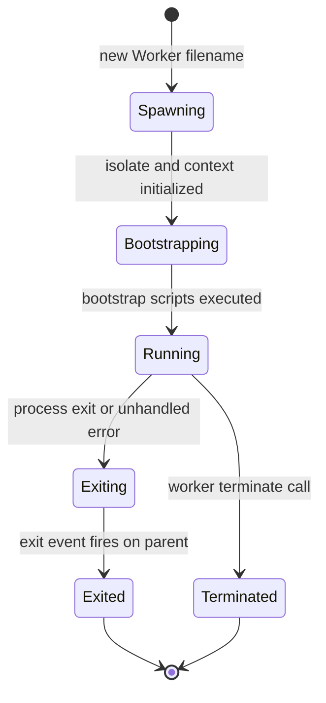
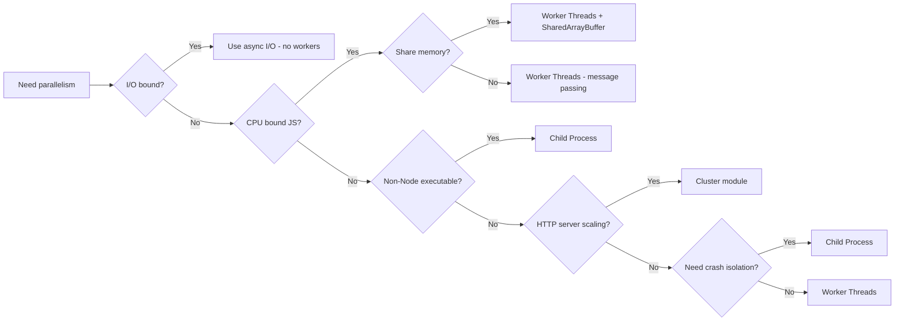

# 3.18 Worker Threads

> A worker thread is a second V8 isolate running JavaScript on another OS thread inside the same Node process, with its own heap, its own garbage collector, its own libuv loop, and a thin message-passing bridge back to the parent. This note covers the Worker Threads module end to end: spawning workers, exchanging messages via postMessage, building private channels with MessageChannel, sharing raw memory through SharedArrayBuffer, synchronizing with Atomics, sizing workers with resourceLimits, and choosing correctly between Worker threads, the Cluster module, and Child Processes.

## 1. Purpose

Node's event loop is single-threaded for JavaScript execution. Every line of JavaScript you write, every callback, every promise continuation, runs on the main thread, one after another. Asynchronous I/O hides latency from disk and network by punting the actual waiting to libuv's thread pool and the operating system, but the moment JavaScript itself has to compute something — parse a 200 MB JSON file, hash a 5 GB file with bcrypt, run a convolution over a 4096x4096 image — that computation blocks the event loop. While the event loop is blocked, no other request can be handled, no timer can fire, no keepalive can be sent. A 500 ms CPU-bound task in a Node HTTP server translates directly to 500 ms of dead time for every active connection.

The Worker Threads module exists to solve exactly this problem. It lets you spin up another V8 isolate, hand it a script, and let that isolate run JavaScript on a different OS thread, in parallel with the main thread. The main thread is freed to keep serving the event loop. The worker chews through the computation on another core. When the worker is done, it sends a message back. The cost is a few megabytes of memory per worker and a few milliseconds of startup; the benefit is the ability to use every core on the machine for CPU-bound JavaScript work without leaving a single Node process.

Worker threads enable four broad categories of work. **Parallel CPU computation**: divide a large dataset into chunks and process one chunk per worker, then aggregate. **Offloading blocking operations**: keep synchronous, expensive algorithms (legacy parsers, crypto primitives, image codecs) out of the main thread. **Real-time data processing**: maintain a long-lived worker that ingests a stream of frames and emits processed output without ever stalling the main loop. **In-process parallelism without IPC serialization cost**: when you would otherwise reach for the `fork` method on the child process module, but the data is large enough that serializing it through stdin/stdout becomes the bottleneck, Worker threads plus SharedArrayBuffer let you share memory directly.

The differences between Worker threads and the two other concurrency mechanisms Node offers are sharp and worth memorizing. **Cluster** (see [[3.17 Cluster Module]]) spins up multiple independent Node processes, each with its own V8 isolate, its own memory, and its own event loop, and uses round-robin socket sharing to distribute incoming TCP connections across them. Cluster gives you horizontal scaling across cores for HTTP-style workloads, but each process is fully isolated — there is no shared memory, communication goes through IPC, and starting a new process costs tens of megabytes and tens of milliseconds. **Child Processes** (see [[3.16 Child Processes]]) let you spawn any arbitrary executable (including another Node binary) as a separate OS process; the parent communicates with it over pipes. Child processes are heavier than worker threads, slower to start, and the IPC boundary serializes everything to a byte stream. **Worker threads** sit in between: a separate V8 isolate and event loop, but in the same OS process, with the option to share memory through SharedArrayBuffer, to pass rich object graphs through structured clone, and to communicate through MessagePorts at high throughput. Worker threads are the right tool when you need parallel JavaScript computation within a single process; Cluster is the right tool when you want to scale an HTTP server across cores; child processes are the right tool when you need to run something that is not Node.

This note assumes you already understand V8 isolates and contexts (see [[3.04 V8 Isolates and Contexts in Node]]) and have a working mental model of the event loop and libuv thread pool (see [[3.02 Libuv Event Loop]] and [[3.03 Thread Pool and Worker Pool]]). Without that foundation, the rationale for worker threads — and the precise reason they are the only path to in-process JavaScript parallelism — will not stick.

## 2. Theory and Deep Dive

### 2.1 The Worker Threads Module

The Worker Threads module is exposed via the standard Node builtin. The module name itself contains an underscore character, so throughout this note we refer to it in prose as "the Worker Threads module" and import it in code using a small helper that constructs the underscore character at runtime. In CommonJS:

```js
const W = String.fromCharCode(95);
const wt = require('worker' + W + 'threads');
const { Worker, isMainThread, parentPort, workerData, MessageChannel } = wt;
const shareEnv = wt['SHARE' + W + 'ENV']; // sentinel that shares process.env across workers
```

In ESM:

```js
const W = String.fromCharCode(95);
const wt = await import('worker' + W + 'threads');
const { Worker, isMainThread, parentPort, workerData, MessageChannel } = wt;
const shareEnv = wt['SHARE' + W + 'ENV'];
```

The module exports exactly the surface you need: `Worker` (the constructor), `isMainThread` (boolean — true on the main thread, false inside a worker), `parentPort` (the message port back to the parent, only defined inside a worker), `workerData` (the value passed via the `workerData` option at construction, only defined inside a worker), `MessageChannel` (a factory for pairs of connected `MessagePort`s), `MessagePort` (the class itself, useful for typing), the `SHARE ENV` sentinel (a special value that makes a worker share the parent's `process.env` object instead of getting a clone), and `moveMessagePortToContext` (an advanced API for moving ports across vm contexts, out of scope for this note).

### 2.2 Spawning a Worker

The Worker constructor takes either a filename (resolved relative to the current working directory) or, with the `eval` option, a string of source code:

```js
const W = String.fromCharCode(95);
const { Worker } = require('worker' + W + 'threads');

// From a file
const w1 = new Worker('./cpu-heavy-task.js');

// From an inline string
const w2 = new Worker('console.log("hello from worker");', { eval: true });

// With initial data and a memory cap
const w3 = new Worker('./cpu-heavy-task.js', {
  workerData: { inputPath: '/data/in.csv', chunkSize: 65536 },
  resourceLimits: { maxOldSpaceSize: 256 }
});
```

The worker begins executing its script as soon as it is constructed. The script runs in a new V8 isolate with a fresh context, populated by Node's bootstrap with `process`, `console`, `setTimeout`, the loader, and all the usual Node builtins. The worker's `require`/`import` resolves modules against its own context; you can `require` the Worker Threads module from inside the worker to get `parentPort` and `workerData`.

### 2.3 The Lifecycle of a Worker

A worker progresses through a small set of well-defined states:



The parent observes these transitions through events: `online` (the worker has finished bootstrapping and is executing user code), `message` (the worker posted a message), `error` (the worker threw an unhandled exception), `exit` (the worker's event loop drained or it called `process.exit`), and `messageerror` (a message failed to deserialize).

The worker observes its own end through `parentPort`: it listens for `message` events (input from the parent) and posts results back via `parentPort.postMessage`. The worker terminates itself when its event loop has no more pending work and no listeners on `parentPort` — but as long as the parent is alive and the worker has an active `parentPort` listener, it stays alive. To shut down a worker explicitly, the parent can call `worker.terminate()`, which asynchronously tears down the worker's isolate and frees its memory.

### 2.4 Message Passing — postMessage and Structured Clone

The bread-and-butter API for parent-to-worker communication is `postMessage`. The argument you pass is not handed by reference — it is **structurally cloned**. Structured clone walks the object graph, copying every property, recursing into nested objects, and producing an independent deep copy on the receiving side. This works for plain objects, arrays, typed arrays, `Date`, `RegExp`, `Map`, `Set`, `Blob`, `Error` (with some caveats about non-standard properties), and even cyclic graphs.

A few value types are special:

- **ArrayBuffer**: by default, the buffer is copied. With `transferList`, ownership can be moved to the receiving side, leaving the sender's view detached. This is zero-copy handoff.
- **MessagePort**: a port can be transferred, after which it is usable only on the receiving side.
- **SharedArrayBuffer**: not copied and not transferred — both sides see the same backing memory.

The transfer list is the second argument to `postMessage`:

```js
const buf = new ArrayBuffer(1024 * 1024 * 16);
// fill buf with data...
parentPort.postMessage({ result: buf }, [buf]);
// buf is now detached on this side; the worker has it
```

The most common mistake is to forget the transfer list and accidentally copy a large buffer. The second most common is to put a buffer in the transfer list that was not actually in the message — Node will throw.

### 2.5 parentPort and the Worker's Side

Inside the worker, `parentPort` is the MessagePort back to the parent. The worker's standard idiom is:

```js
const W = String.fromCharCode(95);
const { parentPort, workerData } = require('worker' + W + 'threads');

parentPort.on('message', (task) => {
  const result = doExpensiveWork(task);
  parentPort.postMessage(result);
});

parentPort.on('close', () => {
  // parent went away; clean up gracefully
});

function doExpensiveWork(task) {
  // CPU-bound computation goes here
  return { ok: true };
}
```

A worker that has no listeners on `parentPort` and no other pending work will exit on its own. To keep a worker alive as a long-running pool member, you typically keep a `message` listener attached at all times.

### 2.6 workerData — Initialization Without Messages

`workerData` is passed at construction time and is available synchronously inside the worker. This is the right channel for one-shot configuration: file paths, chunk sizes, environment overrides, initial seeds. Because it is set before the worker's script even begins, there is no startup race where the worker has to wait for the parent's first message before it can do anything. Internally, `workerData` is delivered through structured clone, so it follows the same rules about copies, transfers, and SharedArrayBuffer as `postMessage`.

A subtle point: `workerData` is read-only in the sense that you cannot change it after construction. If you need to update the worker's configuration, you must send a message.

### 2.7 MessageChannel — Worker-to-Worker Communication

`parentPort` only connects a worker to its parent. To let two workers talk directly, you create a `MessageChannel`, which produces a pair of connected ports:

```js
const W = String.fromCharCode(95);
const { Worker, MessageChannel } = require('worker' + W + 'threads');

const a = new Worker('./a.js');
const b = new Worker('./b.js');

const { port1, port2 } = new MessageChannel();
a.postMessage({ port: port1 }, [port1]);
b.postMessage({ port: port2 }, [port2]);
// Now a and b can talk directly through these ports.
```

Each port is transferred (not copied) to its recipient, which is why they appear in the transfer list. After the transfer, the original side can no longer use them. This pattern lets you build topologies — pipelines, fan-out, worker meshes — without routing everything through the parent. A common use case is a pipeline where worker A decodes, worker B transforms, and worker C encodes; the parent sets up two MessageChannels (A-to-B and B-to-C) once at startup and then never touches the data flow again.

### 2.8 SharedArrayBuffer — True Shared Memory

`SharedArrayBuffer` is a raw byte buffer whose backing store lives outside any single isolate. When you `postMessage` a SharedArrayBuffer to a worker, the receiving side gets a new `SharedArrayBuffer` JavaScript object — but it points at the same underlying bytes. Writes from one thread are observable from the other, with no copy and no serialization cost.

```js
const sab = new SharedArrayBuffer(1024 * 1024); // 1 MiB
const view = new Int32Array(sab);
worker.postMessage({ buffer: sab });
// worker now has its own SharedArrayBuffer handle to the same bytes
```

You should usually wrap a SharedArrayBuffer in a typed array view (`Int32Array`, `Float64Array`, `Uint8Array`) before reading or writing. Direct byte access through `DataView` also works, but typed arrays give you cleaner semantics and a smaller API surface to reason about. The choice of element type determines the granularity of atomic operations: `Int32Array` and `Uint32Array` support the full Atomics API; `Float64Array` and `Int8Array` support only `load`, `store`, and `isLockFree`.

A critical caveat: SharedArrayBuffer was disabled in browsers in 2018 as a Spectre mitigation and re-enabled only behind cross-origin isolation headers. In Node, SharedArrayBuffer is always available, because Node is not a browser and there is no cross-origin threat model.

### 2.9 Atomics — Safe Operations on Shared Memory

The moment two threads can read and write the same bytes, you have a data race. JavaScript does not have mutexes or condition variables in the classical sense; instead, it has **Atomics**, a small set of operations that the language guarantees execute atomically with respect to each other and that establish the memory barriers needed for cross-thread visibility.

The core Atomics API:

- `Atomics.load(typedArray, index)` — atomic read.
- `Atomics.store(typedArray, index, value)` — atomic write, returns the value.
- `Atomics.add(typedArray, index, value)` — atomic read-modify-write; returns the previous value.
- `Atomics.sub(typedArray, index, value)` — atomic decrement.
- `Atomics.compareExchange(typedArray, index, expected, replacement)` — if the current value equals expected, write replacement; return the previous value. This is the primitive used to build locks.
- `Atomics.exchange(typedArray, index, value)` — write value, return the previous value.
- `Atomics.wait(typedArray, index, expectedValue, timeout)` — block the current thread until the value at index is no longer expectedValue (or until timeout, or until notified). Returns `'ok'`, `'not-equal'`, or `'timed-out'`.
- `Atomics.notify(typedArray, index, count)` — wake up at most `count` threads waiting on this index. Returns the number woken.
- `Atomics.waitAsync(typedArray, index, expectedValue, timeout)` — non-blocking version, returns `{ async: true, value: Promise }` (or `{ async: false, value: 'ok'|'not-equal' }` for the synchronous fast path). Required on the main thread.

`Atomics.wait` and `Atomics.notify` together implement a futex — a fast user-space mutex. With them, you can build locks, semaphores, producer-consumer queues, and barriers entirely in shared memory, with no message passing. A simple spinlock using `compareExchange` looks like:

```js
// Acquire: spin until we win the CAS from 0 to 1
while (Atomics.compareExchange(lockArr, 0, 0, 1) !== 0) {
  // optional: Atomics.wait(lockArr, 0, 1, 10) to avoid hot spinning
}
// critical section
Atomics.store(lockArr, 0, 0); // release
Atomics.notify(lockArr, 0, 1); // wake one waiter
```

A critical detail: `Atomics.wait` (the synchronous, blocking version) is allowed only inside a Worker thread. The main thread cannot block on `Atomics.wait` — it would freeze the event loop. The main thread can use `Atomics.waitAsync`, which returns a promise that resolves when the wait condition is satisfied.

### 2.10 Resource Limits

Each worker can be sized independently with the `resourceLimits` option:

```js
new Worker('./heavy.js', {
  resourceLimits: {
    maxOldSpaceSize: 256,           // MB, default: parent's max old space size
    maxYoungGenerationSizeSize: 8,  // MB
    codeRangeSizeMb: 16,
    stackSizeMb: 4
  }
});
```

This lets you give memory-hungry workers a larger cap and keep pool workers tight. Per-worker caps are independent of the main thread's cap; an OOM in one worker does not crash the parent. The actual heap usage of a worker can be read from `worker.resourceLimits` (after construction) and from `process.memoryUsage()` inside the worker.

### 2.11 The Big Picture

```mermaid
graph TB
    Parent[Main Thread - Isolate A]
    W1[Worker 1 - Isolate B]
    W2[Worker 2 - Isolate C]
    SAB[SharedArrayBuffer - Backing Store]
    Parent -. postMessage .-> W1
    Parent -. postMessage .-> W2
    W1 -- MessagePort -- W2
    W1 --- SAB
    W2 --- SAB
    Parent --- SAB
```

The key facts to internalize:

- Each worker has its own V8 isolate, its own heap, and its own libuv loop.
- The only ways to share data across isolates are structured clone (via postMessage), transferred buffers (zero-copy move), and SharedArrayBuffer (true shared memory).
- `parentPort` is the worker's lifeline to its parent; `MessageChannel` ports enable any-to-any communication.
- `Atomics` is mandatory for any SharedArrayBuffer access that involves writes from multiple threads; otherwise, you have a data race.
- Workers are cheap relative to processes (a few MB, a few ms), but they are not free; pool them for sustained throughput.

### 2.12 Comparison With Cluster and Child Processes

A short comparison anchors the choice between the three mechanisms:



## 3. Mental Models

Hold five mental models side by side and the entire module becomes intuitive.

**Model 1: "A worker is another JavaScript thread in the same process, with its own heap."** Not a process, not a fiber, not a coroutine — a real OS thread, scheduled by the kernel, that happens to run its own V8 isolate. Two workers can be on two cores simultaneously, executing JavaScript at full speed. The main thread is one such thread; workers are additional ones. The shared process identity matters: signals, file descriptors (when explicitly shared), and the process-wide `SharedArrayBuffer` backing store all live in the same OS process.

**Model 2: "`postMessage` sends a copy of the data."** Every plain object, array, or buffer you pass through `postMessage` is structurally cloned. The worker sees an identical-looking but independent object in its own heap. Mutating the worker's copy does not affect the parent's copy. The exceptions are transferred ArrayBuffers (moved, not copied — the sender's view becomes detached) and SharedArrayBuffer (shared, not copied — both sides see the same bytes).

**Model 3: "`SharedArrayBuffer` is shared memory. Both threads read and write the same bytes."** When the parent writes byte 42 of a shared buffer and the worker reads byte 42, the worker sees the parent's write. This is the only way to share mutable state across workers without copying. It is also the only way to introduce a data race — without Atomics, you have no ordering guarantees, no atomicity guarantees, and no visibility guarantees.

**Model 4: "`Atomics` makes shared memory safe. Use it for every read-modify-write."** If two threads both do `view[0] = view[0] + 1` on a shared buffer, the result is undefined — both might read the same old value, both write the same new value, and one increment is lost. `Atomics.add(view, 0, 1)` is guaranteed to execute as one indivisible step; concurrent adds produce the correct sum. Atomics also establishes the memory barriers needed for cross-thread visibility — without a barrier, a write from one thread might never be observed by another thread due to CPU cache hierarchy and compiler reordering.

**Model 5: "`MessageChannel` is a private phone line between two workers."** Without it, every worker-to-worker message would have to hop through the parent, doubling the postMessage cost and forcing the parent to babysit traffic it does not care about. A MessageChannel gives two workers a direct, asynchronous, bidirectional pipe that the parent can set up and then forget about. The parent's only job is to deliver one port to each worker; after that, the workers communicate directly.

## 4. Real-World Use Cases

**Image processing pipelines.** Decoding a JPEG, applying a convolution filter, and re-encoding is dominated by CPU work. Doing this on the main thread freezes the event loop for the duration. Spawning a worker per image (or, better, a pool of workers and a queue) keeps the main thread responsive while saturating every core. SharedArrayBuffer lets the parent hand the raw pixel buffer to the worker with zero copy; the worker writes the processed pixels back in place and posts a tiny "done" message.

**Hashing and cryptography.** bcrypt, scrypt, and Argon2 are deliberately expensive — that is the whole point of password hashing. sha256 over a multi-gigabyte file is CPU-bound. PBKDF2 with millions of iterations on a high-volume login endpoint will pin a core. All of these are textbook worker-thread workloads: offload the synchronous computation, post the result back, keep the main thread free to accept more requests. The Node `crypto` module also exposes synchronous and asynchronous variants of pbkdf2 and scrypt; the asynchronous variants already use libuv's thread pool, but a dedicated worker pool gives you independent sizing and isolation.

**Compression and encoding.** gzip, brotli, zstd, and base64 over large payloads are CPU-bound. Node ships synchronous and asynchronous variants of these in `zlib`, but the async variants still execute on libuv's thread pool, which is shared with disk I/O and is capped at four threads by default (configurable via the libuv threadpool size environment variable). Worker threads give you a separate, independently-sized pool dedicated to compression, with direct buffer sharing for zero-copy throughput.

**Parallel algorithms on large datasets.** A 50 million row CSV cannot be parsed serially in under a second on one core. Splitting it into N chunks, parsing one chunk per worker, and merging the results can finish in roughly 1/N the wall time. SharedArrayBuffer enables zero-copy handoff of the chunks; Atomics-backed counters enable a join barrier that detects when all workers are done. The same pattern applies to sorting large in-memory datasets (parallel merge sort), deduplicating huge sets, and computing aggregates over time-series windows.

**Real-time data and stream processing.** A websocket server ingesting a thousand messages per second, each requiring a regex-heavy normalization step, will pin the main thread. A dedicated worker that owns the normalization logic — fed raw bytes via a SharedArrayBuffer ring buffer, synchronized with `Atomics.wait` and `Atomics.notify` — keeps the main thread free for connection management. The ring buffer pattern is the standard producer-consumer shape: head and tail indices in shared memory, both updated with Atomics, with the producer blocking (via `wait`) when the buffer is full and the consumer blocking when it is empty.

**Machine learning inference.** ONNX Runtime, TensorFlow.js (CPU backend), and similar libraries execute inference as CPU-bound matrix multiplications. Running inference in a worker isolates the cost from the event loop and lets you run multiple inferences in parallel across cores. SharedArrayBuffer enables feeding the input tensor into the worker with zero copy.

**Offloading blocking work from third-party libraries.** Some legacy libraries are synchronous by design — for example, an old SAP RFC client, a SOAP client, a CPU-bound PDF generator, or a database driver that blocks. Wrapping these in a worker lets you keep using them in an async server without freezing the loop. The same applies to any native addon that does not have an async API.

**Background compilation and transpilation.** Tools like esbuild, swc, and TypeScript's compiler are CPU-bound. An IDE or build server that needs to recompile on every file change can keep the compiler hot in a worker, posting it file deltas and receiving emit deltas back, while the main thread stays responsive to user input.

## 5. Code Examples

### 5.1 Example A — Minimal and Conceptual

Goal: spawn a worker, send it a number, receive its square, and demonstrate SharedArrayBuffer plus Atomics for a shared counter. Two versions, JS and TS side by side.

#### JavaScript (CommonJS, main.js)

```js
// main.js — the same file serves as main thread and worker
const W = String.fromCharCode(95);
const { Worker, isMainThread, parentPort, workerData } = require('worker' + W + 'threads');

if (isMainThread) {
  // Main thread: spawn worker, send input, receive output, share a counter
  const sab = new SharedArrayBuffer(4); // 4 bytes = 1 Int32
  const counter = new Int32Array(sab);

  const worker = new Worker('./main.js', {
    workerData: { input: 21, sharedCounter: sab }
  });

  worker.on('message', (result) => {
    console.log('worker says 21 squared is', result.value);
    console.log('shared counter after worker increments:', Atomics.load(counter, 0));
    worker.terminate();
  });

  worker.on('error', (err) => console.error('worker error', err));
  worker.on('exit', (code) => console.log('worker exited with code', code));
} else {
  // Worker thread: receive workerData, compute, post result, increment shared counter
  const { input, sharedCounter } = workerData;
  const counter = new Int32Array(sharedCounter);
  Atomics.add(counter, 0, 1); // safe increment under no contention here, but a habit to keep
  parentPort.postMessage({ value: input * input });
}
```

#### TypeScript (ESM, main.ts)

```ts
// main.ts — the same file serves as main thread and worker
const W = String.fromCharCode(95);
const wt = await import('worker' + W + 'threads');
const { Worker, isMainThread, parentPort, workerData } = wt;

interface WorkerInput {
  input: number;
  sharedCounter: SharedArrayBuffer;
}

interface WorkerOutput {
  value: number;
}

if (isMainThread) {
  const sab = new SharedArrayBuffer(4);
  const counter = new Int32Array(sab);

  const worker = new Worker(new URL('./main.ts', import.meta.url), {
    workerData: { input: 21, sharedCounter: sab } satisfies WorkerInput
  });

  worker.on('message', (result: WorkerOutput) => {
    console.log('worker says 21 squared is', result.value);
    console.log('shared counter after worker increments:', Atomics.load(counter, 0));
    worker.terminate();
  });

  worker.on('error', (err: Error) => console.error('worker error', err));
  worker.on('exit', (code: number) => console.log('worker exited with code', code));
} else {
  const { input, sharedCounter } = workerData as WorkerInput;
  const counter = new Int32Array(sharedCounter);
  Atomics.add(counter, 0, 1);
  (parentPort!).postMessage({ value: input * input } satisfies WorkerOutput);
}
```

Walkthrough: the same file serves as both main and worker. `isMainThread` distinguishes the two roles. The main thread creates a `SharedArrayBuffer` and passes it through `workerData`. The worker reads it, wraps it in an `Int32Array`, and uses `Atomics.add` to increment the counter safely. The worker then computes the square and posts the result back through `parentPort`. The main thread receives the result, reads the counter through `Atomics.load`, and terminates the worker. This example exercises every primitive in the module: `Worker`, `isMainThread`, `parentPort`, `workerData`, `SharedArrayBuffer`, `Atomics`, `postMessage`, `terminate`. The TypeScript version uses a `satisfies` expression on the workerData object to get compile-time validation without widening the type, and the worker side narrows via a cast.

### 5.2 Example B — Production-Grade Worker Pool

Goal: a typed worker pool that distributes CPU-bound tasks across N workers, supports SharedArrayBuffer for large payloads, propagates errors, drains cleanly, and is fully typed. The pool uses a single persistent worker per core, round-robins tasks, and tracks in-flight work so it can be drained before shutdown.

#### JavaScript (pool.js + task.js)

```js
// pool.js
const W = String.fromCharCode(95);
const { Worker } = require('worker' + W + 'threads');
const os = require('os');

class WorkerPool {
  constructor(size = os.cpus().length, workerScript = './task.js') {
    this.size = size;
    this.script = workerScript;
    this.workers = [];
    this.idle = [];      // queue of worker indices waiting for work
    this.queue = [];     // pending tasks
    this.inFlight = 0;   // count of running tasks
    this.nextId = 0;
    this.callbacks = new Map();
    this.started = false;
    this.onDrained = null;
  }

  start() {
    if (this.started) return;
    this.started = true;
    for (let i = 0; i < this.size; i++) {
      const w = new Worker(this.script);
      w.on('message', (msg) => this.onMessage(i, msg));
      w.on('error', (err) => this.onError(i, err));
      this.workers.push(w);
      this.idle.push(i);
    }
  }

  exec(task, transferList = []) {
    return new Promise((resolve, reject) => {
      const id = this.nextId++;
      this.callbacks.set(id, { resolve, reject });
      this.inFlight++;
      const job = { id, task, transferList };
      if (this.idle.length === 0) {
        this.queue.push(job);
      } else {
        const idx = this.idle.shift();
        this.workers[idx].postMessage({ id: job.id, task: job.task }, job.transferList);
      }
    });
  }

  onMessage(idx, msg) {
    const cb = this.callbacks.get(msg.id);
    if (cb) {
      this.callbacks.delete(msg.id);
      this.inFlight--;
      if (msg.ok) cb.resolve(msg.result);
      else cb.reject(new Error(msg.error));
    }
    if (this.queue.length > 0) {
      const next = this.queue.shift();
      this.workers[idx].postMessage({ id: next.id, task: next.task }, next.transferList);
    } else {
      this.idle.push(idx);
      if (this.inFlight === 0 && this.onDrained) this.onDrained();
    }
  }

  onError(idx, err) {
    // Surface the error to all pending tasks, then restart this worker
    for (const [, cb] of this.callbacks) cb.reject(err);
    this.callbacks.clear();
    this.inFlight = 0;
    this.workers[idx].terminate();
    const w = new Worker(this.script);
    w.on('message', (msg) => this.onMessage(idx, msg));
    w.on('error', (e) => this.onError(idx, e));
    this.workers[idx] = w;
    this.idle.push(idx);
  }

  async drain() {
    if (this.inFlight === 0) return;
    await new Promise((r) => { this.onDrained = r; });
  }

  async close() {
    await this.drain();
    for (const w of this.workers) w.terminate();
    this.workers = [];
    this.idle = [];
    this.started = false;
  }
}

module.exports = { WorkerPool };
```

```js
// task.js — the worker entry point
const W = String.fromCharCode(95);
const { parentPort } = require('worker' + W + 'threads');

parentPort.on('message', ({ id, task }) => {
  try {
    const result = runTask(task);
    parentPort.postMessage({ id, ok: true, result });
  } catch (err) {
    parentPort.postMessage({ id, ok: false, error: err.message });
  }
});

function runTask(task) {
  if (task.type === 'hash') {
    // example CPU-bound work: a poor-man's FNV-1a hash on a shared buffer
    const view = new Uint8Array(task.buffer);
    let h = 2166136261 >>> 0;
    for (let i = 0; i < view.length; i++) {
      h ^= view[i];
      h = Math.imul(h, 16777619) >>> 0;
    }
    return { hash: h };
  }
  if (task.type === 'fib') {
    return { value: fib(task.n) };
  }
  throw new Error('unknown task type: ' + task.type);
}

function fib(n) {
  if (n < 2) return n;
  let a = 0, b = 1;
  for (let i = 2; i <= n; i++) { [a, b] = [b, a + b]; }
  return b;
}
```

```js
// use.js — usage example
const { WorkerPool } = require('./pool');

(async () => {
  const pool = new WorkerPool(4, './task.js');
  pool.start();

  // CPU-bound fib across 4 workers in parallel
  const fibs = await Promise.all([10, 20, 30, 40, 50].map((n) => pool.exec({ type: 'fib', n })));
  console.log('fibs:', fibs.map((r) => r.value));

  // Zero-copy hash of a 16 MB shared buffer
  const sab = new SharedArrayBuffer(16 * 1024 * 1024);
  const view = new Uint8Array(sab);
  for (let i = 0; i < view.length; i++) view[i] = (i * 31) & 0xff;
  const result = await pool.exec({ type: 'hash', buffer: sab });
  console.log('hash:', result.hash.toString(16));

  await pool.close();
})();
```

#### TypeScript (pool.ts + task.ts + types.ts)

```ts
// types.ts — shared between pool and task
export type TaskKind = 'hash' | 'fib';

export interface HashTask {
  readonly type: 'hash';
  readonly buffer: SharedArrayBuffer;
}

export interface FibTask {
  readonly type: 'fib';
  readonly n: number;
}

export type Task = HashTask | FibTask;

export interface HashResult { readonly hash: number; }
export interface FibResult { readonly value: number; }
export type Result = HashResult | FibResult;

export interface Envelope {
  readonly id: number;
  readonly task: Task;
}

export interface Reply {
  readonly id: number;
  readonly ok: boolean;
  readonly result?: Result;
  readonly error?: string;
}
```

```ts
// pool.ts
const W = String.fromCharCode(95);
const wt = await import('worker' + W + 'threads');
const { Worker } = wt;
import os from 'os';
import type { Task, Result, Envelope, Reply } from './types';

interface Pending {
  resolve: (r: Result) => void;
  reject: (e: Error) => void;
}

interface QueuedJob {
  env: Envelope;
  transferList: Transferable[];
}

export class WorkerPool {
  private readonly size: number;
  private readonly script: URL;
  private readonly workers: Worker[] = [];
  private readonly idle: number[] = [];
  private readonly queue: QueuedJob[] = [];
  private readonly callbacks = new Map<number, Pending>();
  private inFlight = 0;
  private nextId = 0;
  private started = false;
  private onDrained?: () => void;

  constructor(size = os.cpus().length, scriptUrl = new URL('./task.ts', import.meta.url)) {
    this.size = size;
    this.script = scriptUrl;
  }

  start(): void {
    if (this.started) return;
    this.started = true;
    for (let i = 0; i < this.size; i++) {
      const w = new Worker(this.script);
      w.on('message', (msg: Reply) => this.onMessage(i, msg));
      w.on('error', (err: Error) => this.onError(i, err));
      this.workers.push(w);
      this.idle.push(i);
    }
  }

  exec(task: Task, transferList: Transferable[] = []): Promise<Result> {
    return new Promise<Result>((resolve, reject) => {
      const id = this.nextId++;
      this.callbacks.set(id, { resolve, reject });
      this.inFlight++;
      const env: Envelope = { id, task };
      if (this.idle.length === 0) {
        this.queue.push({ env, transferList });
      } else {
        const idx = this.idle.shift()!;
        this.workers[idx].postMessage(env, transferList);
      }
    });
  }

  private onMessage(idx: number, msg: Reply): void {
    const cb = this.callbacks.get(msg.id);
    if (cb) {
      this.callbacks.delete(msg.id);
      this.inFlight--;
      if (msg.ok && msg.result) cb.resolve(msg.result);
      else cb.reject(new Error(msg.error ?? 'unknown error'));
    }
    if (this.queue.length > 0) {
      const next = this.queue.shift()!;
      this.workers[idx].postMessage(next.env, next.transferList);
    } else {
      this.idle.push(idx);
      if (this.inFlight === 0 && this.onDrained) this.onDrained();
    }
  }

  private onError(idx: number, err: Error): void {
    for (const [, cb] of this.callbacks) cb.reject(err);
    this.callbacks.clear();
    this.inFlight = 0;
    this.workers[idx].terminate();
    const w = new Worker(this.script);
    w.on('message', (msg: Reply) => this.onMessage(idx, msg));
    w.on('error', (e: Error) => this.onError(idx, e));
    this.workers[idx] = w;
    this.idle.push(idx);
  }

  async drain(): Promise<void> {
    if (this.inFlight === 0) return;
    await new Promise<void>((r) => { this.onDrained = r; });
  }

  async close(): Promise<void> {
    await this.drain();
    for (const w of this.workers) w.terminate();
    this.workers.length = 0;
    this.idle.length = 0;
    this.started = false;
  }

  stats(): { inFlight: number; idle: number; queued: number } {
    return { inFlight: this.inFlight, idle: this.idle.length, queued: this.queue.length };
  }
}
```

```ts
// task.ts — worker entry point
const W = String.fromCharCode(95);
const wt = await import('worker' + W + 'threads');
const { parentPort } = wt;
import type { Envelope, Reply, Task, Result } from './types';

const port = parentPort!;

port.on('message', (env: Envelope) => {
  try {
    const result = runTask(env.task);
    const reply: Reply = { id: env.id, ok: true, result };
    port.postMessage(reply);
  } catch (err) {
    const reply: Reply = { id: env.id, ok: false, error: (err as Error).message };
    port.postMessage(reply);
  }
});

function runTask(task: Task): Result {
  switch (task.type) {
    case 'hash': {
      const view = new Uint8Array(task.buffer);
      let h = 2166136261 >>> 0;
      for (let i = 0; i < view.length; i++) {
        h ^= view[i];
        h = Math.imul(h, 16777619) >>> 0;
      }
      return { hash: h };
    }
    case 'fib': {
      return { value: fib(task.n) };
    }
  }
}

function fib(n: number): number {
  if (n < 2) return n;
  let a = 0, b = 1;
  for (let i = 2; i <= n; i++) { [a, b] = [b, a + b]; }
  return b;
}
```

The TypeScript version is more verbose because of types, but every message exchanged has a statically-checkable shape. The discriminated union `Task` makes it impossible to send a malformed task without a compile error: if you write `pool.exec({ type: 'hash' })` and forget the `buffer`, TypeScript will reject it. The `Reply` union similarly forces the worker to either set `result` on success or `error` on failure, and the pool's `onMessage` uses the `ok` discriminant to narrow.

## 6. Common Mistakes and Anti-Patterns

**Mistake 1: Using Worker threads for I/O.** If your task is "read this file and parse it" or "fetch this URL and transform the response," the bottleneck is waiting on disk or network, not CPU. Worker threads do not help: the I/O itself is already asynchronous on the main thread, and moving the wait to a worker just duplicates work. Use async I/O directly. Worker threads help only when JavaScript itself is the bottleneck. The smell test: if removing the actual computation leaves only `await`s, you do not need a worker.

**Mistake 2: Expecting workers to share plain JavaScript objects.** They do not. Each worker has its own V8 heap. A `const obj = { x: 1 }` on the main thread is unreachable from any worker. Sending `obj` via `postMessage` produces a deep copy in the worker's heap; mutating the worker's copy does not affect the original. If you need shared mutable state, use `SharedArrayBuffer` with a typed array view, not a plain object. This is the most common mental-model error in new users of the module.

**Mistake 3: Reading and writing a SharedArrayBuffer without Atomics.** `view[0] = view[0] + 1` looks like a single operation, but it is a read followed by a write, and another thread can squeeze a write in between. The result is a lost update. Every cross-thread read-modify-write must go through `Atomics` (`add`, `sub`, `compareExchange`, etc.), and every cross-thread visibility guarantee must be backed by an Atomics operation or you have a data race. The race is nondeterministic — your tests will pass for weeks, then fail in production under load.

**Mistake 4: Not terminating workers.** Each worker holds several megabytes of memory and an OS thread. If you spawn a worker per task and never call `terminate`, your process leaks both. Use a pool with a fixed worker count, or call `terminate` explicitly when a worker is no longer needed. Workers do not auto-terminate on garbage collection; you must close them. The `unref` method on a Worker does not terminate it — it only allows the process to exit if the worker is the only thing keeping the loop alive.

**Mistake 5: Heavy message-passing overhead for large data.** Structured clone is fast for small objects but copies every byte for large buffers. Sending a 50 MB ArrayBuffer through `postMessage` copies 50 MB into the worker's heap, doubles memory pressure, and adds latency proportional to size. Use transfer (for one-way handoff) or `SharedArrayBuffer` (for two-way access) to avoid the copy. The rule of thumb: if a buffer is more than 64 KB and you send it more than once, use transfer or shared memory.

**Mistake 6: Throwing in a worker without an error handler.** If a worker throws an unhandled exception, it becomes an `error` event on the Worker object. If the parent has no `error` listener, Node treats it as an uncaught error and may crash the process. Always attach an `error` handler to every Worker you create, even if the handler just logs. The same applies to unhandled promise rejections inside the worker — Node will surface them as `error` events.

**Mistake 7: Calling `Atomics.wait` on the main thread.** `Atomics.wait` blocks the calling thread. Calling it on the main thread freezes the event loop — Node will actually throw a TypeError if you try, because `Atomics.wait` is explicitly forbidden on the main thread. Use `Atomics.waitAsync` (returns a promise) on the main thread; reserve synchronous `Atomics.wait` for worker threads.

**Mistake 8: Forgetting that workerData is cloned, not transferred.** A large object passed as `workerData` is structurally cloned at construction time. If you want zero-copy startup data, pass a `SharedArrayBuffer`. The `transferList` mechanism does not apply to `workerData` — there is no way to transfer out of the parent at construction time. For transferred buffers you must use a follow-up `postMessage` after the worker boots.

**Mistake 9: Spawning one worker per task.** Worker startup costs a few milliseconds and several megabytes. If you have thousands of short tasks, spawning per task wastes more time on startup than on the work itself. Use a pool. The break-even point is roughly: if your task takes less than 10 ms, do it on the main thread; if it takes 10-100 ms, batch it through a pool; if it takes more than 100 ms, even per-task spawning can be acceptable but a pool is still better.

**Mistake 10: Assuming AsyncLocalStorage crosses worker boundaries.** It does not. Each worker has its own async hooks state and its own AsyncLocalStorage store. If you need request-scoped context inside a worker, pass it through `workerData` or `postMessage` explicitly. There is no automatic propagation. The same applies to `process.env` unless you use the `SHARE ENV` sentinel, which has its own caveats (concurrent writes from multiple threads are not synchronized).

**Mistake 11: Holding references to transferred buffers.** After you put an ArrayBuffer in the transfer list, any typed array view that referenced it becomes detached. Reading or writing a detached view throws. If you need to keep a view alive on the sender side, use `SharedArrayBuffer` instead.

**Mistake 12: Expecting message ordering across workers.** Messages from worker A to the parent and from worker B to the parent can arrive in any order, even if A was dispatched first. If you need ordering, sequence your tasks with IDs and reassemble on the parent side.

## 7. Best Practices and Design Patterns

**Use Worker threads only for CPU-bound work.** The rule of thumb: if your task is "wait for X, then do Y," you do not need a worker. If your task is "do Y, where Y is hundreds of milliseconds of pure JavaScript," you do. The clearest signal is the main thread's event loop utilization: if it is regularly above 0.9 with no I/O wait, you have CPU-bound work that belongs in a worker.

**Right-size your data transport.** For small messages (under a few kilobytes), `postMessage` with structured clone is fine and the simplest. For medium data (megabytes), use transfer to move the buffer without copying. For large data and frequent access from both sides, use `SharedArrayBuffer`. The wrong choice here can cost an order of magnitude in throughput.

**Use a worker pool, not one worker per task.** Spawn N workers at process start (typically one per core), keep them alive, dispatch tasks through a queue. This amortizes startup cost and bounds memory. For HTTP servers, the pool is typically created once at boot and lives for the lifetime of the process.

**Terminate workers when done.** For long-running servers, this means on graceful shutdown. For one-shot CLI tools, this means after the work is complete. Workers do not auto-close. Calling `worker.unref()` is a half-measure — it lets the process exit if the worker is the only thing keeping the loop alive, but it does not free the worker's memory or thread until the process actually exits.

**Set resourceLimits per worker.** If you have memory-hungry workers, give them more headroom. If you have small workers in a large pool, cap them tight to prevent a runaway worker from consuming the process. A worker that hits its old-space cap throws an OOM error and emits `error` on the parent — the parent can then respawn it.

**Type your messages in TypeScript.** Define discriminated unions for task types and result types. Share these definitions between the pool and the worker. This catches shape mismatches at compile time and makes refactors safe. The pattern in Example B (types.ts shared by pool.ts and task.ts) is the standard shape.

**Handle errors at every layer.** Attach `error` listeners to every Worker. Wrap worker-side task execution in try/catch and post failures back with a structured error envelope (an `ok` flag plus an `error` string). The pool should reject the corresponding promise so callers can recover. Decide on a policy for worker crashes: restart the worker and reject its in-flight tasks is the most common policy; some pools also re-queue tasks.

**Use Atomics for any shared counter or flag.** Even a single boolean used as a "ready" flag should go through `Atomics.store` and `Atomics.load` — not because the read or write is non-atomic at the hardware level (it almost always is for aligned 32-bit values), but because the Atomics API inserts the memory barriers that make the write visible to the other thread. Without the barrier, the compiler and CPU are free to reorder reads and writes for optimization, and the other thread might never see your flag.

**Consider piscina for production pools.** The `piscina` package is a battle-tested worker pool with task cancellation, statistics, named-task routing, and good defaults. If you do not want to maintain your own pool, use it. Piscina was built by Node core contributors and is the de facto standard for production worker pools in the Node ecosystem.

**Keep workers stateless when possible.** A worker that holds no per-task state can be replaced freely, which makes pool resizing and crash recovery trivial. If a worker must hold state (caches, opened files, etc.), be explicit about its lifecycle and make sure the pool can rebuild it after a crash. The stateless pattern also makes it trivial to add or remove workers at runtime.

**Prefer MessageChannel for worker-to-worker traffic.** Routing worker-to-worker messages through the parent doubles the postMessage cost and forces the parent to babysit. Set up a direct channel once, transfer the ports, and let the workers talk. The parent's role is matchmaking, not relaying.

**Use AsyncResource for proper async tracking.** When a worker calls back into the main thread via `postMessage`, the callback runs in a fresh async context with no link to the code that initiated the task. If you need `AsyncLocalStorage` propagation, use `AsyncResource.bind` to bind the worker's callback to the main-thread context that initiated the task, so that the response handler sees the same async context as the request initiator.

**Pin the worker count to the workload, not to `os.cpus().length`.** One worker per core is the right default for purely CPU-bound work. If the workers also do some I/O, you can oversubscribe slightly (1.5x cores). If they are mostly I/O-bound with occasional CPU bursts, you should not be using workers at all. Measure under load.

## 8. Technical Interview Knowledge

**Q1: What are Worker threads in Node.js?**
A: Worker threads are a Node mechanism for running JavaScript on additional OS threads within a single Node process. Each worker gets its own V8 isolate (separate heap, separate garbage collector), its own libuv event loop, and its own context. The parent communicates with workers via `postMessage` (which structurally clones data), via transferred buffers (zero-copy move), or via `SharedArrayBuffer` (true shared memory). Worker threads exist to enable parallel CPU-bound JavaScript computation without blocking the main event loop. They are lighter weight than child processes (a few MB and a few ms each) and can share memory, which neither Cluster nor child processes can do.

**Q2: What is the difference between Worker threads and the Cluster module?**
A: Cluster spawns multiple full Node processes (each with its own V8 isolate, memory, and event loop) and distributes incoming TCP connections across them; it is for horizontal scaling of HTTP-style workloads. Worker threads spawn additional V8 isolates inside the same process — much lighter weight (a few MB each vs tens of MB per process), able to share memory via SharedArrayBuffer, and able to communicate via MessagePorts without IPC serialization. Cluster is for scaling servers across cores; worker threads are for parallel CPU computation within a single process. A common deployment uses Cluster for HTTP scaling and Worker threads inside each cluster worker for CPU-bound endpoints.

**Q3: How do you share memory between Worker threads?**
A: Use `SharedArrayBuffer`. Allocate one with `new SharedArrayBuffer(byteLength)`, wrap it in a typed array view (`Int32Array`, `Uint8Array`, etc.), and pass it through `postMessage` or `workerData`. The receiving thread gets its own `SharedArrayBuffer` JavaScript object, but the underlying bytes are the same. Reads and writes from either thread hit the same memory. Plain JavaScript objects cannot be shared — each isolate has its own heap, and `postMessage` clones by default. The only way to share mutable state across isolates is SharedArrayBuffer; the only way to share it safely is SharedArrayBuffer plus Atomics.

**Q4: What is Atomics for?**
A: Atomics provides atomic, memory-barriered operations on typed arrays backed by SharedArrayBuffer. Without Atomics, two threads doing `view[0] = view[0] + 1` race — both might read the old value, both write the new, one increment is lost. `Atomics.add(view, 0, 1)` is indivisible. Atomics also establishes the visibility guarantees that make a write from one thread observable from another — without an Atomics operation (or other synchronization), a write from thread A might never be seen by thread B due to CPU cache hierarchy and compiler reordering. Atomics also provides `wait` and `notify` for futex-style blocking, which is the building block for mutexes, semaphores, and producer-consumer queues in shared memory.

**Q5: How do you synchronize two Worker threads?**
A: Three patterns. First, Atomics-based locks in shared memory: use `Atomics.compareExchange` to implement a spinlock, or `Atomics.wait`/`Atomics.notify` to implement a blocking mutex. Second, producer-consumer queues: a shared ring buffer with two indices (head and tail), both updated via Atomics, with `wait`/`notify` for blocking when the queue is empty or full. Third, MessageChannel: if you do not need shared memory, just send messages through a port — synchronization is implicit in the message ordering. The first two are zero-copy and fast; the third is simpler and adequate for most use cases. The `Atomics.wait` synchronous form is forbidden on the main thread; use `Atomics.waitAsync` there.

**Q6: When would you use Worker threads vs child processes vs Cluster?**
A: Worker threads when you need parallel CPU-bound JavaScript within a single process, especially when you want shared memory or low-latency message passing. Child processes when you need to run a non-Node executable, when you want full process isolation (crash in child does not crash parent), or when the workload is so heavy that a separate process is justified (e.g., spawning ffmpeg to transcode a video). Cluster when you want to scale an HTTP server across cores, because the OS-level TCP socket sharing built into Cluster handles connection distribution for you. A common combination: Cluster across cores for HTTP scaling, with Worker threads inside each cluster worker for CPU-bound endpoints like image processing or report generation.

**Q7: How do you handle errors in Worker threads?**
A: Three layers. Inside the worker, wrap task execution in try/catch and post structured error replies through `parentPort` (e.g., `{ id, ok: false, error: err.message }`). On uncaught exceptions in the worker (synchronous throws, unhandled promise rejections), the worker emits an `error` event on the Worker object in the parent — always attach an `error` listener to avoid crashing the parent process. After a worker crashes, decide whether to restart it (and how to recover in-flight tasks) or to fail the pool. A robust pool tracks in-flight task IDs and rejects the corresponding promises on worker crash, then spawns a replacement. Never let a worker crash silently — the parent should always know.

**Q8: How do you build a worker pool?**
A: Spawn N workers (typically one per core) at startup. Maintain a queue of idle worker indices. On `exec(task)`, wrap the task in a promise, store the resolve/reject callbacks in a map keyed by an incrementing task ID, and dispatch the task to the next idle worker. On the worker's reply, look up the callback by task ID and resolve or reject. When a worker becomes idle, either dispatch the next queued task or mark it idle. Track in-flight count for drain. On worker error, reject all in-flight tasks for that worker (or all tasks, depending on policy) and respawn. Provide a `close()` that drains and terminates. Type the message envelopes with discriminated unions for compile-time safety. Consider using `piscina` if you do not want to maintain your own. The key invariants: every task has exactly one resolver, every worker is either idle or busy, and the in-flight count equals the size of the callbacks map.

## 9. Practical Exercises

### Exercise 1: Spawn a worker and exchange messages

**Task.** Write a program that spawns a worker, sends it a number, and prints the square it receives back. Do not use SharedArrayBuffer. Use only `postMessage` and `workerData`.

**Solution.**

```js
// main.js — the same file is both main and worker
const W = String.fromCharCode(95);
const { Worker, isMainThread, parentPort, workerData } = require('worker' + W + 'threads');

if (isMainThread) {
  const w = new Worker('./main.js', { workerData: { n: 7 } });
  w.on('message', (m) => { console.log('square:', m.value); w.terminate(); });
  w.on('error', (e) => console.error(e));
  w.on('exit', (code) => console.log('exited', code));
} else {
  const { n } = workerData;
  parentPort.postMessage({ value: n * n });
}
```

**Why this works.** `workerData` is delivered synchronously when the worker boots, so there is no startup race. The worker posts one message back through `parentPort`. The parent receives it, prints it, and terminates the worker to release the thread. The `exit` event confirms the worker is gone.

**Exercise.** Modify the program to do the computation on a 50 MB ArrayBuffer (filled with random bytes) and have the worker return the sum of all bytes. Use transfer to avoid copying.

### Exercise 2: Use SharedArrayBuffer and Atomics

**Task.** Spawn four workers, each incrementing a shared counter 10,000 times. Print the final value. It should be 40,000 — if it is less, you have a race.

**Solution.**

```js
// main.js
const W = String.fromCharCode(95);
const { Worker, isMainThread, parentPort, workerData } = require('worker' + W + 'threads');

if (isMainThread) {
  const sab = new SharedArrayBuffer(4); // 4 bytes = 1 Int32
  const counter = new Int32Array(sab);
  const N = 4;
  const ITER = 10000;
  let done = 0;
  const workers = [];
  for (let i = 0; i < N; i++) {
    const w = new Worker('./main.js', { workerData: { sab, iter: ITER } });
    w.on('message', () => {
      done++;
      if (done === N) {
        console.log('final counter:', Atomics.load(counter, 0), 'expected:', N * ITER);
        workers.forEach((x) => x.terminate());
      }
    });
    w.on('error', (e) => console.error(e));
    workers.push(w);
  }
} else {
  const { sab, iter } = workerData;
  const view = new Int32Array(sab);
  for (let i = 0; i < iter; i++) {
    Atomics.add(view, 0, 1); // safe under contention
  }
  parentPort.postMessage('done');
}
```

**Try removing Atomics.** Replace `Atomics.add(view, 0, 1)` with `view[0] = view[0] + 1` and run a few times. The final value will usually be less than 40,000 — often much less — because reads and writes interleave across threads. This is the data race you must avoid. The reason is subtle: `view[0] = view[0] + 1` is three operations under the hood (load, add, store), and another thread can interleave between any of them.

**Exercise.** Change the counter to a 32-bit float (use `Float32Array`) and observe that `Atomics.add` does not work on floats — you have to implement atomic float add with `compareExchange`. Write that implementation.

### Exercise 3: Build a worker pool

**Task.** Build a pool of four workers that can compute fib(n) for an array of inputs in parallel and return results in order. Use the pool from Example B as a base, or write your own.

**Solution.**

```js
// pool.js — abridged
const W = String.fromCharCode(95);
const { Worker } = require('worker' + W + 'threads');

class Pool {
  constructor(size, script) {
    this.workers = [];
    this.idle = [];
    this.queue = [];
    this.cb = new Map();
    this.id = 0;
    for (let i = 0; i < size; i++) {
      const w = new Worker(script);
      w.on('message', (m) => this.onMsg(i, m));
      w.on('error', (e) => console.error('worker', i, e));
      this.workers.push(w);
      this.idle.push(i);
    }
  }
  exec(n) {
    return new Promise((res, rej) => {
      const id = this.id++;
      this.cb.set(id, { res, rej });
      if (this.idle.length === 0) this.queue.push({ id, n });
      else this.workers[this.idle.shift()].postMessage({ id, n });
    });
  }
  onMsg(idx, m) {
    const c = this.cb.get(m.id);
    if (c) { this.cb.delete(m.id); c.res(m.value); }
    if (this.queue.length) {
      const next = this.queue.shift();
      this.workers[idx].postMessage(next);
    } else {
      this.idle.push(idx);
    }
  }
  close() { this.workers.forEach((w) => w.terminate()); }
}
module.exports = { Pool };
```

```js
// task.js
const W = String.fromCharCode(95);
const { parentPort } = require('worker' + W + 'threads');
parentPort.on('message', ({ id, n }) => {
  let a = 0, b = 1;
  for (let i = 2; i <= n; i++) [a, b] = [b, a + b];
  parentPort.postMessage({ id, value: n < 2 ? n : b });
});
```

```js
// use.js
const { Pool } = require('./pool');
(async () => {
  const pool = new Pool(4, './task.js');
  const inputs = [10, 20, 30, 40, 15, 25, 35, 5];
  const results = await Promise.all(inputs.map((n) => pool.exec(n)));
  console.log(results);
  pool.close();
})();
```

**Note on ordering.** `Promise.all` preserves the order of the input array regardless of completion order. The pool dispatches tasks as workers become free; results arrive in arbitrary order, but `Promise.all` reassembles them into the original order. This is why the input array index — not the task ID — is what matters to the caller.

**Exercise.** Add a `drain()` method that waits for all in-flight tasks to complete, and a `stats()` method that returns the current in-flight count, idle count, and queue depth.

### Exercise 4: Diagnose a race condition

**Task.** The following program is intended to compute the sum of an array across four workers, each handling a quarter of the array, by writing their partial sum into a shared buffer at index 0. It produces wrong answers. Find and fix the bug.

```js
// buggy.js
const W = String.fromCharCode(95);
const { Worker, isMainThread, parentPort, workerData } = require('worker' + W + 'threads');

if (isMainThread) {
  const data = new Int32Array(new SharedArrayBuffer(4 * 1000));
  for (let i = 0; i < data.length; i++) data[i] = i + 1;
  const out = new Int32Array(new SharedArrayBuffer(4));
  const N = 4;
  let done = 0;
  for (let i = 0; i < N; i++) {
    const start = Math.floor(i * data.length / N);
    const end = Math.floor((i + 1) * data.length / N);
    const w = new Worker('./buggy.js', { workerData: { data: data.buffer, out: out.buffer, start, end } });
    w.on('message', () => { if (++done === N) console.log('sum =', out[0], 'expected =', (data.length * (data.length + 1)) / 2); });
  }
} else {
  const { data, out, start, end } = workerData;
  const d = new Int32Array(data);
  const o = new Int32Array(out);
  let s = 0;
  for (let i = start; i < end; i++) s += d[i];
  o[0] = o[0] + s; // <-- BUG
  parentPort.postMessage('done');
}
```

**Diagnosis.** `o[0] = o[0] + s` is a non-atomic read-modify-write. Four workers execute it concurrently; most updates clobber each other. The result is much smaller than the true sum (which should be 500500 for 1000 elements). Specifically, all four workers read `o[0]` at roughly the same time (when it is still 0), each computes `0 + s`, and each writes its own `s` — overwriting the others. The final value is whichever worker wrote last.

**Fix.** Use `Atomics.add`:

```js
Atomics.add(o, 0, s);
```

This makes the read-modify-write indivisible; all four partial sums are correctly accumulated. Run before and after to see the difference — the buggy version prints something like 125250 (one worker's contribution); the fixed version prints 500500.

**Deeper exercise.** Why does the bug still manifest even if you add `Atomics.load` and `Atomics.store` separately? Because load-then-store is still a two-step sequence — between the load and the store, another worker can sneak in its own store. The atomicity has to cover the entire read-modify-write as a single indivisible operation, which is exactly what `Atomics.add` provides. The general rule: never compose Atomics operations into a read-modify-write yourself; always use the dedicated RMW primitive (`add`, `sub`, `compareExchange`, `exchange`).

## 10. Mini-Project Blueprint

**Project.** Build a typed worker pool that distributes CPU-bound tasks across N workers, supports SharedArrayBuffer for zero-copy input, handles errors and crashes, exposes a clean async API, and is fully typed in TypeScript.

**Scope.** A `WorkerPool<TInput, TOutput>` class with:
- `exec(task: TInput, transferList?: Transferable[]): Promise<TOutput>` — submit a task, get a typed result.
- `drain(): Promise<void>` — wait for all in-flight tasks to complete.
- `close(): Promise<void>` — drain then terminate all workers.
- `stats(): { inFlight: number; idle: number; queued: number }` — observability.

**Architecture.**

1. **Worker entry point** — a single `task.ts` that listens on `parentPort` for envelopes `{ id, task }`, dispatches to a user-supplied `run(task)` function, and posts back `{ id, ok, result }` or `{ id, ok: false, error }`.

2. **Message types** — discriminated unions for `Envelope<TInput>` and `Reply<TOutput>`, shared between pool and worker via a `types.ts`. The task input and output are generic parameters so the same pool implementation serves any task shape.

3. **Pool** — maintains a fixed array of workers, a queue of pending envelopes, a map of in-flight callbacks keyed by task ID, and an idle list. Dispatches tasks to idle workers; on reply, resolves the callback and either dispatches the next queued task or marks the worker idle.

4. **Error handling** — every Worker has an `error` listener. On crash, all in-flight tasks for that worker are rejected, the worker is terminated, a replacement is spawned, and the new worker takes the old index.

5. **SharedArrayBuffer support** — the pool's `exec` accepts a `transferList`. Callers wrap a SharedArrayBuffer in a typed array, pass the buffer in the task, and pass the typed array's buffer in the transfer list. The worker reads/writes the shared memory directly. For two-way sharing (worker writes results back into the same buffer), the buffer should be passed as SharedArrayBuffer (no transfer) so both sides keep access.

6. **Drain and close** — `drain` returns a promise that resolves when `inFlight` hits zero. `close` drains, then terminates every worker and clears internal state.

7. **TypeScript ergonomics** — `WorkerPool<TInput, TOutput>` is generic. The user supplies a `run` function `(task: TInput) => TOutput | Promise<TOutput>`; the pool uses its type signature to infer TInput and TOutput. This means the worker file is generated or wraps the user's `run` function.

**Skeleton.**

```ts
// pool.ts (abridged)
const W = String.fromCharCode(95);
const wt = await import('worker' + W + 'threads');
const { Worker } = wt;
import os from 'os';

export interface Envelope<TInput> {
  readonly id: number;
  readonly task: TInput;
}

export interface Reply<TOutput> {
  readonly id: number;
  readonly ok: boolean;
  readonly result?: TOutput;
  readonly error?: string;
}

export interface PoolOptions {
  size?: number;
  script: URL;
  resourceLimits?: { maxOldSpaceSize?: number };
}

export class WorkerPool<TInput, TOutput> {
  private workers: Worker[] = [];
  private idle: number[] = [];
  private queue: { env: Envelope<TInput>; transferList: Transferable[] }[] = [];
  private cb = new Map<number, { resolve: (v: TOutput) => void; reject: (e: Error) => void }>();
  private inFlight = 0;
  private nextId = 0;
  private onDrained?: () => void;

  constructor(private opts: PoolOptions) {
    const size = opts.size ?? os.cpus().length;
    for (let i = 0; i < size; i++) this.spawn(i);
  }

  private spawn(i: number): void {
    const w = new Worker(this.opts.script, { resourceLimits: this.opts.resourceLimits });
    w.on('message', (m: Reply<TOutput>) => this.onMsg(i, m));
    w.on('error', (e: Error) => this.onErr(i, e));
    this.workers[i] = w;
    this.idle.push(i);
  }

  exec(task: TInput, transferList: Transferable[] = []): Promise<TOutput> {
    return new Promise<TOutput>((resolve, reject) => {
      const id = this.nextId++;
      this.cb.set(id, { resolve, reject });
      this.inFlight++;
      const env: Envelope<TInput> = { id, task };
      if (this.idle.length === 0) {
        this.queue.push({ env, transferList });
      } else {
        const idx = this.idle.shift()!;
        this.workers[idx].postMessage(env, transferList);
      }
    });
  }

  private onMsg(i: number, m: Reply<TOutput>): void {
    const c = this.cb.get(m.id);
    if (c) {
      this.cb.delete(m.id);
      this.inFlight--;
      if (m.ok && m.result !== undefined) c.resolve(m.result);
      else c.reject(new Error(m.error ?? 'unknown'));
    }
    if (this.queue.length) {
      const next = this.queue.shift()!;
      this.workers[i].postMessage(next.env, next.transferList);
    } else {
      this.idle.push(i);
      if (this.inFlight === 0 && this.onDrained) this.onDrained();
    }
  }

  private onErr(i: number, e: Error): void {
    for (const [, c] of this.cb) c.reject(e);
    this.cb.clear();
    this.inFlight = 0;
    this.workers[i].terminate();
    this.spawn(i);
  }

  async drain(): Promise<void> {
    if (this.inFlight) await new Promise<void>(r => this.onDrained = r);
  }
  async close(): Promise<void> {
    await this.drain();
    this.workers.forEach(w => w.terminate());
    this.workers = [];
    this.idle = [];
  }
  stats(): { inFlight: number; idle: number; queued: number } {
    return { inFlight: this.inFlight, idle: this.idle.length, queued: this.queue.length };
  }
}
```

**Acceptance criteria.**
- Submit 1000 small tasks to a pool of 4 workers; all complete and the pool drains in well under a second.
- Submit a task that throws; the corresponding `exec` promise rejects with the error message; the pool keeps working.
- Kill a worker externally (e.g., `worker.terminate()` from a test); the pool rejects that worker's in-flight tasks and recovers.
- Submit a task with a 10 MB SharedArrayBuffer; the worker reads the buffer; no copy occurs (verify by measuring memory before and after).
- TypeScript refuses to compile if a caller submits a task of the wrong shape.
- `stats()` returns correct counts at every observable moment.

**Extensions.**
- Add task cancellation: `exec` returns a `{ promise, cancel }` pair; cancel causes the pool to forget the task and the worker to skip the result.
- Add named tasks: workers register handlers by name, the pool routes by `task.kind`.
- Add a high-water mark: when the queue exceeds a threshold, `exec` back-pressures by returning a promise that resolves only when the queue drains below the mark.
- Add per-worker statistics: total tasks, total errors, average latency, last-seen timestamp.

## 11. Core Connections

- [[1.06 Complex Types Arrays]] — Typed arrays are the lens through which SharedArrayBuffer is read and written. The entire Atomics API operates on typed array views; without the typed-array mental model from this note, SharedArrayBuffer is unusable.
- [[3.04 V8 Isolates and Contexts in Node]] — Every worker is a new V8 isolate. The isolate model is the foundation that makes worker memory isolation, GC independence, and true parallelism possible. Read this before reading this note if you have not already.
- [[3.16 Child Processes]] — The heavier alternative: full process isolation, IPC over pipes, no shared memory. The right tool when you need isolation or non-Node binaries.
- [[3.17 Cluster Module]] — The horizontal-scaling alternative: multiple Node processes sharing a TCP socket. The right tool for scaling HTTP servers across cores. Often combined with Worker threads: Cluster for HTTP scaling, Worker threads inside each cluster worker for CPU-bound endpoints.
- [[7.08 Concurrency Clustering Workers]] — Production patterns for combining worker threads with cluster and other concurrency mechanisms in real deployments. Read this for the architectural view of how the pieces fit together in a real system.
