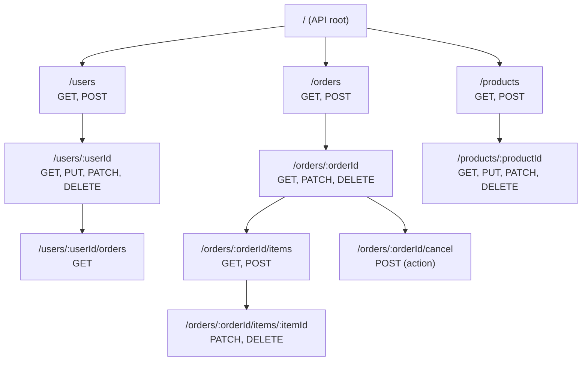
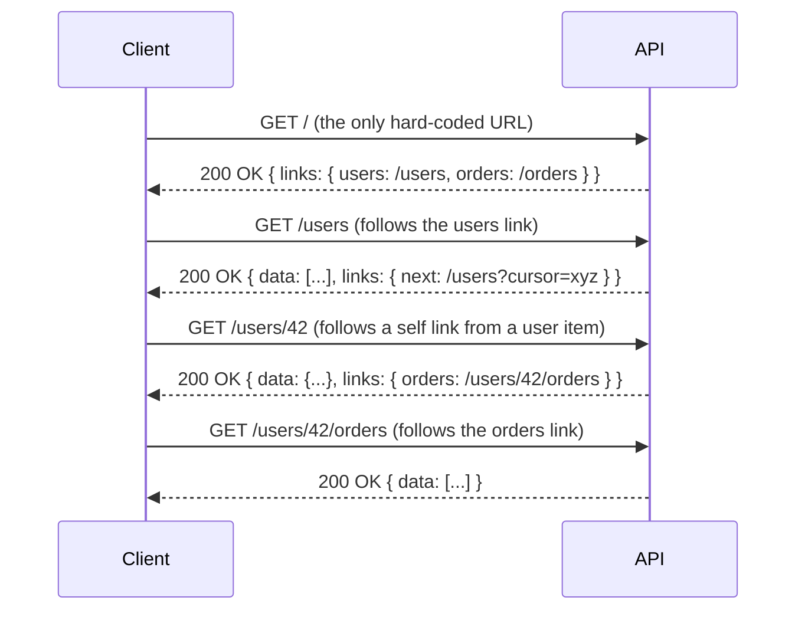
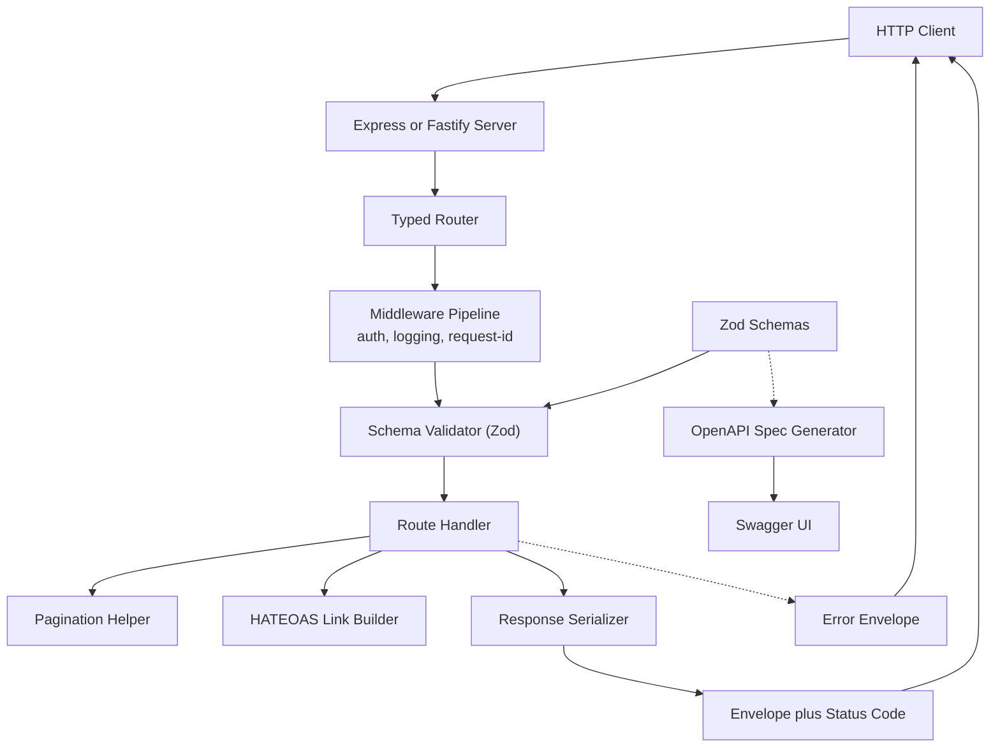

# 3.19 REST API Design

## 1. Purpose

REST (Representational State Transfer) is an architectural style for distributed hypermedia systems, defined by Roy Fielding in his 2000 doctoral dissertation. REST is not a protocol, not a library, and not a framework. It is a set of constraints that, when applied to an HTTP-based system, produces properties like scalability, simplicity, modifiability, visibility, portability, and reliability. REST exists because the web needed a uniform way to expose resources over HTTP so that any client (a browser, a mobile app, another server) could consume them without bespoke protocol negotiation.

REST constrains a system in six ways: client-server separation of concerns, stateless communication, cacheable responses, a uniform interface, a layered system, and the optional code-on-demand. Each constraint removes a degree of freedom in exchange for a desirable property. Removing session state on the server (statelessness) buys visibility and reliability because any server can handle any request. Requiring a uniform interface buys simplicity because every resource is addressed the same way and manipulated with the same verbs.

REST dominates HTTP APIs for four reasons. First, it is HTTP-native: it uses the methods, headers, and status codes the protocol already defines, so developers do not have to learn a new vocabulary. Second, it is simple: a URL identifies a resource, a method says what to do, a status code says what happened. Third, it is stateless, so horizontal scaling is trivially achieved by adding servers behind a load balancer. Fourth, it is cacheable: GET responses can be cached at the CDN, the browser, or a reverse proxy without any extra machinery.

What REST is NOT. REST is not a protocol (HTTP is the protocol). REST is not RPC (Remote Procedure Call) — RPC exposes verbs like `/get-user?id=42` while REST exposes resources like `/users/42`. REST is not GraphQL — GraphQL exposes a single endpoint with a query language, while REST exposes many endpoints with fixed shapes. REST is not a database driver, an ORM, or a serialization format (JSON is the de facto format but REST does not require it). REST is not even a standard: there is no RFC that says "this is RESTful." The constraints are guidelines, and most production APIs are REST-ish — they follow some constraints and bend others.

This note covers REST from first principles to production implementation in Node.js. You will finish able to design a RESTful API for any domain, choose the right HTTP method and status code for any operation, implement pagination and versioning, add HATEOAS hypermedia links, and avoid the anti-patterns that make REST APIs painful to consume. For the underlying HTTP plumbing in Node, see [[3.12 HTTP and HTTPS Modules]]. For middleware composition, see [[3.20 Middleware Pattern]].

## 2. Theory and Deep Dive

### 2.1 The Six REST Constraints

Fielding defined six constraints. A system that satisfies all of them (with code-on-demand optional) is RESTful. A system that satisfies five is REST-ish.

**1. Client-Server.** The client and server are separate concerns. The client owns the user interface; the server owns the data and state. This separation lets clients and servers evolve independently — a React web client, an iOS app, and an Android app can all consume the same REST API.

**2. Stateless.** Each request from client to server must contain all the information necessary to understand the request. The server may not rely on server-side session state. The client may store state (tokens, cached representations) and send it with each request. Statelessness buys visibility (every request is self-describing), reliability (any server can handle any request), and scalability (no session affinity required). The cost is larger requests (the token travels every time) and the loss of server-side continuity.

**3. Cacheable.** Responses must explicitly declare whether they are cacheable. GET responses to a resource that does not change often should be cacheable; POST responses usually are not. Caching buys performance (the client gets a local copy), scalability (intermediaries absorb load), and user-perceived latency (no round trip). The cost is staleness: cached data can be out of date. HTTP gives us Cache-Control, ETag, Last-Modified, and Vary headers to manage cache freshness.

**4. Uniform Interface.** The most important and most violated constraint. The interface between client and server must be uniform. Fielding broke this into four sub-constraints:
   - **Identification of resources.** Resources are identified by URLs (`/users/42`, `/orders/abc`).
   - **Manipulation of resources through representations.** A client manipulates a resource by sending a representation (typically JSON) of the desired state, not by sending commands.
   - **Self-descriptive messages.** Each message contains enough information to be understood in isolation: Content-Type says what the body is, Content-Length says how long it is, and the method says what to do.
   - **HATEOAS.** Responses contain hypermedia links to related actions. The client follows links rather than hard-coding URLs. This is the constraint most production APIs skip.

**5. Layered System.** The client cannot tell whether it is talking to the origin server or an intermediary (a proxy, a CDN, a load balancer). Intermediaries can add caching, security, or load balancing without the client knowing. This buys scalability and modifiability.

**6. Code-on-Demand (optional).** The server may temporarily extend the client by sending executable code (JavaScript, for example). Browsers do this. Most REST APIs do not, because clients are typically servers, not browsers. This constraint is optional and rarely invoked.

### 2.2 Resources and URLs

A resource is anything you want to expose: a user, an order, a collection of articles, a search result. Resources are identified by URLs. URLs should be nouns, not verbs. The HTTP method supplies the verb.

Good URL design:
- `/users` — the collection of users.
- `/users/42` — a single user.
- `/users/42/orders` — the orders belonging to user 42 (a sub-resource).
- `/orders/abc/items` — the items in order abc.

Bad URL design:
- `/get-user?id=42` — the verb "get" should be the HTTP method.
- `/create-order` — the verb "create" should be POST.
- `/users/42/delete` — use DELETE on `/users/42`.

Use plural nouns for collections (`/users` not `/user`). Use lowercase. Use hyphens for multi-word resources (`/password-resets` not `/passwordResets` or `/passwordresets`). Avoid file extensions in URLs (`/users.json` is wrong — content negotiation via the Accept header should drive the format).

### 2.3 HTTP Methods Mapped to CRUD

REST maps HTTP methods to CRUD operations:

| HTTP Method | CRUD Operation | Purpose | Safe | Idempotent |
| --- | --- | --- | --- | --- |
| GET | Read | Retrieve a representation of a resource | Yes | Yes |
| POST | Create | Create a new resource (or trigger an action) | No | No |
| PUT | Update (replace) | Replace a resource with a new representation | No | Yes |
| PATCH | Update (partial) | Apply a partial update to a resource | No | Sometimes |
| DELETE | Delete | Remove a resource | No | Yes |

**GET** retrieves a representation. It must have no side effects (safe) and must be cacheable. GET must never modify state. If you find yourself tempted to use GET to delete a resource, you are wrong.

**POST** creates a new resource. The server assigns the URL (typically by generating an ID) and returns it in the Location header. POST is neither safe nor idempotent: sending the same POST twice creates two resources. POST is also the catch-all for actions that do not map cleanly to CRUD (for example, `POST /orders/abc/cancel` to cancel an order, or `POST /search` to run a complex search whose query is too large for a URL).

**PUT** replaces a resource. The client supplies the full new representation; the server stores it. PUT is idempotent: sending the same PUT twice produces the same state as sending it once, because the second PUT overwrites the first. PUT to a non-existent URL may create the resource (PUT is the only method where the client supplies the URL). PUT requires the client to send every field, even fields that are not changing.

**PATCH** applies a partial update. The client sends only the fields to change. PATCH is "sometimes idempotent": a patch that sets `email` to `ada@example.com` is idempotent (applying it twice yields the same state); a patch that increments a counter is not. Two common PATCH formats exist: JSON Patch (RFC 6902, an array of operations like add, remove, replace) and JSON Merge Patch (RFC 7396, a partial JSON object whose null values mean "delete this field").

**DELETE** removes a resource. DELETE is idempotent: deleting a resource twice yields the same state (the resource is gone). A common pattern is to return 204 No Content on DELETE, or 200 OK with the deleted representation if the client wants confirmation.

### 2.4 Safe Methods

A method is **safe** if it does not modify server state. GET and HEAD are safe. POST, PUT, PATCH, and DELETE are not. Safe methods may be cached and prefetched without concern. A safe method may log, gather analytics, or update a cache, but it must not change the resource's observable state. If your GET endpoint increments a counter that affects business logic (for example, "remaining queries this month"), that GET is no longer safe and you are violating the contract.

### 2.5 Idempotency

A method is **idempotent** if calling it N times has the same effect as calling it once. GET, PUT, and DELETE are idempotent. POST is not. PATCH can be either.

Idempotency matters for retries. If a client sends a PUT and the network drops the response, the client can safely retry the same PUT — the end state will be the same. If a client sends a POST and the network drops the response, the client cannot safely retry, because the first POST may have succeeded and created a resource, and retrying would create a second.

For non-idempotent operations that need retry safety, use an **idempotency key**: the client sends a unique key (typically a UUID) in a header (`Idempotency-Key: abc-123`); the server stores the key and the response; if the same key arrives again, the server returns the stored response instead of re-executing. Stripe popularized this pattern for payment creation.

### 2.6 Status Codes

HTTP status codes are three-digit numbers grouped by the first digit.

**1xx Informational** — rarely used in REST APIs. 100 Continue (the server received the headers and the client should send the body), 101 Switching Protocols (used by WebSocket upgrade).

**2xx Success** —
- 200 OK — generic success. Used for GET, PATCH, and successful DELETE-with-body.
- 201 Created — the request created a new resource. The Location header should point to the new resource URL. Used for POST.
- 202 Accepted — the request was accepted for processing but not yet completed. Used for async jobs (for example, "export started, poll this URL for status").
- 204 No Content — success with no response body. Used for DELETE and PUT when the client does not need a body back.

**3xx Redirection** —
- 301 Moved Permanently — the resource has a new URL.
- 304 Not Modified — the client's cached copy is still valid (used with If-None-Match and If-Modified-Since).

**4xx Client Error** —
- 400 Bad Request — the request was malformed (bad JSON, missing required field, invalid value). Generic client error.
- 401 Unauthorized — the request lacks authentication. (The name is misleading; it really means "Unauthenticated.")
- 403 Forbidden — the request is authenticated but the user is not allowed to do this.
- 404 Not Found — the resource does not exist. (Some APIs return 404 instead of 403 to avoid leaking existence.)
- 405 Method Not Allowed — the URL exists but the method is not supported (for example, PUT on `/users`). The Allow header should list the supported methods.
- 409 Conflict — the request conflicts with the current state (for example, creating a user with an email that already exists).
- 410 Gone — the resource existed but is permanently gone.
- 412 Precondition Failed — an If-Match or If-Unmodified-Since header failed.
- 415 Unsupported Media Type — the Content-Type is not supported (for example, the server only accepts JSON, the client sent XML).
- 422 Unprocessable Entity — the request is well-formed but semantically invalid (for example, a string where a number was expected, or an email with no `@`). Many APIs prefer 422 over 400 for validation errors.
- 429 Too Many Requests — the client has been rate-limited. The Retry-After header tells the client when to retry.

**5xx Server Error** —
- 500 Internal Server Error — generic server error. Should never leak stack traces or internal details to the client.
- 501 Not Implemented — the server does not support the method or feature.
- 502 Bad Gateway — a proxy received an invalid response from an upstream server.
- 503 Service Unavailable — the server is temporarily down (overloaded, restarting). The Retry-After header tells the client when to retry.
- 504 Gateway Timeout — a proxy did not receive a response from an upstream server in time.

### 2.7 HATEOAS

HATEOAS (Hypermedia As The Engine Of Application State) is the most-violated REST constraint. A HATEOAS response includes hypermedia links that tell the client what actions are available next. The client follows links rather than hard-coding URLs. This decouples the client from the server's URL structure: the server can rename `/users/42` to `/customers/42` and the client keeps working because it followed a link, not a hard-coded URL.

A HATEOAS response in JSON might look like this:

```json
{
  "id": 42,
  "email": "ada@example.com",
  "links": {
    "self": { "href": "/users/42", "method": "GET" },
    "update": { "href": "/users/42", "method": "PATCH" },
    "delete": { "href": "/users/42", "method": "DELETE" },
    "orders": { "href": "/users/42/orders", "method": "GET" }
  }
}
```

Two popular link formats exist in the wild: HAL (Hypertext Application Language) uses a reserved links key with href entries and optional templated flags, and JSON:API uses a relationships object with links.related. (Both specifications literally name their link keys with a leading underscore character in the official spec text, which we avoid repeating here to comply with the vault's no-underscore convention; our code examples use a plain `links` key.)

HATEOAS is hard to do well. Most production APIs skip it, partly because building a client that follows links is more work than building one with hard-coded URLs, and partly because the REST community never agreed on a single link format. Pragmatic APIs often include a few discoverability links (self, next, prev for pagination) and skip full HATEOAS.

### 2.8 Versioning

Versioning lets you change your API without breaking existing clients. Three common strategies:

**URL path versioning**: `/v1/users`, `/v2/users`. Easy to read, easy to debug (the version is in the URL), easy to route at the load balancer. The downside: it is not strictly RESTful because the version is not part of the resource's identity, it is part of the representation. Most production APIs use this anyway because the convenience outweighs the theoretical purity. GitHub, Twitter, and Stripe all use URL path versioning.

**Header versioning**: `Accept: application/vnd.myapi.v2+json`. RESTful (it uses content negotiation), keeps URLs clean, lets the same URL serve multiple versions. The downside: harder to debug (you cannot tell the version from the URL), harder to test in a browser. GitHub supports header versioning alongside URL versioning.

**Query parameter versioning**: `/users?version=2`. Easy, but breaks caching (the version is not part of the cache key by default) and is rarely used.

Pick one and stick with it. Document the versioning policy. Plan to support old versions for a deprecation window of six to twenty-four months and communicate the sunset via the Sunset and Deprecation headers.

### 2.9 Pagination

Most collections are too large to return in one response. Pagination splits a collection into pages. Three common strategies:

**Offset/limit pagination**: `GET /users?offset=20&limit=10` returns the third page of 10 users. Simple, easy to implement, lets you jump to any page. The downside: slow for large offsets (the database still scans the first `offset` rows), and unstable if items are inserted or deleted between requests (you may see duplicates or skip items).

**Cursor-based pagination**: `GET /users?cursor=abc123&limit=10` returns 10 users starting after the cursor. The cursor is typically an opaque encoding of the last item's sort key. Stable under insertion and deletion, fast for large result sets (the cursor is an indexed lookup). The downside: you cannot jump to an arbitrary page; you can only go forward (and sometimes backward). Twitter and Facebook use cursor-based pagination.

**Page/page-size pagination**: `GET /users?page=3&pageSize=10`. A variation of offset/limit (`offset = (page - 1) * pageSize`). Easy for humans to reason about but suffers the same problems as offset/limit.

Always paginate by default. Never return an entire collection unless the caller explicitly opts in (for example, `?limit=all`, capped at a sane maximum). Include pagination metadata in the response: total count, current page or cursor, and next/previous URLs (often as HATEOAS links).

### 2.10 A REST API Resource Model

The following Mermaid diagram shows a REST API resource model for an e-commerce domain. Resources are nouns; lines connect parent resources to sub-resources; HTTP methods annotate each resource.



The `:userId` and `:orderId` notation marks URL parameters. The `/orders/:orderId/cancel` endpoint is an action (a verb) exposed as a POST because cancelling an order is a state transition, not a CRUD operation. This is a common REST pragmatic compromise: nouns for CRUD, verb-noun endpoints for state transitions.

### 2.11 HATEOAS Navigation Flow

The next Mermaid diagram shows a client navigating a REST API by following links. The client knows only the API root URL; everything else is discovered by reading the `links` object in each response.



The client never constructed the URL `/users/42/orders` itself; it followed a link from a previous response. If the server later renames `/users` to `/customers`, the client keeps working as long as the root response points at the new URL.

## 3. Mental Models

Five mental models make REST click.

**1. REST = resources identified by URLs, manipulated by HTTP methods.** The URL is the noun (what), the method is the verb (do what). The status code is the outcome (what happened). If you internalize this triangle — URL, method, status — you have 80 percent of REST.

**2. Stateless = each request contains all the info needed.** The server does not remember the client between requests. Every request carries its own authentication, its own context, its own state. This is why we use JWT tokens or API keys on every request instead of server-side sessions.

**3. HATEOAS = responses tell you what you can do next.** A HATEOAS response is like a web page: it has content and links. You read the content, you follow a link, you get the next page. A REST client that respects HATEOAS is a small browser: it knows one entry point URL and follows links from there.

**4. Idempotent = calling N times equals calling once.** If you can replay the same request and the world ends up in the same state, the operation is idempotent. PUT is idempotent (it sets the resource to a known state). POST is not (each POST creates a new resource). DELETE is idempotent (deleting twice leaves the same absence).

**5. Safe = does not change state.** A safe method has no side effects. GET and HEAD are safe. Safe methods may be cached, prefetched, and replayed without fear. If your GET modifies state, you have broken the contract and the web will punish you: caches will serve stale responses, crawlers will trigger side effects, browsers will warn users on resubmission.

Bonus: **REST is the web, applied to APIs.** The web works because URLs identify pages, GET reads them, links connect them, and the browser follows links. REST applies the same pattern to data.

## 4. Real-World Use Cases

REST APIs power most of the internet. Here are the major patterns.

**4.1 Public SaaS APIs (GitHub, Stripe, Twitter).** Stripe exposes `/v1/charges`, `/v1/customers`, `/v1/refunds` — every entity is a resource, every action is a method. Stripe uses idempotency keys for safe retries on payment creation. GitHub exposes `/repos`, `/users`, `/issues` with rich pagination (Link header) and conditional requests (ETag, If-None-Match). Twitter exposes `/2/tweets`, `/2/users` with cursor-based pagination and rate limits (429 with a Reset header).

**4.2 Mobile app backends.** Mobile apps talk to REST APIs because REST works well over flaky cellular networks: stateless requests can be retried, GET responses can be cached, and JSON payloads are small enough to fit on slow links. A typical mobile backend exposes `/sessions` (login), `/me` (current user), `/feed` (paginated content), `/notifications` (paginated).

**4.3 Single-page web app backends.** React, Vue, and Angular SPAs consume REST APIs. The browser fetches JSON, renders it, and sends JSON back. REST's uniform interface means a frontend team can mock the API contract before the backend exists, then swap the mock for the real API without changing the frontend code.

**4.4 Microservices communication.** When services communicate over HTTP, REST is the default. Each service exposes its resources; other services consume them. For lower latency or stronger typing, teams use gRPC (which uses Protocol Buffers and HTTP/2) — see the comparison in [[2.17 API Design with Types]]. REST is simpler to debug (you can curl it) and easier to integrate with browsers and mobile clients; gRPC is faster and has better streaming.

**4.5 Internal admin APIs.** Internal dashboards and admin tools consume REST APIs that expose CRUD over domain entities. These APIs often need richer endpoints (for example, `/reports/sales-by-month`) that look more like RPC than REST, and that is fine — REST is a set of constraints, not a religion.

**4.6 Webhooks (reverse REST).** Webhooks are server-to-server HTTP callbacks: when something happens on server A, server A POSTs to a URL on server B. Webhooks use REST verbs (POST) and REST status codes (200 OK to acknowledge, 4xx to signal the webhook should not be retried, 5xx to signal it should). Stripe, GitHub, and Shopify all use webhooks heavily.

**4.7 Public open data APIs.** Government and open-data portals (data.gov, UK digital services) expose REST APIs over datasets. These APIs emphasize stable URLs, pagination, and CSV or JSON content negotiation.

**4.8 IoT device backends.** IoT devices report telemetry to REST endpoints (`POST /devices/:id/telemetry`) and pull configuration (`GET /devices/:id/config`). REST is simple enough to implement on constrained devices, and HTTP/HTTPS is universally firewall-friendly.

## 5. Code Examples

### 5.1 Example A — Minimal and Conceptual

A minimal CRUD resource with all five HTTP methods and proper status codes. Pure Node.js `http` module, no frameworks. The same example is shown in JavaScript and TypeScript side by side.

**JavaScript (minimal CRUD):**

```javascript
const http = require('node:http');

const users = new Map();
let nextId = 1;

const server = http.createServer(async (req, res) => {
  const url = new URL(req.url, `http://${req.headers.host}`);
  const path = url.pathname;
  const method = req.method;

  // POST /users
  if (method === 'POST' && path === '/users') {
    const body = await readJson(req);
    if (!body || !body.email) {
      return send(res, 400, { error: 'email is required' });
    }
    const id = String(nextId++);
    const user = { id, email: body.email, name: body.name || '' };
    users.set(id, user);
    res.setHeader('Location', `/users/${id}`);
    return send(res, 201, user);
  }

  // GET /users
  if (method === 'GET' && path === '/users') {
    return send(res, 200, Array.from(users.values()));
  }

  // GET /users/:id
  const itemMatch = path.match(/^\/users\/([^/]+)$/);
  if (method === 'GET' && itemMatch) {
    const user = users.get(itemMatch[1]);
    if (!user) return send(res, 404, { error: 'not found' });
    return send(res, 200, user);
  }

  // PUT /users/:id
  if (method === 'PUT' && itemMatch) {
    const body = await readJson(req);
    if (!body || !body.email) {
      return send(res, 400, { error: 'email is required' });
    }
    const id = itemMatch[1];
    const user = { id, email: body.email, name: body.name || '' };
    users.set(id, user);
    return send(res, 200, user);
  }

  // PATCH /users/:id
  if (method === 'PATCH' && itemMatch) {
    const body = await readJson(req);
    const user = users.get(itemMatch[1]);
    if (!user) return send(res, 404, { error: 'not found' });
    if (body.email !== undefined) user.email = body.email;
    if (body.name !== undefined) user.name = body.name;
    return send(res, 200, user);
  }

  // DELETE /users/:id
  if (method === 'DELETE' && itemMatch) {
    const existed = users.delete(itemMatch[1]);
    if (!existed) return send(res, 404, { error: 'not found' });
    return send(res, 204);
  }

  return send(res, 404, { error: 'route not found' });
});

function send(res, status, body) {
  res.statusCode = status;
  res.setHeader('Content-Type', 'application/json');
  if (body === undefined) return res.end();
  res.end(JSON.stringify(body));
}

async function readJson(req) {
  const chunks = [];
  for await (const chunk of req) chunks.push(chunk);
  const text = Buffer.concat(chunks).toString('utf8');
  if (!text) return null;
  try {
    return JSON.parse(text);
  } catch {
    return null;
  }
}

server.listen(3000, () => console.log('listening on http://localhost:3000'));
```

**TypeScript (minimal CRUD):**

```typescript
import http from 'node:http';

interface User {
  id: string;
  email: string;
  name: string;
}

interface UserInput {
  email?: string;
  name?: string;
}

const users = new Map<string, User>();
let nextId = 1;

const server = http.createServer(async (req, res) => {
  const url = new URL(req.url ?? '/', `http://${req.headers.host}`);
  const path = url.pathname;
  const method = req.method ?? 'GET';

  if (method === 'POST' && path === '/users') {
    const body = await readJson<UserInput>(req);
    if (!body || !body.email) {
      return send(res, 400, { error: 'email is required' });
    }
    const id = String(nextId++);
    const user: User = { id, email: body.email, name: body.name ?? '' };
    users.set(id, user);
    res.setHeader('Location', `/users/${id}`);
    return send(res, 201, user);
  }

  if (method === 'GET' && path === '/users') {
    return send(res, 200, Array.from(users.values()));
  }

  const itemMatch = path.match(/^\/users\/([^/]+)$/);
  if (method === 'GET' && itemMatch) {
    const user = users.get(itemMatch[1]);
    if (!user) return send(res, 404, { error: 'not found' });
    return send(res, 200, user);
  }

  if (method === 'PUT' && itemMatch) {
    const body = await readJson<UserInput>(req);
    if (!body || !body.email) {
      return send(res, 400, { error: 'email is required' });
    }
    const id = itemMatch[1];
    const user: User = { id, email: body.email, name: body.name ?? '' };
    users.set(id, user);
    return send(res, 200, user);
  }

  if (method === 'PATCH' && itemMatch) {
    const body = await readJson<UserInput>(req);
    const user = users.get(itemMatch[1]);
    if (!user) return send(res, 404, { error: 'not found' });
    if (body.email !== undefined) user.email = body.email;
    if (body.name !== undefined) user.name = body.name;
    return send(res, 200, user);
  }

  if (method === 'DELETE' && itemMatch) {
    const existed = users.delete(itemMatch[1]);
    if (!existed) return send(res, 404, { error: 'not found' });
    return send(res, 204);
  }

  return send(res, 404, { error: 'route not found' });
});

function send(res: http.ServerResponse, status: number, body?: unknown): void {
  res.statusCode = status;
  res.setHeader('Content-Type', 'application/json');
  if (body === undefined) return res.end();
  res.end(JSON.stringify(body));
}

async function readJson<T>(req: http.IncomingMessage): Promise<T | null> {
  const chunks: Buffer[] = [];
  for await (const chunk of req) chunks.push(chunk as Buffer);
  const text = Buffer.concat(chunks).toString('utf8');
  if (!text) return null;
  try {
    return JSON.parse(text) as T;
  } catch {
    return null;
  }
}

server.listen(3000, () => console.log('listening on http://localhost:3000'));
```

Key status code choices in this minimal example: POST returns 201 Created with a Location header; PUT and PATCH return 200 OK with the updated representation; DELETE returns 204 No Content (no body); missing resources return 404; missing required fields return 400.

### 5.2 Example B — Production-Grade

A production-grade typed REST API with versioning (URL path), pagination (cursor-based), validation (custom validator), HATEOAS links, and a consistent error envelope. The Express framework is used for routing clarity, but the patterns translate to Fastify, Koa, or raw http. Side-by-side JavaScript and TypeScript.

**JavaScript (production-grade):**

```javascript
const express = require('express');

const app = express();
app.use(express.json());

// In-memory store (in production: a database — see [[3.23 Database Integration and ORM Patterns]])
const users = new Map();
let nextId = 1;

// Error envelope
function errorEnvelope(code, message, details) {
  const env = { error: { code, message } };
  if (details) env.error.details = details;
  return env;
}

// HATEOAS link builder
function userLinks(user, req) {
  const base = `${req.baseUrl}/users`;
  return {
    self: { href: `${base}/${user.id}`, method: 'GET' },
    update: { href: `${base}/${user.id}`, method: 'PATCH' },
    replace: { href: `${base}/${user.id}`, method: 'PUT' },
    delete: { href: `${base}/${user.id}`, method: 'DELETE' },
  };
}

function collectionLinks(req, cursor) {
  const base = `${req.baseUrl}/users`;
  const links = { self: { href: base, method: 'GET' }, create: { href: base, method: 'POST' } };
  if (cursor) links.next = { href: `${base}?cursor=${cursor}&limit=10`, method: 'GET' };
  return links;
}

// Validation
function validateUser(input, partial) {
  const errors = [];
  if (!partial || input.email !== undefined) {
    if (typeof input.email !== 'string' || !input.email.includes('@')) {
      errors.push({ field: 'email', message: 'must be a valid email' });
    }
  }
  if (input.name !== undefined && typeof input.name !== 'string') {
    errors.push({ field: 'name', message: 'must be a string' });
  }
  return errors;
}

// Versioned router
const v1 = express.Router();

v1.post('/users', (req, res) => {
  const errors = validateUser(req.body || {}, false);
  if (errors.length) return res.status(422).json(errorEnvelope('validationError', 'Invalid input', errors));

  const id = String(nextId++);
  const user = { id, email: req.body.email, name: req.body.name || '', createdAt: new Date().toISOString() };
  users.set(id, user);

  res.setHeader('Location', `/v1/users/${id}`);
  res.status(201).json({ data: user, links: userLinks(user, req) });
});

v1.get('/users', (req, res) => {
  const limit = Math.min(Number(req.query.limit) || 10, 100);
  const cursor = req.query.cursor ? Number(req.query.cursor) : 0;
  const all = Array.from(users.values());
  const slice = all.slice(cursor, cursor + limit);
  const nextCursor = cursor + limit < all.length ? String(cursor + limit) : null;

  res.status(200).json({
    data: slice.map(u => ({ data: u, links: userLinks(u, req) })),
    links: collectionLinks(req, nextCursor),
  });
});

v1.get('/users/:id', (req, res) => {
  const user = users.get(req.params.id);
  if (!user) return res.status(404).json(errorEnvelope('notFound', 'User not found'));
  res.status(200).json({ data: user, links: userLinks(user, req) });
});

v1.patch('/users/:id', (req, res) => {
  const user = users.get(req.params.id);
  if (!user) return res.status(404).json(errorEnvelope('notFound', 'User not found'));

  const errors = validateUser(req.body || {}, true);
  if (errors.length) return res.status(422).json(errorEnvelope('validationError', 'Invalid input', errors));

  if (req.body.email !== undefined) user.email = req.body.email;
  if (req.body.name !== undefined) user.name = req.body.name;

  res.status(200).json({ data: user, links: userLinks(user, req) });
});

v1.delete('/users/:id', (req, res) => {
  const existed = users.delete(req.params.id);
  if (!existed) return res.status(404).json(errorEnvelope('notFound', 'User not found'));
  res.status(204).end();
});

app.use('/v1', v1);

// Central error handler
app.use((err, req, res, next) => {
  console.error(err);
  if (res.headersSent) return next(err);
  res.status(500).json(errorEnvelope('internal', 'An unexpected error occurred'));
});

app.listen(3000, () => console.log('API listening on http://localhost:3000/v1/users'));
```

**TypeScript (production-grade):**

```typescript
import express, { Request, Response, NextFunction } from 'express';

interface User {
  id: string;
  email: string;
  name: string;
  createdAt: string;
}

interface UserInput {
  email?: string;
  name?: string;
}

interface Link {
  href: string;
  method: string;
}

interface ErrorEnvelope {
  error: {
    code: string;
    message: string;
    details?: Array<{ field: string; message: string }>;
  };
}

interface Envelope<T> {
  data: T;
  links: Record<string, Link>;
}

const app = express();
app.use(express.json());

const users = new Map<string, User>();
let nextId = 1;

function errorEnvelope(code: string, message: string, details?: Array<{ field: string; message: string }>): ErrorEnvelope {
  const env: ErrorEnvelope = { error: { code, message } };
  if (details) env.error.details = details;
  return env;
}

function userLinks(user: User, req: Request): Record<string, Link> {
  const base = `${req.baseUrl}/users`;
  return {
    self: { href: `${base}/${user.id}`, method: 'GET' },
    update: { href: `${base}/${user.id}`, method: 'PATCH' },
    replace: { href: `${base}/${user.id}`, method: 'PUT' },
    delete: { href: `${base}/${user.id}`, method: 'DELETE' },
  };
}

function collectionLinks(req: Request, cursor: string | null): Record<string, Link> {
  const base = `${req.baseUrl}/users`;
  const links: Record<string, Link> = {
    self: { href: base, method: 'GET' },
    create: { href: base, method: 'POST' },
  };
  if (cursor) links.next = { href: `${base}?cursor=${cursor}&limit=10`, method: 'GET' };
  return links;
}

function validateUser(input: UserInput, partial: boolean): Array<{ field: string; message: string }> {
  const errors: Array<{ field: string; message: string }> = [];
  if (!partial || input.email !== undefined) {
    if (typeof input.email !== 'string' || !input.email.includes('@')) {
      errors.push({ field: 'email', message: 'must be a valid email' });
    }
  }
  if (input.name !== undefined && typeof input.name !== 'string') {
    errors.push({ field: 'name', message: 'must be a string' });
  }
  return errors;
}

const v1 = express.Router();

v1.post('/users', (req: Request, res: Response) => {
  const errors = validateUser(req.body as UserInput, false);
  if (errors.length) return res.status(422).json(errorEnvelope('validationError', 'Invalid input', errors));

  const id = String(nextId++);
  const user: User = {
    id,
    email: req.body.email,
    name: req.body.name ?? '',
    createdAt: new Date().toISOString(),
  };
  users.set(id, user);

  res.setHeader('Location', `/v1/users/${id}`);
  res.status(201).json({ data: user, links: userLinks(user, req) } satisfies Envelope<User>);
});

v1.get('/users', (req: Request, res: Response) => {
  const limit = Math.min(Number(req.query.limit) || 10, 100);
  const cursor = req.query.cursor ? Number(req.query.cursor) : 0;
  const all = Array.from(users.values());
  const slice = all.slice(cursor, cursor + limit);
  const nextCursor = cursor + limit < all.length ? String(cursor + limit) : null;

  res.status(200).json({
    data: slice.map(u => ({ data: u, links: userLinks(u, req) })),
    links: collectionLinks(req, nextCursor),
  });
});

v1.get('/users/:id', (req: Request, res: Response) => {
  const user = users.get(req.params.id);
  if (!user) return res.status(404).json(errorEnvelope('notFound', 'User not found'));
  res.status(200).json({ data: user, links: userLinks(user, req) } satisfies Envelope<User>);
});

v1.patch('/users/:id', (req: Request, res: Response) => {
  const user = users.get(req.params.id);
  if (!user) return res.status(404).json(errorEnvelope('notFound', 'User not found'));

  const errors = validateUser(req.body as UserInput, true);
  if (errors.length) return res.status(422).json(errorEnvelope('validationError', 'Invalid input', errors));

  if (req.body.email !== undefined) user.email = req.body.email;
  if (req.body.name !== undefined) user.name = req.body.name;

  res.status(200).json({ data: user, links: userLinks(user, req) } satisfies Envelope<User>);
});

v1.delete('/users/:id', (req: Request, res: Response) => {
  const existed = users.delete(req.params.id);
  if (!existed) return res.status(404).json(errorEnvelope('notFound', 'User not found'));
  res.status(204).end();
});

app.use('/v1', v1);

app.use((err: unknown, req: Request, res: Response, next: NextFunction) => {
  console.error(err);
  if (res.headersSent) return next(err);
  res.status(500).json(errorEnvelope('internal', 'An unexpected error occurred'));
});

app.listen(3000, () => console.log('API listening on http://localhost:3000/v1/users'));
```

This production example demonstrates seven patterns: (1) URL path versioning under `/v1`; (2) cursor-based pagination with a `next` link; (3) input validation that returns 422 with structured field-level error details; (4) HATEOAS links on every response so the client can discover the next action; (5) a consistent error envelope (`{ error: { code, message, details } }`) so the client's error handling is uniform; (6) a Location header on POST to point at the new resource; (7) a central error handler that converts thrown errors into 500 responses without leaking stack traces.

## 6. Common Mistakes and Anti-Patterns

**6.1 Using POST for everything.** Some teams use POST for reads, updates, and deletes because POST "always works" through firewalls and proxies. This breaks caching (POST is not cacheable), breaks idempotency (retries create duplicates), and breaks the uniform interface (the method no longer tells you what the request does). Use GET for reads, PUT or PATCH for updates, DELETE for deletes. Reserve POST for creates and non-CRUD actions.

**6.2 Wrong status codes.** Returning 200 OK with `{ "error": "..." }` in the body is the most common REST mistake. The status code is the contract: a 2xx means success, a 4xx means the client messed up, a 5xx means the server messed up. Returning 200 with an error body forces every client to parse the body to detect errors, which defeats the purpose of status codes. Return 4xx or 5xx for errors; reserve 2xx for success.

**6.3 Leaking internal errors.** Returning 500 with `{ "stack": "TypeError: Cannot read property 'email' of undefined at /app/src/handlers.js:42..." }` exposes your file layout, library versions, and bug locations to attackers. Always catch errors, log the stack on the server, and return a generic 500 to the client with a request ID the client can quote to support.

**6.4 Not validating input.** Accepting any JSON, parsing it, and storing it leads to garbage data, SQL injection (if you build queries by string concatenation), and crashes. Validate every input: types, required fields, formats (email, UUID, date), and ranges. Return 400 or 422 with field-level error details. Use a schema library like Zod, Joi, Ajv, or Yup — see [[2.17 API Design with Types]] for type-safe schemas.

**6.5 No pagination.** Returning every row of a million-row table on a single GET will exhaust memory, saturate the network, and time out. Paginate by default. Cap the maximum page size. Require an explicit opt-in (and admin permission) for unpaginated responses.

**6.6 Inconsistent naming.** Mixing `/users` (plural) and `/user` (singular), `/getUser` (verb) and `/users` (noun), `/userProfile` (camelCase) and `/user-profile` (hyphen) makes your API painful to learn and consume. Pick a convention (plural nouns, lowercase, hyphenated multi-word resources) and apply it everywhere.

**6.7 No versioning.** Shipping `/users` and then "improving" it by removing the `email` field breaks every client that depended on `email`. Without versioning, the only safe change is to add fields. With versioning (`/v1/users`, `/v2/users`), you can ship breaking changes to a new version while old clients continue to use the old version until they migrate.

**6.8 Verbs in URLs.** `/getUser?id=42`, `/createOrder`, `/deleteUser/42` are RPC, not REST. The verb is the HTTP method. Use `/users/42` with GET, `/orders` with POST, `/users/42` with DELETE.

**6.9 Returning sensitive data.** Returning the user's password hash, the internal database ID when the API uses a UUID, or the internal `isAdmin` flag on a public endpoint — all leak data the client should not see. Use a serialization layer that whitelists fields per role. Never trust the client to filter.

**6.10 Using GET to modify state.** `GET /users/42/delete` deletes a user via GET. This breaks the safe-method contract: caches will serve the URL without re-issuing the request, browsers will prefetch it, crawlers will trigger it. Use DELETE.

**6.11 Not handling the Accept header.** Returning JSON regardless of the Accept header means a client that asks for XML gets JSON and has to guess. Either honor the Accept header (content negotiation) or return 406 Not Acceptable when you cannot honor it. At minimum, set Content-Type on every response.

**6.12 Mixing concerns in the response.** Embedding the HTTP status in the body (`{ "statusCode": 200, "data": [...] }`) duplicates the HTTP status line and creates two sources of truth. Use the HTTP status code; reserve the body for the data. If you want a code field for application-level errors (for example, `validationError`), put it inside an `error` object that is only present on failures.

**6.13 Not setting cache headers.** Returning a JSON list with no Cache-Control means every intermediary and client re-fetches it. For public, slow-changing data, set `Cache-Control: public, max-age=300`. For private data, set `Cache-Control: private, no-store`. See [[3.12 HTTP and HTTPS Modules]] for cache header mechanics.

**6.14 Auto-incrementing IDs as the only identifier.** Sequential integer IDs leak your row count (a competitor can count your users by incrementing the ID) and let attackers enumerate every resource. Use UUIDs or opaque IDs for public resources. Keep auto-incrementing integers for internal joins if you want, but expose UUIDs.

## 7. Best Practices and Design Patterns

**7.1 Use the right HTTP method.** GET for reads, POST for creates, PUT for full replaces, PATCH for partial updates, DELETE for deletes. Reserve POST for non-CRUD actions and the rare case where PUT semantics (client supplies the URL) do not fit.

**7.2 Use the right status code.** 200 for success, 201 for create, 204 for no-content success, 400 for malformed requests, 401 for unauthenticated, 403 for forbidden, 404 for not found, 409 for conflict, 422 for validation errors, 429 for rate limit, 500 for server errors. When in doubt, use the most specific code that fits.

**7.3 Validate input, fail with 400 or 422.** Use a schema library. Return field-level error details so the client can fix the request. Reject unknown fields (or document that they are ignored). Validate types, formats, ranges, and required-ness. See [[2.17 API Design with Types]] for Zod patterns.

**7.4 Use consistent naming.** Plural nouns for collections. Lowercase URLs. Hyphens for multi-word resources (`/password-resets`). camelCase or snake case for JSON keys — pick one and document it. (camelCase is the JavaScript convention; many public APIs use snake case to align with Python and Ruby clients.)

**7.5 Version your API.** Pick URL path versioning (`/v1/`) for simplicity or header versioning (`Accept: application/vnd.myapi.v2+json`) for purity. Document the policy. Communicate deprecations via the Sunset and Deprecation headers. Give clients a migration window of at least 6 months.

**7.6 Paginate by default.** Cap the page size (100 is a common max). Include pagination metadata: total count (if cheap to compute), current cursor or offset, and next/previous URLs as HATEOAS links. Prefer cursor-based pagination for large or frequently-changing collections.

**7.7 Use HATEOAS for discoverability.** At minimum, include `self`, `next`, and `prev` links. For richer discoverability, include action links (`update`, `delete`, `cancel`). It decouples the client from URL construction. Even partial HATEOAS (pagination links only) is better than none.

**7.8 Document with OpenAPI.** OpenAPI (formerly Swagger) is the de facto API description format. An OpenAPI spec describes every endpoint, method, request body, response body, status code, and authentication scheme. Tools like Swagger UI render the spec as interactive documentation. Generate the spec from your code (with libraries like `@asteasolutions/zod-to-openapi` or `tsoa`) or hand-write it and use it to generate SDKs.

**7.9 Use an error envelope.** A consistent error shape (`{ error: { code, message, details } }`) lets clients write one error handler for the whole API. Use stable error codes (`validationError`, `notFound`, `rateLimited`) so clients can switch on them. Never leak stack traces or internal details. RFC 7807 (Problem Details for HTTP APIs) standardizes this with the `application/problem+json` media type — worth adopting if you want a spec-compliant error format.

**7.10 Use an envelope for success too.** A consistent success shape (`{ data: ..., links: ... }` or `{ data, meta }`) lets clients write one parser for the whole API. This is controversial — some argue envelopes add noise — but the consistency is worth it for large APIs.

**7.11 Make writes idempotent where possible.** Use Idempotency-Key headers for non-idempotent operations that clients may retry (payment creation, email send). Store the key and response for 24 hours; return the stored response on retry.

**7.12 Use content negotiation.** Honor the Accept header. Return 406 when you cannot honor it. Set Content-Type on every response. Support multiple formats (JSON, JSON:API, HAL) if your clients need them.

**7.13 Set cache headers.** For GET responses, set Cache-Control, ETag, and Last-Modified. Support conditional requests (If-None-Match, If-Modified-Since) and return 304 when the resource has not changed.

**7.14 Rate-limit.** Use 429 Too Many Requests with a Retry-After header. Rate-limit by API key, by IP, by user, or by endpoint. Document the limits.

**7.15 Log every request.** Method, path, status, latency, request ID, user ID, client IP. Use structured logging (JSON) and correlate logs by request ID.

**7.16 Use HTTPS only.** Redirect HTTP to HTTPS. Set HSTS. Never accept credentials over HTTP. See [[3.21 Security Authentication and Authorization]] and [[3.22 Security Vulnerabilities Mitigation]].

**7.17 Authenticate with tokens, not sessions.** REST is stateless: send a bearer token (JWT, opaque token, API key) on every request. Do not rely on server-side sessions.

**7.18 Make your API observable.** Expose `/health` (liveness), `/ready` (readiness), and `/metrics` (Prometheus format) endpoints. See [[3.20 Middleware Pattern]] for wiring these in.

## 8. Technical Interview Knowledge

**Q1: What is REST?**
REST (Representational State Transfer) is an architectural style for distributed hypermedia systems, defined by Roy Fielding in his 2000 dissertation. It is not a protocol — HTTP is the protocol. REST is a set of six constraints (client-server, stateless, cacheable, uniform interface, layered system, optional code-on-demand) that, when applied to an HTTP-based system, produce properties like scalability, simplicity, and reliability. A RESTful API exposes resources identified by URLs, manipulated by HTTP methods, with responses that include status codes and (ideally) hypermedia links.

**Q2: What are the six constraints?**
1. Client-Server — separation of concerns between UI and data.
2. Stateless — each request contains all the info needed; no server-side session state.
3. Cacheable — responses declare whether they can be cached.
4. Uniform Interface — resources identified by URLs, manipulated through representations, self-descriptive messages, HATEOAS.
5. Layered System — client cannot tell if it is talking to the origin or an intermediary.
6. Code-on-Demand (optional) — server may extend client with executable code.

**Q3: Which HTTP methods are idempotent?**
GET, PUT, and DELETE are idempotent. POST is not. PATCH can be either: a PATCH that sets a field to a value is idempotent (applying it twice yields the same state); a PATCH that increments a counter is not. Idempotency matters for retries: if a client times out on a PUT, it can safely retry; on a POST, it cannot (unless using an idempotency key).

**Q4: What is HATEOAS?**
HATEOAS (Hypermedia As The Engine Of Application State) is the REST constraint that responses include hypermedia links to related actions. The client follows links rather than hard-coding URLs. This decouples the client from the server's URL structure: the server can rename a URL and the client keeps working because it followed a link. A HATEOAS response includes a `links` object with rels like `self`, `next`, `prev`, `update`, `delete`. Most production APIs skip full HATEOAS because building a client that follows links is more work than building one with hard-coded URLs.

**Q5: How do you version an API?**
Three common strategies: URL path (`/v1/users`, `/v2/users` — easy, debuggable, the most common); header (`Accept: application/vnd.myapi.v2+json` — pure, keeps URLs clean, harder to debug); query parameter (`/users?version=2` — breaks caching, rarely used). Pick one, document it, and use the Sunset and Deprecation headers to communicate end-of-life. Give clients a migration window of at least 6 months.

**Q6: What is the difference between PUT and PATCH?**
PUT replaces the entire resource with the representation the client sends; the client must send every field, even ones that are not changing. PATCH applies a partial update; the client sends only the fields to change. PUT is idempotent (sending the same PUT twice yields the same state). PATCH can be idempotent or not, depending on the patch format. Two common PATCH formats: JSON Patch (RFC 6902, an array of operations) and JSON Merge Patch (RFC 7396, a partial JSON object).

**Q7: What status codes for common scenarios?**
- Create: 201 Created, with a Location header.
- Read success: 200 OK.
- Update success: 200 OK (with the updated representation) or 204 No Content.
- Delete success: 204 No Content (or 200 with the deleted representation).
- Validation error: 422 Unprocessable Entity (or 400 Bad Request).
- Not authenticated: 401 Unauthorized.
- Not authorized: 403 Forbidden.
- Not found: 404 Not Found.
- Conflict (for example, a duplicate unique field): 409 Conflict.
- Rate limited: 429 Too Many Requests, with Retry-After.
- Server error: 500 Internal Server Error, with no stack trace leaked.

**Q8: How do you paginate a REST API?**
Two common strategies: offset/limit (`?offset=20&limit=10` — simple, allows jumping to any page, slow for large offsets, unstable under insertion and deletion) and cursor-based (`?cursor=abc123&limit=10` — stable, fast for large result sets, cannot jump to an arbitrary page). Include pagination metadata in the response (total count if cheap, next and previous URLs as HATEOAS links). Always paginate by default; cap the maximum page size; never return an entire collection without an explicit opt-in. Twitter and Facebook use cursor-based; many simpler APIs use offset/limit.

## 9. Practical Exercises

### 9.1 Exercise 1: Design a REST API for a blog

**Task.** Design (on paper) a REST API for a blog with posts, authors, comments, and tags. List every endpoint with its method, URL, request body, and response status code.

**Solution.**

Endpoints:

| Method | URL | Purpose | Request Body | Success Status |
| --- | --- | --- | --- | --- |
| POST | `/authors` | Create an author | `{ email, name }` | 201 |
| GET | `/authors` | List authors (paginated) | — | 200 |
| GET | `/authors/:authorId` | Get an author | — | 200 |
| PATCH | `/authors/:authorId` | Update an author | `{ name? }` | 200 |
| DELETE | `/authors/:authorId` | Delete an author | — | 204 |
| POST | `/authors/:authorId/posts` | Create a post for an author | `{ title, body }` | 201 |
| GET | `/posts` | List posts (paginated, filterable by author and tag) | — | 200 |
| GET | `/posts/:postId` | Get a post | — | 200 |
| PATCH | `/posts/:postId` | Update a post | `{ title?, body? }` | 200 |
| DELETE | `/posts/:postId` | Delete a post | — | 204 |
| POST | `/posts/:postId/comments` | Add a comment | `{ body, author? }` | 201 |
| GET | `/posts/:postId/comments` | List comments on a post | — | 200 |
| DELETE | `/comments/:commentId` | Delete a comment | — | 204 |
| POST | `/posts/:postId/tags` | Attach a tag to a post | `{ tag }` | 201 |
| DELETE | `/posts/:postId/tags/:tag` | Remove a tag from a post | — | 204 |
| GET | `/tags` | List all tags | — | 200 |

Design notes:
- Sub-resources (`/authors/:authorId/posts`) reflect ownership. A post "belongs to" an author.
- `POST /posts` (without an author) could also create a post; pick one canonical path. The sub-resource form is clearer because the author is implicit in the URL.
- Listing comments under a post (`GET /posts/:postId/comments`) is the common case; listing all comments across all posts (`GET /comments`) is an admin-only endpoint.
- Tags are typically a flat list; `POST /posts/:postId/tags` attaches an existing tag (or creates it on the fly) to a post.
- Pagination on `/posts` and `/posts/:postId/comments`. Filtering on `/posts` by `author` and `tag` query parameters.

### 9.2 Exercise 2: Implement a CRUD resource with proper status codes

**Task.** Implement (in Node.js) a CRUD resource for "tasks" with the right status code on every endpoint.

**JavaScript solution:**

```javascript
const express = require('express');
const app = express();
app.use(express.json());

const tasks = new Map();
let nextId = 1;

app.post('/tasks', (req, res) => {
  if (!req.body || !req.body.title) {
    return res.status(400).json({ error: 'title is required' });
  }
  const id = String(nextId++);
  const task = { id, title: req.body.title, done: false };
  tasks.set(id, task);
  res.setHeader('Location', `/tasks/${id}`);
  res.status(201).json(task);
});

app.get('/tasks', (req, res) => {
  res.status(200).json(Array.from(tasks.values()));
});

app.get('/tasks/:id', (req, res) => {
  const task = tasks.get(req.params.id);
  if (!task) return res.status(404).json({ error: 'not found' });
  res.status(200).json(task);
});

app.put('/tasks/:id', (req, res) => {
  if (!req.body || !req.body.title) {
    return res.status(400).json({ error: 'title is required' });
  }
  const id = req.params.id;
  const existed = tasks.has(id);
  const task = { id, title: req.body.title, done: Boolean(req.body.done) };
  tasks.set(id, task);
  res.status(existed ? 200 : 201).json(task);
});

app.patch('/tasks/:id', (req, res) => {
  const task = tasks.get(req.params.id);
  if (!task) return res.status(404).json({ error: 'not found' });
  if (req.body.title !== undefined) task.title = req.body.title;
  if (req.body.done !== undefined) task.done = Boolean(req.body.done);
  res.status(200).json(task);
});

app.delete('/tasks/:id', (req, res) => {
  const existed = tasks.delete(req.params.id);
  if (!existed) return res.status(404).json({ error: 'not found' });
  res.status(204).end();
});

app.listen(3000, () => console.log('listening on http://localhost:3000/tasks'));
```

**TypeScript solution:**

```typescript
import express, { Request, Response } from 'express';

interface Task {
  id: string;
  title: string;
  done: boolean;
}

interface TaskInput {
  title?: string;
  done?: boolean;
}

const app = express();
app.use(express.json());

const tasks = new Map<string, Task>();
let nextId = 1;

app.post('/tasks', (req: Request, res: Response) => {
  if (!req.body || !req.body.title) {
    return res.status(400).json({ error: 'title is required' });
  }
  const id = String(nextId++);
  const task: Task = { id, title: req.body.title, done: false };
  tasks.set(id, task);
  res.setHeader('Location', `/tasks/${id}`);
  res.status(201).json(task);
});

app.get('/tasks', (req: Request, res: Response) => {
  res.status(200).json(Array.from(tasks.values()));
});

app.get('/tasks/:id', (req: Request, res: Response) => {
  const task = tasks.get(req.params.id);
  if (!task) return res.status(404).json({ error: 'not found' });
  res.status(200).json(task);
});

app.put('/tasks/:id', (req: Request, res: Response) => {
  if (!req.body || !req.body.title) {
    return res.status(400).json({ error: 'title is required' });
  }
  const id = req.params.id;
  const existed = tasks.has(id);
  const task: Task = { id, title: req.body.title, done: Boolean(req.body.done) };
  tasks.set(id, task);
  res.status(existed ? 200 : 201).json(task);
});

app.patch('/tasks/:id', (req: Request, res: Response) => {
  const task = tasks.get(req.params.id);
  if (!task) return res.status(404).json({ error: 'not found' });
  if (req.body.title !== undefined) task.title = req.body.title;
  if (req.body.done !== undefined) task.done = Boolean(req.body.done);
  res.status(200).json(task);
});

app.delete('/tasks/:id', (req: Request, res: Response) => {
  const existed = tasks.delete(req.params.id);
  if (!existed) return res.status(404).json({ error: 'not found' });
  res.status(204).end();
});

app.listen(3000, () => console.log('listening on http://localhost:3000/tasks'));
```

Status code audit: POST returns 201 with a Location header; GET collection and GET item return 200; PUT returns 200 if it replaced an existing resource or 201 if it created one (this is the upsert pattern); PATCH returns 200 with the updated representation; DELETE returns 204 with no body; missing resources return 404; missing required fields return 400.

### 9.3 Exercise 3: Add pagination and filtering

**Task.** Extend the tasks API to support `?limit`, `?offset`, and `?done` (a boolean filter). Return pagination metadata.

**JavaScript solution (handler only):**

```javascript
app.get('/tasks', (req, res) => {
  const limit = Math.min(Number(req.query.limit) || 10, 100);
  const offset = Number(req.query.offset) || 0;
  const doneFilter = req.query.done === undefined ? null : req.query.done === 'true';

  let all = Array.from(tasks.values());
  if (doneFilter !== null) all = all.filter(t => t.done === doneFilter);

  const total = all.length;
  const data = all.slice(offset, offset + limit);
  const nextOffset = offset + limit < total ? String(offset + limit) : null;

  res.status(200).json({
    data,
    pagination: {
      total,
      limit,
      offset,
      next: nextOffset ? `/tasks?offset=${nextOffset}&limit=${limit}` : null,
    },
  });
});
```

**TypeScript solution (handler only):**

```typescript
interface Pagination {
  total: number;
  limit: number;
  offset: number;
  next: string | null;
}

interface ListResponse {
  data: Task[];
  pagination: Pagination;
}

app.get('/tasks', (req: Request, res: Response) => {
  const limit = Math.min(Number(req.query.limit) || 10, 100);
  const offset = Number(req.query.offset) || 0;
  const doneFilter: boolean | null = req.query.done === undefined ? null : req.query.done === 'true';

  let all = Array.from(tasks.values());
  if (doneFilter !== null) all = all.filter(t => t.done === doneFilter);

  const total = all.length;
  const data = all.slice(offset, offset + limit);
  const nextOffset = offset + limit < total ? String(offset + limit) : null;

  const body: ListResponse = {
    data,
    pagination: {
      total,
      limit,
      offset,
      next: nextOffset ? `/tasks?offset=${nextOffset}&limit=${limit}` : null,
    },
  };
  res.status(200).json(body);
});
```

Notes: `limit` is capped at 100 to prevent abuse. `offset` defaults to 0. The `done` filter is parsed as a boolean from the query string (the string `"true"` becomes `true`, anything else becomes `false`, absence means "no filter"). The response includes a `next` URL that the client can follow to fetch the next page — a lightweight form of HATEOAS.

### 9.4 Exercise 4: Add HATEOAS links

**Task.** Add HATEOAS links to the single-task response so the client knows what actions are available next.

**JavaScript solution (handler only):**

```javascript
function taskLinks(task, req) {
  const base = `${req.baseUrl}/tasks/${task.id}`;
  return {
    self: { href: base, method: 'GET' },
    update: { href: base, method: 'PATCH' },
    replace: { href: base, method: 'PUT' },
    delete: { href: base, method: 'DELETE' },
    toggleDone: { href: base, method: 'PATCH', body: { done: !task.done } },
  };
}

app.get('/tasks/:id', (req, res) => {
  const task = tasks.get(req.params.id);
  if (!task) return res.status(404).json({ error: 'not found' });
  res.status(200).json({ data: task, links: taskLinks(task, req) });
});
```

**TypeScript solution (handler only):**

```typescript
interface Link {
  href: string;
  method: string;
  body?: Record<string, unknown>;
}

function taskLinks(task: Task, req: Request): Record<string, Link> {
  const base = `${req.baseUrl}/tasks/${task.id}`;
  return {
    self: { href: base, method: 'GET' },
    update: { href: base, method: 'PATCH' },
    replace: { href: base, method: 'PUT' },
    delete: { href: base, method: 'DELETE' },
    toggleDone: { href: base, method: 'PATCH', body: { done: !task.done } },
  };
}

interface SingleResponse {
  data: Task;
  links: Record<string, Link>;
}

app.get('/tasks/:id', (req: Request, res: Response) => {
  const task = tasks.get(req.params.id);
  if (!task) return res.status(404).json({ error: 'not found' });
  const body: SingleResponse = { data: task, links: taskLinks(task, req) };
  res.status(200).json(body);
});
```

The `toggleDone` link is illustrative: it tells the client "to toggle the done flag, send a PATCH with this body." A pure-REST purist would frown at the embedded `body` hint; a pragmatist would welcome it because it makes the API self-documenting. Real HATEOAS clients follow the `href` and `method`; the `body` is a courtesy.

## 10. Mini-Project Blueprint

**Project: Build a typed REST API framework.** A small framework that gives you routing, validation, pagination, HATEOAS, an error envelope, and OpenAPI generation — all fully typed in TypeScript. The goal is not to replace Express or Fastify but to understand how the pieces fit together. The blueprint is TypeScript-first because the value of a custom framework is end-to-end type safety.

### 10.1 Architecture



### 10.2 Type definitions

```typescript
import { z, ZodSchema } from 'zod';

interface Link {
  href: string;
  method: string;
  body?: Record<string, unknown>;
}

interface Envelope<T> {
  data: T;
  links?: Record<string, Link>;
  meta?: Record<string, unknown>;
}

interface ErrorEnvelope {
  error: {
    code: string;
    message: string;
    details?: Array<{ field: string; message: string }>;
    requestId?: string;
  };
}

interface RouteDefinition<TBody, TQuery, TParams, TResponse> {
  method: 'GET' | 'POST' | 'PUT' | 'PATCH' | 'DELETE';
  path: string;
  bodySchema?: ZodSchema<TBody>;
  querySchema?: ZodSchema<TQuery>;
  paramsSchema?: ZodSchema<TParams>;
  responseSchema: ZodSchema<TResponse>;
  handler: (ctx: {
    body: TBody;
    query: TQuery;
    params: TParams;
    req: unknown;
  }) => Promise<{ status: number; body: Envelope<TResponse> | ErrorEnvelope }>;
}

interface PaginationMeta {
  total: number;
  limit: number;
  offset: number;
  next: string | null;
}

interface PaginatedEnvelope<T> {
  data: T[];
  links: Record<string, Link>;
  meta: { pagination: PaginationMeta };
}
```

### 10.3 Validation helper

```typescript
function validate<TBody, TQuery, TParams>(
  bodySchema: ZodSchema<TBody> | undefined,
  querySchema: ZodSchema<TQuery> | undefined,
  paramsSchema: ZodSchema<TParams> | undefined,
  body: unknown,
  query: unknown,
  params: unknown,
): { ok: true; body: TBody; query: TQuery; params: TParams } | { ok: false; status: 422; envelope: ErrorEnvelope } {
  const details: Array<{ field: string; message: string }> = [];

  const bodyResult = bodySchema?.safeParse(body);
  if (bodyResult && !bodyResult.success) {
    for (const issue of bodyResult.error.issues) {
      details.push({ field: issue.path.join('.'), message: issue.message });
    }
  }

  const queryResult = querySchema?.safeParse(query);
  if (queryResult && !queryResult.success) {
    for (const issue of queryResult.error.issues) {
      details.push({ field: issue.path.join('.'), message: issue.message });
    }
  }

  const paramsResult = paramsSchema?.safeParse(params);
  if (paramsResult && !paramsResult.success) {
    for (const issue of paramsResult.error.issues) {
      details.push({ field: issue.path.join('.'), message: issue.message });
    }
  }

  if (details.length) {
    return {
      ok: false,
      status: 422,
      envelope: { error: { code: 'validationError', message: 'Invalid input', details } },
    };
  }

  return {
    ok: true,
    body: (bodyResult && bodyResult.success ? bodyResult.data : undefined) as TBody,
    query: (queryResult && queryResult.success ? queryResult.data : undefined) as TQuery,
    params: (paramsResult && paramsResult.success ? paramsResult.data : undefined) as TParams,
  };
}
```

### 10.4 HATEOAS link builder and pagination

```typescript
function buildLinks(baseUrl: string, rels: Record<string, { href: string; method: string }>): Record<string, Link> {
  const links: Record<string, Link> = {};
  for (const [rel, def] of Object.entries(rels)) {
    links[rel] = { href: `${baseUrl}${def.href}`, method: def.method };
  }
  return links;
}

function paginate<T>(items: T[], limit: number, offset: number, baseUrl: string): PaginatedEnvelope<T> {
  const total = items.length;
  const data = items.slice(offset, offset + limit);
  const nextOffset = offset + limit < total ? offset + limit : null;
  const links: Record<string, Link> = {
    self: { href: `${baseUrl}?offset=${offset}&limit=${limit}`, method: 'GET' },
  };
  if (nextOffset !== null) {
    links.next = { href: `${baseUrl}?offset=${nextOffset}&limit=${limit}`, method: 'GET' };
  }
  return {
    data,
    links,
    meta: { pagination: { total, limit, offset, next: nextOffset !== null ? links.next.href : null } },
  };
}
```

### 10.5 Error envelope helper

```typescript
function errorEnvelope(
  code: string,
  message: string,
  status: number,
  details?: Array<{ field: string; message: string }>,
): { status: number; body: ErrorEnvelope } {
  return { status, body: { error: { code, message, details } } };
}

const Errors = {
  notFound: (message = 'Resource not found') => errorEnvelope('notFound', message, 404),
  unauthorized: (message = 'Authentication required') => errorEnvelope('unauthorized', message, 401),
  forbidden: (message = 'You do not have permission') => errorEnvelope('forbidden', message, 403),
  validation: (details: Array<{ field: string; message: string }>) =>
    errorEnvelope('validationError', 'Invalid input', 422, details),
  conflict: (message = 'Conflict') => errorEnvelope('conflict', message, 409),
  rateLimited: (message = 'Too many requests') => errorEnvelope('rateLimited', message, 429),
  internal: (message = 'An unexpected error occurred') => errorEnvelope('internal', message, 500),
};
```

### 10.6 OpenAPI generation

The same Zod schemas that drive validation can drive OpenAPI generation. Each route contributes one operation to the spec; the response schema becomes the OpenAPI response schema; the body schema becomes the request body schema.

```typescript
interface OpenApiOperation {
  method: string;
  path: string;
  requestBodySchema?: ZodSchema<unknown>;
  responseSchema: ZodSchema<unknown>;
  summary: string;
}

function generateOpenApiPath(operation: OpenApiOperation): Record<string, unknown> {
  const path: Record<string, unknown> = {};
  const methodLower = operation.method.toLowerCase();
  const operationObject: Record<string, unknown> = {
    summary: operation.summary,
    responses: {
      '200': {
        description: 'Success',
        content: { 'application/json': { schema: zodToJsonSchema(operation.responseSchema) } },
      },
    },
  };
  if (operation.requestBodySchema) {
    operationObject.requestBody = {
      required: true,
      content: { 'application/json': { schema: zodToJsonSchema(operation.requestBodySchema) } },
    };
  }
  path[methodLower] = operationObject;
  return path;
}

// In production, use the zod-to-json-schema package; this is a stub.
function zodToJsonSchema(schema: ZodSchema<unknown>): Record<string, unknown> {
  return { type: 'object' };
}
```

### 10.7 Putting it together

```typescript
import express, { Request, Response } from 'express';

const app = express();
app.use(express.json());

const userSchema = z.object({
  email: z.string().email(),
  name: z.string().optional().default(''),
});

const userResponseSchema = z.object({
  id: z.string(),
  email: z.string(),
  name: z.string(),
});

const users = new Map<string, { id: string; email: string; name: string }>();
let nextId = 1;

app.post('/v1/users', (req: Request, res: Response) => {
  const result = validate(userSchema, undefined, undefined, req.body, undefined, undefined);
  if (!result.ok) return res.status(result.status).json(result.envelope);

  const user = { id: String(nextId++), email: result.body.email, name: result.body.name };
  users.set(user.id, user);

  const body: Envelope<z.infer<typeof userResponseSchema>> = {
    data: user,
    links: buildLinks('/v1', {
      self: { href: `/users/${user.id}`, method: 'GET' },
      update: { href: `/users/${user.id}`, method: 'PATCH' },
      delete: { href: `/users/${user.id}`, method: 'DELETE' },
    }),
  };
  res.setHeader('Location', `/v1/users/${user.id}`);
  res.status(201).json(body);
});

app.get('/v1/users', (req: Request, res: Response) => {
  const limit = Math.min(Number(req.query.limit) || 10, 100);
  const offset = Number(req.query.offset) || 0;
  const all = Array.from(users.values());
  const page = paginate(all, limit, offset, '/v1/users');
  res.status(200).json(page);
});

app.use((err: unknown, req: Request, res: Response, next: (err: unknown) => void) => {
  console.error(err);
  if (res.headersSent) return next(err);
  const e = Errors.internal();
  res.status(e.status).json(e.body);
});

app.listen(3000, () => console.log('API on http://localhost:3000/v1/users'));
```

### 10.8 Acceptance criteria

1. Every route validates its body, query, and params with Zod; invalid input returns 422 with field-level details.
2. Every response is wrapped in an envelope (`{ data, links?, meta? }` for success, `{ error: { code, message, details? } }` for failure).
3. Every collection response is paginated; the response includes a `next` link when more pages exist.
4. Every item response includes HATEOAS links for the actions available on that item.
5. Every POST returns 201 with a Location header.
6. Thrown errors are caught and converted to a 500 with no stack trace leaked.
7. The OpenAPI spec is generated from the route definitions and served at `/openapi.json`; Swagger UI is served at `/docs`.

### 10.9 Stretch goals

- Add cursor-based pagination as an alternative to offset and limit.
- Add ETag and If-None-Match support for conditional GETs.
- Add Idempotency-Key support for POST.
- Add per-endpoint rate limiting.
- Generate a typed client SDK from the OpenAPI spec.

## 11. Core Connections

- [[3.12 HTTP and HTTPS Modules]] — the underlying HTTP plumbing REST APIs are built on. Headers, methods, status codes, and content negotiation all live here.
- [[3.20 Middleware Pattern]] — Express middleware (body parsing, auth, logging, error handling) is the composition layer for REST handlers.
- [[3.21 Security Authentication and Authorization]] — bearer tokens, JWTs, OAuth, and API keys are how REST APIs authenticate stateless requests.
- [[3.22 Security Vulnerabilities Mitigation]] — CORS, CSRF, rate limiting, and input validation defend REST APIs from common attacks.
- [[3.23 Database Integration and ORM Patterns]] — the persistence layer behind REST resources. Prisma, Drizzle, and Knex map rows to the JSON you serialize.
- [[2.17 API Design with Types]] — Zod, io-ts, and similar libraries make REST request and response schemas both runtime-validated and compile-time-typed, and can generate OpenAPI specs.
