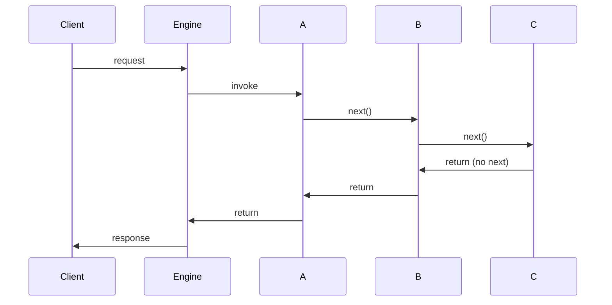
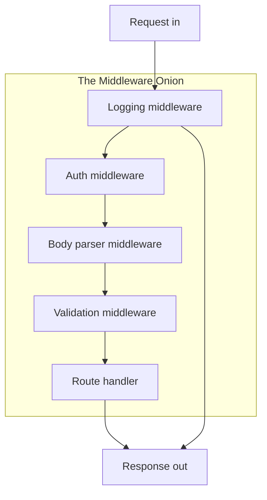
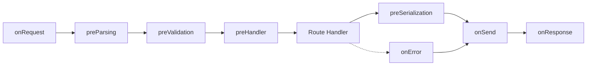
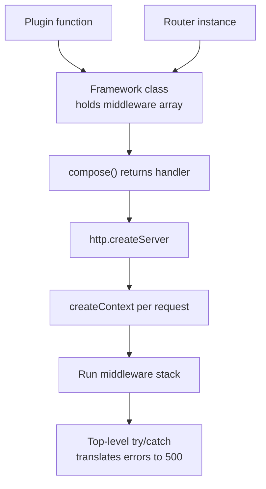

# 3.20 Middleware Pattern

> Middleware is the connective tissue of every Node web framework. A request arrives, passes inward through a stack of functions — logging, auth, parsing, validation, the route handler — and the response passes outward back through the same stack in reverse, with each layer free to mutate, observe, or short-circuit the exchange. The shape is the onion: layers wrapping layers, control handed off via `next()`, errors caught at the edges. This note reverse-engineers Express, Koa, and Fastify, builds a custom middleware engine from scratch in side-by-side JS and TS, and ends with a typed plugin framework you could actually ship.

## 1. Purpose

### 1.1 The problem middleware solves

Every non-trivial HTTP server has a list of things it must do for almost every request that are not the actual business logic of the route. Log the request. Stamp a correlation ID. Parse the JSON body. Verify the auth token. Apply CORS headers. Compress the response. Catch errors and turn them into 500s. Rate-limit by IP. None of these concerns belong inside the route handler — they are cross-cutting, meaning they cut across every route, and the moment you copy-paste them into each handler you have a maintenance disaster on your hands.

The classical object-oriented answer to cross-cutting concerns is inheritance: a `BaseHandler` with `authenticate()`, `log()`, `parseBody()` methods, and every route handler extends it. That works for three routes. By route thirty you have a deep inheritance hierarchy, half the handlers override `authenticate()` to skip it for public endpoints, and adding a new cross-cutting concern means editing the base class and praying nothing breaks. Inheritance is rigid, single-parent (in JS), and couples every consumer to the entire chain.

Middleware offers a different shape: composable, ordered, pluggable functions. Each concern is a function. You stack them. The framework runs them in order, handing control from one to the next via a callback (Express) or an awaited promise (Koa). You want logging before auth? Put logging first. You want to skip auth for a public route? Mount auth only on the routes that need it. You want to add rate limiting to a single endpoint? Drop one function in front of that one route. No inheritance, no base class edits, no coupling.

### 1.2 What middleware enables

- **Composability.** Each middleware is a self-contained function. You compose them into a pipeline. The pipeline is the application.
- **Reusability.** The same `loggingMiddleware` works in an Express app, a Koa app, a custom engine, and a test harness, because the contract is tiny.
- **Ordered processing.** The order in which you register middleware is the order in which it runs. Logging before auth, auth before body parsing (because parsing needs the authed user ID for size limits), body parsing before the route handler.
- **Two-pass execution.** Each middleware gets to run code before `next()` (the inward pass) and after `next()` returns (the outward pass). This is what gives you "log the request when it arrives, log the response status when it leaves" in one function.
- **Centralized error handling.** A single error-handling middleware at the end of the stack catches anything thrown by anything above it. No try/catch in every handler.
- **Short-circuiting.** An auth middleware that rejects a request can call `res.status(401).end()` and never call `next()`. The pipeline stops. The route handler never runs.
- **Mutability with discipline.** Middleware can attach data to `req` (`req.user = ...`, `req.id = ...`) that downstream middleware and handlers read. This is the de facto inter-middleware communication channel.

### 1.3 The onion model

The mental picture is an onion. The request enters from the outside and travels inward, layer by layer, until it reaches the core (the route handler). The response then travels outward, back through the same layers in reverse order. Each layer sees the request on the way in and the response on the way out.


The outermost middleware (logging, usually) wraps everything. The innermost middleware (the route handler) is the core. A logging middleware at the outermost layer can time the entire request because it sees the start (before `next()`) and the end (after `next()` returns). An auth middleware in the middle sees only the time from when auth started to when the layers below it finished.

### 1.4 Why this beats inheritance

| Concern | Inheritance | Middleware |
|---|---|---|
| Adding a cross-cutting concern | Edit the base class | Add one function to the stack |
| Skipping a concern for one route | Override the method | Mount the middleware selectively |
| Reordering concerns | Refactor the hierarchy | Reorder the array |
| Sharing across unrelated handlers | Needs a common ancestor | Just call the function |
| Testing in isolation | Mock the base class | Call the function with mock req/res |
| Two-pass (before + after) | Awkward template methods | Natural: code before and after `next()` |

Inheritance optimizes for "is-a" relationships. Middleware optimizes for "wraps" relationships. HTTP request processing is fundamentally a wrapping problem — each concern wraps the next — so middleware is the right tool.

### 1.5 What this note covers and does not

This note covers the middleware pattern itself: the signature, the engine, the onion, error propagation, and how Express, Koa, and Fastify implement it. It builds a custom engine in plain JS and a typed engine in TS. It is not a tutorial on any specific framework's full API surface — for that, see [[3.19 REST API Design]] and [[3.21 Security Authentication and Authorization]]. It assumes you understand Node's HTTP module (see [[3.12 HTTP and HTTPS Modules]]) and async/await (see [[1.22 Async Await Runtime]]).

## 2. Theory and Deep Dive

### 2.1 The middleware function signature

The Express signature is the canonical one that most of the Node ecosystem has converged on:

```javascript
function middleware(req, res, next) {
  // do something with req and res
  // then either call next() to continue
  // or end the response to short-circuit
  next();
}
```

Three arguments. `req` is the request object (extends `http.IncomingMessage`). `res` is the response object (extends `http.ServerResponse`). `next` is a function that, when called, hands control to the next middleware in the stack. If you do not call `next()` and do not end the response, the request hangs forever — the most common middleware bug.

Koa changed the signature. Koa bundles `req` and `res` into a single `ctx` (context) object and makes `next` return a promise, so the middleware can be an `async` function:

```javascript
async function middleware(ctx, next) {
  // before next: inward pass
  await next();
  // after next: outward pass
}
```

The `await next()` is the key insight. Because `next` returns a promise, the code after `await next()` runs after every downstream middleware has finished. That is the outward pass, expressed as ordinary sequential code. No callbacks, no "did the response finish yet" polling.

Fastify uses a third shape: named hooks. Instead of one stack, Fastify has several named lifecycle points (`onRequest`, `preParsing`, `preValidation`, `preHandler`, `preSerialization`, `onSend`, `onResponse`, `onError`), and you register functions at specific points:

```javascript
fastify.addHook('onRequest', async (request, reply) => { /* ... */ });
fastify.addHook('preHandler', async (request, reply) => { /* ... */ });
fastify.addHook('onError', async (request, reply, error) => { /* ... */ });
```

This is still middleware conceptually — functions that run at specific points in the request lifecycle — but the API is more structured. You cannot put auth in the "onSend" phase; Fastify enforces the lifecycle ordering.

### 2.2 What `next()` actually does

In Express, `next()` is a closure over the rest of the middleware stack. Calling `next()` invokes the next middleware function. When that middleware calls its own `next()`, the one after that runs, and so on, until the stack is exhausted. Control then unwinds: each middleware's code after its `next()` call runs in reverse order, and finally the original `next()` call returns.

Schematically, with middleware `[A, B, C]`:



This is just a recursive function call. The "outward pass" is simply the rest of each function executing after its `next()` returns.

In Koa, `next()` returns a promise that resolves when the entire downstream chain has finished. This means an `async` middleware can `await next()` and then run cleanup code, all in linear syntax:

```javascript
async function timer(ctx, next) {
  const start = Date.now();
  await next();
  const ms = Date.now() - start;
  ctx.set('X-Response-Time', `${ms}ms`);
}
```

The `ctx.set('X-Response-Time', ...)` runs after every downstream middleware has completed. In Express you would write the same thing with `res.on('finish', ...)` or by passing a callback, which is more awkward.

### 2.3 The two passes: inward and outward

The two-pass nature is what makes middleware expressive. A single function can do work both before and after the route handler runs, with full access to `req` and `res` on both passes.

Common inward-pass work (before `next()`):
- Start a timer
- Attach a correlation ID to `req`
- Parse and validate the auth token, attach `req.user`
- Parse the request body, attach `req.body`
- Check rate limits, short-circuit with 429 if exceeded
- Set response headers that do not depend on the handler

Common outward-pass work (after `next()`):
- Stop the timer, log the duration and status code
- Add security headers (`X-Frame-Options`, `CSP`)
- Compress the response body
- Emit metrics (Prometheus counters)
- Transform the response (rarely; usually the handler owns the body)

Because the outward pass runs in reverse order, the outermost middleware's outward pass runs last. If logging is outermost, its outward pass runs after every other middleware has finished, so its timing measurement includes the entire request. If logging were innermost, its measurement would include only the route handler.

### 2.4 Error middleware: the 4-argument signature

Express uses arity to distinguish error middleware from regular middleware. An error-handling middleware has exactly four parameters: `(err, req, res, next)`. Express checks `fn.length === 4` to identify these.

```javascript
function errorHandler(err, req, res, next) {
  console.error(err);
  res.status(500).json({ error: err.message });
}

app.use(errorHandler); // registered LAST
```

When any middleware calls `next(err)` with an argument, Express skips all remaining regular middleware and jumps to the next error middleware in the stack. This is critical: error middleware must be registered after all regular middleware, or it will never see the errors.

Koa does this differently. Because Koa middleware is `async`, you simply `try/catch` around `await next()`:

```javascript
async function errorHandler(ctx, next) {
  try {
    await next();
  } catch (err) {
    ctx.status = err.status || 500;
    ctx.body = { error: err.message };
  }
}
```

This is more flexible: you can have multiple try/catch wrappers, each catching different error types, and you do not need a separate error-middleware signature. The first middleware in the stack that wraps `await next()` in a try/catch becomes the global error handler.

Fastify uses the `onError` hook. Fastify automatically catches errors thrown by handlers and hooks and routes them through `onError` hooks, then through `onSend` (so you can still transform the response), then sends the response.

### 2.5 The onion diagram

The onion is the canonical visualization. Each layer is a middleware. The request travels inward; the response travels outward.



Reading this top-down: the request hits logging first (outermost), then auth, then body parsing, then validation, then the route handler (innermost). The response bubbles back out through validation, body parsing, auth, and finally logging — at which point logging can record the final status code and duration.

### 2.6 Parameter mutation and the shared request object

Middleware communicates with downstream middleware and the route handler by attaching properties to `req`. This is mutation, and it is the de facto standard.

```javascript
app.use((req, res, next) => {
  req.id = crypto.randomUUID();
  req.startedAt = Date.now();
  next();
});

app.use((req, res, next) => {
  req.user = verifyToken(req.headers.authorization);
  next();
});

app.get('/profile', (req, res) => {
  // req.id and req.user are available here
  res.json({ id: req.id, user: req.user });
});
```

This works because every middleware and the handler receive the same `req` object reference. Mutations are visible everywhere. The downside is that the type of `req` is now "whatever middleware happened to run before this handler," which is invisible to the type system unless you use TypeScript declaration merging (see Section 5.2).

Koa centralizes this on `ctx.state`:

```javascript
app.use(async (ctx, next) => {
  ctx.state.user = await verifyToken(ctx.headers.authorization);
  await next();
});
```

`ctx.state` is the conventional namespace for per-request data in Koa. It exists precisely to avoid polluting the context object with arbitrary properties.

### 2.7 Custom middleware engine

A middleware engine is just a function that takes a list of middleware and returns a request handler. The core is a recursive dispatcher.

Express-style (callback-based):

```javascript
function compose(middlewares) {
  return function handler(req, res) {
    let index = 0;
    function dispatch(i) {
      if (i >= middlewares.length) return;
      const mw = middlewares[i];
      try {
        mw(req, res, function next(err) {
          if (err) {
            // jump to error middleware
            const errorMw = middlewares.slice(i + 1).find(m => m.length === 4);
            if (errorMw) errorMw(err, req, res, () => {});
            else { res.statusCode = 500; res.end('Internal Server Error'); }
          } else {
            dispatch(i + 1);
          }
        });
      } catch (err) {
        const errorMw = middlewares.slice(i + 1).find(m => m.length === 4);
        if (errorMw) errorMw(err, req, res, () => {});
        else { res.statusCode = 500; res.end('Internal Server Error'); }
      }
    }
    dispatch(0);
  };
}
```

Koa-style (promise-based, cleaner):

```javascript
function compose(middlewares) {
  return function handler(ctx) {
    let index = -1;
    function dispatch(i) {
      if (i <= index) return Promise.reject(new Error('next() called multiple times'));
      index = i;
      const mw = middlewares[i];
      if (!mw) return Promise.resolve();
      try {
        return Promise.resolve(mw(ctx, () => dispatch(i + 1)));
      } catch (err) {
        return Promise.reject(err);
      }
    }
    return dispatch(0);
  };
}
```

The Koa-style engine is the foundation of `koa-compose`. The `dispatch(i+1)` call inside `next` is what creates the chain. Because `next` returns a promise, each middleware can `await` it. The `index` guard prevents `next()` from being called twice in the same middleware (which would break the chain).

### 2.8 How Express implements it

Express stores middleware in an internal router stack, an array of `Layer` objects. Each `Layer` wraps a middleware function and a route pattern. When a request arrives, Express iterates the stack, matches the path, and invokes the matched middleware with a synthesized `next` that continues the iteration.

Express's `next` accepts an optional error argument: `next(err)` triggers error mode, where Express skips to the next 4-arg middleware. `next('route')` skips the rest of the current route's middleware. `next()` with no argument continues normally.

Express middleware is synchronous-friendly but does not natively await promises. If a middleware returns a rejected promise, Express does not catch it — you need a wrapper like `express-async-errors` or to manually `try/catch` and call `next(err)`. This is the single biggest ergonomic difference from Koa.

### 2.9 How Koa implements it

Koa's `Application` holds an array of middleware (`app.middleware`). When you call `app.callback()`, Koa wraps the middleware array with `koa-compose` (the engine from Section 2.7), creates a `ctx` object from `req`/`res`, and invokes the composed function. The returned promise is caught and any rejection is sent to `app.on('error')` and the response is set to 500.

Koa's `ctx` is a proxy: `ctx.body = x` sets `res.body`; `ctx.status` sets `res.statusCode`; `ctx.headers` reads `req.headers`. This flattens the API and makes middleware easier to read.

Because Koa middleware is `async` and `next` returns a promise, the natural error pattern is `try { await next() } catch (err) { ... }` at the top of the stack. This is strictly more flexible than Express's 4-arg signature.

### 2.10 How Fastify implements it

Fastify does not expose a single middleware array. Instead, it has a fixed lifecycle with named hook points, and you register functions at specific points. Internally, Fastify compiles the hooks and the route handler into a single optimized function at boot time, which is one reason Fastify benchmarks faster than Express.

The Fastify lifecycle, in order:



Each hook can be `async` and can short-circuit by calling `reply.send(...)`. Errors thrown in any hook or the handler are routed to `onError` hooks, then back through `onSend` so the error response can still be transformed.

Fastify also supports a "use" method for Express-style middleware via `@fastify/express`, but the native model is hooks.

### 2.11 Performance characteristics

- **Express** adds per-request overhead from the `Layer` matching and the iterative `next` calls. Each middleware is a function call plus a path regex check.
- **Koa** adds the promise chain overhead: each `await next()` creates a microtask. For very deep stacks this is measurable but typically negligible.
- **Fastify** compiles hooks into a single function at startup, so per-request overhead is minimal. Fastify also uses a faster router (a custom radix tree) and JSON serialization (`fast-json-stringify`) built from a schema.

For most applications, the framework overhead is dwarfed by I/O (database, network). Choose based on ergonomics and ecosystem, not raw throughput, unless you are operating at very high request rates.

## 3. Mental Models

### 3.1 Middleware as a layer the request passes through

Think of each middleware as a transparent sheet the request slides through. On the way in, the sheet can inspect the request, modify it, or stop it. On the way out, the sheet can inspect and modify the response. The sheets stack: the first one registered is the outermost sheet, the last is the innermost.

This is more accurate than the "pipeline" metaphor (which implies one-directional flow) because middleware is fundamentally bidirectional. The request and the response both pass through the same layers, just in opposite directions.

### 3.2 The onion: outer wraps inner

The outermost middleware "wraps" everything inside it. This means the outermost middleware can:
- Measure the total request duration (it sees the start and the end).
- Catch any error from anywhere in the stack (if it wraps `next()` in try/catch).
- Set headers that apply to every response.
- Short-circuit the entire request (e.g., a CORS preflight handler that returns 204 without invoking inner middleware).

The innermost middleware (the route handler) cannot do any of this — it only sees its own execution. So the rule of thumb is: **the broader the concern, the further out it goes.** Logging, error handling, and CORS go outermost. Auth and body parsing go in the middle. Route-specific logic goes innermost.

### 3.3 `next()` as "pass to the inner layer, then continue"

`next()` is a yield. It says: "I am done with my inward pass; hand control to the next layer. When that layer (and everything below it) finishes, return control to me so I can do my outward pass."

If you forget to call `next()`, the yield never happens, the inner layers never run, and the request hangs. If you call `next()` twice, the inner layers run twice, which corrupts state and often causes "headers already sent" errors.

In Koa, `await next()` makes the yield explicit: you literally wait for the inner stack to complete before continuing. This is why Koa middleware is easier to reason about for cleanup logic.

### 3.4 Error middleware as the catch-all at the edge

Error middleware is the safety net. It sits at the edge of the onion (typically the very last middleware registered) and catches anything thrown by anything inside it. In Express, it has the 4-arg signature and is invoked only when `next(err)` is called. In Koa, it is just a regular middleware with a `try/catch` around `await next()`.

The error middleware should:
- Log the error with full stack trace and request context.
- Translate known error types into appropriate HTTP status codes (401 for UnauthorizedError, 404 for NotFoundError, 422 for ValidationError, 500 for everything else).
- Send a sanitized error response to the client (never leak stack traces in production).
- Re-throw or re-pass if it cannot handle the error (rare).

### 3.5 The shared request object as a message board

The `req` object (or `ctx.state` in Koa) is a message board that middleware uses to communicate. Auth middleware posts `req.user`. Logging middleware posts `req.id` and `req.startedAt`. Body parser posts `req.body`. The route handler reads all of these.

This is mutation, and mutation is dangerous if uncontrolled. The discipline is:
- Use a consistent namespace (`req.user`, `req.id`, not `req.foo` and `req.thing`).
- Document what each middleware attaches.
- Type the augmentations in TypeScript (declaration merging).
- Never overwrite a property another middleware set, unless you are explicitly transforming it.

### 3.6 Ordering as policy

The order of middleware is policy. Logging before auth means you log unauthenticated requests (useful for security monitoring). Auth before logging means you only log authenticated requests (useful for audit trails). Body parsing before validation means validation can assume `req.body` exists. Validation before body parsing is usually nonsense.

There is no universally correct order, but a sensible default is:

1. **Helmet/security headers** — outermost, applies to every response.
2. **CORS** — must be early so preflight requests short-circuit cleanly.
3. **Request ID + logging** — early, so every log line has the ID.
4. **Body parser** — before anything that needs the body.
5. **Auth** — before handlers, after body parser if auth needs the body (rare).
6. **Rate limiter** — often before auth (limit by IP) or after (limit by user).
7. **Route handlers** — the innermost layer.
8. **404 handler** — catches unmatched routes.
9. **Error handler** — the very last middleware, catches everything.

## 4. Real-World Use Cases

### 4.1 Express

Express is the original Node middleware framework, circa 2010. Its middleware model is the one most Node developers learn first. The `app.use(path, fn)` API mounts a middleware at a path prefix; `app.method(path, fns...)` mounts route handlers with optional inline middleware.

Express's middleware ecosystem is enormous: `morgan` (logging), `helmet` (security headers), `cors`, `body-parser` (now built in), `compression`, `express-rate-limit`, `passport` (auth), `express-validator`, `cookie-parser`, `csurf`, `serve-static`. The pattern is so established that you can drop most of these into any Express app with one line each.

Express's weakness is async. A middleware that returns a rejected promise will not call `next(err)` automatically; you must wrap with `try/catch` or use a helper like `express-async-handler`. Express 5 (in beta for years) addresses this by natively awaiting middleware.

### 4.2 Koa

Koa was built by the original Express team (TJ Holowaychuk et al.) as a "spiritual successor" that uses async/await from the ground up. Koa is intentionally minimal: it ships with no body parser, no router, no cookies, no sessions. You compose those as middleware. The result is a cleaner, smaller core and middleware that reads like linear code.

Koa's signature advantage is the `async/await` middleware. A logging middleware that times the request and an error middleware that catches everything are both five-line `async` functions. There is no special error signature, no callback gymnastics.

Koa's weakness is ecosystem size: fewer middleware packages than Express, and some are less maintained. But the patterns are so simple that you often write the middleware yourself in ten lines rather than reaching for a package.

### 4.3 Fastify

Fastify is the performance-focused option. It uses the named-hook model, JSON-schema-first request validation, and ahead-of-time compilation of routes and hooks. Fastify benchmarks roughly 2-3x faster than Express on typical workloads, mostly due to the compiled router and the schema-driven JSON serialization.

Fastify's middleware story is hooks. You register an `onRequest` hook for auth, a `preHandler` hook for fetching the resource, an `onSend` hook for transforming the response, an `onError` hook for centralized error handling. The lifecycle is fixed, which removes a class of ordering bugs (you cannot accidentally put auth after the handler because there is no way to register it there).

Fastify's plugins (`@fastify/cors`, `@fastify/helmet`, `@fastify/rate-limit`, `@fastify/jwt`) encapsulate the hook registration and configuration. A plugin is a function that registers hooks on a Fastify instance, optionally scoped to a prefix.

### 4.4 NestJS

NestJS uses decorators and dependency injection (see [[4.08 Dependency Injection DI]]) on top of Express or Fastify. Middleware in NestJS comes in several flavors: **Middleware classes** implementing `NestMiddleware` (Express-style, registered in module `configure()`), **Guards** (boolean-returning functions for access control, applied via `@UseGuards`), **Pipes** (transform/validate data, applied to specific parameters), and **Interceptors** (the closest to true onion middleware — they wrap the handler with `next.handle()` as an Observable, allowing pre- and post-processing). Under the hood, it is still middleware.

### 4.5 Custom middleware for specific concerns

When you build a custom middleware engine (or use a framework that lets you write raw middleware), you will write the same handful of middleware repeatedly:

- **Logging middleware.** Attach a request ID, log method and URL on entry, log status code and duration on exit.
- **Auth middleware.** Read the `Authorization` header, verify the JWT, attach `req.user`, or return 401.
- **Validation middleware.** Run a schema validator (Zod, Joi, Ajv) against `req.body` / `req.query` / `req.params`. On failure, return 422 with field errors.
- **Rate limiter middleware.** Increment a counter keyed by IP or user ID in Redis. If over limit, return 429.
- **CORS middleware.** Check the `Origin` header against an allowlist. Set `Access-Control-Allow-Origin`, `Access-Control-Allow-Headers`, `Access-Control-Allow-Methods`. Short-circuit preflight (`OPTIONS`) requests with 204.
- **Compression middleware.** On the outward pass, check `Accept-Encoding`, compress the response body (gzip/brotli), set `Content-Encoding`.
- **Body parser middleware.** Read the request stream, parse JSON or form-encoded or multipart, attach `req.body`. This is the most complex because it involves streaming (see [[3.07 Streams Fundamentals]]).
- **Security headers middleware.** Set `X-Content-Type-Options: nosniff`, `X-Frame-Options: DENY`, `Strict-Transport-Security`, `Content-Security-Policy`. Often just `helmet()` in Express.
- **Request ID middleware.** Read `X-Request-Id` header if present, otherwise generate a UUID. Attach to `req.id` and set on the response.

### 4.6 Non-HTTP middleware

The middleware pattern is not HTTP-specific. Anywhere you have a pipeline of transformations, you can use it: GraphQL resolver plugins, database query layers (logging, tenant filters, soft-delete), message queue consumers (decode, validate, authenticate, process), and CLI command pipelines. The shape — a list of functions, each calling `next` to continue, each able to run code before and after — is universally useful for staged processing.

## 5. Code Examples

### 5.1 Example A — Minimal and Conceptual

A custom middleware engine with three layers: logging, auth, and a route handler. Side-by-side JS and TS.

#### JavaScript

```javascript
const http = require('node:http');
const crypto = require('node:crypto');

// The composer: takes a list of middleware, returns a request handler.
function compose(middlewares) {
  return function handler(req, res) {
    let index = -1;
    function dispatch(i) {
      if (i <= index) {
        throw new Error('next() called multiple times');
      }
      index = i;
      const mw = middlewares[i];
      if (!mw) return;
      mw(req, res, function next(err) {
        if (err) {
          // For simplicity, just 500. Production version finds error middleware.
          res.statusCode = 500;
          res.end(JSON.stringify({ error: err.message }));
          return;
        }
        dispatch(i + 1);
      });
    }
    dispatch(0);
  };
}

// Layer 1: logging. Times the request on both passes.
function loggingMiddleware(req, res, next) {
  req.id = crypto.randomUUID();
  req.startedAt = Date.now();
  console.log(`[${req.id}] --> ${req.method} ${req.url}`);
  next();
  // outward pass
  const ms = Date.now() - req.startedAt;
  console.log(`[${req.id}] <-- ${res.statusCode} in ${ms}ms`);
}

// Layer 2: auth. Reads a token, attaches req.user.
function authMiddleware(req, res, next) {
  const token = req.headers['authorization'];
  if (!token) {
    // Short-circuit: do not call next, end the response.
    res.statusCode = 401;
    res.end(JSON.stringify({ error: 'missing token' }));
    return;
  }
  // Pretend we verified it.
  req.user = { id: 42, name: 'ada' };
  next();
}

// Layer 3: the route handler (innermost).
function handler(req, res) {
  res.setHeader('Content-Type', 'application/json');
  res.end(JSON.stringify({ hello: req.user.name, id: req.id }));
}

const server = http.createServer(compose([
  loggingMiddleware,
  authMiddleware,
  handler,
]));

server.listen(3000, () => console.log('listening on :3000'));
```

#### TypeScript

```typescript
import http from 'node:http';
import crypto from 'node:crypto';

// Augment the IncomingMessage type so req.id, req.user are typed.
declare module 'node:http' {
  interface IncomingMessage {
    id: string;
    startedAt: number;
    user?: { id: number; name: string };
  }
}

type Middleware = (
  req: http.IncomingMessage,
  res: http.ServerResponse,
  next: (err?: unknown) => void
) => void;

function compose(middlewares: Middleware[]) {
  return function handler(req: http.IncomingMessage, res: http.ServerResponse): void {
    let index = -1;
    function dispatch(i: number): void {
      if (i <= index) {
        throw new Error('next() called multiple times');
      }
      index = i;
      const mw = middlewares[i];
      if (!mw) return;
      mw(req, res, function next(err?: unknown): void {
        if (err) {
          res.statusCode = 500;
          res.end(JSON.stringify({ error: String((err as Error).message) }));
          return;
        }
        dispatch(i + 1);
      });
    }
    dispatch(0);
  };
}

const loggingMiddleware: Middleware = (req, res, next) => {
  req.id = crypto.randomUUID();
  req.startedAt = Date.now();
  console.log(`[${req.id}] --> ${req.method} ${req.url}`);
  next();
  const ms = Date.now() - req.startedAt;
  console.log(`[${req.id}] <-- ${res.statusCode} in ${ms}ms`);
};

const authMiddleware: Middleware = (req, res, next) => {
  const token = req.headers['authorization'];
  if (!token) {
    res.statusCode = 401;
    res.end(JSON.stringify({ error: 'missing token' }));
    return;
  }
  req.user = { id: 42, name: 'ada' };
  next();
};

const handler: Middleware = (req, res) => {
  res.setHeader('Content-Type', 'application/json');
  res.end(JSON.stringify({ hello: req.user?.name, id: req.id }));
};

const server = http.createServer(compose([
  loggingMiddleware,
  authMiddleware,
  handler,
]));

server.listen(3000, () => console.log('listening on :3000'));
```

The two are identical in shape. The TS version adds type annotations and the `declare module` augmentation so `req.id` and `req.user` are typed throughout. Note the use of `req.user?.name` in the handler — TypeScript knows `req.user` is optional because the augmentation marks it `?`.

### 5.2 Example B — Production-Grade

A typed middleware framework with logging, auth, validation, and error handling. Koa-style async/await so error handling is natural. Side-by-side JS and TS.

#### JavaScript

```javascript
const http = require('node:http');
const crypto = require('node:crypto');

// Koa-style composer: next returns a promise.
function compose(middlewares) {
  return function handler(ctx) {
    let index = -1;
    function dispatch(i) {
      if (i <= index) return Promise.reject(new Error('next() called multiple times'));
      index = i;
      const mw = middlewares[i];
      if (!mw) return Promise.resolve();
      try {
        return Promise.resolve(mw(ctx, () => dispatch(i + 1)));
      } catch (err) {
        return Promise.reject(err);
      }
    }
    return dispatch(0);
  };
}

// Context factory: bundles req, res, and a state bag.
function createContext(req, res) {
  return {
    req,
    res,
    state: {},
    get method() { return req.method; },
    get url() { return req.url; },
    get headers() { return req.headers; },
    set body(value) {
      res.setHeader('Content-Type', 'application/json');
      res.end(JSON.stringify(value));
    },
    set status(code) { res.statusCode = code; },
    get status() { return res.statusCode; },
    set header(pair) { res.setHeader(pair[0], pair[1]); },
  };
}

// Error middleware: outermost so it wraps everything.
async function errorMiddleware(ctx, next) {
  try {
    await next();
  } catch (err) {
    const status = err.status || 500;
    ctx.status = status;
    ctx.body = { error: err.message, requestId: ctx.state.id };
    console.error(`[${ctx.state.id}] error`, err);
  }
}

// Logging middleware: times the request.
async function loggingMiddleware(ctx, next) {
  ctx.state.id = ctx.headers['x-request-id'] || crypto.randomUUID();
  ctx.state.startedAt = Date.now();
  console.log(`[${ctx.state.id}] --> ${ctx.method} ${ctx.url}`);
  await next();
  const ms = Date.now() - ctx.state.startedAt;
  console.log(`[${ctx.state.id}] <-- ${ctx.status} in ${ms}ms`);
}

// Auth middleware: verifies a JWT-like token.
async function authMiddleware(ctx, next) {
  const token = ctx.headers['authorization'];
  if (!token) {
    const err = new Error('missing authorization header');
    err.status = 401;
    throw err;
  }
  // Pretend to verify the token.
  const parts = token.split(' ');
  if (parts.length !== 2 || parts[0] !== 'Bearer') {
    const err = new Error('malformed authorization header');
    err.status = 401;
    throw err;
  }
  ctx.state.user = await verifyToken(parts[1]);
  await next();
}

function verifyToken(token) {
  return new Promise((resolve, reject) => {
    // simulate async verification
    setImmediate(() => {
      if (token === 'invalid') {
        reject(Object.assign(new Error('invalid token'), { status: 401 }));
      } else {
        resolve({ id: 42, name: 'ada', roles: ['admin'] });
      }
    });
  });
}

// Validation middleware factory: takes a schema, returns middleware.
function validate(schema) {
  return async function validationMiddleware(ctx, next) {
    const body = await readBody(ctx.req);
    let parsed;
    try {
      parsed = JSON.parse(body);
    } catch {
      const err = new Error('invalid JSON');
      err.status = 400;
      throw err;
    }
    const errors = [];
    for (const [key, rule] of Object.entries(schema)) {
      if (rule.required && (parsed[key] === undefined || parsed[key] === null)) {
        errors.push(`${key} is required`);
      } else if (rule.type && typeof parsed[key] !== rule.type) {
        errors.push(`${key} must be ${rule.type}`);
      }
    }
    if (errors.length) {
      const err = new Error('validation failed');
      err.status = 422;
      err.details = errors;
      throw err;
    }
    ctx.state.body = parsed;
    await next();
  };
}

function readBody(req) {
  return new Promise((resolve, reject) => {
    let data = '';
    req.on('data', chunk => { data += chunk; });
    req.on('end', () => resolve(data));
    req.on('error', reject);
  });
}

// Router (extremely minimal).
function router() {
  const routes = [];
  return {
    add(method, path, handler) { routes.push({ method, path, handler }); },
    middleware() {
      return async function routerMiddleware(ctx, next) {
        for (const route of routes) {
          if (route.method === ctx.method && route.path === ctx.url.split('?')[0]) {
            await route.handler(ctx);
            return;
          }
        }
        await next(); // no match, fall through to 404
      };
    },
  };
}

// 404 middleware.
async function notFoundMiddleware(ctx, next) {
  await next();
  if (!ctx.res.writableEnded) {
    ctx.status = 404;
    ctx.body = { error: 'not found' };
  }
}

// Build the app.
const appRouter = router();
appRouter.add('POST', '/echo', async (ctx) => {
  ctx.body = { you: ctx.state.body, user: ctx.state.user.name };
});
appRouter.add('GET', '/health', async (ctx) => {
  ctx.body = { status: 'ok' };
});

const composed = compose([
  errorMiddleware,
  loggingMiddleware,
  notFoundMiddleware,
  authMiddleware,
  validate({ message: { required: true, type: 'string' } }),
  appRouter.middleware(),
]);

const server = http.createServer((req, res) => {
  const ctx = createContext(req, res);
  composed(ctx).catch(err => {
    // Last-resort handler if error middleware itself failed.
    console.error('uncaught', err);
    if (!res.writableEnded) {
      res.statusCode = 500;
      res.end(JSON.stringify({ error: 'internal error' }));
    }
  });
});

server.listen(3000, () => console.log('listening on :3000'));
```

#### TypeScript

```typescript
import http from 'node:http';
import crypto from 'node:crypto';

// Type the context.
interface User {
  id: number;
  name: string;
  roles: string[];
}

interface ContextState {
  id: string;
  startedAt: number;
  user?: User;
  body?: Record<string, unknown>;
}

interface Context {
  req: http.IncomingMessage;
  res: http.ServerResponse;
  state: ContextState;
  readonly method: string;
  readonly url: string;
  readonly headers: http.IncomingHttpHeaders;
  body: unknown;
  status: number;
  header: [string, string];
}

type Middleware = (ctx: Context, next: () => Promise<void>) => Promise<void> | void;

interface HttpError extends Error {
  status?: number;
  details?: string[];
}

function compose(middlewares: Middleware[]) {
  return function handler(ctx: Context): Promise<void> {
    let index = -1;
    function dispatch(i: number): Promise<void> {
      if (i <= index) return Promise.reject(new Error('next() called multiple times'));
      index = i;
      const mw = middlewares[i];
      if (!mw) return Promise.resolve();
      try {
        return Promise.resolve(mw(ctx, () => dispatch(i + 1)));
      } catch (err) {
        return Promise.reject(err);
      }
    }
    return dispatch(0);
  };
}

function createContext(req: http.IncomingMessage, res: http.ServerResponse): Context {
  const state: ContextState = { id: '', startedAt: 0 };
  const ctx: Context = {
    req,
    res,
    state,
    get method() { return req.method ?? ''; },
    get url() { return req.url ?? ''; },
    get headers() { return req.headers; },
    set body(value: unknown) {
      res.setHeader('Content-Type', 'application/json');
      res.end(JSON.stringify(value));
    },
    set status(code: number) { res.statusCode = code; },
    get status() { return res.statusCode; },
    set header(pair: [string, string]) { res.setHeader(pair[0], pair[1]); },
  };
  return ctx;
}

const errorMiddleware: Middleware = async (ctx, next) => {
  try {
    await next();
  } catch (err) {
    const e = err as HttpError;
    const status = e.status ?? 500;
    ctx.status = status;
    ctx.body = { error: e.message, requestId: ctx.state.id };
    console.error(`[${ctx.state.id}] error`, err);
  }
};

const loggingMiddleware: Middleware = async (ctx, next) => {
  ctx.state.id = (ctx.headers['x-request-id'] as string) || crypto.randomUUID();
  ctx.state.startedAt = Date.now();
  console.log(`[${ctx.state.id}] --> ${ctx.method} ${ctx.url}`);
  await next();
  const ms = Date.now() - ctx.state.startedAt;
  console.log(`[${ctx.state.id}] <-- ${ctx.status} in ${ms}ms`);
};

const authMiddleware: Middleware = async (ctx, next) => {
  const token = ctx.headers['authorization'];
  if (!token) {
    const err = new Error('missing authorization header') as HttpError;
    err.status = 401;
    throw err;
  }
  const parts = token.split(' ');
  if (parts.length !== 2 || parts[0] !== 'Bearer') {
    const err = new Error('malformed authorization header') as HttpError;
    err.status = 401;
    throw err;
  }
  ctx.state.user = await verifyToken(parts[1]);
  await next();
};

function verifyToken(token: string): Promise<User> {
  return new Promise((resolve, reject) => {
    setImmediate(() => {
      if (token === 'invalid') {
        const err = new Error('invalid token') as HttpError;
        err.status = 401;
        reject(err);
      } else {
        resolve({ id: 42, name: 'ada', roles: ['admin'] });
      }
    });
  });
}

interface ValidationRule {
  required?: boolean;
  type?: 'string' | 'number' | 'boolean' | 'object';
}

type Schema = Record<string, ValidationRule>;

function validate(schema: Schema): Middleware {
  return async (ctx, next) => {
    const body = await readBody(ctx.req);
    let parsed: Record<string, unknown>;
    try {
      parsed = JSON.parse(body);
    } catch {
      const err = new Error('invalid JSON') as HttpError;
      err.status = 400;
      throw err;
    }
    const errors: string[] = [];
    for (const [key, rule] of Object.entries(schema)) {
      if (rule.required && (parsed[key] === undefined || parsed[key] === null)) {
        errors.push(`${key} is required`);
      } else if (rule.type && typeof parsed[key] !== rule.type) {
        errors.push(`${key} must be ${rule.type}`);
      }
    }
    if (errors.length) {
      const err = new Error('validation failed') as HttpError;
      err.status = 422;
      err.details = errors;
      throw err;
    }
    ctx.state.body = parsed;
    await next();
  };
}

function readBody(req: http.IncomingMessage): Promise<string> {
  return new Promise((resolve, reject) => {
    let data = '';
    req.on('data', (chunk: Buffer) => { data += chunk.toString(); });
    req.on('end', () => resolve(data));
    req.on('error', reject);
  });
}

interface Route {
  method: string;
  path: string;
  handler: Middleware;
}

function router() {
  const routes: Route[] = [];
  return {
    add(method: string, path: string, handler: Middleware) {
      routes.push({ method, path, handler });
    },
    middleware(): Middleware {
      return async (ctx, next) => {
        for (const route of routes) {
          const pathOnly = ctx.url.split('?')[0];
          if (route.method === ctx.method && route.path === pathOnly) {
            await route.handler(ctx, next);
            return;
          }
        }
        await next();
      };
    },
  };
}

const notFoundMiddleware: Middleware = async (ctx, next) => {
  await next();
  if (!ctx.res.writableEnded) {
    ctx.status = 404;
    ctx.body = { error: 'not found' };
  }
};

const appRouter = router();
appRouter.add('POST', '/echo', async (ctx) => {
  ctx.body = { you: ctx.state.body, user: ctx.state.user?.name };
});
appRouter.add('GET', '/health', async (ctx) => {
  ctx.body = { status: 'ok' };
});

const composed = compose([
  errorMiddleware,
  loggingMiddleware,
  notFoundMiddleware,
  authMiddleware,
  validate({ message: { required: true, type: 'string' } }),
  appRouter.middleware(),
]);

const server = http.createServer((req, res) => {
  const ctx = createContext(req, res);
  composed(ctx).catch(err => {
    console.error('uncaught', err);
    if (!res.writableEnded) {
      res.statusCode = 500;
      res.end(JSON.stringify({ error: 'internal error' }));
    }
  });
});

server.listen(3000, () => console.log('listening on :3000'));
```

Notes on the production version:
- **Koa-style composer.** `next` returns a promise, so middleware can be `async` and use `try/catch` natively.
- **Context object.** Wraps `req`/`res` with getters and setters, centralizing per-request state in `ctx.state`.
- **Error middleware first.** It wraps everything, so any thrown error (from auth, validation, or the handler) is caught and translated to an HTTP response.
- **Validation as a factory.** `validate(schema)` returns a middleware, so you can mount different schemas on different routes.
- **404 middleware.** Placed before the router so that if the router falls through (no match), the 404 fires. Actually, in this layout, `notFoundMiddleware` is placed before `authMiddleware` so it runs the inward pass first, then `await next()` runs everything else, then if nothing wrote a response, it writes 404. This is the standard "catch-all 404" pattern.
- **Last-resort handler.** The `.catch()` on the composed promise handles the case where the error middleware itself throws (which should never happen, but defensive coding demands it).

## 6. Common Mistakes and Anti-Patterns

### 6.1 Forgetting to call `next()`

```javascript
function authMiddleware(req, res, next) {
  const token = req.headers['authorization'];
  if (!token) {
    res.status(401).end();
    return; // good: short-circuit, no next
  }
  req.user = verify(token);
  // BUG: forgot next() — request hangs for valid tokens
}
```

The request will hang forever (or until the client times out). The route handler never runs. Express will not warn you. The fix is to always end the function with either `next()` or a response-ending call (`res.end()`, `res.send()`, `res.json()`).

A common variant: the middleware has multiple code paths, and one branch forgets `next()`. Always trace every path through a middleware and confirm each one either calls `next()` or ends the response.

### 6.2 Calling `next()` twice

```javascript
function buggyMiddleware(req, res, next) {
  doSomethingAsync((err) => {
    if (err) return next(err);
    next();
  });
  next(); // BUG: also called synchronously
}
```

The downstream middleware runs twice. The second invocation may try to write to a response that has already been sent, causing "Cannot set headers after they are sent" errors. Or it may run side effects twice (double-charging a user, double-inserting a row).

The Koa-style composer detects this with the `i <= index` check and rejects the promise. Express does not detect it; it just runs the chain twice.

### 6.3 Not handling async errors

```javascript
function authMiddleware(req, res, next) {
  verifyToken(req.headers.authorization)
    .then(user => {
      req.user = user;
      next();
    });
  // BUG: no .catch — if verifyToken rejects, the promise is unhandled
  // and next is never called, so the request hangs.
}
```

Express does not see the rejected promise. The request hangs. The unhandled rejection may print a warning (Node 15+ exits the process by default on unhandled rejections).

The fix is to either `.catch(err => next(err))` or wrap in `try/catch` with `async/await`:

```javascript
async function authMiddleware(req, res, next) {
  try {
    req.user = await verifyToken(req.headers.authorization);
    next();
  } catch (err) {
    next(err);
  }
}
```

Or use a wrapper:

```javascript
const asyncHandler = (fn) => (req, res, next) =>
  Promise.resolve(fn(req, res, next)).catch(next);

app.use(asyncHandler(async (req, res) => {
  req.user = await verifyToken(req.headers.authorization);
}));
```

Koa does not have this problem because `next` returns a promise and Koa awaits the composed chain.

### 6.4 Error middleware not registered last

```javascript
app.use(errorHandler); // BUG: registered first, never sees errors
app.use(authMiddleware);
app.get('/profile', handler);
```

Express's error middleware (4-arg) only catches errors from middleware registered before it. If `authMiddleware` calls `next(err)`, Express looks for the next 4-arg middleware in the stack. Since `errorHandler` is before `authMiddleware`, there is no error middleware after `authMiddleware`, so Express uses its default error handler (which sends a stack trace in development and a generic message in production).

The fix is to always register error middleware as the very last `app.use(...)` call, after all routes and regular middleware.

### 6.5 Mutating `req`/`res` in surprising ways

```javascript
function badMiddleware(req, res, next) {
  req.headers = {}; // BUG: nuked the headers object
  req.url = '/';    // BUG: rewrote the URL, router now matches the wrong route
  res.statusCode = 200; // set before the handler runs, may be wrong
  next();
}
```

Some properties are off-limits:
- `req.headers` — downstream middleware (and the body parser) depends on it.
- `req.url` — the router matches on this.
- `res.statusCode` — the handler should set this.
- `res.headersSent` — once true, you cannot modify headers.

The discipline is to attach new properties (`req.user`, `req.id`) rather than overwriting existing ones, unless you are explicitly transforming (e.g., stripping a prefix from `req.url` for a sub-app mounted at that prefix).

### 6.6 Wrong ordering

```javascript
app.use(bodyParser());   // parses body
app.use(authMiddleware); // needs body? maybe
app.use(loggingMiddleware()); // BUG: logs only successful auths
```

If you want to log every request (including 401s), logging must come before auth. If you want to log only authenticated requests, auth before logging is correct — but you should know which you want and why.

Another common one: validation before body parsing. Validation reads `req.body`, so body parsing must come first. Or: rate limiter after auth — but if auth is expensive, you are doing work for rejected requests. Often you want rate limit first (by IP) and auth second.

### 6.7 Synchronous middleware doing heavy work

```javascript
function badMiddleware(req, res, next) {
  const hashed = bcrypt.hashSync(req.body.password, 12); // 200ms of blocking CPU
  next();
}
```

This blocks the event loop (see [[3.02 Libuv Event Loop]]). Every other request stalls for 200ms. The fix is to use the async version (`bcrypt.hash(...)` with a callback or promise) and call `next()` in the callback.

Any CPU-intensive work in middleware (parsing large bodies, computing hashes, running regexes on long strings) should be offloaded to a worker thread (see [[3.18 Worker Threads]]) or made async with chunked processing.

### 6.8 Relying on middleware execution order for correctness without documenting it

```javascript
app.use(corsMiddleware);
app.use(bodyParser);
app.use(authMiddleware);
app.use(loggingMiddleware); // BUG: needs req.id from authMiddleware, but auth is before logging
```

`loggingMiddleware` reads `req.id`, which `authMiddleware` sets. But auth is registered before logging, so by the time logging runs, auth has already attached `req.id`... wait, actually this works because auth attaches `req.id` on its inward pass and logging reads it on its inward pass. The point stands: if logging needed `req.user` (set by auth), and logging were registered before auth, it would see `undefined`.

The discipline: document the order, document which middleware attaches what, and write a test that asserts the order. Reordering middleware is a one-line change that breaks everything if you are not careful.

### 6.9 Using `next(err)` for control flow

```javascript
function findUserMiddleware(req, res, next) {
  const user = db.findUser(req.params.id);
  if (!user) {
    return next(new Error('not found')); // BUG: using error path for normal 404
  }
  req.user = user;
  next();
}
```

This works, but it conflates "expected business outcome" (user not found, 404) with "unexpected error" (database down, 500). The error middleware now has to distinguish them. Cleaner:

```javascript
function findUserMiddleware(req, res, next) {
  const user = db.findUser(req.params.id);
  if (!user) {
    res.status(404).json({ error: 'not found' });
    return; // do not call next
  }
  req.user = user;
  next();
}
```

Reserve `next(err)` for unexpected errors. Use direct response ending for expected outcomes.

### 6.10 Not testing middleware in isolation

Middleware is easy to unit test: you create mock `req`/`res` objects, call the middleware with a `next` spy, and assert. Skipping this leads to integration-test-only coverage, where a middleware bug is hard to localize.

```javascript
test('auth middleware rejects missing token', () => {
  const req = { headers: {} };
  const res = { statusCode: 0, end: jest.fn() };
  const next = jest.fn();
  authMiddleware(req, res, next);
  expect(res.statusCode).toBe(401);
  expect(next).not.toHaveBeenCalled();
});
```

## 7. Best Practices and Design Patterns

### 7.1 Always call `next()` or end the response

Every code path through a middleware must either call `next()` (to continue the pipeline) or end the response (to short-circuit). No exceptions. If a middleware has an `if/else`, both branches must do one or the other. If it has a `switch`, every case (including `default`) must do one or the other.

Use a linter rule or a code review checklist. The pattern is so common that some frameworks (Fastify) enforce it by requiring you to either call `done`/return a value or throw.

### 7.2 Use async/await with try/catch (or a wrapper)

In Express, prefer the `asyncHandler` wrapper:

```javascript
const wrap = (fn) => (req, res, next) =>
  Promise.resolve(fn(req, res, next)).catch(next);

app.use(wrap(async (req, res) => {
  req.user = await verifyToken(req.headers.authorization);
  // no try/catch needed; wrapper forwards rejections to next(err)
}));
```

In Koa, just write `async` functions; the composer handles rejections.

### 7.3 Register error middleware last

In Express, the 4-arg error middleware must be the last `app.use(...)`. In Koa, the error middleware (the one with `try/catch` around `await next()`) must be the first in the stack (so it wraps everything).

These are equivalent statements: "last in Express" means "outermost in the onion," which in Koa's array is "first in the array" because Koa runs the array in order and the first one's `await next()` invokes the rest.

### 7.4 Document middleware order

A comment at the top of the file:

```javascript
// Middleware order:
// 1. helmet       - security headers
// 2. cors         - CORS preflight
// 3. requestId    - generate/forward X-Request-Id
// 4. logger       - request logging (needs req.id)
// 5. bodyParser   - parse JSON body
// 6. auth         - verify JWT, attach req.user
// 7. router       - route dispatch
// 8. notFound     - 404 for unmatched routes
// 9. errorHandler - catch-all error handler (4-arg)
```

Or, better, define the array explicitly and use it:

```javascript
const middlewares = [
  helmet(),
  cors(),
  requestId(),
  logger(),
  bodyParser(),
  auth(),
  router(),
  notFound(),
  errorHandler(),
];
middlewares.forEach(mw => app.use(mw));
```

### 7.5 Use TypeScript to type `req`/`res`/`next`

TypeScript catches a class of bugs at compile time: calling `req.usr` instead of `req.user`, passing the wrong type to a validator, forgetting that `req.user` is optional. For Express, use declaration merging to augment `Request`:

```typescript
declare module 'express-serve-static-core' {
  interface Request {
    id: string;
    user?: { id: number; name: string };
  }
}
```

Now every `Request` object in the app has `.id` (required) and `.user` (optional). For the custom engine from Section 5.2, the `Context` interface plays the same role.

### 7.6 Keep middleware small and focused

A middleware should do one thing. `authMiddleware` should verify the token and attach `req.user`. It should not also log the user, parse the body, or set CORS headers. If you need all of those, write four middleware and stack them.

Small middleware is:
- Easy to test (one concern per test).
- Easy to reorder (you can move one concern without dragging others).
- Easy to reuse (you can mount the same `authMiddleware` in a different app).
- Easy to reason about (the function fits on screen).

### 7.7 Test middleware in isolation

For each middleware, write tests that call it with mock `req`/`res` and a `next` spy; assert that `next` was called (or not), that `req` was mutated correctly, that `res` was written correctly, and that errors are thrown or passed to `next(err)` correctly.

A test harness:

```javascript
function makeMocks(overrides = {}) {
  const req = { headers: {}, ...overrides.req };
  const res = {
    statusCode: 200,
    headers: {},
    body: null,
    ended: false,
    setHeader(k, v) { this.headers[k] = v; },
    end(body) { this.body = body; this.ended = true; },
    json(body) { this.body = body; this.ended = true; },
    status(code) { this.statusCode = code; return this; },
    ...overrides.res,
  };
  const next = jest.fn();
  return { req, res, next };
}
```

Now every middleware test is three lines:

```javascript
test('auth attaches user on valid token', async () => {
  const { req, res, next } = makeMocks({ req: { headers: { authorization: 'Bearer valid' } } });
  await authMiddleware(req, res, next);
  expect(req.user).toEqual({ id: 42, name: 'ada' });
  expect(next).toHaveBeenCalled();
});
```

### 7.8 Use a wrapper for async errors in Express

Until Express 5 ships and is widely adopted, every async middleware in Express 4 needs error forwarding. The `asyncHandler` wrapper is the standard solution. Apply it uniformly:

```javascript
const wrap = (fn) => (req, res, next) =>
  Promise.resolve(fn(req, res, next)).catch(next);

app.get('/profile', wrap(async (req, res) => {
  const profile = await db.getProfile(req.user.id);
  res.json(profile);
}));
```

### 7.9 Prefer `ctx.state` over `req` mutation in Koa

Koa provides `ctx.state` as the per-request data bag. Use it. It keeps the context object clean and signals intent: this is data middleware is passing to handlers, not part of the HTTP request itself.

### 7.10 Use named functions for stack traces

Anonymous arrow functions in middleware produce useless stack traces (`at <anonymous>`). Named functions produce `at authMiddleware (/app/src/middleware/auth.js:5:10)`, which is immediately actionable. This also helps in APM tools (Datadog, New Relic) that name spans after the function.

## 8. Technical Interview Knowledge

### 8.1 Q: What is middleware?

**A:** Middleware is a function that sits in a pipeline between the arrival of a request and the dispatch of the response. Each middleware function receives the request, the response, and a `next` callback (or in Koa, a `next` function returning a promise). The middleware can inspect or mutate the request, end the response (short-circuiting), or call `next()` to pass control to the next middleware in the pipeline. After `next()` returns, the middleware can run code on the outward pass (post-processing the response). This composable, ordered, two-pass model is how Express, Koa, and Fastify structure request handling, and it is the standard way to factor cross-cutting concerns (logging, auth, validation, error handling) out of route handlers.

### 8.2 Q: Explain the onion model.

**A:** The onion model visualizes middleware as concentric layers. The request enters from the outside and travels inward, layer by layer, until it reaches the innermost layer (the route handler). The response then travels outward, back through the same layers in reverse order. Each layer can do work on the way in (before `next()`) and on the way out (after `next()` returns). The outermost layer wraps everything, so it can measure the total request duration and catch errors from anywhere in the stack. The innermost layer (the handler) sees only its own execution. This bidirectional flow is what distinguishes middleware from a simple pipeline, and it is why logging and error handling conventionally go outermost.

### 8.3 Q: How does `next()` work?

**A:** `next()` is a closure over the rest of the middleware stack. When a middleware calls `next()`, the engine invokes the next middleware function in the array, passing it the same `req`/`res` (or `ctx`) and a new `next` that will invoke the one after that. This recurses until the stack is exhausted, at which point each `next()` call returns, unwinding the stack in reverse order. In Express, `next` is a plain callback that can be called with an error (`next(err)`) to enter error mode. In Koa, `next` returns a promise that resolves when the entire downstream chain has finished, so middleware can `await next()` and run cleanup code linearly. The Koa composer rejects the promise if `next()` is called twice in the same middleware, which is a common bug.

### 8.4 Q: How do you handle errors in middleware?

**A:** Three patterns, depending on the framework:
1. **Express 4-arg error middleware.** Register a function with signature `(err, req, res, next)` as the last middleware. When any middleware calls `next(err)`, Express skips all regular middleware and jumps to the next 4-arg middleware. The error middleware logs the error, sets a status code, and sends a sanitized response.
2. **Koa try/catch.** Register an `async` middleware first that does `try { await next() } catch (err) { ... }`. Any error thrown by any downstream middleware (or the handler) propagates up through the promise chain and is caught.
3. **Fastify onError hook.** Fastify automatically catches errors thrown by hooks and handlers, routes them through `onError` hooks, then through `onSend` so the error response can still be transformed.

In all three, the key is to have exactly one place that translates errors into HTTP responses, so you do not duplicate error-handling logic across handlers.

### 8.5 Q: Difference between Express and Koa middleware?

**A:**
- **Signature.** Express: `(req, res, next)`. Koa: `(ctx, next)` where `ctx` bundles `req`/`res`/`state`.
- **Async.** Express middleware is callback-based; a returned promise is not awaited. Koa middleware is async-native; `next` returns a promise that the composer awaits.
- **Error handling.** Express uses a separate 4-arg signature for error middleware. Koa uses `try/catch` around `await next()`.
- **Two-pass.** Express middleware writes post-`next()` code after the `next()` call, but since `next` is a callback, the post code runs before the inner stack finishes (you need `res.on('finish')` for true post-response work). Koa middleware writes post-`next()` code after `await next()`, which runs after the inner stack finishes — natural linear flow.
- **Ecosystem.** Express has a larger middleware ecosystem; Koa is more minimal and you often write middleware yourself.
- **Performance.** Comparable; Koa has slightly more overhead per middleware due to the promise chain, but it is negligible for most apps.

### 8.6 Q: How would you build a custom middleware engine?

**A:** The core is a `compose` function that takes an array of middleware and returns a request handler. For Koa-style (async):

```javascript
function compose(middlewares) {
  return (ctx) => {
    let index = -1;
    function dispatch(i) {
      if (i <= index) return Promise.reject(new Error('next() called multiple times'));
      index = i;
      const mw = middlewares[i];
      if (!mw) return Promise.resolve();
      try {
        return Promise.resolve(mw(ctx, () => dispatch(i + 1)));
      } catch (err) {
        return Promise.reject(err);
      }
    }
    return dispatch(0);
  };
}
```

The `dispatch` function is recursive: each middleware's `next` argument is `() => dispatch(i+1)`. The `index` guard prevents double-`next`. The `Promise.resolve(mw(...))` ensures that both sync and async middleware work. The handler returns the top-level promise so the caller can attach a `.catch()` for any uncaught errors. For Express-style, replace the promise machinery with a callback-based `next(err)` that either continues to `dispatch(i+1)` or jumps to the next 4-arg error middleware.

### 8.7 Q: What is middleware ordering and why does it matter?

**A:** Middleware runs in the order it is registered. The order determines what data is available (if logging reads `req.id` and auth sets it, auth must come first), what gets short-circuited (CORS before auth so preflight never hits auth), what gets timed (the outermost middleware's outward pass sees the total duration), and what errors get caught (the error middleware catches errors from anything registered before it). A sensible default order: security headers, CORS, request ID, logging, body parser, auth, rate limiter, router, 404, error handler. Deviate only with a reason.

### 8.8 Q: How do you test middleware?

**A:** In isolation, with mock `req`/`res` and a `next` spy. Create a `makeMocks` helper that returns `{ req, res, next }` with `next` as a jest.fn(). For each middleware, call it with the mocks, then assert on `req` mutations, `res` writes, whether `next` was called, and (for error cases) what argument `next` received. For async middleware, `await` the call. Also write integration tests that stack multiple middleware and assert the composed behavior, especially for ordering bugs.

## 9. Practical Exercises

### 9.1 Exercise 1: Build a custom middleware engine

**Task.** Implement a Koa-style `compose` function that takes an array of `async` middleware and returns a handler. The handler should call middleware in order, with each middleware's `next` argument being a function that returns a promise for the rest of the chain. Include the double-`next` guard.

**Solution.**

```javascript
function compose(middlewares) {
  return function handler(ctx) {
    let index = -1;
    function dispatch(i) {
      if (i <= index) {
        return Promise.reject(new Error('next() called multiple times'));
      }
      index = i;
      const mw = middlewares[i];
      if (!mw) return Promise.resolve();
      try {
        return Promise.resolve(mw(ctx, function next() {
          return dispatch(i + 1);
        }));
      } catch (err) {
        return Promise.reject(err);
      }
    }
    return dispatch(0);
  };
}

// Test
const stack = [
  async (ctx, next) => {
    ctx.log = [];
    ctx.log.push('A in');
    await next();
    ctx.log.push('A out');
  },
  async (ctx, next) => {
    ctx.log.push('B in');
    await next();
    ctx.log.push('B out');
  },
  async (ctx) => {
    ctx.log.push('C handler');
  },
];

const handler = compose(stack);
const ctx = { log: [] };
handler(ctx).then(() => {
  console.log(ctx.log);
  // ['A in', 'B in', 'C handler', 'B out', 'A out']
});
```

The output demonstrates the onion: A in, B in, C handler, B out, A out. The double-`next` guard (`i <= index`) rejects if any middleware calls `next()` twice.

### 9.2 Exercise 2: Implement logging, auth, and error middleware

**Task.** Build three middleware for the engine from Exercise 1:
1. `errorMiddleware` — catches any thrown error, sets `ctx.status` and `ctx.body`.
2. `loggingMiddleware` — logs the request on entry, logs status and duration on exit.
3. `authMiddleware` — reads `Authorization: Bearer <token>`, verifies (mock), attaches `ctx.state.user`, throws 401 on missing/invalid.

**Solution.**

```javascript
function compose(middlewares) {
  return (ctx) => {
    let index = -1;
    function dispatch(i) {
      if (i <= index) return Promise.reject(new Error('next() called multiple times'));
      index = i;
      const mw = middlewares[i];
      if (!mw) return Promise.resolve();
      try {
        return Promise.resolve(mw(ctx, () => dispatch(i + 1)));
      } catch (err) {
        return Promise.reject(err);
      }
    }
    return dispatch(0);
  };
}

async function errorMiddleware(ctx, next) {
  try {
    await next();
  } catch (err) {
    ctx.status = err.status || 500;
    ctx.body = { error: err.message };
    console.error('caught:', err.message);
  }
}

async function loggingMiddleware(ctx, next) {
  const start = Date.now();
  ctx.state.id = ctx.req.headers['x-request-id'] || 'anon';
  console.log(`[${ctx.state.id}] --> ${ctx.req.method} ${ctx.req.url}`);
  await next();
  const ms = Date.now() - start;
  console.log(`[${ctx.state.id}] <-- ${ctx.status} in ${ms}ms`);
}

async function authMiddleware(ctx, next) {
  const auth = ctx.req.headers['authorization'];
  if (!auth || !auth.startsWith('Bearer ')) {
    const err = new Error('missing or malformed token');
    err.status = 401;
    throw err;
  }
  const token = auth.slice(7);
  if (token !== 'valid') {
    const err = new Error('invalid token');
    err.status = 401;
    throw err;
  }
  ctx.state.user = { id: 1, name: 'ada' };
  await next();
}

// Route handler
async function handler(ctx) {
  ctx.status = 200;
  ctx.body = { hello: ctx.state.user.name };
}

const app = compose([
  errorMiddleware,
  loggingMiddleware,
  authMiddleware,
  handler,
]);

// Test: valid request
const ctx1 = {
  req: { method: 'GET', url: '/profile', headers: { authorization: 'Bearer valid' } },
  state: {},
  status: 200,
  body: null,
};
app(ctx1).then(() => console.log('response:', ctx1.body));
// logs: [ada] --> GET /profile
// logs: [ada] <-- 200 in Xms
// logs: response: { hello: 'ada' }

// Test: missing token
const ctx2 = {
  req: { method: 'GET', url: '/profile', headers: {} },
  state: {},
  status: 200,
  body: null,
};
app(ctx2).then(() => console.log('response:', ctx2.body));
// logs: [anon] --> GET /profile
// logs: caught: missing or malformed token
// logs: [anon] <-- 401 in Xms
// logs: response: { error: 'missing or malformed token' }
```

Note the order: `errorMiddleware` first (outermost), then logging, then auth, then handler. When auth throws, the error propagates up through `loggingMiddleware`'s `await next()` (so logging's outward pass runs, logging the 401), and is caught by `errorMiddleware`'s `try/catch`. This is the onion in action.

### 9.3 Exercise 3: Convert callback-style to async/await middleware

**Task.** Given this Express-style callback middleware, convert it to a Koa-style async middleware.

```javascript
function authMiddlewareCallback(req, res, next) {
  verifyToken(req.headers.authorization, (err, user) => {
    if (err) return next(err);
    if (!user) {
      res.statusCode = 401;
      res.end(JSON.stringify({ error: 'no user' }));
      return;
    }
    req.user = user;
    next();
  });
}
```

**Solution.**

Step 1: promisify `verifyToken`:

```javascript
const verifyTokenAsync = (token) => new Promise((resolve, reject) => {
  verifyToken(token, (err, user) => {
    if (err) reject(err);
    else resolve(user);
  });
});
```

Step 2: rewrite as Koa middleware:

```javascript
async function authMiddleware(ctx, next) {
  const user = await verifyTokenAsync(ctx.headers['authorization']);
  if (!user) {
    const err = new Error('no user');
    err.status = 401;
    throw err;
  }
  ctx.state.user = user;
  await next();
}
```

The conversion eliminates the callback pyramid. The error path is unified: `verifyTokenAsync` rejects on error, `throw` on the no-user case — both propagate to the error middleware at the top of the stack. The response-setting code is gone; instead, throwing a status-tagged error lets the error middleware format the response.

If you cannot modify `verifyToken`, you can use `util.promisify`:

```javascript
const util = require('node:util');
const verifyTokenAsync = util.promisify(verifyToken);
```

### 9.4 Exercise 4: Diagnose a "request hangs" bug

**Task.** The following Express app has a bug: requests to `/profile` hang and eventually time out. Diagnose and fix.

```javascript
const express = require('express');
const app = express();

app.use((req, res, next) => {
  req.startedAt = Date.now();
  // forgot next
});

app.use((req, res, next) => {
  const token = req.headers.authorization;
  if (!token) {
    return res.status(401).json({ error: 'no token' });
  }
  verifyToken(token, (err, user) => {
    if (err) return next(err);
    req.user = user;
    next();
  });
});

app.get('/profile', (req, res) => {
  res.json({ name: req.user.name });
});

app.use((err, req, res, next) => {
  res.status(500).json({ error: err.message });
});

app.listen(3000);
```

**Diagnosis.** The first middleware (`req.startedAt = Date.now()`) does not call `next()`. So no request ever reaches the second middleware, the route handler, or the error middleware. The request hangs until the client times out. Express does not warn about this.

There is also a secondary bug: if `verifyToken` calls back with `null` for `user` (no error, but no user), `req.user` is set to `null` and the handler crashes with `Cannot read property 'name' of null`. That error is caught by the error middleware (which is registered correctly, last), so it returns a 500 — but only after the first bug is fixed.

**Fix.**

```javascript
app.use((req, res, next) => {
  req.startedAt = Date.now();
  next(); // ADDED
});

app.use((req, res, next) => {
  const token = req.headers.authorization;
  if (!token) {
    return res.status(401).json({ error: 'no token' });
  }
  verifyToken(token, (err, user) => {
    if (err) return next(err);
    if (!user) {
      return res.status(401).json({ error: 'invalid token' }); // ADDED
    }
    req.user = user;
    next();
  });
});

app.get('/profile', (req, res) => {
  res.json({ name: req.user.name });
});

app.use((err, req, res, next) => {
  res.status(500).json({ error: err.message });
});
```

**How to spot this in production.** Symptoms: requests hang, no logs from later middleware, no response. Diagnosis steps:
1. Add a log at the start of every middleware and the handler. The last log line tells you which middleware was entered but never continued.
2. Search the codebase for middleware functions that lack a `next()` call on some path.
3. Use a request timeout middleware that calls `next(new Error('timeout'))` after N seconds, so the error middleware logs the request that hung.
4. In Node, use `--inspect` and pause on the request to see the stack — it will be sitting in the middleware that forgot `next()`.

## 10. Mini-Project Blueprint

### 10.1 Project: Build a typed middleware framework

Build a small, typed, Koa-style middleware framework from scratch. The framework should support:
- The onion model (async middleware, `next` returns a promise).
- A typed `Context` object with `req`, `res`, `state`, and getters/setters for `body` and `status`.
- Global error handling via a try/catch wrapper at the top of the stack.
- A plugin system: a plugin is a function that registers middleware on the framework instance.
- A minimal router.
- TypeScript types throughout, with `Context.state` generically extensible.

### 10.2 Architecture



### 10.3 Step-by-step

**Step 1: Define the types.**

```typescript
import http from 'node:http';

export interface ContextState {
  [key: string]: unknown;
}

export interface Context<S extends ContextState = ContextState> {
  req: http.IncomingMessage;
  res: http.ServerResponse;
  state: S;
  readonly method: string;
  readonly url: string;
  readonly headers: http.IncomingHttpHeaders;
  body: unknown;
  status: number;
  header: [string, string];
}

export type Middleware<S extends ContextState = ContextState> = (
  ctx: Context<S>,
  next: () => Promise<void>
) => Promise<void> | void;

export interface Plugin<S extends ContextState = ContextState> {
  (app: Framework<S>): void;
}
```

**Step 2: Implement compose.**

```typescript
function compose<S extends ContextState>(middlewares: Middleware<S>[]) {
  return function handler(ctx: Context<S>): Promise<void> {
    let index = -1;
    function dispatch(i: number): Promise<void> {
      if (i <= index) return Promise.reject(new Error('next() called multiple times'));
      index = i;
      const mw = middlewares[i];
      if (!mw) return Promise.resolve();
      try {
        return Promise.resolve(mw(ctx, () => dispatch(i + 1)));
      } catch (err) {
        return Promise.reject(err);
      }
    }
    return dispatch(0);
  };
}
```

**Step 3: Implement the Framework class.**

```typescript
export class Framework<S extends ContextState = ContextState> {
  private middlewares: Middleware<S>[] = [];
  private errorHandler: Middleware<S> = async (ctx, next) => {
    try {
      await next();
    } catch (err) {
      const e = err as Error & { status?: number };
      ctx.status = e.status ?? 500;
      ctx.body = { error: e.message };
      console.error('[framework] error:', e);
    }
  };

  use(mw: Middleware<S>): this {
    this.middlewares.push(mw);
    return this;
  }

  register(plugin: Plugin<S>): this {
    plugin(this);
    return this;
  }

  callback(): (req: http.IncomingMessage, res: http.ServerResponse) => void {
    const stack = [this.errorHandler, ...this.middlewares];
    const composed = compose(stack);
    return (req, res) => {
      const ctx = this.createContext(req, res);
      composed(ctx).catch((err) => {
        console.error('[framework] uncaught:', err);
        if (!res.writableEnded) {
          res.statusCode = 500;
          res.end(JSON.stringify({ error: 'internal error' }));
        }
      });
    };
  }

  private createContext(req: http.IncomingMessage, res: http.ServerResponse): Context<S> {
    const state = {} as S;
    return {
      req,
      res,
      state,
      get method() { return req.method ?? ''; },
      get url() { return req.url ?? ''; },
      get headers() { return req.headers; },
      set body(value: unknown) {
        if (!res.headersSent) res.setHeader('Content-Type', 'application/json');
        res.end(JSON.stringify(value));
      },
      set status(code: number) { res.statusCode = code; },
      get status() { return res.statusCode; },
      set header(pair: [string, string]) { res.setHeader(pair[0], pair[1]); },
    };
  }

  listen(port: number, cb?: () => void): http.Server {
    return http.createServer(this.callback()).listen(port, cb);
  }
}
```

**Step 4: Implement a router.**

```typescript
interface Route {
  method: string;
  path: string;
  handler: Middleware;
}

export class Router {
  private routes: Route[] = [];

  add(method: string, path: string, handler: Middleware): this {
    this.routes.push({ method, path, handler });
    return this;
  }

  middleware(): Middleware {
    return async (ctx, next) => {
      const pathOnly = ctx.url.split('?')[0];
      for (const route of this.routes) {
        if (route.method === ctx.method && route.path === pathOnly) {
          await route.handler(ctx, next);
          return;
        }
      }
      await next();
    };
  }
}
```

**Step 5: Build a plugin.**

```typescript
interface AppState extends ContextState {
  id: string;
  startedAt: number;
  user?: { id: number; name: string };
}

const loggingPlugin: Plugin<AppState> = (app) => {
  app.use(async (ctx, next) => {
    ctx.state.id = crypto.randomUUID();
    ctx.state.startedAt = Date.now();
    console.log(`[${ctx.state.id}] --> ${ctx.method} ${ctx.url}`);
    await next();
    const ms = Date.now() - ctx.state.startedAt;
    console.log(`[${ctx.state.id}] <-- ${ctx.status} in ${ms}ms`);
  });
};

const authPlugin: Plugin<AppState> = (app) => {
  app.use(async (ctx, next) => {
    const token = ctx.headers['authorization'];
    if (!token) {
      const err = new Error('unauthorized') as Error & { status?: number };
      err.status = 401;
      throw err;
    }
    ctx.state.user = { id: 1, name: 'ada' };
    await next();
  });
};
```

**Step 6: Wire it up.**

```typescript
const app = new Framework<AppState>();
app.register(loggingPlugin);
app.register(authPlugin);

const router = new Router();
router.add('GET', '/profile', async (ctx) => {
  ctx.body = { name: ctx.state.user?.name };
});
router.add('GET', '/health', async (ctx) => {
  ctx.body = { status: 'ok' };
});
app.use(router.middleware());

app.listen(3000, () => console.log('listening on :3000'));
```

### 10.4 Extensions

- **Path parameters.** Extend the router to match `/users/:id` and attach `ctx.params.id`.
- **Body parsing.** Add a `jsonBodyParser` middleware that reads the request stream and parses JSON.
- **Validation.** Add a `validate(schema)` middleware factory using Zod or Ajv.
- **Sub-apps.** Allow mounting a Framework at a path prefix, stripping the prefix from `ctx.url` for the sub-app's router.

### 10.5 What you learn

- The composer is small (20 lines) but is the heart of every Koa-like framework.
- TypeScript generics make `ctx.state` extensible without sacrificing type safety.
- The plugin pattern is just "a function that takes the app and calls `use`" — no magic.
- The error middleware is a regular middleware with `try/catch`; no special signature.

## 11. Core Connections

- [[3.12 HTTP and HTTPS Modules]] — Middleware operates on `http.IncomingMessage` and `http.ServerResponse`. The `http.createServer` callback is the entry point to which a composed middleware stack is passed.
- [[3.19 REST API Design]] — REST endpoints are built on middleware: auth, validation, content negotiation, and error handling are all middleware concerns layered on top of route handlers.
- [[3.21 Security Authentication and Authorization]] — Auth middleware (JWT verification, session cookies, OAuth) is the primary security gate in the middleware stack. Ordering relative to other middleware matters.
- [[3.22 Security Vulnerabilities Mitigation]] — CORS, helmet, CSRF, and rate limiting are all implemented as middleware. The middleware stack is the application's security perimeter.
- [[2.17 API Design with Types]] — Typing `req`/`res`/`ctx` with declaration merging and generics is what makes a typed middleware framework usable. The `Context<S>` pattern from Section 10 is a direct application.
- [[4.08 Dependency Injection DI]] — NestJS middleware, guards, pipes, and interceptors are wired through a DI container. The middleware pattern composes naturally with DI.
- [[1.22 Async Await Runtime]] — Koa-style middleware is async/await-native. Understanding the microtask queue (see [[3.05 Microtask Queues and Process NextTick]]) explains why `await next()` works.
- [[3.10 Event Emitter Pattern]] — Express's `app` and `req`/`res` are EventEmitters. The `res.on('finish')` event is the callback-style equivalent of Koa's "after `await next()`" outward pass.
- [[1.20 Promises Specification]] — The Koa composer is built on promise chaining. Each `Promise.resolve(mw(...))` ensures both sync and async middleware produce a promise that the chain can await.
