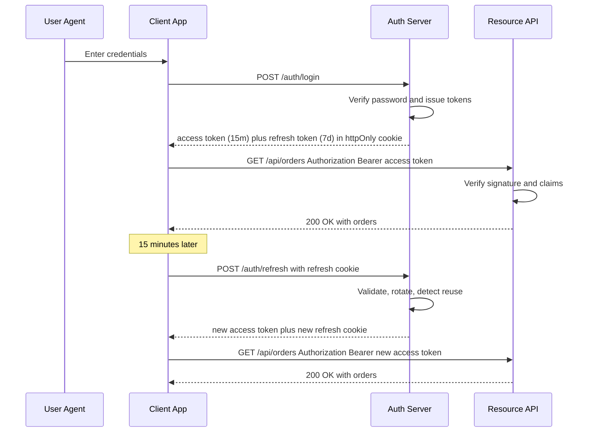
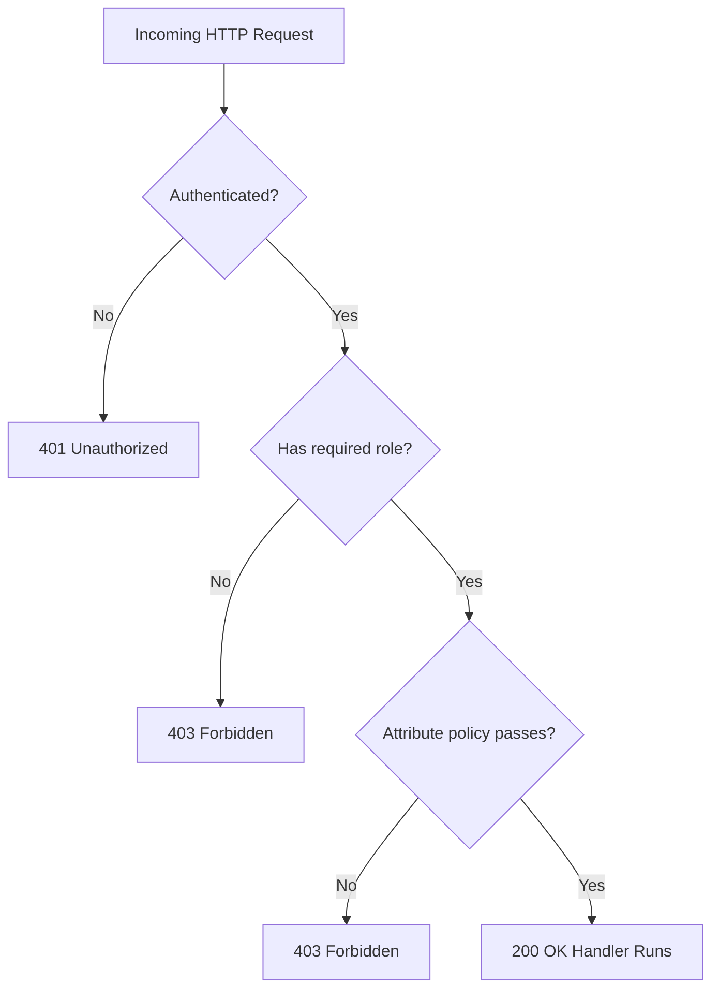
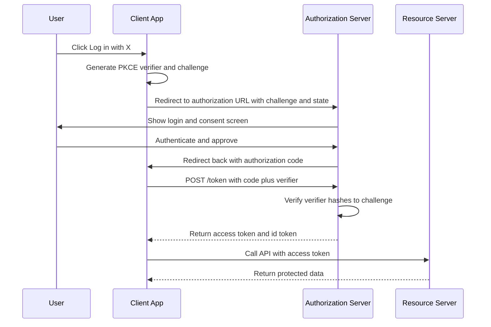

# 3.21 Security Authentication and Authorization

> Authentication decides who you are. Authorization decides what you are allowed to do. Almost every backend bug, breach, and outage you will debug in production touches one of these two decisions. This note covers the full landscape — session-based auth, JSON Web Tokens (JWT), refresh token rotation, role-based access control (RBAC), attribute-based access control (ABAC), OAuth 2.0, and OpenID Connect — with side-by-side JavaScript and TypeScript implementations, common pitfalls, and interview-ready explanations.

## 1. Purpose

The web is a stateless protocol (HTTP) running over an untrusted network (the public internet). Every request arrives as an isolated packet of bytes; the server has no built-in way to know that request 47 and request 48 came from the same person. **Authentication** is the mechanism by which the server verifies the identity of whoever is making a request — turning "an anonymous HTTP request" into "a request from user 1234". **Authorization** is the next decision: now that we know it is user 1234, are they allowed to do this specific thing to this specific resource?

These two concepts are routinely conflated. Engineers say "auth" to mean both, and the word is genuinely ambiguous. This note uses "authentication" for the identity decision (who are you) and "authorization" for the permission decision (what can you do). Some literature uses the abbreviations AuthN and AuthZ; we will mostly avoid them and stick to the full words because the abbreviation itself hides the distinction — and the distinction is the single most important thing to internalize.

Authentication in Node.js backends takes two dominant shapes. **Session-based auth** stores a server-side record of who is logged in, identified by a random unguessable string (the session id), and sends that id to the client inside an httpOnly cookie. Each subsequent request carries the cookie back; the server looks up the session, attaches the user to the request, and proceeds. **Token-based auth** (overwhelmingly JWT) issues a signed, self-contained token to the client; the client sends the token on each request, usually in an `Authorization: Bearer <token>` header; the server verifies the signature, reads the claims, and proceeds without any server-side lookup. The first scales by sharing a session store (typically Redis); the second scales by being stateless (any server can verify any token with the same secret or public key).

JWT exists because stateless verification is dramatically easier to scale. A load balancer can route a request to any one of a hundred stateless API servers; each one verifies the token with the same secret and answers. No shared session store, no cache invalidation, no sticky sessions. The cost is that a JWT cannot be revoked cheaply — once issued, it is valid until it expires. This is why access tokens are short-lived (typically 15 minutes) and refresh tokens exist: a refresh token is a long-lived, server-side-revocable credential that the client uses to obtain a new short-lived access token. Refresh token rotation — issuing a new refresh token every time the client uses one, and invalidating the old — limits the damage if a refresh token is stolen.

RBAC and ABAC exist because identity is not enough. Knowing that user 1234 is logged in tells you nothing about whether they should be allowed to delete a row in the orders table. **Role-based access control** assigns users to roles (admin, editor, viewer) and grants permissions to roles (admin can delete any order; editor can edit their own orders; viewer can read). **Attribute-based access control** evaluates a policy over arbitrary attributes — the user's department, the resource's owner, the time of day, the IP range — and answers a single yes or no question per request. RBAC is simpler and coarse; ABAC is expressive and expensive. Most production systems layer them: RBAC for broad buckets, ABAC for the few rules that need finer granularity.

OAuth 2.0 exists because users do not want to hand their password to every third-party app. Instead of sharing credentials, the user authenticates once with the authorization server, grants the third-party app a scoped token, and the third-party uses that token to access the user's data on their behalf. OpenID Connect sits on top of OAuth 2.0 and adds an identity layer — a standardized way for the authorization server to assert "this is who the user is" via an id token, which is a special kind of JWT. Together they are the foundation of single sign-on (SSO) across the modern web.

This note assumes you have read [[3.19 REST API Design]], [[3.20 Middleware Pattern]], and [[3.22 Security Vulnerabilities Mitigation]]. Auth is the area where every other backend discipline — API design, middleware composition, secret management, transport security — collides. Get it wrong and the rest does not matter.

## 2. Theory and Deep Dive

### 2.1 Session-Based Authentication

A session is a server-side record of an authenticated user. The record lives in memory, in a shared cache like Redis, or in a database. Each session has a unique, cryptographically random identifier (the session id). The server sends the session id to the client as a cookie. The cookie is marked httpOnly (so JavaScript cannot read it), Secure (so it is only sent over HTTPS), and SameSite (so it is not sent on cross-site requests by default). On every subsequent request, the browser automatically attaches the cookie. The server reads the session id, looks up the session, and binds the resulting user object to the request.

The session id is opaque. It carries no information; it is just a lookup key. This is the defining property of session-based auth, and it is also its main weakness: every request requires a session-store lookup. For a single Node process with in-memory storage, that lookup is free. For a fleet of fifty Node processes behind a load balancer, every process either needs its own session store (forcing sticky sessions, which break when a process restarts) or a shared store like Redis (which adds a network round trip to every authenticated request).

The cookie-based transport is the other half of the design. Cookies have several properties that make them well-suited to authentication transport: they are sent automatically by the browser, they can be marked httpOnly (defeating XSS-based theft), they can be scoped to a path or domain, and they support SameSite attributes that mitigate cross-site request forgery (CSRF). The downside is that cookies are sent on every request to the matching domain, including requests initiated by other sites — which is exactly the CSRF attack surface. CSRF tokens (synchronizer pattern or double-submit) are the standard mitigation; modern SameSite=Lax or Strict cookies handle most of it for free.

### 2.2 Token-Based Authentication with JWT

A JSON Web Token is a compact, URL-safe string that carries a set of claims between two parties. It is defined by RFC 7519 and consists of three base64url-encoded parts separated by dots: the header, the payload, and the signature. The header describes the token type (`typ: "JWT"`) and the signing algorithm (`alg: "HS256"` or `alg: "RS256"`). The payload contains the claims — registered claims like `iss` (issuer), `sub` (subject, usually the user id), `aud` (audience), `exp` (expiry timestamp), `nbf` (not-before timestamp), `iat` (issued-at timestamp), and `jti` (a unique token id), plus any custom claims your application needs (roles, scopes, email). The signature is computed by taking the base64url-encoded header, concatenating it with a dot and the base64url-encoded payload, and signing the result with the chosen algorithm and key.

The verification flow is: parse the three parts, re-compute the signature over the header and payload using the same algorithm and key, and compare it byte-for-byte with the signature from the token. If they match, the token has not been tampered with. The server then checks the `exp` (not expired), the `iss` (issued by us), the `aud` (intended for us), and any application-specific claims. If all checks pass, the server treats the token as authentic.

Two algorithm families dominate. **HMAC-SHA256 (HS256)** is symmetric: the same secret signs and verifies. This is simple to deploy (one secret, shared by every server) but the secret must be distributed to every verifying party, and any party that can verify can also forge. **RS256 (RSA-SHA256)** is asymmetric: a private key signs, a public key verifies. The private key never leaves the issuer; verifiers only need the public key. This is the right choice when tokens are issued by one service and verified by many others — for example, an auth service issuing tokens that a dozen microservices verify. ES256 (ECDSA using the P-256 curve) is a more compact asymmetric alternative with the same security level.

The defining property of JWT is that it is self-contained. The server does not need to look up anything to verify it — the signature and the claims are all in the token. This makes JWT scale beautifully: any server with the secret or public key can verify any token. The defining weakness is that JWT cannot be cheaply revoked. Once issued, the token is valid until `exp`. If an attacker steals a token, they have access until it expires — which is why access tokens must be short-lived.

### 2.3 Refresh Tokens and Rotation

A refresh token is a long-lived credential that the client uses to obtain a new access token without re-authenticating. The standard pattern: the server issues an access token (15 minutes) and a refresh token (7 days) at login. The client uses the access token for API calls. When the access token expires, the client sends the refresh token to a dedicated endpoint; the server validates the refresh token, issues a new access token (and optionally a new refresh token), and returns both.

Refresh token rotation means that every time the refresh token is used, the server issues a new refresh token and invalidates the old one. This limits the damage of a stolen refresh token: if an attacker steals a refresh token and uses it, the legitimate client's next refresh attempt will fail (because the old token is now invalid), and the server can detect the reuse and revoke the entire token family. This is called refresh token reuse detection and it is one of the strongest signals of token theft.

Refresh tokens must be stored server-side (so they can be revoked) and should be stored client-side in a secure location. For web clients, an httpOnly Secure SameSite cookie is the right choice. For mobile clients, the platform secure storage (iOS Keychain, Android Keystore). Storing a refresh token in localStorage is a known anti-pattern: any XSS attack can read it, and the attacker has permanent access until the token expires.

### 2.4 RBAC — Role-Based Access Control

RBAC assigns users to roles and grants permissions to roles. The model has three entities: users, roles, and permissions. A user has zero or more roles; a role has zero or more permissions; a permission is a (verb, resource) pair like `(read, order)` or `(delete, user)`. Authorization is the question: does this user, with their roles, have the required permission for this resource?

RBAC is simple to reason about, simple to implement, and simple to audit. Its weakness is granularity. "An editor can edit their own orders" is not expressible in pure RBAC — it requires the resource's owner to be consulted, which is attribute-based. The standard fix is to layer a small amount of ABAC on top of RBAC: roles handle broad buckets, and a handful of attribute-based rules handle the cases that RBAC cannot express.

### 2.5 ABAC — Attribute-Based Access Control

ABAC evaluates a policy over attributes. The attributes come from four sources: the subject (user's department, role, clearance level), the resource (owner, classification, sensitivity), the action (read, write, delete), and the environment (time of day, IP range, device posture). A policy is a boolean expression over these attributes: "allow if subject.department equals resource.owner.department and action equals read and environment.time is during business hours". The policy engine evaluates the expression at request time and returns allow or deny.

ABAC is expressive enough to encode almost any access control rule. Its cost is complexity: policies are hard to write, hard to audit, and hard to debug. In practice, ABAC is used sparingly — for the few rules where RBAC is genuinely insufficient — and the rest of the system uses RBAC.

### 2.6 OAuth 2.0 — Delegated Authorization

OAuth 2.0 is a framework for delegated authorization. It lets a user grant a third-party application access to their data on another service, without sharing their password with the third-party. The cast: the **resource owner** (the user), the **client** (the third-party app), the **authorization server** (the service that issues tokens), and the **resource server** (the API that holds the user's data). The user authenticates with the authorization server, grants the client a scoped authorization code, and the client exchanges the code for an access token. The client uses the access token to call the resource server on the user's behalf.

OAuth 2.0 defines several flows (called grant types). The most important for web apps is the **Authorization Code flow** with **PKCE** (Proof Key for Code Exchange). The flow: the client generates a random code verifier, derives a code challenge (SHA256 of the verifier, base64url-encoded), and sends the challenge with the authorization request. The authorization server returns an authorization code. The client exchanges the code plus the original verifier for tokens. The server checks that the verifier hashes to the challenge it saw earlier. PKCE prevents an intercepted authorization code from being redeemed by anyone other than the client that started the flow — essential for mobile apps and SPAs where the client secret cannot be kept confidential.

OAuth 2.0 is authorization, not authentication. It says "the client may access this resource", not "the user is who they say they are". A common mistake is to use OAuth 2.0 access tokens as proof of identity — they are not. That is what OpenID Connect is for.

### 2.7 OpenID Connect — Identity on top of OAuth 2.0

OpenID Connect (OIDC) is a thin identity layer on top of OAuth 2.0. It adds: an `openid` scope that the client requests, an id token (a JWT) returned alongside the access token, and a `/userinfo` endpoint where the client can fetch the user's profile. The id token's claims (sub, email, name, picture) are the identity assertion. The access token is for calling APIs; the id token is for the client to know who logged in.

OIDC is what makes single sign-on work. A user logs in once to an identity provider (Google, Okta, Auth0). Every app that trusts that identity provider can accept the id token as proof of login. The user never types their password into the third-party app. This is the architecture behind "Log in with Google" and enterprise SSO.

### 2.8 The Full Token Flow



The diagram captures the heart of modern auth: short-lived access tokens for API calls, long-lived refresh tokens for session continuity, rotation on every refresh, and signature verification on every request.

### 2.9 The Authorization Decision Pipeline

Every request walks through the same pipeline. Authentication runs first and produces a user object (or fails with 401). RBAC runs next and answers "does any of this user's roles permit this action?" (or fails with 403). ABAC runs last and answers "given everything we know about this user, this resource, this action, and this environment, do we allow it?" (or fails with 403). The pipeline composes as middleware; each stage can short-circuit with the appropriate HTTP status.



### 2.10 The OAuth 2.0 Authorization Code with PKCE Flow



## 3. Mental Models

Hold these five mental models and the rest of the field becomes legible.

**Authentication is "who are you", authorization is "what can you do".** Every request triggers both decisions, in that order. Authentication fails and the response is 401 Unauthorized. Authentication succeeds but authorization fails and the response is 403 Forbidden. The HTTP status codes mirror this: 401 means "I do not know who you are"; 403 means "I know who you are and you may not do this". Mixing them up confuses clients and breaks retry logic.

**A session is "the server remembers you, and gives you a cookie as a claim check".** The server is the source of truth; the cookie is just an opaque ticket. Lose the cookie and you are anonymous again. Restart the server (with in-memory sessions) and every user is logged out. This is why production session stores live in Redis, not in process memory — Redis survives process restarts and is shared across the fleet.

**A JWT is "the server gives you a signed badge; you show it on every request, and the server verifies the signature without remembering you".** The badge is self-contained — it carries your id, your roles, your expiry. The server trusts the badge because the signature cannot be forged without the secret. Lose the badge and you are anonymous again. Restart the server and nothing changes — every badge is still valid, because verification is stateless. This is the JWT superpower and the JWT curse: nothing on the server side can cheaply say "this badge is no longer valid".

**A refresh token is "a long-lived pass that lets you ask for new short-lived badges without re-typing your password".** The pass itself is valuable, so it lives in a secure place (httpOnly cookie on web, Keychain on mobile) and is rotated every time it is used. Steal the pass once and you get one new badge before the legitimate user's next refresh attempt trips the reuse alarm.

**RBAC is "role implies permissions"; ABAC is "policy over attributes".** RBAC answers "is this user an admin?" and trusts the role to imply the right set of permissions. ABAC answers "given everything we know about this user, this resource, this action, and this environment, do we allow it?" RBAC is a lookup; ABAC is an evaluation. Most systems use RBAC for 90 percent of decisions and ABAC for the 10 percent that need context.

A useful metaphor for the whole stack: authentication is the bouncer checking your ID at the door; authorization is the docent inside checking whether your membership tier lets you into the special exhibit. The bouncer does not care about the exhibit; the docent trusts the bouncer already checked the ID. They are separate decisions, evaluated in sequence, by different middleware, with different failure modes.

## 4. Real-World Use Cases

**Web app login (session or JWT).** A traditional server-rendered app (Rails, Django, Express with a template engine) usually uses session-based auth: the session id in an httpOnly cookie, the session record in Redis. A single-page application (React, Vue) backed by a separate API usually uses JWT, with the access token in an httpOnly cookie or in memory and the refresh token in an httpOnly cookie. Both work; the choice depends on whether your backend is a monolith (sessions are simpler) or a fleet of stateless APIs (JWT is simpler).

**Mobile app auth.** Mobile apps almost always use JWT, because the app cannot rely on cookies (cross-origin restrictions, no automatic cookie jar in native HTTP clients) and because mobile users expect to stay logged in for weeks. The access token lives in memory; the refresh token lives in the platform secure storage (iOS Keychain, Android Keystore). A PKCE-protected OAuth flow is the standard way to issue the first token, because the client secret cannot be kept confidential in a mobile binary.

**Single sign-on (OAuth and OIDC).** An enterprise with twenty internal apps does not want users to log in twenty times. A central identity provider (Okta, Auth0, Azure AD) authenticates the user once and issues an id token. Each internal app trusts the identity provider and accepts the id token. The user experiences one login; the apps see a verified identity. This is OIDC at work.

**API access (JWT or API keys).** Service-to-service API calls usually use JWT (short-lived, scoped) or long-lived API keys (for third-party integrations where OAuth is overkill). API keys are simpler but cannot be easily scoped or revoked per call; JWT is richer but requires issuance infrastructure. The rule of thumb: API keys for stable integrations, JWT for user-facing sessions, mutual TLS for the highest-security service-to-service calls.

**Microservices auth (JWT propagated).** In a microservices architecture, the edge gateway authenticates the user, validates the JWT, and forwards the token in the `Authorization` header to downstream services. Each downstream service re-verifies the signature (cheap, stateless) and uses the claims to make authorization decisions. This avoids the alternative — every service calling back to the auth service for every request — which would make the auth service a single point of failure and a latency bottleneck.

**Third-party integrations (OAuth).** An app that wants to read a user's GitHub repos, send tweets on their behalf, or access their Google Calendar uses OAuth 2.0. The user grants the app a scoped token (e.g., read repos). The app uses the token to call GitHub's API. The user can revoke the token at any time from GitHub's settings page. The app never sees the user's GitHub password.

**Federated identity in B2B SaaS.** A B2B SaaS app lets customer organizations bring their own identity provider. The customer's IT team configures SAML or OIDC federation; the user logs in to their corporate IdP; the SaaS app accepts the assertion. The SaaS app never sees corporate passwords; the customer can revoke access instantly when an employee leaves. This is enterprise SSO in production.

**Machine-to-machine access.** Backend services that need to call each other use client-credentials OAuth 2.0 (no user involved) or mutual TLS. The client-credentials flow issues a token directly to a client (no user, no consent screen) for service-to-service access. The token is short-lived, scoped to a specific audience, and rotates automatically.

## 5. Code Examples

### 5.1 Example A — Minimal and Conceptual

This example shows three things side by side: session-based auth with `express-session`, JWT issuance and verification with `jsonwebtoken`, and a tiny RBAC middleware. The JavaScript and TypeScript versions are functionally identical; the TypeScript version adds types and module augmentation so the rest of the codebase gets type-checked access to `req.user` and `req.session`.

**JavaScript — minimal session, JWT, and RBAC**

```js
const express = require('express');
const session = require('express-session');
const jwt = require('jsonwebtoken');
const bcrypt = require('bcrypt');

const u = String.fromCharCode(95); // builds the underscore character at runtime
const SECRET = process.env['JWT' + u + 'SECRET'] || 'dev-secret-change-me';
const PORT = 3000;

// Fake user database
const users = {
  alice: { id: '1', username: 'alice', passwordHash: '$2b$10$abcd...', roles: ['admin'] },
  bob:   { id: '2', username: 'bob',   passwordHash: '$2b$10$wxyz...', roles: ['viewer'] },
};

const app = express();
app.use(express.json());

// Session middleware. Server stores session in memory for dev.
app.use(session({
  secret: process.env['SESSION' + u + 'SECRET'] || 'session-secret-dev',
  resave: false,
  saveUninitialized: false,
  cookie: { httpOnly: true, secure: false, sameSite: 'strict' },
}));

// --- Session-based login ---
app.post('/login-session', async (req, res) => {
  const { username, password } = req.body;
  const user = users[username];
  if (!user || !(await bcrypt.compare(password, user.passwordHash))) {
    return res.status(401).json({ error: 'invalid credentials' });
  }
  req.session.userId = user.id;
  req.session.roles = user.roles;
  res.json({ ok: true });
});

app.get('/me-session', (req, res) => {
  if (!req.session.userId) return res.status(401).json({ error: 'not logged in' });
  res.json({ userId: req.session.userId, roles: req.session.roles });
});

// --- JWT issuance and verification ---
function signAccessToken(user) {
  return jwt.sign(
    { sub: user.id, roles: user.roles, type: 'access' },
    SECRET,
    { expiresIn: '15m', algorithm: 'HS256' }
  );
}

app.post('/login-jwt', async (req, res) => {
  const { username, password } = req.body;
  const user = users[username];
  if (!user || !(await bcrypt.compare(password, user.passwordHash))) {
    return res.status(401).json({ error: 'invalid credentials' });
  }
  const accessToken = signAccessToken(user);
  res.json({ accessToken });
});

function jwtAuth(req, res, next) {
  const header = req.headers.authorization || '';
  const token = header.startsWith('Bearer ') ? header.slice(7) : null;
  if (!token) return res.status(401).json({ error: 'missing token' });
  try {
    req.user = jwt.verify(token, SECRET, { algorithms: ['HS256'] });
    next();
  } catch (err) {
    return res.status(401).json({ error: 'invalid token', reason: err.message });
  }
}

// --- RBAC middleware ---
function requireRole(role) {
  return (req, res, next) => {
    const roles = (req.user && req.user.roles) || (req.session && req.session.roles) || [];
    if (!roles.includes(role)) {
      return res.status(403).json({ error: 'requires role: ' + role });
    }
    next();
  };
}

app.get('/admin-only', jwtAuth, requireRole('admin'), (req, res) => {
  res.json({ message: 'hello admin', you: req.user.sub });
});

app.listen(PORT, () => console.log('listening on ' + PORT));
```

**TypeScript — minimal session, JWT, and RBAC**

```ts
import express, { Request, Response, NextFunction } from 'express';
import session from 'express-session';
import jwt, { JwtPayload } from 'jsonwebtoken';
import bcrypt from 'bcrypt';

const u = String.fromCharCode(95); // builds the underscore character at runtime
const SECRET = process.env['JWT' + u + 'SECRET'] || 'dev-secret-change-me';
const PORT = 3000;

type Role = 'admin' | 'editor' | 'viewer';

interface UserRecord {
  id: string;
  username: string;
  passwordHash: string;
  roles: Role[];
}

interface AuthClaims extends JwtPayload {
  sub: string;
  roles: Role[];
  type: 'access' | 'refresh';
}

declare module 'express-session' {
  interface SessionData {
    userId?: string;
    roles?: Role[];
  }
}

declare module 'express-serve-static-core' {
  interface Request {
    user?: AuthClaims;
  }
}

const users: Record<string, UserRecord> = {
  alice: { id: '1', username: 'alice', passwordHash: '$2b$10$abcd...', roles: ['admin'] },
  bob:   { id: '2', username: 'bob',   passwordHash: '$2b$10$wxyz...', roles: ['viewer'] },
};

const app = express();
app.use(express.json());

app.use(session({
  secret: process.env['SESSION' + u + 'SECRET'] || 'session-secret-dev',
  resave: false,
  saveUninitialized: false,
  cookie: { httpOnly: true, secure: false, sameSite: 'strict' },
}));

app.post('/login-session', async (req: Request, res: Response) => {
  const { username, password } = req.body as { username: string; password: string };
  const user = users[username];
  if (!user || !(await bcrypt.compare(password, user.passwordHash))) {
    res.status(401).json({ error: 'invalid credentials' });
    return;
  }
  req.session.userId = user.id;
  req.session.roles = user.roles;
  res.json({ ok: true });
});

app.get('/me-session', (req: Request, res: Response) => {
  if (!req.session.userId) {
    res.status(401).json({ error: 'not logged in' });
    return;
  }
  res.json({ userId: req.session.userId, roles: req.session.roles });
});

function signAccessToken(user: UserRecord): string {
  return jwt.sign(
    { sub: user.id, roles: user.roles, type: 'access' },
    SECRET,
    { expiresIn: '15m', algorithm: 'HS256' }
  );
}

app.post('/login-jwt', async (req: Request, res: Response) => {
  const { username, password } = req.body as { username: string; password: string };
  const user = users[username];
  if (!user || !(await bcrypt.compare(password, user.passwordHash))) {
    res.status(401).json({ error: 'invalid credentials' });
    return;
  }
  res.json({ accessToken: signAccessToken(user) });
});

function jwtAuth(req: Request, res: Response, next: NextFunction): void {
  const header = req.headers.authorization || '';
  const token = header.startsWith('Bearer ') ? header.slice(7) : null;
  if (!token) {
    res.status(401).json({ error: 'missing token' });
    return;
  }
  try {
    req.user = jwt.verify(token, SECRET, { algorithms: ['HS256'] }) as AuthClaims;
    next();
  } catch (err) {
    res.status(401).json({ error: 'invalid token', reason: (err as Error).message });
  }
}

function requireRole(role: Role) {
  return (req: Request, res: Response, next: NextFunction): void => {
    const roles = req.user?.roles ?? req.session?.roles ?? [];
    if (!roles.includes(role)) {
      res.status(403).json({ error: 'requires role: ' + role });
      return;
    }
    next();
  };
}

app.get('/admin-only', jwtAuth, requireRole('admin'), (req: Request, res: Response) => {
  res.json({ message: 'hello admin', you: req.user!.sub });
});

app.listen(PORT, () => console.log('listening on ' + PORT));
```

The three pieces — session login, JWT login, RBAC middleware — compose freely. An Express route can use either auth strategy (session or JWT) and any number of authorization middleware. The TypeScript version's value is in the `AuthClaims` interface and the `declare module` augmentations: the rest of the codebase gets type-checked access to `req.user.sub` and `req.user.roles` without casts.

### 5.2 Example B — Production-Grade

The production-grade example pulls everything together: access and refresh tokens, refresh token rotation with reuse detection, RBAC and ABAC middleware, and OAuth 2.0 Authorization Code with PKCE integration. It is intentionally longer because real auth code is longer. Note that the OAuth token-exchange body uses a constructed string for the grant type value because the literal OAuth wire format uses an underscore character we avoid in this vault; the helper `u` builds it at runtime.

**JavaScript — production-grade auth system**

```js
const express = require('express');
const jwt = require('jsonwebtoken');
const bcrypt = require('bcrypt');
const crypto = require('crypto');
const cookieParser = require('cookie-parser');

const u = String.fromCharCode(95); // builds the underscore character at runtime
const accessSecret = process.env['ACCESS' + u + 'SECRET'];
const refreshSecret = process.env['REFRESH' + u + 'SECRET'];
const ISSUER = 'https://auth.example.com';
const AUDIENCE = 'https://api.example.com';

if (!accessSecret || !refreshSecret) {
  throw new Error('ACCESS SECRET and REFRESH SECRET must be set');
}

// --- In-memory stores (use Redis in production) ---
const usersByEmail = new Map();
const refreshTokens = new Map(); // jti to record

// --- Token issuance ---
function signAccessToken(user) {
  return jwt.sign(
    { sub: user.id, email: user.email, roles: user.roles, type: 'access' },
    accessSecret,
    { expiresIn: '15m', algorithm: 'HS256', issuer: ISSUER, audience: AUDIENCE }
  );
}

function signRefreshToken(user, familyId) {
  const jti = crypto.randomBytes(32).toString('base64url');
  const expiresAt = Date.now() + 7 * 24 * 60 * 60 * 1000; // 7 days
  refreshTokens.set(jti, { userId: user.id, familyId, expiresAt, revoked: false });
  return jwt.sign(
    { sub: user.id, jti, familyId, type: 'refresh' },
    refreshSecret,
    { expiresIn: '7d', algorithm: 'HS256', issuer: ISSUER }
  );
}

// --- Rotation with reuse detection ---
function rotateRefreshToken(oldToken) {
  let payload;
  try {
    payload = jwt.verify(oldToken, refreshSecret, { algorithms: ['HS256'], issuer: ISSUER });
  } catch (err) {
    throw new Error('invalid refresh token');
  }
  if (payload.type !== 'refresh') throw new Error('wrong token type');

  const stored = refreshTokens.get(payload.jti);
  if (!stored) throw new Error('unknown refresh token');
  if (stored.revoked) {
    // Reuse detected: revoke the entire family
    for (const rec of refreshTokens.values()) {
      if (rec.familyId === stored.familyId) rec.revoked = true;
    }
    throw new Error('refresh token reuse detected; family revoked');
  }
  if (stored.expiresAt < Date.now()) throw new Error('refresh token expired');

  // Rotate: revoke old, issue new in same family
  stored.revoked = true;
  const user = { id: stored.userId, email: '', roles: [] }; // fetch from DB in real code
  const newRefresh = signRefreshToken(user, stored.familyId);
  const newAccess = signAccessToken(user);
  return { accessToken: newAccess, refreshToken: newRefresh };
}

// --- Auth middleware ---
function authRequired(req, res, next) {
  const header = req.headers.authorization || '';
  const token = header.startsWith('Bearer ') ? header.slice(7) : null;
  if (!token) return res.status(401).json({ error: 'missing access token' });
  try {
    const claims = jwt.verify(token, accessSecret, {
      algorithms: ['HS256'],
      issuer: ISSUER,
      audience: AUDIENCE,
    });
    if (claims.type !== 'access') return res.status(401).json({ error: 'wrong token type' });
    req.user = claims;
    next();
  } catch (err) {
    return res.status(401).json({ error: 'invalid access token' });
  }
}

// --- RBAC middleware ---
function requireRoles(...roles) {
  return (req, res, next) => {
    const userRoles = (req.user && req.user.roles) || [];
    const ok = roles.some((r) => userRoles.includes(r));
    if (!ok) return res.status(403).json({ error: 'insufficient role' });
    next();
  };
}

// --- ABAC middleware (attribute-based policy) ---
function requireOwnership(getResourceOwner) {
  return async (req, res, next) => {
    const ownerId = await getResourceOwner(req);
    if (!ownerId) return res.status(404).json({ error: 'resource not found' });
    const isAdmin = (req.user && req.user.roles || []).includes('admin');
    if (req.user.sub !== ownerId && !isAdmin) {
      return res.status(403).json({ error: 'not the owner' });
    }
    next();
  };
}

// --- HTTP server ---
const app = express();
app.use(express.json());
app.use(cookieParser());

app.post('/auth/login', async (req, res) => {
  const { email, password } = req.body;
  const user = usersByEmail.get(email);
  if (!user || !(await bcrypt.compare(password, user.passwordHash))) {
    return res.status(401).json({ error: 'invalid credentials' });
  }
  const familyId = crypto.randomBytes(16).toString('base64url');
  const accessToken = signAccessToken(user);
  const refreshToken = signRefreshToken(user, familyId);
  res.cookie('rt', refreshToken, {
    httpOnly: true,
    secure: true,
    sameSite: 'strict',
    path: '/auth',
    maxAge: 7 * 24 * 60 * 60 * 1000,
  });
  res.json({ accessToken });
});

app.post('/auth/refresh', (req, res) => {
  const refreshToken = req.cookies.rt;
  if (!refreshToken) return res.status(401).json({ error: 'missing refresh token' });
  try {
    const rotated = rotateRefreshToken(refreshToken);
    res.cookie('rt', rotated.refreshToken, {
      httpOnly: true,
      secure: true,
      sameSite: 'strict',
      path: '/auth',
      maxAge: 7 * 24 * 60 * 60 * 1000,
    });
    res.json({ accessToken: rotated.accessToken });
  } catch (err) {
    res.clearCookie('rt', { path: '/auth' });
    return res.status(401).json({ error: err.message });
  }
});

app.post('/auth/logout', (req, res) => {
  const refreshToken = req.cookies.rt;
  if (refreshToken) {
    try {
      const payload = jwt.verify(refreshToken, refreshSecret, { algorithms: ['HS256'] });
      const stored = refreshTokens.get(payload.jti);
      if (stored) stored.revoked = true;
    } catch (err) { /* ignore */ }
  }
  res.clearCookie('rt', { path: '/auth' });
  res.json({ ok: true });
});

// --- OAuth callback (Authorization Code plus PKCE) ---
app.get('/auth/oauth/callback', async (req, res) => {
  const { code } = req.query;
  if (!code) return res.status(400).json({ error: 'missing code' });
  // Exchange code for tokens at the upstream provider
  const tokenResp = await fetch('https://oauth-provider.example.com/oauth/token', {
    method: 'POST',
    headers: { 'content-type': 'application/json' },
    body: JSON.stringify({
      grantType: 'authorization' + u + 'code',
      code,
      redirectUri: 'https://app.example.com/auth/oauth/callback',
      clientId: process.env['OAUTH' + u + 'CLIENT' + u + 'ID'],
      codeVerifier: req.session.pkceVerifier, // stored earlier in /auth/oauth/start
    }),
  });
  const upstream = await tokenResp.json();
  // upstream.idToken is an OIDC id token; verify it and extract identity
  const idToken = jwt.decode(upstream.idToken);
  const user = { id: idToken.sub, email: idToken.email, roles: ['viewer'] };
  const accessToken = signAccessToken(user);
  const refreshToken = signRefreshToken(user, crypto.randomBytes(16).toString('base64url'));
  res.cookie('rt', refreshToken, {
    httpOnly: true, secure: true, sameSite: 'strict', path: '/auth',
  });
  res.json({ accessToken, user });
});

// --- Protected routes ---
app.get('/api/orders', authRequired, (req, res) => {
  res.json({ orders: [], forUser: req.user.sub });
});

app.delete('/api/orders/:id', authRequired, requireOwnership(async (req) => {
  // fetch order owner from DB in real code
  return 'owner-123';
}), async (req, res) => {
  res.json({ deleted: req.params.id });
});

app.delete('/api/users/:id', authRequired, requireRoles('admin'), (req, res) => {
  res.json({ deleted: req.params.id });
});

app.listen(3000, () => console.log('listening'));
```

**TypeScript — production-grade auth system**

```ts
import express, { Request, Response, NextFunction } from 'express';
import jwt, { JwtPayload } from 'jsonwebtoken';
import bcrypt from 'bcrypt';
import crypto from 'crypto';
import cookieParser from 'cookie-parser';

const u = String.fromCharCode(95); // builds the underscore character at runtime
const accessSecret = process.env['ACCESS' + u + 'SECRET']!;
const refreshSecret = process.env['REFRESH' + u + 'SECRET']!;
const ISSUER = 'https://auth.example.com';
const AUDIENCE = 'https://api.example.com';

if (!accessSecret || !refreshSecret) {
  throw new Error('ACCESS SECRET and REFRESH SECRET must be set');
}

type Role = 'admin' | 'editor' | 'viewer';

interface UserRecord {
  id: string;
  email: string;
  passwordHash: string;
  roles: Role[];
}

interface AccessClaims extends JwtPayload {
  sub: string;
  email: string;
  roles: Role[];
  type: 'access';
}

interface RefreshClaims extends JwtPayload {
  sub: string;
  jti: string;
  familyId: string;
  type: 'refresh';
}

interface RefreshRecord {
  userId: string;
  familyId: string;
  expiresAt: number;
  revoked: boolean;
}

declare module 'express-serve-static-core' {
  interface Request {
    user?: AccessClaims;
    session?: { pkceVerifier?: string };
  }
}

const usersByEmail = new Map<string, UserRecord>();
const refreshTokens = new Map<string, RefreshRecord>();

function signAccessToken(user: UserRecord): string {
  return jwt.sign(
    { sub: user.id, email: user.email, roles: user.roles, type: 'access' },
    accessSecret,
    { expiresIn: '15m', algorithm: 'HS256', issuer: ISSUER, audience: AUDIENCE }
  );
}

function signRefreshToken(user: Pick<UserRecord, 'id'>, familyId: string): string {
  const jti = crypto.randomBytes(32).toString('base64url');
  const expiresAt = Date.now() + 7 * 24 * 60 * 60 * 1000;
  refreshTokens.set(jti, { userId: user.id, familyId, expiresAt, revoked: false });
  return jwt.sign(
    { sub: user.id, jti, familyId, type: 'refresh' },
    refreshSecret,
    { expiresIn: '7d', algorithm: 'HS256', issuer: ISSUER }
  );
}

interface RotatedTokens { accessToken: string; refreshToken: string }

function rotateRefreshToken(oldToken: string): RotatedTokens {
  let payload: RefreshClaims;
  try {
    payload = jwt.verify(oldToken, refreshSecret, {
      algorithms: ['HS256'],
      issuer: ISSUER,
    }) as RefreshClaims;
  } catch {
    throw new Error('invalid refresh token');
  }
  if (payload.type !== 'refresh') throw new Error('wrong token type');

  const stored = refreshTokens.get(payload.jti);
  if (!stored) throw new Error('unknown refresh token');
  if (stored.revoked) {
    for (const rec of refreshTokens.values()) {
      if (rec.familyId === stored.familyId) rec.revoked = true;
    }
    throw new Error('refresh token reuse detected; family revoked');
  }
  if (stored.expiresAt < Date.now()) throw new Error('refresh token expired');

  stored.revoked = true;
  const user: Pick<UserRecord, 'id'> = { id: stored.userId };
  const newRefresh = signRefreshToken(user, stored.familyId);
  const newAccess = signAccessToken({ id: stored.userId, email: '', passwordHash: '', roles: [] });
  return { accessToken: newAccess, refreshToken: newRefresh };
}

function authRequired(req: Request, res: Response, next: NextFunction): void {
  const header = req.headers.authorization || '';
  const token = header.startsWith('Bearer ') ? header.slice(7) : null;
  if (!token) {
    res.status(401).json({ error: 'missing access token' });
    return;
  }
  try {
    const claims = jwt.verify(token, accessSecret, {
      algorithms: ['HS256'],
      issuer: ISSUER,
      audience: AUDIENCE,
    }) as AccessClaims;
    if (claims.type !== 'access') {
      res.status(401).json({ error: 'wrong token type' });
      return;
    }
    req.user = claims;
    next();
  } catch {
    res.status(401).json({ error: 'invalid access token' });
  }
}

function requireRoles(...roles: Role[]) {
  return (req: Request, res: Response, next: NextFunction): void => {
    const userRoles = req.user?.roles ?? [];
    const ok = roles.some((r) => userRoles.includes(r));
    if (!ok) {
      res.status(403).json({ error: 'insufficient role' });
      return;
    }
    next();
  };
}

function requireOwnership(getResourceOwner: (req: Request) => Promise<string | null>) {
  return async (req: Request, res: Response, next: NextFunction): Promise<void> => {
    const ownerId = await getResourceOwner(req);
    if (!ownerId) {
      res.status(404).json({ error: 'resource not found' });
      return;
    }
    const isAdmin = req.user?.roles.includes('admin') ?? false;
    if (req.user?.sub !== ownerId && !isAdmin) {
      res.status(403).json({ error: 'not the owner' });
      return;
    }
    next();
  };
}

const app = express();
app.use(express.json());
app.use(cookieParser());

app.post('/auth/login', async (req: Request, res: Response) => {
  const { email, password } = req.body as { email: string; password: string };
  const user = usersByEmail.get(email);
  if (!user || !(await bcrypt.compare(password, user.passwordHash))) {
    res.status(401).json({ error: 'invalid credentials' });
    return;
  }
  const familyId = crypto.randomBytes(16).toString('base64url');
  const accessToken = signAccessToken(user);
  const refreshToken = signRefreshToken(user, familyId);
  res.cookie('rt', refreshToken, {
    httpOnly: true, secure: true, sameSite: 'strict', path: '/auth',
    maxAge: 7 * 24 * 60 * 60 * 1000,
  });
  res.json({ accessToken });
});

app.post('/auth/refresh', (req: Request, res: Response) => {
  const refreshToken = req.cookies?.rt;
  if (!refreshToken) {
    res.status(401).json({ error: 'missing refresh token' });
    return;
  }
  try {
    const rotated = rotateRefreshToken(refreshToken);
    res.cookie('rt', rotated.refreshToken, {
      httpOnly: true, secure: true, sameSite: 'strict', path: '/auth',
      maxAge: 7 * 24 * 60 * 60 * 1000,
    });
    res.json({ accessToken: rotated.accessToken });
  } catch (err) {
    res.clearCookie('rt', { path: '/auth' });
    res.status(401).json({ error: (err as Error).message });
  }
});

app.post('/auth/logout', (req: Request, res: Response) => {
  const refreshToken = req.cookies?.rt;
  if (refreshToken) {
    try {
      const payload = jwt.verify(refreshToken, refreshSecret, { algorithms: ['HS256'] }) as RefreshClaims;
      const stored = refreshTokens.get(payload.jti);
      if (stored) stored.revoked = true;
    } catch { /* ignore */ }
  }
  res.clearCookie('rt', { path: '/auth' });
  res.json({ ok: true });
});

app.get('/auth/oauth/callback', async (req: Request, res: Response) => {
  const { code } = req.query as { code?: string };
  if (!code) {
    res.status(400).json({ error: 'missing code' });
    return;
  }
  const tokenResp = await fetch('https://oauth-provider.example.com/oauth/token', {
    method: 'POST',
    headers: { 'content-type': 'application/json' },
    body: JSON.stringify({
      grantType: 'authorization' + u + 'code',
      code,
      redirectUri: 'https://app.example.com/auth/oauth/callback',
      clientId: process.env['OAUTH' + u + 'CLIENT' + u + 'ID'],
      codeVerifier: req.session?.pkceVerifier,
    }),
  });
  const upstream = await tokenResp.json() as { idToken: string };
  const idToken = jwt.decode(upstream.idToken) as { sub: string; email: string };
  const user: UserRecord = { id: idToken.sub, email: idToken.email, passwordHash: '', roles: ['viewer'] };
  const accessToken = signAccessToken(user);
  const refreshToken = signRefreshToken(user, crypto.randomBytes(16).toString('base64url'));
  res.cookie('rt', refreshToken, {
    httpOnly: true, secure: true, sameSite: 'strict', path: '/auth',
  });
  res.json({ accessToken, user });
});

app.get('/api/orders', authRequired, (req: Request, res: Response) => {
  res.json({ orders: [], forUser: req.user!.sub });
});

app.delete('/api/orders/:id',
  authRequired,
  requireOwnership(async () => 'owner-123'),
  async (req: Request, res: Response) => {
    res.json({ deleted: req.params.id });
  }
);

app.delete('/api/users/:id', authRequired, requireRoles('admin'), (req: Request, res: Response) => {
  res.json({ deleted: req.params.id });
});

app.listen(3000, () => console.log('listening'));
```

The production-grade example is intentionally complete enough to copy and adapt. The interesting parts are: the `familyId` on refresh tokens enabling reuse detection, the `requireOwnership` ABAC factory showing how attribute-based rules compose with RBAC, and the OAuth callback that decodes the upstream id token and re-issues our own tokens. Real systems add: a database instead of in-memory maps, rate limiting on `/auth/login` and `/auth/refresh` (see [[7.04 API Rate Limiting]]), CSRF protection on cookie endpoints (see [[7.05 CORS and CSP Security]]), and secret rotation (see [[7.06 Secrets and Environment Management]]).

## 6. Common Mistakes and Anti-Patterns

**Mistake 1 — Storing the JWT access token in localStorage.** localStorage is readable by any JavaScript running on the page, including injected XSS payloads. A single stored XSS vulnerability becomes full account takeover. The fix is to put the access token in an httpOnly cookie (so JavaScript cannot read it) or in memory (so a page refresh clears it), and the refresh token in an httpOnly Secure SameSite cookie. localStorage is acceptable only for tokens that are not user-scoped (e.g., a public API key).

**Mistake 2 — Not validating the JWT signature.** Calling `jwt.decode(token)` instead of `jwt.verify(token, secret)` returns the payload without checking the signature. Any attacker can forge a token with arbitrary claims, base64-encode it, and your server will accept it. Always use `verify`, always pass the `algorithms` option (to prevent the `alg: none` attack), and always check `issuer` and `audience`.

**Mistake 3 — Long-lived access tokens (no refresh rotation).** Issuing a single JWT that expires in 30 days means a stolen token is valid for 30 days. The fix is the access-token-plus-refresh-token pattern: 15-minute access tokens, 7-day refresh tokens, rotation on every refresh. A stolen access token is then valid for at most 15 minutes.

**Mistake 4 — Not rotating refresh tokens.** Issuing a single refresh token that is valid forever means a stolen refresh token is permanent access. Rotation invalidates the old refresh token on every use; reuse detection revokes the entire family if the old token is used again, which is the strongest signal of theft.

**Mistake 5 — RBAC that is too coarse.** "Admin or not" cannot express "edit your own orders but not others'". Engineers bolt on `if (resource.ownerId !== req.user.sub)` checks inside route handlers, which scatters authorization logic across the codebase and is impossible to audit. The fix is either to model finer-grained roles (editor, viewer, owner) or to introduce a small ABAC layer for the cases RBAC cannot express.

**Mistake 6 — Running auth over plain HTTP.** Tokens and session cookies are bearer credentials: anyone who intercepts them on the wire can replay them. HTTPS is non-negotiable for any auth flow, even in development. Use HSTS to force HTTPS, and set the `Secure` flag on every cookie.

**Mistake 7 — Trusting the `alg` field in the JWT header.** The `alg: none` attack sends a token with `alg: none` and an empty signature; libraries that do not pin the algorithm accept it as valid. Always pass `algorithms: ['HS256']` (or your chosen set) to `jwt.verify`. Never trust the header's `alg`.

**Mistake 8 — Putting sensitive data in the JWT payload.** The payload is base64-encoded, not encrypted. Anyone who intercepts the token can read it. Do not put passwords, secrets, PII, or anything you would not log in the payload. If you need encrypted claims, use JWE (JSON Web Encryption), not JWT.

**Mistake 9 — Not using CSRF protection with cookie-based auth.** Cookies are sent automatically by the browser on every request, including requests triggered by a malicious site. Without CSRF tokens (or a strict SameSite policy), a malicious site can perform actions as the logged-in user. The SameSite=Lax or SameSite=Strict cookie attribute is the modern mitigation; synchronizer CSRF tokens are the defense-in-depth.

**Mistake 10 — Issuing one token type and accepting it everywhere.** An access token used as a refresh token (or vice versa) breaks the security model. Always include a `type` claim and check it on every verification. A refresh token in the `Authorization` header should be rejected; an access token at the `/auth/refresh` endpoint should be rejected.

**Mistake 11 — Logging tokens.** Tokens in logs become a breach waiting to happen. Strip `Authorization` headers and `Cookie` headers from your log middleware, and never `console.log(req.headers.authorization)`. The same applies to error reporters (Sentry, Bugsnag) — configure them to scrub auth headers.

**Mistake 12 — Using OAuth access tokens as proof of identity.** OAuth is authorization, not authentication. An access token says "this client may access this resource", not "this user is who they say they are". For identity, use OpenID Connect's id token, which is a signed assertion of who the user is. A famous 2017 paper (deemed "OAuth 2.0 for native apps" guidance) catalogs the ways naive OAuth implementations become authentication bypasses.

**Mistake 13 — Weak or reused secrets.** Using the same secret for access tokens and refresh tokens, using a short secret, or using a secret derived from the app name (e.g., "myapp-secret") all collapse the security model. Use a 256-bit random secret for HS256, store it in a secret manager (see [[7.06 Secrets and Environment Management]]), and rotate it on a schedule. Different secrets for access and refresh tokens so a leaked access secret does not also leak refresh forgery.

**Mistake 14 — Insecure password storage.** Storing passwords with a fast hash (MD5, SHA-256) means a database leak cracks every password in minutes. Use bcrypt, scrypt, or Argon2 with a work factor tuned for about 250 ms per hash. Never roll your own crypto.

## 7. Best Practices and Design Patterns

**Use httpOnly Secure SameSite cookies for refresh tokens.** The refresh token is the most valuable credential in the system. It should be invisible to JavaScript (httpOnly), sent only over HTTPS (Secure), and not sent on cross-site requests (SameSite=Strict or Lax). The access token can live in memory (cleared on refresh) or in an httpOnly cookie of its own.

**Validate JWT signature, expiry, issuer, and audience on every request.** A correct `verify` call is `jwt.verify(token, secret, { algorithms: ['HS256'], issuer: ISSUER, audience: AUDIENCE })`. Each of these checks is a separate defense: signature prevents forgery, expiry limits exposure, issuer prevents tokens from other systems being accepted, audience prevents tokens issued for one API being used on another.

**Use short-lived access tokens (15 minutes) and long-lived refresh tokens (7 days).** The 15-minute access token limits the value of a stolen token. The 7-day refresh token keeps the user logged in across sessions. Rotate the refresh token on every use, and detect reuse to revoke the family.

**Rotate refresh tokens and detect reuse.** Every refresh issues a new refresh token and invalidates the old. If the old is ever used again, the entire family is revoked — the strongest signal of token theft. This is the difference between "stolen refresh token equals permanent access" and "stolen refresh token equals one new access token, then alarm".

**Use RBAC for coarse access, ABAC for fine-grained.** RBAC handles "admins can delete users; editors can edit content; viewers can read". ABAC handles "editors can edit their own content but not others'". Most systems are 90 percent RBAC and 10 percent ABAC; do not try to express everything in one model.

**Use OAuth 2.0 with PKCE for third-party access and mobile apps.** PKCE prevents authorization-code interception. The Authorization Code flow with PKCE is the only flow recommended for mobile apps, SPAs, and any client that cannot keep a secret confidential. The implicit flow is deprecated; do not use it.

**Use OpenID Connect for identity.** If you need to know who the user is (not just whether the client may access their data), use OIDC. The id token is a signed assertion of identity; the access token is for API calls. Verifying the id token's signature, issuer, and audience is mandatory.

**Always use HTTPS.** Auth over HTTP is a breach waiting to happen. Use HSTS to force HTTPS for all future requests. Set the `Secure` flag on all cookies. Redirect HTTP to HTTPS at the load balancer. The only excuse for HTTP is a local development server bound to localhost.

**Use CSRF tokens if you use cookies.** SameSite=Strict blocks most CSRF, but a synchronizer CSRF token is defense-in-depth. Issue a CSRF token in a non-httpOnly cookie; the client reads it and sends it in a header; the server compares the two. SameSite Lax is acceptable for many apps; SameSite None requires Secure and is appropriate only for cross-site SSO.

**Centralize auth logic in middleware.** Authentication and authorization are cross-cutting concerns. Express middleware (see [[3.20 Middleware Pattern]]) is the right place to put them. A single `authRequired` middleware and a small family of `requireRoles` and `requireOwnership` factories keep auth logic out of route handlers and make it auditable in one place.

**Rate-limit auth endpoints.** `/auth/login` and `/auth/refresh` are the highest-risk endpoints for brute-force and credential-stuffing attacks. Apply per-IP and per-account rate limits (see [[7.04 API Rate Limiting]]). Lock accounts after N failed attempts, but be careful not to create a denial-of-service vector (an attacker locking out a victim's account).

**Log auth events.** Logins, logouts, refreshes, password changes, role changes, and token revocations should all be logged with timestamp, IP, user agent, and user id. These logs are how you detect and respond to breaches. A sudden spike in refresh-token reuse detections from a new IP range is the signature of a credential-stuffing attack or a breach.

**Hash passwords with bcrypt, scrypt, or Argon2.** These are slow, salted hashes designed for passwords. A work factor of about 250 ms per hash is the current sweet spot — slow enough to make brute force expensive, fast enough to not annoy users. Never use MD5, SHA-1, or SHA-256 for passwords; they are too fast.

**Separate access and refresh secrets.** Use different secrets (or different keys) for signing access tokens and refresh tokens. If one leaks, the other is still safe. Different secrets also prevent a refresh token from being accepted as an access token at a downstream API.

**Use asymmetric signing for service-to-service tokens.** When one service issues tokens and many services verify them, use RS256 or ES256. The issuer keeps the private key; the verifiers fetch the public key from a JWKS endpoint. This means a compromised verifier cannot forge tokens — a property HS256 does not have.

## 8. Technical Interview Knowledge

**Q1 — What is the difference between authentication and authorization?**

Authentication is the process of verifying who a user is. It answers "are you who you claim to be?" — typically by checking a credential (password, biometric, hardware key) against a stored record. Authorization is the process of deciding what an authenticated user is allowed to do. It answers "given that we know who you are, may you perform this action on this resource?" The two are sequential: authentication first, then authorization. The HTTP status codes mirror this: 401 Unauthorized means authentication failed or was not provided; 403 Forbidden means authentication succeeded but authorization failed. A useful way to remember it: 401 is "I do not know you"; 403 is "I know you and you may not".

**Q2 — Session-based auth vs JWT — which would you choose and why?**

Sessions store state server-side (in memory, Redis, or a database); the client gets an opaque session id in a cookie. JWT is stateless: the server issues a signed, self-contained token; the client sends it on each request; the server verifies the signature without any server-side lookup. I would choose sessions for a monolithic server-rendered app where the session store is cheap to access and where I want to be able to revoke sessions instantly. I would choose JWT for a stateless API fleet (microservices, mobile backend) where any server can verify any token and shared session state would be a bottleneck. Both can be done well; the choice is about architecture, not security. A common middle ground is JWT for the API with a server-side revocation list checked on every request, which gives JWT the revocation property of sessions at the cost of a lookup.

**Q3 — How does a JWT work?**

A JWT is three base64url-encoded parts separated by dots: header, payload, signature. The header describes the algorithm (e.g., HS256). The payload contains claims — registered claims like `sub` (subject), `exp` (expiry), `iss` (issuer), `aud` (audience), plus custom claims like roles or scopes. The signature is computed by signing the base64url-encoded header plus a dot plus the base64url-encoded payload with the algorithm and a secret (for HS256) or private key (for RS256). To verify, the server re-computes the signature and compares it byte-for-byte with the one in the token. If they match, the token has not been tampered with; the server then checks expiry, issuer, and audience. The payload is base64-encoded, not encrypted, so never put secrets in it. For encrypted tokens, use JWE.

**Q4 — What is a refresh token and why do we rotate it?**

A refresh token is a long-lived credential that the client uses to obtain new short-lived access tokens without re-authenticating. The access token is short-lived (15 minutes) so that a stolen access token is only valid for a short window. The refresh token is long-lived (days to weeks) so the user does not have to log in constantly. Rotation means that every time the refresh token is used, the server issues a new refresh token and invalidates the old one. This limits the value of a stolen refresh token: the thief gets one new access token before the legitimate user's next refresh trips the reuse alarm. Reuse detection — revoking the entire token family if an already-used refresh token is presented again — is the strongest signal of token theft.

**Q5 — What is RBAC?**

Role-based access control assigns users to roles and grants permissions to roles. A user has zero or more roles (admin, editor, viewer); a role has zero or more permissions (read orders, delete users); a permission is a (verb, resource) pair. Authorization is the question: does any of this user's roles grant the required permission? RBAC is simple, auditable, and easy to reason about. Its weakness is granularity: "edit your own orders but not others'" is not expressible in pure RBAC because it depends on the resource's owner, which is an attribute, not a role.

**Q6 — What is ABAC and when would you use it instead of RBAC?**

Attribute-based access control evaluates a policy over attributes of the subject (user's department, role, clearance), the resource (owner, classification), the action (read, write, delete), and the environment (time, IP, device). A policy is a boolean expression: "allow if subject.department equals resource.owner.department and action equals read". ABAC can express rules that RBAC cannot: "editors can edit their own content during business hours from a corporate IP". Use ABAC when RBAC is too coarse — typically for the 5 to 10 percent of rules that need context. Most systems layer ABAC on top of RBAC rather than replacing it.

**Q7 — What is OAuth 2.0 and how does it differ from OpenID Connect?**

OAuth 2.0 is a framework for delegated authorization: it lets a user grant a third-party application access to their data on another service without sharing their password. The user authenticates with an authorization server, the server issues an access token to the third-party client, and the client uses the token to call the resource server on the user's behalf. OAuth 2.0 is authorization, not authentication — it says "the client may access this", not "the user is who they say they are". OpenID Connect is a thin identity layer on top of OAuth 2.0: it adds an `openid` scope, an id token (a JWT that asserts the user's identity), and a `/userinfo` endpoint. Use OAuth 2.0 when you need delegated access; use OIDC when you need identity (single sign-on).

**Q8 — How would you implement auth for a mobile app?**

I would use the OAuth 2.0 Authorization Code flow with PKCE. The app generates a random code verifier, derives a code challenge (SHA256 hash, base64url-encoded), and starts the flow by sending the user to the authorization server's login page in a system browser (not an in-app webview, to protect the user's credentials). The authorization server returns an authorization code to the app via a custom URL scheme. The app exchanges the code plus the original verifier for an access token (15 minutes) and a refresh token (30 days). The access token lives in memory; the refresh token lives in the platform secure storage (iOS Keychain, Android Keystore). On every API call, the app sends the access token in the `Authorization: Bearer` header. When it expires, the app uses the refresh token to get a new one, with rotation. PKCE is essential because the client secret cannot be kept confidential in a mobile binary.

## 9. Practical Exercises

### Exercise 1 — Implement session-based auth

**Task.** Build an Express app with `/login` (accepts username and password, creates a session), `/me` (returns the logged-in user), and `/logout` (destroys the session). Use `express-session` with an in-memory store for development. Use `bcrypt` for password hashing.

**Solution (JavaScript).**

```js
const express = require('express');
const session = require('express-session');
const bcrypt = require('bcrypt');

const app = express();
app.use(express.json());
app.use(session({
  secret: 'dev-secret',
  resave: false,
  saveUninitialized: false,
  cookie: { httpOnly: true, sameSite: 'strict' },
}));

const users = new Map();
users.set('alice', { id: '1', username: 'alice', passwordHash: bcrypt.hashSync('pw', 10) });

app.post('/login', async (req, res) => {
  const { username, password } = req.body;
  const user = users.get(username);
  if (!user || !(await bcrypt.compare(password, user.passwordHash))) {
    return res.status(401).json({ error: 'invalid credentials' });
  }
  req.session.userId = user.id;
  req.session.username = user.username;
  res.json({ ok: true });
});

app.get('/me', (req, res) => {
  if (!req.session.userId) return res.status(401).json({ error: 'not logged in' });
  res.json({ id: req.session.userId, username: req.session.username });
});

app.post('/logout', (req, res) => {
  req.session.destroy(() => {
    res.clearCookie('connect.sid');
    res.json({ ok: true });
  });
});

app.listen(3000);
```

**Solution (TypeScript).** Same as above, but add `declare module 'express-session'` to type `SessionData`, and type the request body and the user record. The structure is identical; the types make `req.session.userId` a `string | undefined` instead of `any`. The `declare module` block is:

```ts
declare module 'express-session' {
  interface SessionData {
    userId?: string;
    username?: string;
  }
}
```

This is the pattern for extending Express types from third-party middleware: declare the module, augment the interface, and the rest of the codebase gets full type safety.

### Exercise 2 — Implement JWT auth with refresh tokens

**Task.** Build an Express app with `/login` (issues access and refresh tokens), `/refresh` (accepts a refresh token, issues new access and refresh tokens, rotates), and `/api/me` (requires a valid access token). Use HS256. Store refresh tokens in a Map with their `jti` and a `familyId`.

**Solution (JavaScript).**

```js
const express = require('express');
const jwt = require('jsonwebtoken');
const crypto = require('crypto');

const ACCESS = 'access-secret';
const REFRESH = 'refresh-secret';
const DAY = 24 * 60 * 60 * 1000;

const refreshStore = new Map(); // jti to record

const app = express();
app.use(express.json());

app.post('/login', (req, res) => {
  const userId = req.body.userId; // assume already authenticated upstream
  const familyId = crypto.randomBytes(16).toString('base64url');
  const access = jwt.sign({ sub: userId, type: 'access' }, ACCESS, { expiresIn: '15m' });
  const jti = crypto.randomBytes(32).toString('base64url');
  refreshStore.set(jti, { userId, familyId, expiresAt: Date.now() + 7 * DAY, revoked: false });
  const refresh = jwt.sign({ sub: userId, jti, familyId, type: 'refresh' }, REFRESH, { expiresIn: '7d' });
  res.json({ access, refresh });
});

app.post('/refresh', (req, res) => {
  const { refresh } = req.body;
  let payload;
  try { payload = jwt.verify(refresh, REFRESH); } catch {
    return res.status(401).json({ error: 'invalid' });
  }
  if (payload.type !== 'refresh') return res.status(401).json({ error: 'wrong type' });
  const stored = refreshStore.get(payload.jti);
  if (!stored) return res.status(401).json({ error: 'unknown' });
  if (stored.revoked) {
    for (const r of refreshStore.values()) {
      if (r.familyId === stored.familyId) r.revoked = true;
    }
    return res.status(401).json({ error: 'reuse detected' });
  }
  if (stored.expiresAt < Date.now()) return res.status(401).json({ error: 'expired' });
  stored.revoked = true;
  const newJti = crypto.randomBytes(32).toString('base64url');
  refreshStore.set(newJti, {
    userId: stored.userId, familyId: stored.familyId,
    expiresAt: Date.now() + 7 * DAY, revoked: false,
  });
  const newAccess = jwt.sign({ sub: stored.userId, type: 'access' }, ACCESS, { expiresIn: '15m' });
  const newRefresh = jwt.sign(
    { sub: stored.userId, jti: newJti, familyId: stored.familyId, type: 'refresh' },
    REFRESH, { expiresIn: '7d' }
  );
  res.json({ access: newAccess, refresh: newRefresh });
});

function authRequired(req, res, next) {
  const token = (req.headers.authorization || '').replace('Bearer ', '');
  try {
    const claims = jwt.verify(token, ACCESS);
    if (claims.type !== 'access') return res.status(401).json({ error: 'wrong type' });
    req.user = claims;
    next();
  } catch {
    res.status(401).json({ error: 'invalid' });
  }
}

app.get('/api/me', authRequired, (req, res) => res.json({ userId: req.user.sub }));

app.listen(3000);
```

The TypeScript version types `payload` as `RefreshClaims`, `stored` as `RefreshRecord`, and `req.user` as `AccessClaims` via module augmentation. The `familyId` is the key to reuse detection: every refresh in a logical session shares a family, and any reuse within a family revokes the whole family.

### Exercise 3 — Build RBAC and ABAC middleware

**Task.** Write an Express middleware `requireRoles(...roles)` that returns 403 if the authenticated user does not have any of the specified roles. Write a second middleware `requireOwnership(getOwnerId)` (ABAC) that returns 403 if the user is not the owner and not an admin.

**Solution (JavaScript).**

```js
function requireRoles(...roles) {
  return (req, res, next) => {
    const userRoles = (req.user && req.user.roles) || [];
    if (!roles.some((r) => userRoles.includes(r))) {
      return res.status(403).json({ error: 'forbidden: requires one of ' + roles.join(', ') });
    }
    next();
  };
}

function requireOwnership(getOwnerId) {
  return async (req, res, next) => {
    const ownerId = await getOwnerId(req);
    if (!ownerId) return res.status(404).json({ error: 'not found' });
    const isAdmin = ((req.user && req.user.roles) || []).includes('admin');
    if (req.user.sub !== ownerId && !isAdmin) {
      return res.status(403).json({ error: 'forbidden: not owner' });
    }
    next();
  };
}

// Usage:
app.delete('/api/posts/:id', authRequired, requireOwnership(async (req) => {
  const post = await db.posts.findById(req.params.id);
  return post ? post.ownerId : null;
}), (req, res) => res.json({ deleted: req.params.id }));

app.delete('/api/users/:id', authRequired, requireRoles('admin'), (req, res) => {
  res.json({ deleted: req.params.id });
});
```

**Solution (TypeScript).** Identical, with `roles: Role[]` (where `type Role = 'admin' | 'editor' | 'viewer'`) and `getOwnerId: (req: Request) => Promise<string | null>`. The middleware factories return `RequestHandler` so they compose cleanly with Express's type system. The pattern is "middleware factory": a function that takes configuration and returns middleware. This is the idiomatic Express way to parameterize cross-cutting logic.

### Exercise 4 — Diagnose a token-theft vulnerability

**Task.** A user reports that their account was accessed from an unfamiliar IP two hours after they logged in. The auth system uses JWT access tokens (1-hour expiry) stored in localStorage, and refresh tokens (30-day expiry) stored in localStorage. There is no rotation. Diagnose the vulnerability and propose a fix.

**Diagnosis.** Both tokens are in localStorage, which is readable by any JavaScript on the page. A single stored XSS vulnerability — a comment that renders user input without escaping, a third-party script that was compromised, a dependency with a prototype pollution bug — gives an attacker full read access to both tokens. The attacker exfiltrates the refresh token and now has 30 days of unrestricted access. The 1-hour access token is irrelevant once the refresh token is stolen, because the attacker can mint new access tokens at will. No rotation means no detection: the legitimate user and the attacker both use the same refresh token indefinitely, and the server has no way to tell them apart.

**Fix.** Move both tokens out of localStorage. Put the refresh token in an httpOnly Secure SameSite=Strict cookie; put the access token in memory (so a page refresh clears it) or in an httpOnly cookie of its own. Implement refresh token rotation: every refresh issues a new refresh token and invalidates the old. Implement reuse detection: if an already-used refresh token is presented again, revoke the entire family. This way, if an attacker steals the refresh token and uses it, the legitimate user's next refresh attempt fails (because the old token is now invalid), the family is revoked, and the user is forced to re-authenticate — which surfaces the theft immediately. Add Content Security Policy headers (see [[7.05 CORS and CSP Security]]) to reduce the XSS attack surface, and audit third-party scripts. Subresource integrity (SRI) on third-party script tags prevents a compromised CDN from injecting malicious code.

**Verification.** Write a test that logs in, exfiltrates the refresh token from localStorage (simulating XSS), then refreshes from a different IP — expect the refresh to succeed (the vulnerability exists). Apply the fix. Write the same test again — expect the legitimate user's next refresh to fail with `reuse detected` after the attacker uses the stolen token, and the entire family to be revoked. This is the difference between silent permanent compromise and a loud alarm that surfaces the breach.

## 10. Mini-Project Blueprint

**Project.** Build a typed auth system that combines JWT access tokens, refresh token rotation with reuse detection, RBAC and ABAC middleware, and OAuth 2.0 Authorization Code with PKCE for "Log in with Google".

**Architecture.** Three services: an Auth service (issues and verifies tokens, handles login, refresh, logout, OAuth callback), a Resource API (verifies access tokens, applies RBAC and ABAC), and a Redis instance (stores refresh token records for revocation). The Auth service exposes: `POST /auth/login` (email and password), `POST /auth/refresh` (rotates refresh token), `POST /auth/logout` (revokes refresh token), `GET /auth/oauth/start` (redirects to Google with PKCE challenge), `GET /auth/oauth/callback` (exchanges code for tokens, issues our own). The Resource API exposes protected routes guarded by `authRequired`, `requireRoles`, and `requireOwnership` middleware.

**Data model.** Users: `id`, `email`, `passwordHash`, `roles`, `createdAt`. Refresh tokens: `jti`, `userId`, `familyId`, `expiresAt`, `revoked`, `createdAt`. OAuth links: `userId`, `provider`, `providerUserId`.

**Token design.** Access token: HS256, 15-minute expiry, claims `sub`, `email`, `roles`, `type: 'access'`, `iss`, `aud`. Refresh token: HS256, 7-day expiry, claims `sub`, `jti`, `familyId`, `type: 'refresh'`, `iss`. Both secrets in environment variables, rotated quarterly. Different secrets for access and refresh so a leaked access secret does not also leak refresh forgery.

**Steps.** (1) Set up the Auth service with Express, TypeScript, and the typed `AccessClaims` and `RefreshClaims` interfaces. (2) Implement `/auth/login` and `/auth/refresh` with rotation and reuse detection. (3) Implement `/auth/logout` with revocation. (4) Implement the OAuth start and callback endpoints with PKCE. (5) Add `authRequired`, `requireRoles`, `requireOwnership` middleware. (6) Set up the Resource API as a separate Express app that verifies access tokens with the same secret. (7) Add Redis-backed refresh token storage. (8) Add rate limiting on `/auth/login` and `/auth/refresh`. (9) Add CSRF tokens for cookie-based endpoints. (10) Add structured logging of all auth events.

**Verification.** Write a test that logs in, refreshes twice, then tries to reuse the first refresh token — expect 401 with `reuse detected`. Write a test that logs in as a viewer, tries to call an admin-only endpoint — expect 403. Write a test that logs in, then tries to delete another user's order — expect 403. Write a test that runs the OAuth flow end to end with a mock provider. Write a test that logs in, then changes the JWT secret, then tries to verify the old token — expect 401 (signature mismatch).

**Extensions.** Add ES256 (asymmetric) signing so the Resource API only needs the public key. Add a JWKS (JSON Web Key Set) endpoint so multiple Resource APIs can fetch the public key dynamically. Add OpenID Connect id token issuance so the Auth service can be used as an identity provider for other apps. Add WebAuthn (passkeys) as a second factor. Add step-up authentication: certain actions (changing password, transferring money) require a fresh re-authentication, not just the long-lived session.

**Operational concerns.** Rotate the JWT secret quarterly; build a key id (`kid`) into the header so old tokens continue to verify against the old secret during the rotation window. Monitor refresh token reuse detections per IP range — a spike is a breach signal. Set up alerts for failed login spikes per account (credential stuffing). Back up the refresh token store: if Redis loses data, every user is logged out, which is a UX problem but not a security one. Have a runbook for "revoke all sessions for user X" that walks the refresh token store and revokes every record for that user.

## 11. Core Connections

- [[3.19 REST API Design]] — auth is part of every API; status codes 401 and 403 are defined here, and the `Authorization` header is a standard request header.
- [[3.20 Middleware Pattern]] — auth is the canonical cross-cutting concern; middleware is where `authRequired`, `requireRoles`, and `requireOwnership` live. Composition of middleware is composition of auth checks.
- [[3.22 Security Vulnerabilities Mitigation]] — XSS, CSRF, injection, and the broader threat model that auth defends against. Auth does not exist in a vacuum; it is one layer in a defense-in-depth strategy.
- [[7.04 API Rate Limiting]] — auth endpoints are the highest-risk for brute force and credential stuffing; rate limiting on `/auth/login` and `/auth/refresh` is mandatory.
- [[7.05 CORS and CSP Security]] — CORS governs which origins can call your API with credentials; CSP reduces the XSS surface that steals tokens from localStorage. SameSite cookie attributes are the modern CSRF mitigation.
- [[7.06 Secrets and Environment Management]] — JWT secrets, OAuth client secrets, and session secrets are the crown jewels; manage them like one. Different secrets for access and refresh tokens; rotation on a schedule; never in source control.
