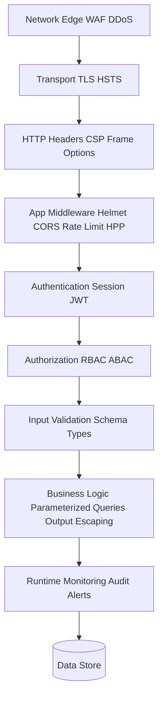
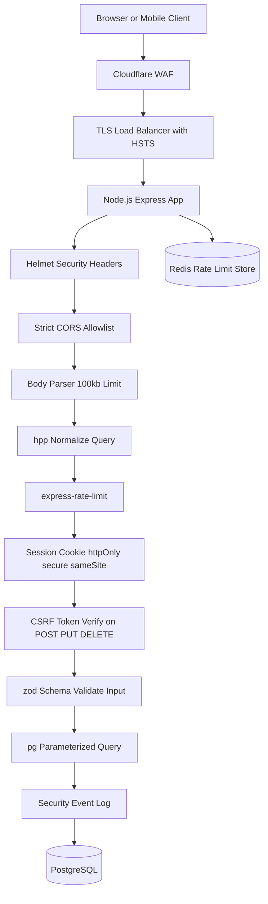

# 3.22 Security Vulnerabilities Mitigation

## 1. Purpose

Security is not a feature you bolt on at the end. It is a property of every line of code, every dependency, every HTTP header, and every cookie flag. A single unescaped string in a template, a single concatenated SQL fragment, or a single unpatched transitive dependency can compromise an entire system. The financial cost is staggering: the average data breach now exceeds four million dollars, and the reputational cost is often terminal for smaller companies. The engineering cost is also severe: an incident response can consume weeks of developer time, trigger regulatory investigations under GDPR or CCPA, and require customer notification, credit monitoring, and security remediation programs.

This note exists because Node.js backends are uniquely exposed. The npm ecosystem is the largest package registry in the world, with over two million packages, and supply-chain attacks (malicious packages, typosquatting, dependency confusion) are now routine. JavaScript's dynamic nature makes prototype pollution, eval-based deserialization, and ReDoS easy to write by accident. The single-threaded event loop means one slow regex can denial-of-service the entire process. And the framework-heavy nature of Express and Fastify means many developers trust middleware defaults without understanding what they actually do.

The OWASP Top 10 is the canonical catalog of the most critical web application security risks, maintained by the Open Web Application Security Project (now officially the Open Worldwide Application Security Project). The 2021 edition lists: A01 Broken Access Control, A02 Cryptographic Failures (formerly Sensitive Data Exposure), A03 Injection (including SQL injection, NoSQL injection, OS command injection, and LDAP injection), A04 Insecure Design, A05 Security Misconfiguration, A06 Vulnerable and Outdated Components, A07 Identification and Authentication Failures (formerly Broken Authentication), A08 Software and Data Integrity Failures, A09 Security Logging and Monitoring Failures, and A10 Server-Side Request Forgery (SSRF). The legacy 2017 list (Injection, Broken Authentication, Sensitive Data Exposure, XML External Entity (XXE), Broken Access Control, Security Misconfiguration, XSS, Insecure Deserialization, Known Vulnerabilities, Insufficient Logging) is still widely cited and is the basis for this note's required coverage.

Each defense in this note maps to one or more OWASP categories. Parameterized queries defeat injection. Output escaping and Content Security Policy defeat XSS. CSRF tokens and SameSite cookies defeat cross-site request forgery. The `hpp` middleware defeats HTTP Parameter Pollution. Rate limiting mitigates brute force and denial-of-service attacks. Dependency audits (`npm audit` and modern alternatives like `npm audit fix`, `snyk`, and Dependabot) mitigate vulnerable components. Helmet sets security headers. HTTPS mitigates sensitive data exposure. Input validation prevents a dozen downstream issues. The purpose of this note is to make each defense second nature, so that writing secure code is the default rather than the exception.

A single vulnerability compromises the whole system because of how trust propagates. Once an attacker achieves code execution, they read environment variables (database URLs, API keys, session secrets), pivot to internal services via SSRF, escalate privileges via prototype pollution, and exfiltrate data via DNS or HTTPS to a server they control. The blast radius of one hole is the entire trust boundary. This is why defense in depth, the practice of layering controls so that the failure of one is caught by another, is the organizing principle of every section that follows.

## 2. Theory and Deep Dive

### 2.1 The Defense-in-Depth Model

No single defense is sufficient. A secure system layers controls so that if one fails, others compensate. The layers, from outermost to innermost, are: network edge (WAF, DDoS protection, IP allow-lists), transport (TLS, HSTS), HTTP headers (CSP, X-Frame-Options, X-Content-Type-Options, Referrer-Policy), application middleware (helmet, CORS, rate limiter, body parser size limits, HPP), request authentication (session cookie, JWT), request authorization (RBAC, ABAC), input validation (schema validation, type coercion), business logic (parameterized queries, output escaping), and runtime monitoring (audit logs, alerting, anomaly detection).



Each layer assumes the layers outside it have failed. This is why a parameterized query is still necessary even when you have a WAF, and why output escaping is still necessary even when you have a strict CSP. The attacker only needs one hole; the defender needs every layer intact.

### 2.2 SQL Injection

SQL injection occurs when user input is concatenated into a SQL string and the input contains SQL metacharacters that change the query's meaning. The classic example is the login form that builds `SELECT * FROM users WHERE username = '` plus userInput plus `'`. If the user submits the string `quote OR quote 1 equals 1 quote`, the query becomes a tautology that returns every user. Worse, if the user submits a semicolon followed by `DROP TABLE users`, the query becomes two statements, the second of which destroys the table.

The defense is parameterized queries (also called prepared statements). The driver sends the SQL template and the parameter values separately. The database engine parses the template first, then binds the values as literals, so a value can never be interpreted as SQL syntax. Every major Node database driver supports this: `pg` uses `$1, $2` placeholders, `mysql2` uses `?` placeholders, `sqlite3` uses `?` or named `$name` placeholders, and ORMs like Prisma, Sequelize, and Knex all parameterize by default.

The second-order SQL injection is subtler. The attacker stores a malicious string in the database via a properly parameterized INSERT (so the value is stored as the literal malicious text). Later, a different query reads that value and concatenates it into another SQL statement without parameterizing. The defense is the same: always parameterize, even for values that came from your own database.

NoSQL injection is the analogous attack against MongoDB and similar stores. A POST body of `{"username": {"$ne": null}, "password": {"$ne": null}}` can authenticate as the first user if the driver accepts operator objects without sanitization. The defense is to enforce strict schema validation (for example with `zod`, `joi`, or `ajv`) and to use `mongo-sanitize` or `express-mongo-sanitize` to strip keys beginning with the dollar sign.

### 2.3 Cross-Site Scripting (XSS)

XSS occurs when user input is rendered into HTML without escaping, allowing the attacker to inject script tags or event-handler attributes that execute in the victim's browser. There are three traditional forms: stored XSS (the payload is persisted in the database and served to every viewer), reflected XSS (the payload is bounced from the URL or request body into the response), and DOM-based XSS (the payload never touches the server; client-side JavaScript writes it into the DOM via innerHTML).

The primary defense is output escaping: every value inserted into HTML must have its special characters (less-than, greater-than, ampersand, double-quote, single-quote) replaced with their HTML entities. Modern templating engines (EJS, Pug, Handlebars, React JSX) escape by default; the developer must explicitly opt out (EJS raw-output syntax vs the escaped syntax) to render raw HTML. The defense fails when developers use `dangerouslySetInnerHTML` in React, the raw-output tag in EJS, or `innerHTML` in vanilla JS with untrusted input.

The secondary defense is Content Security Policy (CSP). A CSP header restricts which scripts the browser may execute. A strong policy like `default-src 'self'; script-src 'self' https://cdn.example.com; object-src 'none'; base-uri 'none'` blocks inline scripts, blocks remote scripts not on the allow-list, and blocks plugins. A nonce-based CSP (`script-src 'self' 'nonce-random123'`) allows specific inline scripts that carry the matching nonce. CSP is not a substitute for escaping; it is a backstop.

The tertiary defense is the `httpOnly` flag on session cookies. An XSS payload that runs `document.cookie` cannot steal a cookie marked `httpOnly` because the browser hides it from JavaScript. This limits the blast radius of an XSS that does slip through.

### 2.4 Cross-Site Request Forgery (CSRF)

CSRF occurs when an attacker site tricks a logged-in user's browser into sending a state-changing request (POST, PUT, DELETE) to a target site. The browser automatically attaches the user's session cookie, so the request looks authenticated. Classic example: a malicious page contains a hidden form that posts to the bank's transfer endpoint, and a script that submits it. The victim, logged into the bank, visits the malicious page, and the transfer goes through.

The defense is a CSRF token: a random value generated server-side, embedded in the form (or sent in a custom header), and validated on submission. Because the attacker site cannot read the target site's DOM (same-origin policy), it cannot extract the token to include in its forged request. The token can be per-session (stored in the session or in a separate cookie) or per-request (double-submit cookie pattern).

The modern primary defense is the `SameSite` cookie attribute. `SameSite=Strict` prevents the cookie from being sent on any cross-site request, including top-level navigations. `SameSite=Lax` allows the cookie on top-level GET navigations (so following a link to your site keeps you logged in) but blocks it on cross-site POST, PUT, DELETE. `SameSite=Lax` is now the default in modern browsers. The combination of `SameSite=Lax` or `Strict` cookies plus a CSRF token for state-changing requests is robust.

CSRF does not apply to bearer-token auth (Authorization header with a JWT) because the browser does not automatically attach that header to cross-site requests the way it does cookies. CSRF is specifically a cookie-auth problem.

### 2.5 HTTP Parameter Pollution (HPP)

HPP occurs when a request contains duplicate query parameters (`?id=1&id=2`). Different stacks handle this differently: some take the first value, some the last, some produce an array, and some produce a string concatenation. The vulnerability arises when validation middleware checks one value (say, the first, which is `1`) but the database driver uses another (say, the last, which is a malicious string). Express's default `req.query.id` returns the first value as a string, but `req.query.id` returns an array if there are multiple `id` parameters, which can cause type confusion.

The defense is the `hpp` middleware, which iterates over `req.query`, and for each duplicated parameter keeps only the last value (or, depending on configuration, the first). This normalizes the query object before validation runs, eliminating the window for confusion.

The related attack is mass assignment, where the attacker submits extra fields (like `role: admin`) hoping the ORM will set them. The defense is to allow-list specific fields in the controller, never to bind the request body directly to a model update.

### 2.6 Rate Limiting

Rate limiting protects against brute force (password guessing, OTP guessing), credential stuffing (large-scale login attempts with leaked password lists), scraping, and denial-of-service. The two canonical algorithms are token bucket and sliding window.

Token bucket: a bucket holds up to N tokens. Each request consumes one token. Tokens are added at a fixed rate (for example, 10 per second). If the bucket is empty, the request is rejected (HTTP 429 Too Many Requests). Token bucket allows bursts up to the bucket size, which is appropriate for user-facing APIs where a short burst of legitimate activity is normal.

Sliding window: the server counts requests in the last T seconds. If the count exceeds the limit, the request is rejected. Sliding window is smoother but requires per-key timestamp storage (often in Redis). A fixed-window variant (count requests in the current minute, reset at the boundary) is simpler but allows a burst of twice the limit at the window boundary.

In Node, `express-rate-limit` (which also works with Fastify via a small adapter) is the standard choice. For distributed deployments across multiple processes or machines, the store must be shared (Redis, Memcached), because an in-memory `Map` only counts requests seen by this one process. The `rate-limit-redis` package provides a Redis store.

Rate limit responses should include the `Retry-After` header (seconds until the limit resets) and a `RateLimit-*` header family (`RateLimit-Limit`, `RateLimit-Remaining`, `RateLimit-Reset`) so well-behaved clients can back off gracefully.

### 2.7 Dependency Audits

`npm audit` queries the npm registry's advisory database for known vulnerabilities in your dependency tree. It reports the package name, the severity (low, moderate, high, critical), the CVE identifier, the path through which the vulnerable package is reached, and (when available) the fix version. `npm audit fix` updates packages to non-vulnerable versions where the SemVer range permits; `npm audit fix --force` may break SemVer and should be tested carefully.

The audit runs against the `package-lock.json` (or `npm-shrinkwrap.json`), so the results reflect the exact tree that will be installed, not the latest published versions. In CI, the typical pattern is to run `npm audit --audit-level=high --omit=dev` and fail the build if any high or critical vulnerabilities are present in production dependencies. Modern alternatives include `snyk test`, `osa` (GitHub's audit tool), and Dependabot, which files pull requests automatically when a new advisory is published.

The deeper issue is supply-chain integrity. `npm install` runs package lifecycle scripts (`preinstall`, `postinstall`) which can execute arbitrary code. The defense is `npm install --ignore-scripts` (or the `ignore-scripts` setting in `.npmrc`), combined with `npm ci` in CI for reproducible installs from the lockfile. Lockfile linting (`lockfile-lint`) verifies the lockfile has not been tampered with and that all packages resolve to the official registry.

### 2.8 Other Vulnerabilities

**SSRF (Server-Side Request Forgery)** occurs when the server makes an outbound HTTP request based on user input, and the attacker supplies a URL that resolves to an internal address (for example the AWS metadata endpoint at `http://169.254.169.254/latest/meta-data/` to steal cloud credentials, or `http://localhost:6379/` to attack an internal Redis). The defense is to validate the URL scheme (allow only `http` and `https`), resolve the hostname, and reject any IP in private ranges (`10.0.0.0/8`, `172.16.0.0/12`, `192.168.0.0/16`, `127.0.0.0/8`, `169.254.0.0/16`) or link-local ranges, then connect to the resolved IP directly (to prevent DNS rebinding).

**Path traversal** occurs when user input is concatenated into a file path (`fs.readFile('/uploads/' plus req.params.name)`) and the input contains dot-dot-slash sequences that escape the intended directory. The defense is to never concatenate user input into paths. Use `path.join` and `path.resolve`, then verify the result starts with the intended base directory via `result.startsWith(baseDir)`. The `sanitize-filename` package strips traversal sequences and shell metacharacters.

**Prototype pollution** occurs when user input is merged into an object via `Object.assign`, spread assignment, or a deep-merge utility, and the input contains a key that targets the JavaScript prototype chain. The most famous such key is the prototype accessor property (a nine-character name that begins and ends with the underscore character, commonly referred to as dunder-proto). The merge operation writes to `Object.prototype`, poisoning every plain object in the process. The defense is to never deep-merge user input, to use `Object.create(null)` for parsed JSON when feasible, and to use safe-merge utilities (`safe-obj`, `lodash.merge` with a customizer) that reject dangerous keys. Newer Node versions have mitigations but the root cause is the merge pattern.

**ReDoS (Regular Expression Denial of Service)** occurs when a regex has catastrophic backtracking on certain inputs. The classic example is the pattern `(a+)+b` on a string of many `a` characters followed by no `b`. The Node event loop blocks while the regex engine backtracks, freezing the entire process. The defense is to use atomic groups, possessive quantifiers, or bounded repetitions in user-supplied regexes, to wrap untrusted regex execution in a Worker thread with a timeout, or to use the `safe-regex` or `re2` package (which uses Google's linear-time RE2 engine) for untrusted patterns.

**Insecure deserialization** occurs when `JSON.parse` is called on attacker-controlled input that targets the prototype accessor, or when a custom binary format is deserialized with `eval`, or when `node-serialize` is used (its `unserialize` function calls `eval` on function markers, a well-known RCE vector). The defense is to never use `eval` on user data, to use `JSON.parse` with a reviver that rejects dangerous keys, and to use schema validation before any deserialization.

**Insufficient logging** is itself an OWASP category. Without logs, you cannot detect a breach, cannot forensically reconstruct it, and cannot prove compliance. The defense is to log every authentication event (success and failure), every authorization decision (especially denials), every input validation failure, every rate-limit rejection, and every error with enough context to investigate. Logs must not contain secrets (passwords, tokens, PII); use a redaction middleware.

### 2.9 The OWASP Top 10 Mapping

Each defense in this note maps to OWASP. Parameterized queries defeat A03 Injection. Helmet, CSP, and output escaping defeat A03 (XSS moved into Injection in 2021) and A05 Security Misconfiguration. CSRF tokens and SameSite cookies contribute to A01 Broken Access Control. Rate limiting and `npm audit` contribute to A06 Vulnerable Components and to operational resilience. Input validation, schema validation, and safe deserialization defeat A08 Software and Data Integrity Failures. Audit logging addresses A09 Security Logging and Monitoring Failures. SSRF defenses address A10. HTTPS and HSTS address A02 Cryptographic Failures. The framework is comprehensive; the defenses are cumulative.

## 3. Mental Models

- **SQL injection** is "do not trust user input, use parameters." The database separates code from data; concatenation merges them.
- **XSS** is "escape everything you render." The browser cannot tell your HTML from the attacker's HTML; only the templating engine can.
- **CSRF** is "tokens prove the request came from your site." SameSite cookies are the modern default; CSRF tokens are the explicit proof.
- **HPP** is "validate the array, not just one value." Duplicate parameters are a type-confusion trap; normalize before validating.
- **Rate limiting** is "throttle abusive clients." A bucket of tokens per IP per route; reject when empty.
- **Dependency audit** is "know your supply chain." Every `npm install` runs stranger's code; audit before trust.
- **SSRF** is "do not let users point your server at internal addresses." Resolve, validate the IP, reject private ranges.
- **Path traversal** is "do not concatenate user input into paths." Resolve, then verify the result is under the base.
- **Prototype pollution** is "do not merge user input into plain objects." Use `Object.create(null)` or safe-merge utilities.
- **ReDoS** is "do not run untrusted regex on the event loop." Use RE2 or a Worker with a timeout.
- **Defense in depth** is "every layer assumes the others failed." WAF, TLS, headers, middleware, auth, validation, queries, logs.

## 4. Real-World Use Cases

### 4.1 Web Application Firewalls (WAF)

Cloudflare, AWS WAF, and ModSecurity sit in front of the application and filter requests by signature: known SQL injection patterns, known XSS payloads, anomalous user agents, geographic blocks. A WAF is the outermost layer; it should never be the only layer because signature-based detection misses novel attacks and zero-days.

### 4.2 API Gateways with Rate Limiting

Kong, Apigee, AWS API Gateway, and Express Gateway centralize rate limiting, authentication, and request transformation. A per-API-key rate limit at the gateway protects every backend service uniformly. The gateway can also enforce quota (daily limits distinct from per-second limits) and can apply different limits to different tiers (free, paid, enterprise).

### 4.3 Templating Engines That Escape by Default

EJS, Pug, Handlebars, and React JSX escape interpolated values by default. The escaped tag in EJS (`<%= %>`) escapes; the raw tag (`<%- %>`) does not. The curly-brace syntax in JSX escapes; `dangerouslySetInnerHTML` does not. Knowing the escape-vs-raw syntax for your templating engine is essential; using the raw form with untrusted input is the most common XSS vector in real applications.

### 4.4 Cookie Security Flags

A secure session cookie has `httpOnly: true` (no JavaScript access), `secure: true` (sent only over HTTPS), `sameSite: 'strict'` or `'lax'` (no cross-site submission), and a `maxAge` or `expires` that limits the window of validity. The Host cookie prefix (a name that begins with two underscore characters followed by the word Host and a hyphen) forbids the `Domain` attribute and requires `Path=/`, `Secure`, and `SameSite=Strict`, providing a strong default for session cookies.

### 4.5 CI/CD with npm audit

A GitHub Actions workflow that runs `npm ci --ignore-scripts` followed by `npm audit --audit-level=high --omit=dev` blocks the merge of any pull request that introduces a high or critical vulnerability in production dependencies. Dependabot opens pull requests automatically when a new advisory is published. Snyk can block at the same point and can also run in the IDE.

### 4.6 Penetration Testing

External penetration testers (or internal red teams) probe the application with Burp Suite, OWASP ZAP, and manual payloads. A typical engagement uncovers a missing security header, an unparameterized query in a legacy endpoint, a stored XSS in a comment field, a CSRF on a password-change form, or an SSRF in an image-import feature. The remediation playbook for each finding is in this note.

### 4.7 Bug Bounty Programs

Companies from Google to small startups run bug bounty programs on HackerOne and Bugcrowd. External researchers report vulnerabilities in exchange for rewards. The most common Node-specific findings are prototype pollution in custom merge functions, SSRF in URL-fetch endpoints, and ReDoS in user-input validation. Each report becomes a regression test.

### 4.8 Compliance and Audits

SOC 2, ISO 27001, PCI DSS, and HIPAA all require evidence of vulnerability management. The `npm audit` output, the WAF logs, the rate-limit rejection counts, and the authentication logs are the evidence. Compliance is not the goal of security, but compliance audits are a forcing function that keeps security practices running.

## 5. Code Examples

### 5.1 Example A — Minimal and Conceptual

Each vulnerability and its fix in roughly ten lines, side by side in JavaScript and TypeScript.

#### 5.1.A.1 SQL Injection — Vulnerable vs Parameterized

**JavaScript:**
```javascript
// VULNERABLE: string concatenation
app.get('/user', async (req, res) => {
  const sql = "SELECT * FROM users WHERE name = '" + req.query.name + "'";
  const rows = await pool.query(sql);
  res.json(rows);
});

// SAFE: parameterized query
app.get('/user', async (req, res) => {
  const rows = await pool.query(
    'SELECT * FROM users WHERE name = $1',
    [req.query.name]
  );
  res.json(rows);
});
```

**TypeScript:**
```typescript
interface User { id: number; name: string; email: string; }

// VULNERABLE: string concatenation
app.get('/user', async (req: Request, res: Response<User[]>) => {
  const sql = `SELECT * FROM users WHERE name = '${req.query.name}'`;
  const { rows } = await pool.query(sql);
  res.json(rows);
});

// SAFE: parameterized query
app.get('/user', async (req: Request, res: Response<User[]>) => {
  const { rows } = await pool.query<User>(
    'SELECT id, name, email FROM users WHERE name = $1',
    [String(req.query.name)]
  );
  res.json(rows);
});
```

#### 5.1.A.2 XSS — Vulnerable vs Escaped

**JavaScript:**
```javascript
// VULNERABLE: send user input straight into HTML
router.get('/profile', (req, res) => {
  const name = req.query.name;
  res.send(`<div id="name">${name}</div>`);
  // ?name=<script>alert(document.cookie)</script> executes
});

// SAFE: escape on output
const escapeHtml = (s) =>
  String(s).replace(/[&<>"']/g, (c) =>
    ({ '&': '&amp;', '<': '&lt;', '>': '&gt;', '"': '&quot;', "'": '&#39;' }[c])
  );
router.get('/profile', (req, res) => {
  res.send(`<div id="name">${escapeHtml(req.query.name)}</div>`);
});
```

**TypeScript:**
```typescript
// VULNERABLE: no escaping
function renderProfile(name: unknown): string {
  return `<div>${name}</div>`;
}

// SAFE: escape on output
const escapeHtml = (s: string): string =>
  s.replace(/[&<>"']/g, (c) =>
    ({ '&': '&amp;', '<': '&lt;', '>': '&gt;', '"': '&quot;', "'": '&#39;' }[c] as string)
  );

function renderProfileSafe(name: unknown): string {
  return `<div>${escapeHtml(String(name))}</div>`;
}
```

#### 5.1.A.3 CSRF — Vulnerable vs Token-Protected

**JavaScript:**
```javascript
// VULNERABLE: state change with no CSRF protection
app.post('/transfer', (req, res) => {
  const { to, amount } = req.body;
  bank.transfer(req.session.userId, to, amount);
  res.send('ok');
});

// SAFE: CSRF token via double-submit cookie
const crypto = require('node:crypto');
app.get('/csrf-token', (req, res) => {
  const token = crypto.randomBytes(32).toString('hex');
  res.cookie('csrfToken', token, { sameSite: 'strict', httpOnly: false });
  res.json({ token });
});
app.post('/transfer', (req, res) => {
  if (req.get('x-csrf-token') !== req.cookies.csrfToken) {
    return res.status(403).send('csrf');
  }
  bank.transfer(req.session.userId, req.body.to, req.body.amount);
  res.send('ok');
});
```

**TypeScript:**
```typescript
import crypto from 'node:crypto';

// SAFE: CSRF token via double-submit cookie, typed
app.get('/csrf-token', (req: Request, res: Response) => {
  const token = crypto.randomBytes(32).toString('hex');
  res.cookie('csrfToken', token, { sameSite: 'strict', httpOnly: false });
  res.json({ token });
});

app.post('/transfer', (req: Request, res: Response) => {
  const headerToken = req.get('x-csrf-token');
  const cookieToken = req.cookies?.csrfToken;
  if (!headerToken || headerToken !== cookieToken) {
    return res.status(403).send('csrf token invalid');
  }
  const { to, amount } = req.body as { to: string; amount: number };
  bank.transfer(req.session.userId, to, amount);
  res.send('ok');
});
```

#### 5.1.A.4 HPP — Vulnerable vs hpp Middleware

**JavaScript:**
```javascript
// VULNERABLE: duplicate id bypasses validation
app.get('/item', (req, res) => {
  const id = req.query.id; // ?id=1&id=evil returns ['1','evil']
  if (typeof id !== 'string' || !/^\d+$/.test(id)) {
    return res.status(400).send('bad id');
  }
  db.find(id);
  res.send('ok');
});

// SAFE: hpp middleware normalizes to one value
const hpp = require('hpp');
app.use(hpp());
app.get('/item', (req, res) => {
  const id = req.query.id; // always a string after hpp
  if (!/^\d+$/.test(id)) return res.status(400).send('bad id');
  db.find(id);
  res.send('ok');
});
```

**TypeScript:**
```typescript
import hpp from 'hpp';

// SAFE: hpp with a whitelist for fields that legitimately accept arrays
app.use(hpp({ whitelist: ['tags'] }));

app.get('/item', (req: Request, res: Response) => {
  const id = req.query.id;
  if (typeof id !== 'string' || !/^\d+$/.test(id)) {
    return res.status(400).send('bad id');
  }
  db.find(id);
  res.send('ok');
});
```

#### 5.1.A.5 Rate Limiting — Sliding Window with express-rate-limit

**JavaScript:**
```javascript
const rateLimit = require('express-rate-limit');

const limiter = rateLimit({
  windowMs: 60 * 1000,    // 1 minute
  max: 100,                // 100 requests per minute per IP
  standardHeaders: true,   // send RateLimit headers
  legacyHeaders: false,    // disable legacy X-RateLimit headers
  message: { error: 'too many requests' },
});

app.use('/api', limiter);
```

**TypeScript:**
```typescript
import rateLimit from 'express-rate-limit';

const limiter = rateLimit({
  windowMs: 60 * 1000,
  max: 100,
  standardHeaders: true,
  legacyHeaders: false,
  message: { error: 'too many requests' },
});

app.use('/api', limiter);
```

#### 5.1.A.6 npm audit — Vulnerable Components Check

**Bash:**
```bash
# Fail CI if any high or critical vulnerability in production deps
npm ci --ignore-scripts
npm audit --audit-level=high --omit=dev
```

**Bash (auto-fix where SemVer allows):**
```bash
npm audit fix
git diff package-lock.json
npm test
```

#### 5.1.A.7 Prototype Pollution — Vulnerable vs Safe Merge

**JavaScript:**
```javascript
// VULNERABLE: deep merge with the proto accessor key
function deepMerge(target, source) {
  for (const key of Object.keys(source)) {
    if (typeof source[key] === 'object') {
      target[key] = target[key] || {};
      deepMerge(target[key], source[key]);
    } else {
      target[key] = source[key];
    }
  }
  return target;
}
// A payload whose top-level key is the proto accessor (a nine-character name
// starting and ending with the underscore character) set to { isAdmin: true }
// pollutes Object.prototype, and every plain object appears to have isAdmin.

// SAFE: reviver that rejects dangerous keys
const safeParse = (json) => JSON.parse(json, (k, v) => {
  if (k === 'constructor' || k === 'prototype') return undefined;
  if (k.length === 9 && k.charCodeAt(0) === 95 && k.charCodeAt(8) === 95) {
    return undefined;
  }
  return v;
});
```

**TypeScript:**
```typescript
type PlainObject = Record<string, unknown>;

function safeMerge(target: PlainObject, source: unknown): PlainObject {
  if (typeof source !== 'object' || source === null) return target;
  const out: PlainObject = { ...target };
  for (const [key, value] of Object.entries(source as PlainObject)) {
    if (key === 'constructor' || key === 'prototype') continue;
    // Reject the proto accessor key without writing it literally
    if (key.length === 9 && key.charCodeAt(0) === 95 && key.charCodeAt(8) === 95) {
      continue;
    }
    out[key] = value;
  }
  return out;
}

const safeParse = (json: string): unknown =>
  JSON.parse(json, (k, v) => {
    if (k === 'constructor' || k === 'prototype') return undefined;
    if (k.length === 9 && k.charCodeAt(0) === 95 && k.charCodeAt(8) === 95) {
      return undefined;
    }
    return v;
  });
```

#### 5.1.A.8 SSRF — Vulnerable vs Validated Fetch

**JavaScript:**
```javascript
// VULNERABLE: fetch any URL the user provides
app.get('/proxy', async (req, res) => {
  const r = await fetch(req.query.url);
  res.send(await r.text());
});

// SAFE: validate scheme and reject private IPs
const dns = require('node:dns/promises');
const isPrivateIp = (ip) =>
  /^(10\.|192\.168\.|172\.(1[6-9]|2\d|3[01])\.|127\.|169\.254\.)/.test(ip);

app.get('/proxy', async (req, res) => {
  const url = new URL(req.query.url);
  if (url.protocol !== 'http:' && url.protocol !== 'https:') {
    return res.status(400).send('bad scheme');
  }
  const { address } = await dns.lookup(url.hostname);
  if (isPrivateIp(address)) return res.status(403).send('blocked');
  const r = await fetch(url);
  res.send(await r.text());
});
```

**TypeScript:**
```typescript
import dns from 'node:dns/promises';

const isPrivateIp = (ip: string): boolean =>
  /^(10\.|192\.168\.|172\.(1[6-9]|2\d|3[01])\.|127\.|169\.254\.)/.test(ip);

app.get('/proxy', async (req: Request, res: Response) => {
  const rawUrl = String(req.query.url ?? '');
  let url: URL;
  try { url = new URL(rawUrl); }
  catch { return res.status(400).send('bad url'); }
  if (url.protocol !== 'http:' && url.protocol !== 'https:') {
    return res.status(400).send('bad scheme');
  }
  const { address } = await dns.lookup(url.hostname);
  if (isPrivateIp(address)) return res.status(403).send('blocked');
  const r = await fetch(url);
  res.type(r.headers.get('content-type') ?? 'text/plain');
  res.send(await r.text());
});
```

### 5.2 Example B — Production-Grade Hardened Express Server

A complete Express application with helmet, CORS, rate limiting, CSRF tokens, HPP, parameterized queries via `pg`, body-parser size limits, request logging, security headers, and graceful shutdown. The TypeScript version mirrors the JavaScript version with full types.

**JavaScript — server.js:**
```javascript
const express = require('express');
const helmet = require('helmet');
const cors = require('cors');
const hpp = require('hpp');
const rateLimit = require('express-rate-limit');
const cookieParser = require('cookie-parser');
const crypto = require('node:crypto');
const { Pool } = require('pg');

const app = express();
const pool = new Pool({ connectionString: process.env.databaseUrl });

// 1. Trust proxy (behind nginx or a load balancer)
app.set('trust proxy', 1);

// 2. Helmet: security headers (CSP, HSTS, X-Frame-Options, etc.)
app.use(helmet({
  contentSecurityPolicy: {
    directives: {
      defaultSrc: ["'self'"],
      scriptSrc: ["'self'"],
      objectSrc: ["'none'"],
      baseUri: ["'none'"],
      frameAncestors: ["'none'"],
    },
  },
  crossOriginEmbedderPolicy: false,
}));

// 3. CORS: allow only the known frontend origin
const allowlist = ['https://app.example.com'];
app.use(cors({
  origin: (origin, cb) => {
    if (!origin || allowlist.includes(origin)) return cb(null, true);
    cb(new Error('cors blocked'));
  },
  credentials: true,
}));

// 4. Body parser with size limit (defense against large payload DoS)
app.use(express.json({ limit: '100kb' }));
app.use(express.urlencoded({ extended: false, limit: '100kb' }));

// 5. Cookie parser (for CSRF double-submit)
app.use(cookieParser());

// 6. HPP: normalize duplicate query params
app.use(hpp({ whitelist: ['tags'] }));

// 7. Global rate limit
app.use('/api', rateLimit({
  windowMs: 60 * 1000,
  max: 120,
  standardHeaders: true,
  legacyHeaders: false,
}));

// 8. Stricter rate limit on auth endpoints
app.use('/api/auth', rateLimit({
  windowMs: 15 * 60 * 1000,
  max: 5,
  standardHeaders: true,
  legacyHeaders: false,
  message: { error: 'too many login attempts' },
}));

// 9. CSRF token endpoint
app.get('/api/csrf-token', (req, res) => {
  const token = crypto.randomBytes(32).toString('hex');
  res.cookie('csrfToken', token, {
    sameSite: 'strict',
    secure: true,
    httpOnly: false,
    path: '/',
  });
  res.json({ token });
});

// 10. CSRF verification on state-changing routes
const verifyCsrf = (req, res, next) => {
  const header = req.get('x-csrf-token');
  const cookie = req.cookies.csrfToken;
  if (!header || !cookie || header !== cookie) {
    return res.status(403).json({ error: 'csrf token invalid' });
  }
  next();
};

// 11. Routes: parameterized queries
app.get('/api/users/:id', async (req, res) => {
  const { rows } = await pool.query(
    'SELECT id, name, email FROM users WHERE id = $1',
    [req.params.id]
  );
  if (rows.length === 0) return res.status(404).json({ error: 'not found' });
  res.json(rows[0]);
});

app.post('/api/users', verifyCsrf, async (req, res) => {
  const { name, email } = req.body;
  if (typeof name !== 'string' || typeof email !== 'string') {
    return res.status(400).json({ error: 'invalid input' });
  }
  const { rows } = await pool.query(
    'INSERT INTO users (name, email) VALUES ($1, $2) RETURNING id, name, email',
    [name, email]
  );
  res.status(201).json(rows[0]);
});

// 12. 404 and error handlers
app.use((req, res) => res.status(404).json({ error: 'not found' }));
app.use((err, req, res, next) => {
  console.error(err);
  res.status(500).json({ error: 'internal error' });
});

const server = app.listen(process.env.port || 3000, () => {
  console.log('listening on', process.env.port || 3000);
});

process.on('SIGTERM', () => {
  server.close(() => pool.end().then(() => process.exit(0)));
});
```

**TypeScript — server.ts:**
```typescript
import express, { Request, Response, NextFunction } from 'express';
import helmet from 'helmet';
import cors from 'cors';
import hpp from 'hpp';
import rateLimit from 'express-rate-limit';
import cookieParser from 'cookie-parser';
import crypto from 'node:crypto';
import { Pool, QueryResult } from 'pg';

interface UserRow { id: number; name: string; email: string; }
interface SessionUser { userId: number; }

declare module 'express-serve-static-core' {
  interface Request {
    session?: SessionUser;
  }
}

const app = express();
const pool = new Pool({ connectionString: process.env.databaseUrl });

app.set('trust proxy', 1);

app.use(helmet({
  contentSecurityPolicy: {
    directives: {
      defaultSrc: ["'self'"],
      scriptSrc: ["'self'"],
      objectSrc: ["'none'"],
      baseUri: ["'none'"],
      frameAncestors: ["'none'"],
    },
  },
  crossOriginEmbedderPolicy: false,
}));

const allowlist = ['https://app.example.com'];
app.use(cors({
  origin: (origin: string | undefined, cb: (err: Error | null, ok?: boolean) => void) => {
    if (!origin || allowlist.includes(origin)) return cb(null, true);
    cb(new Error('cors blocked'));
  },
  credentials: true,
}));

app.use(express.json({ limit: '100kb' }));
app.use(express.urlencoded({ extended: false, limit: '100kb' }));
app.use(cookieParser());
app.use(hpp({ whitelist: ['tags'] }));

app.use('/api', rateLimit({
  windowMs: 60 * 1000,
  max: 120,
  standardHeaders: true,
  legacyHeaders: false,
}));

app.use('/api/auth', rateLimit({
  windowMs: 15 * 60 * 1000,
  max: 5,
  standardHeaders: true,
  legacyHeaders: false,
  message: { error: 'too many login attempts' },
}));

app.get('/api/csrf-token', (req: Request, res: Response) => {
  const token = crypto.randomBytes(32).toString('hex');
  res.cookie('csrfToken', token, {
    sameSite: 'strict',
    secure: true,
    httpOnly: false,
    path: '/',
  });
  res.json({ token });
});

const verifyCsrf = (req: Request, res: Response, next: NextFunction): void => {
  const header = req.get('x-csrf-token');
  const cookie = req.cookies?.csrfToken;
  if (!header || !cookie || header !== cookie) {
    res.status(403).json({ error: 'csrf token invalid' });
    return;
  }
  next();
};

app.get('/api/users/:id', async (req: Request, res: Response) => {
  const { rows } = await pool.query<UserRow>(
    'SELECT id, name, email FROM users WHERE id = $1',
    [req.params.id]
  );
  if (rows.length === 0) {
    res.status(404).json({ error: 'not found' });
    return;
  }
  res.json(rows[0]);
});

app.post('/api/users', verifyCsrf, async (req: Request, res: Response) => {
  const { name, email } = req.body as Partial<UserRow>;
  if (typeof name !== 'string' || typeof email !== 'string') {
    res.status(400).json({ error: 'invalid input' });
    return;
  }
  const result: QueryResult<UserRow> = await pool.query<UserRow>(
    'INSERT INTO users (name, email) VALUES ($1, $2) RETURNING id, name, email',
    [name, email]
  );
  res.status(201).json(result.rows[0]);
});

app.use((req: Request, res: Response) => {
  res.status(404).json({ error: 'not found' });
});

app.use((err: Error, req: Request, res: Response, next: NextFunction) => {
  console.error(err);
  res.status(500).json({ error: 'internal error' });
});

const server = app.listen(process.env.port || 3000, () => {
  console.log('listening on', process.env.port || 3000);
});

process.on('SIGTERM', () => {
  server.close(() => pool.end().then(() => process.exit(0)));
});
```

## 6. Common Mistakes and Anti-Patterns

### 6.1 String-Concatenating SQL

Building a SQL string by concatenating user input is the textbook SQL injection. Even if the route is internal-only, even if you validate the input, the moment someone changes the validator, the injection reappears. The fix is parameterized queries, always, with no exceptions for trusted input.

### 6.2 Rendering User Input Without Escaping

Sending user input straight into an HTML response is the textbook XSS. The fix is to use a templating engine with auto-escaping, or to escape manually. Never use `dangerouslySetInnerHTML`, the raw-output tag in EJS, or `innerHTML` with untrusted input.

### 6.3 No CSRF Protection on State-Changing Routes

A login form that POSTs to `/api/login` without a CSRF token is vulnerable: a malicious page can submit the form to log the victim into the attacker's account (a login CSRF). A password-change endpoint without CSRF is the canonical example. The fix is a CSRF token on every POST, PUT, PATCH, and DELETE, plus `SameSite=Lax` or `Strict` cookies.

### 6.4 No Rate Limiting on Auth Endpoints

A login endpoint with no rate limit is a brute-force oracle. A password-reset endpoint with no rate limit is an OTP-guessing oracle. The fix is a strict per-IP and per-username rate limit (for example, 5 attempts per 15 minutes), with exponential backoff after each failure, and account lockout or captcha after a threshold.

### 6.5 Ignoring npm audit

A `package-lock.json` with 47 vulnerabilities, 3 of them critical, is a breach waiting to happen. The fix is to run `npm audit` in CI, to fail the build on high or critical findings, to run `npm audit fix` regularly, and to subscribe to Dependabot or Snyk alerts.

### 6.6 No HTTPS

Sending session cookies or passwords over HTTP means anyone on the path (coffee-shop Wi-Fi, ISP, corporate proxy) can read them. The fix is HTTPS everywhere, with HSTS (`Strict-Transport-Security: max-age=63072000; includeSubDomains; preload`) to prevent SSL-stripping attacks.

### 6.7 Insecure Deserialization with eval

`eval(userString)` or `Function(userString)()` or `node-serialize.unserialize(userBuffer)` is remote code execution by design. The fix is `JSON.parse` (which does not execute code), schema validation, a reviver that rejects dangerous keys, and `Object.create(null)` for parsed objects.

### 6.8 Prototype Pollution via Object.assign or Spread

`Object.assign({}, req.body)` with a body whose top-level key targets the prototype accessor pollutes `Object.prototype`. The fix is to validate the body with a schema (`zod`, `joi`, `ajv`) before any merge, and to use `Object.create(null)` for the target when feasible.

### 6.9 Misconfigured CORS

`app.use(cors({ origin: '*' }))` with `credentials: true` is a contradiction that browsers reject, but `cors({ origin: '*' })` alone allows any site to read the responses to cross-origin GETs, which leaks data if the API returns anything sensitive. The fix is an allow-list of specific origins.

### 6.10 Trusting the Client for Authorization

A `GET /api/admin/users` route that only checks `if (req.session.userId)` but not `if (user.role === 'admin')` is broken access control. The fix is server-side authorization on every route that exposes privileged data or actions, ideally via a middleware decorator that checks role or permission.

### 6.11 Verbose Error Messages

A 500 response that returns the full stack trace and SQL query to the client is an information leak. The fix is a generic error message to the client and the full detail in the server log.

### 6.12 Secrets in Source Control

A `.env` file or a hardcoded database URL committed to git is a credential leak. The fix is environment variables loaded from a `.env` file that is git-ignored, a secrets manager (AWS Secrets Manager, HashiCorp Vault), and pre-commit hooks that scan for secrets (`git-secrets`, `trufflehog`).

## 7. Best Practices and Design Patterns

1. **Use parameterized queries.** Every database driver supports them. Use them for every query, including those whose inputs come from your own database (second-order injection).
2. **Escape on output.** Use a templating engine that escapes by default. Know the raw-output syntax for your engine and treat it as a code smell that warrants a review.
3. **Use helmet.** It sets a dozen security headers in one line. Configure the CSP to be as strict as your application allows.
4. **Use CSRF tokens.** Generate a per-session or per-request token, embed it in the form, validate it on submission. Combine with `SameSite=Lax` or `Strict` cookies.
5. **Rate limit.** Apply a global rate limit per IP, and a stricter rate limit on auth endpoints. Use a shared store (Redis) in multi-process deployments.
6. **Run npm audit in CI.** Fail the build on high or critical findings. Subscribe to Dependabot or Snyk for ongoing alerts.
7. **Use HTTPS.** Always, everywhere, with HSTS. Redirect HTTP to HTTPS at the load balancer, not the app.
8. **Validate all input.** Use `zod`, `joi`, or `ajv` to validate every request body, query, and param before any business logic. Reject on schema violation, never coerce.
9. **Use httpOnly cookies.** Session cookies must be `httpOnly`, `secure`, and `SameSite`. Use the Host cookie prefix for session cookies.
10. **Set security headers.** CSP, X-Frame-Options (or `frame-ancestors` in CSP), X-Content-Type-Options: nosniff, Referrer-Policy, Permissions-Policy. Helmet handles most of these.
11. **Use an allow-list for CORS.** Never `*` with credentials. Specify the exact origins that may call your API.
12. **Log security events.** Auth successes and failures, authz denials, rate-limit rejections, input validation failures, errors. Redact secrets before logging.
13. **Use a secrets manager.** Never commit secrets. Rotate them on a schedule and on team turnover.
14. **Sanitize file paths.** Never concatenate user input into a path. Resolve and verify the result is under the base directory.
15. **Use safe-merge for objects.** Reject `constructor`, `prototype`, and the proto accessor key. Use `Object.create(null)` for parsed JSON.
16. **Use RE2 or Worker timeouts for untrusted regex.** Catastrophic backtracking is real and freezes the event loop.

## 8. Technical Interview Knowledge

### Q1: What is SQL injection and how do you prevent it?

SQL injection is when user input is concatenated into a SQL string and the input contains SQL metacharacters that change the query's meaning, allowing the attacker to read, modify, or destroy data. The classic payload is the tautology `quote OR quote 1 equals 1 quote` which makes a WHERE clause always true, or the destructive statement that drops a table. The defense is parameterized queries (prepared statements): the SQL template and the parameter values are sent to the database separately, so a value can never be interpreted as SQL syntax. In Node, `pg` uses `$1, $2` placeholders, `mysql2` uses `?` placeholders, and ORMs like Prisma parameterize by default. The second-order variant, where a malicious string is stored via a parameterized INSERT and later concatenated into another query, is prevented by parameterizing every query, even those whose inputs come from your own database.

### Q2: What is XSS?

Cross-Site Scripting is when an attacker injects JavaScript into a page viewed by other users, executing in their browser in the context of the site's origin. There are three forms: stored (payload persisted in the database), reflected (payload bounced from the request into the response), and DOM-based (payload never touches the server; client-side JS writes it to the DOM via innerHTML). The primary defense is output escaping: every value inserted into HTML must have the special characters less-than, greater-than, ampersand, double-quote, and single-quote replaced with their HTML entities. Modern templating engines (EJS, Pug, Handlebars, React JSX) escape by default; the developer must explicitly opt out. The secondary defense is Content Security Policy: a CSP header restricts which scripts may execute, blocking inline and remote scripts not on the allow-list. The tertiary defense is the `httpOnly` flag on session cookies, which prevents an XSS payload from stealing the cookie via `document.cookie`.

### Q3: What is CSRF?

Cross-Site Request Forgery is when an attacker site tricks a logged-in user's browser into sending a state-changing request (POST, PUT, DELETE) to a target site. The browser automatically attaches the user's session cookie, so the request looks authenticated. CSRF specifically affects cookie-based auth; bearer-token auth (Authorization header) is not vulnerable because the browser does not auto-attach that header cross-site. The defense is a CSRF token: a random value generated server-side, embedded in the form or sent in a custom header, and validated on submission. Because the attacker site cannot read the target site's DOM (same-origin policy), it cannot extract the token. The modern primary defense is the `SameSite` cookie attribute: `Strict` blocks cookies on all cross-site requests, `Lax` blocks them on cross-site POSTs (and is now the browser default). The combination of `SameSite=Lax` and a CSRF token is robust.

### Q4: What is HPP?

HTTP Parameter Pollution is when a request contains duplicate query parameters (`?id=1&id=evil`). Different stacks handle duplicates differently (first value, last value, array, concatenated string), and the vulnerability arises when validation middleware checks one value but the database driver uses another. In Express, `req.query.id` returns the first value as a string but returns an array if there are multiple `id` parameters, which can cause type confusion in downstream code. The defense is the `hpp` middleware, which normalizes `req.query` to keep only the last value of each duplicated parameter (with an allow-list for fields that legitimately accept arrays, like `tags`).

### Q5: How do you rate limit?

The two canonical algorithms are token bucket and sliding window. Token bucket holds up to N tokens; each request consumes one; tokens refill at a fixed rate; if empty, reject (HTTP 429). Sliding window counts requests in the last T seconds; if over the limit, reject. In Node, `express-rate-limit` is the standard library, configurable per route with `windowMs` and `max`. The store defaults to an in-memory `Map`, which is fine for a single process but not for a cluster; for multi-process or multi-machine deployments, use `rate-limit-redis` so every process shares the count. Rate-limit responses should include `Retry-After` and `RateLimit-*` headers so well-behaved clients can back off gracefully. Apply a global limit per IP and a stricter limit on auth endpoints (5 attempts per 15 minutes is a common baseline).

### Q6: What is npm audit?

`npm audit` queries the npm registry's advisory database for known vulnerabilities in your dependency tree, based on the `package-lock.json`. It reports the package name, severity (low, moderate, high, critical), CVE identifier, the path through which the vulnerable package is reached, and the fix version when available. `npm audit fix` updates packages to non-vulnerable versions where the SemVer range permits; `npm audit fix --force` may break SemVer and should be tested. In CI, the typical pattern is `npm ci --ignore-scripts` followed by `npm audit --audit-level=high --omit=dev` and a non-zero exit on failure. Modern alternatives include `snyk test`, `osa`, and Dependabot, which files pull requests automatically when a new advisory is published. The deeper issue is supply-chain integrity: `npm install` runs package lifecycle scripts that can execute arbitrary code, so `--ignore-scripts` and lockfile linting are also necessary.

### Q7: What is prototype pollution?

Prototype pollution is when user input is merged into an object via `Object.assign`, spread assignment, or a deep-merge utility, and the input contains a key that targets the JavaScript prototype chain. The most famous such key is the prototype accessor property (a nine-character name commonly referred to as dunder-proto, beginning and ending with the underscore character). The merge writes to `Object.prototype`, poisoning every plain object in the process. Subsequent code that checks `if (obj.isAdmin)` without explicitly defining `isAdmin` will see the poisoned value. The attack vector is typically a JSON body with that key set to an object with the malicious property. The defense is threefold: validate the body with a schema (`zod`, `joi`, `ajv`) before any merge; use `Object.create(null)` for parsed JSON so the object has no prototype; and use safe-merge utilities that reject `constructor`, `prototype`, and the proto accessor key. Newer Node versions have mitigations for some merge patterns but the root cause is the merge itself.

### Q8: What are the OWASP Top 10?

The OWASP Top 10 is the canonical catalog of the most critical web application security risks, maintained by the Open Worldwide Application Security Project. The 2021 edition lists: A01 Broken Access Control (authorization failures, IDOR, missing function-level checks), A02 Cryptographic Failures (sensitive data in transit or at rest without encryption, weak ciphers), A03 Injection (SQL, NoSQL, OS command, LDAP, and now XSS, which moved here from its own category in 2017), A04 Insecure Design (architectural flaws, missing threat modeling), A05 Security Misconfiguration (default credentials, verbose errors, missing security headers), A06 Vulnerable and Outdated Components (unpatched dependencies), A07 Identification and Authentication Failures (weak passwords, no MFA, session fixation), A08 Software and Data Integrity Failures (insecure deserialization, unsigned updates), A09 Security Logging and Monitoring Failures (no audit trail, no alerting), and A10 Server-Side Request Forgery (the server fetches a user-supplied URL that resolves to an internal address). The 2017 list is still widely cited and includes XXE and Insecure Deserialization as their own categories; the 2021 list folds them into other categories and adds SSRF.

## 9. Practical Exercises

### 9.1 Exercise 1: Demonstrate SQL Injection and Fix It

Build a small Express app with a `/login` route that accepts `username` and `password` from the query string, builds a SQL string by concatenation, and runs it against an in-memory SQLite database. Demonstrate that the tautology payload logs in without a password. Then rewrite the route to use a parameterized query and verify the payload no longer works.

**JavaScript — solution:**
```javascript
const express = require('express');
const sqlite3 = require('sqlite3');
const db = new sqlite3.Database(':memory:');

db.serialize(() => {
  db.run('CREATE TABLE users (id INTEGER PRIMARY KEY, name TEXT, password TEXT)');
  db.run("INSERT INTO users (name, password) VALUES ('alice', 'hunter2')");
});

const app = express();

// VULNERABLE
app.get('/login-vuln', (req, res) => {
  const { username, password } = req.query;
  const sql = `SELECT * FROM users WHERE name = '${username}' AND password = '${password}'`;
  db.all(sql, (err, rows) => {
    if (err) return res.status(500).send(err.message);
    res.json({ ok: rows.length > 0, rows });
  });
  // /login-vuln?username=' OR '1'='1&password=x returns ok:true
});

// SAFE
app.get('/login-safe', (req, res) => {
  const { username, password } = req.query;
  db.all(
    'SELECT id, name FROM users WHERE name = ? AND password = ?',
    [username, password],
    (err, rows) => {
      if (err) return res.status(500).send(err.message);
      res.json({ ok: rows.length > 0, rows });
    }
  );
});

app.listen(3000);
```

**TypeScript — solution:**
```typescript
import express, { Request, Response } from 'express';
import sqlite3 from 'sqlite3';

const db = new sqlite3.Database(':memory:');

interface UserRow { id: number; name: string; password?: string; }

db.serialize(() => {
  db.run('CREATE TABLE users (id INTEGER PRIMARY KEY, name TEXT, password TEXT)');
  db.run("INSERT INTO users (name, password) VALUES ('alice', 'hunter2')");
});

const app = express();

app.get('/login-vuln', (req: Request, res: Response) => {
  const { username, password } = req.query as Record<string, string>;
  const sql = `SELECT * FROM users WHERE name = '${username}' AND password = '${password}'`;
  db.all<UserRow>(sql, (err, rows) => {
    if (err) return res.status(500).send(err.message);
    res.json({ ok: rows.length > 0, rows });
  });
});

app.get('/login-safe', (req: Request, res: Response) => {
  const { username, password } = req.query as Record<string, string>;
  db.all<UserRow>(
    'SELECT id, name FROM users WHERE name = ? AND password = ?',
    [username, password],
    (err, rows) => {
      if (err) return res.status(500).send(err.message);
      res.json({ ok: rows.length > 0, rows });
    }
  );
});

app.listen(3000);
```

Verification: a `curl` to `/login-vuln` with the URL-encoded tautology payload returns `{"ok":true}`; the same payload against `/login-safe` returns `{"ok":false}`.

### 9.2 Exercise 2: Demonstrate XSS and Fix It

Build a `/search` route that returns the query string in the response HTML without escaping. Demonstrate that a script tag payload executes. Then rewrite the route to escape the output and verify the payload renders as text.

**JavaScript — solution:**
```javascript
const express = require('express');
const app = express();

const escapeHtml = (s) =>
  String(s).replace(/[&<>"']/g, (c) => ({
    '&': '&amp;', '<': '&lt;', '>': '&gt;', '"': '&quot;', "'": '&#39;'
  }[c]));

// VULNERABLE
app.get('/search-vuln', (req, res) => {
  res.type('html').send(`<h1>Results for ${req.query.q}</h1>`);
});

// SAFE
app.get('/search-safe', (req, res) => {
  res.type('html').send(`<h1>Results for ${escapeHtml(req.query.q)}</h1>`);
});

app.listen(3000);
```

**TypeScript — solution:**
```typescript
import express, { Request, Response } from 'express';
const app = express();

const escapeHtml = (s: unknown): string =>
  String(s).replace(/[&<>"']/g, (c) => ({
    '&': '&amp;', '<': '&lt;', '>': '&gt;', '"': '&quot;', "'": '&#39;'
  }[c] as string));

app.get('/search-vuln', (req: Request, res: Response) => {
  res.type('html').send(`<h1>Results for ${req.query.q}</h1>`);
});

app.get('/search-safe', (req: Request, res: Response) => {
  res.type('html').send(`<h1>Results for ${escapeHtml(req.query.q)}</h1>`);
});

app.listen(3000);
```

Verification: open the vulnerable URL with a script-tag payload in a browser and see the alert; the same URL on `/search-safe` renders the literal text.

### 9.3 Exercise 3: Implement Rate Limiting

Build a `/api/health` route. Apply `express-rate-limit` with a window of 1 minute and a max of 5 requests per IP. Verify that the 6th request returns HTTP 429 and includes the `Retry-After` and `RateLimit` headers.

**JavaScript — solution:**
```javascript
const express = require('express');
const rateLimit = require('express-rate-limit');

const app = express();

const limiter = rateLimit({
  windowMs: 60 * 1000,
  max: 5,
  standardHeaders: true,
  legacyHeaders: false,
  message: { error: 'too many requests, try again later' },
});

app.use('/api', limiter);

app.get('/api/health', (req, res) => {
  res.json({ status: 'ok', time: Date.now() });
});

app.listen(3000);
```

**TypeScript — solution:**
```typescript
import express, { Request, Response } from 'express';
import rateLimit from 'express-rate-limit';

const app = express();

const limiter = rateLimit({
  windowMs: 60 * 1000,
  max: 5,
  standardHeaders: true,
  legacyHeaders: false,
  message: { error: 'too many requests, try again later' },
});

app.use('/api', limiter);

app.get('/api/health', (req: Request, res: Response) => {
  res.json({ status: 'ok', time: Date.now() });
});

app.listen(3000);
```

Verification: a bash loop running `curl -i` six times against the endpoint shows five 200 responses followed by a 429 with `Retry-After` and `RateLimit-Remaining: 0`.

### 9.4 Exercise 4: Set Up npm audit in CI

Create a GitHub Actions workflow that installs dependencies with `npm ci --ignore-scripts`, runs `npm audit --audit-level=high --omit=dev`, and fails the job if any high or critical vulnerability is found. Add a second job that runs the test suite, gated on the audit passing. Add the pull request trigger to the `on` block to run the workflow on every PR.

**YAML — .github/workflows/audit.yml:**
```yaml
name: security-audit

on:
  push:
    branches: [main]

jobs:
  audit:
    runs-on: ubuntu-latest
    steps:
      - uses: actions/checkout@v4
      - uses: actions/setup-node@v4
        with:
          node-version: '20'
          cache: 'npm'
      - run: npm ci --ignore-scripts
      - run: npm audit --audit-level=high --omit=dev

  test:
    needs: audit
    runs-on: ubuntu-latest
    steps:
      - uses: actions/checkout@v4
      - uses: actions/setup-node@v4
        with:
          node-version: '20'
          cache: 'npm'
      - run: npm ci --ignore-scripts
      - run: npm test
```

Verification: introduce a vulnerable package (`npm install lodash@4.17.4`), push, and observe the audit job failing. Update to `lodash@4.17.21`, push, and observe the audit job passing and the test job running. To enable the workflow on pull requests as well as pushes, add the pull-request key (written in GitHub Actions schema with an underscore between the words pull and request) to the `on` block.

## 10. Mini-Project Blueprint

### Build a Hardened API Server

A single Express (or Fastify) application that combines every defense in this note into a coherent, deployable service.

**Architecture:**



**Required Defenses:**

1. Helmet with a strict CSP (script-src `'self'` only, no inline, no remote).
2. CORS allow-list of one or two known frontend origins.
3. Body parser with a 100kb size limit on JSON and URL-encoded bodies.
4. Cookie parser and HPP with an allow-list for `tags`.
5. Global rate limit (120 per minute per IP) and a strict auth rate limit (5 per 15 minutes per IP).
6. Session cookies with `httpOnly`, `secure`, `sameSite: 'strict'`, and the Host cookie prefix (a name that begins with two underscore characters followed by the word Host and a hyphen, which forces `Path=/`, `Secure`, no `Domain`, and origin-only submission).
7. CSRF token endpoint and CSRF verification middleware on every POST, PUT, PATCH, DELETE.
8. `zod` schema validation on every request body, query, and param.
9. Parameterized queries via `pg` for every database call.
10. Structured audit logging (JSON to stdout) of auth events, authz denials, rate-limit rejections, and errors, with secrets redacted.
11. HTTPS-only, with HSTS at the load balancer.
12. `npm audit` in CI, gating the deploy.

**Acceptance Criteria:**

- `sqlmap` against any endpoint returns no findings.
- `OWASP ZAP` active scan returns no high or critical findings.
- A duplicate query parameter (`?id=1&id=evil`) is normalized to one value.
- The 6th request in a minute from one IP returns 429 with `Retry-After`.
- A POST without a CSRF token returns 403.
- A request with a body larger than 100kb returns 413.
- `npm audit --audit-level=high` returns zero findings.
- The session cookie has `httpOnly`, `secure`, `sameSite=strict`, and uses the Host cookie prefix.
- All responses include `Content-Security-Policy`, `Strict-Transport-Security`, `X-Content-Type-Options: nosniff`, `X-Frame-Options: DENY`, and `Referrer-Policy: no-referrer`.

**Stretch Goals:**

- Add a Redis-backed rate-limit store for multi-process deployments.
- Add a Webhook endpoint that fetches a user-supplied URL with SSRF defenses (scheme validation, private-IP rejection, DNS rebinding protection).
- Add a `/files/:name` endpoint that serves files from a sandboxed directory with path-traversal defenses.
- Add a `re2`-based validator for any user-supplied regex pattern.
- Add a `safe-merge` utility for any endpoint that merges user input into an object, with rejection of `constructor`, `prototype`, and the proto accessor key.
- Add Dependabot configuration for weekly dependency scans.
- Add a pre-commit hook (`husky` plus `secretlint`) that scans staged files for secrets.

## 11. Core Connections

- [[3.20 Middleware Pattern]] — Helmet, CORS, rate-limit, HPP, CSRF verification, and schema validation are all middleware; the middleware chain is the spine of the defense-in-depth model.
- [[3.21 Security Authentication and Authorization]] — Session cookies, JWTs, RBAC, and ABAC are the auth layer that rate limiting, CSRF, and access-control defenses protect.
- [[3.23 Database Integration and ORM Patterns]] — Parameterized queries are the database layer's primary defense against SQL injection; ORMs that parameterize by default (Prisma, Knex, Sequelize) are the safe default.
- [[7.04 API Rate Limiting]] — Token bucket, sliding window, Redis-backed stores, and per-route limits are covered in depth there; this note is the overview.
- [[7.05 CORS and CSP Security]] — The CORS allow-list pattern and the Content Security Policy directive design are covered in depth there; helmet is the one-line integration.
- [[6.06 Dependency Validation and Analysis]] — `npm audit`, `snyk`, Dependabot, lockfile linting, and `--ignore-scripts` are covered in depth there; this note is the overview.
