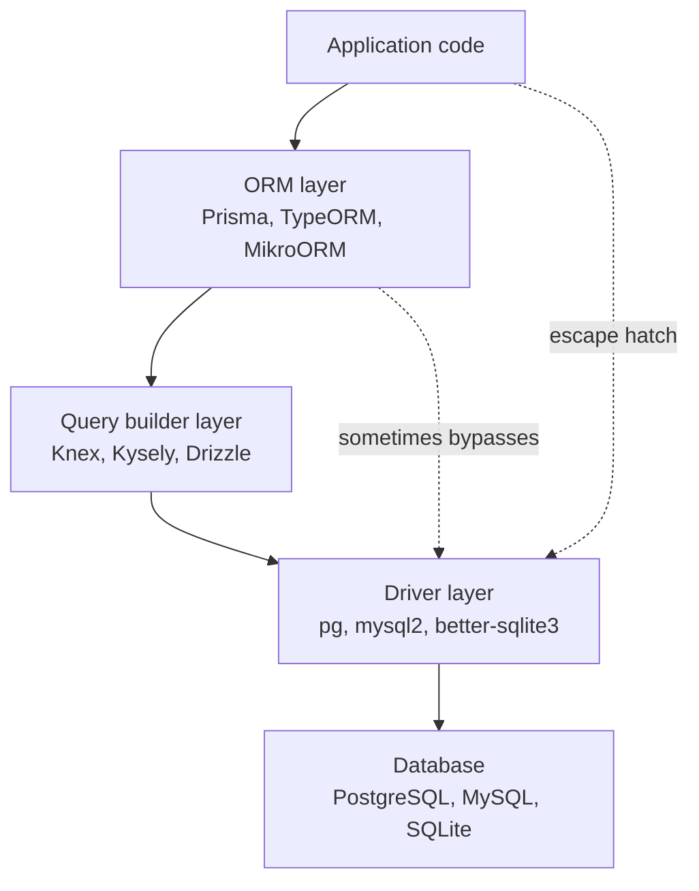

# 3.23 Database Integration and ORM Patterns

> The database is the slowest, most stateful, and most dangerous thing your Node.js process touches. Every line of code in this note exists to make that interaction safer, faster, and more maintainable.

## 1. Purpose

A Node.js backend spends a significant fraction of its wall-clock time waiting on the database. Opening a TCP connection to PostgreSQL costs roughly 1 to 5 milliseconds. Performing a TLS handshake on top of that costs another 5 to 20 milliseconds. Authenticating the user costs another 1 to 3 milliseconds. If your application opened a fresh connection for every query, a single HTTP request that issues ten queries would burn 70 to 230 milliseconds just on connection overhead — before any actual work happens. The first purpose of database integration tooling is to make those connections reusable, predictable, and shared.

The second purpose is abstraction. SQL is a powerful, declarative language, but it is also stringly typed: a typo in a column name is not a syntax error, it is a runtime error that surfaces only when that code path executes. ORMs exist to lift the database schema into the application's type system, so that `user.email` is a string because the compiler says so, not because somebody hoped the column existed. Migrations exist to make schema changes versioned, reviewable, and reversible, so that production does not drift from your local machine.

The third purpose is control. A query builder sits between raw SQL and a full ORM. It lets you compose queries programmatically — `where`, `join`, `orderBy`, `limit` — without giving up the shape of SQL. You keep your hands on the steering wheel; the query builder keeps your seatbelt fastened. Knex is the canonical JavaScript query builder. Kysely is the modern, fully type-safe TypeScript successor, where the type of a row flows through every `select`, `where`, and `join`.

The trade-off is straightforward and worth stating plainly. An ORM trades control for productivity: you write less SQL, the ORM generates it, and the generated SQL is usually fine but occasionally surprising. A query builder trades productivity for control: you write more code, but every emitted statement is one you could have predicted by reading your source. Raw SQL trades both for escape hatches: when nothing else will do, you drop down to the driver and write the exact query you need, accepting full responsibility for parameters, types, and resource cleanup.

Connection pooling is the architectural answer to "connections are expensive." A pool keeps a warm set of connections and hands them out on demand, returning them to the pool when the caller is done. The `pg` driver ships a `Pool` class. `mysql2` ships one. Every ORM and query builder either wraps these or implements its own. Configuring the pool well — `max` connections, `idleTimeoutMillis`, `connectionTimeoutMillis` — is one of the highest-leverage tunings you can do.

The Unit of Work pattern is the architectural answer to "multiple changes should be atomic." Instead of issuing one `UPDATE` per changed entity, you collect a graph of changes in memory, and a single `flush` writes them all inside one transaction. MikroORM implements this natively. Prisma implements it partially through `prisma.$transaction`. TypeORM implements it through the Entity Manager. The pattern is old — Martin Fowler described it in Patterns of Enterprise Application Architecture — but it remains the cleanest way to keep a complex write consistent.

This note exists to give you a single, exhaustive reference for choosing between these tools, configuring them correctly, and avoiding the four traps that wreck most Node.js database code: the N+1 query problem, missing transactions, missing connection pooling, and ad-hoc raw SQL that opens the door to injection.

## 2. Theory and Deep Dive

### 2.1 The three layers of database access

Database access in Node.js happens in layers. At the bottom is the driver: `pg` for PostgreSQL, `mysql2` for MySQL, `tedious` or `mssql` for SQL Server, `better-sqlite3` or `node:sqlite` for SQLite. The driver speaks the wire protocol, manages sockets, parses rows, and exposes a thin API. Above the driver sits the query builder (Knex, Kysely, Drizzle's query-builder mode), which composes SQL programmatically and emits parameterized strings. Above the query builder sits the ORM (Prisma, TypeORM, MikroORM, Sequelize), which maps tables to classes or schema objects, manages identity, tracks changes, and emits SQL on your behalf.



Each layer can bypass the one below it. TypeORM can drop to a raw query. Prisma has `prisma.$queryRaw`. Knex can issue raw SQL strings. The escape hatches matter because no abstraction is perfect, and the moment you need a feature the ORM does not expose — a PostgreSQL CTE with a recursive walk, a MySQL `INSERT ... ON DUPLICATE KEY UPDATE` with a custom update expression, a SQL Server `OUTPUT INSERTED.*` clause — you need a way out.

### 2.2 Raw SQL: full control, no safety net

Raw SQL through a driver looks like this in JavaScript:

```javascript
const { Pool } = require('pg');

const pool = new Pool({ connectionString: process.env.DBURL });

async function findUserByEmail(email) {
  const result = await pool.query(
    'SELECT id, email, name FROM users WHERE email = $1',
    [email]
  );
  return result.rows[0] ?? null;
}
```

And in TypeScript:

```typescript
import { Pool } from 'pg';

interface UserRow {
  id: string;
  email: string;
  name: string;
}

const pool = new Pool({ connectionString: process.env.DBURL });

async function findUserByEmail(email: string): Promise<UserRow | null> {
  const result = await pool.query<UserRow>(
    'SELECT id, email, name FROM users WHERE email = $1',
    [email]
  );
  return result.rows[0] ?? null;
}
```

The good news: parameterization (`$1`, `$2`, ...) is the safe way to pass values, and the driver handles escaping. The bad news: the column names in the SQL string are not checked against the schema. If you rename `email` to `emailAddress` in a migration and forget to update this query, you find out at runtime.

### 2.3 Query builders: SQL-shaped, programmatically composed

Knex is the elder statesman. Kysely is the modern, fully type-safe descendant. Both let you build queries by chaining method calls.

JavaScript with Knex:

```javascript
const knex = require('knex');

const db = knex({
  client: 'pg',
  connection: process.env.DBURL,
  pool: { min: 2, max: 10 }
});

async function findActiveUsers(domain) {
  return db('users')
    .select('id', 'email', 'name')
    .where({ active: true })
    .whereRaw('email LIKE ?', [`%${domain}`])
    .orderBy('createdAt', 'desc')
    .limit(50);
}
```

TypeScript with Kysely:

```typescript
import { Kysely, PostgresDialect } from 'kysely';
import { Pool } from 'pg';

interface UserTable {
  id: string;
  email: string;
  name: string;
  active: boolean;
  createdAt: Date;
}

interface Database {
  users: UserTable;
}

const db = new Kysely<Database>({
  dialect: new PostgresDialect({
    pool: new Pool({ connectionString: process.env.DBURL })
  })
});

async function findActiveUsers(domain: string) {
  return db
    .selectFrom('users')
    .select(['id', 'email', 'name'])
    .where('active', '=', true)
    .where('email', 'like', `%${domain}`)
    .orderBy('createdAt', 'desc')
    .limit(50)
    .execute();
}
```

The Kysely version is interesting because the compiler refuses to let you select a column that does not exist on `UserTable`, refuse to compare `active` against a string, and refuse to order by a column that is not in the schema. The Knex version is correct, but a typo like `where('activ', '=', true)` would silently produce the wrong query.

### 2.4 ORMs: entities, repositories, identity maps

An ORM adds three ideas on top of a query builder. First, an **entity**: a class or object whose shape mirrors a table row. Second, a **repository** (or, in Active Record, the entity itself): a place to put query methods like `findById`, `findByEmail`, `save`. Third, an **identity map**: a per-request cache that ensures the same row loaded twice returns the same object reference, so changes to it are tracked automatically.

Prisma is schema-first. You write a `schema.prisma` file, run `prisma generate`, and the tool emits a fully typed client. There are no decorators, no entity classes, no `extends Repository`. You call `prisma.user.findUnique({ where: { id } })` and the return type is `User | null` because the generator knows.

TypeORM is decorator-first. You write classes annotated with `@Entity()`, `@PrimaryColumn()`, `@Column()`, and the framework reflects on them at startup. It supports both Active Record (`extends BaseEntity`) and Data Mapper (inject `Repository<User>`). Decorators give you inheritance and method overriding for free; they cost you startup reflection and a tighter coupling to TypeORM itself.

MikroORM is the most " Patterns of Enterprise Application Architecture" of the three. It has a real identity map. It has a real Unit of Work. You load an entity, mutate it, call `em.flush()`, and MikroORM diffs the current state against the original, emits only the necessary `UPDATE` statements, and wraps everything in a transaction. This is the closest Node.js has to a Hibernate-style ORM.

### 2.5 Connection pooling in depth

The `pg` driver's `Pool` is the reference implementation. The relevant options:

- `max` — maximum number of connections the pool will hold. Default 10. For a Node.js process handling async work, 10 to 25 is typical; above that, you usually run into PostgreSQL's `max-connections` ceiling (default 100) before you see benefits.
- `idleTimeoutMillis` — how long a connection can sit idle before being closed. Default 30,000 ms. Lower this if your database has aggressive idle-connection limits.
- `connectionTimeoutMillis` — how long `pool.connect()` will wait before throwing. Default 0 (wait forever). Set this to a few seconds so a stuck pool surfaces as an error instead of a hung request.
- `maxUses` — close a connection after it has been used this many times. Useful for routing around long-lived connections that have accumulated state from a misbehaving `SET` statement.

Every ORM that targets PostgreSQL wraps a `pg.Pool` (or several, for read replicas). Prisma exposes `poolTimeout`, `connectionLimit`, and `maxConnectionLifetime` through its datasource URL. TypeORM's `DataSource` takes a `poolSize` option (or `extra` for driver-specific tuning). MikroORM's PostgreSQL driver accepts a `pool` config object that maps directly to `pg.Pool`.

A common production mistake is sizing the pool per-process without accounting for horizontal scale. If you run 20 Node.js processes, each with a pool of 25, that is 500 connections against a database with `max-connections = 100`. The right answer is usually: pick a per-process pool size, multiply by process count, and ensure the result is comfortably under the database's `max-connections` minus a buffer for migrations, admin sessions, and monitoring.

### 2.6 Transactions: BEGIN, COMMIT, ROLLBACK

A transaction is a database feature, not an application feature. The driver sends `BEGIN`, executes statements, and sends either `COMMIT` or `ROLLBACK`. If anything throws between `BEGIN` and `COMMIT`, you must `ROLLBACK` or the connection will be left in a broken transaction state and the next query will fail with `current transaction is aborted, commands ignored until end of transaction block`.

The cleanest pattern is the callback form, which handles the rollback for you:

```javascript
async function transferFunds(fromId, toId, amount) {
  return pool.connect(async (client) => {
    await client.query('BEGIN');
    try {
      await client.query(
        'UPDATE accounts SET balance = balance - $1 WHERE id = $2',
        [amount, fromId]
      );
      await client.query(
        'UPDATE accounts SET balance = balance + $1 WHERE id = $2',
        [amount, toId]
      );
      await client.query('COMMIT');
    } catch (err) {
      await client.query('ROLLBACK');
      throw err;
    }
  });
}
```

Prisma exposes the same idea as `prisma.$transaction(async (tx) => { ... })`. TypeORM exposes it as `dataSource.transaction(async (em) => { ... })`. MikroORM exposes it as `em.transactional(async (em) => { ... })`. All three wrap the callback in BEGIN/COMMIT and emit ROLLBACK on throw.

### 2.7 The Unit of Work pattern

A Unit of Work is a transaction that also remembers what it has done. You load entities, mutate them, add new ones, remove others — and the Unit of Work tracks every change. When you call `flush()`, it computes a diff against the original state, sorts the operations to respect foreign-key constraints, and emits a batch of `INSERT`, `UPDATE`, and `DELETE` statements inside a single transaction.

MikroORM is the canonical example in the Node.js ecosystem:

```typescript
async function reassignAndPromote(em, userId, newTeamId) {
  const user = await em.findOne(User, userId);
  const team = await em.findOne(Team, newTeamId);
  user.team = team;
  user.role = 'lead';
  // Nothing has been written yet.
  await em.flush();
  // Now a single UPDATE has been issued inside a transaction.
}
```

Prisma's Unit of Work is shallower — `prisma.$transaction` gives you atomicity, but you still call `prisma.user.update` explicitly; Prisma does not track in-memory mutations. TypeORM's Entity Manager tracks changes to loaded entities and flushes them on `em.flush()` when used in Data Mapper mode with `EntityWatcher` enabled.

### 2.8 The N+1 query problem

The N+1 problem is the single most common performance bug in ORM-backed applications. It happens when you load a list of N parents and then lazily load a child for each parent, issuing N additional queries. The "1" is the initial list query; the "N" is one query per child.

JavaScript with TypeORM (the bug):

```javascript
const users = await userRepository.find();
for (const user of users) {
  console.log(user.profile.bio); // Issues a SELECT for each user's profile
}
```

That loop runs 1 (find) + N (one profile per user) queries. For 1,000 users, that is 1,001 round trips. At 2 milliseconds per round trip, that is over 2 seconds of latency, all of it avoidable.

The fix is eager loading. In Prisma:

```typescript
const users = await prisma.user.findMany({
  include: { profile: true }
});
```

In TypeORM:

```typescript
const users = await userRepository.find({ relations: { profile: true } });
```

In MikroORM:

```typescript
const users = await em.find(User, {}, { populate: ['profile'] });
```

In Kysely (no magic, just a join):

```typescript
const users = await db
  .selectFrom('users')
  .leftJoin('profiles', 'profiles.userId', 'users.id')
  .select(['users.id', 'users.email', 'profiles.bio'])
  .execute();
```

All four produce a single SQL statement (or two, with MikroORM's default "join" strategy that splits to avoid cartesian products on collection relations).

### 2.9 Query performance profiles

Different access patterns have different cost profiles. A primary-key lookup is O(log N) on a B-tree index and typically sub-millisecond. A `WHERE email = ?` on an unindexed column is O(N) and becomes painful past 100,000 rows. A `JOIN` on a foreign key with an index is O(log N + M); without an index, it is O(N*M) and will wreck your day. A `GROUP BY` on an unindexed column requires a sort or hash, which is O(N log N) or O(N) in memory respectively. A `LIMIT 50 OFFSET 1000000` still scans and discards the first million rows unless you use keyset pagination.

The ORM's job is to emit correct SQL. It is not to emit optimal SQL. A `findMany({ where: { status: 'active' } })` with no index on `status` will issue a perfectly correct sequential scan that takes 800 milliseconds. The ORM has no opinion about whether you should have an index. You, the engineer, own that decision. See [[7.05 Profiling and Benchmarking]] and [[7.07 Database Query Optimization]] for the runtime side of this.

## 3. Mental Models

**ORM = "describe your data as objects, the ORM writes SQL."** You think in entities and relationships. The ORM translates. When you say `user.posts`, it decides whether to issue a `JOIN`, a separate query, or a lazy load. You trade visibility for productivity. The trade is usually worth it for CRUD apps and usually not worth it for analytics.

**Query builder = "build SQL programmatically, still SQL-shaped."** You think in `SELECT`, `FROM`, `WHERE`, `JOIN`. The query builder gives you methods that mirror those clauses, parameterizes your inputs, and gives you back a string you can read and reason about. You see the SQL because the code is the SQL.

**Connection pool = "a bucket of open connections, reuse them."** A bucket with a lid and a maximum capacity. When you need a connection, you take one out. When you are done, you put it back. If the bucket is empty and not yet at capacity, you make a new one. If the bucket is empty and at capacity, you wait. If you wait too long, you fail. The bucket is shared across the whole process, which is why a single slow query can starve a hundred fast ones — see [[7.06 Event Loop Blocking]].

**Transaction = "all or nothing — commit or rollback."** A fence around a group of statements. Either all of them land durably, or none of them do. The ACID properties (Atomicity, Consistency, Isolation, Durability) are the formal version of this. In practice, the mental model is: "wrap multi-step writes in a transaction so a crash in the middle does not leave half-written data."

**Unit of Work = "collect changes in memory, flush once."** Imagine a shopping cart. You add items, remove items, change quantities. The cart is the Unit of Work. When you click checkout, the cart is flushed: one atomic write. MikroORM's `em.flush()` is exactly this. Prisma's `$transaction` is a weaker version — atomic, but not diff-based.

**N+1 = "1 query for the list, N for the children — use a join."** If you ever write a loop that issues a query per iteration, you have an N+1. The fix is always the same shape: load the children in one query, keyed by parent id, and stitch them together in memory. ORMs automate this with `include` / `relations` / `populate`. Query builders require you to do the stitching yourself.

**Migration = "version control for your schema."** Each migration is a pair of `up` and `down` functions. `up` moves the schema forward. `down` moves it back. In CI, you run `up` before deploying. If something breaks, you run `down` (in theory). In practice, `down` migrations on production data are terrifying, so most teams design forward-only migrations that never drop columns immediately.

**Identity Map = "one row, one object, per request."** If you load `User 42` twice in the same request, you get the same object reference both times. Mutate it once, and the second load sees the mutation. This is what makes MikroORM's change tracking work: it diffs the current object graph against the original snapshot, and the diff is the SQL.

## 4. Real-World Use Cases

**CRUD applications.** The vast majority of internal tools, admin panels, and B2B SaaS products are CRUD over a relational schema. Prisma is the dominant choice in this space because the schema-first workflow produces a typed client with no boilerplate, and the generated migrations are readable. TypeORM is common in NestJS shops where decorator-based entities fit the framework's DI conventions. MikroORM is the choice when teams want a real Unit of Work and are willing to learn its mental model.

**High-performance read paths.** Search endpoints, analytics dashboards, and feed builders often need queries that no ORM emits cleanly — recursive CTEs, window functions, `LATERAL` joins, custom `GIN` indexes with expression queries. These paths drop to Kysely (for type safety) or raw `pg` (for maximum control). The rest of the application can stay on an ORM; only the hot path needs to drop down.

**Migrations as a deployment gate.** Every ORM and query builder ships a migration tool. The discipline is: never run migrations by hand against production. Always run them in CI, against a fresh database, as part of the deploy pipeline. A migration that fails to apply cleanly should block the deploy. A migration that succeeds should be followed by a deploy of compatible code. The two together form a deploy unit.

**Multi-tenant databases.** Two common patterns: a shared schema with a `tenantId` column on every table, or a schema-per-tenant (or database-per-tenant) layout. The shared-schema pattern is simpler but requires every query to filter on `tenantId` — a single missed filter is a cross-tenant data leak. The schema-per-tenant pattern is safer but requires the ORM to switch schemas per request, which Prisma does not support natively (you need a connection-per-tenant or a `searchPath` swap), TypeORM supports via separate `DataSource` instances, and MikroORM supports via `em.fork({ schema })`.

**Read replicas.** Read-heavy workloads benefit from routing reads to a replica. Most ORMs support this via two data sources: one primary, one replica. TypeORM exposes `replicas` on the `DataSource`. Prisma does not natively support read replicas in the open-source edition (you route via a proxy like PgBouncer or use the Driver Adapters with separate pools). Kysely and raw `pg` let you maintain two pools and pick at the call site. The decision of where to route should be made at the query level, not the request level, because a request that writes-then-reads must read from the primary to avoid replication lag.

**Event-sourced systems.** Some domains — financial ledgers, audit logs, collaborative editing — fit event sourcing better than mutable state. ORMs are a poor fit here because the dominant write pattern is `INSERT INTO events`, and the dominant read pattern is a materialized view or a projection rebuilt from the event log. These systems typically use a query builder or raw SQL for the events table and a separate read model (often a document store or a denormalized table) for queries.

**Batch jobs and ETL.** Nightly batch jobs that move millions of rows should not use ORM-level entity hydration. Loading a million rows into entity objects, mutating them, and flushing is a recipe for an out-of-memory crash. Use `COPY` (PostgreSQL) or `LOAD DATA INFILE` (MySQL) for bulk inserts, and run updates as bulk `UPDATE ... WHERE` statements. Knex, Kysely, and Prisma all expose bulk-insert APIs; for the absolute fastest path, drop to the driver.

## 5. Code Examples

### 5.1 Example A — Minimal and Conceptual

The same query — "find a user by email, return the user and their ten most recent posts" — implemented four ways. Each version is shown in both JavaScript and TypeScript.

#### 5.1.1 Raw SQL with `pg`

JavaScript:

```javascript
const { Pool } = require('pg');

const pool = new Pool({ connectionString: process.env.DBURL });

async function getUserWithPosts(email) {
  const client = await pool.connect();
  try {
    const userRes = await client.query(
      'SELECT id, email, name FROM users WHERE email = $1',
      [email]
    );
    const user = userRes.rows[0];
    if (!user) return null;
    const postsRes = await client.query(
      'SELECT id, title, createdAt FROM posts WHERE authorId = $1 ORDER BY createdAt DESC LIMIT 10',
      [user.id]
    );
    return { ...user, posts: postsRes.rows };
  } finally {
    client.release();
  }
}
```

TypeScript:

```typescript
import { Pool } from 'pg';

interface UserRow { id: string; email: string; name: string; }
interface PostRow { id: string; title: string; createdAt: Date; }
interface UserWithPosts extends UserRow { posts: PostRow[]; }

const pool = new Pool({ connectionString: process.env.DBURL });

async function getUserWithPosts(email: string): Promise<UserWithPosts | null> {
  const client = await pool.connect();
  try {
    const userRes = await pool.query<UserRow>(
      'SELECT id, email, name FROM users WHERE email = $1',
      [email]
    );
    const user = userRes.rows[0];
    if (!user) return null;
    const postsRes = await pool.query<PostRow>(
      'SELECT id, title, createdAt FROM posts WHERE authorId = $1 ORDER BY createdAt DESC LIMIT 10',
      [user.id]
    );
    return { ...user, posts: postsRes.rows };
  } finally {
    client.release();
  }
}
```

Note: the TypeScript version declares the row shapes manually. The compiler does not verify them against the database — it trusts you. This is the fundamental weakness of raw SQL.

#### 5.1.2 Knex

JavaScript:

```javascript
const knex = require('knex');

const db = knex({
  client: 'pg',
  connection: process.env.DBURL,
  pool: { min: 2, max: 10 }
});

async function getUserWithPosts(email) {
  const user = await db('users')
    .select('id', 'email', 'name')
    .where({ email })
    .first();
  if (!user) return null;
  const posts = await db('posts')
    .select('id', 'title', 'createdAt')
    .where({ authorId: user.id })
    .orderBy('createdAt', 'desc')
    .limit(10);
  return { ...user, posts };
}
```

TypeScript (with manual types — Knex does not infer them):

```typescript
import knex from 'knex';

interface UserRow { id: string; email: string; name: string; }
interface PostRow { id: string; title: string; createdAt: Date; }
interface UserWithPosts extends UserRow { posts: PostRow[]; }

const db = knex({
  client: 'pg',
  connection: process.env.DBURL,
  pool: { min: 2, max: 10 }
});

async function getUserWithPosts(email: string): Promise<UserWithPosts | null> {
  const user = await db<UserRow>('users')
    .select('id', 'email', 'name')
    .where({ email })
    .first();
  if (!user) return null;
  const posts = await db<PostRow>('posts')
    .select('id', 'title', 'createdAt')
    .where({ authorId: user.id })
    .orderBy('createdAt', 'desc')
    .limit(10);
  return { ...user, posts };
}
```

#### 5.1.3 Prisma

JavaScript:

```javascript
const { PrismaClient } = require('@prisma/client');

const prisma = new PrismaClient({
  log: ['query', 'warn', 'error']
});

async function getUserWithPosts(email) {
  return prisma.user.findUnique({
    where: { email },
    include: { posts: { take: 10, orderBy: { createdAt: 'desc' } } }
  });
}
```

TypeScript (types come from the generated client):

```typescript
import { PrismaClient, type User } from '@prisma/client';

const prisma = new PrismaClient({
  log: ['query', 'warn', 'error']
});

async function getUserWithPosts(email: string): Promise<User & { posts: Post[] } | null> {
  return prisma.user.findUnique({
    where: { email },
    include: { posts: { take: 10, orderBy: { createdAt: 'desc' } } }
  });
}
```

Note the difference: Prisma issues a single round trip with a `LEFT JOIN` (or two queries stitched internally, depending on the relation shape). The return type is computed from the schema. No manual `UserRow` declaration.

#### 5.1.4 Kysely

JavaScript (Kysely works in JS but loses its main selling point — types):

```javascript
const { Kysely, PostgresDialect } = require('kysely');
const { Pool } = require('pg');

const db = new Kysely({
  dialect: new PostgresDialect({
    pool: new Pool({ connectionString: process.env.DBURL })
  })
});

async function getUserWithPosts(email) {
  const user = await db
    .selectFrom('users')
    .select(['id', 'email', 'name'])
    .where('email', '=', email)
    .executeTakeFirst();
  if (!user) return null;
  const posts = await db
    .selectFrom('posts')
    .select(['id', 'title', 'createdAt'])
    .where('authorId', '=', user.id)
    .orderBy('createdAt', 'desc')
    .limit(10)
    .execute();
  return { ...user, posts };
}
```

TypeScript (the real reason to use Kysely):

```typescript
import { Kysely, PostgresDialect } from 'kysely';
import { Pool } from 'pg';

interface UserTable { id: string; email: string; name: string; }
interface PostTable { id: string; title: string; createdAt: Date; authorId: string; }
interface Database { users: UserTable; posts: PostTable; }

const db = new Kysely<Database>({
  dialect: new PostgresDialect({
    pool: new Pool({ connectionString: process.env.DBURL })
  })
});

async function getUserWithPosts(email: string) {
  const user = await db
    .selectFrom('users')
    .select(['id', 'email', 'name'])
    .where('email', '=', email)
    .executeTakeFirst();
  if (!user) return null;
  const posts = await db
    .selectFrom('posts')
    .select(['id', 'title', 'createdAt'])
    .where('authorId', '=', user.id)
    .orderBy('createdAt', 'desc')
    .limit(10)
    .execute();
  return { ...user, posts };
}
```

If you mistype `'emial'` instead of `'email'` in the `where` clause, Kysely refuses to compile. That is the entire pitch.

### 5.2 Example B — Production-Grade

A production-grade typed repository pattern with: explicit connection pooling, transactional boundaries, N+1 prevention, and an injectable database client so tests can swap in a transaction-rolled-back substitute.

The TypeScript version is the canonical implementation; the JavaScript version is the same code with types stripped.

#### 5.2.1 TypeScript — schema, types, and repository

```typescript
import { randomUUID } from 'node:crypto';
import { Pool, type PoolClient } from 'pg';

// Schema-mirrored row types. In a real codebase these are generated from
// the database by a tool like `kysely-codegen` or `prisma generate`.
export interface UserRow {
  id: string;
  email: string;
  name: string;
  role: 'admin' | 'member' | 'guest';
  createdAt: Date;
  updatedAt: Date;
}

export interface PostRow {
  id: string;
  authorId: string;
  title: string;
  body: string;
  publishedAt: Date | null;
  createdAt: Date;
}

export interface UserWithPosts extends UserRow {
  posts: PostRow[];
}

// A DbClient interface lets tests inject a transaction-scoped client.
export interface DbClient {
  query<R extends Record<string, unknown>>(
    text: string,
    params: unknown[]
  ): Promise<{ rows: R[] }>;
}

// The pool wraps a real pg.Pool with sane production defaults.
export class Database {
  private readonly pool: Pool;

  constructor(url: string, opts: { max: number; idleMs: number; timeoutMs: number }) {
    this.pool = new Pool({
      connectionString: url,
      max: opts.max,
      idleTimeoutMillis: opts.idleMs,
      connectionTimeoutMillis: opts.timeoutMs
    });
    this.pool.on('error', (err) => {
      // Idle client errors must be logged or they crash the process.
      console.error('idle pool client error', err);
    });
  }

  // Acquire a client for a single query.
  async query<R extends Record<string, unknown>>(
    text: string,
    params: unknown[]
  ): Promise<{ rows: R[] }> {
    return this.pool.query<R>(text, params);
  }

  // Acquire a client for a transaction.
  async transaction<T>(
    fn: (client: PoolClient & DbClient) => Promise<T>
  ): Promise<T> {
    const client = await this.pool.connect();
    try {
      await client.query('BEGIN');
      const result = await fn(client as PoolClient & DbClient);
      await client.query('COMMIT');
      return result;
    } catch (err) {
      await client.query('ROLLBACK').catch(() => undefined);
      throw err;
    } finally {
      client.release();
    }
  }

  async close(): Promise<void> {
    await this.pool.end();
  }
}

// A repository takes a DbClient, which is either the pool or a transaction client.
export class UserRepository {
  constructor(private readonly db: DbClient) {}

  async findById(id: string): Promise<UserRow | null> {
    const { rows } = await this.db.query<UserRow>(
      'SELECT id, email, name, role, createdAt, updatedAt FROM users WHERE id = $1',
      [id]
    );
    return rows[0] ?? null;
  }

  async findByEmail(email: string): Promise<UserRow | null> {
    const { rows } = await this.db.query<UserRow>(
      'SELECT id, email, name, role, createdAt, updatedAt FROM users WHERE email = $1',
      [email]
    );
    return rows[0] ?? null;
  }

  // N+1 prevention: load many users' posts in one query, keyed by authorId.
  async findManyWithPosts(ids: string[]): Promise<UserWithPosts[]> {
    if (ids.length === 0) return [];
    const { rows: users } = await this.db.query<UserRow>(
      'SELECT id, email, name, role, createdAt, updatedAt FROM users WHERE id = ANY($1)',
      [ids]
    );
    const { rows: posts } = await this.db.query<PostRow>(
      'SELECT id, authorId, title, body, publishedAt, createdAt FROM posts WHERE authorId = ANY($1)',
      [ids]
    );
    const postsByAuthor = new Map<string, PostRow[]>();
    for (const post of posts) {
      const list = postsByAuthor.get(post.authorId) ?? [];
      list.push(post);
      postsByAuthor.set(post.authorId, list);
    }
    return users.map((u) => ({ ...u, posts: postsByAuthor.get(u.id) ?? [] }));
  }

  async create(input: { email: string; name: string; role: UserRow['role'] }): Promise<UserRow> {
    const { rows } = await this.db.query<UserRow>(
      'INSERT INTO users (id, email, name, role, createdAt, updatedAt) VALUES ($1, $2, $3, $4, NOW(), NOW()) RETURNING *',
      [randomUUID(), input.email, input.name, input.role]
    );
    return rows[0];
  }

  async updateRole(id: string, role: UserRow['role']): Promise<UserRow | null> {
    const { rows } = await this.db.query<UserRow>(
      'UPDATE users SET role = $2, updatedAt = NOW() WHERE id = $1 RETURNING *',
      [id, role]
    );
    return rows[0] ?? null;
  }
}

// A post repository, same shape, abbreviated.
export class PostRepository {
  constructor(private readonly db: DbClient) {}

  async publish(postId: string): Promise<PostRow | null> {
    const { rows } = await this.db.query<PostRow>(
      'UPDATE posts SET publishedAt = NOW() WHERE id = $1 RETURNING *',
      [postId]
    );
    return rows[0] ?? null;
  }
}

// A service that composes the two repositories inside one transaction.
export class PublicationService {
  constructor(
    private readonly database: Database,
    private readonly users: UserRepository,
    private readonly posts: PostRepository
  ) {}

  // Atomically: promote the user to 'admin' and publish their latest post.
  async promoteAndPublishLatest(userId: string): Promise<{ user: UserRow; post: PostRow | null }> {
    return this.database.transaction(async (client) => {
      // Repositories constructed with the transaction client.
      // In practice, inject a factory; here we construct directly.
      const userRepo = new UserRepository(client);
      const postRepo = new PostRepository(client);

      const user = await userRepo.updateRole(userId, 'admin');
      if (!user) throw new Error(`user ${userId} not found`);

      const { rows } = await client.query<PostRow>(
        'SELECT id FROM posts WHERE authorId = $1 AND publishedAt IS NULL ORDER BY createdAt DESC LIMIT 1',
        [userId]
      );
      const latest = rows[0] ?? null;
      const post = latest ? await postRepo.publish(latest.id) : null;
      return { user, post };
    });
  }
}
```

#### 5.2.2 JavaScript — same code, types stripped

```javascript
const { randomUUID } = require('crypto');
const { Pool } = require('pg');

class Database {
  constructor(url, opts) {
    this.pool = new Pool({
      connectionString: url,
      max: opts.max,
      idleTimeoutMillis: opts.idleMs,
      connectionTimeoutMillis: opts.timeoutMs
    });
    this.pool.on('error', (err) => {
      console.error('idle pool client error', err);
    });
  }

  async query(text, params) {
    return this.pool.query(text, params);
  }

  async transaction(fn) {
    const client = await this.pool.connect();
    try {
      await client.query('BEGIN');
      const result = await fn(client);
      await client.query('COMMIT');
      return result;
    } catch (err) {
      await client.query('ROLLBACK').catch(() => undefined);
      throw err;
    } finally {
      client.release();
    }
  }

  async close() {
    await this.pool.end();
  }
}

class UserRepository {
  constructor(db) {
    this.db = db;
  }

  async findById(id) {
    const { rows } = await this.db.query(
      'SELECT id, email, name, role, createdAt, updatedAt FROM users WHERE id = $1',
      [id]
    );
    return rows[0] ?? null;
  }

  async findByEmail(email) {
    const { rows } = await this.db.query(
      'SELECT id, email, name, role, createdAt, updatedAt FROM users WHERE email = $1',
      [email]
    );
    return rows[0] ?? null;
  }

  async findManyWithPosts(ids) {
    if (ids.length === 0) return [];
    const { rows: users } = await this.db.query(
      'SELECT id, email, name, role, createdAt, updatedAt FROM users WHERE id = ANY($1)',
      [ids]
    );
    const { rows: posts } = await this.db.query(
      'SELECT id, authorId, title, body, publishedAt, createdAt FROM posts WHERE authorId = ANY($1)',
      [ids]
    );
    const postsByAuthor = new Map();
    for (const post of posts) {
      const list = postsByAuthor.get(post.authorId) ?? [];
      list.push(post);
      postsByAuthor.set(post.authorId, list);
    }
    return users.map((u) => ({ ...u, posts: postsByAuthor.get(u.id) ?? [] }));
  }

  async create(input) {
    const { rows } = await this.db.query(
      'INSERT INTO users (id, email, name, role, createdAt, updatedAt) VALUES ($1, $2, $3, $4, NOW(), NOW()) RETURNING *',
      [randomUUID(), input.email, input.name, input.role]
    );
    return rows[0];
  }

  async updateRole(id, role) {
    const { rows } = await this.db.query(
      'UPDATE users SET role = $2, updatedAt = NOW() WHERE id = $1 RETURNING *',
      [id, role]
    );
    return rows[0] ?? null;
  }
}

class PostRepository {
  constructor(db) {
    this.db = db;
  }

  async publish(postId) {
    const { rows } = await this.db.query(
      'UPDATE posts SET publishedAt = NOW() WHERE id = $1 RETURNING *',
      [postId]
    );
    return rows[0] ?? null;
  }
}

class PublicationService {
  constructor(database, users, posts) {
    this.database = database;
    this.users = users;
    this.posts = posts;
  }

  async promoteAndPublishLatest(userId) {
    return this.database.transaction(async (client) => {
      const userRepo = new UserRepository(client);
      const postRepo = new PostRepository(client);
      const user = await userRepo.updateRole(userId, 'admin');
      if (!user) throw new Error(`user ${userId} not found`);
      const { rows } = await client.query(
        'SELECT id FROM posts WHERE authorId = $1 AND publishedAt IS NULL ORDER BY createdAt DESC LIMIT 1',
        [userId]
      );
      const latest = rows[0] ?? null;
      const post = latest ? await postRepo.publish(latest.id) : null;
      return { user, post };
    });
  }
}

module.exports = { Database, UserRepository, PostRepository, PublicationService };
```

The architectural payoff: the `DbClient` interface means a unit test can pass a fake client that records queries and returns canned rows. The `transaction` method means a service test can wrap the call in a rollback, so the test database stays clean. The `findManyWithPosts` method means the N+1 is structurally impossible — there is no API that takes one user and loads their posts; you always load a batch.

## 6. Common Mistakes and Anti-Patterns

### 6.1 The N+1 query problem (lazy loading in a loop)

The most common, most expensive, most preventable bug. You load a list of entities, then access a relation in a loop, and the ORM issues one query per iteration. Symptom: a page that takes 2 seconds to load in development (10 users) takes 30 seconds in production (1,000 users). Fix: eager-load the relation with `include` (Prisma), `relations` (TypeORM), `populate` (MikroORM), or a `JOIN` (query builder). Measure with the ORM's query logger enabled — if you see N+1 lines in the log for a single request, you have an N+1.

### 6.2 No connection pooling

Opening a new connection per query. Symptom: every request takes 30 to 100 milliseconds longer than it should, and the latency is dominated by TCP and TLS setup. Fix: use a `Pool`, size it appropriately, set `connectionTimeoutMillis` so a stuck pool surfaces as an error. This mistake is rarer today because every popular library defaults to pooling, but it still appears in tutorials that use `pg.Client` directly.

### 6.3 No transactions for multi-step writes

A transfer that debits one account and credits another, written as two separate `UPDATE` statements with no transaction. If the process crashes between them, money is destroyed. Symptom: occasional data inconsistency under failure, hard to reproduce, hard to debug. Fix: wrap multi-step writes in `BEGIN`/`COMMIT` (or the ORM's `$transaction`/`transaction` equivalent). The cost is near zero; the benefit is correctness.

### 6.4 SQL injection via string concatenation

`pool.query("SELECT * FROM users WHERE email = '" + email + "'")` is a vulnerability. If `email` is `' OR '1'='1`, the query returns every user. Symptom: a security audit finding, or worse, a breach. Fix: always parameterize. `pool.query('SELECT * FROM users WHERE email = $1', [email])`. The same rule applies to ORM raw-query methods: `prisma.$queryRaw` is safe with tagged templates (`prisma.$queryRaw\`SELECT * FROM users WHERE email = ${email}\``) but unsafe with string concatenation. See [[3.21 Security Authentication and Authorization]].

### 6.5 Not running migrations (schema drift)

A teammate adds a column locally, does not commit a migration, deploys the code, and production crashes because the new code references a column that does not exist. Symptom: deploy-time errors, intermittent failures, "works on my machine." Fix: every schema change goes through a migration file, migrations run in CI before deploy, and the application refuses to start if its schema version is behind the database's (a `schemaMigrations` table with a version column is the standard pattern).

### 6.6 Ignoring indexes on query patterns

A `WHERE status = 'active' AND createdAt > NOW() - INTERVAL '7 days'` query on a million-row `users` table with no index on `status` or `createdAt` will do a sequential scan and take 800 milliseconds. Symptom: queries that were fast at 10,000 rows become slow at 1,000,000 rows. Fix: add indexes on the columns you filter, join, and sort by. Use composite indexes when queries filter on multiple columns together. Use `EXPLAIN ANALYZE` to see what the planner is doing. See [[7.07 Database Query Optimization]].

### 6.7 Using the ORM as if it were the database

Treating `prisma.user.findMany()` as if it were free. It is not. It builds a SQL string, sends it over a socket, waits for the result, hydrates each row into a JavaScript object, and returns an array. For a 10,000-row result, that hydration is non-trivial — often 50 to 200 milliseconds of CPU time on top of the database time. Symptom: endpoints that return large lists are slow even when the query itself is fast. Fix: paginate (keyset pagination for large offsets), project only the columns you need (`select` instead of `include`), and consider whether the ORM is the right tool for bulk reads.

### 6.8 Leaking connections by forgetting `client.release()`

Using `pool.connect()` and then throwing before `client.release()` runs. Symptom: the pool slowly exhausts under load, requests start timing out, and restarting the process fixes it temporarily. Fix: always use `try`/`finally`, or use the callback form `pool.connect(async (client) => { ... })` which releases automatically. Every ORM that manages its own connections handles this internally; the bug appears when you drop to the driver.

### 6.9 Long-running transactions holding locks

A transaction that opens, does some work, then waits on an external call (an HTTP request, a message queue) before committing. Symptom: row locks held for seconds, other requests blocked, throughput collapses. Fix: never hold a transaction open across an I/O boundary you do not control. Do the external call first, then open the transaction, write, commit. The transaction should be milliseconds, not seconds.

## 7. Best Practices and Design Patterns

**Use an ORM or query builder for new code.** The productivity and safety wins over raw SQL are large enough that raw SQL should be reserved for the cases where you need a feature the abstraction does not expose. Prisma for schema-first type safety, TypeORM for decorator-based DI integration, MikroORM for Unit of Work, Kysely for query-builder ergonomics with full types, Knex for the simplest possible migration story.

**Use connection pooling, and size it deliberately.** Pick a per-process max (10 to 25 is a reasonable start), multiply by process count, and ensure the result is comfortably below the database's `max-connections`. Set `connectionTimeoutMillis` to a few seconds so a stuck pool surfaces as an error rather than a hung request.

**Use transactions for any multi-step write.** The rule of thumb: if a single user action results in two or more writes, wrap them in a transaction. The cost is near zero. The benefit is that a crash in the middle cannot leave your data in an inconsistent state.

**Prevent N+1 by design.** Load relations in batches. In ORMs, use the eager-loading API. In query builders, do the join or the `IN` query yourself and stitch in memory. Add a test that counts queries per request — a simple middleware that wraps the ORM's query logger and asserts the count is below a threshold catches N+1 regressions automatically.

**Run migrations in CI.** A migration that fails to apply should block the deploy. A migration that succeeds should be followed by code that is compatible with the new schema. Design migrations to be forward-compatible: add the column first, deploy the code that uses it, then in a later migration remove the old column. Never `DROP COLUMN` and deploy the code that uses it in the same release.

**Add indexes for query patterns, not for columns.** An index on a column nobody filters on is wasted write throughput. Look at your actual queries (`pg-stat-statements` for PostgreSQL, the slow query log for MySQL) and index the columns that appear in `WHERE`, `JOIN`, and `ORDER BY` clauses for hot queries. Composite indexes for multi-column filters, in the order of selectivity.

**Use read replicas for read-heavy workloads.** Route `GET` endpoints to a replica, `POST`/`PUT`/`DELETE` to the primary. Be careful of replication lag: a write followed by an immediate read from the replica may not see the write. Either route the post-write read to the primary, or use a session-level stickiness flag.

**Prefer repositories over direct ORM calls in services.** A `UserRepository.findById(id)` is testable, swappable, and grep-able. A direct `prisma.user.findUnique` scattered across services is none of those things. The repository pattern adds a layer of indirection but pays for itself the first time you need to add caching, audit logging, or a switch from one ORM to another.

**Use keyset pagination for large offsets.** `LIMIT 50 OFFSET 1000000` still scans and discards a million rows. `WHERE id > $lastId ORDER BY id LIMIT 50` is O(log N + 50) and is the right pattern for infinite-scroll UIs and bulk exports.

**Log slow queries at the application layer.** The database has a slow-query log, but it does not know which application request triggered the query. A middleware that wraps the ORM's query logger and tags each query with the request id lets you trace a slow endpoint to the specific queries it issued.

**Use a `DbClient` interface for testability.** Define an interface that has `query(text, params)`. Have your repositories depend on the interface, not on a concrete `Pool`. In tests, pass a fake that records queries and returns canned rows. In integration tests, pass a transaction client that rolls back at the end of the test, so the test database stays clean.

## 8. Technical Interview Knowledge

### Q1: What is the difference between an ORM and a query builder?

A query builder composes SQL programmatically. You call methods like `select`, `where`, `join`, `orderBy`, and the builder emits a parameterized SQL string. The result is still a row — there is no automatic mapping to a class, no identity map, no change tracking. Knex and Kysely are query builders.

An ORM maps tables to entities (classes or schema objects). It manages identity — loading the same row twice in the same request returns the same object reference. It tracks changes — mutate an entity, call `flush`, and the ORM emits an `UPDATE`. It navigates relations — `user.posts` issues a query under the hood. Prisma, TypeORM, MikroORM, and Sequelize are ORMs.

The trade-off: an ORM gives you productivity and type safety at the cost of control and occasionally surprising SQL. A query builder gives you control and predictable SQL at the cost of writing more code. Most teams pick one and use it for 95% of their queries, with raw SQL for the 5% that need it.

### Q2: What is the N+1 query problem?

Loading a list of N parent entities and then, for each parent, issuing a separate query to load a child relation. The total query count is 1 (the initial list) + N (one per child), hence "N+1." For N=1,000, that is 1,001 round trips to the database, each costing 1 to 5 milliseconds of network latency, for a total of 1 to 5 seconds on a query that should take 5 to 20 milliseconds.

Symptom: an endpoint that is fast in development (small N) is slow in production (large N). The fix is to eager-load the relation in a single query, either with a `JOIN` (one round trip, cartesian-product risk for collection relations) or with a "select parents, then select children where parentId IN (...), then stitch in memory" pattern (two round trips, no cartesian product). Most ORMs automate one or both of these with `include`, `relations`, or `populate`.

### Q3: How do you prevent N+1?

Three layers. First, at the query level: use the ORM's eager-loading API (`include` in Prisma, `relations` in TypeORM, `populate` in MikroORM). Second, at the architecture level: prefer batch-loading APIs (`findManyWithPosts(ids)` over `findOneWithPosts(id)` in a loop) so the API shape makes the N+1 structurally impossible. Third, at the testing level: add a test that counts queries per request and fails if the count exceeds a threshold. This catches N+1 regressions automatically — without it, an N+1 introduced in a refactor can ship to production undetected.

Tools like DataLoader (originally from Facebook, now widely used) generalize the batch-and-stitch pattern: you give it a list of keys, it batches them into a single query, and it caches the result within the request so a second call for the same key does not re-query.

### Q4: What is connection pooling and why does it matter?

A connection pool is a set of pre-opened database connections that the application reuses. Opening a connection costs 1 to 20 milliseconds (TCP + TLS + auth); reusing one costs effectively zero. A pool also caps the number of concurrent connections, which protects the database — PostgreSQL's default `max-connections` is 100, and exceeding it causes new connections to be refused.

The relevant configuration: `max` (pool size — typically 10 to 25 per process), `idleTimeoutMillis` (close idle connections after this long — default 30 seconds), `connectionTimeoutMillis` (fail fast if the pool is exhausted — set to a few seconds), and `maxUses` (recycle a connection after N uses to avoid state accumulation). Sizing: per-process max times process count should be comfortably below the database's `max-connections` minus a buffer for migrations and admin sessions.

### Q5: How do transactions work?

A transaction is a sequence of statements that the database treats as atomic. The driver sends `BEGIN`, then the statements, then either `COMMIT` (make the changes durable) or `ROLLBACK` (undo them). If the connection drops mid-transaction, the database rolls back automatically.

The ACID properties: Atomicity (all or nothing), Consistency (the database moves from one valid state to another, enforced by constraints), Isolation (concurrent transactions do not see each other's intermediate states — the isolation level controls how strong this guarantee is), Durability (once committed, the change survives a crash).

In practice, the rule is: any multi-step write goes in a transaction. The cleanest pattern is the callback form, which handles rollback on throw. Never hold a transaction open across an external I/O call — the locks it holds will block other requests.

### Q6: How would you choose between Prisma and TypeORM?

Prisma if: you want schema-first type safety, you value a generated client with no decorators, you want migrations that are readable, you are starting a new project. Prisma's pitch is that the schema file is the single source of truth, and the client types are always in sync with it.

TypeORM if: you are in a NestJS shop and want decorator-based entities that fit the framework's DI conventions, you want Active Record and Data Mapper both available, you have an existing codebase already on TypeORM, you need features Prisma does not expose (like multi-schema multi-tenancy natively). TypeORM's pitch is flexibility and ecosystem fit.

MikroORM if: you want a real Unit of Work with change tracking, you are comfortable with a more complex mental model in exchange for less manual SQL, you have a domain with complex aggregate graphs. MikroORM's pitch is that it is the closest Node.js has to a Hibernate-style ORM.

Kysely if: you want full type safety without an ORM's magic, you are comfortable writing SQL-shaped code, you value the ability to drop to raw SQL trivially. Kysely's pitch is "Knex, but the types actually work."

### Q7: What is the Unit of Work pattern?

A pattern where the application collects a graph of changes in memory — new entities, mutated entities, deleted entities — and a single `flush` operation writes them all to the database inside one transaction. The Unit of Work computes a diff between the current state and the original snapshot, sorts the operations to respect foreign-key constraints, and emits the minimal set of `INSERT`, `UPDATE`, and `DELETE` statements.

Benefits: atomicity (all changes commit or none do), efficiency (only changed columns are written), and consistency (the in-memory graph and the database are in sync after flush). MikroORM implements this natively. Prisma's `$transaction` gives you atomicity but not diff-based change tracking — you still call `prisma.user.update` explicitly. TypeORM's Entity Manager with change tracking is closer to the pattern.

The risk: a Unit of Work that grows too large (thousands of entities) can take a long time to flush and hold locks for longer than necessary. The pattern is best for request-scoped units, not long-lived sessions.

### Q8: How do you handle migrations?

A migration is a versioned, reversible schema change. Each migration has an `up` (apply) and a `down` (revert) function. The migration tool tracks which migrations have been applied in a `schemaMigrations` table.

Best practices: run migrations in CI before deploy, never by hand against production. Design migrations to be forward-compatible — add the column first, deploy the code that uses it, then in a later migration remove the old column. Never `DROP COLUMN` in the same release as the code that stopped using it, because a rollback would leave the new code expecting a column that no longer exists. For large tables, prefer online migrations: `CREATE INDEX CONCURRENTLY` in PostgreSQL, `pt-online-schema-change` in MySQL. Test migrations against a copy of production data — a migration that takes 5 milliseconds on an empty table may lock a 100-million-row table for hours.

The hardest migrations are data migrations (changing the shape of stored data, not just the schema). These should usually be split into multiple deploys: deploy code that writes both the old and new shape, run a backfill job that migrates existing rows, deploy code that reads only the new shape, then deploy a migration that drops the old shape.

## 9. Practical Exercises

### Exercise 1: Implement a CRUD repository with raw SQL

**Goal:** Build a `ProductRepository` with `findById`, `findAll`, `create`, `update`, and `delete` methods, using only the `pg` driver.

**Requirements:**
- The repository takes a `Pool` in its constructor.
- `findAll` supports pagination: `limit` and `offset` parameters.
- `create` returns the inserted row (use `RETURNING *`).
- `update` takes a partial object and only updates the provided fields.

**Worked solution (TypeScript):**

```typescript
import { randomUUID } from 'node:crypto';
import { Pool } from 'pg';

export interface ProductRow {
  id: string;
  name: string;
  price: number;
  stock: number;
  createdAt: Date;
  updatedAt: Date;
}

export type ProductUpdate = Partial<Pick<ProductRow, 'name' | 'price' | 'stock'>>;

export class ProductRepository {
  constructor(private readonly pool: Pool) {}

  async findById(id: string): Promise<ProductRow | null> {
    const { rows } = await this.pool.query<ProductRow>(
      'SELECT id, name, price, stock, createdAt, updatedAt FROM products WHERE id = $1',
      [id]
    );
    return rows[0] ?? null;
  }

  async findAll(opts: { limit: number; offset: number }): Promise<ProductRow[]> {
    const { rows } = await this.pool.query<ProductRow>(
      'SELECT id, name, price, stock, createdAt, updatedAt FROM products ORDER BY createdAt DESC LIMIT $1 OFFSET $2',
      [opts.limit, opts.offset]
    );
    return rows;
  }

  async create(input: { name: string; price: number; stock: number }): Promise<ProductRow> {
    const { rows } = await this.pool.query<ProductRow>(
      'INSERT INTO products (id, name, price, stock, createdAt, updatedAt) VALUES ($1, $2, $3, $4, NOW(), NOW()) RETURNING *',
      [randomUUID(), input.name, input.price, input.stock]
    );
    return rows[0];
  }

  async update(id: string, patch: ProductUpdate): Promise<ProductRow | null> {
    const sets: string[] = [];
    const params: unknown[] = [];
    let i = 1;
    if (patch.name !== undefined) { sets.push(`name = $${i++}`); params.push(patch.name); }
    if (patch.price !== undefined) { sets.push(`price = $${i++}`); params.push(patch.price); }
    if (patch.stock !== undefined) { sets.push(`stock = $${i++}`); params.push(patch.stock); }
    if (sets.length === 0) return this.findById(id);
    sets.push(`updatedAt = NOW()`);
    params.push(id);
    const { rows } = await this.pool.query<ProductRow>(
      `UPDATE products SET ${sets.join(', ')} WHERE id = $${i} RETURNING *`,
      params
    );
    return rows[0] ?? null;
  }

  async delete(id: string): Promise<boolean> {
    const { rowCount } = await this.pool.query('DELETE FROM products WHERE id = $1', [id]);
    return rowCount === 1;
  }
}
```

The trickiest part is `update`: you must build the `SET` clause dynamically, parameterize each value, and increment the placeholder index. Getting the placeholder numbering wrong is a common bug.

### Exercise 2: Refactor Exercise 1 to Prisma

**Goal:** Replace the raw SQL repository with a Prisma-based one. The API is identical; the implementation changes.

**Prisma schema:**

```prisma
model Product {
  id        String   @id @default(uuid())
  name      String
  price     Decimal
  stock     Int
  createdAt DateTime @default(now())
  updatedAt DateTime @updatedAt
}
```

**Worked solution (TypeScript):**

```typescript
import { PrismaClient, type Prisma } from '@prisma/client';

export type ProductRow = {
  id: string;
  name: string;
  price: number;
  stock: number;
  createdAt: Date;
  updatedAt: Date;
};

export type ProductUpdate = Partial<Pick<ProductRow, 'name' | 'price' | 'stock'>>;

export class ProductRepository {
  constructor(private readonly prisma: PrismaClient) {}

  async findById(id: string): Promise<ProductRow | null> {
    return this.prisma.product.findUnique({ where: { id } });
  }

  async findAll(opts: { limit: number; offset: number }): Promise<ProductRow[]> {
    return this.prisma.product.findMany({
      orderBy: { createdAt: 'desc' },
      take: opts.limit,
      skip: opts.offset
    });
  }

  async create(input: { name: string; price: number; stock: number }): Promise<ProductRow> {
    return this.prisma.product.create({ data: input });
  }

  async update(id: string, patch: ProductUpdate): Promise<ProductRow | null> {
    try {
      return await this.prisma.product.update({ where: { id }, data: patch });
    } catch (err) {
      if (err instanceof Prisma.PrismaClientKnownRequestError && err.code === 'P2025') {
        return null;
      }
      throw err;
    }
  }

  async delete(id: string): Promise<boolean> {
    try {
      await this.prisma.product.delete({ where: { id } });
      return true;
    } catch (err) {
      if (err instanceof Prisma.PrismaClientKnownRequestError && err.code === 'P2025') {
        return false;
      }
      throw err;
    }
  }
}
```

Note how `update` and `delete` now need to catch `P2025` (record not found) and translate it to `null`/`false` to match the original API. This is a recurring theme when refactoring between database access styles: error semantics differ, and the repository layer's job is to normalize them.

### Exercise 3: Diagnose and fix an N+1

**Goal:** Given the following buggy code, identify the N+1, explain why it happens, and fix it.

```typescript
async function listOrderSummaries(prisma: PrismaClient): Promise<OrderSummary[]> {
  const orders = await prisma.order.findMany({ take: 100 });
  const summaries: OrderSummary[] = [];
  for (const order of orders) {
    const customer = await prisma.customer.findUnique({ where: { id: order.customerId } });
    const items = await prisma.orderItem.findMany({ where: { orderId: order.id } });
    summaries.push({
      orderId: order.id,
      customerName: customer?.name ?? 'unknown',
      itemCount: items.length,
      total: items.reduce((sum, item) => sum + item.price * item.quantity, 0)
    });
  }
  return summaries;
}
```

**Diagnosis:** The function loads 100 orders, then for each order issues two queries — one for the customer, one for the items. Total: 1 + 200 = 201 queries. At 2 milliseconds per round trip, that is over 400 milliseconds of pure network latency, on top of the actual query time.

**Fix (eager loading):**

```typescript
async function listOrderSummaries(prisma: PrismaClient): Promise<OrderSummary[]> {
  const orders = await prisma.order.findMany({
    take: 100,
    include: {
      customer: true,
      items: true
    }
  });
  return orders.map((order) => ({
    orderId: order.id,
    customerName: order.customer?.name ?? 'unknown',
    itemCount: order.items.length,
    total: order.items.reduce((sum, item) => sum + item.price * item.quantity, 0)
  }));
}
```

Prisma now issues one query (or two, depending on the relation shape — one for orders joined to customers, one for items joined to orders). The 201 round trips collapse to 1 or 2.

**Fix (manual batching, if you cannot use `include`):**

```typescript
async function listOrderSummaries(prisma: PrismaClient): Promise<OrderSummary[]> {
  const orders = await prisma.order.findMany({ take: 100 });
  if (orders.length === 0) return [];

  const customerIds = [...new Set(orders.map((o) => o.customerId))];
  const orderIds = orders.map((o) => o.id);

  const [customers, items] = await Promise.all([
    prisma.customer.findMany({ where: { id: { in: customerIds } } }),
    prisma.orderItem.findMany({ where: { orderId: { in: orderIds } } })
  ]);

  const customerById = new Map(customers.map((c) => [c.id, c]));
  const itemsByOrder = new Map<string, typeof items>();
  for (const item of items) {
    const list = itemsByOrder.get(item.orderId) ?? [];
    list.push(item);
    itemsByOrder.set(item.orderId, list);
  }

  return orders.map((order) => {
    const customer = customerById.get(order.customerId);
    const orderItems = itemsByOrder.get(order.id) ?? [];
    return {
      orderId: order.id,
      customerName: customer?.name ?? 'unknown',
      itemCount: orderItems.length,
      total: orderItems.reduce((sum, item) => sum + item.price * item.quantity, 0)
    };
  });
}
```

Three queries total: orders, customers, items. The stitching happens in memory. This is exactly what Prisma's `include` does internally — the manual version just makes it explicit.

### Exercise 4: Implement a transactional Unit of Work

**Goal:** Build a `UnitOfWork` class that wraps a `Database` (from Example B) and exposes a `run` method that takes a callback, hands it a transaction-scoped set of repositories, and commits on success or rolls back on throw.

**Requirements:**
- The repositories passed to the callback must use the transaction's client, not the pool.
- If the callback throws, the transaction is rolled back and the error propagates.
- The Unit of Work must not leak the transaction client outside the callback.

**Worked solution (TypeScript):**

```typescript
import { Database, UserRepository, PostRepository, type DbClient } from './database';

export interface Repositories {
  users: UserRepository;
  posts: PostRepository;
}

export class UnitOfWork {
  constructor(private readonly database: Database) {}

  async run<T>(fn: (repos: Repositories) => Promise<T>): Promise<T> {
    return this.database.transaction(async (client) => {
      const repos: Repositories = {
        users: new UserRepository(client),
        posts: new PostRepository(client)
      };
      return fn(repos);
    });
  }
}

// Usage example: transfer a post from one author to another, atomically.
async function reassignPost(uow: UnitOfWork, postId: string, newAuthorId: string) {
  return uow.run(async (repos) => {
    const newAuthor = await repos.users.findById(newAuthorId);
    if (!newAuthor) throw new Error('new author not found');
    if (newAuthor.role !== 'admin') throw new Error('only admins can receive reassigned posts');

    const { rows } = await repos.users.db.query(
      'UPDATE posts SET authorId = $1 WHERE id = $2 RETURNING authorId',
      [newAuthorId, postId]
    );
    if (rows.length === 0) throw new Error('post not found');

    return { postId, newAuthorId };
  });
}
```

(Note: in the snippet above, `repos.users.db` is a slight abuse — in production you would add a method to `UserRepository` like `reassignPost(postId, newAuthorId)` to keep the SQL inside the repository.)

The architectural payoff: every method that uses `UnitOfWork.run` is automatically transactional. There is no way to forget the `BEGIN`/`COMMIT` because the framework handles it. There is no way to leak the client because it is scoped to the callback. The repositories are constructed fresh per transaction, so there is no shared state between concurrent units of work. This is the same pattern MikroORM implements natively with `em.transactional(async (em) => { ... })` — the Unit of Work here is a hand-rolled version of the same idea.

## 10. Mini-Project Blueprint

**Project: Build a typed repository pattern for a blog engine.**

Build a small but production-shaped backend that manages `User`, `Post`, and `Comment` entities, with a typed repository layer, transactional services, connection pooling, and N+1 prevention. The goal is to internalize every pattern in this note by implementing it end-to-end.

**Stack:** Node.js 20+, TypeScript, Fastify (or Express), `pg` for the driver, and your choice of Prisma or Kysely for the upper layer. The lower layer (the `Database` class, the `DbClient` interface, the transaction wrapper) is hand-rolled so you understand what the ORM does for you.

**Schema:**

```sql
CREATE TABLE users (
  id UUID PRIMARY KEY,
  email TEXT UNIQUE NOT NULL,
  name TEXT NOT NULL,
  role TEXT NOT NULL CHECK (role IN ('admin', 'author', 'reader')),
  createdAt TIMESTAMPTZ NOT NULL DEFAULT NOW(),
  updatedAt TIMESTAMPTZ NOT NULL DEFAULT NOW()
);

CREATE TABLE posts (
  id UUID PRIMARY KEY,
  authorId UUID NOT NULL REFERENCES users(id),
  title TEXT NOT NULL,
  body TEXT NOT NULL,
  publishedAt TIMESTAMPTZ,
  createdAt TIMESTAMPTZ NOT NULL DEFAULT NOW()
);
CREATE INDEX postsAuthorIdIdx ON posts(authorId);
CREATE INDEX postsPublishedAtIdx ON posts(publishedAt);

CREATE TABLE comments (
  id UUID PRIMARY KEY,
  postId UUID NOT NULL REFERENCES posts(id),
  authorId UUID NOT NULL REFERENCES users(id),
  body TEXT NOT NULL,
  createdAt TIMESTAMPTZ NOT NULL DEFAULT NOW()
);
CREATE INDEX commentsPostIdIdx ON comments(postId);
```

**Layers to build:**

1. **Database class** — wraps `pg.Pool`, exposes `query` and `transaction(callback)`. Sets `max=10`, `idleTimeoutMillis=30000`, `connectionTimeoutMillis=5000`. Logs idle client errors.
2. **DbClient interface** — the dependency-injection seam. Repositories depend on `DbClient`, not on `Pool`.
3. **Repositories** — `UserRepository`, `PostRepository`, `CommentRepository`. Each has `findById`, `findMany`, `create`, `update`, `delete`. `PostRepository` has a `findManyWithComments(ids: string[])` method that batches — this is the N+1 prevention.
4. **UnitOfWork class** — wraps `Database.transaction`, hands the callback a fresh set of repositories constructed with the transaction client.
5. **Services** — `PostService.publishPost(postId)`, `CommentService.createComment(postId, authorId, body)` (which atomically creates the comment and bumps a `commentCount` on the post, if you add that column), `UserService.reassignAuthorship(fromUserId, toUserId)` (which atomically updates every post by the old author to the new author — a bulk update inside a transaction).
6. **HTTP layer** — Fastify routes that call the services. A `GET /posts` endpoint that uses keyset pagination (`?after=<id>&limit=20`). A `GET /posts/:id` endpoint that returns the post with its comments and author (eager-loaded, no N+1). A `POST /posts/:id/comments` endpoint that creates a comment transactionally.
7. **Migration runner** — a tiny script that reads SQL files from a `migrations/` directory, applies them in order, and records the applied versions in a `schemaMigrations` table. Do not use a library — writing this yourself teaches you what `prisma migrate` or `knex migrate` does under the hood.
8. **Tests** — unit tests with a fake `DbClient` that asserts the queries issued. Integration tests with a real database, wrapped in a transaction that rolls back at the end of each test, so the database stays clean.
9. **Observability** — a middleware that logs every query with its duration and the request id that triggered it. A `/healthz` endpoint that pings the database. A `/metrics` endpoint that exposes pool stats (`idleCount`, `totalCount`, `waitingCount`).

**Definition of done:** the application can start, run migrations, serve the endpoints, and pass the tests. The `GET /posts/:id` endpoint issues exactly one or two queries (depending on whether you use a join or batch-and-stitch), never more. A request that triggers a transaction either fully commits or fully rolls back. The pool is sized correctly for a single-process deployment.

This blueprint is intentionally small enough to finish in a weekend and large enough to exercise every concept in this note. If you complete it, you will have a reference implementation you can adapt for real projects — and a deep, hands-on understanding of why each layer exists.

## 11. Core Connections

- [[3.19 REST API Design]] — REST endpoints are thin wrappers over repository calls; the repository pattern in this note is the natural backend for a REST API.
- [[3.20 Middleware Pattern]] — the query-logging middleware, the request-id propagation, and the transaction-per-request middleware are all instances of the middleware pattern.
- [[3.21 Security Authentication and Authorization]] — SQL injection prevention via parameterized queries is the database side of input validation; multi-tenant row-level security is the database side of authorization.
- [[2.07 Generics and Constraints]] — the `DbClient` interface, the `Repository<T>` pattern, and Kysely's `Database` type are all exercises in generics and constraint-based type safety.
- [[2.17 API Design with Types]] — the typed repository pattern is an API design problem: the types should make incorrect usage impossible (no N+1, no missing transaction, no leaked client).
- [[4.09 Clean and Onion Architecture]] — the repository pattern, the Unit of Work, and the `DbClient` seam are the infrastructure-layer implementation of clean architecture; the domain layer depends on the repository interface, not on a concrete ORM.

> Next notes to read: [[7.05 Profiling and Benchmarking]] for the runtime side of slow queries, [[7.07 Database Query Optimization]] for the planner side, and [[7.06 Event Loop Blocking]] for why a slow synchronous hydration step is worse than a slow query.
