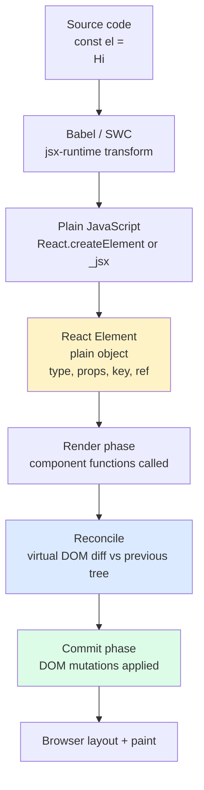
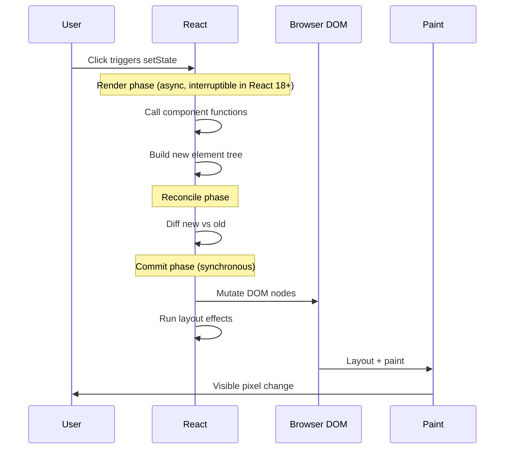

# 3.1 JSX and Rendering

> JSX is the HTML-like syntax React uses to describe UI. It is not a template language; it is syntactic sugar over `React.createElement` that compiles to plain JavaScript function calls. Understanding what JSX actually produces — and what "rendering" really means inside React — is the difference between writing React by guesswork and writing it with intent.

## 3.1.1 Objective

By the end of this note you should be able to:

1. Explain in your own words what JSX compiles to and why.
2. Trace a single JSX expression from source code to a real DOM node.
3. Recite the rules of JSX (single root, camelCase, expression vs statement, `null`/`undefined`/`false` rendering nothing).
4. Choose the correct conditional-rendering pattern for a given situation and explain the trade-offs.
5. Articulate why React does not ship a templating language and what that buys you.
6. Explain how the React 19+ React Compiler changes the performance story.
7. Reason about "rendering" not as a DOM operation but as a plain function call.

## 3.1.2 Background Knowledge

Before reading further, make sure you are comfortable with:

- **JavaScript expressions vs statements.** An expression evaluates to a value (`1 + 2`, `user.name`, `cond ? a : b`). A statement performs an action (`if`, `for`, `return`, `throw`). JSX can only embed expressions.
- **ES6+ destructuring, spread, arrow functions, template literals.** React code lives and dies by these.
- **What `React.createElement(type, props, ...children)` does.** It returns a plain JavaScript object describing an element. Nothing more.
- **The DOM is a tree of real browser objects** with methods like `appendChild`, `removeChild`, `setAttribute`. React ultimately calls these.
- **Babel / SWC** are compilers that transform modern JavaScript (and JSX) into JavaScript the browser understands. SWC (Rust-based, used by Next.js and Vite's React plugin) is roughly 20x faster than Babel but does the same job for our purposes.

If any of the above feels fuzzy, stop and review. JSX is mostly JavaScript; pretending it is HTML is the source of most beginner confusion.

## 3.1.3 Core Concepts

### 3.1.3.1 JSX Is Syntactic Sugar

Every JSX tag is a function call in disguise. This JSX:

```jsx
const button = <Button variant="primary">Save</Button>;
```

is exactly equivalent to this JavaScript:

```jsx
const button = React.createElement(Button, { variant: "primary" }, "Save");
```

The output of `React.createElement` is a plain old JavaScript object — a "React element" — that looks roughly like this:

```js
{
  $$typeof: Symbol(react.element),
  type: Button,
  key: null,
  ref: null,
  props: { variant: "primary", children: "Save" },
  _owner: null,
}
```

> [!note] Element vs Component vs Instance
> A **component** is a function (or class) that returns an element. An **element** is the plain object describing what should be on screen. An **instance** is the actualized component state held by React's reconciler (relevant mostly for class components; function components have no user-visible instance, but React still tracks fiber nodes internally).

### 3.1.3.2 The Compile Pipeline (Babel and SWC)

Babel's `@babel/preset-react` (or SWC's `swc` parser with `jsc.parser.syntax: "ecmascript"` and `jsx: true`) rewrites JSX at build time. The transformation rule is mechanical:

- Lowercase tags (`<div>`) become strings (`"div"`).
- Capitalized tags (`<Button>`) become identifier references (`Button`).
- Attributes become the props object.
- Children become the third argument and beyond.
- `{}` in JSX switches into "JavaScript expression mode" until the closing `}`.

With the React 17+ automatic JSX runtime (`automatic` instead of `classic`), the compiler injects imports from `react/jsx-runtime` instead of needing `React` in scope:

```jsx
// Source
import { useState } from "react";
function App() {
  return <div className="x">{useState(0)[0]}</div>;
}
```

```js
// Compiled output (approximate, automatic runtime)
import { jsx as _jsx } from "react/jsx-runtime";
import { useState } from "react";
function App() {
  return _jsx("div", {
    className: "x",
    children: useState(0)[0],
  });
}
```

> [!tip] You can inspect the compiled output
> The [Babel REPL](https://babeljs.io/repl) and [SWC Playground](https://swc.rs/playground) show exactly what your JSX compiles to. Paste any JSX in. Senior engineers do this regularly when a JSX expression looks weird.

### 3.1.3.3 What "Rendering" Actually Means

In React, "rendering" is **calling your component function** (and any nested components it returns). It is not painting pixels. It is not even touching the DOM. It is just function calls that return element objects.

The full pipeline from a state change to a painted pixel is:

1. **Trigger.** A state update (`setState`, a parent re-render, an external store signal) schedules a render.
2. **Render phase.** React calls your component functions. Pure function calls. No DOM. Produces a new tree of React elements.
3. **Reconciliation.** React compares (diffs) the new element tree against the previous one. It decides which DOM nodes must be created, updated, or removed. The unit of diffing is the component (or element), not the DOM node.
4. **Commit phase.** React applies the changes to the real DOM in one synchronous burst. Refs are updated, layout effects run.
5. **Browser paint.** The browser does its own layout and paint. This is the part covered in [[1.13 CSS Performance]].

Only phases 1-4 are React's responsibility. Step 5 is the browser. When people say "React is slow", they usually mean either the render phase is doing too much work or the commit phase is making the browser repaint too much.

> [!danger] Misuse of "render"
> Many tutorials say "the DOM re-rendered". Strictly, the DOM was updated. "Render" in React means "we called your function again". Conflating these two leads to wrong mental models about performance.

### 3.1.3.4 The Rules of JSX

**Rule 1 — Single root.** A component must return a single root node. Use a Fragment (`<>...</>` or `<Fragment>`) when you need multiple top-level nodes:

```jsx
function User({ name, email }) {
  return (
    <>
      <h2>{name}</h2>
      <p>{email}</p>
    </>
  );
}
```

Fragments produce no extra DOM node, unlike wrapping in a `<div>` which would pollute the layout.

**Rule 2 — camelCase for attributes.** HTML uses `class`, `for`, `tabindex`. JSX uses `className`, `htmlFor`, `tabIndex`. This is because JSX attributes become JavaScript object keys, and `class`/`for` are reserved-ish in older JS engines. Event handlers are `onClick`, `onChange`, `onSubmit`, etc. — always camelCased.

**Rule 3 — Expression vs statement.** The `{}` inside JSX evaluates a single expression. You cannot put `if`, `for`, `while`, or `return` inside `{}`. Use ternaries, `&&`, `??`, IIFEs, or extract to a variable above the JSX.

**Rule 4 — `null`, `undefined`, `false`, `true` render nothing.** This is what makes `{cond && <Foo />}` work — when `cond` is false, React renders nothing. Beware: `0` and `""` (empty string) **do** render. See [[#3.1.7 Common Mistakes]].

**Rule 5 — All tags must close.** `` not ``. Self-closing tags need the `/>`. Children must be explicitly closed: `<p></p>` not `<p>`.

**Rule 6 — Booleans, objects, and functions are not valid children.** `{true}` renders nothing but `{new Date()}` throws (objects aren't valid React elements). Functions don't render unless you call them: `{() => <Foo/>}` renders nothing; `{renderFoo()}` or `{<Foo/>}` works.

### 3.1.3.5 Conditional Rendering Patterns

React gives you JavaScript. Use JavaScript for conditionals:

```jsx
// 1. Ternary — use when both branches return JSX
{isLoggedIn ? <Dashboard /> : <Login />}

// 2. && — use when one branch is "nothing"
{hasError && <ErrorMessage />}

// 3. Early return — use for top-level guards
function Profile({ user }) {
  if (!user) return <Login />;
  return <div>{user.name}</div>;
}

// 4. IIFE — use sparingly, extract a variable or component instead
{(function () {
  if (status === "loading") return <Spinner />;
  if (status === "error") return <Error />;
  return <Data />;
})()}

// 5. Extracted component — preferred for non-trivial logic
function Content({ status }) {
  if (status === "loading") return <Spinner />;
  if (status === "error") return <Error />;
  return <Data />;
}
```

The senior engineer's instinct: **if the conditional takes more than one line, extract a variable above the return**, or extract a child component. JSX should remain readable.

### 3.1.3.6 Fragments

Two flavors:

```jsx
import { Fragment } from "react";

// Short syntax — no key support
function List() {
  return (
    <>
      <dt>Apple</dt>
      <dd>A fruit</dd>
    </>
  );
}

// Long syntax — supports key (useful in .map)
function Glossary({ items }) {
  return items.map((item) => (
    <Fragment key={item.id}>
      <dt>{item.term}</dt>
      <dd>{item.def}</dd>
    </Fragment>
  ));
}
```

> [!warning] `<>` cannot take a `key` prop
> The short fragment syntax rejects any props. If you are inside `.map()` and need a key, use `<Fragment key={...}>` from `react`. Without a key, React warns and may misbehave on reordering. See [[3.5 Lists and Keys]].

### 3.1.3.7 Why React Doesn't Ship a Templating Language

Vue and Svelte ship templating languages with their own directives (`v-if`, `v-for`, `{#each}`, `{#if}`). React ships JSX, which is "JavaScript with angle brackets". The trade-offs:

- **Templating languages are easier to learn** because the directive set is finite. You learn `v-if` once.
- **JSX has no ceiling** because anything JavaScript can do, JSX can do. No need to learn a DSL for filtering, sorting, or mapping.
- **Templates separate view from logic** by force. JSX lets you co-locate them. Whether that is good depends on your taste and team.
- **Templates can be statically analyzed** for reactivity (Svelte compiler knows which variables a template touches). JSX requires the React Compiler (more below) or manual `useMemo`/`useCallback`.

React's bet: a powerful, unbounded tool is better than a constrained DSL once you cross a certain app complexity. The cost is a steeper on-ramp.

### 3.1.3.8 The React 19+ Compiler

Before 2024, React developers had to manually optimize with `useMemo`, `useCallback`, and `React.memo` to prevent unnecessary re-renders. The React Compiler (formerly "React Forget"), released as stable in 2025 with React 19, is a Babel plugin that automatically memoizes component outputs and computed values. Under the hood, the compiler inserts the equivalent of `useMemo` and `useCallback` calls based on static analysis of dependencies.

What this means in practice:

- You write idiomatic React without manual memoization.
- The compiler ensures that if a component's inputs (props, state, context) have not changed, its output is reused.
- Existing manual `useMemo` calls still work and are not broken.

> [!tip] Compiler is opt-in
> The compiler is not enabled by default. You opt in via `babel-plugin-react-compiler` (or the SWC equivalent). Many teams enable it gradually per-folder. Until your project has it on, the manual `useMemo`/`useCallback` guidance still applies — see [[3.6 Hooks (Built-In)]] and [[3.11 Performance Optimization]].

## 3.1.4 Detailed Walkthrough

Let us trace one button click from a state change all the way to a painted pixel.

Imagine this component:

```jsx
import { useState } from "react";

function Counter() {
  const [count, setCount] = useState(0);
  return (
    <button onClick={() => setCount(count + 1)}>
      Clicked {count} times
    </button>
  );
}
```

Step by step:

1. **Mount.** React calls `Counter()`. It returns an element `{ type: 'button', props: { onClick: ..., children: ['Clicked ', 0, ' times'] } }`.
2. **Reconcile (mount).** There is no previous tree, so React creates everything. It calls `document.createElement('button')`, attaches the click listener, sets `textContent`. This is the commit phase.
3. **Browser paints.** The user sees "Clicked 0 times".
4. **User clicks.** The browser fires the native click event. React's synthetic event system (which sits on top of native events; see [[3.3 State and Events]]) dispatches the handler.
5. **Handler calls `setCount(count + 1)`.** This schedules a re-render. (In React 18+, this update is batched with any other updates in the same tick.)
6. **Trigger  -->  render phase.** React calls `Counter()` again. The function runs from top to bottom — `useState(0)` returns the new value `[1, setCount]`. The returned element is now `{ type: 'button', props: { onClick: ..., children: ['Clicked ', 1, ' times'] } }`.
7. **Reconcile.** React compares the new element tree against the previous one. The `type` is the same (`'button'`), the `onClick` ref is the same function identity (well, in this case a new function each render — but React doesn't care about that for diffing), the children differ only in the middle value `0  -->  1`.
8. **Commit.** React walks the diff and decides "update the second child text node from `0` to `1`". It calls `node.nodeValue = '1'` on the actual text node. One DOM mutation.
9. **Browser paints.** The user sees "Clicked 1 times".

Notice: the render phase was cheap (one function call), the reconcile phase was cheap (small diff), and the commit phase made exactly one DOM update. This is the React performance promise — *if* your component tree is structured so that most of it does not change.

The crucial insight: **calling `Counter()` again is not expensive.** React is not naive; it does not blow away the DOM. The render phase just produces a description. The reconcile phase decides what actually changes.

## 3.1.5 Practical Examples

### 3.1.5.1 Conditional rendering with extracted component

```jsx
function UserGreeting({ user }) {
  if (!user) return <LoginButton />;
  if (user.isLoading) return <Spinner />;
  if (user.error) return <ErrorMessage error={user.error} />;
  return <Profile user={user.data} />;
}

function App({ user }) {
  return (
    <header>
      <Logo />
      <nav>
        <UserGreeting user={user} />
      </nav>
    </header>
  );
}
```

Each branch is one line. The parent stays readable. Compare to a nested ternary in JSX, which would be hard to scan.

### 3.1.5.2 Spread props

```jsx
function Button({ variant, ...rest }) {
  return (
    <button
      {...rest}
      className={`btn btn-${variant} ${rest.className ?? ""}`}
    />
  );
}

// Usage
<Button variant="primary" onClick={handleClick} disabled={isSubmitting}>
  Save
</Button>
```

> [!warning] Spread carefully
> Spread (`{...rest}`) is convenient but hides which props a component accepts. Use it for "pass-through" wrappers (a styled wrapper around a native element) and for "rest" patterns where the explicit props are documented. Never spread arbitrary objects just to save typing — it kills IDE autocomplete and makes refactoring painful. See [[3.2 Components and Props]].

### 3.1.5.3 Lists with keys (preview)

```jsx
function Todos({ todos }) {
  return (
    <ul>
      {todos.map((todo) => (
        <li key={todo.id}>{todo.text}</li>
      ))}
    </ul>
  );
}
```

`key` is the only prop with a special meaning to React. See [[3.5 Lists and Keys]] for the full story of why index-as-key is usually wrong.

### 3.1.5.4 The empty children gotcha

```jsx
function Bad({ items }) {
  return <div>{items.length && <ItemList items={items} />}</div>;
}
// When items is empty, renders <div>0</div> — visible zero!

function Good({ items }) {
  return <div>{items.length > 0 && <ItemList items={items} />}</div>;
}
// When items is empty, renders <div></div> — clean.
```

This single bug has wasted thousands of cumulative engineering hours.

## 3.1.6 Mermaid Diagrams

### 3.1.6.1 The JSX-to-DOM Pipeline



### 3.1.6.2 Render vs Commit vs Paint



## 3.1.7 Common Mistakes

1. **Treating JSX as HTML.** JSX uses `className` not `class`, `htmlFor` not `for`, `tabIndex` not `tabindex`. Copy-pasting HTML into JSX fails on these.

2. **Using `if` inside `{}`.** `{if (cond) <Foo />}` is a syntax error — `if` is a statement, not an expression. Use a ternary or extract to a variable.

3. **The `0` from `&&`.** `{count && <Foo/>}` renders `0` when `count` is 0. Always coerce or test: `{count > 0 && <Foo/>}` or `{Boolean(count) && <Foo/>}` or `{count ? <Foo/> : null}`.

4. **Forgetting to close tags.** `<input type="text">` is a JSX parse error. Must be `<input type="text" />`. Same for `<br>`, ``, `<hr>`.

5. **Using `for` as a variable name in JSX children.** `{items.for(x => ...)}` works because `for` here is a property access, but `{for (let i = 0; ...) ...}` inside JSX is invalid. ESLint catches most of these.

6. **Spread-prop surprises.** `<Comp {...obj} a="1" />` — the explicit `a="1"` wins only because it comes after the spread. Reverse the order and the spread value wins. Always be explicit about precedence.

7. **Multiple top-level nodes without a Fragment.** `return <div/><div/>;` is a parse error. Wrap in `<>...</>` or return an array (fragments are preferred over arrays).

8. **Treating `render` as the bottleneck by default.** React's render is just function calls. The expensive parts are usually effects (see [[3.8 Effects and Side Effects]]) or large commits. Don't memoize blindly.

9. **`key` on a component at the top level (not in a list).** `<Foo key="x" />` outside a list is silently ignored. `key` only matters among siblings within a list/iterator.

10. **Assuming JSX escaping works like HTML.** `<div>{`<script>${userInput}</script>`}</div>` does NOT execute the script — React escapes strings as text content. But `<div dangerouslySetInnerHTML={{__html: userInput}} />` does. Know the difference.

## 3.1.8 Best Practices

1. **Extract conditionals into named sub-components.** If your JSX has a ternary spanning 5+ lines, extract. Names communicate intent better than nested JSX does.

2. **Use the short Fragment syntax `<>` by default; switch to `<Fragment key={...}>` only when you need a key inside a list.**

3. **Capitalize component names.** `<button>` is a DOM element; `<Button>` is a component. The capitalization is what tells JSX which one you mean. This is not a convention — it is how the compiler decides between `"button"` (string type) and `Button` (identifier reference).

4. **Prefer early returns for guard clauses** rather than nesting everything in a giant ternary. Reads like prose.

5. **Avoid `dangerouslySetInnerHTML` unless you control the input.** The name is a warning, not a suggestion. If you must use it (e.g., rendering Markdown output), sanitize first with DOMPurify.

6. **Don't put comments inside JSX tag attributes.** `/* */` works between attributes but `//` doesn't. Always use `{/* */}` inside JSX children, never `//`.

7. **Co-locate styles, tests, and components in the same folder** (see [[3.15 Project Architecture and Folder Organization]]). Imports stay short, refactor tooling works smoothly.

8. **Turn on the React Compiler** when you adopt React 19+. The productivity win is large; the migration risk is small.

9. **Use TypeScript with strict JSX types.** `React.ReactNode`, `React.JSX.Element`, and `React.ComponentProps<typeof Button>` are tools that catch entire categories of bugs at compile time.

10. **Profile before optimizing.** The React DevTools Profiler shows which components render and how long they take. Most "performance problems" turn out to be one or two hot components, not the whole tree. See [[3.11 Performance Optimization]].

## 3.1.9 Mini Exercises

### Exercise 1 — Translate JSX to `createElement`

Convert this JSX into `React.createElement` calls (classic runtime):

```jsx
<Card variant="elevated">
  <Card.Header title="Welcome" />
  <Card.Body>
    <p>You have {count} unread messages.</p>
    {count > 0 && <Badge value={count} />}
  </Card.Body>
</Card>
```

**Solution:**

```js
React.createElement(
  Card,
  { variant: "elevated" },
  React.createElement(Card.Header, { title: "Welcome" }),
  React.createElement(
    Card.Body,
    null,
    React.createElement("p", null, "You have ", count, " unread messages."),
    count > 0 && React.createElement(Badge, { value: count })
  )
);
```

**Reasoning.** Each tag becomes a `createElement` call. The first argument is the component (capitalized  -->  identifier) or the tag name (lowercase  -->  string). The second argument is the props object (`null` if none). The remaining arguments are children, in order, flattened. Expressions in `{}` are evaluated as JavaScript. The `&&` short-circuits to `false` when `count === 0`, and `React.createElement` simply ignores `false` children (it renders nothing).

**Common wrong approach.** Wrapping `Card.Body`'s children in an array `[..., ...]`. Not necessary — `createElement` accepts variadic children.

### Exercise 2 — Fix the broken JSX

Find every bug in this component:

```jsx
function Welcome(props) {
  return (
    <div class="welcome">
      {if (props.user) <h1>Hello, {props.user.name}</h1>}
      
      <input type="text" value={props.query} oninput={props.onQueryChange} />
    </div>
  );
}
```

**Solution.**

```jsx
function Welcome({ user, avatar, query, onQueryChange }) {
  return (
    <div className="welcome">
      {user ? <h1>Hello, {user.name}</h1> : null}
      
      <input type="text" value={query} onChange={onQueryChange} />
    </div>
  );
}
```

**Bugs and fixes:**
1. `class`  -->  `className` (JSX rule 2).
2. `if` inside `{}` is invalid — replaced with ternary (rule 3).
3. `` not self-closed — added `/>` (rule 5).
4. Missing `alt` attribute on `` (accessibility; see [[1.11 Accessibility in CSS]]).
5. `oninput`  -->  `onChange` (camelCase, rule 2).
6. Bonus: destructured `props` for readability, added a fallback `null` branch.

**Common wrong approach.** Adding `key` to the `<h1>` — unnecessary at top level, ignored by React. Or wrapping the conditional in an IIFE — works but uglier than a ternary for a single branch.

### Exercise 3 — Render a list with proper keys

Given:

```js
const fruits = [
  { id: "a1", name: "Apple", emoji: "" },
  { id: "b2", name: "Banana", emoji: "" },
  { id: "c3", name: "Cherry", emoji: "" },
];
```

Write a component that renders these as a list of `<li>` with the emoji and name. Then write a "wrong" version using index keys and explain when the wrong version would actually cause a visible bug.

**Solution (correct):**

```jsx
function FruitList({ fruits }) {
  return (
    <ul>
      {fruits.map((f) => (
        <li key={f.id}>
          <span aria-hidden>{f.emoji}</span> {f.name}
        </li>
      ))}
    </ul>
  );
}
```

**Solution (wrong, index keys):**

```jsx
function FruitList({ fruits }) {
  return (
    <ul>
      {fruits.map((f, i) => (
        <li key={i}>
          <span aria-hidden>{f.emoji}</span> {f.name}
        </li>
      ))}
    </ul>
  );
}
```

**When the wrong version breaks visibly.** Imagine each `<li>` contained a controlled text input where the user typed per-item notes. Now the user reorders the list (drag-and-drop) or removes the middle item. With `key={i}`, React thinks "item at index 1 is still item at index 1" and reuses the same `<li>` DOM node and the same component state — but the underlying data has shifted. The notes that belonged to "Banana" now appear next to "Cherry". This is exactly the class of bug stable keys prevent. See [[3.5 Lists and Keys]] for the full diffing explanation.

### Exercise 4 — Conditional rendering refactor

Refactor this unreadable JSX into something a junior engineer could understand:

```jsx
function Item({ item }) {
  return (
    <div>
      {item.status === "loading"
        ? <Spinner />
        : item.status === "error"
        ? <ErrorMessage error={item.error} />
        : item.status === "empty"
        ? <EmptyState />
        : <DataView data={item.data} />}
    </div>
  );
}
```

**Solution.**

```jsx
function ItemContent({ item }) {
  switch (item.status) {
    case "loading":
      return <Spinner />;
    case "error":
      return <ErrorMessage error={item.error} />;
    case "empty":
      return <EmptyState />;
    case "ready":
      return <DataView data={item.data} />;
    default:
      return null;
  }
}

function Item({ item }) {
  return (
    <div>
      <ItemContent item={item} />
    </div>
  );
}
```

**Reasoning.** Nested ternaries are linear to write but quadratic to read. A `switch` reads top-to-bottom. Extracting `ItemContent` keeps `Item` itself a one-liner and lets you unit-test the content decision in isolation. The `default: return null` is a safety net for an unexpected status, and TypeScript will warn you at compile time if `item.status` is a union and you forget a case (exhaustiveness check via `never`).

**Common wrong approach.** Replacing with a lookup object `{ loading: Spinner, error: ErrorMessage, ... }`. This works only when the components need no props; here `ErrorMessage` needs `error`, so a lookup object requires extra wiring. The `switch` is clearer for this case.

### Exercise 5 — Explain what "render" means in React

In your own words, in two paragraphs, explain what happens when React "renders" a component, and contrast it with what the browser does when it "renders" a page. Why does this distinction matter for performance?

**Solution (model answer):**

When React "renders" a component, it calls the component function (or class `render` method) and produces a tree of plain JavaScript objects called React elements. No DOM access occurs. No pixels are painted. The output is a description: "I want a `<div>` with this className, containing these children." React then reconciles this new description against the previous one and figures out the minimal set of DOM mutations needed to make the real DOM match. Only after that diff is computed does React commit the changes — synchronously — by calling real DOM APIs like `appendChild`, `removeChild`, or `setProperty`.

The browser, in turn, takes the modified DOM, runs layout (computing geometry), paint (filling pixels), and composite (assembling layers). "Rendering" in the browser sense includes all of layout, paint, and composite. The distinction matters because React's render phase is cheap (function calls) and interruptible in React 18+ (concurrent rendering), while the browser's layout and paint are expensive and not interruptible. When engineers say "React is slow," they are usually blaming React's render phase when in fact the bottleneck is the browser's layout or paint phase, triggered by an oversized commit. Knowing this difference tells you whether to optimize with `useMemo` (render phase), `React.memo` (commit phase prevention), or CSS `contain` / `will-change` (browser layout/paint phase).

## 3.1.10 Summary

- JSX is syntactic sugar for `React.createElement` (or `_jsx` in the automatic runtime). It produces plain JavaScript objects called React elements.
- The render pipeline is: source  -->  compile  -->  element tree  -->  reconcile (diff)  -->  commit (DOM mutations)  -->  browser layout/paint.
- "Rendering" in React just means calling your component function. It is not a DOM operation.
- The rules of JSX: single root, camelCase attributes, expressions only inside `{}`, self-closing tags, `null`/`undefined`/`false` render nothing (but `0` and `""` do).
- Conditional rendering is just JavaScript: ternary, `&&`, early return, IIFE, or extracted component. Prefer the readable options.
- Fragments let you return multiple top-level nodes without adding a DOM wrapper. Use `<Fragment key={...}>` when you need a key inside a list.
- React deliberately ships JSX, not a templating language, because the unbounded power of JavaScript is worth the steeper on-ramp for non-trivial apps.
- The React 19+ Compiler automates the manual memoization that senior engineers previously had to do by hand.

## 3.1.11 Related Notes

- [[3.2 Components and Props]] — what elements become when they have a function as their `type`.
- [[3.3 State and Events]] — what triggers re-renders.
- [[3.4 Forms and Conditional Rendering]] — applied conditional rendering with forms.
- [[3.5 Lists and Keys]] — the `key` prop, the only special prop in JSX.
- [[3.6 Hooks (Built-In)]] — `useState` and friends.
- [[3.8 Effects and Side Effects]] — what happens after the commit phase.
- [[3.11 Performance Optimization]] — `useMemo`, `useCallback`, `React.memo`, and the React Compiler in depth.
- [[1.13 CSS Performance]] — the browser layout/paint phase that follows React's commit.
