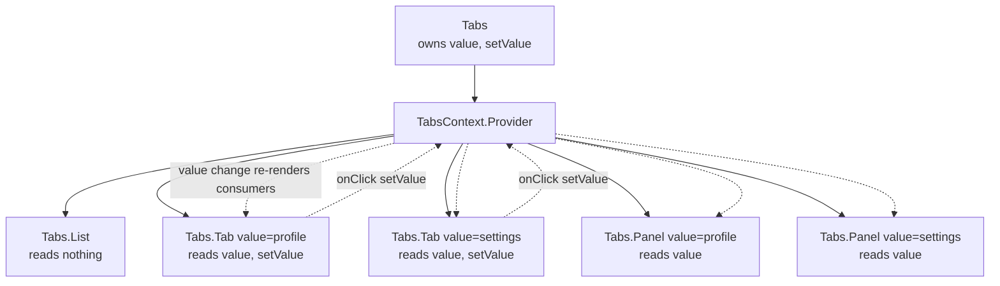
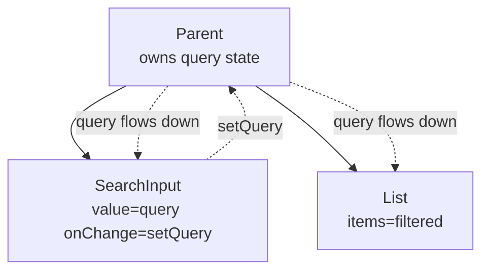

# 3.10 Composition and Patterns

> React's design philosophy is **composition over inheritance**. Instead of building class hierarchies, you build small components and combine them. This note covers the canonical composition patterns: the `children` prop, named slots, compound components, render props, higher-order components (legacy), controlled vs uncontrolled, the provider pattern, the factory pattern for hooks, container vs presentational, the hooks composition pattern, and lifting state up. These patterns are the vocabulary of React architecture — learn them, recognize them, and choose the right one for each job.

## 3.10.1 Objective

By the end of this note you should be able to:

1. Articulate why React favors composition over inheritance and what that means in practice.
2. Use `children` and named props to compose components.
3. Implement the compound components pattern with implicit state shared via Context.
4. Recognize and use the render prop pattern (function-as-child and render-prop variants).
5. Read higher-order components (HOCs) and know when to avoid them.
6. Distinguish controlled vs uncontrolled components and choose between them.
7. Apply the provider pattern for cross-tree state.
8. Use the factory pattern for hooks when configuration is needed.
9. Apply the container/presentational split judiciously (and know why the React team has backed off from it).
10. Lift state up to siblings that need shared state.

## 3.10.2 Background Knowledge

Before reading further, make sure you are comfortable with:

- **Components and props** from [[3.2 Components and Props]] — especially the `children` prop and function-as-child.
- **State and events** from [[3.3 State and Events]] — controlled inputs are revisited here.
- **Custom hooks** from [[3.7 Custom Hooks]] — the factory pattern builds on hooks.
- **Context** from [[3.9 Context and Reducers]] — compound components and the provider pattern use Context.
- **Performance** from [[3.11 Performance Optimization]] — patterns affect re-render behavior.

## 3.10.3 Core Concepts

### 3.10.3.1 Composition over Inheritance

React does not use inheritance for component composition. There is no `class PrimaryButton extends Button`. Instead, you compose: a `Button` accepts props for variant, size, icon; a `PrimaryButton` is just `<Button variant="primary" />`. If you need to *extend* behavior, you wrap: `<Tooltip><Button /></Tooltip>`.

Why? Inheritance hierarchies get brittle quickly: a `PrimaryIconButton` would need to extend both `PrimaryButton` and `IconButton`, and multiple inheritance is a mess. Composition lets you mix and match freely: `<Button variant="primary" icon={...} />`.

> [!note] Inheritance is still used for one thing
> Class components can extend `React.Component` or `React.PureComponent`. That's the only place inheritance appears in idiomatic React. You won't see component-to-component inheritance.

### 3.10.3.2 The `children` Prop

`children` is the implicit prop that lets a component wrap others:

```jsx
function Card({ children }) {
  return <div className="card">{children}</div>;
}

<Card>
  <h1>Title</h1>
  <p>Body</p>
</Card>
```

`children` is the most basic composition primitive. It's especially powerful because React handles it specially: it can be a string, a number, an element, an array, a function, or `null`/`undefined`/`false`.

### 3.10.3.3 Named Slots (Props as Slots)

When you need more than one "slot" for content, pass elements as named props:

```jsx
function Layout({ header, sidebar, main, footer }) {
  return (
    <div className="layout">
      <header>{header}</header>
      <div className="body">
        <aside>{sidebar}</aside>
        <main>{main}</main>
      </div>
      <footer>{footer}</footer>
    </div>
  );
}

<Layout
  header={<Header />}
  sidebar={<Sidebar />}
  main={<Article />}
  footer={<Footer />}
/>
```

This is the **slots pattern** — borrowed from Web Components and Vue. It's clearer than relying solely on `children` when there are multiple distinct regions.

### 3.10.3.4 Compound Components

The compound components pattern lets you build an API like:

```jsx
<Tabs defaultValue="profile">
  <Tabs.List>
    <Tabs.Tab value="profile">Profile</Tabs.Tab>
    <Tabs.Tab value="settings">Settings</Tabs.Tab>
  </Tabs.List>
  <Tabs.Panel value="profile">Profile content</Tabs.Panel>
  <Tabs.Panel value="settings">Settings content</Tabs.Panel>
</Tabs>
```

The user composes the UI from sub-components that share implicit state. The user doesn't pass `value`/`onChange` between them — that's handled via Context.

```jsx
const TabsContext = createContext(null);

function Tabs({ defaultValue, children }) {
  const [value, setValue] = useState(defaultValue);
  return (
    <TabsContext.Provider value={{ value, setValue }}>
      {children}
    </TabsContext.Provider>
  );
}

Tabs.List = function TabsList({ children }) {
  return <div role="tablist">{children}</div>;
};

Tabs.Tab = function TabsTab({ value, children }) {
  const { value: active, setValue } = useContext(TabsContext);
  return (
    <button role="tab" aria-selected={active === value} onClick={() => setValue(value)}>
      {children}
    </button>
  );
};

Tabs.Panel = function TabsPanel({ value, children }) {
  const { value: active } = useContext(TabsContext);
  if (active !== value) return null;
  return <div role="tabpanel">{children}</div>;
};
```

Key benefits:

- **Implicit state.** The user doesn't have to thread `value`/`onChange` between `Tabs.List`, `Tabs.Tab`, and `Tabs.Panel`.
- **Flexible composition.** The user can put the panels anywhere (even outside the list) and reorder freely.
- **API discoverability.** `Tabs.List`, `Tabs.Tab`, `Tabs.Panel` autocomplete in editors.

This is the pattern behind Radix UI, Headless UI, and shadcn/ui.

### 3.10.3.5 Render Props

A **render prop** is a function prop that the component calls to determine what to render. It's an alternative to `children` for cases where the component needs to pass data back to the rendered content.

```jsx
function MouseTracker({ render }) {
  const [pos, setPos] = useState({ x: 0, y: 0 });
  useEffect(() => {
    const handler = (e) => setPos({ x: e.clientX, y: e.clientY });
    window.addEventListener("mousemove", handler);
    return () => window.removeEventListener("mousemove", handler);
  }, []);
  return render(pos);
}

<MouseTracker render={({ x, y }) => <p>Mouse at {x}, {y}</p>} />
```

The function-as-child variant uses `children` as the render prop:

```jsx
function MouseTracker({ children }) {
  // ... same as above
  return children(pos);
}

<MouseTracker>
  {({ x, y }) => <p>Mouse at {x}, {y}</p>}
</MouseTracker>
```

Render props were the dominant pattern for reusable stateful logic before hooks. They're still useful for:

- **Passing data back to the rendered content.** (The use case above.)
- **Conditional rendering controlled by the parent.**

But for reusable *stateful logic*, custom hooks (see [[3.7 Custom Hooks]]) are almost always better — no nesting, no callback hell.

### 3.10.3.6 Higher-Order Components (HOCs) — Legacy

A higher-order component is a function that takes a component and returns a new component:

```jsx
function withAuth(Component) {
  return function AuthenticatedComponent(props) {
    const { user } = useAuth();
    if (!user) return <LoginScreen />;
    return <Component {...props} user={user} />;
  };
}

const Dashboard = withAuth(DashboardInner);
```

HOCs were the pre-hooks pattern for sharing stateful logic. They have problems:

- **Prop collisions.** Two HOCs might both inject `user`.
- **Wrapper hell.** `<withAuth(withTheme(withRouter(Component)))>` in DevTools.
- **Static methods don't get hoisted automatically.** You need to manually copy them.
- **Refs don't forward automatically.** You need `forwardRef`.

You'll still see HOCs in older codebases (notably `connect` from react-redux, `withRouter` from react-router v5). New code should use hooks and composition.

> [!warning] Don't write new HOCs
> If you find yourself reaching for an HOC, ask whether a custom hook or a wrapper component would work. It almost always will, and the result will be cleaner.

### 3.10.3.7 Controlled vs Uncontrolled Components

A **controlled** component's state is driven by props (typically `value` + `onChange`). An **uncontrolled** component manages its own state internally and exposes it via a ref.

```jsx
// Controlled
function ControlledInput({ value, onChange }) {
  return <input value={value} onChange={e => onChange(e.target.value)} />;
}

// Uncontrolled
function UncontrolledInput({ defaultValue }) {
  const ref = useRef();
  return <input defaultValue={defaultValue} ref={ref} />;
}
```

| Aspect | Controlled | Uncontrolled |
| --- | --- | --- |
| Source of truth | Parent (via `value`/`onChange`) | The DOM itself (via `ref`) |
| React tracks state | Yes | No |
| Validation on every keystroke | Easy | Hard |
| Resetting programmatically | Set `value` | Manipulate the ref |
| Performance | Re-renders on every keystroke | Doesn't re-render on keystrokes |

The React team recommends controlled by default. Use uncontrolled for:

- Forms where you only care about the final value on submit (use `FormData`).
- Inputs that re-render expensive trees on every keystroke (rare).

`<input>` accepts both `value` (controlled) and `defaultValue` (uncontrolled, initial only). Mixing them warns.

### 3.10.3.8 The Provider Pattern

A provider wraps part of the tree and exposes state via Context. We covered this in [[3.9 Context and Reducers]]; here we re-frame it as a composition pattern:

```jsx
function App() {
  return (
    <AuthProvider>
      <ThemeProvider>
        <Router>
          <Routes />
        </Router>
      </ThemeProvider>
    </AuthProvider>
  );
}
```

Providers compose by nesting. Each provider owns a slice of global state. The order matters only when one provider's value depends on another's (e.g., `AuthProvider` reading `theme` — uncommon).

### 3.10.3.9 The Factory Pattern for Hooks

Sometimes a hook needs configuration that should be stable across the app (an API base URL, a default locale). The factory pattern:

```jsx
function createApiClient({ baseUrl, getToken }) {
  return function useApiClient() {
    const token = getToken();
    return useMemo(() => ({
      get: (path) => fetch(`${baseUrl}${path}`, { headers: { Authorization: `Bearer ${token}` } }),
    }), [token]);
  };
}

// At app init:
const useApiClient = createApiClient({
  baseUrl: process.env.API_URL,
  getToken: () => localStorage.getItem("token"),
});

// In any component:
function UserList() {
  const api = useApiClient();
  useEffect(() => { api.get("/users").then(/* ... */); }, [api]);
}
```

This is how libraries like Apollo (`ApolloProvider` + `useQuery`) and TanStack Query (`QueryClientProvider` + `useQuery`) work internally.

### 3.10.3.10 Container vs Presentational

The **container/presentational** split was a popular pre-hooks pattern:

- **Container components** fetch data, manage state, and pass props down. "Smart" components.
- **Presentational components** receive props and render UI. "Dumb" components.

```jsx
// Container
function UserListContainer() {
  const [users, setUsers] = useState([]);
  useEffect(() => fetch("/api/users").then(r => r.json()).then(setUsers), []);
  return <UserList users={users} />;
}

// Presentational
function UserList({ users }) {
  return <ul>{users.map(u => <li key={u.id}>{u.name}</li>)}</ul>;
}
```

The React team has explicitly backed off from this split. With hooks, any component can fetch data and render UI — the split is no longer needed. The new mental model: **components are pure functions of props/state, hooks handle side effects**.

The split is still useful in two cases:

1. **Separating testable logic from rendering.** A `useUserList` hook + a pure `UserList` component.
2. **Adapter layers.** A container that adapts a domain object to a presentational component's props.

But don't enforce it everywhere. It adds boilerplate without benefit for small components.

### 3.10.3.11 Hooks Composition Pattern

The modern equivalent of container/presentational is the **hooks composition pattern**: extract logic into custom hooks, keep components as composition roots.

```jsx
function UserList() {
  const { users, loading, error } = useUserList();
  if (loading) return <Skeleton />;
  if (error) return <ErrorMessage error={error} />;
  return <ul>{users.map(u => <li key={u.id}>{u.name}</li>)}</ul>;
}

function useUserList() {
  const { data, error, loading } = useFetch("/api/users");
  return { users: data, error, loading };
}
```

`UserList` is now a "pure rendering" component that delegates all logic to hooks. The hooks are testable in isolation.

### 3.10.3.12 Lifting State Up

When two siblings need shared state, lift it to their common parent:

```jsx
function SearchableList({ items }) {
  const [query, setQuery] = useState("");
  const filtered = items.filter(i => i.name.includes(query));
  return (
    <>
      <SearchInput value={query} onChange={setQuery} />
      <List items={filtered} />
    </>
  );
}
```

`SearchInput` and `List` are siblings; the shared `query` lives in their parent. This is the standard React pattern for shared sibling state.

When the shared state needs to be accessible many levels up, lift it higher. When it needs to be accessible across unrelated subtrees, use Context (see [[3.9 Context and Reducers]]).

## 3.10.4 Detailed Walkthrough

### 3.10.4.1 Building a Compound `Select`

```jsx
const SelectContext = createContext(null);

function Select({ value, onChange, children }) {
  const [open, setOpen] = useState(false);
  const contextValue = useMemo(
    () => ({ value, onChange, open, setOpen }),
    [value, onChange, open]
  );
  return (
    <SelectContext.Provider value={contextValue}>
      <div className="select">{children}</div>
    </SelectContext.Provider>
  );
}

Select.Trigger = function SelectTrigger({ children }) {
  const { value, open, setOpen } = useContext(SelectContext);
  return (
    <button onClick={() => setOpen(!open)}>
      {children ?? value}
    </button>
  );
};

Select.Option = function SelectOption({ value, children }) {
  const { value: selected, onChange, setOpen } = useContext(SelectContext);
  return (
    <li
      role="option"
      aria-selected={selected === value}
      onClick={() => { onChange(value); setOpen(false); }}
    >
      {children}
    </li>
  );
};

Select.Options = function SelectOptions({ children }) {
  const { open } = useContext(SelectContext);
  if (!open) return null;
  return <ul role="listbox">{children}</ul>;
};
```

Usage:

```jsx
<Select value={color} onChange={setColor}>
  <Select.Trigger>Pick a color</Select.Trigger>
  <Select.Options>
    <Select.Option value="red">Red</Select.Option>
    <Select.Option value="green">Green</Select.Option>
    <Select.Option value="blue">Blue</Select.Option>
  </Select.Options>
</Select>
```

The user gets a clean, declarative API. State, click handling, and ARIA wiring are all internal.

### 3.10.4.2 Render Prop for a Virtualized List

```jsx
function VirtualList({ items, rowHeight, renderRow }) {
  const [scrollTop, setScrollTop] = useState(0);
  const startIndex = Math.floor(scrollTop / rowHeight);
  const endIndex = Math.min(items.length, startIndex + 50);
  const visible = items.slice(startIndex, endIndex);

  return (
    <div
      onScroll={(e) => setScrollTop(e.currentTarget.scrollTop)}
      style={{ height: 500, overflowY: "auto" }}
    >
      <div style={{ height: items.length * rowHeight, position: "relative" }}>
        {visible.map((item, i) => (
          <div key={startIndex + i} style={{ position: "absolute", top: (startIndex + i) * rowHeight }}>
            {renderRow(item)}
          </div>
        ))}
      </div>
    </div>
  );
}

<VirtualList items={rows} rowHeight={40} renderRow={(row) => <Row data={row} />} />
```

The render prop lets the parent decide how each row is rendered, while the `VirtualList` handles the virtualization logic. (For production, use `react-window` — see [[3.11 Performance Optimization]].)

### 3.10.4.3 A Modern HOC-free Auth Wrapper

The HOC `withAuth(Component)` is better written as a wrapper component:

```jsx
function AuthGate({ children }) {
  const { user, status } = useAuth();
  if (status === "loading") return <FullScreenSpinner />;
  if (!user) return <LoginScreen />;
  return children;
}

function App() {
  return (
    <AuthProvider>
      <AuthGate>
        <Dashboard />
      </AuthGate>
    </AuthProvider>
  );
}
```

No prop collisions, no wrapper hell, no static-hoisting issues. If you need to inject `user` as a prop, do it via Context (which we did — `useAuth` reads it).

### 3.10.4.4 Controlled vs Uncontrolled in Practice

```jsx
// Controlled: parent owns the value
function ControlledForm() {
  const [email, setEmail] = useState("");
  const isValid = email.includes("@");
  return (
    <>
      <input value={email} onChange={e => setEmail(e.target.value)} />
      <button disabled={!isValid}>Submit</button>
    </>
  );
}

// Uncontrolled: DOM owns the value, read on submit
function UncontrolledForm() {
  const formRef = useRef();
  const handleSubmit = (e) => {
    e.preventDefault();
    const formData = new FormData(formRef.current);
    console.log(formData.get("email"));
  };
  return (
    <form ref={formRef} onSubmit={handleSubmit}>
      <input name="email" defaultValue="" />
      <button type="submit">Submit</button>
    </form>
  );
}
```

Controlled is right when you need live validation. Uncontrolled is right for simple submit-only forms (and is the foundation of Next.js Server Actions — see [[4.7 Server Actions and Forms]]).

## 3.10.5 Practical Examples

### 3.10.5.1 A `Dialog` with Slots

```jsx
function Dialog({ open, onClose, title, children, footer }) {
  if (!open) return null;
  return (
    <div className="dialog-overlay" onClick={onClose}>
      <div className="dialog" onClick={e => e.stopPropagation()}>
        <h2 className="dialog-title">{title}</h2>
        <div className="dialog-body">{children}</div>
        <div className="dialog-footer">{footer}</div>
      </div>
    </div>
  );
}

<Dialog
  open={open}
  onClose={() => setOpen(false)}
  title="Confirm deletion"
  footer={<><button onClick={() => setOpen(false)}>Cancel</button><button onClick={onDelete}>Delete</button></>}
>
  Are you sure you want to delete this item?
</Dialog>
```

### 3.10.5.2 A `Modal` Provider with Imperative API

```jsx
const ModalContext = createContext(null);

function ModalProvider({ children }) {
  const [modal, setModal] = useState(null);
  const open = useCallback((node) => setModal(node), []);
  const close = useCallback(() => setModal(null), []);
  return (
    <ModalContext.Provider value={{ open, close }}>
      {children}
      {modal}
    </ModalContext.Provider>
  );
}

function useModal() {
  return useContext(ModalContext);
}

// Usage:
function DeleteButton({ itemId }) {
  const { open, close } = useModal();
  return (
    <button onClick={() => open(
      <Dialog open onClose={close} title="Delete?">
        <button onClick={() => { deleteItem(itemId); close(); }}>Yes</button>
      </Dialog>
    )}>
      Delete
    </button>
  );
}
```

### 3.10.5.3 Lifting State for a Filtered List

```jsx
function ProductBrowser({ products }) {
  const [category, setCategory] = useState("all");
  const [sort, setSort] = useState("name");
  const filtered = useMemo(() => {
    let list = category === "all" ? products : products.filter(p => p.category === category);
    return [...list].sort((a, b) => a[sort] > b[sort] ? 1 : -1);
  }, [products, category, sort]);
  return (
    <>
      <FilterBar category={category} onCategoryChange={setCategory} sort={sort} onSortChange={setSort} />
      <ProductGrid products={filtered} />
    </>
  );
}
```

`FilterBar` and `ProductGrid` are siblings. The filter state lives in `ProductBrowser` and flows down to both.

## 3.10.6 Mermaid Diagrams

### 3.10.6.1 Compound Components with Shared Context



### 3.10.6.2 Lifting State Up



## 3.10.7 Common Mistakes

1. **Using inheritance to share behavior.** `class FancyButton extends Button` is non-idiomatic. Compose with props instead.

2. **Forgetting to forward refs in HOCs.** If you must write an HOC, use `forwardRef` to forward the ref to the wrapped component. Otherwise refs point to the wrapper.

3. **Static method loss in HOCs.** HOCs don't automatically hoist static methods. Use `hoistNonReactStatics` (or just don't write HOCs).

4. **Prop collisions in HOCs.** Two HOCs injecting the same prop name silently overwrite. Hooks avoid this entirely.

5. **Mixing `value` and `defaultValue` on the same input.** React warns: a component can be controlled OR uncontrolled, not both.

6. **Overusing the container/presentational split.** Splitting every component into `FooContainer` + `Foo` adds boilerplate without benefit. Use hooks instead.

7. **Passing JSX as `children` when a named slot is clearer.** `<Layout><Header /><Main /></Layout>` doesn't tell Layout where to put each piece. Use named slots: `<Layout header={<Header />} main={<Main />} />`.

8. **Compound components without Context.** Manually threading `value`/`onChange` between `Tabs`, `Tabs.List`, `Tabs.Tab` defeats the pattern's purpose. Use Context.

9. **Render props for stateful logic that should be a hook.** Pre-hooks code used render props for "track mouse position". Today, that's a `useMousePosition()` hook.

10. **Lifting state too high.** If only `ComponentA` and `ComponentB` need shared state, lift it to their nearest common ancestor — not to the app root. Premature lifting creates a "god component".

## 3.10.8 Best Practices

1. **Default to composition.** If you're writing `extends`, stop. If you're writing an HOC, stop. Use props and hooks.

2. **Use named slots for multi-region components.** `<Card header={...} body={...} footer={...} />` is clearer than `<Card><Header /><Body /><Footer /></Card>`.

3. **Use compound components for tightly-coupled UI families.** Tabs, Select, Accordion, Menu — anything where the parts share implicit state.

4. **Use Context inside compound components.** It's the cleanest way to share state without prop drilling.

5. **Prefer custom hooks over render props for reusable logic.** Render props still have a place for "pass data back to rendered content", but for reusable stateful logic, hooks win.

6. **Don't write new HOCs.** Wrap with components instead.

7. **Use controlled components by default.** Reach for uncontrolled only when you don't need live updates.

8. **Lift state to the nearest common ancestor.** Don't lift higher than needed.

9. **Extract logic into hooks, not containers.** The modern split is `useFoo` + `Foo`, not `FooContainer` + `Foo`.

10. **Keep providers small and composable.** Nest `AuthProvider`, `ThemeProvider`, etc. — don't build one mega-provider.

11. **Forward refs when wrapping.** Use `forwardRef` for any component that wraps another and might receive a ref.

## 3.10.9 Mini Exercises

### 3.10.9.1 Build a Compound `Accordion`

**Problem.** Build an `Accordion` with `Accordion.Item`, where each item has a header (clickable) and a panel (collapsible). Items are independent.

**Solution.**

```jsx
const AccordionContext = createContext(null);

function Accordion({ children }) {
  const [openId, setOpenId] = useState(null);
  return (
    <AccordionContext.Provider value={{ openId, setOpenId }}>
      <div className="accordion">{children}</div>
    </AccordionContext.Provider>
  );
}

Accordion.Item = function AccordionItem({ id, children }) {
  return <div className="accordion-item">{children}</div>;
};

Accordion.Header = function AccordionHeader({ id, children }) {
  const { openId, setOpenId } = useContext(AccordionContext);
  const isOpen = openId === id;
  return (
    <button aria-expanded={isOpen} onClick={() => setOpenId(isOpen ? null : id)}>
      {children}
    </button>
  );
};

Accordion.Panel = function AccordionPanel({ id, children }) {
  const { openId } = useContext(AccordionContext);
  if (openId !== id) return null;
  return <div className="accordion-panel">{children}</div>;
};
```

Usage:

```jsx
<Accordion>
  <Accordion.Item id="a">
    <Accordion.Header id="a">Section A</Accordion.Header>
    <Accordion.Panel id="a">Content A</Accordion.Panel>
  </Accordion.Item>
  <Accordion.Item id="b">
    <Accordion.Header id="b">Section B</Accordion.Header>
    <Accordion.Panel id="b">Content B</Accordion.Panel>
  </Accordion.Item>
</Accordion>
```

**Reasoning.** The `Accordion` owns the open state. Each `Accordion.Header` and `Accordion.Panel` reads the context to know if it's open. Items are independent (only one open at a time — for multiple-open, change `openId` to a `Set`). This is the same pattern as `Tabs`.

### 3.10.9.2 Refactor an HOC to a Wrapper Component

**Problem.** Convert this HOC to a wrapper component:

```jsx
function withLogger(Component) {
  return function LoggedComponent(props) {
    useEffect(() => {
      console.log("Render", Component.name, props);
    });
    return <Component {...props} />;
  };
}
```

**Solution.**

```jsx
function Logger({ children }) {
  useEffect(() => {
    console.log("Render", children?.type?.name);
  });
  return children;
}

// Usage:
<Logger>
  <MyComponent foo="bar" />
</Logger>
```

Or, if you need it to wrap a specific component with specific props:

```jsx
function MyComponent({ foo }) {
  return <div>{foo}</div>;
}

// Usage in JSX:
<Logger>
  <MyComponent foo="bar" />
</Logger>
```

**Reasoning.** The wrapper component receives `children` and renders it. The effect runs whenever the wrapper re-renders. This avoids prop collisions (children are just children, not injected props), avoids wrapper hell (only one wrapper layer), and works with `forwardRef` naturally.

**Common wrong approach.** `function Logger(Component) { return function Wrapped(props) { useEffect(...); return <Component {...props} />; }; }` — that's still an HOC. The point is to use composition (children), not function-wrapping.

### 3.10.9.3 Diagnose a Controlled/Uncontrolled Warning

**Problem.** This component sometimes warns: "A component is changing an uncontrolled input to be controlled." Why?

```jsx
function EmailInput({ value, onChange }) {
  return <input value={value} onChange={onChange} />;
}
```

**Solution.** When `value` is `undefined` (the parent hasn't set it yet), `<input value={undefined}>` is uncontrolled. When the parent later sets `value = "alice@example.com"`, the input becomes controlled. React warns because switching modes mid-lifecycle is a bug.

**Fix.** Default `value` to `""`:

```jsx
function EmailInput({ value = "", onChange }) {
  return <input value={value} onChange={onChange} />;
}
```

Or, ensure the parent always initializes state with a string: `useState("")` rather than `useState(null)`.

**Reasoning.** `value={undefined}` makes the input uncontrolled. `value={null}` does too. Always pass a defined string (or use `defaultValue` for uncontrolled). The fix is to default at the boundary — either in the input component or in the parent's `useState` initializer.

### 3.10.9.4 Convert Render Prop to Custom Hook

**Problem.** Refactor this render-prop component into a custom hook.

```jsx
function WindowSize({ children }) {
  const [size, setSize] = useState({ w: 0, h: 0 });
  useEffect(() => {
    const handler = () => setSize({ w: window.innerWidth, h: window.innerHeight });
    handler();
    window.addEventListener("resize", handler);
    return () => window.removeEventListener("resize", handler);
  }, []);
  return children(size);
}

<WindowSize>
  {({ w, h }) => <p>{w} x {h}</p>}
</WindowSize>
```

**Solution.**

```jsx
function useWindowSize() {
  const [size, setSize] = useState({ w: 0, h: 0 });
  useEffect(() => {
    const handler = () => setSize({ w: window.innerWidth, h: window.innerHeight });
    handler();
    window.addEventListener("resize", handler);
    return () => window.removeEventListener("resize", handler);
  }, []);
  return size;
}

function DisplaySize() {
  const { w, h } = useWindowSize();
  return <p>{w} x {h}</p>;
}
```

**Reasoning.** The render prop was a workaround for not having stateful logic outside components. Hooks solve that directly. The hook is reusable from any component, doesn't require nesting, and is testable in isolation.

### 3.10.9.5 Lift State for Two Siblings

**Problem.** The following has a bug: `TemperatureInput` and `BoilingVerdict` both need the temperature, but it's stored in `TemperatureInput`. Refactor.

```jsx
function TemperatureInput() {
  const [temp, setTemp] = useState("");
  return <input value={temp} onChange={e => setTemp(e.target.value)} />;
}

function BoilingVerdict({ celsius }) {
  if (Number(celsius) >= 100) return <p>Boiling!</p>;
  return <p>Not boiling.</p>;
}

function Calculator() {
  return (
    <>
      <TemperatureInput />
      <BoilingVerdict celsius={???} />
    </>
  );
}
```

**Solution.**

```jsx
function TemperatureInput({ temp, onTempChange }) {
  return <input value={temp} onChange={e => onTempChange(e.target.value)} />;
}

function BoilingVerdict({ celsius }) {
  if (Number(celsius) >= 100) return <p>Boiling!</p>;
  return <p>Not boiling.</p>;
}

function Calculator() {
  const [temp, setTemp] = useState("");
  return (
    <>
      <TemperatureInput temp={temp} onTempChange={setTemp} />
      <BoilingVerdict celsius={temp} />
    </>
  );
}
```

**Reasoning.** The shared state (`temp`) is lifted to the common parent (`Calculator`). `TemperatureInput` becomes controlled (props in, events out). `BoilingVerdict` receives the temperature as a prop. This is the canonical "lifting state up" pattern from the React docs.

## 3.10.10 Summary

- React favors composition over inheritance. No `class A extends B` for components.
- The `children` prop is the basic composition primitive; named slots extend it for multi-region components.
- Compound components (Tabs, Select, Accordion) share implicit state via Context and let users compose declaratively.
- Render props pass data back to rendered content; custom hooks replace them for stateful logic.
- HOCs are legacy — use wrapper components and hooks instead.
- Controlled components own state via `value`/`onChange`; uncontrolled manage it via refs. Default to controlled.
- The provider pattern (Context) is the modern way to share state across subtrees.
- The factory pattern configures hooks at app init.
- Container/presentational is largely obsolete; the modern split is `useFoo` + `Foo`.
- Lift state to the nearest common ancestor of siblings that need it.

## 3.10.11 Related Notes

- [[3.2 Components and Props]] — components, `children`, function-as-child.
- [[3.3 State and Events]] — controlled inputs.
- [[3.4 Forms and Conditional Rendering]] — controlled forms in depth.
- [[3.7 Custom Hooks]] — the modern alternative to render props and HOCs.
- [[3.8 Effects and Side Effects]] — side effects in composed components.
- [[3.9 Context and Reducers]] — the foundation of the provider pattern and compound components.
- [[3.11 Performance Optimization]] — how composition affects re-renders.
- [[3.12 Suspense, Lazy Loading, and Code Splitting]] — lazy composition.
- [[3.13 Error Boundaries and Debugging]] — error boundaries as a composition pattern.
- [[4.7 Server Actions and Forms]] — form composition in Next.js.
