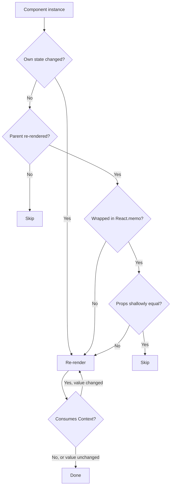
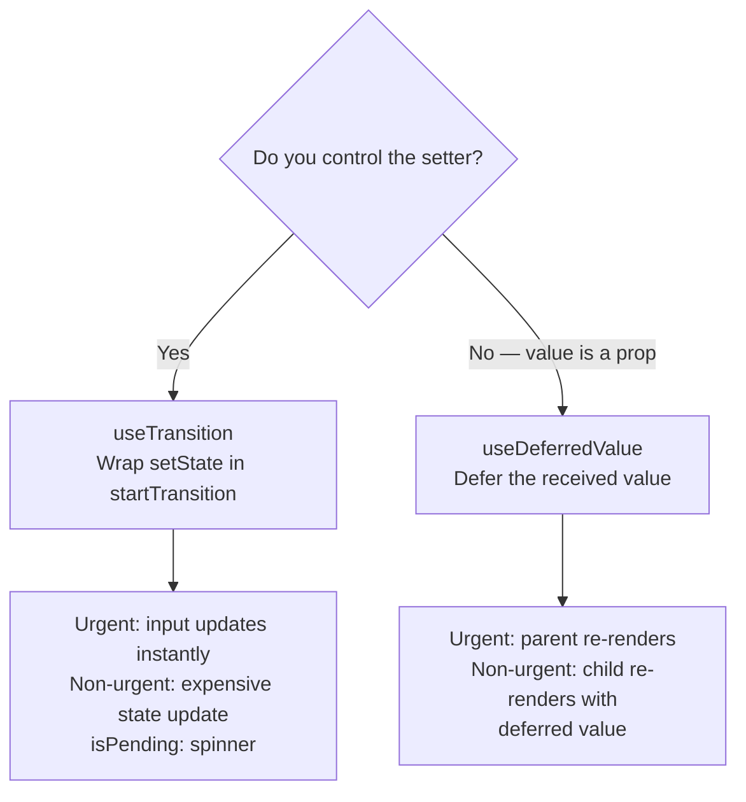

# 3.11 Performance Optimization

> React is fast by default. Most apps never need manual memoization — React's reconciliation is cheap, and the React 19 Compiler auto-memoizes much of what we used to do by hand. But when you do hit a performance problem, you need to know what causes re-renders, how to measure them, and the tools available: `React.memo`, `useMemo`, `useCallback`, code splitting with `React.lazy`, list virtualization with `react-window`, and the concurrent hooks `useTransition` and `useDeferredValue`. This note covers when to optimize (measure first!), what causes re-renders, the memoization tools, the Profiler, and how the React 19 Compiler changes the calculus.

## 3.11.1 Objective

By the end of this note you should be able to:

1. Explain why premature optimization is harmful and how to measure before optimizing.
2. List the three causes of re-renders (state change, parent re-render, context change).
3. Use `React.memo` to skip re-renders when props haven't changed.
4. Use `useMemo` to memoize expensive computations.
5. Use `useCallback` to keep function identity stable for child memoization.
6. Articulate the cost of memoization (memory + comparison) and when it backfires.
7. Use the React Profiler and the "why did this render" feature.
8. Code-split with `React.lazy` and Suspense (preview of [[3.12 Suspense, Lazy Loading, and Code Splitting]]).
9. Virtualize long lists with `react-window`.
10. Use `useTransition` for non-urgent updates and `useDeferredValue` for deferring expensive renders.
11. Explain how the React 19 Compiler auto-memoizes and why it changes when you reach for `useMemo`/`useCallback`.

## 3.11.2 Background Knowledge

Before reading further, make sure you are comfortable with:

- **The render pipeline** from [[3.1 JSX and Rendering]] — render phase, reconcile, commit, paint.
- **State and re-renders** from [[3.3 State and Events]] — `setState` triggers a re-render.
- **Props and components** from [[3.2 Components and Props]] — props are compared by `Object.is`.
- **The built-in hooks** from [[3.6 Hooks (Built-In)]] — `useMemo`, `useCallback`, `useTransition`, `useDeferredValue`.
- **Effects** from [[3.8 Effects and Side Effects]] — unnecessary effects are a common cause of jank.

## 3.11.3 Core Concepts

### 3.11.3.1 When to Optimize — Measure First

> [!danger] Don't optimize prematurely
> "Premature optimization is the root of all evil" — Knuth. In React, this means: do not sprinkle `useMemo` and `useCallback` everywhere "to be safe". They have costs (memory, comparison time, code complexity), and in most cases they buy nothing. The React team's guidance: write clear code first; if you observe a performance problem, profile it, find the cause, and optimize *that*.

The workflow:

1. **Observe a problem.** User-perceived jank, slow interactions, low Lighthouse score.
2. **Profile.** Use the React Profiler to find which components re-render and how long they take.
3. **Diagnose.** Why is the slow component re-rendering? State change? Parent re-render? Context change?
4. **Fix.** Apply the smallest change that addresses the cause. Measure again to confirm.

### 3.11.3.2 What Causes Re-renders

A component re-renders when any of these happens:

1. **Its own state changes** (`setState`, `useReducer` dispatch).
2. **Its parent re-renders** (and the component is not memoized).
3. **A Context it consumes changes value.**
4. **(Rarely) Its parent passes a new prop** — but this is just case 2 in disguise; the parent re-rendered.

> [!note] Re-rendering is not bad
> Re-rendering is React's job. Most re-renders are fast (microseconds). The problem is *unnecessary* re-renders of *expensive* components. A 1ms component re-rendering 100 times is fine. A 100ms component re-rendering 10 times is a problem.

### 3.11.3.3 `React.memo` — Skip Re-renders When Props Are Unchanged

`React.memo` wraps a component and skips re-renders when props are shallowly equal:

```jsx
const ExpensiveItem = React.memo(function ExpensiveItem({ title, onClick }) {
  // ... expensive render
});

function List({ items, onClick }) {
  return items.map(item => <ExpensiveItem key={item.id} title={item.title} onClick={onClick} />);
}
```

When `List` re-renders (say, because `query` state changed), `ExpensiveItem` skips re-rendering if `title` and `onClick` are shallowly equal to last time.

**Default comparison:** shallow `Object.is` on each prop. If you need deeper comparison, pass a second argument:

```jsx
const ExpensiveItem = React.memo(Component, (prevProps, nextProps) => {
  return prevProps.item.id === nextProps.item.id && prevProps.item.title === nextProps.item.title;
});
```

Return `true` to skip re-render (props are equal), `false` to re-render.

**When to use:**

- The component renders expensively (long lists, complex visualizations, deep trees).
- It re-renders often due to parent state changes that don't affect its props.

**When NOT to use:**

- The component is cheap. `React.memo` adds comparison cost; for cheap components, the comparison can be more expensive than the re-render.
- The props are always new (objects, arrays, functions) — `React.memo` never skips. Wrap the props in `useMemo`/`useCallback` first, or use the React Compiler.

### 3.11.3.4 `useMemo` — Memoize a Computed Value

```jsx
const sorted = useMemo(() => items.sort((a, b) => a.name.localeCompare(b.name)), [items]);
```

`useMemo` recomputes only when `items` changes. Without it, the sort runs on every render — even if `items` hasn't changed.

**When to use:**

- The computation is expensive (sorting/filtering large arrays, complex math, deep cloning).
- The result is passed as a prop to a memoized child (so identity matters).
- You're computing a value that depends on changing inputs and the computation has meaningful cost.

**When NOT to use:**

- The computation is cheap (`a + b`, simple property access). The memo bookkeeping is more expensive.
- The value isn't passed anywhere that cares about identity.

> [!warning] `useMemo` is not a semantic guarantee
> React may throw away the memoized value and recompute it (e.g., to free memory). Don't use `useMemo` to "ensure a value is computed only once" — that's a different requirement (use `useRef` or `useState` lazy initializer).

### 3.11.3.5 `useCallback` — Memoize a Function

```jsx
const handleClick = useCallback(() => { setCount(c => c + 1); }, []);
```

`useCallback(fn, deps)` is equivalent to `useMemo(() => fn, deps)`. It returns the same function instance across renders unless `deps` change.

**When to use:**

- The function is passed as a prop to a memoized child. Without `useCallback`, the child re-renders every render of the parent (the function identity changes).

**When NOT to use:**

- The function is only used inside the component itself. Plain `const fn = () => {}` is fine.
- The child is not memoized. `useCallback` has no effect.

> [!tip] `useCallback` + `React.memo` are a pair
> Neither alone helps. `useCallback` keeps the function stable; `React.memo` checks if props are equal. Without `React.memo` on the child, stable functions do nothing. Without `useCallback` on the parent, `React.memo` always re-renders (the function prop is new every render).

### 3.11.3.6 The Cost of Memoization

Every memoization has costs:

1. **Memory.** Each `useMemo`/`useCallback` stores the value plus the deps array. Hundreds of these add up.
2. **Comparison.** On every render, React compares the new deps to the old. For deep arrays, this is non-trivial.
3. **Code complexity.** Memoized code is harder to read and refactor.

The break-even point depends on:

- How expensive the computation is (or how expensive the skipped re-render is).
- How often the deps actually change (rarely  -->  high payoff; every render  -->  zero payoff).

### 3.11.3.7 The React Profiler

The React DevTools Profiler records every render and shows:

- Which components rendered.
- How long each took.
- Why each rendered ("state change", "props changed", "parent rendered").

To use:

1. Install the React DevTools browser extension.
2. Open the Profiler tab.
3. Click Record, perform the slow interaction, click Stop.
4. Hover components to see render times. Click "Why did this render?" for the cause.

The "why did this render" feature is the single most useful tool for diagnosing unnecessary re-renders. It tells you exactly which prop changed (or which state/context).

### 3.11.3.8 Code Splitting with `React.lazy` and Suspense

`React.lazy` lets you load a component on demand, splitting it into a separate bundle:

```jsx
const Settings = React.lazy(() => import("./Settings"));

function App() {
  return (
    <Suspense fallback={<Spinner />}>
      <Settings />
    </Suspense>
  );
}
```

While `Settings` loads, the `<Suspense fallback>` renders. Once loaded, `Settings` renders. This keeps the initial bundle small (faster first paint) and loads less-used code on demand.

We cover this in depth in [[3.12 Suspense, Lazy Loading, and Code Splitting]].

### 3.11.3.9 List Virtualization with `react-window`

Rendering 10,000 rows in the DOM is slow — not because of React, but because the browser can't handle that many nodes. Virtualization renders only the rows currently visible:

```jsx
import { FixedSizeList as List } from "react-window";

function BigList({ items }) {
  return (
    <List height={600} itemCount={items.length} itemSize={40} width="100%">
      {({ index, style }) => (
        <div style={style}>{items[index].name}</div>
      )}
    </List>
  );
}
```

`react-window` renders ~15 rows at a time (whatever fits in 600px), no matter how many items are in the array. Scrolling swaps which rows are rendered.

> [!tip] Virtualize any list over ~100 items
> For small lists, virtualization is overkill. For lists over 100 items, especially if rows are expensive, `react-window` is a massive win. For variable-height rows, use `react-window`'s `VariableSizeList` or the newer `@tanstack/react-virtual`.

### 3.11.3.10 `useTransition` — Non-Urgent Updates

By default, all state updates are urgent — React renders them synchronously (well, with concurrency, but at high priority). `useTransition` lets you mark some updates as non-urgent:

```jsx
function Search() {
  const [query, setQuery] = useState("");
  const [results, setResults] = useState([]);
  const [isPending, startTransition] = useTransition();

  const handleChange = (e) => {
    setQuery(e.target.value); // urgent — input feels instant
    startTransition(() => {
      setResults(filterHugeList(e.target.value)); // non-urgent — can be interrupted
    });
  };

  return (
    <>
      <input value={query} onChange={handleChange} />
      {isPending && <Spinner />}
      <ul>{results.map(r => <li key={r.id}>{r.name}</li>)}</ul>
    </>
  );
}
```

The input updates urgently (no lag). The list filtering is a transition — if the user types again before it finishes, React interrupts and starts over with the new value. `isPending` lets you show a spinner.

**When to use:**

- You have an expensive update triggered by user input.
- The expensive update can be deferred without harming UX.
- The user might trigger another update before the first finishes (typing, scrolling).

### 3.11.3.11 `useDeferredValue` — Defer a Received Value

`useDeferredValue` is the "passive" version of `useTransition`. Use it when you don't control the setter (the value comes from props):

```jsx
function SearchResults({ query }) {
  const deferredQuery = useDeferredValue(query);
  const results = useMemo(() => filterHugeList(deferredQuery), [deferredQuery]);
  return <ul>{results.map(r => <li key={r.id}>{r.name}</li>)}</ul>;
}
```

When `query` changes, the component re-renders with the new `query` (urgent — e.g., the input updates), but `deferredQuery` stays at the old value. React then re-renders with the new `deferredQuery` at low priority. If `query` changes again before that finishes, the deferred update is interrupted.

**`useTransition` vs `useDeferredValue`:**

- `useTransition` — you control the setter; wrap the `setState` call.
- `useDeferredValue` — you receive the value from outside; defer it.

### 3.11.3.12 Avoiding Unnecessary Effects

Effects are a common source of jank:

- Effects that fetch on every render (missing deps, wrong deps).
- Effects that compute derived state (double render).
- Effects that sync state between siblings (chains).

See [[3.8 Effects and Side Effects]] for the full list of effect anti-patterns. The performance fix is often to remove the effect entirely.

### 3.11.3.13 The React 19 Compiler

The React Compiler (formerly React Forget) is a build-time compiler that auto-memoizes components and hooks. It analyzes your code and inserts `useMemo`/`useCallback`-equivalent logic automatically.

Before (manual memoization):

```jsx
const ExpensiveItem = React.memo(function ExpensiveItem({ item, onClick }) {
  const handleClick = useCallback(() => onClick(item.id), [item.id, onClick]);
  // ...
});
```

After (React Compiler, no manual memo):

```jsx
function ExpensiveItem({ item, onClick }) {
  const handleClick = () => onClick(item.id);
  // The compiler auto-memoizes handleClick and the component.
}
```

This changes the calculus:

- **Manual `useMemo`/`useCallback`/`React.memo` become much less necessary.** The compiler handles the common cases.
- **Code is simpler.** No memoization noise.
- **Performance is more consistent.** The compiler catches cases humans miss.

The compiler is opt-in in React 19 (via `babel-plugin-react-compiler`), and the team expects it to become default over time. Even with the compiler, you still need:

- `useTransition` and `useDeferredValue` (concurrency is not memoization).
- Code splitting (`React.lazy`).
- List virtualization (`react-window`).
- Architectural optimizations (splitting components, moving state down).

## 3.11.4 Detailed Walkthrough

### 3.11.4.1 A Re-render Audit

Consider:

```jsx
function App() {
  const [count, setCount] = useState(0);
  const [query, setQuery] = useState("");
  return (
    <>
      <Counter count={count} onIncrement={() => setCount(c => c + 1)} />
      <SearchBox value={query} onChange={setQuery} />
      <ExpensiveResults query={query} />
    </>
  );
}
```

What re-renders when the user clicks the increment button?

1. `App` re-renders (state changed).
2. `Counter` re-renders — props `count` (changed) and `onIncrement` (NEW function literal — changed).
3. `SearchBox` re-renders — `value` and `onChange` props haven't changed, but React doesn't check (no `React.memo`).
4. `ExpensiveResults` re-renders — `query` prop hasn't changed, but same reason.

Three unnecessary re-renders. Fixes:

1. Wrap `SearchBox` and `ExpensiveResults` in `React.memo`.
2. Wrap `onIncrement` in `useCallback`.
3. (Or just use the React Compiler and forget about all of it.)

### 3.11.4.2 Profiling and Diagnosing

Open the Profiler, record a click, look at the flamegraph:

- `App` rendered in 2ms (state change).
- `Counter` rendered in 5ms (props changed: count, onIncrement).
- `SearchBox` rendered in 8ms (props unchanged — unnecessary).
- `ExpensiveResults` rendered in 50ms (props unchanged — unnecessary, and slow).

The Profiler shows the 50ms `ExpensiveResults` render. "Why did this render?" says "props changed: query" — wait, query didn't change! Oh, but `App` re-rendered, and `ExpensiveResults` isn't memoized, so it re-rendered anyway. The fix is `React.memo(ExpensiveResults)`.

After the fix: `App` and `Counter` re-render. `SearchBox` and `ExpensiveResults` skip. Total render time drops from 65ms to 7ms.

### 3.11.4.3 The Memoization Pairing

```jsx
function App() {
  const [count, setCount] = useState(0);
  const [query, setQuery] = useState("");

  const increment = useCallback(() => setCount(c => c + 1), []);

  return (
    <>
      <Counter count={count} onIncrement={increment} />
      <SearchBox value={query} onChange={setQuery} />
      <ExpensiveResults query={query} />
    </>
  );
}

const Counter = React.memo(function Counter({ count, onIncrement }) { /* ... */ });
const SearchBox = React.memo(function SearchBox({ value, onChange }) { /* ... */ });
const ExpensiveResults = React.memo(function ExpensiveResults({ query }) { /* ... */ });
```

Now:

- Clicking increment re-renders `App` and `Counter` only.
- Typing in search re-renders `App`, `SearchBox`, and `ExpensiveResults` (query changed).
- `setQuery` is stable (from `useState`), so `SearchBox`'s `onChange` prop never changes.
- `increment` is memoized, so `Counter`'s `onIncrement` prop never changes.

### 3.11.4.4 When Memoization Backfires

```jsx
function App() {
  const [time, setTime] = useState(Date.now());
  useEffect(() => {
    const id = setInterval(() => setTime(Date.now()), 1000);
    return () => clearInterval(id);
  }, []);

  // BAD: items is a new array every render — useMemo never skips
  const items = useMemo(() => generateItems(), []);
  // generateItems() is called once on mount, then memoized. Good.

  // BAD: this is a cheap computation — useMemo adds overhead
  const label = useMemo(() => `Count: ${count}`, [count]);
  // Just write `const label = \`Count: ${count}\``. No memo needed.

  return <List items={items} />;
}
```

The first `useMemo` is correct (expensive computation, stable input). The second is harmful (cheap computation, memo overhead exceeds the computation).

### 3.11.4.5 `useTransition` in Depth

```jsx
function Tabs({ tabs }) {
  const [activeId, setActiveId] = useState(tabs[0].id);
  const [isPending, startTransition] = useTransition();

  const handleSelect = (id) => {
    startTransition(() => {
      setActiveId(id);
    });
  };

  return (
    <>
      <nav>
        {tabs.map(t => (
          <button key={t.id} onClick={() => handleSelect(t.id)} disabled={isPending && activeId !== t.id}>
            {t.label}
          </button>
        ))}
      </nav>
      <TabContent id={activeId} />
    </>
  );
}
```

Clicking a tab starts a transition. The new tab content renders at low priority. If the user clicks another tab before the first finishes, React interrupts and starts the second. `isPending` lets you disable buttons or show a spinner.

Without `useTransition`, clicking a slow tab would freeze the UI for 200ms. With it, the UI stays responsive.

## 3.11.5 Practical Examples

### 3.11.5.1 Virtualized List with `react-window`

```jsx
import { FixedSizeList as List } from "react-window";

function BigTable({ rows }) {
  const Row = ({ index, style }) => (
    <div style={style} className="row">
      {rows[index].name} — {rows[index].email}
    </div>
  );
  return (
    <List height={600} itemCount={rows.length} itemSize={40} width="100%">
      {Row}
    </List>
  );
}
```

Renders ~15 rows at a time regardless of `rows.length`. Scrolling is buttery smooth even with 100,000 rows.

### 3.11.5.2 `useDeferredValue` for Search

```jsx
function SearchResults({ query, items }) {
  const deferredQuery = useDeferredValue(query);
  const isStale = query !== deferredQuery;
  const results = useMemo(
    () => items.filter(i => i.name.includes(deferredQuery)),
    [items, deferredQuery]
  );
  return (
    <ul style={{ opacity: isStale ? 0.5 : 1 }}>
      {results.map(r => <li key={r.id}>{r.name}</li>)}
    </ul>
  );
}
```

When `query` changes, the component re-renders with the new `query` and the old `deferredQuery` — the input feels instant. React then re-renders with the new `deferredQuery` at low priority. The `isStale` check lets you dim the results during the transition.

### 3.11.5.3 Lazy Modal

```jsx
const SettingsModal = React.lazy(() => import("./SettingsModal"));

function App() {
  const [open, setOpen] = useState(false);
  return (
    <>
      <button onClick={() => setOpen(true)}>Open settings</button>
      {open && (
        <Suspense fallback={<ModalSpinner />}>
          <SettingsModal onClose={() => setOpen(false)} />
        </Suspense>
      )}
    </>
  );
}
```

`SettingsModal` (and its potentially huge dependency tree — chart libraries, editors) is only loaded when the user opens it. Initial bundle stays small.

## 3.11.6 Mermaid Diagrams

### 3.11.6.1 When a Component Re-renders



### 3.11.6.2 `useTransition` vs `useDeferredValue`



## 3.11.7 Common Mistakes

1. **Memoizing everything by default.** Adds memory and comparison overhead for no benefit. Measure, then memoize what's actually slow.

2. **Using `React.memo` without `useCallback`/`useMemo` for object props.** `React.memo` does shallow comparison. A new object/function prop defeats it. Either memoize the prop, or restructure to pass primitives.

3. **Using `useMemo` for cheap computations.** `const label = useMemo(() => `Count: ${count}`, [count])` — the memo overhead exceeds the computation. Just compute directly.

4. **Using `useCallback` for functions only used internally.** If the function isn't passed to a memoized child, `useCallback` adds overhead with zero benefit.

5. **Disabling `exhaustive-deps` to "fix" memoization.** If you remove a dep from `useCallback`'s deps array to keep it stable, the callback closes over stale values. The fix is to use the updater form (`setCount(c => c + 1)`) or to include the dep.

6. **Virtualizing small lists.** `react-window` on a 10-item list adds complexity with no benefit. Virtualize when you have 100+ items, or when rows are expensive.

7. **Forgetting that Context re-renders all consumers.** A frequently-changing context value re-renders every consumer, even memoized ones (memo doesn't help with Context). Split state and dispatch, or use an external store.

8. **Using effects for derived state.** Double render, stale UI, jank. Compute during render (with `useMemo` if expensive).

9. **Not measuring after the optimization.** The optimization might not have helped (or might have made things worse). Always profile before and after.

10. **Ignoring the React Compiler.** If you're on React 19+, enable the compiler. It removes most of the manual memoization burden.

11. **Putting `React.lazy` inside a component body.** `const Comp = React.lazy(...)` at module scope, not inside a function. Otherwise a new lazy component is created every render.

## 3.11.8 Best Practices

1. **Measure first.** Use the Profiler and "why did this render" before changing code.
2. **Memoize only what's expensive.** Leave cheap code alone.
3. **Pair `React.memo` with `useCallback`/`useMemo`.** Neither alone helps.
4. **Split state and dispatch contexts** to avoid re-rendering dispatch-only consumers.
5. **Move state down.** If only a small subtree needs state, lift it down rather than up. Less re-rendering.
6. **Pass primitives, not objects, when possible.** `id`, `name`, `value` — shallow comparison works. `{ user }` — new object every render.
7. **Virtualize long lists.** `react-window` for fixed heights, `@tanstack/react-virtual` for variable.
8. **Code-split routes and modals.** `React.lazy` keeps the initial bundle small.
9. **Use `useTransition` for user-triggered expensive updates.** Typing, scrolling, tab switching.
10. **Use `useDeferredValue` for expensive renders driven by props you don't control.**
11. **Avoid effects for derived state.** Compute during render.
12. **Enable the React Compiler.** It handles most memoization automatically.

## 3.11.9 Mini Exercises

### 3.11.9.1 Diagnose a Slow List

**Problem.** Typing in the search box lags by 200ms per keystroke. The list has 5,000 items. Here's the code:

```jsx
function SearchableList({ items }) {
  const [query, setQuery] = useState("");
  const filtered = items.filter(i => i.name.includes(query));
  return (
    <>
      <input value={query} onChange={e => setQuery(e.target.value)} />
      <ul>
        {filtered.map(i => <li key={i.id}>{i.name}</li>)}
      </ul>
    </>
  );
}
```

**Solution.** Three issues:

1. The filter runs on every render (cheap-ish for 5,000 items but worth memoizing).
2. The DOM has up to 5,000 `<li>` nodes — that's the real jank source.
3. The filter blocks the input update.

**Fix 1 (memoize filter).**

```jsx
const filtered = useMemo(() => items.filter(i => i.name.includes(query)), [items, query]);
```

Helps a little.

**Fix 2 (virtualize).**

```jsx
import { FixedSizeList as List } from "react-window";
// ...
<List height={600} itemCount={filtered.length} itemSize={40} width="100%">
  {({ index, style }) => <div style={style}>{filtered[index].name}</div>}
</List>
```

Massive win. The DOM has ~15 nodes, not 5,000.

**Fix 3 (transition).**

```jsx
function SearchableList({ items }) {
  const [query, setQuery] = useState("");
  const [filtered, setFiltered] = useState(items);
  const [isPending, startTransition] = useTransition();

  const handleChange = (e) => {
    const q = e.target.value;
    setQuery(q); // urgent
    startTransition(() => {
      setFiltered(items.filter(i => i.name.includes(q))); // non-urgent
    });
  };

  return (
    <>
      <input value={query} onChange={handleChange} />
      {isPending && <Spinner />}
      <List /* ... virtualized filtered */ />
    </>
  );
}
```

The input feels instant. The filter runs at low priority and can be interrupted if the user types again.

**Reasoning.** Each fix targets a different bottleneck. Memoization targets computation, virtualization targets DOM size, transitions target input responsiveness. The combination is what makes 5,000-item search feel smooth.

### 3.11.9.2 Fix a Broken `React.memo`

**Problem.** This `React.memo` never skips re-renders. Why?

```jsx
const Item = React.memo(function Item({ item, onSelect }) {
  return <li onClick={() => onSelect(item.id)}>{item.name}</li>;
});

function List({ items, onSelect }) {
  return items.map(item => <Item key={item.id} item={item} onSelect={onSelect} />);
}
```

**Solution.** Two issues:

1. `Item`'s `onClick` is a new function every render — but `onClick` isn't a prop, so this doesn't matter for memo. (It would still cause re-renders if `Item` weren't memo'd, but it is.)
2. The actual issue is upstream: whoever renders `<List items={...} onSelect={...} />` is probably passing a new `items` array or a new `onSelect` function every render. We can't tell without that code. Let's assume both are new every render.

**Fix.**

```jsx
function List({ items, onSelect }) {
  const handleSelect = useCallback(onSelect, [onSelect]);
  return items.map(item => <Item key={item.id} item={item} onSelect={handleSelect} />);
}

// And the parent:
const items = useMemo(() => fetchItems(), []); // or similar
const handleSelect = useCallback((id) => { /* ... */ }, []);
<List items={items} onSelect={handleSelect} />
```

**Reasoning.** `React.memo` does shallow comparison. If `items` is a new array reference, `Item`'s `item` prop is a different reference each render (even if the contents are the same). If `onSelect` is a new function, same problem. The fix is to stabilize the references upstream with `useMemo`/`useCallback`. Alternatively, use the React Compiler, which handles this automatically.

### 3.11.9.3 Choose Between `useMemo`, `useCallback`, `React.memo`, and Nothing

**Problem.** For each scenario, choose the right tool.

a) A `Button` component used 50 times in a toolbar. The toolbar re-renders on hover state changes.
b) A `formatDate` function called inside a component's render.
c) A `data` array passed to a `Chart` component (memoized) — the array is sorted/filtered inside the parent.
d) A 5,000-item `items` array passed to `react-window` — `items` is fetched once.
e) A `handleClick` function passed to a `Button` that is *not* memoized.

**Answers.**

a) **`React.memo` on `Button`**, and ensure props are stable (the parent should `useCallback` the click handler). 50 re-renders per hover would be wasteful.

b) **Nothing.** `formatDate` is a function call, not a memoization candidate. If it's expensive and called with the same args repeatedly, wrap the *result* in `useMemo` at the call site.

c) **`useMemo` on the `data` array.** Sorting/filtering produces a new array every render; `React.memo` on `Chart` would always re-render. Memoize the array, then `React.memo` on `Chart` works.

d) **Nothing for the array itself** (it's already stable — fetched once). `react-window` virtualizes; you don't need `React.memo` on the row component unless the row is expensive.

e) **Nothing.** `useCallback` only helps when passed to a memoized child. If `Button` isn't memoized, `useCallback` is overhead with no benefit. Either memoize `Button` (then `useCallback` matters), or leave both alone.

**Reasoning.** Memoization is a *pair*: the producer must keep the value stable, and the consumer must check. Without both, neither helps.

### 3.11.9.4 Use `useDeferredValue` to Fix a Slow Search

**Problem.** A parent passes `query` to a child that filters 10,000 items. Typing lags. Refactor to use `useDeferredValue`.

```jsx
function Parent() {
  const [query, setQuery] = useState("");
  return <SearchResults query={query} items={hugeItems} />;
}

function SearchResults({ query, items }) {
  const results = items.filter(i => i.name.includes(query));
  return <ul>{results.map(r => <li key={r.id}>{r.name}</li>)}</ul>;
}
```

**Solution.**

```jsx
function SearchResults({ query, items }) {
  const deferredQuery = useDeferredValue(query);
  const isStale = query !== deferredQuery;
  const results = useMemo(
    () => items.filter(i => i.name.includes(deferredQuery)),
    [items, deferredQuery]
  );
  return (
    <ul style={{ opacity: isStale ? 0.6 : 1 }}>
      {results.map(r => <li key={r.id}>{r.name}</li>)}
    </ul>
  );
}
```

**Reasoning.** `useDeferredValue` keeps `deferredQuery` at the old value on the urgent render (when `query` changes), then re-renders with the new value at low priority. The parent re-renders instantly (the input feels responsive); the expensive filter runs at low priority and can be interrupted if the user types again. `isStale` dims the list during the transition so the user knows the data is updating.

**Common wrong approach.** Using `useTransition` here — but you don't control the `setQuery` call (it's in the parent). `useTransition` is for when you control the setter; `useDeferredValue` is for when you receive the value.

### 3.11.9.5 Code-Split a Heavy Settings Page

**Problem.** The settings page imports a chart library (200KB) that's only used there. The main bundle is too big. Refactor to lazy-load.

**Solution.**

```jsx
// Settings.tsx — default export required for React.lazy
export default function Settings() {
  return (
    <>
      <h1>Settings</h1>
      <UsageChart />
    </>
  );
}

// UsageChart.tsx — internal import of the chart library
import { Chart } from "heavy-chart-lib";
export default function UsageChart() {
  return <Chart data={...} />;
}

// App.tsx
import { lazy, Suspense } from "react";
const Settings = lazy(() => import("./Settings"));

function App() {
  return (
    <Routes>
      <Route path="/" element={<Home />} />
      <Route path="/settings" element={
        <Suspense fallback={<PageSpinner />}>
          <Settings />
        </Suspense>
      } />
    </Routes>
  );
}
```

**Reasoning.** `React.lazy(() => import("./Settings"))` creates a separate bundle for `Settings` and its dependencies (including the chart library). The main bundle excludes it. When the user navigates to `/settings`, React loads the bundle (showing the Suspense fallback) and then renders `Settings`. The 200KB chart library is only downloaded by users who visit settings.

**Common wrong approaches.**

- Putting `lazy(() => import(...))` inside a component — it creates a new lazy component every render.
- Using a named export directly: `lazy(() => import("./Settings").then(m => m.Settings))` works but is more verbose than using a default export.

## 3.11.10 Summary

- React is fast by default. Don't optimize prematurely — measure with the Profiler first.
- Three causes of re-renders: own state change, parent re-render, context change.
- `React.memo` skips re-renders when props are shallowly equal.
- `useMemo` memoizes computed values; `useCallback` memoizes functions.
- `React.memo` + `useCallback`/`useMemo` work as a pair — neither alone helps.
- Memoization has costs (memory, comparison). Memoize only what's expensive.
- The React Profiler and "why did this render" feature are essential diagnosis tools.
- `React.lazy` + Suspense splits bundles for faster initial load.
- `react-window` virtualizes long lists — essential for 100+ items.
- `useTransition` marks updates non-urgent; `useDeferredValue` defers received values.
- The React 19 Compiler auto-memoizes, reducing the need for manual `useMemo`/`useCallback`/`React.memo`.

## 3.11.11 Related Notes

- [[3.1 JSX and Rendering]] — the render pipeline that performance work targets.
- [[3.3 State and Events]] — what triggers re-renders.
- [[3.6 Hooks (Built-In)]] — `useMemo`, `useCallback`, `useTransition`, `useDeferredValue` API summaries.
- [[3.7 Custom Hooks]] — memoizing custom hook return values.
- [[3.8 Effects and Side Effects]] — unnecessary effects are a common source of jank.
- [[3.9 Context and Reducers]] — splitting contexts to avoid re-render storms.
- [[3.10 Composition and Patterns]] — composition patterns affect re-render behavior.
- [[3.12 Suspense, Lazy Loading, and Code Splitting]] — `React.lazy` and Suspense in depth.
- [[3.13 Error Boundaries and Debugging]] — Profiler and DevTools walkthrough.
- [[1.13 CSS Performance]] — the rendering pipeline from the CSS side.
