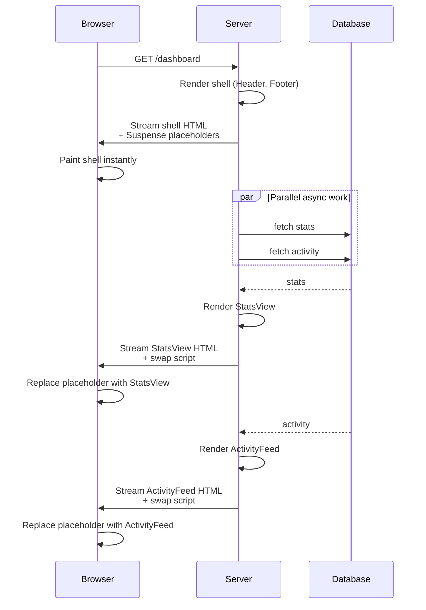
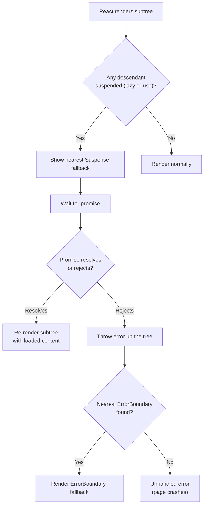

# 3.12 Suspense, Lazy Loading, and Code Splitting

> Suspense is React's declarative way to handle asynchronous UI states: while a component is "waiting" for something (a lazy bundle to load, a promise to resolve, a stream to flush), React shows a fallback. This note covers what Suspense is, `React.lazy` for code splitting, the `Suspense` boundary and `fallback` prop, nested boundaries, streaming SSR (the pattern Next.js uses), Suspense for data fetching with the React 19 `use()` hook, the difference between Suspense and `useState`-managed loading, error boundaries combined with Suspense, code-splitting strategies, named vs default exports, and the lazy-load-on-demand pattern for modals and drawers.

## 3.12.1 Objective

By the end of this note you should be able to:

1. Explain what Suspense is and why it's a fundamentally different model from `useState`-based loading flags.
2. Use `React.lazy` to lazy-load components and `Suspense` to gate them.
3. Place Suspense boundaries strategically (top-level, nested, per-route, per-component).
4. Explain streaming SSR and how Suspense enables it.
5. Use the React 19 `use()` hook with promises to do Suspense-based data fetching.
6. Combine Error Boundaries with Suspense for async error handling.
7. Choose between route-level, component-level, and vendor-splitting strategies.
8. Explain why `React.lazy` requires default exports and how to handle named exports.
9. Apply the lazy-load-on-demand pattern for modals and drawers.
10. Articulate why code splitting matters for initial bundle size and Time-To-Interactive.

## 3.12.2 Background Knowledge

Before reading further, make sure you are comfortable with:

- **The render pipeline** from [[3.1 JSX and Rendering]] — what "rendering" means.
- **Components and props** from [[3.2 Components and Props]] — the `children` prop is key here.
- **Custom hooks and `use()`** from [[3.7 Custom Hooks]] — the React 19 `use()` hook integrates with Suspense.
- **Effects** from [[3.8 Effects and Side Effects]] — why `useEffect`-based fetching is being replaced by Suspense.
- **Performance** from [[3.11 Performance Optimization]] — code splitting as a performance technique.
- **Error boundaries** from [[3.13 Error Boundaries and Debugging]] — Suspense pairs with them for async errors.

## 3.12.3 Core Concepts

### 3.12.3.1 What Suspense Is

Suspense is a React component that lets you declaratively handle "waiting" states. Wrap part of your tree in `<Suspense fallback={<Spinner />}>`, and if any descendant suspends (throws a promise), React shows the fallback until the promise resolves.

```jsx
<Suspense fallback={<Spinner />}>
  <ExpensiveComponent />
</Suspense>
```

A component "suspends" when:

1. It's a `React.lazy` component whose bundle hasn't loaded yet.
2. It calls `use(promise)` (React 19) where the promise hasn't resolved.
3. (In frameworks) It uses a framework data-loading primitive that returns a promise.

The key insight: **the component throws a promise; the nearest `<Suspense>` ancestor catches it and shows the fallback.** This is the same mechanism as Error Boundaries, but for promises instead of errors.

### 3.12.3.2 `React.lazy` — Lazy-Loading Components

```jsx
import { lazy, Suspense } from "react";

const Settings = lazy(() => import("./Settings"));

function App() {
  return (
    <Suspense fallback={<Spinner />}>
      <Settings />
    </Suspense>
  );
}
```

`React.lazy` takes a function that returns a dynamic `import()` — a Promise that resolves to a module with a `default` export. While the promise is pending, the `<Settings />` element suspends; the nearest `<Suspense>` shows its fallback. When the promise resolves, React renders `Settings`.

`React.lazy` is the simplest code-splitting primitive. Each `lazy()` call creates a separate bundle.

### 3.12.3.3 The Suspense Boundary and `fallback`

```jsx
<Suspense fallback={<div>Loading...</div>}>
  {children}
</Suspense>
```

- **`fallback`**: what to show while any descendant is suspended. Any React node.
- **Position**: a Suspense boundary can wrap any subtree. Multiple boundaries can nest.

When a child suspends:

1. React walks up the tree to find the nearest `<Suspense>`.
2. React renders the `fallback` in place of the suspended subtree.
3. When the promise resolves, React re-renders the subtree with the loaded content.

### 3.12.3.4 Nested Suspense Boundaries

```jsx
<Suspense fallback={<PageSpinner />}>
  <Header />
  <Suspense fallback={<MainSpinner />}>
    <Main />
  </Suspense>
  <Suspense fallback={<SidebarSpinner />}>
    <Sidebar />
  </Suspense>
</Suspense>
```

If `Main` suspends, only the main area shows `MainSpinner` — the header and sidebar render immediately. When `Main` loads, it swaps in. If `Sidebar` then suspends (e.g., a network error and retry), only the sidebar shows its spinner.

This is the **granular loading** pattern: each region has its own fallback, so users see content progressively rather than a single full-page spinner.

### 3.12.3.5 Streaming SSR

Without Suspense, server-side rendering is all-or-nothing: the server renders the entire page to HTML, then sends it. If any part is slow (a slow database query), the whole page waits.

With Suspense, the server can **stream** HTML:

1. Server renders the static parts of the page immediately.
2. For suspended subtrees, the server sends a placeholder (the `fallback`) and continues.
3. When a suspended promise resolves, the server streams additional HTML and a small inline script that swaps the placeholder for the real content.

This is what Next.js App Router uses for its default SSR behavior. Pages with slow data show the shell instantly and stream content in as it becomes available.

### 3.12.3.6 Suspense for Data Fetching — The React 19 `use()` Hook

Before React 19, Suspense was primarily for code splitting. React 19's `use()` hook extends it to data fetching:

```jsx
// Parent creates the promise (often a Server Component)
async function UserProfile({ userId }) {
  const userPromise = fetch(`/api/users/${userId}`).then(r => r.json());
  return (
    <Suspense fallback={<Skeleton />}>
      <Profile userPromise={userPromise} />
    </Suspense>
  );
}

// Child unwraps it
import { use } from "react";

function Profile({ userPromise }) {
  const user = use(userPromise); // suspends until resolved
  return <h1>{user.name}</h1>;
}
```

The child calls `use(userPromise)`. If the promise is pending, the child suspends; React shows the nearest Suspense fallback. When the promise resolves, React re-renders the child with the unwrapped value.

**Critical rule:** the promise must be *stable* across renders. If you create a new promise every render (`use(fetch(...))`), it never resolves from React's perspective. Create the promise once (in a parent, in a Server Component, or memoized with `useState`).

### 3.12.3.7 Suspense vs `useState`-Managed Loading

Before Suspense, every async component looked like this:

```jsx
function Profile({ userId }) {
  const [user, setUser] = useState(null);
  const [loading, setLoading] = useState(true);
  const [error, setError] = useState(null);

  useEffect(() => {
    let cancelled = false;
    setLoading(true);
    fetch(`/api/users/${userId}`)
      .then(r => r.json())
      .then(u => { if (!cancelled) { setUser(u); setLoading(false); } })
      .catch(e => { if (!cancelled) { setError(e); setLoading(false); } });
    return () => { cancelled = true; };
  }, [userId]);

  if (loading) return <Spinner />;
  if (error) return <ErrorMessage error={error} />;
  return <h1>{user.name}</h1>;
}
```

That's ~15 lines of boilerplate per async component. With Suspense + `use()`:

```jsx
function Profile({ userPromise }) {
  const user = use(userPromise);
  return <h1>{user.name}</h1>;
}
```

Two lines. The loading state, error state, and cleanup are delegated to React and the nearest Suspense/ErrorBoundary.

| Aspect | `useState` loading | Suspense |
| --- | --- | --- |
| Boilerplate per component | High | Low |
| Loading UI placement | Each component | One boundary, shared by many |
| Race conditions | Manual (`cancelled` flag) | Handled by React |
| Cleanup | Manual | Handled by React |
| Composition | Awkward | Natural (nested boundaries) |
| Streaming SSR | Not possible | Yes |

The trade-off: Suspense requires a promise provider (a framework, Server Component, or your own data layer). It doesn't replace TanStack Query/SWR — those libraries now integrate *with* Suspense rather than being replaced by it.

### 3.12.3.8 Error Boundaries Combined with Suspense

When a lazy component fails to load (network error), or when `use(promise)` rejects, React throws the error up the tree. The nearest **Error Boundary** catches it.

```jsx
<ErrorBoundary fallback={<ErrorMessage />}>
  <Suspense fallback={<Spinner />}>
    <Settings />
  </Suspense>
</ErrorBoundary>
```

- While `Settings` loads: `<Spinner />`.
- If loading fails: `<ErrorMessage />`.
- If `Settings` renders successfully: `<Settings />`.

Error Boundaries are still class components in React 19 (or you use a library like `react-error-boundary`). The React team has stated they're working on function-component equivalents, but as of 19, the canonical pattern is a class.

### 3.12.3.9 Code Splitting Strategies

**Route-level splitting.** Each route is a separate bundle. The most common and highest-ROI strategy.

```jsx
const Home = lazy(() => import("./Home"));
const Settings = lazy(() => import("./Settings"));
const Profile = lazy(() => import("./Profile"));
```

Users only download the route they're on. Switching routes loads the new bundle on demand (with a Suspense fallback during the brief load).

**Component-level splitting.** Heavy components (charts, editors, maps) are split even within a route.

```jsx
const Chart = lazy(() => import("./Chart"));

function Dashboard() {
  return (
    <Suspense fallback={<ChartSkeleton />}>
      <Chart data={data} />
    </Suspense>
  );
}
```

Useful when a heavy library is only used in one part of a page.

**Vendor splitting.** Split third-party libraries into a separate "vendor" bundle, which changes less often than your app code and can be cached aggressively. Usually handled by the bundler (Vite, webpack) via configuration, not by React.

```js
// vite.config.js
export default {
  build: {
    rollupOptions: {
      output: {
        manualChunks: {
          vendor: ["react", "react-dom"],
          charts: ["recharts", "d3"],
        },
      },
    },
  },
};
```

**Lazy modal pattern.** Modals, drawers, and other "on-demand" UI are loaded only when opened:

```jsx
const SettingsModal = lazy(() => import("./SettingsModal"));

function App() {
  const [open, setOpen] = useState(false);
  return (
    <>
      <button onClick={() => setOpen(true)}>Settings</button>
      {open && (
        <Suspense fallback={<ModalSpinner />}>
          <SettingsModal onClose={() => setOpen(false)} />
        </Suspense>
      )}
    </>
  );
}
```

Users who never open the modal never download it.

### 3.12.3.10 Why Code Splitting Matters

The initial bundle is what users download on first visit. Bigger bundle = slower First Contentful Paint (FCP) and Time-To-Interactive (TTI). Code splitting:

- **Reduces initial download.** Only what's needed for the first view is shipped.
- **Improves TTI.** Less JavaScript to parse and execute before the page is interactive.
- **Improves caching.** Split bundles change independently — the vendor bundle stays cached when app code updates.

> [!tip] Aim for <200KB initial JS (gzipped)
> A common heuristic: ship less than ~200KB of gzipped JavaScript on first load. Above that, you're risking slow TTI on mobile devices. Use `vite-bundle-visualizer` or `webpack-bundle-analyzer` to see what's in your bundle.

### 3.12.3.11 Named Exports vs Default Exports — `React.lazy` Requires Defaults

`React.lazy` expects a module with a `default` export:

```jsx
// Works
export default function Settings() { /* ... */ }
const Settings = lazy(() => import("./Settings"));

// Does NOT work — no default export
export function Settings() { /* ... */ }
const Settings = lazy(() => import("./Settings")); // Error
```

For named exports, you must remap:

```jsx
const Settings = lazy(() => import("./Settings").then(m => ({ default: m.Settings })));
```

This is ugly. The convention: use default exports for components you'll lazy-load.

> [!note] Why `React.lazy` requires defaults
> The dynamic `import()` returns the module namespace object: `{ default: ..., NamedExport: ..., ... }`. `React.lazy` looks for `.default`. If your module has no default, it fails. The team chose this convention for simplicity; named-export support would have required an API like `lazy(() => import("./M").then(m => m.Settings))`, which is more verbose in the common case.

## 3.12.4 Detailed Walkthrough

### 3.12.4.1 A Complete Lazy-Loaded App Shell

```jsx
import { lazy, Suspense } from "react";
import { ErrorBoundary } from "react-error-boundary";
import { BrowserRouter, Routes, Route } from "react-router-dom";

const Home = lazy(() => import("./pages/Home"));
const Settings = lazy(() => import("./pages/Settings"));
const Profile = lazy(() => import("./pages/Profile"));
const NotFound = lazy(() => import("./pages/NotFound"));

function App() {
  return (
    <BrowserRouter>
      <ErrorBoundary fallback={<AppError />}>
        <Layout>
          <Suspense fallback={<PageSpinner />}>
            <Routes>
              <Route path="/" element={<Home />} />
              <Route path="/settings" element={<Settings />} />
              <Route path="/profile" element={<Profile />} />
              <Route path="*" element={<NotFound />} />
            </Routes>
          </Suspense>
        </Layout>
      </ErrorBoundary>
    </BrowserRouter>
  );
}
```

Each route is a separate bundle. The Suspense boundary at the route level shows a spinner during the brief load. The ErrorBoundary catches load failures and runtime errors.

### 3.12.4.2 Nested Suspense for Progressive Loading

```jsx
function Dashboard() {
  return (
    <>
      <Header />
      <Suspense fallback={<ChartSkeleton />}>
        <AsyncChart />
      </Suspense>
      <Suspense fallback={<TableSkeleton />}>
        <AsyncTable />
      </Suspense>
      <Suspense fallback={<FeedSkeleton />}>
        <AsyncFeed />
      </Suspense>
    </>
  );
}
```

The chart, table, and feed each load independently. The user sees the header instantly, then each section fills in as its data arrives. Without nested Suspense, you'd see one spinner until everything loaded.

### 3.12.4.3 Streaming SSR in Next.js App Router

```jsx
// app/page.tsx (Server Component)
import { Suspense } from "react";

async function SlowStats() {
  const data = await fetch("https://api.example.com/stats", { cache: "no-store" });
  const json = await data.json();
  return <StatsView stats={json} />;
}

export default function Page() {
  return (
    <>
      <Header />
      <Suspense fallback={<StatsSkeleton />}>
        <SlowStats />
      </Suspense>
      <Footer />
    </>
  );
}
```

When a user requests this page:

1. The server immediately streams the `<Header />` and `<Footer />` HTML, plus a `<StatsSkeleton />` placeholder.
2. The browser paints the shell instantly.
3. The server awaits `SlowStats`. When it resolves, the server streams the real `<StatsView />` HTML plus a small script that swaps it for the skeleton.
4. The browser updates with the real stats.

This is **progressive hydration**: the user sees content as soon as each piece is ready, not after the whole page is ready. It's the default in Next.js 13+ App Router.

### 3.12.4.4 `use()` with a Promise Created by the Parent

```jsx
// Parent (often a Server Component)
async function ArticlePage({ id }) {
  const articlePromise = fetch(`/api/articles/${id}`).then(r => r.json());
  const commentsPromise = fetch(`/api/articles/${id}/comments`).then(r => r.json());
  return (
    <>
      <Suspense fallback={<ArticleSkeleton />}>
        <Article articlePromise={articlePromise} />
      </Suspense>
      <Suspense fallback={<CommentsSkeleton />}>
        <Comments commentsPromise={commentsPromise} />
      </Suspense>
    </>
  );
}

function Article({ articlePromise }) {
  const article = use(articlePromise);
  return <article><h1>{article.title}</h1><p>{article.body}</p></article>;
}

function Comments({ commentsPromise }) {
  const comments = use(commentsPromise);
  return <ul>{comments.map(c => <li key={c.id}>{c.text}</li>)}</ul>;
}
```

The article and comments load in parallel. Each has its own Suspense boundary. The article shows as soon as it resolves; the comments show when they resolve. The user sees progressive content rather than waiting for both.

### 3.12.4.5 Error Boundary + Suspense + Retry

```jsx
import { ErrorBoundary } from "react-error-boundary";

function RetryableSection({ children }) {
  return (
    <ErrorBoundary
      fallbackRender={({ resetErrorBoundary }) => (
        <div>
          <p>Failed to load.</p>
          <button onClick={resetErrorBoundary}>Retry</button>
        </div>
      )}
    >
      <Suspense fallback={<Spinner />}>
        {children}
      </Suspense>
    </ErrorBoundary>
  );
}
```

If the lazy component fails to load (network error), the ErrorBoundary shows a Retry button. Clicking it calls `resetErrorBoundary`, which resets the boundary and re-mounts the children — triggering another lazy load attempt.

### 3.12.4.6 Why `React.lazy` Needs Stable Identity

```jsx
// BAD — new lazy component every render
function App() {
  const Settings = lazy(() => import("./Settings")); // Don't do this!
  return <Settings />;
}
```

`lazy()` creates a new lazy component each render. React sees a "new" component type, unmounts the old, mounts the new, and re-loads the bundle. Always define lazy components at module scope:

```jsx
const Settings = lazy(() => import("./Settings"));

function App() {
  return <Settings />;
}
```

## 3.12.5 Practical Examples

### 3.12.5.1 Lazy Modal Pattern

```jsx
import { lazy, Suspense, useState } from "react";

const SettingsModal = lazy(() => import("./SettingsModal"));

function App() {
  const [open, setOpen] = useState(false);
  return (
    <>
      <button onClick={() => setOpen(true)}>Open Settings</button>
      {open && (
        <Suspense fallback={<ModalShell><Spinner /></ModalShell>}>
          <SettingsModal onClose={() => setOpen(false)} />
        </Suspense>
      )}
    </>
  );
}
```

The settings modal (and its dependencies — forms, validation, maybe a rich text editor) is only loaded when the user opens it. Users who never open the modal never download it.

### 3.12.5.2 Route-Level Splitting with React Router

```jsx
import { lazy, Suspense } from "react";
import { Routes, Route } from "react-router-dom";

const Home = lazy(() => import("./routes/Home"));
const About = lazy(() => import("./routes/About"));
const Dashboard = lazy(() => import("./routes/Dashboard"));

function App() {
  return (
    <Suspense fallback={<RouteSpinner />}>
      <Routes>
        <Route path="/" element={<Home />} />
        <Route path="/about" element={<About />} />
        <Route path="/dashboard" element={<Dashboard />} />
      </Routes>
    </Suspense>
  );
}
```

Each route is a separate bundle. Navigating shows the spinner briefly, then the new route.

### 3.12.5.3 Vendor Splitting in Vite

```js
// vite.config.js
import { defineConfig } from "vite";

export default defineConfig({
  build: {
    rollupOptions: {
      output: {
        manualChunks: {
          vendor: ["react", "react-dom"],
          router: ["react-router-dom"],
          charts: ["recharts"],
        },
      },
    },
  },
});
```

Splits dependencies into separate bundles. The `vendor` bundle (React itself) rarely changes, so it's cached aggressively. App code can update without forcing users to re-download React.

## 3.12.6 Mermaid Diagrams

### 3.12.6.1 Streaming SSR with Suspense



### 3.12.6.2 Suspense + ErrorBoundary Decision Flow



## 3.12.7 Common Mistakes

1. **Putting `React.lazy` inside a component body.** Creates a new lazy component every render; the bundle is re-fetched each time. Always define at module scope.

2. **Forgetting the `Suspense` boundary.** Without a boundary, a suspended component bubbles up to the nearest ancestor — or, if there's none, crashes the app. Always wrap lazy components in Suspense.

3. **Using a single top-level Suspense for everything.** Users see one big spinner while the entire page loads. Use nested boundaries for progressive loading.

4. **Creating a new promise every render with `use()`.** `use(fetch(...))` never resolves because the promise is new each render. Create the promise once (parent, Server Component, or `useState`).

5. **Mixing `useState` loading flags with Suspense.** If you're using `use()`, don't also have a `loading` state — Suspense handles it. Mixing leads to double spinners and confusion.

6. **Forgetting the ErrorBoundary.** Suspense handles loading; it does not handle errors. A failed lazy load or rejected promise crashes without an ErrorBoundary.

7. **Not handling named exports.** `lazy(() => import("./M"))` fails if `M` has no default export. Either use defaults or remap with `.then(m => ({ default: m.X }))`.

8. **Over-splitting.** Splitting every component into its own bundle creates hundreds of tiny bundles, each with HTTP overhead. Split at the route level, plus heavy components.

9. **Splitting small components.** A 2KB component isn't worth a separate bundle (the HTTP request overhead is larger). Split components that are 20KB+ or that pull in heavy dependencies.

10. **Forgetting cache headers on split bundles.** Vite/webpack emit content-hashed filenames (`Settings-a1b2c3.js`) so they can be cached forever. Make sure your CDN serves them with `Cache-Control: immutable`. Without caching, every user re-downloads every bundle.

11. **Using `use(promise)` in a Server Component.** Server Components are async functions — just `await` the promise. `use()` is for Client Components.

## 3.12.8 Best Practices

1. **Define lazy components at module scope.** Never inside a component body.
2. **Use default exports for lazy-loaded components.** Saves the `.then(m => ({ default: m.X }))` dance.
3. **Place Suspense boundaries strategically.** Top-level for route changes; nested for regions that load independently.
4. **Always pair Suspense with an ErrorBoundary.** Suspense handles loading; ErrorBoundary handles failures.
5. **Use nested Suspense for progressive loading.** Each region should have its own fallback.
6. **Create promises in the parent, not in the rendering child.** Pass them down as props; the child calls `use(promise)`.
7. **In SSR frameworks, prefer Server Components fetching data directly** rather than client-side `use()`.
8. **Split at the route level by default.** Add component-level splits only for heavy components.
9. **Configure vendor splitting in your bundler.** Keeps framework code in a cacheable separate bundle.
10. **Lazy-load modals, drawers, and other on-demand UI.** Users who don't open them don't download them.
11. **Use `vite-bundle-visualizer` or `webpack-bundle-analyzer`** to see what's in your bundles and find surprising bloat.
12. **Don't mix `useState` loading flags with Suspense.** Pick one model per subtree.

## 3.12.9 Mini Exercises

### 3.12.9.1 Lazy-Load a Heavy Page

**Problem.** The `/reports` page imports a chart library (300KB). Users complain the app loads slowly. Refactor to lazy-load the reports page.

**Solution.**

```jsx
// App.tsx
import { lazy, Suspense } from "react";
import { Routes, Route } from "react-router-dom";

const Reports = lazy(() => import("./pages/Reports"));
const Home = lazy(() => import("./pages/Home"));

function App() {
  return (
    <Suspense fallback={<RouteSpinner />}>
      <Routes>
        <Route path="/" element={<Home />} />
        <Route path="/reports" element={<Reports />} />
      </Routes>
    </Suspense>
  );
}

// pages/Reports.tsx
import { Chart } from "heavy-chart-lib";
export default function Reports() {
  return <Chart data={...} />;
}
```

**Reasoning.** `lazy(() => import("./pages/Reports"))` creates a separate bundle for `Reports` and its dependencies (including `heavy-chart-lib`). Users visiting `/` don't download the chart library. Users visiting `/reports` see `RouteSpinner` briefly, then the page loads.

**Common wrong approach.** Importing `Reports` eagerly: `import Reports from "./pages/Reports"` bundles it into the main app, defeating the split.

### 3.12.9.2 Diagnose a Suspense Crash

**Problem.** This app crashes when the user navigates to `/settings`. Why?

```jsx
const Settings = lazy(() => import("./Settings"));

function App() {
  return (
    <Routes>
      <Route path="/settings" element={<Settings />} />
    </Routes>
  );
}
```

**Solution.** No `<Suspense>` boundary. When the user navigates to `/settings`, `Settings` suspends (waiting for the bundle to load). Without a Suspense ancestor, React has nowhere to show a fallback and throws.

**Fix.**

```jsx
function App() {
  return (
    <Suspense fallback={<RouteSpinner />}>
      <Routes>
        <Route path="/settings" element={<Settings />} />
      </Routes>
    </Suspense>
  );
}
```

**Reasoning.** Suspense is a "catch" mechanism for promises, analogous to Error Boundaries for errors. Without one, a suspended component bubbles up and crashes. Always wrap lazy components in Suspense.

### 3.12.9.3 Convert `useState` Loading to Suspense

**Problem.** Refactor this to use Suspense + `use()`.

```jsx
function UserCard({ userId }) {
  const [user, setUser] = useState(null);
  const [loading, setLoading] = useState(true);
  useEffect(() => {
    fetch(`/api/users/${userId}`)
      .then(r => r.json())
      .then(u => { setUser(u); setLoading(false); });
  }, [userId]);
  if (loading) return <Skeleton />;
  return <Card name={user.name} email={user.email} />;
}

function Profile({ userId }) {
  return <UserCard userId={userId} />;
}
```

**Solution.**

```jsx
import { use, Suspense } from "react";

function UserCard({ userPromise }) {
  const user = use(userPromise);
  return <Card name={user.name} email={user.email} />;
}

function Profile({ userId }) {
  const userPromise = useMemo(
    () => fetch(`/api/users/${userId}`).then(r => r.json()),
    [userId]
  );
  return (
    <Suspense fallback={<Skeleton />}>
      <UserCard userPromise={userPromise} />
    </Suspense>
  );
}
```

**Reasoning.**

- The promise is created in `Profile` (the parent) and memoized with `useMemo` keyed on `userId`. This is critical — a new promise every render would never resolve.
- `UserCard` calls `use(userPromise)`. While pending, it suspends; React shows the nearest Suspense fallback (`<Skeleton />`).
- When the promise resolves, `UserCard` re-renders with the unwrapped value.
- No `loading` state, no `useEffect`, no race conditions, no cleanup.

**Common wrong approach.** Calling `use(fetch(...))` directly inside `UserCard`. This creates a new promise every render, and React treats each as a new suspension — the component never resolves. The promise must be stable.

### 3.12.9.4 Add an Error Boundary with Retry

**Problem.** When the network is flaky, the lazy-loaded `Settings` page fails to load and the app crashes. Add an error boundary with a retry button.

**Solution.**

```jsx
import { ErrorBoundary } from "react-error-boundary";

function ErrorFallback({ error, resetErrorBoundary }) {
  return (
    <div role="alert">
      <p>Failed to load: {error.message}</p>
      <button onClick={resetErrorBoundary}>Retry</button>
    </div>
  );
}

function App() {
  return (
    <ErrorBoundary FallbackComponent={ErrorFallback}>
      <Suspense fallback={<RouteSpinner />}>
        <Routes>
          <Route path="/settings" element={<Settings />} />
        </Routes>
      </Suspense>
    </ErrorBoundary>
  );
}
```

**Reasoning.** `ErrorBoundary` from `react-error-boundary` catches errors thrown by lazy-load failures or rejected `use()` promises. `FallbackComponent` renders the error UI. `resetErrorBoundary` (passed to the fallback) resets the boundary's internal state, re-mounting the children and triggering another load attempt.

**Why this works for retry:** when `resetErrorBoundary` is called, the ErrorBoundary clears its error state and re-renders its children. The children include `<Suspense>` + `<Settings />`. Since the previous load failed, React re-attempts the `import()`. If the network has recovered, the load succeeds.

### 3.12.9.5 Choose a Code-Splitting Strategy

**Problem.** For each scenario, choose the right code-splitting strategy.

a) A 5-page marketing site with a home page, pricing, about, blog, and contact.
b) A dashboard with 3 charts (each from a heavy chart library), a data table, and a feed.
c) A modal containing a rich text editor (200KB) that 5% of users open.
d) A vendor library (e.g., `lodash`) used across the app.
e) A page with a slow database query (500ms) for the user's profile.

**Answers.**

a) **Route-level splitting.** Each page is a separate bundle. Users only download the page they're on.

b) **Route-level + component-level.** Split the dashboard route from the rest of the app. Within the dashboard, split each chart into its own bundle (or split the chart library as a vendor chunk). Use nested Suspense for progressive loading.

c) **Lazy modal pattern.** `const EditorModal = lazy(() => import("./EditorModal"))`. Only load when the user opens the modal. The 95% who never open it never download the 200KB editor.

d) **Vendor splitting.** Configure your bundler to put `lodash` in a vendor chunk. It changes rarely (only when you upgrade lodash), so it's cached aggressively.

e) **Streaming SSR with Suspense.** In Next.js App Router, the page is a Server Component that `await`s the query. Wrap the slow section in `<Suspense fallback={<ProfileSkeleton />}>`. The server streams the shell immediately, then streams the profile when the query resolves. No client-side loading state needed.

**Reasoning.** The strategy depends on *what* is heavy and *when* it's needed. Route-level for "users only need this sometimes". Component-level for "this part of the page is heavy". Vendor splitting for "this third-party code changes rarely". Streaming SSR for "this data is slow but the rest of the page is fast". Often you combine several strategies.

## 3.12.10 Summary

- Suspense is React's declarative model for async UI states — show a fallback while a descendant is "waiting".
- `React.lazy` lazy-loads components for code splitting.
- The `<Suspense fallback={...}>` boundary catches suspensions; nested boundaries enable progressive loading.
- Streaming SSR (Next.js App Router default) uses Suspense to stream HTML progressively.
- The React 19 `use()` hook extends Suspense to data fetching — pass a stable promise, call `use(promise)`, let Suspense handle loading.
- Suspense replaces `useState`-based loading flags — less boilerplate, better composition, free streaming SSR.
- Always pair Suspense with an ErrorBoundary — Suspense handles loading, ErrorBoundary handles failures.
- Code splitting strategies: route-level (default), component-level (heavy components), vendor splitting (cacheable framework code), lazy modal (on-demand UI).
- `React.lazy` requires default exports; for named exports, remap with `.then(m => ({ default: m.X }))`.
- Define lazy components at module scope; never inside a component body.

## 3.12.11 Related Notes

- [[3.1 JSX and Rendering]] — the render pipeline that Suspense slots into.
- [[3.2 Components and Props]] — components and the `children` prop.
- [[3.6 Hooks (Built-In)]] — the `use()` hook summary.
- [[3.7 Custom Hooks]] — the `use()` hook in depth; how it changes data-fetching patterns.
- [[3.8 Effects and Side Effects]] — why `useEffect`-based fetching is being replaced by Suspense + `use()`.
- [[3.10 Composition and Patterns]] — Suspense as a composition pattern.
- [[3.11 Performance Optimization]] — code splitting as a performance technique; `useTransition` and `useDeferredValue`.
- [[3.13 Error Boundaries and Debugging]] — Error Boundaries pair with Suspense.
- [[4.7 Server Actions and Forms]] — Next.js Server Components and Server Actions, which integrate with Suspense for streaming SSR.
