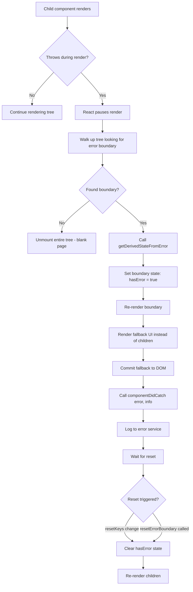
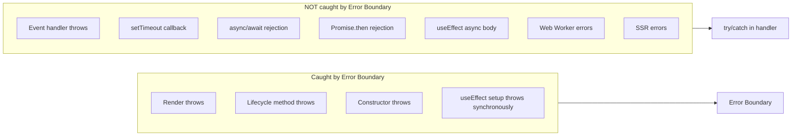
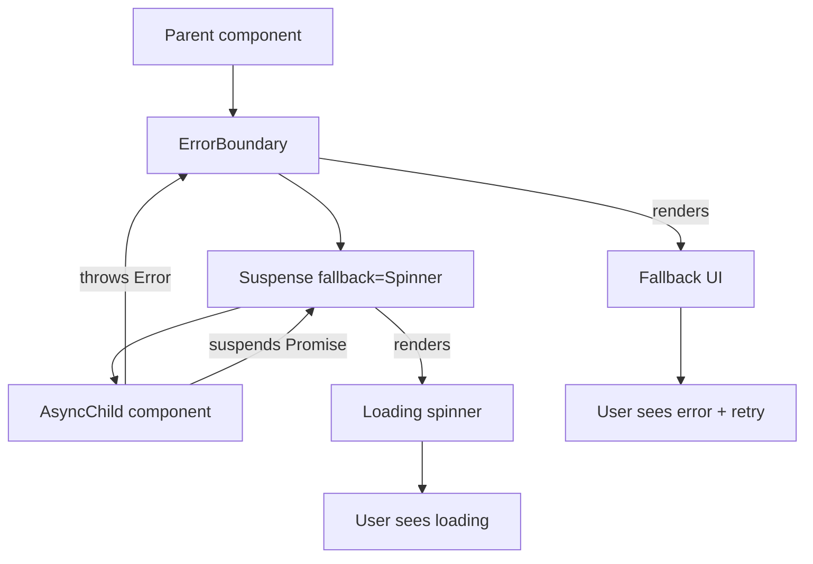

# 3.13 Error Boundaries and Debugging

> A single `undefined.map(...)` thrown during render used to blank out an entire React app. Error boundaries are React's answer: a class-based lifecycle hook that catches errors bubbling up through the component tree, swaps in a fallback UI, and keeps the rest of the app alive. This note covers why error boundaries exist (and why `try/catch` cannot do the job), the two lifecycle methods that make them work (`getDerivedStateFromError` and `componentDidCatch`), the de-facto standard `react-error-boundary` library, route-level and per-widget boundary placement, recovery patterns (reset keys, retry, `resetKeys`), what error boundaries deliberately do **not** catch (event handlers, async code, `setTimeout`, SSR), and a complete debugging playbook covering React DevTools, the Profiler flamegraph, console discipline, and the most common React error messages you will see in production.

## 3.13.1 Objective

By the end of this note you should be able to:

1. Explain why error boundaries exist and what problem they solve that `try/catch` cannot.
2. Write a class-based error boundary from scratch using `getDerivedStateFromError` and `componentDidCatch`, and explain why each one exists.
3. Replace hand-rolled boundaries with the `react-error-boundary` library in production code.
4. Place error boundaries strategically — top-level, per-route, per-widget — and articulate the tradeoffs of each placement.
5. Implement recovery patterns: the `key` reset trick, retry buttons, and the `resetKeys` prop from `react-error-boundary`.
6. Articulate precisely which categories of errors error boundaries do **not** catch (event handlers, async code, `setTimeout`, server-side rendering) and what to use instead for each.
7. Use React DevTools Components tab to inspect props, state, hooks, and context.
8. Use the React Profiler to record a session, read the flamegraph, and identify unnecessary re-renders.
9. Diagnose the most common React error messages by their root cause (`Invalid hook call`, `Cannot update a component while rendering`, `Maximum update depth exceeded`, `Objects are not valid as a React child`, `Each child in a list should have a unique key`, hydration mismatches).
10. Build a personal debugging checklist that you apply before reaching for any other tool.

## 3.13.2 Background Knowledge

Before reading further, make sure you are comfortable with:

- **JSX and rendering** from [[3.1 JSX and Rendering]] — what "rendering" actually means in React (calling a function, not painting pixels).
- **Components and props** from [[3.2 Components and Props]] — the parent/child relationship that error boundaries rely on.
- **State and events** from [[3.3 State and Events]] — `setState` batching and event handler semantics.
- **Class components** from [[3.2 Components and Props]] — error boundaries are the last widely-justified use case for class components in modern React.
- **Hooks** from [[3.6 Hooks (Built-In)]] — why functional components cannot be error boundaries.
- **Effects** from [[3.8 Effects and Side Effects]] — why async errors escape error boundaries.
- **Suspense** from [[3.12 Suspense, Lazy Loading, and Code Splitting]] — error boundaries pair with Suspense for async UI; Suspense handles loading, ErrorBoundary handles failure.

## 3.13.3 Core Concepts

### 3.13.3.1 The Problem: Errors Used to Unmount the Whole App

Before React 16, a single `TypeError` thrown anywhere in the render tree corrupted React's internal state. The reconciler could not safely continue, so the entire component tree was unmounted and the user was left looking at a blank white page. A single `undefined.map(...)` in a deeply nested header could blank out an entire dashboard.

`try/catch` does not solve this. You cannot wrap JSX in `try/catch`:

```jsx
// Does NOT work — try/catch does not catch errors thrown during render
function App() {
  try {
    return <Header user={undefined} />;
  } catch (err) {
    return <Fallback />;
  }
}
```

The reason this does not work is fundamental to how React works: `<Header user={undefined} />` does not *call* `Header` synchronously inside `App`. It creates an *element* — a plain object describing what to render. React's reconciler calls `Header` later, in its own stack frame, during the render phase. By the time `Header` throws, the `App` function has already returned and the `try` block is long gone. The throw escapes React's internal code, not yours.

> [!note] The mental model
> `try/catch` catches errors in **your** call stack. React's render phase happens in **React's** call stack. The two stacks do not overlap. Error boundaries exist to give React a place to land errors that happen inside its own stack.

### 3.13.3.2 What an Error Boundary Actually Is

An error boundary is a regular React **class component** that implements (at least) one of two lifecycle methods:

- `static getDerivedStateFromError(error)` — called during the render phase, returns a new state object that should mark the boundary as "errored". This is pure and synchronous. **Use this to render fallback UI.**
- `componentDidCatch(error, errorInfo)` — called after the DOM has been updated, with the error and a stack-trace-bearing `errorInfo` object. **Use this for side effects** like logging to Sentry, Datadog, or your error reporting service.

If either method is present, React treats the class as an error boundary. When a child throws during rendering, React walks up the tree looking for the nearest ancestor that is an error boundary, calls its lifecycle methods, and re-renders the boundary (now in its "errored" state) with the fallback UI.

```jsx
import { Component } from "react";

class ErrorBoundary extends Component {
  constructor(props) {
    super(props);
    this.state = { hasError: false };
  }

  static getDerivedStateFromError(error) {
    // Update state so the next render shows the fallback UI.
    return { hasError: true, error };
  }

  componentDidCatch(error, errorInfo) {
    // Side effect: log to an error reporting service.
    console.error("ErrorBoundary caught:", error, errorInfo);
    // Sentry.captureException(error, { extra: errorInfo });
  }

  render() {
    if (this.state.hasError) {
      return this.props.fallback ?? <h1>Something went wrong.</h1>;
    }
    return this.props.children;
  }
}
```

Usage is identical to any wrapper component:

```jsx
<ErrorBoundary fallback={<ErrorPage />}>
  <Dashboard />
</ErrorBoundary>
```

### 3.13.3.3 Why Two Lifecycle Methods?

React split the catch into two methods for a reason that maps to the render/commit split covered in [[3.1 JSX and Rendering]]:

| Method | Phase | Allowed to | Purpose |
|--------|-------|-----------|---------|
| `getDerivedStateFromError` | Render | Return new state (pure) | Trigger fallback UI |
| `componentDidCatch` | Commit | Run side effects | Log, report, telemetry |

`getDerivedStateFromError` is called during the render phase, which means it must be pure — no `console.log`, no network calls, no mutations. React needs to be able to call it without committing. `componentDidCatch` runs after commit, so it can do anything.

> [!warning] Never put side effects in `getDerivedStateFromError`
> If you call `Sentry.captureException` inside `getDerivedStateFromError`, React Strict Mode will double-invoke it in development and you will get duplicate error reports. Always log inside `componentDidCatch`.

### 3.13.3.4 What Error Boundaries Do Not Catch

This is the single most misunderstood thing about error boundaries. They catch only errors thrown **during React's render or commit lifecycle**. They do **not** catch:

| Error source | Caught? | What to use instead |
|--------------|---------|---------------------|
| Render-phase throws |  | Error boundary |
| Lifecycle method throws |  | Error boundary |
| Constructor throws |  | Error boundary |
| Event handler (`onClick`, `onSubmit`) throws |  | `try/catch` inside the handler |
| `setTimeout` / `setInterval` callback throws |  | `try/catch` inside the callback |
| `Promise.then` rejection |  | `.catch()` or `try/await/catch` |
| `async` function rejection |  | `try/await/catch` |
| Web Worker `onerror` |  | Worker's own error handler |
| Errors in `useEffect` cleanup |  | `try/catch` in cleanup |
| Server-side rendering |  | The server crashes; use `getStaticProps` try/catch or `error.tsx` in Next.js |
| Errors thrown by React itself (e.g. invalid hook) |  | Fix the bug |

> [!danger] The event-handler escape hatch
> A `try/catch` inside an `onClick` handler is the *only* way to catch a synchronous error thrown by that handler. Error boundaries will not save you here. Many production bugs come from a click handler that calls `data.user.name.toUpperCase()` without first checking that `data.user` exists.

```jsx
// Correct: catch inside the handler
function SaveButton({ data }) {
  const handleClick = async () => {
    try {
      await api.save(data);
    } catch (err) {
      toast.error("Save failed: " + err.message);
    }
  };
  return <button onClick={handleClick}>Save</button>;
}
```

### 3.13.3.5 Why Class Components, Still?

The React team has stated they have no plans to add an error boundary hook. The reason is subtle: error boundaries must catch errors thrown by *children during their render*, and to do that, the boundary itself must be in the parent's render path. A function component with a `useErrorBoundary` hook would need a way to throw from a child and have the parent's hook catch it — which would violate React's rule that hooks run synchronously in the parent.

Until React ships a fundamentally different mechanism (and there is no public plan to do so), class components remain the canonical way to write an error boundary. This is the one place where classes are still first-class citizens in modern React.

### 3.13.3.6 The `react-error-boundary` Library

Writing your own error boundary is a one-time learning exercise. In production, the de-facto standard is `react-error-boundary` (by Brian Vaughn, formerly on the React team). It gives you:

- A `<ErrorBoundary>` component with `FallbackComponent`, `fallback`, `fallbackRender` props.
- A `resetKeys` prop that resets the boundary when those keys change.
- An `onReset` callback for cleanup before reset.
- A `useErrorBoundary` hook (in v4+) for imperative reset and rethrow.

```jsx
import { ErrorBoundary } from "react-error-boundary";

function App() {
  return (
    <ErrorBoundary
      FallbackComponent={ErrorFallback}
      onReset={() => {
        // Reset any state that might have caused the error
        queryClient.resetQueries();
      }}
      resetKeys={[location.pathname]}
    >
      <Routes />
    </ErrorBoundary>
  );
}

function ErrorFallback({ error, resetErrorBoundary }) {
  return (
    <div role="alert">
      <h2>Something went wrong:</h2>
      <pre>{error.message}</pre>
      <button onClick={resetErrorBoundary}>Try again</button>
    </div>
  );
}
```

### 3.13.3.7 Recovery Patterns

Once an error boundary has caught an error, it stays in its errored state until something resets it. There are three recovery patterns:

**Pattern 1: Reset on route change (`resetKeys`).** When the user navigates away from the broken page, the boundary should reset. The `resetKeys` prop watches an array; when any element changes (by `Object.is`), the boundary resets.

```jsx
<ErrorBoundary resetKeys={[pathname]}>
  <Page />
</ErrorBoundary>
```

**Pattern 2: Explicit retry button.** The `FallbackComponent` receives a `resetErrorBoundary` function. Call it on click.

```jsx
function ErrorFallback({ error, resetErrorBoundary }) {
  return (
    <div>
      <p>{error.message}</p>
      <button onClick={resetErrorBoundary}>Retry</button>
    </div>
  );
}
```

**Pattern 3: The `key` reset trick.** If you don't have the library, you can reset a boundary by changing its `key`. React will unmount the old boundary and mount a new one.

```jsx
<ErrorBoundary key={retryCount}>
  <Page />
</ErrorBoundary>
```

> [!tip] The `key` trick is the most universal reset
> Changing a component's `key` forces React to unmount and remount it. This resets **all** state in that subtree. It works on error boundaries, on form components, on anything with internal state. See [[3.5 Lists and Keys]] for the deeper reasoning.

### 3.13.3.8 Route-Level vs App-Level vs Widget-Level Boundaries

Where you put the boundary matters. There are three common placements:

**App-level (top of the tree).** Catches everything. Downside: when it triggers, the entire app is replaced by the fallback. The user loses their place in the UI.

**Route-level.** Wraps each route. When a route errors, only that route's content is replaced; the navigation shell stays alive. Combined with `resetKeys={[pathname]}`, navigating away and back resets the boundary. This is the default recommendation for most apps.

**Widget-level.** Wraps an individual widget (a chart, a sidebar, a feed). When the widget errors, the rest of the page stays usable. Use this for isolated widgets that fetch their own data or render their own complex UI.

```jsx
<ErrorBoundary FallbackComponent={AppCrash}>         {/* top-level */}
  <Layout>
    <Nav />
    <ErrorBoundary
      FallbackComponent={RouteError}                 {/* per-route */}
      resetKeys={[pathname]}
    >
      <Routes />
    </ErrorBoundary>
    <ErrorBoundary FallbackComponent={WidgetError}>  {/* per-widget */}
      <LiveChart />
    </ErrorBoundary>
  </Layout>
</ErrorBoundary>
```

## 3.13.4 Detailed Walkthrough

### 3.13.4.1 Building an Error Boundary from Scratch

Start with the minimum: a class component with `getDerivedStateFromError` and a `fallback` prop.

```jsx
import { Component } from "react";

class ErrorBoundary extends Component {
  state = { hasError: false, error: null };

  static getDerivedStateFromError(error) {
    return { hasError: true, error };
  }

  componentDidCatch(error, info) {
    logErrorToService(error, info);
  }

  reset = () => this.setState({ hasError: false, error: null });

  render() {
    if (this.state.hasError) {
      if (typeof this.props.fallback === "function") {
        const Fallback = this.props.fallback;
        return <Fallback error={this.state.error} reset={this.reset} />;
      }
      return this.props.fallback ?? <DefaultFallback />;
    }
    return this.props.children;
  }
}
```

Note four things:

1. `state` is initialized as a class property — no `constructor` needed.
2. `reset` is an arrow function so `this` is bound when passed down.
3. `fallback` accepts either a React node (a JSX element) or a render function — this matches `react-error-boundary`'s `fallbackRender` API.
4. `componentDidCatch` receives an `info` object with `componentStack` — a React-specific stack trace that shows the component tree, not just the JS call stack. This is invaluable for debugging in production where JS is minified.

### 3.13.4.2 The `componentStack` Trick

The second argument to `componentDidCatch` is an object with a `componentStack` string. It looks like:

```
    in Dashboard (created by App)
    in App (created by Root)
    in Root
```

This is the **component tree** at the point of the error — not the JS call stack. In production, where JS is minified and the JS stack is useless, the component stack is your only breadcrumb. Always log it:

```jsx
componentDidCatch(error, info) {
  Sentry.captureException(error, {
    contexts: { react: { componentStack: info.componentStack } },
  });
}
```

Modern Sentry's React SDK does this for you automatically when you wrap your app in `Sentry.ErrorBoundary`.

### 3.13.4.3 Pairing with Suspense

Error boundaries and Suspense are complementary. Suspense handles *loading* states (a child suspends on a promise); error boundaries handle *failure* states (a child throws). Together they form the complete async UI story:

```jsx
<ErrorBoundary FallbackComponent={Error}>
  <Suspense fallback={<Spinner />}>
    <UserProfile userId={id} />
  </Suspense>
</ErrorBoundary>
```

Order matters: the ErrorBoundary should be **outside** the Suspense. If you swap them, a thrown error becomes a suspended promise and the fallback never renders.

> [!tip] The full production pattern
> Wrap each route in `ErrorBoundary > Suspense > Page`. The boundary catches errors, Suspense shows loading state. Both fallbacks are scoped to the route, so a single broken page never blanks the whole app.

### 3.13.4.4 Debugging Strategy 1: React DevTools Components Tab

Install the React DevTools browser extension (Chrome and Firefox). Open it; the **Components** tab shows your component tree as React sees it, not as the DOM sees it.

What you can do in the Components tab:

- **Inspect props and state** of any component in real time.
- **Inspect hooks**: each hook call is shown with its current value, in call order.
- **Inspect context**: see which context a component consumes and what its current value is.
- **"Where is this rendered?"** — select a DOM element, click the "Inspect" toolbar button, and React DevTools jumps to that element in the Components tab.
- **Edit state on the fly**: change a useState value and React re-renders immediately. Invaluable for testing edge cases.
- **"Why did this render?"** (in Profiler, not Components): highlights the prop or state that triggered a re-render.

### 3.13.4.5 Debugging Strategy 2: The React Profiler

The **Profiler** tab records a session and shows you exactly which components rendered, how long they took, and why. Click the record button, interact with your app, stop recording.

The Profiler shows a **flamegraph** where:

- Width = time spent rendering (including children).
- Color = relative cost (yellow = average, red = expensive).
- Each row is a commit; click a commit to see the flamegraph for that specific render.

The two killer features:

1. **"What caused this render?"** — for each component in a commit, React tells you whether the cause was a hook change, a prop change, or a parent re-render.
2. **"Why did this render?"** (toggle in the settings) — shows the *specific* prop or state value that changed. You can see exactly which prop failed `Object.is` comparison.

> [!note] Why Profiler shows "nothing"
> The Profiler is **no-op in production builds** by default. You must run React in development mode (or use the profiling build of React) to see timings. If the Profiler tab is greyed out, you are running a production build.

### 3.13.4.6 Debugging Strategy 3: Console Discipline

A senior engineer's console is informative, not noisy. Rules:

1. **No `console.log` in committed code.** Use a logger that you can turn off, or use ESLint's `no-console` rule with `allow: ["warn", "error"]`.
2. **`console.error` is for actual errors.** React itself logs errors and warnings through `console.error` — if you spam it, you drown React's signals.
3. **`console.table` for arrays of objects.** Far more readable than a wall of `console.log`.
4. **`console.groupCollapsed` for grouped output.** Lets you collapse a debugging session into a single line.
5. **`console.trace` to see the call stack** when you need to know *who* called a function.

### 3.13.4.7 Common React Error Messages Decoded

| Error message | Root cause | Fix |
|---------------|-----------|-----|
| `Invalid hook call. Hooks can only be called inside the body of a function component.` | (1) Two copies of React. (2) Hook called outside a component. (3) Hook called inside a class. (4) Hook called inside a non-React function. | Run `npm ls react` to find duplicate copies. Check call site. |
| `Cannot update a component (X) while rendering a different component (Y)` | A component is calling `setState` of another component during render. Usually: calling a parent's `setState` from inside a child's render, or calling `setState` of a context consumer during render. | Move the setState into an effect. |
| `Maximum update depth exceeded` | A `useEffect` with no `deps` or with state in `deps` is calling `setState`, causing an infinite loop. | Audit effect deps; the setState should not depend on something the effect itself changes. |
| `Objects are not valid as a React child (found: object with keys {foo, bar})` | You are rendering a plain object directly: `{someObject}` instead of `{someObject.name}`. | Render a primitive, an element, or an array of those. |
| `Each child in a list should have a unique "key" prop` | List items lack stable keys. | Add a stable `key` based on data identity, not array index. See [[3.5 Lists and Keys]]. |
| `Cannot read properties of undefined (reading 'map')` | Data not yet loaded. Often a missing loading state. | Guard with `data?.map(...)` or render a skeleton while loading. |
| `Text content did not match. Server: ... Client: ...` | Hydration mismatch — server and client render different HTML. Usually dates, locale-formatted numbers, or browser-only APIs like `window`. | Use `useEffect` to set the browser-only value after mount, or use `suppressHydrationWarning` for legitimate differences. |
| `Warning: A component is changing an uncontrolled input to be controlled` | The `value` prop is `undefined` on first render, then a string on later renders. | Default to `""` not `undefined`: `value={value ?? ""}`. |
| `Warning: Can't perform a React state update on an unmounted component` | An async operation (fetch, setTimeout) completes after unmount and calls `setState`. | Use an AbortController / ignore flag / cleanup timer. See [[3.7 Custom Hooks]]. |
| `Rendered fewer hooks than expected` | A hook is being called conditionally. | Move the hook above the conditional, or always call it. See [[3.6 Hooks (Built-In)]]. |

## 3.13.5 Practical Examples

### 3.13.5.1 A Complete Production Error Boundary

```tsx
import { Component, ReactNode, ErrorInfo } from "react";

interface Props {
  children: ReactNode;
  fallback: (error: Error, reset: () => void) => ReactNode;
  onError?: (error: Error, info: ErrorInfo) => void;
  resetKeys?: unknown[];
}

interface State {
  error: Error | null;
}

export class ErrorBoundary extends Component<Props, State> {
  state: State = { error: null };

  static getDerivedStateFromError(error: Error): State {
    return { error };
  }

  componentDidCatch(error: Error, info: ErrorInfo) {
    this.props.onError?.(error, info);
    if (typeof window !== "undefined" && window.Sentry) {
      window.Sentry.captureException(error, {
        contexts: { react: { componentStack: info.componentStack } },
      });
    }
  }

  componentDidUpdate(prevProps: Props) {
    if (this.state.error && prevProps.resetKeys !== this.props.resetKeys) {
      const changed = (this.props.resetKeys ?? []).some(
        (key, i) => !Object.is(key, prevProps.resetKeys?.[i])
      );
      if (changed) this.setState({ error: null });
    }
  }

  reset = () => this.setState({ error: null });

  render() {
    if (this.state.error) {
      return this.props.fallback(this.state.error, this.reset);
    }
    return this.props.children;
  }
}
```

### 3.13.5.2 Catching Errors in Event Handlers

```tsx
function DeleteButton({ id }: { id: string }) {
  const [error, setError] = useState<string | null>(null);

  const handleDelete = async () => {
    setError(null);
    try {
      await api.delete(`/items/${id}`);
    } catch (err) {
      setError(err instanceof Error ? err.message : "Delete failed");
    }
  };

  return (
    <>
      <button onClick={handleDelete}>Delete</button>
      {error && <p role="alert">{error}</p>}
    </>
  );
}
```

### 3.13.5.3 Per-Route Error Boundary with React Router

```tsx
import { ErrorBoundary } from "react-error-boundary";
import { useLocation } from "react-router-dom";

function RouteBoundary({ children }: { children: ReactNode }) {
  const location = useLocation();
  return (
    <ErrorBoundary
      FallbackComponent={RouteError}
      resetKeys={[location.pathname]}
    >
      {children}
    </ErrorBoundary>
  );
}

function RouteError({ error, resetErrorBoundary }: any) {
  return (
    <div role="alert" className="p-8">
      <h1>This page crashed.</h1>
      <pre className="bg-red-50 p-4">{error.message}</pre>
      <button onClick={resetErrorBoundary}>Try again</button>
    </div>
  );
}

// In your router:
<Route path="/dashboard" element={
  <RouteBoundary><Dashboard /></RouteBoundary>
} />
```

### 3.13.5.4 Sentry Integration

```tsx
import * as Sentry from "@sentry/react";

function App() {
  return (
    <Sentry.ErrorBoundary
      fallback={({ error, resetError }) => (
        <CrashPage error={error} onRetry={resetError} />
      )}
      beforeCapture={(scope) => {
        scope.setTag("boundary", "app-root");
      }}
      showDialog
    >
      <Root />
    </Sentry.ErrorBoundary>
  );
}
```

`Sentry.ErrorBoundary` is a thin wrapper around the same lifecycle methods, but it auto-captures the error with full component stack and (optionally) shows a user-feedback dialog.

## 3.13.6 Mermaid Diagrams

### 3.13.6.1 Error Boundary Catch Flow



### 3.13.6.2 What Error Boundaries Catch vs Miss



### 3.13.6.3 Suspense + ErrorBoundary Composition



## 3.13.7 Common Mistakes

1. **Wrapping the entire app in a single top-level boundary with no recovery.** When something crashes, the whole app is dead and there is no retry. Always provide a `resetKeys` or `resetErrorBoundary` path. Always prefer route-level boundaries for SPA apps.

2. **Expecting error boundaries to catch errors in `onClick` handlers.** They will not. Use `try/catch` inside the handler. This is the single most common confusion.

3. **Putting side effects (logging, Sentry) inside `getDerivedStateFromError`.** This method runs during render and must be pure. Use `componentDidCatch` for side effects. Strict Mode double-invokes `getDerivedStateFromError` in dev — you will get duplicate logs.

4. **Forgetting to reset the boundary.** Once a boundary is in its errored state, it stays that way forever. If you swap children but never reset, the new children never render. Always wire up a reset path: `resetKeys`, `resetErrorBoundary`, or `key` change.

5. **Placing the ErrorBoundary *inside* the Suspense.** A thrown error then bubbles up through Suspense, which has no error handling, and reaches the next boundary up — usually the wrong one. Place ErrorBoundary *outside* Suspense.

6. **Logging `error` instead of `error.message` and `error.stack`.** The full `Error` object stringifies poorly. Log `error.message` and `error.stack` separately, plus `info.componentStack` for the React tree.

7. **Using error boundaries for control flow.** They are not a try/catch for business logic. If you find yourself throwing inside a component to trigger a fallback, you have a design problem — restructure with conditional rendering or `useState`.

8. **Expecting error boundaries to catch errors in `useEffect` callbacks that are async.** The synchronous *start* of the effect is caught, but as soon as you `await`, you are in microtask land and errors escape. Wrap async effect bodies in `try/catch`.

9. **Trusting the production JS stack trace.** In production, JS is minified and the stack is useless. Always log the `componentStack` from `componentDidCatch` — that is your breadcrumb.

10. **Forgetting that error boundaries don't catch SSR errors.** On the server, an error during render crashes the request. In Next.js, use `error.tsx` files (which run on the client) to recover; wrap server data fetching in `try/catch`.

## 3.13.8 Best Practices

1. **Use `react-error-boundary` instead of hand-rolling.** It is well-tested, supports `resetKeys`, `onReset`, render-prop fallbacks, and works with React 19. Reimplementing it buys you nothing.

2. **Place boundaries at three levels: app, route, widget.** App-level for catastrophic failure, route-level for page crashes, widget-level for isolated component crashes (charts, feeds, third-party embeds).

3. **Always wire a recovery path.** At minimum, `resetKeys={[location.pathname]}` so navigation resets. For interactive recovery, pass `resetErrorBoundary` to a Retry button in the fallback.

4. **Always log to a real error service.** Sentry, Datadog, Bugsnag, Rollbar — pick one. `console.error` is invisible to you in production. Always include `info.componentStack`.

5. **Pair every Suspense with an ErrorBoundary above it.** Suspense handles loading; ErrorBoundary handles failure. Together they form the complete async UI story.

6. **Provide actionable fallback UI.** Show the error message, a retry button, and (for catastrophic failures) a link to support or home. Don't show a blank "Something went wrong" with no way out.

7. **Guard against `undefined.map` at the data layer.** Most error boundary triggers are missing data. Default to `[]` from your data hooks (`data ?? []`), and the error never happens.

8. **Use `try/catch` in event handlers religiously.** Network calls, JSON.parse, anything that can throw. Show a toast on failure. Never let an error escape to the global handler.

9. **In development, leave React's loud red overlay on.** It is annoying, but it forces you to fix errors immediately. In production, it is replaced by your error boundary.

10. **Set up the React Profiler in development and profile regularly.** Don't wait for performance complaints. Profile every PR that touches a hot path. The Profiler is the only way to see *why* a component rendered.

11. **Use `why-did-you-render` (or React 19's built-in "Why did this render?" in DevTools) during development.** It logs every re-render with the cause. Remove it before shipping — it has a perf cost.

12. **Build a personal debugging checklist** and apply it before reaching for advanced tools. The checklist below resolves 80% of bugs in under five minutes.

> [!tip] The five-minute debugging checklist
> 1. Read the error message. Out loud. Twice.
> 2. Look at the component stack, not just the JS stack.
> 3. Open React DevTools  -->  Components  -->  click the failing component.
> 4. Inspect props and state. Are they what you expected?
> 5. Check the Network tab — did the fetch return what you thought?
> 6. Only after these, reach for `console.log`.

## 3.13.9 Mini Exercises

### 3.13.9.1 Write an Error Boundary from Scratch

**Task:** Write an `ErrorBoundary` class component that takes a `fallback` prop (a React node) and an optional `onError` callback. The boundary should catch errors, render the fallback, and call `onError` with the error and component stack. Provide a `reset` method that can be triggered by changing the `key` prop.

**Worked solution:**

```tsx
import { Component, ErrorInfo, ReactNode } from "react";

interface Props {
  children: ReactNode;
  fallback: ReactNode;
  onError?: (error: Error, info: ErrorInfo) => void;
}

interface State {
  hasError: boolean;
  error: Error | null;
}

export class ErrorBoundary extends Component<Props, State> {
  state: State = { hasError: false, error: null };

  static getDerivedStateFromError(error: Error): State {
    return { hasError: true, error };
  }

  componentDidCatch(error: Error, info: ErrorInfo) {
    this.props.onError?.(error, info);
  }

  render() {
    if (this.state.hasError) return this.props.fallback;
    return this.props.children;
  }
}

// Usage with key-based reset:
// <ErrorBoundary key={retryKey} fallback={<Crash />}>
//   <RiskComponent />
// </ErrorBoundary>
// Changing retryKey unmounts the boundary and mounts a fresh one.
```

**Common wrong approach:** Putting `onError` inside `getDerivedStateFromError`. That method runs during render and must be pure — calling `onError` there causes double-firing under Strict Mode and may break concurrent rendering.

### 3.13.9.2 Diagnose the Event-Handler Bug

**Task:** A user reports that clicking "Save" sometimes blanks the entire page. The code is:

```tsx
function SaveButton({ data }: { data: any }) {
  const handleClick = () => {
    const name = data.user.name.toUpperCase();
    api.save(name);
  };
  return <button onClick={handleClick}>Save</button>;
}
```

The page is wrapped in `<ErrorBoundary fallback={<Crash />}>`. Why does the page blank, and why doesn't the boundary catch it? Fix it.

**Diagnosis:** `data.user` is `undefined` on the first render before data loads. Clicking the button throws `TypeError: Cannot read properties of undefined`. The error is thrown inside an event handler — error boundaries **do not** catch event handler errors. The thrown error escapes to the browser's global error handler, which has no recovery path, and React (in some setups) unmounts the tree.

**Fix:**

```tsx
function SaveButton({ data }: { data: any }) {
  const handleClick = async () => {
    try {
      if (!data?.user?.name) {
        toast.error("No user loaded yet");
        return;
      }
      const name = data.user.name.toUpperCase();
      await api.save(name);
    } catch (err) {
      toast.error(err instanceof Error ? err.message : "Save failed");
    }
  };
  return <button onClick={handleClick}>Save</button>;
}
```

Two changes: (1) guard the property access, (2) wrap the whole thing in `try/catch` because error boundaries will not save you here.

### 3.13.9.3 Reset on Route Change

**Task:** Wrap your `Routes` in an `ErrorBoundary` that resets whenever the URL pathname changes. Use `react-error-boundary`.

**Worked solution:**

```tsx
import { ErrorBoundary } from "react-error-boundary";
import { useLocation } from "react-router-dom";

function RouteBoundary({ children }: { children: React.ReactNode }) {
  const { pathname } = useLocation();
  return (
    <ErrorBoundary
      FallbackComponent={RouteError}
      resetKeys={[pathname]}
    >
      {children}
    </ErrorBoundary>
  );
}

function RouteError({ error, resetErrorBoundary }: any) {
  return (
    <div role="alert">
      <h2>Page error</h2>
      <pre>{error.message}</pre>
      <button onClick={resetErrorBoundary}>Retry</button>
      <Link to="/">Go home</Link>
    </div>
  );
}

// Usage:
<Layout>
  <Nav />
  <RouteBoundary>
    <Routes>
      <Route path="/" element={<Home />} />
      <Route path="/dashboard" element={<Dashboard />} />
    </Routes>
  </RouteBoundary>
</Layout>
```

**Why this works:** `resetKeys={[pathname]}` watches the array `[pathname]`. When the user navigates from `/dashboard` to `/settings`, `pathname` changes from `"/dashboard"` to `"/settings"`, `Object.is("/dashboard", "/settings")` is `false`, and `react-error-boundary` resets the boundary's errored state. The new route renders fresh.

### 3.13.9.4 Decode This Error Message

**Task:** You see this error in the console:

```
Warning: Cannot update a component (`Header`) while rendering a different component (`Dashboard`). To locate the bad setState() call inside `Dashboard`, follow the stack trace.
```

What is happening, and how do you fix it?

**Diagnosis:** During `Dashboard`'s render, something is calling a `setState` of the `Header` component. The most common cause: a child component (rendered by `Dashboard`) is calling a function from context that triggers `setState` in `Header`, *during render* instead of inside an effect.

For example:

```tsx
function UserProfile({ user }: { user: User }) {
  const { setUser } = useUserContext();
  // BUG: calling setUser during render
  setUser(user);
  return <div>{user.name}</div>;
}
```

**Fix:** Move the side effect into `useEffect`:

```tsx
function UserProfile({ user }: { user: User }) {
  const { setUser } = useUserContext();
  useEffect(() => {
    setUser(user);
  }, [user, setUser]);
  return <div>{user.name}</div>;
}
```

Or — better — derive the value without storing it in context at all. If `Header` just needs the current `user`, pass it as a prop instead of through context.

### 3.13.9.5 Profile a Slow Search

**Task:** A search input feels laggy when typing. Walk through how you would use the React Profiler to identify the cause.

**Worked solution:**

1. Open React DevTools  -->  **Profiler** tab.
2. Click the **Record** button (circle icon).
3. Type a search query into the input, one character at a time.
4. Click **Stop**.
5. The Profiler shows one commit per keystroke. Click the slowest commit (look for the longest bar or the reddest color).
6. Look at the flamegraph: find the wide bars — those are the components taking the most time.
7. For each wide bar, look at the **"Why did this render?"** panel on the right. It will tell you which prop or state changed.
8. Common culprits:
   - A large list re-rendering on every keystroke  -->  wrap with `React.memo` or virtualize (see [[3.11 Performance Optimization]]).
   - An expensive filter or sort running on every render  -->  wrap with `useMemo`.
   - A child component whose props are new object references each render  -->  stabilize with `useCallback` / `useMemo`.
9. Fix the top cause, re-record, compare. Repeat until typing feels instant.
10. If the input itself feels laggy even with a fast render, consider `useDeferredValue` or `useTransition` to defer the heavy work to a non-urgent lane.

## 3.13.10 Summary

Error boundaries are React's safety net for render-phase errors. They are the **only** mechanism that catches errors thrown during rendering, lifecycle methods, and constructors — and they are intentionally **class components** because the catch semantics require parent/child lifecycle coordination that hooks cannot provide. Use `getDerivedStateFromError` for pure state updates (to trigger fallback), and `componentDidCatch` for side effects (logging, Sentry). The `react-error-boundary` library is the production-grade replacement for hand-rolled boundaries, with `resetKeys` and `resetErrorBoundary` for recovery.

Critically, error boundaries **do not** catch errors in event handlers, async code, `setTimeout`, or SSR — for those, use `try/catch` and async error handling. Place boundaries at three levels: app (catastrophe), route (page crash), widget (isolated component). Pair every `<Suspense>` with an ErrorBoundary *above* it: Suspense handles loading, ErrorBoundary handles failure.

For debugging, React DevTools (Components + Profiler) is your most important tool. The Components tab shows live props/state/hooks/context; the Profiler flamegraph shows what rendered, how long, and why. Build a personal debugging checklist and apply it before reaching for advanced tools — most bugs resolve in five minutes of patient inspection. Learn the common React error messages by heart; they are stable across versions and each one has a small set of root causes.

## 3.13.11 Related Notes

- [[3.1 JSX and Rendering]] — what "rendering" actually means, and why errors during render escape `try/catch`.
- [[3.2 Components and Props]] — the parent/child relationship that error boundaries rely on.
- [[3.3 State and Events]] — why event handler errors are not caught by error boundaries.
- [[3.6 Hooks (Built-In)]] — why functional components cannot be error boundaries, and the "invalid hook call" error.
- [[3.8 Effects and Side Effects]] — why async errors escape error boundaries, and how to use `try/catch` in effects.
- [[3.12 Suspense, Lazy Loading, and Code Splitting]] — error boundaries pair with Suspense for the complete async UI story.
- [[3.14 Reusable Component Design]] — designing reusable components that fail gracefully.
- [[3.16 API Integration and Data Fetching]] — error handling for data fetching, paired with error boundaries.
- [[3.17 Client-Side Routing]] — route-level error boundaries with React Router.
- [[4.9 Loading UI, Error Pages, and Streaming]] — Next.js `error.tsx` files for route-level error handling in the App Router.
- [[6.3 React Interview Questions]] — error boundary questions are interview favorites.
