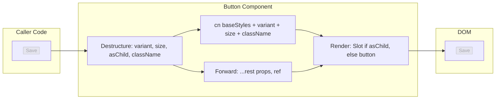
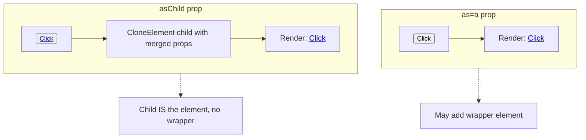
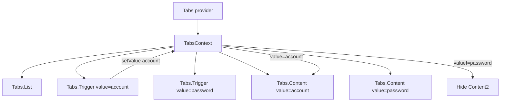

# 3.14 Reusable Component Design

> Building one component is easy. Building a component that gets reused across five teams, ten products, and a hundred screens — without becoming a leaky, unmaintainable mess — is one of the hardest jobs in frontend engineering. This note covers what makes a component reusable, the principles of component API design, `forwardRef` (and how React 19 makes refs a regular prop), the polymorphic `as` prop and its TypeScript challenges, the Radix `asChild` slot pattern, variant APIs with `cva`, the compound component pattern (Tabs, Accordion, Menu), naming conventions, the "rule of three" for when to extract a component, and the standard set of props every reusable component should consider (`className`, `style`, `id`, `data-testid`, `aria-*` passthrough).

## 3.14.1 Objective

By the end of this note you should be able to:

1. Articulate the four pillars of reusability: single responsibility, configurable via props, sensible defaults, escape hatches.
2. Design a component's public API as an explicit contract, separating public props from internal implementation.
3. Use `forwardRef` correctly in React 18, and explain how React 19 changes the picture (refs as regular props).
4. Implement a polymorphic `as` prop pattern in TypeScript, and explain the typing pitfalls that make it hard.
5. Explain the Radix `asChild` / slot pattern and when to prefer it over the `as` prop.
6. Build a variant API using `cva` (class-variance-authority) and integrate it with Tailwind.
7. Implement the compound component pattern (Tabs with `Tabs.List`, `Tabs.Trigger`, `Tabs.Content`) using context for shared state.
8. Apply naming conventions: `Button` vs `ButtonGroup`, `Card` vs `CardHeader`, `Tabs` vs `TabsList`.
9. Apply the "rule of three" for when to extract a reusable component.
10. Include the standard passthrough props (`className`, `style`, `id`, `data-testid`, `aria-*`) in every reusable component.

## 3.14.2 Background Knowledge

Before reading further, make sure you are comfortable with:

- **Components and props** from [[3.2 Components and Props]] — props as inputs, `children`, default values, controlled vs uncontrolled.
- **State and events** from [[3.3 State and Events]] — `useState`, event handlers, controlled inputs.
- **Hooks** from [[3.6 Hooks (Built-In)]] — `useRef`, `useImperativeHandle` for ref APIs.
- **Composition and Patterns** from [[3.10 Composition and Patterns]] — compound components, render props, HOCs, lifting state up.
- **Context** from [[3.9 Context and Reducers]] — compound components share state via context.
- **Tailwind with React** from [[2.7 Tailwind with React and Next.js]] — Tailwind + component composition.
- **Organizing Large Tailwind Projects** from [[2.8 Organizing Large Tailwind Projects]] — `cva` and variant-based styling.
- **TypeScript** — generic types, conditional types, `ComponentProps`, `ComponentPropsWithoutRef`.

## 3.14.3 Core Concepts

### 3.14.3.1 What Makes a Component Reusable

A reusable component satisfies four properties:

**1. Single responsibility.** It does one thing. A `Button` renders a button. A `Modal` renders a modal. A `DatePicker` renders a date picker. If your component does three things, three teams will need three different combinations and one of them won't fit. Split it.

**2. Configurable via props.** Every meaningful variation is exposed through props. Variants (`variant="primary"`), sizes (`size="lg"`), behaviors (`disabled`, `loading`), and content (`children`, `startIcon`, `endIcon`) are all props. If a team needs to fork your component to change one thing, you forgot a prop.

**3. Sensible defaults.** Every optional prop has a default that works for 80% of callers. A `Button` without `variant` should still look like a button. A `Modal` without `size` should still be a reasonable size. Defaults let the 80% case be one line of code.

**4. Escape hatches.** When the component doesn't fit, the caller can escape without forking. The four canonical escape hatches are: `className` (override styles), `style` (inline styles), `as` (change the rendered element), and `ref` (imperative DOM access). If your component blocks these escape hatches, callers will fork it.

### 3.14.3.2 The Public API as a Contract

A reusable component's props are a contract. Once you publish a `Button` with `variant`, `size`, `disabled`, `loading`, `onClick`, `children`, you cannot remove or rename any of those without breaking every caller. Add fields freely; remove or rename with extreme care.

A good public API has three properties:

- **Minimal**: only the props callers actually need. Every prop is an obligation to maintain forever.
- **Discoverable**: prop names are obvious. `variant` is better than `v`. `startIcon` is better than `icon1`.
- **Composable**: props don't conflict. `disabled` and `loading` both disable the button, but they should compose (a `loading` button is automatically `disabled`).

> [!warning] The "kitchen sink" antipattern
> A component with 40 props is not reusable — it is unmaintainable. Every prop is a test case, a doc entry, and a future migration. If your `Button` has `primary`, `secondary`, `success`, `danger`, `warning`, `info`, `light`, `dark` props instead of a single `variant` enum, you have a kitchen sink. Use variant enums and pattern-compose.

### 3.14.3.3 `forwardRef`: The DOM Access Escape Hatch

By default, a function component cannot receive a `ref` prop. `ref` is a special prop reserved by React — it does not pass through to the component's props the way `className` does. To accept a `ref`, you wrap your component in `forwardRef`:

```tsx
import { forwardRef } from "react";

const Button = forwardRef<HTMLButtonElement, ButtonProps>(
  function Button(props, ref) {
    return <button ref={ref} {...props} />;
  }
);
```

`forwardRef` takes a render function with two arguments: `(props, ref)`. The `ref` is whatever the caller passed: a callback ref, an object ref (`useRef`), or `null`. You forward it to the underlying DOM element.

Without `forwardRef`, callers cannot attach a ref:

```tsx
const ref = useRef<HTMLButtonElement>(null);
<Button ref={ref} />; // Without forwardRef, ref is silently undefined
```

> [!note] Always name your forwardRef function
> The second argument to `forwardRef` is a function. Anonymous functions show up as `<ForwardRef>` in React DevTools. Always name it: `forwardRef(function Button(props, ref) { ... })`. The name propagates to DevTools and stack traces.

### 3.14.3.4 React 19: Refs as Regular Props

React 19 (and the React 19 types) deprecates `forwardRef` — you can now accept `ref` as a regular prop:

```tsx
// React 19 style
function Button({ ref, ...props }: ButtonProps & { ref?: Ref<HTMLButtonElement> }) {
  return <button ref={ref} {...props} />;
}
```

This is simpler, lets you destructure `ref` like any other prop, and removes the awkward `forwardRef` wrapper. `forwardRef` still works for backward compatibility — but for new components targeting React 19+, accept `ref` as a regular prop.

> [!tip] Migration tip
> You can migrate gradually. New components use the React 19 style; old `forwardRef` components continue to work. When you touch an old component, refactor it then. Don't do a big-bang migration.

### 3.14.3.5 The Polymorphic `as` Prop

The `as` prop lets the caller choose the rendered element:

```tsx
<Button as="a" href="/about">About</Button>
// Renders: <a href="/about" class="btn">About</a>

<Button as="button" type="submit">Submit</Button>
// Renders: <button type="submit" class="btn">Submit</button>
```

This is useful when a `Button` might be a real `<button>` (in a form) or an `<a>` (for navigation). The visual style is identical; the semantics differ.

Implementing `as` in TypeScript is hard. You need the props to be conditional on the element type — `as="a"` should require `href`, `as="button"` should accept `type`. This requires generic component types and conditional type constraints:

```tsx
type AsProp<C extends React.ElementType> = {
  as?: C;
};

type PropsToOmit<C extends React.ElementType, P> = keyof (AsProp<C> & P);

type PolymorphicComponentProps<
  C extends React.ElementType,
  Props = {}
> = React.PropsWithChildren<Props & AsProp<C>>
  & Omit<React.ComponentPropsWithoutRef<C>, PropsToOmit<C, Props>>;

type ButtonProps<C extends React.ElementType> = PolymorphicComponentProps<
  C,
  { variant?: "primary" | "secondary"; size?: "sm" | "md" | "lg" }
>;

function Button<C extends React.ElementType = "button">({
  as,
  variant = "primary",
  size = "md",
  className,
  ...rest
}: ButtonProps<C>) {
  const Component = as || "button";
  return (
    <Component
      className={cx(buttonStyles({ variant, size }), className)}
      {...rest}
    />
  );
}
```

> [!warning] Polymorphic typing is famously fragile
> TypeScript cannot fully express "the props depend on the `as` value". The pattern above works but has rough edges — ref typing especially. Many production libraries (Radix, Mantine, Chakra) use this pattern with hand-tuned types. For your own components, consider whether `as` is worth the complexity. Often two separate components (`Button` and `LinkButton`) are simpler.

### 3.14.3.6 The `asChild` Pattern from Radix UI

Radix UI introduced an alternative to `as`: the `asChild` prop. When `asChild` is true, the component clones its child and merges its own props into the child instead of rendering a wrapper:

```tsx
<Button asChild>
  <a href="/about">About</a>
</Button>
// Renders: <a href="/about" class="btn">About</a>
```

This avoids the wrapper element problem. With `as`, you sometimes end up with an extra `<button>` wrapping an `<a>`, which is invalid HTML. With `asChild`, the child element *is* the rendered element — no wrapper.

The implementation uses `React.cloneElement` to merge props:

```tsx
import { cloneElement, isValidElement, ReactElement } from "react";

interface SlotProps {
  children?: ReactElement;
  className?: string;
}

function Slot({ children, className, ...props }: SlotProps) {
  if (!isValidElement(children)) return null;
  return cloneElement(children, {
    ...props,
    className: cx(className, children.props.className),
  });
}

// Usage:
function Button({ asChild, className, ...props }: ButtonProps & { asChild?: boolean }) {
  const Comp = asChild ? Slot : "button";
  return <Comp className={cx(buttonStyles(), className)} {...props} />;
}
```

> [!tip] When to use `asChild` vs `as`
> Use `asChild` when the child needs to *be* the rendered element (links, list items, anything where wrapping would break HTML semantics). Use `as` when you just need to swap the tag and a wrapper is fine. `asChild` is more flexible but harder to type. Most modern libraries (Radix, shadcn/ui) prefer `asChild`.

### 3.14.3.7 Variant APIs with `cva`

`cva` (class-variance-authority) is the de-facto standard for declaring a component's variants as data. You declare variants in a config, and `cva` returns a function that produces the right class string given a set of props:

```tsx
import { cva, type VariantProps } from "class-variance-authority";

const buttonStyles = cva(
  // Base classes always applied
  "inline-flex items-center justify-center rounded-md font-medium transition-colors focus-visible:outline-none focus-visible:ring-2 disabled:pointer-events-none disabled:opacity-50",
  {
    variants: {
      variant: {
        primary: "bg-blue-600 text-white hover:bg-blue-700",
        secondary: "bg-gray-200 text-gray-900 hover:bg-gray-300",
        ghost: "bg-transparent hover:bg-gray-100",
        destructive: "bg-red-600 text-white hover:bg-red-700",
      },
      size: {
        sm: "h-8 px-3 text-sm",
        md: "h-10 px-4 text-base",
        lg: "h-12 px-6 text-lg",
      },
    },
    defaultVariants: {
      variant: "primary",
      size: "md",
    },
  }
);

type ButtonVariants = VariantProps<typeof buttonStyles>;
// ButtonVariants = { variant?: "primary" | "secondary" | "ghost" | "destructive"; size?: "sm" | "md" | "lg" }
```

The component then uses `buttonStyles({ variant, size })`:

```tsx
function Button({ variant, size, className, ...props }: ButtonProps) {
  return (
    <button
      className={cx(buttonStyles({ variant, size }), className)}
      {...props}
    />
  );
}
```

Benefits of `cva`:

- **Single source of truth** for variants and types.
- **Tailwind-friendly**: classes are static strings, so Tailwind's JIT picks them up.
- **Composable**: pass `cx(...)` to merge with caller's `className`.
- **Type-safe**: `VariantProps<typeof buttonStyles>` gives you the variant prop types for free.

`cva` is the foundation of the shadcn/ui component library, which is now the dominant React + Tailwind component pattern.

### 3.14.3.8 The Compound Component Pattern

A compound component is a set of components that work together to form a single UI piece, sharing implicit state via context. The classic example is `Tabs`:

```tsx
<Tabs defaultValue="account">
  <Tabs.List>
    <Tabs.Trigger value="account">Account</Tabs.Trigger>
    <Tabs.Trigger value="password">Password</Tabs.Trigger>
  </Tabs.List>
  <Tabs.Content value="account">Account settings</Tabs.Content>
  <Tabs.Content value="password">Password settings</Tabs.Content>
</Tabs>
```

Implementation requires three pieces:

1. **A context** that holds the shared state (currently selected tab) and the change handler.
2. **A parent component** (`Tabs`) that provides the context.
3. **Child components** (`Tabs.List`, `Tabs.Trigger`, `Tabs.Content`) that consume the context.

```tsx
import { createContext, useContext, useState, ReactNode } from "react";

interface TabsContextValue {
  value: string;
  setValue: (v: string) => void;
}
const TabsContext = createContext<TabsContextValue | null>(null);

function useTabsContext() {
  const ctx = useContext(TabsContext);
  if (!ctx) throw new Error("Tabs.* must be used inside <Tabs>");
  return ctx;
}

function Tabs({
  defaultValue,
  value,
  onValueChange,
  children,
}: {
  defaultValue?: string;
  value?: string;
  onValueChange?: (v: string) => void;
  children: ReactNode;
}) {
  const [internalValue, setInternalValue] = useState(defaultValue);
  const currentValue = value ?? internalValue;
  const setValue = (v: string) => {
    setInternalValue(v);
    onValueChange?.(v);
  };
  return (
    <TabsContext.Provider value={{ value: currentValue, setValue }}>
      {children}
    </TabsContext.Provider>
  );
}

Tabs.List = function TabsList({ children }: { children: ReactNode }) {
  return <div role="tablist">{children}</div>;
};

Tabs.Trigger = function TabsTrigger({
  value,
  children,
}: {
  value: string;
  children: ReactNode;
}) {
  const ctx = useContext(TabsContext)!;
  return (
    <button
      role="tab"
      aria-selected={ctx.value === value}
      onClick={() => ctx.setValue(value)}
    >
      {children}
    </button>
  );
};

Tabs.Content = function TabsContent({
  value,
  children,
}: {
  value: string;
  children: ReactNode;
}) {
  const ctx = useContext(TabsContext)!;
  if (ctx.value !== value) return null;
  return <div role="tabpanel">{children}</div>;
};
```

Benefits:

- **Implicit state**: callers don't have to wire `value`/`onChange` through every Trigger and Content.
- **Flexible ordering**: the caller composes the pieces in any order.
- **Composable**: each piece is a separate component, so styling is per-piece.

> [!note] Why compound components are the most powerful pattern
> Compound components combine the ergonomics of "just render the pieces you need" with the implicit state of context. They are how Radix UI, Headless UI, and shadcn/ui all expose complex widgets. See [[3.10 Composition and Patterns]] for a deeper dive.

### 3.14.3.9 The Slot Pattern

The Slot pattern (introduced above with `asChild`) is the generalization of "merge props into my child instead of wrapping". It is the foundation of composable components. Radix's `Slot` handles edge cases:

- Merging event handlers (call both the parent's and child's `onClick`).
- Merging `className` and `style`.
- Forwarding `ref` to the child.

A production-grade `Slot` is ~150 lines. For most projects, use Radix's `@radix-ui/react-slot` directly:

```tsx
import { Slot } from "@radix-ui/react-slot";

function Button({ asChild, className, ...props }) {
  const Comp = asChild ? Slot : "button";
  return <Comp className={cx(buttonStyles(), className)} {...props} />;
}
```

### 3.14.3.10 Naming Conventions

Consistent naming reduces cognitive load. The conventions:

| Pattern | Convention | Example |
|---------|-----------|---------|
| Component | PascalCase, noun | `Button`, `Modal`, `DatePicker` |
| Group of related components | Compound (Parent.Child) | `Tabs.List`, `Tabs.Trigger`, `Tabs.Content` |
| Compound alternative | Suffix-less parent + named children | `Tabs`, `TabsList`, `TabsTrigger` (shadcn/ui style) |
| Collection / wrapper | Suffix `Group`, `List`, `Bar` | `ButtonGroup`, `ButtonList`, `Toolbar` |
| Container (manages state) | Suffix `Container`, `Provider` | `UserContainer`, `AuthProvider` |
| Hook | Prefix `use` | `useToast`, `useDebounce` |
| Custom hook returning props | Prefix `use`, suffix `Props` | `useTooltipProps` |
| Event handler prop | Prefix `on` | `onClick`, `onClose`, `onValueChange` |
| Boolean prop | Is/adjective, no `is` prefix needed | `disabled`, `loading`, `open` |
| Size prop | `size` enum | `size="sm" | "md" | "lg"` |
| Variant prop | `variant` enum | `variant="primary" | "ghost"` |

> [!tip] Two camps on compound naming
> The Radix camp writes `Tabs.List`, `Tabs.Trigger`, `Tabs.Content`. The shadcn/ui camp writes `TabsList`, `TabsTrigger`, `TabsContent`. Both work. The Radix style is more visually grouped; the shadcn style is more grep-friendly. Pick one and stick to it across your codebase.

### 3.14.3.11 The Rule of Three

Don't extract a reusable component the first time you write similar code. Wait until you have three instances — then extract. Premature abstraction is worse than duplication: you guess at the API, you guess at the variants, and you guess wrong.

The "rule of three":

1. **First use.** Just write the code inline. Don't worry about reuse.
2. **Second use.** Copy-paste. Yes, copy-paste. You will learn what differs between the two cases.
3. **Third use.** Now you have enough signal to design the API. Extract.

This rule also applies to hooks, utilities, and abstractions of any kind.

### 3.14.3.12 The Props Every Reusable Component Should Consider

Every reusable component should consider (and usually accept) this set of passthrough props:

| Prop | Why |
|------|-----|
| `className` | Caller wants to add or override styles. |
| `style` | Caller wants inline styles (rare but needed for dynamic values). |
| `id` | Caller needs the element ID for label association, anchors, etc. |
| `data-testid` | Caller needs a stable selector for end-to-end tests. |
| `aria-*` | Caller needs to pass accessibility attributes. |
| `ref` | Caller needs imperative DOM access. |
| `onClick` / `onMouse*` / etc. | Caller needs to respond to events. |
| `tabIndex` | Caller needs to control focus order. |
| `role` | Caller needs to override the default semantic role (rare). |

The simplest implementation is to spread `...rest` onto the underlying element after destructuring your own props:

```tsx
interface ButtonProps extends React.ButtonHTMLAttributes<HTMLButtonElement> {
  variant?: Variant;
  size?: Size;
}

function Button({ variant, size, className, ...props }: ButtonProps) {
  return (
    <button
      className={cx(buttonStyles({ variant, size }), className)}
      {...props}
    />
  );
}
```

By extending `React.ButtonHTMLAttributes<HTMLButtonElement>`, you get every standard button attribute (`disabled`, `type`, `onClick`, `aria-*`, `data-*`, etc.) for free. Always extend the right HTML attributes type for your component.

### 3.14.3.13 When to Split a Component

A component has grown too big when:

- It has more than ~200 lines of JSX.
- It has more than ~10 props.
- It contains three or more conditional sections (`{showA && ...}`, `{showB && ...}`).
- It manages state for multiple distinct concerns (e.g. form state + modal state + tooltip state).
- Two teams need different subsets of its behavior.

When any of these are true, split. The split usually follows the conditional sections: each becomes its own component. The parent becomes a coordinator that decides which child to render.

## 3.14.4 Detailed Walkthrough

### 3.14.4.1 A Complete `Button` Component

This is the shadcn/ui pattern, simplified. It includes `cva` variants, `asChild`, forwardRef, and full passthrough props.

```tsx
import { forwardRef, ElementRef, ComponentPropsWithoutRef } from "react";
import { Slot } from "@radix-ui/react-slot";
import { cva, type VariantProps } from "class-variance-authority";
import { cn } from "@/lib/utils";

const buttonVariants = cva(
  "inline-flex items-center justify-center whitespace-nowrap rounded-md text-sm font-medium ring-offset-background transition-colors focus-visible:outline-none focus-visible:ring-2 focus-visible:ring-ring focus-visible:ring-offset-2 disabled:pointer-events-none disabled:opacity-50",
  {
    variants: {
      variant: {
        default: "bg-primary text-primary-foreground hover:bg-primary/90",
        destructive: "bg-destructive text-destructive-foreground hover:bg-destructive/90",
        outline: "border border-input bg-background hover:bg-accent hover:text-accent-foreground",
        secondary: "bg-secondary text-secondary-foreground hover:bg-secondary/80",
        ghost: "hover:bg-accent hover:text-accent-foreground",
        link: "text-primary underline-offset-4 hover:underline",
      },
      size: {
        default: "h-10 px-4 py-2",
        sm: "h-9 rounded-md px-3",
        lg: "h-11 rounded-md px-8",
        icon: "h-10 w-10",
      },
    },
    defaultVariants: { variant: "default", size: "default" },
  }
);

export interface ButtonProps
  extends ComponentPropsWithoutRef<"button">,
    VariantProps<typeof buttonVariants> {
  asChild?: boolean;
}

export const Button = forwardRef<ElementRef<"button">, ButtonProps>(
  ({ className, variant, size, asChild = false, ...props }, ref) => {
    const Comp = asChild ? Slot : "button";
    return (
      <Comp
        className={cn(buttonVariants({ variant, size, className }))}
        ref={ref}
        {...props}
      />
    );
  }
);
Button.displayName = "Button";
```

This single component handles:

- Six variants × four sizes.
- Forwarded refs.
- Full passthrough of every HTML button attribute.
- The `asChild` slot pattern.
- Tailwind merge via `cn` (so caller's `className` overrides conflicting base classes).

### 3.14.4.2 The `cn` Utility and Tailwind Merge

`cn` is shorthand for `clsx` + `tailwind-merge`:

```ts
import { clsx, type ClassValue } from "clsx";
import { twMerge } from "tailwind-merge";

export function cn(...inputs: ClassValue[]) {
  return twMerge(clsx(inputs));
}
```

- `clsx` joins class strings conditionally (`cn("btn", isActive && "active")`  -->  `"btn active"`).
- `tailwind-merge` deduplicates conflicting Tailwind classes (`twMerge("px-2 px-4")`  -->  `"px-4"`).

Without `tailwind-merge`, if your base button has `px-4` and the caller passes `className="px-8"`, both classes end up in the DOM and the browser picks one based on CSS source order — usually the wrong one. `tailwind-merge` ensures the caller wins. Always use `cn` when merging classes in a reusable component.

### 3.14.4.3 Forwarding Refs Through Compound Components

For a compound component like `Tabs`, the children typically don't need refs — they're controlled by context. But the parent might:

```tsx
const Tabs = forwardRef<HTMLDivElement, TabsProps>(
  function Tabs(props, ref) {
    return <div ref={ref} {...props} />;
  }
);
```

For children that the caller might want to focus, expose the ref:

```tsx
Tabs.Trigger = forwardRef<HTMLButtonElement, TabsTriggerProps>(
  function TabsTrigger({ value, children, ...props }, ref) {
    const ctx = useTabsContext();
    return (
      <button
        ref={ref}
        role="tab"
        aria-selected={ctx.value === value}
        onClick={() => ctx.setValue(value)}
        {...props}
      >
        {children}
      </button>
    );
  }
);
```

### 3.14.4.4 The `data-testid` Convention

For end-to-end testing (Playwright, Cypress), stable selectors are essential. Don't rely on class names or text content — they change. Use `data-testid`:

```tsx
<Button data-testid="submit-button">Submit</Button>
```

In tests:

```ts
await page.click('[data-testid="submit-button"]');
```

For a reusable component, you don't need to *add* `data-testid` — you need to *allow* it. The `...props` spread handles this automatically: any `data-*` attribute the caller passes lands on the underlying element.

> [!warning] Never hardcode a `data-testid` inside a reusable component
> If your `Button` always renders `data-testid="button"`, every test that selects `[data-testid="button"]` will match every button on the page. Let the caller decide the testid; just don't strip it.

### 3.14.4.5 Controlled vs Uncontrolled in Reusable Components

A reusable component that holds state should support both patterns:

```tsx
interface TabsProps {
  defaultValue?: string;     // uncontrolled
  value?: string;            // controlled
  onValueChange?: (v: string) => void;
}
```

- `defaultValue` sets the initial state, then the component manages it internally.
- `value` makes the component controlled — the parent owns the state.
- `onValueChange` is called when the user changes the value, in both modes.

Implementation (from the Tabs example above):

```tsx
const [internalValue, setInternalValue] = useState(defaultValue);
const currentValue = value ?? internalValue;
const setValue = (v: string) => {
  setInternalValue(v);
  onValueChange?.(v);
};
```

The component uses `value` if provided; otherwise falls back to its own state. Always call `onValueChange` so the parent can react.

## 3.14.5 Practical Examples

### 3.14.5.1 A Polymorphic `Text` Component

```tsx
import { cva, type VariantProps } from "class-variance-authority";
import { cn } from "@/lib/utils";

const textStyles = cva("text-foreground", {
  variants: {
    size: {
      xs: "text-xs",
      sm: "text-sm",
      md: "text-base",
      lg: "text-lg",
      xl: "text-xl",
      "2xl": "text-2xl",
    },
    weight: {
      normal: "font-normal",
      medium: "font-medium",
      semibold: "font-semibold",
      bold: "font-bold",
    },
  },
  defaultVariants: { size: "md", weight: "normal" },
});

interface TextProps
  extends React.HTMLAttributes<HTMLElement>,
    VariantProps<typeof textStyles> {
  as?: "p" | "span" | "div" | "h1" | "h2" | "h3" | "h4" | "h5" | "h6";
}

export function Text({
  as: Component = "p",
  size,
  weight,
  className,
  ...props
}: TextProps) {
  return (
    <Component
      className={cn(textStyles({ size, weight }), className)}
      {...props}
    />
  );
}
```

### 3.14.5.2 A `Card` Compound Component

```tsx
const Card = forwardRef<HTMLDivElement, React.HTMLAttributes<HTMLDivElement>>(
  ({ className, ...props }, ref) => (
    <div
      ref={ref}
      className={cn("rounded-lg border bg-card text-card-foreground shadow-sm", className)}
      {...props}
    />
  )
);

const CardHeader = forwardRef<HTMLDivElement, React.HTMLAttributes<HTMLDivElement>>(
  ({ className, ...props }, ref) => (
    <div ref={ref} className={cn("flex flex-col space-y-1.5 p-6", className)} {...props} />
  )
);

const CardTitle = forwardRef<HTMLHeadingElement, React.HTMLAttributes<HTMLHeadingElement>>(
  ({ className, ...props }, ref) => (
    <h3 ref={ref} className={cn("text-2xl font-semibold leading-none tracking-tight", className)} {...props} />
  )
);

const CardContent = forwardRef<HTMLDivElement, React.HTMLAttributes<HTMLDivElement>>(
  ({ className, ...props }, ref) => (
    <div ref={ref} className={cn("p-6 pt-0", className)} {...props} />
  )
);

Card.Header = CardHeader;
Card.Title = CardTitle;
Card.Content = CardContent;
Card.displayName = "Card";

// Usage:
<Card>
  <Card.Header>
    <Card.Title>Profile</Card.Title>
  </Card.Header>
  <Card.Content>...</Card.Content>
</Card>
```

### 3.14.5.3 A `Dialog` Built on Radix

```tsx
import * as DialogPrimitive from "@radix-ui/react-dialog";
import { X } from "lucide-react";

const Dialog = DialogPrimitive.Root;
const DialogTrigger = DialogPrimitive.Trigger;
const DialogPortal = DialogPrimitive.Portal;
const DialogClose = DialogPrimitive.Close;

const DialogContent = forwardRef<
  ElementRef<typeof DialogPrimitive.Content>,
  ComponentPropsWithoutRef<typeof DialogPrimitive.Content>
>(({ className, children, ...props }, ref) => (
  <DialogPortal>
    <DialogPrimitive.Overlay className="fixed inset-0 bg-black/80 data-[state=open]:animate-in data-[state=closed]:animate-out" />
    <DialogPrimitive.Content
      ref={ref}
      className={cn(
        "fixed left-1/2 top-1/2 -translate-x-1/2 -translate-y-1/2 grid w-full max-w-lg gap-4 border bg-background p-6 shadow-lg sm:rounded-lg",
        className
      )}
      {...props}
    >
      {children}
      <DialogPrimitive.Close className="absolute right-4 top-4 opacity-70 hover:opacity-100">
        <X className="h-4 w-4" />
        <span className="sr-only">Close</span>
      </DialogPrimitive.Close>
    </DialogPrimitive.Content>
  </DialogPortal>
));
DialogContent.displayName = DialogPrimitive.Content.displayName;

export { Dialog, DialogTrigger, DialogContent, DialogClose };
```

This is the shadcn/ui pattern: take Radix's unstyled, accessible primitives and add Tailwind styling. You get full accessibility for free (focus trap, ESC to close, click outside) and full styling control.

## 3.14.6 Mermaid Diagrams

### 3.14.6.1 Reusable Component API Surface



### 3.14.6.2 The `as` Prop vs `asChild` Pattern



### 3.14.6.3 Compound Component Pattern with Context



## 3.14.7 Common Mistakes

1. **Hardcoding the rendered element with no `as`/`asChild` escape hatch.** A `Button` that always renders `<button>` cannot be used for navigation (which needs `<a>` for accessibility). Always provide `asChild` (preferred) or `as`.

2. **Not extending the right HTML attributes type.** Writing `interface ButtonProps { onClick?: ...; disabled?: ...; }` instead of `extends React.ButtonHTMLAttributes<HTMLButtonElement>` means callers can't pass `aria-label`, `data-*`, `type`, `form`, etc. Always extend the right base type.

3. **Forgetting `forwardRef` (or React 19 ref-as-prop).** Callers who need to focus your button programmatically can't. Always accept a ref.

4. **Merging classes with template literals instead of `cn`.** `className={`base ${className}`}` lets conflicting Tailwind classes both end up in the DOM, and the browser picks the wrong one. Use `cn` (clsx + tailwind-merge).

5. **Stripping unknown props instead of spreading them.** Destructuring `{ variant, size, className, onClick }` and forgetting `...rest` means every other prop (`aria-label`, `data-testid`, `id`, `style`) is silently dropped.

6. **Naming the forwardRef function anonymously.** `forwardRef((props, ref) => ...)` shows as `<ForwardRef>` in DevTools and stack traces. Always name it: `forwardRef(function Button(props, ref) { ... })`.

7. **Adding `data-testid` inside the component with a fixed value.** Every instance gets the same testid, breaking tests. Let callers set it; just don't strip it (which `...rest` handles).

8. **Implementing `as` with a fragile generic type that breaks ref typing.** Polymorphic TypeScript is hard. If your `as` types are wrong, callers get `any` for refs. Consider `asChild` instead, which avoids the typing problem.

9. **Creating a compound component without context, prop-drilling the state instead.** `<Tabs value={...} onChange={...} listValue={...} triggerValue={...} />` is a kitchen sink. Compound components use context for implicit state.

10. **Cargo-culting `forwardRef` when the component has no underlying DOM element.** A `Provider` or a context-bound wrapper has no element to attach a ref to. Don't add `forwardRef` to components that don't render a DOM node.

11. **Not setting `displayName` on compound children.** `Tabs.Trigger = function () { ... }` shows as `Trigger` but `Tabs.Trigger = forwardRef(...)` shows as `ForwardRef`. Always set `displayName`.

12. **Designing the API by guessing.** Build the third use case before extracting. Premature abstraction guesses wrong and locks in a bad API.

## 3.14.8 Best Practices

1. **Extend the right HTML attributes type.** `ButtonHTMLAttributes<HTMLButtonElement>` for buttons, `AnchorHTMLAttributes<HTMLAnchorElement>` for links, `InputHTMLAttributes<HTMLInputElement>` for inputs. This gets you `onClick`, `aria-*`, `data-*`, `id`, `style`, and dozens more for free.

2. **Use `cn` (clsx + tailwind-merge) for all class merging.** It handles conditional classes and conflicting Tailwind utilities correctly.

3. **Provide `asChild` rather than `as`.** `asChild` is more flexible, avoids wrapper elements, and sidesteps the polymorphic typing problems of `as`. Use `@radix-ui/react-slot`.

4. **Use `cva` for variant APIs.** Single source of truth, type-safe variants, integrates with Tailwind. Don't write `if (variant === "primary")` chains.

5. **Accept a `ref` always — even if you don't need it now.** Some caller will eventually need to focus your component. Adding `forwardRef` later is a breaking change for callers.

6. **Follow the rule of three for extraction.** Don't extract on first use. Wait for three concrete instances; they teach you the API.

7. **Use compound components for multi-piece widgets.** Tabs, Accordions, Menus, Comboboxes, Dialogs — all benefit from the implicit-state pattern. Build them on top of Radix's accessible primitives.

8. **Set `displayName` on every component, especially forwarded refs and compound children.** DevTools and stack traces will thank you.

9. **Document the public API.** A reusable component without docs is a black box. Use JSDoc, a Storybook story, or a markdown file. List every prop, its type, its default, and an example.

10. **Provide sensible defaults for every optional prop.** A `Button` with no props should render a usable primary button. A `Dialog` with no props should render a usable medium dialog.

11. **Make your component controlled AND uncontrolled.** Accept both `value` and `defaultValue`. This covers every caller's state model.

12. **Never render `undefined` or `null` from a prop value silently.** If `children` is undefined, decide whether to render nothing (often right) or to render a default (sometimes right). Be explicit.

13. **Spread `...rest` last.** `className={cn(base, className)}` first, then `{...rest}`. If you spread first and then set `className`, you overwrite the caller's class.

> [!tip] The shadcn/ui pattern is the modern default
> For new React + Tailwind projects in 2025, the shadcn/ui pattern (Radix primitives + `cva` + `cn` + `forwardRef` + `asChild`) is the default. You copy components into your project (not `npm install`), so you own the code and can customize freely. Start there.

## 3.14.9 Mini Exercises

### 3.14.9.1 Build a `Badge` Component with `cva`

**Task:** Build a `Badge` component with three variants (`default`, `secondary`, `destructive`, `outline`) and full passthrough of HTML span attributes. Use `cva` and `cn`. Include forwardRef.

**Worked solution:**

```tsx
import { forwardRef, ElementRef, ComponentPropsWithoutRef } from "react";
import { cva, type VariantProps } from "class-variance-authority";
import { cn } from "@/lib/utils";

const badgeVariants = cva(
  "inline-flex items-center rounded-full border px-2.5 py-0.5 text-xs font-semibold transition-colors focus:outline-none focus:ring-2 focus:ring-ring focus:ring-offset-2",
  {
    variants: {
      variant: {
        default: "border-transparent bg-primary text-primary-foreground",
        secondary: "border-transparent bg-secondary text-secondary-foreground",
        destructive: "border-transparent bg-destructive text-destructive-foreground",
        outline: "text-foreground",
      },
    },
    defaultVariants: { variant: "default" },
  }
);

export interface BadgeProps
  extends ComponentPropsWithoutRef<"span">,
    VariantProps<typeof badgeVariants> {}

export const Badge = forwardRef<ElementRef<"span">, BadgeProps>(
  function Badge({ className, variant, ...props }, ref) {
    return (
      <span
        ref={ref}
        className={cn(badgeVariants({ variant }), className)}
        {...props}
      />
    );
  }
);
```

**Common wrong approach:** Hardcoding classes per variant in a `switch` statement. That's not type-safe and doesn't compose with caller's `className`.

### 3.14.9.2 Convert a Class-Based `Button` to a Modern `forwardRef` Component

**Task:** Convert this legacy class component to a modern functional component with `forwardRef`, `cva` variants, and full prop passthrough:

```tsx
class OldButton extends React.Component {
  render() {
    const { variant, size, children, onClick, disabled } = this.props;
    const classes = variant === "primary" ? "btn-primary" : "btn-secondary";
    return (
      <button className={classes} onClick={onClick} disabled={disabled}>
        {children}
      </button>
    );
  }
}
```

**Worked solution:**

```tsx
import { forwardRef, ElementRef, ComponentPropsWithoutRef } from "react";
import { cva, type VariantProps } from "class-variance-authority";
import { cn } from "@/lib/utils";

const buttonVariants = cva("btn", {
  variants: {
    variant: { primary: "btn-primary", secondary: "btn-secondary" },
    size: { sm: "btn-sm", md: "btn-md", lg: "btn-lg" },
  },
  defaultVariants: { variant: "primary", size: "md" },
});

interface ButtonProps
  extends ComponentPropsWithoutRef<"button">,
    VariantProps<typeof buttonVariants> {}

export const Button = forwardRef<ElementRef<"button">, ButtonProps>(
  function Button({ variant, size, className, ...props }, ref) {
    return (
      <button
        ref={ref}
        className={cn(buttonVariants({ variant, size }), className)}
        {...props}
      />
    );
  }
);
```

**Key changes:** (1) function component + forwardRef, (2) extends `ComponentPropsWithoutRef<"button">` for full HTML passthrough, (3) `cva` for variants, (4) `cn` for class merging, (5) named function inside `forwardRef`.

### 3.14.9.3 Implement a Compound `Accordion`

**Task:** Build a compound `Accordion` with `Accordion.Item`, `Accordion.Trigger`, `Accordion.Content`. Items can be independently open or closed; the trigger toggles.

**Worked solution:**

```tsx
import { createContext, useContext, useState, ReactNode } from "react";

interface AccordionContextValue {
  openItems: Set<string>;
  toggle: (id: string) => void;
}
const AccordionContext = createContext<AccordionContextValue | null>(null);

const useAccordion = () => {
  const ctx = useContext(AccordionContext);
  if (!ctx) throw new Error("Accordion.* must be inside <Accordion>");
  return ctx;
};

export function Accordion({ children }: { children: ReactNode }) {
  const [openItems, setOpenItems] = useState<Set<string>>(new Set());
  const toggle = (id: string) => {
    setOpenItems((prev) => {
      const next = new Set(prev);
      next.has(id) ? next.delete(id) : next.add(id);
      return next;
    });
  };
  return (
    <AccordionContext.Provider value={{ openItems, toggle }}>
      <div className="divide-y">{children}</div>
    </AccordionContext.Provider>
  );
}

Accordion.Item = function Item({
  id,
  children,
}: {
  id: string;
  children: ReactNode;
}) {
  return <div data-accordion-item={id}>{children}</div>;
};

Accordion.Trigger = function Trigger({
  itemId,
  children,
}: {
  itemId: string;
  children: ReactNode;
}) {
  const { openItems, toggle } = useAccordion();
  const isOpen = openItems.has(itemId);
  return (
    <button
      aria-expanded={isOpen}
      onClick={() => toggle(itemId)}
      className="flex w-full justify-between p-4"
    >
      {children}
      <span>{isOpen ? "−" : "+"}</span>
    </button>
  );
};

Accordion.Content = function Content({
  itemId,
  children,
}: {
  itemId: string;
  children: ReactNode;
}) {
  const { openItems } = useAccordion();
  if (!openItems.has(itemId)) return null;
  return <div className="p-4">{children}</div>;
};

// Usage:
<Accordion>
  <Accordion.Item id="a">
    <Accordion.Trigger itemId="a">Section A</Accordion.Trigger>
    <Accordion.Content itemId="a">Content A</Accordion.Content>
  </Accordion.Item>
  <Accordion.Item id="b">
    <Accordion.Trigger itemId="b">Section B</Accordion.Trigger>
    <Accordion.Content itemId="b">Content B</Accordion.Content>
  </Accordion.Item>
</Accordion>
```

**Common wrong approach:** Prop-drilling `openItems` and `toggle` through every Item. Compound components exist precisely to avoid this.

### 3.14.9.4 Diagnose the Missing Passthrough Prop

**Task:** A caller writes `<Button aria-label="Save" data-testid="save-btn">Save</Button>` but `aria-label` and `data-testid` never make it to the DOM. The component:

```tsx
function Button({ variant, size, className, onClick, disabled, children }: any) {
  return (
    <button
      className={cn(buttonVariants({ variant, size }), className)}
      onClick={onClick}
      disabled={disabled}
    >
      {children}
    </button>
  );
}
```

Why? Fix it.

**Diagnosis:** The component destructures only `variant, size, className, onClick, disabled, children` — every other prop is silently dropped. There is no `...rest` to capture `aria-label`, `data-testid`, `id`, `style`, etc.

**Fix:**

```tsx
interface ButtonProps extends React.ButtonHTMLAttributes<HTMLButtonElement> {
  variant?: VariantProps<typeof buttonVariants>["variant"];
  size?: VariantProps<typeof buttonVariants>["size"];
}

function Button({ variant, size, className, ...props }: ButtonProps) {
  return (
    <button
      className={cn(buttonVariants({ variant, size }), className)}
      {...props}
    />
  );
}
```

Now every HTML button attribute (`aria-label`, `data-testid`, `id`, `style`, `type`, `form`, `autoFocus`, etc.) flows through.

### 3.14.9.5 Use `asChild` to Render a Button as a Link

**Task:** Use the shadcn-style `Button` with `asChild` to render a navigation link styled as a primary button, without producing a `<button>` wrapping an `<a>`.

**Worked solution:**

```tsx
import { Button } from "@/components/ui/button";
import Link from "next/link";

export function CtaLink() {
  return (
    <Button asChild variant="primary" size="lg">
      <Link href="/signup">Get started</Link>
    </Button>
  );
}
// Renders: <a href="/signup" class="btn-primary btn-lg">Get started</a>
// No wrapper button, no invalid HTML.
```

**Why `asChild` and not `as`:** With `as="a"`, you'd need to handle the `href` prop type, deal with Next.js's `<Link>` which itself is a component, and you'd risk an invalid nested `<a>`. `asChild` merges the Button's classes into the `<Link>`'s rendered `<a>` directly, with no wrapper.

## 3.14.10 Summary

Reusable component design is about contracts and escape hatches. A reusable component has a single responsibility, is configurable via props, has sensible defaults, and exposes escape hatches (`className`, `style`, `asChild`, `ref`). Its public API is a minimal, discoverable, composable contract — every prop is a maintenance obligation.

For DOM access, use `forwardRef` in React 18 or accept `ref` as a regular prop in React 19. For element-swapping, prefer `asChild` (Radix's Slot pattern) over the polymorphic `as` prop — it avoids invalid HTML nesting and sidesteps the notoriously fragile generic typing of `as`. For variants, use `cva` to declare variants as data, with `cn` (clsx + tailwind-merge) to merge classes correctly. For multi-piece widgets, use the compound component pattern — a parent provider plus context-consuming children — to share state implicitly. For accessible primitives, build on Radix UI (or shadcn/ui, which wraps Radix with Tailwind).

Naming follows predictable patterns: PascalCase components, `Parent.Child` or `ParentChild` for compound members, `on*` for event handlers, `use*` for hooks. Apply the rule of three before extracting: don't abstract on first use, copy-paste on second, extract on third.

Every reusable component should extend the right HTML attributes type, accept a ref, spread `...rest`, use `cn` for classes, set `displayName`, support both controlled and uncontrolled state, and provide sensible defaults. Avoid the kitchen-sink antipattern: 40 props is unmaintainable. Document the API. Build the third use case first.

## 3.14.11 Related Notes

- [[3.1 JSX and Rendering]] — JSX as the syntax for composing components.
- [[3.2 Components and Props]] — props as inputs, `children`, default values, controlled vs uncontrolled.
- [[3.6 Hooks (Built-In)]] — `useRef` and `useImperativeHandle` for ref APIs.
- [[3.9 Context and Reducers]] — the context mechanism that powers compound components.
- [[3.10 Composition and Patterns]] — compound components, render props, HOCs, lifting state up.
- [[3.11 Performance Optimization]] — `React.memo` and the cost of unstabilized props on reusable components.
- [[3.13 Error Boundaries and Debugging]] — designing components that fail gracefully.
- [[3.15 Project Architecture and Folder Organization]] — where reusable components live (`components/ui/`).
- [[2.7 Tailwind with React and Next.js]] — Tailwind + component composition.
- [[2.8 Organizing Large Tailwind Projects]] — `cva` and variant-based styling at scale.
- [[4.13 Project Organization and Performance]] — shadcn/ui in Next.js projects.
