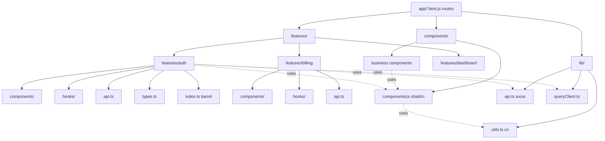
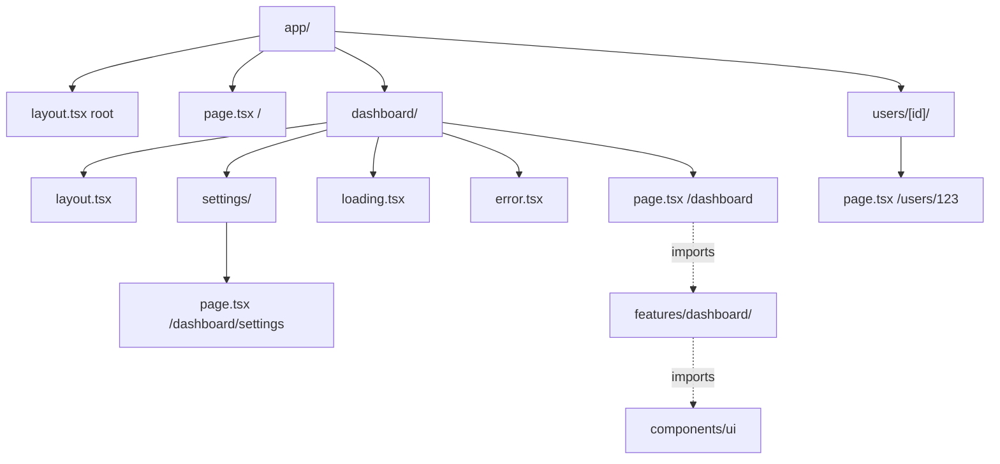

# 3.15 Project Architecture and Folder Organization

> Where you put a file is a decision you will live with for years. A bad folder structure makes imports hard to write, makes refactoring painful, and makes new team members ask "where does this go?" on every PR. This note covers the two main folder structures — feature-based (preferred) and type-based — and a detailed map of where each kind of file belongs: `components/`, `components/ui/`, `lib/`, `hooks/`, `types/`, `utils/`, `constants/`, `styles/`, `features/<name>/`, the Next.js `app/` directory, and the global `store/` folder. We cover barrel files (and why to use them sparingly), absolute imports via `tsconfig.json` paths, colocation of components with their tests, and how state management fits into the picture.

## 3.15.1 Objective

By the end of this note you should be able to:

1. Compare feature-based vs type-based folder structures and justify why feature-based is the default choice for most apps.
2. Place every kind of file in its correct folder: shared UI, business components, hooks, types, utilities, constants, styles, state.
3. Use the feature folder pattern (`features/auth/components/`, `features/auth/hooks/`, `features/auth/api.ts`) to collocate code by domain.
4. Use barrel files (`index.ts`) as a public API boundary — and explain why overusing them creates circular dependency and performance problems.
5. Configure absolute imports via `tsconfig.json` paths (or `jsconfig.json` for non-TS projects).
6. Explain the Next.js App Router `app/` directory convention and how it changes where files live.
7. Distinguish `components/ui/` (shadcn-style primitives) from `components/` (business components) and `features/X/components/` (feature-specific components).
8. Decide where a hook lives: `hooks/` (app-wide), `features/X/hooks/` (feature-specific), or next to its only consumer (truly local).
9. Decide where types live: `types/` (app-wide contracts), alongside their consumer (local), or `features/X/types.ts`.
10. Articulate where state management code belongs: feature folder for feature state, global `store/` for cross-cutting state.

## 3.15.2 Background Knowledge

Before reading further, make sure you are comfortable with:

- **Components and props** from [[3.2 Components and Props]] — what a "component" is at the file level.
- **Custom hooks** from [[3.7 Custom Hooks]] — what a hook file looks like.
- **Context and reducers** from [[3.9 Context and Reducers]] — where context providers live.
- **Reusable component design** from [[3.14 Reusable Component Design]] — the difference between UI primitives and business components.
- **Module systems** — ES module imports, default vs named exports, the `index.ts` barrel pattern.
- **TypeScript path aliases** — `paths` and `baseUrl` in `tsconfig.json`.

## 3.15.3 Core Concepts

### 3.15.3.1 The Two Big Patterns: Feature-Based vs Type-Based

**Type-based structure** groups files by what they are:

```
src/
  components/
    Button.tsx
    UserCard.tsx
    SettingsForm.tsx
    Modal.tsx
  hooks/
    useAuth.ts
    useDebounce.ts
    useUser.ts
    useLocalStorage.ts
  utils/
    formatDate.ts
    formatCurrency.ts
    validateEmail.ts
  types/
    user.ts
    product.ts
    order.ts
```

**Feature-based structure** groups files by what they belong to (their domain):

```
src/
  features/
    auth/
      components/
        LoginForm.tsx
        SignupForm.tsx
      hooks/
        useAuth.ts
      api.ts
      types.ts
    user/
      components/
        UserCard.tsx
        UserList.tsx
      hooks/
        useUser.ts
      api.ts
      types.ts
  components/
    ui/                  # shared UI primitives
      Button.tsx
      Modal.tsx
  hooks/                 # truly app-wide hooks
    useDebounce.ts
    useLocalStorage.ts
  lib/
    utils.ts             # truly app-wide utilities
  types/
    index.ts             # truly app-wide types
```

The difference: in type-based, `UserCard` lives next to `Button` because they are both "components". In feature-based, `UserCard` lives next to `useUser` and `user/types.ts` because they all belong to the User feature. `Button` lives in `components/ui/` because it is not part of any feature.

> [!tip] Feature-based is the default
> Feature-based wins for any app bigger than a demo. Type-based works for small projects and tutorial code, but at scale it forces you to mentally rebuild the domain map every time you touch a feature. Colocating feature code keeps the mental model intact.

### 3.15.3.2 Why Feature-Based Wins at Scale

Three reasons:

**1. Cohesion.** All the code for the `auth` feature lives in one folder. You can `git rm -r features/auth` to delete it. You can `mv features/old features/new` to rename it. You can `cp -r features/user features/team` to scaffold a parallel feature. None of these operations are possible with type-based structure — you'd be hunting across `components/`, `hooks/`, `utils/`, `types/`, `api/`.

**2. Discoverability.** A new engineer joining the team opens `features/` and immediately sees the domain map: `auth`, `user`, `billing`, `dashboard`, `messages`. They don't have to read a wiki. They open `features/billing/` and see everything related to billing.

**3. Bounded contexts.** Feature folders create natural boundaries. Code inside `features/auth/` should not import from `features/billing/` — if it does, that's a code smell suggesting shared abstraction. The folder structure makes these violations visible.

### 3.15.3.3 When Type-Based Is Acceptable

Type-based is fine when:

- The app is small (< 20 components, < 5 hooks).
- The app has no clear domain boundaries (a personal portfolio, a landing page).
- The team is one or two people and everyone knows the codebase.

Even then, feature-based scales better as the app grows. The cost of switching later is high — every import changes.

### 3.15.3.4 The Standard Folder Map

A modern React + TypeScript project should have these folders:

| Folder | Purpose |
|--------|---------|
| `src/app/` | Next.js App Router pages and layouts (Next.js only). |
| `src/pages/` | Next.js Pages Router or CRA pages (legacy). |
| `src/components/` | App-wide business components used across multiple features. |
| `src/components/ui/` | shadcn/ui-style UI primitives (Button, Input, Modal, etc.). |
| `src/features/<name>/` | Feature-scoped code (components, hooks, types, api, store). |
| `src/hooks/` | Truly app-wide hooks (`useDebounce`, `useMediaQuery`). |
| `src/lib/` | Third-party library configuration (`api.ts`, `queryClient.ts`, `auth.ts`). |
| `src/utils/` | Truly app-wide pure utility functions. |
| `src/types/` | Truly app-wide TypeScript types (`User`, `ApiResponse`). |
| `src/constants/` | Truly app-wide constants (routes, env, enums). |
| `src/store/` | Global state (Zustand, Redux) that crosses feature boundaries. |
| `src/styles/` | Global CSS, Tailwind entry, design tokens. |
| `src/tests/` | Test setup, fixtures, mocks (test files themselves are colocated). |

The qualifier "truly app-wide" matters. A `useUser` hook is not app-wide — it belongs in `features/user/hooks/`. A `useDebounce` hook is app-wide (any feature might debounce a search input) — it belongs in `hooks/`.

### 3.15.3.5 The Feature Folder Pattern

Each feature folder has the same internal structure:

```
features/auth/
  components/
    LoginForm.tsx
    SignupForm.tsx
    AuthProvider.tsx
  hooks/
    useAuth.ts
  api.ts              # API client for auth endpoints
  types.ts            # auth-specific types (User, Session)
  store.ts            # Zustand store (if feature has local state)
  index.ts            # public API (barrel)
  test.ts             # test setup, fixtures, mocks (optional)
```

The `index.ts` barrel exports only the public API of the feature:

```ts
// features/auth/index.ts
export { AuthProvider } from "./components/AuthProvider";
export { useAuth } from "./hooks/useAuth";
export type { User, Session } from "./types";
```

Other features import from the barrel:

```ts
// features/billing/components/BillingPage.tsx
import { useAuth, type User } from "@/features/auth";
```

They never reach inside the feature folder:

```ts
// BAD - reaching past the public API
import { useAuth } from "@/features/auth/hooks/useAuth";
```

The barrel enforces the public API boundary. If a file is not in the barrel, it is not part of the API and may change without notice.

### 3.15.3.6 Barrel Files: Use Sparingly

A barrel file re-exports from multiple modules:

```ts
// components/ui/index.ts
export * from "./Button";
export * from "./Input";
export * from "./Modal";
export * from "./Select";
// ... 50 more
```

Then callers import from the barrel:

```ts
import { Button, Input, Modal } from "@/components/ui";
```

Benefits:

- Clean import paths.
- Public API boundary (only what's in the barrel is "public").

Costs:

- **Circular dependencies.** If `Button` imports from `Modal` and `Modal` imports from `Button`, the barrel makes the cycle silent. With direct imports, the cycle is visible.
- **Bundle size bloat in some bundlers.** `export *` from a barrel can confuse tree-shakers, especially with CommonJS interop. Modern bundlers (Vite, esbuild, Turbopack) handle it well; older bundlers may not.
- **Slower dev builds.** Every import from a barrel resolves the whole barrel. With 50 re-exports, this adds up.

> [!warning] Avoid deep barrel chains
> A barrel that re-exports from another barrel that re-exports from another is a performance and debugging nightmare. Keep barrels one level deep. `features/auth/index.ts` is fine; `features/index.ts` re-exporting from every feature is not.

### 3.15.3.7 Absolute Imports

Configure path aliases in `tsconfig.json`:

```json
{
  "compilerOptions": {
    "baseUrl": ".",
    "paths": {
      "@/*": ["./src/*"],
      "@/components/*": ["./src/components/*"],
      "@/features/*": ["./src/features/*"],
      "@/hooks/*": ["./src/hooks/*"],
      "@/lib/*": ["./src/lib/*"],
      "@/utils/*": ["./src/utils/*"],
      "@/types/*": ["src/types/*"]
    }
  }
}
```

Now imports are clean:

```ts
// Before
import { Button } from "../../../../../components/ui/Button";

// After
import { Button } from "@/components/ui/Button";
```

For Vite, also configure `vite.config.ts`:

```ts
import { defineConfig } from "vite";
import { resolve } from "path";

export default defineConfig({
  resolve: {
    alias: {
      "@": resolve(__dirname, "./src"),
    },
  },
});
```

For Next.js, the `tsconfig.json` paths work out of the box — Next.js reads them.

For Jest (if you test), configure `jest.config.js`:

```ts
moduleNameMapper: {
  "^@/(.*)$": "<rootDir>/src/$1",
}
```

> [!tip] Use `@/` not relative paths past two levels
> If you find yourself writing `../../../`, switch to `@/`. Relative paths past two levels are unreadable and break on every move. Two levels (`./x`, `../x`) is fine; three or more is a smell.

### 3.15.3.8 The Next.js `app/` Directory

Next.js 13+ App Router uses a folder-per-route convention:

```
src/app/
  layout.tsx           # root layout (HTML shell)
  page.tsx             # root page (/)
  globals.css          # global styles
  loading.tsx          # root loading UI
  error.tsx            # root error boundary
  not-found.tsx        # root 404
  dashboard/
    layout.tsx         # dashboard layout
    page.tsx           # /dashboard
    loading.tsx        # /dashboard loading
    error.tsx          # /dashboard error boundary
    settings/
      page.tsx         # /dashboard/settings
  users/
    [id]/              # dynamic segment /users/123
      page.tsx
```

Each folder is a route segment. Special files in each folder:

| File | Purpose |
|------|---------|
| `page.tsx` | The route's UI. Required for the route to exist. |
| `layout.tsx` | Wraps all child routes. Preserved across navigation. |
| `loading.tsx` | Wraps children in a Suspense boundary with this fallback. |
| `error.tsx` | Wraps children in an ErrorBoundary with this fallback. |
| `not-found.tsx` | Rendered when `notFound()` is called or 404. |
| `template.tsx` | Like layout but re-mounts on each navigation. |
| `route.ts` | API endpoint (replaces Pages Router API routes). |
| `middleware.ts` | Runs before each request (project-level, not per-route). |

The `app/` directory is *routes*, not business code. Components, hooks, utilities still live in `src/components/`, `src/hooks/`, `src/lib/`. The `app/` folder is intentionally thin — it imports from elsewhere:

```tsx
// app/dashboard/page.tsx
import { Dashboard } from "@/features/dashboard/components/Dashboard";

export default function Page() {
  return <Dashboard />;
}
```

See [[4.1 App Router Foundations]] and [[4.2 Routing, Layouts, and Templates]] for the full App Router treatment.

### 3.15.3.9 `components/ui/` vs `components/` vs `features/X/components/`

Three layers of components:

| Folder | What lives here | Examples |
|--------|------------------|----------|
| `components/ui/` | UI primitives — no business logic, no app-specific types. | Button, Input, Modal, Dialog, Tooltip, Card. The shadcn/ui family. |
| `components/` | App-wide business components — used by multiple features, contain business types. | `<UserAvatar>`, `<AppHeader>`, `<EmptyState>`. |
| `features/X/components/` | Feature-specific components — used only by one feature. | `<LoginForm>`, `<BillingTable>`, `<DashboardChart>`. |

The decision tree:

1. Is it a generic UI primitive (no domain types)?  -->  `components/ui/`
2. Is it used by two or more features?  -->  `components/`
3. Is it used by only one feature?  -->  `features/<feature>/components/`

> [!note] Promote on second use
> A component starts in `features/X/components/`. When a second feature needs it, promote it to `components/`. Don't promote prematurely — `components/` is a shared dependency, and premature sharing creates coupling.

### 3.15.3.10 Where Hooks Go

| Hook type | Location |
|-----------|----------|
| Truly app-wide (`useDebounce`, `useMediaQuery`, `useLocalStorage`) | `src/hooks/` |
| Feature-scoped (`useUser`, `useAuth`, `useOrders`) | `src/features/<name>/hooks/` |
| Single-consumer (`useDashboardChartState`, used only by `DashboardChart`) | Next to the consumer: `DashboardChart.tsx` + `useDashboardChartState.ts` in the same folder |

The single-consumer case is the most underused. If a hook is used by exactly one component, colocate them. Don't pollute `hooks/` or even `features/X/hooks/` with single-consumer hooks. See [[3.7 Custom Hooks]] for the rule of three.

### 3.15.3.11 Where Types Go

| Type type | Location |
|-----------|----------|
| App-wide domain types (`User`, `Product`, `Order`) | `src/types/` |
| Feature-scoped types (`LoginFormValues`, `BillingPlan`) | `src/features/<name>/types.ts` |
| Component prop types | Inline in the component file (`interface ButtonProps { ... }`) |
| API response types | In the API client file (`features/<name>/api.ts`) or `types/api.ts` |

> [!warning] Don't create a `types/` folder for prop types
> `interface ButtonProps` belongs at the top of `Button.tsx`. Moving it to `types/button.ts` separates the type from its only consumer and makes refactoring harder. Only extract to `types/` when the type is shared across files.

### 3.15.3.12 Where Utilities Go

| Utility type | Location |
|--------------|----------|
| Truly app-wide (`cn`, `formatDate`, `formatCurrency`) | `src/utils/` |
| Feature-scoped (`calculateInvoice`, `validateCoupon`) | `src/features/<name>/utils.ts` |
| Single-consumer | Next to the consumer |

The `cn` utility (clsx + tailwind-merge) is so common it goes in `src/lib/utils.ts` by convention — that's where shadcn/ui puts it.

### 3.15.3.13 Where State Management Goes

| State scope | Location |
|-------------|----------|
| Local component state | `useState` inside the component. |
| Feature state (used only inside one feature) | `src/features/<name>/store.ts` (Zustand) or `src/features/<name>/context.tsx` (Context). |
| Cross-cutting global state (auth, theme, current user) | `src/store/` |
| Server state (cached API responses) | TanStack Query's `QueryClient` in `src/lib/queryClient.ts`. |

> [!tip] Most "global state" is actually server state
> Before reaching for Zustand or Redux, ask: is this data from the server? If yes, use TanStack Query. The server is the source of truth; the client cache mirrors it. See [[3.16 API Integration and Data Fetching]] and [[3.9 Context and Reducers]].

### 3.15.3.14 Colocating Tests

Test files live next to the code they test:

```
features/auth/components/
  LoginForm.tsx
  LoginForm.test.tsx
  SignupForm.tsx
  SignupForm.test.tsx
```

Why colocated:

- **Findability.** When you open `LoginForm.tsx`, the test is right there.
- **Refactoring.** When you move or rename a file, the test moves with it.
- **Encourages testing.** A `__tests__/` folder far away is a tax. Colocated tests are free.

> [!warning] Don't use a top-level `__tests__/` mirror
> `src/__tests__/components/LoginForm.test.tsx` is the worst of both worlds: it duplicates the folder structure, it's far from the code, and it breaks on every rename. Colocate.

### 3.15.3.15 The `lib/` Folder

`lib/` is for third-party library configuration and integration. It is **not** for utilities (those go in `utils/`).

Typical `lib/` contents:

| File | Purpose |
|------|---------|
| `lib/utils.ts` | The `cn` helper and small generic helpers. |
| `lib/api.ts` | Configured API client (axios instance, fetch wrapper). |
| `lib/queryClient.ts` | TanStack Query client. |
| `lib/auth.ts` | Auth library configuration (NextAuth, Clerk). |
| `lib/supabase.ts` | Supabase client. |
| `lib/sentry.ts` | Sentry initialization. |
| `lib/analytics.ts` | PostHog / Mixpanel / Segment wrapper. |

### 3.15.3.16 Constants and Configuration

`src/constants/` is for app-wide constants:

```ts
// constants/routes.ts
export const ROUTES = {
  HOME: "/",
  DASHBOARD: "/dashboard",
  SETTINGS: "/settings",
} as const;

// constants/env.ts
export const env = {
  API_URL: process.env.NEXT_PUBLIC_API_URL!,
  STRIPE_KEY: process.env.NEXT_PUBLIC_STRIPE_KEY!,
} as const;

// constants/api.ts
export const API = {
  TIMEOUT_MS: 30_000,
  RETRY_COUNT: 3,
} as const;
```

Feature-specific constants stay in the feature folder.

## 3.15.4 Detailed Walkthrough

### 3.15.4.1 A Complete Feature-Based Project Layout

```
my-app/
  src/
    app/                          # Next.js App Router
      layout.tsx
      page.tsx
      dashboard/
        layout.tsx
        page.tsx
        loading.tsx
        error.tsx
        settings/
          page.tsx
    components/
      ui/                         # shadcn/ui primitives
        button.tsx
        input.tsx
        modal.tsx
        dialog.tsx
        index.ts                  # barrel
      AppHeader.tsx               # app-wide business components
      UserAvatar.tsx
      EmptyState.tsx
    features/
      auth/
        components/
          LoginForm.tsx
          LoginForm.test.tsx
          SignupForm.tsx
          AuthProvider.tsx
        hooks/
          useAuth.ts
        api.ts
        types.ts
        index.ts                  # public API
      billing/
        components/
          BillingTable.tsx
          InvoiceCard.tsx
        hooks/
          useInvoices.ts
        api.ts
        types.ts
        index.ts
      dashboard/
        components/
          DashboardChart.tsx
          useDashboardChartState.ts   # colocated hook
          DashboardChart.test.tsx
        hooks/
          useDashboardData.ts
        api.ts
        types.ts
        index.ts
    hooks/
      useDebounce.ts
      useMediaQuery.ts
      useLocalStorage.ts
    lib/
      utils.ts                    # cn
      api.ts                      # axios instance
      queryClient.ts
      auth.ts
    store/
      useThemeStore.ts            # global Zustand (theme)
      useUiStore.ts               # global Zustand (sidebar open, modals)
    types/
      user.ts
      api.ts
      index.ts
    constants/
      routes.ts
      env.ts
      api.ts
    styles/
      globals.css                 # Tailwind directives
      tokens.css                  # CSS custom properties
    tests/
      setup.ts
      fixtures/
        user.ts
    middleware.ts                 # Next.js middleware (auth, redirects)
  public/
    favicon.ico
    images/
  .env.local
  .env.production
  next.config.js
  tailwind.config.ts
  tsconfig.json
  package.json
```

### 3.15.4.2 The Anatomy of a Feature Folder

Take `features/auth/`:

```ts
// features/auth/types.ts
export interface User {
  id: string;
  email: string;
  name: string;
  role: "admin" | "member";
}

export interface Session {
  user: User;
  token: string;
  expiresAt: number;
}

export interface LoginInput {
  email: string;
  password: string;
}
```

```ts
// features/auth/api.ts
import { api } from "@/lib/api";
import type { LoginInput, Session, User } from "./types";

export const authApi = {
  login: (input: LoginInput) =>
    api.post<Session>("/auth/login", input).then((r) => r.data),
  logout: () => api.post("/auth/logout"),
  me: () => api.get<User>("/auth/me").then((r) => r.data),
};
```

```tsx
// features/auth/hooks/useAuth.ts
import { useQuery, useMutation, useQueryClient } from "@tanstack/react-query";
import { authApi } from "../api";
import type { LoginInput } from "../types";

export function useAuth() {
  const qc = useQueryClient();
  const { data: user } = useQuery({
    queryKey: ["auth", "me"],
    queryFn: authApi.me,
    retry: false,
  });

  const login = useMutation({
    mutationFn: (input: LoginInput) => authApi.login(input),
    onSuccess: (session) => {
      qc.setQueryData(["auth", "me"], session.user);
    },
  });

  return { user, login };
}
```

```tsx
// features/auth/components/LoginForm.tsx
import { useState } from "react";
import { Button } from "@/components/ui";
import { useAuth } from "../hooks/useAuth";

export function LoginForm() {
  const { login } = useAuth();
  const [email, setEmail] = useState("");
  const [password, setPassword] = useState("");

  return (
    <form onSubmit={(e) => { e.preventDefault(); login.mutate({ email, password }); }}>
      <input value={email} onChange={(e) => setEmail(e.target.value)} />
      <input type="password" value={password} onChange={(e) => setPassword(e.target.value)} />
      <Button type="submit" disabled={login.isPending}>Log in</Button>
    </form>
  );
}
```

```ts
// features/auth/index.ts
export { LoginForm } from "./components/LoginForm";
export { AuthProvider } from "./components/AuthProvider";
export { useAuth } from "./hooks/useAuth";
export type { User, Session, LoginInput } from "./types";
```

Consumers in other features import from the barrel only:

```tsx
// features/billing/components/BillingPage.tsx
import { useAuth, type User } from "@/features/auth";
import { BillingTable } from "./BillingTable";

export function BillingPage() {
  const { user } = useAuth();
  if (!user) return null;
  return <BillingTable userId={user.id} />;
}
```

### 3.15.4.3 Cross-Feature Imports: The Dependency Rule

Code may import:

- From `@/components/ui` (UI primitives).
- From `@/lib` (configured clients).
- From `@/hooks` (app-wide hooks).
- From `@/utils` (app-wide utilities).
- From `@/types` (app-wide types).
- From `@/store` (global state).
- From `@/features/X` (other features' **public API only**).

Code may **not** import:

- From inside another feature's internals (`@/features/auth/hooks/useAuth` instead of `@/features/auth`).
- From a child into its parent feature's internals.

This keeps features decoupled. If `features/billing` reaches into `features/auth/hooks/useAuth.ts`, you've coupled billing to auth's internals — refactoring auth now risks breaking billing.

> [!danger] The cross-feature import smell
> If feature A imports from feature B, ask: should this code live in a shared layer (`components/`, `hooks/`, `lib/`) instead? If both features need it, it's app-wide. Promote it. Don't build feature-to-feature dependencies; they form graphs that are impossible to refactor.

### 3.15.4.4 State Management Location

For a typical Zustand-based app:

```ts
// store/useThemeStore.ts
import { create } from "zustand";

interface ThemeState {
  theme: "light" | "dark";
  toggle: () => void;
}

export const useThemeStore = create<ThemeState>((set) => ({
  theme: "light",
  toggle: () => set((s) => ({ theme: s.theme === "light" ? "dark" : "light" })),
}));
```

```ts
// features/billing/store.ts
import { create } from "zustand";

interface BillingState {
  selectedInvoiceId: string | null;
  setSelectedInvoice: (id: string | null) => void;
}

export const useBillingStore = create<BillingState>((set) => ({
  selectedInvoiceId: null,
  setSelectedInvoice: (id) => set({ selectedInvoiceId: id }),
}));
```

Global state (theme, current user, sidebar open) lives in `store/`. Feature state (selected invoice, form drafts) lives in the feature folder. The distinction is **scope of consumers** — if only the billing feature needs it, it goes in `features/billing/store.ts`.

## 3.15.5 Practical Examples

### 3.15.5.1 A `tsconfig.json` for a Feature-Based Project

```json
{
  "compilerOptions": {
    "target": "ES2022",
    "lib": ["dom", "dom.iterable", "esnext"],
    "module": "esnext",
    "moduleResolution": "bundler",
    "jsx": "preserve",
    "strict": true,
    "noUnusedLocals": true,
    "noUnusedParameters": true,
    "noFallthroughCasesInSwitch": true,
    "baseUrl": ".",
    "paths": {
      "@/*": ["./src/*"],
      "@/components/*": ["./src/components/*"],
      "@/features/*": ["./src/features/*"],
      "@/hooks/*": ["./src/hooks/*"],
      "@/lib/*": ["./src/lib/*"],
      "@/utils/*": ["./src/utils/*"],
      "@/types/*": ["./src/types/*"],
      "@/store/*": ["./src/store/*"],
      "@/constants/*": ["./src/constants/*"]
    },
    "incremental": true,
    "plugins": [{ "name": "next" }]
  },
  "include": ["next-env.d.ts", "**/*.ts", "**/*.tsx", ".next/types/**/*.ts"],
  "exclude": ["node_modules"]
}
```

### 3.15.5.2 The `cn` Utility

```ts
// lib/utils.ts
import { clsx, type ClassValue } from "clsx";
import { twMerge } from "tailwind-merge";

export function cn(...inputs: ClassValue[]) {
  return twMerge(clsx(inputs));
}
```

### 3.15.5.3 A Configured API Client

```ts
// lib/api.ts
import axios, { AxiosError } from "axios";

export const api = axios.create({
  baseURL: process.env.NEXT_PUBLIC_API_URL,
  timeout: 30_000,
});

api.interceptors.request.use((config) => {
  const token = localStorage.getItem("token");
  if (token) config.headers.Authorization = `Bearer ${token}`;
  return config;
});

api.interceptors.response.use(
  (response) => response,
  (error: AxiosError) => {
    if (error.response?.status === 401) {
      window.location.href = "/login";
    }
    return Promise.reject(error);
  }
);
```

### 3.15.5.4 A TanStack Query Client

```ts
// lib/queryClient.ts
import { QueryClient } from "@tanstack/react-query";

export const queryClient = new QueryClient({
  defaultOptions: {
    queries: {
      staleTime: 60_000,
      gcTime: 5 * 60_000,
      retry: 1,
      refetchOnWindowFocus: false,
    },
  },
});
```

```tsx
// app/providers.tsx
"use client";
import { QueryClientProvider } from "@tanstack/react-query";
import { queryClient } from "@/lib/queryClient";

export function Providers({ children }: { children: React.ReactNode }) {
  return <QueryClientProvider client={queryClient}>{children}</QueryClientProvider>;
}
```

### 3.15.5.5 Promoting a Component

When a component is needed by a second feature, promote it:

```bash
# Before: only features/billing uses InvoiceCard
mv src/features/billing/components/InvoiceCard.tsx src/components/InvoiceCard.tsx

# Update imports in features/billing/* from ../components/InvoiceCard to @/components/InvoiceCard
```

The promotion is a one-line `mv` plus import updates. The reverse (demotion) is rare and usually means the component was prematurely promoted.

## 3.15.6 Mermaid Diagrams

### 3.15.6.1 Feature-Based Architecture



### 3.15.6.2 The Dependency Rule

```mermaid
flowchart TD
    App[app/] --> Features
    App --> Components
    Features --> Components
    Features --> Hooks[app hooks/]
    Features --> Lib[lib/]
    Features --> Utils[utils/]
    Features --> Types[types/]
    Features --> Store[store/]
    Features -.public API only.-> OtherFeatures[other features/]

    Components --> UI[components/ui]
    Components --> Lib
    Hooks --> Lib
    Store --> Lib

    Forbidden[Forbidden: feature internals] -.x.-> Features
    style Forbidden fill:#fdd,stroke:#c00
```

### 3.15.6.3 The Next.js `app/` Directory



## 3.15.7 Common Mistakes

1. **Type-based structure for a real app.** It works for tutorials and demos but breaks down past 30 components. Use feature-based from day one — switching later is expensive.

2. **Deep barrel chains.** `features/index.ts` re-exporting from every feature, plus `components/index.ts` re-exporting from every UI primitive, plus `app/index.ts` re-exporting both. Each layer adds resolution cost and increases circular dependency risk. Keep barrels one level deep.

3. **Reaching into feature internals.** `import { useAuth } from "@/features/auth/hooks/useAuth"` couples callers to internals. Import from the barrel: `import { useAuth } from "@/features/auth"`.

4. **Premature promotion to `components/`.** A component used by one feature stays in `features/X/components/`. Promoting on first use creates false coupling — every feature thinks it can use it.

5. **Putting prop types in `types/`.** `interface ButtonProps` belongs at the top of `Button.tsx`. Only shared types belong in `types/`.

6. **A `hooks/` folder full of single-consumer hooks.** If `useDashboardChartState` is used only by `DashboardChart.tsx`, colocate them. Don't pollute `hooks/` with single-consumer code.

7. **No absolute imports.** Reading `import { Button } from "../../../../../components/ui/Button"` is a tax. Configure `@/*` in `tsconfig.json` once and use it everywhere.

8. **Treating `app/` as a place for business code.** `app/dashboard/page.tsx` should be a thin shell that imports from `features/dashboard/`. Putting the entire dashboard implementation in `page.tsx` couples route to feature.

9. **Cross-feature imports that bypass the barrel.** Even with a barrel, code can still import internals. Add an ESLint rule (`no-restricted-imports` or `boundaries`) to forbid it.

10. **Putting test files in a top-level `__tests__/` mirror.** Colocate tests next to the code they test. A mirror folder is duplicative and breaks on every rename.

11. **A `utils/` folder with feature-specific utilities.** `calculateInvoice` belongs in `features/billing/utils.ts`. `utils/` is for truly app-wide functions only.

12. **Forgetting to update the barrel when adding a file.** You add `features/auth/components/ForgotPasswordForm.tsx`, but `index.ts` doesn't export it. Callers can't import it cleanly — they reach into internals. Treat the barrel as the feature's public API and update it on every addition.

## 3.15.8 Best Practices

1. **Default to feature-based structure.** It scales better than type-based for any real app. The cost of switching later is high; the cost of starting right is zero.

2. **Use `@/` path aliases everywhere.** Configure in `tsconfig.json` (Next.js reads it automatically), `vite.config.ts` for Vite, and `jest.config.js` for Jest. Two levels of relative imports is the maximum.

3. **Keep barrels one level deep.** A feature has one barrel (`features/auth/index.ts`). Don't create `features/index.ts` re-exporting every feature.

4. **Treat the feature barrel as the public API.** If it's not in the barrel, it's not public. Enforce with an ESLint rule (`no-restricted-imports`).

5. **Colocate tests with code.** `LoginForm.tsx` and `LoginForm.test.tsx` live in the same folder. Always.

6. **Colocate single-consumer hooks and utilities with their consumers.** Don't pollute `hooks/` or `utils/` with code used by exactly one component.

7. **Promote components on second use, not first.** First use stays in the feature. Second use promotes to `components/`.

8. **Keep `app/` thin.** Each `page.tsx` is a thin shell that imports from `features/`. Route files should not contain business logic.

9. **Use `lib/` for configured clients, `utils/` for pure functions.** Don't mix them. `axios.create(...)` is `lib/`, `formatDate` is `utils/`.

10. **Keep `types/` for shared types only.** Component prop types stay inline in the component file. Feature types stay in the feature folder.

11. **Document the folder structure in a README.** A `src/README.md` explaining where each kind of file goes is invaluable for new team members.

12. **Use ESLint to enforce boundaries.** The `eslint-plugin-import` and `eslint-plugin-boundaries` plugins can forbid cross-feature internal imports. Enforce in CI.

> [!tip] Steal from shadcn/ui's structure
> The shadcn/ui convention (`components/ui/` for primitives, `lib/utils.ts` for `cn`, `@/` paths) is the most widely-adopted React + Tailwind structure in 2025. New hires will recognize it. Start there and adapt.

## 3.15.9 Mini Exercises

### 3.15.9.1 Categorize Each File

**Task:** Given these files, place each in its correct folder in a feature-based structure:

- `Button.tsx` (generic UI primitive)
- `LoginForm.tsx` (used by auth feature)
- `useAuth.ts` (used by auth feature and 3 others)
- `formatDate.ts` (used by 5 features)
- `User` type (used by 4 features)
- `useDashboardChartState.ts` (used by `DashboardChart.tsx` only)
- `queryClient.ts` (TanStack Query setup)
- `useThemeStore.ts` (theme, used app-wide)
- `useSelectedInvoice.ts` (used only by billing feature)
- `calculateInvoice.ts` (used only by billing feature)

**Worked solution:**

| File | Location |
|------|----------|
| `Button.tsx` | `src/components/ui/Button.tsx` |
| `LoginForm.tsx` | `src/features/auth/components/LoginForm.tsx` |
| `useAuth.ts` | `src/features/auth/hooks/useAuth.ts` |
| `formatDate.ts` | `src/utils/formatDate.ts` |
| `User` type | `src/types/user.ts` |
| `useDashboardChartState.ts` | `src/features/dashboard/components/useDashboardChartState.ts` (colocated with `DashboardChart.tsx`) |
| `queryClient.ts` | `src/lib/queryClient.ts` |
| `useThemeStore.ts` | `src/store/useThemeStore.ts` |
| `useSelectedInvoice.ts` | `src/features/billing/hooks/useSelectedInvoice.ts` |
| `calculateInvoice.ts` | `src/features/billing/utils/calculateInvoice.ts` |

**Reasoning:** `Button` is a UI primitive (no business types). `LoginForm` is auth-specific. `useAuth` is feature-scoped (its home is the auth feature, even though other features use it via the barrel). `formatDate` is truly app-wide. `User` is shared. `useDashboardChartState` is single-consumer  -->  colocated. `queryClient` is library config. `useThemeStore` is global. `useSelectedInvoice` and `calculateInvoice` are billing-only.

### 3.15.9.2 Configure Absolute Imports

**Task:** Configure `tsconfig.json` to support `@/components/ui/Button` resolving to `src/components/ui/Button.tsx`. Include the matching Vite config.

**Worked solution:**

```json
// tsconfig.json
{
  "compilerOptions": {
    "baseUrl": ".",
    "paths": {
      "@/*": ["./src/*"]
    }
  }
}
```

```ts
// vite.config.ts
import { defineConfig } from "vite";
import react from "@vitejs/plugin-react";
import { resolve } from "path";

export default defineConfig({
  plugins: [react()],
  resolve: {
    alias: {
      "@": resolve(__dirname, "./src"),
    },
  },
});
```

**Common wrong approach:** Configuring only `tsconfig.json` and being confused when Vite still can't resolve. TypeScript checks types but doesn't transform imports; the bundler does that. Both must be configured.

### 3.15.9.3 Build a Feature's Public API

**Task:** Given these files in `features/auth/`:

- `components/LoginForm.tsx` (exports `LoginForm`)
- `components/SignupForm.tsx` (exports `SignupForm`)
- `components/ForgotPasswordForm.tsx` (exports `ForgotPasswordForm`)
- `components/_internalField.tsx` (exports `InternalField`, used only by `LoginForm`)
- `hooks/useAuth.ts` (exports `useAuth`)
- `hooks/useAuthInternals.ts` (exports `useAuthInternals`, used only by `useAuth`)
- `api.ts` (exports `authApi`)
- `types.ts` (exports `User`, `Session`, `LoginInput`)

Write the `index.ts` barrel that exposes the public API and hides internals.

**Worked solution:**

```ts
// features/auth/index.ts
export { LoginForm } from "./components/LoginForm";
export { SignupForm } from "./components/SignupForm";
export { ForgotPasswordForm } from "./components/ForgotPasswordForm";
export { useAuth } from "./hooks/useAuth";
export { authApi } from "./api";
export type { User, Session, LoginInput } from "./types";
```

Note what's *not* exported:

- `_internalField` (the underscore prefix is a hint, but the real enforcement is "not in the barrel").
- `useAuthInternals` (internal to `useAuth`).

Callers can only import what's in the barrel. The internals are private to the feature.

### 3.15.9.4 Diagnose the Cross-Feature Coupling Smell

**Task:** A reviewer flags this import in your PR:

```ts
// features/billing/components/BillingPage.tsx
import { formatInvoiceNumber } from "@/features/auth/utils/formatInvoiceNumber";
```

What's wrong, and how do you fix it?

**Diagnosis:** Billing is reaching into auth's internals for a utility that has nothing to do with auth. The function lives in the wrong place — it's a billing utility, not an auth utility. The cross-feature import couples billing to auth's internal file structure; refactoring auth could break billing silently.

**Fix:** Move `formatInvoiceNumber` to billing:

```bash
mv src/features/auth/utils/formatInvoiceNumber.ts src/features/billing/utils/formatInvoiceNumber.ts
```

Update the import:

```ts
// features/billing/components/BillingPage.tsx
import { formatInvoiceNumber } from "../utils/formatInvoiceNumber";
```

Or, if a third feature also needs it, promote it to `src/utils/formatInvoiceNumber.ts`.

### 3.15.9.5 Decide Where State Lives

**Task:** You have three pieces of state:

1. Current logged-in user (used by 5 features).
2. Selected invoice in the billing page (used by 3 billing components).
3. Form draft for `LoginForm` (used only by `LoginForm`).

Where does each live?

**Worked solution:**

1. **Current user**  -->  server state, fetched via TanStack Query (`useAuth` hook in `features/auth/hooks/useAuth.ts`). Not global Zustand — it's cached server data. See [[3.16 API Integration and Data Fetching]] and [[3.9 Context and Reducers]].

2. **Selected invoice**  -->  `features/billing/store.ts` (Zustand), or a `useState` lifted to the billing page parent if it's truly transient. Three billing components need it; that's a feature-scoped store.

3. **Form draft**  -->  `useState` inside `LoginForm.tsx`. Local component state. If validation logic gets complex, switch to `useReducer` or React Hook Form, but still local.

**Common wrong approach:** Putting all three in a global Zustand store. Global state should be rare. Most "state" is local component state or feature-scoped. Server state should be in TanStack Query, not Zustand.

## 3.15.10 Summary

Project architecture is about colocating code that changes together and decoupling code that doesn't. Feature-based structure groups files by domain (`features/auth/`, `features/billing/`) rather than by type (`components/`, `hooks/`). It scales better, makes features cohesive and discoverable, and creates natural bounded contexts. Use it as the default for any real app.

The standard folder map: `app/` for Next.js routes (thin shells), `components/ui/` for shadcn-style primitives, `components/` for app-wide business components, `features/<name>/` for feature-scoped code (with internal `components/`, `hooks/`, `api.ts`, `types.ts`, `store.ts`, and a single `index.ts` barrel as the public API), `hooks/` and `utils/` for truly app-wide code, `lib/` for configured third-party clients, `types/` for shared types, `store/` for global state, `constants/` for app-wide constants.

Use absolute imports (`@/` alias via `tsconfig.json` paths, mirrored in Vite and Jest configs). Keep barrels one level deep and treat them as public APIs — never reach into feature internals. Colocate tests with code, colocate single-consumer hooks and utilities with their consumers. Promote components from feature to `components/` only on second use.

The dependency rule: features may import from shared layers (`components/ui`, `lib`, `hooks`, `utils`, `types`, `store`) and from other features' barrels only. Cross-feature internal imports are a smell — they create coupling graphs that resist refactoring. Enforce with ESLint.

Most "global state" is actually server state — use TanStack Query, not Zustand. Local component state stays in `useState`. Feature-scoped state goes in the feature folder. Truly cross-cutting global state (theme, sidebar) is rare and goes in `store/`.

The shadcn/ui convention (`components/ui/` + `lib/utils.ts` for `cn` + `@/` paths) is the dominant React + Tailwind structure in 2025. New hires will recognize it. Start there.

## 3.15.11 Related Notes

- [[3.2 Components and Props]] — what a "component" is at the file level.
- [[3.7 Custom Hooks]] — what a hook file looks like, and the rule of three for extraction.
- [[3.9 Context and Reducers]] — where context providers and reducers live.
- [[3.14 Reusable Component Design]] — the difference between UI primitives and business components.
- [[3.16 API Integration and Data Fetching]] — where the API client and TanStack Query setup live.
- [[3.17 Client-Side Routing]] — route organization in SPAs.
- [[2.8 Organizing Large Tailwind Projects]] — `cva` and component organization in Tailwind projects.
- [[4.1 App Router Foundations]] — the Next.js `app/` directory.
- [[4.2 Routing, Layouts, and Templates]] — Next.js route organization.
- [[4.13 Project Organization and Performance]] — Next.js-specific organization and performance.
- [[6.5 Frontend Architecture Questions]] — architecture is a common interview topic.
