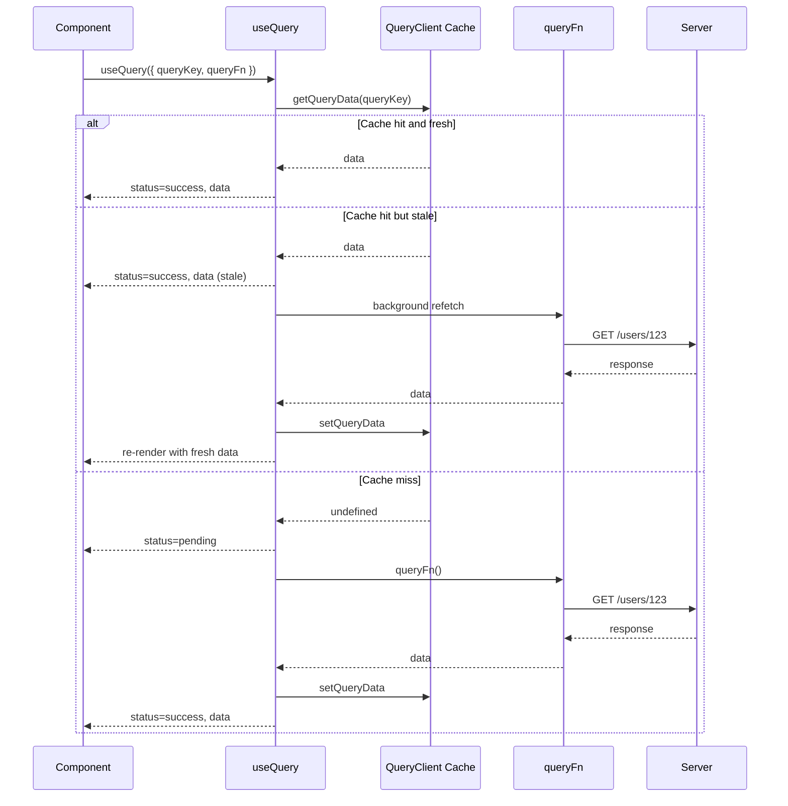
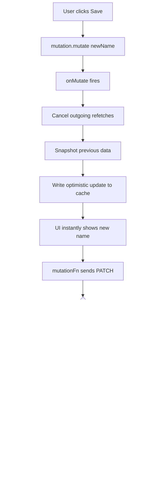
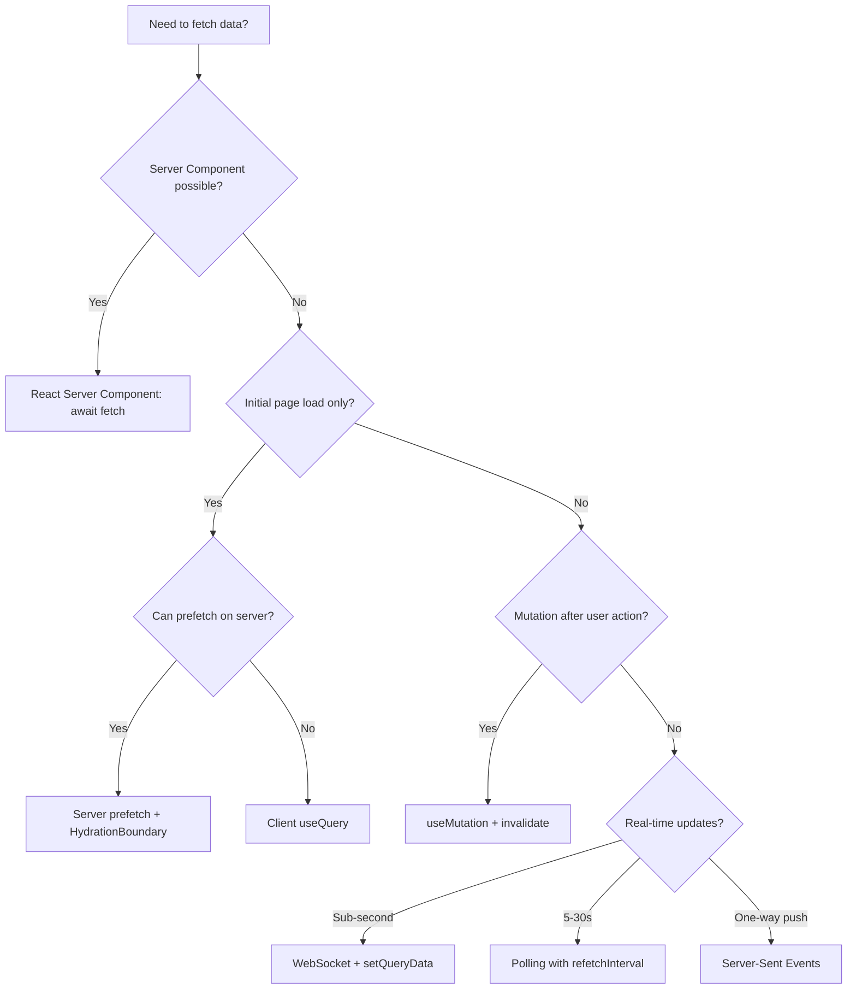

# 3.16 API Integration and Data Fetching

> Fetching data in React sounds trivial — call `fetch` in `useEffect`, store the result in state. It is not trivial. The naive pattern has race conditions, no caching, no deduplication, no invalidation, no retry, and no pagination. This note covers the basic `useEffect` + `fetch` pattern and why it is problematic, race condition fixes (AbortController, ignore flag), the loading/error/data state machine, the modern data fetching libraries (TanStack Query, SWR, RTK Query), TanStack Query patterns in depth (`useQuery`, `useMutation`, query keys, query invalidation, optimistic updates), the WebSocket pattern, Server-Sent Events, polling, the React 19 `use()` hook for promises, and how React Server Components change the picture entirely.

## 3.16.1 Objective

By the end of this note you should be able to:

1. Implement the basic `useEffect` + `fetch` pattern and articulate every way it is broken.
2. Fix the race condition with both the ignore flag and AbortController patterns, and explain why AbortController is preferred.
3. Model the loading/error/data state machine correctly (no boolean flags).
4. Choose between TanStack Query, SWR, and RTK Query, and justify the default choice (TanStack Query).
5. Use `useQuery` with query keys, `enabled`, `staleTime`, `gcTime`, `retry`, `select`.
6. Use `useMutation` with `onSuccess`, `onError`, `onMutate` for optimistic updates.
7. Implement query invalidation by key, by predicate, and by partial match.
8. Implement optimistic updates with rollback on failure.
9. Choose between polling, WebSocket, and Server-Sent Events for real-time data.
10. Use the React 19 `use()` hook to unwrap promises, and explain the critical "stable promise" rule.
11. Explain how React Server Components move fetching to the server and eliminate most client-side fetching code.

## 3.16.2 Background Knowledge

Before reading further, make sure you are comfortable with:

- **Effects** from [[3.8 Effects and Side Effects]] — `useEffect` setup/cleanup/deps, race conditions.
- **Custom hooks** from [[3.7 Custom Hooks]] — `useFetch` pattern with AbortController.
- **State** from [[3.3 State and Events]] — `useState`, derived state, the updater form.
- **Hooks** from [[3.6 Hooks (Built-In)]] — `useReducer` for state machines.
- **Suspense** from [[3.12 Suspense, Lazy Loading, and Code Splitting]] — Suspense for data fetching, `use()` hook.
- **Context** from [[3.9 Context and Reducers]] — server state vs client state.
- **Promises** — `async/await`, `Promise.all`, rejection handling.
- **HTTP** — status codes, headers, request methods.

## 3.16.3 Core Concepts

### 3.16.3.1 The Basic `useEffect` + `fetch` Pattern

The most basic data fetch in React:

```tsx
import { useEffect, useState } from "react";

interface User { id: string; name: string; }

export function UserProfile({ userId }: { userId: string }) {
  const [user, setUser] = useState<User | null>(null);
  const [loading, setLoading] = useState(true);
  const [error, setError] = useState<Error | null>(null);

  useEffect(() => {
    setLoading(true);
    setError(null);
    fetch(`/api/users/${userId}`)
      .then((res) => {
        if (!res.ok) throw new Error(`HTTP ${res.status}`);
        return res.json();
      })
      .then((data) => setUser(data))
      .catch((err) => setError(err))
      .finally(() => setLoading(false));
  }, [userId]);

  if (loading) return <Spinner />;
  if (error) return <ErrorView error={error} />;
  if (!user) return null;
  return <div>{user.name}</div>;
}
```

This works for a demo. It has at least six production-breaking problems.

### 3.16.3.2 Problem 1: Race Conditions

User views user A, then immediately clicks user B. Two fetches fire in parallel. If A's response arrives *after* B's, the component shows A's data even though the user clicked B. The state was set in the wrong order.

This is the classic React fetch race condition. It is invisible in dev because responses are fast and uniform; it appears in production under slow networks.

### 3.16.3.3 Problem 2: No Caching

Every mount triggers a fresh fetch. Navigating away and back refetches the same data. Multiple components needing the same data each fire their own fetch. The user sees loading spinners for data they just saw.

### 3.16.3.4 Problem 3: No Deduplication

If five components on a page all call `useUser("123")`, five network requests fire. There's no coordination.

### 3.16.3.5 Problem 4: No Invalidation

After a mutation (e.g. update user), the cached data is stale. The naive pattern has no way to know this. The user sees stale data until they refresh the page.

### 3.16.3.6 Problem 5: No Retry, No Backoff

A transient 503 error fails the fetch permanently. The user has to manually retry. There's no exponential backoff, no retry count.

### 3.16.3.7 Problem 6: Stale State on Unmount

If the component unmounts before the fetch resolves, calling `setUser` on an unmounted component throws a warning (older React) or silently does nothing (React 18+). Either way, the response is wasted.

### 3.16.3.8 Fix 1: The Ignore Flag

The simplest race condition fix:

```tsx
useEffect(() => {
  let ignore = false;
  setLoading(true);
  fetch(`/api/users/${userId}`)
    .then((res) => res.json())
    .then((data) => {
      if (!ignore) setUser(data);
    })
    .finally(() => {
      if (!ignore) setLoading(false);
    });
  return () => { ignore = true; };
}, [userId]);
```

The cleanup function sets `ignore = true`. When the late response arrives, its `.then` callback checks the flag and bails out. This works, but it doesn't cancel the network request — the response still arrives, it's just discarded. The browser still downloads the body.

### 3.16.3.9 Fix 2: AbortController (Preferred)

```tsx
useEffect(() => {
  const controller = new AbortController();
  setLoading(true);
  fetch(`/api/users/${userId}`, { signal: controller.signal })
    .then((res) => res.json())
    .then((data) => setUser(data))
    .catch((err) => {
      if (err.name !== "AbortError") setError(err);
    })
    .finally(() => setLoading(false));
  return () => controller.abort();
}, [userId]);
```

The `AbortController` lets you cancel the fetch mid-flight. The browser stops downloading the body. The fetch rejects with an `AbortError`; you check for that name and skip the error state.

> [!tip] Always use AbortController for fetch
> It's the only way to actually cancel a network request in the browser. The ignore flag just discards the response. For large responses (file downloads, big JSON), AbortController saves bandwidth and CPU.

### 3.16.3.10 The Loading/Error/Data State Machine

The naive pattern uses three `useState` calls (`loading`, `error`, `data`) and tries to keep them in sync. This produces impossible states: `loading=true && error !== null` (are we loading or errored?), `data !== null && loading=true` (showing what?).

Model the states as a discriminated union instead:

```tsx
type State =
  | { status: "loading" }
  | { status: "error"; error: Error }
  | { status: "success"; data: User };

const [state, setState] = useState<State>({ status: "loading" });

// In the fetch:
.then((data) => setState({ status: "success", data: data }))
.catch((error) => setState({ status: "error", error }));

// Render:
switch (state.status) {
  case "loading": return <Spinner />;
  case "error": return <ErrorView error={state.error} />;
  case "success": return <div>{state.data.name}</div>;
}
```

Now impossible states are impossible — the type system enforces it. This is the same pattern you'd use in `useReducer`. TanStack Query models state this way internally (`status: "pending" | "error" | "success"`).

> [!warning] Three booleans is a state machine
> `isLoading`, `isError`, `isSuccess` looks innocent. But it allows 2³ = 8 states, only 3 of which are valid. Use a single `status` enum (or a discriminated union) instead. See [[3.9 Context and Reducers]].

### 3.16.3.11 Why You Should Use a Data Fetching Library

The naive pattern's six problems are all solved by libraries:

| Problem | Library solution |
|---------|-----------------|
| Race conditions | Built-in AbortController or query cancellation. |
| No caching | Cache by query key. |
| No deduplication | Multiple `useQuery` calls with same key share one fetch. |
| No invalidation | `queryClient.invalidateQueries({ queryKey })`. |
| No retry | Configurable `retry` count and backoff. |
| Stale state on unmount | Automatic — the query client owns the state, not the component. |

Plus: focus refetching (refetch on window focus), background refresh, request deduplication across renders, mutation rollback, optimistic updates, prefetching, pagination helpers, infinite query helpers, SSR support.

For any real app, use a library. The three mainstream options are TanStack Query, SWR, and RTK Query.

### 3.16.3.12 The Three Mainstream Libraries

| Library | Maintainer | Strengths | When to use |
|---------|-----------|-----------|-------------|
| **TanStack Query** | TanStack (Tanner Linsley) | Most features, framework-agnostic, great DX, large ecosystem, devtools. | Default choice for any React app. |
| **SWR** | Vercel (Guillermo Rauch) | Tiny, simple API, Vercel-integrated. | Small apps where you want minimalism; already on Vercel. |
| **RTK Query** | Redux team | Integrated with Redux Toolkit, generated endpoints. | Already using Redux Toolkit and want one tool. |

> [!tip] The 2025 default
> For a new React app, use TanStack Query. It has the largest community, the best devtools, the most features (infinite queries, mutations, optimistic updates, prefetch), and works without Redux. SWR is great but minimal; RTK Query is great but tied to Redux.

### 3.16.3.13 TanStack Query: `useQuery`

```tsx
import { useQuery } from "@tanstack/react-query";

function UserProfile({ userId }: { userId: string }) {
  const { data, isLoading, error } = useQuery({
    queryKey: ["users", userId],
    queryFn: async () => {
      const res = await fetch(`/api/users/${userId}`);
      if (!res.ok) throw new Error(`HTTP ${res.status}`);
      return res.json() as Promise<User>;
    },
  });

  if (isLoading) return <Spinner />;
  if (error) return <ErrorView error={error} />;
  return <div>{data.name}</div>;
}
```

The `queryKey` is the cache key. The `queryFn` is the fetcher. TanStack Query:

- Caches by `queryKey`. Two components using `["users", "123"]` share one fetch.
- Refetches on window focus (configurable).
- Retries failed fetches (default 3 times).
- Caches for 5 minutes after the last consumer unmounts (`gcTime`).
- Marks data as stale after 0ms by default (`staleTime`).

### 3.16.3.14 Query Keys: Hierarchical and Serializable

Query keys are arrays. They can be hierarchical:

```ts
["users"]                        // all users
["users", "123"]                 // user 123
["users", "123", "posts"]        // posts of user 123
["users", { page: 1 }]           // users page 1
["users", { page: 1, sort: "name" }]
```

The hierarchy enables powerful invalidation: invalidate `["users"]` and all keys starting with `["users", ...]` are invalidated. This is the standard pattern for "after a mutation, refetch everything related to users".

Keys must be **serializable** — arrays of strings, numbers, booleans, and plain objects. No functions, no Dates (use ISO strings), no Symbols.

### 3.16.3.15 `useMutation`

```tsx
import { useMutation, useQueryClient } from "@tanstack/react-query";

function UpdateUserForm({ user }: { user: User }) {
  const qc = useQueryClient();
  const mutation = useMutation({
    mutationFn: (updates: Partial<User>) =>
      fetch(`/api/users/${user.id}`, {
        method: "PATCH",
        body: JSON.stringify(updates),
      }).then((r) => r.json()),
    onSuccess: () => {
      qc.invalidateQueries({ queryKey: ["users", user.id] });
    },
  });

  return (
    <form onSubmit={(e) => {
      e.preventDefault();
      mutation.mutate({ name: "New Name" });
    }}>
      <button disabled={mutation.isPending}>
        {mutation.isPending ? "Saving..." : "Save"}
      </button>
    </form>
  );
}
```

The mutation has its own state machine: `isIdle`, `isPending`, `isSuccess`, `isError`. After success, it invalidates the user query, which triggers a background refetch with the new data.

### 3.16.3.16 Query Invalidation

```ts
// Invalidate one key
qc.invalidateQueries({ queryKey: ["users", "123"] });

// Invalidate by prefix (matches all keys starting with ["users", ...])
qc.invalidateQueries({ queryKey: ["users"] });

// Invalidate by predicate
qc.invalidateQueries({
  predicate: (query) => query.queryKey[0] === "users",
});

// Invalidate all
qc.invalidateQueries();
```

Invalidation marks queries as stale. If a query is currently being observed (a component is using it), it refetches immediately. Otherwise, it refetches the next time it's observed.

### 3.16.3.17 Optimistic Updates

For instant UI feedback, optimistically update the cache before the mutation completes:

```tsx
const mutation = useMutation({
  mutationFn: (newName: string) =>
    fetch(`/api/users/${user.id}`, {
      method: "PATCH",
      body: JSON.stringify({ name: newName }),
    }).then((r) => r.json()),

  onMutate: async (newName) => {
    // Cancel outgoing refetches so they don't overwrite our optimistic update
    await qc.cancelQueries({ queryKey: ["users", user.id] });

    // Snapshot the previous value
    const previousUser = qc.getQueryData<User>(["users", user.id]);

    // Optimistically update the cache
    qc.setQueryData<User>(["users", user.id], (old) => ({
      ...old!,
      name: newName,
    }));

    // Return the snapshot for rollback
    return { previousUser };
  },

  onError: (_err, _newName, context) => {
    // Roll back on failure
    qc.setQueryData(["users", user.id], context?.previousUser);
  },

  onSettled: () => {
    // Always refetch after error or success to ensure server sync
    qc.invalidateQueries({ queryKey: ["users", user.id] });
  },
});
```

The flow: `onMutate` snapshots the old data and writes the optimistic update. The UI updates instantly. If the mutation fails, `onError` rolls back. Either way, `onSettled` refetches to ensure the cache matches the server.

### 3.16.3.18 Polling

```ts
const { data } = useQuery({
  queryKey: ["notifications"],
  queryFn: fetchNotifications,
  refetchInterval: 5_000,        // refetch every 5 seconds
  refetchIntervalInBackground: false,  // pause when tab is inactive
});
```

Polling is the simplest real-time pattern: refetch on an interval. Use it for data that doesn't change frequently (every 5-30 seconds is reasonable). For sub-second updates, use WebSockets or SSE.

### 3.16.3.19 WebSocket Pattern

For real-time push updates, use a WebSocket:

```tsx
function useWebSocket<T>(url: string): T | null {
  const [message, setMessage] = useState<T | null>(null);
  useEffect(() => {
    const ws = new WebSocket(url);
    ws.onmessage = (event) => setMessage(JSON.parse(event.data));
    return () => ws.close();
  }, [url]);
  return message;
}

// Combine with TanStack Query:
function useLiveNotifications(userId: string) {
  const query = useQuery({
    queryKey: ["notifications", userId],
    queryFn: () => fetch(`/api/notifications/${userId}`).then((r) => r.json()),
  });
  
  // Invalidate on WebSocket message
  useWebSocket(`wss://api/notifications/${userId}/live`);
  //  -->  when message arrives, call queryClient.invalidateQueries(...)
  
  return query;
}
```

WebSocket integration with TanStack Query is a common pattern: use the query for the initial fetch, and the WebSocket for incremental invalidation (or direct cache updates via `setQueryData`).

### 3.16.3.20 Server-Sent Events (SSE)

SSE is a one-way (server-to-client) push over HTTP. Simpler than WebSocket, works over standard HTTP, auto-reconnects. Use it for live feeds, log streams, status updates.

```tsx
function useEventStream<T>(url: string): T | null {
  const [event, setEvent] = useState<T | null>(null);
  useEffect(() => {
    const es = new EventSource(url);
    es.onmessage = (e) => setEvent(JSON.parse(e.data));
    return () => es.close();
  }, [url]);
  return event;
}
```

Use SSE when:

- You only need server-to-client (no client-to-server messages).
- You want auto-reconnect (browsers do this for free with EventSource).
- You're behind a corporate proxy that blocks WebSockets.

### 3.16.3.21 React 19 `use()` Hook

React 19 introduces `use()`, which unwraps a promise (or context) synchronously *from the component's perspective*:

```tsx
import { use } from "react";

async function fetchUser(id: string): Promise<User> {
  const res = await fetch(`/api/users/${id}`);
  return res.json();
}

function UserProfile({ userPromise }: { userPromise: Promise<User> }) {
  const user = use(userPromise);  // suspends until resolved
  return <div>{user.name}</div>;
}

// Parent:
function Page({ userId }) {
  const userPromise = fetchUser(userId);  // created on every render! see gotcha
  return (
    <Suspense fallback={<Spinner />}>
      <UserProfile userPromise={userPromise} />
    </Suspense>
  );
}
```

The component calls `use(promise)` and React suspends. When the promise resolves, the component re-renders with the value. If it rejects, the nearest ErrorBoundary catches.

> [!danger] The stable promise rule
> The promise passed to `use()` must be **stable across renders**. If you create a new promise on every render (`const p = fetchUser(id)` inside the parent's body), React will suspend forever — each render creates a new promise, `use()` reads it, suspends, the parent re-renders, creates another new promise, repeat. Cache the promise with `useMemo` or create it outside the render path (e.g. in a router loader).

### 3.16.3.22 React Server Components

React Server Components (RSC) move the fetch to the server. The component is `async`:

```tsx
// app/users/[id]/page.tsx (Next.js App Router)
export default async function Page({ params }: { params: { id: string } }) {
  const user = await fetchUser(params.id);  // runs on the server
  return <UserProfile user={user} />;
}
```

Benefits:

- **No client-side fetch.** The data is fetched on the server, serialized into the component tree, sent to the client as HTML+RSC payload.
- **No waterfall.** Server can fetch in parallel.
- **No API endpoint needed.** Server components can call your database directly (with appropriate security).
- **Smaller client bundle.** The fetch logic, the API client, the types — all stay on the server. The client gets the rendered HTML.

RSC is a fundamental shift. Most "data fetching" in a Next.js App Router app happens in server components, not client hooks. See [[4.3 Server and Client Components]] and [[4.5 Data Fetching]] for the full treatment.

> [!note] Client hooks still have a place
> Even in RSC apps, you need client fetching for: mutations after user interaction, real-time updates, client-side search/filter, infinite scroll, anything that responds to client state. Use TanStack Query for these. Use RSC for the initial page load.

## 3.16.4 Detailed Walkthrough

### 3.16.4.1 A Complete `useFetch` Custom Hook (Educational)

Before recommending TanStack Query, every React engineer should write their own `useFetch` once. It teaches you what the library does for you.

```tsx
import { useEffect, useState, useRef } from "react";

type State<T> =
  | { status: "loading" }
  | { status: "error"; error: Error }
  | { status: "success"; data: T };

export function useFetch<T>(
  url: string,
  options?: RequestInit
): State<T> & { refetch: () => void } {
  const [state, setState] = useState<State<T>>({ status: "loading" });
  const [refetchCount, setRefetchCount] = useState(0);
  const abortRef = useRef<AbortController | null>(null);

  useEffect(() => {
    const controller = new AbortController();
    abortRef.current = controller;
    setState({ status: "loading" });

    fetch(url, { ...options, signal: controller.signal })
      .then(async (res) => {
        if (!res.ok) throw new Error(`HTTP ${res.status}`);
        const data = (await res.json()) as T;
        if (!controller.signal.aborted) {
          setState({ status: "success", data });
        }
      })
      .catch((err) => {
        if (err.name !== "AbortError") {
          setState({ status: "error", error: err });
        }
      });

    return () => controller.abort();
  }, [url, refetchCount]);  // intentionally not depending on `options`

  const refetch = () => setRefetchCount((c) => c + 1);

  return { ...state, refetch };
}
```

This solves: race conditions (AbortController), state machine (discriminated union), refetch (counter trick). It does **not** solve: caching, deduplication, invalidation, retry, background refresh, focus refetch. Those are why you use TanStack Query.

### 3.16.4.2 The TanStack Query Setup

```tsx
// lib/queryClient.ts
import { QueryClient } from "@tanstack/react-query";

export const queryClient = new QueryClient({
  defaultOptions: {
    queries: {
      staleTime: 60_000,           // data is fresh for 1 minute
      gcTime: 5 * 60_000,          // cache kept for 5 minutes after last consumer
      retry: 2,                    // retry failed fetches twice
      refetchOnWindowFocus: true,  // refetch on tab focus
      refetchOnReconnect: true,    // refetch on network reconnect
    },
  },
});
```

```tsx
// app/providers.tsx
"use client";
import { QueryClientProvider } from "@tanstack/react-query";
import { ReactQueryDevtools } from "@tanstack/react-query-devtools";
import { queryClient } from "@/lib/queryClient";

export function Providers({ children }: { children: React.ReactNode }) {
  return (
    <QueryClientProvider client={queryClient}>
      {children}
      <ReactQueryDevtools initialIsOpen={false} />
    </QueryClientProvider>
  );
}
```

Always include the devtools. They show every query, its state, its data, and let you invalidate manually — invaluable for debugging.

### 3.16.4.3 The Query Key Convention

Adopt a consistent key convention:

```ts
// features/users/api.ts
export const userKeys = {
  all: ["users"] as const,
  lists: () => [...userKeys.all, "list"] as const,
  list: (filters: UserFilters) => [...userKeys.lists(), filters] as const,
  details: () => [...userKeys.all, "detail"] as const,
  detail: (id: string) => [...userKeys.details(), id] as const,
};

export function useUser(id: string) {
  return useQuery({
    queryKey: userKeys.detail(id),
    queryFn: () => fetchUser(id),
  });
}

// Invalidation:
qc.invalidateQueries({ queryKey: userKeys.all });  // invalidates everything user-related
qc.invalidateQueries({ queryKey: userKeys.lists() });  // invalidates all user lists
```

This pattern (from TanStack Query's docs) keeps keys DRY and makes invalidation precise.

### 3.16.4.4 The `enabled` Option for Conditional Fetching

```tsx
function UserPosts({ userId }: { userId?: string }) {
  return useQuery({
    queryKey: ["posts", "user", userId],
    queryFn: () => fetchUserPosts(userId!),
    enabled: !!userId,  // only fetch when userId exists
  });
}
```

`enabled: false` makes the query stay in `isPending` (or `status === 'pending'`) state without fetching. Useful for dependent queries: "fetch B only after A resolves".

```tsx
const { data: user } = useUser(userId);
const { data: posts } = useUserPosts(user?.id);  // enabled: !!user?.id implicit via the key being undefined
```

### 3.16.4.5 The `select` Option for Transforming Data

```tsx
const { data: userNames } = useQuery({
  queryKey: userKeys.lists(),
  queryFn: fetchUsers,
  select: (users: User[]) => users.map((u) => u.name),
});
```

`select` transforms the cached data before returning it to the component. The cache still stores the full `User[]`; only this consumer sees the transformed `string[]`. Multiple consumers can have different `select` functions on the same cache entry.

### 3.16.4.6 Pagination with `placeholderData`

```tsx
function UserList({ page }: { page: number }) {
  const { data, isPlaceholderData } = useQuery({
    queryKey: userKeys.list({ page }),
    queryFn: () => fetchUsers(page),
    placeholderData: (prev) => prev,  // keep showing previous page's data while new page loads
  });

  return (
    <div>
      {data?.map((u) => <UserCard key={u.id} user={u} />)}
      <button disabled={isPlaceholderData}>Next</button>
    </div>
  );
}
```

`placeholderData: (prev) => prev` shows the previous page's data while the new page loads, with `isPlaceholderData: true`. The UI doesn't flash a loading state.

### 3.16.4.7 Infinite Queries

```tsx
import { useInfiniteQuery } from "@tanstack/react-query";

function Feed() {
  const {
    data,
    fetchNextPage,
    hasNextPage,
    isFetchingNextPage,
  } = useInfiniteQuery({
    queryKey: ["feed"],
    queryFn: ({ pageParam = 0 }) => fetchFeed(pageParam),
    initialPageParam: 0,
    getNextPageParam: (lastPage) => lastPage.nextCursor ?? undefined,
  });

  return (
    <div>
      {data.pages.map((page) =>
        page.items.map((item) => <FeedItem key={item.id} item={item} />)
      )}
      <button
        onClick={() => fetchNextPage()}
        disabled={!hasNextPage || isFetchingNextPage}
      >
        Load more
      </button>
    </div>
  );
}
```

`useInfiniteQuery` handles cursor-based pagination. The `data` is `{ pages: Page[], pageParams: any[] }` — you flatten `pages` to render.

### 3.16.4.8 Prefetching

```tsx
// Prefetch on hover
function UserLink({ userId }: { userId: string }) {
  const qc = useQueryClient();
  const handleHover = () => {
    qc.prefetchQuery({
      queryKey: userKeys.detail(userId),
      queryFn: () => fetchUser(userId),
      staleTime: 60_000,
    });
  };
  return (
    <Link href={`/users/${userId}`} onMouseEnter={handleHover}>
      View user
    </Link>
  );
}
```

When the user hovers, the query fires. By the time they click, the data is in the cache. The page transition is instant. Prefetching is the single biggest UX win available with TanStack Query.

### 3.16.4.9 SSR with TanStack Query

For Next.js App Router, prefetch on the server and hydrate on the client:

```tsx
// app/users/page.tsx (Server Component)
import { dehydrate, HydrationBoundary, QueryClient } from "@tanstack/react-query";
import { userKeys } from "@/features/users/api";
import { fetchUsers } from "@/features/users/api";

export default async function Page() {
  const qc = new QueryClient();
  await qc.prefetchQuery({
    queryKey: userKeys.lists(),
    queryFn: fetchUsers,
  });

  return (
    <HydrationBoundary state={dehydrate(qc)}>
      <UserList />  {/* client component; picks up prefetched data */}
    </HydrationBoundary>
  );
}
```

The server prefetches, dehydrates the cache to JSON, ships it in the HTML. The client hydrates the cache from the JSON. The client component's `useQuery` finds the data already there — no loading state.

## 3.16.5 Practical Examples

### 3.16.5.1 A Complete CRUD Layer

```tsx
// features/todos/api.ts
import { useQuery, useMutation, useQueryClient } from "@tanstack/react-query";

interface Todo { id: string; title: string; done: boolean; }
interface NewTodo { title: string; }

export const todoKeys = {
  all: ["todos"] as const,
  list: () => [...todoKeys.all, "list"] as const,
};

async function fetchTodos(): Promise<Todo[]> {
  const res = await fetch("/api/todos");
  if (!res.ok) throw new Error("Failed to fetch todos");
  return res.json();
}

async function createTodo(input: NewTodo): Promise<Todo> {
  const res = await fetch("/api/todos", {
    method: "POST",
    headers: { "Content-Type": "application/json" },
    body: JSON.stringify(input),
  });
  if (!res.ok) throw new Error("Failed to create todo");
  return res.json();
}

async function toggleTodo(id: string, done: boolean): Promise<Todo> {
  const res = await fetch(`/api/todos/${id}`, {
    method: "PATCH",
    headers: { "Content-Type": "application/json" },
    body: JSON.stringify({ done }),
  });
  if (!res.ok) throw new Error("Failed to update todo");
  return res.json();
}

async function deleteTodo(id: string): Promise<void> {
  const res = await fetch(`/api/todos/${id}`, { method: "DELETE" });
  if (!res.ok) throw new Error("Failed to delete todo");
}

export function useTodos() {
  return useQuery({ queryKey: todoKeys.list(), queryFn: fetchTodos });
}

export function useCreateTodo() {
  const qc = useQueryClient();
  return useMutation({
    mutationFn: createTodo,
    onMutate: async (newTodo) => {
      await qc.cancelQueries({ queryKey: todoKeys.list() });
      const previous = qc.getQueryData<Todo[]>(todoKeys.list());
      const tempId = crypto.randomUUID();
      qc.setQueryData<Todo[]>(todoKeys.list(), (old) => [
        ...(old ?? []),
        { id: tempId, title: newTodo.title, done: false },
      ]);
      return { previous };
    },
    onError: (_e, _v, context) => {
      qc.setQueryData(todoKeys.list(), context?.previous);
    },
    onSettled: () => {
      qc.invalidateQueries({ queryKey: todoKeys.list() });
    },
  });
}

export function useToggleTodo() {
  const qc = useQueryClient();
  return useMutation({
    mutationFn: ({ id, done }: { id: string; done: boolean }) => toggleTodo(id, done),
    onMutate: async ({ id, done }) => {
      await qc.cancelQueries({ queryKey: todoKeys.list() });
      const previous = qc.getQueryData<Todo[]>(todoKeys.list());
      qc.setQueryData<Todo[]>(todoKeys.list(), (old) =>
        (old ?? []).map((t) => (t.id === id ? { ...t, done } : t))
      );
      return { previous };
    },
    onError: (_e, _v, context) => {
      qc.setQueryData(todoKeys.list(), context?.previous);
    },
    onSettled: () => {
      qc.invalidateQueries({ queryKey: todoKeys.list() });
    },
  });
}

export function useDeleteTodo() {
  const qc = useQueryClient();
  return useMutation({
    mutationFn: deleteTodo,
    onSettled: () => {
      qc.invalidateQueries({ queryKey: todoKeys.list() });
    },
  });
}
```

```tsx
// features/todos/components/TodoList.tsx
"use client";
import { useTodos, useToggleTodo, useDeleteTodo } from "../api";

export function TodoList() {
  const { data: todos, isLoading, error } = useTodos();
  const toggle = useToggleTodo();
  const del = useDeleteTodo();

  if (isLoading) return <Spinner />;
  if (error) return <ErrorView error={error} />;

  return (
    <ul>
      {todos?.map((todo) => (
        <li key={todo.id}>
          <input
            type="checkbox"
            checked={todo.done}
            onChange={() => toggle.mutate({ id: todo.id, done: !todo.done })}
          />
          <span style={{ textDecoration: todo.done ? "line-through" : "" }}>
            {todo.title}
          </span>
          <button onClick={() => del.mutate(todo.id)}>Delete</button>
        </li>
      ))}
    </ul>
  );
}
```

This is a complete, production-grade CRUD layer: fetch, create (with optimistic add), toggle (with optimistic update + rollback), delete. Every mutation cleans up the cache correctly.

### 3.16.5.2 Real-Time Notifications with WebSocket + TanStack Query

```tsx
// features/notifications/hooks/useNotifications.ts
import { useQuery, useQueryClient } from "@tanstack/react-query";
import { useEffect } from "react";

export function useNotifications(userId: string) {
  const qc = useQueryClient();
  const query = useQuery({
    queryKey: ["notifications", userId],
    queryFn: () => fetchNotifications(userId),
  });

  useEffect(() => {
    const ws = new WebSocket(`wss://api/notifications/${userId}/live`);
    ws.onmessage = (event) => {
      const notification = JSON.parse(event.data);
      // Update the cache directly with the new notification
      qc.setQueryData<Notification[]>(["notifications", userId], (old) => [
        notification,
        ...(old ?? []),
      ]);
    };
    return () => ws.close();
  }, [userId, qc]);

  return query;
}
```

The query fetches the initial list. The WebSocket pushes incremental updates that are merged into the cache. The component sees a live-updating list with no extra refetches.

## 3.16.6 Mermaid Diagrams

### 3.16.6.1 TanStack Query Request Lifecycle



### 3.16.6.2 Optimistic Update Flow



### 3.16.6.3 The Data Fetching Decision Tree



## 3.16.7 Common Mistakes

1. **Using `useEffect` + `fetch` in production code.** It works for a demo and breaks in every way that matters. Use TanStack Query. The only justification is "I'm not allowed to add a dependency" — even then, write a `useFetch` hook with AbortController.

2. **Race conditions from missing AbortController.** User clicks A then B; B's response arrives first; A's response arrives later and overwrites B. Always cancel the previous fetch in the cleanup.

3. **Three boolean state flags (`isLoading`, `isError`, `isSuccess`).** This allows 8 states; only 3 are valid. Use a single `status` enum or discriminated union.

4. **Calling `setState` after unmount.** Either use AbortController (the fetch rejects, you check `AbortError`), or use an ignore flag. Don't trust React to silently no-op — older versions warn.

5. **Creating a new promise on every render with `use()`.** `const p = fetchUser(id); use(p);` in the same component creates an infinite suspense loop. Cache the promise with `useMemo` or create it in a router loader.

6. **Forgetting to invalidate after a mutation.** The mutation succeeds but the cache shows stale data. Always call `qc.invalidateQueries` in `onSuccess` (or `onSettled` if you want refetch even on error).

7. **Using `queryKey: ["user"]` for everything.** The key is the cache identity. If two components fetch different users with the same key, they overwrite each other. Include all varying parameters in the key: `["users", userId]`.

8. **Non-serializable query keys.** `queryKey: ["users", new Date(), () => filterFn]`. Dates and functions don't serialize cleanly. Use ISO strings and pure data.

9. **Optimistic update without rollback.** You write the optimistic value but don't snapshot the previous. When the mutation fails, you can't roll back. Always return `{ previous }` from `onMutate`.

10. **Cancelling queries without `await`.** `qc.cancelQueries(...)` is async. If you don't `await` it before `setQueryData`, the refetch may overwrite your optimistic update. Always `await qc.cancelQueries(...)` first.

11. **Polling too aggressively.** `refetchInterval: 1000` on a heavy endpoint will crush your server. Use WebSockets or SSE for sub-second updates; reserve polling for 5-30 second intervals.

12. **Forgetting `enabled: false` for dependent queries.** If query B depends on query A's data, gate B with `enabled: !!aData`. Otherwise B fetches with `undefined` and probably errors.

13. **Not including the devtools.** TanStack Query devtools are essential. They show every query, its state, its data, and let you invalidate manually. Always include `<ReactQueryDevtools />` in dev.

14. **Treating the TanStack cache as a database.** The cache is for view state, not persistence. Use `localStorage` / `IndexedDB` / a server for persistence. The cache is volatile — it clears on refresh.

## 3.16.8 Best Practices

1. **Use TanStack Query for client-side fetching.** It solves race conditions, caching, deduplication, invalidation, retry, and background refresh — all for ~13KB gzipped. The default choice for any React app.

2. **Always include the devtools in development.** `<ReactQueryDevtools />` pays for itself within the first hour of debugging.

3. **Adopt a query key factory.** `userKeys.detail(id)`, `userKeys.list(filters)` — keeps keys DRY and makes invalidation precise.

4. **Use discriminated unions for state.** `type State = { status: "loading" } | { status: "error"; error: Error } | { status: "success"; data: T }`. Impossible states are impossible.

5. **Always use AbortController for raw fetches.** Even if you write your own `useFetch`, never skip the AbortController. Bandwidth is precious.

6. **Invalidate after mutations.** Always. The only exception is when you've manually updated the cache via `setQueryData` and you're certain the server matches.

7. **Implement optimistic updates for instant feedback.** Toggle a checkbox, see it instantly, send the request in the background. If it fails, roll back. This is the gold standard for mutation UX.

8. **Prefetch on hover/focus.** `qc.prefetchQuery` on link hover. The user clicks; the data is already there. Instant navigation.

9. **Use `staleTime` to control refetch frequency.** Default `staleTime: 0` refetches on every mount and every window focus. Set `staleTime: 60_000` for data that doesn't change every second.

10. **Use `select` to transform data per-consumer.** Don't create separate queries for "user names" and "user emails" — query users once and `select` what each consumer needs.

11. **Use `placeholderData` for pagination.** Show the previous page's data while the next page loads. No loading flash.

12. **Use Server Components when possible.** In Next.js App Router, fetch on the server. Smaller client bundle, no loading state, no client-side fetch logic.

13. **For real-time, choose the right tool.** Polling for 5-30s updates. SSE for one-way push. WebSocket for bidirectional. Don't poll a real-time feed; don't open a WebSocket for an endpoint that updates once a minute.

14. **Handle errors with an error boundary.** Wrap your routes in `ErrorBoundary > Suspense > Page`. TanStack Query errors propagate to the boundary; you don't have to wire error UI in every component.

> [!tip] The TanStack Query + RSC split
> In a Next.js App Router app: server components fetch the initial data (no client JS, no loading state). Client components use TanStack Query for mutations, refetches, real-time updates, and anything that responds to client state. Don't use TanStack Query for the initial load — that's what the server is for.

## 3.16.9 Mini Exercises

### 3.16.9.1 Fix the Race Condition

**Task:** This component has a race condition. Diagnose it and fix it with AbortController.

```tsx
function UserProfile({ userId }: { userId: string }) {
  const [user, setUser] = useState<User | null>(null);
  useEffect(() => {
    fetch(`/api/users/${userId}`)
      .then((r) => r.json())
      .then(setUser);
  }, [userId]);
  return <div>{user?.name}</div>;
}
```

**Diagnosis:** If `userId` changes from `"1"` to `"2"` quickly, both fetches are in flight. If the response for `"1"` arrives after the response for `"2"`, `setUser` is called with user 1's data even though the URL shows user 2. No cancellation; no ordering guarantee.

**Fix:**

```tsx
function UserProfile({ userId }: { userId: string }) {
  const [user, setUser] = useState<User | null>(null);
  useEffect(() => {
    const controller = new AbortController();
    fetch(`/api/users/${userId}`, { signal: controller.signal })
      .then((r) => r.json())
      .then((data) => setUser(data))
      .catch((err) => {
        if (err.name !== "AbortError") console.error(err);
      });
    return () => controller.abort();
  }, [userId]);
  return <div>{user?.name}</div>;
}
```

When `userId` changes, the cleanup aborts the previous fetch. The previous fetch rejects with `AbortError`, which we catch and ignore. Only the latest fetch's response updates state.

### 3.16.9.2 Model the State Machine

**Task:** Refactor this three-boolean state into a discriminated union:

```tsx
const [isLoading, setIsLoading] = useState(false);
const [isError, setIsError] = useState(false);
const [data, setData] = useState<User | null>(null);
```

**Worked solution:**

```tsx
type State =
  | { status: "idle" }
  | { status: "loading" }
  | { status: "error"; error: Error }
  | { status: "success"; data: User };

const [state, setState] = useState<State>({ status: "idle" });

// Usage:
setState({ status: "loading" });
try {
  const data = await fetchUser();
  setState({ status: "success", data });
} catch (error) {
  setState({ status: "error", error: error as Error });
}

// Render:
switch (state.status) {
  case "idle":
  case "loading":
    return <Spinner />;
  case "error":
    return <ErrorView error={state.error} />;
  case "success":
    return <div>{state.data.name}</div>;
}
```

**Why this is better:** There are exactly 4 states, no impossible combinations. TypeScript narrows `state` after each `case` — inside `case "error"`, `state.error` is accessible; inside `case "success"`, `state.data` is accessible. No null checks needed.

### 3.16.9.3 Implement Optimistic Toggle

**Task:** Implement a `useToggleTodo` mutation that optimistically toggles a todo's `done` field and rolls back on failure.

**Worked solution:**

```tsx
export function useToggleTodo() {
  const qc = useQueryClient();
  return useMutation({
    mutationFn: ({ id, done }: { id: string; done: boolean }) =>
      fetch(`/api/todos/${id}`, {
        method: "PATCH",
        body: JSON.stringify({ done }),
      }).then((r) => r.json()),
    onMutate: async ({ id, done }) => {
      await qc.cancelQueries({ queryKey: ["todos"] });
      const previous = qc.getQueryData<Todo[]>(["todos"]);
      qc.setQueryData<Todo[]>(["todos"], (old) =>
        (old ?? []).map((t) => (t.id === id ? { ...t, done } : t))
      );
      return { previous };
    },
    onError: (_e, _v, ctx) => {
      qc.setQueryData(["todos"], ctx?.previous);
    },
    onSettled: () => {
      qc.invalidateQueries({ queryKey: ["todos"] });
    },
  });
}
```

**Critical steps:**
1. `await qc.cancelQueries` — if a refetch is in flight, cancel it so it doesn't overwrite the optimistic update.
2. `getQueryData` — snapshot the previous data.
3. `setQueryData` — write the optimistic update (flip `done`).
4. Return `{ previous }` — context for rollback.
5. `onError` — restore the snapshot.
6. `onSettled` — invalidate to refetch from the server and ensure sync.

**Common wrong approach:** Skipping `await qc.cancelQueries`. A refetch in flight then resolves *after* your optimistic update and overwrites it, leaving the UI showing the old state.

### 3.16.9.4 Build a Query Key Factory

**Task:** Write a query key factory for a "products" feature with: list (with filters), detail (by id), and reviews (by product id).

**Worked solution:**

```ts
export const productKeys = {
  all: ["products"] as const,
  lists: () => [...productKeys.all, "list"] as const,
  list: (filters: ProductFilters) => [...productKeys.lists(), filters] as const,
  details: () => [...productKeys.all, "detail"] as const,
  detail: (id: string) => [...productKeys.details(), id] as const,
  reviews: (id: string) => [...productKeys.detail(id), "reviews"] as const,
};

// Usage:
useQuery({ queryKey: productKeys.list({ category: "shoes", sort: "price" }), queryFn: ... });
useQuery({ queryKey: productKeys.detail("123"), queryFn: ... });
useQuery({ queryKey: productKeys.reviews("123"), queryFn: ... });

// Invalidation:
qc.invalidateQueries({ queryKey: productKeys.all });          // everything
qc.invalidateQueries({ queryKey: productKeys.lists() });      // all lists
qc.invalidateQueries({ queryKey: productKeys.detail("123") }); // detail + reviews of 123
```

**Why this matters:** The hierarchical structure means `invalidateQueries({ queryKey: productKeys.detail("123") })` also invalidates the reviews (which start with the same prefix). You get precise invalidation without writing each key manually.

### 3.16.9.5 Choose the Real-Time Strategy

**Task:** For each of these scenarios, choose between polling, SSE, and WebSocket:

1. A stock price ticker updating 5 times per second.
2. A "new emails" indicator that updates when the user receives an email.
3. A collaborative text editor where multiple users type simultaneously.
4. A build log streaming during a CI run.
5. A daily stats dashboard that refreshes every 5 minutes.

**Worked solution:**

1. **Stock ticker (5/sec)** — WebSocket. Sub-second updates are too fast for polling; SSE would work but WebSocket is more efficient for high frequency. Server pushes prices; client just renders.

2. **New emails indicator** — SSE (or WebSocket). The server pushes "new mail" events; the client doesn't send anything back. SSE is simpler and auto-reconnects. Polling at 30s intervals would also work but feels less "live".

3. **Collaborative editor** — WebSocket. Bidirectional: users send keystrokes to the server, server broadcasts to all users. SSE is one-way only.

4. **Build log streaming** — SSE. The server streams log lines as they arrive; the client just displays them. Auto-reconnect is valuable (network blips during a build). WebSocket would also work but adds complexity for a one-way stream.

5. **Daily stats dashboard (5 min refresh)** — Polling. Five-minute intervals are fine for polling. SSE/WebSocket would keep a connection open for almost no benefit. Use `refetchInterval: 5 * 60 * 1000`.

**Common wrong approach:** Using polling for the stock ticker (5 requests per second per client × thousands of clients = server meltdown). Using WebSocket for the daily dashboard (a connection open 24/7 for a refresh every 5 minutes is wasteful).

## 3.16.10 Summary

Data fetching in React has three eras. The naive era: `useEffect` + `fetch` + `useState`, with race conditions, no caching, no invalidation, and a fragile three-boolean state model. The library era: TanStack Query (or SWR or RTK Query) handles caching, deduplication, invalidation, retry, optimistic updates, and real-time integration. The server era: React Server Components move the fetch to the server, eliminating most client-side fetching code entirely.

For any real client-side fetching, use TanStack Query. It is the default choice in 2025 — largest ecosystem, best devtools, most features. Use `useQuery` with hierarchical query keys (via a key factory), `useMutation` with optimistic updates and rollback, `queryClient.invalidateQueries` for cache invalidation, `placeholderData` for pagination, `useInfiniteQuery` for cursor pagination, and `prefetchQuery` on hover for instant navigation.

Model your state as a discriminated union (`status: "loading" | "error" | "success"`), not three booleans. Use AbortController for any raw fetches. Don't treat the TanStack cache as a database — it's volatile view state.

For real-time, choose the right tool: polling for 5-30s intervals, SSE for one-way server push with auto-reconnect, WebSocket for bidirectional or sub-second updates. Combine with TanStack Query by writing WebSocket/SSE events directly to the cache via `setQueryData`.

For React 19+, the `use()` hook unwraps promises with Suspense — but the promise must be stable across renders (cache it with `useMemo` or create it in a router loader). For Next.js App Router, prefer Server Components for the initial fetch; use TanStack Query for mutations and real-time updates.

In a Next.js App Router app, the typical split: server components fetch the initial data; client components handle mutations (via TanStack Query `useMutation`), real-time updates, and anything that responds to client state. Don't use TanStack Query for the initial page load — the server is for that.

## 3.16.11 Related Notes

- [[3.6 Hooks (Built-In)]] — `useState`, `useReducer` for state management.
- [[3.7 Custom Hooks]] — the `useFetch` pattern with AbortController.
- [[3.8 Effects and Side Effects]] — `useEffect` cleanup and race conditions.
- [[3.9 Context and Reducers]] — server state vs client state, when to use Context vs TanStack Query.
- [[3.12 Suspense, Lazy Loading, and Code Splitting]] — Suspense for data fetching, the `use()` hook.
- [[3.13 Error Boundaries and Debugging]] — pairing error boundaries with data fetching.
- [[3.15 Project Architecture and Folder Organization]] — where API clients and query hooks live (`features/X/api.ts`, `lib/queryClient.ts`).
- [[3.17 Client-Side Routing]] — route loaders for prefetching data.
- [[4.3 Server and Client Components]] — React Server Components.
- [[4.5 Data Fetching]] — Next.js App Router data fetching.
- [[4.6 Caching and Revalidation]] — Next.js cache and revalidation strategies.
- [[4.7 Server Actions and Forms]] — mutations via server actions instead of client `useMutation`.
