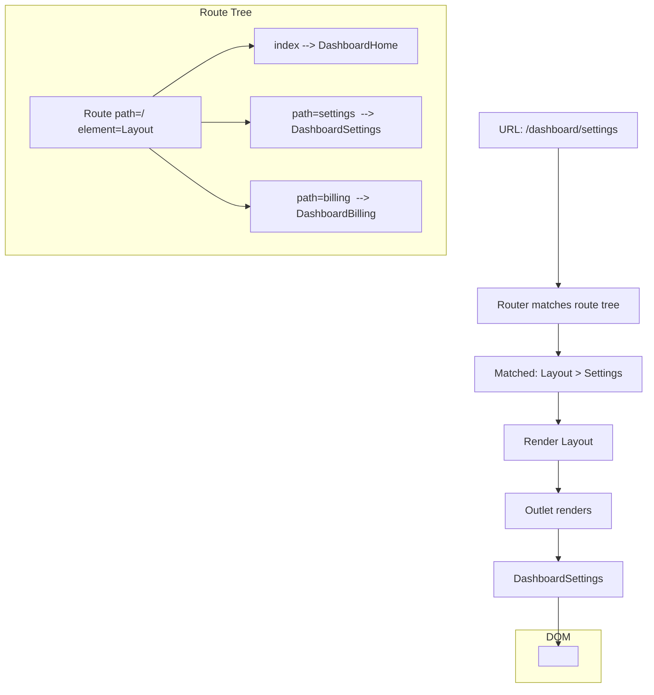
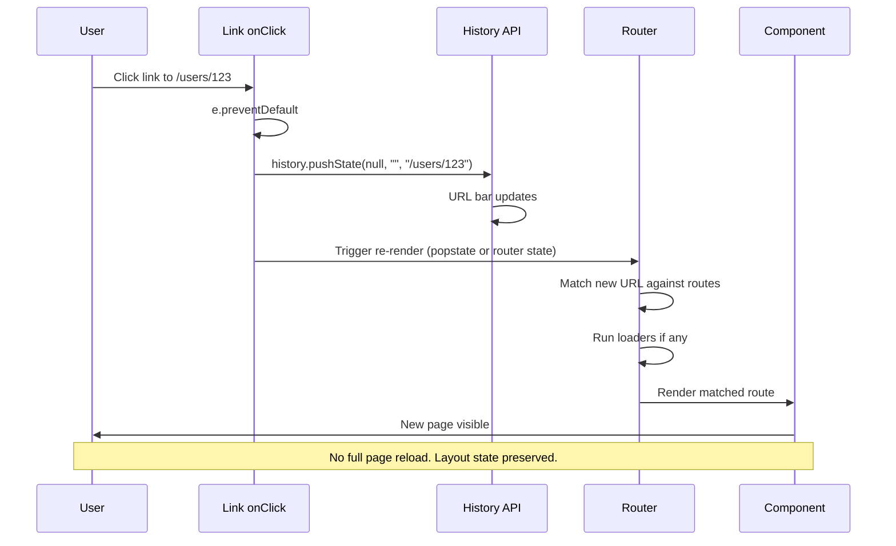
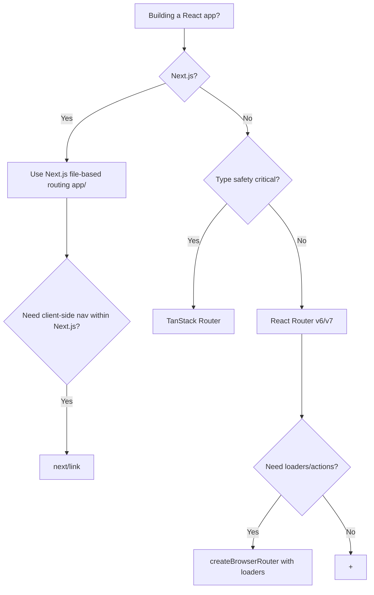

# 3.17 Client-Side Routing

> Multi-page applications used to mean a full page reload on every link click. Single-page applications (SPAs) changed that: the URL updates, the page doesn't reload, and JavaScript swaps the content. This is client-side routing. This note covers what client-side routing is and how it differs from server-side routing, the underlying History API (and hash-based routing for legacy fallback), React Router v6/v7 in depth (`BrowserRouter`, `Routes`, `Route`, `Link`, `NavLink`, `useParams`, `useNavigate`, `useSearchParams`, nested routes with `Outlet`, index routes, the loader/action pattern, error boundaries per route), the TanStack Router alternative (type-safe routes), file-based routing in Next.js (preview), the difference between page-level and app-level routing, route guards, lazy-loading routes with code splitting, preloading on hover/focus, and scroll restoration.

## 3.17.1 Objective

By the end of this note you should be able to:

1. Explain what client-side routing is, why it exists, and how it differs from server-side routing.
2. Use the History API directly (`pushState`, `popstate` event) to build a minimal router.
3. Explain why hash-based routing exists and when you'd still use it.
4. Build a React Router v6/v7 app with `BrowserRouter`, nested `Routes`/`Route`, `Link`, `NavLink`, `Outlet`, and index routes.
5. Use `useParams`, `useNavigate`, `useSearchParams`, `useLocation` correctly.
6. Implement nested routes with `Outlet` for layouts.
7. Use the loader/action pattern (React Router v6.4+) for data fetching and mutations.
8. Add per-route error boundaries via `errorElement`.
9. Lazy-load routes with `React.lazy` and code splitting.
10. Preload route data on hover/focus for instant navigation.
11. Implement route guards for authentication and authorization.
12. Restore scroll position on back/forward navigation.
13. Compare React Router, TanStack Router, and Next.js file-based routing, and pick the right tool.

## 3.17.2 Background Knowledge

Before reading further, make sure you are comfortable with:

- **Components and props** from [[3.2 Components and Props]] — routes render components.
- **State and events** from [[3.3 State and Events]] — `useState`, event handlers.
- **Hooks** from [[3.6 Hooks (Built-In)]] — `useEffect`, `useMemo`, `useSyncExternalStore`.
- **Effects** from [[3.8 Effects and Side Effects]] — synchronization with external systems (the URL).
- **Suspense and lazy loading** from [[3.12 Suspense, Lazy Loading, and Code Splitting]] — `React.lazy`, `Suspense`, code splitting.
- **Error Boundaries** from [[3.13 Error Boundaries and Debugging]] — route-level error boundaries.
- **API integration** from [[3.16 API Integration and Data Fetching]] — loaders as a fetching strategy.
- **Project architecture** from [[3.15 Project Architecture and Folder Organization]] — where routes live (`app/` or `pages/`).

## 3.17.3 Core Concepts

### 3.17.3.1 What Is Client-Side Routing?

In a traditional multi-page application (MPA), every link click triggers a full HTTP request. The browser throws away the current page, downloads the new HTML, parses it, builds the DOM, loads CSS and JS, and renders. The user sees a flash; the JS state is lost.

In a single-page application (SPA) with client-side routing, the URL changes but the page doesn't reload. JavaScript intercepts the link click, updates the URL via the History API, fetches any needed data, and swaps the rendered content. The browser shell (header, nav, footer) stays mounted; only the changed part of the page re-renders.

Benefits:

- **No page reload.** Transitions are instant (or as fast as data fetching).
- **State preserved.** The header's open menu, the audio player's playback, the modal's open state — all survive navigation.
- **Animations.** Page transitions can animate.
- **Less bandwidth.** No HTML re-download for the shell.

Tradeoffs:

- **Initial bundle.** All route code ships to the client (mitigated by code splitting).
- **No server fallback.** If JS fails, nothing renders (mitigated by SSR).
- **SEO.** Crawlers may not execute JS (mitigated by SSR/SSG).

### 3.17.3.2 The History API

Modern client-side routing is built on the HTML5 History API:

```ts
// Push a new URL onto the history stack (no page reload)
history.pushState({ page: "users" }, "", "/users");

// Replace the current URL (no new history entry)
history.replaceState({ page: "users" }, "", "/users");

// Listen for back/forward navigation
window.addEventListener("popstate", (event) => {
  console.log("URL changed to:", window.location.pathname);
});

// Go back / forward
history.back();
history.forward();
history.go(-2);
```

`pushState` takes (state object, title, URL). The state object is attached to the history entry and surfaces in `popstate` events. The URL must be same-origin (you can't push to a different domain).

The `popstate` event fires when the user clicks back/forward, or when `history.back()` / `history.forward()` / `history.go()` is called. It does **not** fire on `pushState` or `replaceState` — those are synchronous URL changes, not navigation.

### 3.17.3.3 A Minimal Router from Scratch

```tsx
import { useSyncExternalStore } from "react";

function subscribe(callback: () => void) {
  window.addEventListener("popstate", callback);
  return () => window.removeEventListener("popstate", callback);
}

function getSnapshot() {
  return window.location.pathname;
}

export function usePathname() {
  return useSyncExternalStore(subscribe, getSnapshot, () => "/");
}

export function navigate(to: string) {
  history.pushState(null, "", to);
  // popstate doesn't fire on pushState, so dispatch manually
  window.dispatchEvent(new PopStateEvent("popstate"));
}

// Usage:
function App() {
  const pathname = usePathname();
  if (pathname === "/") return <Home />;
  if (pathname === "/about") return <About />;
  return <NotFound />;
}
```

`useSyncExternalStore` is the modern way to subscribe a React component to an external store (the URL bar). It handles concurrent rendering and SSR correctly. See [[3.6 Hooks (Built-In)]].

This is a 15-line router. React Router and TanStack Router do vastly more (nested routes, params, loaders, type safety), but the core is the History API plus a subscription.

### 3.17.3.4 Hash-Based Routing

Before the History API was widely supported, routers used the URL hash:

```
https://example.com/#/users/123
                  ^^^ hash
```

The hash (`#/users/123`) is purely client-side. The browser never sends it to the server, so changing it doesn't trigger a page reload. The `hashchange` event fires on change.

```ts
window.addEventListener("hashchange", () => {
  console.log("Hash:", window.location.hash);
});
```

> [!warning] Hash routing is mostly legacy
> Use hash routing only when:
> - You can't configure the server to serve `index.html` for all routes (e.g. static hosting without rewrite rules).
> - You're inside an `<iframe>` where the parent's URL can't change.
> - You're supporting very old browsers.
>
> For everything else, use the History API. Hash URLs are ugly (`/#/users/123`) and don't support server-side rendering.

### 3.17.3.5 React Router v6/v7: The Mainstream Choice

React Router is the dominant routing library for React. v6 (released 2021) was a major rewrite. v7 (released 2024) merges Remix into React Router and adds the "Framework mode" (file-based routes, SSR). v6/v7 has a consistent API:

- `<BrowserRouter>` — the root provider. Uses the History API.
- `<HashRouter>` — same API, uses hash routing.
- `<Routes>` — declares the route tree.
- `<Route>` — a single route, with `path` and `element`.
- `<Link to="/about">` — a navigation link. Renders an `<a>` with `href`, intercepts click.
- `<NavLink>` — like `Link` but adds `active` class when the route matches.
- `<Outlet>` — renders the matched child route. Used in layouts.
- `<Navigate to="/x" />` — imperative redirect as a component.
- `useParams()` — URL params (`/users/:id`  -->  `{ id: "123" }`).
- `useNavigate()` — programmatic navigation (`navigate("/users/123")`).
- `useSearchParams()` — query string (`?q=hello`  -->  `["q=hello", setQ]`).
- `useLocation()` — full location (`pathname`, `search`, `hash`, `state`).
- `useMatch(pattern)` — checks if the current URL matches a pattern.

### 3.17.3.6 Basic Route Setup

```tsx
import { BrowserRouter, Routes, Route, Link } from "react-router-dom";

function App() {
  return (
    <BrowserRouter>
      <nav>
        <Link to="/">Home</Link>
        <Link to="/about">About</Link>
        <Link to="/users">Users</Link>
      </nav>
      <Routes>
        <Route path="/" element={<Home />} />
        <Route path="/about" element={<About />} />
        <Route path="/users" element={<Users />} />
        <Route path="*" element={<NotFound />} />
      </Routes>
    </BrowserRouter>
  );
}
```

`<Routes>` picks the best matching `<Route>` for the current URL and renders its `element`. `path="*"` is the catch-all (404). Routes can be specified with or without a leading `/` — within a `<Routes>`, both work; in nested routes, omit the leading `/` for relative paths.

### 3.17.3.7 URL Parameters

```tsx
<Route path="/users/:id" element={<UserPage />} />

function UserPage() {
  const { id } = useParams<{ id: string }>();
  return <div>User ID: {id}</div>;
}
```

The `:id` is a URL parameter. `useParams` returns an object with all params for the current route. Multiple params work: `/users/:userId/posts/:postId`.

Optional params are not supported in v6 — use a separate route or a query string. For splats (matching arbitrary sub-paths), use `*`:

```tsx
<Route path="/files/*" element={<FileBrowser />} />
// URL: /files/docs/readme.txt
// useParams(): { "*": "docs/readme.txt" }
```

### 3.17.3.8 Nested Routes and `Outlet`

Nested routes let a parent route render a layout with a child route inside it via `<Outlet>`:

```tsx
<Routes>
  <Route path="/dashboard" element={<DashboardLayout />}>
    <Route index element={<DashboardHome />} />
    <Route path="settings" element={<DashboardSettings />} />
    <Route path="billing" element={<DashboardBilling />} />
  </Route>
</Routes>

function DashboardLayout() {
  return (
    <div className="flex">
      <Sidebar />
      <main><Outlet /></main>
    </div>
  );
}
```

When the URL is `/dashboard`, React Router renders `<DashboardLayout>` and inside its `<Outlet>` renders the `index` route (`<DashboardHome />`). When the URL is `/dashboard/settings`, the `<Outlet>` renders `<DashboardSettings />` instead. The layout (and its state) is preserved across child route changes.

> [!tip] Nested routes are the layout primitive
> Use nested routes whenever you have a layout that persists across multiple pages. The parent route renders the layout; the child routes render into the `<Outlet>`. No `useState` for active nav; no manual layout preservation.

### 3.17.3.9 Index Routes

An index route is the default child of a parent route — rendered when the parent's URL matches exactly, with no child path. Use `index` instead of `path`:

```tsx
<Route path="/dashboard" element={<DashboardLayout />}>
  <Route index element={<DashboardHome />} />
  <Route path="settings" element={<DashboardSettings />} />
</Route>
```

Visiting `/dashboard` (no further path) renders `<DashboardLayout>` with `<DashboardHome />` in the outlet. Visiting `/dashboard/settings` renders `<DashboardLayout>` with `<DashboardSettings />` in the outlet.

### 3.17.3.10 `Link` vs `NavLink`

```tsx
<Link to="/about">About</Link>
// Renders: <a href="/about">About</a>

<NavLink to="/about" className={({ isActive }) => isActive ? "active" : ""}>
  About
</NavLink>
// Renders: <a href="/about" class="active">About</a>  (when on /about)
```

`NavLink` is for navigation menus — it knows whether the current URL matches its `to` and lets you style accordingly. The `className` and `style` props accept functions that receive `{ isActive, isPending }`.

### 3.17.3.11 `useNavigate` for Programmatic Navigation

```tsx
function LoginForm() {
  const navigate = useNavigate();
  const handleSubmit = async (e) => {
    e.preventDefault();
    const ok = await login();
    if (ok) {
      navigate("/dashboard");           // push
      // navigate("/dashboard", { replace: true });  // replace (no back button)
      // navigate(-1);  // back
      // navigate(1);   // forward
    }
  };
  return <form onSubmit={handleSubmit}>...</form>;
}
```

`navigate(to)` pushes by default. Pass `{ replace: true }` to replace (useful after login — you don't want "back" to return to the login page). Pass a number to go back/forward.

### 3.17.3.12 `useSearchParams` for Query Strings

```tsx
function SearchPage() {
  const [params, setParams] = useSearchParams();
  const query = params.get("q") ?? "";
  const page = Number(params.get("page") ?? "1");

  const setPage = (newPage: number) => {
    setParams({ q: query, page: String(newPage) });
  };

  return (
    <div>
      <p>Searching for: {query}</p>
      <p>Page: {page}</p>
      <button onClick={() => setPage(page + 1)}>Next</button>
    </div>
  );
}
```

`useSearchParams` works like `useState` for the URL query string. Updates are reflected in the URL (`?q=hello&page=2`), so the state is shareable and survives refresh.

> [!note] Always sync important state to the URL
> Search queries, filters, sort order, current page — anything the user might want to share or bookmark. URL state is the most durable form of state. See [[3.9 Context and Reducers]] for state placement.

### 3.17.3.13 The Loader/Action Pattern (React Router v6.4+)

React Router v6.4 (and v7) added a data layer inspired by Remix. Each route can have a `loader` (runs before render, fetches data) and an `action` (handles form submissions):

```tsx
import { createBrowserRouter, RouterProvider } from "react-router-dom";

const router = createBrowserRouter([
  {
    path: "/users/:id",
    element: <UserPage />,
    loader: async ({ params }) => {
      const res = await fetch(`/api/users/${params.id}`);
      if (!res.ok) throw new Response("Not found", { status: 404 });
      return res.json();
    },
    action: async ({ request, params }) => {
      const formData = await request.formData();
      const res = await fetch(`/api/users/${params.id}`, {
        method: "PATCH",
        body: JSON.stringify(Object.fromEntries(formData)),
      });
      return res.json();
    },
    errorElement: <RouteError />,
  },
]);

function UserPage() {
  const user = useLoaderData() as User;        // loader result
  const actionData = useActionData();          // last action result
  return (
    <form method="post">
      <input name="name" defaultValue={user.name} />
      <button type="submit">Save</button>
    </form>
  );
}

function App() {
  return <RouterProvider router={router} />;
}
```

The `loader` runs before the route renders. React Router suspends the route until the loader resolves, then renders with the data available via `useLoaderData`. The `action` handles form submissions (POST/PUT/DELETE); after action, the loader re-runs to refresh data.

> [!tip] Loaders pair with TanStack Query or replace it
> Loaders are an alternative to TanStack Query for route-level data. They handle fetching, caching (via React Router's internal cache), and revalidation after actions. For non-route data (mutations outside form submits, real-time updates), TanStack Query is still the better tool. Many apps use both: loaders for route data, TanStack Query for everything else.

### 3.17.3.14 Per-Route Error Boundaries

Each route can have its own `errorElement`:

```tsx
const router = createBrowserRouter([
  {
    path: "/",
    element: <Layout />,
    errorElement: <RootError />,
    children: [
      { path: "users/:id", element: <UserPage />, errorElement: <UserError /> },
      { path: "settings", element: <SettingsPage /> },
    ],
  },
]);
```

If `UserPage`'s loader throws, the `<UserError />` renders inside the layout. If `SettingsPage`'s loader throws (no `errorElement`), the error bubbles up to the nearest parent with one — `<RootError />`. This is the route-level error boundary pattern from [[3.13 Error Boundaries and Debugging]].

### 3.17.3.15 TanStack Router: Type-Safe Alternative

TanStack Router (by the TanStack team) is a newer alternative to React Router with first-class TypeScript type safety:

```tsx
const rootRoute = createRootRoute({ component: Root });
const indexRoute = createRoute({
  getParentRoute: () => rootRoute,
  path: "/",
  component: Home,
});
const userRoute = createRoute({
  getParentRoute: () => rootRoute,
  path: "/users/$id",
  component: UserPage,
});

const routeTree = rootRoute.addChildren([indexRoute, userRoute]);
const router = createRouter({ routeTree });

// Type-safe params:
function UserPage() {
  const { id } = userRoute.useParams();  // typed as string
  return <div>{id}</div>;
}
```

Benefits over React Router:

- **Type-safe params and search params.** `useParams()` returns the typed shape; typos are caught at compile time.
- **Type-safe links.** `<Link to="/users/$id" params={{ id: "123" }} />` — invalid `to` or missing params are type errors.
- **Code-generated route tree.** File-based routing generates types, so adding a route updates the types automatically.
- **Built-in loaders and integration with TanStack Query.**

Tradeoff: smaller ecosystem than React Router; learning curve if you already know React Router.

### 3.17.3.16 File-Based Routing (Next.js Preview)

Next.js (both Pages Router and App Router) uses file-based routing: the file system *is* the route tree.

```
app/
  page.tsx                     -->  /
  about/
    page.tsx                   -->  /about
  users/
    [id]/
      page.tsx                 -->  /users/123
      settings/
        page.tsx               -->  /users/123/settings
```

No `<Routes>` declaration. The file path *is* the route. This is the simplest mental model and is the direction the React ecosystem is heading (Next.js App Router, TanStack Start, Remix v2+ via React Router v7 Framework mode).

> [!note] See Chapter 4 for the full Next.js treatment
> This note covers client-side routing in a generic SPA (React Router / TanStack Router). Next.js file-based routing is covered in [[4.1 App Router Foundations]] and [[4.2 Routing, Layouts, and Templates]].

### 3.17.3.17 Page-Level vs App-Level Routing

Two scales of routing:

- **App-level routing.** Top-level navigation between major pages (Home, Dashboard, Settings). The URL changes; the entire page content changes.
- **Page-level routing.** Within a page, switching between tabs or views. The URL may change (a query param or hash) or may not.

For app-level routing, use a real router (React Router, TanStack Router, Next.js). For page-level routing, the choice depends:

- **URL-synced tabs** (shareable, bookmarkable): use a router. `<Route path="/dashboard/:tab">` or `useSearchParams`.
- **State-only tabs** (not shareable): `useState`. Simpler, no URL pollution.

> [!tip] When in doubt, sync to the URL
> If a user might want to share the URL or hit refresh without losing their place, sync to the URL. The cost is small; the benefit is large.

### 3.17.3.18 Route Guards

A route guard is a check that runs before a route renders — typically for authentication or authorization:

```tsx
function ProtectedRoute({ children }: { children: React.ReactNode }) {
  const { user, isLoading } = useAuth();
  const location = useLocation();

  if (isLoading) return <FullScreenSpinner />;
  if (!user) {
    return <Navigate to="/login" state={{ from: location }} replace />;
  }
  return <>{children}</>;
}

// Usage:
<Routes>
  <Route path="/login" element={<LoginPage />} />
  <Route path="/dashboard" element={
    <ProtectedRoute><DashboardPage /></ProtectedRoute>
  } />
</Routes>
```

After login, redirect back to where the user was trying to go:

```tsx
function LoginPage() {
  const navigate = useNavigate();
  const location = useLocation();
  const from = (location.state as { from?: Location })?.from?.pathname ?? "/";

  const handleLogin = async () => {
    await login();
    navigate(from, { replace: true });
  };
  // ...
}
```

### 3.17.3.19 Lazy-Loading Routes

Code-split each route so the initial bundle is small:

```tsx
import { lazy, Suspense } from "react";

const Dashboard = lazy(() => import("./pages/Dashboard"));
const Settings = lazy(() => import("./pages/Settings"));
const Users = lazy(() => import("./pages/Users"));

function App() {
  return (
    <BrowserRouter>
      <Routes>
        <Route path="/" element={<Home />} />
        <Route path="/dashboard" element={
          <Suspense fallback={<Spinner />}><Dashboard /></Suspense>
        } />
        <Route path="/settings" element={
          <Suspense fallback={<Spinner />}><Settings /></Suspense>
        } />
      </Routes>
    </BrowserRouter>
  );
}
```

Each `lazy(...)` call creates a separate JS chunk, loaded on demand when the route is visited. The initial bundle contains only the shell + Home. See [[3.12 Suspense, Lazy Loading, and Code Splitting]].

React Router v6.4+ has built-in lazy route support:

```tsx
const router = createBrowserRouter([
  {
    path: "/dashboard",
    lazy: () => import("./pages/Dashboard").then((m) => ({
      Component: m.default,
      loader: m.loader,
      action: m.action,
      ErrorBoundary: m.ErrorBoundary,
    })),
  },
]);
```

### 3.17.3.20 Preloading on Hover/Focus

Prefetch the route's chunk (and data) when the user hovers or focuses a link:

```tsx
function PrefetchLink({ to, children, ...props }: LinkProps) {
  const handleHover = () => {
    // Trigger the import
    import("./pages/Dashboard");
    // Or prefetch data via TanStack Query
    queryClient.prefetchQuery({
      queryKey: ["dashboard"],
      queryFn: fetchDashboardData,
    });
  };
  return (
    <Link to={to} onMouseEnter={handleHover} onFocus={handleHover} {...props}>
      {children}
    </Link>
  );
}
```

React Router v6 has `<Link>` prefetching via the `prefetch` prop in frameworks like Remix. In a pure SPA, manual prefetching on hover is the standard pattern.

The benefit: when the user clicks, the chunk is already loaded. Navigation is instant.

### 3.17.3.21 Scroll Restoration

When the user clicks back, they expect to land at the same scroll position they left. Browsers do this automatically for full page reloads; SPAs have to do it manually.

React Router v6 provides `<ScrollRestoration />`:

```tsx
import { ScrollRestoration } from "react-router-dom";

function App() {
  return (
    <BrowserRouter>
      <Routes>...</Routes>
      <ScrollRestoration />
    </BrowserRouter>
  );
}
```

It tracks scroll position per location and restores it on back/forward. For new navigations (forward), it scrolls to top.

Without it, you have to manage it yourself:

```tsx
function useScrollRestoration() {
  const { pathname } = useLocation();
  useEffect(() => {
    window.scrollTo(0, 0);
  }, [pathname]);
}
```

This is the simple version (always scroll to top on path change). For full restoration (preserve position on back), use React Router's built-in.

## 3.17.4 Detailed Walkthrough

### 3.17.4.1 A Complete React Router Setup

```tsx
// app/router.tsx
import { createBrowserRouter, RouterProvider } from "react-router-dom";
import { Layout } from "@/components/Layout";
import { HomePage } from "@/features/home/components/HomePage";
import { LoginPage } from "@/features/auth/components/LoginPage";
import { DashboardPage } from "@/features/dashboard/components/DashboardPage";
import { UserListPage } from "@/features/users/components/UserListPage";
import { UserDetailPage } from "@/features/users/components/UserDetailPage";
import { NotFoundPage } from "@/components/NotFoundPage";
import { ProtectedRoute } from "@/components/ProtectedRoute";
import { RootError } from "@/components/RootError";

const lazyRoute = (importFn: () => Promise<any>) =>
  lazy(() => importFn().then((m) => ({ default: m.Component })));

export const router = createBrowserRouter([
  {
    path: "/",
    element: <Layout />,
    errorElement: <RootError />,
    children: [
      { index: true, element: <HomePage /> },
      { path: "login", element: <LoginPage /> },
      {
        path: "dashboard",
        element: (
          <ProtectedRoute>
            <DashboardPage />
          </ProtectedRoute>
        ),
      },
      {
        path: "users",
        element: (
          <ProtectedRoute>
            <UserListPage />
          </ProtectedRoute>
        ),
      },
      {
        path: "users/:id",
        element: (
          <ProtectedRoute>
            <UserDetailPage />
          </ProtectedRoute>
        ),
        loader: async ({ params }) => {
          const res = await fetch(`/api/users/${params.id}`);
          if (!res.ok) throw new Response("Not found", { status: 404 });
          return res.json();
        },
        errorElement: <UserError />,
      },
      { path: "*", element: <NotFoundPage /> },
    ],
  },
]);

// app/App.tsx
export function App() {
  return <RouterProvider router={router} />;
}
```

### 3.17.4.2 Nested Routes with Layout

```tsx
// components/Layout.tsx
import { Outlet, Link, NavLink, ScrollRestoration } from "react-router-dom";

export function Layout() {
  return (
    <div className="min-h-screen flex flex-col">
      <header className="border-b">
        <nav className="flex gap-4 p-4">
          <NavLink to="/" end className={({ isActive }) => isActive ? "font-bold" : ""}>
            Home
          </NavLink>
          <NavLink to="/dashboard" className={({ isActive }) => isActive ? "font-bold" : ""}>
            Dashboard
          </NavLink>
          <NavLink to="/users" className={({ isActive }) => isActive ? "font-bold" : ""}>
            Users
          </NavLink>
        </nav>
      </header>
      <main className="flex-1 p-4">
        <Outlet />
      </main>
      <footer className="border-t p-4">© 2025</footer>
      <ScrollRestoration />
    </div>
  );
}
```

The `end` prop on the home NavLink is important: without it, `/` matches every URL (every path starts with `/`), so home is always "active". `end` makes it match only the exact path.

### 3.17.4.3 The `ProtectedRoute` Guard

```tsx
// components/ProtectedRoute.tsx
import { Navigate, useLocation } from "react-router-dom";
import { useAuth } from "@/features/auth";
import { FullScreenSpinner } from "@/components/ui/FullScreenSpinner";

export function ProtectedRoute({ children }: { children: React.ReactNode }) {
  const { user, isLoading } = useAuth();
  const location = useLocation();

  if (isLoading) return <FullScreenSpinner />;
  if (!user) {
    return <Navigate to="/login" state={{ from: location }} replace />;
  }
  return <>{children}</>;
}
```

After login, redirect back:

```tsx
// features/auth/components/LoginPage.tsx
import { useNavigate, useLocation } from "react-router-dom";

export function LoginPage() {
  const navigate = useNavigate();
  const location = useLocation();
  const from = (location.state as { from?: Location })?.from?.pathname ?? "/";

  const handleSubmit = async (e: React.FormEvent) => {
    e.preventDefault();
    // ... login logic ...
    navigate(from, { replace: true });
  };
  // ...
}
```

### 3.17.4.4 Lazy Route with Loader

```tsx
// features/dashboard/components/DashboardPage.tsx
import { useLoaderData } from "react-router-dom";

export async function loader() {
  const [stats, recentActivity] = await Promise.all([
    fetch("/api/dashboard/stats").then((r) => r.json()),
    fetch("/api/dashboard/activity").then((r) => r.json()),
  ]);
  return { stats, recentActivity };
}

export function DashboardPage() {
  const { stats, recentActivity } = useLoaderData() as Awaited<ReturnType<typeof loader>>;
  return (
    <div>
      <Stats stats={stats} />
      <ActivityFeed items={recentActivity} />
    </div>
  );
}

export const Component = DashboardPage;  // for lazy()
```

```tsx
// app/router.tsx (with lazy route + loader)
{
  path: "dashboard",
  lazy: () => import("@/features/dashboard/components/DashboardPage").then((m) => ({
    Component: m.Component,
    loader: m.loader,
  })),
}
```

The route's chunk, loader, and component all load together on first navigation. Subsequent navigations use the cached chunk.

### 3.17.4.5 Query String State with `useSearchParams`

```tsx
// features/users/components/UserListPage.tsx
import { useSearchParams } from "react-router-dom";

export function UserListPage() {
  const [params, setParams] = useSearchParams();
  const search = params.get("q") ?? "";
  const page = Number(params.get("page") ?? "1");
  const sort = (params.get("sort") ?? "name") as "name" | "date";

  const { data, isLoading } = useQuery({
    queryKey: ["users", { search, page, sort }],
    queryFn: () => fetchUsers({ search, page, sort }),
  });

  const updateParam = (key: string, value: string) => {
    const next = new URLSearchParams(params);
    next.set(key, value);
    setParams(next);
  };

  return (
    <div>
      <input
        value={search}
        onChange={(e) => updateParam("q", e.target.value)}
        placeholder="Search..."
      />
      <select value={sort} onChange={(e) => updateParam("sort", e.target.value)}>
        <option value="name">Name</option>
        <option value="date">Date</option>
      </select>
      {/* ... list ... */}
      <button onClick={() => updateParam("page", String(page + 1))}>Next</button>
    </div>
  );
}
```

Filter, sort, search, and pagination are all in the URL. Shareable, bookmarkable, refresh-safe.

### 3.17.4.6 Prefetching on Hover

```tsx
// components/PrefetchLink.tsx
import { Link } from "react-router-dom";
import { queryClient } from "@/lib/queryClient";

interface PrefetchLinkProps {
  to: string;
  children: React.ReactNode;
  prefetchQuery?: { queryKey: unknown[]; queryFn: () => Promise<unknown> };
}

export function PrefetchLink({ to, children, prefetchQuery }: PrefetchLinkProps) {
  const handlePrefetch = () => {
    if (prefetchQuery) {
      queryClient.prefetchQuery(prefetchQuery);
    }
  };
  return (
    <Link
      to={to}
      onMouseEnter={handlePrefetch}
      onFocus={handlePrefetch}
      onTouchStart={handlePrefetch}
    >
      {children}
    </Link>
  );
}

// Usage:
<PrefetchLink
  to="/users/123"
  prefetchQuery={{
    queryKey: ["users", "123"],
    queryFn: () => fetchUser("123"),
  }}
>
  View user
</PrefetchLink>
```

When the user hovers (desktop) or touches (mobile), the data is prefetched. By the time they click, navigation is instant. See [[3.16 API Integration and Data Fetching]] for the TanStack Query side.

## 3.17.5 Practical Examples

### 3.17.5.1 A Full App Shell with Auth, Layout, Lazy Routes, and Errors

```tsx
// app/router.tsx
import { createBrowserRouter, Navigate } from "react-router-dom";
import { Layout } from "@/components/Layout";
import { ProtectedRoute } from "@/components/ProtectedRoute";
import { RootError } from "@/components/RootError";
import { HomePage } from "@/features/home/components/HomePage";
import { LoginPage } from "@/features/auth/components/LoginPage";

export const router = createBrowserRouter([
  {
    path: "/",
    element: <Layout />,
    errorElement: <RootError />,
    children: [
      { index: true, element: <HomePage /> },
      { path: "login", element: <LoginPage /> },
      {
        path: "dashboard",
        lazy: () => import("@/features/dashboard/components/DashboardPage"),
      },
      {
        path: "users",
        lazy: () => import("@/features/users/components/UserListPage"),
      },
      {
        path: "users/:id",
        lazy: () => import("@/features/users/components/UserDetailPage"),
        errorElement: <UserError />,
      },
      { path: "settings", lazy: () => import("@/features/settings/components/SettingsPage") },
      { path: "*", element: <Navigate to="/" replace /> },
    ],
  },
]);

// In each lazy-loaded page file, export Component:
// features/dashboard/components/DashboardPage.tsx
// export const Component = () => <div>Dashboard</div>;
```

### 3.17.5.2 A Modal Route (URL-Synced Modal)

A common pattern: a list page where clicking an item opens a modal. The modal's state is in the URL, so it's shareable and survives refresh.

```tsx
// features/users/components/UserListPage.tsx
import { useNavigate } from "react-router-dom";

export function UserListPage() {
  const navigate = useNavigate();
  return (
    <ul>
      {users.map((user) => (
        <li key={user.id}>
          <button onClick={() => navigate(`/users?selected=${user.id}`)}>
            {user.name}
          </button>
        </li>
      ))}
    </ul>
  );
}

// At the app level:
<Routes>
  <Route path="/users" element={<><UserListPage /><UserModal /></>} />
</Routes>

function UserModal() {
  const [params, setParams] = useSearchParams();
  const selectedId = params.get("selected");
  if (!selectedId) return null;
  return (
    <Modal onClose={() => {
      const next = new URLSearchParams(params);
      next.delete("selected");
      setParams(next);
    }}>
      <UserDetails id={selectedId} />
    </Modal>
  );
}
```

The modal's open state is in the URL (`?selected=123`). Refreshing keeps it open; the URL is shareable.

### 3.17.5.3 Breadcrumb from Route Hierarchy

```tsx
function Breadcrumbs() {
  const matches = useMatches();
  return (
    <nav>
      {matches.map((match) => (
        <Link key={match.id} to={match.pathname}>
          {match.handle?.breadcrumb ?? match.id}
        </Link>
      ))}
    </nav>
  );
}

// In route definition:
{
  path: "users/:id",
  element: <UserDetailPage />,
  handle: { breadcrumb: () => "User Detail" },
}
```

`useMatches()` returns the active route hierarchy. Each route's `handle` field can carry arbitrary metadata — breadcrumbs, page titles, etc.

## 3.17.6 Mermaid Diagrams

### 3.17.6.1 Nested Routes with `Outlet`



### 3.17.6.2 Client-Side Navigation Flow



### 3.17.6.3 The Route Decision Tree



## 3.17.7 Common Mistakes

1. **Forgetting `end` on the home `NavLink`.** `<NavLink to="/">Home</NavLink>` matches every URL (since every path starts with `/`), so Home is always "active". Use `<NavLink to="/" end>` to match only the exact path.

2. **Using `useNavigate` in render instead of `<Navigate>`.** `navigate("/x")` during render is a side effect — it can fire multiple times. Use `<Navigate to="/x" replace />` as a component for declarative redirects.

3. **Not guarding routes.** Putting `<ProtectedRoute>` only on some routes. The user navigates to an unguarded route and sees data they shouldn't. Centralize guards in the router config or wrap every protected route.

4. **Forgetting to lazy-load routes.** All routes in one bundle = slow initial load. Code-split every route except the home/login pages.

5. **Using `useState` instead of URL state for filters.** Filter state in `useState` is lost on refresh and unshareable. Sync to query params via `useSearchParams`.

6. **Not handling 404s.** Missing `path="*"` route means an unknown URL renders a blank page. Always have a catch-all.

7. **`<a href>` instead of `<Link to>`.** A real `<a>` triggers a full page reload. Always use `<Link>` for internal navigation.

8. **Mutating `searchParams` directly.** `searchParams.set("q", "x")` mutates a readonly URLSearchParams. Always create a new one: `new URLSearchParams(params)`.

9. **Not restoring scroll position.** Without `<ScrollRestoration />`, back navigation lands at the top of the page. Users hate this.

10. **Nesting `<BrowserRouter>` inside `<BrowserRouter>`.** Only one router at the root. Nested routers will conflict and break.

11. **Using `pushState` without notifying React.** Calling `history.pushState` directly doesn't fire `popstate`, so React Router doesn't know. Always use `navigate()` or `<Link>`.

12. **Forgetting `replace: true` after login.** After successful login, you don't want "back" to return to the login page. Use `navigate(from, { replace: true })`.

13. **Loading all route data upfront.** Waterfall loaders (one loader waiting for another) are slow. Parallelize with `Promise.all`. Better: use TanStack Query and prefetch on hover.

14. **Putting auth state in the URL.** Don't put JWTs in query strings — they leak into logs, browser history, and referer headers. Auth state belongs in cookies or `localStorage`.

## 3.17.8 Best Practices

1. **Use React Router v6/v7 (or Next.js) for any real app.** Don't roll your own router. The edge cases (scroll restoration, focus management, transitions, SSR) are endless.

2. **Sync important UI state to the URL.** Filters, sort, pagination, modal open state, selected tab. URL state is shareable, bookmarkable, and refresh-safe.

3. **Use nested routes for layouts.** A `<Layout>` with `<Outlet>` is the cleanest way to keep the shell mounted while swapping content.

4. **Lazy-load every route except the entry.** Initial bundle = shell + entry route. Everything else loads on demand.

5. **Use loaders for route data.** Loaders fetch in parallel with the route chunk, so by the time the route mounts, the data is there. Pair with `<Suspense>` and route-level error boundaries.

6. **Add route-level error boundaries.** `errorElement` on each route catches errors in loaders, actions, and rendering. Don't let one broken route blank the whole app.

7. **Centralize route guards.** A `<ProtectedRoute>` wrapper or a per-route `loader` that checks auth is cleaner than scattering `if (!user)` checks in every page.

8. **Use `useNavigate` for programmatic navigation, `<Link>` for declarative.** Don't `useNavigate` in render — that's a side effect. For redirects during render, use `<Navigate>`.

9. **Prefetch on hover/focus.** For links to data-heavy routes, prefetch the query on hover. Instant navigation is the gold standard.

10. **Restore scroll position.** `<ScrollRestoration />` is one line and saves users from a top-of-page jump on back navigation.

11. **Use `NavLink` for navigation menus.** It knows when it's active and lets you style accordingly. Don't manually compare `pathname`.

12. **Always have a 404 route.** `path="*"` catches typos and broken links. Render a friendly "Not Found" with a link home.

13. **Use absolute paths in `Link` by default.** `<Link to="/users/123">` is unambiguous. Relative paths (`<Link to="123">`) work but are easy to get wrong.

14. **Document your routes.** A central `router.tsx` file is your route map. Keep it readable — extract loaders and components to feature folders.

> [!tip] The Next.js direction
> The React ecosystem is consolidating on file-based routing (Next.js App Router, TanStack Start, Remix v2 via React Router v7 Framework mode). If you're starting a new project, strongly consider Next.js — file-based routing is simpler and integrates SSR/SSG/streaming for free. See [[4.1 App Router Foundations]].

## 3.17.9 Mini Exercises

### 3.17.9.1 Build a Three-Route App

**Task:** Build a React Router v6 app with three routes: `/`, `/about`, `/users/:id`. Include a navigation menu with active-link styling, a 404 catch-all, and scroll restoration.

**Worked solution:**

```tsx
import { BrowserRouter, Routes, Route, Link, NavLink, ScrollRestoration } from "react-router-dom";

function Layout({ children }: { children: React.ReactNode }) {
  return (
    <>
      <nav>
        <NavLink to="/" end className={({ isActive }) => isActive ? "active" : ""}>Home</NavLink>
        <NavLink to="/about" className={({ isActive }) => isActive ? "active" : ""}>About</NavLink>
        <NavLink to="/users/1" className={({ isActive }) => isActive ? "active" : ""}>Sample User</NavLink>
      </nav>
      <main>{children}</main>
      <ScrollRestoration />
    </>
  );
}

function App() {
  return (
    <BrowserRouter>
      <Layout>
        <Routes>
          <Route path="/" element={<Home />} />
          <Route path="/about" element={<About />} />
          <Route path="/users/:id" element={<UserPage />} />
          <Route path="*" element={<NotFound />} />
        </Routes>
      </Layout>
    </BrowserRouter>
  );
}

function Home() { return <h1>Home</h1>; }
function About() { return <h1>About</h1>; }
function UserPage() {
  const { id } = useParams<{ id: string }>();
  return <h1>User {id}</h1>;
}
function NotFound() { return <h1>404 Not Found</h1>; }
```

**Common mistakes:** Forgetting `end` on the home NavLink (always active). Missing `path="*"` (blank page on unknown URLs). `<a href>` instead of `<Link>` (full reloads).

### 3.17.9.2 Implement a Route Guard

**Task:** Build a `ProtectedRoute` that redirects unauthenticated users to `/login` and remembers where they were trying to go. After login, redirect back.

**Worked solution:**

```tsx
function ProtectedRoute({ children }: { children: React.ReactNode }) {
  const { user, isLoading } = useAuth();
  const location = useLocation();

  if (isLoading) return <FullScreenSpinner />;
  if (!user) {
    return <Navigate to="/login" state={{ from: location }} replace />;
  }
  return <>{children}</>;
}

function LoginPage() {
  const navigate = useNavigate();
  const location = useLocation();
  const from = (location.state as { from?: Location })?.from?.pathname ?? "/";

  const handleSubmit = async (e: React.FormEvent) => {
    e.preventDefault();
    await login(/* ... */);
    navigate(from, { replace: true });  // replace so back doesn't return to login
  };
  return <form onSubmit={handleSubmit}>...</form>;
}

// Usage:
<Route path="/dashboard" element={
  <ProtectedRoute><DashboardPage /></ProtectedRoute>
} />
```

**Critical details:**
- `state={{ from: location }}` preserves the URL the user wanted.
- `replace: true` on the redirect to login (no back button to the protected page).
- `replace: true` on the post-login redirect (no back button to login).
- `isLoading` check to avoid flapping (brief redirect to login while auth resolves).

### 3.17.9.3 Sync Filter State to the URL

**Task:** A user list page has a search input and a sort dropdown. Currently both are in `useState` and lost on refresh. Move them to the URL.

**Original:**

```tsx
function UserListPage() {
  const [search, setSearch] = useState("");
  const [sort, setSort] = useState<"name" | "date">("name");
  // ...
}
```

**Worked solution:**

```tsx
function UserListPage() {
  const [params, setParams] = useSearchParams();
  const search = params.get("q") ?? "";
  const sort = (params.get("sort") ?? "name") as "name" | "date";

  const update = (key: string, value: string) => {
    const next = new URLSearchParams(params);
    next.set(key, value);
    setParams(next);
  };

  return (
    <div>
      <input value={search} onChange={(e) => update("q", e.target.value)} />
      <select value={sort} onChange={(e) => update("sort", e.target.value)}>
        <option value="name">Name</option>
        <option value="date">Date</option>
      </select>
    </div>
  );
}
```

**Why:** Now the URL is `?q=alice&sort=date`. The user can bookmark it, share it, refresh without losing state. Browser back/forward navigates filter changes.

**Common wrong approach:** Mutating `params` directly (`params.set(...)`). It's a readonly `URLSearchParams`. Always create a new one.

### 3.17.9.4 Add a Lazy-Loaded Route with a Loader

**Task:** Add a `/reports` route that is lazy-loaded and fetches report data via a loader before rendering.

**Worked solution:**

```tsx
// features/reports/components/ReportsPage.tsx
import { useLoaderData } from "react-router-dom";

export async function loader() {
  const res = await fetch("/api/reports");
  if (!res.ok) throw new Response("Failed to load reports", { status: 500 });
  return res.json() as Promise<Report[]>;
}

export function Component() {
  const reports = useLoaderData() as Report[];
  return (
    <div>
      <h1>Reports</h1>
      <ul>
        {reports.map((r) => <li key={r.id}>{r.title}</li>)}
      </ul>
    </div>
  );
}

// app/router.tsx
{
  path: "reports",
  lazy: () => import("@/features/reports/components/ReportsPage").then((m) => ({
    Component: m.Component,
    loader,
  })),
}
```

**Key points:**
- The route chunk, component, and loader all load together on first navigation.
- The loader throws a `Response` on error — React Router treats non-2xx responses as errors and renders the route's `errorElement`.
- `useLoaderData()` returns the typed data.

### 3.17.9.5 Prefetch on Hover

**Task:** Build a `PrefetchLink` that prefetches a TanStack Query when the user hovers, so navigation is instant on click.

**Worked solution:**

```tsx
import { Link } from "react-router-dom";
import { queryClient } from "@/lib/queryClient";

interface PrefetchLinkProps {
  to: string;
  children: React.ReactNode;
  queryKey: unknown[];
  queryFn: () => Promise<unknown>;
  staleTime?: number;
}

export function PrefetchLink({
  to,
  children,
  queryKey,
  queryFn,
  staleTime = 60_000,
}: PrefetchLinkProps) {
  const handlePrefetch = () => {
    queryClient.prefetchQuery({ queryKey, queryFn, staleTime });
  };
  return (
    <Link
      to={to}
      onMouseEnter={handlePrefetch}
      onFocus={handlePrefetch}
      onTouchStart={handlePrefetch}
    >
      {children}
    </Link>
  );
}

// Usage:
<PrefetchLink
  to="/users/123"
  queryKey={["users", "123"]}
  queryFn={() => fetchUser("123")}
>
  View user 123
</PrefetchLink>
```

**Why three event handlers:**
- `onMouseEnter` — desktop hover.
- `onFocus` — keyboard navigation.
- `onTouchStart` — mobile (touchstart fires before click, so we prefetch in the small window before the click registers).

**Common wrong approach:** Prefetching on render. That defeats the purpose — every visitor prefetches every link they see. Only prefetch on user intent (hover/focus/touch).

## 3.17.10 Summary

Client-side routing is the backbone of any SPA. It uses the HTML5 History API (`pushState`, `popstate`) to change the URL without reloading the page, then JavaScript swaps the rendered content. Hash-based routing (`#/path`) is a legacy fallback for environments without server rewrite support.

For React in 2025, three options dominate:

1. **React Router v6/v7** — the mainstream choice. `BrowserRouter` + `Routes`/`Route` + `Link` for basic setups; `createBrowserRouter` with loaders/actions for the data layer. Nested routes via `Outlet`, route guards via wrapper components or loaders, lazy routes via `React.lazy` or the `lazy` route property, per-route error boundaries via `errorElement`, scroll restoration via `<ScrollRestoration />`.

2. **TanStack Router** — the type-safe alternative. File-based with generated types, fully type-safe `useParams` and `<Link>`, integrated with TanStack Query. Use when type safety is critical and you're starting fresh.

3. **Next.js file-based routing** — the file system *is* the route tree. The direction the ecosystem is heading. Covered in [[4.1 App Router Foundations]] and [[4.2 Routing, Layouts, and Templates]].

Core patterns every React engineer should master:

- **Nested routes with `Outlet`** for layouts. The parent renders the shell; the child renders into the outlet. State is preserved across child navigation.
- **URL parameters** (`:id`) via `useParams`. **Query strings** via `useSearchParams`. **Programmatic navigation** via `useNavigate`. **Declarative redirects** via `<Navigate>`.
- **Loaders** fetch data before render; **actions** handle mutations. After an action, the loader re-runs to refresh. This is the Remix pattern, now in React Router.
- **Lazy-loading routes** with `React.lazy` + `Suspense` or the `lazy` route property. Initial bundle = shell + entry route only.
- **Prefetching on hover/focus** for instant navigation. Pair `onMouseEnter` with `queryClient.prefetchQuery`.
- **Route guards** via `<ProtectedRoute>` wrappers or `loader` checks. Always preserve the intended destination with `state={{ from: location }}` and use `replace: true` after login.
- **Per-route error boundaries** via `errorElement`. A broken loader or render in one route shouldn't blank the whole app.
- **Scroll restoration** via `<ScrollRestoration />`. Users expect back navigation to land where they left.
- **Sync important state to the URL** — filters, sort, pagination, modal open state. URL state is shareable, bookmarkable, and refresh-safe.

The mental model: the URL is your application's state machine. Every meaningful UI configuration should be expressible as a URL. The router is the engine that maps URLs to components and back.

## 3.17.11 Related Notes

- [[3.2 Components and Props]] — routes render components.
- [[3.6 Hooks (Built-In)]] — `useSyncExternalStore` for URL subscriptions.
- [[3.8 Effects and Side Effects]] — synchronizing with external systems (the URL bar).
- [[3.12 Suspense, Lazy Loading, and Code Splitting]] — `React.lazy` and code splitting for routes.
- [[3.13 Error Boundaries and Debugging]] — per-route `errorElement` is a route-level error boundary.
- [[3.14 Reusable Component Design]] — designing `<Link>` and `<NavLink>` abstractions.
- [[3.15 Project Architecture and Folder Organization]] — where routes live (`app/` for Next.js, `router.tsx` for SPAs).
- [[3.16 API Integration and Data Fetching]] — loaders as a fetching strategy, prefetching on hover.
- [[4.1 App Router Foundations]] — Next.js file-based routing.
- [[4.2 Routing, Layouts, and Templates]] — Next.js nested layouts and route groups.
- [[4.9 Loading UI, Error Pages, and Streaming]] — Next.js route-level loading and error UI.
- [[6.3 React Interview Questions]] — routing is a common interview topic.
