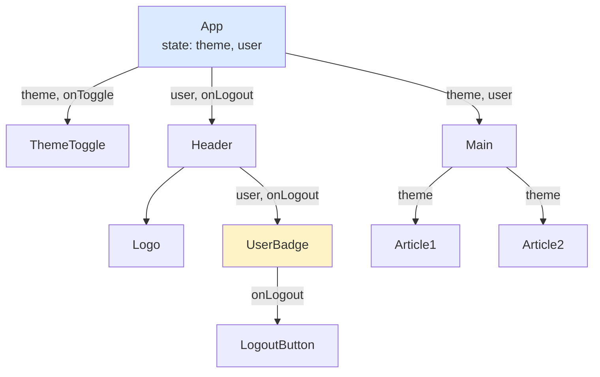
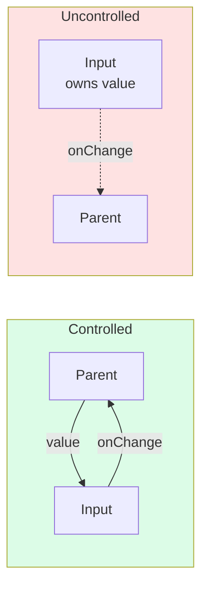
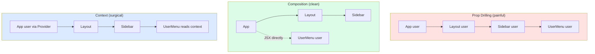

# 3.2 Components and Props

> A React component is a function that returns JSX. Props are the arguments. This is the entire core mental model — but the implications run deep: components compose like functions, props flow one direction, and the boundary between "props" and "state" is the single most important distinction in React architecture.

## 3.2.1 Objective

By the end of this note you should be able to:

1. Define "component" and "props" precisely and explain how they relate to functions.
2. Explain why class components exist, why they are legacy, and how to read them when you encounter them.
3. Destructure props idiomatically and provide defaults the modern way.
4. Recognize and apply advanced prop patterns: children, callbacks, render props, and the function-as-child pattern.
5. Identify prop drilling and explain why it sets the stage for Context.
6. Articulate the "component as a function of props" mental model and what it implies for testing and reasoning.
7. Explain why component names must be capitalized and what goes wrong if they are not.

## 3.2.2 Background Knowledge

Before reading further, make sure you are comfortable with:

- **Functions as first-class values in JavaScript.** You can pass a function as an argument, return a function from a function, and store functions in variables. React leans on this hard.
- **Destructuring** (`const { a, b } = obj`, `const { a = 1 } = obj` for defaults, `const { a, ...rest } = obj` for rest).
- **JSX rules** from [[3.1 JSX and Rendering]] — especially that capitalized identifiers in JSX are treated as component references, lowercase as DOM strings.
- **`this` in JavaScript classes.** Class components use `this.props`, `this.state`, and `this.setState`. If `this` binding is fuzzy, review before reading the class-component section.
- **`React.ReactNode` and `React.ReactElement`** — the TypeScript types you'll see everywhere in modern React code.

## 3.2.3 Core Concepts

### 3.2.3.1 What Is a Component?

A React component is a function that returns a React element (or `null`, or an array of elements, or a string, or a number — all collectively "renderable"). That's it. The whole model:

```jsx
function Greeting({ name }) {
  return <h1>Hello, {name}</h1>;
}
```

This is a function. It takes one argument (an object React calls `props`). It returns an element. React calls it on your behalf whenever it needs to render that part of the tree.

The "component as a function of props" mental model is borrowed directly from functional programming:

```
UI = f(state, props)
```

For a given set of props and state, the same component should produce the same UI. This is called **referential transparency** and it is what makes React components testable, predictable, and composable. When you violate this — by reading global variables, mutating shared state, or doing side effects in the render body — you break the contract and bugs follow.

### 3.2.3.2 Function Components vs Class Components

Function components are the modern default. Class components are legacy but you will see them in codebases started before ~2020, and they are still fully supported.

**Function component (modern):**

```jsx
function Counter({ initial }) {
  const [count, setCount] = useState(initial);
  return <button onClick={() => setCount(count + 1)}>{count}</button>;
}
```

**Class component (legacy):**

```jsx
class Counter extends React.Component {
  constructor(props) {
    super(props);
    this.state = { count: props.initial };
    this.handleClick = this.handleClick.bind(this);
  }
  handleClick() {
    this.setState((s) => ({ count: s.count + 1 }));
  }
  render() {
    return <button onClick={this.handleClick}>{this.state.count}</button>;
  }
}
```

What class components have that functions don't:

- An **instance** with a `this`. Lifecycle methods (`componentDidMount`, `componentDidUpdate`, `componentWillUnmount`) replace `useEffect`.
- Built-in **state** via `this.state` and `this.setState`.
- `PureComponent` for shallow prop/state comparison (the class equivalent of `React.memo`).

What function components have that classes don't:

- **Hooks** (`useState`, `useEffect`, `useMemo`, etc.). Hooks do not work in classes.
- Simpler mental model. No `this` binding. No constructor ceremony.
- Better tree-shaking and smaller bundle size in most cases.

> [!note] You must be able to read class components
> Most production React codebases have a few class components left. You will encounter `componentDidMount`, `shouldComponentUpdate`, and `this.setState` in the wild. Don't write new ones, but learn to read them.

### 3.2.3.3 Props — The Input to a Component

Props are the input object passed to a component. They are:

- **Read-only.** A component must never mutate `props.foo = something`. React will warn in development if you try.
- **An object.** Even when you write `<Comp a={1} b={2} />`, React collects `{ a: 1, b: 2 }` and passes it as a single argument.
- **Destructurable.** Idiomatic React destructures in the function signature: `function Comp({ a, b }) { ... }`.
- **Defaultable.** Use destructuring defaults: `function Comp({ size = "md" }) { ... }`. This replaces the legacy `Comp.defaultProps = { size: "md" }`.

```jsx
// Modern
function Button({ variant = "primary", size = "md", children }) {
  return <button className={`btn btn-${variant} btn-${size}`}>{children}</button>;
}

// Legacy (still works, deprecated in React 18.3+ for function components)
Button.defaultProps = { variant: "primary", size: "md" };
```

> [!warning] `defaultProps` is being phased out
> As of React 18.3, `defaultProps` on function components emits a deprecation warning. Use destructuring defaults. `defaultProps` on class components still works without warning.

### 3.2.3.4 The `children` Prop

`children` is special: it's the JSX between the opening and closing tags.

```jsx
// Usage
<Card>
  <h2>Title</h2>
  <p>Body</p>
</Card>

// Definition
function Card({ children }) {
  return <div className="card">{children}</div>;
}
```

`children` can be:

- A string: `<Card>Hello</Card>` — `children === "Hello"`.
- A single element: `<Card><h2/></Card>` — `children === <h2 />` (a React element object).
- An array of elements (rare to write manually; React usually synthesizes this from multiple children).
- A function: `<DataTable>{row => <Cell data={row}/>}</DataTable>` — the "render prop" or "children-as-function" pattern, see below.
- `undefined`, `null`, `false` — renders nothing.
- A number: `<Counter>{5}</Counter>` — renders "5".

The TypeScript type for `children` is usually `React.ReactNode` (which includes all the above possibilities). `React.ReactElement` is narrower — it only allows a single element, not strings or arrays.

### 3.2.3.5 Passing Functions as Props (Callbacks)

Functions are first-class values, so they pass as props trivially:

```jsx
function Parent() {
  const [count, setCount] = useState(0);
  return <Child onIncrement={() => setCount(count + 1)} />;
}

function Child({ onIncrement }) {
  return <button onClick={onIncrement}>+1</button>;
}
```

The child does not know (or care) what `onIncrement` does. It only knows "call this when the user clicks". This is the **inversion of control** that makes React composable. The parent owns the behavior; the child owns the UI.

> [!tip] Naming convention
> Prefix callback props with `on`: `onClick`, `onChange`, `onSubmit`, `onClose`, `onSave`. Suffix state setters with `Setter` or just use `setX`: `setOpen`. This is a convention, not a rule, but every senior codebase follows it.

### 3.2.3.6 Render Props and the Function-as-Child Pattern

A "render prop" is a prop (often called `render` or `children`) whose value is a function that returns JSX. The component calls the function to decide what to render.

```jsx
function MouseTracker({ children }) {
  const [pos, setPos] = useState({ x: 0, y: 0 });
  return (
    <div onMouseMove={(e) => setPos({ x: e.clientX, y: e.clientY })}>
      {children(pos)}
    </div>
  );
}

// Usage
<MouseTracker>
  {({ x, y }) => <p>The mouse is at {x}, {y}</p>}
</MouseTracker>
```

The pattern lets you share stateful logic across components without inheritance or hooks. Before hooks existed, render props were the dominant solution; they are still useful for:

- Sharing logic where a custom hook would obscure the JSX.
- Building flexible APIs where the consumer controls the rendered output entirely.
- Libraries that need to inject data into arbitrary JSX (e.g., Framer Motion's `motion` component).

Hooks replaced most render-prop use cases (see [[3.7 Custom Hooks]]), but the function-as-child pattern remains idiomatic for the cases above.

### 3.2.3.7 Controlled vs Uncontrolled via Props

A component is "controlled" when its visible state is driven entirely by props. It is "uncontrolled" when it manages its own state internally and notifies the parent of changes via callbacks.

```jsx
// Controlled — parent owns the value
function ControlledInput({ value, onChange }) {
  return <input value={value} onChange={(e) => onChange(e.target.value)} />;
}

// Uncontrolled — component owns its own value
function UncontrolledInput({ onChange }) {
  const [value, setValue] = useState("");
  return (
    <input
      value={value}
      onChange={(e) => {
        setValue(e.target.value);
        onChange?.(e.target.value);
      }}
    />
  );
}
```

Most well-designed React libraries expose both APIs: a controlled mode (for when the parent wants to drive the value) and an uncontrolled mode (for when the consumer doesn't care). A component that accepts `value` is controlled; one that accepts `defaultValue` is uncontrolled. See [[3.4 Forms and Conditional Rendering]] for the form-input side of this.

### 3.2.3.8 Prop Drilling

"Prop drilling" is when a prop has to be passed through several layers of components that don't use it themselves, just to reach a deeply nested child.

```jsx
function App() {
  const [user, setUser] = useState(null);
  return <Layout user={user} setUser={setUser} />;
}
function Layout({ user, setUser }) {
  return <Sidebar user={user} setUser={setUser} />;
}
function Sidebar({ user, setUser }) {
  return <UserMenu user={user} setUser={setUser} />;
}
function UserMenu({ user, setUser }) {
  return <button onClick={() => setUser(null)}>Logout {user.name}</button>;
}
```

`Layout` and `Sidebar` don't care about `user`. They just forward. Three or four layers is tolerable; ten layers is a maintenance nightmare.

The standard solutions:
1. **Composition** — pass the JSX down instead of the data. `Layout` becomes `<Layout><UserMenu user={user} /></Layout>` and `Sidebar` doesn't need to know about `user` at all.
2. **Context** — see [[3.9 Context and Reducers]]. The middle components don't even see the prop.
3. **Custom hooks** — see [[3.7 Custom Hooks]]. The deeply-nested component calls `useUser()` itself.

Prop drilling is sometimes the right answer. The signal that you should reach for Context is "I am forwarding the same prop through 3+ components that don't use it".

### 3.2.3.9 The Capitalization Rule

JSX uses capitalization to distinguish components from DOM tags:

- `<div>`, `<span>`, `<input>` — lowercase, treated as strings, become HTML elements.
- `<Button>`, `<UserCard>`, `<MyComponent>` — capitalized, treated as identifier references, become component calls.

If you accidentally lowercase a component, React renders an unknown HTML element (with a console warning) instead of your component:

```jsx
function greeting({ name }) {  // BAD — lowercase
  return <h1>Hi {name}</h1>;
}
// Usage: <greeting name="Sam" />
// React renders <greeting name="Sam"> as an unknown HTML element. Nothing shows.
```

This is not a convention — it's how the compiler decides between `"greeting"` (string) and `greeting` (identifier). Members of dotted objects are exempt: `<motion.div>` works because the last segment after the dot is treated as part of the capitalized `motion` reference.

### 3.2.3.10 The "Component as a Function of Props" Mental Model

The most important idea in React:

> For the same props and state, a component should produce the same output.

If your component reads `Date.now()`, `Math.random()`, `localStorage`, network state, or a global variable during render, you have violated this. The visible symptoms:

- Different renders show different things for the same props.
- Tests pass in isolation and fail in suites.
- Concurrent rendering (React 18+) shows "tearing" — different parts of the tree see different values mid-update.

The fix is to move side effects into event handlers or `useEffect` (see [[3.8 Effects and Side Effects]]) and to derive values from props/state with `useMemo` when needed.

## 3.2.4 Detailed Walkthrough

Let's trace data flow through a small component tree:

```jsx
function App() {
  const [theme, setTheme] = useState("light");
  const [user, setUser] = useState({ name: "Sam" });
  return (
    <div>
      <ThemeToggle theme={theme} onToggle={() => setTheme(t => t === "light" ? "dark" : "light")} />
      <Header user={user} onLogout={() => setUser(null)} />
      <Main theme={theme} user={user} />
    </div>
  );
}

function Header({ user, onLogout }) {
  return (
    <header>
      <Logo />
      <UserBadge user={user} onLogout={onLogout} />
    </header>
  );
}

function UserBadge({ user, onLogout }) {
  if (!user) return <button onClick={onLogout}>Login</button>;
  return (
    <span>
      {user.name}
      <button onClick={onLogout}>Logout</button>
    </span>
  );
}
```

When the user clicks the toggle:

1. `setTheme` is called. React schedules an `App` re-render.
2. `App()` runs. The new `theme` is "dark". The `onToggle` callback is recreated (a new function identity).
3. React reconciles. `Header`'s props (`user`, `onLogout`) haven't changed identity, so React may skip re-rendering `Header` if it's wrapped in `React.memo` — otherwise it re-renders by default.
4. `ThemeToggle`'s `theme` prop changed. It re-renders.
5. `Main`'s `theme` prop changed. It re-renders.

Notice that `onLogout` is recreated on every `App` render (the arrow function `() => setUser(null)` is a new function each time). This means `Header`'s `onLogout` prop is technically "new" each render, breaking `React.memo`. The standard fix is `useCallback` (see [[3.6 Hooks (Built-In)]]) or the React Compiler (see [[3.1 JSX and Rendering]]).

This is the **default re-rendering contract**: when a component re-renders, all of its children re-render too, unless they are memoized. This is not a bug; it's how React stays simple. Optimize later when a profiler tells you to.

## 3.2.5 Practical Examples

### 3.2.5.1 A reusable Button with variant props

```tsx
import { forwardRef, ButtonHTMLAttributes } from "react";

type Variant = "primary" | "secondary" | "ghost" | "danger";
type Size = "sm" | "md" | "lg";

interface ButtonProps extends ButtonHTMLAttributes<HTMLButtonElement> {
  variant?: Variant;
  size?: Size;
  isLoading?: boolean;
}

const Button = forwardRef<HTMLButtonElement, ButtonProps>(
  ({ variant = "primary", size = "md", isLoading, children, disabled, ...rest }, ref) => {
    return (
      <button
        ref={ref}
        className={`btn btn-${variant} btn-${size}`}
        disabled={disabled || isLoading}
        {...rest}
      >
        {isLoading ? <Spinner /> : children}
      </button>
    );
  }
);
Button.displayName = "Button";
```

This is the canonical shape of a production-grade component: typed props with defaults, `forwardRef` so parents can attach refs, all native HTML attributes accepted via `...rest`, and `displayName` for DevTools. See [[3.14 Reusable Component Design]] for the full treatment.

### 3.2.5.2 Render prop with configuration

```jsx
function Pagination({ total, pageSize, children }) {
  const [page, setPage] = useState(1);
  const pages = Math.ceil(total / pageSize);
  return children({ page, pages, setPage, next: () => setPage(p => Math.min(p + 1, pages)), prev: () => setPage(p => Math.max(p - 1, 1)) });
}

<Pagination total={100} pageSize={10}>
  {({ page, pages, next, prev }) => (
    <nav>
      <button onClick={prev}>Prev</button>
      <span>{page} / {pages}</span>
      <button onClick={next}>Next</button>
    </nav>
  )}
</Pagination>
```

### 3.2.5.3 Composition over configuration

```jsx
// Bad — prop salad
<Modal show={true} title="X" body="Y" footer={<Button/>} onClose={...} size="lg" />

// Good — composition
<Modal open={true} onClose={...}>
  <Modal.Header><Modal.Title>X</Modal.Title></Modal.Header>
  <Modal.Body>Y</Modal.Body>
  <Modal.Footer><Button/></Modal.Footer>
</Modal>
```

The second form lets the consumer compose freely — add a second header, omit the footer, nest a `Tabs` inside the body — without the `Modal` author anticipating every combination.

### 3.2.5.4 Controlled + Uncontrolled combined

```jsx
function Accordion({ value, defaultValue, onChange, children }) {
  const [internal, setInternal] = useState(defaultValue ?? false);
  const open = value !== undefined ? value : internal;
  const setOpen = (next) => {
    if (value === undefined) setInternal(next);
    onChange?.(next);
  };
  // ...
}
```

This pattern lets the same component work either way. If the consumer passes `value`, the component is controlled. If they pass `defaultValue` (or nothing), it's uncontrolled.

## 3.2.6 Mermaid Diagrams

### 3.2.6.1 Component Tree and Prop Flow



Props flow downward. Events (callbacks) flow upward. State lives in the common ancestor (`App`).

### 3.2.6.2 Controlled vs Uncontrolled Data Flow



In controlled, the parent owns the value and the input reflects it. In uncontrolled, the input owns its value and merely notifies the parent of changes.

### 3.2.6.3 Prop Drilling vs Composition vs Context



## 3.2.7 Common Mistakes

1. **Mutating props.** `props.items.push(newItem)` mutates the parent's array, which React cannot detect. Always create a new array: `setItems([...items, newItem])`.

2. **Lowercase component names.** `function greeting() { ... }` then `<greeting/>` renders nothing. The compiler treats lowercase as a DOM tag. Capitalize always.

3. **Using `defaultProps` on function components.** Emits a deprecation warning in React 18.3+. Use destructuring defaults: `function Comp({ size = "md" }) { ... }`.

4. **Spreading arbitrary props blindly.** `<Comp {...anything} />` hides the API. Use spread for known rest props (`{...rest}` after destructuring the named ones) and document what's accepted.

5. **Defining a new component inside another component.** `function Parent() { function Child() {...}; return <Child/>; }` — `Child` is a new function identity each render, so React unmounts and remounts it on every parent render, destroying state. Define components at module scope.

6. **Inline object props.** `<Comp style={{ color: 'red' }} />` creates a new object every render, defeating `React.memo`. Extract to a module-scope constant (`const redStyle = { color: 'red' }`) when memoization matters.

7. **Forgetting to forward `ref`.** If a parent does `<MyInput ref={...}/>` and `MyInput` is a function component, React warns and the ref is `null`. Wrap with `forwardRef`. (React 19 lets you pass `ref` as a regular prop, but the convention persists.)

8. **Conditional hooks based on props.** `if (props.enabled) useState(...)` violates the rules of hooks. Hooks must run in the same order every render. See [[3.6 Hooks (Built-In)]].

9. **Treating `children` as a prop you can mutate.** You can read it, you can clone it (`React.cloneElement`), but mutating it directly is forbidden. Most of the time, you should just render `{children}`.

10. **Passing more props than needed "just in case".** Each prop is a coupling point. The fewer props a component accepts, the easier it is to refactor, test, and reuse. Trim aggressively.

## 3.2.8 Best Practices

1. **Destructure props in the function signature** — `function Comp({ a, b, c }) { ... }` — not in the body. Cleaner and TypeScript-friendly.

2. **Use TypeScript types (or PropTypes) for every component.** `interface ButtonProps extends ButtonHTMLAttributes<HTMLButtonElement> { variant?: Variant }` documents the API at the type level and catches misuse at compile time.

3. **Forward `ref` for any component that wraps a DOM element.** This is non-negotiable for a reusable library. `forwardRef` is the way.

4. **Prefer composition to configuration props.** `<Card><Card.Header/></Card>` beats `<Card showHeader title="..." />` because the consumer can compose freely.

5. **Co-locate related components in the same file** when they're only used together. Splitting aggressively into one-component-per-file is a junior mistake; small files are easier to navigate but small components are easier to delete.

6. **Default to `children` for "where the content goes"** rather than a `content` or `body` prop. `children` is what React optimizes around.

7. **Name callback props with `on*`** and **state setters with `set*`**. Convention is cheap; consistency is priceless.

8. **Keep prop count low.** A component with 15 props is doing too much. Split it, or use composition to push configuration down.

9. **Memoize callbacks with `useCallback`** when passing them to memoized children. Or enable the React Compiler and stop thinking about it. See [[3.11 Performance Optimization]].

10. **Document edge cases in JSDoc** — what happens when a prop is `undefined`, `null`, an empty array, an extremely long array. Senior engineers write components that fail predictably.

## 3.2.9 Mini Exercises

### Exercise 1 — Convert a class component to a function component

Convert this class component to a function component with hooks:

```jsx
class Timer extends React.Component {
  constructor(props) {
    super(props);
    this.state = { seconds: 0 };
  }
  componentDidMount() {
    this.interval = setInterval(() => {
      this.setState((s) => ({ seconds: s.seconds + 1 }));
    }, 1000);
  }
  componentWillUnmount() {
    clearInterval(this.interval);
  }
  render() {
    return <span>{this.state.seconds}s</span>;
  }
}
```

**Solution.**

```jsx
import { useState, useEffect } from "react";

function Timer() {
  const [seconds, setSeconds] = useState(0);
  useEffect(() => {
    const id = setInterval(() => {
      setSeconds((s) => s + 1);
    }, 1000);
    return () => clearInterval(id);
  }, []);
  return <span>{seconds}s</span>;
}
```

**Reasoning.** `constructor` + `this.state`  -->  `useState`. `componentDidMount` + `componentWillUnmount`  -->  `useEffect` with a cleanup function and an empty dependency array (run once on mount, clean up on unmount). `this.setState((s) => ...)`  -->  `setSeconds((s) => ...)`. No `this`, no binding, no instance.

**Common wrong approach.** Forgetting the cleanup return. The interval would keep running after unmount, calling `setSeconds` on an unmounted component (which React would warn about, and is a memory leak).

### Exercise 2 — Fix the prop drilling

This code drills `theme` through three layers that don't use it. Refactor using composition so the intermediate components don't see `theme`.

```jsx
function App() {
  const [theme, setTheme] = useState("dark");
  return <Layout theme={theme}><Content theme={theme} /></Layout>;
}
function Layout({ theme, children }) {
  return <div className={`layout layout-${theme}`}>{children}</div>;
}
function Content({ theme }) {
  return <main className={`content content-${theme}`}>Hello</main>;
}
```

**Solution.**

```jsx
function App() {
  const [theme, setTheme] = useState("dark");
  return (
    <Layout theme={theme}>
      <Content theme={theme} />
    </Layout>
  );
}
function Layout({ theme, children }) {
  // Layout uses theme itself, so it stays.
  return <div className={`layout layout-${theme}`}>{children}</div>;
}
function Content({ theme }) {
  return <main className={`content content-${theme}`}>Hello</main>;
}
```

**Reasoning.** The original code wasn't actually drilling — both `Layout` and `Content` *use* `theme` directly. The drill would be if `Layout` forwarded `theme` purely to pass to `Content`. In that case, the fix is: `Layout` accepts `children` (which already happens), and `App` writes `<Layout theme={theme}><Content theme={theme} /></Layout>` — `Layout` never sees `Content`'s `theme` prop. The given code already does this correctly.

**The trick in this exercise.** Read carefully. Not every prop pass-through is drilling. Drilling is forwarding a prop *through* a component that doesn't use it. `Layout` uses `theme` for its own className; it's a legitimate consumer.

**Common wrong approach.** Reaching for Context immediately. Context is for props that need to skip *many* layers. For two layers, plain props are fine.

### Exercise 3 — Build a controlled/uncontrolled input

Write a `TextInput` component that is controlled when `value` is passed, uncontrolled when `defaultValue` is passed, and emits `onChange` in both modes.

**Solution.**

```jsx
import { useState } from "react";

function TextInput({ value, defaultValue = "", onChange, ...rest }) {
  const isControlled = value !== undefined;
  const [internal, setInternal] = useState(defaultValue);
  const currentValue = isControlled ? value : internal;

  const handleChange = (e) => {
    const next = e.target.value;
    if (!isControlled) setInternal(next);
    onChange?.(next);
  };

  return <input value={currentValue} onChange={handleChange} {...rest} />;
}
```

**Reasoning.** We detect controlled vs uncontrolled by checking `value !== undefined`. If controlled, we use the prop directly and just forward `onChange`. If uncontrolled, we manage internal state. The `defaultValue` is consumed only on first render (React's `useState(defaultValue)` semantics). The `onChange` fires in both modes so the parent can react.

**Common wrong approach.** Switching `isControlled` mid-render. If the parent switches from `value="x"` to no value, the component should not silently flip modes — this is called "switching from controlled to uncontrolled" and React warns about it. Production components warn or throw. For a learning exercise, this is fine.

### Exercise 4 — Render prop vs hook

Implement a `MousePosition` component using the render-prop pattern, and the equivalent as a custom hook. Discuss when you'd use each.

**Solution (render prop):**

```jsx
function MousePosition({ children }) {
  const [pos, setPos] = useState({ x: 0, y: 0 });
  useEffect(() => {
    const handler = (e) => setPos({ x: e.clientX, y: e.clientY });
    window.addEventListener("mousemove", handler);
    return () => window.removeEventListener("mousemove", handler);
  }, []);
  return children(pos);
}

// Usage
<MousePosition>{({ x, y }) => <div>{x}, {y}</div>}</MousePosition>
```

**Solution (custom hook):**

```jsx
function useMousePosition() {
  const [pos, setPos] = useState({ x: 0, y: 0 });
  useEffect(() => {
    const handler = (e) => setPos({ x: e.clientX, y: e.clientY });
    window.addEventListener("mousemove", handler);
    return () => window.removeEventListener("mousemove", handler);
  }, []);
  return pos;
}

// Usage
function Display() {
  const { x, y } = useMousePosition();
  return <div>{x}, {y}</div>;
}
```

**When to use which.**
- **Hook** when you just need the data inside a component. Cleaner, less JSX nesting, easier to combine with other hooks.
- **Render prop** when you want to expose a configurable render surface — the consumer decides the entire JSX, including which props to pass. Useful for libraries (e.g., Framer Motion, Downshift) and for components that need to inject props into deeply custom markup.

**Common wrong approach.** Using a render prop for everything because hooks "look weird". Hooks are the modern default. Render props remain useful but are no longer the go-to.

### Exercise 5 — Explain the capitalization rule

Why must component names start with a capital letter? What goes wrong if you name a component `greeting` and use it as `<greeting />`?

**Model answer.**

JSX compiles to `React.createElement(type, props, ...children)` (or `_jsx(type, props)` under the automatic runtime). The compiler decides what to use as `type` based on the case of the first letter of the tag:

- Lowercase first letter (`<div>`, `<input>`, `<my-component>`)  -->  `type` is the **string** `"div"`, `"input"`, `"my-component"`. React treats these as DOM tags.
- Capitalized first letter (`<Button>`, `<MyComponent>`)  -->  `type` is the **identifier** `Button`, `MyComponent` — a reference to the variable in scope. React treats these as components.

If you name a component `greeting` (lowercase) and use `<greeting name="Sam" />`, the compiler emits `React.createElement("greeting", { name: "Sam" })`. React tries to render an HTML element called `greeting` — which the browser doesn't recognize, so it renders nothing visible (and React warns "The tag <greeting> is unrecognized in this browser").

This is not a style convention — it is the load-bearing mechanism by which JSX distinguishes "make a DOM element" from "call a component function". Members of dotted objects are exempt because the dot disambiguates: `<motion.div>` compiles to `React.createElement(motion.div, ...)` — `motion` is the identifier, `.div` is a property access. This is why you can write `<motion.div>` and it works even though `div` is lowercase.

The capitalization rule is why every React linter and tutorial insists on PascalCase component names. It's also why hooks start with `use` — the linter uses that prefix to apply the rules of hooks. These conventions are not cosmetic; they're how the tooling reasons about your code.

## 3.2.10 Summary

- A component is a function that returns JSX. Props are the input object.
- Props are read-only. Never mutate. Use destructuring for defaults.
- Class components are legacy but still exist in the wild; learn to read them.
- `children` is the JSX between tags; its type is `React.ReactNode`.
- Functions can be props (callbacks); functions returning JSX can be props (render props).
- Controlled components have their value driven by props; uncontrolled components own their value.
- Prop drilling is the symptom; composition, Context, and custom hooks are the cures.
- The "component as a function of props" mental model is React's central design principle — keep renders pure.
- Component names must be capitalized because JSX uses case to distinguish DOM tags from component references.

## 3.2.11 Related Notes

- [[3.1 JSX and Rendering]] — what elements are and how they become DOM nodes.
- [[3.3 State and Events]] — what makes components re-render.
- [[3.4 Forms and Conditional Rendering]] — controlled inputs in depth.
- [[3.6 Hooks (Built-In)]] — `useState`, `useEffect`, `useRef`, `useMemo`, `useCallback`, `forwardRef`.
- [[3.7 Custom Hooks]] — extracting reusable stateful logic.
- [[3.8 Effects and Side Effects]] — where side effects actually belong.
- [[3.9 Context and Reducers]] — the surgical cure for prop drilling.
- [[3.10 Composition and Patterns]] — advanced composition patterns.
- [[3.14 Reusable Component Design]] — designing a component library.
- [[3.15 Project Architecture and Folder Organization]] — where components live.
