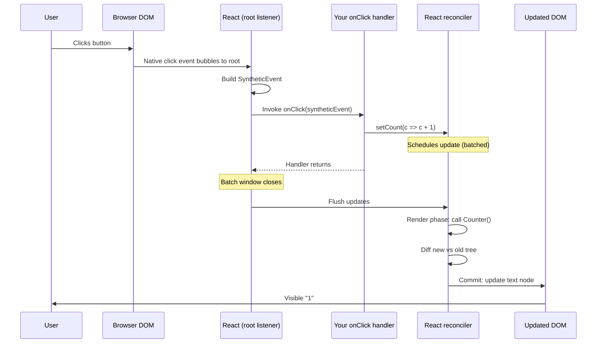
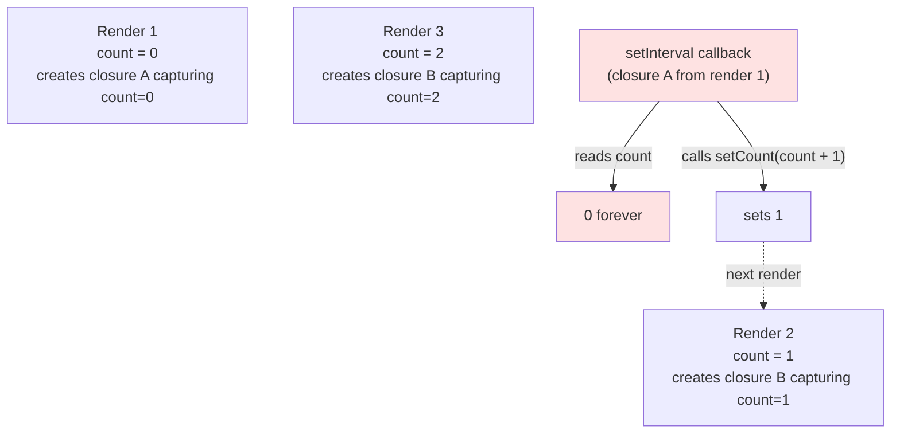
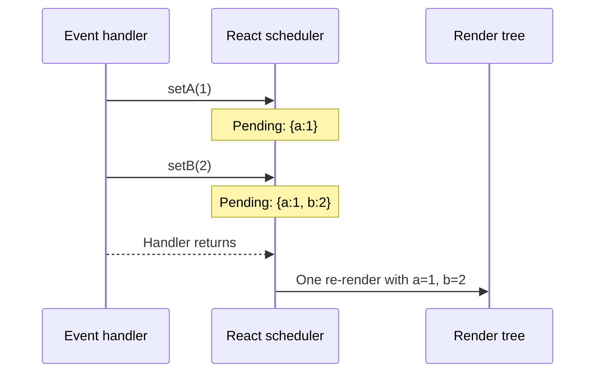

# 3.3 State and Events

> State is a component's memory. Events are how the user changes that memory. React's `useState` hook and its synthetic event system together form the loop that powers every interactive React app: user does something  -->  event fires  -->  state changes  -->  React re-renders  -->  DOM updates  -->  user sees the result. Understanding the subtleties — batching, stale closures, the async nature of `setState` — is what separates a React developer from a React engineer.

## 3.3.1 Objective

By the end of this note you should be able to:

1. Define state and explain why props alone are not enough.
2. Use `useState` correctly, including lazy initial state and the updater-function form.
3. Explain why state updates are "async" and what that actually means.
4. Recognize and fix the stale closure problem.
5. Describe React's automatic batching and what changed in React 18.
6. Handle DOM events in React, including `preventDefault` and `stopPropagation`.
7. Distinguish controlled from uncontrolled inputs at the conceptual level.
8. Explain why you cannot read updated state immediately after `setState` and what to do instead.

## 3.3.2 Background Knowledge

Before reading further, make sure you are comfortable with:

- **JavaScript closures.** A function "closes over" the variables in scope at the time it was created. Every render of a React component creates new closures. This is the source of the "stale closure" problem.
- **Event listeners in plain DOM.** `element.addEventListener('click', handler)`, `event.preventDefault()`, `event.stopPropagation()`. React wraps these.
- **`Promise` and microtasks.** State updates are not Promises, but understanding the difference between sync, microtask, and macrotask helps you reason about when React flushes updates.
- **The render pipeline from [[3.1 JSX and Rendering]]** — trigger  -->  render  -->  reconcile  -->  commit.
- **`useState` basics.** You've seen `const [count, setCount] = useState(0)`; this note goes deeper.

## 3.3.3 Core Concepts

### 3.3.3.1 What Is State?

State is the **memory of a component**. It is the data that:

1. Can change over the lifetime of a component instance.
2. When it changes, triggers a re-render.
3. Is private to the component — siblings don't see it; only descendants receive it via props.

If a value never changes, it's not state; it's a constant or a derived value. If a value changes but doesn't trigger a re-render, it's not React state; it's a `useRef` (see [[3.6 Hooks (Built-In)]]). If a value is needed by many components at different levels of the tree, it might belong in Context (see [[3.9 Context and Reducers]]).

> [!note] Why not just use a variable?
> ```js
> let count = 0;
> function Counter() {
>   return <button onClick={() => count++}>{count}</button>;
> }
> ```
> This does not work. Mutating `count` does not tell React to re-render, so the displayed value never updates. React needs an explicit "this value changed, please re-render" signal — that's what `setCount` provides.

### 3.3.3.2 Why Props Alone Are Not Enough

Props are read-only. A component cannot change its own props. If a counter had no state and only used props, the parent would have to own the count, pass it down, and pass a callback up. That works for one component but doesn't scale: every interactive component would force its parent to manage its data. State lets a component own its own memory, keeping parents clean.

The division of labor:
- **Props** — configuration from parent. Read-only.
- **State** — private mutable memory. Trigger re-renders when changed.
- **Derived values** — computed from props/state on each render. Not stored; just `const fullName = `${first} ${last}``.

### 3.3.3.3 `useState` Signature and Returns

```jsx
const [state, setState] = useState(initialValue);
```

- `initialValue` — can be any value, or a function `() => initialValue` (lazy init).
- `state` — the current value for this render.
- `setState` — a function that schedules an update. Stable identity across renders.

Returns a 2-element tuple. The name `useState` is a hook (see [[3.6 Hooks (Built-In)]]); the destructuring names are up to you, but `state`/`setState` or `x`/`setX` is universal.

### 3.3.3.4 Lazy Initial State

If the initial state is expensive to compute (e.g., parsing JSON from localStorage), pass a function:

```jsx
// Bad — runs on every render, even though only the first matters
const [data, setData] = useState(JSON.parse(localStorage.getItem("data") || "[]"));

// Good — runs only on the first render
const [data, setData] = useState(() => JSON.parse(localStorage.getItem("data") || "[]"));
```

React calls the function once on mount, then ignores it on subsequent renders. This is the "lazy initializer" pattern. Use it whenever the initial value involves non-trivial computation, I/O, or a side effect that should only happen once.

> [!warning] Don't put side effects in lazy initializers
> A lazy initializer should be pure. Don't `fetch` data or `console.log` inside it — those belong in `useEffect` (see [[3.8 Effects and Side Effects]]). Reading from `localStorage` is borderline; treat it as a pure read for practical purposes.

### 3.3.3.5 The Updater Function Form

`setState` accepts either a value or a function:

```jsx
// Value form — fine when the new state does not depend on the previous
setCount(0);
setName("Sam");
setOpen(true);

// Updater function form — required when new state depends on previous
setCount(prev => prev + 1);
setItems(prev => [...prev, newItem]);
setCount(prev => prev * 2);
```

**Why the updater form matters.** State updates are batched and async. If you call `setCount(count + 1)` twice in a row, both calls compute `count + 1` from the **same** `count` (the value captured in this render's closure). React applies them in order but both produce the same value: you get `count + 1`, not `count + 2`.

```jsx
function Bad() {
  const [count, setCount] = useState(0);
  const doubleIncrement = () => {
    setCount(count + 1);  // count is 0 here  -->  schedules 1
    setCount(count + 1);  // count is STILL 0 here  -->  schedules 1 again
  };
  return <button onClick={doubleIncrement}>{count}</button>;
  // Clicking once shows 1, not 2.
}

function Good() {
  const [count, setCount] = useState(0);
  const doubleIncrement = () => {
    setCount(prev => prev + 1);  // schedules 1
    setCount(prev => prev + 1);  // schedules 2 (based on the pending 1)
  };
  return <button onClick={doubleIncrement}>{count}</button>;
  // Clicking once shows 2. Correct.
}
```

**Rule of thumb:** if the new state depends on the old state, always use the updater function form. It costs nothing and prevents an entire class of bugs.

### 3.3.3.6 Batching of State Updates

React batches multiple `setState` calls into a single re-render. Before React 18, batching happened only inside React event handlers. Starting with React 18, batching is **automatic everywhere** — promises, timeouts, native event listeners, anywhere.

```jsx
function App() {
  const [a, setA] = useState(0);
  const [b, setB] = useState(0);

  const handleClick = async () => {
    // React 17: batched  -->  one re-render
    setA(1);
    setB(2);

    await fetch("/api");
    // React 17: NOT batched  -->  two re-renders
    // React 18+: batched  -->  one re-render
    setA(2);
    setB(3);
  };
  return <button onClick={handleClick}>{a},{b}</button>;
}
```

If you ever need to opt out of batching (rare), use `flushSync` from `react-dom`. The most common legitimate use is reading layout from the DOM immediately after a state update:

```jsx
import { flushSync } from "react-dom";

function handleClick() {
  flushSync(() => {
    setToggle(true);
  });
  // DOM is updated here; you can measure it
  const height = ref.current.offsetHeight;
}
```

### 3.3.3.7 The Stale Closure Problem

Every render of a component creates new closures. A handler created on render N captures the values from render N. If render N+1 happens before the handler runs, the handler still sees N's values.

```jsx
function Stale() {
  const [count, setCount] = useState(0);

  useEffect(() => {
    const id = setInterval(() => {
      // This closure is created once, on mount.
      // It captures count = 0 forever.
      setCount(count + 1);  // always sets to 1
    }, 1000);
    return () => clearInterval(id);
  }, []);

  return <span>{count}</span>;
}
```

**Fixes:**
1. Use the updater function form: `setCount(c => c + 1)`. The updater receives the latest pending state, bypassing the closure.
2. Add `count` to the effect's dependency array. This recreates the interval on every change. Works but less efficient.
3. Use a `useRef` to hold the latest value (the "latest value pattern").

The updater form is almost always the right answer.

### 3.3.3.8 State vs Props

| Aspect | State | Props |
|---|---|---|
| Mutability | Mutable (via setter) | Read-only |
| Ownership | Component itself | Parent |
| Trigger re-render | Yes, when changed | Yes, when parent re-renders |
| Initial value | `useState(initial)` | Passed by parent |
| Scope | Private to component | Received from parent, passed to children |

A common confusion: a parent's state becomes a child's props. The state "lives" in the parent; the child sees it as props. When the parent's state changes, the child receives new props and re-renders.

### 3.3.3.9 Events in React — Synthetic Events

React wraps native DOM events in a `SyntheticEvent` — a cross-browser wrapper with the same API as the native event. This used to matter a lot for IE11 support; today it matters less but still smooths over a few edge cases (e.g., `onChange` fires on every keystroke in React, unlike in plain DOM where it fires on blur for text inputs).

```jsx
function Form() {
  const [text, setText] = useState("");
  const handleSubmit = (e) => {
    e.preventDefault(); // Stop the form from reloading the page
    console.log("Submitted:", text);
  };
  const handleChange = (e) => {
    setText(e.target.value);
  };
  return (
    <form onSubmit={handleSubmit}>
      <input value={text} onChange={handleChange} />
      <button type="submit">Save</button>
    </form>
  );
}
```

The common event handlers in React:

| React prop | Native event | When it fires |
|---|---|---|
| `onClick` | `click` | Mouse click or Enter on focused button |
| `onChange` | `input` (for text) / `change` (for others) | Every keystroke for text inputs |
| `onSubmit` | `submit` | Form submission (button[type=submit] or Enter) |
| `onKeyDown` / `onKeyUp` / `onKeyPress` | `keydown` / `keyup` / `keypress` | Keyboard interaction |
| `onMouseOver` / `onMouseOut` | `mouseover` / `mouseout` | Mouse enters/leaves |
| `onFocus` / `onBlur` | `focus` / `blur` | Element gains/loses focus |
| `onInput` | `input` | Same as `onChange` for text in practice |

> [!note] `onChange` vs `onInput`
> In React, `onChange` on a text input fires on every keystroke (it aliases `input`). In plain HTML, `change` fires when the input loses focus. This is a deliberate React choice to make controlled inputs work naturally. Don't fight it.

### 3.3.3.10 The Event Object

The event object passed to your handler has these commonly-used properties:

- `e.target` — the element that fired the event (e.g., the `<input>` for `onChange`).
- `e.currentTarget` — the element the listener is attached to (usually the same, but differs during bubbling).
- `e.preventDefault()` — cancels the default behavior (form submit, link navigation, checkbox toggle).
- `e.stopPropagation()` — stops the event from bubbling to parent elements.
- `e.nativeEvent` — the underlying native DOM event, for escape hatches.
- `e.type`, `e.key`, `e.code`, `e.clientX`, `e.clientY`, `e.button`, etc.

> [!warning] Pooled events (legacy)
> In React 16 and earlier, synthetic events were "pooled" — properties were nullified after the handler returned, so you couldn't `await` and then read `e.target.value`. React 17+ removed event pooling. If you see `e.persist()` in old code, that was the workaround; it's no longer needed.

### 3.3.3.11 `preventDefault` and `stopPropagation`

```jsx
function Card({ onClick }) {
  const handleInnerClick = (e) => {
    e.stopPropagation(); // Clicks inside don't bubble to Card's onClick
    doSomething();
  };
  return (
    <div onClick={onClick}>
      <button onClick={handleInnerClick}>X</button>
    </div>
  );
}
```

```jsx
function Link({ href, children }) {
  const handleClick = (e) => {
    e.preventDefault(); // Don't navigate
    customRouter.push(href);
  };
  return <a href={href} onClick={handleClick}>{children}</a>;
}
```

- `preventDefault` stops the browser's default action (form submit, link navigation).
- `stopPropagation` stops the event from bubbling (or capturing) up/down the DOM tree.
- They are independent — you can call either or both.

### 3.3.3.12 Controlled vs Uncontrolled Inputs (Preview)

A controlled input is one where `value` is driven by React state. An uncontrolled input is one where React doesn't track the value; you read it via `ref` when needed.

```jsx
// Controlled
const [name, setName] = useState("");
return <input value={name} onChange={(e) => setName(e.target.value)} />;

// Uncontrolled
const inputRef = useRef();
return <input ref={inputRef} defaultValue="" />; // Read inputRef.current.value later
```

React's official guidance is to prefer controlled. The full treatment is in [[3.4 Forms and Conditional Rendering]].

### 3.3.3.13 The Async Nature of `setState`

`setState` does not immediately update the state variable. It schedules an update. The next render will see the new value, but the current render keeps seeing the old.

```jsx
function Confusing() {
  const [count, setCount] = useState(0);
  const handleClick = () => {
    setCount(count + 1);
    console.log(count); // Still logs 0!
  };
  return <button onClick={handleClick}>{count}</button>;
}
```

`count` in the closure is `0` until the next render. `setCount(1)` schedules a re-render, but the current function continues with the captured `0`. You cannot read the updated state synchronously after `setState`.

**How to read the updated value:**
1. Use the updater function form: `setCount(prev => { console.log(prev); return prev + 1; })`. The updater receives the latest pending value.
2. Use `useEffect` to react to the change after commit:
   ```jsx
   useEffect(() => { console.log(count); }, [count]);
   ```
3. Compute the new value before calling setState:
   ```jsx
   const next = count + 1;
   setCount(next);
   console.log(next);
   ```

What you **cannot** do is `await setState(...)` — it returns `void`, not a Promise.

## 3.3.4 Detailed Walkthrough

Let's trace a click on a counter button end-to-end.

```jsx
function Counter() {
  const [count, setCount] = useState(0);
  return <button onClick={() => setCount(c => c + 1)}>{count}</button>;
}
```

1. **Mount.** React renders `Counter()`. `useState(0)` returns `[0, setCount]`. The button's text is "0". A click listener is attached via `addEventListener('click', ...)` under the hood (React delegates to a single root listener in React 17+).
2. **User clicks.** The browser fires a native `click` event on the button. The event bubbles up to the root container where React has its single delegated listener.
3. **React dispatches synthetic event.** React creates a `SyntheticEvent`, walks the virtual tree from the root to the target, and invokes the `onClick` handler with the event.
4. **Handler runs.** `setCount(c => c + 1)` is called. React schedules an update: `pending = 0 + 1 = 1`. No re-render happens yet — updates are batched.
5. **End of handler.** React's batching window closes (the event handler returned). React commits to a re-render.
6. **Render phase.** React calls `Counter()` again. `useState(0)` returns `[1, setCount]` (the new value). The new element has children "1".
7. **Reconcile.** React diffs. The button text changed from "0" to "1". One text node update.
8. **Commit.** React calls `button.textContent = "1"` (or similar — actually it updates the text node directly).
9. **Browser paints.** The user sees "1".
10. **Effects run.** Any `useEffect` with `[count]` in deps runs.

The whole thing happens in a few milliseconds. The key insight: the handler doesn't wait for the render. It schedules and returns. The render happens after, in a separate phase.

## 3.3.5 Practical Examples

### 3.3.5.1 A toggle with multiple state updates

```jsx
function Modal() {
  const [isOpen, setIsOpen] = useState(false);
  const [content, setContent] = useState(null);

  const open = (c) => {
    setIsOpen(true);
    setContent(c);
    // React 18 batches these. One re-render.
  };
  const close = () => {
    setIsOpen(false);
    setContent(null);
  };

  return isOpen ? <div>{content}</div> : null;
}
```

### 3.3.5.2 Storing objects in state

```jsx
function Form() {
  const [form, setForm] = useState({ name: "", email: "" });

  const updateField = (e) => {
    // Updater function form, with object spread
    setForm(prev => ({ ...prev, [e.target.name]: e.target.value }));
  };

  return (
    <>
      <input name="name" value={form.name} onChange={updateField} />
      <input name="email" value={form.email} onChange={updateField} />
    </>
  );
}
```

> [!warning] Don't mutate nested state
> `setForm(prev => { prev.name = "x"; return prev; })` — this mutates the existing object. React's bail-out logic compares the returned value by reference; since the reference is the same, React may skip re-rendering. Always return a new object: `{ ...prev, name: "x" }`.

### 3.3.5.3 Updater function for derived state

```jsx
function TodoList() {
  const [todos, setTodos] = useState([]);

  const add = (text) => setTodos(prev => [...prev, { id: Date.now(), text, done: false }]);
  const toggle = (id) => setTodos(prev => prev.map(t => t.id === id ? { ...t, done: !t.done } : t));
  const remove = (id) => setTodos(prev => prev.filter(t => t.id !== id));

  return (
    <ul>
      {todos.map(t => (
        <li key={t.id}>
          <input type="checkbox" checked={t.done} onChange={() => toggle(t.id)} />
          {t.text}
          <button onClick={() => remove(t.id)}>x</button>
        </li>
      ))}
    </ul>
  );
}
```

Each handler uses the updater form because the new state depends on the previous list.

### 3.3.5.4 Stopping event propagation in a tree

```jsx
function Dropdown({ items, onSelect }) {
  const [open, setOpen] = useState(false);
  return (
    <div onClick={() => setOpen(false)}>  {/* Click outside closes */}
      <button onClick={(e) => { e.stopPropagation(); setOpen(o => !o); }}>
        Toggle
      </button>
      {open && (
        <ul onClick={(e) => e.stopPropagation()}>
          {items.map(item => (
            <li key={item.id} onClick={() => { onSelect(item); setOpen(false); }}>
              {item.label}
            </li>
          ))}
        </ul>
      )}
    </div>
  );
}
```

Without `stopPropagation`, clicking inside the menu would bubble to the outer `div`, closing the dropdown before `onSelect` could run.

## 3.3.6 Mermaid Diagrams

### 3.3.6.1 Click Event Flow Through React



### 3.3.6.2 The Stale Closure Problem



The interval was created in render 1 with closure A. Closure A forever sees `count = 0`. The fix is the updater form `setCount(c => c + 1)`, where `c` is supplied by React at flush time.

### 3.3.6.3 Batching



## 3.3.7 Common Mistakes

1. **Reading state right after `setState`.** `setCount(count + 1); console.log(count);` logs the old value. State is async; you cannot read it synchronously.

2. **Using the value form when the new state depends on the previous.** `setCount(count + 1)` called twice in a row only increments once. Use `setCount(c => c + 1)`.

3. **Mutating state objects.** `state.items.push(x); setState(state);` — React doesn't see a new reference and may skip re-rendering. Always create new objects/arrays.

4. **Forgetting `e.preventDefault()` on form submit.** Without it, the page reloads. Always call it in `onSubmit` handlers.

5. **Spreading events to async code without persisting (legacy React).** In React 16, you couldn't `await` then read `e.target.value` because the event was pooled. Use the value first: `const v = e.target.value; await fetch(...); doSomething(v)`. In React 17+ this is no longer needed, but reading the value eagerly is still good practice.

6. **Calling hooks conditionally.** `if (cond) useState(...)` violates the rules of hooks. Hooks must run in the same order every render. See [[3.6 Hooks (Built-In)]].

7. **Stale closures in setInterval/setTimeout.** A timer created in `useEffect([])` captures the initial values forever. Use the updater form or store the latest value in a ref.

8. **Using state for derived values.** `const [fullName, setFullName] = useState(`${first} ${last}`)` requires syncing in effects. Just compute: `const fullName = `${first} ${last}``. Don't store what you can derive.

9. **Putting non-serializable values in state.** Functions, class instances, DOM nodes — these usually don't belong in state. Use refs.

10. **Treating `setState` as a Promise.** `await setCount(1)` does nothing useful. `setState` returns `void`. Use `useEffect` to react to changes.

## 3.3.8 Best Practices

1. **Always use the updater function form when the new state depends on the previous state.** No exceptions. It's free and prevents bugs.

2. **Use lazy initialization for expensive initial values.** `useState(() => computeExpensiveThing())` runs once.

3. **Keep state minimal.** Every piece of state is a synchronization point. If you can derive it, derive it. If only one component uses it, don't lift it.

4. **Group related state into a single object** when they always change together. Use multiple `useState` calls when they change independently. `useReducer` is the middle ground for complex state machines — see [[3.9 Context and Reducers]].

5. **Co-locate state at the lowest common ancestor.** If two siblings need the same state, lift it to their parent. Don't lift higher than necessary.

6. **Name event handlers `handle*` for internal handlers and `on*` for props.** `handleSubmit` is internal; `onSubmit` is a prop. The distinction signals who owns the behavior.

7. **Always pass the event object to a named function, not an inline arrow, for non-trivial handlers.** Inline arrows are fine for one-liners; named functions are easier to test and reuse.

8. **Extract complex state logic into a custom hook** (see [[3.7 Custom Hooks]]). `useToggle`, `useCounter`, `useFormState` are all 5-line hooks that dramatically clean up components.

9. **Use `useReducer` when you have many state updates that interact.** A reducer centralizes the logic and makes state transitions explicit. See [[3.9 Context and Reducers]].

10. **Enable strict mode in development.** `<React.StrictMode>` double-invokes renders and effects to surface bugs you wouldn't otherwise see. It does not affect production.

## 3.3.9 Mini Exercises

### Exercise 1 — Fix the broken counter

This counter has a bug where clicking "+1" twice rapidly shows 1, not 2. Diagnose and fix.

```jsx
function Counter() {
  const [count, setCount] = useState(0);
  const incrementTwice = () => {
    setCount(count + 1);
    setCount(count + 1);
  };
  return <button onClick={incrementTwice}>{count}</button>;
}
```

**Solution.**

```jsx
function Counter() {
  const [count, setCount] = useState(0);
  const incrementTwice = () => {
    setCount(prev => prev + 1);
    setCount(prev => prev + 1);
  };
  return <button onClick={incrementTwice}>{count}</button>;
}
```

**Reasoning.** In the original, both `setCount(count + 1)` calls evaluate `count + 1` against the same captured `count` (0). Both schedule `1`. React applies them and ends at `1`. In the fix, the updater functions receive the pending state: the first updater sees `0` and returns `1`; the second updater sees `1` (the pending value) and returns `2`. React ends at `2`.

**Common wrong approach.** Using a `setTimeout` to read the updated value: doesn't work, adds latency, and the second call still sees the old closure.

### Exercise 2 — Fix the stale closure in setInterval

This component is supposed to count up every second, but it sticks at 1. Fix it.

```jsx
function Timer() {
  const [seconds, setSeconds] = useState(0);
  useEffect(() => {
    const id = setInterval(() => setSeconds(seconds + 1), 1000);
    return () => clearInterval(id);
  }, []);
  return <span>{seconds}s</span>;
}
```

**Solution (updater form — preferred).**

```jsx
function Timer() {
  const [seconds, setSeconds] = useState(0);
  useEffect(() => {
    const id = setInterval(() => setSeconds(s => s + 1), 1000);
    return () => clearInterval(id);
  }, []);
  return <span>{seconds}s</span>;
}
```

**Alternative (deps array).**

```jsx
function Timer() {
  const [seconds, setSeconds] = useState(0);
  useEffect(() => {
    const id = setInterval(() => setSeconds(seconds + 1), 1000);
    return () => clearInterval(id);
  }, [seconds]);
  return <span>{seconds}s</span>;
}
```

**Reasoning.** In the original, the interval is set up once with `seconds = 0` captured. Every tick calls `setSeconds(0 + 1)`, which always sets to `1`. The updater form `s => s + 1` lets React supply the latest pending state, so each tick increments correctly. The alternative puts `seconds` in deps, recreating the interval each second — works but creates/recreates the timer every tick.

**Common wrong approach.** Using a `useRef` to mirror `seconds`. Works but more code. The updater form is the simplest fix here.

### Exercise 3 — Build a form with derived state

Build a small signup form with `email` and `password` fields. Display a live "password strength" indicator (weak/medium/strong) that is **derived**, not stored in state.

**Solution.**

```jsx
import { useState } from "react";

function strength(pw) {
  let score = 0;
  if (pw.length >= 8) score++;
  if (/[A-Z]/.test(pw)) score++;
  if (/[0-9]/.test(pw)) score++;
  if (/[^A-Za-z0-9]/.test(pw)) score++;
  return ["weak", "medium", "strong", "strong"][score] || "weak";
}

function Signup() {
  const [email, setEmail] = useState("");
  const [password, setPassword] = useState("");

  const pwStrength = strength(password);  // Derived, not stored

  return (
    <form onSubmit={(e) => { e.preventDefault(); console.log({ email, password }); }}>
      <label>
        Email
        <input type="email" value={email} onChange={(e) => setEmail(e.target.value)} />
      </label>
      <label>
        Password
        <input type="password" value={password} onChange={(e) => setPassword(e.target.value)} />
      </label>
      <p>Strength: <strong>{pwStrength}</strong></p>
      <button type="submit">Sign up</button>
    </form>
  );
}
```

**Reasoning.** `pwStrength` is computed on every render from `password`. It's always in sync. If you tried to store it in state, you'd need a `useEffect` to sync it whenever `password` changed — extra code, extra re-renders, and a class of bugs where the stored value disagrees with the source.

**Common wrong approach.** `const [strength, setStrength] = useState(...)` with an effect that calls `setStrength(strengthOf(password))` whenever `password` changes. This is the "derived state anti-pattern" — React explicitly warns against it.

### Exercise 4 — Explain batching

In React 18+, how many times does the following component re-render when the button is clicked? Explain.

```jsx
function App() {
  const [a, setA] = useState(0);
  const [b, setB] = useState(0);
  const [c, setC] = useState(0);

  const handleClick = () => {
    setA(1);
    setB(2);
    setC(3);
  };

  return <button onClick={handleClick}>{a}{b}{c}</button>;
}
```

**Answer.** Exactly one re-render.

**Reasoning.** All three `setState` calls happen synchronously inside the same event handler. React 18+ automatically batches state updates from any context (event handlers, promises, timeouts, native listeners). The three updates are collected, then a single re-render is scheduled with `a=1, b=2, c=3`. Before React 18, batching only happened inside React event handlers; the same code in a `setTimeout` would have caused three re-renders. React 18 made this consistent across all contexts.

**Common wrong answer.** "Three re-renders, one per setState." That was the React 16/17 behavior outside of event handlers. Inside event handlers it was already batched.

### Exercise 5 — Build a controlled input with a complex event

Build a numeric input that:
- Only accepts digits.
- Caps the value at 100.
- Calls `onChange` with a number (not a string).
- Resets to 0 if the user clears the input.

**Solution.**

```jsx
function NumberInput({ value, onChange }) {
  const handleChange = (e) => {
    const raw = e.target.value;
    if (raw === "") {
      onChange(0);
      return;
    }
    if (!/^\d+$/.test(raw)) return;  // Reject non-digits
    const n = Math.min(parseInt(raw, 10), 100);
    onChange(n);
  };

  return (
    <input
      type="text"
      inputMode="numeric"
      value={value === 0 ? "" : String(value)}
      onChange={handleChange}
    />
  );
}
```

**Reasoning.** We use `type="text"` with `inputMode="numeric"` for mobile keyboards because `type="number"` lets the user type "e", "+", ".", which we'd have to filter anyway. The handler reads `e.target.value`, validates, clamps, and calls `onChange` with a number. The display uses `value === 0 ? "" : String(value)` so an empty input shows as empty (not "0") for a cleaner UX. The `value === 0` check lets us distinguish "user cleared the field" (shows empty) from "value is genuinely 0" (shows empty too — acceptable for this exercise; in production you might track "touched" state separately).

**Common wrong approaches.**
- Using `type="number"` and relying on the browser — non-numeric characters are silently ignored but the displayed string can disagree with `.value`, leading to confusing UX.
- Mutating the event or stopping propagation — unnecessary.
- Storing the string in state and parsing later — adds an extra state to manage and risks desync.

## 3.3.10 Summary

- State is a component's private mutable memory. `useState` is the basic hook.
- Use lazy initial state (`useState(() => ...)`) for expensive initializers.
- Use the updater function form (`setState(prev => ...)`) whenever the new state depends on the previous state.
- React 18+ batches state updates everywhere — event handlers, promises, timeouts.
- The stale closure problem is caused by handlers capturing old render values; the updater function form bypasses it.
- React events are wrapped in `SyntheticEvent`. `preventDefault` stops the browser default; `stopPropagation` stops bubbling.
- State updates are async. You cannot read the updated value synchronously after `setState` — use effects or the updater function.
- Controlled inputs (React owns the value) are the React way; uncontrolled (DOM owns the value, accessed via ref) is for escape hatches like file inputs.

## 3.3.11 Related Notes

- [[3.1 JSX and Rendering]] — what rendering means and how it's triggered.
- [[3.2 Components and Props]] — props vs state, the foundational distinction.
- [[3.4 Forms and Conditional Rendering]] — controlled inputs in depth, validation patterns.
- [[3.5 Lists and Keys]] — rendering arrays and the special `key` prop.
- [[3.6 Hooks (Built-In)]] — `useState` deep dive, plus `useReducer`, `useRef`, `useEffect`.
- [[3.7 Custom Hooks]] — extracting stateful logic.
- [[3.8 Effects and Side Effects]] — reacting to state changes after render.
- [[3.9 Context and Reducers]] — `useReducer` for complex state, Context for sharing.
- [[3.11 Performance Optimization]] — `useMemo`, `useCallback`, and when state updates cause unnecessary re-renders.
