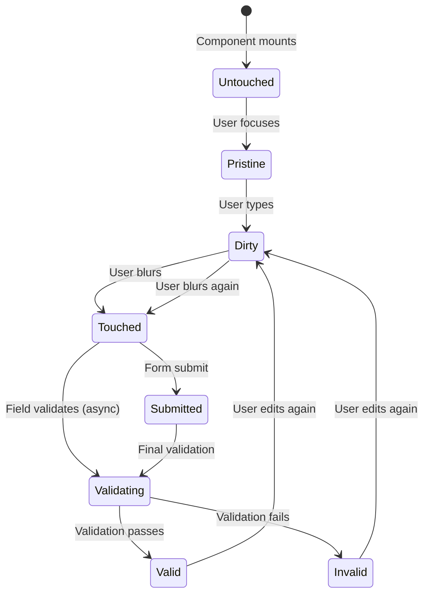
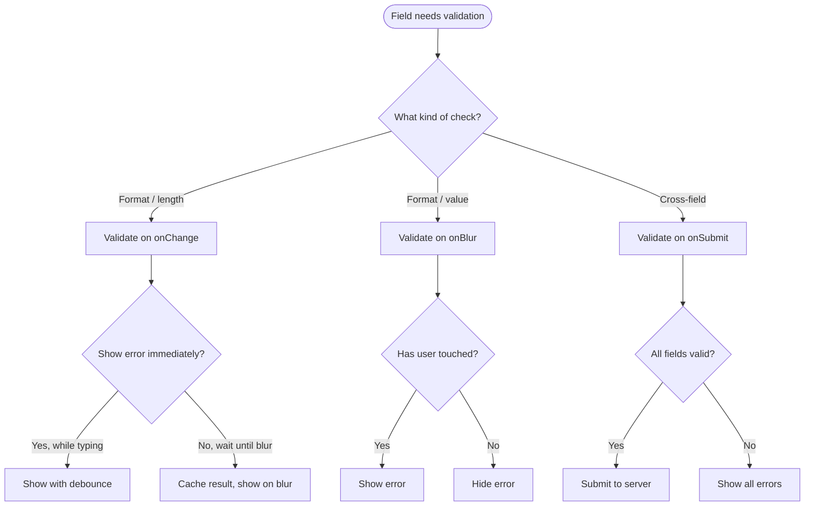

# 3.4 Forms and Conditional Rendering

> Forms are where React's controlled-component philosophy earns its keep. Instead of reading input values from the DOM at submit time, React drives every input's value from state. Combined with conditional rendering — deciding what to show based on state — you can build validation feedback, multi-step flows, and dynamic field visibility. This note covers the controlled patterns for every input type, validation strategies, and the gotchas that catch every React beginner once.

## 3.4.1 Objective

By the end of this note you should be able to:

1. Implement controlled versions of text, checkbox, radio, select, and textarea inputs.
2. Know which input types cannot be controlled (file) and how to handle them with refs.
3. Build a single-handler form state object using the `name` attribute pattern.
4. Choose between `onChange`, `onBlur`, and `onSubmit` validation strategies.
5. Apply all conditional rendering patterns (ternary, `&&`, switch, lookup object, early return, extracted component) and avoid the `0` gotcha.
6. Know when to reach for React Hook Form and Zod instead of hand-rolling.
7. Recognize why early returns in components are fine and useful.

## 3.4.2 Background Knowledge

Before reading further, make sure you are comfortable with:

- **Controlled vs uncontrolled inputs** from [[3.3 State and Events]].
- **The native HTML form elements** and their events — `<input>`, `<select>`, `<textarea>`, `<fieldset>`, `<form>`.
- **The `name` attribute** on form inputs — used by the browser to group form data on submit, and used by React to identify fields in a generic handler.
- **Event delegation and bubbling** — useful for listening at the form level.
- **Controlled component rules** from [[3.2 Components and Props]] — value + onChange for every controlled input.
- **`FormData` API** — the browser's built-in way to read a form's values as key-value pairs.

## 3.4.3 Core Concepts

### 3.4.3.1 Controlled Components — The React Way

A controlled component is one where React state is the **single source of truth** for the input's value. The pattern:

```jsx
const [text, setText] = useState("");
return <input value={text} onChange={(e) => setText(e.target.value)} />;
```

Two things must always be present:
1. `value` (or `checked` for checkboxes) bound to state.
2. `onChange` that updates that state.

If you have one without the other, React warns:
- `value` without `onChange`  -->  "You provided a `value` prop to a form field without an `onChange` handler. This will render a read-only field."
- `onChange` without `value`  -->  the input is uncontrolled, which is fine but loses React's control.

Why prefer controlled? Because the input value is always in your state, you can:
- Validate on every keystroke.
- Transform the input (e.g., uppercase, format phone numbers).
- Conditionally render based on it.
- Submit it without reading from the DOM.
- Reset the form by setting state back to initial.

### 3.4.3.2 Controlled Patterns by Input Type

**Text input:**

```jsx
const [name, setName] = useState("");
<input value={name} onChange={(e) => setName(e.target.value)} />
```

**Textarea:**

```jsx
const [bio, setBio] = useState("");
<textarea value={bio} onChange={(e) => setBio(e.target.value)} />
```

Note: in HTML, `<textarea>` content goes between tags. In React, it uses the `value` attribute. (Pre-React, you wrote `<textarea>Initial</textarea>`; in React you write `<textarea value={initial} onChange={...} />`.)

**Checkbox:**

```jsx
const [agree, setAgree] = useState(false);
<input type="checkbox" checked={agree} onChange={(e) => setAgree(e.target.checked)} />
```

Use `checked` (not `value`) and `e.target.checked` (not `e.target.value`).

**Radio group:**

```jsx
const [color, setColor] = useState("red");
<>
  <label><input type="radio" name="color" value="red"   checked={color === "red"}   onChange={() => setColor("red")} /> Red</label>
  <label><input type="radio" name="color" value="green" checked={color === "green"} onChange={() => setColor("green")} /> Green</label>
  <label><input type="radio" name="color" value="blue"  checked={color === "blue"}  onChange={() => setColor("blue")} /> Blue</label>
</>
```

Each radio uses `checked={value === "thisValue"}` and `onChange={() => setValue("thisValue")}`. The `name` attribute groups them for accessibility but React doesn't need it for state.

**Select (single):**

```jsx
const [fruit, setFruit] = useState("apple");
<select value={fruit} onChange={(e) => setFruit(e.target.value)}>
  <option value="apple">Apple</option>
  <option value="banana">Banana</option>
</select>
```

Note: in HTML, you'd put `selected` on the `<option>`. In React, you put `value` on the `<select>` itself.

**Select (multiple):**

```jsx
const [fruits, setFruits] = useState([]);
<select multiple value={fruits} onChange={(e) => {
  const selected = Array.from(e.target.selectedOptions).map(o => o.value);
  setFruits(selected);
}}>
  <option value="apple">Apple</option>
  <option value="banana">Banana</option>
</select>
```

Multiple selects are awkward — you read `e.target.selectedOptions` and convert to an array.

**File input (uncontrolled — cannot be controlled):**

```jsx
const fileRef = useRef();
<input type="file" ref={fileRef} />
// Read on submit:
const file = fileRef.current?.files?.[0];
```

> [!warning] File inputs cannot be controlled
> React explicitly forbids setting `value` on a file input — the browser would have to allow JavaScript to set the user's chosen file, which would be a security hole. Read file inputs via `ref`. Use `defaultValue` if you want to clear it.

### 3.4.3.3 The `name` Attribute Pattern for Generic Handlers

When a form has many fields, writing a handler per field is tedious. Use the `name` attribute to dispatch in one handler:

```jsx
function SignupForm() {
  const [form, setForm] = useState({ email: "", password: "", name: "" });

  const handleChange = (e) => {
    const { name, value, type, checked } = e.target;
    setForm(prev => ({
      ...prev,
      [name]: type === "checkbox" ? checked : value,
    }));
  };

  return (
    <form>
      <input name="email"    type="email"    value={form.email}    onChange={handleChange} />
      <input name="password" type="password" value={form.password} onChange={handleChange} />
      <input name="name"     type="text"     value={form.name}     onChange={handleChange} />
      <label>
        <input name="agree" type="checkbox" checked={form.agree} onChange={handleChange} />
        I agree
      </label>
    </form>
  );
}
```

This pattern scales to dozens of fields with one handler. The `name` attribute becomes the key into the state object. Type-checking handles the checkbox case.

### 3.4.3.4 The `FormData` Pattern with `onSubmit`

For forms submitted via JS (e.g., to a server action), you can skip controlled state entirely and read the form with `FormData` on submit:

```jsx
function LoginForm() {
  const handleSubmit = (e) => {
    e.preventDefault();
    const data = new FormData(e.currentTarget);
    const email = data.get("email");
    const password = data.get("password");
    console.log({ email, password });
  };
  return (
    <form onSubmit={handleSubmit}>
      <input name="email" type="email" />
      <input name="password" type="password" />
      <button type="submit">Log in</button>
    </form>
  );
}
```

This is the uncontrolled-by-default pattern that Next.js Server Actions favor. It's simpler for simple forms, avoids re-rendering on every keystroke, and pairs naturally with progressive enhancement (the form works without JS).

### 3.4.3.5 Form Validation Strategies

Three main strategies, each with trade-offs:

**Validate on `onChange` (every keystroke):**
- Pro: instant feedback.
- Con: annoying when the user is mid-type ("email is invalid" while they're still typing the local part).
- Best for: format validation (uppercase, max length), availability checks (username taken?).

**Validate on `onBlur` (when the field loses focus):**
- Pro: respects the user's typing flow; validates when they think they're done.
- Con: feedback comes late; user might submit before blurring.
- Best for: most field-level validation.

**Validate on `onSubmit` (when the form submits):**
- Pro: complete picture, validates cross-field (password confirmation).
- Con: feedback is delayed until the user submits.
- Best for: cross-field validation, final submit-time checks.

**Recommended hybrid:** `onBlur` for field validation, `onSubmit` for cross-field and final validation, optionally `onChange` for format/length hints. Show errors only after the field has been touched (blurred at least once) to avoid yelling at users who haven't finished.

```jsx
function Field({ label, value, onChange, error, touched, onBlur }) {
  return (
    <label>
      {label}
      <input value={value} onChange={onChange} onBlur={onBlur} />
      {touched && error && <span className="error">{error}</span>}
    </label>
  );
}
```

### 3.4.3.6 Conditional Rendering Patterns (Revisited)

The full toolkit:

**Ternary** — for two-way branches:
```jsx
{isSubmitting ? <Spinner /> : <SaveButton />}
```

**`&&`** — for one-way branches. Beware `0`:
```jsx
{hasError && <ErrorMessage />}
{count > 0 && <Badge value={count} />}  // Don't write {count && ...}
```

**`switch`** — for many discrete branches:
```jsx
function render() {
  switch (status) {
    case "loading": return <Spinner />;
    case "error":   return <Error />;
    case "ready":   return <Data />;
    default:        return null;
  }
}
```

**Lookup object** — for many branches that are simple components:
```jsx
const VIEWS = { loading: Spinner, error: Error, ready: Data };
const View = VIEWS[status];
return <View />;
```

**Early return** — for guard clauses:
```jsx
function Profile({ user }) {
  if (!user) return <Login />;
  if (user.isBanned) return <Banned />;
  return <Dashboard user={user} />;
}
```

**Extracted component** — for non-trivial logic:
```jsx
function Header({ user }) {
  return (
    <header>
      <Logo />
      <UserMenu user={user} />
    </header>
  );
}
```

### 3.4.3.7 The Falsy Value Gotcha with `&&`

```jsx
{count && <Badge value={count} />}
```

When `count === 0`, this renders `0` — the literal text "0" — because `0` is a falsy value but it's also a valid React child (React renders numbers). Same for `""` (empty string), but you usually don't notice because it's invisible.

Fixes:
- `{count > 0 && <Badge value={count} />}` — explicit boolean.
- `{Boolean(count) && <Badge value={count} />}` — coerce.
- `{count ? <Badge value={count} /> : null}` — ternary.
- `{!!count && <Badge value={count} />}` — double-bang.

> [!danger] This is the single most common React UI bug
> If you ever see a stray `0` or empty string in your UI, suspect `&&` with a numeric or string left-hand side. ESLint with `react/jsx-no-leaked-render` catches this.

### 3.4.3.8 Early Returns Are Fine

Many beginners think a React component must end in a single `return JSX` line. It doesn't. Early returns are perfectly idiomatic:

```jsx
function UserAvatar({ user }) {
  if (!user) return <Placeholder />;
  if (user.isDeleted) return <DeletedBadge />;
  if (user.avatarUrl) return ;
  return <Initials name={user.name} />;
}
```

This reads like prose. Each guard is one line. The alternative — a giant nested ternary — is harder to read and harder to test.

> [!note] Hooks must still run before any return
> You cannot put an early return above a hook call. Hooks must run in the same order every render. So call all hooks at the top of the component, then early-return.

### 3.4.3.9 React Hook Form (Brief Mention)

`react-hook-form` is the most popular form library. It:
- Uses uncontrolled inputs by default (less re-rendering).
- Provides `register` for binding fields.
- Has built-in validation and integrates with Zod/Yup/Joi via resolvers.
- Handles nested fields, arrays, and dynamic schemas.

```jsx
import { useForm } from "react-hook-form";

function Signup() {
  const { register, handleSubmit, formState: { errors } } = useForm();
  const onSubmit = (data) => console.log(data);
  return (
    <form onSubmit={handleSubmit(onSubmit)}>
      <input {...register("email", { required: true, pattern: /^\S+@\S+$/ })} />
      {errors.email && <span>Email is required</span>}
      <input type="password" {...register("password", { minLength: 8 })} />
      {errors.password && <span>Min 8 chars</span>}
      <button type="submit">Sign up</button>
    </form>
  );
}
```

Use React Hook Form for forms with many fields, complex validation, or performance sensitivity. For simple forms, controlled state is fine.

### 3.4.3.10 Zod for Validation

Zod is a schema validation library that lets you define types and validators in one place:

```jsx
import { z } from "zod";

const SignupSchema = z.object({
  email: z.string().email(),
  password: z.string().min(8).max(64),
  age: z.number().int().min(18),
});

// Use with react-hook-form via @hookform/resolvers/zod
const { register, handleSubmit } = useForm({
  resolver: zodResolver(SignupSchema),
});

// Or use directly
const result = SignupSchema.safeParse(formData);
if (!result.success) {
  const errors = result.error.flatten();
}
```

Zod schemas can be shared between client and server (especially useful in Next.js Server Actions — see [[4.7 Server Actions and Forms]]), giving you end-to-end type safety and validation.

## 3.4.4 Detailed Walkthrough

Let's build a multi-field signup form with validation, combining everything.

```jsx
import { useState } from "react";

const initialForm = { name: "", email: "", password: "", confirm: "", agree: false };

function SignupForm() {
  const [form, setForm] = useState(initialForm);
  const [errors, setErrors] = useState({});
  const [touched, setTouched] = useState({});
  const [submitting, setSubmitting] = useState(false);

  const handleChange = (e) => {
    const { name, value, type, checked } = e.target;
    setForm(prev => ({ ...prev, [name]: type === "checkbox" ? checked : value }));
    // Live-clear errors when the user fixes them
    if (errors[name]) {
      setErrors(prev => ({ ...prev, [name]: undefined }));
    }
  };

  const handleBlur = (e) => {
    const { name } = e.target;
    setTouched(prev => ({ ...prev, [name]: true }));
    const error = validateField(name, form[name], form);
    setErrors(prev => ({ ...prev, [name]: error }));
  };

  const validateField = (name, value, allForm) => {
    switch (name) {
      case "name":     return value.length < 2 ? "Name too short" : undefined;
      case "email":    return /^\S+@\S+\.\S+$/.test(value) ? undefined : "Invalid email";
      case "password": return value.length < 8 ? "Min 8 characters" : undefined;
      case "confirm":  return value !== allForm.password ? "Doesn't match" : undefined;
      case "agree":    return !value ? "You must agree" : undefined;
      default:         return undefined;
    }
  };

  const handleSubmit = async (e) => {
    e.preventDefault();
    // Mark all fields as touched
    const allTouched = Object.keys(form).reduce((acc, k) => ({ ...acc, [k]: true }), {});
    setTouched(allTouched);
    // Validate all
    const newErrors = {};
    for (const field of Object.keys(form)) {
      const err = validateField(field, form[field], form);
      if (err) newErrors[field] = err;
    }
    setErrors(newErrors);
    if (Object.keys(newErrors).length > 0) return;
    // Submit
    setSubmitting(true);
    try {
      await fetch("/api/signup", { method: "POST", body: JSON.stringify(form) });
    } finally {
      setSubmitting(false);
    }
  };

  return (
    <form onSubmit={handleSubmit}>
      <Field label="Name" name="name" value={form.name}
        onChange={handleChange} onBlur={handleBlur}
        error={touched.name && errors.name} />

      <Field label="Email" name="email" type="email" value={form.email}
        onChange={handleChange} onBlur={handleBlur}
        error={touched.email && errors.email} />

      <Field label="Password" name="password" type="password" value={form.password}
        onChange={handleChange} onBlur={handleBlur}
        error={touched.password && errors.password} />

      <Field label="Confirm" name="confirm" type="password" value={form.confirm}
        onChange={handleChange} onBlur={handleBlur}
        error={touched.confirm && errors.confirm} />

      <label>
        <input type="checkbox" name="agree" checked={form.agree}
          onChange={handleChange} onBlur={handleBlur} />
        I agree to the terms
      </label>
      {touched.agree && errors.agree && <span className="error">{errors.agree}</span>}

      <button type="submit" disabled={submitting}>
        {submitting ? "Creating..." : "Sign up"}
      </button>
    </form>
  );
}

function Field({ label, name, value, onChange, onBlur, error, type = "text" }) {
  return (
    <label>
      {label}
      <input name={name} type={type} value={value} onChange={onChange} onBlur={onBlur} />
      {error && <span className="error">{error}</span>}
    </label>
  );
}
```

The patterns in play:
- **Single state object** for all field values.
- **Single `handleChange`** using the `name` attribute.
- **Single `handleBlur`** that marks the field touched and validates.
- **Cross-field validation** in `handleSubmit` (the `confirm` field depends on `password`).
- **Conditional error display** — `touched[field] && errors[field]` — so errors only show after the user has interacted.
- **Disabled submit button** while submitting.
- **Extracted `Field` component** for consistency.

This is a fully production-grade form shape. For more complex forms, you'd reach for React Hook Form + Zod to avoid rewriting this scaffolding each time.

## 3.4.5 Practical Examples

### 3.4.5.1 Conditional fields based on a select

```jsx
function ContactForm() {
  const [contactMethod, setContactMethod] = useState("email");
  return (
    <form>
      <select value={contactMethod} onChange={(e) => setContactMethod(e.target.value)}>
        <option value="email">Email</option>
        <option value="phone">Phone</option>
        <option value="mail">Mail</option>
      </select>

      {contactMethod === "email" && (
        <input name="email" type="email" placeholder="you@example.com" />
      )}
      {contactMethod === "phone" && (
        <input name="phone" type="tel" placeholder="+1..." />
      )}
      {contactMethod === "mail" && (
        <textarea name="address" placeholder="Street address" />
      )}
    </form>
  );
}
```

### 3.4.5.2 Multi-step form with state machine

```jsx
function MultiStep() {
  const [step, setStep] = useState(1);
  const [data, setData] = useState({});

  return (
    <div>
      {step === 1 && <Step1 data={data} setData={setData} onNext={() => setStep(2)} />}
      {step === 2 && <Step2 data={data} setData={setData} onBack={() => setStep(1)} onNext={() => setStep(3)} />}
      {step === 3 && <Step3 data={data} onBack={() => setStep(2)} onSubmit={submit} />}
    </div>
  );
}
```

The `step` state acts as a finite state machine. Each step is conditionally rendered. Data persists in the parent.

### 3.4.5.3 Field-level error with lookup object

```jsx
function Status({ status }) {
  const VIEWS = {
    idle: () => null,
    typing: () => <Hint />,
    validating: () => <Spinner size="sm" />,
    valid: () => <CheckIcon />,
    invalid: () => <XIcon />,
  };
  const View = VIEWS[status] ?? VIEWS.idle;
  return <View />;
}
```

### 3.4.5.4 File upload with preview

```jsx
function AvatarUpload() {
  const fileRef = useRef();
  const [preview, setPreview] = useState(null);

  const handleChange = (e) => {
    const file = e.target.files?.[0];
    if (!file) return;
    const url = URL.createObjectURL(file);
    setPreview(url);
  };

  return (
    <div>
      <input type="file" accept="image/*" ref={fileRef} onChange={handleChange} />
      {preview && }
    </div>
  );
}
```

Note the `URL.createObjectURL` for preview — and remember to call `URL.revokeObjectURL` in cleanup if you keep the URL around.

## 3.4.6 Mermaid Diagrams

### 3.4.6.1 Form Field Lifecycle



### 3.4.6.2 Validation Strategy Decision Tree



### 3.4.6.3 Controlled Input Data Flow

```mermaid
flowchart LR
    U[User types 'S'] --> E[Browser input event]
    E --> H[onChange handler]
    H --> S["setState(value + 'S')"]
    S --> R[React schedules re-render]
    R --> N[Component re-renders]
    N --> I["<input value='S'>"]
    I --> D[DOM updated to show 'S']
```



## 3.4.7 Common Mistakes

1. **Forgetting `e.preventDefault()` in `onSubmit`.** The browser submits the form, reloading the page. Always prevent it.

2. **Using `value` without `onChange` (or vice versa).** React warns about a read-only field. The fix: provide both, or use `defaultValue`/`defaultChecked` for uncontrolled.

3. **The `0` from `&&`.** `{count && <Badge/>}` renders "0" when count is 0. Use `{count > 0 && <Badge/>}` or coerce.

4. **Mutating form state.** `form.email = "x"; setForm(form);` — same reference, React may skip re-rendering. Use `setForm(prev => ({ ...prev, email: "x" }))`.

5. **Validating on every keystroke.** Annoying UX. Validate on blur or on submit for value checks; only validate format live.

6. **Forgetting `name` on inputs.** The generic-handler pattern needs `name`. Without it, the handler can't tell which field fired.

7. **Treating file inputs as controlled.** React forbids `value` on `<input type="file">`. Use `ref`.

8. **Putting `<button>` without `type` inside a form.** Default `type` is `submit` — clicking it submits the form unexpectedly. Use `type="button"` for non-submit buttons.

9. **Showing errors before the user has touched the field.** The user opens the form, sees every field red. Distracting. Track `touched` per field.

10. **Not disabling the submit button during async submit.** User clicks twice, submits twice. Always disable while `submitting`.

## 3.4.8 Best Practices

1. **Use one state object per form, one generic handler.** Scales to dozens of fields without code duplication.

2. **Show errors only after a field is touched.** Track `touched[field]`. Reset on submit.

3. **Validate on blur for field-level checks, on submit for cross-field.** Avoid `onChange` for value validation; use it only for format hints.

4. **Disable the submit button while submitting.** Prevents double-submits.

5. **Always `e.preventDefault()` in `onSubmit`** unless you actually want the page to reload (which you never do in a SPA).

6. **Use `type="button"` for non-submit buttons inside forms.** Otherwise the browser submits the form on click.

7. **Reset the form on successful submit.** Either `setForm(initialForm)` or, in uncontrolled, `e.currentTarget.reset()`.

8. **For complex forms, use React Hook Form + Zod.** Don't hand-roll validation for forms with 10+ fields. The libraries are battle-tested and faster than rolling your own.

9. **Co-locate field components and their validation.** Don't sprinkle validation across files; keep the field definition, schema, and UI together.

10. **Use `FormData` for simple submit-only forms** (especially with Next.js Server Actions). Avoids re-rendering on every keystroke and enables progressive enhancement.

## 3.4.9 Mini Exercises

### Exercise 1 — Build a controlled checkbox group

Build a "select your interests" form with 5 checkboxes (Sports, Music, Reading, Cooking, Travel). State is an array of selected strings. Provide a generic handler.

**Solution.**

```jsx
import { useState } from "react";

const OPTIONS = ["Sports", "Music", "Reading", "Cooking", "Travel"];

function InterestsPicker() {
  const [selected, setSelected] = useState([]);

  const handleChange = (e) => {
    const { value, checked } = e.target;
    setSelected(prev =>
      checked ? [...prev, value] : prev.filter(v => v !== value)
    );
  };

  return (
    <fieldset>
      <legend>Interests</legend>
      {OPTIONS.map(opt => (
        <label key={opt}>
          <input
            type="checkbox"
            value={opt}
            checked={selected.includes(opt)}
            onChange={handleChange}
          />
          {opt}
        </label>
      ))}
      <p>You picked: {selected.join(", ") || "none"}</p>
    </fieldset>
  );
}
```

**Reasoning.** Each checkbox uses `value={opt}` (the option string) and `checked={selected.includes(opt)}`. The handler adds or removes from the array using the updater form. The `name` attribute isn't needed here because we use `value` as the key. The empty-array guard with `|| "none"` prevents the empty-string gotcha — but since we're using `.join()` (which returns `""` for empty), React renders nothing on the right side of the colon. Actually, `selected.join(", ")` returns `""` for empty, and `"" || "none"` correctly falls back to `"none"`.

**Common wrong approach.** Storing `checked` per option as a separate state object. Works but more code. An array is the natural representation.

### Exercise 2 — Diagnose the `0` gotcha

This component renders a stray `0` in production. Find and fix it.

```jsx
function Cart({ items }) {
  return (
    <div>
      <h2>Cart</h2>
      {items.length && <ItemList items={items} />}
    </div>
  );
}
```

**Solution.**

```jsx
function Cart({ items }) {
  return (
    <div>
      <h2>Cart</h2>
      {items.length > 0 && <ItemList items={items} />}
    </div>
  );
}
```

**Reasoning.** `items.length && <ItemList ...>` — when `items` is empty, `length` is `0`. The `&&` operator returns `0` (the left operand) because `0` is falsy. React then renders `0` as a text child because `0` is a valid React child (numbers render as their string form). The fix is to ensure the left side is a boolean: `items.length > 0`. Alternatives: `Boolean(items.length) &&`, `!!items.length &&`, or `items.length ? <ItemList/> : null`.

**Common wrong approach.** Using `items && <ItemList/>` — `items` is an array (truthy even when empty), so this is wrong in a different way (it'd render the empty list).

### Exercise 3 — Build a multi-step form

Build a 3-step form: Step 1 collects name, Step 2 collects email, Step 3 collects phone. Each step has Back/Next buttons. Data persists across steps. Submit on step 3.

**Solution.**

```jsx
import { useState } from "react";

function MultiStepForm() {
  const [step, setStep] = useState(1);
  const [data, setData] = useState({ name: "", email: "", phone: "" });

  const update = (e) => setData(prev => ({ ...prev, [e.target.name]: e.target.value }));

  const next = () => setStep(s => Math.min(s + 1, 3));
  const back = () => setStep(s => Math.max(s - 1, 1));
  const submit = () => console.log("Submitting", data);

  return (
    <form onSubmit={(e) => { e.preventDefault(); submit(); }}>
      <h3>Step {step} of 3</h3>

      {step === 1 && (
        <input name="name" value={data.name} onChange={update} placeholder="Name" />
      )}
      {step === 2 && (
        <input name="email" type="email" value={data.email} onChange={update} placeholder="Email" />
      )}
      {step === 3 && (
        <input name="phone" type="tel" value={data.phone} onChange={update} placeholder="Phone" />
      )}

      <div>
        {step > 1 && <button type="button" onClick={back}>Back</button>}
        {step < 3 && <button type="button" onClick={next}>Next</button>}
        {step === 3 && <button type="submit">Submit</button>}
      </div>
    </form>
  );
}
```

**Reasoning.** `step` is a 1/2/3 state acting as a finite state machine. Each step conditionally renders its field. The `data` object persists across steps — switching back doesn't lose entered values. `next`/`back` use `setStep(s => ...)` to clamp. The submit button only appears on step 3. `type="button"` on Back/Next prevents accidental form submission (default button type inside a form is `submit`).

**Common wrong approach.** Using three separate `<form>` elements per step. The data wouldn't flow naturally and you'd need to lift it explicitly. One form, conditional fields, is cleaner.

### Exercise 4 — Validate with onBlur and show errors only after touched

Build a single email field that validates on blur. Show the error only if the user has blurred at least once.

**Solution.**

```jsx
import { useState } from "react";

function EmailField() {
  const [email, setEmail] = useState("");
  const [touched, setTouched] = useState(false);
  const [error, setError] = useState(null);

  const validate = (v) => /^\S+@\S+\.\S+$/.test(v) ? null : "Invalid email";

  const handleBlur = () => {
    setTouched(true);
    setError(validate(email));
  };

  const handleChange = (e) => {
    setEmail(e.target.value);
    if (touched) setError(validate(e.target.value));  // Re-validate live once touched
  };

  return (
    <label>
      Email
      <input
        type="email"
        value={email}
        onChange={handleChange}
        onBlur={handleBlur}
      />
      {touched && error && <span style={{ color: "red" }}>{error}</span>}
    </label>
  );
}
```

**Reasoning.** `touched` becomes true on the first blur. Before that, no error is shown. After blur, we validate on every change too — so as soon as the user fixes the error, it clears. This is the standard UX: stay quiet until the user has interacted, then give live feedback.

**Common wrong approach.** Validating on every `onChange` from the start. The user types "s", "Invalid email". Annoying. Or never validating on `onChange` — the user fixes the error, blurs, and only then sees it clear. Laggy.

### Exercise 5 — Build a Zod-validated form (sketch)

Sketch (don't fully implement) a signup form using React Hook Form + Zod with these fields: email, password (min 8), age (int, 18+). Show how the schema is defined and how errors are accessed.

**Solution.**

```jsx
import { useForm } from "react-hook-form";
import { zodResolver } from "@hookform/resolvers/zod";
import { z } from "zod";

const Schema = z.object({
  email: z.string().email("Enter a valid email"),
  password: z.string().min(8, "At least 8 characters"),
  age: z.coerce.number().int("Must be a whole number").min(18, "Must be 18+"),
});

function Signup() {
  const {
    register,
    handleSubmit,
    formState: { errors, isSubmitting },
  } = useForm({ resolver: zodResolver(Schema) });

  const onSubmit = async (data) => {
    await fetch("/api/signup", { method: "POST", body: JSON.stringify(data) });
  };

  return (
    <form onSubmit={handleSubmit(onSubmit)}>
      <input type="email" {...register("email")} />
      {errors.email && <span>{errors.email.message}</span>}

      <input type="password" {...register("password")} />
      {errors.password && <span>{errors.password.message}</span>}

      <input type="number" {...register("age")} />
      {errors.age && <span>{errors.age.message}</span>}

      <button type="submit" disabled={isSubmitting}>Sign up</button>
    </form>
  );
}
```

**Reasoning.** Zod schema defines the types and the validation rules in one place. `zodResolver` plugs the schema into React Hook Form. `register` binds an input to a field name. `errors` is a per-field error object. `isSubmitting` is true during async submit. The same `Schema` can be imported on the server (Next.js route handler or server action) for end-to-end validation — see [[4.7 Server Actions and Forms]].

**Common wrong approach.** Writing the regex validators in `register` calls inline. Works for trivial cases but doesn't share with the server, doesn't give you a typed `data` in `onSubmit`, and is harder to maintain. Zod scales better.

## 3.4.10 Summary

- Controlled components pair `value` (or `checked`) with `onChange` for every input. React owns the value.
- Each input type has its own pattern: text/textarea/select use `value`, checkbox uses `checked`, radio group uses `checked` per option, file input is uncontrolled (use `ref`).
- The `name` attribute enables a single generic `handleChange` for forms with many fields.
- `FormData` lets you read an entire form on submit without per-field state — great for Next.js Server Actions.
- Validation strategies: `onChange` for format hints, `onBlur` for field checks, `onSubmit` for cross-field. Show errors only after the field is touched.
- Conditional rendering patterns: ternary, `&&` (beware `0`), `switch`, lookup object, early return, extracted component.
- Early returns are idiomatic — but hooks must run first.
- React Hook Form + Zod is the standard stack for forms with complex validation. Use it; don't roll your own for production forms.

## 3.4.11 Related Notes

- [[3.1 JSX and Rendering]] — conditional rendering patterns introduced.
- [[3.2 Components and Props]] — controlled vs uncontrolled conceptually.
- [[3.3 State and Events]] — `useState`, events, and the `name` attribute pattern.
- [[3.5 Lists and Keys]] — rendering dynamic lists of fields.
- [[3.6 Hooks (Built-In)]] — `useState`, `useRef` for file inputs.
- [[3.7 Custom Hooks]] — extracting form logic into `useForm`-like hooks.
- [[3.8 Effects and Side Effects]] — async submit and side effects.
- [[3.9 Context and Reducers]] — `useReducer` for complex form state machines.
- [[4.7 Server Actions and Forms]] — Next.js Server Actions with Zod, end-to-end form validation.
