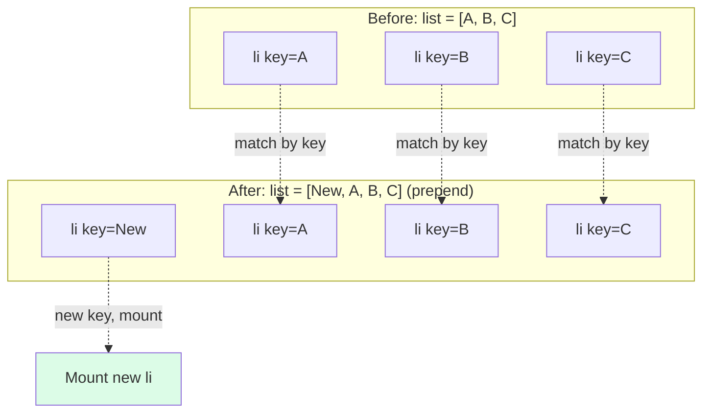
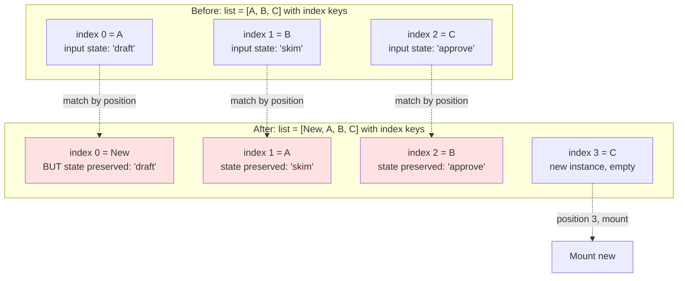
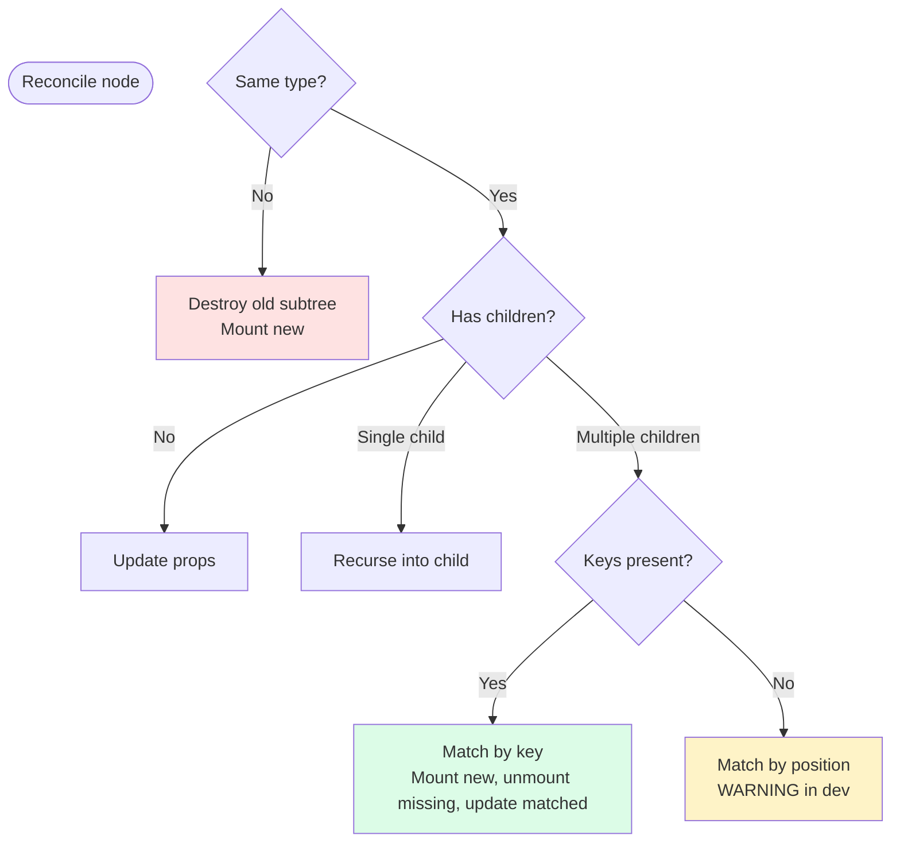

# 3.5 Lists and Keys

> React renders arrays of elements with `.map()`. The `key` prop tells React which item is which across renders. Get keys wrong and your UI appears to work — until a user reorders, inserts, or deletes, at which point state mysteriously migrates between items. This note explains the reconciliation algorithm, why `key` is the only special prop, what makes a good key, and why index-as-key is the single most common React bug.

## 3.5.1 Objective

By the end of this note you should be able to:

1. Render lists in JSX using `.map()` correctly.
2. Explain the reconciliation algorithm in enough detail to predict what React will do.
3. Define what makes a good `key` (stable, unique among siblings, related to the data).
4. Explain why index-as-key is usually wrong and exactly what breaks.
5. Identify when index keys are acceptable.
6. Articulate that `key` is special — you cannot read it inside the component.
7. Understand the spread-of-keys gotcha and how to avoid it.
8. Trace state preservation through a reordering example with and without proper keys.

## 3.5.2 Background Knowledge

Before reading further, make sure you are comfortable with:

- **`.map()`, `.filter()`, `.reduce()`** on JavaScript arrays — you'll use `.map()` constantly.
- **The render and reconcile phases** from [[3.1 JSX and Rendering]].
- **The fact that React elements are plain objects** with `type`, `props`, and `key`.
- **Component instances and state preservation** — a component "instance" persists across renders as long as React can match the same component at the same position.
- **`crypto.randomUUID()`** and other ID-generation strategies for the client.

## 3.5.3 Core Concepts

### 3.5.3.1 Rendering Arrays in JSX — The `.map()` Pattern

When you have an array of data and want to render an element per item, use `.map()`:

```jsx
function TodoList({ todos }) {
  return (
    <ul>
      {todos.map((todo) => (
        <li key={todo.id}>{todo.text}</li>
      ))}
    </ul>
  );
}
```

The `{...}` inside JSX accepts any expression that evaluates to a renderable value. An array of elements is renderable — React flattens it. So `{todos.map(...)}` produces an array of `<li>` elements, and React renders them in order.

You can also build the array separately:

```jsx
const items = todos.map(todo => <li key={todo.id}>{todo.text}</li>);
return <ul>{items}</ul>;
```

Both are equivalent. The inline form is more idiomatic.

### 3.5.3.2 Why Keys Are Required

When React re-renders a list, it has the previous array of elements and the new array. It needs to decide, for each new element, whether to:
- Reuse the previous DOM node and component instance (and just update props).
- Create a new DOM node.
- Remove an existing DOM node.

Without keys, React's default strategy is "match by position" — the first new item updates the first old item's node, etc. This works for static lists but breaks for reordering, inserting, and deleting because position alone doesn't tell React "this is the same item".

The `key` prop is React's solution. You give each item a stable identifier. React then matches by key: "the item with key='abc' is the same item as before; reuse its node and state."

Without a `key`, React warns:
> Warning: Each child in a list should have a unique "key" prop.

Even if React's default behavior works for your current case, the warning is telling you that you haven't been explicit. Always provide a key.

### 3.5.3.3 What Makes a Good Key

A good `key` has three properties:

1. **Stable.** The key for a given item must not change between renders. If it does, React treats it as a new item, throws away the old instance (and its state), and creates a new one. This destroys state and triggers unnecessary DOM work.

2. **Unique among siblings.** Two siblings can share a key with their cousins in a different list — keys only need to be unique within the same parent's children. So `key="1"` in two separate `<ul>`s is fine.

3. **Related to the data, not the position.** A database ID, a UUID, a slug, a hash of the content — anything that identifies "this is the same item" across renders. Never use the array index unless you've thought hard about it.

Examples of good keys:
- `todo.id` (database primary key)
- `user.uuid` (client-generated UUID stored with the item)
- `file.name + file.size` (a poor man's hash for a file list)
- `crypto.randomUUID()` assigned once when the item is created in client state

Examples of bad keys:
- `index` (the array index) — usually wrong, see below.
- `Math.random()` — generates a new key every render, defeating the purpose.
- `Date.now()` — same problem.
- A counter that increments per render — same problem.

### 3.5.3.4 Why Index-as-Key Is Usually Wrong

The index is the position, not the identity. It works only when:
1. The list is static (never reordered, inserted, or deleted).
2. Items have no internal state (just text or display-only data).

When either condition fails, index keys cause bugs:

**Reordering.** You have `["Apple", "Banana", "Cherry"]` rendered as `key={index}`. Each `<li>` has a child text input where the user typed notes. Now you reverse the array. The DOM nodes stay in place (React thinks "index 0 is still index 0"), but the underlying data shifted. The notes that belonged to "Apple" now appear next to "Cherry".

**Inserting at the front.** You prepend a new item. With index keys, every existing item shifts down by one index. React thinks "index 0 was Apple, now index 0 is New Item, so I'll update the first `<li>` to show New Item". But the `<li>` has internal state — the notes input — that belongs to "Apple". Now the first `<li>` shows "New Item" with "Apple"'s notes.

**Deleting.** You remove the middle item. Index 0 stays the same; index 1 now shows what was at index 2. State that belonged to the deleted item appears on the wrong item.

> [!danger] The classic index-key bug
> Build a list with a text input per item. Type into the second input. Now prepend a new item to the list. With index keys, the text you typed appears next to the new item, not next to the item you typed it for. This is a guaranteed bug and the reason every senior engineer repeats "never use index as key" like a mantra.

### 3.5.3.5 When Index Keys Are Acceptable

Index keys are tolerable only when **all** of these are true:

1. The list is static — never reordered, never inserted at non-end positions, never deleted.
2. Items have no internal state — no inputs, no animations, no refs.
3. The list is short and stable for the lifetime of the component.

A common acceptable case: rendering a list of static navigation links from a constant array. `NAV_ITEMS = [{label: "Home", href: "/"}, ...]` — these never change. `key={index}` is fine here, though `key={item.href}` is barely more typing and entirely safe.

When in doubt, use a real ID. The cost of generating one is negligible; the cost of a state-preservation bug is hours.

### 3.5.3.6 The `key` Prop Is Special

You cannot read `key` inside the component. It's reserved by React.

```jsx
function Item({ id, label }) {
  // `key` is NOT in this destructured object
  console.log(id, label);
  return <li>{label}</li>;
}

<Item key="abc" id="x" label="Hello" />
// Inside Item, props are { id: "x", label: "Hello" }. `key` is not there.
```

If you need the key value inside the component, pass it as a separate prop with a different name:

```jsx
<Item key={item.id} id={item.id} label={item.label} />
```

This is mildly redundant but unavoidable. React strips `key` from `props` before passing them in.

### 3.5.3.7 Keys Must Be Unique Among Siblings Only

```jsx
function App() {
  return (
    <div>
      <ul>
        {todos.map(t => <li key={t.id}>{t.text}</li>)}
      </ul>
      <ul>
        {doneTodos.map(t => <li key={t.id}>{t.text}</li>)}
      </ul>
    </div>
  );
}
```

If `todos` and `doneTodos` happen to share an ID (e.g., a done todo also appears in the undone list — that would be a data bug, but suppose), it's fine for keys because the two `<ul>`s are different parents. Keys are scoped to siblings within the same parent.

### 3.5.3.8 The Spread-of-Keys Gotcha

```jsx
function Items({ items }) {
  return items.map(item => <Item key={item.id} {...item} />);
}
```

Looks fine. But if `Item` is also given a `key` prop somewhere in `item` (say `item.key` exists), the spread will overwrite your `key`. Wait — actually no, React strips `key` from `props`, so even if `item.key` exists, it goes into `props.key` and is ignored.

But there's a subtler problem: if you spread an object that has a `key` property, ESLint's `react/jsx-key` rule might not warn you, and the spread silently provides the key (or doesn't, depending on order). Best practice: always pass `key` explicitly and don't include it in spread objects.

### 3.5.3.9 The Diffing Algorithm in Detail

React's reconciliation (the diffing algorithm) is based on two heuristics:

1. **Different types produce different trees.** If an element's `type` changes (e.g., `<div>`  -->  `<span>`, or `<CompA>`  -->  `<CompB>`), React tears down the old subtree and builds a new one. No reuse.

2. **Keys identify which children are which.** When children are arrays, React uses `key` to match old to new. Without keys, it matches by position.

The algorithm walks the tree top-down. At each level:

1. Compare the old element and the new element. If the `type` is the same, React keeps the same DOM node (or component instance) and updates the props. If different, React destroys the old and creates new.

2. For children:
   - If both old and new have a single child, React recurses.
   - If both have multiple children with keys, React matches by key. New keys not in old  -->  mount. Old keys not in new  -->  unmount. Same keys  -->  update (recurse into children).
   - If both have multiple children without keys, React matches by position.

The matching-by-key is the part that makes dynamic lists work. Without keys, the position-matching leads to the index-key bugs described above.

**Performance note.** React's diff is O(n) where n is the number of elements. Theoretical minimum is also O(n) for a general tree diff (proven by the literature). The "keys identify children" heuristic is what makes O(n) possible — without keys, you'd need O(n²) or worse.

### 3.5.3.10 How Keys Affect Component Instance (State Preservation)

```jsx
function Counter({ id }) {
  const [count, setCount] = useState(0);
  return <button onClick={() => setCount(c => c + 1)}>{id}: {count}</button>;
}

function List({ items }) {
  return items.map(item => <Counter key={item.id} id={item.id} />);
}
```

If `items` reorders, the `<Counter>` instances reorder with their keys. Each one keeps its own `count` state — because React matches by key, and the key follows the data.

With `key={index}`, reordering shuffles the data but keeps the same instances at the same positions. The counts stay where they are; the labels move. The user sees counts that don't match their labels.

> [!tip] Resetting state by changing the key
> You can intentionally change a component's `key` to force React to destroy and recreate it. This is a common pattern for resetting a form when the active record changes: `<EditForm key={activeId} id={activeId} />`. When `activeId` changes, the form unmounts and a fresh one mounts with empty state.

## 3.5.4 Detailed Walkthrough

Let's trace reconciliation with and without proper keys.

**Setup.** A list of todos with a text input per item, allowing the user to type notes:

```jsx
function Todo({ todo, onChange }) {
  const [note, setNote] = useState("");
  return (
    <li>
      {todo.text}
      <input value={note} onChange={(e) => setNote(e.target.value)} placeholder="note" />
    </li>
  );
}

function TodoList({ todos }) {
  return (
    <ul>
      {todos.map((t, i) => (
        <Todo key={i} todo={t} />   // BAD — index keys
      ))}
    </ul>
  );
}

// Initial state:
const todos = [
  { id: "a", text: "Write" },
  { id: "b", text: "Read" },
  { id: "c", text: "Review" },
];
```

User types "draft" into Write's input, "skim" into Read's input, "approve" into Review's input. The state looks like:

| Index | Todo | Input state |
|---|---|---|
| 0 | Write | "draft" |
| 1 | Read | "skim" |
| 2 | Review | "approve" |

Now the user prepends a new todo "Plan". `todos` becomes:

```js
[
  { id: "new", text: "Plan" },
  { id: "a", text: "Write" },
  { id: "b", text: "Read" },
  { id: "c", text: "Review" },
]
```

**With index keys (BAD):** React matches by position.
- Index 0: was "Write" (input "draft"), now "Plan". React reuses the same `<Todo>` instance, updates `todo` prop to `{id:"new", text:"Plan"}`, but the input state "draft" persists. The user sees "Plan" with "draft" in the input.
- Index 1: was "Read" (input "skim"), now "Write". Same instance, `todo` updated, input still "skim".
- Index 2: was "Review" (input "approve"), now "Read". Same instance, input still "approve".
- Index 3: was nothing, now "Review". New instance, empty input.

The user sees: "Plan" + "draft", "Write" + "skim", "Read" + "approve", "Review" + empty. Every note is attached to the wrong todo.

**With proper keys (`key={t.id}`):** React matches by key.
- Key "new": not in old list. Mount new `<Todo>`. Input empty.
- Key "a": same as old index 0. Reuse instance. `todo` prop unchanged. Input "draft" stays.
- Key "b": same as old index 1. Reuse instance. Input "skim" stays.
- Key "c": same as old index 2. Reuse instance. Input "approve" stays.

The user sees: "Plan" + empty, "Write" + "draft", "Read" + "skim", "Review" + "approve". Correct.

The DOM mutations: with proper keys, React inserts one new `<li>` at the front and keeps the other three in place. With index keys, React updates the props of all four `<li>`s (and reorders nothing). The index-key path is "less DOM work" but "more user-visible bug" — a perfect illustration of why minimizing DOM mutations is not the goal. Correctness is.

## 3.5.5 Practical Examples

### 3.5.5.1 Standard list with database IDs

```jsx
function UserList({ users }) {
  return (
    <ul>
      {users.map(u => (
        <li key={u.id}>
          <Avatar src={u.avatar} />
          {u.name}
        </li>
      ))}
    </ul>
  );
}
```

### 3.5.5.2 Generating IDs for client-only items

When items don't have natural IDs (e.g., created client-side), generate one once:

```jsx
import { useState } from "react";

let nextId = 1;
function makeTodo(text) {
  return { id: nextId++, text, done: false };
}

function TodoApp() {
  const [todos, setTodos] = useState([makeTodo("Initial")]);

  const add = (text) => setTodos(prev => [...prev, makeTodo(text)]);
  const toggle = (id) => setTodos(prev => prev.map(t => t.id === id ? { ...t, done: !t.done } : t));

  return (
    <ul>
      {todos.map(t => (
        <li key={t.id}>
          <input type="checkbox" checked={t.done} onChange={() => toggle(t.id)} />
          {t.text}
        </li>
      ))}
    </ul>
  );
}
```

For production, use `crypto.randomUUID()` instead of a module-level counter — it avoids collisions across tabs and reloads.

### 3.5.5.3 Resetting state via key

```jsx
function Editor({ records }) {
  const [activeId, setActiveId] = useState(records[0].id);
  const active = records.find(r => r.id === activeId);

  return (
    <div>
      <nav>
        {records.map(r => (
          <button key={r.id} onClick={() => setActiveId(r.id)}>{r.title}</button>
        ))}
      </nav>
      <EditForm key={active.id} initial={active} />
    </div>
  );
}
```

When `activeId` changes, `<EditForm>` gets a new `key`, so React unmounts the old instance (with its dirty form state) and mounts a fresh one initialized from the new `active`. This is a clean way to "reset" a component without explicitly clearing state.

### 3.5.5.4 Fragments with keys

When each item produces multiple top-level nodes, use `<Fragment key={...}>`:

```jsx
import { Fragment } from "react";

function Glossary({ items }) {
  return (
    <dl>
      {items.map(item => (
        <Fragment key={item.id}>
          <dt>{item.term}</dt>
          <dd>{item.definition}</dd>
        </Fragment>
      ))}
    </dl>
  );
}
```

The short `<>` syntax doesn't accept `key`. Use `<Fragment>` (imported from `react`) when you need a key.

### 3.5.5.5 Filtered list preserves state

```jsx
function SearchableList({ items }) {
  const [query, setQuery] = useState("");
  const filtered = items.filter(i => i.label.includes(query));
  return (
    <ul>
      {filtered.map(item => <Item key={item.id} item={item} />)}
    </ul>
  );
}
```

As the user types, items appear and disappear from the filtered list. With proper keys, items that remain keep their state; items that get filtered out unmount; items that reappear remount fresh. This is exactly what you want.

## 3.5.6 Mermaid Diagrams

### 3.5.6.1 Reconciliation With and Without Proper Keys



With proper keys, React matches existing items by their key and only mounts the one new item. State is preserved on A, B, C.

### 3.5.6.2 Index Keys — The Bug



With index keys, React matches by position. The state attached to A, B, C now appears next to New, A, B — every input shows the wrong note.

### 3.5.6.3 The Diffing Algorithm



## 3.5.7 Common Mistakes

1. **Using `index` as key for dynamic lists.** Causes state-preservation bugs on reorder/insert/delete. Use a stable ID.

2. **Using `Math.random()` or `Date.now()` as key.** Generates a new key every render. React unmounts and remounts every item on every render — destroys state, kills performance.

3. **Generating IDs inside `.map()`.** `items.map(item => <Li key={Math.random()} />)` — see above. Generate IDs once when the item is created.

4. **Using a value that changes as key.** `key={todo.text}` — when the user edits the text, the key changes, React unmounts and remounts. Use `todo.id`.

5. **Forgetting the key entirely.** React warns in dev and falls back to position-matching. Always provide a key.

6. **Trying to read `key` inside the component.** `function Comp({ key }) { ... }` — `key` is stripped from props. Pass the value as a separate prop with a different name.

7. **Using the same key in two different lists and expecting a problem.** Keys are scoped to siblings. Two `<ul>`s can both use `key="a"` for their respective first items.

8. **Spreading an object that has a `key` property.** `<Item {...obj} />` where `obj.key = "x"` — React strips it, but it's confusing. Be explicit.

9. **Expecting `key` to fix all performance problems.** Keys are about correctness first, performance second. A bad key doesn't slow things down — it causes wrong UI.

10. **Using `<></>` (short Fragment) inside `.map()` and trying to add a key.** Short fragments don't accept props. Use `<Fragment key={...}>`.

## 3.5.8 Best Practices

1. **Always pass a stable, unique ID as `key`.** Database IDs, UUIDs, or generated IDs.

2. **Generate IDs once, when items are created.** Store them alongside the data. Use `crypto.randomUUID()` in modern browsers.

3. **Reserve index keys for truly static lists.** Even then, prefer a content-derived key.

4. **Use `<Fragment key={...}>` when an item produces multiple top-level nodes.**

5. **Use changing `key` to intentionally reset a component's state.** `<Form key={recordId} />` unmounts and remounts when `recordId` changes — a clean reset.

6. **Don't include `key` in spread objects.** Pass it explicitly.

7. **Make sure your data model has IDs.** If you're rendering a list of items from an API, they should have IDs. If not, add them client-side on receipt.

8. **Run ESLint with `react/jsx-key`.** Catches missing keys at lint time.

9. **When filtering or sorting, the same items keep their keys.** The IDs travel with the data. Don't recompute keys based on filter position.

10. **For very long lists, consider virtualization.** `react-window` or `react-virtual` render only the visible items. Keys still matter — they help the virtualizer track which items are visible.

## 3.5.9 Mini Exercises

### Exercise 1 — Render a list with proper keys

Given:

```js
const books = [
  { isbn: "978-1", title: "Refactoring", author: "Fowler" },
  { isbn: "978-2", title: "Clean Code", author: "Martin" },
  { isbn: "978-3", title: "DDD", author: "Evans" },
];
```

Render this as a table with one row per book. Use a stable key.

**Solution.**

```jsx
function BookTable({ books }) {
  return (
    <table>
      <thead>
        <tr><th>Title</th><th>Author</th></tr>
      </thead>
      <tbody>
        {books.map(b => (
          <tr key={b.isbn}>
            <td>{b.title}</td>
            <td>{b.author}</td>
          </tr>
        ))}
      </tbody>
    </table>
  );
}
```

**Reasoning.** `isbn` is a stable identifier tied to the book, not the table position. If the user reorders the table, sorts by author, or filters, the same book keeps its key, so React reuses the same `<tr>` DOM node (and any state on it). If we'd used `key={index}`, reordering would shuffle state.

**Common wrong approach.** `key={b.title}` — works until two books have the same title, or until the user edits the title (then the key changes and React unmounts the row). Use the ID, not a content field that could change or collide.

### Exercise 2 — Diagnose the index-key bug

A user reports: "When I add a new todo at the top of my list, the notes I typed into existing todos shift down." Diagnose and fix.

```jsx
function TodoList({ todos, addTodo }) {
  return (
    <div>
      <button onClick={() => addTodo({ text: "New" })}>Add</button>
      <ul>
        {todos.map((t, i) => (
          <li key={i}>
            {t.text}
            <NoteInput id={t.id} />
          </li>
        ))}
      </ul>
    </div>
  );
}
```

**Solution.**

```jsx
function TodoList({ todos, addTodo }) {
  return (
    <div>
      <button onClick={() => addTodo({ id: crypto.randomUUID(), text: "New" })}>Add</button>
      <ul>
        {todos.map(t => (
          <li key={t.id}>
            {t.text}
            <NoteInput id={t.id} />
          </li>
        ))}
      </ul>
    </div>
  );
}
```

**Reasoning.** The bug was `key={i}`. When a new item is prepended, every existing item's index shifts by one. React matches by position (since no real key was given), so the new item takes over the first `<li>` (with the first note's state), the old first item takes the second `<li>` (with the second note's state), and so on. Fix: use `t.id` as the key, and ensure every todo has a stable ID by generating one at creation time (`crypto.randomUUID()`).

**Common wrong approach.** Adding `key={i + Math.random()}` — generates new keys every render, destroys all state. Or using `key={t.text}` — breaks when two todos have the same text or when text is edited.

### Exercise 3 — Reset form state with key

Build an editor with a list of records on the left and a form on the right. When the user clicks a different record, the form should reset to that record's data (discarding any unsaved edits).

**Solution.**

```jsx
import { useState } from "react";

function EditForm({ record }) {
  const [title, setTitle] = useState(record.title);
  const [body, setBody] = useState(record.body);
  return (
    <form onSubmit={(e) => { e.preventDefault(); save({ ...record, title, body }); }}>
      <input value={title} onChange={(e) => setTitle(e.target.value)} />
      <textarea value={body} onChange={(e) => setBody(e.target.value)} />
      <button type="submit">Save</button>
    </form>
  );
}

function Editor({ records }) {
  const [activeId, setActiveId] = useState(records[0].id);
  const active = records.find(r => r.id === activeId);
  return (
    <div style={{ display: "flex" }}>
      <nav>
        {records.map(r => (
          <button key={r.id} onClick={() => setActiveId(r.id)}>
            {r.title}
          </button>
        ))}
      </nav>
      <main>
        <EditForm key={active.id} record={active} />
      </main>
    </div>
  );
}
```

**Reasoning.** `key={active.id}` is the crucial bit. When `activeId` changes, `EditForm` gets a new key. React unmounts the old form (with its dirty local state) and mounts a new one initialized from the new `active` record. The form's `useState(record.title)` and `useState(record.body)` run fresh. Without the key, the form would keep its old state across record switches (because it's the same component instance at the same position).

**Common wrong approach.** Adding a `useEffect` to sync `title` and `body` to the new `record` whenever `record.id` changes. Works but is fragile — you're manually replicating what `key` does for free. The `key` approach is the React-idiomatic way to reset state.

### Exercise 4 — Explain why keys are scoped to siblings

Two lists use the same IDs. Why doesn't this cause a problem?

```jsx
function App({ active, archived }) {
  return (
    <div>
      <h2>Active</h2>
      <ul>{active.map(t => <li key={t.id}>{t.text}</li>)}</ul>
      <h2>Archived</h2>
      <ul>{archived.map(t => <li key={t.id}>{t.text}</li>)}</ul>
    </div>
  );
}
```

**Model answer.**

Keys are scoped to siblings within the same parent. Each `<ul>` is a separate parent; the `<li>`s inside it are siblings only to each other. When React reconciles the first `<ul>`, it looks at the keys of its children only: the active todos. When it reconciles the second `<ul>`, it looks at the keys of its children only: the archived todos. The two `<ul>`s never compare their children's keys against each other, so a duplicate key like "abc" in both lists is fine.

This scoping makes sense if you think about how React walks the tree: it recurses into each child independently. At each node, the children's keys only need to disambiguate among themselves. The parent is responsible for its own children's uniqueness; it doesn't care about the keys in cousin subtrees.

The only constraint is: within the same parent, no two children may share a key (or React warns and may misbehave). If you had `<li key="x">` and `<li key="x">` as siblings in the same `<ul>`, that's a bug. But the same `"x"` in two different `<ul>`s is fine.

**Common wrong answer.** "Keys must be globally unique across the whole app." False. They only need to be unique among siblings. This is a frequent misconception.

### Exercise 5 — Generate stable IDs for client-side items

You have an "Add Task" button that creates new tasks client-side. No backend. Show how to generate stable IDs that survive re-renders.

**Solution.**

```jsx
import { useState } from "react";

function newId() {
  return crypto.randomUUID();  // Modern browsers; Node 19+
}

function TaskApp() {
  const [tasks, setTasks] = useState([
    { id: newId(), text: "Initial task" },
  ]);

  const add = () => {
    setTasks(prev => [...prev, { id: newId(), text: "" }]);
  };
  const update = (id, text) => {
    setTasks(prev => prev.map(t => t.id === id ? { ...t, text } : t));
  };
  const remove = (id) => {
    setTasks(prev => prev.filter(t => t.id !== id));
  };

  return (
    <div>
      <button onClick={add}>Add Task</button>
      <ul>
        {tasks.map(t => (
          <li key={t.id}>
            <input
              value={t.text}
              onChange={(e) => update(t.id, e.target.value)}
            />
            <button onClick={() => remove(t.id)}>x</button>
          </li>
        ))}
      </ul>
    </div>
  );
}
```

**Reasoning.** `crypto.randomUUID()` produces a UUID v4 string like `"3f8c2b1e-..."`. It's globally unique with overwhelming probability, so even across reloads/tabs you won't collide. The ID is generated **once**, when the task is created, and stored in the task object. Re-renders don't regenerate it. The key `t.id` is stable across renders.

For older environments without `crypto.randomUUID`, use a library like `nanoid` or a polyfill. Avoid `Math.random()` for production IDs because collisions are possible (and a collision means a key warning and possibly state-preservation bugs).

**Common wrong approaches.**
- `key={index}` — breaks on reorder/remove (see Exercise 2).
- `key={Date.now()}` — same value for items created in the same millisecond, plus changes every render.
- `key={Math.random()}` — new value every render, destroys all state.
- `key={t.text}` — breaks if two tasks have the same text or if the text is being edited (key changes mid-edit).

## 3.5.10 Summary

- Render arrays of elements with `.map()` inside JSX.
- The `key` prop tells React which item is which across renders. Always provide one.
- Good keys are stable, unique among siblings, and tied to the data (database ID, UUID).
- Index-as-key is usually wrong — it causes state-preservation bugs on reorder, insert, delete.
- Index keys are acceptable only for static, stateless, never-reordered lists.
- `key` is special: React strips it from props; you can't read it inside the component.
- Keys are scoped to siblings within the same parent — the same key in two different lists is fine.
- The diffing algorithm: same type  -->  recurse; different type  -->  destroy and remount; children matched by key when present, by position otherwise.
- You can intentionally change a key to reset a component's state — useful for "fresh form on record switch" patterns.

## 3.5.11 Related Notes

- [[3.1 JSX and Rendering]] — the rendering pipeline that keys fit into.
- [[3.2 Components and Props]] — components as the unit of reconciliation.
- [[3.3 State and Events]] — component instance state that keys preserve.
- [[3.4 Forms and Conditional Rendering]] — forms with dynamic field lists.
- [[3.6 Hooks (Built-In)]] — `useState` is the state that keys protect.
- [[3.11 Performance Optimization]] — virtualization of long lists, `React.memo` interactions.
- [[3.14 Reusable Component Design]] — designing list-item components that consumers can key correctly.
